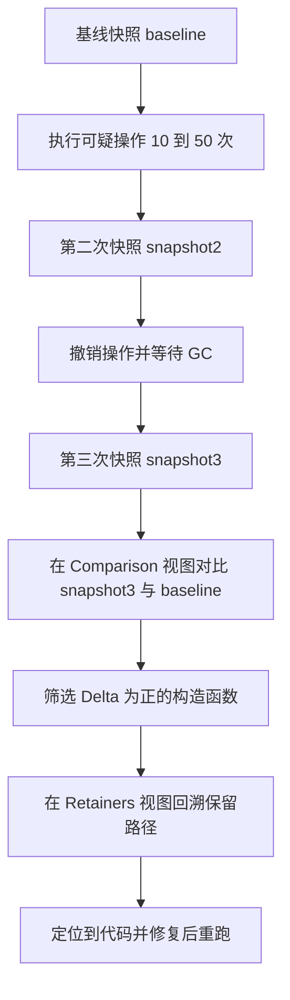

# WeakMap、WeakRef 与内存泄漏排查

!!! abstract "核心结论"

- 弱引用不参与"从 GC Roots 出发的可达性"判定：WeakMap 的键、WeakRef 的目标一旦没有强引用，对应记录会被引擎在弱引用处理阶段清除，不依赖引用计数，也不需要定时器。
- WeakMap 的语义是 ephemeron（键值不对称可达）：只有键被外部强引用时，值才被认为是可达的，因此"值反向引用键"不会造成泄漏；但值本身是被强引用的，别把 WeakMap 当成"键和值都弱"。
- WeakRef 与 FinalizationRegistry 的结果是不确定的：deref 何时返回 undefined、finalizer 何时被调用由引擎和宿主调度决定，只能用于缓存与观测，不能作为资源释放的唯一保证。
- 绝大多数所谓"内存泄漏"不是内存没被回收，而是存在一条从 GC Roots 到对象的意外强引用路径；排查的核心动作是找到 retainers（保留者）。
- 缓存类泄漏的主要原因是 Map/数组强引用了长生命周期的键（DOM 节点、组件实例、请求上下文），解决方案是 WeakMap、容量上界、TTL 三者之一或组合。

## 1. 弱引用的语义与引擎实现

### 1.1 GC 可达性与强引用的定义

现代 JS 引擎（V8、JavaScriptCore、SpiderMonkey）都使用追踪式 GC（tracing GC），而不是引用计数。判定对象死活的方式是：从一组 GC Roots 出发，沿强引用边做可达性传播，传播结束后仍未被标记的对象即为垃圾。

GC Roots 包含但不限于：全局对象、当前活跃执行栈上的局部变量与寄存器、引擎内部的活跃表（如正在被 FinalizationRegistry 处理的 BeingFinalized 列表）、活跃的原生句柄（v8::Global、DOM 包装器等）。弱引用（weak edge）不进根集，也不参与传播的主循环，这是弱语义的全部基础。

V8 的主回收器 Mark-Compact 使用三色标记：

- white：尚未被访问，标记结束时仍为 white 的即垃圾。
- grey：已被发现、但其出边尚未扫描。
- black：已扫描完毕。

### 1.2 Ephemeron：WeakMap 不是"弱引用的 Map"

如果只把 WeakMap 的键设为弱边、值是普通强边，就会得到一个错误结果：`wm.set(k, v)` 且 `v.k = k` 时，v 从键可达、键从 v 可达，两者都"看起来可达"。因此规范采用的是 ephemeron 语义：

- 键是弱的：键不被外部强引用时，键可以被回收。
- 值是条件可达的：**仅当键通过其他强引用路径可达时**，值才可达。

实现方式是不动点迭代。简化伪代码如下：

```text
// 第一阶段：普通强引用的标记传播
mark(roots)
while worklist 非空:
  obj = worklist.pop()
  for edge in obj.outgoingEdges():
    if edge is weak:        // 弱边先记录下来，不传播
      weakEdges.push(edge)
    else if edge.target not marked:
      marked.add(edge.target); worklist.push(edge.target)

// 第二阶段：ephemeron 不动点迭代
changed = true
while changed:
  changed = false
  for (key, value) in ephemeronTables:
    if key in marked and value not in marked:
      mark(value)          // 值可达后其出边也要继续传播
      changed = true

// 第三阶段：弱引用处理，未标记的键值对整条记录清除
for edge in weakEdges:
  if edge.target not marked: clearEdge(edge)
```

第二阶段的朴素实现是每轮全表扫描，实际引擎会用 worklist 化的 ephemeron 队列避免 O(表大小) 的重复扫描。WeakRef 与 FinalizationRegistry 的处理时机同样落在"标记之后、清扫与压缩之前"：V8 在 Mark-Compact 中有专门的弱引用处理阶段（`ProcessWeakReferences` 一类步骤）；Scavenger（新生代复制式回收，Cheney 算法）也需要在复制过程中处理 ephemeron，因为转发地址会在复制中变化。

### 1.3 确定性边界

需要区分"规范保证"和"实现相关"：

| 行为 | 是否由规范保证 | 说明 |
| --- | --- | --- |
| 弱键被回收后表项不可读 | 保证 | 键不会通过 WeakMap 被"复活" |
| deref 在同一个 job 内结果稳定 | 保证 | deref 返回非 undefined 会把目标加入 KeptAlive，job 结束后才允许清除 |
| finalizer 一定被调用 | 不保证 | 引擎可在进程退出或其他时机直接丢弃待处理回调 |
| finalizer 回调的时机与顺序 | 不保证 | 不能做顺序依赖 |
| unregister 对已回收目标的行为 | 保证 | 返回 false，不抛异常 |
| 弱引用处理的具体阶段名与函数名 | 实现相关 | 随 V8 版本变化，需核对官方文档 |

同一同步执行块内 deref 结果稳定这一点在实践中非常重要：`const ref = new WeakRef(o); ref.deref(); o = null; ref.deref()` 在同一个同步块里第二次仍返回对象。规范层面是 KeptAlive 列表加 job 结束时的 ClearKeptObjects；"job 边界"精确到 microtask 还是 macrotask，取决于宿主（浏览器 HTML 规范与 Node 事件循环）的 job 定义，需核对官方文档。

## 2. API 语义与边界

### 2.1 WeakMap 与 WeakSet

WeakMap 只有 `get/set/has/delete`，没有 `size`、`keys`、`forEach`、`clear`。键必须是对象（ES2023 起非注册 symbol 也可作为弱键，具体引擎版本行为需核对官方文档；`Symbol.for` 注册的 symbol 存在于全局注册表，不可能是弱键）。WeakSet 只有 `add/has/delete`。

```js
const wm = new WeakMap();
const key = {};
wm.set(key, 'v');
console.assert(wm.get(key) === 'v');
console.assert(wm.size === undefined);
console.assert(typeof wm.forEach === 'undefined');

const ws = new WeakSet();
const node = {};
ws.add(node);
console.assert(ws.has(node) === true);
// 预期输出: 无（所有断言通过）
```

### 2.2 WeakRef

`new WeakRef(target)` 只能以对象为目标，`deref()` 返回对象或 undefined。它不是"能自动释放的指针"，只是一个可观测的弱句柄。

```js
let target = { id: 1 };
const ref = new WeakRef(target);
console.assert(ref.deref() === target);
target = null; // 丢掉强引用；何时变为 undefined 由 GC 决定
// WeakRef 规范规定：deref() 成功返回的目标在当前同步任务结束前不会被回收（KeepDuringJob），
// 因此同一个同步任务里 deref() 一定仍是对象；只有在之后的任务中才可能变成 undefined
console.assert(typeof ref.deref() === 'object');
// 预期输出: 无
```

### 2.3 FinalizationRegistry

`register(target, heldValue, unregisterToken)`：heldValue 是强引用，会被保存在注册表的 cell 中；unregisterToken 必须是对象，用于 `unregister(token)`。回调接收 heldValue，不接收 target。

```js
const freed = [];
const registry = new FinalizationRegistry((heldValue) => freed.push(heldValue));
const token = {};
registry.register({ id: 1 }, 'obj-1', token);
console.assert(registry.unregister(token) === true);  // 注销成功
console.assert(registry.unregister(token) === false); // 重复注销返回 false
// 预期输出: 无
```

## 3. 手写实现

以下代码运行环境为 Node.js 18+（需要 class 私有字段、WeakRef、FinalizationRegistry），浏览器端现代环境同样可运行。

### 3.1 基于 WeakMap 的私有数据

设计要点：数据放在模块级 WeakMap 中，实例上不留任何字段，因此实例可以被 `Object.freeze`，序列化（JSON.stringify）也不会泄漏内部状态。代价是每个实例多一次哈希查找，且无法用 `Object.getOwnPropertyNames` 反射出来。

```js
// 文件: private-data.js
'use strict';
const assert = require('node:assert/strict');

const PRIVATE = new WeakMap(); // 模块级，外部不可见

class Counter {
  constructor(start = 0) {
    PRIVATE.set(this, { count: start, history: [] });
    Object.freeze(this); // 实例上没有数据字段，因此可以冻结
  }

  inc(step = 1) {
    const state = PRIVATE.get(this);
    if (state === undefined) throw new TypeError('必须由 new 构造');
    state.count += step;
    state.history.push(state.count);
    return state.count;
  }

  get value() {
    const state = PRIVATE.get(this);
    if (state === undefined) throw new TypeError('必须由 new 构造');
    return state.count;
  }

  snapshot() {
    const state = PRIVATE.get(this);
    return { count: state.count, history: state.history.slice() };
  }
}

// 验证标准
const c = new Counter(10);
assert.equal(c.inc(5), 15);
assert.equal(c.value, 15);
assert.deepEqual(c.snapshot(), { count: 15, history: [15] });
assert.equal(Object.getOwnPropertyNames(c).length, 0);
assert.throws(() => Counter.prototype.inc.call({}), /必须由 new 构造/);
console.log('3.1 private data ok');
```

预期输出：`3.1 private data ok`

### 3.2 基于 WeakMap 的派生缓存

设计要点：只缓存对象与函数参数，原始值直接透传。用 `{ value }` 包一层，这样即使函数返回 undefined 也能区分"命中且值为 undefined"和"未命中"。

```js
// 文件: weak-memoize.js
'use strict';
const assert = require('node:assert/strict');

const isWeakKey = (v) =>
  (typeof v === 'object' && v !== null) || typeof v === 'function';

function weakMemoize(fn) {
  const cache = new WeakMap();
  return function memoized(key) {
    if (!isWeakKey(key)) return fn(key);
    if (!cache.has(key)) cache.set(key, { value: fn(key) });
    return cache.get(key).value;
  };
}

// 验证标准
const calls = [];
const double = weakMemoize((o) => { calls.push(o.n); return o.n * 2; });

const a = { n: 21 };
assert.equal(double(a), 42);
assert.equal(double(a), 42);
assert.deepEqual(calls, [21], '同一个对象只计算一次');

const b = { n: 21 };
assert.equal(double(b), 42);
assert.deepEqual(calls, [21, 21], '不同对象即使结构相同也各算一次');

assert.equal(double(5), 10);
assert.equal(double(5), 10);
assert.deepEqual(calls, [21, 21], '原始值不进入缓存');
console.log('3.2 weak memoize ok');
```

预期输出：`3.2 weak memoize ok`

### 3.3 LRU 缓存

设计要点：LRU 必须能枚举并淘汰"最久未使用"的条目，而 WeakMap 不可枚举、没有插入序，所以 LRU 的存储结构只能是 Map 或双向链表加哈希。这里用 Map 的插入序遍历保序，命中时先 delete 再 set 完成"提升为最近使用"，淘汰时取 `keys().next().value`。

```js
// 文件: lru-cache.js
'use strict';
const assert = require('node:assert/strict');

class LRUCache {
  #capacity;
  #map = new Map(); // 插入序：最久未使用在前，最近使用在后

  constructor(capacity) {
    if (!Number.isInteger(capacity) || capacity <= 0) {
      throw new TypeError('capacity 必须是正整数');
    }
    this.#capacity = capacity;
  }

  get size() { return this.#map.size; }
  has(key) { return this.#map.has(key); }

  get(key) {
    if (!this.#map.has(key)) return undefined;
    const value = this.#map.get(key);
    this.#map.delete(key); // 重新插入以刷新插入序
    this.#map.set(key, value);
    return value;
  }

  set(key, value) {
    if (this.#map.has(key)) this.#map.delete(key);
    this.#map.set(key, value);
    while (this.#map.size > this.#capacity) {
      const oldest = this.#map.keys().next().value;
      this.#map.delete(oldest);
    }
    return this;
  }

  keys() { return Array.from(this.#map.keys()); }
}

// 验证标准
const lru = new LRUCache(3);
lru.set('a', 1).set('b', 2).set('c', 3);
assert.deepEqual(lru.keys(), ['a', 'b', 'c']);

assert.equal(lru.get('a'), 1);       // a 变成最近使用
assert.deepEqual(lru.keys(), ['b', 'c', 'a']);

lru.set('d', 4);                     // 容量超限，淘汰 b
assert.equal(lru.has('b'), false);
assert.deepEqual(lru.keys(), ['c', 'a', 'd']);
assert.equal(lru.size, 3);

assert.equal(lru.get('c'), 3);
assert.equal(lru.get('d'), 4);
assert.equal(lru.get('x'), undefined);
assert.throws(() => new LRUCache(0), /capacity 必须是正整数/);
console.log('3.3 lru cache ok');
```

预期输出：`3.3 lru cache ok`

### 3.4 带 TTL 的弱键缓存（WeakMap + FinalizationRegistry）

设计要点：WeakMap 无法遍历，所以需要一个"可遍历的弱键集合"来做过期清扫。做法是用 `Map<WeakRef(key), WeakRef(key)>` 保存 WeakRef 对象本身（WeakRef 对象很小，强引用它不会阻止目标回收），并用 FinalizationRegistry 在键被回收时删除记录。

```js
// 文件: weak-ttl-cache.js
'use strict';
const assert = require('node:assert/strict');

const isWeakKey = (v) =>
  (typeof v === 'object' && v !== null) || typeof v === 'function';

class WeakTtlCache {
  #store = new WeakMap();   // key -> { value, expireAt }
  #tokens = new WeakMap();  // key -> WeakRef(key)，用于注销 finalizer
  #refs = new Map();        // WeakRef(key) -> 同一个 WeakRef，可遍历的弱键集合
  #timer = null;
  #finalizer;

  constructor({ ttl, sweepInterval = 1000, now = Date.now } = {}) {
    if (!(typeof ttl === 'number' && ttl > 0)) throw new TypeError('ttl 必须是正数');
    this.ttl = ttl;
    this.sweepInterval = sweepInterval;
    this.now = now;
    this.#finalizer = new FinalizationRegistry((ref) => {
      // 键已被回收：只需清掉可遍历集合里的记录，值随 WeakMap 一起消失
      this.#refs.delete(ref);
    });
  }

  get size() { return this.#refs.size; }

  #drop(key) {
    this.#store.delete(key);
    const ref = this.#tokens.get(key);
    if (ref === undefined) return;
    this.#finalizer.unregister(ref);
    this.#refs.delete(ref);
    this.#tokens.delete(key);
  }

  set(key, value) {
    if (!isWeakKey(key)) throw new TypeError('key 必须是对象或函数');
    this.#drop(key); // 覆盖旧值时先清掉旧 token
    this.#store.set(key, { value, expireAt: this.now() + this.ttl });
    const ref = new WeakRef(key);
    this.#tokens.set(key, ref);
    this.#refs.set(ref, ref);
    this.#finalizer.register(key, ref, ref);
    this.#ensureTimer();
    return value;
  }

  get(key) {
    if (!isWeakKey(key)) return undefined;
    const entry = this.#store.get(key);
    if (entry === undefined) return undefined;
    if (entry.expireAt <= this.now()) { this.#drop(key); return undefined; }
    return entry.value;
  }

  has(key) {
    if (!isWeakKey(key)) return false;
    const entry = this.#store.get(key);
    return entry !== undefined && entry.expireAt > this.now();
  }

  delete(key) {
    if (!isWeakKey(key)) return false;
    const existed = this.#store.has(key);
    this.#drop(key);
    return existed;
  }

  sweep() {
    const t = this.now();
    let removed = 0;
    for (const ref of this.#refs.values()) {
      const key = ref.deref();
      if (key === undefined) { this.#refs.delete(ref); continue; }
      const entry = this.#store.get(key);
      if (entry !== undefined && entry.expireAt <= t) {
        this.#store.delete(key);
        this.#tokens.delete(key);
        this.#finalizer.unregister(ref);
        this.#refs.delete(ref);
        removed++;
      }
    }
    return removed;
  }

  dispose() {
    if (this.#timer !== null) { clearInterval(this.#timer); this.#timer = null; }
  }

  #ensureTimer() {
    if (this.#timer !== null || this.sweepInterval <= 0) return;
    this.#timer = setInterval(() => this.sweep(), this.sweepInterval);
    if (typeof this.#timer.unref === 'function') this.#timer.unref(); // Node 下不阻止进程退出
  }
}

// 验证标准：用注入的假时钟保证确定性
let clock = 1_000_000;
const cache = new WeakTtlCache({ ttl: 100, sweepInterval: 60000, now: () => clock });
const k1 = { id: 1 };
const k2 = { id: 2 };

cache.set(k1, 'A');
cache.set(k2, 'B');
assert.equal(cache.get(k1), 'A');
assert.equal(cache.size, 2);

clock += 50;
assert.equal(cache.has(k1), true, '未过期');

clock += 51;                                  // 两条都已过期
assert.equal(cache.get(k1), undefined, 'get 惰性判定过期');
assert.equal(cache.has(k2), false, 'has 不写 store，但会判定过期');
assert.equal(cache.sweep(), 1, 'sweep 清掉仍在 store 里的 k2');
assert.equal(cache.size, 0);

const k3 = { id: 3 };
cache.set(k3, 'C');
assert.equal(cache.sweep(), 0, '未到期条目不会被误删');
clock += 101;
assert.equal(cache.sweep(), 1);
assert.equal(cache.size, 0);

cache.dispose();
console.log('3.4 weak ttl cache ok');
```

预期输出：`3.4 weak ttl cache ok`

### 3.5 事件总线（自动解绑）

设计要点：订阅记录里只放 `WeakRef(owner)` 与 `WeakRef(handler)`，channel 用强引用保存订阅记录；owner 被回收时由 FinalizationRegistry 把订阅从 channel 里摘掉。关键约束是 heldValue（这里是每个 owner 的订阅集合）绝不能引用 owner 本身。

```js
// 文件: event-bus.js
'use strict';
const assert = require('node:assert/strict');

const isWeakKey = (v) =>
  (typeof v === 'object' && v !== null) || typeof v === 'function';

class EventBus {
  #channels = new Map();    // event -> Set<Subscription>
  #byOwner = new WeakMap(); // owner -> Set<Subscription>
  #finalizer;

  constructor() {
    this.#finalizer = new FinalizationRegistry((subs) => {
      for (const sub of subs) this.#remove(sub); // owner 已死，逐个摘除
    });
  }

  on(owner, event, handler, { once = false } = {}) {
    if (!isWeakKey(owner)) throw new TypeError('owner 必须是对象');
    if (typeof handler !== 'function') throw new TypeError('handler 必须是函数');

    const sub = {
      event,
      once,
      handlerRef: new WeakRef(handler),
      ownerRef: new WeakRef(owner),
    };

    let channel = this.#channels.get(event);
    if (channel === undefined) { channel = new Set(); this.#channels.set(event, channel); }
    channel.add(sub);

    let subs = this.#byOwner.get(owner);
    if (subs === undefined) {
      subs = new Set();
      this.#byOwner.set(owner, subs);
      // heldValue 只含 WeakRef，不引用 owner，否则 owner 永远不会被回收
      this.#finalizer.register(owner, subs, owner);
    }
    subs.add(sub);
    return () => this.#remove(sub);
  }

  emit(event, ...args) {
    const channel = this.#channels.get(event);
    if (channel === undefined) return 0;
    let delivered = 0;
    for (const sub of Array.from(channel)) { // 复制，避免迭代中被删除
      const handler = sub.handlerRef.deref();
      const owner = sub.ownerRef.deref();
      if (handler === undefined || owner === undefined) { this.#remove(sub); continue; }
      if (sub.once) this.#remove(sub);
      handler.call(owner, ...args);
      delivered++;
    }
    return delivered;
  }

  listenerCount(event) {
    const channel = this.#channels.get(event);
    return channel === undefined ? 0 : channel.size;
  }

  #remove(sub) {
    const channel = this.#channels.get(sub.event);
    if (channel !== undefined) {
      channel.delete(sub);
      if (channel.size === 0) this.#channels.delete(sub.event);
    }
    const owner = sub.ownerRef.deref();
    if (owner === undefined) return; // owner 已死，subscriptions 集合会被整批清理
    const subs = this.#byOwner.get(owner);
    if (subs !== undefined) subs.delete(sub);
  }
}

// 验证标准
const bus = new EventBus();
const widget = { name: 'w', hits: 0 };
const handler = function (...ns) { this.hits += ns.reduce((a, b) => a + b, 0); };

const off = bus.on(widget, 'hit', handler);
assert.equal(bus.listenerCount('hit'), 1);
assert.equal(bus.emit('hit', 2, 3), 1);
assert.equal(widget.hits, 5, 'this 指向 owner');

off();
assert.equal(bus.listenerCount('hit'), 0);
assert.equal(bus.emit('hit', 1), 0, '解绑后不再派发');

const h2 = () => {};
bus.on(widget, 'ping', h2, { once: true });
assert.equal(bus.emit('ping'), 1);
assert.equal(bus.emit('ping'), 0, 'once 只触发一次');

assert.throws(() => bus.on('not-an-object', 'x', h2), /owner 必须是对象/);
console.log('3.5 event bus ok');

module.exports = { EventBus };
```

预期输出：`3.5 event bus ok`

## 4. 常见泄漏模式

| 模式 | 典型代码 | 根因 | 修复 |
| --- | --- | --- | --- |
| 全局或模块级持有 | `globalThis.cache[key] = obj` | 全局对象是 GC Root | 用容器类管理，改 WeakMap 或加容量上界 |
| 闭包捕获 | 长生命周期回调里引用大对象 | 回调存活则整个作用域存活 | 及时解绑，缩小捕获范围，不要捕获整个 this |
| 定时器 | `setInterval` 未 clear | 定时器回调是 GC Root 的间接持有者 | clearInterval，Node 下用 unref |
| 事件监听 | 卸载时未 removeEventListener | 事件目标强引用回调 | 生命周期对称解绑，或用 AbortSignal |
| DOM 引用 | JS 数组保存已移除节点 | 强引用 detached 节点 | 移除时清空引用，用 WeakRef 持有 |
| 缓存与索引 | Map 以 DOM 节点或请求上下文为键 | Map 强引用键和值 | WeakMap、LRU 容量、TTL |

事件监听推荐用 AbortController 做批量解绑：

```js
const ac = new AbortController();
el.addEventListener('click', onClick, { signal: ac.signal });
// 销毁时一行解决所有绑定
ac.abort();
```

Node 侧还有一个容易被忽略的点：`Buffer.allocUnsafe` 会从共享内存池分配（池大小由 `Buffer.poolSize` 决定），一个很小的 `subarray` 视图可能让整个池无法释放；`buffer.subarray()` 与父对象共享底层 ArrayBuffer。如果要把小片段长期缓存，应做一次拷贝而不是持有视图。

## 5. 泄漏复现与验证脚本（--expose-gc）

以下脚本都需要 `node --expose-gc` 运行。GC 是否真的发生、finalizer 是否真的被调度，实践上稳定但并不由规范保证，因此断言只针对"趋势"和"规范保证的部分"。

### 5.1 观测工具函数

```js
// 文件: gc-utils.js
'use strict';

function requireGc() {
  if (typeof global.gc !== 'function') throw new Error('请用 node --expose-gc 运行');
}

// 反复触发 GC，并把事件循环让出去，让 finalizer 有机会被调度
async function gcUntilSettled(rounds = 8) {
  requireGc();
  for (let i = 0; i < rounds; i++) {
    global.gc();
    await new Promise((resolve) => setImmediate(resolve));
  }
}

function heapMB() {
  return Math.round((process.memoryUsage().heapUsed / 1024 / 1024) * 100) / 100;
}

module.exports = { requireGc, gcUntilSettled, heapMB };
```

### 5.2 Map 缓存泄漏与 WeakMap 对照

```js
// 文件: leak-compare.js
// 运行: node --expose-gc leak-compare.js
'use strict';
const assert = require('node:assert/strict');
const { gcUntilSettled, heapMB } = require('./gc-utils.js');

const N = 100000;

function makeKeys() {
  const keys = new Array(N);
  for (let i = 0; i < N; i++) keys[i] = { i, payload: new Array(8).fill(i) };
  return keys;
}

async function measure(Container) {
  await gcUntilSettled();
  const before = heapMB();
  let container = new Container();
  let keys = makeKeys();
  for (const key of keys) container.set(key, key.payload);
  keys = null;                 // 只保留 container 对键的引用
  await gcUntilSettled();
  const retained = Math.round((heapMB() - before) * 100) / 100;
  container = null;
  await gcUntilSettled();
  return retained;
}

(async () => {
  const mapRetained = await measure(Map);
  const weakMapRetained = await measure(WeakMap);
  console.log('Map 保留 MB:', mapRetained);
  console.log('WeakMap 保留 MB:', weakMapRetained);
  assert.ok(weakMapRetained < mapRetained, 'WeakMap 不应阻止键被回收');
  console.log('5.2 对照完成');
})();
```

预期输出（数值随机器、Node 与 V8 版本变化，只看趋势）：

```text
Map 保留 MB: 9.6
WeakMap 保留 MB: 0.31
5.2 对照完成
```

### 5.3 WeakRef 语义与 heldValue 陷阱

```js
// 文件: weakref-semantics.js
// 运行: node --expose-gc weakref-semantics.js
'use strict';
const assert = require('node:assert/strict');
const { gcUntilSettled } = require('./gc-utils.js');

(async () => {
  // 1) deref 会把目标放入 KeptAlive，同一 job 内结果稳定
  let obj = { tag: 'alive' };
  const ref = new WeakRef(obj);
  assert.equal(ref.deref(), obj);
  obj = null;
  assert.notEqual(ref.deref(), undefined, '同一同步块内 deref 结果稳定');
  await gcUntilSettled();
  assert.equal(ref.deref(), undefined, '跨 turn 且 GC 之后返回 undefined');

  // 2) FinalizationRegistry 可观测回收，但规范不保证一定被调用
  const freed = [];
  const registry = new FinalizationRegistry((tag) => { freed.push(tag); });
  (() => {
    const victim = { tag: 'v1' };
    registry.register(victim, 'v1');
  })();
  await gcUntilSettled();
  assert.ok(freed.includes('v1'), '实践中 finalizer 会被调用');

  // 3) 陷阱：heldValue 强引用 target，target 永远无法被回收
  const leakRegistry = new FinalizationRegistry(() => {});
  let victim = { tag: 'v2' };
  const victimRef = new WeakRef(victim);
  leakRegistry.register(victim, victim); // heldValue === target
  victim = null;
  await gcUntilSettled();
  assert.notEqual(victimRef.deref(), undefined, 'heldValue 强引用导致目标存活');

  console.log('5.3 weakref semantics ok');
})();
```

预期输出：`5.3 weakref semantics ok`

### 5.4 事件总线的自动解绑验证

```js
// 文件: event-bus-gc.js
// 运行: node --expose-gc event-bus-gc.js
'use strict';
const assert = require('node:assert/strict');
const { gcUntilSettled } = require('./gc-utils.js');
const { EventBus } = require('./event-bus.js');

(async () => {
  const bus = new EventBus();
  const handler = function () { this.called = true; };

  let widget = { called: false };
  bus.on(widget, 'render', handler);
  assert.equal(bus.listenerCount('render'), 1);
  assert.equal(bus.emit('render'), 1, 'owner 存活时可以收到事件');

  widget = null; // 组件销毁，不再有任何强引用
  await gcUntilSettled();

  assert.equal(bus.emit('render'), 0, 'owner 被回收后不再派发');
  assert.equal(bus.listenerCount('render'), 0, '订阅已被清理');
  console.log('5.4 event bus gc ok');
})();
```

预期输出：`5.4 event bus gc ok`

## 6. DevTools heap snapshot 工作流与 Node 侧抓取

### 6.1 三快照法



### 6.2 关键视图

| 视图 | 关键信息 | 使用要点 |
| --- | --- | --- |
| Summary | 对象总数、各类别字节数 | 先看有无 Detached 节点与整体增长 |
| Comparison | 两个快照之间的 New/Deleted/Delta | 三快照法主战场，只看 Delta 持续为正的类型 |
| Containment | 对象的属性树 | 用于理解结构，不适合直接找泄漏 |
| Retainers | 谁直接持有该对象 | 自底向上找最短的 GC Roots 路径，这是根因所在 |
| Statistics | 按构造函数聚合 | 快速发现数量异常的类型，如某个数组涨到十万级 |

判读要点：Distance 是从 GC Roots 出发的跳数，异常小但数量持续增长的实例通常只差几步就被根持有；`(closure)` 节点展开后能看到被捕获的变量；Detached HTMLElement 的 retainer 通常直接指向业务代码里的数组或 Map。

### 6.3 Node 侧抓取

三种常见方式（参数名与默认文件命名在不同 Node 版本可能不同，需核对官方文档）：

- 信号触发：`node --heapsnapshot-signal=SIGUSR2 app.js`，再用 `kill -USR2 <pid>`，会在工作目录生成堆快照文件。
- 代码触发：`const v8 = require('node:v8'); const file = v8.writeHeapSnapshot();`，同步写盘，注意会造成停顿。
- 接近上限自动落盘：`--heapsnapshot-near-heap-limit=N`，通常需要配合 `--max-old-space-size` 才有意义。

生成的 `.heapsnapshot` 文件可以在 Chrome DevTools 的 Memory 面板中通过 Load 打开，分析方式与浏览器侧完全一致。

## 7. 常见陷阱

- 打开 DevTools 时 `console.log` 大对象：控制台会持有该对象的强引用，看起来像泄漏，实际是调试器造成的保留，需要关闭 DevTools 或换用近似指标交叉验证。
- 误以为 WeakMap 的值也是弱的：只有键是弱的，值在键存活期间被强引用。缓存大对象时值本身也可能撑爆内存。
- 用 WeakMap 实现 LRU：不可枚举导致无法淘汰"最久未使用"的条目，LRU 必须依赖强引用加容量上界。
- FinalizationRegistry 的 heldValue 引用 target：如 5.3 所示，target 永远不会被回收，且这个错误非常隐蔽。
- 把 finalizer 当资源释放的唯一保证：回调中的异常不会传播给注册者，进程退出时回调可能根本不执行；文件句柄、socket、原生内存必须显式释放。
- 用 WeakRef 保存事件回调却不保留强引用：回调会被回收，"事件突然不触发"往往源于此。业务侧必须自己持有回调。
- 在 finalizer 回调里做耗时或异步工作：回调在 GC 后的 job 里同步执行，阻塞会直接影响主线程或事件循环。
- `setInterval` 隐式持有 this 与闭包，并且在 Node 下会让进程无法退出；用 unref 只能解决后者。
- 忽略 Node 的 Buffer 共享内存池与 subarray 共享 ArrayBuffer，把小视图长期缓存导致大块内存无法释放。
- 把 `EventEmitter` 的 MaxListenersExceededWarning 当泄漏检测：它只是数量提示，与内存占用无关，真正的泄漏仍需堆快照确认。

## 8. 面试题与答题要点

### 8.1 WeakMap 与 Map 的区别，为什么 WeakMap 不能遍历

要点：键必须是对象（非注册 symbol 在 ES2023 之后也可，需核对引擎版本）；键是弱引用，值在键存活期间是强引用；没有 size、keys、forEach、clear。不能遍历的根本原因是遍历结果不确定：一次遍历期间 GC 可以清表，引擎无法给出稳定快照；如果允许遍历，就等于在遍历期间把弱键变强，违背语义。

### 8.2 什么是 ephemeron，为什么实现需要不动点迭代

要点：ephemeron 描述"值仅在键可达时才可达"的条件可达性。如果只把键设弱、值设强，键值互相引用会双双存活。不动点迭代的目的是处理链式依赖：键 A 可达使值 V 可达，V 又可能是键 B 的唯一强引用来源，B 可达又使它的值可达。朴素实现是反复全表扫描直到不再变化；真实引擎用 worklist 或专门的 ephemeron 队列避免重复扫描。

### 8.3 WeakRef 的 deref 结果为什么在同一 turn 内稳定

要点：规范规定，deref 返回非 undefined 时会把目标加入当前 agent 的 KeptAlive 列表，直到当前 job 结束时 ClearKeptObjects 才移除，因此同一同步执行块内即使丢掉强引用也不会返回 undefined。这个设计是为了避免代码在两次 deref 之间被 GC 打断产生难以推理的行为。跨 turn 之后返回什么完全由 GC 决定。

### 8.4 FinalizationRegistry 能保证资源释放吗

要点：不能。规范不保证回调一定被调用，也不保证时机与顺序；回调异常不会传播；回调里不能做阻塞操作。它适合的场景是"观测与兜底"，例如统计存活对象、清理辅助索引。真正的资源释放必须显式（dispose、close、try/finally、using 声明），并配合 AbortController 或显式生命周期钩子。heldValue 必须避免引用 target，否则目标永久存活。

### 8.5 如何用 DevTools 定位一个真实泄漏

要点：先说方法论再谈细节。三快照法：基线快照、重复可疑操作、撤销操作并强制 GC 后再拍两张；在 Comparison 里筛 Delta 持续为正的构造函数；切到 Retainers 视图沿引用链回溯到 GC Roots，找出最短保留路径，通常问题在业务代码里的一行赋值；确认后修复并复跑相同步骤验证 Delta 归零。补充：Detached 节点、闭包节点、Distance 的含义，以及 DevTools 自身保留对象的干扰。

### 8.6 手写 LRU，并说明为什么不能用 WeakMap

要点：Map 加插入序即可，命中时 delete 再 set，超容量时删 `keys().next().value`。复杂度 O(1)。不能用 WeakMap 的原因有二：不可枚举，无法确定"最久未使用"的条目；键是弱的，缓存命中依赖的键可能被回收，导致缓存行为不确定。如果确实想让缓存项可以被自动回收，可以用 Map 保存 WeakRef 值 + FinalizationRegistry 清理，但那就是"可回收缓存"，不是 LRU。

### 8.7 实现自动解绑的事件总线，有什么语义代价

要点：订阅记录中只放 `WeakRef(owner)` 与 `WeakRef(handler)`，用 FinalizationRegistry 在 owner 死时清理 channel；heldValue 不能引用 owner。代价是：回调必须由调用方保留强引用，否则会被回收导致事件静默失效；emit 时要处理 deref 为 undefined 的惰性清理；`this` 绑定要显式 `handler.call(owner)`；finalizer 触发时机不确定，因此还需惰性清理兜底。这套设计适合"订阅方生命周期明显短于发布方"的场景。

### 8.8 讲一个你排查过的泄漏案例

要点：用 STAR 结构，重点讲 retainers 路径而不是现象。例如某页面列表滚动时内存持续上涨：三快照对比发现 Detached HTMLDivElement 数量持续增长，Retainers 显示被一个以组件实例为键的 Map 索引持有；根因是缓存以 DOM 节点/组件实例为键且没有上界；修复方案是以组件实例为键的缓存改为 WeakMap，同时给全局索引加容量上界与 TTL；验证方式是复用同一套三快照脚本，确认 Delta 归零并观察长时间运行的内存曲线。

## 9. 一页速查

- 语义：WeakMap/WeakSet 弱键，WeakRef 弱目标，FinalizationRegistry 弱目标加强 heldValue。
- 保证：键不可复活、同一 job 内 deref 稳定、unregister 幂等安全；时机与顺序不保证。
- 实现选择：私有数据用 WeakMap；派生值缓存用 WeakMap；有容量要求用 LRU；有过期要求用弱键加 TTL 加 FinalizationRegistry；订阅解绑用弱 owner 加 FinalizationRegistry。
- 排查路径：三快照对比找 Delta，Retainers 找保留路径，修复后复跑脚本验证；Node 侧用 --expose-gc 加 writeHeapSnapshot 或信号抓取。
- 心态：先证明泄漏存在，再找根因，最后用可复现脚本锁死修复效果；不要用"看起来不涨了"当结论。

## 深入阅读与参考

!!! tip "怎么用这些资料"
    先读「官方文档与规范」建立准确的概念，再读「源码与示例」核对细节，最后用「教程、书籍与视频」换一种讲法加深理解。每条都写明了读哪一节、带着什么问题读。

### 官方文档与规范

| 资源 | 为什么读 | 怎么读 |
|---|---|---|
| [Chrome DevTools 文档](https://developer.chrome.com/docs/devtools) | Memory 面板与堆快照操作的权威说明，是本章 DevTools 工作流的落地依据。 | 重点读 Memory 面板与快照对比章节，边读边在页面上采集一次快照并尝试筛选对象。 |
| [DevTools](https://docs.deno.com/runtime/desktop/devtools/) | 运行时官方的 DevTools 文档，说明在该运行时下如何打开并使用调试与内存面板。 | 读打开 DevTools 与内存相关小节，确认本章排查步骤在该运行时中的等效操作。 |
| [Web APIs](https://developer.mozilla.org/en-US/docs/Web/API) | Web API 总索引，可定位 WeakMap、WeakRef、FinalizationRegistry 等条目的最新文 | 用索引跳到 WeakRef 与 WeakMap 条目，对照本章“API 语义与边界”一节核对语义。 |
| [The structured clone algorithm](https://developer.mozilla.org/en-US/docs/Web/API/Web_Workers_API/Structured_clone_algorithm) | 结构化克隆算法说明哪些对象不可克隆，可解释 WeakMap 参与克隆时的行为边界。 | 读算法步骤与不可克隆类型清单，回答“WeakMap/WeakRef 能否被 clone 或 postMessage”这个问题。 |
| [Node APIs](https://docs.deno.com/runtime/reference/node_apis/) | 官方 Node API 参考，可查 process.memoryUsage 与 v8 接口以完成 Node 侧抓取。 | 查内存与 v8 模块条目，写脚本打印 heapUsed，并在 --expose-gc 下对比手动 gc 前后数值。 |
| [Node and npm Compatibility](https://docs.deno.com/runtime/fundamentals/node/) | 说明 Node 兼容与运行方式，帮助把带 --expose-gc 的脚本正确跑起来。 | 读运行与兼容性小节，确认 gc 全局变量与命令行 flag 的传递方式后再跑泄漏复现脚本。 |

### 源码与示例

| 资源 | 为什么读 | 怎么读 |
|---|---|---|
| [Transferable objects](https://developer.mozilla.org/en-US/docs/Web/API/Web_Workers_API/Transferable_objects) | 可转移对象示例说明所有权转移如何避免复制、减轻 GC 与内存压力。 | 读 postMessage 转移示例，思考它与弱引用“不阻止回收”的差别，动手改一处代码验证。 |

### 教程、书籍与视频

| 资源 | 为什么读 | 怎么读 |
|---|---|---|
| [MDN 内存管理](https://developer.mozilla.org/en-US/docs/Web/JavaScript/Memory_management) | MDN 内存管理讲清引用、可达性与常见泄漏成因，是理解弱引用语义的前提。 | 先读内存生命周期与垃圾回收小节，带着“为什么闭包会留住对象”去读，读完用 DevTools 复现一次。 |
| [DevTools 内存问题](https://developer.chrome.com/docs/devtools/memory-problems) | 手把手教你在堆快照里定位闭包泄漏，与本章的排查流程直接对应。 | 按页面步骤先制造泄漏，再抓两次快照做对比，重点看 Comparison 视图与 retained size。 |

## 应用与行业实践

### 应用场景地图

| 场景 | 用到本页哪个知识点 | 典型技术选型 | 注意事项 |
| --- | --- | --- | --- |
| 后台管理系统的万行表格 | ephemeron：键是行数据对象，值是节点 | WeakMap 键值缓存 | 键必须是对象，行号这类原始值不能用 |
| 低端安卓机的首屏图片 | WeakRef.deref 的返回值不确定 | Map 加 WeakRef 与容量上界 | 键是字符串，必须限制缓存条数 |
| 多人协作白板的在线光标 | 值反向引用键不产生泄漏 | WeakMap 加显式 DOM 移除 | 需要枚举在线用户时换回 Map |
| 单页应用的路由页面切换 | 从 GC Roots 出发的可达性判定 | WeakMap 关联组件实例与节点 | 全局事件总线持有实例时 WeakMap 无效 |
| 编辑器插件系统的插件实例 | WeakMap 挂载实例元数据 | WeakMap | 插件被全局注册表强引用时条目不会清除 |
| 长驻 Node 服务的请求上下文 | 泄漏即存在意外强引用路径 | WeakMap 加 heap snapshot 排查 | 排查第一步是看 retainers 而非改 GC 参数 |
| 地图与图表 SDK 的实例管理 | FinalizationRegistry 只能做观测 | 显式 dispose 加 FinalizationRegistry 兜底 | 销毁逻辑不能只写在 finalizer 里 |
| 前端埋点给 DOM 节点打标记 | WeakMap 的键可以是 DOM 节点 | WeakMap | 节点脱离文档树但仍被 JS 引用时条目还在 |

### 三个场景拆解

#### 场景 1：后台管理系统的万行表格行缓存

**业务背景**：表格每次翻页都重建 500 行 DOM 节点，滚动时节点不断被创建。用 DevTools 的 Performance 面板录一次 20 次翻页，看脚本时间里建节点的占比。

**怎么用本页知识解决**：让行数据对象当 WeakMap 的键，值是排好版的 DOM 节点。行数据被释放时，条目随之消失，不需要定时器清理。

```js
// 行数据对象 -> 该行对应的 DOM 节点
const rowNodes = new WeakMap();

function getRowNode(row) {
  const hit = rowNodes.get(row);         // 键还在，直接复用节点
  if (hit) return hit;

  const tr = document.createElement('tr');
  tr.dataset.id = row.id;
  tr.textContent = row.title;
  rowNodes.set(row, tr);                 // 键被回收后此条自动清除
  return tr;
}
```

- 键是对象，WeakMap 接受；若把键改成 `row.id` 这类数字，WeakMap 会抛 TypeError，要改用 Map。
- 值里可以放回指向 `row` 的引用，ephemeron 语义保证这不会让条目常驻。
- 节点真正释放还需要它从文档树里摘掉，只清除缓存条目不够。
- 翻页时若每次都新建行对象，缓存命中率接近零，要先确认行对象被复用。

**怎么度量收益**：Chrome DevTools 的 Memory 面板抓三次快照，分别是"进入页面""翻页 20 次后""强制回收后"，对比行元素的实例数。Performance 面板录制翻页动作，看 Scripting 时间与 JS Heap 曲线的形状。

**什么时候不该用**：

- 行数据是字符串或数字：WeakMap 拒绝原始值作为键。
- 需要按行号遍历缓存做统计：WeakMap 不可枚举，拿不到键列表。
- 需要跨页面刷新复用渲染结果：页面卸载后 WeakMap 随 realm 一起消失。

#### 场景 2：低端安卓机上的首屏图片缓存

**业务背景**：首屏要展示一屏列表图，解码后的位图占堆内存。低端安卓设备可用内存小，切到后台再回来时系统可能回收缓存。

**怎么用本页知识解决**：用 Map 存 url 到 WeakRef 的映射，命中时 deref 取结果，取不到就重新解码。Map 的键是字符串，必须再加容量上界。

```js
const cache = new Map();                 // url -> WeakRef<ImageBitmap>

function getBitmap(url) {
  const ref = cache.get(url);
  const hit = ref && ref.deref();        // 目标还在就复用，不在返回 undefined
  if (hit) return hit;

  const bmp = decode(url);               // 重新解码，产生新的堆对象
  if (cache.size > MAX) {                // 容量上界，防止键无限增长
    cache.delete(cache.keys().next().value);
  }
  cache.set(url, new WeakRef(bmp));      // 只存弱引用，不阻止回收
  return bmp;
}
```

- deref 返回 undefined 只说明目标已被回收，不说明回收发生在哪一帧。
- Map 的键是字符串，键本身永远是强引用，所以容量上界或 TTL 必须配一个。
- ImageBitmap 这类对象要显式调用 close()，GC 回收不代替 close。
- 不能用 FinalizationRegistry 的回调时机来决定何时释放显存。

**怎么度量收益**：用真机加 Chrome 远程调试连上 Memory 面板，清空缓存冷启动 5 次，记录 JS Heap 峰值分布。用 PerformanceObserver 观察 largest-contentful-paint，对比开启与关闭缓存的分布。

**什么时候不该用**：

- 资源需要确定性释放，例如 WebGL 纹理、ImageBitmap、文件句柄：改成显式 dispose 加引用计数。
- 目标对象频繁被 GC 回收导致 deref 经常落空：改成 Map 加 TTL，让缓存寿命可预期。
- 首屏关键图片要求立即可用：用强引用常驻，靠容量上界控制总量。

#### 场景 3：多人协作白板的光标与会话关联

**业务背景**：白板会话里每个在线用户有光标节点和会话对象，用户频繁进出。用户离线后若全局结构仍持有会话对象，光标节点就留在内存里。

**怎么用本页知识解决**：会话对象当 WeakMap 的键，值是光标节点。值里放回会话自身的引用不会让条目常驻，但 DOM 节点仍要显式移除。

```js
const cursorOf = new WeakMap();          // session 对象 -> 光标 DOM 节点

function showCursor(session) {
  const el = document.createElement('div');
  el.className = 'cursor';
  el.textContent = session.name;
  layer.appendChild(el);
  cursorOf.set(session, el);             // 值可反向引用 session，不造成泄漏
  return el;
}

function hideCursor(session) {
  const el = cursorOf.get(session);
  if (el) el.remove();                   // DOM 清理必须显式做
}
```

- 值里放 `session` 自身不会让条目常驻，这就是 ephemeron 与普通 Map 的区别。
- WeakMap 不可枚举，所以"当前在线用户列表"要另用 Map 或数组维护。
- 排查泄漏时先看 retainers：确认是不是全局会话表还在强引用 `session`。
- 若 `session` 被模块级 Map 强引用，WeakMap 条目不会被清除。

**怎么度量收益**：Memory 面板抓快照，重复 20 次"加入用户再离开"，观察光标元素与会话对象的实例数是否随次数增长。用 Allocation instrumentation on timeline 观察退出动作期间的分配能否被回收。

**什么时候不该用**：

- 需要枚举在线用户或按 id 查会话：用 Map 加显式 delete。
- 需要跨 iframe 或 Worker 共享这张映射：WeakMap 限于单个 realm。

### 行业先进实践

**用 WeakMap 保存私有数据（出处：MDN 的 WeakMap 文档）**
MDN 的 WeakMap 页面给出把私有属性与实例关联的示例，实例失去引用后条目自动消失。要点是不把私有状态挂在实例属性上。给第三方组件实例挂元数据时，可以照这个做法改写。

**ConditionalWeakTable（出处：.NET API 文档 System.Runtime.CompilerServices.ConditionalWeakTable）**
该类型的文档说明它把附加数据关联到对象，键被回收时条目消失，键与值不会互相维持存活。这与 JS 的 ephemeron 语义一致。向团队解释这套语义时，可以指出别的运行时也有对应实现。

**WeakHashMap（出处：Java SE API 文档 java.util.WeakHashMap）**
文档说明键不再被普通引用时条目自动移除，并提醒值不应强引用键。这条提醒对应 JS 里把 WeakMap 当成"键和值都弱"的误读。迁移历史代码前，先查值是否持有键。

**Heap snapshot 的 Retainers 视图（出处：Chrome DevTools 官方文档的 Memory 面板章节）**
快照里选中对象后，Retainers 面板按层展示谁在引用它，可一路向上看到 GC Root。做法要点是先从保留者路径入手，再决定改哪一行代码。把这一步写进排查模板的第一栏。

**FinalizationRegistry 的回调时机不保证（出处：MDN 的 FinalizationRegistry 文档）**
文档说明回调触发时机不确定，页面关闭时可能不执行。做法是把资源释放写成显式 dispose，finalizer 只用来记录观测。凡是"销毁逻辑只写在 finalizer"的代码，都要补一个显式释放入口。

**Node.js 的 --expose-gc（出处：Node.js 官方文档的 CLI 选项说明）**
该选项让脚本拿到 `global.gc`，测试里可以主动触发一次回收。做法要点是把"等 GC 自然发生"改成"断言前确定触发一次"。内存回归脚本据此可以减少测量波动。

### 从学到用：落地路线

**第 1 步：试点**
选一个打开和关闭都频繁、能反复复现的页面，例如后台列表页，只在该页面引入 WeakMap 行缓存。
验收标准：连续 20 次进入与离开后，快照中该页面的行节点实例数不随次数增长。

**第 2 步：验证**
用 DevTools 的 Collect garbage 按钮或 Node 的 `global.gc` 强制一次全量回收，再抓快照。
验收标准：强制回收后残留对象的 Retainers 面板能指向一个具体的业务变量。

**第 3 步：推广**
把"缓存三选一"写进代码评审清单，即 WeakMap、容量上界、TTL 三选一或组合，按模块替换以对象为键的模块级 Map。
验收标准：仓库中以 DOM 节点或组件实例为键的模块级 Map 数量降为 0，或有注释说明为何必须强引用。

**第 4 步：防回退**
在 CI 增加内存回归脚本，跑固定轮数循环后强制回收并断言 heapUsed 增量。
验收标准：在一个故意写入全局数组的分支上，该脚本失败。

### 动手作业

**目标**：做一个能在本地复现、定位并修掉一条强引用路径的最小工程。

**步骤**：

1. 建一个页面，生成 500 个行对象，每个对象对应一个 DOM 节点，另放"挂载"与"卸载"两个按钮。
2. 不做缓存，反复挂载卸载 20 次，用 Memory 面板抓快照作为基线。
3. 加一个模块级 Map 缓存行对象到节点，重复 20 次，抓快照并记录 detached 节点数。
4. 把该 Map 改成 WeakMap，重复同样的 20 次，抓快照对比。
5. 用快照的 Retainers 面板，把第 3 步里从 GC Root 到残留节点的路径抄下来。
6. 在 Node 下写等价脚本，用 `node --expose-gc` 运行，每轮后调用 `global.gc` 并打印 `process.memoryUsage().heapUsed`。
7. 整理一页排查记录：触发条件、指标、路径、修复方式、回归门禁。

**验收标准**：

- 三次快照的行节点实例数都有记录，WeakMap 版本在强制回收后回到基线水平。
- 能写出修复前那条强引用路径的变量名与所在文件。
- Node 脚本在 20 轮加强制回收后，heapUsed 增量低于本项目实测基线。
- 排查记录里说明该场景为何不用 WeakRef 或 FinalizationRegistry。

