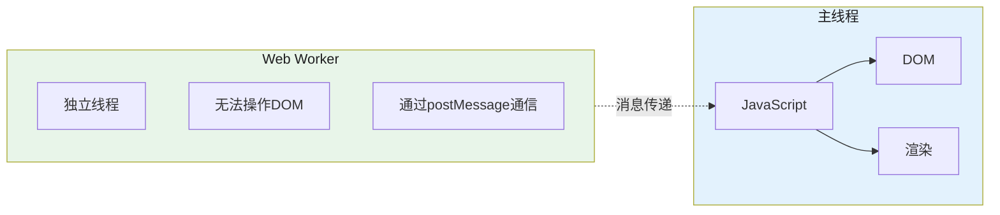

# 单线程模型与 Web Worker

## 1. 为什么需要 Web Worker




JavaScript 单线程的根本原因：DOM 是单线程共享的。如果 JS 多线程同时修改 DOM，结果不可预测。Web Worker 通过独立线程执行 JS，不共享内存，通过消息传递通信，不阻塞主线程。

## 2. Worker 类型与创建

```javascript
// 1. Dedicated Worker（专用 Worker，当前页面独占）
const worker = new Worker('/worker.js'); // 传入脚本路径
const worker = new Worker(
  new URL('./worker.js', import.meta.url), // Vite/Webpack 推荐写法
  { type: 'module' } // 支持 ESM
);

// worker.js（独立文件，或 Blob URL）
self.onmessage = (event) => {
  const { type, data } = event.data;
  if (type === 'calc') {
    const result = heavyComputation(data);
    self.postMessage(result);
  }
};

// 主线程通信
worker.postMessage({ type: 'calc', data: [1, 2, 3] });
worker.onmessage = (e) => console.log('结果:', e.data);
worker.onerror = (e) => console.error('Worker 错误:', e.message, e.lineno);

// 2. SharedWorker（多个页面/标签页共享）
const sharedWorker = new SharedWorker('/shared-worker.js');
sharedWorker.port.start();
sharedWorker.port.onmessage = (e) => console.log('SharedWorker:', e.data);
sharedWorker.port.postMessage('hello');

// shared-worker.js
self.onconnect = (e) => {
  const port = e.ports[0];
  port.onmessage = (e) => {
    port.postMessage(`收到: ${e.data}`);
  };
  port.start();
};
```

## 3. postMessage 与数据传输

```javascript
// postMessage 传输机制

// 1. 结构化克隆（Structured Clone，默认）
// 支持：基本类型、对象、数组、Date、RegExp、Map/Set（不循环引用）、Blob、File
worker.postMessage({ type: 'result', data: { user: { name: 'Alice' } } });
// 数据被完整复制（深拷贝），Worker 端和主线程端独立

// 2. Transferable 对象（所有权转移，比克隆快得多）
const buffer = new ArrayBuffer(8);
worker.postMessage(buffer, [buffer]); // 转移所有权
// 主线程中 buffer.byteLength === 0
// 适用于：ArrayBuffer、MessagePort、ImageBitmap、OffscreenCanvas

// 3. SharedArrayBuffer（共享内存，需要 COEP 头）
const sharedBuffer = new SharedArrayBuffer(1024);
const view = new Int32Array(sharedBuffer);
worker.postMessage(sharedBuffer, [], [sharedBuffer]); // 转移共享内存

// Worker 中
self.onmessage = (e) => {
  const sharedBuffer = e.data;
  const view = new Int32Array(sharedBuffer);
  Atomics.add(view, 0, 1); // 原子操作
  Atomics.notify(view, 0, 1);
};
// 使用 SharedArrayBuffer 需要服务器设置响应头：
// Cross-Origin-Embedder-Policy: require-corpop
// Cross-Origin-Opener-Policy: same-origin
```

## 4. OffscreenCanvas（Worker 中绘制）

```javascript
// OffscreenCanvas：将 Canvas 控制权转移到 Worker
// 用途：在 Worker 中完成所有绘制，不阻塞主线程

// 主线程
const canvas = document.getElementById('display-canvas');
const offscreen = canvas.transferControlToOffscreen(); // 转移控制权

worker.postMessage(
  { type: 'init', canvas: offscreen }, // 传递 OffscreenCanvas
  [offscreen]                          // 转移所有权
);

// worker.js
self.onmessage = (e) => {
  if (e.data.type === 'init') {
    const canvas = e.data.canvas;
    const ctx = canvas.getContext('2d');

    function render() {
      // 在 Worker 中绘制
      ctx.fillStyle = 'blue';
      ctx.fillRect(0, 0, canvas.width, canvas.height);
      ctx.fillStyle = 'white';
      ctx.font = '20px Arial';
      ctx.fillText('Worker Rendering', 50, 50);

      // 下一帧继续绘制
      self.requestAnimationFrame(render); // Worker 中也有 rAF
    }
    render();
  }
};
```

## 5. Worker 限制与注意事项

| 限制 | 说明 |
|------|------|
| 无 DOM | 不能 `document.getElementById()` / `window.alert()` |
| 无主线程全局对象 | `window`、`document`、`parent` 不可用 |
| 独立上下文 | Worker 内的 `self` === 全局对象 |
| 内存不共享 | 通过消息传递（克隆或 Transferable） |
| `importScripts` | Worker 专用脚本加载（同步，阻塞） |
| 同源限制 | Worker 脚本必须同源（或 CORS 允许） |
| 兼容性 | `SharedWorker` / `OffscreenCanvas` / `SharedArrayBuffer` 兼容性较差 |

## 6. 常见陷阱与最佳实践

| 陷阱 | 说明 | 解决方案 |
|------|------|---------|
| 在 Worker 中同步 `importScripts` | 阻塞 Worker 线程 | 用 `import`（ESM Worker）或动态 `import()` |
| postMessage 传大对象用克隆 | 大对象克隆耗时 | 用 Transferable 对象（ArrayBuffer/ImageBitmap） |
| Worker 泄漏 | 忘记 `worker.terminate()` | 任务完成后主动终止，避免 Worker 持续占用资源 |
| Worker 中直接操作 DOM | 不支持 | 用 OffscreenCanvas 或传回主线程处理 |
| SharedWorker 兼容性 | Safari/旧版不支持 | 降级到 Dedicated Worker |

## 7. 面试追问

**Q1: Worker 与主线程之间如何通信？**
通过 `postMessage` API：发送方调用 `.postMessage(data, transferList)`，接收方通过 `.onmessage = (e) => {}` 事件处理。数据通过**结构化克隆算法**深拷贝传输，或者通过 Transferable 对象转移所有权（主线程失去对象引用，Worker 获得）。Transferable 比克隆快 10 倍以上，适合大数据传输。

**Q2: SharedWorker 和 DedicatedWorker 的区别？**
DedicatedWorker 只能被创建它的页面使用，关闭页面即终止。SharedWorker 可被多个同源的页面/标签页共享，通过端口（port）通信。适合跨标签页共享状态（如多人协作工具）。缺点是 Safari 不支持，且调试复杂。

**Q3: 什么场景适合用 Web Worker？**

1. **计算密集型**：大数据排序、图像处理、加密解密、压缩解压、3D 计算。
2. **长时任务**：大文件解析（如 CSV/JSON 流处理）、复杂算法。
3. **高频率任务**：实时数据流处理、聊天消息加密。
4. **不适用**：需要频繁 DOM 操作的场景、简单计算（通信开销反而更大）。

## 8. 精简回顾：单线程与 Web Worker 速记版

```javascript
// 为什么JS是单线程？
// 历史原因：DOM是单线程的，JS和DOM共享同一线程
// 设计决定：避免多线程访问DOM的同步问题（锁、死锁）
// 示例：如果多线程同时修改同一DOM，结果不可预测

// Web Worker：
// 独立的JS线程，无法操作DOM，可以做耗时计算

// 创建Worker：
const worker = new Worker('worker.js');
worker.postMessage({ type: 'calc', data: [1, 2, 3] });
worker.onmessage = (e) => console.log('结果:', e.data);

// worker.js:
// self.onmessage = (e) => {
//   const result = heavyComputation(e.data.data);
//   self.postMessage(result);
// };

// Worker的限制：
// 1. 不能操作DOM
// 2. 不能直接访问parent（通过postMessage通信）
// 3. 不能访问某些全局对象（window, document）
// 4. 内存不共享（通过消息传递）

// SharedArrayBuffer：跨线程共享内存（需要配合Atomics）
// 用途：高性能计算，如大数据处理
// 注意：需要Cross-Origin-Embedder-Policy头，否则浏览器禁用

// worker.js:
const sharedBuffer = new SharedArrayBuffer(100);
const view = new Int32Array(sharedBuffer);

// 主线程 + Worker 共享同一个buffer，可同时读写
// Atomics.add(view, 0, 1); // 原子操作，避免竞争

// Atomics：原子操作
// Atomics.load(arr, index)
// Atomics.store(arr, index, value)
// Atomics.add, Atomics.sub, Atomics.and, Atomics.or
// Atomics.wait / Atomics.notify（条件变量）
// Atomics.compareExchange(arr, index, expected, newValue)

// Worker通信方式：
// 1. postMessage（克隆，结构化克隆算法）
// 2. Transferable对象（转移所有权，如ArrayBuffer）
// 3. SharedArrayBuffer（共享内存）

// 可转移 vs 克隆：
buffer = new ArrayBuffer(8);
worker.postMessage(buffer, [buffer]); // buffer在主线程变为0长度，转移到Worker
// 克隆：不改变原对象，Worker有副本
// 转移：原对象被"掏空"，Worker获得所有权
```

## 深入阅读与参考

!!! tip "怎么用这些资料"
    先读「官方文档与规范」建立准确的概念，再读「源码与示例」核对细节，最后用「教程、书籍与视频」换一种讲法加深理解。每条都写明了读哪一节、带着什么问题读。

### 官方文档与规范

| 资源 | 为什么读 | 怎么读 |
|---|---|---|
| [HTML 规范：Workers](https://html.spec.whatwg.org/multipage/workers.html) | 权威定义 Worker 的事件循环与结构化克隆规则。 | 查创建与消息传递两节，核对哪些数据可传、哪些会抛错。 |
| [MDN Web Workers API](https://developer.mozilla.org/en-US/docs/Web/API/Web_Workers_API) | 快速分清专用、共享、Service Worker 的适用边界。 | 读类型总览与接口列表，先判断本项目该用哪种 Worker 再动手。 |
| [MDN 使用 Web Workers](https://developer.mozilla.org/en-US/docs/Web/API/Web_Workers_API/Using_web_workers) | 从创建到 postMessage 的最小可跑流程，入门首选。 | 照示例跑通计算型 Worker，再用 Performance 面板确认主线程释放。 |
| [MDN Service Worker（中文）](https://developer.mozilla.org/zh-CN/docs/Web/API/Service_Worker_API) | 理解 Service Worker 与页面内 Worker 的定位差异。 | 读注册与生命周期小节，读完写一张三类 Worker 对比表。 |
| [MDN Canvas API](https://developer.mozilla.org/en-US/docs/Web/API/Canvas_API) | 先弄清 2D 上下文，再读 OffscreenCanvas 才不会卡住。 | 读概述与 getContext 部分，确认绘制对象可被转交给 Worker。 |

### 源码与示例

| 资源 | 为什么读 | 怎么读 |
|---|---|---|
| [Comlink](https://github.com/GoogleChromeLabs/comlink) | 把 postMessage 样板封装成函数调用，看清通信成本。 | 用它改写第 2 条示例，对比代码量与调试难度再决定是否引入。 |

### 教程、书籍与视频

| 资源 | 为什么读 | 怎么读 |
|---|---|---|
| [web.dev：OffscreenCanvas](https://web.dev/articles/offscreen-canvas) | 把绘制移入 Worker 的完整示例，并给出验证方法。 | 按示例把绘制逻辑搬进 Worker，用 Performance 面板对比主线程帧率。 |

## 应用与行业实践

### 应用场景地图

| 场景 | 用到本页哪个知识点 | 典型技术选型 | 注意事项 |
| --- | --- | --- | --- |
| 后台管理页打开万行表格并做筛选 | postMessage 传结构化数据、Worker 内发请求 | Dedicated Worker 加请求序号 | 渲染仍在主线程，返回结果要分页或截断 |
| 低端安卓机首屏加载第三方统计脚本 | Worker 类型与创建、主线程职责边界 | Partytown 一类的 DOM 代理方案 | 需核对官方文档：脚本对 DOM 的同步依赖、COOP 与 COEP 响应头要求 |
| 多人协作白板绘制上万条笔迹 | OffscreenCanvas 与画布转移 | Dedicated Worker 加 2D 上下文 | 画布转移后主线程不能再取上下文，文本输入仍靠 DOM |
| 上传前批量压缩手机照片 | Worker 内解码、OffscreenCanvas 编码 | Worker 加 createImageBitmap | 并发数按 navigator.hardwareConcurrency 限制 |
| 在线代码编辑器的语法与类型检查 | 长任务隔离、消息协议设计 | monaco-editor 的多 Worker 分层 | 编辑器与 Worker 的版本要保持一致 |
| 大文件上传前的分片校验 | 数据传输与 Transferable 对象 | Dedicated Worker 加 crypto.subtle | 分片用 ArrayBuffer 转移，避免整份文件复制 |
| 数据看板导入 Excel 后聚合 | 结构化克隆、计算下沉 | Dedicated Worker 加表格解析库 | 解析库不能引用 window，要先确认它能在 Worker 环境运行 |
| 音频波形绘制与峰值提取 | Worker 内计算、OffscreenCanvas 绘制 | Dedicated Worker 加 decodeAudioData | 采样率与声道处理规则要写在接口文档里 |
| 地图瓦片解码与要素过滤 | postMessage 传大对象、Worker 内存上限 | Dedicated Worker 加 WASM 解码器 | WASM 模块体积与首帧等待时间要一起权衡 |

### 三个场景拆解

#### 场景 1：后台管理的万行表格筛选

**业务背景**：运维后台的告警列表一次拉取两万行数据，主线程解析加过滤会把一次输入响应拖到一秒量级。测量方法：在 DevTools Performance 里录制一次过滤操作，看主线程是否出现超过 50ms 的长任务。

**怎么用本页知识解决**：把解析与过滤搬进 Worker，主线程只发请求序号、收结果、写一次 DOM。

```js
// main.js —— 主线程只做交互和渲染
const worker = new Worker('./table.worker.js', { type: 'module' });
let queryId = 0;                                  // 请求序号，用于丢弃过期结果
function onFilter(keyword) {
  worker.postMessage({ id: ++queryId, type: 'filter', keyword }); // 只传关键字
}
worker.onmessage = (e) => {
  if (e.data.id !== queryId) return;              // 旧结果直接丢，不覆盖新结果
  renderRows(e.data.rows);                        // 渲染仍是主线程的活
};
// table.worker.js —— 解析与过滤全部在 Worker
let rows = [];
self.onmessage = async (e) => {
  const { id, type, keyword } = e.data;
  if (type === 'load') {
    rows = parseCsv(await (await fetch('/api/rows.csv')).text()); // Worker 可 fetch
    return;
  }
  const hit = rows.filter((r) => r.name.includes(keyword));       // 过滤不占主线程
  self.postMessage({ id, rows: hit });            // 结构化克隆回传结果
};
```

- 消息里只传关键字，整份表格留在 Worker 内存中，不进结构化克隆。
- 请求序号解决乱序返回，后发的请求先回来时旧结果被丢弃。
- 渲染留在主线程，因为 Worker 拿不到 DOM；把多次写入合并成一次。
- Worker 内可以直接 fetch，网络回包与解析都不占用主线程。
- 结果集过大时要分页，结构化克隆本身也要花时间。

**怎么度量收益**：看 INP（Interaction to Next Paint）与 Total Blocking Time。用 Lighthouse 跑一次，用 Performance 面板录制过滤操作，再用 PerformanceObserver 监听 entryType 为 'longtask' 的条目统计条数与总时长。前后各测三次取中位数，同一台机器、同一档 CPU 降速。

**什么时候不该用**：

- 数据只有几千行、解析在 16ms 内完成时，Worker 启动与序列化开销会拖慢首帧。
- 过滤结果要和 DOM 元素逐条保持引用（例如每行挂着富文本编辑器实例）时，数据搬进搬出会破坏引用关系。
- 首屏必须立刻出数据时，先把首屏渲染做完再启动 Worker。

#### 场景 2：上传前的图片批量压缩

**业务背景**：移动端表单允许一次选 20 张照片，单张 3 到 8MB，直传会因为体积超时而失败。主线程里跑压缩时，页面滚动和按钮点击会被压住。

**怎么用本页知识解决**：用 Worker 承担解码、缩放与编码，主线程只负责读 File、上传和进度更新。

```js
// main.js —— 只做调度与上传
const worker = new Worker('./compress.worker.js', { type: 'module' });
const queue = [...files];
const next = () => { if (queue.length) worker.postMessage({ file: queue.shift() }); };
worker.onmessage = (e) => { upload(e.data.blob); next(); };   // 收结果、上传、再发下一张
next();
// compress.worker.js —— 解码、缩放、编码都在这里
self.onmessage = async (e) => {
  const bmp = await createImageBitmap(e.data.file);           // Worker 内解码图片
  const k = Math.min(1, 1600 / Math.max(bmp.width, bmp.height));
  const canvas = new OffscreenCanvas(bmp.width * k, bmp.height * k);
  canvas.getContext('2d').drawImage(bmp, 0, 0, canvas.width, canvas.height);
  bmp.close();                                                // 及时释放位图内存
  const blob = await canvas.convertToBlob({ type: 'image/webp', quality: 0.8 });
  self.postMessage({ blob });                                 // 主线程负责上传
};
```

- File 与 Blob 都支持结构化克隆，不必先读成 ArrayBuffer 再传。
- 解码、缩放、编码三步都在 Worker 内完成，主线程只保留上传与进度条更新。
- 调 bmp.close() 释放 ImageBitmap，否则连压多张时内存持续上涨。
- 单 Worker 串行已经能把主线程让出来；要提速再按 navigator.hardwareConcurrency 建池，先测单 Worker 是否跑满一个核。
- convertToBlob 的可用性与支持的格式以目标浏览器为准，不支持时保留主线程回退分支。

**怎么度量收益**：看单张往返耗时（用 performance.now() 包住 postMessage 到 onmessage）、主线程 longtask 条数、INP、上传总时长与失败率。工具用 Chrome DevTools Performance、Lighthouse 的 Total Blocking Time、PerformanceObserver 的 'longtask'。内存用 Memory 面板的堆快照对比压缩前后，确认 ImageBitmap 被回收。

**什么时候不该用**：

- 只有一两张小图时，Worker 启动与一次克隆的开销超过压缩本身。
- 业务要求保留原始像素与 EXIF 元数据、不允许重新编码时，不能在 Worker 里做有损转码。
- 目标机型不支持 OffscreenCanvas 或 createImageBitmap 时，要先查兼容表再决定是否改造。

#### 场景 3：多人协作白板的笔迹渲染

**业务背景**：白板单页笔迹数量到五位数，远端每秒推来几十条增量，主线程还要处理指针事件与界面重渲染。表现是画出的线条落后于指针位置；测量方法是录制一次连续画线，看 Frames 轨道上的掉帧与主线程长任务。

**怎么用本页知识解决**：把画布通过 transferControlToOffscreen 交给 Worker，主线程只转发指针坐标与远端增量。

```js
// main.js —— 只转发输入
const canvas = document.querySelector('#board');
const offscreen = canvas.transferControlToOffscreen();  // 一个画布只能转移一次
const worker = new Worker('./board.worker.js');
worker.postMessage({ canvas: offscreen }, [offscreen]); // 转移列表，主线程不再持有
canvas.addEventListener('pointermove', (e) => {
  worker.postMessage({ type: 'local', x: e.offsetX, y: e.offsetY }); // 只传坐标
});
socket.onmessage = (ev) => worker.postMessage({ type: 'remote', data: ev.data });
// board.worker.js —— 绘制全在 Worker
let ctx;
self.onmessage = (e) => {
  if (e.data.canvas) { ctx = e.data.canvas.getContext('2d'); return; } // Worker 内取上下文
  draw(ctx, e.data);                                    // 本地与远端增量共用绘制路径
};
```

- 转移列表里写 [offscreen]，转移后主线程对这块画布的引用失效，再取上下文会抛错。
- 主线程只发坐标与远端增量，绘制指令由 Worker 消化。
- 本地与远端数据共用一条绘制路径，坐标变换只维护一份。
- 文本输入、选中、无障碍要靠叠在画布上方的 DOM 元素，Worker 里没有节点。
- Worker 内的重绘由消息驱动；要按屏幕刷新对齐时，先核对目标浏览器的 Worker 全局作用域是否提供 requestAnimationFrame。

**怎么度量收益**：帧率与掉帧看 DevTools Performance 的 Frames 轨道；INP 看 Lighthouse 或真实用户监控；笔迹到呈现的延迟用 performance.now() 在 pointermove 收到时与绘制完成后各打一个点，把差值上报。远端同步延迟单独统计，不要和本地绘制延迟混在一个指标里。

**什么时候不该用**：

- 白板里大量元素是 DOM 节点（可编辑文本、图片标签、表单）时，OffscreenCanvas 帮不上忙。
- 需要主线程高频命中测试与元素级事件绑定的画布，转移后这套逻辑要整体重写，成本高于收益。
- 画布已经被主线程取过上下文之后再转移会抛错，这类代码要先梳理调用顺序再动。

### 行业先进实践

**Comlink（出处：GoogleChromeLabs/comlink 开源项目）**
做法是用 Proxy 把 postMessage 包装成异步函数调用，把消息协议的样板收进库。接口稳定后改 Worker 内部实现不用改调用方。借鉴方式：先写清接口签名，再逐项决定哪些参数走 Transferable。

**Partytown（出处：Partytown 开源项目官方文档）**
做法是把第三方脚本放进 Worker 执行，同时把它们对 DOM 的访问代理回主线程。它解决的问题是不受自己控制的脚本抢占主线程。需核对官方文档：核对是否需要 SharedArrayBuffer、COOP 与 COEP 响应头，以及主线程同步等待的实现方式。

**monaco-editor 的 Worker 分层（出处：microsoft/monaco-editor 官方文档）**
做法是编辑器把词法分析与各语言服务拆到独立 Worker，主线程只处理输入与渲染。语言服务变慢不会直接卡住打字，因为它的长任务不落在主线程上。借鉴方式：按任务类型拆 Worker，而不是把所有计算塞进同一个。

**PDF.js（出处：mozilla/pdf.js 开源项目）**
做法是 PDF 解析放在 worker 中，主线程负责页面展示与交互。解析属于 CPU 密集任务，交给 Worker 后主线程只做展示相关的工作。借鉴方式：解析类任务进 Worker，展示类任务留主线程，两者用消息划边界。

**构建工具对 Worker 的约定（出处：Vite 官方文档 Web Workers 章节、webpack 官方文档）**
做法是用 new Worker(new URL('./x.worker.js', import.meta.url), { type: 'module' }) 让打包器识别 Worker 入口并单独产出 chunk。这样 Worker 文件不会被内联，路径由打包器解析。借鉴方式：不要手写 Worker 路径字符串。

### 从学到用：落地路线

第 1 步试点：挑一个入口独立、输入输出都是纯数据的计算模块，例如 CSV 导出或图片压缩，只把它搬进 Worker。验收标准：该功能手工回归通过，Performance 录制里这次操作不再出现超过 50ms 的长任务。

第 2 步验证：在 CPU 降速 4 倍与 6 倍下各跑三次 Lighthouse，记录 INP 与 Total Blocking Time，并用 PerformanceObserver 统计 longtask 条数。验收标准：留下前后两份 trace 文件与指标表，中位数差异可复现。

第 3 步推广：抽出 Worker 池与统一消息格式（id、type、payload），后续模块照同一格式接入。验收标准：新增一个 Worker 模块时，主线程只增加消息处理代码，不改渲染流程。

第 4 步防回退：在 CI 里加规则，计算模块禁止引用 document 与主线程专属依赖，并对 longtask 预算设断言。验收标准：违规改动被 CI 拦下，指标超预算时构建失败。

### 动手作业

**目标**：给一个列表页做"导入 CSV 并排序聚合"的 Worker 版本，主线程只做渲染与交互。

**步骤**：

1. 用脚本生成 5 万行、每行 8 列的 CSV，固定随机种子，生成脚本一起提交。
2. 先写主线程版本，用 performance.now() 分别记录解析、排序、聚合三步耗时，录一份 Performance trace 作基线。
3. 建 Worker，把解析、排序、聚合搬进去，消息里只传关键字与排序字段。
4. 加请求序号丢弃过期结果，写一条自动化用例模拟连续两次筛选。
5. 加进度上报：Worker 每处理完一批数据 postMessage 一次进度，主线程更新进度条。
6. 在 CPU 降速 4 倍下重跑第 2 步的录制，记录 INP 与 longtask 条数。
7. 写 README，说明消息格式、错误处理与主线程回退条件。

**验收标准**：

- 连续两次快速筛选后，界面显示的是最后一次输入对应的结果。
- 降速 4 倍的录制中，这次筛选操作不再出现超过 50ms 的长任务。
- Worker 抛错时界面给出可读提示，并且能重试。
- 数据量降到 5000 行时，Worker 版本与主线程版本的输出逐字段一致。
- README 里的消息格式与实际代码一致，字段名能对上。

