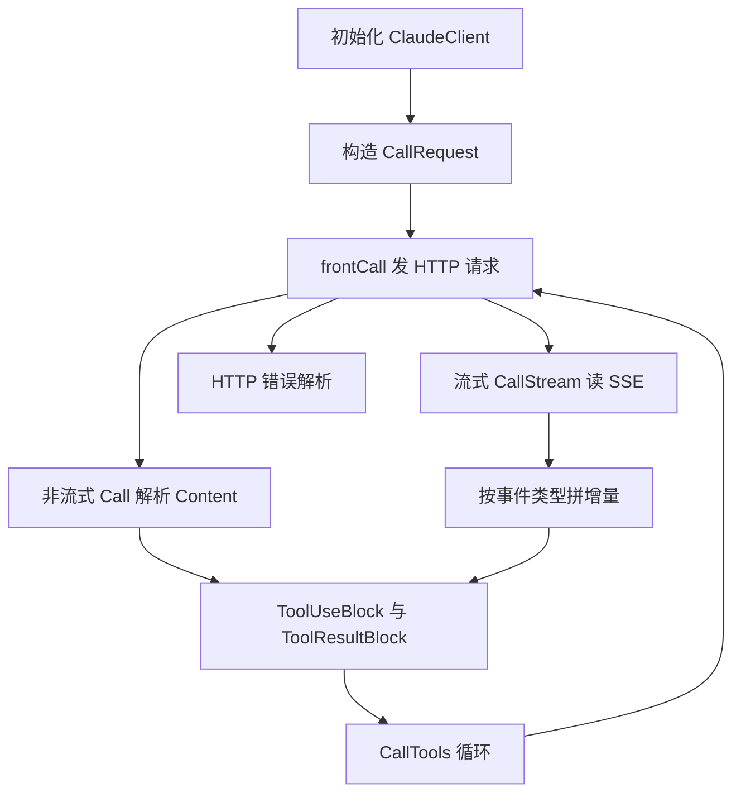
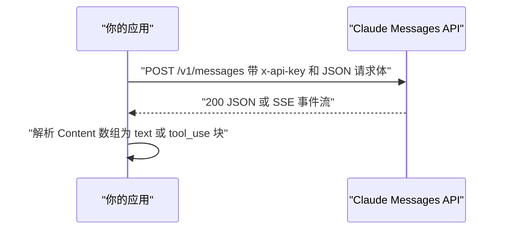
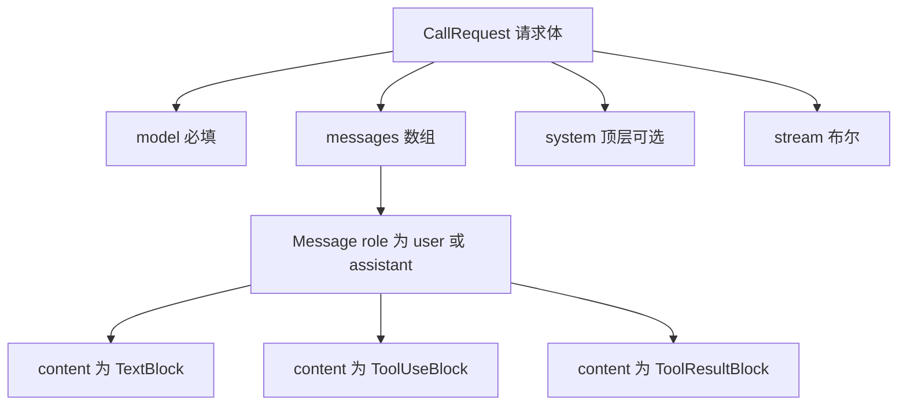
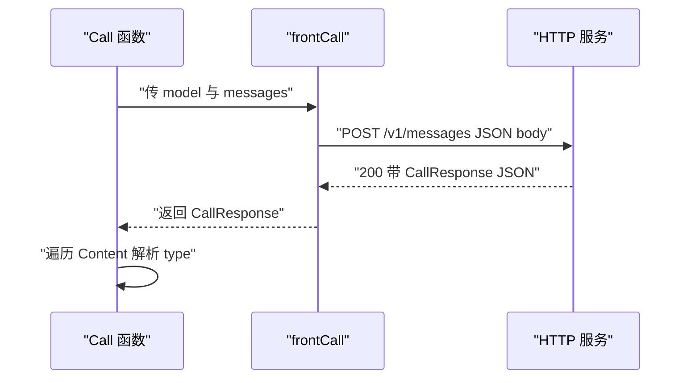
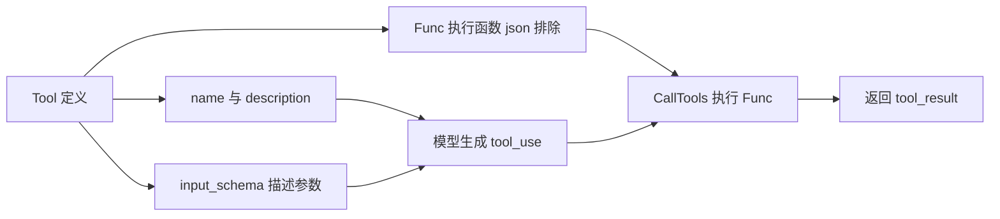
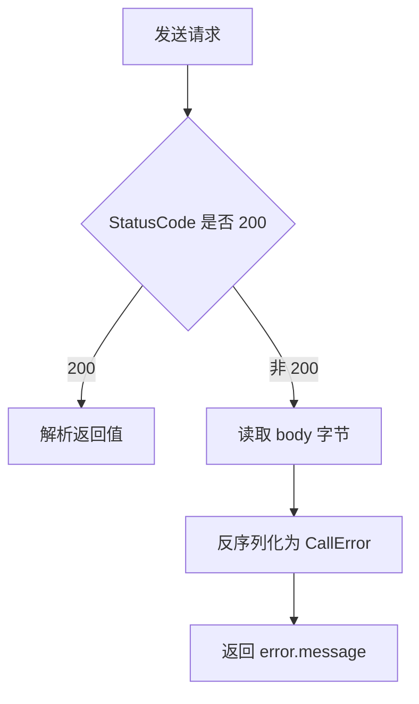
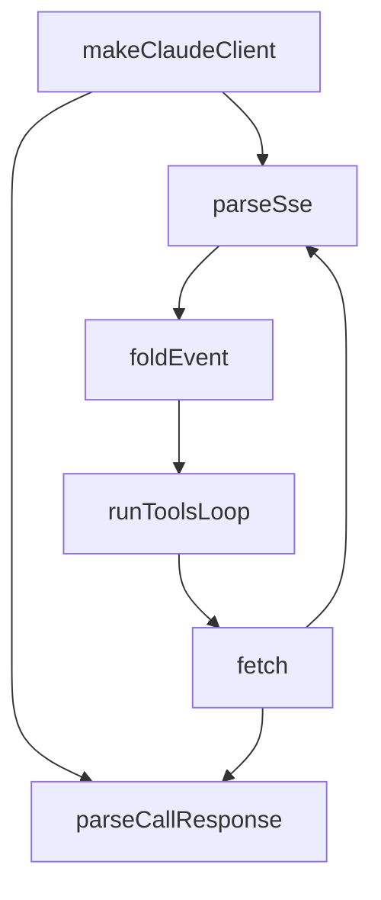

# Day 1：手写一个 Claude API 客户端（含 SSE 流式与工具调用）

!!! note "来源与许可证"
    本页核心内容基于开源项目 nano-claude-code（MIT License，Copyright 2026 dlut-tic）的 docs/day1.md 与 claude 包源码，对应提交 ID 59016bac8f3e2c2bea47edc679dd9c8a7d2ec9be。文中标注「原项目内容」的代码与结论来自该项目；标注「本站补充」的 TypeScript 实现、验证用例与面试题来自本站编写。版本号与官方字段描述以 Anthropic 官方文档为准。

!!! warning "关于代码摘录的说明"
    标注为“原项目内容”的 Go 代码是对 nano-claude-code 源码的节选，页面中为便于教学添加了中文注释，
    个别行为了篇幅做了折叠或转写，不保证与原仓库逐字一致。需要逐字原文时请以原仓库对应提交为准。

!!! abstract "学完这一页你能"
    1. 说出 Messages API 的请求字段与响应内容块类型，并解释 role 与 content 的结构。
    2. 自己写一个非流式 Call 函数，把 text、tool_use 响应解析为结构化消息。
    3. 自己写一个 SSE 流式解析器，按事件类型拼接 text 增量与 tool_use 的 partial_json。
    4. 用 TypeScript 实现最小客户端和假服务器回放 SSE，并用断言验证工具调用循环。

## 0. 知识地图



建议先读第 1 节和第 2 节，建立客户端与消息结构的基础认识。然后按非流式、流式、工具调用、错误处理的顺序读，因为流式和工具都依赖前两节的结构。如果时间有限，先读第 7 节 TypeScript 实现，再回头看 Go 源码的对应段落。

## 1. 为什么不用官方 SDK：边界与最小客户端

**先想一个问题**：前端面试里，面试官让你不用 @anthropic-ai/sdk，只靠 fetch 调通 Claude。你知道请求要发到哪里、带什么头、body 长什么样吗？

**心智模型**：

!!! tip "心智模型"
    一句话：官方 SDK 只是 HTTP 请求加 JSON 解析的封装。日常类比：官方 SDK 像外卖 App，API 协议是餐厅菜单与取餐柜；外卖 App 帮你下单、导航、取餐，但你直接打电话给餐厅也能完成同一单。
    类比不成立处：官方 SDK 还处理了重试、限流、凭证刷新、类型生成和生产级错误恢复；餐厅电话点单没有这些保障。

**图解**：



1. 你的应用构造请求体，包含 model 与 messages。
2. HTTP 客户端发送 POST 请求，路径为 /v1/messages。
3. 服务端返回普通 JSON，或 stream=true 时返回 SSE 事件流。
4. 客户端把响应中的 content 数组解析为具体内容块。

**一步一步来**：

① 这一步要做什么：定义客户端结构，保存 baseUrl、apiKey 与 httpClient 三个字段。

```go
// claude/init.go（原项目内容）
type ClaudeClient struct {
    baseUrl    string       // 请求地址，如 https://api.anthropic.com/
    apiKey     string       // 鉴权密钥，写入 x-api-key 头
    httpClient *resty.Client // resty v3 HTTP 客户端
}
```

**这段代码在做什么**
- baseUrl 统一保存服务地址，后续拼接 /v1/messages。
- apiKey 小写私有，避免被包外直接读取。
- httpClient 复用连接，避免每次请求重新建连。
- 三个字段组成一次 API 调用的最小状态。

② 这一步要做什么：校验 baseUrl 必须以 http:// 或 https:// 开头，并构造客户端。

```go
// claude/init.go（原项目内容）
func NewClient(baseurl string, apikey string) (*ClaudeClient, error) {
    if !strings.HasPrefix(baseurl, "http://") && !strings.HasPrefix(baseurl, "https://") {
        return nil, errors.CreateClaudeClientBaseUrlError
    }
    return &ClaudeClient{
        baseUrl:    baseurl,
        apiKey:     apikey,
        httpClient: resty.New(),
    }, nil
}
```

**这段代码在做什么**
- 两个 HasPrefix 判断覆盖 http 与 https 协议。
- 不合法地址在构造阶段直接报错，不让它进入请求阶段。
- resty.New() 创建可复用的 HTTP 客户端。
- 返回指针，让后续方法在同一实例上调用。

**动手验证**：本站补充一个 Node 20+ 最小校验脚本，证明同一套校验思路在 TypeScript 中可行。依赖：无。

```ts
// client-init.test.mjs（本站补充）
import assert from 'node:assert/strict';

function makeClient(baseUrl, apiKey) {
  if (!baseUrl.startsWith('http://') && !baseUrl.startsWith('https://')) {
    throw new Error('unsupported baseurl');
  }
  return { baseUrl, apiKey };
}

assert.throws(() => makeClient('ftp://api', 'x'), /unsupported/);
const c = makeClient('https://api.anthropic.com', 'x');
assert.equal(c.baseUrl, 'https://api.anthropic.com');
console.log('client init ok');
```

运行结果：
```
client init ok
```

**常见坑**：

| 现象 | 原因 | 怎么修 |
|------|------|--------|
| 构造时没有报错，请求时 404 | baseUrl 拼错且未校验 | 在 NewClient 阶段要求 http 或 https 前缀 |
| baseUrl 结尾斜杠不一致导致路径重复或缺失 | 调用方写法不同 | frontCall 里统一补一个 / |
| API key 被打印到日志 | 字段导出或日志打印整个结构体 | 保持小写私有，日志只打印字段名不打印值 |

**用在哪里**：
- 业务背景：一个内部工单系统要接入 Claude 做摘要，但团队不想引入官方 SDK 的额外依赖。
- 这一节的知识怎么用：用 fetch 或轻量 HTTP 客户端保存 baseUrl 与 apiKey，自己封装 NewClient；校验前置让配置错误在启动时暴露。
- 用什么指标衡量收益：启动配置错误率从请求时发现提前到启动时发现；依赖数量保持不变。
- 什么时候不该用：需要自动重试、限流、凭证刷新时，裸 fetch 需要自己补这些，且容易遗漏。

- 业务背景：面试现场手写一个 API 客户端雏形，考察协议理解。
- 这一节的知识怎么用：说出客户端三字段与 baseUrl 校验，展示不是只知道 SDK 调用。
- 用什么指标衡量收益：是否能写出构造函数的错误分支；是否理解私有字段保护密钥。
- 什么时候不该用：真实生产直接推裸客户端而不做错误恢复与类型生成。

**行业实践**：
- 公开可查做法：Anthropic 官方 SDK 把 baseURL、apiKey、authToken 等配置集中在 ClientOptions，并在请求前做配置合并。出处：Anthropic SDK 官方文档，章节 Setup 与 Client Options。
- 公开可查做法：官方 SDK 文档建议不要在客户端代码里硬编码 API key，改用环境变量。出处：Anthropic SDK 官方文档，章节 Setup。
- 怎么借鉴到你的项目：你的 ClientOptions 里保留 baseUrl、apiKey、maxRetries 三个字段，NewClient 先合并默认值再校验；apiKey 从环境变量读取，不落入版本库。

**小结**：
1. 客户端最小状态是 baseUrl、apiKey、httpClient 三件事。
2. 地址校验要在最前面，错误越早暴露成本越低。
3. 官方 SDK 的价值在请求外保障，协议本身可以用 fetch 复现。

## 2. Messages API 请求与响应结构

**先想一个问题**：前端同学用 fetch 时，最怕写错 body 字段名。Claude 的 message 里 system 放哪？role 有两个值吗？content 为什么有时候是字符串有时候是数组？

**心智模型**：

!!! tip "心智模型"
    一句话：请求体是一份「谁在什么位置说什么」的脚本，响应体是「模型一段一段地回什么」。日常类比：群聊记录。每一条发言有发言人 role 和内容 content；system 不是一条聊天，而是贴在墙上的群规。
    类比不成立处：群聊 content 不限制格式，API 的 content 必须是官方定义的内容块类型。

**图解**：



1. CallRequest 是 HTTP body 顶层，model 与 messages 必填。
2. Message 的 role 只有 user 与 assistant 两种。
3. content 使用 any 或联合类型兼容字符串与内容块数组。
4. 三种内容块由 type 字段区分，text、tool_use、tool_result。

**一步一步来**：

① 这一步要做什么：定义 Message、角色常量和 SingleStringMessage。

```go
// claude/message.go（原项目内容）
type Message struct {
    Role    string `json:"role"`
    Content any    `json:"content"`
}

const (
    ClaudeMessageRoleUser      = "user"
    ClaudeMessageRoleAssistant = "assistant"
)

type SingleStringMessage string
```

**这段代码在做什么**
- Message 用 any 接受单字符串或内容块数组，避免为 17 种 content 类型建 17 个字段。
- 角色用常量，避免调用方手滑写错大小写。
- SingleStringMessage 处理最简单的纯文本消息。
- json tag 保证 Go 结构体与 JSON 字段一致。

② 这一步要做什么：定义请求体 CallRequest 与内容块 TextBlock、ToolUseBlock、ToolResultBlock。

```go
// claude/call.go 与 claude/message.go（原项目内容）
type CallRequest struct {
    Model    string    `json:"model"`
    Messages []Message `json:"messages"`
    Stream   bool      `json:"stream"`
    Tools    []Tool    `json:"tools"`
    System   string    `json:"system,omitempty"`
}

type TextBlock struct {
    Type string `json:"type"`
    Text string `json:"text"`
}

type ToolUseBlock struct {
    Type  string         `json:"type"`
    ID    string         `json:"id"`
    Name  string         `json:"name"`
    Input map[string]any `json:"input"`
}
```

**这段代码在做什么**
- system 用 omitempty，不传 system 时该字段不序列化。
- Stream 为 false 时返回一次性 JSON，为 true 时返回 SSE。
- TextBlock 的 Text 是非流式最终文本，流式时由多个 delta 拼接。
- ToolUseBlock 的 Input 是解析后的参数对象，ID 用于后续 tool_result 关联。
- 官方文档允许 content 有多种类型，any 是扩展点。

③ 这一步要做什么：定义 CallResponse 与 Usage，承接非流式响应。

```go
// claude/call.go（原项目内容，节选）
type CallResponse struct {
    Model        string        `json:"model"`
    ID           string        `json:"id"`
    Type         string        `json:"type"`
    Role         string        `json:"role"`
    Content      []interface{} `json:"content"`
    StopReason   string        `json:"stop_reason"`
    StopSequence interface{}   `json:"stop_sequence"`
    Usage        Usage         `json:"usage"`
}

type Usage struct {
    InputTokens  int `json:"input_tokens"`
    OutputTokens int `json:"output_tokens"`
}
```

**这段代码在做什么**
- Content 数组是非流式下的完整内容块列表。
- StopReason 表示结束原因，如 end_turn 或 tool_use。
- Usage 包含输入与输出 token 数，调用方可后置记账。
- 简化 Usage 只保留两个关键字段，完整源码还有缓存 token 字段。

**动手验证**：本站补充用 TypeScript 做请求体形状断言。

```ts
// message-shape.test.mjs（本站补充）
import assert from 'node:assert/strict';

const msg = { role: 'user', content: [{ type: 'text', text: 'hi' }] };
const body = {
  model: 'claude-sonnet-4-5',
  messages: [msg],
  stream: false,
  system: 'you are concise'
};

assert.equal(body.messages[0].role, 'user');
assert.equal(body.messages[0].content[0].type, 'text');
assert.equal(JSON.stringify(body).includes('system'), true);
console.log('message shape ok');
```

运行结果：
```
message shape ok
```

**常见坑**：

| 现象 | 原因 | 怎么修 |
|------|------|--------|
| 400 请求，报 system 位置错误 | 把 system 写进 messages 的 role | system 放在请求体顶层，与 messages 同级 |
| content 传成字符串但服务端要块数组 | 与非流式内容块约定不一致 | 统一传数组或让封装层把 SingleStringMessage 转成 TextBlock |
| role 写了 system 或 tool 导致 400 | Messages API 只允许 user 与 assistant | 用常量约束 role |

**用在哪里**：
- 业务背景：一个客服机器人需要把多轮对话和一段系统提示发给模型。
- 这一节的知识怎么用：请求体顶层放 system，messages 数组只放 user 与 assistant。
- 用什么指标衡量收益：400 错误占比下降；对话轮数可扩展到 10 轮以上不因结构错误失败。
- 什么时候不该用：OpenAI 协议下 system 放 messages 数组里，不能直接照搬；需要单独封装。

- 业务背景：你在写一个前端调试工具，要展示每次请求的 messages JSON。
- 这一节的知识怎么用：知道 content 可能是字符串或数组，渲染时要先判断类型。
- 用什么指标衡量收益：渲染崩溃率；用户体验无白屏。
- 什么时候不该用：对超大 content 做全量 JSON.stringify 展示，性能会随内容线性下降。

**行业实践**：
- 公开可查做法：Anthropic Messages API 文档明确 system 为顶层参数，role 仅 user 与 assistant。出处：Claude API Reference，章节 Create a Message 与 Body parameters。
- 公开可查做法：Anthropic 官方 SDK 用 TypeScript 联合类型区分 TextBlock、ToolUseBlock 等 block。出处：Anthropic SDK 官方文档，章节 Messages。
- 怎么借鉴到你的项目：在 TypeScript 中用联合类型 `type Role = 'user' | 'assistant'` 直接排除非法角色，block 也用 `type` 字段联合收窄。

**小结**：
1. system 在请求体顶层，messages 的 role 只有 user 与 assistant。
2. content 用 any 或联合类型，是兼容 17 种类型的关键。
3. 内容块 type 是后续解析分支的开关。

## 3. 非流式 Call：一次请求，一次解析

**先想一个问题**：你第一次调用模型只想拿完整回答。返回的 JSON 里 content 是个数组，你怎么知道每一项是文字还是工具调用？

**心智模型**：

!!! tip "心智模型"
    一句话：Call 是一场「发一份卷子，收一份完整答卷」的过程。日常类比：邮件问答。你发一封带问题的邮件，对方回复一封完整邮件，你按段落读。
    类比不成立处：邮件没有固定 type 字段，不会要求你按 type 分支解析结构化内容。

**图解**：



1. Call 把参数交给 frontCall。
2. frontCall 发出请求并自动解析到 CallResponse。
3. Call 拿到响应后遍历 content 数组。
4. 每项按 type 分支为 text 或 tool_use。

**一步一步来**：

① 这一步要做什么：frontCall 统一发起请求，自动解析非流式响应。

```go
// claude/call.go（原项目内容，节选）
func frontCall(httpClient *resty.Client, inBaseUrl string, apiKey string,
    model string, messages []Message, stream bool, tools []Tool, system string) (CallResponse, *resty.Response, error) {
    baseurl := inBaseUrl
    if inBaseUrl[len(inBaseUrl)-1] != '/' {
        baseurl += "/"
    }

    requestBody := CallRequest{
        Stream:   stream,
        Model:    model,
        Messages: messages,
        System:   system,
    }
    if len(tools) != 0 {
        requestBody.Tools = tools
    }

    res := CallResponse{}
    httpRequest := httpClient.R().
        SetHeader("x-api-key", apiKey).
        SetBody(requestBody)
    if stream {
        httpRequest.SetDoNotParseResponse(true)
    } else {
        httpRequest.SetResult(&res)
    }
    httpRes, err := httpRequest.Post(baseurl + "v1/messages")
    return res, httpRes, err
}
```

**这段代码在做什么**
- baseurl 末尾无 / 时补一个，避免拼接出错误路径。
- body 里只在 tools 非空时才写入 Tools。
- 非流式用 SetResult 自动把 JSON 解析到 CallResponse。
- 流式用 SetDoNotParseResponse 保留原始 Body 供逐行读取。
- x-api-key 是 API 鉴权头，不能用 Authorization。

② 这一步要做什么：Call 遍历 content，按 type 把 text、tool_use 转成 Message。

```go
// claude/call.go（原项目内容，节选）
resMessages := []Message{}
for _, item := range res.Content {
    itemMap, ok := item.(map[string]interface{})
    if !ok {
        return []Message{}, Usage{}, errors.ClaudeClientCallFormatError
    }
    messageType, ok := itemMap["type"].(string)
    if !ok {
        return []Message{}, Usage{}, errors.ClaudeClientCallFormatError
    }
    switch messageType {
    case "text":
        resMessages = append(resMessages, Message{
            Role: ClaudeMessageRoleAssistant,
            Content: TextBlock{Type: "text", Text: itemMap["text"].(string)},
        })
    case "tool_use":
        resMessages = append(resMessages, Message{
            Role: ClaudeMessageRoleAssistant,
            Content: ToolUseBlock{
                Type:  "tool_use",
                Name:  itemMap["name"].(string),
                Input: itemMap["input"].(map[string]any),
                ID:    itemMap["id"].(string),
            },
        })
    default:
        return []Message{}, Usage{}, errors.ClaudeClientCallFormatError
    }
}
```

**这段代码在做什么**
- 先把 interface{} 断言成 map，失败说明响应格式与预期不一致。
- 再取 type 字段判断内容块类型。
- text 分支创建 TextBlock。
- tool_use 分支读取 name、input、id 三个关键字段。
- default 分支返回格式错误，不静默吞掉未知类型。

**动手验证**：本站补充一个假响应解析测试。依赖：无。

```ts
// call-parse.test.mjs（本站补充）
import assert from 'node:assert/strict';

function parseContent(content) {
  return content.map((item) => {
    if (item.type === 'text') return { role: 'assistant', content: { type: 'text', text: item.text } };
    if (item.type === 'tool_use') return { role: 'assistant', content: { type: 'tool_use', id: item.id, name: item.name, input: item.input } };
    throw new Error('unknown block');
  });
}

const parsed = parseContent([
  { type: 'text', text: '你好' },
  { type: 'tool_use', id: 'toolu_1', name: 'get_weather', input: { city: '北京' } }
]);
assert.equal(parsed[0].content.text, '你好');
assert.equal(parsed[1].content.name, 'get_weather');
assert.equal(parsed[1].content.input.city, '北京');
console.log('call parse ok');
```

运行结果：
```
call parse ok
```

**常见坑**：

| 现象 | 原因 | 怎么修 |
|------|------|--------|
| 断言失败返回 error | 响应 JSON 结构不是预期 map | 检查官方文档字段是否变化，并核对类型 |
| 未知 type 返回错误但响应里带了新块 | 客户端只实现了两种分支 | 新增分支或把未知块返回为原始 map |
| content 字段为空 | 代理层返回了非 200 但被无视 | 在 frontCall 先判断状态码 |

**用在哪里**：
- 业务背景：一个代码审查机器人要把模型的完整回复写入评论。
- 这一节的知识怎么用：用 Call 拿完整 text，再写入 GitHub 评论，不需要流式槽位。
- 用什么指标衡量收益：评论写入成功率达到 99% 以上（需以你项目实测为准）；响应解析错误率下降。
- 什么时候不该用：需要边生成边展示时用非流式会让用户等待更久。

- 业务背景：一个批量翻译任务把 100 条句子送给模型翻译。
- 这一节的知识怎么用：循环调用 Call 并解析每条 text，把结果写入 Excel。
- 用什么指标衡量收益：批处理耗时；单条解析失败不阻塞其他任务。
- 什么时候不该用：100 条并发过高会触发限流，需要设置并发上限。

**行业实践**：
- 公开可查做法：Anthropic SDK 对非流式响应直接用类型化模型解析 content，并暴露 .content 数组。出处：Anthropic SDK 官方文档，章节 Messages 与 Streaming。
- 公开可查做法：Messages API 返回的 stop_reason 可用于判断是否发生了工具调用或 token 超限。出处：Claude API Reference，章节 Create a Message 返回字段。
- 怎么借鉴到你的项目：你的 parseContent 返回强类型联合，而不是 any；未知 type 抛错，方便调试。

**小结**：
1. Call 的核心是 frontCall 发请求加遍历 content 分支解析。
2. 非流式适合一次性任务，流式适合交互型展示。
3. 未知 type 要显式报错，不要吞掉。

## 4. SSE 流式 CallStream：事件类型与增量拼接

**先想一个问题**：如果你想做一个打字机效果的聊天界面，端上怎么在「模型还没说完整句」时就把前面几个字画出来？

**心智模型**：

!!! tip "心智模型"
    一句话：SSE 流式是一行一行发过来的事件，你要按 type 决定「开新块」还是「拼旧块」。日常类比：快递分多次送家具。第一车告诉你「有个柜子」，后面每车送一块木板，你按编号拼起来。
    类比不成立处：家具坏了可以退货，SSE 中途断线通常要由上层重新发起请求，不能断点续拼。

**图解**：

```mermaid
stateDiagram-v2
  S0["读取一行"] --> S1{"是否为 data 开头"}
  S1 -->|"否"| S0
  S1 -->|"是"| S2["解析 JSON 取 type"]
  S2 --> S3["content_block_start 新建块"]
  S2 --> S4["content_block_delta 拼增量"]
  S3 --> S0
  S4 --> S0
  S0 --> S5["读到 EOF 结束"]
```

1. 读取器一直按行读 SSE。
2. 不是 data: 开头就跳过，避免误处理 event 与空行。
3. 是 data: 就解析 JSON，按 type 进入不同状态。
4. start 负责创建块，delta 负责把增量拼到当前块。
5. EOF 结束读取，但要注意流结束不等于内容完整，需按事件序列判断。

**一步一步来**：

① 这一步要做什么：用 bufio.Reader 逐行读取 SSE。

```go
// claude/call.go（原项目内容，节选）
reader := bufio.NewReader(originHttpRes.Body)
defer originHttpRes.Body.Close()

for {
    eventStr, err := reader.ReadString('\n')
    if stdError.Is(err, io.EOF) {
        break
    }
    if err != nil {
        return []Message{}, Usage{}, err
    }
    if strings.Trim(eventStr, " ") == "" {
        continue
    }
    if strings.HasPrefix(eventStr, "data: ") {
        data := eventStr[6:]
        dataDetail := CallStreamResponse{}
        err := json.Unmarshal([]byte(data), &dataDetail)
        if err != nil {
            continue
        }
    }
}
```

**这段代码在做什么**
- ReadString('\n') 一次读一行，避免整包读进内存。
- EOF 是正常终止，break 后交给 finalize。
- 空行跳过，SSE 用空行分隔事件块。
- data: 前缀剥离后得到 JSON 字符串。
- 单行 JSON 解析失败就跳过，下一步事件可能正常。

② 这一步要做什么：按 dataDetail.Type 处理 content_block_start 与 content_block_delta。

```go
// claude/call.go（原项目内容，节选）
switch dataDetail.Type {
case "content_block_start":
    resMessages = append(resMessages, Message{Role: ClaudeMessageRoleAssistant})
    var content any
    switch dataDetail.ContentBlock.Type {
    case "text":
        content = TextBlock{Type: "text", Text: ""}
    case "tool_use":
        content = ToolUseBlock{
            Type: "tool_use",
            ID:   dataDetail.ContentBlock.ID,
            Name: dataDetail.ContentBlock.Name,
        }
    case "":
        continue
    }
    resMessages[len(resMessages)-1].Content = content
case "content_block_delta":
    switch resMessages[len(resMessages)-1].Content.(type) {
    case TextBlock:
        resMessages[len(resMessages)-1].Content = TextBlock{
            Type: "text",
            Text: resMessages[len(resMessages)-1].Content.(TextBlock).Text + dataDetail.Delta.Text,
        }
        continueFlag = dealFunc(Message{
            Role: ClaudeMessageRoleAssistant,
            Content: TextBlock{Type: "text", Text: dataDetail.Delta.Text},
        })
    case ToolUseBlock:
        changeContent := resMessages[len(resMessages)-1].Content.(ToolUseBlock)
        changeContent.PartialJson += dataDetail.Delta.PartialJson
        resMessages[len(resMessages)-1].Content = changeContent
        continueFlag = dealFunc(Message{
            Role: ClaudeMessageRoleAssistant,
            Content: ToolUseBlock{
                Type:        "tool_use",
                ID:          changeContent.ID,
                Name:        changeContent.Name,
                PartialJson: dataDetail.Delta.PartialJson,
            },
        })
    }
    if !continueFlag {
        return resMessages, usage, nil
    }
}
```

**这段代码在做什么**
- content_block_start 负责新建一个消息并挂上空内容块。
- text 增量用字符串加法实现拼接。
- tool_use 的增量在 stream 阶段是 PartialJson，不是 Input。
- dealFunc 暴露增量，调用方可决定是否提前中断。
- 返回 false 时立刻结束流，调用方拿到当前结果。
- `resMessages[len(resMessages)-1]` 指向最后一个块，确保拼在正确位置。

③ 这一步要做什么：把最后拼接好的 PartialJson 解析为 Input map。

```go
// claude/call.go（原项目内容，节选）
for i := 0; i < len(resMessages); i++ {
    if reflect.TypeOf(resMessages[i].Content) == reflect.TypeOf(ToolUseBlock{}) {
        changeBlock := resMessages[i].Content.(ToolUseBlock)
        inputMap := make(map[string]any)
        err := json.Unmarshal([]byte(changeBlock.PartialJson), &inputMap)
        if err != nil {
            return resMessages, usage, errors.ClaudeToolStreamPartParseError
        }
        changeBlock.Input = inputMap
        resMessages[i].Content = changeBlock
    }
}
```

**这段代码在做什么**
- 流式结束时才把 PartialJson 转成 Input。
- 用 reflect.TypeOf 判断块类型，避免 type switch 误判。
- 解析失败返回专门错误，不静默留空。
- 转换后 ToolUseBlock 已经可以直接交给工具执行函数。

**动手验证**：本站补充假 SSE 行解析测试。依赖：无。

```ts
// sse-parse.test.mjs（本站补充）
import assert from 'node:assert/strict';

function parseSseLine(line, blocks) {
  if (!line.startsWith('data: ')) return blocks;
  const event = JSON.parse(line.slice(6));
  if (event.type === 'content_block_start' && event.content_block.type === 'text') {
    blocks.push({ type: 'text', text: '' });
    return blocks;
  }
  if (event.type === 'content_block_delta' && event.delta?.text) {
    const last = blocks[blocks.length - 1];
    if (last.type === 'text') last.text += event.delta.text;
  }
  return blocks;
}

let blocks = [];
blocks = parseSseLine('data: {"type":"content_block_start","index":0,"content_block":{"type":"text","text":""}}', blocks);
blocks = parseSseLine('data: {"type":"content_block_delta","index":0,"delta":{"type":"text_delta","text":"你好"}}', blocks);
blocks = parseSseLine('data: {"type":"content_block_delta","index":0,"delta":{"type":"text_delta","text":"世界"}}', blocks);
assert.equal(blocks[0].text, '你好世界');
console.log('sse parse ok');
```

运行结果：
```
sse parse ok
```

**常见坑**：

| 现象 | 原因 | 怎么修 |
|------|------|--------|
| 解析到 event 字段而不是 data | SSE 的双字段结构被误读 | 只看 data: 开头，忽略 event 行 |
| 增量拼到错误块 | 有多个 content block 时没有维护索引 | 用 index 字段或始终用最后一个块，并在 start 时重置 |
| PartialJson 转 Input 失败 | 流在 JSON 中间被中断 | 读取完整流后再解析，解析失败重试请求 |

**用在哪里**：
- 业务背景：一个网页聊天框需要打字机效果，用户看到字一个个出来。
- 这一节的知识怎么用：用 CallStream 每次把 delta.text 回调给界面，界面立即更新最后一行的文字。
- 用什么指标衡量收益：首字出现时间缩短；感知等待低于固定阈值。
- 什么时候不该用：如果回复只有几个字且网络往返小，SSE 的增量收益低于实现复杂度。

- 业务背景：一个日志分析工具要把模型的长回复实时写入滚动窗口，用户看到前面部分时后面还在生成。
- 这一节的知识怎么用：把每个 delta 写入日志文件并刷新，避免等完整响应。
- 用什么指标衡量收益：达到第一批内容的时间；文件写入次数可控。
- 什么时候不该用：需要严格完整包做签名校验的存档，不应边写边归档。

**行业实践**：
- 公开可查做法：Anthropic SDK 支持流式事件，message_delta 事件携带 usage 增量。出处：Anthropic SDK 官方文档，章节 Streaming 与 Message events。
- 公开可查做法：官方文档把流式事件顺序定义为 message_start、content_block_start、content_block_delta、content_block_stop、message_delta、message_stop。出处：Claude API Reference，章节流式 Events。
- 怎么借鉴到你的项目：你的解析器把 message_start 的 usage 单独保存，message_delta 时更新输出 token 数，避免到最后一刻才拿到用量。

**小结**：
1. SSE 解析用逐行读加 data 前缀判断。
2. start 新建块，delta 拼增量，EOF 结束读取后统一 finalize。
3. tool_use 在流式阶段用 PartialJson 传递，解析后才能执行。

## 5. 工具定义与 CallTools 循环

**先想一个问题**：大模型怎么知道你后端有个查天气的函数？它又怎么把这个函数真跑起来？

**心智模型**：

!!! tip "心智模型"
    一句话：Tool 是「给模型看的说明书」加上「真正执行的函数」。日常类比：餐厅菜单。菜单上写菜品名、描述和价格参数，这是给顾客看的说明书；顾客点单后，厨房按单做菜，这是执行函数。
    类比不成立处：菜单做菜在同一个物理空间，Tool 的函数在你的服务器上，模型只看得到说明书，永远看不到函数实现。

**图解**：



1. Tool 有三类字段：身份信息 name 与 description。
2. input_schema 描述参数类型与必填项。
3. Func 不序列化到请求体，只在本机执行。
4. 模型看到 name、description、input_schema，生成 tool_use。
5. CallTools 用 Func 执行，生成 tool_result。

**一步一步来**：

① 这一步要做什么：定义 Tool 与 ToolPropertyDetail，把 Func 排除在 JSON 之外。

```go
// claude/call_tool.go（原项目内容，节选）
type Tool struct {
    Name        string `json:"name"`
    Description string `json:"description"`
    InputSchema struct {
        Type       string                        `json:"type"`
        Properties map[string]ToolPropertyDetail `json:"properties"`
        Required   []string                      `json:"required"`
    } `json:"input_schema"`
    Func func(input map[string]any) string `json:"-"`
}

type ToolPropertyDetail struct {
    Type        string `json:"type"`
    Description string `json:"description"`
}
```

**这段代码在做什么**
- Name 与 Description 是模型挑选工具的依据。
- InputSchema 使用对象类型，匹配官方要求的工具参数根节点。
- Required 列出必填参数，让模型知道哪些不能缺。
- Func 是真实执行函数，json:"-" 防止被序列化后造成 400。

② 这一步要做什么：NewTool 校验 name 与 description 非空，并构造 InputSchema。

```go
// claude/call_tool.go（原项目内容，节选）
func NewTool(name string, description string,
    properties map[string]ToolPropertyDetail, required []string,
    toolFunc func(input map[string]any) string) (Tool, error) {
    if name == "" || description == "" {
        return Tool{}, errors.ClaudeCreateToolEmptyError
    }
    return Tool{
        Name:        name,
        Description: description,
        Func:        toolFunc,
        InputSchema: struct {
            Type       string                        "json:\"type\""
            Properties map[string]ToolPropertyDetail "json:\"properties\""
            Required   []string                      "json:\"required\""
        }{
            Type:       "object",
            Properties: properties,
            Required:   required,
        },
    }, nil
}
```

**这段代码在做什么**
- name 与 description 为空时立刻返回错误。
- InputSchema 的 Type 固定为 object。
- properties 与 required 从调用方传入，保持定义可控。
- Func 与 schema 同时放进一个 Tool，方便后面对照执行。

③ 这一步要做什么：toolCall 遍历响应，执行 ToolUseBlock 并生成 tool_result 消息。

```go
// claude/call_tool.go（原项目内容，节选）
func toolCall(tools []Tool, messages []Message, resMessages []Message) (bool, []Message, []Message) {
    continueFlag := false
    toolMessages := []Message{}
    for _, item := range resMessages {
        switch item.Content.(type) {
        case ToolUseBlock:
            continueFlag = true
            toolUserItem := item.Content.(ToolUseBlock)
            content := ""
            for _, tool := range tools {
                if tool.Name == toolUserItem.Name {
                    content = tool.Func(toolUserItem.Input)
                }
            }
            toolResultMessage := Message{
                Role: ClaudeMessageRoleUser,
                Content: ToolResultBlock{
                    Type:      "tool_result",
                    ToolUseID: toolUserItem.ID,
                    Content:   content,
                },
            }
            messages = append(messages, toolResultMessage)
            toolMessages = append(toolMessages, toolResultMessage)
        }
    }
    return continueFlag, messages, toolMessages
}
```

**这段代码在做什么**
- continueFlag 表示还有工具要执行。
- 用 Name 在 tools 里找对应函数。
- 执行函数拿 Input map，返回字符串。
- tool_result 的 role 取 user，保证下轮请求合法。
- ToolUseID 必须与模型返回的 tool_use id 一致，服务端才能关联。
- messages 与 toolMessages 分开，前者用于下轮请求，后者用于最终汇总。

④ 这一步要做什么：CallTools 循环调用 Call，把 tool_result 拼回消息。

```go
// claude/call_tool.go（原项目内容，节选）
func (c *ClaudeClient) CallTools(model string, system string, messages []Message, tools []Tool) ([]Message, Usage, error) {
    realResMessages := []Message{}
    resMessages := []Message{}
    usage := Usage{}
    for {
        resMessages, usage, err = c.Call(model, system, messages, tools)
        if err != nil {
            return []Message{}, Usage{}, err
        }
        messages = append(messages, resMessages...)
        realResMessages = append(realResMessages, resMessages...)

        continueFlag := false
        toolMessages := []Message{}
        continueFlag, messages, toolMessages = toolCall(tools, messages, resMessages)
        realResMessages = append(realResMessages, toolMessages...)

        if !continueFlag {
            break
        }
    }
    return realResMessages, usage, err
}
```

**这段代码在做什么**
- for 循环没有显式最大次数，生产代码需要补 maxIterations 等保护（本站提醒）。
- 每次 Call 返回的 assistant 消息写入 messages，保持多轮上下文。
- toolCall 执行后返回 tool_result，写入 messages。
- 最后一轮没有 tool_use，continueFlag 为 false，循环退出。
- realResMessages 汇总所有 assistant 与 tool_result，调用方拿到完整轨迹。

**动手验证**：本站补充 TypeScript 工具循环验证。依赖：无。

```ts
// tool-loop.test.mjs（本站补充）
import assert from 'node:assert/strict';

function callMock(messages) {
  if (messages.length === 1) {
    return [{ role: 'assistant', content: { type: 'tool_use', id: 'call_1', name: 'add', input: { a: 1, b: 2 } } }];
  }
  return [{ role: 'assistant', content: { type: 'text', text: '结果是 3' } }];
}

function toolCall(tools, messages, resMessages) {
  const toolMessages = [];
  let continued = false;
  for (const msg of resMessages) {
    const block = msg.content;
    if (block.type === 'tool_use') {
      continued = true;
      const tool = tools.find((t) => t.name === block.name);
      const content = tool ? tool.fn(block.input) : '';
      toolMessages.push({ role: 'user', content: { type: 'tool_result', tool_use_id: block.id, content } });
    }
  }
  return { continued, toolMessages };
}

const tools = [{ name: 'add', fn: (input) => String(input.a + input.b) }];
let messages = [{ role: 'user', content: { type: 'text', text: '算 1 加 2' } }];
let done = false;
while (!done) {
  const resMessages = callMock(messages);
  messages = messages.concat(resMessages);
  const { continued, toolMessages } = toolCall(tools, messages, resMessages);
  messages = messages.concat(toolMessages);
  done = !continued;
}
assert.equal(messages[messages.length - 1].content.text, '结果是 3');
console.log('tool loop ok');
```

运行结果：
```
tool loop ok
```

**常见坑**：

| 现象 | 原因 | 怎么修 |
|------|------|--------|
| 死循环 | 模型持续返回 tool_use 或工具执行后模型又要求同一工具 | 设置最大迭代次数与参数单调变化校验 |
| tool_result 关联错 | ToolUseID 写成空串或旧 ID | 严格沿用模型返回的 id |
| 重复执行工具 | 同一 tool_use 被处理两次 | 在 toolCall 中把已处理的 id 放到 visited 集合 |

**用在哪里**：
- 业务背景：一个智能客服需要查订单并退款，涉及两个工具先后调用。
- 这一节的知识怎么用：先定义 get_order 与 refund 两个 Tool，再交给模型，CallTools 会串起两次工具调用。
- 用什么指标衡量收益：单次会话工具调用成功率；用户问题一次解决率。
- 什么时候不该用：退款属于危险操作，需要加管理审批，不应让模型全自动直接退款。

- 业务背景：一个数据分析助手需要先 load_data 再 run_query 再 plot_chart，三个工具组成 pipeline。
- 这一节的知识怎么用：把三个工具都放进 tools 数组，CallTools 让模型自行判断调用顺序。
- 用什么指标衡量收益：pipeline 成功率；用户人工修正的次数。
- 什么时候不该用：如果步骤顺序固定且无分支，直接写固定代码即可，不需要模型规划工具调用。

**行业实践**：
- 公开可查做法：Anthropic 官方工具循环示例中，assistant 的 tool_use 后必须跟 user 的 tool_result，然后继续生成 assistant 文本。出处：Anthropic Claude 官方工具文档，章节 Direct tool use。
- 公开可查做法：Anthropic 官方工具文档建议工具描述用词精确，并给参数写正例。出处：Anthropic Claude 官方工具文档，章节 Best practices。
- 怎么借鉴到你的项目：在你的循环里，每轮先把 tool_result 拼回，再发下一次请求；不要漏掉 user 角色。工具库限制在业务必须的 3 到 8 个。

**小结**：
1. CallTools 的核心是「请求、执行、拼回、再请求」的循环。
2. tool_result 的 role 必须是 user，ToolUseID 必须唯一关联。
3. 生产代码要加最大迭代次数与工具白名单。

## 6. HTTP 错误解析与请求归一化

**先想一个问题**：请求返回 400，你有 body 吗？能一眼看出是「模型不存在」还是「消息格式错」吗？

**心智模型**：

!!! tip "心智模型"
    一句话：错误处理不是看状态码就够，要把响应 body 里的 error.message 挖出来。日常类比：快递退货单。状态码是「退货运单已签收」，body 是退货原因栏；只看有人签收，不改地址，货还是退不掉。
    类比不成立处：API 错误 body 的字段是固定的 error.message，与快递原因栏的自由文本不同，可程序化处理。

**图解**：



1. 请求结束后首先判断 HTTP 状态码。
2. 200 走正常解析。
3. 非 200 读取完整 body。
4. 把 body 反序列化成 CallError，拿到 error.message。
5. 返回给上层调用方。

**一步一步来**：

① 这一步要做什么：定义 CallError 结构体匹配错误响应 JSON。

```go
// claude/call.go（原项目内容，节选）
type CallError struct {
    Error struct {
        Type    string `json:"type"`
        Message string `json:"message"`
    } `json:"error"`
    Type string `json:"type"`
}
```

**这段代码在做什么**
- 外层 error 对象包含 type 和 message。
- Type 表示错误类别，如 bad_request。
- Message 是人类可读的错误原因。
- 最外层 Type 保留给非标准错误体复用。

② 这一步要做什么：在 frontCall 中非 200 时读取 body 并返回 error.message。

```go
// claude/call.go（原项目内容，节选）
if httpRes.StatusCode() != 200 {
    httpBody, _ := io.ReadAll(httpRes.Body)
    defer httpRes.Body.Close()
    errMessage := CallError{}
    json.Unmarshal(httpBody, &errMessage)
    return res, httpRes, stdError.New(errMessage.Error.Message)
}
return res, httpRes, err
```

**这段代码在做什么**
- StatusCode 不等于 200 就进入错误分支。
- io.ReadAll 一次性读完 body，确保不残留。
- defer 关闭 body 释放连接。
- json.Unmarshal 把错误 JSON 转成 CallError。
- 用标准库 errors.New 包成 Go error 返回。
- 如果 Unmarshal 失败，errMessage.Error.Message 是空串，调用方只看到空错误。

**动手验证**：本站补充 TypeScript 版错误解析验证。依赖：无。

```ts
// http-error.test.mjs（本站补充）
import assert from 'node:assert/strict';

async function readError(response) {
  const body = await response.text();
  try {
    const parsed = JSON.parse(body);
    return new Error(parsed.error?.message ?? body);
  } catch {
    return new Error(body);
  }
}

const fake = {
  status: 400,
  async text() { return JSON.stringify({ error: { type: 'bad_request', message: 'tools 数组过大' } }); }
};
const err = await readError(fake);
assert.equal(err.message, 'tools 数组过大');
console.log('http error ok');
```

运行结果：
```
http error ok
```

**常见坑**：

| 现象 | 原因 | 怎么修 |
|------|------|--------|
| 拿不到具体错误信息 | 只看状态码没读 body | 解析 error.message 并返回 |
| body 被读两次报错 | 错误分支与正常分支都读了 body | 规定只在一个分支读一次 |
| 网络层错误与 HTTP 错误混在一起 | 没有区分 err 与 statusCode | 先判 statusCode，再判 transport error |

**用在哪里**：
- 业务背景：一个计费系统在用户额度不足时，API 返回 429，前端需要提示用户并引导升级。
- 这一节的知识怎么用：解析错误 body 里的 message，前端根据 type 分类展示提示。
- 用什么指标衡量收益：用户从 429 到升级页的转化率；错误提示准确率。
- 什么时候不该用：API 未提供错误 type 时，前端只按状态码提示，不做假设性文案。

- 业务背景：一个开发调试面板要在模型请求失败时展示完整错误 body 供研发排查。
- 这一节的知识怎么用：把 status 和 body 同时存到错误对象，面板展示 body 原文与摘要。
- 用什么指标衡量收益：研发定位错误所需时间缩短；问题单据减少。
- 什么时候不该用：生产环境对外展示 body 可能泄露敏感信息，需要脱敏。

**行业实践**：
- 公开可查做法：Anthropic 错误响应使用 error.type 与 error.message。出处：Anthropic Claude API Reference，章节 Errors。
- 公开可查做法：Anthropic SDK 区分 APIError 与网络错误，APIError 带 status 字段。出处：Anthropic SDK 官方文档，章节 Error handling。
- 怎么借鉴到你的项目：你的错误对象同时保留 status、type、message 三字段，网络错误 status 置 0 或 null。

**小结**：
1. HTTP 错误要读 body 的 error.message，不能只看状态码。
2. 网络层错误与 HTTP 层错误要分开。
3. 错误对象要保留原始 body 摘要，方便排查。

## 7. 用 TypeScript 重写最小等价客户端

**先想一个问题**：如果面试官让你写 TypeScript 版本，你能否把这些 Go 概念翻译过去，并且不依赖官方 SDK？

**心智模型**：

!!! tip "心智模型"
    一句话：TypeScript 版本是同一份协议的状态机，换成了 fetch 与 string。日常类比：同一道菜换一个厨师。食材和菜谱一样，手法不同。
    类比不成立处：Go 的类型断言与 TS 的联合类型收窄不同，TS 可以用 tagged union 更早排除格式错误。

**图解**：



1. 先构造客户端，保存 baseUrl 与 apiKey。
2. 非流式走 parseCallResponse。
3. 流式走 parseSse 与 foldEvent。
4. 工具循环 runToolsLoop 调用 fetch。
5. 两条路径共享同一个 fetch 与错误检查。

**一步一步来**：

① 这一步要做什么：定义 TypeScript 类型，覆盖 text 与 tool_use 内容块。

```ts
// minimal-claude.ts（本站补充）
type Role = 'user' | 'assistant';
type ContentBlock =
  | { type: 'text'; text: string }
  | { type: 'tool_use'; id: string; name: string; input: Record<string, unknown> }
  | { type: 'tool_result'; tool_use_id: string; content: string };

type Message = { role: Role; content: ContentBlock[] };

type Tool = {
  name: string;
  description: string;
  input_schema: { type: 'object'; properties: Record<string, unknown>; required: string[] };
  fn: (input: Record<string, unknown>) => string;
};
```

**这段代码在做什么**
- Role 联合类型只允许 user 与 assistant。
- ContentBlock 用字面量 type 字段做 tagged union。
- tool_use 的 input 是结构化对象，tool_result 的 content 是字符串。
- Tool 的定义与 Go 版一致，fn 只存在于本地。

② 这一步要做什么：实现 fetch 与非流式解析，连接网络与类型。

```ts
// minimal-claude.ts（本站补充）
async function call(model: string, system: string, messages: Message[], tools: Tool[]) {
  const res = await fetch('https://api.anthropic.com/v1/messages', {
    method: 'POST',
    headers: {
      'content-type': 'application/json',
      'x-api-key': 'YOUR_KEY',
      'anthropic-version': '2023-06-01'
    },
    body: JSON.stringify({
      model,
      system,
      messages,
      tools: tools.length ? tools.map(({ fn, ...rest }) => rest) : undefined,
      stream: false
    })
  });
  if (!res.ok) return { blocks: [], error: new Error((await res.json() as any).error?.message) };
  const data = await res.json() as { content: any[] };
  const blocks = data.content.map((item) => {
    if (item.type === 'text') return { type: 'text', text: item.text } as const;
    if (item.type === 'tool_use') return { type: 'tool_use', id: item.id, name: item.name, input: item.input } as const;
    throw new Error('unknown block');
  });
  return { blocks, error: null };
}
```

**这段代码在做什么**
- fetch 直接调用 Messages API。
- tools 序列化时用解构除去 fn，避免 400。
- fetch 返回 body 不一定按预期类型，用 as 显式断言。
- 解析循环用字面量判断，保证类型收窄。
- 非 ok 时读 error.message，与 Go 版一致。

③ 这一步要做什么：实现 SSE 解析，按行处理事件。

```ts
// minimal-claude.ts（本站补充，SSE 解析）
async function parseSse(res: Response, blocks: ContentBlock[], onDelta: (text: string) => void) {
  const reader = res.body?.getReader();
  const decoder = new TextDecoder();
  let buffer = '';
  while (reader) {
    const { value, done } = await reader.read();
    buffer += decoder.decode(value ?? new Uint8Array(), { stream: !done });
    const lines = buffer.split('\n');
    buffer = lines.pop() ?? '';
    for (const line of lines) {
      if (!line.startsWith('data: ')) continue;
      const event = JSON.parse(line.slice(6));
      if (event.type === 'content_block_start' && event.content_block.type === 'text') {
        blocks.push({ type: 'text', text: '' });
      }
      if (event.type === 'content_block_delta' && event.delta?.text) {
        const last = blocks[blocks.length - 1];
        if (last.type === 'text') {
          last.text += event.delta.text;
          onDelta(event.delta.text);
        }
      }
    }
    if (done) break;
  }
}
```

**这段代码在做什么**
- getReader 与 TextDecoder 处理流式 body。
- buffer 按行切割，最后一段不完整时留在 buffer 里。
- data: 前缀判断与前文 Go 版一致。
- text 增量直接拼到最后一个 text 块。
- onDelta 每次把新片段交给界面层。

④ 这一步要做什么：实现工具循环，执行 tool_use 并拼回 tool_result。

```ts
// minimal-claude.ts（本站补充，工具循环）
async function runToolsLoop(model: string, system: string, messages: Message[], tools: Tool[]) {
  let msgs = messages;
  for (let i = 0; i < 10; i++) {
    const { blocks, error } = await call(model, system, msgs, tools);
    if (error) throw error;
    msgs = msgs.concat({ role: 'assistant', content: blocks });
    const toolResults: Message[] = [];
    for (const block of blocks) {
      if (block.type === 'tool_use') {
        const tool = tools.find((t) => t.name === block.name);
        const content = tool ? tool.fn(block.input) : '';
        toolResults.push({ role: 'user', content: [{ type: 'tool_result', tool_use_id: block.id, content }] });
      }
    }
    if (toolResults.length === 0) return msgs;
    msgs = msgs.concat(toolResults);
  }
  throw new Error('max tool iterations');
}
```

**这段代码在做什么**
- for 循环限制为 10 次，防止无限工具调用。
- call 返回 blocks 与 error，error 抛给上层。
- assistant 消息先拼回，再执行工具。
- tool_results 为空表示模型已经给出最终回答。
- 循环退出后返回完整消息轨迹。

**动手验证**：本站补充假服务器回放 SSE 的完整验证脚本。依赖：Node 20+ 内置 node:http、node:assert。

```js
// sse-fake-server.test.mjs（本站补充）
import http from 'node:http';
import assert from 'node:assert/strict';

function makeSseBody() {
  return [
    'data: {"type":"content_block_start","index":0,"content_block":{"type":"text","text":""}}',
    '',
    'data: {"type":"content_block_delta","index":0,"delta":{"type":"text_delta","text":"你好"}}',
    '',
    'data: {"type":"content_block_delta","index":0,"delta":{"type":"text_delta","text":"世界"}}',
    ''
  ].join('\n');
}

const server = http.createServer((req, res) => {
  res.writeHead(200, { 'content-type': 'text/event-stream' });
  res.end(makeSseBody());
});

server.listen(0, async () => {
  const res = await fetch(`http://127.0.0.1:${server.address().port}/v1/messages`, { method: 'POST' });
  let buffer = '';
  const r = res.body.getReader();
  const decoder = new TextDecoder();
  while (true) {
    const { value, done } = await r.read();
    buffer += decoder.decode(value ?? new Uint8Array(), { stream: !done });
    if (done) break;
  }
  let text = '';
  for (const line of buffer.split('\n')) {
    if (!line.startsWith('data: ')) continue;
    const ev = JSON.parse(line.slice(6));
    if (ev.type === 'content_block_delta' && ev.delta.text) text += ev.delta.text;
  }
  assert.equal(text, '你好世界');
  console.log('sse fake server ok');
  server.close();
});
```

运行结果：
```
sse fake server ok
```

**常见坑**：

| 现象 | 原因 | 怎么修 |
|------|------|--------|
| CORS 错误 | 浏览器直接 fetch API 域名被跨域限制 | 走你自己的后端代理 |
| tools 序列化后带 fn 字段 | 解构时忘记排除 fn | 用 `tools.map(({ fn, ...rest }) => rest)` |
| SSE 解析行不完整 | 网络包把一行拆成两半后直接 split | 保留 buffer 最后一段，下轮继续拼接 |

**用在哪里**：
- 业务背景：你要在浏览器里跑一个纯前端的 Claude 调试面板。
- 这一节的知识怎么用：用 fetch 与 read 流写 parseSse，把打字机效果画在 textarea。
- 用什么指标衡量收益：首屏响应时间；用户输入到看见第一个字的等待时间。
- 什么时候不该用：浏览器直连 API 会把 apiKey 暴露给用户，需要后端代理。

- 业务背景：面试官要求现场手写 `callStream`，并解释怎么处理多个内容块。
- 这一节的知识怎么用：先说清 SSE 事件顺序，再写 start 建块 delta 拼段的代码。
- 用什么指标衡量收益：能否用 10 分钟内写出可运行片段；能否覆盖 tool_use 的 partial_json。
- 什么时候不该用：面试只问 fetch 基础，不需要展开工具循环。

**行业实践**：
- 公开可查做法：Anthropic 官方 SDK 在流式解析中同时监听 text、thinking、tool_use 三类 delta。出处：Anthropic SDK 官方文档，章节 Streaming。
- 公开可查做法：官方 Messages API 要求带 anthropic-version 头，当前版本以官方文档为准。出处：Claude API Reference，章节 Headers。
- 怎么借鉴到你的项目：你的 fetch 请求头里固定写 anthropic-version 与 content-type，并用解构排除本地函数字段。

**小结**：
1. TypeScript 版用 tagged union 表达内容块，用 fetch 发请求。
2. SSE 解析保留 buffer 最后一段，处理跨网络包的半行。
3. 工具循环要限制最大迭代次数，防止成本失控。

## 应用地图

| 场景 | 用到本页哪个知识点 | 典型技术选型 | 注意事项 |
|------|------------------|------------|---------|
| 打字机聊天界面 | CallStream 的 delta 回调 | fetch + ReadableStream + TextDecoder | 保留 buffer 尾段处理半行 |
| 一次性文本总结 | 非流式 Call 与 content 解析 | fetch + JSON.parse | 未知 type 要显式抛错 |
| 客服查订单 | Tool 定义与 CallTools 循环 | 自建 Tool 数组 + 循环 | 危险操作加人工审批 |
| 代码审查机器人 | 请求体结构与错误解析 | Claude Messages API | system 放顶层，不能放 messages |
| 前端调试面板展示请求 JSON | 消息与内容块结构 | TypeScript tagged union | 超大 JSON 展示要懒渲染 |
| 批量翻译 | 非流式 Call 循环 | 任务队列 + 并发上限 | 并发过高会触发 429 |
| IDE 插件读取文件工具 | Tool schema 与 Func 分离 | Electron 后端代理 | 函数不进 JSON，密钥不落前端 |
| 额度不足提示 | HTTP 错误 body 解析 | 后端代理转发错误 | 前端只展示脱敏信息 |

## 动手作业

**目标**：写一个 TypeScript 的最小 ClaudeMessages 客户端，包含 `call`、`callStream`、`runToolsLoop` 三个函数，并用假服务器验证工具循环。

**步骤**：
1. 定义 `Role`、`ContentBlock`、`Message`、`Tool` 四个类型。
2. 实现 `call`，用 fetch 发非流式请求，解析 text 与 tool_use。
3. 实现 `callStream`，保留 buffer 尾段，按 data: 行解析 text 增量。
4. 实现 `runToolsLoop`，最大迭代 10 次，执行 tool_use 并拼回 tool_result。
5. 写一个 node:http 假服务器，第一次返回 tool_use，第二次返回 text，用断言验证最终 text。

**验收标准**：
- `call` 能把假响应解析为 `{ type: 'text', text: '你好' }` 数组。
- `callStream` 能把假 SSE 字节流解析为完整 text，断言 `text === '你好世界'`。
- `runToolsLoop` 能跑通「用户提问 → tool_use → tool_result → 最终 text」。
- 三组测试全部通过，输出三行 ok 标记。

## 综合对比

| 维度 | 官方 SDK | 手写 fetch 客户端 | 非流式 Call | 流式 CallStream |
|------|---------|-----------------|-------------|-----------------|
| 请求消耗 | token 与 API 费用相同 | 相同 | 一次往返 | 多次推送 |
| 首字节可感知性 | 内置流式 API | 需要自己写解析 | 慢，等完整响应 | 快，边生成边展示 |
| 代码量 | 依赖 SDK，代码少 | 约 100 行 TS 可完成最小版 | 一个分支 | 一个状态机 |
| 类型安全 | SDK 提供类型 | 需要自己写联合类型 | 解析时要类型收窄 | 事件类型要逐个判断 |
| 重试与限流 | SDK 有内置策略 | 需自建 | 不涉及 | 断线可重发 |
| 学习价值 | 低，黑盒 | 高，可解释协议 | 适合入门 | 适合深入 |
| 数据格式风险 | 低，随 SDK 更新 | 高，官方字段变化要自己改 | 低 | 中 |

## 深入阅读与参考

!!! tip "怎么用这些资料"
    先读「官方文档与规范」建立准确的概念，再读「源码与示例」核对细节，最后用「教程、书籍与视频」换一种讲法加深理解。每条都写明了读哪一节、带着什么问题读。

### 官方文档与规范

| 资源 | 为什么读 | 怎么读 |
|---|---|---|
| [Anthropic 文档](https://docs.anthropic.com/) | Messages API 官方快速开始，是自写客户端必须对齐的请求与响应事实来源。 | 读 Quickstart 与 Messages 参考，抄下请求体字段与响应结构，本地跑通第一个 curl。 |
| [Claude Tool Use 概览](https://docs.claude.com/en/docs/agents-and-tools/tool-use/overview) | 工具调用的官方说明，讲清 tool_use 与 tool_result 的往返协议。 | 读工具定义与停止原因两节，手写一份 JSON Schema，跑一次多轮调用。 |
| [MDN 使用 SSE](https://developer.mozilla.org/en-US/docs/Web/API/Server-sent_events/Using_server-sent_events) | 把 SSE 的 event/data/id 字段语义讲清楚，是解析流式响应的基础。 | 读事件流格式与断线重连，思考如何按空行分帧、如何拼接 data 多行。 |
| [HTTP messages](https://developer.mozilla.org/en-US/docs/Web/HTTP/Guides/Messages) | 官方 HTTP 报文结构说明，帮你写对请求头与状态码判断。 | 读请求行、头部与状态行三节，对照自己客户端发出的原始报文逐项核对。 |
| [RFC 9112 HTTP/1.1](https://www.rfc-editor.org/rfc/rfc9112) | HTTP/1.1 权威规范，分块传输与报文边界是手写解析的关键依据。 | 读报文格式与分块传输两节，用 nc 手发一个请求观察响应字节流。 |
| [Node.js 内置测试运行器](https://nodejs.org/api/test.html) | Node 官方测试运行器，零依赖即可为客户端写回归测试。 | 读 test 与 mock 章节，为流式拼接和错误归一化各写一个用例。 |

### 源码与示例

| 资源 | 为什么读 | 怎么读 |
|---|---|---|
| [Claude Agent SDK（TypeScript）](https://github.com/anthropics/claude-agent-sdk-typescript) | TypeScript 版 SDK 源码，可直接对照官方请求构造与流解析实现。 | 读其 messages 流式与 tool runner 模块，比对自己 CallStream 的差异并记录。 |
| [pi 编码 Agent 工具集](https://github.com/earendil-works/pi) | 编码 Agent 的 agent loop 与统一 LLM 抽象，可对照你的 CallTools 循环。 | 读循环终止条件与工具分发部分，找出自己实现里缺失的边界处理。 |
| [OpenAI Agents SDK（JS）](https://github.com/openai/openai-agents-js) | 另一个可读的 JS Agent 实现，便于比较循环与工具抽象的取舍。 | 读 README 与 packages 目录，用它的思路重构一次自己的工具循环。 |

### 教程、书籍与视频

| 资源 | 为什么读 | 怎么读 |
|---|---|---|
| [Effective TypeScript（第 2 版）](https://effectivetypescript.com/) | 逐条 TypeScript 实践，正好覆盖客户端里类型收窄与错误处理的痛点。 | 挑类型收窄与错误处理条目，对自己的解析函数做一次小重构。 |
| [网道 TypeScript 教程](https://wangdoc.com/typescript/) | 中文 TypeScript 系统教程，类型系统与泛型部分适合打底。 | 读泛型与类型断言两章，把客户端里 any 全部替换成明确类型。 |
| [TypeScript Cheat Sheets](https://www.typescriptlang.org/cheatsheets/) | 类型速查表，写重写版客户端时可随时对照语法与工具类型。 | 放在手边，遇到泛型或联合类型写法不确定时先查再写。 |
| [HTTP Toolkit](https://httptoolkit.com/) | 抓包工具，能直接看到真实请求头与 SSE 响应原文。 | 拦截一次非流式与一次流式请求，对照代码确认头部与分帧是否一致。 |

## 自测题

??? question "第 1 题：SSE 与普通 JSON 响应的差异是什么？"
    - 普通 JSON 一次返回完整 body，SSE 是一行一行或多个 data 行组成的文本流。
    - 判断点：请求体 stream 为 false 或 true。
    - 前端用 ReadableStream + TextDecoder 读，后端用 content-type: text/event-stream。

??? question "第 2 题：system 为什么不放在 messages 数组里？"
    - Messages API 规定 system 是顶层字段。
    - messages 数组只允许 role 为 user 与 assistant。
    - 如果写错会返回 400 bad_request。

??? question "第 3 题：流式 tool_use 为什么用 partial_json，而不是直接给 input？"
    - 模型生成参数对象是逐 token 下发的，完整前无法解析 JSON。
    - 客户端把 partial_json 从空串不断拼接。
    - 流结束后再做 JSON.parse 得到 input map。

??? question "第 4 题：如何处理浏览器直连 API 的 apiKey 暴露问题？"
    - 浏览器直连会把 key 留在用户可见代码中，风险高。
    - 正确做法是自己的后端转发请求。
    - 后端持有环境变量 apiKey，再转发给 Claude。

??? question "第 5 题：CallTools 循环的退出条件是什么？"
    - 返回的消息中不再有 tool_use 块。
    - 当前模型生成最终 text 或 end_turn 时退出。
    - 生产代码还要加最大迭代次数保护。

??? question "第 6 题：为什么错误要读 error.message，而不只看状态码？"
    - 状态码只能知道 400 4xx 5xx，看不出具体原因。
    - error.message 提供可读的错误描述。
    - 同一个 400 可能是 tools 格式错、system 位置错、model 名不存在。

??? question "第 7 题：阅读代码时，如何在 content 数组里识别文本与工具调用？"
    - 每一项都有 type 字段。
    - type 为 text 时取 text 字段。
    - type 为 tool_use 时取 id、name、input 字段。
    - type 为 tool_result 时取 tool_use_id 与 content 字段。

??? question "第 8 题：这个 Go 客户端与 Anthropic 官方 SDK 的关键差异是什么？"
    - 该客户端只处理请求与响应，不做重试、限流、凭证刷新。
    - 该客户端把工具执行函数放在 Tool 里，官方 SDK 把 tools 作为只读 schema 传入。
    - 该客户端把 tool_call 循环放在客户端内，官方 SDK 让调用方写循环。

## 延伸阅读

- Anthropic Claude API Reference：Create a Message 章节
- Anthropic Claude API Reference：Streaming 与 Events 章节
- Anthropic Claude API Reference：Errors 章节
- Anthropic 官方工具文档：Tool use 与 Best practices 章节
- Resty 官方文档：Welcome 与 Request 章节
- nano-claude-code 仓库：docs/day1.md 与 claude/call.go 源码（MIT License）
