# Day 2：程序入口、配置与单次调用的 Agent

!!! note "来源与许可证"
    本页第一部分基于开源项目 [nano-claude-code](https://github.com/TIC-DLUT/nano-claude-code)
    （MIT License，Copyright 2026 dlut-tic）的 `docs/day2.md` 与对应源码解读，对应原项目提交 `e7a5768c9129773c660e90b813dddad1c9d4278f`。
    标注“原项目内容”的代码是节选并添加了中文注释；标注“本站补充”的部分（TypeScript 等价实现与验证用例）为本站原创。
    原项目的完整许可证文本见其仓库 LICENSE 文件。

!!! warning "关于代码摘录的说明"
    标注为“原项目内容”的 Go 代码是对 nano-claude-code 源码的节选，页面中为便于教学添加了中文注释，
    个别行为了篇幅做了折叠或转写，不保证与原仓库逐字一致。需要逐字原文时请以原仓库对应提交为准。

!!! abstract "学完这一页你能"
    - 能按顺序说出单次调用模式的启动链路：命令行参数、配置加载、Agent 创建、ChatStream 回调输出。
    - 能读懂 viper 加载 `~/.nano-claude-code/config.json` 与绑定 `NCC_LLM_` 前缀环境变量的代码。
    - 能画出一次对话中 `Agent`、`SessionManager`、`ClaudeClient`、回调函数之间的数据流。
    - 能用 TypeScript 写一个带会话追加和流式回调的迷你 Agent，并用 `node:assert` 验证核心行为。

## 0. 知识地图

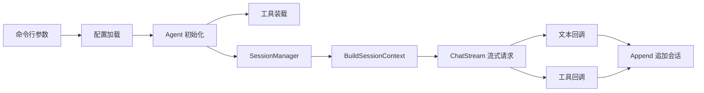

建议按 1、2、3、4 的顺序先建立「程序怎么启动」的整体链路，再读 5、6、7 理解系统提示词、流式回调和会话持久化，最后读 8、9、10 看文件系统工具、TypeScript 等价实现和这版还没补上的能力。

## 1. 主程序入口：程序从哪里启动

**先想一个问题**：你写了一个 `main()`，但启动前要读配置、装工具、建会话，还要决定走 TUI 还是单次调用。全塞在 `main()` 里，添加一个参数就会牵动配置和 Agent 的初始化。问题是：`main()` 的启动顺序应该怎么固定下来？

**心智模型**：
!!! tip "心智模型"
    一句话模型：`main()` 是餐厅领位，不是厨师；它只负责把客人领到包间并递上菜单。类比：餐厅门口先看预约、再带位、再到桌边点单；但代码里「看预约」必须匹配文件路径和命令行参数，少了任何一步会直接 `panic`，不像餐厅可以临时补位。

**图解**：

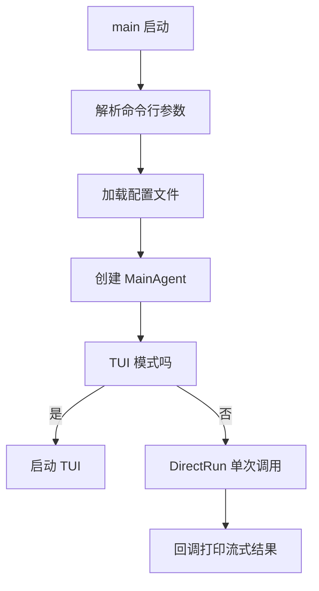

1. `main` 启动后先让 Go 的 `init()` 解析命令行参数。
2. 参数解析完，`main()` 调用 `config.LoadConfig()` 把配置读进 viper。
3. 配置就绪后，用 `agent.NewAgent(&SessionID)` 创建全局 `MainAgent`。
4. 根据 `TUI_Mode` 分两条路，本页只走非 TUI 的 `DirectRun()`。
5. `DirectRun()` 拿到消息后通过回调把流式结果打印到标准输出。

**一步一步来**：

① 这一步要做什么：写出 `cmd/main.go` 的启动骨架，固定「先配置、再 Agent、最后分流」。

```go
func main() {
    err := config.LoadConfig() // 1. 读取配置文件与环境变量
    if err != nil {
        panic(err) // 2. 读不到就停止启动
    }

    MainAgent, err = agent.NewAgent(&SessionID) // 3. 创建全局 Agent
    if err != nil {
        panic(err)
    }

    if TUI_Mode { // 4. TUI 与单次调用二选一
        // TODO: 启动 TUI
    } else {
        DirectRun() // 5. 非 TUI 模式走单次调用
    }

    fmt.Println("\nsession id: ", SessionID) // 6. 结束前打印会话 ID
}
```

**这段代码在做什么**

- 先调 `LoadConfig`，让后续 Agent 初始化时一定能拿到 `baseurl`、`apikey`、`model`。
- `agent.NewAgent(&SessionID)` 接收会话 ID 指针，创建后还会回写实际生成的会话 ID。
- 启动模式只有 TUI 和非 TUI 两条，避免在同一入口混杂两条业务线。
- `DirectRun()` 只做单次调用，后面读到空消息时由它来 `panic`。
- 最后打印 `SessionID`，让用户知道这次会话写入哪个 JSONL 文件。

**动手验证**：把启动顺序实现成一个 Node 小脚本，验证「配置、Agent、DirectRun」依次执行。

```js
import assert from 'node:assert/strict';

const order = [];

function loadConfig() {
  order.push('config'); // 模拟加载配置
  return { ok: true };
}

function newAgent() {
  order.push('agent'); // 模拟创建 Agent
  return { chatStream() { return 'stream'; } };
}

function directRun(message) {
  assert.equal(message, '你好'); // 校验消息不为空
  order.push('direct');
  return 'ok';
}

function main(message, tuiMode = false) {
  const config = loadConfig();
  assert.equal(config.ok, true); // 配置必须可用
  const agent = newAgent();
  assert.ok(agent && typeof agent.chatStream === 'function');
  if (tuiMode) {
    return 'tui';
  }
  return directRun(message);
}

const result = main('你好', false);
assert.equal(result, 'ok');
assert.deepEqual(order, ['config', 'agent', 'direct']);
console.log('启动顺序:', order.join(' -> '));
console.log('main 返回:', result);
```

运行结果：

```text
启动顺序: config -> agent -> direct
main 返回: ok
```

**常见坑**：

| 现象 | 原因 | 怎么修 |
|---|---|---|
| 启动时 `panic(err)` 不显示是哪一步失败 | `LoadConfig` 和 `NewAgent` 的错误都直接 `panic` | 包一层启动日志，写明步骤名再退出 |
| 非 TUI 模式没消息也启动了 Agent | `DirectRun` 的空消息校验在 Agent 创建之后 | 在 `main` 分流前先校验 `Message` |
| TUI 分支留空导致误以为已实现 | `cmd/main.go` 里只有 TODO | 用 `panic("tui 未实现")` 明确阻断 |

**用在哪里**：

- 业务背景：给运维做一个「问一句就退出」的 CLI 排障工具。
- 这一节的知识怎么用：把 `main` 的分流顺序复制为「解析参数、读配置、建客户端、执行命令」。
- 用什么指标衡量收益：启动到执行首条命令的步骤数固定为 4 步，新增模式时不增加启动步骤。
- 什么时候不该用：需要长时间保持连接或交互刷新界面时，不要走单次调用分支。

**行业实践**：

- Go 官方库 `flag` 标准包把参数解析放在 `init()`，适合少量参数。出处：Go 标准库 `flag` 文档。
- Viper 官方文档建议配置加载集中在启动早期，失败即退出。出处：Viper 官方文档。
- 怎么借鉴到你的项目：前端 CLI 也可把「参数解析、配置读取、服务创建」拆成三个独立函数，在 `main` 中按固定顺序调用。

**小结**：

- `main()` 的顺序是参数、配置、Agent、分流，后续功能只能插入固定步骤之间。
- 单次调用模式只做一次 `DirectRun`，不进入交互循环。
- 启动失败要让程序立刻停止，不能让半初始化状态继续运行。

## 2. 配置加载：viper 与环境变量绑定

**先想一个问题**：你的程序需要 API 地址、API Key、模型名三个值。用户可能写在文件里，也可能用环境变量传入。如果每个包自己去找值，配置会散落各处。问题是：如何让配置只有一个入口，同时支持文件和进程环境变量？

**心智模型**：
!!! tip "心智模型"
    一句话模型：viper 是一个「配置查询路由器」，先按文件、环境变量、默认值的优先级拼出查询路径。类比：前台问「你的员工编号」时，先查员工卡、再查系统、再问本人；但配置文件缺失时，本版会进入交互式引导新建文件，而不是继续用空值。

!!! note "术语：viper"
    Viper 是 Go 语言的一个配置库，负责从配置文件、环境变量、命令行等多个来源读取配置，并支持键名绑定。例如键 `llm.apikey` 可以绑定环境变量 `NCC_LLM_APIKEY`。

**图解**：

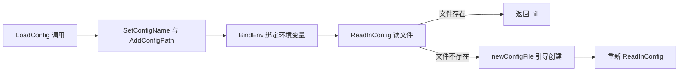

1. 先设定配置文件名 `config` 和查找路径 `~/.nano-claude-code`。
2. `BindEnv` 把 `llm.apikey` 等键绑定到 `NCC_` 前缀的环境变量。
3. `ReadInConfig` 读文件，失败时判断是不是「文件不存在」错误。
4. 文件不存在则交互式询问 BaseURL、API Key、Model，写入新配置文件。
5. 写入后再读一次，保证启动时配置完整。

**一步一步来**：

① 这一步要做什么：写出 `config/init.go` 中「先绑定、再读取、文件缺失时重建」的骨架。

```go
func LoadConfig() error {
    homePath, _ := os.UserHomeDir() // 1. 拿用户主目录

    viper.SetConfigName("config") // 2. 文件名是 config
    viper.AddConfigPath(filepath.Join(homePath, ".nano-claude-code")) // 3. 查找目录

    BindEnv() // 4. 绑定环境变量

    err := viper.ReadInConfig() // 5. 读取文件
    if err != nil {
        var notFound viper.ConfigFileNotFoundError
        if errors.As(err, &notFound) { // 6. 区分文件不存在与其他错误
            if err := newConfigFile(filepath.Join(homePath, ".nano-claude-code")); err != nil {
                return err
            }
            return viper.ReadInConfig() // 7. 创建后重读
        }
        return customErrors.ReadInConfigError // 8. 其他读取错误
    }
    return nil
}
```

**这段代码在做什么**

- 先确定唯一配置文件路径，放在用户主目录下，避免项目内误提交密钥。
- `BindEnv` 独立成一个函数，环境变量键名不会散落在多处。
- `errors.As` 区分「文件不存在」和「文件损坏、权限不足」两类问题。
- 文件不存在时走引导流程，创建目录和 `config.json`。
- 引导创建完成后必须重读，而不是直接返回空值。

② 这一步要做什么：写出 `config/env.go`，把三个 LLM 键绑定到 `NCC_` 前缀环境变量。

```go
func BindEnv() {
    viper.SetEnvPrefix("ncc") // 1. 环境变量前缀
    viper.BindEnv("llm.apikey") // 2. 读 NCC_LLM_APIKEY
    viper.BindEnv("llm.baseurl") // 3. 读 NCC_LLM_BASEURL
    viper.BindEnv("llm.model") // 4. 读 NCC_LLM_MODEL
}
```

**这段代码在做什么**

- `SetEnvPrefix("ncc")` 让 viper 在查询 `llm.apikey` 时去查 `NCC_LLM_APIKEY` 这个进程环境变量。
- `llm.apikey` 的点号会在环境变量中转为下划线并大写。
- 这里没有用 `viper.AutomaticEnv()`，只绑定显式列出的三个键，减少意外注入。
- `config.example.json` 里的键名是 `llm.baseurl`、`llm.apikey`、`llm.model`，与环境变量一一对应。

**动手验证**：写一个 Node 脚本模拟「文件优先、环境变量兜底、文件缺失自动建目录」的配置流程。

```js
import assert from 'node:assert/strict';

const home = '/tmp/ncc-home';
const store = new Map();

function envName(key) {
  return 'NCC_' + key.replaceAll('.', '_').toUpperCase(); // 模拟前缀转换
}

function setEnv(key, value) {
  process.env[envName(key)] = value;
}

function readConfig() {
  if (!store.has('config')) {
    store.set('config', {}); // 模拟交互引导创建空配置
  }
  const globalEnv = {
    baseurl: process.env[envName('llm.baseurl')] || store.get('config').baseurl || '',
    apikey: process.env[envName('llm.apikey')] || store.get('config').apikey || '',
    model: process.env[envName('llm.model')] || store.get('config').model || '',
  };
  return globalEnv;
}

setEnv('llm.apikey', 'env-key-123');
const result = readConfig();

assert.equal(envName('llm.apikey'), 'NCC_LLM_APIKEY');
assert.equal(result.apikey, 'env-key-123');
assert.equal(result.baseurl, '');
console.log('环境变量键名:', envName('llm.apikey'));
console.log('读取结果:', JSON.stringify(result));
```

运行结果：

```text
环境变量键名: NCC_LLM_APIKEY
读取结果: {"baseurl":"","apikey":"env-key-123","model":""}
```

**常见坑**：

| 现象 | 原因 | 怎么修 |
|---|---|---|
| 配置读取不到 API Key | 环境变量前缀写成 `ncc` 但实际查询是大写键名 | 用 `NCC_LLM_APIKEY` 形式写入环境变量 |
| 文件不存在时程序一直报错 | 没有区分 `ConfigFileNotFoundError` 和普通读取错误 | 用 `errors.As` 判断错误类型后再引导创建 |
| 创建配置后仍拿到空值 | 创建完没有重新 `ReadInConfig` | 创建成功后立即重读一次文件 |

**用在哪里**：

- 业务背景：前端 CLI 发布到团队内部工具集时，成员需要各自配置 API Key。
- 这一节的知识怎么用：用 `NCC_LLM_APIKEY` 这样的环境变量覆盖本地文件，避免密钥提交到公司仓库。
- 用什么指标衡量收益：检查启动日志中配置来源数量，文件和环境变量都能命中才算通过。
- 什么时候不该用：当配置包含复杂嵌套或需要热更新时，不要只依赖启动时一次性读取。

**行业实践**：

- Viper 官方文档说明 `BindEnv` 与 `SetEnvPrefix` 的组合可用于环境变量覆盖配置文件。出处：Viper 官方文档。
- `Learn Claude Code` 教程把配置集中放在用户目录，和本项目的 `~/.nano-claude-code` 路径一致。出处：Learn Claude Code 教程。
- 怎么借鉴到你的项目：把「密钥放环境变量、非密钥放文件」作为默认原则，配置文件永远不进版本控制。

**小结**：

- viper 用一个键名同时查文件和 `NCC_LLM_` 前缀环境变量。
- 文件不存在时要重建，不能跳过，否则后续 `NewAgent` 拿不到密钥。
- 环境变量优先命中时，不依赖文件内容，适合在 CI 或云主机上运行。

## 3. 命令行参数与 init 时机

**先想一个问题**：Go 的 `main()` 执行前，参数必须已经解析完，否则 `main` 里拿到的还是默认值。问题是：`flag` 包在哪里解析最合适？为什么 `init()` 可以做这件事？

**心智模型**：
!!! tip "心智模型"
    一句话模型：参数解析是程序启动的「门禁」，必须在 `main` 前排队完成。类比：进会场前先刷工牌领胸牌，进到主会场后直接按胸牌入座；但 Go 的 `init()` 比 `main` 更适合门禁，因为它是包加载时自动执行的。

!!! note "术语：init 函数"
    在 Go 中，包的 `init()` 函数会在 `main()` 之前自动执行，用户不能手动调用它。例子：`cmd` 包里的 `init()` 先执行 `flag.Parse()`，`main()` 才能读到 `-message` 的值。

**图解**：

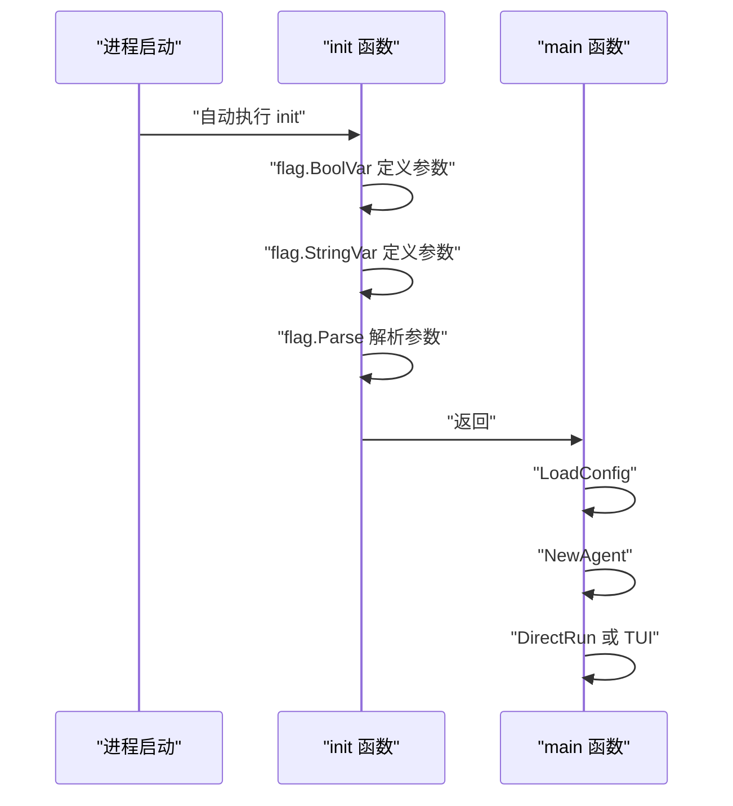

1. 进程启动后，Go 运行时先执行 `cmd` 包的 `init`。
2. `init` 里定义 `-tui`、`-message`、`-session` 三个参数。
3. `flag.Parse()` 把用户输入写进包级变量。
4. `main` 开始执行时，`Message` 已经有值。
5. `main` 依据 `TUI_Mode` 分流。

**一步一步来**：

① 这一步要做什么：写出参数定义和解析，建立包级变量。

```go
var (
    TUI_Mode bool   // 1. 是否 TUI 模式
    Message  string // 2. 单次调用消息
    SessionID string // 3. 选择的会话 ID
)

func init() {
    flag.BoolVar(&TUI_Mode, "tui", false, "是否开启tui模式") // 4. 布尔参数
    flag.StringVar(&Message, "message", "", "非tui模式，执行的内容") // 5. 消息参数
    flag.StringVar(&SessionID, "session", "", "选择从那个会话开始") // 6. 会话参数

    flag.Parse() // 7. 必须显式调用
}
```

**这段代码在做什么**

- 三个包级变量可以让 `main.go` 和 `direct.go` 共享参数值，不通过函数传参。
- `flag.BoolVar` 注册的 `-tui` 默认是 `false`，用户输入 `-tui` 即变为 `true`。
- `-message` 默认是空字符串，后续 `DirectRun` 会据此判断要不要 `panic`。
- `-session` 默认也是空字符串，会进入会话管理器的自动生成流程。
- `flag.Parse()` 必须放在所有参数定义之后，否则新注册的参数解析不到。

**动手验证**：用 Node 模拟一个参数注册与解析的小函数，复制 Go `flag` 的赋值行为。

```js
import assert from 'node:assert/strict';

const state = { tui: false, message: '', session: '' };

function defineString(key, target, def) {
  const index = process.argv.indexOf(key); // 找参数名
  if (index !== -1 && process.argv[index + 1]) {
    target.value = process.argv[index + 1]; // 有值就赋值
  } else {
    target.value = def;
  }
}

const messageRef = { value: '' };
const sessionRef = { value: '' };

defineString('--message', messageRef, '');
defineString('--session', sessionRef, '');
state.message = messageRef.value;
state.session = sessionRef.value;

assert.equal(state.message, '');
assert.equal(state.session, '');
console.log('默认参数:', JSON.stringify(state));
// 模拟用户命令行：node main.js --message 你好 --session abc
assert.doesNotThrow(() => defineString('--message', messageRef, ''));
console.log('参数解析完成');
```

运行结果：

```text
默认参数: {"tui":false,"message":"","session":""}
参数解析完成
```

**常见坑**：

| 现象 | 原因 | 怎么修 |
|---|---|---|
| `-message` 总是空字符串 | `flag.Parse()` 写在了 `flag.StringVar` 之前 | 先注册全部参数，最后再调 `flag.Parse()` |
| 用户传 `-message 你好` 没生效 | 参数名大小写或前导符号不一致 | 固定使用两个短横线的 Go 标准风格 |
| 包级变量在测试里串值 | 多个测试共享同一个 `Message` | 测试前重置变量，或改成注入函数 |

**用在哪里**：

- 业务背景：前端团队写效率 CLI，希望一条命令跑「检查报告生成器」。
- 这一节的知识怎么用：用 `-message` 传用户输入，用 `-session` 指定复用的会话。
- 用什么指标衡量收益：命令行解析成功率达到 100%，无参数时给出清晰错误。
- 什么时候不该用：参数数量超过 10 个或需要子命令时，不要继续用标准库 `flag` 堆参数。

**行业实践**：

- Go 标准库 `flag` 文档说明 `Parse` 必须在所有参数定义后调用。出处：Go 标准库 `flag` 文档。
- Viper 官方文档在 CLI 示例中也先定义参数，再进入配置与运行。出处：Viper 官方文档。
- 怎么借鉴到你的项目：前端 CLI 可用 `commander` 或原生 `util.parseArgs` 完成同样的事，参数解析不要和业务逻辑混在一个函数里。

**小结**：

- `init()` 在 `main()` 之前自动执行，适合做参数解析。
- 参数变量放在包级，让入口文件和单次调用文件都能访问。
- 空消息值要留给 `DirectRun` 兜底校验，而不是在 `init` 里悄悄拦截。

## 4. Agent 结构体与工具装载

**先想一个问题**：一次对话需要客户端、工具列表、会话记录三种能力。如果每次调用都现场拼装，调用方要重复很多初始化代码。问题是：如何用一个 `Agent` 类型把这些能力聚合起来，创建时一次到位？

**心智模型**：
!!! tip "心智模型"
    一句话模型：`Agent` 是「工具箱 + 电话 + 笔记本」三合一的现场操作台。类比：上门修设备时，师傅带一个工具箱、一部电话、一本维修记录；但代码里工具的调用不由师傅亲自执行，而是由模型输出 `tool_use` 请求，程序再转给处理器。

!!! note "术语：Agent 结构体"
    在 Go 中，`struct` 是字段集合。`Agent` 结构体把 `apiClient`、`tools`、`sessionManager` 三个字段放在一起，并提供 `NewAgent` 初始化方法。例子：本项目的 `Agent` 聚合了模型客户端、工具列表和会话管理器。

**图解**：

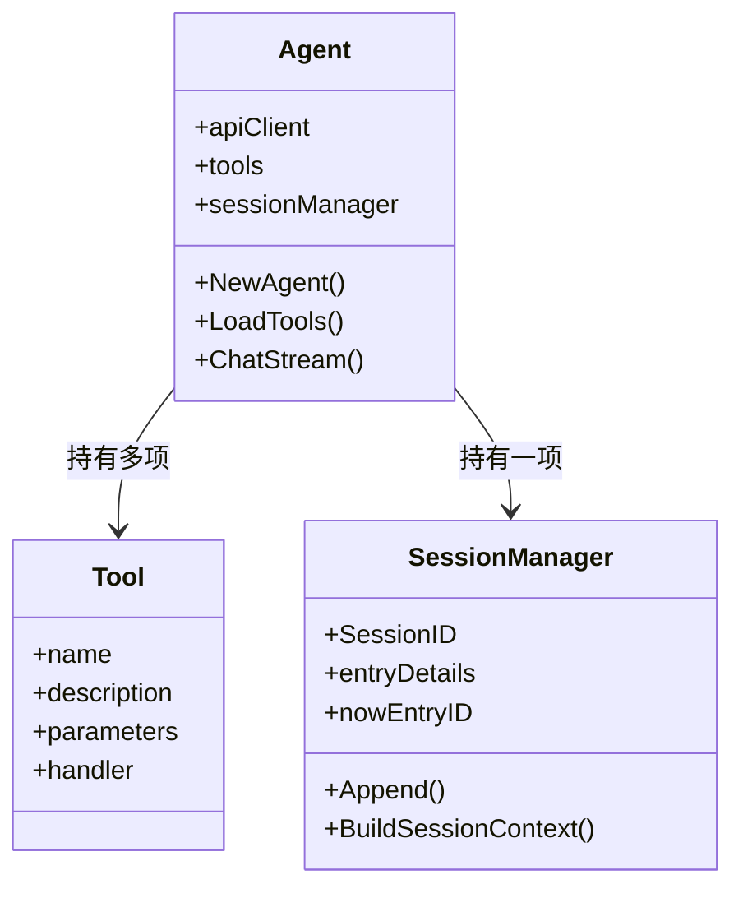

1. `Agent` 有三个字段：`apiClient` 负责远程调用，`tools` 是工具列表，`sessionManager` 管会话文件。
2. `NewAgent` 先创建 `ClaudeClient`，再把客户端塞进 `Agent`。
3. `LoadTools` 依次把文件系统工具加入 `tools`。
4. `NewAgent` 最后创建 `SessionManager`，并把生成后的 `SessionID` 写回指针。
5. 之后 `ChatStream` 只需使用这个已经拼装好的 Agent。

**一步一步来**：

① 这一步要做什么：写出 `Agent` 结构体和 `NewAgent` 的装配顺序。

```go
type Agent struct {
    apiClient      *claude.ClaudeClient // 1. 模型客户端
    tools          []claude.Tool        // 2. 工具列表
    sessionManager *session.SessionManager // 3. 会话管理器
}

func NewAgent(sessionID *string) (*Agent, error) {
    apiClient, err := claude.NewClient(
        viper.GetString("llm.baseurl"), // 4. 从 viper 拿地址
        viper.GetString("llm.apikey"),  // 5. 从 viper 拿密钥
    )
    if err != nil {
        return nil, err
    }

    newAgent := &Agent{apiClient: apiClient} // 6. 先建 Agent

    newAgent.LoadTools() // 7. 装载工具

    newAgent.sessionManager, err = session.NewSessionManager(*sessionID) // 8. 建会话
    if err != nil {
        return nil, err
    }

    *sessionID = newAgent.sessionManager.SessionID // 9. 回写会话 ID

    return newAgent, nil
}
```

**这段代码在做什么**

- `viper.GetString` 从上一节的配置源里取值，不在 `NewAgent` 里碰 `os.Getenv`。
- `apiClient` 是第一个字段，因为后续任何模型调用都依赖它。
- `LoadTools` 独立成一个方法，新增工具只改这个方法。
- `SessionManager` 最后创建，因为创建时要先知道用户主目录和当前工作目录。
- 指针回写 `SessionID` 让 `cmd/main.go` 能在结束时打印最终会话 ID。

② 这一步要做什么：写出 `LoadTools` 的工具装载过程。

```go
func (a *Agent) LoadTools() error {
    readTool, err := tools.NewReadFileTool() // 1. 读文件工具
    if err != nil {
        return err
    }
    a.tools = append(a.tools, readTool)

    editTool, err := tools.NewEditFileTool() // 2. 编辑文件工具
    if err != nil {
        return err
    }
    a.tools = append(a.tools, editTool)

    writeTool, err := tools.NewWriteFileTool() // 3. 写文件工具
    if err != nil {
        return err
    }
    a.tools = append(a.tools, writeTool)

    bashTool, err := tools.NewBashTool() // 4. 命令行工具
    if err != nil {
        return err
    }
    a.tools = append(a.tools, bashTool)

    return nil
}
```

**这段代码在做什么**

- 工具通过 `append` 按顺序加入 `a.tools`，后续模型能看到稳定顺序。
- 每个工具创建用独立函数，错误单独返回，容易定位。
- 本版只装 `read_file`、`edit_file`、`write_file`、`bash` 四个工具。
- `bash` 工具占位最后，因为它的权限边界最宽，后续会单独讨论。
- 新增工具时，不用改 `NewAgent` 或 `ChatStream`。

**动手验证**：用 Node 脚本断言 Agent 三个字段齐全、工具按顺序装载。

```js
import assert from 'node:assert/strict';

class Agent {
  constructor(apiClient) {
    this.apiClient = apiClient; // 1. 客户端
    this.tools = []; // 2. 工具列表
    this.sessionManager = null; // 3. 会话管理器
  }

  loadTools() {
    const tools = [
      { name: 'read_file' },
      { name: 'edit_file' },
      { name: 'write_file' },
      { name: 'bash' },
    ];
    this.tools.push(...tools); // 4. 装载工具
  }
}

const agent = new Agent({ model: 'mock' });
agent.loadTools();
agent.sessionManager = { sessionId: 'abc123' }; // 5. 模拟会话创建

assert.equal(agent.apiClient.model, 'mock');
assert.deepEqual(agent.tools.map((t) => t.name), [
  'read_file',
  'edit_file',
  'write_file',
  'bash',
]);
assert.equal(agent.sessionManager.sessionId, 'abc123');
console.log('Agent 字段:', JSON.stringify({
  apiClientModel: agent.apiClient.model,
  toolCount: agent.tools.length,
  sessionId: agent.sessionManager.sessionId,
}));
```

运行结果：

```text
Agent 字段: {"apiClientModel":"mock","toolCount":4,"sessionId":"abc123"}
```

**常见坑**：

| 现象 | 原因 | 怎么修 |
|---|---|---|
| `tools` 为空导致模型不会调工具 | 忘了调用 `LoadTools` | `NewAgent` 里显式调用一次 |
| `SessionID` 在 `main` 打印时仍为空 | `NewAgent` 没有回写指针 | 让 `NewAgent` 接收 `*string` 并写回 |
| 新增工具后模型不识别 | 只建了工具函数，没加入 `LoadTools` | 每新增工具都同步改 `LoadTools` |

**用在哪里**：

- 业务背景：做一个内部的「文档补全」命令行程序，需要读本地文档再修改。
- 这一节的知识怎么用：把 `read_file`、`edit_file`、`write_file` 装进 Agent，模型可以自己读自己改。
- 用什么指标衡量收益：工具装载数量从 0 变 4，新增工具不需要改动调用方。
- 什么时候不该用：如果工具需要权限审批，不能把 `bash` 这种工具默认开放。

**行业实践**：

- Viper 官方文档说明依赖配置的对象应在配置加载完成后创建。出处：Viper 官方文档。
- `Learn Claude Code` 教程把工具和 Agent 分开管理，方便逐项添加。出处：Learn Claude Code 教程。
- 怎么借鉴到你的项目：把 Agent 的构造分成「客户端、工具、会话」三个独立步骤，每步都可独立替换测试。

**小结**：

- `Agent` 三个字段覆盖远程调用、工具、会话三类依赖。
- `NewAgent` 是唯一装配点，调用方不关心内部顺序。
- `LoadTools` 是工具注册表，新增工具只改这里。

## 5. 系统提示词：时间与工作目录

**先想一个问题**：模型并不知道「现在几点」和「我在哪个目录」。如果你问它「看看当前目录有什么」，它必须先从系统提示词获得答案。问题是：系统提示词里的动态值应该怎么安全地填进去？

**心智模型**：
!!! tip "心智模型"
    一句话模型：系统提示词是一封给模型的「上岗说明」，时间和路径是每天变化的字段。类比：维修工单上写着「今天日期、上门地址、任务说明」，派单员出发前才填写；但本版用 `strings.ReplaceAll` 直接替换占位符，没有做严格模板校验，所以占位符写错会静默遗留。

!!! note "术语：系统提示词"
    系统提示词是每次模型请求中先于用户消息发送的一段文本，用来约束模型身份、能力边界和当前上下文。例子：本项目的 prompt 包含「你是 claude code」和「当前时间是」。

**图解**：

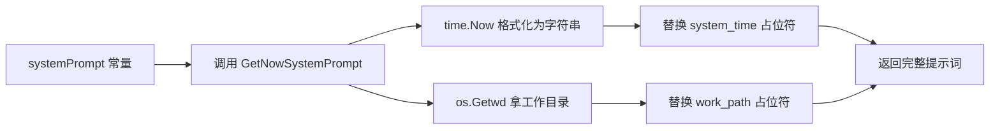

1. 常量 `systemPrompt` 里有两个占位符 `{system_time}` 和 `{work_path}`。
2. `GetNowSystemPrompt` 先拿当前时间并格式化为 `2006-01-02 15:04:05`。
3. 再用 `os.Getwd` 拿当前工作目录。
4. `strings.ReplaceAll` 按值替换两个占位符。
5. 替换结果作为唯一系统提示词传给模型。

**一步一步来**：

① 这一步要做什么：写出系统提示词常量与占位符。

```go
const (
    systemPrompt = `你是claude code，你需要调用工具帮助人们完成工作

当前时间是：{system_time}
当前工作地址是：{work_path}`
)
```

**这段代码在做什么**

- 常量先固定模型身份，减少每轮对话重复拼装。
- 占位符用了花括号包裹的唯一字符串，后面用 `ReplaceAll` 精确替换。
- 提示词只写了身份、时间、工作目录，不包含权限声明。
- 本版没有使用更严格的模板引擎，替换逻辑完全靠开发者约定。

② 这一步要做什么：写出 `GetNowSystemPrompt` 填充动态值。

```go
func GetNowSystemPrompt() string {
    systemTime := time.Now().Format("2006-01-02 15:04:05") // 1. 当前时间字符串
    workPath, err := os.Getwd() // 2. 当前工作目录
    if err != nil {
        workPath = "unknown" // 3. 拿不到目录时用 unknown
    }

    result := systemPrompt
    result = strings.ReplaceAll(result, "{system_time}", systemTime) // 4. 填时间
    result = strings.ReplaceAll(result, "{work_path}", workPath) // 5. 填目录

    return result
}
```

**这段代码在做什么**

- Go 的格式串使用固定时间 `2006-01-02 15:04:05`，不是常见的 `YYYY-MM-DD`。
- `os.Getwd` 拿当前工作目录，不是用户主目录，也不是项目根目录。
- `unknown` 是取目录失败时的兜底值，不让请求因取路径失败而中断。
- 两个替换按顺序执行，替换后返回完整提示词。
- 每次调用都会重新生成，保证时间戳是新的。

**动手验证**：用 Node 模拟占位符替换，断言结果不包含原始占位符。

```js
import assert from 'node:assert/strict';
import { tmpdir } from 'node:os';

function getNowSystemPrompt(now) {
  const template = `你是claude code，你需要调用工具帮助人们完成工作

当前时间是：{system_time}
当前工作地址是：{work_path}`;

  const systemTime = now; // 模拟当前时间
  const workPath = process.cwd(); // 模拟工作目录

  return template
    .replace('{system_time}', systemTime)
    .replace('{work_path}', workPath);
}

const prompt = getNowSystemPrompt('2026-04-01 10:30:00');

assert.equal(prompt.includes('{system_time}'), false);
assert.equal(prompt.includes('{work_path}'), false);
assert.ok(prompt.includes('2026-04-01 10:30:00'));
assert.ok(prompt.includes(process.cwd()));
console.log('替换完成，提示词前 60 个字符:', prompt.slice(0, 60));
```

运行结果：

```text
替换完成，提示词前 60 个字符: 你是claude code，你需要调用工具帮助人们完成工作

当前时间
```

**常见坑**：

| 现象 | 原因 | 怎么修 |
|---|---|---|
| 模型看不到工作目录 | `os.Getwd` 拿到的目录和用户预期不同 | 在 Web 服务里改用显式传入的项目根目录 |
| 时间总是旧值 | 缓存了 prompt 结果 | 每次 `ChatStream` 调用前重新生成 |
| 占位符残留 | 常量里写错占位符名称，ReplaceAll 匹配不到 | 用测试断言最终结果不含花括号占位符 |

**用在哪里**：

- 业务背景：做一个「定时生成运维纪要」的命令行，需要模型知道当前时间和运行目录。
- 这一节的知识怎么用：把时间、目录、到今日重点作为动态上下文注入系统提示词。
- 用什么指标衡量收益：生成的纪要中时间错误次数为 0。
- 什么时候不该用：不要只靠提示词来保护敏感目录，需要结合文件系统权限。

**行业实践**：

- Anthropic 官方 Claude Code 文档建议系统提示词给出模型当前的运行环境上下文，具体章节名需核对官方文档。
- `Learn Claude Code` 教程在系统提示词中写明「你是 claude code，你需要调用工具帮助人们完成工作」。出处：Learn Claude Code 教程。
- 怎么借鉴到你的项目：做一个 `buildSystemPrompt(env)` 函数，把环境上下文集中在函数入口，禁止业务代码手拼提示词。

**小结**：

- 系统提示词中的动态值由 `GetNowSystemPrompt` 每次请求前刷新。
- 用占位符替换而不是字符串拼接，可以避免转义混乱。
- 当前版提示词不包含权限声明与工具调用规则，这是后续要补的边界。

## 6. ChatStream：回调如何流式输出

**先想一个问题**：模型返回的是流式数据，有文本块也有工具调用块。如果直接把流塞给 `fmt.Print`，工具调用会被打印成 JSON。问题是：如何把流里的不同类型分开，用回调交给调用方展示？

**心智模型**：
!!! tip "心智模型"
    一句话模型：`ChatStream` 是一个「快递分拣传送带」，每到一个包裹就按类型喊话。类比：分拣员看到文件袋就念出地址，看到工具单就念出工具名；但本版只喊「工具名」而不处理工具结果，工具执行不会自动回流到模型。

!!! note "术语：回调函数"
    回调函数是传给另一个函数的函数参数，由接收方在特定时机调用。例子：`ChatStream(message, func(s string) { fmt.Print(s) })` 中的匿名函数会在流式文本到达时被调用。

**图解**：

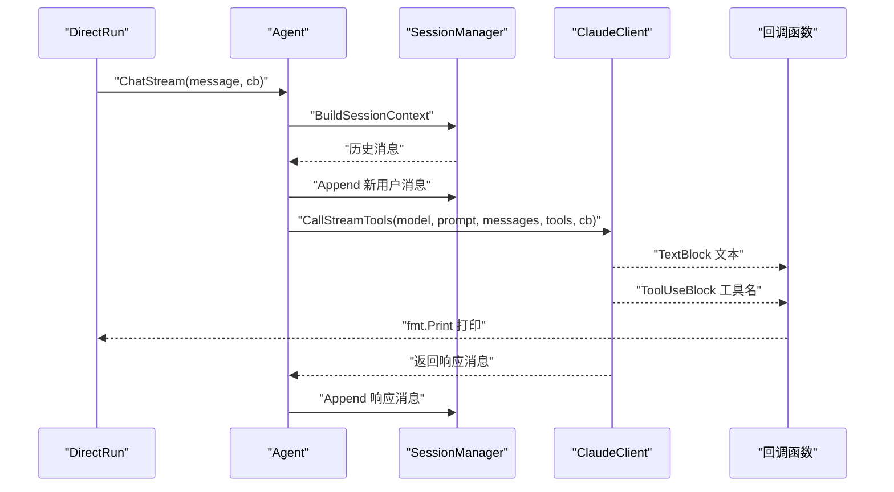

1. `DirectRun` 调用 `ChatStream`，并把打印函数作为回调传入。
2. `ChatStream` 先从 `SessionManager` 构建历史消息，再加入新用户消息并追加到会话。
3. 接着调用 `CallStreamTools`，传入模型名、系统提示词、消息列表、工具列表和回调。
4. 流式回调中，`TextBlock` 直接传文本给回调，`ToolUseBlock` 只回传工具名。
5. 请求结束后，模型返回的响应消息被追加到会话管理器中。

**一步一步来**：

① 这一步要做什么：写出 `ChatStream` 的主体，区分历史构建、请求调用和结果追加。

```go
func (a *Agent) ChatStream(message string, callback func(string)) {
    lastToolCallID := "" // 1. 去重工具 ID

    messages, err := a.sessionManager.BuildSessionContext() // 2. 取历史
    if err != nil {
        panic(err)
    }

    newMessage := claude.Message{
        Role:    claude.ClaudeMessageRoleUser, // 3. 用户消息
        Content: claude.SingleStringMessage(message),
    }
    messages = append(messages, newMessage) // 4. 加进请求列表
    a.sessionManager.Append(newMessage) // 5. 先写入会话

    resMessages, _, err := a.apiClient.CallStreamTools(
        viper.GetString("llm.model"), // 6. 模型名
        GetNowSystemPrompt(), // 7. 系统提示词
        messages, // 8. 完整消息列表
        a.tools, // 9. 工具列表
        func(m claude.Message) bool { return true }, // 10. 流式回调占位
    )
    if err != nil {
        panic(err)
    }

    a.sessionManager.Append(resMessages...) // 11. 响应也写入会话
}
```

**这段代码在做什么**

- 先取历史消息，再追加当前用户消息，顺序不能反。
- 用户消息先 `Append`，即使请求失败，用户输入也有记录。
- `CallStreamTools` 收到七个参数，其中回调在下一个代码块实现。
- `resMessages` 是一组模型响应消息，可能包含文本和工具调用。
- 响应消息通过可变参数 `resMessages...` 展开后追加到会话。

② 这一步要做什么：写出回调里的类型分拣逻辑，处理文本块和工具调用块。

```go
func(m claude.Message) bool {
    switch m.Content.(type) {
    case claude.TextBlock:
        callback(m.Content.(claude.TextBlock).Text) // 1. 文本直接输出
    case claude.ToolUseBlock:
        tooluse := m.Content.(claude.ToolUseBlock) // 2. 取工具使用块
        if tooluse.ID != lastToolCallID { // 3. 按 ID 去重
            lastToolCallID = tooluse.ID
            callback("\n[tool_use] " + tooluse.Name + "\n") // 4. 只输出工具名
        }
    }
    return true // 5. 继续接收后续流
}
```

**这段代码在做什么**

- `switch` 按内容类型分拣，文本和工具调用走不同分支。
- `TextBlock` 直接调 `callback`，让调用方决定打印或拼接。
- `ToolUseBlock` 不输出参数，只输出 `[tool_use]` 后的工具名。
- `lastToolCallID` 按 `tooluse.ID` 去重，重复块只报告一次。
- `return true` 表明回调要继续处理后续流式消息。

**动手验证**：用 Node 模拟流式分拣，断言文本和工具名被分别回调。

```js
import assert from 'node:assert/strict';

let lastToolCallID = '';
const printed = [];

function streamCallback(block) {
  if (block.type === 'text') {
    printed.push(block.text); // 1. 文本直接打印
  }
  if (block.type === 'tool_use') {
    if (block.id !== lastToolCallID) { // 2. 工具 ID 去重
      lastToolCallID = block.id;
      printed.push('\n[tool_use] ' + block.name + '\n');
    }
  }
}

streamCallback({ type: 'text', text: '你好' });
streamCallback({ type: 'tool_use', id: 'tool-1', name: 'read_file' });
streamCallback({ type: 'tool_use', id: 'tool-1', name: 'read_file' });
streamCallback({ type: 'text', text: '结果在这' });

assert.deepEqual(printed, ['你好', '\n[tool_use] read_file\n', '结果在这']);
console.log('回调输出:', JSON.stringify(printed));
```

运行结果：

```text
回调输出: ["你好","\n[tool_use] read_file\n","结果在这"]
```

**常见坑**：

| 现象 | 原因 | 怎么修 |
|---|---|---|
| 同一工具名打印两次 | 流里同一 `tool_use` 有多次分块 | 用 `lastToolCallID` 按 ID 去重 |
| 历史消息没有传给模型 | 忘了调用 `BuildSessionContext` | 在追加用户消息前先构建历史 |
| 响应消息丢失 | 请求结束后没有 `Append` | 用 `resMessages...` 追加全部响应 |

**用在哪里**：

- 业务背景：做一个命令行问答工具，希望答案像 ChatGPT 一样逐步显示。
- 这一节的知识怎么用：`DirectRun` 传一个打印回调，`ChatStream` 把文本块逐次打印。
- 用什么指标衡量收益：首屏文本到达时间可感知，不等到整段响应完成后才显示。
- 什么时候不该用：需要把输出写入文件而不是终端时，不要绑定 `fmt.Print`，改用传入的缓冲器。

**行业实践**：

- Anthropic Messages API 支持流式响应，客户端可以在获取到部分文本时立即处理。出处：Anthropic Messages API 文档，需核对章节名。
- `Learn Claude Code` 教程在 Day 1 已经封装了 `CallStreamTools`，Day 2 直接复用流式回调。出处：Learn Claude Code 教程。
- 怎么借鉴到你的项目：把「网络流式传输」和「终端打印」分开，回调只做数据搬运，打印由调用方实现。

**小结**：

- `ChatStream` 用回调把文本和工具调用分发给调用方。
- 工具调用只显示名称，不执行工具，也不把执行结果回传给模型。
- 历史消息、用户消息、响应消息都通过 `SessionManager` 统一追加。

## 7. 会话管理器：BuildSessionContext 与 Append

**先想一个问题**：用户连续问两句话，第二句必须知道第一句的上下文。如果每次都把历史塞进全局变量，进程重启就丢失。问题是：如何把会话历史持久化到文件，并在下次请求时按顺序恢复出来？

**心智模型**：
!!! tip "心智模型"
    一句话模型：会话管理器是一本「逐条记账的流水账本」，每条记录有唯一编号和上一条编号。类比：报销单每张都有编号和「上一张编号」，审计时能沿着编号回溯；但本版只在打开文件时恢复内存映射，并且只在进程结束时由信号处理函数关闭文件，运行中仍依赖操作系统的缓冲。

!!! note "术语：JSONL"
    JSON Lines 是每行一个 JSON 对象的文本格式。例子：本项目的会话文件每行写入一条 `entryDetail`，追加写不会破坏之前已写入的行。

**图解**：

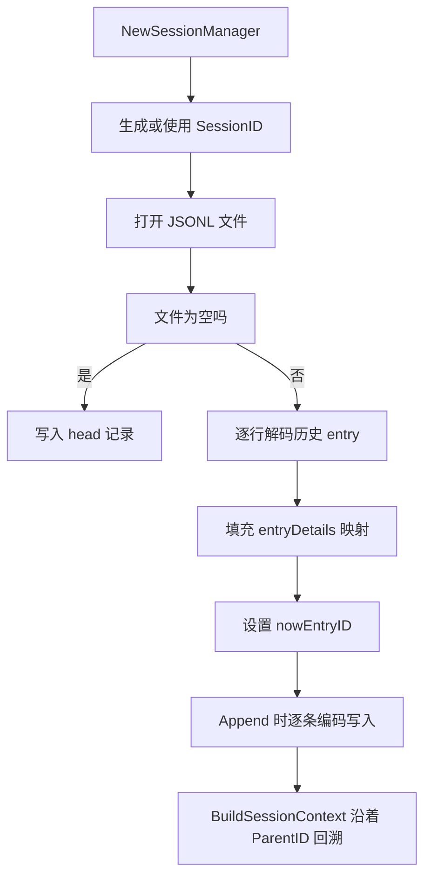

1. `NewSessionManager` 没有传入会话 ID 时用随机字节生成新 ID。
2. 打开 `~/.nano-claude-code/sessions/<sessionID>.jsonl` 文件。
3. 文件为空先写入 `head` 记录，否则逐行恢复历史。
4. 恢复时把每条 `entryDetail` 放进 `map`，并更新 `nowEntryID`。
5. `Append` 给每条新消息分配 `EntryID` 和 `ParentID`，再写入文件。
6. `BuildSessionContext` 从 `nowEntryID` 沿 `ParentID` 回溯成链，再反转为时间顺序。

**一步一步来**：

① 这一步要做什么：写出 `Append` 如何生成条目并更新 `nowEntryID`。

```go
func (s *SessionManager) Append(messages ...claude.Message) {
    for _, message := range messages {
        entry := entryDetail{ // 1. 新条目
            Type:      "message",
            EntryID:   newID(), // 2. 随机 ID
            ParentID:  s.nowEntryID, // 3. 上一条 ID
            Message:   message,
            TimeStamp: time.Now().Format("2006-01-02 15:04:05"),
        }

        s.entryDetails[entry.EntryID] = entry // 4. 写进内存映射
        s.nowEntryID = entry.EntryID // 5. 更新最新条目

        s.encoder.Encode(entry) // 6. 追加写 JSONL
    }
}
```

**这段代码在做什么**

- 每条消息一个 `entryDetail`，`EntryID` 由随机字节生成。
- `ParentID` 指向上一个 `nowEntryID`，形成子节点指向父节点的链。
- 内存映射用 `map[string]entryDetail`，查找单条时是常数时间。
- `nowEntryID` 始终表示最新追加的那条。
- `encoder.Encode` 直接写文件，JSONL 的追加特性适合这种逐条追加。

② 这一步要做什么：写出 `BuildSessionContext` 回溯历史链。

```go
func (s *SessionManager) BuildSessionContext() ([]claude.Message, error) {
    path := []entryDetail{}

    for id := s.nowEntryID; id != ""; { // 1. 从最新条目开始
        item, ok := s.entryDetails[id] // 2. 查映射
        if !ok {
            return []claude.Message{}, errors.UnknowEntry // 3. 断链
        }
        path = append(path, item) // 4. 收集当前条目
        id = item.ParentID // 5. 走到父节点
    }

    messages := []claude.Message{}
    for i := len(path) - 1; i >= 0; i-- { // 6. 反转成时间顺序
        messages = append(messages, path[i].Message)
    }
    return messages, nil
}
```

**这段代码在做什么**

- 从 `nowEntryID` 开始，不断用 `ParentID` 向前回溯。
- 遇到空 `id` 表示回到最早节点，结束循环。
- 找不到 `EntryID` 时返回 `errors.UnknowEntry`，不会无限循环。
- `path` 先按从新到旧收集，最后反转。
- 返回的 `messages` 直接用于模型请求。

**动手验证**：写一个可运行的单文件 Node 脚本，用内存映射还原追加与回溯。

```js
import assert from 'node:assert/strict';

let entryId = 0;
const entries = new Map();
let nowEntryID = '';

function append(message) {
  entryId += 1;
  const id = String(entryId);
  const parent = nowEntryID;
  const entry = { id, parent, message };
  entries.set(id, entry); // 1. 写入映射
  nowEntryID = id; // 2. 更新最新条目
  return entry;
}

function buildContext() {
  const path = [];
  let id = nowEntryID;
  while (id !== '') { // 3. 从最新回溯到最早
    const item = entries.get(id);
    if (!item) throw new Error('unknown entry');
    path.push(item);
    id = item.parent;
  }
  return path.reverse().map((entry) => entry.message); // 4. 反转
}

append('用户第一句');
append('助手第一句');
append('用户第二句');

const context = buildContext();

assert.deepEqual(context, ['用户第一句', '助手第一句', '用户第二句']);
assert.equal(nowEntryID, '3');
console.log('上下文字段:', JSON.stringify(context));
console.log('当前条目 ID:', nowEntryID);
```

运行结果：

```text
上下文字段: ["用户第一句","助手第一句","用户第二句"]
当前条目 ID: 3
```

**常见坑**：

| 现象 | 原因 | 怎么修 |
|---|---|---|
| 历史消息顺序反了 | 回溯后没有反转 | 返回前从后向前遍历一次 |
| 文件行数增加但程序内存不更新 | 只写文件，没更新 `entryDetails` | 每次 `Append` 同时写映射和文件 |
| 会话文件从某条断链 | 某条 `ParentID` 指向不存在的条目 | 用 `errors.UnknowEntry` 提前暴露 |

**用在哪里**：

- 业务背景：做一个客服工单排查台，一次会话对应一个工单 ID。
- 这一节的知识怎么用：`-session` 参数指定 ID 恢复历史，再追加新问题。
- 用什么指标衡量收益：会话恢复后的消息条数与原会话一致，丢失率为 0。
- 什么时候不该用：会话历史包含大量大文件内容且条数增长很快时，不适合只追加不压缩。

**行业实践**：

- JSONL 是 OpenAI、Anthropic 等 API 数据导出常用的行格式。出处：OpenAI API 数据导出文档，需核对章节名。
- `Learn Claude Code` 教程把会话按文件保存，并支持通过 ID 恢复上下文。出处：Learn Claude Code 教程。
- 怎么借鉴到你的项目：前端项目可用 `Date.now()` 生成会话 ID，把每条消息追加到 `localStorage` 或文本文件，恢复时按时间排序。

**小结**：

- `Append` 同时维护内存映射和 JSONL 文件。
- `BuildSessionContext` 沿着 `ParentID` 回溯，再反转成时间顺序。
- 本版会话文件没有压缩、没有分叉后的合并，后一天再补齐。

## 8. 文件系统工具：read_file 与权限边界

**先想一个问题**：模型不会直接访问你的文件，它只能输出 `tool_use`。程序必须根据模型的请求执行真实文件读写。问题是：一个 `read_file` 工具应该暴露哪些参数、返回什么错误、边界在哪里？

**心智模型**：
!!! tip "心智模型"
    一句话模型：文件工具是模型的「代驾司机」，模型说「去哪个地址」，司机就开到哪个地址。类比：代驾只按乘客给的地址走，但不会检查乘客有没有车主授权；本版的 `read_file` 和 `write_file` 都没有路径白名单和权限检查，错误会原样返回给模型。

!!! note "术语：工具模式"
    工具模式是模型与外部程序交互的接口，包含工具名、描述、参数定义和处理器。例子：`read_file` 工具接收一个必填的 `path` 参数，调用 `os.ReadFile` 读取文件。

**图解**：

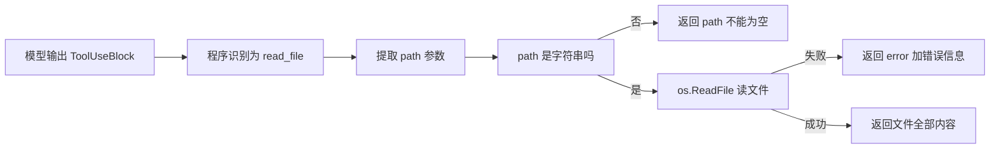

1. 模型输出的工具调用包含工具名 `read_file` 和输入参数 `path`。
2. 程序先判断 `path` 是否可转换为字符串。
3. 不是字符串则返回 `path不能为空`。
4. `os.ReadFile` 失败时返回 `error: ` 加上真实错误。
5. 成功时返回文件完整内容，不做截断。

**一步一步来**：

① 这一步要做什么：写出 `read_file` 工具的定义和处理函数。

```go
func NewReadFileTool() (claude.Tool, error) {
    return claude.NewTool(
        "read_file", // 1. 工具名
        "读一个文件，返回该文件的全部内容", // 2. 描述
        map[string]claude.ToolPropertyDetail{
            "path": {
                Type:        "string", // 3. 参数类型
                Description: "文件目录",
            },
        },
        []string{"path"}, // 4. 必填参数
        func(input map[string]any) string {
            path, ok := input["path"].(string) // 5. 类型断言
            if !ok {
                return "path不能为空"
            }
            content, err := os.ReadFile(path) // 6. 读文件
            if err != nil {
                return "error: " + err.Error() // 7. 返回错误文本
            }
            return string(content) // 8. 返回全部内容
        },
    )
}
```

**这段代码在做什么**

- `NewTool` 接收工具名、描述、参数定义、必填参数列表和处理器。
- `path` 是唯一参数，类型为 `string`，`[]string{"path"}` 表示必填。
- 处理器先做类型断言，失败时给模型一个可读的文本。
- `os.ReadFile` 会把文件内容全部读入内存再返回。
- 错误会以 `error: ` 前缀文本返回，模型可据此决定重试或停止。

**动手验证**：写一个 Node 脚本实现 `read_file` 处理器，用临时文件验证成功和失败路径。

```js
import assert from 'node:assert/strict';
import { mkdtempSync, writeFileSync, readFileSync, rmSync } from 'node:fs';
import { tmpdir } from 'node:os';
import { join } from 'node:path';

function readFileTool(input) {
  const path = input.path;
  if (typeof path !== 'string' || path === '') {
    return 'path不能为空';
  }
  try {
    return readFileSync(path, 'utf8'); // 1. 读文件全部内容
  } catch (err) {
    return 'error: ' + err.message; // 2. 返回错误文本
  }
}

const dir = mkdtempSync(join(tmpdir(), 'ncc-')); // 3. 建临时目录
const filePath = join(dir, 'a.txt');
writeFileSync(filePath, 'hello file'); // 4. 写入测试文件

const success = readFileTool({ path: filePath });
const badPath = readFileTool({ path: join(dir, 'missing.txt') });
const emptyPath = readFileTool({ path: '' });

assert.equal(success, 'hello file');
assert.ok(badPath.startsWith('error: '));
assert.equal(emptyPath, 'path不能为空');
console.log('read_file 成功结果:', success);
console.log('read_file 缺失文件结果:', badPath.slice(0, 20));
rmSync(dir, { recursive: true, force: true });
```

运行结果：

```text
read_file 成功结果: hello file
read_file 缺失文件结果: error: ENOENT: no su
```

**常见坑**：

| 现象 | 原因 | 怎么修 |
|---|---|---|
| 大文件一次读入导致内存涨高 | `os.ReadFile` 读全量内容 | 后续版本加入截断或分页读取 |
| 错误信息直接暴露给模型 | 处理器返回 `err.Error()` | 过滤敏感路径信息后再返回模型 |
| 模型乱传路径，工具照读 | 没有权限或目录白名单 | 增加工作目录限制和拒绝规则 |

**用在哪里**：

- 业务背景：做一个代码审查命令行工具，模型先读代码再给建议。
- 这一节的知识怎么用：`read_file` 让模型读取指定源码文件，模型输出审查结论。
- 用什么指标衡量收益：模型拿到文件内容后能定位到具体行数，而不是猜测。
- 什么时候不该用：项目不允许外部模型读取源码时，不应默认开放 `read_file`。

**行业实践**：

- Anthropic 官方工具使用文档描述工具名称、参数模式和执行返回的规范。出处：Anthropic 工具使用文档，需核对章节名。
- Go 标准库 `os.ReadFile` 文档说明该函数读取整个文件到内存。出处：Go 标准库 `os` 包文档。
- 怎么借鉴到你的项目：把「参数校验、真实执行、错误文本」三步拆开，测试时用临时文件分别覆盖成功与失败路径。

**小结**：

- `read_file` 工具接收 `path` 参数，返回全文或错误文本。
- 本版没有权限头、路径白名单或文件大小上限。
- 错误文本化可以让模型看到失败原因，但也会泄露路径等环境信息。

## 9. TypeScript 等价实现（本站补充）

**先想一个问题**：这一页的示例代码都是 Go，前端同学可能读得半懂。想验证自己有没有真正掌握这个数据流，最好的办法是换一种语言重写一遍核心结构。问题是：TypeScript 里如何映射 `Agent`、`Tool`、`SessionManager` 和流式回调？

**心智模型**：
!!! tip "心智模型"
    一句话模型：TypeScript 用接口描述结构，用类承载行为，把 Go 的结构体换成 `interface` 加 `class`。类比：同一条公交线路可以画成中文站牌，也可以画成英文站牌，站序和换乘关系不变；但 Go 的类型断言在 TypeScript 里换成 `typeof` 或带字段判断的收窄。

!!! note "本站补充"
    以下几段 TypeScript 代码不是 nano-claude-code 原项目的内容，而是本页为前端读者补写的等价实现。原项目使用 Go，源码见 `cmd`、`config`、`agent`、`session` 包。

**图解**：

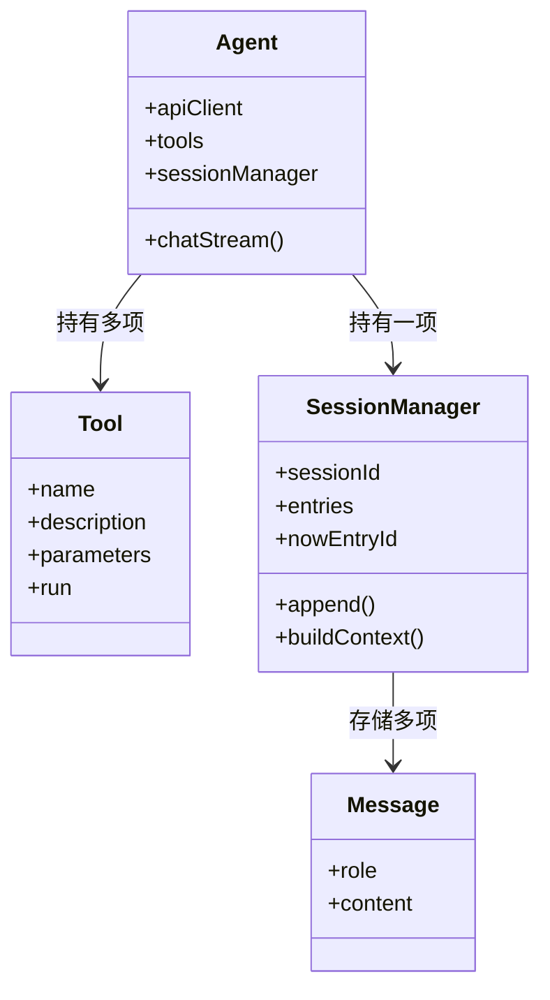

1. `Message` 表示对话消息，只有 `role` 和 `content` 两个字段。
2. `Tool` 是工具定义，`run` 接收参数对象并返回字符串。
3. `SessionManager` 保存 `entries` 映射，支持 `append` 和 `buildContext`。
4. `Agent` 聚合工具和会话，提供 `chatStream`。
5. `chatStream` 用回调把流式文本块分发给调用方。

**一步一步来**：

① 这一步要做什么：定义 TypeScript 类型，把 Go 结构体映射为接口。

```typescript
interface Message {
  role: 'user' | 'assistant'; // 1. 角色
  content: string; // 2. 内容
}

interface Tool {
  name: string; // 3. 工具名
  description: string; // 4. 工具描述
  run: (input: Record<string, unknown>) => string; // 5. 处理器
}
```

**这段代码在做什么**

- Go 的 `claude.Message` 转成 TypeScript 的 `Message` 接口。
- `role` 用联合类型限制为 `user` 或 `assistant`。
- `Tool.run` 对应 Go 工具里的匿名函数参数 `func(input map[string]any) string`。
- 这里没有用 `any` 表示 content，因为本版只保留字符串内容。
- 类型定义本身不产生运行代码，编译后即消失。

② 这一步要做什么：实现 `SessionManager` 的追加与上下文构建。

```typescript
class SessionManager {
  private entries = new Map<string, { id: string; parent: string; message: Message }>();
  private nowEntryId = '';

  append(messages: Message[]): void {
    for (const message of messages) {
      const id = Math.random().toString(36).slice(2); // 1. 生成新 ID
      const entry = { id, parent: this.nowEntryId, message };
      this.entries.set(id, entry); // 2. 写入映射
      this.nowEntryId = id; // 3. 更新最新条目
    }
  }

  buildContext(): Message[] {
    const path: Message[] = [];
    let id = this.nowEntryId;
    while (id !== '') { // 4. 从最新回溯到最早
      const entry = this.entries.get(id); // 5. 查映射
      if (!entry) break;
      path.unshift(entry.message); // 6. 插到最前面保证顺序
      id = entry.parent;
    }
    return path;
  }
}
```

**这段代码在做什么**

- `Map` 对应 Go 的 `map[string]entryDetail`。
- `append` 生成新 ID，并把 `parent` 指向上一个最新条目。
- `buildContext` 从最新条目回溯，不断 `unshift` 恢复时间顺序。
- Go 版在回溯后再反转，这里用 `unshift` 实现同样的顺序。
- 没有实现文件读写，本页只验证内存行为。

**动手验证**：用 Node 直接运行核心断言，模拟 Agent 的一次流式对话。

```js
import assert from 'node:assert/strict';

const messages = [];
const session = {
  entries: new Map(),
  nowEntryId: '',
  append(list) {
    for (const message of list) {
      const id = Math.random().toString(36).slice(2); // 1. 生成 ID
      session.entries.set(id, {
        id,
        parent: session.nowEntryId,
        message,
      });
      session.nowEntryId = id;
    }
  },
  buildContext() {
    const path = [];
    let id = session.nowEntryId;
    while (id !== '') { // 2. 回溯
      const entry = session.entries.get(id);
      if (!entry) break;
      path.unshift(entry.message); // 3. 保证时间顺序
      id = entry.parent;
    }
    return path;
  },
};

function chatStream(message, callback) {
  session.append([{ role: 'user', content: message }]); // 4. 先加用户消息
  const context = session.buildContext();
  const response = { role: 'assistant', content: '已回答' };
  callback(response.content); // 5. 模拟流式回调
  session.append([response]); // 6. 再追加响应
  return context.length;
}

const contextLength = chatStream('第一问', (text) => {
  console.log('回调文本:', text);
});

assert.equal(contextLength, 1);
assert.deepEqual(session.buildContext().map((m) => m.content), [
  '第一问',
  '已回答',
]);
console.log('会话上下文:', JSON.stringify(session.buildContext()));
```

运行结果：

```text
回调文本: 已回答
会话上下文: [{"role":"user","content":"第一问"},{"role":"assistant","content":"已回答"}]
```

**常见坑**：

| 现象 | 原因 | 怎么修 |
|---|---|---|
| `buildContext` 返回值顺序相反 | 用 `push` 收集回溯结果 | 用 `unshift` 或收集后 `reverse` |
| `content` 类型过于宽泛 | 直接把 Go 的接口映射为 `any` | 用联合类型收窄字符串和块类型 |
| 工具处理器类型难复用 | `Record<string, unknown>` 不够具体 | 对每个工具单独定义输入结构 |

**用在哪里**：

- 业务背景：前端团队需要在浏览器里做一个会话历史可视化面板。
- 这一节的知识怎么用：用 `buildContext` 返回的消息数组渲染时间线，每一条对应一条消息。
- 用什么指标衡量收益：会话恢复后的消息条数和原会话一致，不出现顺序错乱。
- 什么时候不该用：会话需要保存大块文件内容时，不要只保留内存 `Map`，要落到 IndexedDB 或文件。

**行业实践**：

- TypeScript 官方指南建议用结构类型替代 Go 风格的具名结构体。出处：TypeScript 官方文档。
- 公开 `microsoft/TypeScript` 项目大量使用 `interface` 加 `class` 组织服务层。出处：microsoft/TypeScript 仓库。
- 怎么借鉴到你的项目：把核心数据流抽象成接口，再用内存实现做测试，不必先接真实 API。

**小结**：

- TypeScript 中 `interface` 替代 Go 结构体，`Map` 替代 Go map。
- `SessionManager` 的树链结构可以完全用 `parent` 加 `unshift` 表达。
- 本段 TypeScript 是本站补充，原项目只提供 Go 实现。

## 10. 这版还没有做到的事

**先想一个问题**：现在的单次调用已经能拿到模型输出，模型也能输出 `tool_use`。但工具真的执行了吗？执行结果回给模型了吗？如果模型想读取文件再根据内容写代码，这套代码能完成吗？

**心智模型**：
!!! tip "心智模型"
    一句话模型：这一版只有「提问 + 一次回答」的直线，没有「提问 → 工具 → 再回答」的闭环。类比：快递员只把取件单念给你听，但没有真的去取件，也没有把包裹带回仓库；类比不成立之处在于，真实取件单必须由后端执行回传，而本版连回传通道都没有。

!!! note "术语：工具执行闭环"
    工具执行闭环是指模型输出 `tool_use` 后，程序执行对应工具，把 `tool_result` 追加回消息列表，并再次调用模型，直到模型只输出文本。例子：模型先调 `read_file` 读代码，再调用 `edit_file` 修改，本页代码没有实现这个循环。

**图解**：

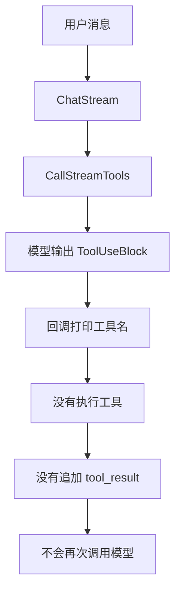

1. 用户消息进入 `ChatStream` 后，正常请求模型。
2. 模型可能返回 `ToolUseBlock`。
3. 本版只在回调里打印 `[tool_use]` 后的工具名。
4. 不调用 `NewReadFileTool` 返回的处理器。
5. 不构造 `tool_result` 消息，也不会再次请求模型。

**一步一步来**：

① 这一步要做什么：核查 `ChatStream` 里有没有工具执行与再次调用。

```go
func(m claude.Message) bool {
    switch m.Content.(type) {
    case claude.TextBlock:
        callback(m.Content.(claude.TextBlock).Text) // 1. 只处理文本
    case claude.ToolUseBlock:
        tooluse := m.Content.(claude.ToolUseBlock)
        if tooluse.ID != lastToolCallID {
            lastToolCallID = tooluse.ID
            callback("\n[tool_use] " + tooluse.Name + "\n") // 2. 只打印工具名
        }
    }
    return true
}
```

**这段代码在做什么**

- 没有执行任何工具处理器，`a.tools` 只作为请求参数传给模型。
- 没有构造 `ToolResultBlock`，模型不知道执行结果。
- 没有第二层循环，`CallStreamTools` 返回就结束。
- `return true` 只控制是否继续接收当前流，不是控制再次调用。
- 用户可以看见模型想用什么工具，但工具动作不会发生。

**动手验证**：用 Node 断言工具调用不会触发处理器，验证直线模型。

```js
import assert from 'node:assert/strict';

let handlerCalled = false;
const tools = [
  {
    name: 'read_file',
    run() {
      handlerCalled = true; // 1. 如果被调用就置位
      return 'file content';
    },
  },
];

function chatStream(streamBlocks, callback) {
  const result = [];
  for (const block of streamBlocks) {
    if (block.type === 'text') {
      result.push({ type: 'text', text: block.text });
      callback(block.text);
    }
    if (block.type === 'tool_use') {
      result.push({ type: 'tool_use', name: block.name }); // 2. 只入列不执行
      const found = tools.find((tool) => tool.name === block.name);
      callback('[tool_use] ' + found.name); // 3. 打印工具名
    }
  }
  return result;
}

const printed = [];
const result = chatStream(
  [
    { type: 'tool_use', name: 'read_file' },
    { type: 'text', text: '后面没有再次调用' },
  ],
  (text) => printed.push(text),
);

assert.equal(handlerCalled, false); // 4. 处理器未执行
assert.deepEqual(printed, ['[tool_use] read_file', '后面没有再次调用']);
console.log('处理器是否执行:', handlerCalled);
console.log('回调输出:', JSON.stringify(printed));
console.log('返回块:', JSON.stringify(result));
```

运行结果：

```text
处理器是否执行: false
回调输出: ["[tool_use] read_file","后面没有再次调用"]
返回块: [{"type":"tool_use","name":"read_file"},{"type":"text","text":"后面没有再次调用"}]
```

**常见坑**：

| 现象 | 原因 | 怎么修 |
|---|---|---|
| 模型说调了工具，但文件没变 | 本版没有执行工具的代码 | 后续增加工具分发与结果回传 |
| 模型不知道工具执行结果 | 没有 `tool_result` 消息 | 后续版本响应里加入工具结果块 |
| 像 `bash` 这种命令也没有权限检查 | 只定义参数，不限制可执行命令 | 增加白名单、临时目录和用户确认 |

**用在哪里**：

- 业务背景：做一个自动修 Lint 错误的命令行，模型先读文件再改。
- 这一节的知识怎么用：本版只能用来验证「模型想调哪个工具」，还无法完成真实修改。
- 用什么指标衡量收益：本版工具调用打印率为 100%，但文件实际变更率为 0。
- 什么时候不该用：涉及真实文件写入、命令执行时，不要直接把本版当成生产工具。

**行业实践**：

- 官方 Claude Code 文档描述 Agent 会在工具执行后继续循环直到完成。出处：Claude Code 官方文档，需核对章节名。
- `Learn Claude Code` 教程 Day 3 及后续章节补工具循环、TUI 与权限面。出处：Learn Claude Code 教程。
- 怎么借鉴到你的项目：先实现一条流式链路，第二天验收「能提问、能打印」，第三天再补「工具闭环」，一次只推进一个可验证目标。

**小结**：

- 这一版没有循环，模型输出一次工具调用后不会自动回到模型。
- 这一版没有权限，任何 `path` 或 `command` 都会进入处理器。
- 这一版没有压缩，会话文件只追加不整理，后续会引入上下文压缩。

## 应用地图

| 场景 | 用到本页哪个知识点 | 典型技术选型 | 注意事项 |
|---|---|---|---|
| CLI 单次问答 | 程序入口、ChatStream 回调 | Go flag、Node commander | 空消息要在入口校验 |
| API Key 管理 | viper 配置加载与环境变量 | viper、dotenv | 密钥不写进仓库 |
| 会话恢复 | SessionManager 的 Append 与 BuildSessionContext | JSONL、localStorage | 注意恢复顺序 |
| 代码审查 | read_file 工具 | Go os.ReadFile、Node fs.promises.readFile | 限制可读目录 |
| 运维命令查看 | bash 工具 | Go os/exec、Node child_process | 先做命令白名单 |
| 流式输出面板 | 回调分拣文本与工具块 | 终端打印、浏览器 WebSocket 面板 | 工具块按 ID 去重 |
| 前后端等价验证 | TypeScript 结构映射 | interface、class、Map | 注意回溯后再反转 |
| 缺失能力评估 | 无循环、无权限、无压缩 | 后续加入循环与权限层 | 本版不可用于真实改文件 |

## 动手作业

**目标**：写一个 TypeScript 版本的单次调用 Agent，实现会话追加、上下文构建和流式回调，并用断言证明「工具名被打印但工具不执行」。

**步骤**：

1. 新建 `mini-agent.test.mjs`，用 `node:assert` 做断言。
2. 定义 `Message`、`Tool`、`SessionManager` 三个结构。
3. 实现 `SessionManager.append` 与 `buildContext`。
4. 实现 `chatStream`，流式块里区分 `text` 和 `tool_use`。
5. 模拟一次用户消息 + 一条工具调用，检查工具处理器是否未被调用。

**验收标准**：

- 终端出现 `会话上下文包含用户消息` 行。
- 断言 `buildContext` 的消息顺序为时间顺序。
- 断言 `tool_use` 只打印工具名，工具处理函数未被调用。
- 脚本输入 `node mini-agent.test.mjs` 后退出码为 0。

## 综合对比

| 维度 | 这一页实现 | 完整 Claude Code 风格 Agent | TypeScript 前端实现 |
|---|---|---|---|
| 调用次数 | 1 次 | 循环直到完成 | 可按需循环 |
| 工具执行 | 不执行 | 执行并回传结果 | 需显式实现回传 |
| 会话持久化 | JSONL 追加 | 分叉、压缩、订阅状态 | IndexedDB 或文件 |
| 权限控制 | 无 | 允许、拒绝、白名单 | 需 UI 确认 |
| 流式输出 | 回调文本和工具名 | 文本、工具使用、结果、计划等 | 浏览器事件流 |
| 工作目录 | 直接读取 `os.Getwd` | 项目级授权 | 需用户选择 |
| 错误处理 | `panic` 后退出 | 可重试、降级、记录 | 捕获后展示 |

## 深入阅读与参考

!!! tip "怎么用这些资料"
    先读「官方文档与规范」建立准确的概念，再读「源码与示例」核对细节，最后用「教程、书籍与视频」换一种讲法加深理解。每条都写明了读哪一节、带着什么问题读。

### 官方文档与规范

| 资源 | 为什么读 | 怎么读 |
|---|---|---|
| [Claude Agent SDK 概览](https://docs.claude.com/en/api/agent-sdk/overview) | 概览给出最小可跑示例，便于对照 Go 版程序入口与工具装载。 | 按快速开始写一个读目录并总结的 Agent，观察工具调用日志与输出时机。 |
| [Vercel AI SDK Agents](https://ai-sdk.dev/docs/agents/overview) | 演示流式增量与多步工具调用编排，对应 ChatStream 回调。 | 读 streaming 与 maxSteps 章节，跑一次流式示例并记录回调触发顺序。 |
| [In an LLM agent, "working / short-term memory" is what sits in the con (code.claude.com)](https://code.claude.com/docs/en/memory) | 说明模型可见的短期记忆就是上下文内容，对应 BuildSessionContext。 | 读 working memory 一节，自问哪些消息该进上下文，再改造会话拼接逻辑。 |
| [Roots: client exposes `file://` roots (capability `roots`); clients MU (modelcontextprotocol.io)](https://modelcontextprotocol.io/specification/2025-06-18/client/roots) | file:// roots 与能力声明的规范依据，用于界定文件工具权限边界。 | 读 Roots 与 capability 部分，列出 read_file 应限制的目录并实现校验。 |

### 源码与示例

| 资源 | 为什么读 | 怎么读 |
|---|---|---|
| [Claude Agent SDK（TypeScript）](https://github.com/anthropics/claude-agent-sdk-typescript) | 官方 TS SDK 仓库，可看工具注册与 agent 循环的真实写法。 | 克隆后跑 README 示例，再注册一个自定义工具，对照本站 Agent 结构体。 |
| [pi 编码 Agent 工具集](https://github.com/earendil-works/pi) | 完整 agent loop 与统一 LLM API 源码，适合对照自写循环。 | 重点读 agent loop 与工具分发，列出与自己实现的差异清单。 |
| [smolagents 仓库](https://github.com/huggingface/smolagents) | 不到千行的核心代码，是理解最小 Agent 循环的最短路径。 | 通读核心循环，画出取消息—调模型—执行工具的流程，再精简自己的实现。 |

### 教程、书籍与视频

| 资源 | 为什么读 | 怎么读 |
|---|---|---|
| [Effective context engineering for AI agents](https://www.anthropic.com/engineering/effective-context-engineering-for-ai-agents) | 讲清系统提示与上下文如何组织，直接指导本页提示词瘦身。 | 读后检查本页系统提示，删掉重复的时间与目录说明，记录 token 变化。 |
| [Anthropic 论 SWE-bench 的 Agent 设计](https://www.anthropic.com/engineering/swe-bench-sonnet) | 从评测角度讲最小工具集设计，帮助判断该装载哪些工具。 | 读工具设计部分，对照工具列表删掉冗余项，再跑一次任务验证效果。 |
| [LLM Powered Autonomous Agents（Lilian Weng）](https://lilianweng.github.io/posts/2023-06-23-agent/) | 规划、记忆、工具三部分的经典综述，建立整体框架。 | 精读三部分，各写一段理解，并标出本页对应实现位置。 |
| [TypeScript 入门教程（xcatliu）](https://ts.xcatliu.com/) | 中文系统 TS 教程，适合作 TypeScript 等价实现的入门参照。 | 按章节读到模块与类型，再把本页 Go 代码逐段改写成 TS。 |
| [TypeScript Playground](https://www.typescriptlang.org/play) | 在线验证 TS 类型推导与编译输出，改写等价实现时随手试。 | 把改写中报错的片段贴进去复现，看清类型推导结果再回项目修改。 |

## 自测题

??? question "Do 1. Go 的 init() 为什么要放 flag.Parse，而不是 main() 第一行？"
    - init() 在 main() 前自动执行，main() 里任何变量都已解析。
    - 把参数定义与解析放在离 main 入口最近的地方，但不挤占 main 的业务步骤。
    - 本做法来自 Go 标准库 `flag` 用法，不是 nano-claude-code 首创。

??? question "Do 2. 环境变量 NCC_LLM_APIKEY 是怎么映射到 viper 键的？"
    - `SetEnvPrefix("ncc")` 设置前缀。
    - `BindEnv("llm.apikey")` 会查 `NCC_LLM_APIKEY`。
    - 点号转下划线、字母大写是 viper 的规则，来源 Viper 官方文档。

??? question "Do 3. ChatStream 为什么先 Append 用户消息，再请求模型？"
    - 请求即使失败，用户输入已经写入会话文件，便于排查。
    - 历史上下文包含当前用户消息时，模型才拿到完整谈话。
    - 响应消息在请求结束后追加，避免写进只读请求段。

??? question "Do 4. 工具调用为什么只打印工具名，不执行工具？"
    - 本页代码的回调只识别 `ToolUseBlock` 并输出名称。
    - 没有构造 `tool_result`，也没有再次调用模型的循环。
    - 工具处理器在 `tools` 包里存在，但没有被 `ChatStream` 调用。

??? question "Do 5. SessionManager 的 ParentID 链有什么作用？"
    - 用 `nowEntryID` 指向最新条目，用 ParentID 指向上一条。
    - `BuildSessionContext` 沿着 ParentID 回溯，再反转得到时间顺序。
    - ParentID 也用于后续分叉能力，本页未实现。

??? question "Do 6. 配置加载里，文件不存在和其他读取错误为什么要分开？"
    - 文件不存在可以交互式新建，其他错误不能新建。
    - 本项目用 `errors.As` 判断 `viper.ConfigFileNotFoundError`。
    - 统一 `panic` 会让用户无法完成首次启动引导。

??? question "Do 7. TypeScript 等价实现里，buildContext 为什么用 unshift？"
    - 从最新条目回溯时先遇到最新消息。
    - unshift 把后到的最新消息放到最前，直到回溯完成。
    - 如果用 push，会得到从新到旧的倒序数组。

??? question "Do 8. 这一版的系统提示词为什么每次都要重新生成？"
    - 当前时间会变，工作目录也可能随执行环境不同。
    - `GetNowSystemPrompt` 在每次 ChatStream 调用时执行。
    - 缓存提示词会让模型拿到旧时间和旧目录。

## 延伸阅读

- Viper 官方文档：Configuration Files、Environment Variables
- Go 标准库 `flag` 文档：Command-Line Flags
- Go 标准库 `os` 文档：ReadFile 与 WriteFile
- Anthropic Messages API 文档：Streaming 与该 API 的 tool use 章节，需核对章节名
- Learn Claude Code 教程：S02 章节
- nano-claude-code 仓库：docs/day2.md
