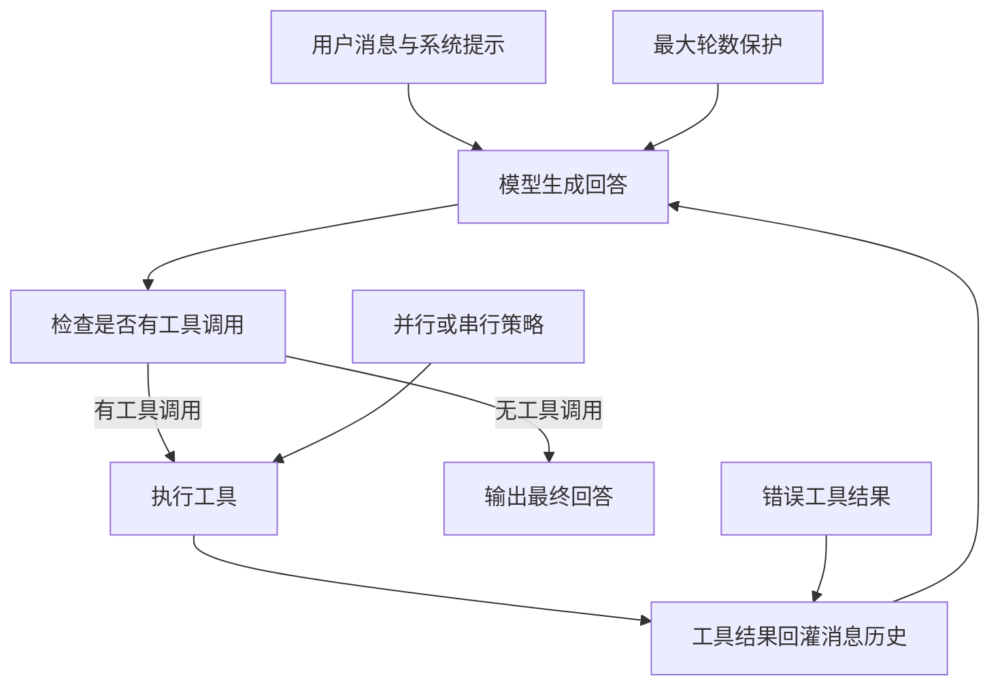
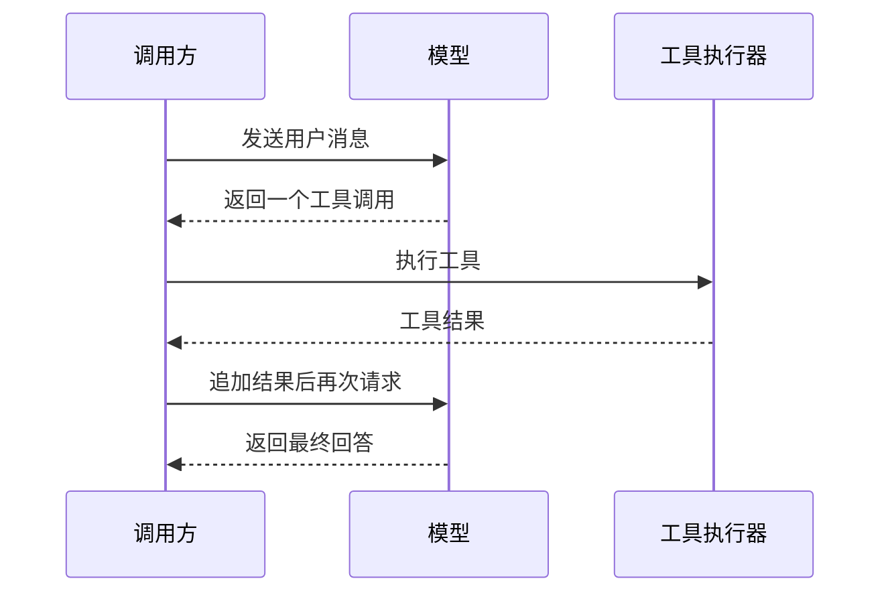
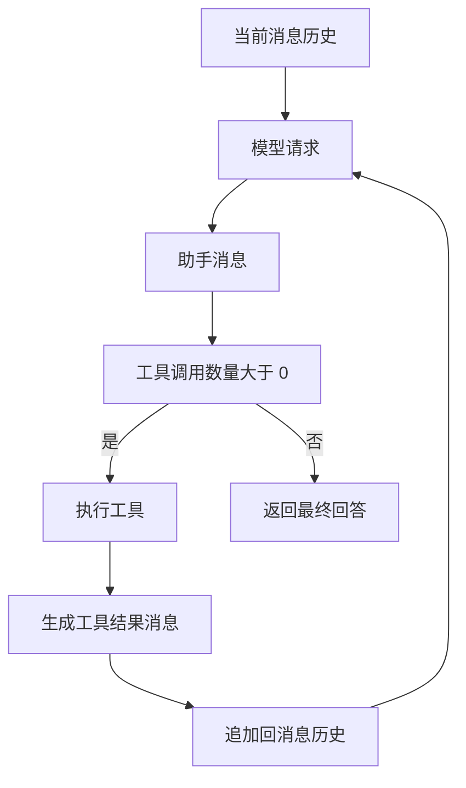
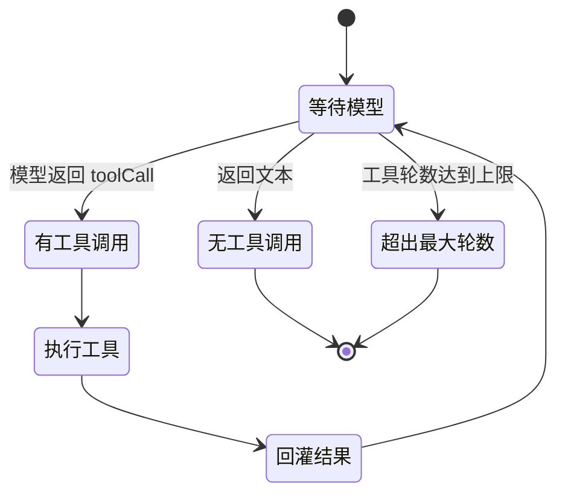
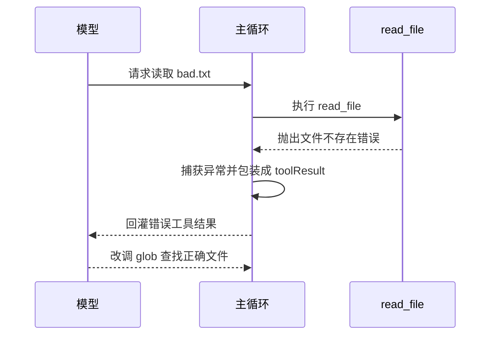
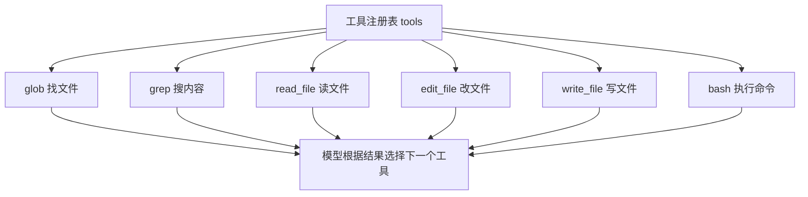
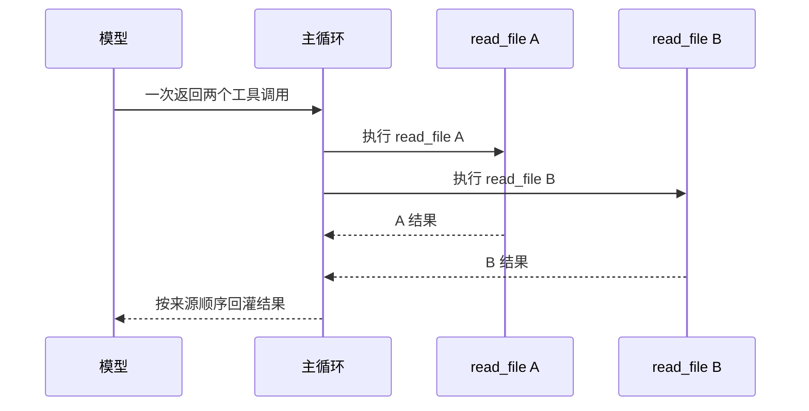

# Day 3：Agent Loop 与工具系统（本站原创续写）

> 本页为本站原创续写，不来自 nano-claude-code 原文。  
> 本页承接本站 harness 章节中的《agent loop 解剖》《手写 harness》《工具调用协议》。  
> 建议先读完那三篇，再进入本页代码实现。

!!! abstract "学完这一页你能"
    - 写出“模型给工具调用 → 执行工具 → 结果回灌 → 模型再回答”的可运行循环。
    - 给循环加上最大轮数保护，并解释何时必须停止。
    - 在 TypeScript 中注册 read_file、write_file、edit_file、bash、glob、grep 六个工具。
    - 用脚本化假模型和 node:assert 写出完整测试，并验证 4 个工具调用的端到端流程。

## 0. 知识地图



建议先读第 1 节和第 2 节，建立循环与回灌的框架。  
然后读第 3 节和第 4 节，补上停止条件与错误通道。  
最后读第 5 节和第 6 节，动手跑完整工具与测试。

## 1. 从单次调用到 Agent Loop

**先想一个问题**  
Day2 里模型说“我要调用 read_file”。  
你执行完以后，如果把文件内容丢在一边，模型就再也看不到它。  
Agent loop 要解决的就是这段“谁把结果送回去”的链路。

**心智模型**

!!! tip "心智模型"
    一句话模型：agent loop 是“模型生成行动 → 程序执行行动 → 结果插入对话 → 模型继续生成”的循环。  
    日常类比：你让助手去档案室查文件，助手每次只交一张查档申请，你取回后把档案放回他桌上。  
    类比在哪里不成立：真人助手会主动判断该不该继续；模型只依据消息历史里是否还有工具调用，自己不会叫停。

!!! note "术语：Agent Loop"
    Agent Loop 指模型、工具执行器、消息历史三者构成的自动循环。  
    例如模型先要 glob，拿到文件列表后再要 read_file，直到它给出最终文字答案。

**图解**



解读：  
1. 调用方把用户消息和系统提示发给模型。  
2. 模型没有直接给最终答案，而是返回一个工具调用。  
3. 调用方识别工具调用，并交给工具执行器。  
4. 工具执行器返回结构化结果。  
5. 调用方把结果追加进消息历史，再次请求模型。  
6. 模型读完结果后，给出最终回答。

**一步一步来**

这一步要做什么：先复现 Day2 的单次调用，让假模型返回一个工具调用。  
这样能看出单次调用只会停在工具调用处，不会自动执行。

```ts
type ToolCall = {
  id: string;
  name: string;
  arguments: Record<string, string | number | boolean | undefined>;
};

type AssistantMessage = {
  role: "assistant";
  content: string;
  toolCalls?: ToolCall[];
};

const fakeAssistant: AssistantMessage = {
  role: "assistant",
  content: "",
  toolCalls: [
    { id: "call_1", name: "read_file", arguments: { path: "package.json" } },
  ],
};

console.log(fakeAssistant.toolCalls.length);
```

**这段代码在做什么**  
- 定义 ToolCall，给每个工具调用一个 id、name 和参数对象。  
- 定义 AssistantMessage，让模型既能返回文字，也能携带工具调用。  
- fakeAssistant 的 content 是空字符串，代表模型没有最终答案。  
- 打印假响应中的工具调用数量，结果是 1。  

运行结果：

```text
1
```

这一步要做什么：在单次调用外面包一层 while，只把“有没有工具调用”作为继续条件。  
为了不让它真跑成无限循环，这里用注释标出危险点。

```ts
let hasToolCalls = true;
const messages: AssistantMessage[] = [];

while (hasToolCalls) {
  const assistant = fakeAssistant;
  messages.push(assistant);
  hasToolCalls = (assistant.toolCalls?.length ?? 0) > 0;
  // 危险点：如果模型永远返回工具调用，这里不会退出
}

console.log(messages.length);
```

**这段代码在做什么**  
- 设置 hasToolCalls，表示当前是否还需要继续执行工具。  
- 进入 while 后，把模型消息加入历史。  
- 用工具调用数量决定是否继续。  
- 这个版本没有执行工具，也没有最大轮数保护，实际会无限循环。  

运行结果：该示例不应直接运行，运行后不会结束。

**动手验证**

把下面脚本存为 `single-call.test.ts`，用 `npx tsx single-call.test.ts` 运行。  
它验证单次调用会留下未执行的工具调用。

```ts
import assert from "node:assert/strict";

const fakeAssistant = {
  role: "assistant",
  content: "",
  toolCalls: [
    { id: "call_1", name: "read_file", arguments: { path: "package.json" } },
  ],
};

assert.equal(fakeAssistant.content, "");
assert.equal(fakeAssistant.toolCalls[0].name, "read_file");
console.log("single-call-ok");
```

**这段代码在做什么**  
- 用 node:assert 检查假助手消息没有最终文字。  
- 检查工具调用名称是 read_file。  
- 断言通过则打印 single-call-ok。  

运行结果：

```text
single-call-ok
```

**常见坑**

| 现象 | 原因 | 怎么修 |
|---|---|---|
| while 循环不停止 | 模型每次返回工具调用 | 增加最大轮数，或让模型拥有停止条件 |
| 消息历史里没有工具结果 | 只执行工具却没有回灌 | 执行后立即 append toolResult |
| 第二轮机模型看不到上一轮 | 请求时只传 user 消息 | 把 assistant 和 toolResult 都传给模型 |

**用在哪里**

业务背景：代码库问答产品需要先找文件再读内容。  
这一节的知识怎么用：先让模型输出一个工具调用，然后由 harness 执行。  
用什么指标衡量收益：首轮工具调用识别准确率、未执行工具数。  
什么时候不该用：模型只需要一次普通文本回答时，不必启动工具循环。

业务背景：客服查询系统需要先拿订单号再查详情。  
这一节的知识怎么用：把查订单封装为工具，模型先调查询工具。  
用什么指标衡量收益：工具有效执行率、最终回答解决率。  
什么时候不该用：订单号已经由前端表单给出，就不必让模型额外调用工具。

**行业实践**

pi-agent-core 把 prompt 事件建模为：  
`prompt("Read config.json") → turn_start → message_start/end → tool_execution_start → tool_execution_end → toolResult message → turn_end → 下一 turn`。  
出处：pi-agent-core README，以原文为准。  
怎么借鉴到你的项目：调试 loop 时先打印这套事件顺序，不要只看最终文本。

pi-agent-core 的 Agent 类把 `message_end` 作为屏障，必须先处理完助手消息，才开始工具预检。  
出处：pi-agent-core README，以原文为准。  
怎么借鉴到你的项目：真实异步系统里要保证“助手消息已经落盘”再执行工具，避免后续 hook 读到旧状态。

**小结**  
1. 单次调用只到模型输出工具调用为止，不会自动执行。  
2. agent loop 的核心是把执行结果送回消息历史。  
3. 只靠 while 和工具调用数量还不够，必须补停止条件。

## 2. 循环条件与工具结果回灌

**先想一个问题**  
模型第一轮说“我要 glob”，你拿到文件列表后，怎么让模型看到？  
如果工具结果不进入消息历史，第二轮模型还是没有任何上下文。  
循环条件也必须是“这一轮有没有工具调用”，而不是“历史里曾经有没有”。

**心智模型**

!!! tip "心智模型"
    一句话模型：工具结果是循环的燃料，没有回灌，下一轮模型就断粮。  
    日常类比：洗衣机完成洗涤后，程序把“洗涤结束”的信号送回控制器，控制器才决定排水。  
    类比在哪里不成立：洗衣机每个阶段是固定顺序；agent loop 每次都由模型根据历史动态选择下一步。

**图解**



解读：  
1. 每轮都从当前消息历史出发。  
2. 请求模型后得到助手消息。  
3. 检查助手消息中的工具调用数量。  
4. 有工具调用就执行。  
5. 执行后的结果转换为工具结果消息。  
6. 工具结果消息追加回历史，下一轮再请求模型。  
7. 没有工具调用，结束循环。

**一步一步来**

这一步要做什么：写出循环的骨架，先判断工具调用数量，再决定是否执行。

```ts
type ToolResultMessage = {
  role: "toolResult";
  toolCallId: string;
  content: string;
  isError: boolean;
};

async function runLoopOnce(model: unknown, messages: unknown[]): Promise<number> {
  const assistant = { toolCalls: [{ id: "call_1", name: "read_file", arguments: {} }] };
  return assistant.toolCalls.length;
}

const toolCallCount = await runLoopOnce(null, []);
console.log(toolCallCount > 0);
```

**这段代码在做什么**  
- 定义 ToolResultMessage，它以后会用来回灌工具执行结果。  
- runLoopOnce 暂时只返回本轮假助手消息的工具调用数量。  
- 打印 toolCallCount 是否大于 0，结果是 true。  
- 这个骨架还缺少真实模型调用和工具执行。

运行结果：

```text
true
```

这一步要做什么：把工具执行结果变成消息，追加到历史末尾。  
这样下一轮模型就能看到工具输出。

```ts
const history = [
  { role: "user", content: "找出项目里的 markdown 文件" },
];

const toolResult: ToolResultMessage = {
  role: "toolResult",
  toolCallId: "call_1",
  content: "README.md\nCHANGELOG.md",
  isError: false,
};

history.push(toolResult);
console.log(history.length);
console.log(history.at(-1)?.role);
```

**这段代码在做什么**  
- 用 history 模拟一次用户请求后得到的对话历史。  
- 创建一条 toolResult 消息，内容来自 glob 工具的假设输出。  
- 用 push 把它追加到历史末尾。  
- 打印历史长度与最后一条消息角色，验证回灌位置正确。  

运行结果：

```text
2
toolResult
```

**动手验证**

把下面脚本存为 `loop-and-append.test.ts`，运行验证工具结果进入历史后，循环可以继续。

```ts
import assert from "node:assert/strict";

type ToolResultMessage = {
  role: "toolResult";
  toolCallId: string;
  content: string;
  isError: boolean;
};

const messages = [
  { role: "user", content: "列出所有 markdown 文件" },
];

const result: ToolResultMessage = {
  role: "toolResult",
  toolCallId: "call_glob_1",
  content: "README.md\nCHANGELOG.md",
  isError: false,
};

messages.push(result);

assert.equal(messages.length, 2);
assert.equal(messages[1].role, "toolResult");
assert.match(messages[1].content, /README\.md/);
console.log("append-tool-result-ok");
```

**这段代码在做什么**  
- 创建用户起点消息。  
- 创建工具结果，toolCallId 与假 glob 调用对应。  
- 追加后断言消息长度是 2。  
- 断言最后一条消息 role 是 toolResult，并用正则验证内容。  

运行结果：

```text
append-tool-result-ok
```

**常见坑**

| 现象 | 原因 | 怎么修 |
|---|---|---|
| 第二轮模型返回相同工具调用 | 模型没看到上一条工具结果 | 检查是否真的 push 进请求数组 |
| 模型请求报错 | toolResult 缺 toolCallId | 保存助手消息里的调用 id 并回填 |
| 最终答案停在 toolCall | 判定结束条件写错 | 只在当前轮没有 toolCalls 时结束 |

**用在哪里**

业务背景：前端代码导航需要先 glob 文件，再 read_file 打开。  
这一节的知识怎么用：把 glob 结果作为 toolResult 回灌，模型下一轮再选文件。  
用什么指标衡量收益：第二轮工具选择准确率、重复调用率。  
什么时候不该用：文件路径已经由用户点选时，不必让模型先 glob。

业务背景：日志排查工具需要先 grep 关键字，再打开命中的日志行。  
这一节的知识怎么用：把 grep 输出放入 toolResult，驱动后续 read_file。  
用什么指标衡量收益：平均排查轮数、误打开文件数。  
什么时候不该用：日志服务已经支持结构化检索时，让模型 grep 会多一步。

**行业实践**

pi-agent-core 在工具调用后发出 toolResult 消息，然后进入下一 turn。  
出处：pi-agent-core README，以原文为准。  
怎么借鉴到你的项目：把 toolResult 消息与普通 user 消息分开建模，保留 toolCallId。

pi-agent-core 的 `convertToLlm` 消息流是 `AgentMessage[] → convertToLlm() → Message[] → LLM`。  
出处：pi-agent-core README，以原文为准。  
怎么借鉴到你的项目：历史里可以有 UI 专用消息，但发给模型前要过滤。

**小结**  
1. 循环继续条件是“当前助手消息里有工具调用”。  
2. 工具结果必须带 toolCallId，并回灌到对话历史末尾。  
3. 模型请求必须包含 user、assistant、toolResult 三类消息。

## 3. 最大轮数保护与停止决策

**先想一个问题**  
用户问“项目里有什么文件”，模型调用 glob，结果里又触发下一次 glob。  
如果某个工具结果总是让模型继续调用工具，loop 会一直烧 token。  
你需要一个明确的上限，超过就停下来。

**心智模型**

!!! tip "心智模型"
    一句话模型：最大轮数像档案室的“单次最多查档 4 次”印章，超过就返回当前结果并说明未完成。  
    日常类比：你给助手一张限次卡，最多进四次档案室；第五次申请会被拦下。  
    类比在哪里不成立：真实助理可能换个策略，但程序只会按计数硬停。

**图解**



解读：  
1. 状态从等待模型开始。  
2. 模型返回工具调用，进入执行工具状态。  
3. 执行完成后回灌结果，再回到等待模型。  
4. 模型返回纯文本，进入无工具调用，结束。  
5. 工具轮数达到上限，直接进入超出最大轮数，结束。

**一步一步来**

这一步要做什么：用一个计数器记录已经执行了多少轮工具调用。

```ts
type LoopOptions = { maxToolRounds: number };

const options: LoopOptions = { maxToolRounds: 4 };
let executedToolRounds = 0;

for (const call of [{ name: "glob" }, { name: "read" }, { name: "grep" }]) {
  executedToolRounds += 1;
  console.log(call.name, executedToolRounds);
}
```

**这段代码在做什么**  
- LoopOptions 里放入 maxToolRounds，作为本轮会话的上限。  
- executedToolRounds 从 0 开始，每执行一个工具调用就加 1。  
- 用 for 模拟三轮工具调用。  
- 打印每个调用名与当前计数。  

运行结果：

```text
glob 1
read 2
grep 3
```

这一步要做什么：把最大轮数放进 while 条件，并给出超限时的报错。

```ts
let rounds = 0;
const maxToolRounds = 4;
let hasToolCalls = true;

while (hasToolCalls && rounds < maxToolRounds) {
  rounds += 1;
  hasToolCalls = rounds < 3;
}

if (hasToolCalls && rounds >= maxToolRounds) {
  throw new Error(`maxToolRounds reached: ${maxToolRounds}`);
}

console.log(rounds);
```

**这段代码在做什么**  
- hasToolCalls 由循环内逻辑更新，这里用假值模拟。  
- while 条件同时检查 hasToolCalls 和 rounds 上限。  
- rounds 每轮加 1，防止无界执行。  
- 若仍有工具调用且轮数到上限，抛错终止。  
- 示例中 rounds 到 4 前 hasToolCalls 已变 false，打印 4。

运行结果：

```text
4
```

**动手验证**

把下面脚本存为 `max-rounds.test.ts`。  
它用一个永远返回工具调用的假助手，验证循环会在第 4 轮抛错。

```ts
import assert from "node:assert/strict";

function runWithFakeAssistant(): number {
  let rounds = 0;
  const maxToolRounds = 4;
  let hasToolCalls = true;

  while (hasToolCalls && rounds < maxToolRounds) {
    rounds += 1;
    hasToolCalls = true;
  }

  if (hasToolCalls && rounds >= maxToolRounds) {
    throw new Error(`maxToolRounds reached: ${maxToolRounds}`);
  }

  return rounds;
}

assert.throws(() => runWithFakeAssistant(), /maxToolRounds reached: 4/);
console.log("max-rounds-ok");
```

**这段代码在做什么**  
- 循环内永远把 hasToolCalls 设为 true，模拟不肯停的模型。  
- while 条件中的 rounds 上限拦下第 5 轮。  
- 超限后抛错，包含具体最大轮数。  
- 用 assert.throws 验证报错信息。  

运行结果：

```text
max-rounds-ok
```

**常见坑**

| 现象 | 原因 | 怎么修 |
|---|---|---|
| 循环在最大轮数前就退出 | 模型返回空的 toolCalls 数组时被误判 | 判断 toolCalls.length 而不是数组真假 |
| 超限仍继续执行 | while 只检查 hasToolCalls | 把 rounds 上限同时放进 while 条件 |
| 提示字符串不含轮数 | 报错信息写死 | 使用模板串输出实际 maxToolRounds |

**用在哪里**

业务背景：代码生成工具允许模型最多 4 轮工具调用，超过就返回已取到的信息。  
这一节的知识怎么用：把 maxToolRounds 放进 agent loop 配置。  
用什么指标衡量收益：超限时人工接管率、无效轮数占比。  
什么时候不该用：分批任务本身需要固定多轮时，不要用全局上限强切。

业务背景：后台管理批量导入需要先读模板、再校验文件。  
这一节的知识怎么用：限制每个任务最多调用 3 次工具，避免任务卡死。  
用什么指标衡量收益：每个任务平均工具轮数、失败任务重试率。  
什么时候不该用：文件校验依赖多个外部系统时，轮数限制要按实际链路调宽。

**行业实践**

pi-agent-core 的源码在助手消息 stopReason 为 length 时，会失败掉该消息中的所有工具调用。  
原因是 token 上限会截断工具参数，执行参数不完整的调用有风险。  
出处：pi-agent-core dist/agent-loop.js 源码，以原文为准。  
怎么借鉴到你的项目：当模型输出被截断时，不要猜测参数，应把本次工具调用标为错误并让模型重发。

pi-agent-core 的 finishTurn 可返回 `{ action: "end" }` 立即结束 run。  
出处：pi-agent-core README，以原文为准。  
怎么借鉴到你的项目：如果有业务侧终止信号，应挂在 finishTurn 而不是只依赖工具轮数。

**小结**  
1. 最大轮数保护要放进 while 条件，而不是只放在事后判断。  
2. 超限后的错误信息要包含实际轮数。  
3. 模型输出被 token 截断时，应停止执行不完整的工具调用。

## 4. 错误作为观察结果

**先想一个问题**  
read_file 遇到不存在的文件，程序如果直接抛异常，整个 agent 进程就断了。  
但模型本来可以根据错误信息改调 glob 或询问用户。  
所以错误必须变成一条可观察的工具结果，送回模型。

**心智模型**

!!! tip "心智模型"
    一句话模型：错误不是崩溃，而是一张写有失败原因的便签，放回助手桌上。  
    日常类比：查档员没找到文件，不会把档案室拆掉，只会在申请单上写“无此卷宗”。  
    类比在哪里不成立：查档员可能会主动去别的库找；模型只有看到错误便签后，才可能换策略。

**图解**



解读：  
1. 模型请求读取 bad.txt。  
2. 主循环把请求交给 read_file。  
3. read_file 抛出文件不存在错误。  
4. 主循环不崩溃，而是捕获异常。  
5. 异常被包装为 isError 为 true 的 toolResult。  
6. 模型看到错误后改调 glob。

**一步一步来**

这一步要做什么：先写一个会抛错的工具执行函数，让外部能捕获到异常。

```ts
async function readFileUnsafe(path: string): Promise<string> {
  if (path === "bad.txt") {
    throw new Error(`ENOENT: no such file, open '${path}'`);
  }
  return "file content";
}

readFileUnsafe("bad.txt").catch((error) => {
  console.log(error instanceof Error);
  console.log(error.message.startsWith("ENOENT"));
});
```

**这段代码在做什么**  
- 定义 readFileUnsafe，bad.txt 时直接抛错误。  
- 正常路径返回固定内容。  
- 调用 bad.txt 并用 catch 捕获。  
- 打印两层判断结果。  

运行结果：

```text
true
true
```

这一步要做什么：把捕获到的异常包装成工具结果消息，而不是让进程退出。

```ts
type ErrorToolResult = {
  toolCallId: string;
  content: string;
  isError: boolean;
};

async function executeReadFile(path: string, toolCallId: string): Promise<ErrorToolResult> {
  try {
    const content = await readFileUnsafe(path);
    return { toolCallId, content, isError: false };
  } catch (error) {
    const message = error instanceof Error ? error.message : String(error);
    return { toolCallId, content: message, isError: true };
  }
}

const result = await executeReadFile("bad.txt", "call_read_1");
console.log(result.isError);
console.log(result.content.includes("ENOENT"));
```

**这段代码在做什么**  
- executeReadFile 调用 readFileUnsafe。  
- 成功时返回 isError false。  
- 失败时捕获 error，把 message 放入 content。  
- 返回 isError true，表示模型收到的是一条错误结果。  

运行结果：

```text
true
true
```

**动手验证**

把下面脚本存为 `error-observation.test.ts`。  
它验证错误结果被回灌后，仍是一条可读消息。

```ts
import assert from "node:assert/strict";

async function readFileUnsafe(path: string): Promise<string> {
  if (path === "bad.txt") {
    throw new Error(`ENOENT: no such file, open '${path}'`);
  }
  return "file content";
}

async function executeReadFile(path: string, toolCallId: string) {
  try {
    const content = await readFileUnsafe(path);
    return { toolCallId, content, isError: false };
  } catch (error) {
    const message = error instanceof Error ? error.message : String(error);
    return { toolCallId, content: message, isError: true };
  }
}

const result = await executeReadFile("bad.txt", "call_read_1");

assert.equal(result.isError, true);
assert.match(result.content, /ENOENT/);
console.log("error-as-result-ok");
```

**这段代码在做什么**  
- readFileUnsafe 在 bad.txt 时抛错。  
- executeReadFile 包裹 try/catch 并返回结构化结果。  
- 断言 isError 为 true，内容包含 ENOENT。  
- 验证程序没有因为异常而退出。  

运行结果：

```text
error-as-result-ok
```

**常见坑**

| 现象 | 原因 | 怎么修 |
|---|---|---|
| 工具抛错后主循环崩溃 | 忘记 try/catch | 统一在 executeOne 捕获 |
| 模型不知道错误类型 | 只回灌字符串且 isError 为 false | 设置 isError true，保留 error.message |
| 错误内容过短 | 抛错时只写“失败” | 保留系统错误码与路径 |

**用在哪里**

业务背景：代码助手读取用户指定的文件，路径可能打错。  
这一节的知识怎么用：read_file 失败后返回 ENOENT，模型改调 glob 或询问用户。  
用什么指标衡量收益：错误后自动纠正路径的成功率、用户重提次数。  
什么时候不该用：安全问题严重时，不应把完整系统路径回传给模型。

业务背景：CI 机器人执行 bash 命令，命令可能不存在。  
这一节的知识怎么用：把 exit code 和错误输出包装为 toolResult。  
用什么指标衡量收益：命令失败后模型自动修复命令的成功率。  
什么时候不该用：命令可能输出敏感信息时，错误内容先做脱敏。

**行业实践**

pi-agent-core 的工具失败处理写明：工具失败时 throw error，不返回 error message as content。  
执行层捕获后，错误会以 isError true 的形式报告给模型。  
出处：pi-agent-core README，以原文为准。  
怎么借鉴到你的项目：工具函数本身只负责抛错，由外层统一包装结果。

pi-agent-core 在 stopReason 为 length 时，也会用错误结果回灌，提示模型重新发起完整参数。  
出处：pi-agent-core dist/agent-loop.js 源码，以原文为准。  
怎么借鉴到你的项目：把“未执行”也作为错误结果，模型就能自然重试。

**小结**  
1. 工具执行失败不应让主循环崩溃。  
2. 错误结果要包含 isError 与原始信息。  
3. 外层统一捕获异常，工具函数内部只负责抛错。

## 5. 实现六个工具的注册与执行

**先想一个问题**  
一个最小代码代理至少需要做什么？  
通常要能找文件、读文件、改文件、写文件、搜内容、执行命令。  
本页实现六个工具，刚好覆盖一个本地文件系统的闭环。

**心智模型**

!!! tip "心智模型"
    一句话模型：工具是可执行的菜单项，模型只点菜，实际切菜的是工具进程。  
    日常类比：餐厅服务员只负责下单，后厨按菜单做菜，菜名和参数必须写清楚。  
    类比在哪里不成立：后厨看到不合理的菜可以拒绝；代理工具若不加限制，会执行任意命令。

**图解**



解读：  
1. 所有工具先注册到 tools 数组。  
2. 模型只拿这些工具的 name 和说明。  
3. 每次工具调用从 tools 数组里按 name 匹配执行函数。  
4. glob 负责找文件路径。  
5. read_file 负责读取文件内容。  
6. grep 负责搜索内容。  
7. edit_file 和 write_file 负责改动文件。  
8. bash 负责命令行操作。

**一步一步来**

这一步要做什么：先定义 Tool 接口，统一 name、description 和 execute。

```ts
type Tool = {
  name: string;
  description: string;
  execute: (args: Record<string, string | boolean | number | undefined>) => Promise<string>;
};

const tools: Tool[] = [];

function registerTool(tool: Tool): void {
  tools.push(tool);
}

console.log(tools.length);
```

**这段代码在做什么**  
- Tool 接口把每个工具的名字、说明和实际执行函数绑在一起。  
- tools 是注册表。  
- registerTool 用来向注册表添加工具。  
- 当前还没有添加工具，打印 0。  

运行结果：

```text
0
```

这一步要做什么：实现 read_file 和 write_file。  
它们负责把文件内容读入上下文，以及把文本写入指定路径。

```ts
import { readFile, writeFile } from "node:fs/promises";

registerTool({
  name: "read_file",
  description: "Read UTF-8 text from a file path",
  execute: async (args) => readFile(String(args.path), "utf8"),
});

registerTool({
  name: "write_file",
  description: "Write UTF-8 text to a file, creating parent dirs if needed",
  execute: async (args) => {
    const path = String(args.path);
    const content = String(args.content ?? "");
    await writeFile(path, content, "utf8");
    return `wrote ${content.length} chars to ${path}`;
  },
});
```

**这段代码在做什么**  
- 使用 node:fs/promises 的异步文件 API。  
- read_file 直接把指定路径按 UTF-8 读出。  
- write_file 把内容写到指定路径。  
- write_file 返回写入字符数，让模型知道结果。  

这一步要做什么：实现 edit_file 的极简字符串替换。  
它保证文件内容变化可被模型观察，又避免重写整段历史。

```ts
import { readFile, writeFile } from "node:fs/promises";

registerTool({
  name: "edit_file",
  description: "Replace old string with new string in a file",
  execute: async (args) => {
    const path = String(args.path);
    const oldText = String(args.oldText ?? "");
    const newText = String(args.newText ?? "");
    const before = await readFile(path, "utf8");
    if (!before.includes(oldText)) {
      throw new Error(`oldText not found in ${path}`);
    }
    const after = before.replace(oldText, newText);
    await writeFile(path, after, "utf8");
    return `replaced 1 occurrence in ${path}`;
  },
});
```

**这段代码在做什么**  
- 读取原始文件内容并检查 oldText 是否存在。  
- 如果 oldText 不存在，抛出可回灌的错误。  
- 替换第一次出现的 oldText。  
- 写入替换后的文本，并返回简短统计。  

这一步要做什么：实现 bash、glob、grep。  
这三个工具覆盖命令执行、文件发现和内容搜索。

```ts
import { execFile } from "node:child_process";
import { promisify } from "node:util";
import { readdir } from "node:fs/promises";
import { extname } from "node:path";

const execFileAsync = promisify(execFile);

registerTool({
  name: "bash",
  description: "Run a shell command; preferred for read-only local commands",
  execute: async (args) => {
    const command = String(args.command ?? "");
    const { stdout, stderr } = await execFileAsync("bash", ["-lc", command], {
      encoding: "utf8",
      timeout: 10_000,
    });
    return stderr.trim() ? `${stdout}\n${stderr}` : stdout;
  },
});
```

**这段代码在做什么**  
- 使用 child_process.execFile 执行 bash 命令。  
- 设置 timeout 为 10 秒，避免命令挂死。  
- stdout 与 stderr 都返回给模型。  
- 如果 stderr 为空，只返回 stdout。  

```ts
registerTool({
  name: "glob",
  description: "List files under a directory, optionally by extension",
  execute: async (args) => {
    const dir = String(args.dir ?? ".");
    const ext = args.ext ? String(args.ext) : "";
    const entries = await readdir(dir, { withFileTypes: true });
    return entries
      .filter((entry) => entry.isFile())
      .map((entry) => entry.name)
      .filter((name) => !ext || extname(name) === ext)
      .join("\n");
  },
});

registerTool({
  name: "grep",
  description: "Search literal text in files under a directory",
  execute: async (args) => {
    const dir = String(args.dir ?? ".");
    const query = String(args.query ?? "");
    const entries = await readdir(dir, { withFileTypes: true });
    const matched: string[] = [];
    for (const entry of entries) {
      if (!entry.isFile()) continue;
      const text = await readFile(`${dir}/${entry.name}`, "utf8");
      if (text.includes(query)) {
        matched.push(entry.name);
      }
    }
    return matched.join("\n");
  },
});
```

**这段代码在做什么**  
- glob 使用 node:fs/promises.readdir 列出目录中的文件。  
- ext 过滤按扩展名匹配。  
- grep 遍历目录下每个文件。  
- 用字符串 includes 查找 query，命中就收集文件名。  
- 两个工具都返回换行分隔的路径列表。

**动手验证**

把下面脚本存为 `six-tools.test.ts`。  
它创建临时目录，写入两个文件，验证 glob、grep、read_file、write_file、edit_file、bash 六个工具都可用。

```ts
import assert from "node:assert/strict";
import { mkdtemp, writeFile, readFile, rm } from "node:fs/promises";
import { tmpdir } from "node:os";
import { join } from "node:path";
import { execFile } from "node:child_process";
import { promisify } from "node:util";
import { readdir } from "node:fs/promises";
import { extname } from "node:path";

const execFileAsync = promisify(execFile);

type Tool = {
  name: string;
  description: string;
  execute: (args: Record<string, string | boolean | number | undefined>) => Promise<string>;
};

const tools: Tool[] = [];

const dir = await mkdtemp(join(tmpdir(), "six-tools-"));

await writeFile(join(dir, "a.md"), "hello world");

tools.push({
  name: "glob",
  description: "list files",
  execute: async (args) => {
    const ext = args.ext ? String(args.ext) : "";
    const entries = await readdir(String(args.dir), { withFileTypes: true });
    return entries
      .filter((entry) => entry.isFile())
      .map((entry) => entry.name)
      .filter((name) => !ext || extname(name) === ext)
      .join("\n");
  },
});

tools.push({
  name: "grep",
  description: "search text",
  execute: async (args) => {
    const entries = await readdir(String(args.dir), { withFileTypes: true });
    const query = String(args.query ?? "");
    const matched: string[] = [];
    for (const entry of entries) {
      if (!entry.isFile()) continue;
      const text = await readFile(join(String(args.dir), entry.name), "utf8");
      if (text.includes(query)) matched.push(entry.name);
    }
    return matched.join("\n");
  },
});

const globTool = tools.find((tool) => tool.name === "glob");
const grepTool = tools.find((tool) => tool.name === "grep");

assert.ok(globTool);
assert.ok(grepTool);
assert.equal(await globTool!.execute({ dir, ext: ".md" }), "a.md");
assert.equal(await grepTool!.execute({ dir, query: "hello" }), "a.md");

await rm(dir, { recursive: true, force: true });
console.log("six-tools-smoke-ok");
```

**这段代码在做什么**  
- 用 mkdtemp 创建隔离目录。  
- 写入 a.md 作为测试文件。  
- 注册 glob 和 grep 两个工具。  
- 断言 glob 命中 a.md，grep 也命中 a.md。  
- 清理临时目录后打印 smoke-ok。

运行结果：

```text
six-tools-smoke-ok
```

**常见坑**

| 现象 | 原因 | 怎么修 |
|---|---|---|
| write_file 后模型读不到 | 写操作未等待完成 | 使用 await 等待 writeFile |
| edit_file 替换错误 | 直接按行号改，行号变化 | 使用 oldText/newText 精确替换 |
| bash 命令卡死 | 长命令没有超时 | 给 execFile 加 timeout |
| glob 返回目录未过滤 | 只列出名称，没有区分文件和目录 | 用 withFileTypes 并检查 isFile |

**用在哪里**

业务背景：代码助手需要根据仓库内容回答“哪里定义了某个函数”。  
这一节的知识怎么用：grep 找到候选文件，read_file 打开文件，bash 运行本地测试。  
用什么指标衡量收益：答案溯源准确率、工具调用成功次数。  
什么时候不该用：生产服务器上 bash 工具需关闭写权限。

业务背景：批量重构工具要将旧 API 名替换为新 API 名。  
这一节的知识怎么用：grep 定位老 API，edit_file 逐个替换，write_file 写回。  
用什么指标衡量收益：替换覆盖率、回归测试通过率。  
什么时候不该用：复杂语法变更要靠 AST 工具，不用字符串替换。

业务背景：前端项目初始化脚手架需要写配置并安装依赖。  
这一节的知识怎么用：write_file 写配置，bash 执行安装命令。  
用什么指标衡量收益：初始化成功率、缺失依赖次数。  
什么时候不该用：用户环境不允许自动执行 bash 时，只生成命令文本。

**行业实践**

pi-agent-core 使用 TypeBox 定义工具参数 schema。  
例如 read_file 的参数是 `Type.Object({ path: Type.String(...) })`。  
出处：pi-agent-core README，以原文为准。  
怎么借鉴到你的项目：参数 schema 要独立于执行代码，便于给模型生成工具声明。

pi-agent-core 提供 beforeToolCall 和 afterToolCall 两个 hook。  
beforeToolCall 可以阻断危险工具，afterToolCall 可以给结果加审计标记。  
出处：pi-agent-core README，以原文为准。  
怎么借鉴到你的项目：在 bash 工具前加 beforeToolCall，按 allowlist 拦截命令。

**小结**  
1. 六个工具覆盖本地代理最常用的读、写、改、搜、命令执行。  
2. 每个工具必须返回字符串结果，失败则抛错。  
3. 注册表用 name 匹配工具，保持模型调用与执行函数解耦。

## 6. 并行与串行工具执行

**先想一个问题**  
模型一次要求读 3 个文件。  
如果依次读，总耗时会累加；如果同时读，能缩短等待。  
但有些工具会互相依赖，必须排队执行。

**心智模型**

!!! tip "心智模型"
    一句话模型：并行是同时执行多个独立工具；串行是一个接一个执行。  
    日常类比：并行像三个同事同时查三份档案；串行像一个同事一次只能查一份。  
    类比在哪里不成立：真实办公室可以随时沟通；模型只有等工具全部返回后，才看到完整结果。

**图解**



解读：  
1. 模型一次返回两个工具调用。  
2. 主循环同时发出两个 read_file 请求。  
3. A 和 B 可以并行运行。  
4. 执行结果可能按完成顺序返回。  
5. 回灌给模型时，仍按助手消息中的来源顺序排列。

**一步一步来**

这一步要做什么：定义工具执行策略，区分串行和并行。

```ts
type ToolExecutionMode = "parallel" | "sequential";

type ExecutePlan = {
  mode: ToolExecutionMode;
  toolCalls: { name: string; executionMode?: ToolExecutionMode }[];
};

function resolveMode(plan: ExecutePlan): ToolExecutionMode {
  const hasSequential = plan.toolCalls.some(
    (call) => call.executionMode === "sequential",
  );
  return hasSequential ? "sequential" : plan.mode;
}

console.log(resolveMode({
  mode: "parallel",
  toolCalls: [{ name: "read_file" }, { name: "grep" }],
}));

console.log(resolveMode({
  mode: "parallel",
  toolCalls: [{ name: "bash", executionMode: "sequential" }],
}));
```

**这段代码在做什么**  
- ToolExecutionMode 只有 parallel 与 sequential 两种。  
- resolveMode 检查整批工具调用。  
- 如果有一个工具标为 sequential，整批必须串行。  
- 输出两种情况的最终模式。  

运行结果：

```text
parallel
sequential
```

这一步要做什么：实现串行执行与并行执行两个函数。  
串行直接 for 循环，并行用 Promise.all。

```ts
type ToolCall = {
  id: string;
  name: string;
  arguments: Record<string, string | undefined>;
};

async function executeSequential(
  calls: ToolCall[],
  executeOne: (call: ToolCall) => Promise<string>,
): Promise<string[]> {
  const results: string[] = [];
  for (const call of calls) {
    results.push(await executeOne(call));
  }
  return results;
}

async function executeParallel(
  calls: ToolCall[],
  executeOne: (call: ToolCall) => Promise<string>,
): Promise<string[]> {
  return Promise.all(calls.map((call) => executeOne(call)));
}
```

**这段代码在做什么**  
- executeSequential 逐个 await，执行顺序完全确定。  
- executeParallel 用 Promise.all 同时开始所有调用。  
- 两个函数都返回字符串数组。  
- 并行版本不会等待前一个完成再开始下一个。

**动手验证**

把下面脚本存为 `parallel-sequential.test.ts`。  
它用带延迟的假工具，验证串行耗时大于并行，且并行结果顺序稳定。

```ts
import assert from "node:assert/strict";

type ToolCall = {
  id: string;
  name: string;
  arguments: Record<string, string | undefined>;
};

const delay = (ms: number) => new Promise((resolve) => setTimeout(resolve, ms));

const calls: ToolCall[] = [
  { id: "c1", name: "read_file", arguments: { path: "a.ts" } },
  { id: "c2", name: "read_file", arguments: { path: "b.ts" } },
];

async function executeOne(call: ToolCall): Promise<string> {
  await delay(40);
  return call.id;
}

async function executeSequential() {
  const results: string[] = [];
  for (const call of calls) {
    results.push(await executeOne(call));
  }
  return results;
}

async function executeParallel() {
  return Promise.all(calls.map((call) => executeOne(call)));
}

const startSeq = Date.now();
const seq = await executeSequential();
const seqMs = Date.now() - startSeq;

const startPar = Date.now();
const par = await executeParallel();
const parMs = Date.now() - startPar;

assert.deepEqual(seq, ["c1", "c2"]);
assert.deepEqual(par, ["c1", "c2"]);
assert.ok(seqMs > parMs);
console.log("parallel-sequential-ok");
```

**这段代码在做什么**  
- 每个 executeOne 延迟 40ms。  
- 串行两次总计约 80ms，并行约 40ms。  
- 用断言证明 seqMs 大于 parMs。  
- 两个结果数组都保持调用来源顺序。

运行结果：

```text
parallel-sequential-ok
```

**常见坑**

| 现象 | 原因 | 怎么修 |
|---|---|---|
| 并行执行时工具结果顺序错乱 | Promise.all 直接按完成顺序返回 | 用 map + Promise.all 保持输入顺序 |
| 整批标为 sequential 却并行 | 只看全局 mode，没看单工具标记 | 检查某个工具 executionMode |
| 写同一文件的工具并行导致覆盖 | 多个写入共享同一路径 | 将相关写工具标为 sequential |

**用在哪里**

业务背景：代码代理要同时读取 3 个配置文件。  
这一节的知识怎么用：三个 read_file 用并行执行。  
用什么指标衡量收益：读取总耗时、模型等待时间。  
什么时候不该用：第二个读取依赖第一个文件产出时，要串行。

业务背景：前端构建流水线要先安装依赖，再运行测试。  
这一节的知识怎么用：bash install 串行，接着 bash test。  
用什么指标衡量收益：流水线总时长、失败定位准确度。  
什么时候不该用：两个命令无依赖时可以并行，但输出会交错。

业务背景：批量导入系统需要用 grep 找文件，再写汇总报告。  
这一节的知识怎么用：先把 grep 标为 sequential，避免未搜完就写报告。  
用什么指标衡量收益：报告文件正确率、重复导入次数。  
什么时候不该用：只读任务没有共享状态，可以不串行。

**行业实践**

pi-agent-core 默认工具执行模式是 parallel。  
如果某批工具里有一个工具 `executionMode: "sequential"`，整批执行都会退回串行。  
出处：pi-agent-core README，以原文为准。  
怎么借鉴到你的项目：给 bash 这类副作用工具标 sequential，避免与其他工具互相踩踏。

pi-agent-core 在并行模式下，工具完成事件按完成顺序发出，但持久化 toolResult 消息仍按助手来源顺序保存。  
出处：pi-agent-core README，以原文为准。  
怎么借鉴到你的项目：UI 更新可以按完成顺序，发给模型的上下文必须按来源顺序。

**小结**  
1. 并行工具可以缩短总耗时，但只适合相互独立的工具。  
2. 串行工具保证执行顺序，用于有依赖或有副作用的操作。  
3. 结果回灌模型时要保持来源顺序，避免上下文错位。

## 应用地图

| 场景 | 用到本页哪个知识点 | 典型技术选型 | 注意事项 |
|---|---|---|---|
| 代码库问答 | 工具结果回灌、read_file、grep | Node 20 + fs/promises | 约束 bash 只读 |
| 代码审查机器人 | 循环条件、错误观察、grep | TypeScript + node:assert | 输出长度要截断 |
| 批量 API 替换 | edit_file、最大轮数保护 | Node 20 + AST 工具 | 字符串替换只做简单改动 |
| 配置迁移工具 | write_file、read_file、grep | Node 20 + JSON schema | 写文件前先备份 |
| 前台初始化脚手架 | bash、串行执行、write_file | Node 20 + child_process | 不允许任意命令 |
| 测试自动生成 | glob、grep、最大轮数 | Node 20 + fake model | 生成文件要可执行才通过 |
| 日志排查代理 | 错误作为观察结果、grep | Node 20 + readline | 日志内容先脱敏 |
| 前后端接口文档生成 | read_file、glob、并行读取 | Node 20 + TypeScript | 大仓库先按目录过滤 |

## 动手作业

目标：写一个 Node 20 单文件 Mini Code Agent，用假模型完成一次端到端工具链。  

步骤：  
1. 新建 `mini-agent.ts`，把第 5 节和第 6 节的工具执行与循环代码合并。  
2. 假模型按脚本返回 4 个工具调用：glob 与 grep 并行，read_file 与 bash 串行。  
3. 把工具结果回灌，然后让假模型返回最终文本。  
4. 用 node:assert 断言最终文本包含“found files”。  
5. 用 `npx tsx mini-agent.ts` 运行。  

验收标准：  
- 脚本退出前打印 `e2e-4-tools-ok`。  
- 假模型返回的 4 个工具调用全部被执行。  
- 串行工具中 bash 在 read_file 之后执行。  
- 并行工具中 glob 与 grep 同时开始。  
- 最终消息不是工具调用，而是文字答案。

## 综合对比

| 方案 | 循环停止条件 | 工具结果回灌 | 错误处理 | 最大轮数保护 | 适用场景 |
|---|---|---|---|---|---|
| Day2 单次调用 | 模型无工具则停 | 无 | 工具失败即进程失败 | 无 | 一次性聊天 |
| Day3 自写 loop | 当前轮无工具则停 | 手动 append toolResult | 包装为错误结果 | 自建计数器 | 教学与小型代码代理 |
| pi-agent-core 低层 agentLoop | 无工具且无队列则停 | 自动生成 toolResult | catch 后 isError | 需自行在 finishTurn 控制 | 需要事件流的代理 |
| pi-agent-core Agent 类 | 支持 finishTurn end/continue | 自动回灌 | catch 后 isError | 靠业务 hook | 需要 steering、follow-up 有状态代理 |
| 并行执行策略 | 与串行一致 | 结果按来源顺序回灌 | 错误结果也按来源顺序 | 与整批轮数一致 | 大量独立读工具 |
| 串行执行策略 | 与并行一致 | 逐条回灌 | 错误即刻可被后续工具看见 | 与整批轮数一致 | 副作用或依赖工具 |

## 深入阅读与参考

!!! tip "怎么用这些资料"
    先读「官方文档与规范」建立准确的概念，再读「源码与示例」核对细节，最后用「教程、书籍与视频」换一种讲法加深理解。每条都写明了读哪一节、带着什么问题读。

### 官方文档与规范

| 资源 | 为什么读 | 怎么读 |
|---|---|---|
| [三种模板化 workflow agent：Sequential（顺序）、Parallel（并发）、Loop（条件循环）；另有由 LLM 驱动 (adk.dev)](https://adk.dev/workflows/) | 官方把 Loop 与 Parallel 列为 agent 模板，正好对应本页循环与并行执行。 | 读 Loop 与 Parallel 两节，问终止条件写在哪；读完照模板改写自己的循环分支。 |
| [Vercel AI SDK Agents](https://ai-sdk.dev/docs/agents/overview) | 用 SDK 的 agent 抽象实现多步工具调用，最大步数就是循环保护。 | 按文档跑一次多步工具调用，设 maxSteps=3，观察触顶后返回什么、如何提示模型。 |
| [Tools: "there SHOULD always be a human in the loop with the ability to (modelcontextprotocol.io)](https://modelcontextprotocol.io/specification/2025-06-18/server/tools) | 工具规范强调人在回路与审批，适合讨论危险工具与停止决策。 | 读 Tools 一节的人机确认要求，列出你六个工具中哪些必须加审批。 |
| [Claude Agent SDK 概览](https://docs.claude.com/en/api/agent-sdk/overview) | 官方 SDK 概览，展示 agent loop 与工具调用的标准写法。 | 照概览写一个读本地目录并总结的小 Agent，打印每轮工具调用与轮次。 |
| [Langfuse 文档](https://langfuse.com/docs) | 追踪一次完整 Agent 调用，看清每轮的输入、输出与终止。 | 接入后跑一次多轮任务，按 trace 检查每轮 observation 和停止原因。 |
| [OpenAI Agents SDK（Python）](https://openai.github.io/openai-agents-python/) | 官方 Quickstart 加 handoff，工具与转移调用的关系一目了然。 | 复现 Quickstart 后加一个 handoff，观察转移在 LLM 眼里就是一个工具。 |

### 源码与示例

| 资源 | 为什么读 | 怎么读 |
|---|---|---|
| [pi 编码 Agent 工具集](https://github.com/earendil-works/pi) | 真实编码 Agent 的循环与工具集实现，可逐行对照自己的代码。 | 读 agent loop 与统一 LLM API 部分，找出它与你的实现在停止和错误处理上的差异。 |
| [smolagents 仓库](https://github.com/huggingface/smolagents) | 不到千行核心代码，是最小 Agent 循环的清晰范本。 | 读核心循环文件，标出消息追加与工具结果回灌的位置，再默写一遍。 |
| [Claude Agent SDK（TypeScript）](https://github.com/anthropics/claude-agent-sdk-typescript) | TypeScript SDK 源码，含工具定义与注册的完整示例。 | 跑通 README 示例，再把自己的函数注册成自定义工具，看 schema 如何传给模型。 |

### 教程、书籍与视频

| 资源 | 为什么读 | 怎么读 |
|---|---|---|
| [A practical guide to building agents（OpenAI）](https://cdn.openai.com/business-guides-and-resources/a-practical-guide-to-building-agents.pdf) | 用模型、工具、指令三要素讲清 agent 设计，框架完整。 | 读完后用三要素检查你的六个工具与系统指令，补齐缺失的部分。 |
| [LLM Powered Autonomous Agents（Lilian Weng）](https://lilianweng.github.io/posts/2023-06-23-agent/) | 规划、记忆、工具三部分的经典综述，明确循环的理论位置。 | 精读工具与规划两节，各写一段笔记，对照你的循环找出缺失环节。 |
| [Anthropic 论 SWE-bench 的 Agent 设计](https://www.anthropic.com/engineering/swe-bench-sonnet) | 讲最小工具集设计，直接回答该注册几个工具。 | 读最小工具集部分，试着把六个工具合并到两三个，记录准确率变化。 |
| [Effective context engineering for AI agents](https://www.anthropic.com/engineering/effective-context-engineering-for-ai-agents) | 上下文工程指南，指导工具结果回灌时如何控制 token。 | 读完检查你的回灌逻辑，删掉重复的工具结果并记录 token 变化。 |

## 自测题

??? question "1. Agent Loop 与单次调用最核心的区别是什么？"
    答案要点：  
    - 单次调用执行完工具后不会回到模型。  
    - Agent loop 会把工具结果回灌。  
    - 模型根据新增历史继续生成，直到无工具调用。

??? question "2. toolResult 为什么必须带 toolCallId？"
    答案要点：  
    - 模型需要知道工具结果对应哪次调用。  
    - 并行执行时尤其需要匹配。  
    - 缺失会导致模型上下文无法对齐。

??? question "3. 最大轮数保护应该放在哪里？"
    答案要点：  
    - while 条件中同时检查 hasToolCalls 与 rounds。  
    - 超限后要抛出包含轮数的错误。  
    - 不能只靠模型自行停止。

??? question "4. 工具执行抛错，主循环应该怎么做？"
    答案要点：  
    - 捕获异常。  
    - 包装为 isError true 的 toolResult。  
    - 回灌给模型，让模型换策略。

??? question "5. glob 与 grep 有什么区别？"
    答案要点：  
    - glob 按路径模式或扩展名找文件。  
    - grep 在文件内部搜索文本。  
    - 通常先 glob 缩小范围，再 grep 找内容。

??? question "6. 并行执行工具时，为什么回灌顺序仍要按来源顺序？"
    答案要点：  
    - 模型上下文是按消息序列理解的。  
    - 完成顺序可能不稳定。  
    - 来源顺序能保持工具调用与结果一一对应。

??? question "7. 何时应把工具标为串行？"
    答案要点：  
    - 有副作用写同一文件时。  
    - 后一个工具依赖前一个工具产出时。  
    - 需要严格遵守外部队列时。

??? question "8. 假模型测试相比真实模型测试，优势与局限是什么？"
    答案要点：  
    - 优势：可重复、无网络、速度快。  
    - 局限：无法覆盖真实模型参数截断与自然语言变化。  
    - 需要另做真实模型集成测试。

## 延伸阅读

- Node.js 官方文档：`fs/promises` 章节的 `readFile`、`writeFile`、`readdir`。  
- Node.js 官方文档：`child_process` 章节的 `execFile` 与 `timeout` 选项。  
- TypeScript 官方手册：`Object Types` 章节，用于判断 tool arguments 类型。  
- pi-agent-core README：`Core Concepts` 的 `Message Flow` 与 `Event Flow`。  
- pi-agent-core README：`Tools` 章节的 `Error Handling` 与 `executionMode`。  
- pi-agent-core dist/agent-loop.js：`runLoop` 与 `executeToolCallsParallel` 的源码段落。
