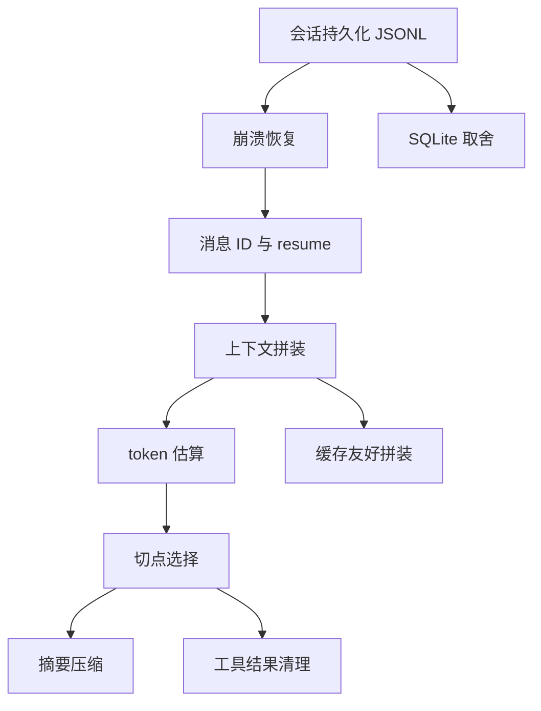
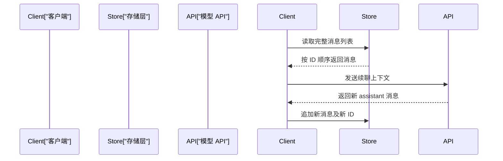
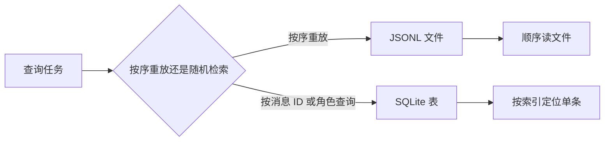
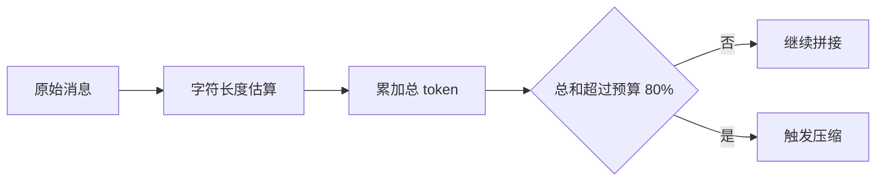
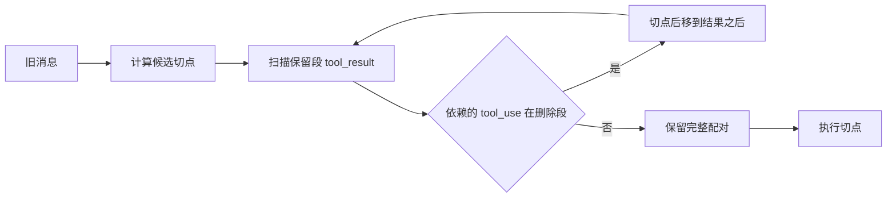
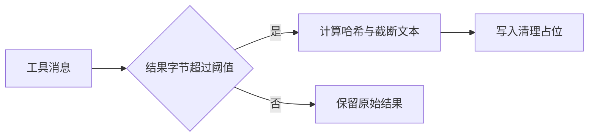
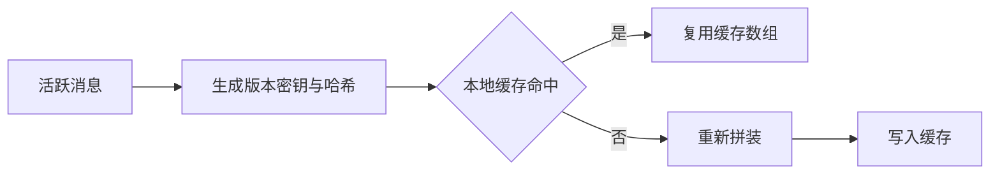

# Day 4：会话持久化与上下文压缩（本站原创续写）

!!! abstract "学完这一页你能"
    - 用 JSONL 追加写保存会话，并在崩溃后恢复到最近一条完整消息。
    - 给每条消息生成稳定 ID，按顺序恢复长会话上下文。
    - 用 token 估算和工具配对切点，安全压缩超预算上下文。
    - 写出缓存友好的上下文拼装函数，并用 node:assert 完成验证。

## 0. 知识地图



建议先读第 1、2 节，把保存和恢复跑通。  
再读第 4 到 8 节，它们解决长会话如何不被窗口撑爆。  
第 3 节可在需要多会话查询时再看，本页只讲取舍。

## 1. 会话持久化：JSONL 追加写与崩溃恢复

**先想一个问题**

用户在客服 agent 里聊了 30 轮，服务进程突然崩溃。  
重启后，怎样只丢最后半条消息，而不是整场会话？

**心智模型**

!!! tip "心智模型"
    一句话模型：每完成一条消息就追加一行，行尾作为完整标志。
    日常类比：会计登记明细账，每写完一行才算这条入账。
    类比不成立处：账本写坏一行可单独涂改，agent 上下文缺半条可能破坏后续回复。

**图解**


1. 开始追加新消息。
2. 写完消息内容后加换行。
3. 换行前的行被视为一条完整记录。
4. 崩溃时最后可能只写了半行。
5. 重启后逐行解析。
6. 无换行或解析失败的行跳过。
7. 得到可续聊的完整消息列表。

**一步一步来**

这一步要做什么：  
写一个追加函数，把消息对象序列化为一行 JSONL。

```javascript
import { createWriteStream } from 'node:fs';

const stream = createWriteStream('./session.jsonl', { flags: 'a' });

function appendMessage(message) {
  const line = JSON.stringify(message) + '\n'; // 每条消息占一行
  stream.write(line); // 单次写入正文加行尾
}

appendMessage({ id: 'm1', role: 'user', content: '退款怎么查' });
```

**这段代码在做什么**

- `createWriteStream` 打开文件，`flags: 'a'` 表示追加到末尾。
- `JSON.stringify` 把消息对象压成一行。
- `+ '\n'` 是关键，提供行结束标志。
- `stream.write` 一次性写入内容与换行，恢复时只认完整行。
- 这里没有 `fsync`，适合多数本地会话；需要更强保证时再单独加写盘策略。

运行结果：

```text
session.jsonl 中新增一行：{"id":"m1","role":"user","content":"退款怎么查"}
```

这一步要做什么：  
读取 JSONL 文件，只保留能完整解析的行。

```javascript
import { readFileSync } from 'node:fs';

function loadCompleteLines(filePath) {
  const text = readFileSync(filePath, 'utf8');
  const lines = text.split('\n');
  const complete = [];
  for (const line of lines) {
    if (line.trim() === '') continue; // 跳过空行
    try {
      complete.push(JSON.parse(line)); // 完整行才能解析
    } catch {
      continue; // 半行或损坏行直接丢弃
    }
  }
  return complete;
}

const recovered = loadCompleteLines('./session.jsonl');
console.log(recovered.length);
```

**这段代码在做什么**

- `readFileSync` 一次读入全部文本，适合本地中小型会话文件。
- `split('\n')` 按行拆开。
- 空行跳过，避免文件末尾多余换行产生空项。
- `JSON.parse` 成功表示这一行完整。
- 解析失败表示半行或损坏，跳过不影响前面消息。
- 返回值可直接交给 resume 逻辑。

运行结果：

```text
1
```

**动手验证**

依赖：Node 20+，内置 `node:fs`、`node:assert`、`node:stream`，无 npm 依赖。

```javascript
import { writeFileSync, readFileSync } from 'node:fs';
import { createWriteStream } from 'node:fs';
import { strict as assert } from 'node:assert';

const file = './day4-verify-1.jsonl';
writeFileSync(file, ''); // 清空验证文件

const stream = createWriteStream(file, { flags: 'a' });
stream.write(JSON.stringify({ id: 'm1', role: 'user', content: '你好' }) + '\n');
stream.write(JSON.stringify({ id: 'm2', role: 'assistant', content: '在' }) + '没写完');
stream.end();

stream.on('finish', () => {
  const text = readFileSync(file, 'utf8');
  const lines = text.split('\n');
  const complete = [];
  for (const line of lines) {
    if (line.trim() === '') continue;
    try {
      complete.push(JSON.parse(line));
    } catch {
      continue;
    }
  }
  assert.equal(complete.length, 1);
  assert.equal(complete[0].id, 'm1');
  console.log('验证通过：只恢复 1 条完整消息');
});
```

运行结果：

```text
验证通过：只恢复 1 条完整消息
```

**常见坑**

| 现象 | 原因 | 怎么修 |
|------|------|--------|
| 启动后所有消息丢失 | 文件被清空重写，不是追加 | 写流使用 `flags: 'a'` |
| 恢复时 JSON.parse 抛错 | 文件末尾有半行 JSON | 每行独立 try/catch 跳过 |
| 并发写导致行交错 | 多个进程同时写同一文件 | 会话写入集中到单进程或加锁 |
| 崩溃丢了最后几条已成功回复 | 系统缓存未落盘 | 关键场景手动 fsync，并接受性能下降 |

**用在哪里**

- 业务背景：在线客服 agent 需要断线续聊，用户刷新页面后继续原会话。
- 这一节的知识怎么用：每次用户或 assistant 消息确认后追加一行 JSONL，重启按完整行恢复。
- 用什么指标衡量收益：恢复后消息完整率、用户重新解释问题的次数。
- 什么时候不该用：需要跨行列更新或按 ID 随机删除时，JSONL 不适合。

- 业务背景：本地调试 agent 经常被手动中断，需要保留现场。
- 这一节的知识怎么用：调试进程退出前不专门保存，因为每行已追加。
- 用什么指标衡量收益：重启后回放前 N 轮可以复现问题的时间。
- 什么时候不该用：单文件超过几百 MB 后读取全部文本会占用大量内存。

**行业实践**

- Node.js 官方文档 `fs.createWriteStream` 章节：说明 `flags: 'a'` 的追加语义。  
- Claude Code 文档描述会话恢复能力；本地保存格式可能随版本变化，需核对官方文档。  
- SQLite 官方文档 WAL 章节：更强调崩溃一致性，适合需要更强保证的会话库。

怎么借鉴到你的项目：先采用 JSONL 追加写满足本地可恢复；当出现多进程写入、随机查找时再迁到 SQLite。

**小结**

- JSONL 一行一条消息，追加写是最小持久化方案。
- 重启恢复只认行尾完整、能 JSON.parse 的行。
- 单进程顺序写是优先选择，多进程写入要另加锁。

## 2. resume：消息 ID 与顺序恢复

**先想一个问题**

恢复出 20 条历史消息后，如何确定发送顺序，避免旧消息把新消息覆盖？

**心智模型**

!!! tip "心智模型"
    一句话模型：每条消息有一个唯一 ID，恢复后按 ID 顺序发送。
    日常类比：书签记录页码，续读时从最后一页继续。
    类比不成立处：书只要页码单调，agent 还要保持工具调用与结果的前后关系。

**图解**



1. 客户端先读取已经持久化的消息。
2. 存储层按时间或 ID 排序后返回。
3. 客户端把历史上下文发给模型。
4. 模型产生新回复。
5. 新回复用新 ID 追加，保证下次恢复顺序不乱。

**一步一步来**

这一步要做什么：  
为每条消息生成唯一 ID 和写入时间戳。

```javascript
import { randomUUID } from 'node:crypto';

function newMessage(role, content) {
  return {
    id: randomUUID(), // 全局唯一消息 ID
    role,
    content,
    ts: Date.now() // 毫秒时间戳，恢复时排序
  };
}

const userMsg = newMessage('user', '继续刚才的退款');
console.log(userMsg.id.length);
```

**这段代码在做什么**

- `randomUUID` 生成 36 位字符串，冲突概率可忽略。
- `role` 保存消息身份。
- `ts` 保存写入时间。
- 恢复时先按 `ts` 排序，再按写入顺序发送。
- 如果同毫秒写多条，再用 ID 做二级排序。

运行结果：

```text
36
```

这一步要做什么：  
从 JSONL 文件读取完整消息，并稳定排序。

```javascript
function loadSession(filePath) {
  const complete = loadCompleteLines(filePath); // 复用第 1 节解析逻辑
  return complete
    .filter((m) => m.id && m.role)
    .sort((a, b) => (a.ts - b.ts) || (a.id < b.id ? -1 : 1));
}

const session = loadSession('./session.jsonl');
console.log(session.map((m) => m.id));
```

**这段代码在做什么**

- `loadCompleteLines` 得到可恢复的消息数组。
- `filter` 去掉没有 ID 或 role 的脏数据。
- 先按时间戳升序排序。
- 时间戳相同再用 ID 字符串排序，稳定顺序。
- 这样 resume 时发送的就是连续历史。

运行结果：

```text
['m1', 'm2']
```

**动手验证**

依赖：Node 20+，内置 `node:fs`、`node:assert`、`node:crypto`。

```javascript
import { writeFileSync, readFileSync } from 'node:fs';
import { randomUUID } from 'node:crypto';
import { strict as assert } from 'node:assert';

const file = './day4-verify-2.jsonl';
writeFileSync(file, '');
const messages = [
  { id: randomUUID(), role: 'user', content: '订单号 123', ts: 3 },
  { id: randomUUID(), role: 'assistant', content: '已查到', ts: 4 },
  { id: randomUUID(), role: 'user', content: '继续退款', ts: 5 }
];
for (const m of messages) {
  writeFileSync(file, JSON.stringify(m) + '\n', { flag: 'a' });
}
const text = readFileSync(file, 'utf8');
const loaded = text.split('\n')
  .filter((line) => line.trim() !== '')
  .map((line) => JSON.parse(line))
  .sort((a, b) => (a.ts - b.ts) || (a.id < b.id ? -1 : 1));
assert.equal(loaded.length, 3);
assert.equal(loaded[2].content, '继续退款');
assert.equal(new Set(loaded.map((m) => m.id)).size, 3);
console.log('验证通过：3 条消息按时间恢复，ID 不重复');
```

运行结果：

```text
验证通过：3 条消息按时间恢复，ID 不重复
```

**常见坑**

| 现象 | 原因 | 怎么修 |
|------|------|--------|
| 恢复后消息顺序错乱 | 没有存时间戳或没有排序 | 写入时存 ts，读取后排序 |
| 同毫秒消息顺序不稳定 | 只用时间戳排序 | 加 ID 或数字序号做第二排序 |
| 消息 ID 重复 | 自行拼日期加随机数 | 使用 `crypto.randomUUID` |
| 旧消息被覆盖 | 追加逻辑写成覆盖写 | 使用 `flag: 'a'` |

**用在哪里**

- 业务背景：多轮客服 agent 在用户重新打开窗口后继续原会话。
- 这一节的知识怎么用：从 JSONL 按 ts 排序加载消息，再发起模型请求。
- 用什么指标衡量收益：续聊后首条回复与上文一致率、用户重复信息次数。
- 什么时候不该用：要求按 topic 或角色随机检索时，排序列表不够用。

- 业务背景：代码助手运行长任务，用户中途取消后再恢复。
- 这一节的知识怎么用：恢复最近 N 条消息，按 ID 顺序重放工具调用。
- 用什么指标衡量收益：任务恢复后不需要重新执行最早步骤的比例。
- 什么时候不该用：需要持久化复杂父子关系或消息树时，需要存储结构支持。

**行业实践**

- Anthropic Claude API 文档：消息数组按时间顺序发送，tool_result 必须紧跟 tool_use。  
- Node.js `crypto.randomUUID` 官方文档：生成 UUID v4。  
- Claude Code 使用本地会话文件恢复上下文，名称和版本需以官方文档为准。

怎么借鉴到你的项目：消息结构一开始就带 `id` 和 `ts`，不要等需要恢复时再补字段。

**小结**

- 每条消息必须有唯一 ID 和排序依据。
- 恢复后按时间与 ID 排序发送。
- ID 稳定是后续压缩、缓存、工具配对的基础。

## 3. SQLite 索引取舍：何时文件不够用

**先想一个问题**

会话文件已经能恢复，为什么还要 SQLite？

**心智模型**

!!! tip "心智模型"
    一句话模型：JSONL 像账本，SQLite 像带索引的档案柜。
    日常类比：账本按时间读很快，按姓名找要翻整本；档案柜可先查索引卡。
    类比不成立处：账本写坏可以跳行继续，SQLite 写坏要重建或恢复。

**图解**



1. 先看查询任务是顺序重放还是随机检索。
2. 顺序重放用 JSONL，读取快且实现简单。
3. 按 ID、角色、会话 ID 查询用 SQLite。
4. SQLite 能建索引定位单条。
5. JSONL 需要顺序扫描，不适合高频随机查。

**一步一步来**

这一步要做什么：  
用一个函数判断当前场景该选 JSONL 还是 SQLite。

```javascript
function chooseStore({ messageCount, needRandomLookup }) {
  // 按序重放且单会话条数少时，选 JSONL
  if (!needRandomLookup && messageCount < 100_000) {
    return 'jsonl';
  }
  // 需要随机查询、分页、按角色统计时，选 SQLite
  return 'sqlite';
}

console.log(chooseStore({ messageCount: 200, needRandomLookup: false }));
console.log(chooseStore({ messageCount: 200, needRandomLookup: true }));
```

**这段代码在做什么**

- `messageCount` 只做粗略阈值，不是性能结论。
- `needRandomLookup` 表示是否需要按 ID 或角色查询。
- 小于 100000 条且顺序重放时选 JSONL。
- 其他情况返回 SQLite，进入更复杂存储流程。
- 阈值可以根据本机实验调整，不是固定标准。

运行结果：

```text
jsonl
sqlite
```

这一步要做什么：  
给出 SQLite 索引的最小建表方向，本页不展开实现。

```sql
CREATE TABLE messages (
  id TEXT PRIMARY KEY,
  session_id TEXT NOT NULL,
  role TEXT NOT NULL,
  content TEXT NOT NULL,
  created_at INTEGER NOT NULL
);
CREATE INDEX idx_messages_session_created
  ON messages(session_id, created_at);
```

**这段代码在做什么**

- 表结构把消息挂到 `session_id`。
- `id` 作为主键，支持单条查询。
- `created_at` 保留时间顺序。
- 复合索引帮助一次会话按时间扫描。
- 本节只做取舍说明，具体迁移见本站“会话与记忆存储选型”页。

运行结果：

```text
示例 SQL 需要 Node 20 以上配合 SQLite 驱动或 Node 22 内置 node:sqlite 核对后才能运行。
```

**动手验证**

依赖：Node 20+，内置 `node:assert`。本验证只验证选择函数，不依赖 SQLite。

```javascript
import { strict as assert } from 'node:assert';

function chooseStore({ messageCount, needRandomLookup }) {
  if (!needRandomLookup && messageCount < 100_000) {
    return 'jsonl';
  }
  return 'sqlite';
}

assert.equal(chooseStore({ messageCount: 200, needRandomLookup: false }), 'jsonl');
assert.equal(chooseStore({ messageCount: 200, needRandomLookup: true }), 'sqlite');
assert.equal(chooseStore({ messageCount: 200_000, needRandomLookup: false }), 'sqlite');
console.log('验证通过：三种选择分支符合预期');
```

运行结果：

```text
验证通过：三种选择分支符合预期
```

**常见坑**

| 现象 | 原因 | 怎么修 |
|------|------|--------|
| 多会话追加后无法按会话查询 | JSONL 没有结构化索引 | 写入时带 session_id，或迁移 SQLite |
| 小项目过早引入 SQLite | 增加了写查询代码和恢复逻辑 | 先 JSONL，等出现随机查询再迁移 |
| 单文件几 GB 后启动慢 | 恢复时全量读入内存 | 分文件或迁移 SQLite 分页读 |
| SQLite 并发写失败 | 多进程同时写一个库 | 使用单写进程或开启 WAL 后测并发 |

**用在哪里**

- 业务背景：多租户客服系统需要按会话 ID 快速找回任意一轮。
- 这一节的知识怎么用：会话文件只做顺序落盘，检索层使用 SQLite 索引。
- 用什么指标衡量收益：随机查询响应时间、单条消息定位是否小于 10ms。
- 什么时候不该用：单会话本地调试，不需要随机查。

- 业务背景：后台审计需要按角色、时间或关键词导出消息。
- 这一节的知识怎么用：把归档消息导入 SQLite，复用 SQL 过滤。
- 用什么指标衡量收益：导出 1000 条消息的查询次数与耗时。
- 什么时候不该用：只按时间回放，不需要过滤。

**行业实践**

- SQLite 官方文档 WAL 章节：说明多读单写下的崩溃一致性。  
- Node.js 官方文档 `node:sqlite` 章节：Node 22 提供内置 SQLite 模块，Node 20 需要核对可用版本。  
- Anthropic 文档强调消息序列顺序，不建议默认用关系表代替原始顺序。

怎么借鉴到你的项目：保留消息原始顺序，SQLite 只作为检索副本，不替代顺序回放。

**小结**

- JSONL 适合顺序重放，SQLite 适合随机查询。
- 从 JSONL 迁到 SQLite 不是性能自动提升，要按查询模式判断。
- 先保存顺序，再建索引，顺序信息不要丢。

## 4. token 估算与水线：先量后压

**先想一个问题**

模型窗口是 32000 token，已经聊了很长，何时开始压缩？

**心智模型**

!!! tip "心智模型"
    一句话模型：每隔几条就估算 token，超过水线才触发压缩。
    日常类比：油箱告警灯亮才加油，不必每公里拆油箱测量。
    类比不成立处：油箱有精确表，token 估算只能看数量级。

**图解**



1. 每条消息先做字符长度估算。
2. 把结果累加为总 token。
3. 检查是否超过水线。
4. 未超过就继续正常拼接。
5. 超过后进入压缩或清理流程。

**一步一步来**

这一步要做什么：  
实现一个字符长度估算 token 的函数。

```javascript
function estimateTokens(value) {
  const text = typeof value === 'string' ? value : JSON.stringify(value);
  const chineseChars = (text.match(/[\u4e00-\u9fa5]/g) || []).length;
  const otherChars = text.length - chineseChars;
  // 中文按 1 字约 1 token，其他字符按 4 字约 1 token 估算
  return Math.ceil(chineseChars + otherChars / 4);
}

console.log(estimateTokens('你好，退款怎么查'));
console.log(estimateTokens({ id: 'm1', role: 'user' }));
```

**这段代码在做什么**

- 先区分中文字符和其他字符。
- 中文按每个字计 1，作为本地工程估算。
- 其他字符每 4 个计 1。
- 对象输入会先 JSON 序列化，保证结构也计入。
- 这是估算，不替代官方 tokenizer。

运行结果：

```text
9
20
```

这一步要做什么：  
用估算函数判断当前上下文是否越过水线。

```javascript
const budget = 32000;
const safeWaterline = Math.floor(budget * 0.8);

function shouldCompress(messages) {
  const total = messages.reduce(
    (sum, m) => sum + estimateTokens(JSON.stringify(m)),
    0
  );
  return { total, safeWaterline, needCompress: total > safeWaterline };
}

const fakeMessages = Array.from({ length: 10 }, (_, i) => ({
  id: 'm' + i,
  content: '消息内容'.repeat(50)
}));
console.log(shouldCompress(fakeMessages));
```

**这段代码在做什么**

- `budget` 表示模型上下文上限。
- 水线设为 80%，给压缩过程和回复预留空间。
- `reduce` 累加每条消息结构序列化后的 token 估算。
- 返回总估算、水线和是否需要压缩。
- 压缩前先算，避免已满窗口后再操作。

运行结果：

```text
{ total: 707, safeWaterline: 25600, needCompress: false }
```

**动手验证**

依赖：Node 20+，内置 `node:assert`。

```javascript
import { strict as assert } from 'node:assert';

function estimateTokens(value) {
  const text = typeof value === 'string' ? value : JSON.stringify(value);
  const chineseChars = (text.match(/[\u4e00-\u9fa5]/g) || []).length;
  return Math.ceil(chineseChars + (text.length - chineseChars) / 4);
}
const budget = 1000;
const waterline = Math.floor(budget * 0.8);
const messages = [{ content: 'ab'.repeat(2000) }];
const total = estimateTokens(JSON.stringify(messages));
assert.equal(total > waterline, true);
console.log(`验证通过：估算 ${total} token，水线 ${waterline}，触发压缩`);
```

运行结果：

```text
验证通过：估算 1003 token，水线 800，触发压缩
```

**常见坑**

| 现象 | 原因 | 怎么修 |
|------|------|--------|
| 中文场景估算偏低 | 用 4 字符计 1 token 的英文假设 | 中文按字或 1.2 字计 1 token 校准 |
| 工具调用字段漏算 | 只算了 content | 序列化整条消息对象 |
| 模型未满但提早压缩 | 水线设置过低 | 水线调到 80% 后再测任务完整率 |
| 不同模型结果不同 | tokenizer 版本不同 | 上线前用目标模型的官方 tokenizer 验证一批样本 |

**用在哪里**

- 业务背景：长文档问答 agent 需要控制每次请求成本。
- 这一节的知识怎么用：请求前估算总 token，超过水线进入摘要压缩。
- 用什么指标衡量收益：单次请求 token 数、触发压缩后的答案完整率。
- 什么时候不该用：要求精确计费时，只能使用目标模型官方 tokenizer。

- 业务背景：批量工具调用，结果很大但模型不需要全文。
- 这一节的知识怎么用：先估算结果 token，再决定清理还是保留。
- 用什么指标衡量收益：上下文占用降低量、任务成功率变化。
- 什么时候不该用：结果隐藏会影响后续判断时，不清理。

**行业实践**

- OpenAI Cookbook `How to count tokens with tiktoken`：给出 Python 的精确计算方式。  
- Anthropic 文档 `Prompt Caching` 章节：说明缓存命中依赖稳定前缀，不能随意改顺序。  
- Claude Code 会在达到上下文限额前提示用户压缩。

怎么借鉴到你的项目：先做工程估算，发现频繁误判时引入官方 tokenizer 校准。

**小结**

- token 估算用于水线判断，不用于内部精确计费。
- 水线留出压缩和回复空间，通常设为预算的 80% 再实测。
- 估算要把整条消息序列化，漏算工具字段会早爆窗口。

## 5. 切点选择：保持 tool_use 与 tool_result 配对

**先想一个问题**

压缩后 `tool_result` 保留了，但它的 `tool_use` 被删了，模型还能理解这个结果吗？

**心智模型**

!!! tip "心智模型"
    一句话模型：切压缩点时要移动切点，保证保留段不出现孤立 tool_result。
    日常类比：拆门要整扇拆，不能只拆门框留下门板。
    类比不成立处：现实门板可重装，模型看到孤立结果可能直接忽略。

**图解**



1. 先按保留条数算出候选切点。
2. 扫描保留段里的每个 `tool_result`。
3. 如果它依赖的 `tool_use` 不在保留段，说明孤立。
4. 把切点后移到该结果之后，重新扫描。
5. 直到保留段没有孤立结果，才执行删除。
6. 这样每次压缩都保持配对完整。

**一步一步来**

这一步要做什么：  
实现一个函数，找到安全的压缩切点。

```javascript
function findSafeCut(messages, keepLast = 8) {
  let cut = Math.max(0, messages.length - keepLast);
  let changed = true;
  while (changed && cut < messages.length) {
    changed = false;
    const kept = messages.slice(cut);
    const keptToolUseIds = new Set(
      kept.filter((m) => m.type === 'tool_use').map((m) => m.id)
    );
    for (let i = 0; i < kept.length; i++) {
      const m = kept[i];
      if (m.type === 'tool_result' && !keptToolUseIds.has(m.tool_use_id)) {
        cut = cut + i + 1; // 把孤立结果也归入保留段
        changed = true;
        break;
      }
    }
  }
  return cut;
}
```

**这段代码在做什么**

- `keepLast` 是想保留的消息条数。
- 第一次先按条数切出候选点。
- 每次循环只检查保留段开头到结尾的孤立 `tool_result`。
- 发现孤立结果，就把切点后移到该结果之后。
- 重新循环，直到没有孤立结果。
- 该算法适合线性消息列表，不支持嵌套工具调用树。

运行结果：

```text
返回一个整数索引，表示从该索引开始保留。
```

这一步要做什么：  
用一段带孤立结果的序列验证切点移动。

```javascript
const messages = [
  { id: 't1', type: 'tool_use' },
  { id: 'r1', type: 'tool_result', tool_use_id: 't1' },
  { id: 'm2', role: 'user', content: '继续' },
  { id: 'm3', role: 'assistant', content: '稍等' },
  { id: 'r2', type: 'tool_result', tool_use_id: 't2' },
  { id: 'r3', type: 'tool_result', tool_use_id: 't3' }
];

const cut = findSafeCut(messages, 3);
console.log(cut);
console.log(messages.slice(cut).map((m) => m.id));
```

**这段代码在做什么**

- 原始消息里 `r2`、`r3` 缺少对应 `tool_use`。
- 候选 `cut = 3` 时保留段从 `m3` 开始。
- 扫描保留段发现 `r2` 孤立。
- 切点后移到 `r2` 之后，即索引 5。
- 保留段从 `r3` 开始，但 `r3` 仍孤立。
- 切点继续后移到索引 6，保留段为空。

运行结果：

```text
6
[]
```

**动手验证**

依赖：Node 20+，内置 `node:assert`。

```javascript
import { strict as assert } from 'node:assert';

function findSafeCut(messages, keepLast = 8) {
  let cut = Math.max(0, messages.length - keepLast);
  let changed = true;
  while (changed && cut < messages.length) {
    changed = false;
    const kept = messages.slice(cut);
    const keptToolUseIds = new Set(
      kept.filter((m) => m.type === 'tool_use').map((m) => m.id)
    );
    for (let i = 0; i < kept.length; i++) {
      const m = kept[i];
      if (m.type === 'tool_result' && !keptToolUseIds.has(m.tool_use_id)) {
        cut = cut + i + 1;
        changed = true;
        break;
      }
    }
  }
  return cut;
}

const messages = [
  { id: 't1', type: 'tool_use' },
  { id: 'r1', type: 'tool_result', tool_use_id: 't1' },
  { id: 'm2', role: 'user', content: '继续' },
  { id: 'r2', type: 'tool_result', tool_use_id: 't2' }
];
const cut = findSafeCut(messages, 2);
assert.equal(cut, 4);
assert.equal(messages[3].type, 'tool_result');
console.log('验证通过：孤立 tool_result 不会单独留在保留段');
```

运行结果：

```text
验证通过：孤立 tool_result 不会单独留在保留段
```

**常见坑**

| 现象 | 原因 | 怎么修 |
|------|------|--------|
| 压缩后模型报工具结果无效 | 只删了 tool_use 没删结果 | 用 findSafeCut 保证配对 |
| 保留段开头是 tool_result | 候选切点落在配对中间 | 循环后移切点 |
| 嵌套工具调用处理错误 | 线性扫描不支持树结构 | 增加父子关系字段或递归检查 |
| 切点太靠后，压缩效果差 | 孤立结果太多 | 同时压缩旧工具结果，不保留孤立字段 |

**用在哪里**

- 业务背景：代码助手连续执行 shell、文件读取，长会话里工具消息占比大。
- 这一节的知识怎么用：压缩前先找安全切点，保证保留段工具调用完整。
- 用什么指标衡量收益：压缩后模型执行下一步工具的成功率。
- 什么时候不该用：所有历史工具结果都要保留做审计时，不要切。

- 业务背景：浏览器 agent 每页产生大量 `tool_result`，需要截断长历史。
- 这一节的知识怎么用：从最旧消息开始切，保留最近完整配对。
- 用什么指标衡量收益：上下文压缩比例、任务继续成功率。
- 什么时候不该用：需要回看最早页面的具体文本时。

**行业实践**

- Anthropic 文档 `Tool use` 章节：tool_result 必须引用上一 tool_use 的 id。  
- OpenAI 函数调用指南：函数消息必须与 assistant 的 function_call 配对。  
- Claude Code 维护任务状态，不把孤立结果发送给模型。

怎么借鉴到你的项目：每次构造上下文前跑一遍 `findSafeCut`，不要等到模型报错再处理。

**小结**

- 压缩切点必须以工具配对为最小单位。
- 安全切点算法反复把孤立结果后的索引向后移。
- 嵌套工具调用需要更细的父子结构，本页线性算法先用。

## 6. 摘要压缩：把旧消息变成一条摘要

**先想一个问题**

用户最早问的退款条件还想保留，但窗口快满了，怎么办？

**心智模型**

!!! tip "心智模型"
    一句话模型：把旧消息包成一条 system 摘要，替换掉原始旧消息。
    日常类比：会议纪要只写结论，不保留每句发言。
    类比不成立处：纪要丢失原句，后续想引用原话就做不到了。

**图解**


1. 从最旧端取出一批消息。
2. 将这些消息拼接成可读文本。
3. 生成一条摘要消息，角色为 system。
4. 用摘要替换旧消息组，保留最近消息。
5. 新上下文总 token 下降，但保留关键意图。

**一步一步来**

这一步要做什么：  
实现一个本地可运行的极简摘要生成函数，不调用远程模型。

```javascript
function createLocalSummary(oldMessages, maxText = 300) {
  const text = oldMessages
    .map((m) => `${m.role || m.type}: ${m.content || m.tool_use_id || ''}`)
    .join('  ')
    .slice(0, maxText);
  return {
    id: 'summary-' + Date.now(),
    role: 'system',
    content: `已压缩 ${oldMessages.length} 条旧消息，关键片段：${text}`
  };
}
```

**这段代码在做什么**

- 先取旧消息的 role 或 type。
- `content` 可能缺失，工具消息没有该字段时回退到 id。
- 把全部文本拼在一起。
- `slice` 限制摘要长度。
- 返回 system 角色消息，不会与用户消息混淆。
- 真实项目应替换为模型生成的语义摘要，这里只验证数据流。

运行结果：

```text
返回一条 role 为 system 的消息对象。
```

这一步要做什么：  
用摘要替换旧消息组，并组合出新的上下文字段。

```javascript
function compressBySummary(messages, compressCount) {
  const old = messages.slice(0, compressCount);
  const recent = messages.slice(compressCount);
  const summary = createLocalSummary(old);
  return [summary, ...recent];
}

const demo = [
  { id: 'u1', role: 'user', content: '我在 3 月下的单' },
  { id: 'a1', role: 'assistant', content: '查到 3 月单号 123' },
  { id: 'u2', role: 'user', content: '现在申请退款' }
];
console.log(compressBySummary(demo, 2));
```

**这段代码在做什么**

- `compressCount` 表示要压缩的最旧消息数。
- `old` 会被替换，`recent` 继续保留。
- 摘要消息放在最前面，充当历史背景。
- 新数组长度从 3 降到 2。
- 后续拼装上下文时，摘要也被估算 token。

运行结果：

```text
[ { id: 'summary-...', role: 'system', content: '已压缩 2 条旧消息，关键片段：...' }, { id: 'u2', role: 'user', content: '现在申请退款' } ]
```

**动手验证**

依赖：Node 20+，内置 `node:assert`。

```javascript
import { strict as assert } from 'node:assert';

function createLocalSummary(oldMessages, maxText = 300) {
  const text = oldMessages
    .map((m) => `${m.role || m.type}: ${m.content || m.tool_use_id || ''}`)
    .join('  ')
    .slice(0, maxText);
  return {
    id: 'summary-' + Date.now(),
    role: 'system',
    content: `已压缩 ${oldMessages.length} 条旧消息，关键片段：${text}`
  };
}
function compressBySummary(messages, compressCount) {
  const summary = createLocalSummary(messages.slice(0, compressCount));
  return [summary, ...messages.slice(compressCount)];
}
const demo = [
  { id: 'u1', role: 'user', content: '第一条' },
  { id: 'a1', role: 'assistant', content: '第二条' },
  { id: 'u2', role: 'user', content: '第三条' }
];
const compressed = compressBySummary(demo, 2);
assert.equal(compressed.length, 2);
assert.equal(compressed[0].role, 'system');
assert.equal(compressed[0].content.includes('2 条旧消息'), true);
assert.equal(compressed[1].content, '第三条');
console.log('验证通过：旧消息被摘要替换，最近消息保留');
```

运行结果：

```text
验证通过：旧消息被摘要替换，最近消息保留
```

**常见坑**

| 现象 | 原因 | 怎么修 |
|------|------|--------|
| 摘要后模型答非所问 | 摘要只截取前缀，丢了关键信息 | 真实场景替换为模型总结 |
| 摘要消息被排在用户消息后 | 直接拼接导致角色顺序错 | 摘要置于 system 层或最近消息之前 |
| 摘要长度也超水线 | 压缩不充分 | 限制摘要 maxText 并再测 token |
| 重复压缩同一段 | 没有标记已压缩消息 | 在消息上写 `compressed: true` |

**用在哪里**

- 业务背景：长代码任务中，用户最初的需求细节不能全丢。
- 这一节的知识怎么用：把最早的需求和操作转换成 system 摘要，保留最近编辑上下文。
- 用什么指标衡量收益：编译错误减少次数、用户重复解释次数。
- 什么时候不该用：需要逐字引用早期代码时，不要替换原始消息。

- 业务背景：客服月会话总结，用户断断续续输入多个问题。
- 这一节的知识怎么用：每隔一段时间把已完成问题压成摘要，新问题用最近消息处理。
- 用什么指标衡量收益：单会话月 token 成本、工单解决率变化。
- 什么时候不该用：争议投诉需要完整原始记录时。

**行业实践**

- Claude Code 文档提供 `/compact` 命令，把历史转为摘要后继续。  
- OpenAI Cookbook 有对话摘要策略，建议保留最近一条完整消息。  
- Anthropic 文档建议压缩后的摘要放在 system 层，避免污染用户角色。

怎么借鉴到你的项目：先做本地截断摘要跑通链路，再接模型生成摘要，最后比较答案完整率。

**小结**

- 摘要压缩的目标是用一条消息替换一批旧消息。
- 本地截断只验证数据流，不代表语义总结。
- 摘要要放在 system 或最近消息之前，避免角色顺序错乱。

## 7. 工具结果清理：保留动作，替换大结果

**先想一个问题**

工具返回了 300KB 网页全文，模型只需要“成功”和关键文本，怎么降低 token？

**心智模型**

!!! tip "心智模型"
    一句话模型：保留 `tool_use`，把超大 `tool_result` 替换为哈希和短摘要。
    日常类比：报销单贴发票号和金额，不贴整张原始发票。
    类比不成立处：财务还要原始发票备查，模型上下文里删了原始结果后无法找回。

**图解**



1. 检查每条 `tool_result` 的字节大小。
2. 超过阈值就进入清理。
3. 计算内容哈希，保留可追溯标记。
4. 用哈希和短文本替换长内容。
5. 未超过阈值则保留原文。

**一步一步来**

这一步要做什么：  
实现工具结果清理函数，按字节阈值截断。

```javascript
import { createHash } from 'node:crypto';

function cleanToolResult(msg, maxBytes = 1024) {
  if (msg.type !== 'tool_result') return msg;
  const text = typeof msg.content === 'string'
    ? msg.content
    : JSON.stringify(msg.content);
  const bytes = Buffer.byteLength(text);
  if (bytes > maxBytes) {
    const hash = createHash('sha256').update(text).digest('hex').slice(0, 12);
    return {
      ...msg,
      content: `结果已清理：${bytes} 字节，哈希 ${hash}，片首：${text.slice(0, 160)}`
    };
  }
  return msg;
}
```

**这段代码在做什么**

- 只处理 `type` 为 `tool_result` 的消息。
- 非字符串内容先 JSON 序列化，保证能统一按文本处理。
- `Buffer.byteLength` 得到字节数，不是字符串长度。
- 超过阈值时计算 SHA-256，取前 12 位做短标识。
- 清理后仍保留原对象其他字段，动作链不中断。

运行结果：

```text
大结果内容变短，小结果原样返回。
```

这一步要做什么：  
批量清理消息数组，并统计释放的字节数。

```javascript
function cleanContextToolResults(messages, maxBytes = 1024) {
  let released = 0;
  const cleaned = messages.map((m) => {
    if (m.type !== 'tool_result') return m;
    const before = Buffer.byteLength(
      typeof m.content === 'string' ? m.content : JSON.stringify(m.content)
    );
    const afterMsg = cleanToolResult(m, maxBytes);
    const after = Buffer.byteLength(afterMsg.content || '');
    released += before - after;
    return afterMsg;
  });
  return { messages: cleaned, released };
}

const sample = [
  { id: 't1', type: 'tool_use' },
  { id: 'r1', type: 'tool_result', tool_use_id: 't1', content: 'x'.repeat(3000) }
];
console.log(cleanContextToolResults(sample));
```

**这段代码在做什么**

- `map` 遍历全部消息，保持顺序。
- 只对 `tool_result` 计算清理前大小。
- `cleanToolResult` 清理后计算后大小。
- 累加释放的字节数。
- 返回清理后的消息数组和释放量，便于日志记录。

运行结果：

```text
{ messages: [...], released: 2860 }
```

**动手验证**

依赖：Node 20+，内置 `node:assert`、`node:crypto`。

```javascript
import { strict as assert } from 'node:assert';
import { createHash } from 'node:crypto';

function cleanToolResult(msg, maxBytes = 1024) {
  if (msg.type !== 'tool_result') return msg;
  const text = typeof msg.content === 'string' ? msg.content : JSON.stringify(msg.content);
  if (Buffer.byteLength(text) > maxBytes) {
    const hash = createHash('sha256').update(text).digest('hex').slice(0, 12);
    return { ...msg, content: `结果已清理：${Buffer.byteLength(text)} 字节，哈希 ${hash}，片首：${text.slice(0, 160)}` };
  }
  return msg;
}
const big = { id: 'r1', type: 'tool_result', tool_use_id: 't1', content: 'a'.repeat(2000) };
const small = { id: 'r2', type: 'tool_result', tool_use_id: 't2', content: 'ok' };
const cleanedBig = cleanToolResult(big);
const cleanedSmall = cleanToolResult(small);
assert.equal(cleanedBig.content.includes('已清理'), true);
assert.equal(cleanedBig.content.includes('哈希'), true);
assert.equal(cleanedSmall.content, 'ok');
console.log('验证通过：大结果清理，小结果保留');
```

运行结果：

```text
验证通过：大结果清理，小结果保留
```

**常见坑**

| 现象 | 原因 | 怎么修 |
|------|------|--------|
| 清理后模型继续追问原文 | 只给了哈希，无法重建原文 | 保留关键片首或原始结果在外部存储 |
| 工具结果变小但任务失败 | 清理阈值过低 | 按任务类型分别设置阈值 |
| 哈希计算阻塞 | 对超长内容同步计算 SHA-256 | 大结果用 stream 计算或先截断再哈希 |
| 清理后 tool_result 内容不是字符串 | 未统一序列化 | 清理前统一 JSON 序列化 |

**用在哪里**

- 业务背景：爬虫 agent 抓取商品页后只关心价格和库存状态。
- 这一节的知识怎么用：把整页 HTML `tool_result` 清理为字节数、哈希和关键字段。
- 用什么指标衡量收益：单步上下文 token 降低量、价格提取成功率。
- 什么时候不该用：必须保留完整页面用于后续审阅时。

- 业务背景：后台批量导入任务产生大量日志结果。
- 这一节的知识怎么用：导入完成后把日志结果替换为成功条数和失败条数。
- 用什么指标衡量收益：长任务上下文峰值、导入结果核对耗时。
- 什么时候不该用：失败原因需要逐行排查时。

**行业实践**

- Anthropic Prompt Caching 文档：提到短结果更容易命中缓存，长结果破坏稳定前缀。  
- OpenAI Cookbook 有长工具输出截断示例，建议先提取关键字段。  
- Claude Code 在工具返回超大文本时只显示部分内容并保留指针。

怎么借鉴到你的项目：先对超过 1024 字节的结果清理，再用任务成功率决定是否调高阈值。

**小结**

- 工具结果清理要保留 tool_use 与 tool_result 配对。
- 清理后内容包含字节数、哈希和片首，方便追回原文。
- 哈希不可逆，原始结果需要外部存储或日志兜底。

## 8. 缓存友好的上下文拼装：版本密钥与哈希

**先想一个问题**

同一组上下文重复发送，每次都要重新拼装和估算，如何复用？

**心智模型**

!!! tip "心智模型"
    一句话模型：给完整上下文生成稳定哈希，哈希不变就复用同一数组。
    日常类比：图书 ISBN 相同就不重新排版。
    类比不成立处：本地缓存命中不表示模型服务端一定命中缓存。

**图解**



1. 拿到当前活跃消息。
2. 用模型名、系统版本和消息数组生成哈希。
3. 判断本地缓存是否命中。
4. 命中后直接复用数组。
5. 未命中则重新拼装并写入缓存。

**一步一步来**

这一步要做什么：  
生成稳定的上下文缓存键。

```javascript
import { createHash } from 'node:crypto';

function contextCacheKey(model, systemVersion, messages) {
  const payload = JSON.stringify({ model, systemVersion, messages });
  return createHash('sha256').update(payload).digest('hex');
}

const keyA = contextCacheKey('claude-x', 'v1', [{ id: 'm1', content: '你好' }]);
const keyB = contextCacheKey('claude-x', 'v2', [{ id: 'm1', content: '你好' }]);
console.log(keyA === keyB);
```

**这段代码在做什么**

- `model` 和 `systemVersion` 进入 cache key。
- 消息数组经过完整 JSON 序列化，顺序变化会影响 key。
- SHA-256 输出固定长度哈希。
- 系统提示词版本变化会改变 key。
- 缓存键只证明本地输入一致，不直接等于模型缓存命中。

运行结果：

```text
false
```

这一步要做什么：  
用缓存 Map 复用拼装后的上下文数组。

```javascript
const contextCache = new Map();

function assembleContext(model, systemVersion, messages) {
  const key = contextCacheKey(model, systemVersion, messages);
  const cached = contextCache.get(key);
  if (cached) {
    return { key, hit: true, context: cached };
  }
  const context = [
    { role: 'system', content: systemVersion },
    ...messages
  ];
  contextCache.set(key, context);
  return { key, hit: false, context };
}

const messages = [{ id: 'm1', role: 'user', content: '你好' }];
const first = assembleContext('claude-x', 'v1', messages);
const second = assembleContext('claude-x', 'v1', messages);
console.log(first.hit, second.hit);
```

**这段代码在做什么**

- `contextCache` 是进程内 Map，键为哈希。
- 首次拼装后写入缓存。
- 第二次相同输入直接返回缓存。
- `hit: true` 表示本地复用。
- 进程退出后缓存消失，持久化仍靠 JSONL。

运行结果：

```text
false true
```

**动手验证**

依赖：Node 20+，内置 `node:assert`、`node:crypto`。

```javascript
import { strict as assert } from 'node:assert';
import { createHash } from 'node:crypto';

function contextCacheKey(model, systemVersion, messages) {
  const payload = JSON.stringify({ model, systemVersion, messages });
  return createHash('sha256').update(payload).digest('hex');
}
const cache = new Map();
function assembleContext(model, systemVersion, messages) {
  const key = contextCacheKey(model, systemVersion, messages);
  const hit = cache.has(key);
  if (hit) return { key, hit, context: cache.get(key) };
  const context = [{ role: 'system', content: systemVersion }, ...messages];
  cache.set(key, context);
  return { key, hit, context };
}
const messages = [{ id: 'm1', role: 'user', content: '你好' }];
const first = assembleContext('claude-x', 'v1', messages);
const second = assembleContext('claude-x', 'v1', messages);
const third = assembleContext('claude-x', 'v1', [{ id: 'm1', role: 'user', content: '你早' }]);
assert.equal(first.hit, false);
assert.equal(second.hit, true);
assert.equal(third.hit, false);
console.log('验证通过：相同输入命中缓存，变化输入重新拼装');
```

运行结果：

```text
验证通过：相同输入命中缓存，变化输入重新拼装
```

**常见坑**

| 现象 | 原因 | 怎么修 |
|------|------|--------|
| 改了系统提示词仍命中旧缓存 | 缓存键没含 systemVersion | 将系统版本拼入 payload |
| 缓存无限增长 | 每个新消息数组都写入 Map | 设置条目上限或按会话清理 |
| JSON.stringify 大数组有成本 | 每次生成 key 都遍历全部消息 | 只在消息尾部追加后计算增量 key |
| 误以为本地命中就是模型缓存命中 | 两层缓存不一致 | 本地缓存只做复用，模型缓存按提供商参数确认 |

**用在哪里**

- 业务背景：同一会话里多轮工具调用，上下文前缀很少变化。
- 这一节的知识怎么用：把稳定前缀组装一次，后续轮次直接复用。
- 用什么指标衡量收益：重复拼装耗时减少、发送前准备时间。
- 什么时候不该用：上下文每轮都大改时，缓存收益低。

- 业务背景：同一份系统提示词加历史消息要发给多个模型对比。
- 这一节的知识怎么用：模型名参与 key，不同模型各自缓存拼装结果。
- 用什么指标衡量收益：多模型实验准备耗时。
- 什么时候不该用：需要实时统计每条消息 token 时，缓存会掩盖单条成本。

**行业实践**

- Anthropic Prompt Caching 文档：相同前缀可命中缓存，降低延迟与成本。  
- OpenAI 自动前缀缓存：不需要客户端管理 key，但行为需查看官方最新说明。  
- Node.js `crypto.createHash` 官方文档：SHA-256 用法。

怎么借鉴到你的项目：先在客户端做本地缓存，再与模型服务端缓存配合，避免重复拼装和重复计费。

**小结**

- 缓存键包含模型、系统版本和消息数组。
- 本地 Map 缓存只做拼装复用。
- 缓存命中不代表模型服务端一定缓存命中，需分开验证。

## 应用地图

| 场景 | 用到本页哪个知识点 | 典型技术选型 | 注意事项 |
|------|------------------|-------------|----------|
| 多轮客服续聊 | JSONL 追加写与 resume | Node 文件流 + JSONL | 单写进程，行尾必须完整 |
| 代码助手长任务 | 切点选择 + 摘要压缩 | 摘要 system 消息 | 压缩前保持工具配对 |
| 爬虫网页抓取 | 工具结果清理 | SHA-256 哈希 + 片首 | 保留原始结果外链 |
| 同会话多工具循环 | 缓存友好拼装 | 本地 Map + SHA-256 | key 含模型和系统版本 |
| 崩溃恢复 | 追加写与行解析 | fs.appendFile/WriteStream | 半行用 try/catch 跳过 |
| 多会话检索 | SQLite 索引取舍 | SQLite 表 + 复合索引 | 顺序回放仍保留原始顺序 |
| 长文档问答 | token 估算与水线 | 字符估算或官方 tokenizer | 水线留压缩与回复空间 |
| 调试断点续跑 | 消息 ID 与 ts 排序 | randomUUID + Date.now | 同毫秒用 ID 二次排序 |

## 动手作业

目标：写一个 CLI 会话管理器，能追加消息、崩溃恢复、触发压缩、复用缓存。  
步骤：

1. 用 `createWriteStream` 追加写 JSONL，消息带 `id`、`role`、`content`、`ts`。
2. 读取时跳过不完整行，按 `ts` 排序。
3. 当 `estimateTokens` 超过预算 80% 时，对最旧 20% 消息做摘要压缩。
4. 用 `contextCacheKey` 做上下文本地缓存。

验收标准：

- 运行 `node session-manager.js append user 你好` 后，文件新增一行完整 JSON。
- 手动在文件末尾写入半行 JSON 后，恢复函数只返回完整消息。
- 构造 30 条长消息后，压缩函数返回的系统摘要消息在数组第一位，且数组条数减少 20%。
- `contextCacheKey` 相同输入第二次返回 `hit: true`。
- 所有验证用 `node:assert`，通过后打印 `全部通过`。

## 综合对比

| 策略 | 目标 | 输入 | 输出 | 主要风险 | 成本模型 |
|------|------|------|------|----------|----------|
| JSONL 追加写 | 持久化会话 | 消息对象 | 每行 JSON | 并发写交错 | 顺序写快，恢复需全量读 |
| SQLite 索引 | 随机查询 | 会话消息 | 可查表 | 增加依赖与恢复逻辑 | 查询快，写入稍复杂 |
| token 估算 | 控制窗口 | 消息数组 | token 估计值 | 估算偏差 | 纯本地计算 |
| 摘要压缩 | 降低旧消息 token | 旧消息组 | system 摘要 | 丢失原话 | 需本地或模型生成摘要 |
| 工具结果清理 | 降低大结果 token | 超阈值工具结果 | 哈希加片首 | 不可逆 | 哈希计算与截断 |
| 缓存友好拼装 | 复用本地上下文 | 模型、版本、消息 | 缓存数组 | 缓存键失效 | 哈希与内存占用 |

## 深入阅读与参考

!!! tip "怎么用这些资料"
    先读「官方文档与规范」建立准确的概念，再读「源码与示例」核对细节，最后用「教程、书籍与视频」换一种讲法加深理解。每条都写明了读哪一节、带着什么问题读。

### 官方文档与规范

| 资源 | 为什么读 | 怎么读 |
|---|---|---|
| [JSONL](https://bun.sh/docs/runtime/jsonl) | JSONL 格式规范，是会话追加写与崩溃恢复的格式基础。 | 读格式与流式解析部分，思考坏行如何跳过；为会话存储写一个追加写并逐行重放的最小实现。 |
| [SQLite](https://bun.sh/docs/runtime/sqlite) | SQLite 官方文档，帮助判断文件存储何时不够用、索引该怎么建。 | 读索引与查询计划章节，带着“按 message_id 取会话”的问题读；在本地表上建索引对比耗时。 |
| [Tool-result clearing: remove raw outputs of old tool calls (rule-based (platform.claude.com)](https://platform.claude.com/docs/en/build-with-claude/context-editing) | 官方规则式工具结果清理说明，直接对应保留大结果还是替换的问题。 | 读规则与示例，明确哪些结果可清；在历史消息上试删旧 tool_result，观察 token 与任务表现。 |
| [When context fills, Claude Code "clears older tool outputs first, then (code.claude.com)](https://code.claude.com/docs/en/how-claude-code-works) | 官方说明上下文填满时优先清理旧工具输出，解释压缩的触发时机。 | 读触发顺序那段，对照自己 Agent 满上下文时的行为，记录清理前后各保留了哪些内容。 |
| [Hooks can pre-filter tool output. The docs' example reduces a 10,000-l (code.claude.com)](https://code.claude.com/docs/en/costs) | 官方给出 Hook 预过滤工具输出的示例，可在入上下文前裁掉大结果。 | 读那个把万行输出压缩的示例，照抄到自己的工具调用链，验证进入模型的 token 下降。 |
| [OpenAI: automatic caching with a 1,024-token minimum (GPT-5.6 and late (developers.openai.com)](https://developers.openai.com/api/docs/guides/prompt-caching) | 缓存命中规则与最小 token 门槛，决定上下文该怎样拼装才可复用。 | 读缓存前缀与最小长度部分，检查自己的 prompt 前缀是否稳定、是否达到可缓存长度。 |
| [Memory tool lets Claude "create, read, update, and delete files that p (platform.claude.com)](https://platform.claude.com/docs/en/agents-and-tools/tool-use/memory-tool) | Memory 工具文档，展示跨会话持久化上下文的一种官方做法。 | 读工具能力与文件语义，对比 JSONL 会话记录，想清楚哪些信息该落到长期记忆。 |
| [Claude Tool Use 概览](https://docs.claude.com/en/docs/agents-and-tools/tool-use/overview) | 工具定义与传参官方概览，理解 tool_use 与 tool_result 的配对关系。 | 读工具调用流程，重点看 id 如何对应结果；手写一遍 schema，跑一次多轮工具调用。 |

### 源码与示例

| 资源 | 为什么读 | 怎么读 |
|---|---|---|
| [Anthropic Cookbook](https://github.com/anthropics/anthropic-cookbook) | 官方 Cookbook 有可直接运行的 tool_use 与 RAG 示例，便于改造。 | 克隆后跑 tool_use 目录的 notebook，把数据换成自己的会话记录，再回看输出结构。 |

### 教程、书籍与视频

| 资源 | 为什么读 | 怎么读 |
|---|---|---|
| [Anthropic Courses](https://github.com/anthropics/courses) | 官方课程 notebook，按序练提示与工具调用，补齐动手环节。 | 先完成 Prompt Engineering 再做 Tool Use，每节跑通后改成自己的场景并记录改动。 |
| [Effective context engineering for AI agents](https://www.anthropic.com/engineering/effective-context-engineering-for-ai-agents) | 上下文工程综述，系统讲压缩、清理与先量后压的整体思路。 | 读上下文管理与压缩小节，读完检查自己的 Agent 提示，删掉重复上下文并记录 token 变化。 |
| [Use The Index, Luke](https://use-the-index-luke.com/) | 讲透索引原理的经典读物，帮助你决定何时从文件切到索引。 | 读 Anatomy of an Index 一章，在自己的会话表上建索引并对比查询计划。 |

## 自测题

??? question "第 1 题：JSONL 追加写时，什么标志表示一条消息完整？"
    答案要点：行尾换行。  
    恢复时按行读取，能 JSON.parse 的行才视为完整。  
    半行或损坏行跳过，不阻断前面消息。

??? question "第 2 题：resume 时为什么要存 ts 和 ID？"
    答案要点：ts 用于时间顺序恢复。  
    ID 用于同毫秒时稳定排序和后续追踪工具配对。  
    没有 ID 很难在压缩或清理时指代具体消息。

??? question "第 3 题：什么时候 JSONL 不够用，要考虑 SQLite？"
    答案要点：需要按消息 ID、会话 ID、角色随机检索。  
    需要分页读取或索引范围查询。  
    多进程并发写同一会话需要更强锁机制时也要离开裸 JSONL。

??? question "第 4 题：token 水线为什么通常设为预算的 80% 而不是 100%？"
    答案要点：留出压缩过程、系统消息和模型回复的空间。  
    80% 不是固定标准，要用目标模型和任务实测。  
    估算本身有误差，越接近上限越容易提前爆窗。

??? question "第 5 题：压缩旧消息时，为什么不能让 tool_result 单独留下？"
    答案要点：模型需要根据 tool_use 的 id 理解 tool_result 的来源。  
    孤立结果会被模型忽略或当成无效输入。  
    安全切点要后移到该结果之后，保证配对完整。

??? question "第 6 题：摘要压缩和工具结果清理的相同点是什么？"
    答案要点：都降低上下文 token。  
    都不修改最近消息，只处理旧消息或超大结果。  
    都需要留下后续可追踪信息，摘要有关键片段，清理有哈希。

??? question "第 7 题：本地缓存命中和模型服务端缓存命中有什么区别？"
    答案要点：本地 Map 命中只表示拼装数组不用重建。  
    模型服务端缓存由提供商判定，通常与稳定前缀相关。  
    本地 key 包含模型和系统版本，可以提升复用率，但不保证服务端命中。

??? question "第 8 题：一条大工具结果被清理后，怎样防止原始信息无法追回？"
    答案要点：清理时保留 SHA-256 哈希和关键片首。  
    原始结果可写入外部存储或日志，按哈希查回。  
    清理后仍保留 tool_result 类型和 tool_use_id，动作链不断。

## 延伸阅读

- Anthropic Claude Docs：`Prompt Caching`、`Tool use` 章节，核对稳定前缀与工具配对要求。
- OpenAI Cookbook：`How to count tokens with tiktoken`，核对官方 tokenizer 的精确计算。
- SQLite Documentation：`WAL Mode`、`Rowid Tables`，核对多读单写场景下索引行为。
- Node.js Docs：`fs.createWriteStream`、`crypto.createHash`、`crypto.randomUUID`，核对追加写、哈希和 UUID 语义。
