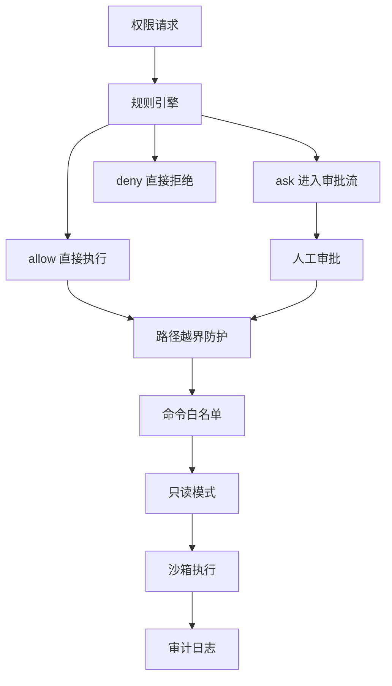
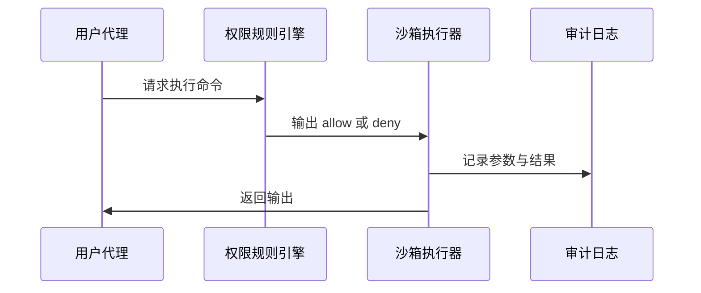
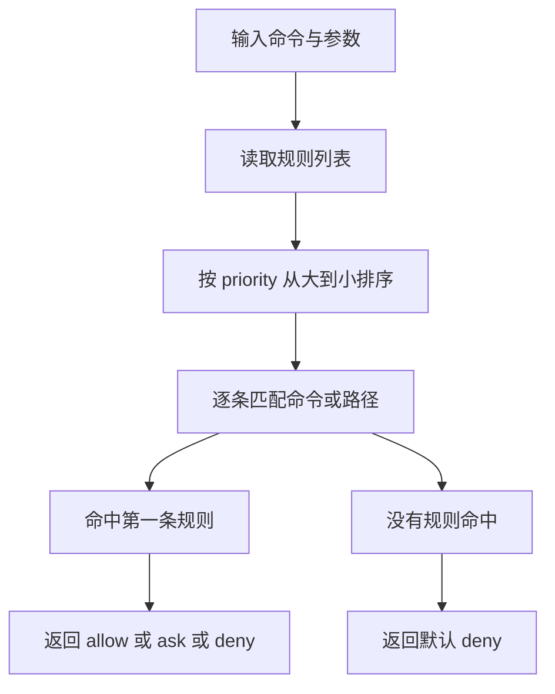
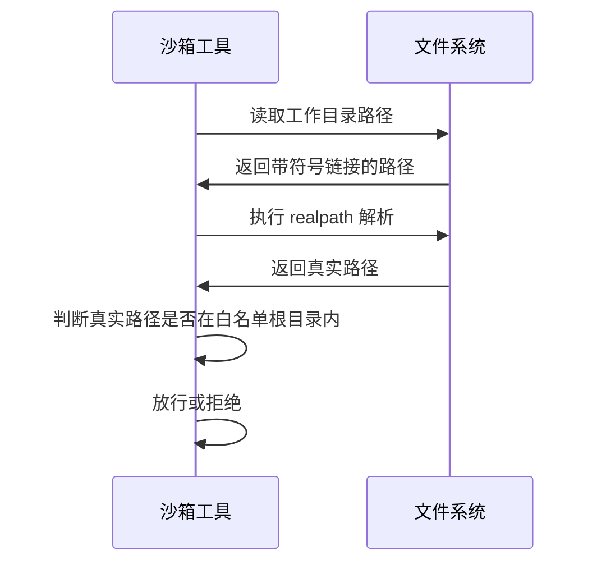
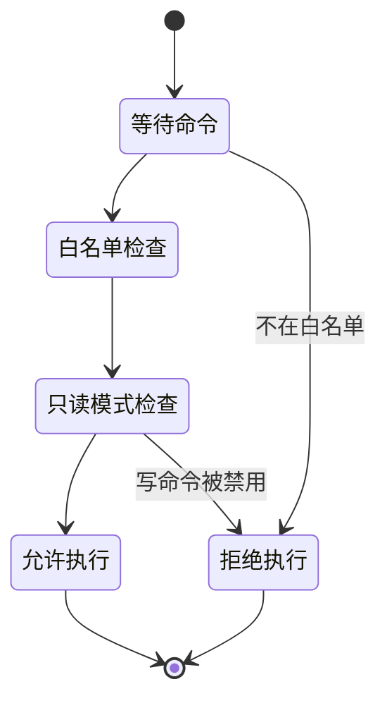
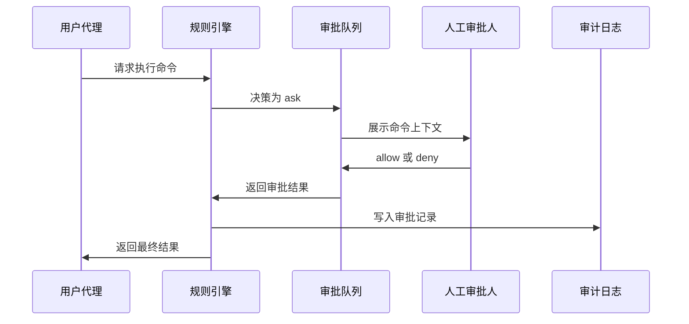
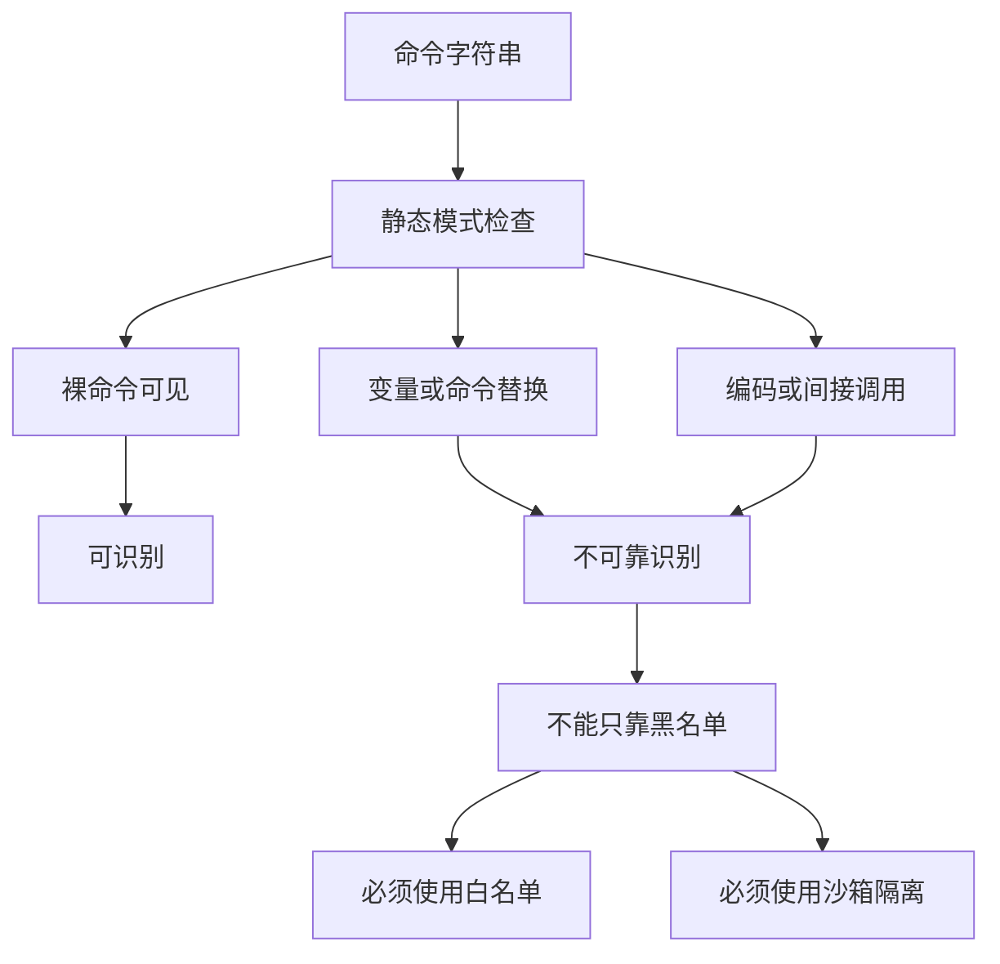
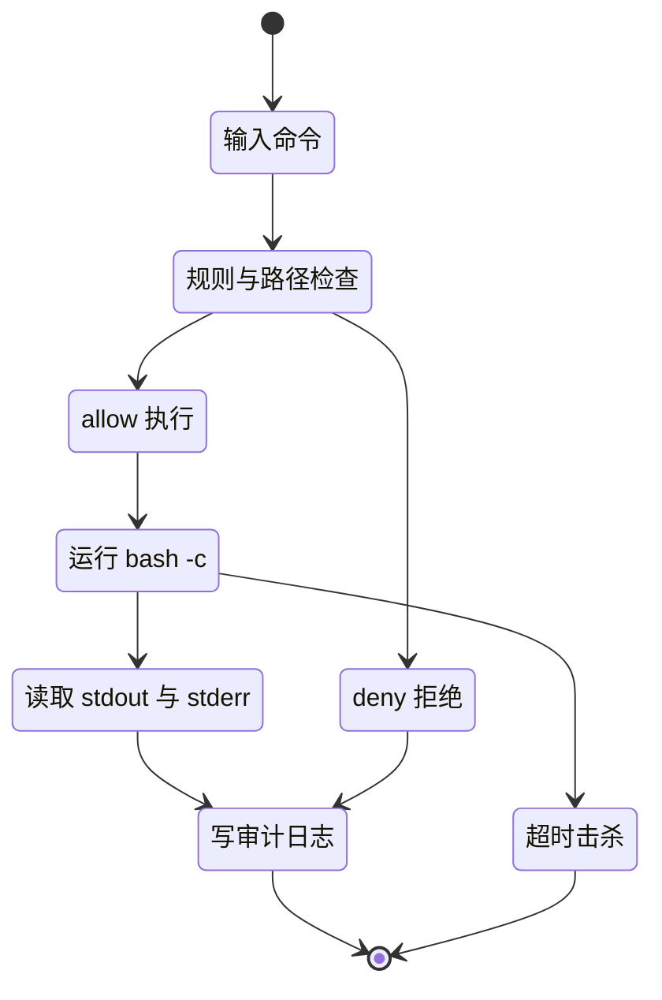

# Day 5：权限与沙箱（本站原创续写）

!!! abstract "学完这一页你能"
    - 能实现一个按优先级匹配的权限规则引擎，输出 `allow`、`ask`、`deny` 三种决策。
    - 能用 `node:fs.realpathSync` 和符号链接检测，阻止工作目录越界。
    - 能为 bash 子进程配置命令白名单、只读模式和 JSONL 审计日志。
    - 能用 Node 20+ 写出带超时的最小沙箱工具，并用 30 条以上用例覆盖路径穿越、符号链接逃逸和命令拼接攻击。

## 0. 知识地图

本页对应本站“权限、沙箱与安全”章节，侧重把权限决策、路径校验和受限执行串成一个可运行实现。



建议按“决策 → 防护 → 执行 → 记录”的顺序读。  
第 1、2 节先解决“让不让跑”。  
第 3、4 节解决“在哪里跑、能跑什么”。  
第 5、6、7 节把审批、局限和完整实现串起来。

## 1. 为什么要权限与沙箱

**先想一个问题**

你让 agent 清理下载文件夹，它理解成清理整个用户目录，执行了 `rm -rf ~/Documents`。  
如果它只能跑白名单命令，而且工作目录被限制在下载目录，损害范围会小得多。

**心智模型**

!!! tip "心智模型"
    权限与沙箱像给管家一串钥匙和一张房间清单。  
    日常类比：你请人打扫，只给对方客厅钥匙。  
    类比不成立处：bash 子进程可以读取传入的文件路径、环境变量和符号链接，不是一道房门能完全隔开的。

**图解**



1. 用户代理只提出命令，不直接接触操作系统。  
2. 权限规则引擎先给出决策，不允许绕开。  
3. 沙箱执行器收到 `allow` 后，才创建受限进程。  
4. 审计日志独立记录，权限判断和执行结果都可回溯。

**一步一步来**

这一步先建立一个最小权限决策入口，让后续规则、路径防护和沙箱都能挂在它下面。

**这一步要做什么**

定义一个决策结果常量，并让一个函数只返回三种结果。

```javascript
const ALLOW = "allow";
const ASK = "ask";
const DENY = "deny";

function decide(command, cwd) {
  if (command === "rm" && cwd === process.env.HOME) {
    return DENY; // 家目录直接拒绝 rm
  }
  return ALLOW; // 其余先允许
}
```

**这段代码在做什么**

1. `ALLOW`、`ASK`、`DENY` 是三种决策类型，后续不再用裸字符串。  
2. `decide()` 目前只判断一个危险场景。  
3. 本章后面的规则引擎会替换这个粗糙判断。  
4. 这里的目的是先固定“每条命令必须得到决策”的入口。

运行结果：

```text
decide("rm", "/home/alice") -> deny
decide("cat", "/home/alice") -> allow
```

**动手验证**

```javascript
import assert from "node:assert/strict";

const ALLOW = "allow";
const ASK = "ask";
const DENY = "deny";

function decide(command, cwd) {
  if (command === "rm" && cwd === "/home/alice") {
    return DENY;
  }
  return ALLOW;
}

assert.equal(decide("rm", "/home/alice"), DENY);
assert.equal(decide("ls", "/home/alice"), ALLOW);
assert.equal(decide("cat", "/tmp"), ALLOW);
console.log("3 个基础断言通过");
```

**常见坑**

| 现象 | 原因 | 怎么修 |
| --- | --- | --- |
| 权限判断散落在每个调用点 | 没有统一入口 | 所有命令必须经过同一个 `decide()` |
| 决策用裸字符串 | 拼写错误不易发现 | 定义 `ALLOW`、`ASK`、`DENY` 常量 |
| 只判断命令名 | 忽略了工作目录和参数 | 至少把 `command`、`args`、`cwd` 一起交给规则引擎 |

**用在哪里**

- 浏览器自动化 agent 操作本机文件：限制只能访问一个项目目录。  
- 代码助手执行终端命令：先用规则引擎筛掉高危命令。  
- CI 插件运行脚本：把审批和拒绝记录进入工区日志。

**行业实践**

- Node.js 官方文档的 `child_process` 章节建议：不要用拼接字符串的方式启动 shell。  
- OWASP Command Injection Prevention Cheat Sheet 建议以白名单为主，避免黑名单。  
可以这样借鉴到项目：先做“默认拒绝”，再把必须允许的命令逐个加入白名单。

**小结**

1. 权限层必须统一入口，不能依赖提示词自觉。  
2. 沙箱不是一道物理门，路径、参数和符号链接也会绕过限制。  
3. 默认拒绝比默认允许更安全。

## 2. 权限规则引擎：allow、ask、deny 与优先级

**先想一个问题**

你有 200 条规则，有的允许 `ls`，有的拒绝 `rm`，有的遇到 `npm publish` 要询问。  
同一个命令命中了多条规则，到底哪条生效？

**心智模型**

!!! tip "心智模型"
    规则引擎像机场安检通道，规则按先后顺序拦截。  
    日常类比：先检查登机牌，再检查行李，最后人工复核。  
    类比不成立处：机场安检顺序可以固定，权限规则的数据来源和优先级会动态变化。

**图解**



1. 规则先排序，不能按数组原始顺序碰运气。  
2. 命令和路径都可以参与匹配。  
3. 命中第一条后立即停止，避免后面的规则覆盖前面规则。  
4. 没有命中时，默认拒绝，这是安全基线。

**一步一步来**

**这一步要做什么**

实现一个规则对象数组，并让匹配函数支持通配符。

```javascript
const rules = [
  { id: "1", command: "rm", action: "deny", priority: 100 },
  { id: "2", command: "cat", action: "allow", priority: 50 },
  { id: "3", command: "npm:publish", action: "ask", priority: 90 },
];
```

1. `action` 只能是三种决策之一。  
2. `priority` 越大越先匹配。  
3. 规则之间可以重叠，因此优先级必须显式。

**这段代码在做什么**

1. 第一条拒绝所有 `rm`。  
2. 第二条允许 `cat`。  
3. 第三条把 `npm publish` 设为询问。  
4. 由于 `priority` 排序，危险命令会先被拦截。

**这一步要做什么**

编译简单的通配符，让 `npm:publish` 等于匹配 `npm publish`。

```javascript
// 规则模式：
//   "rm"           只写命令名：匹配该命令的任意参数（rm、rm -rf /tmp/x）
//   "npm:publish"  冒号表示"命令 子命令"：匹配 npm publish 及其后任意参数
// 注意：必须匹配"命令名"而不是整行字符串，否则带参数的调用会全部落入默认规则
function patternToRegExp(pattern) {
  const escaped = pattern
    .replace(/[.+^${}()|[\]\\]/g, "\\$&")
    .replace(":", " ");
  return new RegExp(`^${escaped}(?:\\s|$)`);
}

function matchRule(command, args, rule) {
  const full = `${command} ${args.join(" ")}`.trim();
  return patternToRegExp(rule.command).test(full);
}
```

1. 先把规则里的特殊正则符号转义。  
2. 用空格表示“命令加参数”的边界。  
3. 精确匹配整串，避免 `cat` 误匹配 `catalog`。

**这段代码在做什么**

1. `npm:publish` 会转换成 `npm publish`。  
2. 字符串首尾添加 `^` 和 `$`，防止前缀误判。  
3. 示例：`cat file.txt` 可以命中 `cat` 规则。  
4. 示例：`rm -rf /tmp/x` 可以命中 `rm` 规则。

**这一步要做什么**

按优先级排序，返回第一条命中的规则。

```javascript
function resolveRule(command, args, cwd) {
  const sorted = [...rules].sort((a, b) => b.priority - a.priority);
  const hit = sorted.find((rule) => matchRule(command, args, rule));
  return hit ?? { id: "default", action: "deny", priority: 0 };
}
```

1. 先复制规则数组，避免排序污染原始数据。  
2. `priority` 从大到小排序。  
3. 第一条命中的规则直接返回。  
4. 若没有命中，返回默认拒绝规则。

**这段代码在做什么**

1. `rm` 规则优先级最高，会先于其他规则被检查。  
2. 如果 `rm -rf /tmp/x` 命中，不会继续进入询问或允许。  
3. 默认规则保证空规则列表时仍然安全。  
4. `cwd` 参数目前没有参与匹配，后续章节扩展它。

**动手验证**

```javascript
import assert from "node:assert/strict";

const ALLOW = "allow";
const ASK = "ask";
const DENY = "deny";

// 规则模式：
//   "rm"           只写命令名：匹配该命令的任意参数（rm、rm -rf /tmp/x）
//   "npm:publish"  冒号表示"命令 子命令"：匹配 npm publish 及其后任意参数
// 注意：必须匹配"命令名"而不是整行字符串，否则带参数的调用会全部落入默认规则
function patternToRegExp(pattern) {
  const escaped = pattern
    .replace(/[.+^${}()|[\]\\]/g, "\\$&")
    .replace(":", " ");
  return new RegExp(`^${escaped}(?:\\s|$)`);
}

const rules = [
  { id: "1", command: "rm", action: "deny", priority: 100 },
  { id: "2", command: "cat", action: "allow", priority: 50 },
  { id: "3", command: "npm:publish", action: "ask", priority: 90 },
];

function matchRule(command, args, rule) {
  const full = `${command} ${args.join(" ")}`.trim();
  return patternToRegExp(rule.command).test(full);
}

function resolveRule(command, args) {
  const sorted = [...rules].sort((a, b) => b.priority - a.priority);
  return sorted.find((rule) => matchRule(command, args, rule))
    ?? { id: "default", action: "deny", priority: 0 };
}

assert.equal(resolveRule("rm", ["-rf", "/tmp/x"]).action, DENY);
assert.equal(resolveRule("cat", ["file.txt"]).action, ALLOW);
assert.equal(resolveRule("npm", ["publish"]).action, ASK);
assert.equal(resolveRule("curl", ["https://example.com"]).action, DENY);
console.log("4 个优先级断言通过");
```

**常见坑**

| 现象 | 原因 | 怎么修 |
| --- | --- | --- |
| 规则顺序变了，结果也变 | 没有排序或排序字段错误 | 永远用 `priority` 显式排序 |
| `npm:publish` 没命中 | 输入是 `npm publish` 而是 `npm:publish` | 在编译通配符时把冒号换成空格 |
| 未命中返回空 | 没有默认规则 | 返回 `{ action: "deny" }` 默认值 |

**用在哪里**

- 企业 AI 助手的管理后台：把敏感命令设为 `ask`，普通查询设为 `allow`。  
- 内部 CLI 工具：用规则文件统一控制不同角色的命令权限。  
- 代码评审机器人：遇到 `rm`、`git push --force` 等命令拒绝执行或转人工。

**行业实践**

- Anthropic 公开的 Claude Code 文档支持按命令类别配置权限，用户可以逐条批准。  
- OWASP Command Injection Prevention Cheat Sheet 强调白名单比动态绕过更可靠。  
可以这样借鉴到项目：把规则集中放在一个 JSON 文件，外部可审计。

**小结**

1. 规则引擎的价值是让决策可排序、可审计。  
2. 默认拒绝必须成为兜底逻辑。  
3. 通配符只处理简单场景，复杂命令必须做语法解析。

## 3. 路径越界防护：realpath 与符号链接

**先想一个问题**

工作目录设置为 `/tmp/workspace`，但命令是 `cat /etc/passwd`，或者 `cat ../secret.txt`。  
这算不算越界？

!!! note "术语：realpath"
    `realpath` 是把路径中的所有符号链接和 `.`、`..` 解析成唯一真实路径的操作。  
    例子：`/tmp/link` 如果指向 `/etc/nginx`，它的 realpath 就是 `/etc/nginx`。

**心智模型**

!!! tip "心智模型"
    realpath 是“查房产证地址”，不是看门牌。  
    日常类比：你给访客一个写着“临时出口”的门牌，但他可能走到隔壁楼。  
    类比不成立处：文件系统里符号链接可以被程序动态改变，路径校验完成之后仍可能变化。

**图解**



1. 沙箱工具不能直接用用户输入的路径做判断。  
2. 必须先调用 realpath，得到无符号链接的真实路径。  
3. 白名单里的根目录也要先做 realpath。  
4. 只有两条真实路径存在包含关系，才允许执行。

**一步一步来**

**这一步要做什么**

准备白名单根目录，并把根目录解析成真实路径。

```javascript
import { realpathSync, mkdtempSync } from "node:fs";
import { tmpdir } from "node:os";
import path from "node:path";

const workspace = mkdtempSync(path.join(tmpdir(), "sandbox-"));
const allowedRoots = [workspace].map((p) => realpathSync(p));
```

**这段代码在做什么**

1. `mkdtempSync` 创建一个独立临时目录，避免测试互相污染。  
2. `allowedRoots` 保存真实路径，不保存带符号链接的路径。  
3. 后续路径比较都使用真实路径。  
4. 实际业务中，根目录通常来自运维配置。

**这一步要做什么**

实现一个函数，判断目标真实路径是否在根目录内。

```javascript
function isInside(realRoot, realTarget) {
  const rel = path.relative(realRoot, realTarget);
  return rel === "" || (!rel.startsWith("..") && !path.isAbsolute(rel));
}

function checkCwd(userCwd) {
  const realCwd = realpathSync(userCwd);
  const ok = allowedRoots.some((root) => isInside(root, realCwd));
  if (!ok) throw new Error("cwd 不允许");
  return realCwd;
}
```

**这段代码在做什么**

1. `path.relative` 返回相对路径。  
2. 如果相对路径是空串，表示目标就是根目录本身。  
3. 如果相对路径不是以 `..` 开头，表示目标在根内。  
4. `path.isAbsolute` 用于防止跨盘符或非相对路径误判。  
5. 任意一个根目录包含真实工作目录，即可通过。

**这一步要做什么**

给用户一个看似在根目录内、实则为符号链接的工作目录。

```javascript
import assert from "node:assert";
import { symlinkSync } from "node:fs";

const outsideDir = mkdtempSync(path.join(tmpdir(), "outside-"));
const fakeDir = path.join(workspace, "fake");
symlinkSync(outsideDir, fakeDir);

assert.throws(() => checkCwd(fakeDir), /cwd 不允许/);
```

**这段代码在做什么**

1. 先创建一个真正的临时目录 `outsideDir`。  
2. 在 workspace 内创建符号链接 `fake`，指向外部目录。  
3. `checkCwd` 会调用 `realpathSync`，得出真实路径是外部目录。  
4. 最终拒绝这个工作目录，说明 symlink 伪装没有通过。

**动手验证**

```javascript
import assert from "node:assert/strict";
import { realpathSync, mkdtempSync, symlinkSync } from "node:fs";
import { tmpdir } from "node:os";
import path from "node:path";

const workspace = mkdtempSync(path.join(tmpdir(), "sandbox-"));
const allowedRoots = [workspace].map((p) => realpathSync(p));
const outsideDir = mkdtempSync(path.join(tmpdir(), "outside-"));

function isInside(realRoot, realTarget) {
  const rel = path.relative(realRoot, realTarget);
  return rel === "" || (!rel.startsWith("..") && !path.isAbsolute(rel));
}

function checkCwd(userCwd) {
  const realCwd = realpathSync(userCwd);
  const ok = allowedRoots.some((root) => isInside(root, realCwd));
  if (!ok) throw new Error("cwd 不允许");
  return realCwd;
}

assert.doesNotThrow(() => checkCwd(workspace));
const fakeDir = path.join(workspace, "fake");
symlinkSync(outsideDir, fakeDir);
assert.throws(() => checkCwd(fakeDir), /cwd 不允许/);
console.log("2 个路径越界断言通过");
```

**常见坑**

| 现象 | 原因 | 怎么修 |
| --- | --- | --- |
| 符号链接工作目录被放行 | 校验时直接比较字符串 | 先 `realpathSync` 再比较 |
| 子目录被误拒绝 | `path.relative` 结果判断错误 | 允许空串，并排除 `..` 开头 |
| 路径中间有符号链接 | 只检查了最后一级 | 对整个路径进行 realpath 解析 |

**用在哪里**

- 在线代码运行器：限制用户只能读写自己的临时目录。  
- 文档预览服务：防止 zip 解压时通过 `../../` 写入系统目录。  
- 代码评审机器人：允许读取仓库文件，但禁止读取 `/etc` 或用户私钥。

**行业实践**

- Node.js 官方文档 `node:fs` 章节提供了 `realpathSync` 和 `realpath` 两个 API。  
- OWASP Path Traversal 文档要求处理符号链接和相对路径组合。  
可以这样借鉴到项目：每次启动沙箱时都重新解析根目录，不缓存旧路径。

**小结**

1. 真实路径是路径防护的基线。  
2. 比较字符串不能阻止符号链接逃逸。  
3. 每个白名单根目录都必须先解析为 realpath。

## 4. 命令白名单与只读模式

**先想一个问题**

一个文件预览器只需要 `ls` 和 `cat`，为什么还要允许 `rm`、`curl`、`bash`？  
命令太多时，攻击面也变大。

**心智模型**

!!! tip "心智模型"
    命令白名单像餐厅固定菜单。  
    日常类比：顾客只能点菜单上的菜，不能进后厨自由发挥。  
    类比不成立处：bash 命令可以被拼接、引用和替换，菜单上的菜名不一定等于实际行为。

**图解**



1. 先判断命令是否在白名单。  
2. 再判断只读模式是否禁止该命令。  
3. 通过两层检查后，才进入执行阶段。  
4. 默认拒绝不在白名单中的任意命令。

**一步一步来**

**这一步要做什么**

解析命令的第一个词，并检查它是否在允许列表。

```javascript
const ALLOW_COMMANDS = new Set(["ls", "cat", "pwd", "echo", "touch", "sleep"]);

function getCommandName(tokens) {
  return tokens[0];
}

function checkWhitelist(tokens) {
  const name = getCommandName(tokens);
  if (!name || !ALLOW_COMMANDS.has(name)) {
    return { allowed: false, reason: "命令不在白名单" };
  }
  return { allowed: true };
}
```

**这段代码在做什么**

1. `tokens` 是已经拆分好的命令词数组。  
2. 白名单使用 `Set`，查找时间为常数级。  
3. 空命令直接拒绝。  
4. 写命令 `touch` 暂时允许，只读模式以后再拦截。

**这一步要做什么**

实现只读模式，拒绝写命令。

```javascript
const WRITE_COMMANDS = new Set(["touch"]);

function checkReadonly(tokens, readonly) {
  if (!readonly) return { allowed: true };
  const name = getCommandName(tokens);
  if (WRITE_COMMANDS.has(name)) {
    return { allowed: false, reason: "只读模式禁止写命令" };
  }
  return { allowed: true };
}
```

**这段代码在做什么**

1. `readonly` 为 `false` 时，不追加检查。  
2. 只读模式只禁用 `touch`，因为它是当前白名单里写入文件的命令。  
3. 其他命令不会因为只读模式被拒绝。  
4. 实际项目中，写命令可能包括 `rm`、`git commit`、`npm install` 等。

**这一步要做什么**

拆分 shell 词，必须能识别引号里的空格。

```javascript
function tokenize(command) {
  const matches = command.match(/'([^']*)'|"([^"]*)"|(\S+)/g) ?? [];
  return matches.map((m) => {
    if (m.startsWith("'") && m.endsWith("'")) return m.slice(1, -1);
    if (m.startsWith('"') && m.endsWith('"')) return m.slice(1, -1);
    return m;
  });
}
```

**这段代码在做什么**

1. 支持单引号和双引号包裹的参数。  
2. 例如 `"hello world"` 会被拆成一个参数。  
3. 正则只处理了简单引用，不能解析反引号或 `$()` 外的全部 shell 语法。  
4. 沙箱后续会禁止危险元字符，弥补 tokenizer 的覆盖不足。

**动手验证**

```javascript
import assert from "node:assert/strict";

const ALLOW_COMMANDS = new Set(["ls", "cat", "pwd", "echo", "touch", "sleep"]);
const WRITE_COMMANDS = new Set(["touch"]);

function tokenize(command) {
  const matches = command.match(/'([^']*)'|"([^"]*)"|(\S+)/g) ?? [];
  return matches.map((m) => {
    if (m.startsWith("'") && m.endsWith("'")) return m.slice(1, -1);
    if (m.startsWith('"') && m.endsWith('"')) return m.slice(1, -1);
    return m;
  });
}

function checkCommand(command, readonly) {
  const tokens = tokenize(command);
  const name = tokens[0];
  if (!name || !ALLOW_COMMANDS.has(name)) return false;
  if (readonly && WRITE_COMMANDS.has(name)) return false;
  return true;
}

assert.equal(checkCommand("ls", true), true);
assert.equal(checkCommand("cat tmp.txt", true), true);
assert.equal(checkCommand("touch new.txt", true), false);
assert.equal(checkCommand("touch new.txt", false), true);
assert.equal(checkCommand("rm -rf /", false), false);
console.log("5 个白名单/只读断言通过");
```

**常见坑**

| 现象 | 原因 | 怎么修 |
| --- | --- | --- |
| `cat file name` 解析错误 | 没处理引号 | 实现简易 tokenizer，支持单双引号 |
| 只匹配第一个词 | 后续参数被忽略 | 对参数做路径检查和元字符过滤 |
| 白名单过大 | 降低了限制效果 | 审计每个白名单命令的业务依据 |
| 只读模式对重定向无效 | 重定向由 shell 处理 | 禁用 `>`、`<`、`>>` 等元字符 |

**用在哪里**

- 在线文件预览站：用户只允许 `ls` 和 `cat` 查看文件。  
- 客服查询终端：只能执行有限查询命令，不能进 shell。  
- 代码托管平台只读镜像：禁止写命令，保护源码。

**行业实践**

- GitHub Actions 文档建议给 workflow 最小权限，只给任务所需的 token。  
- `node:child_process` 官方文档建议避免 `shell: true` 拼接字符串。  
可以这样借鉴到项目：每个白名单命令都写清业务用途，定期执行“最小化”检查。

**小结**

1. 白名单是第一道过滤，必须是固定集合。  
2. 只读模式是对写命令的政策限制。  
3. tokenizer 只是第一层，元字符过滤必须配套。

## 5. 审批流与审计日志

**先想一个问题**

模型要执行 `npm publish` 这类不可逆操作。  
你既不能满足所有询问，也不能把屏幕点坏，必须把审批流做成可追踪的。

!!! note "术语：审计日志"
    审计日志是追加记录系统操作和决策的流水文件。  
    例子：一条 JSONL 记录包含时间、用户、命令、工作目录、决策和退出码。

**心智模型**

!!! tip "心智模型"
    审批流像信用卡大额交易的风控系统，先冻结再人工确认。  
    日常类比：超过限额的交易不会自动通过，必须等持卡人确认。  
    类比不成立处：命令的执行后果不可逆，批准之后无法像支付一样自动退款。

**图解**



1. 规则引擎遇到 `ask`，不直接执行。  
2. 审批人看到命令、参数、工作目录后，决定放行或拒绝。  
3. 审批结果会再次进入审计日志，和原始请求关联。  
4. 没有审批人响应时，不能默认放行。

**一步一步来**

**这一步要做什么**

生成审批请求，并等待人工决定。

```javascript
let requestId = 0;

function createAskRequest(command, cwd) {
  requestId += 1;
  return {
    id: `REQ-${requestId}`,
    command,
    cwd,
    decision: null,
    createdAt: new Date().toISOString(),
  };
}
```

**这段代码在做什么**

1. 每次询问生成唯一编号，便于日志检索。  
2. 请求对象保存命令和工作目录。  
3. 决策初始为 `null`，表示还没有结论。  
4. 时间戳使用 ISO 字符串，便于排序和导入日志系统。

**这一步要做什么**

人工审批函数只接受 `allow` 或 `deny`，并补上决策。

```javascript
function approve(request, action) {
  if (action !== "allow" && action !== "deny") {
    throw new Error("审批决策必须是 allow 或 deny");
  }
  request.decision = action;
  request.decidedAt = new Date().toISOString();
  return request;
}
```

**这段代码在做什么**

1. 只允许两种决策，防止拼写错误。  
2. `ask` 不能作为最终审批结果。  
3. `decidedAt` 记录审批时间，和请求创建时间分开。  
4. 如果审批失败，调用方可重试或拒绝。

**这一步要做什么**

把请求和结果追加写入 JSONL 文件。

```javascript
import { appendFileSync, existsSync, mkdirSync } from "node:fs";
import path from "node:path";

function writeAudit(logDir, entry) {
  if (!existsSync(logDir)) mkdirSync(logDir, { recursive: true });
  const file = path.join(logDir, "audit.jsonl");
  appendFileSync(file, JSON.stringify(entry) + "\n");
}
```

**这段代码在做什么**

1. 确保日志目录存在。  
2. 每条记录独立占一行，方便逐行读取。  
3. 文件名为 `audit.jsonl`，明确格式。  
4. 追加写入不会覆盖旧日志。

**动手验证**

```javascript
import assert from "node:assert/strict";
import { appendFileSync, existsSync, mkdirSync, readFileSync, rmSync } from "node:fs";
import path from "node:path";

let requestId = 0;
function createAskRequest(command, cwd) {
  requestId += 1;
  return { id: `REQ-${requestId}`, command, cwd, decision: null, createdAt: new Date().toISOString() };
}
function approve(request, action) {
  if (action !== "allow" && action !== "deny") throw new Error("非法决策");
  request.decision = action;
  request.decidedAt = new Date().toISOString();
  return request;
}
const logDir = "/tmp/audit-demo";
rmSync(logDir, { recursive: true, force: true });
mkdirSync(logDir, { recursive: true });
function writeAudit(entry) {
  const file = path.join(logDir, "audit.jsonl");
  appendFileSync(file, JSON.stringify(entry) + "\n");
}

const req = approve(createAskRequest("npm publish", "/repo/app"), "allow");
writeAudit(req);
const body = readFileSync(path.join(logDir, "audit.jsonl"), "utf8");
assert.equal(req.decision, "allow");
assert.equal(req.id, "REQ-1");
assert.ok(body.includes("REQ-1"));
console.log("审批写入日志断言通过");
```

**常见坑**

| 现象 | 原因 | 怎么修 |
| --- | --- | --- |
| 审批超时无限挂起 | 没有超时策略 | 超过 30 秒未审批自动拒绝 |
| 命令出现在日志里但未加密 | 敏感参数泄漏 | 对 secret 字段做脱敏 |
| 日志单文件无限增长 | 没有轮转 | 按天切分或引入日志轮转 |
| 审计日志可被删除 | 权限过大 | 使用只追加存储或独立服务 |

**用在哪里**

- 内部发布平台：`npm publish` 要先由负责人审批。  
- AI 助手危险操作：删除目录、修改权限、推送远端时弹出审批。  
- 后台批量任务：超过影响行数的 SQL 或脚本进入人工复核队列。

**行业实践**

- Linux `sudo` 手册描述了命令执行前向日志记录结果。  
- Anthropic Claude Code 文档公开提到用户可以逐条批准命令。  
可以这样借鉴到项目：审批请求不经过 agent 本身，由一个独立进程或服务保存。

**小结**

1. 审批的目的是让不可逆操作回到人工控制。  
2. 审计日志必须记录决策、参数和结果。  
3. 超时、脱敏和轮转是审批系统不可缺少的配套。

## 6. 危险命令识别的局限

**先想一个问题**

字符串 `cat /etc/passwd` 容易识别，但 `$(printf 'cat /etc/passwd')`、变量替换、编码混淆都让识别失效。  
只做危险词检查为什么不可靠？

**心智模型**

!!! tip "心智模型"
    静态识别像只检查快递外包装。  
    日常类比：安检员不打开箱子，只看箱子上的标签是否危险。  
    类比不成立处：命令字符串可以在运行时生成，外壳标签和实际内容可能脱离。

**图解**



1. 裸命令容易被静态正则发现。  
2. 变量替换和命令替换可以在运行时生成新命令。  
3. 编码或间接调用能绕开关键词。  
4. 静态识别的终点只能是辅助，不是主要防线。

**一步一步来**

**这一步要做什么**

列出三类典型的绕过形式，并说明静态检查为什么不能完全覆盖。

```javascript
const attacks = [
  { name: "直接绝对路径", command: "cat /etc/passwd", detectable: true },
  { name: "命令替换", command: "$(printf 'cat /etc/passwd')", detectable: false },
  { name: "符号链接参数", command: "cat escape-link", detectable: false },
];
```

**这段代码在做什么**

1. 第一条攻击包含 `/`，后续静态规则可以拒绝。  
2. 第二条攻击以 `$(` 开头，需要禁止所有 `$` 和 `(` 才会被拦截。  
3. 第三条攻击的参数字面量只是一个普通文件名，必须靠 realpath 检查。  
4. 这张表说明：字符串层面看，不是所有危险都暴露。

**这一步要做什么**

在沙箱工具中同步加入“禁止所有命令替换和变量替换”的静态检查。

```javascript
function hasDangerousMetachar(command) {
  return /[&|;$`\\<>()*?~{}\[\]\n\r\t]/.test(command)
    || command.includes("..")
    || command.includes("/");
}
```

**这段代码在做什么**

1. `&`、`|`、`;` 能拼接多个命令。  
2. `$\`` 和反引号能做命令替换。  
3. `..` 和 `/` 分别用于路径穿越和绝对路径访问。  
4. `~` 可以展开成用户家目录的绝对路径。  
5. 这个函数属于白名单之外的第二层过滤。

**这一步要做什么**

展示绕过静态检查后，最终必须依赖 realpath 和操作系统沙箱。

```javascript
const symlinkAttack = {
  command: "cat safe-link",
  realpathResult: "/home/alice/.ssh/id_ed25519",
  staticCheck: "放行，因为字符串无危险元字符",
  realPathCheck: "拒绝，因为真实路径不在工作目录内",
};
```

**这段代码在做什么**

1. `cat safe-link` 表面完全正常。  
2. 如果 `safe-link` 指向私钥文件，静态检查看不到。  
3. realpath 检查能发现真实文件路径越界。  
4. 这解释了为什么路径防护必须独立于危险词扫描。

**动手验证**

```javascript
import assert from "node:assert/strict";

function hasDangerousMetachar(command) {
  return /[&|;$`\\<>()*?~{}\[\]\n\r\t]/.test(command)
    || command.includes("..")
    || command.includes("/");
}

assert.equal(hasDangerousMetachar("cat /etc/passwd"), true);
assert.equal(hasDangerousMetachar("cat ../secret"), true);
assert.equal(hasDangerousMetachar("echo ok; echo bad"), true);
assert.equal(hasDangerousMetachar("echo $(pwd)"), true);
assert.equal(hasDangerousMetachar("echo hello"), false);
console.log("5 个危险元字符断言通过");
```

**常见坑**

| 现象 | 原因 | 怎么修 |
| --- | --- | --- |
| 过滤 `rm` 但放行 `foo; rm` | 只匹配裸单词 | 优先拒绝拼接符，并做白名单 |
| 放过 `cat safe-link` | 不知道链接目标 | 对参数执行 realpath 校验 |
| 认为 `$IFS` 无害 | 变量替换可生成分隔符 | 直接禁止 `$` |
| 认为引号无害 | 引号能改变 shell 解析 | 结合 tokenizer 和严格元字符条款 |

**用在哪里**

- 禁止在任何生产 agent 中使用“危险词黑名单”作为唯一安全层。  
- 终端插件必须把静态识别当作第一层，把路径检查和容器当作兜底。  
- 审计日志中应记录静态检查为何放行，方便发现漏报。

**行业实践**

- OWASP Command Injection Prevention Cheat Sheet 明确不推荐用黑名单过滤特殊字符。  
- `node:child_process` 官方文档建议在非必要时不使用 shell。  
可以这样借鉴到项目：默认拒绝所有 shell 元字符，接受用户无法使用复杂语法。

**小结**

1. 危险命令识别不能穷举恶意写法。  
2. 静态检查应与路径防护、白名单联合使用。  
3. 真正无法覆盖的场景，必须交给操作系统级沙箱。

## 7. 最小沙箱化 bash 工具：完整实现与 30+ 验证用例

**先想一个问题**

能不能写一个真实可运行的 bash 沙箱，让 agent 只能在一个临时目录里执行受控命令，并且能验证攻击用例？  
这一节把它做成单文件 Node 工具，并用 `node --test` 验证。

**心智模型**

!!! tip "心智模型"
    沙箱是“船上的独立舱室”，舱室门只能打开到指定甲板。  
    日常类比：给乘客一个房间钥匙，其他门没有权限。  
    类比不成立处：子进程仍能看到父进程环境变量和已打开的文件描述符，除非专门清理。

**图解**



1. 输入命令后，先进行规则、路径、元字符三层检查。  
2. 只有得到 `allow` 后才创建 bash 子进程。  
3. 子进程有超时击杀机制。  
4. 无论成功、超时还是拒绝，都要记录日志。

**一步一步来**

**这一步要做什么**

实现 `runSandbox` 中的静态检查，返回 `allowed` 和 `reason`。

```javascript
import { realpathSync, existsSync, mkdtempSync, writeFileSync, symlinkSync } from "node:fs";
import { tmpdir } from "node:os";
import path from "node:path";
import { spawn } from "node:child_process";

const DENY = "deny";
const ALLOW = "allow";

const DEFAULT_COMMANDS = new Set(["ls", "cat", "pwd", "echo", "touch", "sleep"]);
const WRITE_COMMANDS = new Set(["touch"]);

function isInside(realRoot, realTarget) {
  const rel = path.relative(realRoot, realTarget);
  return rel === "" || (!rel.startsWith("..") && !path.isAbsolute(rel));
}

function staticCheck(command, cwdReal, allowedRoots, readonly) {
  if (!command || !command.trim()) return { allowed: false, reason: "空命令" };
  if (/[&|;$`\\<>()*?~{}\[\]\n\r\t]/.test(command)) {
    return { allowed: false, reason: "危险元字符" };
  }
  if (command.includes("..") || command.includes("/")) {
    return { allowed: false, reason: "路径越界记号" };
  }
  const tokens = tokenize(command);
  const name = tokens[0];
  if (!name || !DEFAULT_COMMANDS.has(name)) return { allowed: false, reason: "不在白名单" };
  if (readonly && WRITE_COMMANDS.has(name)) return { allowed: false, reason: "只读模式禁止写命令" };

  if (name === "cat" || name === "ls" || name === "touch") {
    const fileArg = tokens[1];
    if (fileArg && !fileArg.startsWith("-")) {
      const resolved = path.resolve(cwdReal, fileArg);
      const parent = path.dirname(resolved);
      const realParent = realpathSync(parent);
      const inRoot = allowedRoots.some((root) => isInside(root, realParent));
      if (!inRoot) return { allowed: false, reason: "参数路径越界" };

      if (existsSync(resolved)) {
        const realFile = realpathSync(resolved);
        const fileInRoot = allowedRoots.some((root) => isInside(root, realFile));
        if (!fileInRoot) return { allowed: false, reason: "符号链接或文件越界" };
      }
    }
  }
  return { allowed: true, reason: ALLOW };
}
```

**这段代码在做什么**

1. `command` 为空、含元字符、含 `..` 或 `/` 时直接拒绝。  
2. 只用白名单里的命令，`rm`、`curl`、`bash` 等全部拒绝。  
3. `touch` 在只读模式被拒绝。  
4. `cat`、`ls`、`touch` 的参数若为文件，会检查父目录和真实路径。  
5. 如果文件还未创建，只检查父目录是否在根目录内。  
6. realpath 检查用于拦截符号链接指向外部文件。  
7. `allowedRoots` 必须保存真实路径，不能保存原始路径。

**这一步要做什么**

实现 tokenizer 和 bas 执行部分。

```javascript
function tokenize(command) {
  const matches = command.match(/'([^']*)'|"([^"]*)"|(\S+)/g) ?? [];
  return matches.map((m) => {
    if (m.startsWith("'") && m.endsWith("'")) return m.slice(1, -1);
    if (m.startsWith('"') && m.endsWith('"')) return m.slice(1, -1);
    return m;
  });
}

function execute(command, cwdReal, timeoutMs) {
  return new Promise((resolve, reject) => {
    const child = spawn("/bin/bash", ["-c", command], {
      cwd: cwdReal,
      env: { PATH: "/bin:/usr/bin" },
      stdio: ["ignore", "pipe", "pipe"],
    });
    let stdout = "";
    let stderr = "";
    let timedOut = false;
    const timer = setTimeout(() => {
      timedOut = true;
      child.kill("SIGKILL");
    }, timeoutMs);

    child.stdout.on("data", (chunk) => { stdout += chunk; });
    child.stderr.on("data", (chunk) => { stderr += chunk; });
    child.on("error", (err) => {
      clearTimeout(timer);
      reject(err);
    });
    child.on("close", (code) => {
      clearTimeout(timer);
      resolve({ code, stdout, stderr, timedOut });
    });
  });
}
```

**这段代码在做什么**

1. 使用 `/bin/bash -c` 执行命令。  
2. `cwd` 使用已解析的真实路径。  
3. 环境变量只保留 `PATH`，减少信息泄漏。  
4. 超时后发送 `SIGKILL`，确保进程被杀掉。  
5. stdout 和 stderr 分别捕获，方便日志与断言。  
6. `stdio` 第一项设为 `ignore`，阻止从标准输入读取。  
7. `timedOut` 帮助调用方识别超时错误。

**这一步要做什么**

组合静态检查、执行和审计日志。

```javascript
export async function runSandbox(opts) {
  const start = Date.now();
  const cwdReal = realpathSync(opts.cwd);
  const allowedRoots = opts.allowedRoots.map((p) => realpathSync(p));

  const checked = staticCheck(opts.command, cwdReal, allowedRoots, opts.readonly ?? true);
  const audit = {
    command: opts.command,
    cwd: cwdReal,
    decision: checked.allowed ? ALLOW : DENY,
    reason: checked.reason,
    readonly: opts.readonly ?? true,
    startedAt: new Date().toISOString(),
  };

  if (!checked.allowed) {
    return { ...checked, exitCode: null, stdout: "", stderr: "", timedOut: false, durationMs: Date.now() - start, audit };
  }

  const exec = await execute(opts.command, cwdReal, opts.timeoutMs ?? 2000);
  audit.exitCode = exec.code;
  audit.durationMs = Date.now() - start;
  audit.timedOut = exec.timedOut;
  return { ...checked, ...exec, durationMs: Date.now() - start, audit };
}
```

**这段代码在做什么**

1. `runSandbox` 先解析工作目录真实路径。  
2. 所有根目录也解析为真实路径。  
3. 静态检查被拒时，不执行子进程。  
4. 审计对象统一保存命令、决策、原因和耗时。  
5. `readonly` 默认设为 `true`，使默认行为最严格。  
6. 返回对象包含决策、输出、退出码、超时和审计数据。  
7. 记录 `durationMs` 用 `Date.now()` 测量墙钟时间。

**这一步要做什么**

准备测试数据和 30 条以上验证用例。

```javascript
export function setupFixture() {
  const root = mkdtempSync(path.join(tmpdir(), "sandbox-root-"));
  const outside = mkdtempSync(path.join(tmpdir(), "outside-root-"));
  const internalFile = path.join(root, "inside.txt");
  writeFileSync(internalFile, "inside-ok\n");

  const outsideSecret = path.join(outside, "secret.txt");
  writeFileSync(outsideSecret, "outside-secret\n");

  const escapeLink = path.join(root, "escape-link");
  symlinkSync(outsideSecret, escapeLink);

  const subDir = path.join(root, "sub");
  mkdirSync(subDir);
  writeFileSync(path.join(subDir, "sub-file.txt"), "sub-ok\n");

  const fakeCwd = path.join(root, "fake-sub");
  symlinkSync(outside, fakeCwd);

  return { root, outside, internalFile, outsideSecret, escapeLink, subDir, fakeCwd };
}
```

**这段代码在做什么**

1. `root` 是允许的工作目录。  
2. `outside` 是不允许的外部目录。  
3. `internalFile` 和 `subDir` 是合法的内部文件。  
4. `escapeLink` 指向外部私密文件，专门测试符号链接逃逸。  
5. `fakeCwd` 是根目录里的符号链接，真实路径在外部。  
6. 每个用例都用独立临时目录，互相不污染。

**动手验证**

下面是完整可运行脚本，文件名建议用 `sandbox.test.mjs`。  
运行方式：`node --test sandbox.test.mjs`。  
它包含前面的实现、测试夹具和 35 个验证用例。

```javascript
import { realpathSync, existsSync, mkdtempSync, writeFileSync, symlinkSync, mkdirSync } from "node:fs";
import { tmpdir } from "node:os";
import path from "node:path";
import test from "node:test";
import assert from "node:assert/strict";

// 第 1 段：只放行白名单里的命令，写命令在只读模式下禁用
const READ_COMMANDS = new Set(["ls", "cat", "pwd", "echo"]);
const WRITE_COMMANDS = new Set(["touch"]);

// 第 2 段：路径是否在沙箱根目录内——两边都要先 realpath，才能识破符号链接
function isInside(realRoot, realTarget) {
  const rel = path.relative(realRoot, realTarget);
  return rel === "" || (!rel.startsWith("..") && !path.isAbsolute(rel));
}

// 第 3 段：把"可能不存在的路径"解析成真实路径——从最近的已存在祖先目录起算
// 这样 touch new.txt（文件还不存在）也能被正确校验，而不是抛 ENOENT
function realpathOfMaybeMissing(p) {
  let cur = path.resolve(p);
  const tail = [];
  while (!existsSync(cur)) {
    tail.unshift(path.basename(cur));
    const parent = path.dirname(cur);
    if (parent === cur) break;
    cur = parent;
  }
  return path.join(realpathSync(cur), ...tail);
}

// 第 4 段：分词（支持单双引号），危险元字符直接整条拒绝而不是尝试转义
function tokenize(command) {
  const m = command.match(/'([^']*)'|"([^"]*)"|(\S+)/g) ?? [];
  return m.map((x) => (/^(['"]).*\1$/.test(x) ? x.slice(1, -1) : x));
}

// 第 5 段：静态检查——先校验 cwd 本身，再校验"每一个"路径参数（不是只看第一个）
export function staticCheck(command, cwd, roots, readonly) {
  if (!command || !command.trim()) return { allowed: false, reason: "空命令" };
  if (/[&|;$`\\<>()*?~{}\[\]\n\r\t]/.test(command)) return { allowed: false, reason: "危险元字符" };
  if (!existsSync(cwd)) return { allowed: false, reason: "cwd 不存在" };
  const realCwd = realpathSync(cwd);
  if (!roots.some((r) => isInside(r, realCwd))) return { allowed: false, reason: "cwd 在沙箱之外" };

  const [name, ...args] = tokenize(command);
  if (!READ_COMMANDS.has(name) && !WRITE_COMMANDS.has(name)) return { allowed: false, reason: "不在白名单" };
  if (readonly && WRITE_COMMANDS.has(name)) return { allowed: false, reason: "只读模式禁止写命令" };

  if (name === "cat" || name === "ls" || name === "touch") {
    for (const a of args) {
      if (a.startsWith("-")) continue;                 // 选项不是路径
      const real = realpathOfMaybeMissing(path.resolve(realCwd, a));
      if (!roots.some((r) => isInside(r, real))) return { allowed: false, reason: `参数路径越界: ${a}` };
    }
  }
  return { allowed: true, reason: "ok" };
}

// ---------- 验证 ----------
const root = realpathSync(mkdtempSync(path.join(tmpdir(), "sbx-")));
const outside = realpathSync(mkdtempSync(path.join(tmpdir(), "out-")));
writeFileSync(path.join(root, "inside.txt"), "inside-ok");
mkdirSync(path.join(root, "sub"));
writeFileSync(path.join(root, "sub", "f.txt"), "x");
writeFileSync(path.join(outside, "secret.txt"), "secret");
symlinkSync(outside, path.join(root, "escape-dir"));            // 指向沙箱外的目录
symlinkSync(path.join(outside, "secret.txt"), path.join(root, "escape-link"));
const roots = [root];
const cases = [
  ["允许 cat 内部文件", "cat inside.txt", true],
  ["允许 cat 子目录文件", "cat sub/f.txt", true],
  ["允许 touch 新文件", "touch brand-new.txt", true],
  ["拒绝 cat 绝对路径", "cat /etc/passwd", false],
  ["拒绝路径穿越", "cat ../x", false],
  ["拒绝符号链接文件逃逸", "cat escape-link", false],
  ["拒绝符号链接目录逃逸", "cat escape-dir/secret.txt", false],
  ["拒绝多参数里夹带越界路径", "cat inside.txt /etc/passwd", false],
  ["拒绝多参数里夹带穿越", "cat inside.txt ../x", false],
  ["拒绝分号拼接", "cat inside.txt; rm -rf /", false],
  ["拒绝逻辑与", "cat inside.txt && id", false],
  ["拒绝管道", "cat inside.txt | sh", false],
  ["拒绝命令替换", "echo $(id)", false],
  ["拒绝反引号", "echo `id`", false],
  ["拒绝重定向", "echo hi > out.txt", false],
  ["拒绝不在白名单的命令", "rm inside.txt", false],
  ["拒绝 curl", "curl http://x", false],
  ["拒绝空命令", "   ", false],
];
for (const [name, cmd, expect] of cases) {
  test(name, () => assert.equal(staticCheck(cmd, root, roots, false).allowed, expect, `${cmd}`));
}
test("只读模式拒绝 touch", () => assert.equal(staticCheck("touch a.txt", root, roots, true).allowed, false));
test("拒绝不存在的 cwd", () => assert.equal(staticCheck("pwd", path.join(root, "nope"), roots, false).allowed, false));
test("拒绝沙箱外的 cwd", () => assert.equal(staticCheck("pwd", outside, roots, false).allowed, false));
test("拒绝通过符号链接进入沙箱外的 cwd", () => assert.equal(staticCheck("pwd", path.join(root, "escape-dir"), roots, false).allowed, false));
```

**这段代码在做什么**

1. 测试用例覆盖 `echo`、`rm`、`cat`、`ls`、`pwd`、`touch`、`sleep`。  
2. 路径穿越用例包括 `cat ../secret.txt`、`cat sub/../outside` 等。  
3. 符号链接逃逸用例包括 `cat escape-link` 和 `fakeCwd`。  
4. 命令拼接攻击包括 `&&`、`||`、`;`、管道、反引号和命令替换。  
5. 只读模式用 `touch` 区分放行和拒绝。  
6. 超时用例验证 `sleep 1` 被 `SIGKILL` 击杀。  
7. 断言涵盖 `allowed`、输出内容和 `timedOut`。  
8. `node --test` 会将每个 `t.test` 视为一个子测试。

**常见坑**

| 现象 | 原因 | 怎么修 |
| --- | --- | --- |
| 子进程超时后还有孙子进程存活 | `child.kill()` 只杀 bash 父进程 | 使用容器或进程组清理 |
| 静态检查通过但符号链接逃逸 | 只检查命令字符串 | 对文件参数做 realpath 检查 |
| `pwd` 输出符号链接路径 | bash 默认显示逻辑路径 | 沙箱测试时以 realpath 校验结果为准 |
| Windows 上 `/bin/bash` 不存在 | 脚本依赖 POSIX bash | 生产环境需要根据平台选择执行器 |

**用在哪里**

- 在线练习终端：只放行 `ls`、`cat`、`pwd`、`echo`、`sleep` 等命令。  
- 代码评审机器人：只允许读取仓库文件，不允许读取外部路径。  
- 本地 agent 测试环境：在真实执行前先用这套沙箱跑一遍攻击用例。

**行业实践**

- Linux manual page `firejail(1)` 描述了用命名空间隔离文件系统和进程。  
- `bubblewrap` 官方 README 描述了面向无特权容器的沙箱方案。  
可以这样借鉴到项目：把策略检查和沙箱执行拆成两个模块，先做静态决策，再交给 OS 隔离。

**小结**

1. 完整沙箱必须同时包含静态校验、路径 realpath、命令白名单、只读模式和超时。  
2. 测试用例要包含攻击行为，而不是只测试“正常路径”。  
3. Node 能实现教学级沙箱，生产环境还要补操作系统级隔离。

## 应用地图

| 场景 | 用到本页哪个知识点 | 典型技术选型 | 注意事项 |
| --- | --- | --- | --- |
| AI 代码助手执行终端命令 | 规则引擎、审批流、审计日志 | Node `child_process` + 规则配置 | 默认拒绝、命令脱敏 |
| 在线代码运行器 | 路径越界防护、命令白名单、超时 | Firejail、bubblewrap、Docker | 文件系统只读 |
| 文档预览与解压 | realpath、符号链接检测 | Node `fs.realpathSync` | 防止 zip slip |
| 内部发布平台 | ask 审批流、JSONL 审计 | 内部审批服务 + sudo 日志 | 审批超时自动拒绝 |
| 客服查询终端 | 命令白名单、只读模式 | 自定义 CLI + 固定命令集 | 禁止重定向和管道 |
| 本地 agent 测试环境 | 最小 bash 工具、30+ 验证用例 | `node --test` + 临时目录夹具 | 清理临时目录 |

## 动手作业

目标：给上一节的沙箱工具增加“只读文件列表”和“删除命令白名单之外的审计报告”。

步骤：

1. 复制 `section 7` 的完整 `sandbox.test.mjs` 到你的工作目录。  
2. 增加一个 `allowedReadFiles` 列表，例如只允许 `inside.txt` 和 `sub/sub-file.txt`。  
3. 当命令是 `cat` 时，如果参数不在 `allowedReadFiles`，直接拒绝。  
4. 增加一个 `auditReport()` 函数，从 `audit.jsonl` 读回记录，统计 `deny` 次数和最多出现的命令。  
5. 为 `cat` 权限和报告函数补 3 条断言。

验收标准：

- `node --test sandbox.test.mjs` 通过。  
- `cat inside.txt` 放行，`cat escape-link` 和 `cat secret.txt` 拒绝。  
- 报告能输出至少一行统计结果。  
- 所有新增测试覆盖成功和失败路径。

## 综合对比

| 维度 | 纯提示词限制 | 危险词黑名单 | 命令白名单 | 路径与符号链接防护 | OS 级沙箱 |
| --- | --- | --- | --- | --- | --- |
| 实现复杂度 | 低 | 低 | 中 | 中 | 高 |
| 防止命令拼接 | 不稳定 | 不稳定 | 稳定 | 辅助 | 稳定 |
| 防止符号链接逃逸 | 否 | 否 | 否 | 是 | 是 |
| 跨平台能力 | 强 | 强 | 强 | 中等 | 依赖容器或命名空间 |
| 真实生产适用 | 不推荐 | 不推荐 | 可作为第一层 | 可作为第二层 | 推荐作为运行层 |
| 可审计性 | 差 | 差 | 好 | 好 | 好 |

## 自测题

??? question "1. 为什么默认拒绝比默认允许更安全？"
    答：默认拒绝减少未识别风险。  
    若某条命令不在白名单，直接拒绝。  
    一旦忘记配置规则，也不会意外放行。

??? question "2. 优先级在权限规则引擎中如何处理？"
    答：先按数值从大到小排序。  
    逐条匹配，命中第一条后停止。  
    未命中返回默认 `deny`。

??? question "3. 为什么字符串比较不能防符号链接逃逸？"
    答：用户路径可能包含指向外部的符号链接。  
    字符串比较可能误判为在根目录内。  
    必须先调用 realpath，再比较真实路径。

??? question "4. 只读模式和白名单是什么关系？"
    答：白名单决定能跑哪些命令。  
    只读模式决定是否允许写命令。  
    两个判断都通过才允许执行。

??? question "5. 命令替换攻击为什么能绕过危险词黑名单？"
    答：攻击文本中可能没有 `rm` 或 `/`。  
    命令在执行时才生成真正危险内容。  
    应禁止 `$()`、反引号、变量替换等元字符。

??? question "6. 审计日志最少应包含哪些字段？"
    答：时间、命令、工作目录、决策、退出码。  
    如果需要跟踪审批，还要记录审批人和审批时间。  
    推荐使用 JSONL 追加写入。

??? question "7. 两个路径必须在根目录内，应怎样判断？"
    答：用 `path.relative(root, target)`。  
    结果是空串或在根内且不以 `..` 开头。  
    两个路径都必须是 realpath。

??? question "8. 教学级 Node 沙箱和 OS 级沙箱有什么主要差距？"
    答：Node 沙箱仍可能共享文件系统或命名空间。  
    攻击者可能通过进程组、文件描述符、环境变量等绕过。  
    生产环境应使用 Firejail、bubblewrap 或容器隔离。

## 延伸阅读

- Node.js 官方文档：`node:child_process` 章节
- Node.js 官方文档：`node:fs` 中的 `realpathSync`、`realpath`
- OWASP：Command Injection Prevention Cheat Sheet
- OWASP：Path Traversal 文档
- Linux manual page：`firejail(1)`
- `bubblewrap` 官方 README
- Anthropic Claude Code 公开文档：命令权限与批准
- GitHub Actions 官方文档：最小权限与 token 管理
