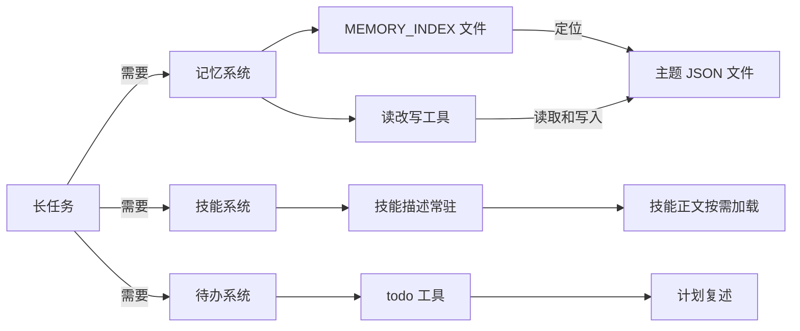
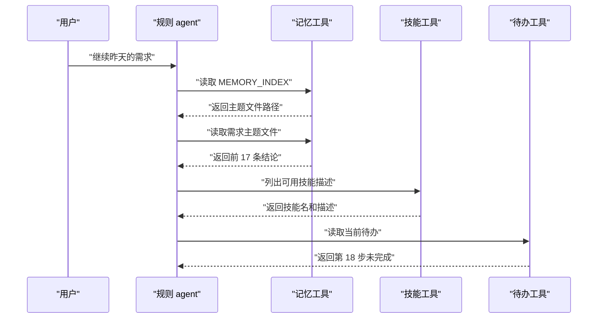
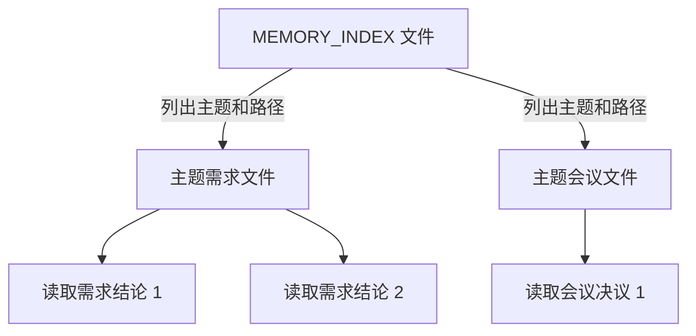
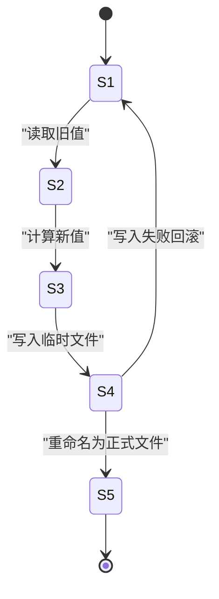
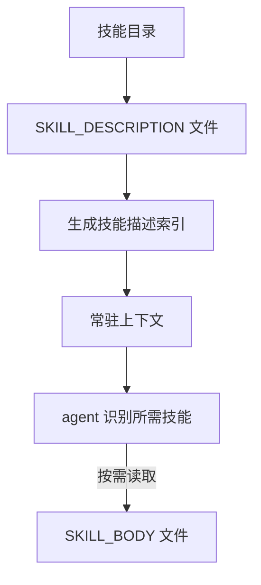
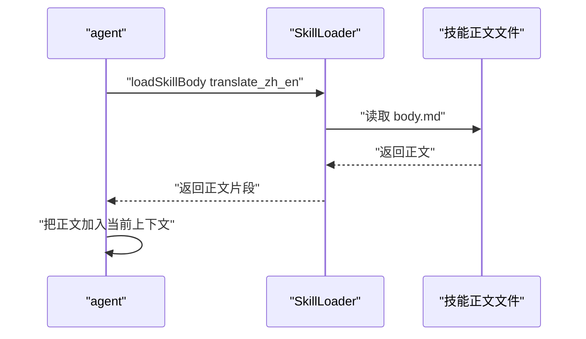
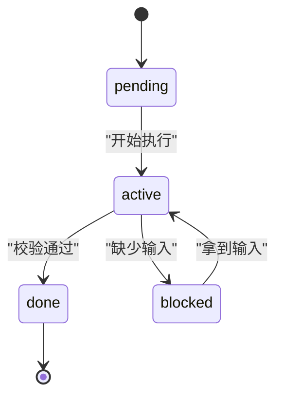
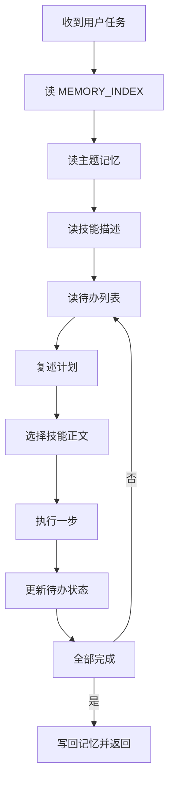

# Day 6：记忆、技能与待办（本站原创续写）

!!! abstract "学完这一页你能"
    - 为 agent 设计 MEMORY.md 索引加主题文件的长期记忆结构。
    - 写出可回滚、可审计的记忆读、改、写工具。
    - 让技能描述常驻上下文、技能正文按需加载。
    - 用 todo 工具和计划复述降低长任务中断后的接续成本。

## 0. 知识地图



建议这样读：先看第 1 节，建立三个盒子的分工。  
然后分别读第 2、3 节实现记忆，第 4、5 节实现技能，第 6 节实现待办。  
最后读第 7 节，看三者如何组合成一个最小可运行 agent 循环。

## 1. 为什么长任务要分成记忆、技能、待办三个盒子

**先想一个问题**：你让 agent 整理 30 个需求，昨天做到第 18 个，今天它把前 17 个结论忘了。为什么？因为对话上下文已经切换，而且单个提示里塞不下所有历史。

**心智模型**

!!! tip "心智模型"
    - 一句话模型：记忆保存“已知事实”，技能保存“怎么做”，待办保存“做到哪里”。
    - 日常类比：装修时，记忆是材料清单，技能是施工手册，待办是墙上的进度表。
    - 类比哪里不成立：真实的施工可以随时看材料，而 agent 必须靠显式读写工具才能看材料；不读文件就等于没有记忆。

**图解**



1. 用户只给出“继续”，agent 不能靠猜测。
2. agent 先读记忆索引，知道去哪里找历史结论。
3. agent 读主题文件，取回前 17 条结论。
4. agent 读技能描述，决定要不要加载额外正文。
5. agent 读待办，确认下一步是第 18 步。

**一步一步来**

这一步要做什么：先分别确认三个盒子的最小数据形状，避免一开始就混在一起。

```js
// memory.js 记忆条目：只保存一条明确结论
const memoryEntry = {
  id: "memory-2026-01-07-001", // 唯一 id，用来定位和更新
  type: "需求结论", // 记忆类型，便于过滤
  topic: "需求整理", // 所属主题
  content: "第 1 到 17 条需求已确认，剩余 13 条待确认", // 实际内容
  savedAt: "2026-01-07T09:30:00.000Z" // 保存时间
};
```

**这段代码在做什么**

- 记忆条目用一个对象保存，字段固定。
- `id` 是定位一条记忆的钥匙。
- `topic` 让多条记忆可以归档到同一个主题。
- `content` 只写结论，不写过程。
- `savedAt` 用于后面对冲突或覆盖做判断。

运行结果：无打印，结构保存在变量中。

这一步要做什么：再定义技能的数据形状，让技能描述与正文分离。

```js
// skill.js 技能摘要：小到可以放进上下文
const skillSummary = {
  name: "translate_zh_en", // 技能名，作为命令名
  description: "把简体中文翻译成英文，术语表由调用方传入。", // 一句话描述
  bodyFile: "./skills/translate_zh_en.md" // 正文路径，按需读取
};
```

**这段代码在做什么**

- `name` 是 agent 调用技能时使用的命令名。
- `description` 只有一句话，常驻上下文。
- `bodyFile` 指向真正的技能正文。
- 描述和正文路径分开，是控制上下文体积的关键。
- 没有把技能正文直接塞进常量。

运行结果：无打印，结构保存在变量中。

这一步要做什么：最后定义待办条目，让它能表达“做到哪一步”。

```js
// todo.js 待办条目：有状态、有顺序
const todoEntry = {
  id: "todo-18",
  title: "确认第 18 条需求范围",
  status: "pending", // pending 表示未开始
  order: 18, // 顺序号，避免乱序
  note: "需要用户确认是否包含 App 端"
};
```

**这段代码在做什么**

- `status` 必须是可检查的枚举值。
- `order` 让长任务有固定顺序。
- `note` 记录下一步需要的上下文。
- 三个盒子分别用三种数据结构，避免一个对象承担所有职责。

运行结果：无打印，结构保存在变量中。

**动手验证**

保存为 `day6-section1.mjs`，依赖：Node 20 内置模块 `node:assert/strict`，不需要 npm 包。

```js
import assert from 'node:assert/strict';

const memoryEntry = {
  id: "memory-2026-01-07-001",
  type: "需求结论",
  topic: "需求整理",
  content: "第 1 到 17 条需求已确认，剩余 13 条待确认",
  savedAt: "2026-01-07T09:30:00.000Z"
};

const skillSummary = {
  name: "translate_zh_en",
  description: "把简体中文翻译成英文，术语表由调用方传入。",
  bodyFile: "./skills/translate_zh_en.md"
};

const todoEntry = {
  id: "todo-18",
  title: "确认第 18 条需求范围",
  status: "pending",
  order: 18,
  note: "需要用户确认是否包含 App 端"
};

assert.equal(memoryEntry.topic, "需求整理");
assert.equal(skillSummary.name, "translate_zh_en");
assert.ok(skillSummary.description.length < 200); // 描述必须足够小
assert.equal(todoEntry.status, "pending");
console.log("三项结构校验通过");
```

运行结果：

```text
三项结构校验通过
```

**常见坑**

| 现象 | 原因 | 怎么修 |
|------|------|--------|
| 把整段历史都塞进提示词 | 没有记忆工具，只依赖上下文 | 先读 MEMORY_INDEX，只取相关主题文件 |
| 技能正文占用大量 token | 没有拆分描述与正文 | 常驻 description，按需读 bodyFile |
| 做完一半后不知道进度 | 没有带状态的待办结构 | 用 status 和 order 表达进度 |
| 三个盒子用一个对象表达 | 职责混在一起，难以调试 | 分别定义 memory、skill、todo 数据形状 |

**用在哪里**

场景一：客服工单续办

- 业务背景：用户隔天再次进线，上一个客服已记录处理进度。
- 这一节的知识怎么用：agent 先读工单主题记忆，再读待办，不重复问用户历史。
- 用什么指标衡量收益：重新打开工单时，首轮可确认状态的比例。
- 什么时候不该用：单轮 FAQ 咨询无需建长期记忆。

场景二：前端项目周报生成

- 业务背景：每天有多个提交记录，周末要生成周报。
- 这一节的知识怎么用：记忆保存每个提交的摘要，待办保存是否已归入周报。
- 用什么指标衡量收益：周报初稿生成后需要人工修改的条目数。
- 什么时候不该用：临时仓库一次分析，不需要持久化。

场景三：长需求评审

- 业务背景：一次评审有 30 个需求，超过单次上下文。
- 这一节的知识怎么用：待办记录每个需求的评审状态，记忆保存已确认结论。
- 用什么指标衡量收益：完成最后一个需求时，缺失前置确认的比例。
- 什么时候不该用：需求少于 3 个时，直接评审更快。

**行业实践**

- 做法一：Anthropic 的上下文工程文档提出，把工具返回结果按需压缩、保存可复用信息。出处：Anthropic 官方文档，需核对章节《Context engineering》。
- 做法二：OpenAI Cookbook 的工具选择示例中，函数描述保持简短，正文在调用后返回。出处：OpenAI Cookbook，需核对函数调用章节。
- 怎么借鉴到你的项目：先保存结论不保存原文；技能只暴露摘要；待办状态机先于业务逻辑设计。

**小结**

- 记忆、技能、待办解决三个不同问题，不要合并成一个结构。
- agent 不读文件就等于没有长期记忆。
- 第一步不是实现完整 agent，而是把三个盒子形状定义清楚。

## 2. 文件式记忆：一个索引文件加多个主题文件

**先想一个问题**：所有历史都写进一个 `memory.json`，时间一长会变成 5 MB 的大文件。读取一个结论，要扫描整份文件。为什么不能用一个大文件？因为读取和翻查都慢，而且容易整文件冲突。

**心智模型**

!!! tip "心智模型"
    - 一句话模型：索引文件是目录卡，主题文件是分抽屉。
    - 日常类比：图书馆目录卡告诉你书在哪一行，真正的书放在对应书架上。
    - 类比哪里不成立：图书馆的书不会因为目录卡写错就消失；文件式记忆如果索引路径写错，agent 就找不到主题文件。

**图解**



1. MEMORY_INDEX 只保存“哪一个主题对应哪一个文件”。
2. 需求主题文件保存需求结论条目。
3. 会议主题文件保存会议决议条目。
4. 读取某一主题时，不必扫描其他主题文件。
5. 新增主题时，只改索引文件，不影响已有主题。

**一步一步来**

这一步要做什么：建 MEMORY_INDEX，登记主题和文件路径。

```js
// memory-index.json 内容示例
{
  "version": 1,
  "topics": {
    "requirements": {
      "path": "./memory/requirements.json",
      "description": "需求整理结论"
    }
  }
}
```

**这段代码在做什么**

- `topics` 的键是主题名，值是主题元信息。
- `path` 指向真正的主题文件。
- `description` 让 agent 不打开文件也能判断主题内容。
- `version` 给文件格式留升级空间。

运行结果：这是 JSON 文件内容，不是脚本输出。

这一步要做什么：建一个主题文件，只保存某个主题的条目。

```js
// requirements.json 内容示例
{
  "topic": "requirements",
  "entries": [
    {
      "id": "memory-2026-01-07-001",
      "content": "第 1 到 17 条需求已确认",
      "savedAt": "2026-01-07T09:30:00.000Z"
    }
  ]
}
```

**这段代码在做什么**

- 主题文件把 `entries` 作为数组保存多条记忆。
- 每条记忆有 `id`，方便精确更新。
- 同主题文件内结构一致，减少后续读代码的分支。
- 主题文件不保存其他主题，避免单文件膨胀。

运行结果：这是 JSON 文件内容，不是脚本输出。

这一步要做什么：按主题名打开对应文件。

```js
// 从索引找到主题文件并读取
import { readFile } from 'node:fs/promises';

async function readTopic(index, topicName) {
  const topic = index.topics[topicName]; // 按主题名找元信息
  const raw = await readFile(topic.path, 'utf8'); // 只读该主题文件
  return JSON.parse(raw); // 解析成对象
}
```

**这段代码在做什么**

- 函数只接收索引和目标主题名。
- 先取 `topic.path`，不猜路径。
- 只读一个文件，避免加载其他主题。
- 返回解析后的对象，不返回原始字符串。
- 如果索引没有该主题，这里会抛错，后续需要补校验。

运行结果：调用后返回 `requirements` 主题对象。

**动手验证**

保存为 `memory-topic.mjs`，依赖：Node 20 内置模块 `node:fs/promises`、`node:assert/strict`。

```js
import assert from 'node:assert/strict';
import { mkdtemp, writeFile, readFile } from 'node:fs/promises';
import { join } from 'node:path';
import { tmpdir } from 'node:os';

const dir = await mkdtemp(join(tmpdir(), 'day6-memory-'));
const indexPath = join(dir, 'memory-index.json');
const requirementsPath = join(dir, 'requirements.json');

const index = {
  version: 1,
  topics: { requirements: { path: requirementsPath, description: "需求整理结论" } }
};
await writeFile(indexPath, JSON.stringify(index, null, 2));
await writeFile(requirementsPath, JSON.stringify({
  topic: "requirements",
  entries: [{ id: "memory-1", content: "第 1 到 17 条需求已确认" }]
}, null, 2));

const savedIndex = JSON.parse(await readFile(indexPath, 'utf8'));
const topicPath = savedIndex.topics.requirements.path;
const topic = JSON.parse(await readFile(topicPath, 'utf8'));

assert.equal(topic.topic, "requirements");
assert.equal(topic.entries[0].id, "memory-1");
console.log("索引定位主题文件校验通过");
```

运行结果：

```text
索引定位主题文件校验通过
```

**常见坑**

| 现象 | 原因 | 怎么修 |
|------|------|--------|
| 所有记忆写一个文件 | 读取慢，更新容易冲突 | 按主题拆成多个文件 |
| 索引里写文件名不写路径 | 换目录后找不到文件 | 索引保存完整路径 |
| 主题文件又保存无关主题 | 主题边界不清，读取变重 | 一个文件只保存一个主题 |
| 直接用内容查找 | 内容变化后查找不可靠 | 给每条记忆稳定 id |

**用在哪里**

场景一：电商商品需求的长期沉淀

- 业务背景：一个商品线会经历多次需求变更。
- 这一节的知识怎么用：每个商品线一个主题文件，索引登记商品线路径。
- 用什么指标衡量收益：读取指定商品历史结论时打开的文件数。
- 什么时候不该用：一次性运营活动结束后不再有续期需求。

场景二：面试准备知识库

- 业务背景：用户按周记录前端知识点和错题。
- 这一节的知识怎么用：主题按模块拆成“浏览器”“算法”“工程化”。
- 用什么指标衡量收益：复习一个模块时需要人工筛选的条目数。
- 什么时候不该用：只记录时间顺序流水账，不需要随机访问模块。

场景三：多项目会议纪要

- 业务背景：同一批人参与多个项目，纪要需要有按项目收拢的能力。
- 这一节的知识怎么用：每个项目一个主题文件，索引保存项目名到路径。
- 用什么指标衡量收益：查找某项目上一条决议的耗时。
- 什么时候不该用：项目总数较少且每个项目纪要每月不足一条。

**行业实践**

- 做法一：开源项目 `Obsidian` 使用 Markdown 文件作为知识单元，通过链接和目录组织记忆。出处：Obsidian 官方文档，需核对目录与链接章节。
- 做法二：`LangChain` 的向量存储支持按 namespace 分区，不同主题存入不同分区。出处：LangChain 官方文档，需核对 vectorstore 章节。
- 怎么借鉴到你的项目：先用索引文件加目录文件，不要一上来引入数据库；主题文件用 JSON 或 Markdown 均可。

**小结**

- 文件式记忆的核心是索引与主题文件分离。
- 索引应保存路径，不保存大段内容。
- 一个主题文件只承担一个主题，方便按需读取。

## 3. 记忆读写工具：读、改、写、回滚的四步操作

**先想一个问题**：agent 更新记忆时写坏文件，原有结论也没了。直接覆盖文件太危险。为什么需要读写工具？因为更新过程可能出现断电、异常或半写入。

**心智模型**

!!! tip "心智模型"
    - 一句话模型：读写工具把“读旧值、算新值、原子写、失败回滚”做成标准流程。
    - 日常类比：财务改账不会直接在原账本上涂，而会先复制一份，写完后替换。
    - 类比哪里不成立：财务替换是人工核验过的；agent 的替换必须由代码自动保证，否则会覆盖原文件。

**图解**



1. 读取旧值时先确认文件存在。
2. 计算新值时不要直接改磁盘。
3. 写入临时文件，避免半写入。
4. 重命名成功后，新文件才生效。
5. 写入失败可回滚到旧文件。

**一步一步来**

这一步要做什么：实现安全的 JSON 读取，文件不存在时返回默认值。

```js
import { readFile } from 'node:fs/promises';

async function readJson(file, fallback) {
  try {
    return JSON.parse(await readFile(file, 'utf8')); // 读文件并解析
  } catch (err) {
    if (err.code === 'ENOENT') return fallback; // 文件不存在时给默认值
    throw err; // 其他错误继续抛出
  }
}
```

**这段代码在做什么**

- `readJson` 接收文件和默认值。
- 文件存在时解析 JSON。
- 文件不存在时返回 `fallback`。
- 解析错误不会被吞掉，会抛出。
- 这个函数是后续读记忆的入口。

运行结果：文件不存在时返回给定默认值。

这一步要做什么：实现原子写，先写临时文件，再重命名。

```js
import { writeFile, rename } from 'node:fs/promises';

async function atomicWriteJson(file, data) {
  const tmp = `${file}.tmp`; // 临时文件路径
  await writeFile(tmp, JSON.stringify(data, null, 2), 'utf8'); // 完整写临时文件
  await rename(tmp, file); // 替换正式文件
}
```

**这段代码在做什么**

- 先写 `.tmp` 文件，避免直接覆盖正式文件。
- `JSON.stringify` 第三个参数让文件可读。
- `rename` 在同一磁盘分区上是原子操作。
- 如果写临时文件失败，正式文件不会受影响。
- 重命名成功后，旧文件被新文件替换。

运行结果：正式文件被更新，且看不到中间状态。

这一步要做什么：实现按 id 更新记忆条目。

```js
async function upsertMemory(file, entry) {
  const data = await readJson(file, { entries: [] }); // 读旧值
  const index = data.entries.findIndex((item) => item.id === entry.id); // 找位置
  if (index === -1) {
    data.entries.push(entry); // 新增
  } else {
    data.entries[index] = { ...data.entries[index], ...entry }; // 合并更新
  }
  await atomicWriteJson(file, data); // 原子写回
}
```

**这段代码在做什么**

- 先读取旧文件，不覆盖已有条目。
- 按 `id` 决定新增还是更新。
- 更新时合并对象，避免丢失未传字段。
- 写回使用原子函数。
- 这个工具只负责记忆结构，不感知具体业务。

运行结果：相同 `id` 只保留一条更新后的记录。

**动手验证**

保存为 `memory-tool.mjs`，依赖：Node 20 内置模块 `node:fs/promises`、`node:assert/strict`。

```js
import assert from 'node:assert/strict';
import { mkdtemp, readFile } from 'node:fs/promises';
import { join } from 'node:path';
import { tmpdir } from 'node:os';
import { writeFile, rename } from 'node:fs/promises';

async function readJson(file, fallback) {
  try { return JSON.parse(await readFile(file, 'utf8')); }
  catch (err) { if (err.code === 'ENOENT') return fallback; throw err; }
}

async function atomicWriteJson(file, data) {
  const tmp = `${file}.tmp`;
  await writeFile(tmp, JSON.stringify(data, null, 2), 'utf8');
  await rename(tmp, file);
}

async function upsertMemory(file, entry) {
  const data = await readJson(file, { entries: [] });
  const index = data.entries.findIndex((item) => item.id === entry.id);
  if (index === -1) data.entries.push(entry);
  else data.entries[index] = { ...data.entries[index], ...entry };
  await atomicWriteJson(file, data);
}

const dir = await mkdtemp(join(tmpdir(), 'day6-tool-'));
const file = join(dir, 'memory.json');
await upsertMemory(file, { id: 'm1', content: '旧结论' });
await upsertMemory(file, { id: 'm1', content: '新结论' });
await upsertMemory(file, { id: 'm2', content: '第二条' });
const result = await readJson(file, { entries: [] });
assert.equal(result.entries.length, 2);
assert.equal(result.entries[0].content, '新结论');
console.log('记忆读改写工具校验通过');
```

运行结果：

```text
记忆读改写工具校验通过
```

**常见坑**

| 现象 | 原因 | 怎么修 |
|------|------|--------|
| 写文件后内容被截断 | 直接写正式文件时进程中断 | 用临时文件加重命名 |
| 更新时旧字段丢失 | 直接覆盖整个对象 | 合并更新而非整体覆盖 |
| 文件不存在时崩溃 | 没有默认值 | readJson 返回 fallback |
| 临时文件残留 | 写入失败没有清理 | 在 catch 中删除 tmp 文件 |

**用在哪里**

场景一：后台管理的批量导入结果缓存

- 业务背景：导入 5000 行数据后，中间进度需要保存。
- 这一节的知识怎么用：每次保存进度都走原子写，避免浏览器刷新后半失败。
- 用什么指标衡量收益：导入中断后已确认进度的丢失行数。
- 什么时候不该用：单条配置保存且写入频率很低时可用直接写。

场景二：代码评审机器人

- 业务背景：机器人对同一个 PR 多次评论，需要更新已有结论。
- 这一节的知识怎么用：按 `id` upsert 评审意见。
- 用什么指标衡量收益：同一个问题重复评论的次数。
- 什么时候不该用：一次性评审后不需要改变。

场景三：用户偏好记忆

- 业务背景：用户设置过输出语言、时间格式，后续要读取和更新。
- 这一节的知识怎么用：把偏好保存成 JSON，按 `id` 更新。
- 用什么指标衡量收益：用户重复设置偏好的次数。
- 什么时候不该用：偏好位数很少且一次设置后不变，可直接读环境变量。

**行业实践**

- 做法一：`SQLite` 的事务提交使用“先写日志、后提交”的思路，避免半写入。出处：SQLite 官方文档，需核对 atomic commit 章节。
- 做法二：`Node.js` 的 `fs.rename` 常被用作小文件的原子替换方案。出处：Node.js 官方文档，需核对 fd 章节。
- 怎么借鉴到你的项目：小记忆文件用 tmp 加重命名，不需要额外依赖；大记忆库再考虑数据库事务。

**小结**

- 读写工具先读旧值，再算新值。
- 原子写的关键是临时文件加重命名。
- 按 `id` upsert 而不是整体覆盖，避免字段丢失。

## 4. 技能描述与正文分离：为什么只常驻 SKILL 的 description

**先想一个问题**：agent 有 40 个技能，如果每个技能正文都放进系统提示，上下文会爆炸。如何让它知道“有哪些技能”，又不必把 40 个正文都加载？答案是只把技能描述常驻。

**心智模型**

!!! tip "心智模型"
    - 一句话模型：技能描述是菜单，技能正文是后厨菜谱。
    - 日常类比：点餐先看菜单，不把整本菜谱放到桌子上。
    - 类比哪里不成立：餐厅点菜后可以口头催菜；agent 必须显式发起“加载正文”的调用，否则永远不会读菜谱。

**图解**



1. 技能目录中，每个技能把描述与正文分开保存。
2. 描述汇总成索引，始终放在上下文。
3. agent 根据用户输入选出需要的技能名。
4. 只有被选中的技能才读取正文。
5. 其他技能正文不进入上下文。

**一步一步来**

这一步要做什么：创建一个技能目录结构，让每个技能有描述文件和正文文件。

```js
// 技能目录示例
const skillDir = {
  "translate_zh_en": {
    "description": "把简体中文翻译成英文。",
    "body": "./skills/translate_zh_en/body.md"
  },
  "explain_code": {
    "description": "逐行解释 JavaScript 代码。",
    "body": "./skills/explain_code/body.md"
  }
};
```

**这段代码在做什么**

- 技能用一个对象表示。
- `description` 一句话说明能力。
- `body` 指向正文文件路径。
- 对象可以放在常驻上下文里。
- 正文没有混入这个对象。

运行结果：技能描述索引可被序列化后进入系统提示。

这一步要做什么：模拟常驻上下文，只保留技能名和描述。

```js
function buildSkillPrompt(skills) {
  return Object.entries(skills)
    .map(([name, info]) => `- ${name}: ${info.description}`) // 每行一个技能
    .join("\n");
}

const promptPart = "可用技能：\n" + buildSkillPrompt({
  "translate_zh_en": { description: "把简体中文翻译成英文。", body: "./skills/translate_zh_en/body.md" }
});
console.log(promptPart);
```

**这段代码在做什么**

- `buildSkillPrompt` 只输出名字和描述。
- 不输出 `body` 路径。
- 上下文可以先看到所有技能能力。
- 每行一个技能，格式稳定。
- 正文路径只留给按需加载阶段。

运行结果：

```text
可用技能：
- translate_zh_en: 把简体中文翻译成英文。
```

这一步要做什么：用描述选择技能，不立即加载正文。

```js
function selectSkill(skills, userInput) {
  if (userInput.includes("翻译")) {
    return "translate_zh_en"; // 根据描述匹配能力
  }
  return null; // 没有匹配就不加载
}

const chosen = selectSkill({
  "translate_zh_en": { description: "把简体中文翻译成英文。", body: "./skills/translate_zh_en/body.md" }
}, "请把这段中文翻译成英文");
console.log(chosen ?? "no skill");
```

**这段代码在做什么**

- `selectSkill` 用输入关键词判断技能。
- 只返回技能名，不读正文。
- 没有匹配项时返回 `null`。
- 这样可以把选择逻辑与加载逻辑分开。
- 真实项目中会用模型或向量匹配，这里简化为规则。

运行结果：

```text
translate_zh_en
```

**动手验证**

保存为 `skill-separation.mjs`，依赖：Node 20 内置模块 `node:assert/strict`。

```js
import assert from 'node:assert/strict';

const skills = {
  translate_zh_en: {
    description: "把简体中文翻译成英文。",
    body: "./skills/translate_zh_en/body.md"
  },
  explain_code: {
    description: "逐行解释 JavaScript 代码。",
    body: "./skills/explain_code/body.md"
  }
};

function buildSkillPrompt(skillMap) {
  return Object.entries(skillMap)
    .map(([name, info]) => `- ${name}: ${info.description}`)
    .join("\n");
}

const prompt = buildSkillPrompt(skills);
assert.ok(prompt.includes("translate_zh_en"));
assert.ok(!prompt.includes("body.md")); // 描述不泄漏正文路径
assert.ok(prompt.length < 500); // 描述索引控制在较小体积
console.log(prompt);
```

运行结果：

```text
- translate_zh_en: 把简体中文翻译成英文。
- explain_code: 逐行解释 JavaScript 代码。
```

**常见坑**

| 现象 | 原因 | 怎么修 |
|------|------|--------|
| 每个技能正文都塞进系统提示 | 描述与正文未分离 | 系统提示只放 description |
| 描述写了两段话 | 描述过长，浪费上下文 | 限制描述长度 |
| 正文路径暴露在提示词 | 生成摘要时把 body 也输出 | buildSkillPrompt 只输出 name 和 description |
| 技能选择总是随机 | 没有按描述做匹配 | 先根据 name 或 description 匹配 |

**用在哪里**

场景一：低代码平台的动作面板

- 业务背景：平台有 60 个动作，用户输入一句话要找到动作。
- 这一节的知识怎么用：所有动作的描述常驻，动作执行体按需加载。
- 用什么指标衡量收益：用户输入到动作命中前的错误尝试次数。
- 什么时候不该用：动作总数少于 5 个，可以全部列出。

场景二：客服机器人技能路由

- 业务背景：用户问“查询物流”“取消订单”等不同问题。
- 这一节的知识怎么用：每个技能只有描述，路由到哪个技能再加载哪个流程正文。
- 用什么指标衡量收益：首轮路由错误率。
- 什么时候不该用：所有请求都走一个固定流程，不需要多技能。

场景三：前端构建脚本选择器

- 业务背景：项目有 lint、test、build 等命令，需要自动选择。
- 这一节的知识怎么用：卡片中展示命令名和一句话描述，执行时读命令正文。
- 用什么指标衡量收益：选中错误命令的次数。
- 什么时候不该用：命令很少且固定，可直接写死。

**行业实践**

- 做法一：`Claude` 的 tool use 文档提出，函数描述要精简，只写用途和参数。出处：Anthropic 官方文档，需核对 tool use 章节。
- 做法二：`OpenAI` 的函数调用示例中，函数描述与参数 schema 分开，不把执行体放进描述。出处：OpenAI Cookbook，需核对 function calling 章节。
- 怎么借鉴到你的项目：每个技能先写 30 字内的描述，描述不包含路径、不包含大段实现。

**小结**

- 技能描述是常驻的，技能正文是按需的。
- 描述文件不应包含实现细节。
- 选择技能时只用描述，不提前读正文。

## 5. 技能按需加载：从命令名到正文读取

**先想一个问题**：已经知道要调用 `translate_zh_en`，但正文还没有进上下文。如何拿到正文？需要一次显式加载，并把结果回传。加载动作不能自动发生。

**心智模型**

!!! tip "心智模型"
    - 一句话模型：技能加载是“调用命令后，只读取该命令的正文”的短路。
    - 日常类比：看菜单点了菜，后厨只做这一道，不会做整本菜谱。
    - 类比哪里不成立：餐厅会主动出菜，agent 需要在代码里主动把正文拼回上下文。

**图解**



1. agent 明确请求一个技能名。
2. SkillLoader 只读取对应文件。
3. 正文从文件返回到内存。
4. agent 把正文追加到当前上下文。
5. 其他技能文件不参与读取。

**一步一步来**

这一步要做什么：实现读取技能摘要的索引函数，避免每次扫描所有目录。

```js
import { readdir, readFile } from 'node:fs/promises';
import { join } from 'node:path';

async function listSkillSummaries(skillRoot) {
  const names = await readdir(skillRoot, { withFileTypes: true }); // 列出目录项
  const summary = {};
  for (const entry of names) {
    if (!entry.isDirectory()) continue; // 只处理目录
    const descPath = join(skillRoot, entry.name, "description.txt"); // 描述文件路径
    const description = await readFile(descPath, 'utf8'); // 读描述
    summary[entry.name] = { description: description.trim() }; // 存描述
  }
  return summary;
}
```

**这段代码在做什么**

- 只扫描技能根目录。
- 一个目录对应一个技能。
- 描述文件统一名为 `description.txt`。
- 返回对象只包含描述。
- 不读正文文件。

运行结果：返回每个技能的描述摘要。

这一步要做什么：实现按技能名加载正文。

```js
async function loadSkillBody(skillRoot, skillName) {
  const bodyPath = join(skillRoot, skillName, "body.md"); // 只拼一个技能的正文路径
  const body = await readFile(bodyPath, 'utf8'); // 读取正文
  return body.trim(); // 去掉首尾空白
}
```

**这段代码在做什么**

- 只根据 `skillName` 拼路径。
- 不扫描其他技能文件。
- 返回正文字符串。
- 调用方拿到后再加入上下文。
- 函数不负责选择技能，只负责加载。

运行结果：返回指定技能的正文内容。

这一步要做什么：加入进程内缓存，同一技能不重复读文件。

```js
const cache = new Map();

async function getSkillBody(skillRoot, skillName) {
  if (cache.has(skillName)) return cache.get(skillName); // 命中缓存
  const body = await loadSkillBody(skillRoot, skillName);
  cache.set(skillName, body); // 写入缓存
  return body;
}
```

**这段代码在做什么**

- `cache` 使用 Map 保存正文。
- 命中缓存时直接返回内存值。
- 未命中才读取文件。
- 同一技能只读盘一次。
- 适合单次 agent 运行内多次引用同一技能。

运行结果：第一次读文件，第二次直接返回缓存。

**动手验证**

保存为 `skill-loader.mjs`，依赖：Node 20 内置模块 `node:fs/promises`、`node:assert/strict`，临时目录由脚本创建。

```js
import assert from 'node:assert/strict';
import { mkdtemp, mkdir, writeFile, readFile } from 'node:fs/promises';
import { join } from 'node:path';
import { tmpdir } from 'node:os';

const root = await mkdtemp(join(tmpdir(), 'skills-'));
await mkdir(join(root, 'translate_zh_en'));
await writeFile(join(root, 'translate_zh_en', 'description.txt'), '把简体中文翻译成英文。');
await writeFile(join(root, 'translate_zh_en', 'body.md'), '翻译步骤：先保留术语，再逐句翻译。');

async function loadSkillBody(skillRoot, skillName) {
  const bodyPath = join(skillRoot, skillName, "body.md");
  return (await readFile(bodyPath, 'utf8')).trim();
}

const body = await loadSkillBody(root, 'translate_zh_en');
assert.ok(body.includes('翻译步骤'));
assert.equal(body.length > 0, true);
console.log(body);
```

运行结果：

```text
翻译步骤：先保留术语，再逐句翻译。
```

**常见坑**

| 现象 | 原因 | 怎么修 |
|------|------|--------|
| 加载技能时扫描整个目录树 | 没有按技能名定位 | 用名字拼路径 |
| 同一个技能加载多次 | 没有缓存 | 用 Map 缓存正文 |
| 描述没有去除空白 | 读文件后保留换行 | 使用 trim |
| 技能正文路径写错 | 前后端路径规范不一致 | 使用 path.join 统一拼路径 |

**用在哪里**

场景一：代码生成工具的多语言模板

- 业务背景：用户选择 React 或 Vue 后，需要加载对应模板。
- 这一节的知识怎么用：选择技能名后只读取 React 模板或 Vue 模板。
- 用什么指标衡量收益：生成一个页面时读取的模板文件数。
- 什么时候不该用：模板很少且全部能常驻时不用按需加载。

场景二：数据库迁移脚本生成

- 业务背景：同一个项目要从 MySQL 迁到 PostgreSQL，迁移脚本不同。
- 这一节的知识怎么用：两个技能描述常驻，用户指定后加载一个脚本生成正文。
- 用什么指标衡量收益：迁移前选择的错误引擎次数。
- 什么时候不该用：只支持一种数据库时直接内置。

场景三：多语言文档生成

- 业务背景：同一组文档要生成中文和英文版本。
- 这一节的知识怎么用：语言技能描述常驻，按用户语言加载对应正文。
- 用什么指标衡量收益：生成文档后需要返工的语言错误比例。
- 什么时候不该用：只生成固定语言文档。

**行业实践**

- 做法一：`AutoGPT` 的 skill 注册表在启动时只加载技能名与描述，执行时再读技能体。出处：AutoGPT 开源项目，需核对 skill registry 章节。
- 做法二：`RAG` 检索通常先返回文档摘要，用户或 agent 选中后再取回正文。出处：OpenAI Cookbook，需核对 retrieval 章节。
- 怎么借鉴到你的项目：缓存放在单次运行内，不要跨进程缓存可变技能文件；文件变了要清缓存。

**小结**

- 按需加载的目标是只读命中的技能正文。
- 先实现 listSkillSummaries，再实现 loadSkillBody。
- 进程内缓存可以减少重复读文件。

## 6. todo 工具与计划复述：把模糊目标变成可检查步骤

**先想一个问题**：用户说“帮我把这次前端改版做完”，这个任务很长。agent 做到一半如果不知道下一步，就会重复做或漏做。如何让目标可控？先把目标拆成小型待办。

**心智模型**

!!! tip "心智模型"
    - 一句话模型：todo 工具把长任务记录成带状态的步骤，计划复述让 agent 先读一遍计划再动手。
    - 日常类比：工地开工前，工头会把施工计划贴在墙上，每完成一步画一个勾。
    - 类比哪里不成立：工地的人看到计划就会同步；agent 不把计划读进提示，等于墙上没贴。

**图解**



1. 每个 todo 从 pending 开始。
2. agent 开始执行时状态变成 active。
3. 执行并校验通过后变成 done。
4. 缺少输入时变成 blocked，避免卡死。
5. blocked 拿到输入后重新激活。

**一步一步来**

这一步要做什么：定义 todo 状态和列表，让进度可查询。

```js
const todos = [
  { id: "t1", title: "确认改版范围", status: "pending" },
  { id: "t2", title: "列出受影响页面", status: "pending" },
  { id: "t3", title: "输出迁移清单", status: "pending" }
];

function remainingTodos(list) {
  return list.filter((item) => item.status !== "done"); // 未完成项
}
```

**这段代码在做什么**

- todos 是一个数组，每项带状态。
- `remainingTodos` 过滤掉已完成项。
- 状态值简单，避免引入复杂枚举类。
- 查询剩余步骤只需一行。
- 这一函数是计划复述的基础。

运行结果：初始返回 3 个未完成项。

这一步要做什么：实现状态流转，只允许合法的前后状态。

```js
const NEXT_STATUS = {
  pending: "active",
  active: "done",
  blocked: "active"
};

function moveTodo(todo, nextStatus) {
  const allowed = NEXT_STATUS[todo.status]; // 根据当前状态看允许的下一步
  if (allowed !== nextStatus) {
    throw new Error(`不允许从 ${todo.status} 改成 ${nextStatus}`); // 拒绝非法流转
  }
  todo.status = nextStatus; // 更新状态
  return todo;
}
```

**这段代码在做什么**

- `NEXT_STATUS` 定义每个当前状态的合法后续。
- `moveTodo` 先检查当前状态能不能到达目标状态。
- 非法流转会抛错。
- 合法流转更新原对象并返回。
- 状态机不依赖业务内容，所有 todo 共用。

运行结果：`pending` 可以先到 `active`，不能直接到 `done`。

这一步要做什么：把计划复述拼成提示，要求 agent 先读一遍。

```js
function recitePlan(todos) {
  const lines = todos.map((item, index) => {
    const symbol = item.status === "done" ? "[x]" : "[ ]"; // 已完成和未完成标记
    return `${index + 1}. ${symbol} ${item.title}`; // 一行一个步骤
  });
  return "执行前先复述计划：\n" + lines.join("\n"); // 拼成提示片段
}
```

**这段代码在做什么**

- 每一步前面有序号。
- `[x]` 表示完成，`[ ]` 表示未完成。
- 输出可读清单。
- 计划复述不是打印日志，是加入上下文。
- agent 每次执行前先读这个清单，避免跳步。

运行结果：

```text
执行前先复述计划：
1. [ ] 确认改版范围
2. [ ] 列出受影响页面
3. [ ] 输出迁移清单
```

这一步要做什么：当剩余步骤为 0 时给出结束条件。

```js
function isPlanComplete(todos) {
  return todos.every((item) => item.status === "done"); // 全部完成才结束
}
```

**这段代码在做什么**

- 检查每一项是否都为 done。
- 不统计完成比例，只给出布尔结束条件。
- 适合小到中等数量的 todo。
- 避免中途提前结束。
- 如果只有部分完成，返回 false。

运行结果：三个都完成后返回 true。

**动手验证**

保存为 `todo-plan.mjs`，依赖：Node 20 内置模块 `node:assert/strict`。

```js
import assert from 'node:assert/strict';

const NEXT_STATUS = { pending: "active", active: "done", blocked: "active" };
function moveTodo(todo, nextStatus) {
  if (NEXT_STATUS[todo.status] !== nextStatus) {
    throw new Error(`不允许从 ${todo.status} 改成 ${nextStatus}`);
  }
  todo.status = nextStatus;
  return todo;
}

const todos = [
  { id: "t1", title: "确认改版范围", status: "pending" },
  { id: "t2", title: "列出受影响页面", status: "pending" },
  { id: "t3", title: "输出迁移清单", status: "pending" }
];

moveTodo(todos[0], "active");
moveTodo(todos[0], "done");
assert.equal(todos[0].status, "done");
assert.throws(() => moveTodo(todos[1], "done")); // pending 不能直接 done
console.log("todo 状态流转校验通过");
```

运行结果：

```text
todo 状态流转校验通过
```

**常见坑**

| 现象 | 原因 | 怎么修 |
|------|------|--------|
| 长任务做到一半不知道下一步 | 没有 toud 列表 | 先拆步骤，再执行 |
| 状态可以乱跳 | 没有状态机约束 | 用 NEXT_STATUS 限制流转 |
| 计划只是打印日志 | 计划没有加入上下文 | 把 recitePlan 结果拼进提示 |
| 完成条件只看是否报错 | 有些步骤没运行也认为结束 | 用 every done 判断，而不是 catch |

**用在哪里**

场景一：前端改版迁移

- 业务背景：项目从 Vue2 迁到 Vue3，步骤多且容易漏。
- 这一节的知识怎么用：先列 todo，每个步骤状态化，执行前复述计划。
- 用什么指标衡量收益：迁移后回归发现的遗漏步骤数。
- 什么时候不该用：单文件调整或一次性无顺序任务不需要 todo。

场景二：代码评审清单

- 业务背景：评审要查规范、安全、依赖、测试四个维度。
- 这一节的知识怎么用：每个维度一个 todo，避免只检查其中两个。
- 用什么指标衡量收益：评审后未发现的明显问题数。
- 什么时候不该用：评审只关注一个点时可不用。

场景三：发布清单

- 业务背景：发布要做构建、灰度、回滚、监控四步。
- 这一节的知识怎么用：发布前复述计划，每完成一步更新状态。
- 用什么指标衡量收益：发布中漏掉的检查项数。
- 什么时候不该用：操作只有一步且无后续影响。

**行业实践**

- 做法一：`SOP` 类工具把长链路拆成 checklist，执行者逐项确认。出处：Atlassian 官方文档，需核对 checklist 章节。
- 做法二：`GitHub Actions` 的 job 和 step 有明确顺序与完成条件。出处：GitHub Docs，需核对 workflow syntax 章节。
- 怎么借鉴到你的项目：用 todo 先于命令执行；命令失败时进入 blocked，而不是继续跑完所有步骤。

**小结**

- todo 工具让长任务的进度可查询。
- 计划复述把计划作为文字输入，不为打印。
- 状态机约束比一堆 if 更可维护。

## 7. 把三者组装成一个最小规则 agent 循环

**先想一个问题**：前面三样都要用起来，怎么串？一个最小循环是：读记忆、读技能摘要、读待办、复述计划、执行、更新待办。写一遍，就能看到三者如何互相配合。

**心智模型**

!!! tip "心智模型"
    - 一句话模型：agent 循环是“读状态、选工具、执行、写回状态”的闭环。
    - 日常类比：值班员接班时先看交班本，再看操作手册，再按待办逐项处理。
    - 类比哪里不成立：值班员能看自己的动作；agent 必须把每一步的写回结果保存，否则下一轮看不到。

**图解**



1. 收到任务后先读记忆索引。
2. 读主题记忆和技能描述。
3. 读待办，复述计划。
4. 按需加载技能正文。
5. 执行一步，更新待办。
6. 全部完成后写回记忆。

**一步一步来**

这一步要做什么：先做一个简单的规则执行器，根据待办标题输出执行结果。

```js
function executeTodo(todo, skillBody) {
  if (todo.title.includes("确认")) {
    return { todoId: todo.id, result: "已确认范围", memoryContent: "改版范围已确认" }; // 根据标题给出结果
  }
  return { todoId: todo.id, result: "已执行", memoryContent: skillBody }; // 默认用技能正文产出
}
```

**这段代码在做什么**

- 只写一个规则示例，不接 LLM。
- 根据标题关键词返回不同结果。
- result 是档前反馈。
- memoryContent 是准备写入记忆的沉淀。
- 真实项目里这里应替换为工具调用或模型推理。

运行结果：返回一个执行结果对象。

这一步要做什么：把结果写回待办状态，并更新记忆。

```js
function applyExecution(todos, memoryEntries, execution) {
  const todo = todos.find((item) => item.id === execution.todoId); // 找到待办
  todo.status = "done"; // 标记完成
  memoryEntries.push({
    id: `memory-${execution.todoId}`,
    content: execution.memoryContent // 落一条记忆
  });
}
```

**这段代码在做什么**

- 根据执行结果找到待办。
- 将状态改为 done。
- 把执行产出写入记忆。
- 待办和记忆在这里联动。
- 后续可从记忆读回这些结论。

运行结果：对应 todo 被标记 done，记忆新增一条。

这一步要做什么：组合前面的工具，组合成一个小函数。

```js
async function runThreeBoxDemo() {
  const memoryEntries = [];
  const skills = {
    "整理需求": { description: "确认改版范围", body: "先确认页面范围，再列影响列表" }
  };
  const todos = [
    { id: "t1", title: "确认改版范围", status: "pending" },
    { id: "t2", title: "列出受影响页面", status: "pending" }
  ];
  const planText = "执行前先复述计划：\n" + todos.map((item) => `[ ] ${item.title}`).join("\n");
  const execution = executeTodo(todos[0], skills["整理需求"].body);
  applyExecution(todos, memoryEntries, execution);
  return { planText, memoryEntries, todos };
}
```

**这段代码在做什么**

- memoryEntries 作为内存里的记忆库。
- skills 描述与正文分离。
- todos 从 pending 开始。
- 先构造 planText，保存计划复述。
- 执行一条 todo，并更新记忆与待办。

运行结果：返回执行后的 planText、memoryEntries 和 todos。

**动手验证**

保存为 `day6-agent-loop.mjs`，依赖：Node 20 内置模块 `node:assert/strict`。

```js
import assert from 'node:assert/strict';

function executeTodo(todo, skillBody) {
  if (todo.title.includes("确认")) {
    return { todoId: todo.id, result: "已确认范围", memoryContent: "改版范围已确认" };
  }
  return { todoId: todo.id, result: "已执行", memoryContent: skillBody };
}

function applyExecution(todos, memoryEntries, execution) {
  const todo = todos.find((item) => item.id === execution.todoId);
  todo.status = "done";
  memoryEntries.push({ id: `memory-${execution.todoId}`, content: execution.memoryContent });
}

const memoryEntries = [];
const skills = {
  "整理需求": { description: "确认改版范围", body: "先确认页面范围，再列影响列表" }
};
const todos = [
  { id: "t1", title: "确认改版范围", status: "pending" },
  { id: "t2", title: "列出受影响页面", status: "pending" }
];
const planText = todos.map((item) => `[ ] ${item.title}`).join("\n");
const execution = executeTodo(todos[0], skills["整理需求"].body);
applyExecution(todos, memoryEntries, execution);

assert.equal(todos[0].status, "done");
assert.equal(memoryEntries.length, 1);
assert.ok(planText.includes("列出受影响页面"));
console.log("计划：", planText);
console.log("待办：", todos);
console.log("记忆：", memoryEntries);
```

运行结果：

```text
计划： [ ] 确认改版范围
[ ] 列出受影响页面
待办： [
  { id: 't1', title: '确认改版范围', status: 'done' },
  { id: 't2', title: '列出受影响页面', status: 'pending' }
]
记忆： [ { id: 'memory-t1', content: '改版范围已确认' } ]
```

**常见坑**

| 现象 | 原因 | 怎么修 |
|------|------|--------|
| 执行完不更新待办 | 写回步骤遗漏 | 执行后调用 applyExecution |
| 记忆不落库 | 只把结果放在当前循环 | 执行产出写回 memoryEntries |
| 每次循环重读待办 | 没有保存待办快照 | 把当前 todos 传进下一轮 |
| 步骤之间顺序丢失 | 没有顺序字段 | 给 todo 加 order |

**用在哪里**

场景一：前端部署机器人

- 业务背景：发布有构建、灰度、回滚、监控四步。
- 这一节的知识怎么用：每步一个 todo，执行后写记忆，发布完成生成报告。
- 用什么指标衡量收益：发布过程中漏掉检查项的次数。
- 什么时候不该用：单命令发布且无人值守时不需要循环。

场景二：工单自动处理流水线

- 业务背景：一个工单要经过分类、回复、确认三步。
- 这一节的知识怎么用：读工单记忆，加载分类与回复技能，按 todo 执行。
- 用什么指标衡量收益：工单未最终确认而提前关闭的次数。
- 什么时候不该用：只做单轮审批的工单。

场景三：面试题生成器

- 业务背景：用户要求一次生成 10 道题，每道题要分点、解释、答案。
- 这一节的知识怎么用：todo 记录 10 道题的完成状态，技能按需加载题型模板。
- 用什么指标衡量收益：生成的题目中缺少答案或解释的比例。
- 什么时候不该用：只生成一道题时无需循环。

**行业实践**

- 做法一：`Anthropic` 的 agent 实践建议，为长时间任务保留外部“scratchpad”，每步写回。出处：Anthropic 官方文档，需核对 agent 章节。
- 做法二：`AutoGPT` 的旧版实现先把目标拆成 task list，再循环执行。出处：AutoGPT 开源项目，需核对 task 章节。
- 怎么借鉴到你的项目：最小循环不用马上接 LLM，先用规则函数跑通写回链路。

**小结**

- agent 循环按“读状态、执行一步、写回状态”运行。
- 待办更新和记忆写回要在同一次执行模型里完成。
- 先用规则 agent 验证闭环，再接真实模型。

## 应用地图

| 场景 | 用到本页哪个知识点 | 典型技术选型 | 注意事项 |
|------|--------------------|--------------|----------|
| 商品需求追踪 | 文件式记忆与主题文件 | JSON 文件加索引 | 主题文件不要跨商品合并 |
| 客服工单续办 | 记忆读改写工具 | Node.js 内置 fs | 使用原子写，防止半写 |
| 多技能路由 | 技能描述常驻、正文按需加载 | 技能目录 + loader | 描述控制在较小长度 |
| 前端迁移任务 | todo 工具与计划复述 | 状态机数组 | 每步完成再改 done |
| 代码评审清单 | todo 状态流转 | 内存 Map 加数组 | 非法状态要拒绝 |
| 发布流水线 | 记忆、技能、待办组合 | Node 脚本或 agent | 执行后必须写回状态 |

## 动手作业

### 项目：做一个“面试题拆解助手”的最小规则 agent

目标：输入一个模块名，读取记忆里的已学结论，按需加载技能正文，生成 3 步 todo，并执行其中一步。

步骤：

1. 建 `memory-index.json` 和 `requirements.json` 主题文件，保存一条“已学模块”记忆。
2. 建 `skills/explain_topic/description.txt`，写一句话描述。
3. 建 `skills/explain_topic/body.md`，写拆题步骤。
4. 写 `todo` 列表，包含“复述计划”、“加载技能”、“执行一步”三步。
5. 写一个 `runDemo` 函数，依次读记忆、读待办、复述计划、加载技能、执行并更新待办和记忆。
6. 使用 `node:assert/strict` 断言 `todo[0].status === "done"`。

验收标准：

- 脚本保存为 `day6-homework.mjs`，在 Node 20 可运行。
- 运行后输出计划、已执行的 todo 和新增记忆。
- 记忆文件至少新增一条记录。
- 不读取多余的技能正文文件。

## 综合对比

| 维度 | 单一大记忆文件 | MEMORY 索引 + 主题文件 | 技能描述常驻 | 技能正文全量常驻 |
|------|----------------|------------------------|--------------|------------------|
| 读取范围 | 全量读 | 按主题读 | 全部描述 | 全部正文 |
| 上下文占用 | 高 | 由主题决定 | 小 | 高 |
| 更新冲突 | 高 | 低 | 低 | 低 |
| 扩展新内容 | 易写难查 | 改索引即可 | 只改描述 | 改全部系统提示 |
| 适用任务 | 很短记忆 | 长期主题记忆 | 多技能路由 | 少技能且正文小 |

## 深入阅读与参考

!!! tip "怎么用这些资料"
    先读「官方文档与规范」建立准确的概念，再读「源码与示例」核对细节，最后用「教程、书籍与视频」换一种讲法加深理解。每条都写明了读哪一节、带着什么问题读。

### 官方文档与规范

| 资源 | 为什么读 | 怎么读 |
|---|---|---|
| [Agent Skills 概览](https://docs.anthropic.com/en/docs/agents-and-tools/agent-skills/overview) | Skills 官方概览，讲清 description 常驻、正文按需加载的机制 | 读 Skills 的加载与触发一节，问自己何时该拆成独立技能，然后写出一个 SKILL.md 测试按需加载。 |
| [In an LLM agent, "working / short-term memory" is what sits in the con (code.claude.com)](https://code.claude.com/docs/en/memory) | 官方解释工作记忆就是上下文里的内容，对应记忆盒子 | 带着"什么该常驻、什么该外置到文件"的问题读，读完后列出自己 Agent 的上下文清单。 |
| [Claude Agent SDK 概览](https://docs.claude.com/en/api/agent-sdk/overview) | SDK 概览给出最小 Agent 循环与工具调用的官方写法 | 对照本站的最小循环逐段读，读完用 SDK 写一个读目录并总结的小 Agent。 |
| [Claude 子 Agent 文档](https://docs.claude.com/en/docs/claude-code/sub-agents) | 子 Agent 文档示范如何限制工具权限，落实技能按需加载 | 读工具权限配置一节，问"哪些工具可以不给"，然后建一个只读审查 subagent。 |
| [A practical guide to building agents（OpenAI）](https://cdn.openai.com/business-guides-and-resources/a-practical-guide-to-building-agents.pdf) | OpenAI 官方指南用模型、工具、指令三要素拆解 Agent 设计 | 重点读工具与指令两节，读完用它三要素复盘自己的记忆、技能、待办划分。 |
| [smolagents 文档](https://huggingface.co/docs/smolagents/index) | 官方文档对比工具调用与代码行动，帮助理解技能如何被调用 | 读 CodeAgent 一节，带着"技能正文何时进上下文"的问题，跑一个需计算的任务。 |

### 源码与示例

| 资源 | 为什么读 | 怎么读 |
|---|---|---|
| [smolagents 仓库](https://github.com/huggingface/smolagents) | 不到千行的核心代码，是最小 Agent 循环最直观的参考 | 只读 agent loop 与工具注册文件，对照本站循环图，找出自己循环缺的终止条件。 |
| [pi 编码 Agent 工具集](https://github.com/earendil-works/pi) | 编码 Agent 的完整工具集与循环实现，可看工具如何被描述 | 读 agent loop 与工具描述定义，问工具说明写多长合适，再改自己工具的 description。 |
| [anthropics/skills 仓库](https://github.com/anthropics/skills) | 官方 skill 仓库，可直接看到索引文件与主题文件的目录组织 | 读两个 skill 的目录与 SKILL.md，仿写一个含索引加主题文件的小技能。 |

### 教程、书籍与视频

| 资源 | 为什么读 | 怎么读 |
|---|---|---|
| [LLM Powered Autonomous Agents（Lilian Weng）](https://lilianweng.github.io/posts/2023-06-23-agent/) | 规划、记忆、工具三部分，正好对应本站的三个盒子 | 精读记忆与规划两节，各写一段理解，再对照自己的循环补上待办复述环节。 |
| [Hugging Face Agents Course](https://huggingface.co/learn/agents-course) | 课程按单元拆解 Agent 基本循环，适合边做边巩固 | 完成 Unit 1 的作业，重点看它如何把模糊目标拆成可检查的步骤。 |
| [Effective context engineering for AI agents](https://www.anthropic.com/engineering/effective-context-engineering-for-ai-agents) | 讲透上下文工程，正好解释为什么只常驻技能描述 | 读上下文精简与分层一节，读完后删掉提示里的重复内容并记录 token 变化。 |
| [Generative Agents](https://arxiv.org/abs/2304.03442) | memory stream 设计是文件式记忆与检索的经典参考 | 读记忆检索与反思两节，思考索引文件该存什么检索线索，再改造自己的记忆文件。 |

## 自测题

??? question "1. 为什么记忆要拆成 MEMORY.md 索引加主题文件？"
    - 索引小，常驻成本低。
    - 主题文件按需读，避免加载全部历史。
    - 新增主题只改索引，不方便影响已有主题。

??? question "2. 技能描述和技能正文为什么必须分开？"
    - 描述用于“让 agent 知道有哪些技能”。
    - 正文只有在技能被选中后才加载。
    - 分开可以控制常驻上下文体积。

??? question "3. atomicWriteJson 为什么先写临时文件再重命名？"
    - 避免直接覆盖正式文件。
    - 写临时文件失败不会损坏旧文件。
    - 同一磁盘分区内重命名可避免半写入暴露。

??? question "4. readJson 里文件不存在时返回 fallback 有什么好处？"
    - 新文件第一次使用不需要提前创建空文件。
    - 减少 agent 处理 ENOENT 的分支。
    - 调用方可以用默认结构继续执行。

??? question "5. todo 状态为什么需要状态机，而不是直接改 status 任意值？"
    - 状态机约束非法流转。
    - 比如 pending 不能直接 done。
    - 避免误标完成导致步骤被跳过。

??? question "6. 为什么 planRecite 的输出要放进上下文而不是仅打印？"
    - 打印只对人可见。
    - agent 不读计划就不按计划执行。
    - 放进上下文能让下一步执行前看到计划。

??? question "7. 技能按需加载的缓存放在哪里合适？"
    - 放在单次 agent 运行内的 Map。
    - 跨进程缓存可能读到旧文件。
    - 文件变化后需要清缓存，不适合长期缓存。

??? question "8. 最小 agent 循环至少包含哪些步骤？"
    - 读记忆。
    - 读技能描述或正文。
    - 读待办并复述计划。
    - 执行一步并写回待办和记忆。

## 延伸阅读

- Node.js 官方文档：`fs.promises` 的 `readFile`、`writeFile`、`rename` 章节。
- Anthropic 官方文档：`Context engineering` 章节，需核对记忆保留与工具返回结构。
- OpenAI Cookbook：`Function calling` 章节，需核对描述与正文分离的示例。
- 本站章节：记忆系统与上下文工程对应章节，需核对 Day 3 与 Day 5 的术语。
