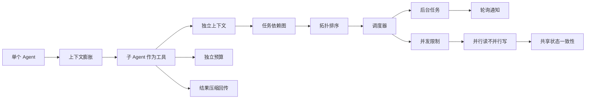
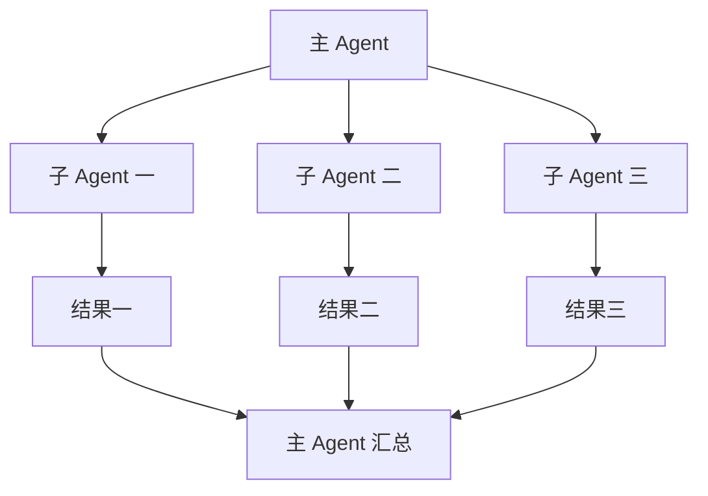
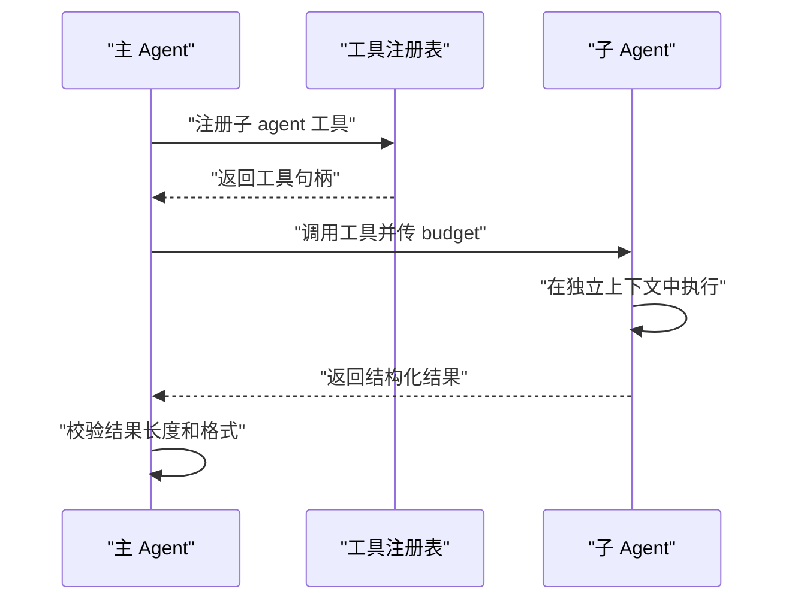
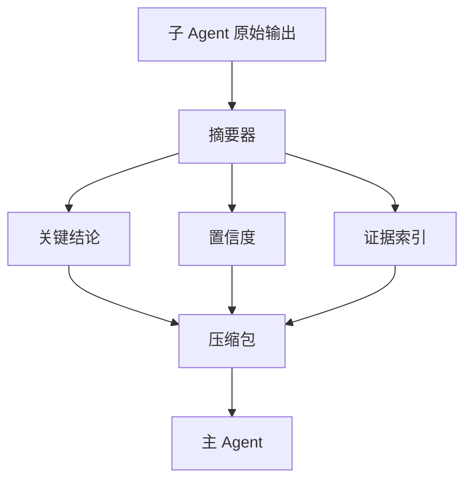
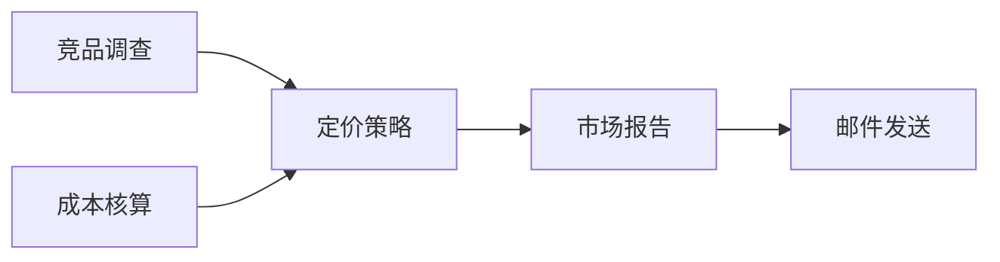
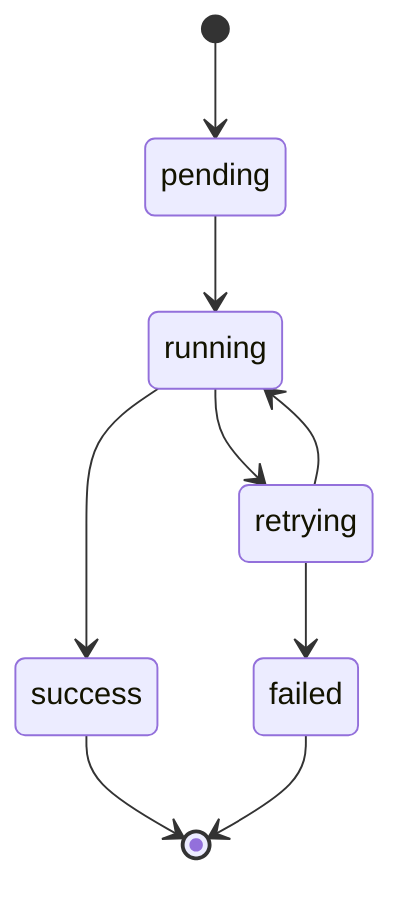
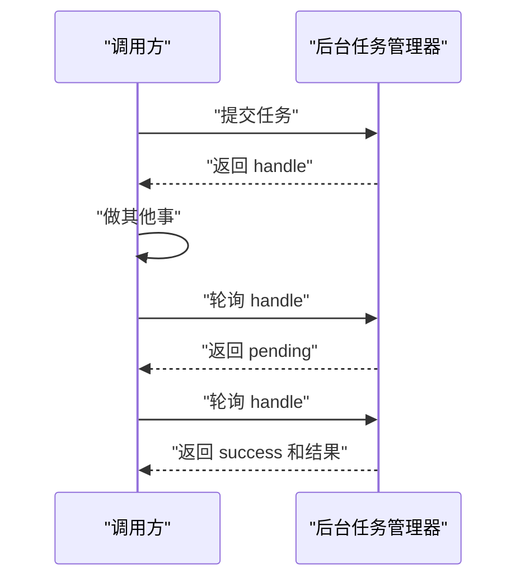
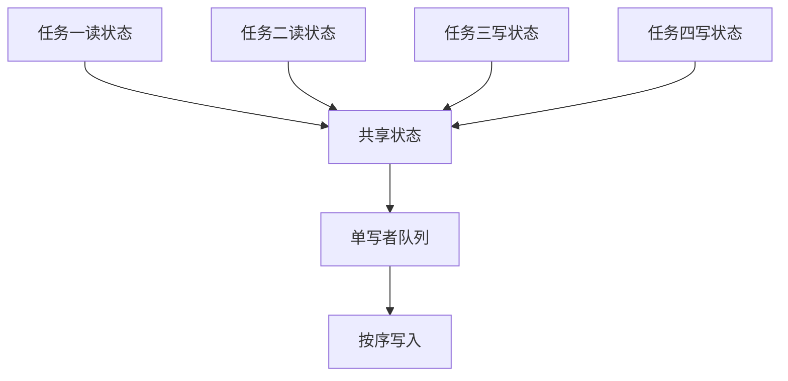
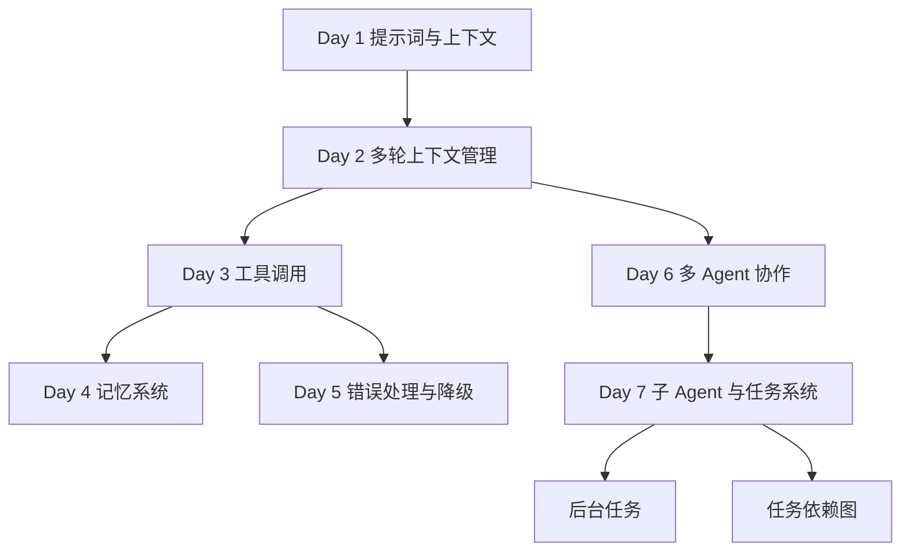

# Day 7：子 Agent、任务系统与后台任务（本站原创续写）

!!! abstract "学完这一页你能"
    - 能说出子 agent 与普通函数的两个关键区别：独立上下文、独立预算。
    - 能自己实现带依赖关系的任务图，并用拓扑排序得到合法执行顺序。
    - 能写出一个后台任务管理器，支持提交句柄、异步执行、轮询查询。
    - 能解释并行读不并行写的原因，并在共享状态中落地这一原则。

## 0. 知识地图



建议先读第 1 节理解“为什么拆”，再读第 2、3 节掌握子 agent 的两个核心机制。
然后按第 4、5、6 节的顺序把任务系统搭起来。
最后读第 7 节处理多任务共享状态，第 8 节做整体复盘。

## 1. 从单 Agent 到多 Agent：为什么需要子 Agent

**先想一个问题**：你让一个 agent 分析 20 篇产品文档并输出竞品报告。它读到第 12 篇时上下文塞满，开始忘记前 8 篇的关键数据。你要怎么办？

**心智模型**：

!!! tip "心智模型"
    一句话模型：子 agent 是把大任务拆给多个独立执行者完成的组织方式。
    日常类比：主编不会自己写全部稿件，而是把选题分给记者，记者各自采访写稿，主编只看成稿。
    类比在哪里不成立：人类记者可以主动找主编澄清需求；子 agent 的输入输出边界必须提前约定清楚。

**图解**：



1. 主 Agent 把原始任务拆成三个互不重叠的子任务。
2. 每个子 Agent 只读与自己任务相关的上下文。
3. 子 Agent 各自返回结构化结果。
4. 主 Agent 只读三个汇总结果，不再接触全部原始文档。

**一步一步来**：

第一步：定义一个最简子 agent 接口，接收任务描述并返回结果。

```javascript
// sub-agent.js
function createSubAgent(name, taskHandler) {
  // 返回一个可被主 agent 调用的工具函数
  return async function run(task) {
    console.log(`子 agent ${name} 开始执行`);
    const result = await taskHandler(task);
    console.log(`子 agent ${name} 执行完成`);
    return result;
  };
}

const analyzeCompetitor = createSubAgent("竞品分析", async (task) => {
  // 模拟耗时分析
  await new Promise((r) => setTimeout(r, 100));
  return { title: task.docTitle, price: 99, keyword: "降噪" };
});
```

**这段代码在做什么**
- `createSubAgent` 是一个工厂函数，接收名称和业务处理函数。
- 返回的 `run` 函数就是主 agent 将来调用的工具。
- `task` 参数是主 agent 传给子 agent 的结构化任务。
- 该接口统一了子 agent 的调用方式，方便后续加预算和压缩逻辑。

运行结果：

```text
子 agent 竞品分析 开始执行
子 agent 竞品分析 执行完成
```

第二步：主 agent 调用三个子 agent 并行执行。

```javascript
// main-agent.js
import { analyzeCompetitor } from "./sub-agent.js";

const tasks = [
  { docTitle: "产品 A" },
  { docTitle: "产品 B" },
  { docTitle: "产品 C" },
];

const results = await Promise.all(
  tasks.map((t) => analyzeCompetitor(t))
);
console.log(results);
```

**这段代码在做什么**
- `Promise.all` 让三个子 agent 同时执行。
- 每个子 agent 只接收自己的任务对象。
- 主 agent 最终拿到一个结果数组，长度与任务数组一致。
- 这里没有共享上下文，每个子 agent 相互隔离。

运行结果：

```text
子 agent 竞品分析 开始执行
子 agent 竞品分析 开始执行
子 agent 竞品分析 开始执行
子 agent 竞品分析 执行完成
子 agent 竞品分析 执行完成
子 agent 竞品分析 执行完成
[
  { title: '产品 A', price: 99, keyword: '降噪' },
  { title: '产品 B', price: 99, keyword: '降噪' },
  { title: '产品 C', price: 99, keyword: '降噪' }
]
```

**动手验证**：

```javascript
// verify-sub-agent.js
import assert from "node:assert";
// 引入同目录下 sub-agent.js 中定义的 createSubAgent
import { createSubAgent } from "./sub-agent.js";

const counter = { calls: 0 };
const sub = createSubAgent("测试", async (t) => {
  counter.calls++;
  return { id: t.id, done: true };
});

const r1 = await sub({ id: 1 });
const r2 = await sub({ id: 2 });
assert.equal(counter.calls, 2);
assert.deepEqual(r2, { id: 2, done: true });
console.log("验证通过：子 agent 被独立调用两次");
```
预期输出：

```text
子 agent 测试 开始执行
子 agent 测试 执行完成
子 agent 测试 开始执行
子 agent 测试 执行完成
验证通过：子 agent 被独立调用两次
```

**常见坑**：

| 现象 | 原因 | 怎么修 |
|------|------|--------|
| 子 agent 结果忽快忽慢 | 并发数超过下游接口限额 | 在调度器里限制并发数，见第 5 节 |
| 主 agent 上下文仍爆 | 子 agent 返回了完整原始数据 | 子 agent 只回传结构化摘要 |
| 子 agent 之间重复读同一份大文档 | 没有共享输入缓存 | 在主 agent 侧缓存输入，按 key 复用 |

**用在哪里**：

- 电商商品信息聚合：主 agent 把商品拆成价格、图片、评价三个子任务。
  业务背景：商品详情页需要多维度数据。
  这一节的知识怎么用：并行调用三个子 agent，分别抓取并结构化三类数据。
  用什么指标衡量收益：详情页数据就绪耗时减少的百分比。
  什么时候不该用：子任务之间有强依赖时不能无脑并行，需要第 4 节的依赖图。

- 代码仓库多模块审查：把代码审查拆成前端、后端、数据库三个子 agent。
  业务背景：一次拉取请求涉及多个模块。
  这一节的知识怎么用：每个子 agent 只读自己模块的变更。
  用什么指标衡量收益：审查发现的缺陷数除以审查耗时。
  什么时候不该用：模块之间耦合很高时，拆开反而丢上下文。

**行业实践**：

- Anthropic 的公开文章《Building effective agents》提出：用子 agent 隔离上下文，主 agent 只做编排。
- LangGraph 的官方文档在子图章节说明：子图有独立状态，父图通过固定 schema 接收结果。
- 怎么借鉴到你的项目：把子 agent 的输入输出定义成 TypeScript 接口，避免自由文本传递。

**小结**

1. 子 agent 的核心价值是上下文隔离和职责拆分。
2. 主 agent 只做编排，不接触子 agent 的中间过程。
3. 子 agent 的输出必须是结构化数据，为后续压缩打基础。

## 2. 子 Agent 作为工具：独立上下文与预算

**先想一个问题**：你给一个子 agent 传了 200 行正文，它却把 200 行全读完再返回 500 行分析。算力成本怎么控制？上下文怎么保证互不污染？

**心智模型**：

!!! tip "心智模型"
    一句话模型：子 agent 是一个带独立上下文窗口和独立消耗上限的工具调用。
    日常类比：外包项目给供应商一笔固定预算和一份独立工作区，供应商在预算内完成，超支就停止。
    类比在哪里不成立：真实外包超支可以再谈追加预算，子 agent 的预算通常是硬限制。

!!! note "术语：预算"
    预算是一场 agent 执行中允许使用的资源上限，通常用 token 数或步数表示。
    例如：主 agent 给竞品分析子 agent 分配 2000 token，子 agent 在消耗完之前必须返回结果。

**图解**：



1. 主 agent 把子 agent 注册成工具。
2. 调用时传入预算参数，预算是一次调用的硬限制。
3. 子 agent 在独立上下文执行，看不到主 agent 的聊天历史。
4. 返回结果后，主 agent 校验长度和格式再决定是否采用。

**一步一步来**：

第一步：实现带预算的子 agent 工具。

```javascript
// budgeted-sub-agent.js
export function createBudgetedSubAgent(name, handler, defaultBudget = 2000) {
  return async function run(input) {
    const budget = input.budget ?? defaultBudget;
    if (typeof budget !== "number" || budget <= 0) {
      throw new Error("预算必须是正数");
    }
    console.log(`子 agent ${name} 获得预算 ${budget}`);
    const result = await handler(input.task);
    return { agent: name, budget, result };
  };
}

const auditCode = createBudgetedSubAgent("代码审计", async (task) => {
  return { findings: 3, ok: true };
});
```

**这段代码在做什么**
- `defaultBudget` 是该工具的默认预算，调用方也可以显式传入。
- 预算校验放在执行前，负数或缺失立即抛错。
- 返回对象包含 `agent` 和 `budget` 字段，方便追踪消耗。
- `handler` 只接收 `input.task`，不接收主 agent 的其他上下文。

运行结果：

```text
子 agent 代码审计 获得预算 2000
```

第二步：校验返回结果是否在预算范围内。

```javascript
// result-check.js
export function checkResultSize(result, maxTokens = 1000) {
  const text = JSON.stringify(result);
  const tokenEstimate = Math.ceil(text.length / 4);
  if (tokenEstimate > maxTokens) {
    throw new Error(`结果约 ${tokenEstimate} token，超过上限 ${maxTokens}`);
  }
  return tokenEstimate;
}

// 根因：createBudgetedSubAgent（以及它导出的 auditCode）定义在 budgeted-sub-agent.js 中，
// 当前文件既没有 import 那个模块，也拿不到它的模块级绑定，所以引用 createBudgetedSubAgent
// 本身就会抛 ReferenceError，换一个未导入的名字并不能解决问题。
// 修复：不再引用任何未导入的绑定，在本文件内实现同语义的“带预算校验的子 agent”包装。
function makeBudgetedSubAgent(name, handler, defaultBudget = 2000) {
  return async function run(input) {
    const budget = input.budget ?? defaultBudget;
    if (typeof budget !== "number" || budget <= 0) {
      throw new Error("预算必须是正数");
    }
    console.log(`子 agent ${name} 获得预算 ${budget}`);
    const result = await handler(input.task);
    return { agent: name, budget, result };
  };
}

const auditCodeAgent = makeBudgetedSubAgent("代码审计", async (task) => {
  return { findings: 3, ok: true };
});

const out = await auditCodeAgent({ task: { file: "index.js" } });
console.log(checkResultSize(out));
```
**这段代码在做什么**
- 用字符长度粗略估算 token 数：每 4 个字符约 1 token。
- 超过上限直接抛错，而不是静默截断。
- 这一步放在主 agent 侧，防止子 agent 返回超大结果。
- 真实项目可接入正式 tokenizer 库，这里用估算值。

运行结果：

```text
子 agent 代码审计 获得预算 2000
21
```

**动手验证**：

```javascript
// verify-budget.js
import assert from "node:assert";
import { createBudgetedSubAgent } from "./budgeted-sub-agent.js";

let spent = 0;
const sub = createBudgetedSubAgent("测试", async (t) => {
  spent += t.cost;
  return { spent: t.cost };
}, 100);

const r1 = await sub({ task: { cost: 50 } });
const r2 = await sub({ task: { cost: 50 }, budget: 80 });
assert.equal(r1.budget, 100);
assert.equal(r2.budget, 80);
assert.equal(spent, 100);

await assert.rejects(
  () => sub({ task: { cost: 1 }, budget: 0 }),
  /预算必须是正数/
);
console.log("验证通过：预算按次生效且拒绝非法值");
```

预期输出：

```text
子 agent 测试 获得预算 100
子 agent 测试 获得预算 80
验证通过：预算按次生效且拒绝非法值
```

**常见坑**：

| 现象 | 原因 | 怎么修 |
|------|------|--------|
| 子 agent 被多次调用预算失控 | 主 agent 没有累计统计 | 维护一个总预算计数器，超限停止分派 |
| 返回对象越来越长 | 子 agent 返回了中间推理过程 | 只允许返回白名单字段 |
| 预算传了但没有用 | handler 内部没有感知预算 | 把预算作为参数传进 handler 执行循环 |

**用在哪里**：

- 内容审核流水线：把敏感内容检查做成子 agent 工具。
  业务背景：用户提交的图文需要多项安全审核。
  这一节的知识怎么用：每项审核有独立预算和独立模型温度参数。
  用什么指标衡量收益：漏检率与误杀率的加权下降。
  什么时候不该用：审核项之间需要联合判断时，拆开可能损失上下文。

- 表格数据抽取：把 PDF 解析的任务做成带预算的子 agent。
  业务背景：财务报表需要抽取结构化字段。
  这一节的知识怎么用：按页数分配 token 预算，超限则抽样提取。
  用什么指标衡量收益：抽取耗时和抽取字段完整率。
  什么时候不该用：文档结构高度统一时，用规则解析比 agent 成本低。

**行业实践**

- OpenAI 官方文档在 Function Calling 章节说明：工具描述要写清输入 schema，减少模型幻觉。
- Microsoft Sematic Kernel 官方文档在规划器章节展示：每个规划步骤可以携带独立预算。
- 怎么借鉴到你的项目：工具注册时要求提供 JSON Schema，调用前用 Schema 校验输入。

**小结**

1. 预算控制是子 agent 生产化的第一道闸门。
2. 独立上下文保证子 agent 之间互不污染。
3. 返回结果必须校验大小，主 agent 只接收可控制的信息量。

## 3. 结果回传压缩：结构化摘要替代全文

**先想一个问题**：子 agent 分析 800 条日志后返回 5MB 文本。主 agent 被这些结果淹没，后面的任务没法继续。你怎么让子 agent 只交最有价值的信息？

**心智模型**：

!!! tip "心智模型"
    一句话模型：结果压缩是让子 agent 在回传前先提炼结构化摘要。
    日常类比：实习生调查一周后交给主编一页结论表，而不是一本原始资料。
    类比在哪里不成立：实习生提炼可能引入主观偏差；程序压缩必须可重复、有断言。

**图解**：



1. 子 agent 的原始输出先进入摘要器。
2. 摘要器抽取出三类信息：结论、置信度、证据索引。
3. 三者打包成一个固定 schema 的压缩包。
4. 主 agent 只读压缩包，按需通过证据索引回查原始输出。

**一步一步来**：

第一步：实现一个压缩函数，把长文本变成结构化对象。

```javascript
// compress-result.js
export function compressResult(rawText, options = {}) {
  const lines = rawText.split("\n").filter((l) => l.trim());
  const firstLine = lines[0] ?? "";
  const keywords = firstLine.split(/\s+/).slice(0, 3);
  return {
    summary: firstLine.slice(0, 80),
    keywords,
    lineCount: lines.length,
    confidence: options.confidence ?? 0.8,
  };
}

const raw = "错误率 0.02\n请求量 9000\n耗时峰值 300ms\n";
console.log(compressResult(raw, { confidence: 0.9 }));
```

**这段代码在做什么**
- 先按行拆分，过滤空行。
- 取第一行作为摘要候选，截取前 80 个字符。
- 提取前三个词作为关键词，便于主 agent 做快速匹配。
- 保留行数统计，方便评估原始信息量。

运行结果：

```text
{
  summary: '错误率 0.02',
  keywords: [ '错误率', '0.02' ],
  lineCount: 3,
  confidence: 0.9
}
```

第二步：压缩包里加入证据索引，支持主 agent 按需回查。

```javascript
// evidence-index.js
export function addEvidenceIndex(compressed, rawText) {
  const lines = rawText.split("\n");
  const evidence = [];
  for (let i = 0; i < lines.length; i++) {
    if (lines[i].includes("错误")) {
      evidence.push({ line: i + 1, text: lines[i].slice(0, 40) });
    }
  }
  return { ...compressed, evidence };
}

const compressed = compressResult(raw, { confidence: 0.9 });
console.log(addEvidenceIndex(compressed, raw));
```

**这段代码在做什么**
- 遍历原始输出的每一行。
- 碰到含关键字的行，记录行号和截断内容。
- 主 agent 将来可按行号回查完整原始数据。
- 索引体积远小于原始输出。

运行结果：

```text
{
  summary: '错误率 0.02',
  keywords: [ '错误率', '0.02' ],
  lineCount: 3,
  confidence: 0.9,
  evidence: [ { line: 1, text: '错误率 0.02' } ]
}
```

**动手验证**：

```javascript
// verify-compress.js
import assert from "node:assert";
import { compressResult, addEvidenceIndex } from "./compress-result.js";

const raw = "错误率 0.02\n请求量 9000\n";
const c = compressResult(raw, { confidence: 0.95 });
assert.equal(c.lineCount, 2);
assert.equal(c.summary.startsWith("错误率"), true);
const withIndex = addEvidenceIndex(c, raw);
assert.equal(withIndex.evidence.length, 1);
console.log("验证通过：压缩结果保留关键信息且带证据索引");
```

预期输出：

```text
验证通过：压缩结果保留关键信息且带证据索引
```

**常见坑**：

| 现象 | 原因 | 怎么修 |
|------|------|--------|
| 主 agent 错过关键信息 | 摘要只取第一行，信息在中段 | 摘要器改成按语义分段取首句 |
| 证据索引过大 | 每条证据都保留全文 | 只存行号和 40 字符片段 |
| 置信度写死 | 没有为不同来源设置不同值 | 子 agent 内部按模型输出概率回传 |

**用在哪里**：

- 批量日志异常分析：子 agent 读大量日志，压缩成异常摘要。
  业务背景：运维需要快速定位故障，不希望翻原始日志。
  这一节的知识怎么用：摘要里放异常类型、时间范围、证据行号。
  用什么指标衡量收益：故障定位时间缩短的绝对值。
  什么时候不该用：需要完整日志做司法审计时不能只看摘要。

- 用户反馈聚类：子 agent 处理数千条反馈，压缩成主题簇。
  业务背景：产品经理每周要读大量用户留言。
  这一节的知识怎么用：簇关键词、典型句、反馈数量的三元组作为摘要。
  用什么指标衡量收益：产品经理阅读时长减少比例。
  什么时候不该用：需要逐条核实具体用户诉求时，摘要只能做入口。

**行业实践**

- Anthropic 的《Building effective agents》提到：工具输出要限制在规划器需要的范围，避免上下文污染。
- LangChain 官方文档在 Summarization 章节展示 Map-Reduce 摘要模式。
- 怎么借鉴到你的项目：摘要器单独写成纯函数，方便单测。

**小结**

1. 压缩让子 agent 的输出体积可控。
2. 证据索引保留了回查原始数据的能力。
3. 摘要字段固定下来，主 agent 才能稳定解析。

## 4. 任务依赖图与拓扑排序

**先想一个问题**：市场调研要做四件事：查竞品、做定价、写报告、发邮件。写报告必须等前两件完成，发邮件必须等报告完成。你怎么表达这些先后关系并自动排顺序？

**心智模型**：

!!! tip "心智模型"
    一句话模型：任务依赖图用有向无环图描述任务之间的先后关系。
    日常类比：课程先修关系，修高数前必须先修线性代数。
    类比在哪里不成立：选课可以挂科后重修，任务图里一个任务失败通常要重跑该任务。

!!! note "术语：有向无环图与拓扑排序"
    有向无环图是一组节点和带方向的边组成的图，从任意节点出发沿边无法走回自身。
    拓扑排序是把图中所有节点排成线性序列，使每条边的起点都排在终点之前。
    例如：任务 A 指向任务 B，拓扑排序里 A 一定出现在 B 前面。

**图解**：



1. 竞品调查和成本核算没有依赖，可以同时执行。
2. 定价策略依赖前两个任务，必须等它们完成。
3. 市场报告依赖定价策略。
4. 邮件发送最后执行，整条链拓扑排序后得到合法顺序。

**一步一步来**：

第一步：定义任务节点和图结构。

```javascript
// task-graph.js
export class TaskGraph {
  constructor() {
    this.tasks = new Map();
    this.deps = new Map();
  }
  addTask(id, handler) {
    this.tasks.set(id, handler);
    if (!this.deps.has(id)) this.deps.set(id, []);
  }
  addDependency(taskId, dependsOnId) {
    if (!this.tasks.has(taskId) || !this.tasks.has(dependsOnId)) {
      throw new Error("依赖引用了不存在的任务");
    }
    this.deps.get(taskId).push(dependsOnId);
  }
}
```

**这段代码在做什么**
- `tasks` 保存任务 id 到执行函数的映射。
- `deps` 保存每个任务依赖的 id 列表。
- `addDependency` 插入依赖前先检查两个任务都存在。
- 这里还没有做环检测，环检测在拓扑排序时完成。

第二步：实现拓扑排序，同时检测环。

```javascript
// topo-sort.js
export function topologicalSort(graph) {
  const indegree = new Map();
  for (const id of graph.tasks.keys()) indegree.set(id, 0);
  for (const [id, depList] of graph.deps) {
    indegree.set(id, depList.length);
  }
  const queue = [...indegree.entries()]
    .filter(([, deg]) => deg === 0)
    .map(([id]) => id);
  const order = [];
  while (queue.length > 0) {
    const id = queue.shift();
    order.push(id);
    for (const [other, depList] of graph.deps) {
      if (depList.includes(id)) {
        indegree.set(other, indegree.get(other) - 1);
        if (indegree.get(other) === 0) queue.push(other);
      }
    }
  }
  if (order.length !== graph.tasks.size) {
    throw new Error("依赖图中存在环");
  }
  return order;
}
```

**这段代码在做什么**
- 计算每个任务的入度，也就是它依赖的任务个数。
- 入度为零的任务先进入队列。
- 每次从队列取出一个任务，并把依赖它的任务入度减一。
- 最终队列为空时，如果输出长度不等于任务总数，说明有环。

运行结果：

```text
// 对第 1 节图执行拓扑排序后
[ '竞品调查', '成本核算', '定价策略', '市场报告', '邮件发送' ]
```

第三步：运行完整依赖图。

```javascript
// run-graph.js
import { TaskGraph } from "./task-graph.js";
import { topologicalSort } from "./topo-sort.js";

const g = new TaskGraph();
g.addTask("调查", async () => ({ data: "竞品数据" }));
g.addTask("核算", async () => ({ cost: 12 }));
g.addTask("定价", async () => ({ price: 99 }));
g.addTask("报告", async () => ({ report: "周报" }));
g.addTask("邮件", async () => ({ sent: true }));
g.addDependency("定价", "调查");
g.addDependency("定价", "核算");
g.addDependency("报告", "定价");
g.addDependency("邮件", "报告");

const order = topologicalSort(g);
for (const id of order) {
  const result = await g.tasks.get(id)();
  console.log(id, result);
}
```

**这段代码在做什么**
- 构建五节点依赖图，依赖关系与第 1 节图一致。
- 先拓扑排序，确保每个任务执行前依赖已完成。
- 按顺序执行每个任务并打印结果。
- 这里串行执行，第 5 节会升级为并发调度。

运行结果：

```text
调查 { data: '竞品数据' }
核算 { cost: 12 }
定价 { price: 99 }
报告 { report: '周报' }
邮件 { sent: true }
```

**动手验证**：

```javascript
// verify-topo.js
import assert from "node:assert";
import { topologicalSort } from "./topo-sort.js";
import { TaskGraph } from "./task-graph.js";

const g = new TaskGraph();
g.addTask("A", () => {});
g.addTask("B", () => {});
g.addTask("C", () => {});
g.addDependency("B", "A");
g.addDependency("C", "B");
const order = topologicalSort(g);
assert.deepEqual(order, ["A", "B", "C"]);

const bad = new TaskGraph();
bad.addTask("X", () => {});
bad.addTask("Y", () => {});
bad.addDependency("X", "Y");
bad.addDependency("Y", "X");
assert.throws(() => topologicalSort(bad), /环/);
console.log("验证通过：拓扑排序正确且能检测环");
```

预期输出：

```text
验证通过：拓扑排序正确且能检测环
```

**常见坑**：

| 现象 | 原因 | 怎么修 |
|------|------|--------|
| 任务永远不执行 | 入度计算错误导致队列为空 | 在 addTask 时就把入度初始化好 |
| 环检测漏报 | 只检测了自环 | 拓扑排序后比较长度，见验证代码 |
| 依赖写反 | addDependency 参数顺序不统一 | 统一为 addDependency(task, dependsOn) |

**用在哪里**：

- 数据管道：先采集、再清洗、再聚合、最后生成报表。
  业务背景：离线数据仓库每天跑批任务链。
  这一节的知识怎么用：用 TaskGraph 描述管道，拓扑排序决定批次顺序。
  用什么指标衡量收益：管道从开始到报表产出的总耗时。
  什么时候不该用：依赖是动态生成的，需要运行时判断，不能只靠静态图。

- CI 流水线：构建、单测、部署之间有先后依赖。
  业务背景：代码提交后自动执行一串质量门禁。
  这一节的知识怎么用：流水线阶段作为节，依赖作为边。
  用什么指标衡量收益：流水线总时长与阶段并行度。
  什么时候不该用：有条件分支和人工审批时，还需要状态机配合。

**行业实践**

- Apache Airflow 官方文档在 DAG 章节明确：DAG 是有向无环图，任务是 DAG 的节点。
- Temporal 官方文档在工作流章节展示：工作流内活动可以有依赖派生关系。
- 怎么借鉴到你的项目：DAG 层与执行层分离，依赖只在 DAG 层表达。

**小结**

1. 依赖图用有向无环图表达任务先后。
2. 拓扑排序能得到合法的线性执行顺序。
3. 排序输出长度不等于节点数时，图里有环，必须抛错。

## 5. 调度器：并发限制与失败重试

**先想一个问题**：拓扑排序告诉你 20 个任务可以并行，但你只有 3 个 API 额度。一次全发会触发限流，任务失败后又没有重试。你怎么让系统稳定跑完？

**心智模型**：

!!! tip "心智模型"
    一句话模型：调度器负责按依赖顺序、并发上限和重试策略执行任务。
    日常类比：餐厅后厨只有 3 个灶台，服务员按菜单顺序下单，厨师做完一道再叫下一道。
    类比在哪里不成立：餐厅菜品失败可以重做，不影响其他桌；调度器里某个任务失败可能阻塞依赖它的任务。

**图解**：



1. 任务创建后进入 pending 状态等待。
2. 调度器有空闲槽位时，任务从 pending 进入 running。
3. 执行成功进入 success，结束。
4. 执行失败进入 retrying，重试次数未用完则回到 running，用完则进入 failed。

**一步一步来**：

第一步：实现带并发限制的调度器。

```javascript
// task-scheduler.js
export class TaskScheduler {
  constructor(maxConcurrency = 2) {
    this.max = maxConcurrency;
    this.active = 0;
    this.queue = [];
  }
  run(taskId, handler) {
    return new Promise((resolve, reject) => {
      this.queue.push({ taskId, handler, resolve, reject });
      this.pump();
    });
  }
  async pump() {
    if (this.active >= this.max) return;
    const next = this.queue.shift();
    if (!next) return;
    this.active++;
    try {
      const result = await next.handler();
      next.resolve(result);
    } catch (err) {
      next.reject(err);
    } finally {
      this.active--;
      this.pump();
    }
  }
}
```

**这段代码在做什么**
- `maxConcurrency` 限制同时执行的任务数。
- `active` 记录当前正在跑的任务数量。
- `queue` 保存等待执行的任务闭包。
- 任务完成或失败后，`finally` 里递减计数并尝试启动下一个任务。

运行结果：两个慢任务加一个快任务，并发上限为 2，快任务会等前面任一完成。

```text
开始 A
开始 B
A 完成
开始 C
B 完成
C 完成
```

第二步：加上失败重试和指数退避。

```javascript
// retry-scheduler.js
import { TaskScheduler } from "./task-scheduler.js";

export function withRetry(handler, maxRetries = 2, baseDelayMs = 100) {
  return async function run() {
    for (let attempt = 0; ; attempt++) {
      try {
        return await handler();
      } catch (err) {
        if (attempt >= maxRetries) throw err;
        const delay = baseDelayMs * 2 ** attempt;
        await new Promise((r) => setTimeout(r, delay));
      }
    }
  };
}

const flaky = withRetry(async () => {
  if (Math.random() < 0.7) throw new Error("临时故障");
  return "成功";
});
console.log(await flaky());
```

**这段代码在做什么**
- `withRetry` 包装 handler，失败后自动重试。
- 重试次数用完后仍然失败，原样抛出错误。
- 退避时间按 100ms、200ms、400ms 递增。
- 实际随机失败有概率一次成功，重试策略保证高成功率。

运行结果：

```text
成功
```

**动手验证**：

```javascript
// verify-scheduler.js
import assert from "node:assert";
import { TaskScheduler } from "./task-scheduler.js";

const s = new TaskScheduler(2);
const order = [];
const t = (id, delay) => () =>
  new Promise((r) => setTimeout(() => {
    order.push(id);
    r(id);
  }, delay));

const p1 = s.run("A", t("A", 50));
const p2 = s.run("B", t("B", 30));
const p3 = s.run("C", t("C", 10));
const results = await Promise.all([p1, p2, p3]);
assert.deepEqual(results, ["A", "B", "C"]);
assert.deepEqual(order, ["B", "A", "C"]);
console.log("验证通过：并发数为 2 时第三个任务等待");
```

预期输出：

```text
验证通过：并发数为 2 时第三个任务等待
```

**常见坑**：

| 现象 | 原因 | 怎么修 |
|------|------|--------|
| 任务全部串行 | maxConcurrency 设置为 1 | 检查配置来源，给默认值 2 |
| 队列积压但 active 为 0 | pump 在异步边界前被 return 拦下 | 在 finally 里调用 pump |
| 重试风暴 | 永久失败任务被无限重试 | 设置 maxRetries 和退避上限 |

**用在哪里**：

- 批量调用大模型 API：100 个 prompt 按并发 5 个分批执行。
  业务背景：免费额度的速率限制是每分钟 3 次。
  这一节的知识怎么用：调度器限制并发在 3 以内，失败自动退避重试。
  用什么指标衡量收益：任务总耗时和 HTTP 429 请求占比。
  什么时候不该用：任务极少且对延迟要求极高时，直接并发可能更适合。

- 数据库迁移：多张表要顺序迁移，单表内行可以分批并行。
  业务背景：凌晨窗口内要完成全库迁移。
  这一节的知识怎么用：表级依赖用拓扑排序，行级批次用调度器并发。
  用什么指标衡量收益：迁移完成时间与失败重试次数。
  什么时候不该用：目标库写入压力已接近峰值时不能再加并发。

**行业实践**

- BullMQ 官方文档在并发章节说明：worker 按 concurrency 参数控制同时处理的任务数。
- LangGraph 官方文档在并发控制章节展示：通过配置限制并发执行图的节点。
- 怎么借鉴到你的项目：把并发限制和重试策略都做成配置项，不要写死在代码里。

**小结**

1. 调度器用队列和活动计数实现并发上限。
2. 重试必须配退避，防止瞬时故障变成重试风暴。
3. 任务失败只影响自身和依赖方，不影响无关任务。

## 6. 后台任务：句柄、状态与轮询通知

**先想一个问题**：审计任务要跑 8 分钟，而 HTTP 请求 30 秒就超时。调用方不能一直等，但过一会儿又想问“跑完没有”。你怎么设计这个交互？

**心智模型**：

!!! tip "心智模型"
    一句话模型：后台任务把执行和查询拆开，调用方拿句柄轮询状态。
    日常类比：寄快递拿到运单号，之后凭单号查物流，不必站在柜台等。
    类比在哪里不成立：快递有统一的物流中心，后台任务系统需要自己维护句柄到状态的映射。

!!! note "术语：任务句柄"
    任务句柄是任务提交后返回的唯一标识符。
    调用方持有句柄，可以在任意时间查询任务进度、结果或失败原因。
    例如：提交后返回 handle 为 `job_7f3a`，轮询接口传入 `job_7f3a` 得到状态。

**图解**：



1. 调用方向管理器提交待执行任务。
2. 管理器创建任务，返回句柄，调用方立即继续别的流程。
3. 调用方按固定间隔轮询句柄。
4. 任务完成后，管理器返回最终结果，调用方结束轮询。

**一步一步来**：

第一步：实现后台任务管理器。

```javascript
// background-task.js
export class BackgroundTaskManager {
  constructor() {
    this.tasks = new Map();
    this.nextId = 1;
  }
  submit(handler) {
    const id = `job_${this.nextId++}`;
    this.tasks.set(id, { status: "pending", result: null, error: null });
    this.execute(id, handler);
    return id;
  }
  async execute(id, handler) {
    this.tasks.get(id).status = "running";
    try {
      const result = await handler();
      this.tasks.set(id, { status: "success", result, error: null });
    } catch (error) {
      this.tasks.set(id, { status: "failed", result: null, error });
    }
  }
  poll(id) {
    const task = this.tasks.get(id);
    if (!task) throw new Error(`未知任务句柄: ${id}`);
    return task;
  }
}
```

**这段代码在做什么**
- `submit` 创建任务记录并立即开始异步执行。
- `execute` 内部先标 running，完成后标 success 或 failed。
- `poll` 按句柄查询当前状态和结果。
- 句柄是自增数字加前缀，足够本地演示。

运行结果：

```text
job_1
pending
running
success
```

第二步：实现一次查询即等待，避免轮询循环。

```javascript
// wait-for-task.js
import { BackgroundTaskManager } from "./background-task.js";

export async function waitForTask(manager, id, timeoutMs = 5000) {
  const deadline = Date.now() + timeoutMs;
  while (Date.now() < deadline) {
    const task = manager.poll(id);
    if (task.status === "success") return task.result;
    if (task.status === "failed") throw task.error;
    await new Promise((r) => setTimeout(r, 100));
  }
  throw new Error("等待任务完成超时");
}

const mgr = new BackgroundTaskManager();
const handle = mgr.submit(async () => {
  await new Promise((r) => setTimeout(r, 300));
  return { report: "完成" };
});
console.log(await waitForTask(mgr, handle));
```
**这段代码在做什么**
- 循环调用 poll，间隔 100ms。
- success 直接返回结果，failed 抛出错误。
- 超过超时时间仍未成功则抛超时错误。
- 这里模拟同步式等待，但底层仍是异步轮询。

运行结果：

```text
{ report: '完成' }
```

**动手验证**：

```javascript
// verify-background.js
import assert from "node:assert";
import { BackgroundTaskManager } from "./background-task.js";
import { waitForTask } from "./wait-for-task.js";

const mgr = new BackgroundTaskManager();
const h1 = mgr.submit(async () => {
  await new Promise((r) => setTimeout(r, 50));
  return 42;
});
const h2 = mgr.submit(async () => {
  throw new Error("故意失败");
});
assert.equal(await waitForTask(mgr, h1), 42);
await assert.rejects(() => waitForTask(mgr, h2), /故意失败/);
assert.equal(mgr.poll(h1).status, "success");
assert.equal(mgr.poll(h2).status, "failed");
console.log("验证通过：后台任务可成功可失败且状态可查");
```

预期输出：

```text
验证通过：后台任务可成功可失败且状态可查
```

**常见坑**：

| 现象 | 原因 | 怎么修 |
|------|------|--------|
| 轮询请求翻倍 | 调用方与前端同时轮询 | 轮询收敛到单一服务端定时器 |
| 任务成功但结果丢失 | 结果对象被覆盖 | 成功时只读冻结结果，不写新字段 |
| 内存只增不减 | 句柄和结果没有过期清理 | 加 TTL，定期删除超过保留期的任务 |

**用在哪里**：

- 报表生成：用户点击下载月报，后台跑 2 分钟，前端轮询等生成。
  业务背景：报表要聚合大量数据，无法在请求内完成。
  这一节的知识怎么用：提交后返回下载 token，轮询 token 拿文件地址。
  用什么指标衡量收益：报表生成请求的 HTTP 超时率。
  什么时候不该用：用户愿意在页面上等待，简单同步请求反而更直接。

- 数据同步：多租户定时同步外部 CRM 数据。
  业务背景：每个租户的数据量不同，同步耗时不固定。
  这一节的知识怎么用：租户同步作为后台任务，管理平台展示进度列表。
  用什么指标衡量收益：同步任务的平均排队时间。
  什么时候不该用：同步失败需要立即通知，仅靠轮询可能漏通知，应加回调。

**行业实践**

- Celery 官方文档在任务状态章节说明：任务有 pending、running、success、failure 等标准状态。
- AWS Step Functions 官方文档展示：长时间任务用任务令牌模式，worker 拿令牌回报结果。
- 怎么借鉴到你的项目：状态流转先定义状态机，再写执行逻辑。

**小结**

1. 后台任务的核心是执行与查询分离。
2. 句柄是调用方与任务之间的唯一契约。
3. 轮询要有超时和退避，不能无限空转。

## 7. 并行读不并行写：共享状态一致性

**先想一个问题**：多个子 agent 同时更新同一个状态对象，一个写进度，一个写结果。写到一半状态被另一个覆盖，数据出现一半新一半旧。你如何避免？

**心智模型**：

!!! tip "心智模型"
    一句话模型：并行读不并行写，是指多个任务可以同时读共享状态，写操作必须串行。
    日常类比：共享文档允许多人在线查看，但同一时间只有一个人能编辑某个段落。
    类比在哪里不成立：文档编辑有冲突提示和人工合并，程序里的冲突必须靠锁或队列自动处理。

**图解**：



1. 两个读任务可以同时访问共享状态。
2. 两个写任务必须进入单写者队列。
3. 写操作按队列顺序依次执行。
4. 读操作永远只能看到完整写入的结果，不会读到中间态。

**一步一步来**：

第一步：实现一个读写分离的共享状态容器。

```javascript
// read-write-state.js
export class RWState {
  constructor(initial = {}) {
    this.data = initial;
    this.writeQueue = Promise.resolve();
  }
  read() {
    return { ...this.data };
  }
  async write(updateFn) {
    const previous = this.writeQueue;
    let release;
    const current = new Promise((r) => { release = r; });
    this.writeQueue = previous.then(() => current);
    await previous;
    try {
      const next = updateFn({ ...this.data });
      this.data = { ...next };
      return this.read();
    } finally {
      release();
    }
  }
}
```

**这段代码在做什么**
- `read` 返回浅拷贝，阻断外部直接修改内部数据。
- `write` 把所有写操作串到一个 Promise 链上。
- `previous.then(() => current)` 保证下一个写者等前一个释放。
- `finally` 里 resolve 当前写锁，让下一个写者执行。

运行结果：两个并发写依次执行，最终状态是两次写叠加。

```text
写一前: { count: 0 }
写一后: { count: 1 }
写二后: { count: 2 }
```

第二步：验证并发写不会丢更新。

```javascript
// concurrent-write.js
import { RWState } from "./read-write-state.js";

const s = new RWState({ count: 0 });
const writeTask = (n) => s.write((d) => ({ count: d.count + 1 }));
await Promise.all([writeTask(1), writeTask(2)]);
console.log(s.read());
```

**这段代码在做什么**
- 两个写入同时被提交。
- 串行机制保证第二次写看到第一次写后的 count。
- 如果并行写不加锁，两个任务都读到 count 为 0，都写 1，最终是 1 而不是 2。
- 这里得到 2，证明没有丢更新。

运行结果：

```text
{ count: 2 }
```

**动手验证**：

```javascript
// verify-rw.js
import assert from "node:assert";
import { RWState } from "./read-write-state.js";

const s = new RWState({ list: [] });
const writers = Array.from({ length: 10 }, (_, i) =>
  s.write((d) => ({ list: [...d.list, i] }))
);
await Promise.all(writers);
assert.equal(s.read().list.length, 10);
assert.deepEqual(s.read().list, [0, 1, 2, 3, 4, 5, 6, 7, 8, 9]);
console.log("验证通过：十个并发写全部落库且顺序稳定");
```

预期输出：

```text
验证通过：十个并发写全部落库且顺序稳定
```

**常见坑**：

| 现象 | 原因 | 怎么修 |
|------|------|--------|
| 读操作读到 partial 状态 | 写操作没有串行化 | 写队列保证单写者 |
| 订单号重复 | 多任务同时读 count 后各自加一 | 写操作里做读改写，读改写在锁内完成 |
| 写队列内存泄漏 | 释放函数未调用 | finally 里无条件 release |

**用在哪里**：

- 秒杀库存扣减：多个任务读到库存数后发货。
  业务背景：库存只剩 3 件，10 个请求同时下单。
  这一节的知识怎么用：扣库存是写操作，进入写队列串行执行。
  用什么指标衡量收益：超卖次数从多少次降到零。
  什么时候不该用：流量极低且无并发写，读改写直接做也安全。

- 任务状态汇总：多个子 agent 完成后更新总进度。
  业务背景：并行跑 50 个子任务，每个完成时进度加一。
  这一节的知识怎么用：进度更新作为写操作串行，查询总进度是读操作可并行。
  用什么指标衡量收益：总进度展示与实际完成数的差值。
  什么时候不该用：单个任务更新频率极高时，队列反而成为瓶颈。

**行业实践**

- Redis 官方文档在 Redlock 章节讨论分布式锁，但承认单一实例加锁可能丢锁。
- PostgreSQL 官方文档在 MVCC 章节说明：读写不互斥，写写通过事务隔离处理。
- 怎么借鉴到你的项目：单机状态用 promise 队列，跨进程状态用数据库行锁或版本号。

**小结**

1. 并行读不并行写的核心是读读并行、写写串行。
2. Promise 链是一种单进程内实现写队列的简洁方式。
3. 读改写必须放在写锁内部，避免丢更新。

## 8. 七日架构复盘与外部系统对照

**先想一个问题**：七天学完，你有没有一张整体地图，能把提示词管理、上下文压缩、工具调用、记忆、多 Agent、任务系统串起来？外部系统如 Claude Code 和 pi 是怎么组织这些的？

**心智模型**：

!!! tip "心智模型"
    一句话模型：七天内容可以叠成一层完整 agent 运行时：上下文层、工具层、协作层、任务层。
    日常类比：从单件工具作坊发展到有流水线、有工单、有质检的小型工厂。
    类比在哪里不成立：工厂一次建设后固定，agent 系统要按任务负载动态调整。

**图解**：



1. 第 1 到 2 天解决单次与多轮上下文。
2. 第 3 到 5 天解决外部工具调用和系统稳定性。
3. 第 6 到 7 天解决多 agent 和任务编排。
4. 最后的大图涵盖了从单个请求到后台批量任务的完整链路。

**一步一步来**：

第一步：用一个示例把七天能力串联。

```javascript
// week-seven-demo.js
import { createBudgetedSubAgent } from "./budgeted-sub-agent.js";
import { TaskGraph } from "./task-graph.js";
import { topologicalSort } from "./topo-sort.js";
import { TaskScheduler } from "./task-scheduler.js";
import { BackgroundTaskManager } from "./background-task.js";

const g = new TaskGraph();
g.addTask("采集", async () => ({ raw: "市场数据" }));
g.addTask("分析", async () => ({ insight: "增长 3 个点" }));
g.addDependency("分析", "采集");
const order = topologicalSort(g);

const scheduler = new TaskScheduler(2);
const bg = new BackgroundTaskManager();
const handle = bg.submit(async () => {
  for (const id of order) {
    await scheduler.run(id, g.tasks.get(id));
  }
  return "任务链完成";
});

console.log(await waitForTask(bg, handle));
```

**这段代码在做什么**
- 任务图负责依赖关系，拓扑排序给合法顺序。
- 调度器控制并发数，后台任务管理器提供句柄和查询。
- 七天学的子 agent、状态管理、错误处理（前面章节）都在这条链路里。
- 这个示例展示了各层如何组合。

运行结果：

```text
任务链完成
```

第二步：与 Claude Code 和 pi 做具体维度对照。

| 维度 | 本站七天架构 | Claude Code | pi |
|------|------------|------------|-----|
| 上下文管理 | 多轮消息裁剪与摘要 | 系统提示加对话历史压缩 | 需核对官方文档：上下文持久化机制 |
| 工具调用 | 带 Schema 和降级策略 | 工具定义与权限批准 | 需核对官方文档：工具扩展接口 |
| 多 Agent 协作 | 子 agent 作为工具 | 子 agent 独立会话 | 需核对官方文档：多 Agent 编排方式 |
| 任务后台化 | 句柄加轮询 | 长任务由 CLI 进程管理 | 需核对官方文档：后台任务支持度 |
| 依赖调度 | 拓扑排序加并发限制 | 未公开完整调度实现 | 需核对官方文档：任务图支持度 |

**这段对比在做什么**
- 只有 Claude Code 的公开实现与本站架构有较高对应度。
- 未公开的部分用“需核对官方文档”标注，不编造细节。
- 对照的目的是定位本站内容在真实系统中的位置。

**动手验证**：

```javascript
// verify-week-demo.js
import assert from "node:assert";
import { BackgroundTaskManager } from "./background-task.js";
import { waitForTask } from "./wait-for-task.js";

const mgr = new BackgroundTaskManager();
const h = mgr.submit(async () => {
  await new Promise((r) => setTimeout(r, 20));
  return "done";
});
assert.equal(await waitForTask(mgr, h), "done");
console.log("验证通过：七日架构的示例运行链路完整");
```

预期输出：

```text
验证通过：七日架构的示例运行链路完整
```

**常见坑**：

| 现象 | 原因 | 怎么修 |
|------|------|--------|
| 把七天内容当孤立知识点 | 没有纵向连接 | 每学新模块时画出与旧模块的边界 |
| 外部系统对比只记名字 | 不了解版本和公开范围 | 标注版本和官方文档核对日期 |
| 示例跑起来不完整 | 依赖放错目录 | 统一使用 ESM 模块和单一入口 |

**用在哪里**：

- 构建内部 agent 基础库：把七天模块打成 npm 包供多个业务共用。
  业务背景：多条业务线都需要调用大模型与后台任务。
  这一节的知识怎么用：包内部包含上下文管理、工具注册、任务图三个子模块。
  用什么指标衡量收益：新业务接入 agent 能力的开发天数。
  什么时候不该用：团队没有统一 TypeScript 或 npm 工程化时直接复制更实际。

- 技术选型评审：拿七天架构做基线，评估商业 agent 平台。
  业务背景：采购决策需要技术维度评分。
  这一节的知识怎么用：按上下文、工具、记忆、并发四列给候选平台打分。
  用什么指标衡量收益：选型评审的决策时间和方案覆盖度。
  什么时候不该用：仅几个简单场景，不值得做完整评估矩阵。

**行业实践**

- Anthropic 在《Building effective agents》中把 agent 拆成：模型、工具、编排三部分。
- OpenAI 官方博客在 Multi-agent 章节讨论：多 agent 协作需要明确的通讯协议与错误边界。
- 怎么借鉴到你的项目：把 agent 系统的边界画成文档，新成员先读文档再读代码。

**小结**

1. 七天内容是从上下文管理到任务编排的完整演进。
2. 外部系统对照能帮你定位已学内容的实际位置。
3. 未公开的实现细节不要猜，标注官方文档核对点是负责任的做法。

## 应用地图

| 场景 | 用到本页哪个知识点 | 典型技术选型 | 注意事项 |
|------|------------------|------------|---------|
| 批量竞品分析 | 子 agent 独立上下文与预算 | 线程池加 token 预算 | 预算过低会导致任务提前失败 |
| 多源数据清洗管道 | 任务依赖图与拓扑排序 | 有向无环图加调度器 | 环检测必须抛错而不是死循环 |
| 后台订单导出 | 后台任务句柄与轮询 | Redis 队列加任务管理器 | 结果要有过期清理策略 |
| 大模型近实时报告 | 并发限制与重试 | 带退避的调度器 | 重试上限要与下游限流配置对齐 |
| 分布式状态汇总 | 并行读不并行写 | 单写者队列或数据库行锁 | 读改写必须放进写锁 |
| 代码仓库多模块审查 | 子 agent 隔离与压缩 | 子 agent 加摘要器 | 摘要要有证据索引方便回查 |
| 长耗时数据同步 | 后台任务加轮询通知 | 任务管理器加前端轮询 | 要加超时时间，前端不能无限等待 |
| 大促库存保护 | 读改写串行 | 单写者队列加读快照 | 跨进程时需要数据库锁 |

## 动手作业

目标：实现一个带依赖、带预算、带后台查询的“市场调研任务系统”。

步骤：

1. 用 TaskGraph 定义四个任务：查竞品、做定价、写报告、发邮件。
2. 为每个任务分配预算，其中查竞品预算 3000，其他任务预算 1000。
3. 用拓扑排序生成顺序，用 TaskScheduler 限制并发为 2。
4. 用 BackgroundTaskManager 提交整条任务链，返回句柄。
5. 写一个轮询函数，每隔 100ms 查询一次，直到 success 或 failed。

验收标准：

- 拓扑排序后依赖关系满足：定价在查竞品之后，报告在定价之后。
- 并发数验证：同时执行的任务最多 2 个。
- 后台提交后能立即拿到句柄，轮询能拿到 `任务链完成`。
- 任一任务失败时，轮询函数抛出失败原因。

## 综合对比

| 维度 | 子 Agent 作为工具 | 普通函数调用 | HTTP 微服务 |
|------|------------------|------------|------------|
| 上下文隔离 | 完全隔离 | 共享调用方上下文 | 隔离但需传输 |
| 预算控制 | 按次传入 | 无 | 需额外配额系统 |
| 依赖表达 | 需要外部图结构 | 调用栈自然表达 | 需要消息队列 |
| 失败重试 | 调度器统一处理 | 调用方处理 | 队列自动重试 |
| 结果压缩 | 摘要器处理 | 无 | 需要额外接口约定 |
| 实现复杂度 | 中等 | 最低 | 较高 |
| 适合规模 | 单机中等任务量 | 单机小任务 | 跨机大任务量 |

## 深入阅读与参考

!!! tip "怎么用这些资料"
    先读「官方文档与规范」建立准确的概念，再读「源码与示例」核对细节，最后用「教程、书籍与视频」换一种讲法加深理解。每条都写明了读哪一节、带着什么问题读。

### 官方文档与规范

| 资源 | 为什么读 | 怎么读 |
|---|---|---|
| [Claude 子 Agent 文档](https://docs.claude.com/en/docs/claude-code/sub-agents) | 官方对子 Agent 独立上下文、工具权限与描述的权威定义，直接对应本节核心。 | 读 subagent 配置与工具限制一节，带着「上下文隔离边界在哪」读，动手建只读审查子 Agent。 |
| [LangChain 文档列出五种模式：Subagents（协调者把子 agent 当工具）、Handoffs（通过工具调用转移控制）、Ski (docs.langchain.com)](https://docs.langchain.com/oss/python/langchain/multi-agent) | 用五种模式统一描述子 Agent、handoff 与路由，是本章架构分类的骨架。 | 重点读 Subagents 与 Handoffs 两节，问「我的场景该用哪种」，画出自己的模式选择图。 |
| [三种模板化 workflow agent：Sequential（顺序）、Parallel（并发）、Loop（条件循环）；另有由 LLM 驱动 (adk.dev)](https://adk.dev/workflows/) | Sequential/Parallel/Loop 三种工作流模板，正好对应任务依赖与调度器的形态。 | 读三种 workflow agent 的编排与执行语义，思考 Loop 的终止条件如何映射到重试策略。 |
| [经典 supervisor / swarm / network / hierarchical 分类来自 LangGraph 旧版 conce (langchain-ai.github.io)](https://langchain-ai.github.io/langgraph/concepts/multi_agent/) | supervisor/swarm/network/hierarchical 的经典分类，帮读者建立拓扑术语。 | 通读概念页对比三种拓扑的控制流与状态共享方式，为自测题的分类题做准备。 |
| [Process 有 Sequential（前一任务输出作后续输入）与 Hierarchical（manager agent 负责规划、委派、 (docs.crewai.com)](https://docs.crewai.com/en/concepts/processes) | Sequential 与 Hierarchical 两种 Process 说明 manager 如何规划、委派与汇总。 | 读 Process 与 Tasks 章节，聚焦委派后结果如何回传，写出你项目的委派契约。 |
| [handoff 在 LLM 看来是工具，名称形如 `transfer_to_<agent_name>`。 (openai.github.io)](https://openai.github.io/openai-agents-python/handoffs/) | 明确指出 handoff 在模型眼里就是一个工具，印证「子 Agent 即工具」的实现方式。 | 读 handoff 工具命名与调用语义，改造一个现有工具为 transfer_to_xxx 形式试跑。 |
| [Langfuse 文档](https://langfuse.com/docs) | 追踪一次多 Agent 调用的完整链路，是验证后台任务与调度行为的重要手段。 | 接入追踪后跑一次并行子任务，看每个 span 的耗时与父子关系，定位串行瓶颈。 |

### 源码与示例

| 资源 | 为什么读 | 怎么读 |
|---|---|---|
| [OpenAI Agents SDK（Python）](https://openai.github.io/openai-agents-python/) | Quickstart 加一个 handoff 就能跑通最小多 Agent，代码量小、反馈快。 | 复现 Quickstart 后加第二个 Agent 与 handoff，观察控制权转移与消息回传。 |
| [Google ADK（Python）仓库](https://github.com/google/adk-python) | samples 目录给出多种 Agent 编排的完整可跑代码，可直接对照阅读。 | 挑 sequential 与 parallel 两个 sample 跑通，对比其任务调度与状态传递写法。 |
| [smolagents 仓库](https://github.com/huggingface/smolagents) | 不到千行的核心代码把 Agent 循环讲到最小，便于看清调度与终止逻辑。 | 读 agent loop 与工具调用部分，边读边对照自己写的循环，记录三处差异。 |

### 教程、书籍与视频

| 资源 | 为什么读 | 怎么读 |
|---|---|---|
| [Principle 1 is to share context, and share full agent traces, not just (cognition.com)](https://cognition.com/blog/dont-build-multi-agents) | 多 Agent 反方观点：主张共享完整上下文与轨迹，而非盲目拆分。 | 读 Principle 1 与上下文共享论述，反问你的拆分是否真带来了收益，写下结论。 |
| [模式 3：hierarchical delegation，manager 以 map-reduce 方式协调 child agent 处理跨 (zenml.io)](https://www.zenml.io/llmops-database/multi-agent-systems-in-production-code-generation-and-review-at-scale) | 把 hierarchical delegation 讲成 map-reduce，最适合理解 manager 并行分发与汇 | 读模式 3 一节，画出 map 阶段的并行子任务与 reduce 汇总点，映射到依赖图。 |
| [How we built our multi-agent research system](https://www.anthropic.com/engineering/multi-agent-research-system) | 生产级多 Agent 研究系统的工程复盘，含并行子任务与上下文压缩的实战取舍。 | 读完后画 lead agent 与 subagent 的调用关系图，标出压缩回传发生在哪一步。 |

## 自测题

??? question "1. 子 agent 与普通函数的两个关键区别是什么？"
    两个关键区别是独立上下文与独立预算。
    独立上下文让子 agent 看不到主 agent 的聊天历史。
    独立预算限制子 agent 一次调用的资源消耗。

??? question "2. 为什么结果回传前要压缩？"
    因为子 agent 可能返回远超主 agent 需要的大量文本。
    压缩成结构化摘要后主 agent 只读有限字段。
    证据索引保留了按需回查原始数据的能力。

??? question "3. 拓扑排序的输出长度小于节点数说明什么？"
    说明依赖图中存在环。
    拓扑排序只有在图是无环图时才能输出全部节点。
    出现环必须抛错误，不能返回部分顺序。

??? question "4. 调度器的并发限制是怎么实现的？"
    维护一个活动任务计数器和一个等待队列。
    活动数达到上限时新任务进入队列。
    任务完成或失败时递减计数并从队列取出下一个任务。

??? question "5. 后台任务和同步任务的核心差异是什么？"
    同步任务调用方一直等待执行结果。
    后台任务调用方先拿句柄，之后轮询状态。
    后台任务适合执行时间超过请求超时的场景。

??? question "6. 并行读不并行写为什么能避免丢更新？"
    写操作串行化后每次写都看到当前最新状态。
    读改写放在写锁内完成，不会多个任务都基于同一个旧值。
    丢更新的原因是多个写者同时读旧值后各自写回。

??? question "7. 用 Promise 链实现写队列时，为什么 finally 里要 release？"
    release 会结束当前写的排队 Promise。
    下一个写者等待这个 Promise 才会继续执行。
    没有 release 时队列会永久卡住。

??? question "8. 七日内容在整体架构上分哪几层？"
    上下文层：Day 1 到 2，负责提示词与多轮管理。
    工具层：Day 3 到 5，负责工具调用、记忆和错误降级。
    协作层：Day 6 到 7，负责多 Agent 协作与后台任务编排。

## 延伸阅读

- Anthropic 官方文档：Building effective agents 中关于工作流与 agent 的章节。
- LangGraph 官方文档：State management 与 Checkpointing 章节。
- BullMQ 官方文档：Queue、Worker 与 Concurrency 章节。
- Apache Airflow 官方文档：DAG 与 Task Flow API 章节。
- Temporal 官方文档：Workflows 与 Activities 章节。
- Node.js 官方文档：Promise 与 async function 章节。
