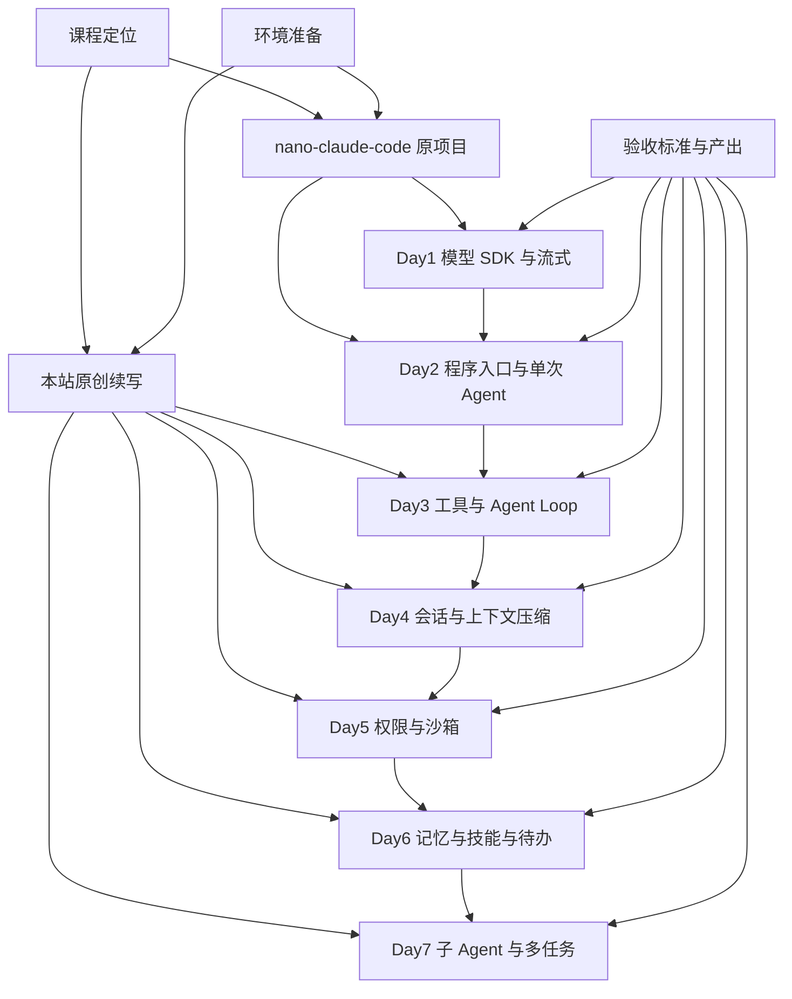
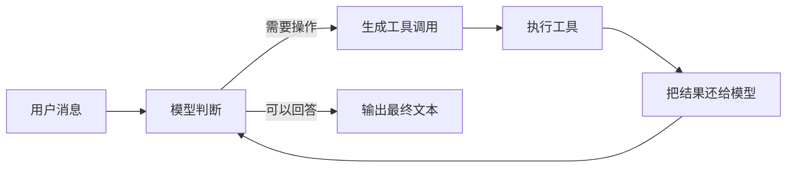
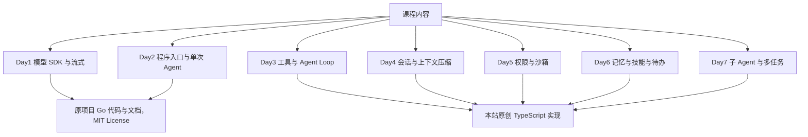
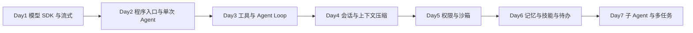
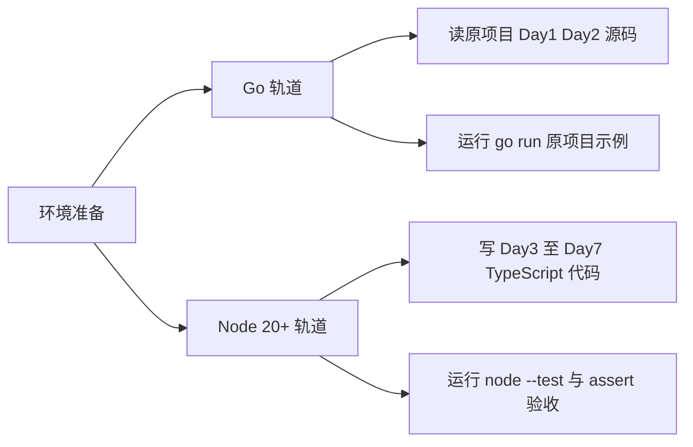
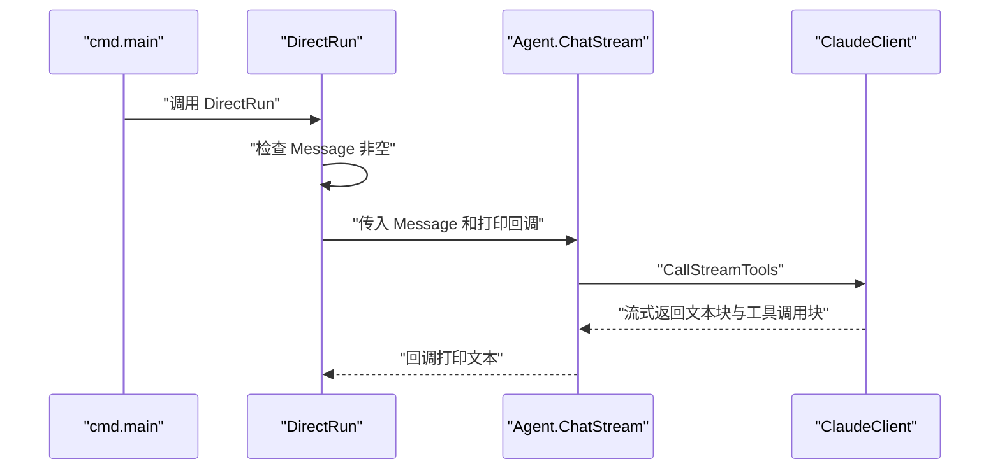
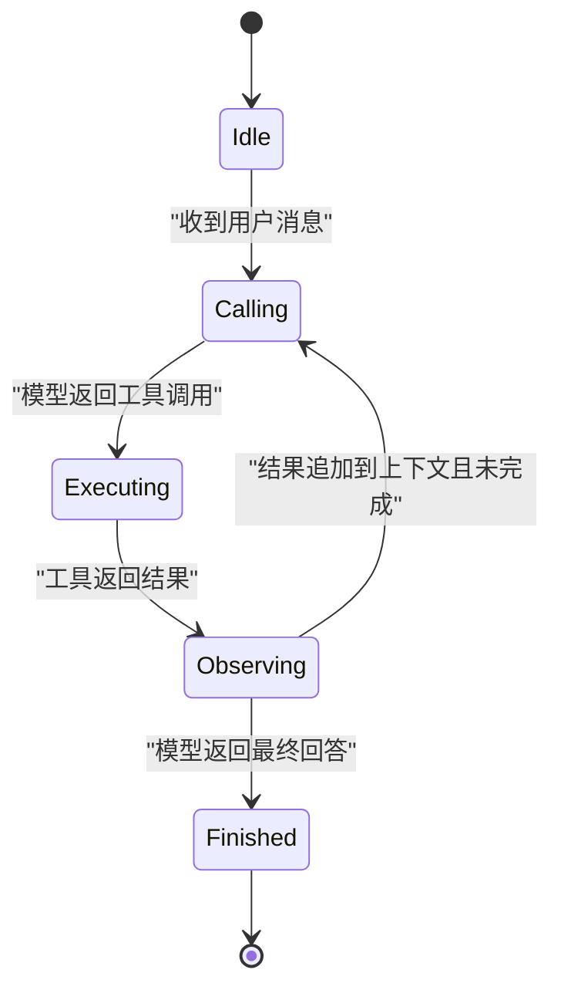
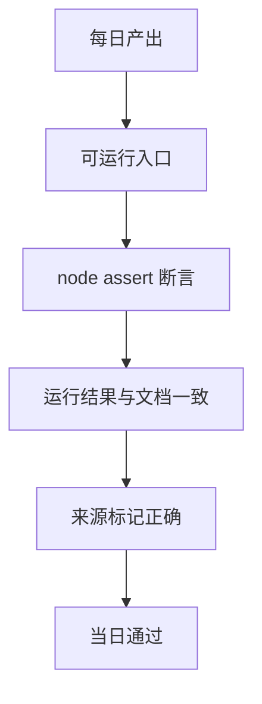
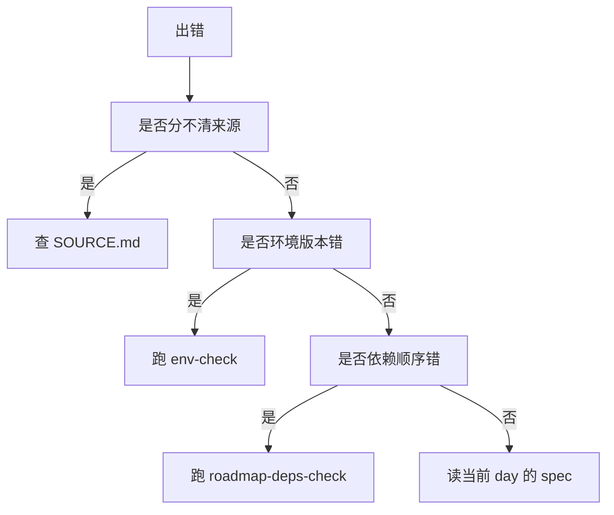

# 七天手写 MiniCode：从零实现一个 Claude Code 式编码智能体

!!! abstract "学完这一页你能"
    - 说出七天路线图每一天的输入、产出与验收标准。
    - 区分 nano-claude-code 原项目内容与本站原创续写内容。
    - 在 Node 20+ 环境里运行本页给出的 TypeScript 验证脚本并解释断言结果。
    - 准备 Go 与 TypeScript 双轨环境，并说出四类工具在两套语言中的对应实现。

## 0. 知识地图



建议这样读：先看第 1 节确认目标，再看第 2 节分清来源。第 3、4 节给出路线图和双轨环境，第 5、6 节进入每日内容，第 7、8 节用于验收和排错。

## 1. 课程定位：你七天要造出什么

**先想一个问题**

你用过 Claude Code 在终端里改代码：它读文件、写文件、运行命令，最后给出修改结果。你看到的是“输入一句话，输出多轮工具调用”的黑盒。本页要做的，是把黑盒拆成七天可完成的公开零件。

!!! note "术语：模型 SDK"
    模型 SDK 是封装模型请求、流式响应解析与错误处理的代码集合。例子：原项目 Day1 封装的 `claude` 包提供 `ClaudeClient` 与 `CallStreamTools`。

**心智模型**

!!! tip "心智模型"
    一句话模型：编码智能体的核心是一次“模型输出工具调用、执行器运行工具、结果还给模型”的循环。
    日常类比：你指挥一位助理改报告；助理说需要先读原稿，你递过去，助理读完说需要改三处，你批准，助理逐处修改并回报。
    类比在哪里不成立：助理有稳定的记忆和办公桌；程序里的上下文、工具结果和会话文件都必须显式保存与恢复。

**图解**



1. 用户消息先进入模型，模型判断能否直接回答。
2. 判断需要操作时，模型发出工具调用。
3. 执行器运行工具并拿回结果。
4. 结果再次进入模型，重复判断，直到可回答。
5. 模型输出最终文本，循环结束。

**一步一步来**

第一步：这一步要把七天的交付物压缩成一个可检查的计划数组。下面的 TypeScript 代码定义了前三天示例：

```ts
// mini-plan.ts
type DayPlan = {
  day: number;          // 第几天
  title: string;        // 主题
  source: "original" | "site"; // 内容来源
  outputs: string[];    // 当天产出
};
export const plan: DayPlan[] = [
  { day: 1, title: "模型 SDK 与流式", source: "original", outputs: ["sdk-runner", "stream-parser"] },
  { day: 2, title: "程序入口与单次 Agent", source: "original", outputs: ["entry", "single-agent"] },
  { day: 3, title: "工具与 Agent Loop", source: "site", outputs: ["tool-registry", "loop"] },
];
```

**这段代码在做什么**

- 定义 `DayPlan` 类型，约束每一天的计划结构。
- `source` 字段区分原项目内容与本站原创。
- 用数组固定交付顺序，便于后续脚本校验。
- 只列出前三天示例，后四天在第 6 节补齐。

第二步：这一步用断言脚本验证 Day1 至 Day3 的顺序和来源标记。下面代码依赖 `node:assert`：

```ts
// verify-plan.ts
import assert from "node:assert/strict";
import { plan } from "./mini-plan.js";

assert.equal(plan[0].day, 1);
assert.equal(plan[0].source, "original");
assert.equal(plan[2].title, "工具与 Agent Loop");
assert.equal(plan[2].source, "site");
console.log("plan-check passed");
```

**这段代码在做什么**

- 断言第一天的天数为 1。
- 断言第一天来源是原项目。
- 断言第三天标题和来源都正确。
- 运行通过则打印 `plan-check passed`。

运行结果：

```
plan-check passed
```

**动手验证**

下面脚本合成前两步，检查七天依赖没有倒序，并且每天都存在前置依赖：

```ts
// verify-days.ts
import assert from "node:assert/strict";

const days = [
  { day: 1, name: "模型SDK与流式", deps: [] },
  { day: 2, name: "程序入口与单次Agent", deps: [1] },
  { day: 3, name: "工具与AgentLoop", deps: [2] },
  { day: 4, name: "会话与上下文压缩", deps: [3] },
  { day: 5, name: "权限与沙箱", deps: [4] },
  { day: 6, name: "记忆与技能与待办", deps: [5] },
  { day: 7, name: "子Agent与多任务", deps: [6] },
];
const byId = new Map(days.map((d) => [d.day, d]));
for (const d of days) {
  for (const dep of d.deps) {
    assert.ok(byId.has(dep), `day ${d.day} 的依赖不存在`);
    assert.ok(dep < d.day, `day ${d.day} 的依赖顺序错误`);
  }
}
console.log("7-day dependency check passed");
```

预期输出：

```
7-day dependency check passed
```

**常见坑**

| 现象 | 原因 | 怎么修 |
|---|---|---|
| 第一天就写完整 AI 工具 | 没有先确定最小循环 | 按 Day1 到 Day7 顺序，每天只完成一个闭环 |
| 把后五天当作原项目内容 | 没看清来源标记 | 标注 source 字段，核对原项目 MIT 声明 |
| 用 TS 重写 Go 源码时逐行照搬 | 忽略语言语义差异 | 按能力对应，不按行对应 |

**用在哪里**

- 业务背景：团队需要内部编码助手来减少重复命令。
- 怎么用：先用本页路线判断最小可用版本是哪一天，再决定 MVP 范围。
- 衡量指标：功能验收通过率、单次会议平均工具轮数。
- 什么时候不该用：需要生产级安全策略或分布式长时任务时，不应只依赖七天课程实现。

**行业实践**

- Learn Claude Code 教程公开讲解 Claude Code 的 agent 流程，可对照其基础概念；出处名称：Learn Claude Code。
- Anthropic 官方文档对工具使用与流式响应有实现要求；需核对官方文档：工具 schema 与返回结构。
- 开源项目 nano-claude-code 用 viper 管理配置、用 Go 实现入口与工具，可作为阅读样板；出处名称：TIC-DLUT/nano-claude-code 仓库，MIT License。

怎么借鉴到你的项目：把计划数组作为 CI 检查的一部分，保证每一天的依赖在代码合并前通过。

**小结**

- 七天路线是线性依赖，后一天使用前一天产出的能力。
- 第一步永远先确认消息能否直接回答，再决定是否调用工具。
- 来源标记和验收脚本要写进仓库，不能只放在文档里。

## 2. 与 nano-claude-code 的关系：前两项内容读原项目，后五项本站原创

**先想一个问题**

你打开 nano-claude-code 仓库，看到 Go 源码和 docs/day2.md。你分不清哪些代码可以直接改写、哪些必须自己续写。这一节给出边界。

**心智模型**

!!! tip "心智模型"
    一句话模型：本课程是一个“源码解读加原创续写”的双源项目。
    日常类比：前房东留下两间装好的房间，你看完水电网后，自己要接着装另外五间。
    类比在哪里不成立：房屋改装可以自由拆除；MIT 代码的著作权声明和许可文本必须保留。

!!! note "术语：MIT License"
    MIT License 是一种开源许可，允许使用、复制、修改、合并、发布、再许可，但必须保留版权声明与许可文本。例子：TIC-DLUT/nano-claude-code 的仓库标记 MIT License，Copyright 2026 dlut-tic。

**图解**

下面的 flowchart 标出两个内容来源各自的覆盖范围：



1. Day1 和 Day2 的 Go 代码与文档来自原项目。
2. Day3 至 Day7 的能力续写来自本站。
3. 原项目内容保留 MIT 版权声明；原创内容可标记本站来源。
4. 两个来源在文档和仓库目录中分开维护。

**一步一步来**

第一步：这一步在摘录原项目代码时写清许可来源。下面的 TypeScript 常量用于生成来源报告：

```ts
// src/original/attribution.ts
export const ORIGINAL_ATTRIBUTION = {
  repo: "TIC-DLUT/nano-claude-code", // 原仓库名
  license: "MIT",                    // 许可类型
  copyright: "Copyright 2026 dlut-tic", // 版权文本
  scope: ["day1", "day2"],           // 原项目覆盖范围
} as const;
```

**这段代码在做什么**

- 用常量记录仓库、许可、版权和适用范围。
- `as const` 让这些字段不可变。
- 后续构建脚本可读取该常量生成报告。

第二步：这一步用脚本检查上面四个字段非空，防止漏写许可来源：

```ts
// verify-attribution.ts
import assert from "node:assert/strict";
import { ORIGINAL_ATTRIBUTION } from "./attribution.js";
for (const key of ["repo", "license", "copyright", "scope"]) {
  assert.ok(ORIGINAL_ATTRIBUTION[key as keyof typeof ORIGINAL_ATTRIBUTION], `${key} 不能为空`);
}
console.log("attribution-check passed");
```

**这段代码在做什么**

- 循环四个必填字段。
- 逐项断言非空。
- 全部通过后打印 `attribution-check passed`。

运行结果：

```
attribution-check passed
```

**动手验证**

下面脚本验证 Day1 至 Day2 属于原项目、Day3 至 Day7 属于本站，且七天唯一覆盖：

```ts
// verify-source-boundary.ts
import assert from "node:assert/strict";
const originalDays = [1, 2];
const siteDays = [3, 4, 5, 6, 7];
for (const day of originalDays) assert.ok(day <= 2, "原项目范围溢出");
for (const day of siteDays) assert.ok(day >= 3, "原创范围缺失");
assert.equal(new Set([...originalDays, ...siteDays]).size, 7, "七天必须唯一");
console.log("source-boundary-check passed");
```

预期输出：

```
source-boundary-check passed
```

**常见坑**

| 现象 | 原因 | 怎么修 |
|---|---|---|
| 把 Day3 的 TS 代码写进原项目说明 | 边界不清 | 在文件头写 source 标记 |
| 忘了保留 MIT 文本 | 直接复制代码 | 保留仓库 README 或 license 文件中的许可声明 |
| 说“原项目支持 TS 版本” | 事实混淆 | 原项目使用 Go；TS 版本是本站续写 |

**用在哪里**

- 业务背景：开源课程需要引用第三方项目代码。
- 怎么用：用 `ORIGINAL_ATTRIBUTION` 常量生成关于页面和构建报告。
- 衡量指标：构建产物中许可文本出现次数、来源扫描通过率。
- 什么时候不该用：要发布闭源商业版本时，应请法律人士复核 MIT 适用边界。

**行业实践**

- SPDX License List 规定 MIT 标识与短文本；出处名称：SPDX License List。
- Go 项目用 viper 管理环境变量与配置文件；出处名称：spf13/viper 官方文档。
- 原项目 docs/day2.md 指出其对应的 Go 代码提交为 e7a5768c9129773c660e90b813dddad1c9d4278f；出处名称：TIC-DLUT/nano-claude-code docs/day2.md。

怎么借鉴到你的项目：在仓库加 `SOURCE.md` 文件，逐目录记录代码来源，CI 检查缺少来源标记的新增文件。

**小结**

- Day1 与 Day2 基于原项目 Go 代码和文档，须完整注明 MIT 来源。
- Day3 至 Day7 是本站原创 TypeScript 续写，不属原项目范围。
- 来源边界要用常量和脚本固定，不能只靠读者记忆。

## 3. 七天路线图：先看依赖再看每日任务

**先想一个问题**

你打算今天就写一个能自己改代码的智能体。你从哪一天开始，又怎么知道一天做完了？路线图要回答这两个问题。

**心智模型**

!!! tip "心智模型"
    一句话模型：七天路线是一条从“能发请求”到“能拆任务并行处理”的能力链。
    日常类比：先学开灯，再学给灯加开关，再学给整栋楼配电。
    类比在哪里不成立：真实电路建设不要求每阶段都可运行并保存历史；本课程每天都有可运行验收。

!!! note "术语：Agent Loop"
    Agent Loop 是智能体重复“从模型拿输出、执行工具、把结果写回上下文”的控制流。例子：用户说“改 README 第一行”，模型先调用 read_file，再把结果连同下一个 edit_file 调用一起处理。

**图解**

下面的 flowchart 展示七天的线性依赖：



1. Day1 产出可调用的模型客户端与流解析。
2. Day2 用该客户端完成一次无循环调用。
3. Day3 把单次调用扩展为多轮工具循环。
4. Day4 保存多轮历史并压缩超长上下文。
5. Day5 给工具加权限与沙箱限制。
6. Day6 加入长期记忆、技能和待办清单。
7. Day7 拆分任务给子 Agent 并处理多任务。

**一步一步来**

第一步：这一步定义七天依赖关系，作为后续脚本数据源。下面是 TypeScript 数组：

```ts
// days.ts
export type Day = {
  day: number;        // 天数
  base: string;       // 当天主线
  deps: number[];     // 前置依赖
  deliverable: string; // 可运行交付物
};
export const days: Day[] = [
  { day: 1, base: "模型 SDK", deps: [], deliverable: "可流式返回的 API 客户端" },
  { day: 2, base: "程序入口", deps: [1], deliverable: "非 TUI 单次 Agent" },
  { day: 3, base: "Agent Loop", deps: [2], deliverable: "多轮工具循环" },
  { day: 4, base: "会话压缩", deps: [3], deliverable: "JSONL 会话与摘要压缩" },
  { day: 5, base: "权限沙箱", deps: [4], deliverable: "工具白名单与工作目录限制" },
  { day: 6, base: "记忆技能待办", deps: [5], deliverable: "长期记忆与待办执行" },
  { day: 7, base: "子 Agent", deps: [6], deliverable: "可并行的子任务" },
];
```

**这段代码在做什么**

- `Day` 类型固定每天的四要素。
- `deps` 表示前置依赖；Day1 没有依赖。
- 每天只有一条主线，避免过早扩展子能力。

第二步：这一步在运行前检查没有循环依赖：

```ts
// verify-roadmap.ts
import assert from "node:assert/strict";
import { days } from "./days.js";
for (const d of days) {
  for (const dep of d.deps) assert.ok(dep < d.day, `day${d.day} 依赖 day${dep} 不合法`);
}
console.log("roadmap-deps-check passed");
```

**这段代码在做什么**

- 遍历每一天的依赖数组。
- 断言每个依赖天数小于当前天数。
- 全部通过打印 `roadmap-deps-check passed`。

运行结果：

```
roadmap-deps-check passed
```

**动手验证**

下面脚本检查七天主题是否完整且不重复：

```ts
// verify-topics.ts
import assert from "node:assert/strict";
const accepted = [
  "模型 SDK 与流式",
  "程序入口与单次 Agent",
  "工具与 Agent Loop",
  "会话与上下文压缩",
  "权限与沙箱",
  "记忆与技能与待办",
  "子 Agent 与多任务",
];
assert.equal(accepted.length, 7, "必须七天");
assert.equal(new Set(accepted).size, 7, "每天主题不得重复");
for (const name of accepted) assert.ok(name.length > 4, `${name} 标题过短`);
console.log("seven-day-topic-check passed");
```

预期输出：

```
seven-day-topic-check passed
```

**常见坑**

| 现象 | 原因 | 怎么修 |
|---|---|---|
| 第三天突然做沙箱 | 忽略依赖顺序 | 沙箱属于 Day5，先完成会话恢复后再加权限 |
| 每天产出不可运行 | 验收标准写成“理解” | 改成可执行文件和断言 |
| 依赖图闭环 | 前序关系写错 | 本节第二步的脚本能直接拦截 |

**用在哪里**

- 业务背景：团队排期一个七周编码智能体内训计划。
- 怎么用：把本页 `days` 数组导出为 JSON，给排期系统按依赖生成甘特图。
- 衡量指标：每阶段验收通过数、提前发现依赖错误数。
- 什么时候不该用：如果团队成员已经能独立写工具循环，可只保留 Day4 至 Day7。

**行业实践**

- Learn Claude Code 教程按“环境、模型、工具、循环”逐步展开；出处名称：Learn Claude Code。
- 原项目 docs/day2.md 演示了从配置到单次 Agent 的完整链路；出处名称：TIC-DLUT/nano-claude-code docs/day2.md。
- 原项目在 cmd/main.go 中用 flag 控制 TUI 与非 TUI 模式；出处名称：TIC-DLUT/nano-claude-code cmd/main.go。

怎么借鉴到你的项目：把 `deps` 字段接到你的构建脚本，在合并分支前跑一遍，避免破坏每天示例。

**小结**

- 路线图是线性依赖：后一天导入前一天模块。
- 每天有唯一主题和一个可运行交付物。
- 验收脚本必须检查“依赖顺序”而不只检查“主题数量”。

## 4. 环境准备：Go 读原项目，TypeScript 写原创续写

**先想一个问题**

你看到原项目 cmd/main.go 是 Go，而本站原创续写要写 TS。你先装 Go 还是 Node？这一节给出两条轨道的用途和对应。

**心智模型**

!!! tip "心智模型"
    一句话模型：Go 是“阅读与对照轨”，TypeScript 是“实现与验证轨”。
    日常类比：读外文原著用词典，写读后感用母语；两套工具并行但目标不同。
    类比在哪里不成立：词典词义和母语表达是一一对应；Go 的 goroutine 与 TS 的异步循环不是一一对应。

**图解**

下面的 flowchart 展示双轨环境各自的用途：



1. Go 轨道负责原项目源码阅读和运行。
2. Node 轨道负责原创续写的实现和断言验收。
3. 两条轨道共用一份 Markdown 路由检查脚本。

**一步一步来**

第一步：这一步用两条命令检查当前语言工具是否可用：

```bash
# 检查 Go 是否可用；原项目是 Go，具体版本看仓库 go.mod
go version

# 检查 Node 是否达到 20；原创部分统一用 Node 20+
node --version
```

**这段代码在做什么**

- `go version` 探测 Go 是否在 PATH 中。
- `node --version` 探测 Node 主版本。
- 原项目 Go 版本不能假设，需核对仓库 go.mod。

第二步：这一步把 Go 概念映射到 TypeScript 概念，按能力对应：

```ts
// mapping.ts
export const mapping = [
  { go: "func LoadConfig() error", ts: "function loadConfig(): Config", purpose: "读配置并返回错误" },
  { go: "flag.StringVar", ts: "process.argv 解析", purpose: "解析命令行参数" },
  { go: "os/exec Command", ts: "child_process.execFile", purpose: "运行外部命令" },
  { go: "map[string]any", ts: "Record<string, unknown>", purpose: "保存工具参数" },
] as const;
```

**这段代码在做什么**

- 每一行只对应一个能力点，不按语法逐行映射。
- `as const` 禁止后续修改映射表。
- `os/exec` 到 `child_process` 的对应只取“运行外部命令”这一用途。

**动手验证**

下面脚本验证 Node 版本和映射表两个环境前提：

```ts
// verify-env.ts
import assert from "node:assert/strict";
import { mapping } from "./mapping.js";
assert.equal(mapping.length, 4, "映射表应包含四个能力点");
assert.equal(mapping[2].go, "os/exec Command");
assert.equal(mapping[2].ts, "child_process.execFile");
const nodeMajor = Number(process.versions.node.split(".")[0]);
assert.ok(nodeMajor >= 20, `需要 Node 20+，当前 ${process.versions.node}`);
console.log(`env-check passed on Node ${process.versions.node}`);
```

预期输出（Node 20 或更高时）：

```
env-check passed on Node 20.11.0
```

**常见坑**

| 现象 | 原因 | 怎么修 |
|---|---|---|
| 用 tsx 运行 Go 文件 | 两种语言混淆 | Go 用 go run；TS 用 tsx 或先编译再 node |
| Node 是 18 导致 assert 语法不通过 | 版本低于要求 | 安装 Node 20+ |
| 按行翻译 Go 的 goroutine | 语言模型不同 | 按能力映射，Day3 至 Day7 用 TS async 模型 |

**用在哪里**

- 业务背景：前端团队想学命令行编码工具，但没写过 Go。
- 怎么用：Go 只做源码对照，不要求写出 Go 新功能；TS 轨道完成全部新代码。
- 衡量指标：从仓库克隆到第一次运行成功的时长、环境检查脚本通过率。
- 什么时候不该用：如果团队只愿意用一种语言，可以把 Day1 与 Day2 也用 TS 重写，但需保留原项目出处标注。

**行业实践**

- Go 官方模块文档建议通过 go.mod 管理依赖；出处名称：Go Modules Reference，需核对 go.mod 具体版本。
- Node 官方文档规定 assert/strict 用于断言；出处名称：Node.js assert 文档。
- 原项目 cmd/flags.go 使用 flag.StringVar 与 flag.BoolVar 解析参数；出处名称：TIC-DLUT/nano-claude-code cmd/flags.go。

怎么借鉴到你的项目：在 README 放两条安装命令的复制块，并加版本检查脚本作为前置校验。

**小结**

- 读原项目用 Go，写原创续写用 TS，两轨不混用。
- 代码映射按能力对齐，不按行翻译。
- Node 20+ 是本站所有验证脚本的运行时门槛。

## 5. Day 1 至 Day 2：读懂原项目的 SDK 与单次 Agent

**先想一个问题**

原项目 Day2 代码里出现了 `apiClient.CallStreamTools`。这个函数不是凭空出现的，它来自 Day1。你要先读懂 Day1 封装出的接口，再读 Day2 的入口。

**心智模型**

!!! tip "心智模型"
    一句话模型：Day1 提供“模型 SDK”，Day2 提供“入口与单次 Agent”。
    日常类比：Day1 装好一根水管，Day2 装上一个水龙头；先有水再有开关。
    类比在哪里不成立：水管装好后通常不再改管径；SDK 接口后续可能随着工具模式、会话管理而扩展。

**图解**

下面的 sequenceDiagram 显示原项目 Day2 单次调用的执行顺序：



1. `cmd.main` 先加载配置，再创建 `MainAgent`。
2. `DirectRun` 检查 `Message`，为空则 panic。
3. `ChatStream` 组装 model、systemPrompt、messages、tools。
4. `ClaudeClient` 流式返回，回调区分文本块和工具调用块。

**一步一步来**

第一步：这一步读配置入口。下面代码摘录自原项目 Day2 文档，来源 MIT License：

```go
// config/env.go 摘录自 nano-claude-code
func BindEnv() {
	viper.SetEnvPrefix("ncc")           // 设置环境变量前缀
	viper.BindEnv("llm.apikey")         // 绑定 API Key 键
	viper.BindEnv("llm.baseurl")        // 绑定 Base URL 键
	viper.BindEnv("llm.model")          // 绑定模型名键
}
```

**这段代码在做什么**

- 设置环境变量前缀 `ncc`。
- 将配置键 `llm.apikey` 绑定到 `NCC_LLM_APIKEY`。
- 同样的前缀规则绑定 `llm.baseurl` 与 `llm.model`。
- 该代码来自原项目 Day2 文档，MIT License。

第二步：这一步看单次 Agent 的调用核心。下面代码摘录自原项目 agent/chat.go 的会话构建与调用部分：

```go
// agent/chat.go 摘录自 nano-claude-code
func (a *Agent) ChatStream(message string, callback func(string)) {
	messages, err := a.sessionManager.BuildSessionContext() // 读取历史消息
	if err != nil {
		panic(err) // 历史读取失败直接停止
	}
	newMessage := claude.Message{ // 构造用户消息
		Role:    claude.ClaudeMessageRoleUser,
		Content: claude.SingleStringMessage(message),
	}
	messages = append(messages, newMessage) // 拼入本次消息
	a.sessionManager.Append(newMessage)     // 先持久化用户消息
	resMessages, _, err := a.apiClient.CallStreamTools( // 调用模型
		viper.GetString("llm.model"), GetNowSystemPrompt(), messages, a.tools,
		func(m claude.Message) bool { return true },
	)
	if err != nil {
		panic(err) // 调用失败停止
	}
	a.sessionManager.Append(resMessages...) // 持久化模型响应
}
```

**这段代码在做什么**

- 从会话管理器构建历史消息。
- 把本次用户消息追加到历史。
- 调用 `CallStreamTools` 发起单次流式请求。
- 响应消息再写入会话，完成单次闭环。
- Day2 原项目只做一次调用，不包含 Day3 的工具循环，需在 Day3 续写。

**动手验证**

下面脚本用 Node 复刻 Day2 的空消息检查，并验证环境变量前缀拼接规则：

```ts
// verify-day2-gate.ts
import assert from "node:assert/strict";
const envKeys = ["llm.apikey", "llm.baseurl", "llm.model"];
const prefixed = envKeys.map((k) => `NCC_${k.toUpperCase()}`);
assert.deepEqual(prefixed, ["NCC_LLM_APIKEY", "NCC_LLM_BASEURL", "NCC_LLM_MODEL"]);
const entry = (message: string) => {
  if (!message) throw new Error("message不能为空");
  return `开始处理${message}`;
};
assert.throws(() => entry(""), /message不能为空/);
assert.equal(entry("改 README"), "开始处理改 README");
console.log("day1-day2-check passed");
```

预期输出：

```
day1-day2-check passed
```

**常见坑**

| 现象 | 原因 | 怎么修 |
|---|---|---|
| 配置读不到 | 环境变量没有 `NCC_` 前缀 | 用 viper 的 `SetEnvPrefix` 保持一致 |
| `message` 为空却继续请求 | 少一步入口检查 | 在 DirectRun 最上方检查空字符串 |
| 回调收到工具调用却没有结果块 | Day2 只打印工具名，不执行工具 | 工具执行循环放到 Day3 |

**用在哪里**

- 业务背景：前端同学要读懂一个 Go 命令行工具的最小入口。
- 怎么用：把 config、flag、agent、tools 四层拆开读，不整体硬啃。
- 衡量指标：能解释每个 panic 的触发条件、能说出三类环境变量的拼写规则。
- 什么时候不该用：尚未读 Day1 的 SDK 封装前，不建议直接改 Day2 的 ChatStream。

**行业实践**

- 原项目 docs/day2.md 把配置、入口、Agent、工具四部分依次讲解；出处名称：TIC-DLUT/nano-claude-code docs/day2.md。
- 原项目 config/init.go 使用 viper 的 ConfigFileNotFoundError 判断首次运行并引导创建配置；出处名称：TIC-DLUT/nano-claude-code config/init.go。
- Learn Claude Code 教程说明先做命令行入口再做单次完成的最小版本；出处名称：Learn Claude Code。

怎么借鉴到你的项目：用单次调用版本作为回归基线，每次新增能力时先确认基线不破坏。

**小结**

- Day1 的 SDK 接口在 Day2 中体现为 CliClient 与工具类型。
- Day2 的 DirectRun 与 ChatStream 只做一次模型调用。
- 工具调用块的执行结果处理不在 Day2，而在 Day3。

## 6. Day 3 至 Day 7：本站原创续写的能力链

**先想一个问题**

你已经在 Day2 拿到了模型返回的工具调用块。现在怎么让程序真的执行 `bash` 并把 stdout 还给模型？这就是 Day3。

**心智模型**

!!! tip "心智模型"
    一句话模型：Day3 到 Day7 是把“单次模型调用”扩展成“有记忆、受权限、能拆任务的执行器”。
    日常类比：招聘一位新员工；先让他会执行单个任务，再给他培训手册、门禁权限、工作记录和分派工单。
    类比在哪里不成立：新员工的培训可以模糊；程序里的技能、权限、记忆都要有明确数据结构和验收条件。

**图解**

下面的 stateDiagram 展示 Day3 的 Agent Loop 状态机，后续 Day4 至 Day7 是在这个状态机外围加持久化、权限、记忆和并行任务：



1. Day3：用这个状态机实现多轮工具循环。
2. Day4：把每次进入 Observing 的上下文写入 JSONL，并在超长时压缩。
3. Day5：在 Executing 前加权限检查，禁止未授权命令。
4. Day6：在 Idle 与 Finished 之间加记忆、技能与待办的读写。
5. Day7：把 Executing 中的重任务分派给子 Agent 并行执行。

**一步一步来**

第一步：这一步写 Day3 的 TypeScript 工具注册表。下面代码是本站原创：

```ts
// src/day3/tool-registry.ts
export type ToolHandler = (input: Record<string, unknown>) => Promise<string>;
export type ToolSpec = {
  name: string;              // 工具名
  description: string;       // 工具说明
  handler: ToolHandler;      // 工具实现
};
export const registry = new Map<string, ToolSpec>();
export function registerTool(tool: ToolSpec): void {
  if (registry.has(tool.name)) throw new Error(`工具 ${tool.name} 已存在`);
  registry.set(tool.name, tool);
}
```

**这段代码在做什么**

- 定义工具处理器与声明结构。
- 用 `Map` 保存工具名到实现的映射。
- 提供 `registerTool` 防止重名覆盖。

第二步：这一步写 Day3 的多轮循环，只保留必需检查。下面代码是本站原创：

```ts
// src/day3/loop.ts
import { registry } from "./tool-registry.js";
type AssistantTurn = { final?: string; toolCall?: { name: string; input: Record<string, unknown> } };
export async function runLoop(getTurn: () => Promise<AssistantTurn>, messages: string[]): Promise<string[]> {
  for (let i = 0; i < 8; i++) {
    const turn = await getTurn();
    if (turn.final) return [...messages, turn.final];
    if (!turn.toolCall) throw new Error("无最终答案也无工具调用");
    const tool = registry.get(turn.toolCall.name);
    if (!tool) throw new Error(`未知工具 ${turn.toolCall.name}`);
    const result = await tool.handler(turn.toolCall.input);
    messages.push(`[tool ${turn.toolCall.name}] ${result}`);
  }
  throw new Error("超过 8 轮仍未结束");
}
```

**这段代码在做什么**

- `getTurn` 抽象模型获取过程，便于测试。
- 每轮先看是否有最终答案。
- 没有最终答案时必须提供工具调用。
- 未注册工具直接报错。
- 循环上限为 8 轮，避免死循环。

**动手验证**

下面脚本用假模型验证 Day3 的两轮循环和工具结果回写：

```ts
// verify-day3-loop.ts
import assert from "node:assert/strict";
import { runLoop } from "./loop.js";

let calls = 0;
async function fakeTurn() {
  calls += 1;
  if (calls === 1) return { toolCall: { name: "bash", input: { command: "echo ok" } } };
  return { final: `结果来自工具：ok` };
}
const out = await runLoop(fakeTurn, []);
assert.equal(calls, 2, "应执行两轮");
assert.deepEqual(out, ["[tool bash] ok", "结果来自工具：ok"]);
console.log("day3-loop-check passed");
```

预期输出：

```
day3-loop-check passed
```

**常见坑**

| 现象 | 原因 | 怎么修 |
|---|---|---|
| 工具结果没有写回上下文 | 只执行不追加 | 在 `runLoop` 内 `messages.push` |
| 无限调用工具 | 没有轮次上限 | 循环 8 次后抛错 |
| 工具注册重复覆盖 | 直接用对象赋值 | 用 `Map` 和 `registerTool` 检查重名 |

**用在哪里**

- 业务背景：前端同学要做代码评审助手，先跑通“读文件-分析-写评论”闭环。
- 怎么用：Day3 的 `runLoop` 接入真实模型客户端；Day4 把 `messages` 持久化；Day5 给工具加白名单。
- 衡量指标：一次输入完成的工具轮数、未知工具报错率。
- 什么时候不该用：生产环境直接执行 bash 命令时，应先进入 Day5 沙箱与权限，而不是裸跑 Day3。

**行业实践**

- Anthropic 官方文档描述函数调用循环，需核对官方文档：工具结果回传 message 的具体字段。
- 原项目 Day2 的 CallStreamTools 已能返回工具调用块，但未实现循环；出处名称：TIC-DLUT/nano-claude-code agent/chat.go。
- 本站原创 Day3 用轮次上限与未知工具报错作为两条安全边线。

怎么借鉴到你的项目：把 `runLoop` 设计成接受抽象 `getTurn` 的函数，这样既可用真实 API 也可用测试替身。

**小结**

- Day3 核心是循环：调用、执行、观察、再调用。
- Day4 会替换 `messages` 为会话管理器。
- Day5 会在 `runLoop` 外包裹权限检查。

## 7. 每日验收标准与产出汇总

**先想一个问题**

你完成了一天代码，怎么判断真的完成？这一节把验收条件写成脚本可检查的字段。

**心智模型**

!!! tip "心智模型"
    一句话模型：验收标准是把“学懂了”翻译成“能运行、能断言、能说清边界”。
    日常类比：驾照考试不只问交规，还要求倒车入库；每个知识点都有动作。
    类比在哪里不成立：考试动作通常一次性完成；软件验收要随着每次提交重复运行。

**图解**

下面的 flowchart 展示每日产出走向通过验收的路径：



1. 产出先要有可运行入口。
2. 用 `node:assert` 固定行为。
3. 断言失败说明实现与预期不一致。
4. 来源标记错误会中断合并。

**一步一步来**

第一步：这一步建立每日验收表，集中记录七天产出。下面是本站原创的 TypeScript 常量：

```ts
// acceptance.ts
export const acceptance = [
  { day: 1, check: "SDK 能流式解析 text 块", artifact: "stream-parser.spec.ts" },
  { day: 2, check: "message 为空时抛错", artifact: "direct-gate.spec.ts" },
  { day: 3, check: "循环最多 8 轮且工具结果回写", artifact: "loop.spec.ts" },
  { day: 4, check: "会话能从 JSONL 恢复并压缩超长上下文", artifact: "session.spec.ts" },
  { day: 5, check: "未授权命令被拒绝", artifact: "permission.spec.ts" },
  { day: 6, check: "待办与技能可跨会话读取", artifact: "memory.spec.ts" },
  { day: 7, check: "子 Agent 任务可并行且结果汇总", artifact: "subagent.spec.ts" },
] as const;
```

**这段代码在做什么**

- `artifact` 指定测试文件路径。
- `check` 一句话描述可观察行为。
- `as const` 保证七天记录不可变。

**动手验证**

下面脚本验证七天验收表完整且测试文件命名唯一：

```ts
// verify-acceptance.ts
import assert from "node:assert/strict";
import { acceptance } from "./acceptance.js";
assert.equal(acceptance.length, 7, "必须七天都有验收");
for (const item of acceptance) assert.ok(item.artifact.endsWith(".spec.ts"), `${item.day} 缺少测试文件`);
assert.equal(new Set(acceptance.map((a) => a.artifact)).size, 7, "测试文件不得重复");
console.log("acceptance-table-check passed");
```

预期输出：

```
acceptance-table-check passed
```

**常见坑**

| 现象 | 原因 | 怎么修 |
|---|---|---|
| 验收写“理解 agent loop” | 不可运行 | 改成 `loop.spec.ts` 的断言 |
| 测试文件重复命名 | 没有统一命名规则 | 用 day + 模块名 + spec.ts |
| 文档说通过但 CI 失败 | 文档与脚本不同步 | 每一页文档都链接到测试文件 |

**用在哪里**

- 业务背景：前端架构峰会用七天课程作为新同学入职训练。
- 怎么用：把 `acceptance` 数组接到学习平台的打卡检查。
- 衡量指标：三天内补齐失败验收的比例、每周通过天数。
- 什么时候不该用：只看项目演示不动手代码时，验收表没有执行价值。

**行业实践**

- Node.js 官方推荐用 node:test 与 assert/strict 写单元测试；出处名称：Node.js Test Runner 文档。
- 原项目 docs/day2.md 在每步后展示最终文件结构，作为产出核对；出处名称：TIC-DLUT/nano-claude-code docs/day2.md。
- Learn Claude Code 教程按天拆分任务，配有可运行命令；出处名称：Learn Claude Code。

怎么借鉴到你的项目：把验收表放入 README 的 Definition of Done 小节，每个测试文件必须对应一行。

**小结**

- 七天的验收都要落到 `.spec.ts` 文件上。
- 测试文件命名不可重复，避免遮蔽错误。
- 文档与测试同仓库维护，不一致就视为未完成。

## 8. 常见问题与排错路径

**先想一个问题**

你卡在“不知道先读哪个文件”，或者“Go 语法不熟能否跳过”。这一节给出七条决策。

**心智模型**

!!! tip "心智模型"
    一句话模型：排错不是乱试，而是按“来源-环境-依赖-代码-验收”逐层定位。
    日常类比：房间灯不亮，先看总闸，再看灯泡，再看开关线路。
    类比在哪里不成立：软件里同一现象可能来自配置、缓存、依赖、源码四处同时出错。

**图解**

下面的 flowchart 给出从出错到回退的决策路径：



1. 先确认内容来自原项目还是本站。
2. 再确认 Node 与 Go 版本。
3. 然后确认依赖顺序。
4. 最后读当天 `spec.ts` 反向定位代码。

**一步一步来**

第一步：这一步写一个排错指令表，用命令替代猜测。下面是本站原创的 TypeScript 常量：

```ts
// debug-steps.ts
export const debugSteps = [
  { when: "配置缺失", run: "node dist/verify-days.js" },
  { when: "来源混淆", run: "node dist/source-boundary-check.js" },
  { when: "环境版本", run: "go version && node --version" },
] as const;
```

**这段代码在做什么**

- 三个 `when` 对应常见输入场景。
- `run` 给出可复现命令。
- 顺序从上到下，先查配置与来源再查版本。

**动手验证**

下面脚本验证排错表的三条主路径均可执行：

```ts
// verify-debug-paths.ts
import assert from "node:assert/strict";
import { debugSteps } from "./debug-steps.js";
assert.equal(debugSteps.length, 3, "排错表应有三条主路径");
for (const step of debugSteps) assert.ok(step.run.includes("node") || step.run.includes("go"), step.when);
console.log("faq-debug-paths-check passed");
```

预期输出：

```
faq-debug-paths-check passed
```

**常见坑**

| 现象 | 原因 | 怎么修 |
|---|---|---|
| 一直读 Day7 代码 | 没有按依赖顺序 | 回退到当前缺失的 spec |
| 把 Go 报错当 TS 报错 | 识别错误来源 | 看报错开头语言与文件后缀 |
| 环境变量名对但值空 | 未写配置文件 | 首次运行按引导创建 config.json |

**用在哪里**

- 业务背景：学习小组每天同步进度，每周汇总一次卡点。
- 怎么用：DebugSteps 可做成 CLI 助手，输入现象输出第一条命令。
- 衡量指标：人均卡点时长、命令命中率。
- 什么时候不该用：已经进入具体模型行为调试时，应回到模型日志而非环境检查。

**行业实践**

- Go 错误信息通常带文件与行号，可用于初步定位；出处名称：Go Diagnostics 文档，需核对具体错误格式。
- Node 的 assert 失败信息会显示 expected 与 actual；出处名称：Node.js assert 文档。
- 原项目 config/init.go 对首启配置有交互引导；出处名称：TIC-DLUT/nano-claude-code config/init.go。

怎么借鉴到你的项目：在 README 放“先跑哪个命令再跑哪个命令”的三行清单，减少讨论区重复提问。

**小结**

- 排错从来源与版本开始，不先猜代码细节。
- 每个现象都对应一条可复现命令。
- 当天 `spec.ts` 是最短的回退起点。

## 应用地图

| 场景 | 用到本页哪个知识点 | 典型技术选型 | 注意事项 |
|---|---|---|---|
| 内部编码助手 CLI | Day1 与 Day2 的 SDK 与入口 | Go 或 TS、流式 SSE | 生产密钥不入仓库 |
| 代码评审机器人 | Day3 Agent Loop | TypeScript、tool registry | 限制文件读取路径 |
| 长时运行后台分析 | Day4 会话与上下文压缩 | JSONL 或 SQLite、摘要 | 压缩会丢细节 |
| 自动化运维脚本 | Day5 权限与沙箱 | 白名单、child_process | 禁止任意 shell 拼接 |
| 跨会话知识库 | Day6 记忆与技能 | 文件记忆、待办 | 技能定义与权限同步 |
| 多仓库批量任务 | Day7 子 Agent | 并行子任务、worker pool | 控制并发数 |
| 前端教学演示 | 全七天路线 | Node 20+、node:assert | 每天一个分支 |

## 动手作业

目标：写一个 `mini-course/README.md`，包含七天路线表、来源标记和一条可运行的依赖检查脚本。

步骤

1. 复制本页第 3 节的 `days` 数组到 `src/days.ts`。
2. 复制第 7 节的 `acceptance` 数组到 `src/acceptance.ts`。
3. 写 `src/verify.ts`，导入两个数组并做断言。
4. 运行 `npx tsx src/verify.ts`，输出 `course-readme-check passed`。

验收标准

- `acceptance` 数组长度为 7。
- 每个 `artifact` 以 `.spec.ts` 结尾。
- 每个 day 的依赖顺序通过 `assert.ok(dep < day)`。
- README 中的来源边界表与第 2 节一致。

## 综合对比

| 维度 | 原项目 Day1 至 Day2 | 本站原创 Day3 至 Day7 |
|---|---|---|
| 语言环境 | Go，具体版本看 go.mod | Node 20+、TypeScript |
| 配置管理 | viper 与 `~/.nano-claude-code/config.json` | 本站设计，暂用环境变量与 JSON |
| 命令行参数 | flag 包，`-tui`、`-message`、`-session` | `process.argv` 解析 |
| 模型调用 | `ClaudeClient.CallStreamTools` | `getTurn` 抽象函数，接真实客户端 |
| 会话存储 | `SessionManager` JSONL 与 parent 链 | Day4 文件存储，需检查具体设计 |
| 工具形式 | read_file、write_file、edit_file、bash | `Map` 注册表，async handler |
| 安全模型 | 无沙箱 | Day5 白名单与工作目录限制 |
| 验证方式 | 无测试文件 | `node:assert` spec 文件 |

## 深入阅读与参考

!!! tip "怎么用这些资料"
    先读「官方文档与规范」建立准确的概念，再读「源码与示例」核对细节，最后用「教程、书籍与视频」换一种讲法加深理解。每条都写明了读哪一节、带着什么问题读。

### 官方文档与规范

| 资源 | 为什么读 | 怎么读 |
|---|---|---|
| [Claude Agent SDK 概览](https://docs.claude.com/en/api/agent-sdk/overview) | 官方概览是最短路径，先建立 Agent 循环与工具调用的整体认知。 | 通读概览与快速开始，带着“一次查询如何驱动工具循环”的问题读，再对照 Day1 任务。 |
| [Claude Code 文档](https://code.claude.com/docs/en/overview) | 对照官方能力边界，确认七天里要复刻哪些核心功能。 | 按 slash commands、hooks、subagents 顺序扫一遍，列出你打算复刻的最小功能集。 |
| [Claude Tool Use 概览](https://docs.claude.com/en/docs/agents-and-tools/tool-use/overview) | 工具定义与调用规范的第一手资料，动手写工具层前必读。 | 读工具 schema 与 tool_result 两节，手写一份 JSON schema 并调试传参错误。 |
| [Claude 子 Agent 文档](https://docs.claude.com/en/docs/claude-code/sub-agents) | 子 Agent 的定义字段与权限限制，对应 Day4 起的能力链。 | 读工具权限与定义字段，照着实现一个只读的代码审查 subagent。 |
| [Claude Code Hooks](https://docs.anthropic.com/en/docs/claude-code/hooks) | hook 是权限与自动化的关键机制，原创续写阶段可参考其设计。 | 读配置作用域与事件类型，先写一个提交前 lint hook 并验证它会拦截。 |
| [When context fills, Claude Code "clears older tool outputs first, then (code.claude.com)](https://code.claude.com/docs/en/how-claude-code-works) | 看清上下文填满后的真实压缩策略，避免自己实现时拍脑袋。 | 读工具输出清理与阈值部分，回来给 MiniCode 写一版上下文裁剪策略。 |

### 源码与示例

| 资源 | 为什么读 | 怎么读 |
|---|---|---|
| [Claude Agent SDK（TypeScript）](https://github.com/anthropics/claude-agent-sdk-typescript) | 可直接克隆运行，是 Day1-2 读原项目时最贴近的代码样本。 | 跑通 README 示例后，重点读工具注册与消息循环源码，画出调用时序。 |
| [pi 编码 Agent 工具集](https://github.com/earendil-works/pi) | 现成的编码 Agent 循环实现，可与自己写的循环逐行对照。 | 读 agent loop 与统一 LLM API 两个模块，记录与你实现的三处差异。 |
| [smolagents 仓库](https://github.com/huggingface/smolagents) | 核心循环不到千行，最适合拆解最小 Agent 骨架。 | 只读核心循环文件，比较工具调用与终止条件写法，再改写成一版 TypeScript。 |

### 教程、书籍与视频

| 资源 | 为什么读 | 怎么读 |
|---|---|---|
| [Claude Code 的选择: 最初试过基于向量嵌入的 RAG,后改为 agentic search(grep、glob、读文件等工具)。 (latent.space)](https://www.latent.space/p/claude-code) | 解释为何弃向量检索改用 grep，直接影响你检索工具的设计。 | 带着“该给模型多大检索自由度”的问题读，定下 MiniCode 的检索方案。 |
| [How we built our multi-agent research system](https://www.anthropic.com/engineering/multi-agent-research-system) | 真实多 Agent 系统复盘，帮你判断何时值得拆出 subagent。 | 画出 lead agent 与 subagent 调用关系图，对照 Day5 设计取长补短。 |
| [Claude Code 最佳实践](https://www.anthropic.com/engineering/claude-code-best-practices) | 官方实践总结，为七天的实现取舍提供务实依据。 | 读 CLAUDE.md 与计划先行两节，在示例仓库里实践一周后复盘。 |
| [SWE-bench](https://swe-bench.github.io/) | 了解编码 Agent 的标准评测口径，用来校准每日验收标准。 | 浏览任务格式与榜单，挑一条任务改写成你自己的验收用例。 |

## 自测题

??? question "1. 请说出七天路线图每一天的主题，以及 Day3 的前置依赖是什么。"
    答案要点：
    - Day1 模型 SDK 与流式，Day2 程序入口与单次 Agent。
    - Day3 工具与 Agent Loop，依赖 Day2。
    - Day4 会话与上下文压缩，Day5 权限与沙箱，Day6 记忆与技能与待办，Day7 子 Agent 与多任务。
    - Day3 的前置依赖是 Day2。

??? question "2. 原项目 Day2 的 DirectRun 在什么条件下会 panic？"
    答案要点：
    - `Message` 为空字符串时 panic。
    - panic 文本是 `message不能为空`。
    - 这是入口层的参数校验，位于调用 Agent 之前。

??? question "3. 环境变量 `NCC_LLM_APIKEY` 对应 viper 的哪个配置键？"
    答案要点：
    - 对应 `llm.apikey`。
    - 因为 `SetEnvPrefix("ncc")` 后，viper 会把点号转成下划线并加前缀。
    - 完整规则是 `$NCC_LLM_APIKEY`。

??? question "4. 为什么 Day2 不能执行工具？Day3 如何补上？"
    答案要点：
    - Day2 的回调只识别 `ToolUseBlock` 并打印 `[tool_use]`。
    - Day2 没有工具实现执行和结果回传。
    - Day3 用 `runLoop` 拿到工具名后从注册表取 handler，执行并把结果 push 回 messages。

??? question "5. 原项目 SessionManager 中的 parentID 链起什么作用？"
    答案要点：
    - parentID 把每个 entry 接成一条历史路径。
    - `BuildSessionContext` 从 `nowEntryID` 沿 parentID 回溯，再反转得到时间正序消息。
    - 这允许从一个会话节点叉开新路径。

??? question "6. 本站原创验证脚本要求什么运行时版本？为什么？"
    答案要点：
    - 要求 Node 20+。
    - 因为脚本使用 `node:assert/strict` 和 ESM 语法。
    - Node 18 可能不满足某些运行时行为，所以统一 Node 20+。

??? question "7. 用一句话解释 Agent Loop 的四个状态。"
    答案要点：
    - Idle 等待用户消息。
    - Calling 请求模型。
    - Executing 执行工具。
    - Observing 把工具结果写回上下文，再决定继续调用还是结束。

??? question "8. 如果你的商业项目要复用 nano-claude-code 的 Go 代码，MIT License 要求你保留什么？"
    答案要点：
    - 保留原版权声明 `Copyright 2026 dlut-tic`。
    - 保留 MIT License 文本。
    - 在分发源码或二进制时随附许可。
    - 商业使用不要求开源你的整体产品，但 MIT 文本必须包含在相关目录。

## 延伸阅读

- Go Modules Reference：go.mod 与依赖版本管理章节。
- Viper 官方文档：SetEnvPrefix、BindEnv、ReadInConfig 章节。
- Node.js 官方文档：assert/strict 与 Test Runner 章节。
- Anthropic API 文档：结构化工具使用与流式响应章节，需核对具体章节名。
- Learn Claude Code：Day1 与 Day2 基础 agent 相关章节。
