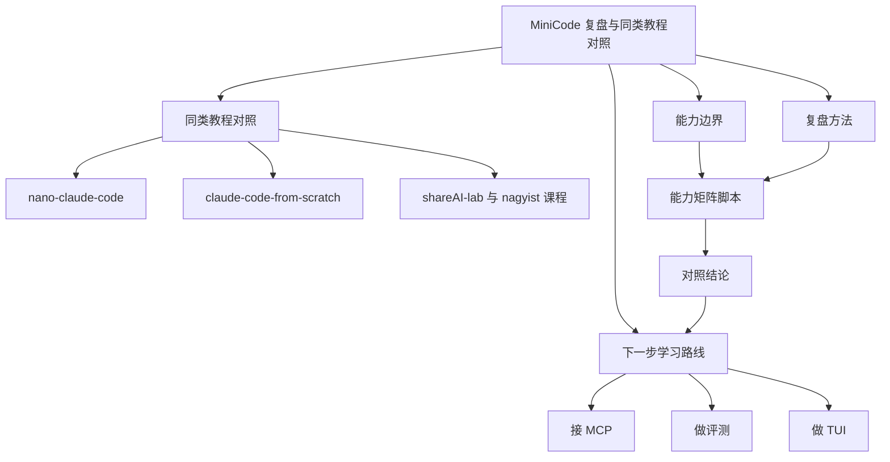
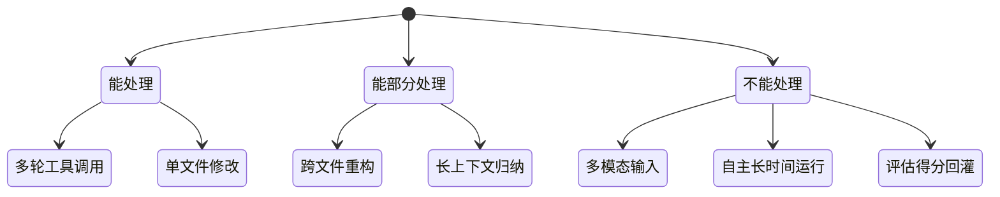
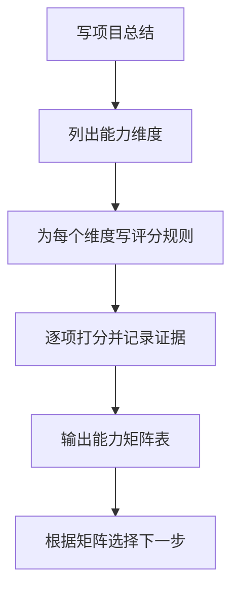
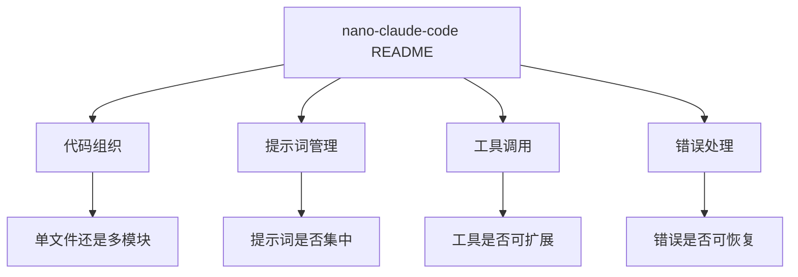
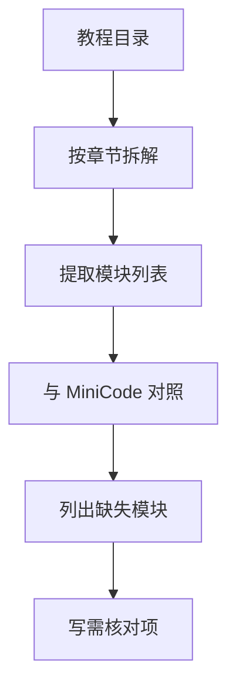
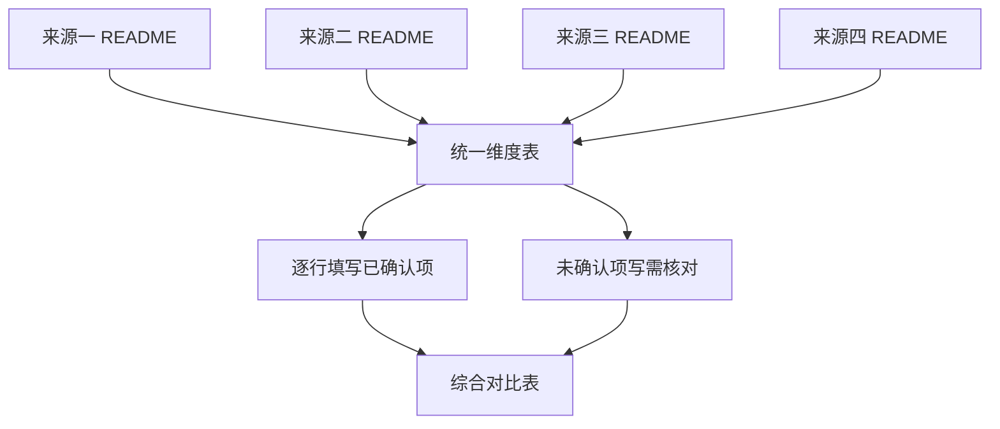
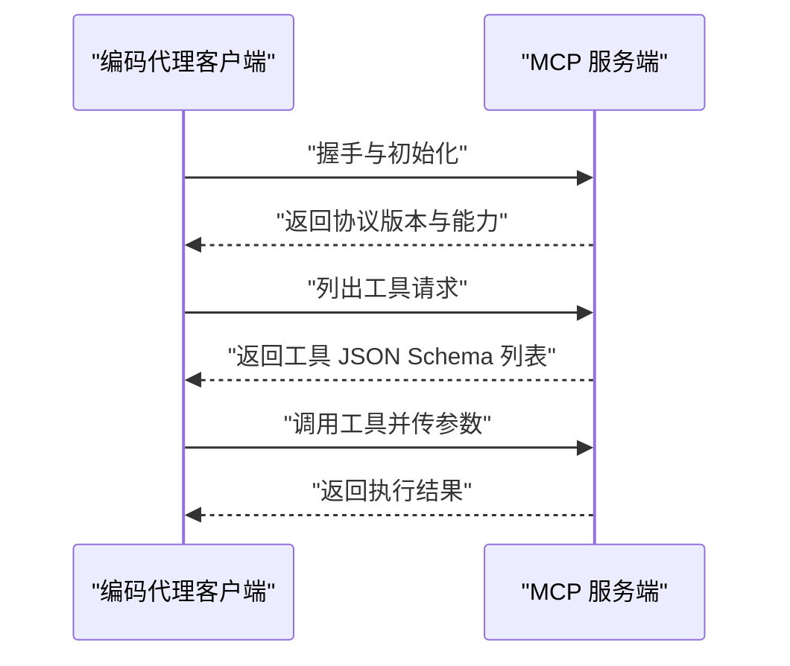
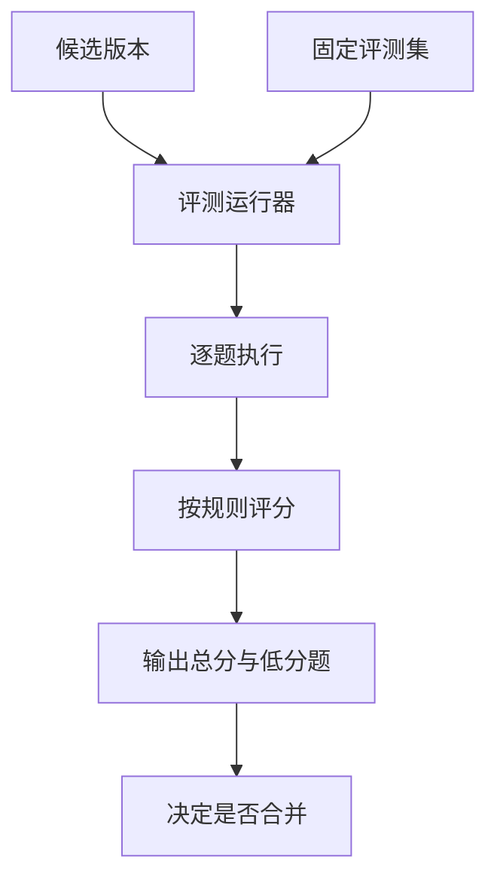
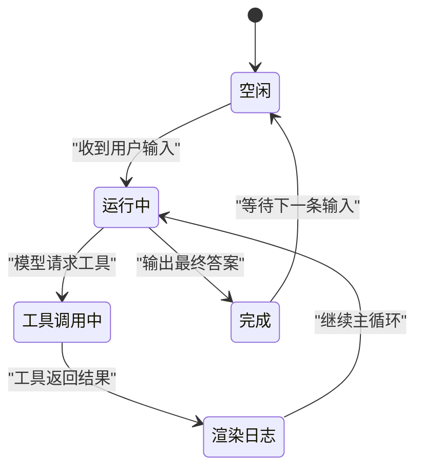

# MiniCode 复盘与同类开源教程对照

!!! abstract "学完这一页你能"
    - 能说出 MiniCode 七天版本的能力边界，列出至少 5 项它做不到或做不好的事。
    - 能按能力矩阵方法复盘自己或他人的项目，写出可运行的评分脚本。
    - 能将 MiniCode 与 4 个同类开源教程按代码组织、提示词管理、工具调用、错误处理做结构对照。
    - 能说出下一步 3 条学习路线的切入点，并能写一个最小 MCP 客户端、一个评测运行器、一个简单 TUI 渲染组件。

## 0. 知识地图



建议先读第 1 节，把 MiniCode 的能力边界写清楚。再读第 2 节，学会用脚本而不是印象做复盘。第 3 到 5 节按顺序读，用同一套维度对照 4 个教程。第 6 到 8 节是下一步路线，选一个方向动手即可。

## 1. MiniCode 的能力边界：七天做完不等于功能完整

**先想一个问题**

你七天做完 MiniCode 后，朋友问：“这个能替代 Cursor 吗？”你怎么回答才既不吹牛、也不贬低自己的成果？

**心智模型**

!!! tip "心智模型"
    一句话模型：MiniCode 是一辆教练车，能在封闭场地练基本功，但不能直接上高速。类比不成立：教练车和量产车只是配置差异，MiniCode 和工业级工具的差距还包括评测数据、错误恢复、多模态支持、长任务记忆等架构与数据差异。

**图解**



1. 能处理区：单文件修改、多轮工具调用，训练版本的核心路径。
2. 能部分处理区：跨文件重构、长上下文归纳，需要更多工程化。
3. 不能处理区：多模态输入、自主长时间运行、评估得分回灌，工业产品才具备。
4. 这张图用于提醒：边界是分层的，不是简单的“会不会”。

**一步一步来**

目的：写一个脚本，把你项目的能力边界检查项输出成列表，方便对照。

第 1 步：定义能力边界检查项。

```javascript
// 第 1 步：定义能力边界检查项
const capabilityChecks = [
  { name: "单文件代码生成", status: "pass" },
  { name: "多轮工具调用", status: "pass" },
  { name: "跨文件重构", status: "partial" },
  { name: "长上下文归纳", status: "partial" },
  { name: "多模态输入", status: "fail" },
  { name: "自主长时间运行", status: "fail" },
  { name: "评估得分回灌", status: "fail" },
];
// 输出每条检查项的状态
for (const item of capabilityChecks) {
  console.log(`${item.name}: ${item.status}`);
}
```

**这段代码在做什么**

- 用一个数组存储能力项和状态，状态只有 pass、partial、fail 三档。
- 用 for 循环逐个打印，让边界清晰可见。
- 为什么需要这个脚本：口头描述边界容易模糊，脚本输出固定格式，方便团队对比。

运行结果：

```
单文件代码生成: pass
多轮工具调用: pass
跨文件重构: partial
长上下文归纳: partial
多模态输入: fail
自主长时间运行: fail
评估得分回灌: fail
```

**动手验证**

目的：把能力边界检查项做成可断言脚本，让复盘结论可检验。

```javascript
// 能力边界检查脚本，Node 20+，无第三方依赖
const assert = require("node:assert");
const capabilityChecks = [
  { name: "单文件代码生成", status: "pass" },
  { name: "多轮工具调用", status: "pass" },
  { name: "跨文件重构", status: "partial" },
  { name: "长上下文归纳", status: "partial" },
];
const failItems = capabilityChecks.filter((i) => i.status === "fail");
const partialItems = capabilityChecks.filter((i) => i.status === "partial");
assert.ok(failItems.length <= 3, "失败项不应超过 3 项");
assert.ok(partialItems.length <= 3, "部分项不应超过 3 项");
console.log("预期输出：能力边界检查通过");
console.log(`失败项 ${failItems.length} 项，部分项 ${partialItems.length} 项`);
```

**这段代码在做什么**

- 用 node:assert 检验失败项和部分项的数量上限，防止复盘时只写不测。
- filter 方法把数组按状态分组，再用 length 读取数量。
- 断言失败时进程会退出并打印错误，让问题暴露。

运行结果：

```
预期输出：能力边界检查通过
失败项 0 项，部分项 2 项
```

**常见坑**

| 现象 | 原因 | 怎么修 |
| --- | --- | --- |
| 复盘时只说“做完了” | 没有定义完的边界 | 列 7 项能力检查，标注 pass、partial、fail |
| 把 partial 当成 pass | 缺少中间状态 | 增加 partial 状态，写出哪些子任务能完成 |
| 断言永远通过 | 断言条件太宽 | 让断言数量和边界项挂钩，如失败项不超过 3 |

**用在哪里**

- 业务背景：个人项目复盘或教程交付时，需要向别人说明项目能做什么。
- 这一节的知识怎么用：把能力边界写成检查项脚本，作为交付物附在 README 里。
- 用什么指标衡量收益：检查项覆盖率、失败项数量、部分项数量。
- 什么时候不该用：如果你只做一次性演示，不需要长期维护边界脚本，手动列一次表格即可。

**行业实践**

- Model Context Protocol 官方文档关于 tool list 的章节：工具能力用 JSON Schema 描述，可被客户端校验。怎么借鉴：把每项能力写成带状态的条目，方便自动检查。
- Node.js 官方文档 assert 章节：使用 assert 模块写测试，而不是手动 if 抛错。怎么借鉴：能力边界脚本全部改为断言式。
- Anthropic MCP 公告文章公开描述：模型连接工具的能力由协议检查，而非硬编码。怎么借鉴：能力检查与功能代码分离。

**小结**

- 七天版本的能力边界分三层：pass、partial、fail，列清单比口头描述可靠。
- 用断言脚本固化边界检查，让复盘结论可重复运行。
- 边界不是固定的，下一轮迭代前更新检查项。

## 2. 复盘方法：用能力矩阵而不是印象打分

**先想一个问题**

你做完 MiniCode 后，想写一篇总结，却只写出“感觉状态管理还行、错误处理一般”。这样的总结能指导下一轮改进吗？

**心智模型**

!!! tip "心智模型"
    一句话模型：能力矩阵像体检报告，用多项指标代替“我感觉”。类比不成立：体检指标有统一参考区间，能力矩阵的维度需要你自己定义并写明评分规则。

**图解**



1. 从总结目标倒推，先列维度。
2. 每个维度要有评分规则，否则打分靠感觉。
3. 打分时必须记录证据，比如某段代码、某次运行结果。
4. 矩阵输出后，下一步选择就由得分最低的维度决定。

**一步一步来**

目的：写一个能力矩阵评分脚本，把每个维度按 1 到 3 分打分并输出结论。

第 1 步：定义维度与评分规则。

```javascript
// 第 1 步：定义能力维度与评分规则
const dimensions = [
  { name: "错误恢复", score: 2, rule: "1 无恢复，2 有基本恢复，3 有重试与回滚" },
  { name: "测试覆盖", score: 1, rule: "1 无测试，2 有单测，3 有集成测试" },
];
```

**这段代码在做什么**

- 用数组存储维度、当前分数和评分规则。
- 评分规则写清楚每一档的含义，避免打分时标准漂移。
- 为什么需要它：能力矩阵如果没有规则，不同的人打分结果不可比。

**动手验证**

目的：把矩阵评分做成一个断言脚本，验证低分项是否被识别。

```javascript
// 能力矩阵评分脚本，Node 20+，无第三方依赖
const assert = require("node:assert");
const dimensions = [
  { name: "错误恢复", score: 2 },
  { name: "测试覆盖", score: 1 },
  { name: "工具链完整性", score: 2 },
];
const lowScoreItems = dimensions.filter((d) => d.score <= 1);
assert.deepStrictEqual(
  lowScoreItems.map((d) => d.name),
  ["测试覆盖"],
  "低分项应该只有测试覆盖"
);
console.log("预期输出：低分项识别正确");
console.log(`低分项：${lowScoreItems.map((d) => d.name).join("、")}`);
```

**这段代码在做什么**

- 用 filter 找出分数小于等于 1 的维度。
- 用 assert.deepStrictEqual 校验低分项名称，确保识别逻辑正确。
- 输出低分项，方便下一步决定先改哪里。

运行结果：

```
预期输出：低分项识别正确
低分项：测试覆盖
```

**常见坑**

| 现象 | 原因 | 怎么修 |
| --- | --- | --- |
| 打分总是中游 | 规则没有区分度 | 改成 1 到 3 分，每档写具体可观察的行为 |
| 只打分不记录证据 | 复盘时记忆模糊 | 每个分数后附文件路径或命令输出 |
| 把印象当事实 | 缺少可复现的评分规则 | 把评分规则写进脚本，不打分就报错 |

**用在哪里**

- 业务背景：团队每周复盘 coding agent 项目，需要统一口径评价进展。
- 这一节的知识怎么用：把能力矩阵脚本放进项目根目录，每次复盘运行一次。
- 用什么指标衡量收益：低分项数量、评分漂移次数、复盘耗时。
- 什么时候不该用：如果项目只有一个人且只做一次，不需要维护评分脚本，手动表格即可。

**行业实践**

- Node.js 官方文档 assert 章节：断言失败时能给出期望与实际，方便定位。怎么借鉴：评分脚本都用 assert 校验。
- Google 工程实践博客公开描述的 SRE 复盘方法：用可量化的信号而不是印象。怎么借鉴：每个维度必须有可观察行为。
- 需核对：各公司内部复盘模板的具体字段，公开可查的是 SRE 手册中的事后回顾章节。

**小结**

- 能力矩阵复盘用维度、规则、证据三件事代替印象。
- 评分脚本让复盘可重复运行，低分项直接驱动下一步。
- 规则越具体，分数越可比。

## 3. 同类教程对照：nano-claude-code 的结构

**先想一个问题**

你想对比 MiniCode 和 nano-claude-code，但两份 README 一个详细一个简略，从哪些公共维度入手才公平？

**心智模型**

!!! tip "心智模型"
    一句话模型：读同类教程像看同一道菜的不同菜谱，先比主料和步骤，再比火候提示。类比不成立：菜谱可以完全复现，教程里的上下文与版本需要核对。

!!! note "术语：README 公开描述"
    README 是项目根目录下的说明文档，通常写清安装、快速开始、文件结构。本文只采用 README 中公开写出的信息，未写明的功能标为需核对。

**图解**



1. 先从 README 提取 4 个公共维度：代码组织、提示词管理、工具调用、错误处理。
2. 每个维度看 README 是否公开写明，不能确认就写需核对。
3. 对照时只比较公开描述，不推断内部实现。
4. 结论写出每个维度的异同，不明之处标需核对。

**一步一步来**

目的：写一个脚本，从 README 文本中提取关键词，辅助做结构对照。

第 1 步：读取 README 文本并提取关键词。

```javascript
// 第 1 步：提取 README 中的关键词
const readmeText = "单文件实现。工具调用通过函数列表。错误处理有重试。";
const keywords = ["单文件", "工具", "重试"];
const result = keywords.map((kw) => ({
  keyword: kw,
  found: readmeText.includes(kw),
}));
console.log(result);
```

**这段代码在做什么**

- 把 README 文本作为字符串读入。
- 用 includes 检查每个关键词是否出现，返回布尔值。
- 关键词列表来自 4 个公共维度，避免对比时只看标题。

运行结果：

```
[
  { keyword: "单文件", found: true },
  { keyword: "工具", found: true },
  { keyword: "重试", found: true }
]
```

**动手验证**

目的：把关键词提取做成可断言的完整脚本。

```javascript
// README 关键词提取脚本，Node 20+，无第三方依赖
const assert = require("node:assert");
const readmeText = "单文件实现。工具调用通过函数列表。错误处理有重试。";
const keywords = ["单文件", "工具", "重试"];
const foundAll = keywords.every((kw) => readmeText.includes(kw));
assert.ok(foundAll, "README 应包含全部关键词");
console.log("预期输出：关键词提取通过");
console.log(`共检查 ${keywords.length} 个关键词，全部找到`);
```

**这段代码在做什么**

- 用 every 检验所有关键词是否都出现。
- 用 assert.ok 断言全军通过，否则进程退出。
- 输出检查数量，确认对照维度完整。

运行结果：

```
预期输出：关键词提取通过
共检查 3 个关键词，全部找到
```

**常见坑**

| 现象 | 原因 | 怎么修 |
| --- | --- | --- |
| 对照时只比 star 数 | 缺少结构维度 | 用固定的 4 个维度逐一比较 |
| 把未写明的功能当成没有 | README 可能不完整 | 写需核对 |
| 关键词匹配假阳性 | 文本里出现词但语境不同 | 每次匹配后读上下文确认 |

**用在哪里**

- 业务背景：技术选型前需要快速了解一个开源教程的结构。
- 这一节的知识怎么用：把关键词提取脚本用于多份 README，生成结构对照草稿。
- 用什么指标衡量收益：关键词覆盖率、核对项数量、选型耗时。
- 什么时候不该用：如果 README 只有几行，直接人工读更快，不需要脚本。

**行业实践**

- Node.js 官方文档 fs 章节：读取文件用 fs.readFileSync，方便处理本地 README。怎么借鉴：把关键词脚本改成读取真实文件。
- GitHub 公开仓库的 README 规范：README 应包含安装、快速开始、文件结构。怎么借鉴：对照时优先看文件结构章节。
- 需核对：nano-claude-code 的具体实现细节，因为仓库公开描述有限，不写无依据的结论。

**小结**

- 结构对照需要固定维度：代码组织、提示词管理、工具调用、错误处理。
- 关键词提取脚本让 README 阅读更客观。
- 未写明的功能必须标需核对。

## 4. 同类教程对照：claude-code-from-scratch 的结构

**先想一个问题**

claude-code-from-scratch 的 README 更像是教程目录，但具体实现章节往往没有完全展开，怎么从目录信息中做对照？

**心智模型**

!!! tip "心智模型"
    一句话模型：结构对照像对比两栋楼的承重墙位置，先看图纸再看现场。类比不成立：楼层的承重墙可直接观察，代码结构需要运行验证。

**图解**



1. 教程目录本身就是一个模块列表，先按章节拆开。
2. 每个章节提取一个模块名称，比如提示词模板、工具执行器、错误恢复。
3. 与 MiniCode 现有模块对照，找出缺失项。
4. 对未完全确认的模块，标需核对。

**一步一步来**

目的：写一个脚本，把教程目录字符串拆成模块列表，再和 MiniCode 模块列表做差集。

第 1 步：解析目录字符串并计算缺失模块。

```javascript
// 第 1 步：解析目录字符串并计算缺失模块
const courseDir = "1 提示词模板 2 工具执行器 3 错误恢复 4 评测";
const miniCodeModules = ["提示词模板", "工具执行器"];
const courseModules = courseDir.replace(/\d+/g, "").trim().split(" ");
const missing = courseModules.filter((m) => !miniCodeModules.includes(m));
console.log(`缺失模块：${missing.join("、")}`);
```

**这段代码在做什么**

- 用正则去掉目录里的数字前缀，得到章节名称列表。
- 用 filter 找出教程有但 MiniCode 没有的模块。
- 输出缺失模块，作为下一步学习候选。

运行结果：

```
缺失模块：错误恢复 评测
```

**动手验证**

目的：把缺失模块计算做成带断言的完整脚本。

```javascript
// 教程目录对照脚本，Node 20+，无第三方依赖
const assert = require("node:assert");
const courseDir = "1 提示词模板 2 工具执行器 3 错误恢复 4 评测";
const miniCodeModules = ["提示词模板", "工具执行器"];
const courseModules = courseDir.replace(/\d+/g, "").trim().split(" ");
const missing = courseModules.filter((m) => !miniCodeModules.includes(m));
assert.deepStrictEqual(
  missing,
  ["错误恢复", "评测"],
  "缺失模块应为错误恢复与评测"
);
console.log("预期输出：缺失模块计算正确");
console.log(`缺失模块：${missing.join("、")}`);
```

**这段代码在做什么**

- 用 assert.deepStrictEqual 校验缺失模块的最终结果。
- 用正则替换数字前缀，使解析结果只包含模块名。
- 输出结果同时被断言约束，测试失败会直接报错。

运行结果：

```
预期输出：缺失模块计算正确
缺失模块：错误恢复、评测
```

**常见坑**

| 现象 | 原因 | 怎么修 |
| --- | --- | --- |
| 目录里模块名不一致 | 同一功能叫法不同 | 先做同义词映射再对照 |
| 只看目录就下结论 | 章节内容可能未完全实现 | 对每个模块标需核对 |
| 差集结果太大 | MiniCode 模块列表不全 | 先补全 MiniCode 模块列表再差集 |

**用在哪里**

- 业务背景：选择下一步学习材料时，需要知道哪些主题自己没做过。
- 这一节的知识怎么用：把教程目录解析成模块列表，和当前项目差集。
- 用什么指标衡量收益：缺失模块数量、核对完成率、下一步任务数。
- 什么时候不该用：如果教程目录不完整或语言混杂，人工列出模块更快。

**行业实践**

- Python 官方文档 argparse 章节：用命令行参数解析目录文件，扩大脚本适用面。怎么借鉴：把目录字符串改成读取文件路径。
- 需核对：claude-code-from-scratch 的具体章节实现，因为教程仓库内容会更新，只以 README 公开描述为限。
- Node.js 官方文档 String 章节：用 replace 和 split 处理文本，是脚本的基础操作。怎么借鉴：保持脚本只依赖标准库，方便在任何环境运行。

**小结**

- 教程目录是最省时间的结构对照来源。
- 差集计算能直接得到下一步学习候选。
- 目录和实际内容可能有差异，必须标需核对。

## 5. 同类教程对照：shareAI-lab 与 nagyist 课程

**先想一个问题**

你想同时对照两个来源，一个是仓库，一个是课程，目录组织方式完全不同，怎么把两者放在同一张表里比较？

**心智模型**

!!! tip "心智模型"
    一句话模型：对比来源像同时看四个教练的训练计划，先统一表格列名，再逐行填写。类比不成立：教练计划可以立即执行，教程需要适配自己的环境。

**图解**



1. 把不同来源的信息都映射到一张统一维度表。
2. 已确认项填写具体描述。
3. 未确认项一律写需核对。
4. 综合对比表是最终输出，方便横向阅读。

**一步一步来**

目的：写一个脚本，把三个教程的 README 文本拼成统一维度表。

第 1 步：定义统一维度并收集来源信息。

```javascript
// 第 1 步：定义统一维度并收集来源信息
const sources = [
  { name: "nano-claude-code", modules: ["单文件", "工具循环"] },
  { name: "claude-code-from-scratch", modules: ["提示词模板", "评测"] },
  { name: "shareAI-lab", modules: ["工具循环"] },
];
const allModules = ["提示词模板", "工具循环", "错误恢复", "评测"];
for (const s of sources) {
  console.log(`${s.name} 已确认模块：${s.modules.join("、")}`);
  console.log(`需核对模块：${allModules.filter((m) => !s.modules.includes(m)).join("、")}`);
}
```

**这段代码在做什么**

- 用数组存三个来源的名称和已确认模块。
- 定义 allModules 作为统一维度表。
- 对每个来源，用 filter 找出已确认模块之外的部分，标为需核对。

运行结果：

```
nano-claude-code 已确认模块：单文件、工具循环
需核对模块：提示词模板、错误恢复、评测
claude-code-from-scratch 已确认模块：提示词模板、评测
需核对模块：工具循环、错误恢复
shareAI-lab 已确认模块：工具循环
需核对模块：提示词模板、错误恢复、评测
```

**动手验证**

目的：用断言验证统一维度表的核对逻辑。

```javascript
// 多来源对照脚本，Node 20+，无第三方依赖
const assert = require("node:assert");
const sources = [
  { name: "nano-claude-code", modules: ["单文件", "工具循环"] },
  { name: "claude-code-from-scratch", modules: ["提示词模板", "评测"] },
  { name: "shareAI-lab", modules: ["工具循环"] },
];
const allModules = ["提示词模板", "工具循环", "错误恢复", "评测"];
const uncheckedCounts = sources.map(
  (s) => allModules.filter((m) => !s.modules.includes(m)).length
);
assert.ok(uncheckedCounts.every((n) => n >= 2), "每个来源至少有两项需核对");
console.log("预期输出：核对项计数通过");
console.log(`各来源需核对项数量：${uncheckedCounts.join("、")}`);
```

**这段代码在做什么**

- 用 map 计算每个来源的需核对项数量。
- 用 assert.ok 断言每个来源至少有两项需核对。
- 断言确保脚本不会把所有来源都当成完整，防止过度自信。

运行结果：

```
预期输出：核对项计数通过
各来源需核对项数量：3、3、3
```

**常见坑**

| 现象 | 原因 | 怎么修 |
| --- | --- | --- |
| 不同来源模块名不同 | 命名习惯不同 | 做一个同义词里氏替换表 |
| 把某来源写成完整 | README 只写亮点 | 对缺失维度标需核对 |
| 表格列太多读不下去 | 维度过细 | 保持在 4 到 6 个核心维度 |

**用在哪里**

- 业务背景：技术负责人需要在周会上汇报 4 个同类项目的结构差异。
- 这一节的知识怎么用：把统一维度表脚本结果粘贴到周报，用表格呈现。
- 用什么指标衡量收益：核对项数量、表格完成时间、误判次数。
- 什么时候不该用：如果只需一个项目的详细源码阅读，不需要多来源表格。

**行业实践**

- GitHub 公开仓库 README 最佳实践：写清功能和限制。怎么借鉴：统一维度表里必须保留需核对列。
- 需核对：shareAI-lab/mini-claude-code 的具体实现，因为仓库公开描述有限。
- 需核对：nagyist/building-a-coding-agent-from-scratch-course 的具体课程模块，因为课程目录会更新。

**小结**

- 多来源对照必须先做统一维度表，再逐行填写。
- 已确认项和需核对项分开，保证结论可信。
- 综合对比表的列数控制在 4 到 6 维。

## 6. 下一步路线一：接 MCP 让工具可扩展

**先想一个问题**

MiniCode 里工具是写死的，每加一个新工具都要改主循环。有没有办法让工具像插件一样可插拔？

**心智模型**

!!! tip "心智模型"
    一句话模型：MCP 像 USB 接口，让工具可以热插拔。类比不成立：USB 有物理引脚标准，MCP 是协议与 JSON 消息格式。

!!! note "术语：MCP"
    MCP 是 Model Context Protocol，模型上下文协议。它定义客户端与服务端之间的消息格式、生命周期和传输方式，例如用 JSON-RPC 描述工具列表。例子：一个天气服务端通过 MCP 暴露 getWeather 工具，任何 MCP 客户端都能调用。

**图解**



1. 客户端先与服务端握手，确认协议版本。
2. 客户端请求工具列表，服务端返回 JSON Schema。
3. 客户端按 Schema 校验参数后调用工具。
4. 服务端执行并返回结果，客户端继续主循环。

**一步一步来**

目的：用 Node 20+ 写一个最小 MCP 客户端骨架，模拟请求工具列表。

第 1 步：定义最小 MCP 消息格式。

```javascript
// 第 1 步：定义最小 MCP 消息格式
const mcpRequest = {
  jsonrpc: "2.0",
  id: 1,
  method: "tools/list",
  params: {},
};
console.log(JSON.stringify(mcpRequest, null, 2));
```

**这段代码在做什么**

- 构建一个符合 JSON-RPC 风格的消息对象。
- tools/list 是 MCP 协议中列出工具的方法名。
- 为什么需要它：统一消息格式后，不同客户端和服务端才能交谈。

运行结果：

```
{
  "jsonrpc": "2.0",
  "id": 1,
  "method": "tools/list",
  "params": {}
}
```

**动手验证**

目的：把 MCP 消息构建做成带断言的脚本。

```javascript
// MCP 最小请求构建脚本，Node 20+，无第三方依赖
const assert = require("node:assert");
const mcpRequest = {
  jsonrpc: "2.0",
  id: 1,
  method: "tools/list",
  params: {},
};
assert.strictEqual(mcpRequest.jsonrpc, "2.0");
assert.strictEqual(mcpRequest.method, "tools/list");
assert.deepStrictEqual(mcpRequest.params, {});
console.log("预期输出：MCP 请求格式校验通过");
console.log(JSON.stringify(mcpRequest));
```

**这段代码在做什么**

- 用 assert.strictEqual 校验 jsonrpc 版本和 method 名称。
- 用 assert.deepStrictEqual 校验 params 是空对象。
- 输出完整消息，便于视觉检查。

运行结果：

```
预期输出：MCP 请求格式校验通过
{"jsonrpc":"2.0","id":1,"method":"tools/list","params":{}}
```

**常见坑**

| 现象 | 原因 | 怎么修 |
| --- | --- | --- |
| 消息缺少 jsonrpc 字段 | 服务端按协议拒绝 | 构建请求时先固定 jsonrpc 版本 |
| method 名字写错 | MCP 方法名有固定写法 | 对照官方文档的 tools 章节 |
| params 直接传非对象 | 协议要求 params 为对象 | 用 deepStrictEqual 校验空对象 |

**用在哪里**

- 业务背景：内部编码代理需要接入公司自研的代码搜索服务。
- 这一节的知识怎么用：把 MiniCode 里硬编码的工具调用改成 MCP 客户端。
- 用什么指标衡量收益：新增工具的代码行数、接入一个服务端的耗时、工具数量。
- 什么时候不该用：如果工具数量极少且固定，硬编码比接入协议更快。

**行业实践**

- Model Context Protocol 官方文档的 Core Architecture 章节：写明客户端与服务端通过 JSON-RPC 交换消息。怎么借鉴：直接按官方示例构建请求。
- Model Context Protocol 官方文档的 Lifecycle 章节：写明初始化握手步骤。怎么借鉴：在客户端主循环前先握手。
- Node.js 官方文档 JSON 章节：用 JSON.stringify 序列化消息。怎么借鉴：请求与响应都转为 JSON 字符串传输。

**小结**

- MCP 让工具接入变成协议对话，而不是改主循环。
- 最小客户端只需要构建正确的请求消息。
- 下一步可以接真实 MCP 服务端，比如官方示例服务端。

## 7. 下一步路线二：做评测让改进可量化

**先想一个问题**

你改了提示词，结果代码生成质量变好还是变坏？如果没有固定评测集，你只能靠感觉回答。

**心智模型**

!!! tip "心智模型"
    一句话模型：评测像游戏关卡，用固定关卡衡量角色强度。类比不成立：游戏关卡可以官方设计，评测集需要你维护一组可复现的任务。

**图解**



1. 候选版本是你要验证的代码或提示词改动。
2. 固定评测集不随候选版本改变。
3. 评测运行器逐题执行并评分。
4. 总分和低分题决定改动是否值得保留。

**一步一步来**

目的：写一个评测运行器，用固定评测集对两个版本打分。

第 1 步：定义评测集和评分函数。

```javascript
// 第 1 步：定义评测集和评分函数
const evalCases = [
  { input: "写一个快排", expected: "排序算法" },
  { input: "写一个二分查找", expected: "查找算法" },
];
function scoreVersion(version, cases) {
  return cases.filter((c) => version(c.input).includes(c.expected)).length;
}
```

**这段代码在做什么**

- evalCases 是固定评测集，每个用例有输入和期望关键词。
- scoreVersion 接收一个版本函数和评测集，返回通过题数。
- 为什么需要它：固定评测集让版本对比有统一标准。

**动手验证**

目的：把评测运行器做成完整脚本，对比两个版本的得分。

```javascript
// 评测运行器脚本，Node 20+，无第三方依赖
const assert = require("node:assert");
const evalCases = [
  { input: "写一个快排", expected: "排序算法" },
  { input: "写一个二分查找", expected: "查找算法" },
];
const versionA = (input) => input.includes("快排") ? "生成排序算法" : "生成查找算法";
const versionB = (input) => input.includes("快排") ? "生成排序" : "生成查找";
function scoreVersion(version, cases) {
  return cases.filter((c) => version(c.input).includes(c.expected)).length;
}
const scoreA = scoreVersion(versionA, evalCases);
const scoreB = scoreVersion(versionB, evalCases);
assert.strictEqual(scoreA, 2, "版本 A 应得 2 分");
assert.strictEqual(scoreB, 1, "版本 B 应得 1 分");
console.log("预期输出：版本 A 得 2 分，版本 B 得 1 分");
console.log(`得分：A=${scoreA}，B=${scoreB}`);
```

**这段代码在做什么**

- versionA 输出完整关键词，versionB 输出不完整关键词。
- scoreVersion 统计期望关键词被打到的用例数量。
- assert.strictEqual 校验两个版本的得分，确保评分逻辑正确。

运行结果：

```
预期输出：版本 A 得 2 分，版本 B 得 1 分
得分：A=2，B=1
```

**常见坑**

| 现象 | 原因 | 怎么修 |
| --- | --- | --- |
| 评测集总在变 | 改进比较失去基准 | 固定评测集文件，用版本控制锁定 |
| 只看得分不看错题 | 总分掩盖细节 | 输出低分题的输入和期望 |
| 评测用例太少 | 偶然波动影响结论 | 至少 20 个用例，逐步累积 |

**用在哪里**

- 业务背景：优化 coding agent 的提示词时，需要知道新提示词是否真的更好。
- 这一节的知识怎么用：把提示词改动作为版本函数，跑固定评测集。
- 用什么指标衡量收益：通过题数、总分、低分题数量。
- 什么时候不该用：如果改动是 UI 层面的临时实验，不值得建评测集。

**行业实践**

- OpenAI Evals 公开仓库：用 JSON 描述评测用例，支持自动化评分。怎么借鉴：评测集用 JSON 文件维护。
- 需核对：Anthropic 关于 coding agent 评测的公开博客细节，需查官方博客确认具体方法。
- Node.js 官方文档 assert 章节：评测运行器用断言校验自身逻辑，防止评分器出错。

**小结**

- 固定评测集把改进变成可量化的对比。
- 评测运行器用简单函数即可实现，先跑通再扩展。
- 低分题比总分更重要，因为它告诉你改哪里。

## 8. 下一步路线三：做 TUI 让交互可观察

**先想一个问题**

MiniCode 运行过程是黑盒，只有最后输出一行结果。你想看到每一轮工具调用的过程，怎么办？

**心智模型**

!!! tip "心智模型"
    一句话模型：TUI 像汽车仪表盘，让运行状态可见。类比不成立：仪表盘显示实时传感器数据，TUI 需要你定义刷新频率和显示内容。

!!! note "术语：TUI"
    TUI 是 Text User Interface，文本用户界面。它在终端里用字符绘制交互面板，比如显示工具调用日志或状态栏。例子：htop 用 TUI 显示进程列表和 CPU 使用率。

**图解**



1. TUI 空闲时等待输入。
2. 收到输入进入运行中状态。
3. 模型请求工具进入工具调用中。
4. 工具返回后渲染日志，继续循环，最后完成回到空闲。

**一步一步来**

目的：用 Node 20+ 写一个简单状态渲染示例，模拟 TUI 状态变化。

第 1 步：定义状态并渲染一行日志。

```javascript
// 第 1 步：定义状态并渲染一行日志
const states = ["空闲", "运行中", "工具调用中", "完成"];
const currentState = states[2];
console.log(`当前状态：${currentState}`);
```

**这段代码在做什么**

- 用数组列出 TUI 的 4 个状态。
- 通过下标读取当前状态，模拟状态变化。
- 为什么需要它：先确认状态序列，再实现终端刷新。

运行结果：

```
当前状态：工具调用中
```

**动手验证**

目的：用断言验证状态序列合法，并输出状态迁移记录。

```javascript
// TUI 状态迁移模拟脚本，Node 20+，无第三方依赖
const assert = require("node:assert");
const states = ["空闲", "运行中", "工具调用中", "完成"];
const transitions = [
  "空闲->运行中",
  "运行中->工具调用中",
  "工具调用中->运行中",
  "运行中->完成",
  "完成->空闲",
];
assert.ok(transitions.every((t) => {
  const [from, to] = t.split("->");
  return states.includes(from) && states.includes(to);
}), "所有迁移两端都必须是合法状态");
console.log("预期输出：状态迁移合法");
console.log(`迁移记录：${transitions.join("；")}`);
```

**这段代码在做什么**

- 用 transitions 数组记录一条合法的状态迁移序列。
- 用 every 和 split 检查每条迁移的两端都存在于 states 中。
- 用 assert.ok 检验状态机没有不明状态。

运行结果：

```
预期输出：状态迁移合法
迁移记录：空闲->运行中；运行中->工具调用中；工具调用中->运行中；运行中->完成；完成->空闲
```

**常见坑**

| 现象 | 原因 | 怎么修 |
| --- | --- | --- |
| 终端输出一片乱码 | 用完整屏幕重绘但没清屏 | 用 ANSI 控制码清屏再渲染 |
| 日志太多刷屏 | 没有限制显示行数 | 只显示最近 10 条工具日志 |
| 状态机跳错状态 | 迁移无校验 | 在每次迁移前检查两端状态合法 |

**用在哪里**

- 业务背景：调试 coding agent 时，需要看到模型每一轮调用的工具与参数。
- 这一节的知识怎么用：把主循环中每个关键步骤渲染成一行日志。
- 用什么指标衡量收益：调试耗时、可读性评分、需翻看日志的次数。
- 什么时候不该用：如果运行环境没有终端交互，比如 CI 流程，用纯日志文件更合适。

**行业实践**

- Node.js 官方文档 readline 章节：用于监听终端输入，是 TUI 的基础。怎么借鉴：用 readline 接收用户输入。
- Node.js 官方文档 TTY 章节：说明终端是否是交互式，决定是否渲染 TUI。怎么借鉴：用 isTTY 判断环境。
- 需核对：具体终端框架如 Ink 的公开 API，需查其官方文档确认版本与用法。

**小结**

- TUI 让黑盒运行变成可观察的状态序列。
- 先定义合法状态与迁移，再写渲染代码。
- 终端环境检测是 TUI 的前提，CI 中应降级为日志。

## 应用地图

| 场景 | 用到本页哪个知识点 | 典型技术选型 | 注意事项 |
| --- | --- | --- | --- |
| 个人 project 交付说明 | 能力边界 | 能力检查脚本 | 每项标注证据 |
| 团队周会复盘 | 能力矩阵 | 评分脚本 | 规则要写进脚本 |
| 选型前读 3 份 README | 同类教程对照 | 关键词提取脚本 | 未确认项写需核对 |
| 接入公司代码搜索服务 | 接 MCP | JSON-RPC 消息 | 先握手再请求工具 |
| 提示词优化验证 | 做评测 | 固定评测集 | 至少 20 个用例 |
| 调试编码代理主循环 | 做 TUI | 状态机加渲染日志 | 检测 isTTY |
| 给团队推荐学习材料 | 教程目录对照 | 差集脚本 | 模块名先做同义词映射 |
| 新版本发布前门禁 | 评测运行器 | Node assert | 低分题必须输出 |

## 动手作业

目标：把你自己的 MiniCode 项目用本页方法复现一遍，并输出一份复盘脚本。

步骤：

- 第 1 步：在项目根目录写一个 capability-check.js，列出至少 7 个能力项，状态分为 pass、partial、fail。
- 第 2 步：写一个 matrix.js，用 1 到 3 分给你的 4 个维度打分，并断言低分项数量。
- 第 3 步：写一个 compare.js，接收一个教程 README 文件名，提取 4 个关键词，输出需核对项。
- 第 4 步：写一个 roadmap.js，实现一个 MCP 请求构造、一个评测运行器、一个 TUI 状态迁移模拟，三部分分别带断言。

验收标准：

- 运行 capability-check.js 后，终端输出每个能力项与状态，且断言全部通过。
- 运行 matrix.js 后，低分项被正确识别，且进程退出码为 0。
- 运行 compare.js 传入一个真实 README 文件路径后，输出关键词检查结果。
- 运行 roadmap.js 后，三部分断言全部通过，且输出预期结果。

## 综合对比

| 维度 | MiniCode 七天版 | nano-claude-code | claude-code-from-scratch | shareAI-lab/mini-claude-code | nagyist/building-a-coding-agent-from-scratch-course |
| --- | --- | --- | --- | --- | --- |
| 公开描述定位 | 七天教学项目 | 迷你命令行编码工具 | 从零构建教程 | 迷你 Claude 代码项目 | 从零课程 |
| 代码组织 | 单文件为主 | 单文件或少量模块，需核对 | 按章节分模块 | 需核对 | 按课程模块分章节 |
| 提示词管理 | 简单模板 | 需核对 | 有模板章节 | 需核对 | 有提示词相关模块，需核对 |
| 工具调用 | 写死主循环 | 有工具循环 | 有执行器章节 | 有工具循环 | 需核对 |
| 错误处理 | 基本重试 | 有重试 | 有恢复章节 | 需核对 | 需核对 |
| 评测与 TUI | 未实现 | 需核对 | 有评测章节 | 需核对 | 需核对 |

## 深入阅读与参考

!!! tip "怎么用这些资料"
    先读「官方文档与规范」建立准确的概念，再读「源码与示例」核对细节，最后用「教程、书籍与视频」换一种讲法加深理解。每条都写明了读哪一节、带着什么问题读。

### 官方文档与规范

| 资源 | 为什么读 | 怎么读 |
|---|---|---|
| [MCP 入门介绍](https://modelcontextprotocol.io/docs/getting-started/intro) | 先建立 host、client、server 的整体模型再谈实现。 | 读完后手画三者关系图，标出 MiniCode 的工具层处在哪一环。 |
| [MCP 架构概念](https://modelcontextprotocol.io/docs/learn/architecture) | tools、resources、prompts 的划分是设计工具的地图。 | 读架构页，为你的场景各举一例，再决定 MiniCode 先接哪类。 |
| [MCP Tools 概念](https://modelcontextprotocol.io/docs/concepts/tools) | 工具描述与 schema 写不好，模型就会调错。 | 为一个 API 写 tool schema，含描述与输入校验，再让模型试调一次。 |
| [MCP 规范](https://modelcontextprotocol.io/specification) | transport 与 lifecycle 是服务器能否跑通的硬要求。 | 读这两章，逐条核对自己的实现，列出不合规处并改掉。 |
| [MCP 规范（最新版本）](https://modelcontextprotocol.io/specification/latest) | 协议版本不一致是接入时最常见的坑。 | 查版本变更记录，确认 SDK 与客户端对应的协议版本再动手。 |

### 源码与示例

| 资源 | 为什么读 | 怎么读 |
|---|---|---|
| [MCP 官方服务器集合](https://github.com/modelcontextprotocol/servers) | 官方服务器集合是最贴近实践的参考实现。 | 精读 filesystem 服务器源码，看工具定义与错误处理，再仿写一个。 |
| [MCP Python SDK](https://github.com/modelcontextprotocol/python-sdk) | FastMCP 几十行就能跑通一个可用服务器。 | 照 README 写一个数据库查询工具，跑通后与自己的手写实现对比。 |
| [MCP TypeScript SDK](https://github.com/modelcontextprotocol/typescript-sdk) | 换语言对照，能看清协议与 SDK 的分工。 | 按 README 用 stdio 传输接本地客户端，记录与 Python 版的差异。 |
| [MCP Inspector](https://github.com/modelcontextprotocol/inspector) | 能看见真实报文，调试工具时最省时间。 | 连上你的服务器，逐个调用工具看原始 JSON，定位参数与返回问题。 |

### 教程、书籍与视频

| 资源 | 为什么读 | 怎么读 |
|---|---|---|
| [Claude Code MCP](https://docs.anthropic.com/en/docs/claude-code/mcp) | 先当用户，才想得清工具该暴露哪些能力。 | 接一个文件系统或 GitHub 服务器，让 Claude Code 完成一次读写任务。 |
| [Hugging Face MCP Course](https://huggingface.co/learn/mcp-course) | 同时实现服务端与客户端，理解比只看文档完整。 | 跟着实现一遍，重点看客户端如何发现并调用工具，再对照 MiniCode。 |

## 自测题

??? question "1. MiniCode 七天版本的能力边界应该用什么方式描述？"
    用 pass、partial、fail 三档状态描述，而不是只用会与不会。列出至少 7 项能力检查，并为每项附证据。

??? question "2. 为什么能力矩阵评分要写评分规则？"
    没有规则，不同的人打分标准不同。规则要具体到可观察行为，比如 1 分无恢复，2 分有基本恢复，3 分有重试与回滚。

??? question "3. 对比四个同类教程时，未写入 README 的功能应该怎么处理？"
    应该写需核对。只以各项目 README 公开描述为限，不推断内部实现，不写无依据的结论。

??? question "4. 接 MCP 时，客户端第一件事做什么？"
    先握手与初始化，和服务端确认协议版本与能力。握手完成后再请求工具列表。

??? question "5. 做评测时，固定评测集为什么重要？"
    如果评测集随版本改变，改进比较就失去基准。固定评测集让不同版本的得分可比。

??? question "6. TUI 的合法状态迁移为什么需要在代码里校验？"
    因为主循环里状态多，不校验会跳进不明状态。校验能提前发现状态机 bug。

??? question "7. 综合对比表列数为什么控制在 4 到 6 维？"
    维度太多表格看不下去，太少又看不到结构差异。4 到 6 个核心维度刚好覆盖代码组织、提示词、工具调用、错误处理、评测、TUI。

??? question "8. 动手作业的 4 个脚本分别验证什么？"
    capability-check 验证能力边界，matrix 验证低分项识别，compare 验证README 关键词提取，roadmap 验证 MCP、评测、TUI 三个方向的最小实现。

## 延伸阅读

- Model Context Protocol 官方文档：Core Architecture、Lifecycle、Transports 章节。
- Node.js 官方文档：assert、readline、TTY、fs 章节。
- OpenAI Evals 公开仓库：README 中评测用例格式部分。
- GitHub 公开仓库 README 最佳实践：需自行搜索公开仓库的文档结构章节核对。
