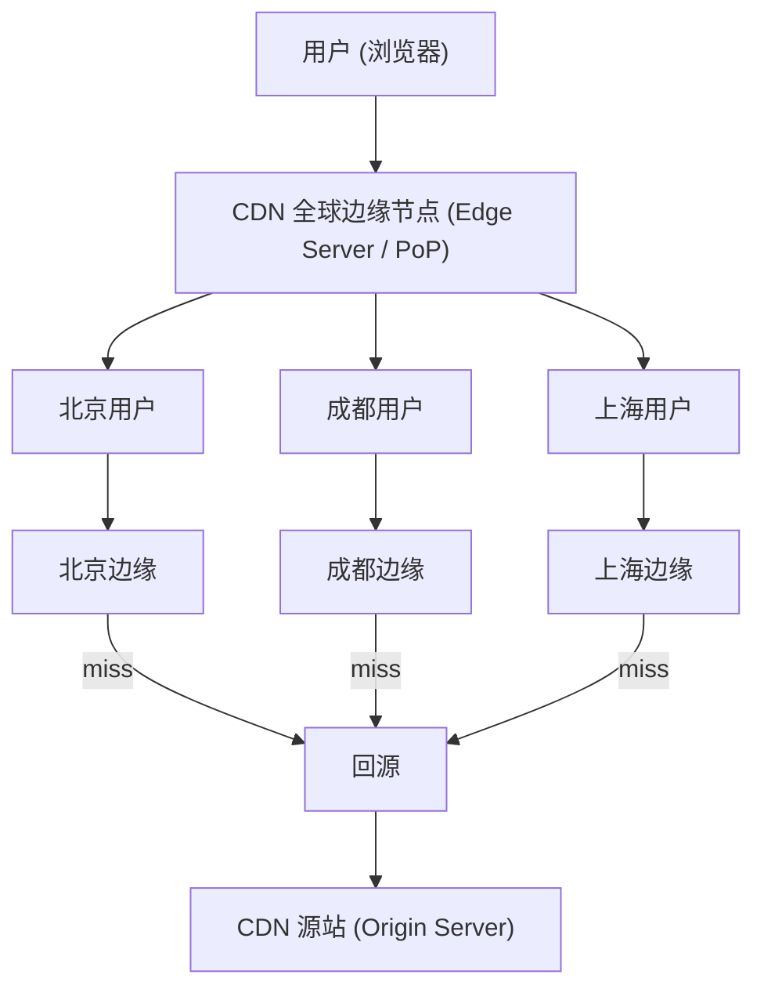

# CDN

## 1. CDN 原理

### 1.1 定义/背景（一句话说清）

CDN（Content Delivery Network）通过在全球部署边缘节点，将内容缓存到离用户最近的物理位置，减少网络延迟、减轻源站压力，同时提供 DDoS 防护、SSL 终止、协议优化等增值服务。

### 1.2 ASCII 原理图

```mermaid
flowchart TB
    N0["CDN 全球架构图"]
    N1["用户 > 浏览器"]
    N2["CDN 全球边缘节点 (Edge / PoP)"]
    N3["北京 PoP"]
    N4["上海 PoP"]
    N5["深圳 PoP"]
    N6["39.9ms"]
    N7["12.1ms"]
    N8["28.5ms"]
    N9["洛杉矶 PoP"]
    N10["法兰克福 PoP"]
    N11["新加坡 PoP"]
    N12["150ms"]
    N13["180ms"]
    N14["45ms"]
    N15["Cache Miss 时，回源"]
    N16["CDN 源站（Origin Server）"]
    N17["真实服务器，存放原始内容"]
    N18["通常放在单个数据中心，不暴露公网 IP"]
    N19["CDN 请求流程（分层缓存）"]
    N20["Step 1: 用户请求 https://example.com/static/"]
    N21["Step 2: DNS 解析 CDN 智能 DNS 返回最近 PoP 的"]
    N22["北京用户 北京 PoP IP"]
    N23["用户本机 DNS: example.com 39.9ms 延迟节点"]
    N24["Step 3: CDN 边缘节点查找缓存"]
    N25["Cache HIT 直接返回 (毫秒级)"]
    N26["Cache MISS 进入 Step 4"]
    N27["Cache EXPIRED 条件请求 (协商)"]
    N28["Cache STALE 回源同时返回旧数据"]
    N29["Step 4: 回源（Cache Miss）"]
    N30["北京 PoP 回源站 example.com:8080"]
    N31["请求原始内容"]
    N32["源站返回 北京 PoP 缓存 返回给用户"]
    N33["Step 5: 缓存更新（可选）"]
    N34["设置 Cache-Control / TTL"]
    N35["缓存键（Cache Key）: URL + Query + Vary"]
    N36["CDN 加速原理（全面分析）"]
    N37["1. 就近访问（地理优化）:"]
    N38["物理距离减少 光速延迟降低 带宽质量提升"]
    N39["公式: 延迟 = 距离 / 光速 ≈ 城市间 5ms/百公里"]
    N40["2. 减少源站压力:"]
    N41["热点资源被边缘节点缓存 源站 QPS 大幅降低"]
    N42["缓存命中率（HIT Rate）= 缓存命中数 / 总请求数"]
    N43["好的 CDN 配置: HIT Rate > 95%"]
    N44["3. 协议优化:"]
    N45["- HTTP/2 多路复用（单个连接并行请求）"]
    N46["- Brotli 压缩（比 gzip 压缩率高 15-25%）"]
    N47["- TLS 终止（边缘节点完成 TLS，源站用 HTTP）"]
    N48["- 连接复用（HTTP/2 Server Push / Early Hints）"]
    N49["4. 边缘计算（Edge Computing）:"]
    N50["Cloudflare Workers / AWS CloudFront Func"]
    N51["在 CDN 节点执行轻量逻辑（鉴权/重写/AB测试）"]
    N52["5. DDoS 防护:"]
    N53["CDN 节点吸收攻击流量 干净流量回源"]
    N54["Anycast 架构：全球同 IP，攻击被分散"]
    N0 --> N1
    N1 --> N2
    N2 --> N3
    N3 --> N4
    N4 --> N5
    N5 --> N6
    N6 --> N7
    N7 --> N8
    N8 --> N9
    N9 --> N10
    N10 --> N11
    N11 --> N12
    N12 --> N13
    N13 --> N14
    N14 --> N15
    N15 --> N16
    N16 --> N17
    N17 --> N18
    N18 --> N19
    N19 --> N20
    N20 --> N21
    N21 --> N22
    N22 --> N23
    N23 --> N24
    N24 --> N25
    N25 --> N26
    N26 --> N27
    N27 --> N28
    N28 --> N29
    N29 --> N30
    N30 --> N31
    N31 --> N32
    N32 --> N33
    N33 --> N34
    N34 --> N35
    N35 --> N36
    N36 --> N37
    N37 --> N38
    N38 --> N39
    N39 --> N40
    N40 --> N41
    N41 --> N42
    N42 --> N43
    N43 --> N44
    N44 --> N45
    N45 --> N46
    N46 --> N47
    N47 --> N48
    N48 --> N49
    N49 --> N50
    N50 --> N51
    N51 --> N52
    N52 --> N53
    N53 --> N54
```



### 1.3 完整代码示例（TS/JS）

```typescript
// ============ CDN 配置最佳实践 ============

// 1. 使用 CDN 友好的 URL 结构
const CDN_BASE = 'https://cdn.example.com';
const ASSET_VERSION = 'v1.2.3'; // 文件指纹版本

function cdnUrl(path: string): string {
  return `${CDN_BASE}/${ASSET_VERSION}${path}`;
}

// 资源 URL 示例
const urls = {
  js: cdnUrl('/static/app.bundle.js'),
  css: cdnUrl('/static/styles.css'),
  img: cdnUrl('/static/logo.png'),
  font: cdnUrl('/static/font.woff2'),
};

console.log(urls);

// 2. 缓存控制最佳实践

// index.html: 不缓存（确保用户总是拿到最新）
// 设置: Cache-Control: no-cache, no-store, must-revalidate
//      Pragma: no-cache
//      Expires: 0

// 静态资源（JS/CSS/图片）: 长期缓存
// 设置: Cache-Control: public, max-age=31536000, immutable
//      ETag: <hash>
// immutable: 告知浏览器，内容永不变（新版本 URL 不同）

// API 响应: 短期缓存或不缓存
// 设置: Cache-Control: private, max-age=0, must-revalidate

// ============ CDN 缓存失效策略 ============

// 方式 1: URL 指纹（最推荐，适合静态资源）
// 每次构建时改变文件名
// index.html 引用: /static/app.a3f5b8.js
// 构建后: /static/app.b7c2d9.js
// 用户访问新 index.html → 引用新文件名 → 不受缓存影响

// 方式 2: CDN 缓存失效 API（适合紧急清除）
async function purgeCDNCache(cdnApiUrl: string, apiToken: string, urls: string[]) {
  const response = await fetch(cdnApiUrl, {
    method: 'POST',
    headers: {
      'Authorization': `Bearer ${apiToken}`,
      'Content-Type': 'application/json',
    },
    body: JSON.stringify({ urls }),
  });
  return response.json();
}

// Cloudflare Cache Purge 示例
// POST https://api.cloudflare.com/client/v4/zones/{zone_id}/purge_cache
// Body: { "files": ["https://example.com/style.css"] }

// 方式 3: 缓存标签（Cache Tags / Surrogate Keys）
// 为相关资源打标签，一次清除多个
// 例如: Tag = "product-page-v2" → 所有相关 CSS/JS/图片 一起失效

// ============ CDN 就近接入（Anycast）理解 ============

// Anycast = 多个节点使用同一个 IP
// 用户请求 → 路由到最近的物理节点（网络层自动选择）
// 优势: 负载分散 + 容灾（一个节点挂，其他节点接管）

// 前端检测 CDN 性能
function measureCDNPerformance() {
  const entries = performance.getEntriesByType('resource') as any[];

  const cdnEntries = entries.filter(e =>
    e.name.includes('cdn.') || e.name.includes('cloudfront') || e.name.includes('jsdelivr')
  );

  cdnEntries.forEach(entry => {
    const dns = (entry.domainLookupEnd - entry.domainLookupStart).toFixed(1);
    const tcp = (entry.connectEnd - entry.connectStart).toFixed(1);
    const ssl = entry.secureConnectionStart
      ? (entry.connectEnd - entry.secureConnectionStart).toFixed(1)
      : 'N/A';
    const ttfb = (entry.responseStart - entry.requestStart).toFixed(1);
    const total = (entry.responseEnd - entry.startTime).toFixed(1);

    console.log(`
      资源: ${entry.name.split('/').pop()}
      DNS:  ${dns}ms | TCP: ${tcp}ms | TLS: ${ssl}ms | TTFB: ${ttfb}ms | 总: ${total}ms
    `);
  });
}

// ============ 前端静态资源 CDN 最佳实践 ============

// 1. 预连接关键 CDN
// <link rel="preconnect" href="https://cdn.example.com" crossorigin>

// 2. 预加载关键资源
// <link rel="preload" href="/static/critical.js" as="script">

// 3. 使用 fetchpriority 优化 LCP
// <link rel="preload" href="/static/hero.jpg" as="image" fetchpriority="high">

// 4. 第三方资源使用 SRI（Subresource Integrity）
// <script src="https://cdn.example.com/lib.js"
//         integrity="sha384-oqVuAfXRKap..."
//         crossorigin="anonymous"></script>
// SRI 确保 CDN 资源不被篡改（即使 HTTPS 也需要，因为 CDN 被黑的风险）

// 5. 图片 CDN（自动优化）
// 真正的图片 CDN（如 Cloudflare Images / imgix / Cloudinary）
// 提供: 自动格式转换（WebP/AVIF）、自动裁剪、自动压缩、CDN 加速
// URL 格式: https://cdn.img.com/img.jpg?w=800&fm=webp&q=80
```

### 1.4 对比表

| CDN 组件 | 说明 | 关键指标 |
|---------|------|--------|
| PoP（Point of Presence）| 边缘节点，缓存内容 | 节点数量 / 地理分布 |
| Origin Shield | 源站保护层，减少回源 | 回源请求数减少 |
| Cache | 内容存储 | HIT Rate / TTL 配置 |
| Anycast | 同一 IP 分散到最近节点 | DDoS 吸收能力 |
| SSL Termination | 边缘完成 TLS | TLS 版本 / 加密套件 |
| Tiered Cache | L1(内存) + L2(SSD) 分层 | 缓存穿透率 |

| 缓存策略 | TTL | 适用场景 |
|---------|-----|---------|
| immutable + 指纹 | 1 年 | JS/CSS/图片（构建产物）|
| 短期缓存 | 几分钟-几小时 | 频繁更新的 API |
| 不缓存 | 0 | 用户相关数据/登录接口 |
| Stale-While-Revalidate | 基准 TTL | 接受轻微陈旧的数据 |

### 1.5 常见陷阱与最佳实践

| 陷阱 | 说明 | 解决方案 |
|------|------|----------|
| 缓存键不包含版本 | 资源更新后旧缓存仍被使用 | URL 指纹（内容哈希）|
| HTML 文件被缓存 | index.html 缓存导致 SPA 路由失效 | HTML 设置 no-cache / 短 TTL |
| 源站 IP 暴露 | 直接暴露源站 IP，可绕过 CDN | 源站仅允许 CDN IP 访问（WAF）|
| CDN 回源频繁 | 缓存命中率低，大量请求打到源站 | 优化 TTL + 预热 + 缓存组策略 |
| 跨域配置不当 | CORS 头未正确传递 | CDN 配置 Access-Control-Allow-Origin |
| CDN HTTPS 证书问题 | 证书过期 / 不匹配 | CDN 自动管理或监控证书有效期 |

### 1.6 面试追问 + 参考答案要点

**Q1：CDN 的缓存命中率（HIT Rate）如何计算？如何优化？**
> HIT Rate = (HIT 数量) / (总请求数量)。影响因素：1. 缓存键设计（URL + Query + Vary 是否合理）。2. TTL 设置（过长→更新慢，过短→HIT低）。3. 预热策略（新内容发布前预热 CDN）。4. 热门资源集中度（尾部资源缓存效益低）。优化方法：分离静态/动态资源、使用指纹版本URL、预热大文件、合理设置 cache-control 和 stale-while-revalidate。

**Q2：CDN 的 Tiered Cache（分层缓存）是什么？为什么需要它？**
> Tiered Cache = L1 缓存（边缘 PoP 的内存/SSD）+ L2 缓存（区域级缓存 / 源站保护层）。传统 CDN：每个 PoP 各自回源 → 源站压力 = PoP 数量 × 回源率。使用 Tiered Cache：PoP Miss → 先查区域 L2 → L2 Miss 才回源。效果：减少源站回源次数，降低带宽成本。Cloudflare 的"Railgun"、AWS CloudFront 的"Origin Shield"都是 Tiered Cache 的实现。

**Q3：前端如何让 CDN 缓存更高效？**
> 1. **内容哈希文件名**：每次构建改变哈希，用户拿到新 URL。2. **分离长缓存和短缓存资源**：JS/CSS/图片用 immutable + 1 年 TTL，HTML 用 no-cache。3. **预连接 + 预加载**：`<link rel="preconnect">` 提前建立 CDN 连接，`<link rel="preload">` 提前加载关键资源。4. **SRI**：确保 CDN 资源完整性。5. **Picture/WebP**：图片 CDN 自动格式转换，减少传输量。

### 1.7 参考来源 URL

- CDN Architecture (Cloudflare): https://www.cloudflare.com/learning/cdn/
- AWS CloudFront: https://docs.aws.amazon.com/AmazonCloudFront/latest/DeveloperGuide/
- HTTP Cache (MDN): https://developer.mozilla.org/en-US/docs/Web/HTTP/Caching
- SRI (Subresource Integrity): https://www.w3.org/TR/SRI/
- Cache-Control (RFC 9111): https://www.rfc-editor.org/rfc/rfc9111

## 2. CDN 原理（速记版）

**CDN 架构图：**



**边缘节点分布：** 北京、成都、上海、深圳等全球节点

### 2.1 CDN 工作流程

| 步骤 | 说明 |
|------|------|
| Step 1 | 用户首次访问：用户 → CDN 边缘节点 (MISS) → CDN 源站 → 返回并缓存 |
| Step 2 | 其他用户访问：用户 → CDN 边缘节点 (HIT) → 直接返回（毫秒级） |
| Step 3 | 缓存过期：用户 → CDN 边缘节点 (EXPIRED) → 协商缓存 → 更新 TTL |

**CDN 加速原理：**
1. 就近访问（地理优化）：物理距离减少 = RTT 降低
2. 减少源站压力：热点资源被边缘节点缓存
3. 协议优化：HTTP/2 多路复用、Brotli 压缩、TLS 终止
4. 边缘计算：Cloudflare Workers / AWS CloudFront Functions

## 应用与行业实践

### 应用场景地图

| 场景 | 用到本页哪个知识点 | 典型技术选型 | 注意事项 |
|---|---|---|---|
| 后台管理的万行表格（筛选 + 分页接口） | 边缘缓存、缓存键设计 | 源站 JSON 接口，边缘按完整查询串生成缓存键 | 带登录态的响应不能进共享缓存，用私有缓存或者绕过 |
| 低端安卓 WebView 的首屏加载 | 静态资源缓存、协议优化 | 内容哈希文件名 + `Cache-Control: max-age=31536000, immutable`，边缘开 Brotli | 入口 HTML 必须走协商缓存，否则拿不到新版本 |
| 多人协作白板（实时笔画同步） | 就近接入、连接复用 | 边缘终止 TLS，WebSocket 回源走长连接 | 实时帧不缓存，边缘空闲超时必须调大 |
| 电商商品详情页（价格随活动变化） | 分层缓存、主动刷新 | 静态壳缓存，价格与库存走独立接口 | 活动开始前主动刷新，过期时间短于价格变更周期 |
| 游戏热更新包分发（单包几百 MB） | Range 请求、回源收敛 | 对象存储 + CDN，开启 Range 回源，固定分片大小 | 版本切换前预热，源站要能承受分片并发 |
| 软件安装包与固件 OTA | 缓存命中率、带宽成本 | 对象存储 + 签名 URL + 预热 | 旧版本路径保留到灰度结束，否则回滚会断链 |
| 直播间的弹幕与房间列表 | 动态加速、就近接入 | 弹幕走独立长连接通道，房间列表走短 TTL 缓存 | 弹幕不缓存；房间列表的过期时间压到秒级 |
| 个人头像与商品缩略图 | 边缘图片处理、缓存键规范化 | 图片参数写进路径，边缘按参数裁剪 | 参数顺序要规范化，同一张图只能对应一个 URL |

### 三个场景拆解

#### 场景 1：后台管理的万行表格

**业务背景**：运营后台的订单列表默认按时间倒序展示，筛选条件多、翻页频繁。同一批筛选条件会被反复打开，源站数据库的压力集中在几个固定的查询组合上。

**怎么用本页知识解决**：把列表接口当成读多写少、可容忍几十秒旧数据的资源，交给边缘缓存。缓存键必须包含全部查询参数，否则筛选条件会串。

```nginx
# 列表接口：按查询串缓存，短 TTL + 后台刷新
location /api/orders {
    proxy_cache my_cache;                               # 启用共享缓存区
    # 缓存键包含全部查询参数，避免不同筛选条件串数据
    proxy_cache_key "$scheme$request_method$host$request_uri";
    add_header Cache-Control "public, max-age=10, stale-while-revalidate=50";
    proxy_cache_valid 200 10s;                          # 只缓存 200 响应，10 秒有效
    proxy_cache_bypass $http_authorization;             # 带登录态时绕过缓存
    proxy_no_cache $http_authorization;                 # 带登录态的响应不写入缓存
    proxy_pass http://origin_backend;
}
```

- `proxy_cache_key` 用 `$request_uri`，把筛选条件、页码、排序都算进键里，A 的查询结果不会返回给 B。
- `max-age=10` 配 `stale-while-revalidate=50`，过期后的请求先拿到旧数据，回源在后台进行，运营不用盯着转圈。
- `proxy_cache_bypass` 与 `proxy_no_cache` 同时挂 `$http_authorization`，带登录态的请求既不读缓存也不写缓存。
- 命中率靠"同一筛选组合被重复打开"堆出来，不是靠单页反复刷新。

**怎么度量收益**：源站 access log 统计该接口的请求条数变化；边缘日志里统计 `$upstream_cache_status` 为 HIT、MISS、EXPIRED 的占比。压测用 `wrk` 或 `ab` 对同一 URL 发 1000 次请求，比对启用缓存前后的源站 QPS。

**什么时候不该用**：

- 订单详情要展示实时状态（已发货、已签收），缓存 10 秒会让客服看到旧状态。
- 导出报表这类写操作，缓存命中率接近 0，只多出一层转发。
- 行级权限控制的接口，每个用户可见的行不同，共享缓存会泄露数据。

#### 场景 2：低端安卓 WebView 的首屏加载

**业务背景**：App 内嵌 WebView 打开活动页，机型内存小、CPU 弱，脚本解析和样式计算的耗时占比高。用户第二次打开同一活动页时，如果资源还要走网络，白屏时间会重现。

**怎么用本页知识解决**：把资源名和内容绑定，内容不变则 URL 不变，边缘可以长期缓存。入口 HTML 单独设成协商缓存，保证能拿到新的资源引用。

```bash
# 1. 构建产物按内容哈希命名：内容不变，文件名不变
for f in dist/*.js dist/*.css; do
  hash=$(sha256sum "$f" | cut -c1-8)   # 取内容摘要前 8 位作为版本号
  mv "$f" "${f%.*}.$hash.${f##*.}"     # app.js 变成 app.3f2a1b9c.js
done

# 2. 入口 HTML 不缓存，每次协商校验
#    location = /index.html { add_header Cache-Control "no-cache"; }

# 3. 带哈希的静态资源长期缓存
#    location ~* \.[0-9a-f]{8}\.(js|css)$ {
#        add_header Cache-Control "public, max-age=31536000, immutable"; }

# 4. 上线后核对响应头，确认边缘没有改写
curl -sI https://static.example.com/app.3f2a1b9c.js | grep -i "cache-control\|age\|x-cache"
```

- 文件名带内容哈希后，边缘可以把过期时间设成一年，用户第二次打开直接读本地缓存。
- 入口 HTML 用 `no-cache`，浏览器带 `If-None-Match` 回源校验，源站返回 304 时只有头部开销。
- `immutable` 告诉浏览器在有效期内不发校验请求，省掉一次往返。
- 用 `curl -sI` 检查响应头，确认 CDN 没有把 `Cache-Control` 改写掉。

**怎么度量收益**：Chrome DevTools 的 Network 面板看 Size 列是否显示 disk cache，看 transferSize 的取值；Lighthouse 在移动端节流模式下记录 FCP 与 LCP；App 内对 WebView 的 `onPageStarted` 到 `onPageFinished` 打点，统计 p50 与 p95。

**什么时候不该用**：

- 需要立即生效的活动横幅图片：改内容不改 URL，用户会长期看到旧图，这类资源用短 `max-age`。
- 带用户身份的内嵌页面 HTML，缓存到边缘会串号，必须用 `private` 或者不缓存。

#### 场景 3：多人协作白板

**业务背景**：白板房间的人数从 2 人到几十人不等，笔画增量通过长连接广播。跨地域用户直连单机房时，落笔到他人看到的时间差里，网络往返占主要部分。

**怎么用本页知识解决**：让用户就近接入边缘节点，边缘完成 TLS 握手，长连接回源。实时帧不做缓存，边缘只负责转发。

```nginx
# 白板实时通道：就近接入，回源走长连接
location /realtime {
    proxy_pass http://origin_realtime;
    proxy_http_version 1.1;                    # WebSocket 握手需要 HTTP/1.1
    proxy_set_header Upgrade $http_upgrade;    # 透传 Upgrade 头
    proxy_set_header Connection "upgrade";     # 触发协议切换
    proxy_read_timeout 3600s;                  # 调大空闲超时，避免画笔停顿掉线
    proxy_send_timeout 3600s;
    proxy_buffering off;                       # 实时帧收到就转发，不攒缓冲区
    proxy_no_cache 1;                          # 明确不读缓存
    proxy_cache_bypass 1;                      # 明确不写缓存
}
```

- `proxy_http_version 1.1` 与 `Upgrade`、`Connection` 两个头是握手的必要条件，缺一个就退化成轮询。
- 两个 timeout 调大，用户长时间不动笔时连接不会被边缘断开。
- `proxy_buffering off` 让实时帧到达即转发，不为攒缓冲区引入等待。
- `proxy_no_cache` 与 `proxy_cache_bypass` 关闭这条路径的缓存，避免误配。

**怎么度量收益**：应用层在本地落笔时记时间戳，收到服务端广播回执时再记一次，统计 p50 与 p95；连接建立耗时用 `performance.now()` 在 `WebSocket.onopen` 里减去发起时间。边缘到源站的往返用 `ping` 或 `mtr` 与直连结果对比。

**什么时候不该用**：

- 房间内用户集中在同一个城市、离源站只有一跳网络时，就近接入省下的延迟有限。
- 需要服务端严格顺序处理并落库的提交操作，链路层不要做任何改写或者重试。

### 行业先进实践

**stale-while-revalidate 与 stale-if-error（出处：RFC 5861 / MDN HTTP 缓存文档）**
这两个是 `Cache-Control` 的扩展指令：前者允许过期后先返回旧内容再后台回源，后者允许回源失败时继续用旧内容。它们把"过期"和"不可用"分开处理，用户不会因为回源慢或者源站抖动而等待或者看到错误页。可以在列表接口和图片资源上先加这两个指令，观察边缘 EXPIRED 与 HIT 占比的变化。

**内容哈希文件名 + immutable（出处：web.dev 的 HTTP 缓存文档）**
把内容摘要写进文件名，内容变则 URL 变，于是 `max-age` 可以设成一年并加 `immutable`。浏览器在有效期内不发校验请求，边缘缓存也不会因为内容更新而失效。借鉴方式是在构建流程里加一步改名，入口 HTML 单独走协商缓存。

**Origin Shield 收敛回源（出处：AWS CloudFront 开发者指南）**
在边缘节点和源站之间加一层中间缓存，多个边缘节点的回源请求先汇聚到这一层。源站并发连接数与中间层数量相关，不再与边缘节点数量相关。自建时可以回源路径上放一层 Nginx 缓存，用相同的 `proxy_cache_key` 复用缓存对象。

**边缘终止 TLS 并开启 OCSP Stapling（出处：Nginx 官方文档 / Cloudflare 官方文档）**
由边缘节点完成 TLS 握手，并把证书状态响应随握手一起下发，客户端不必单独访问 CA 的 OCSP 服务。握手往返减少一次，源站不再承担加解密开销。Nginx 侧对应 `ssl_stapling` 与 `ssl_stapling_verify`，开启前先确认证书链完整。

**Netflix Open Connect（出处：Netflix Open Connect 官方页面）**
把缓存设备部署到 ISP 机房内部，热门内容从离用户一跳以内的位置发出。这类做法适合流量集中、可提前预判的分发任务，代价是需要与网络运营商合作。自建分发时可以先在自有 IDC 或者云厂商的同城可用区放一层缓存，验证回源收敛效果，需核对官方文档：Open Connect 的设备部署方式与适用条件。

### 从学到用：落地路线

1. **试点选点**：挑一条纯静态、读多写少、更新可容忍分钟级延迟的资源路径，例如构建产物里的 app.js 或者商品列表接口。验收标准：该路径响应头出现约定的 `Cache-Control`，源站日志里该路径的请求条数下降。
2. **验证**：用 `curl -sI` 连续请求同一 URL，比对 `Age` 与边缘命中标识头；用 Lighthouse 在移动端节流模式下记录 FCP 与 LCP，同一设备同一网络重复 3 次。验收标准：3 次测量结果落在同一区间，命中次数与配置预期一致。
3. **推广**：按资源类型分批推进，顺序是纯静态资源、短 TTL 列表接口、实时通道单独配置。验收标准：每批上线后都有回源 QPS 与命中率的记录，并且保留一个能立即切回原策略的配置开关。
4. **防止回退**：把缓存头检查写进 CI，对构建产物和入口 HTML 做断言；线上定时抽查 URL 的响应头。验收标准：CI 在缓存头不符合约定时直接失败，抽查结果与约定一致。

### 动手作业

**目标**：给一个三文件静态站点接上 CDN，让重复访问不再回源，并用可复现的测量证明。

**步骤**：

1. 准备站点：`index.html` 引用 `app.js` 与 `style.css`，部署到一台源站服务器或者对象存储。
2. 测基线：关闭 CDN，在 Chrome DevTools 的 Network 面板里取消勾选 Disable cache，连续访问两次，记录两次的 transferSize 与总耗时。
3. 设缓存头：`index.html` 返回 `Cache-Control: no-cache`，`app.js` 与 `style.css` 返回 `Cache-Control: public, max-age=31536000, immutable`。
4. 加哈希：构建步骤里用 `sha256sum` 取内容摘要前 8 位写进文件名，同步更新 `index.html` 的引用。
5. 接 CDN：把源站配置成 CDN 的回源地址，开启 HTTPS 与 Brotli。
6. 验命中：用 `curl -sI` 连续请求同一资源 3 次，记录 `Age`、`Cache-Control` 和边缘的命中标识头。
7. 验更新：修改 `app.js` 内容后重新构建发布，确认 `index.html` 引用的是新文件名，旧文件名按策略返回 404 或者保留。

**验收标准**：

- 第二次访问 `app.js` 时，DevTools 的 Size 列显示磁盘缓存，transferSize 为 0。
- `curl -sI` 的 3 次结果中 `Age` 递增，命中标识头指示缓存命中。
- `index.html` 的响应头包含 `no-cache`，不包含 `max-age=31536000`。
- 源站访问日志中，同一资源的请求条数在第一次访问后不再增加。
- 重新构建后，`index.html` 里写的资源名与磁盘上的文件名完全一致。

