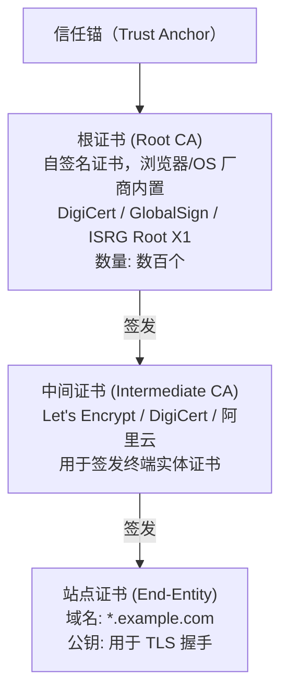
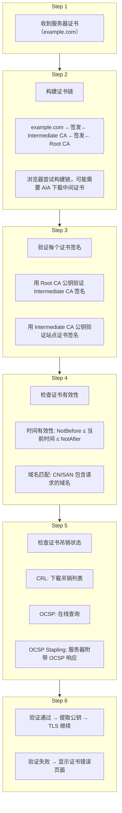
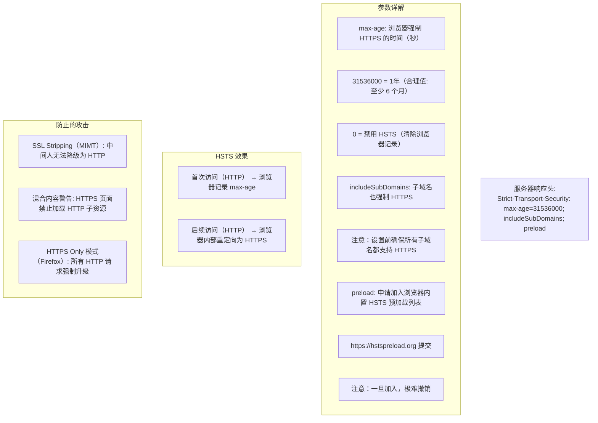

# CA 证书链与 HSTS

## 1. CA 证书链与 HSTS

### 1.1 定义/背景（一句话说清）

CA 证书链是由根证书（浏览器内置）、中间证书（CA 签发）和站点证书（域名持有者申请）组成的三级信任链，通过数字签名逐级验证确保服务器公钥的真实性；HSTS（HTTP Strict Transport Security）强制浏览器在指定时间内仅通过 HTTPS 访问站点，防止协议降级攻击。

### 1.2 ASCII 原理图







### 1.3 完整代码示例（TS/JS）

```typescript
// ============ 证书链验证在前端的应用 ============

// 前端 HTTPS 是浏览器自动处理的，无法干预证书验证
// 但可以通过 fetch 错误推断问题

async function testHTTPSConnection() {
  try {
    const response = await fetch('https://example.com/api');
    console.log('HTTPS 连接成功，状态码:', response.status);
  } catch (error: any) {
    if (error.cause?.code === 'ERR_CERT_AUTHORITY_INVALID') {
      console.error('证书链不完整：中间证书缺失或不受信任');
    } else if (error.cause?.code === 'ERR_CERT_COMMON_NAME_INVALID') {
      console.error('域名不匹配：CN/SAN 不包含请求的域名');
    } else if (error.cause?.code === 'ERR_CERT_DATE_INVALID') {
      console.error('证书过期或未生效');
    } else if (error.cause?.code === 'ERR_CERT_REVOKED') {
      console.error('证书已被吊销');
    } else {
      console.error('其他 TLS 错误:', error.cause?.code);
    }
  }
}

// ============ HSTS 在前端的影响 ============

// HSTS 影响：HTTP 请求被浏览器自动重写为 HTTPS
// 前端代码中无需特殊处理

// 但需要注意：
// 1. 开发环境 HTTP → 生产环境 HTTPS → HSTS 首次访问后生效
//    本地开发用 HTTP 调试，生产环境用 HTTPS
// 2. Mixed Content 问题
//    HSTS 页面加载 HTTP 子资源 → 浏览器阻止并报错
//    需要将所有资源 URL 改为 HTTPS

// ============ Node.js 证书验证（深度理解）============

import https from 'https';
import tls from 'crypto';

function verifyCertificateChain(cert: tls.PeerCertificate) {
  // cert.subject: 证书主体信息
  // cert.issuer: 签发者信息
  // cert.valid_from / cert.valid_to: 有效期
  // cert.fingerprint256: 证书指纹

  const now = new Date();
  const validFrom = new Date(cert.valid_from);
  const validTo = new Date(cert.valid_to);

  const isValidTime = now >= validFrom && now <= validTo;
  const isSelfSigned = cert.subject === cert.issuer;

  console.log(`
    证书主体: ${cert.subject.CN || cert.subject.O}
    签发者:   ${cert.issuer.CN || cert.issuer.O}
    有效期:   ${validFrom.toISOString()} ~ ${validTo.toISOString()}
    剩余天数: ${Math.floor((validTo.getTime() - now.getTime()) / 86400000)}
    自签名:   ${isSelfSigned}
    指纹:     ${cert.fingerprint256}
  `);

  // 检测证书即将过期（提前 30 天预警）
  if ((validTo.getTime() - now.getTime()) < 30 * 86400000) {
    console.warn('证书将在 30 天内过期，请及时续期！');
  }

  return isValidTime && !isSelfSigned;
}

// ============ 获取证书链信息（Node.js）============

function inspectCertificateChain(socket: tls.TLSSocket) {
  const certChain = socket.getPeerCertificate(true); // true = 包含完整链
  const cert = typeof certChain === 'object' && !Array.isArray(certChain)
    ? certChain
    : { subject: certChain, issuer: certChain, valid_from: '', valid_to: '' };

  console.log('证书链长度:', Array.isArray(certChain) ? certChain.length : 1);
  console.log('证书详情:', JSON.stringify(cert, null, 2));
}

// ============ OCSP Stapling 理解 ============

// OCSP Stapling = 服务器主动获取 OCSP 响应，附加在 TLS 握手中
// 浏览器不需要额外查询 CA 的 OCSP 服务器（减少延迟 + 保护隐私）

// nginx 配置 OCSP Stapling
const nginxConfig = `
# 启用 OCSP Stapling
ssl_stapling on;
ssl_stapling_verify on;
resolver 8.8.8.8 8.8.4.4 valid=300s;
resolver_timeout 5s;

# 指定中间证书（用于验证 OCSP 响应）
ssl_trusted_certificate /path/to/ca-bundle.crt;
`;

// ============ CSP + HSTS 完整安全配置 ============

// HTTP 安全头完整配置（nginx / express）
const securityHeaders = {
  // HSTS
  'Strict-Transport-Security': 'max-age=31536000; includeSubDomains; preload',
  // CSP
  'Content-Security-Policy': "default-src 'self'; script-src 'self' 'nonce-{random}'; object-src 'none'",
  // X-Frame-Options
  'X-Frame-Options': 'DENY',
  // X-Content-Type-Options
  'X-Content-Type-Options': 'nosniff',
  // Referrer-Policy
  'Referrer-Policy': 'strict-origin-when-cross-origin',
  // Permissions-Policy
  'Permissions-Policy': 'geolocation=(), microphone=(), camera=()',
};
```

### 1.4 对比表

| 维度 | 自签名证书 | 商业 CA 证书 | Let's Encrypt |
|------|:---------:|:------------:|:-------------:|
| 信任方式 | 手动导入 | 浏览器内置根 CA | 浏览器内置根 CA |
| 有效期 | 自定义 | 1-3 年 | 90 天（自动续期）|
| 价格 | 免费 | $10-$1000/年 | 免费 |
| 验证级别 | 域名验证（DV）| DV/OV/EV | DV |
| 适用场景 | 内网/开发 | 商业网站 | 公开网站 |
| 自动化 | 难 | 部分支持 | 高度自动化（ACME）|

| HSTS 参数 | 含义 | 建议值 |
|----------|------|-------|
| max-age=0 | 禁用 HSTS（清除记录）| 测试用 |
| max-age=300 | 5 分钟 | 不推荐 |
| max-age=31536000 | 1 年 | 初次启用 |
| max-age=63072000 | 2 年 | 推荐（长期稳定）|
| includeSubDomains | 包含子域名 | 注意：确认所有子域支持 HTTPS |
| preload | 加入浏览器预加载列表 | 注意：几乎不可逆 |

### 1.5 常见陷阱与最佳实践

| 陷阱 | 说明 | 解决方案 |
|------|------|----------|
| 证书链不完整 | 服务器只发送站点证书，不含中间证书 | 使用完整证书链（站点+中间 CA）|
| 中间证书配置错误 | 多级中间 CA 未按顺序拼接 | 证书链顺序：站点证书 → 中间 CA → ... → 根 CA |
| 证书过期未发现 | 监控缺失导致生产事故 | 用 cert-manager (K8s) / acme.sh 自动续期 + 监控 |
| HSTS includeSubDomains 误开 | 未确认所有子域支持 HTTPS | 先不开启，确认后再加 |
| HSTS preload 随意提交 | 一旦提交几乎无法撤回 | 确认所有子域支持 HTTPS 且长期稳定后提交 |
| Mixed Content | HTTPS 页面加载 HTTP 资源 | 将所有资源 URL 改为 HTTPS 或协议相对路径 |

### 1.6 面试追问 + 参考答案要点

**Q1：为什么需要中间 CA？根 CA 为什么不能直接签发站点证书？**
> 根 CA 是整个信任体系的基石，数量极少（数百个），一旦根 CA 私钥泄露，整个 PKI 体系崩溃。用中间 CA 做隔离：中间 CA 由根 CA 签发，私钥泄露后只需吊销中间 CA，不影响根 CA。同时中间 CA 可以按业务/地域划分授权。Let's Encrypt 的模式：根 CA（G3）→ ISRG Root X1 → R3（中间 CA）→ 站点证书，多了一层实现灵活授权。

**Q2：浏览器如何知道某个中间 CA 的证书？**
> 两种方式：1. **服务器发送**：服务器在 TLS 握手时发送完整证书链（站点证书 + 中间证书），浏览器自动拼接。这是最佳方式。2. **AIA 下载**：证书中有 Authority Information Access 字段，包含中间 CA 的下载地址，浏览器可以自动下载并补全链。生产环境中服务器应配置发送完整证书链，避免浏览器额外查询（影响性能）。

**Q3：HSTS 和 HTTPS Only 模式有什么区别？**
> HSTS（Strict-Transport-Security）是响应头，告知浏览器在 max-age 时间内强制使用 HTTPS，首次访问仍需 HTTP。HTTPS Only Mode（Firefox 121+）是浏览器设置，强制所有 HTTP 请求重定向为 HTTPS，不需要服务器配置，但需要用户主动开启（about:preferences#privacy）。Preload List 则是 HSTS 的强化版——内置在浏览器二进制中，连首次 HTTP 请求都不需要。

### 1.7 参考来源 URL

- RFC 5280 (PKI / X.509): https://www.rfc-editor.org/rfc/rfc5280
- RFC 6960 (OCSP): https://www.rfc-editor.org/rfc/rfc6960
- HSTS Specification: https://www.rfc-editor.org/rfc/rfc6797
- HSTS Preload List: https://hstspreload.org
- Mozilla SSL Configuration Generator: https://ssl-config.mozilla.org/

## 2. CA 证书链与 HSTS（速记版）

### 2.1 证书链验证

**证书链结构：**

| 证书类型 | 说明 |
|---------|------|
| 根证书 (Root CA) | 自签名，浏览器内置 |
| 中间证书 (Intermediate CA) | 由根证书签发 |
| 站点证书 (End-entity) | 域名持有者申请，由中间证书签发 |

**浏览器验证流程：**
1. 收到服务器证书
2. 查找中间证书（AIA 字段下载）
3. 验证每个证书的签名链
4. 检查 CRL/OCSP 吊销状态
5. 验证域名匹配、时间有效性

```http
# HSTS (HTTP Strict Transport Security)
Strict-Transport-Security: max-age=31536000; includeSubDomains; preload

参数:
  max-age: 浏览器强制使用 HTTPS 的时间（秒）
  includeSubDomains: 子域名也强制 HTTPS
  preload: 申请加入浏览器内置 HSTS 预加载列表
```

## 应用与行业实践

### 应用场景地图

| 场景 | 用到本页哪个知识点 | 典型技术选型 | 注意事项 |
| --- | --- | --- | --- |
| 后台管理的万行表格页首次上 HTTPS | 三级链、站点证书 SAN | Nginx 加商业 CA 证书 | 必须下发中间证书，否则旧安卓与 Java 客户端握手失败 |
| 低端安卓机的电商首屏加载 | 根证书内置、链完整性 | CDN 回源加源站双证书 | CDN 与源站各自配链，两边都要单独验 |
| 多人协作白板的长连接 | 站点证书校验时机 | wss 加 Node tls | 证书轮换只影响新建连，旧连不断开 |
| 小程序内嵌 H5 支付页 | 中间证书与系统根库 | 平台 WebView 加自建网关 | WebView 用系统根库，只测桌面 Chrome 会漏问题 |
| 多租户 SaaS 的租户子域 | HSTS includeSubDomains | ACME 加通配证书 | 子域没证书时开 includeSubDomains 会导致整站不可访问 |
| 灰度机房切新证书 | 链顺序、AIA 补链 | openssl s_client 探针 | 先验链顺序，再放量 |
| 固件 OTA 下载服务 | 根证书内置、有效期 | 嵌入式 TLS 库 | 设备根库难升级，避免 90 天短周期证书 |
| API 网关的客户端认证 | 逐级签名验证 | mTLS | 客户端证书校验要配完整信任库，只验站点证书不够 |

### 三个场景拆解

#### 场景 1：低端安卓机的首屏加载

**业务背景**：移动端 H5 首屏在部分低端安卓机上白屏，同一 URL 在桌面浏览器正常。用真机加抓包工具复现，失败集中在系统根库版本偏旧的机型。

**怎么用本页知识解决**：先怀疑服务端只下发了站点证书。客户端拿不到中间证书，就无法从站点证书走到内置根，握手在验证环节中断。把中间证书补齐后，同一机型即可建连。

```bash
# 1) 抓取服务端下发的完整证书链，SNI 必须与服务端配置一致
openssl s_client -connect h5.example.com:443 -servername h5.example.com \
  -showcerts </dev/null > chain.txt 2>&1

# 2) 数证书张数：站点证书加中间证书，只下发站点证书时这里为 1
grep -c "BEGIN CERTIFICATE" chain.txt

# 3) 用系统根库校验，看服务端下发的链能否走到根
openssl s_client -connect h5.example.com:443 -servername h5.example.com \
  -CAfile /etc/ssl/certs/ca-certificates.crt </dev/null 2>&1 \
  | grep "Verify return code"   # 期望 0 (ok)，非 0 说明链断或证书过期

# 4) 打开 -verify_return_error，让校验证书失败时握手直接中断
openssl s_client -connect h5.example.com:443 -servername h5.example.com \
  -verify_return_error -verify 3 </dev/null 2>&1 | tail -5
```

- 张数为 1 说明缺中间证书，这是旧客户端失败的第一嫌疑点。
- `-servername` 不写会拿到默认站点证书，验出的结论与目标域名无关。
- `Verify return code` 非 0 时，用 `openssl x509 -noout -dates` 区分过期与断链。
- 修好后 CDN 与源站各测一次，两处证书链经常不一致。

**怎么度量收益**：指标是 TLS 握手失败率与首屏白屏率。测量方法为入口网关的 TLS 握手错误计数，加客户端上报的握手失败日志，按 UA 分桶对比修复前后同长度窗口。

**什么时候不该用**：
- 纯内网且已下发自签根证书的服务，不必再买商业证书，改根库分发流程的风险更高。
- 客户端根库固化在固件里且无法升级时，应先改证书有效期或换 CA，不能改客户端校验逻辑。
- 不要用关闭校验的客户端去证明问题已修复，那样测不出链是否完整。

#### 场景 2：多租户 SaaS 的租户子域

**业务背景**：SaaS 用 `tenant.example.com` 承载每个租户，登录页带会话 Cookie。开启 `includeSubDomains` 后，任何一个未配证书的子域都会被浏览器直接拦截。

**怎么用本页知识解决**：思路是先盘清子域清单，逐个子域确认能完成 TLS 握手，再加 `includeSubDomains`，最后才考虑提交预加载列表。顺序颠倒会把一个子域的疏漏放大成全站不可访问。

```bash
# 1) 逐个租户子域检查 HTTPS 是否下发 HSTS 头
for h in www.example.com login.example.com static.example.com; do
  printf '%s ' "$h"
  curl -sI "https://$h/" | grep -i "^strict-transport-security" || echo "缺失"
done   # 缺头先查证书，没证书的子域不要进 includeSubDomains

# 2) 检查 HTTP 入口是否 301 到 HTTPS
curl -sI http://login.example.com/ | head -3   # 期望 301，Location 指向 https

# 3) 检查每个子域证书是否覆盖该名字
for h in www.example.com login.example.com static.example.com; do
  echo | openssl s_client -connect "$h:443" -servername "$h" 2>/dev/null \
    | openssl x509 -noout -subject -ext subjectAltName
done
```

- HSTS 头只写在 HTTPS 响应上，写在 HTTP 响应上浏览器会忽略。
- `includeSubDomains` 要求每个子域都能握手，先跑完上面循环再开。
- 预加载列表的移除要等浏览器版本更新，测试域名不要提交。
- 用 `chrome://net-internals/#hsts` 可以查询域名是否已进入本地 HSTS 集合。

**怎么度量收益**：指标是 HSTS 头覆盖率、HTTP 入口 301 命中数、子域证书覆盖检查通过率。测量方法为 curl 批量脚本定时跑，加浏览器 HSTS 查询页人工抽检。

**什么时候不该用**：
- 还有子域跑只监听 80 端口的旧系统时，不要开 `includeSubDomains`。
- 域名正在做 HTTP 与 HTTPS 双跑对拍时，不要提交预加载，提交后对拍入口不可访问。
- 子域由不同团队各自运维且无法统一盘点时，先不开 `includeSubDomains`。

#### 场景 3：灰度切证书时用探针提前暴露断链

**业务背景**：证书轮换窗口内一次性替换全部入口，出问题只能靠回滚。入口越多、客户端种类越杂，回滚判断越慢。

**怎么用本页知识解决**：先在灰度入口替换证书，用一个按域名遍历的探针脚本逐级打印证书链。探针在正式放量前跑一遍，把断链和过期暴露在灰度阶段。

```js
const tls = require('tls');                              // Node 内置模块，无第三方依赖
const targets = ['gray.example.com', 'www.example.com']; // 灰度入口与正式入口
targets.forEach((host) => {
  const socket = tls.connect({
    host,
    port: 443,
    servername: host,        // SNI 为空时服务端可能返回默认证书
    rejectUnauthorized: true // 探针必须开启校验，关掉就测不出断链
  }, () => {
    let cert = socket.getPeerCertificate(true); // true 表示带上签发者指针
    const chain = [];
    while (cert && Object.keys(cert).length) {
      chain.push(cert.subject.CN + ' 有效期至 ' + cert.valid_to); // 逐级打印找断点
      cert = cert.issuerCertificate === cert ? null : cert.issuerCertificate; // 自签根终止
    }
    console.log(host, chain);
    socket.end();
  });
  socket.on('error', (e) => console.log(host, '握手失败', e.code)); // 失败即断链或过期
});
```

- `servername` 传域名而不是 IP，否则 SNI 缺失，验的是默认证书。
- `rejectUnauthorized` 保持 true，探针才等价于浏览器与客户端的校验路径。
- 循环沿 `issuerCertificate` 向上走，链断在第几级会直接打印出来。
- 灰度入口与正式入口同时跑，两组结果做对照。

**怎么度量收益**：指标是灰度组与正式组的握手失败率差值、探针失败条目数、证书剩余有效天数。测量方法为探针脚本定时执行，加 `openssl x509 -noout -enddate` 的到期告警。

**什么时候不该用**：
- 探针脚本不要用 `rejectUnauthorized: false`，那样任何证书都能通过。
- 不要为了测试把生产域名解析指向预发环境，真实用户会命中测试证书。
- 客户端是固定根库的嵌入式设备时，探针要换成实机，通用脚本结论不适用。

### 行业先进实践

**HSTS 预加载列表（出处：Chromium 项目 hstspreload.org 站点）**
把主域名提交进浏览器内置列表，首次访问直接走 HTTPS，不依赖第一次响应头。有效的原因是省掉明文首跳，中间人无法在首跳剥离 HSTS 头。项目借鉴时先确认所有子域都能握手，再提交 `includeSubDomains`。

**ACME 自动签发与续期（出处：Let's Encrypt 官方文档 / RFC 8555）**
证书有效期缩短后，靠人工续期必然漏签，ACME 把签发、域名验证与续期做成协议接口。客户端按固定周期自动重签并重载服务。项目可把续期放进部署流水线，续期后立刻跑链完整性检查。

**CAA 记录约束签发者（出处：RFC 8659）**
CAA 记录声明哪些 CA 可以为该域名签发证书，CA 在签发前须查询该记录。它把误签发挡在签发环节，而不是等出事后再吊销。项目在域名 DNS 里加 issue 记录，只放行正在使用的 CA。

**服务器端 TLS 在线评测（出处：Qualys SSL Labs 的 SSL Server Test）**
评测检查链是否完整、协议与套件是否过时、能否被目标客户端握手成功。它给出可复查的报告，适合在证书轮换前后各跑一次留档。项目把评测结论写进上线检查单，而不是只看本机 curl 是否通。

**不使用已废弃的 HPKP（出处：需核对官方文档：Chromium 项目移除 HPKP 支持的版本说明）**
HPKP 用公钥固定防中间人，但配置失误会让域名长时间不可访问，主流浏览器已移除支持。核对官方文档时确认移除的版本号与替代建议。项目改用证书透明度日志与 CAA 做监控，不要自己实现固定逻辑。

### 从学到用：落地路线

1. **试点**：在一个测试子域接入完整证书链，HSTS 的 `max-age` 先设 300。验收标准是 `openssl verify` 返回 0，且 HTTPS 响应头里能看到 `max-age=300`。
2. **验证**：用真机矩阵与探针脚本按域名遍历证书链。验收标准是旧安卓真机与 `openssl s_client` 都能建连，握手失败条目为 0。
3. **推广**：`max-age` 逐步提到一年，确认全部子域可握手后再加 `includeSubDomains`，最后评估预加载。验收标准是子域证书覆盖检查全部通过，HTTP 入口 301 命中率为 100%。
4. **防回退**：把到期天数与链完整性检查写进流水线，配到期告警。验收标准是剩余天数低于阈值或链不完整时 CI 失败，续期后自动重载并复跑检查。

### 动手作业

**目标**：给一个自建域名打通"完整证书链加 HSTS"，并留下可复现的验证脚本。

**步骤**
1. 准备一台服务器和一个域名，用 ACME 客户端申请证书，或使用测试 CA 签发。
2. 配置 Web 服务器同时下发站点证书与中间证书。
3. 在 HTTPS 响应里加 `Strict-Transport-Security`，`max-age` 先设 300，只加在 HTTPS 响应上。
4. 给 80 端口加入 301 跳转，`Location` 指向 https 地址。
5. 写脚本用 `openssl s_client -showcerts` 统计证书张数并打印 `Verify return code`。
6. 写脚本用 `curl -sI` 检查 HSTS 头是否存在、HTTP 入口是否返回 301。
7. 用两种以上客户端访问，记录失败情况与错误码。

**验收标准**
- `grep -c "BEGIN CERTIFICATE"` 的结果为 2 或以上。
- `Verify return code` 为 0 (ok)。
- `curl -sI https://域名` 的输出包含 `strict-transport-security`。
- `curl -sI http://域名` 返回 301，且 `Location` 指向 https。
- 把 `max-age` 改成一年后重跑上述检查，结果仍全部通过。

