# 速查卡与参考来源

## 1. 面试速查卡

```mermaid
flowchart TB
    N0["网络协议速查要点"]
    N1["HTTP 各版本"]
    N2["HTTP/1.1 队头阻塞 HTTP/2 多路复用 HTTP/3 QUI"]
    N3["HTTP 无状态"]
    N4["Cookie/Session/Token 在应用层实现"]
    N5["QUIC"]
    N6["UDP + 用户态可靠传输 = 低延迟 + 无 TCP 队头阻塞"]
    N7["TCP vs UDP"]
    N8["TCP 可靠有序，UDP 快但不可靠，QUIC 兼两者优点"]
    N9["拥塞控制"]
    N10["慢启动 拥塞避免 快速重传 快速恢复"]
    N11["SYN Flood"]
    N12["半开连接耗尽资源，SYN Cookies 不用 TCB"]
    N13["三次握手"]
    N14["同步 ISN + 防止历史连接"]
    N15["四次挥手"]
    N16["全双工两个方向单独关闭 + TIME_WAIT 2MSL"]
    N17["TLS 1.2 vs 1.3"]
    N18["1.3: 1-RTT / 0-RTT，移除 RSA，PFS 默认"]
    N19["CA 证书链"]
    N20["根 CA 中间 CA 站点证书，逐级签名验证"]
    N21["DNS"]
    N22["UDP 53 查询（快），TCP（大响应/区域传输）"]
    N23["DNS 污染防御"]
    N24["DNSSEC（签名）+ DoH/DoT（加密）"]
    N25["CDN"]
    N26["就近访问 + 缓存 + 协议优化 + DDoS 防护"]
    N27["WebSocket"]
    N28["HTTP Upgrade 全双工 TCP 帧交换"]
    N29["SSE"]
    N30["HTTP 单向服务端推送，EventSource + Last-Event-ID"]
    N31["REST vs GraphQL"]
    N32["REST: 多端点固定返回，GraphQL: 单端点精确获取"]
    N33["状态码"]
    N34["2xx 成功 3xx 重定向 4xx 客户端错 5xx 服务端错"]
    N35["重定向"]
    N36["永久: 308(推荐)/301，临时: 307(推荐)/302，POST:303"]
    N37["幂等性"]
    N38["GET/PUT/DELETE 幂等，POST/PATCH 非幂等"]
    N39["OAuth2"]
    N40["Auth Code + PKCE 最安全，JWT 无状态但难撤销"]
    N41["CORS"]
    N42["简单请求直接发，复杂请求先预检（OPTIONS）"]
    N43["nginx"]
    N44["反向代理隐藏源站 + 负载均衡 + 静态资源服务"]
    N0 --> N1
    N1 --> N2
    N2 --> N3
    N3 --> N4
    N4 --> N5
    N5 --> N6
    N6 --> N7
    N7 --> N8
    N8 --> N9
    N9 --> N10
    N10 --> N11
    N11 --> N12
    N12 --> N13
    N13 --> N14
    N14 --> N15
    N15 --> N16
    N16 --> N17
    N17 --> N18
    N18 --> N19
    N19 --> N20
    N20 --> N21
    N21 --> N22
    N22 --> N23
    N23 --> N24
    N24 --> N25
    N25 --> N26
    N26 --> N27
    N27 --> N28
    N28 --> N29
    N29 --> N30
    N30 --> N31
    N31 --> N32
    N32 --> N33
    N33 --> N34
    N34 --> N35
    N35 --> N36
    N36 --> N37
    N37 --> N38
    N38 --> N39
    N39 --> N40
    N40 --> N41
    N41 --> N42
    N42 --> N43
    N43 --> N44
```

## 2. 参考来源总汇

1. RFC 9110 (HTTP Semantics): https://www.rfc-editor.org/rfc/rfc9110
2. RFC 9113 (HTTP/2): https://www.rfc-editor.org/rfc/rfc9113
3. RFC 9114 (HTTP/3): https://www.rfc-editor.org/rfc/rfc9114
4. RFC 9000 (QUIC): https://www.rfc-editor.org/rfc/rfc9000
5. RFC 8446 (TLS 1.3): https://www.rfc-editor.org/rfc/rfc8446
6. RFC 5246 (TLS 1.2): https://www.rfc-editor.org/rfc/rfc5246
7. RFC 5280 (PKI/X.509): https://www.rfc-editor.org/rfc/rfc5280
8. RFC 6797 (HSTS): https://www.rfc-editor.org/rfc/rfc6797
9. RFC 793 (TCP): https://www.rfc-editor.org/rfc/rfc793
10. RFC 5681 (TCP Congestion Control): https://www.rfc-editor.org/rfc/rfc5681
11. RFC 4987 (SYN Flood): https://www.rfc-editor.org/rfc/rfc4987
12. RFC 6455 (WebSocket): https://www.rfc-editor.org/rfc/rfc6455
13. RFC 6749 (OAuth 2.0): https://www.rfc-editor.org/rfc/rfc6749
14. RFC 7636 (PKCE): https://www.rfc-editor.org/rfc/rfc7636
15. RFC 7519 (JWT): https://www.rfc-editor.org/rfc/rfc7519
16. RFC 7231 (HTTP/1.1 Semantics): https://www.rfc-editor.org/rfc/rfc7231
17. RFC 8484 (DoH): https://www.rfc-editor.org/rfc/rfc8484
18. Fetch Standard (CORS): https://fetch.spec.whatwg.org/#http-cors-protocol
19. MDN Web Docs: https://developer.mozilla.org/
20. nginx Documentation: https://nginx.org/en/docs/
21. Cloudflare Learning Center: https://www.cloudflare.com/learning/
22. GraphQL Official: https://graphql.org/
23. WebSocket API (WhatWG): https://websockets.spec.whatwg.org/
24. HSTS Preload: https://hstspreload.org
25. Mozilla SSL Config Generator: https://ssl-config.mozilla.org/
