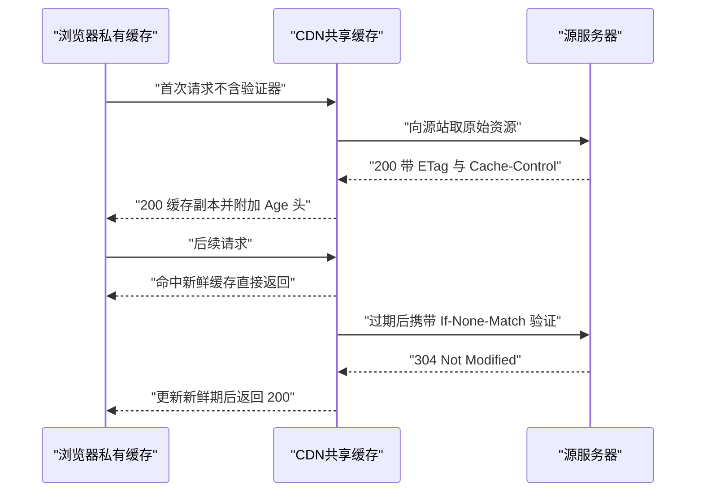
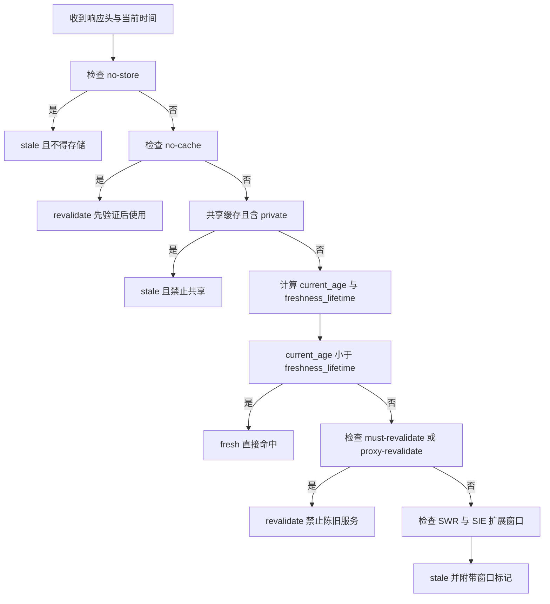

# HTTP 缓存、条件请求与范围请求：MDN 精读

!!! abstract "核心结论"
    - 缓存本质是"以时间换带宽与延迟"：浏览器私缓存、共享代理缓存、CDN 托管缓存三层协作，但最终都围绕 `Cache-Control` 与验证器（`ETag`/`Last-Modified`）决定"能否直接用、要不要先问服务器"。
    - 新鲜度判定的核心是一个可计算函数：输入响应头、当前时间、缓存类型，输出 `fresh`、`stale` 或 `revalidate`；其中 `current_age` 来自 `Date` 与 `Age`，新鲜期优先级是 `s-maxage`（共享） > `max-age` > `Expires` > 启发式缓存（`Last-Modified` 与 `Date` 差值的 10%）。
    - `no-cache` 不是"不缓存"，而是"缓存但每次重新验证"；`no-store` 才是"完全禁止存储"；共享缓存中 `private` 响应必须被拒。
    - 条件请求（`If-None-Match`/`If-Modified-Since`）返回 `304 Not Modified` 时没有响应体，只更新元数据；`Vary` 是缓存的关键，告诉缓存"这个响应按哪些请求头分片"。
    - 范围请求用 `Range: bytes=a-b` 换取 `206 Partial Content` 与 `Content-Range`；`If-Range` 是一个全有或全无的条件闸门：条件失效时整段回退为 `200` 完整资源，从而保证断点续传不会拼出损坏文件。

## 1. 缓存分层与语义基础

### 1.1 私有缓存与共享缓存

MDN 的 HTTP 缓存指南把缓存分为两类：私有缓存（private cache）与共享缓存（shared cache）。私有缓存绑定在单个客户端，典型就是浏览器自己的缓存；因为不与其他用户共享，它可以安全存储个性化响应。共享缓存位于客户端与服务器之间，可进一步分为代理缓存（proxy cache，通常不由你来控制）与托管缓存（managed cache，如反向代理、CDN、Service Worker 配合 Cache API，由服务开发者显式部署）。

两者的关键区别在于：如果个性化内容进入了共享缓存，其他用户就可能拿回不属于自己的响应，造成信息泄漏。因此包含个性化内容（通常由 Cookie 控制）的响应要使用 `Cache-Control: private`。注意 MDN 特别强调：响应带 Cookie 并不必然意味着它是私有的，权限边界不能只看 Cookie 是否存在。

### 1.2 浏览器缓存与 CDN 分层

典型生产架构中，请求会依次穿过浏览器私缓存、可能存在的代理缓存、CDN 托管缓存，最后才到达源站。每一层都在独立运行同一套新鲜度判定算法，因此每一层都必须正确理解 `Cache-Control` 与 `Vary`。CDN 作为托管缓存还有一项普通缓存不具备的能力：标准 HTTP 缓存本质上没有"显式删除某条缓存"的机制，但 CDN 可以通过控制台、API 或重启主动清除缓存条目，形成更主动的缓存策略。



## 2. Cache-Control：指令表与组合规则

### 2.1 指令全表

以下指令语义以 MDN 缓存指南与 HTTP 缓存规范 RFC 9111 为基线；带 `*` 的指令来自 RFC 5861 扩展，具体字面语义建议核对 MDN 的 `Cache-Control` 参考页。

| 指令 | 作用范围 | 语义 |
|------|----------|------|
| `private` | 响应的存储边界 | 仅私有缓存可存储；共享缓存（代理/CDN）不得保存该响应 |
| `public` | 响应的存储边界 | 允许共享缓存存储（与 `private` 相对；Authorization 场景存在特例约束，需核对官方文档） |
| `no-store` | 存储禁止 | 任何缓存都不得存储响应或其对应请求，已被缓存的副本也不能用于应答 |
| `no-cache` | 重用前验证 | 缓存可以存储，但每次要提供给客户端前，必须先与源服务器完成验证 |
| `max-age=N` | 新鲜期 | 响应产出后 N 秒内视为 fresh，超过则变 stale |
| `s-maxage=N` | 共享缓存新鲜期 | 对共享缓存覆盖 `max-age` 与 `Expires`；私有缓存忽略此项并回退到 `max-age`/`Expires` |
| `must-revalidate` | 新鲜期约束 | 变 stale 后，缓存不得在未经源服务器验证的情况下直接服务陈旧副本 |
| `proxy-revalidate` | 共享缓存约束 | 与 `must-revalidate` 相同，但只约束共享缓存；私有缓存可继续使用陈旧副本 |
| `stale-while-revalidate=N` * | 陈旧服务窗口 | stale 后允许在 N 秒内先返回陈旧内容，同时后台异步重新验证 |
| `stale-if-error=N` * | 错误降级窗口 | stale 后如果重新验证失败，允许在 N 秒内把陈旧副本降级服务给客户端 |

### 2.2 指令组合规则与 kitchen-sink 反模式

历史上有大量过时代理缓存不认识 `no-store` 等新指令，于是人们写出 `Cache-Control: no-store, no-cache, max-age=0, must-revalidate, proxy-revalidate` 这种"kitchen-sink header"。MDN 明确提示：在 HTTPS 普及之后，路径上的代理基本只能透传加密流量，看不到响应内容，这种防御大部分已无必要；如果你还管理着能解密流量的企业中间盒，也应当依赖证书透明度等组织策略，而不是堆叠指令。对托管缓存（CDN）来说，真正该做的是仔细阅读对应产品的文档，用产品自带的配置方式控制缓存，而不是假装所有中间层都严格遵循标准——因为托管缓存完全可能有意识地忽略 `no-store`，并采用自己的一套策略（例如 Varnish 的 VCL 或 Service Worker 的 Cache API）。

## 3. 新鲜度判定：从 Age 到启发式缓存

### 3.1 生命周期与隐性 Age

响应的新鲜度不是由客户端"猜"的，而是由响应头计算出来的。一个响应携带 `Date`（源站生成时间）与可选 `Age`（中间缓存已经持有时长的估计）。本次存储时刻与 `Date` 的差值加上 `Age`，共同构成 `current_age` 的近似值。新鲜期则来自 `Cache-Control` 或 `Expires`。只有当 `current_age < freshness_lifetime` 时，缓存才算 fresh。



### 3.2 启发式缓存

当响应既没有 `max-age`、`s-maxage`，也没有 `Expires` 时，缓存可以启用启发式新鲜期：取 `Date` 与 `Last-Modified` 之差的 10% 作为新鲜期。例如资源上次修改是 600 秒前，则新鲜期约为 60 秒。这解释了为什么很多老式静态资源即使没写任何缓存指令，也可能"看起来"被缓存了一小段时间。

### 3.3 手写：HTTP 缓存决策函数

这段代码要解决：把散落在 RFC 9111 与 MDN 缓存指南中的新鲜度规则收敛成一个纯函数，给上层缓存提供"能不能直接用、要不要先验证、能不能后台刷新"的统一结论。运行环境为 Node.js 20+。

```js
// http-cache-decision.mjs
// 运行环境：Node.js 20+（ES Module，零依赖）

// 第 1 段：HTTP 日期解析。所有时间计算都统一到 epoch 毫秒，
// 避免在不同日期格式之间做字符串比较。
export function parseHttpDate(value) {
  if (typeof value !== 'string' || value.length === 0) return null;
  const ms = Date.parse(value);
  return Number.isNaN(ms) ? null : ms;
}

// 第 2 段：Cache-Control 解析成 Map。
// 指令值允许带引号，例如 stale-while-revalidate=60 或 foo="bar"；
// 大小写被折叠，方便后续布尔判断。
export function parseCacheControl(line) {
  const directives = new Map();
  if (typeof line !== 'string') return directives;
  for (const part of line.split(',')) {
    const trimmed = part.trim();
    if (!trimmed) continue;
    const eq = trimmed.indexOf('=');
    const name = eq === -1 ? trimmed : trimmed.slice(0, eq);
    const rawValue = eq === -1 ? '' : trimmed.slice(eq + 1);
    const value = rawValue.replace(/^"|"$/g, '');
    directives.set(name.toLowerCase(), value);
  }
  return directives;
}

export function decideFreshness({ resHeaders, reqHeaders = {}, shared = false, now }) {
  const cc = parseCacheControl(resHeaders['cache-control']);

  // 第 3 段：先处理三个硬约束。这些约束与新鲜期无关，
  // 属于"能不能存、能不能共享、能不能不等服务器直接给"的准入检查。
  if (cc.has('no-store')) {
    return {
      verdict: 'stale', reason: 'no-store 禁止存储，本次不能提供缓存副本',
      freshnessSource: 'n/a', currentAgeSec: 0, freshnessLifetimeSec: 0,
      staleSeconds: 0, swrActive: false, sieActive: false
    };
  }
  if (cc.has('no-cache')) {
    return {
      verdict: 'revalidate', reason: 'no-cache 要求每次重用前先验证',
      freshnessSource: 'n/a', currentAgeSec: 0, freshnessLifetimeSec: 0,
      staleSeconds: 0, swrActive: false, sieActive: false
    };
  }
  if (shared && cc.has('private')) {
    return {
      verdict: 'stale', reason: 'private 响应不得由共享缓存服务给其他客户端',
      freshnessSource: 'n/a', currentAgeSec: 0, freshnessLifetimeSec: 0,
      staleSeconds: 0, swrActive: false, sieActive: false
    };
  }

  const swrSec = cc.has('stale-while-revalidate') ? Number(cc.get('stale-while-revalidate')) : null;
  const sieSec = cc.has('stale-if-error') ? Number(cc.get('stale-if-error')) : null;

  // 第 4 段：计算当前年龄。这是简化模型：
  // current_age = max(0, now - Date) + Age（秒）。
  const dateMs = parseHttpDate(resHeaders['date']);
  const nowSec = Math.floor(now / 1000);
  const dateSec = dateMs === null ? nowSec : Math.floor(dateMs / 1000);
  const ageSec = Number(resHeaders['age'] ?? 0) || 0;
  const currentAgeSec = Math.max(0, nowSec - dateSec) + ageSec;

  // 第 5 段：计算新鲜期。优先级必须是共享 s-maxage > max-age > Expires > 启发式 > 0。
  const expiresMs = parseHttpDate(resHeaders['expires']);
  const lastModifiedMs = parseHttpDate(resHeaders['last-modified']);
  let freshnessLifetimeSec = 0;
  let freshnessSource = 'none';
  if (shared && cc.has('s-maxage')) {
    freshnessLifetimeSec = Number(cc.get('s-maxage')) || 0;
    freshnessSource = 's-maxage';
  } else if (cc.has('max-age')) {
    freshnessLifetimeSec = Number(cc.get('max-age')) || 0;
    freshnessSource = 'max-age';
  } else if (expiresMs !== null) {
    freshnessLifetimeSec = Math.max(0, Math.floor((expiresMs - (dateMs ?? now)) / 1000));
    freshnessSource = 'Expires';
  } else if (dateMs !== null && lastModifiedMs !== null) {
    const tenth = Math.max(1, Math.floor((dateMs - lastModifiedMs) / 1000 / 10));
    freshnessLifetimeSec = tenth;
    freshnessSource = 'heuristic:10%';
  }

  const fresh = currentAgeSec < freshnessLifetimeSec;

  if (fresh) {
    return {
      verdict: 'fresh', reason: `${freshnessSource}: ${currentAgeSec}s < ${freshnessLifetimeSec}s`,
      freshnessSource, currentAgeSec, freshnessLifetimeSec,
      staleSeconds: 0, swrActive: false, sieActive: false
    };
  }

  const staleSeconds = currentAgeSec - freshnessLifetimeSec;

  // 第 6 段：过期后的退出路径。must-revalidate 最严格，应先于 SWR/SIE 判定；
  // proxy-revalidate 只在共享缓存中生效。
  if (cc.has('must-revalidate') || (shared && cc.has('proxy-revalidate'))) {
    return {
      verdict: 'revalidate',
      reason: '过期且 must-revalidate/proxy-revalidate 禁止直接服务陈旧副本',
      freshnessSource, currentAgeSec, freshnessLifetimeSec, staleSeconds,
      swrActive: false, sieActive: false
    };
  }

  // 第 7 段：SWR 与 SIE 扩展窗口，让上层在"后台刷新"与"失败降级"之间二选一。
  const swrActive = swrSec !== null && swrSec >= 0 && staleSeconds <= swrSec;
  const sieActive = !swrActive && sieSec !== null && sieSec >= 0 && staleSeconds <= sieSec;
  if (swrActive) {
    return {
      verdict: 'stale', reason: `swr 窗口：陈旧 ${staleSeconds}s <= ${swrSec}s，可先服务陈旧副本并后台重新验证`,
      freshnessSource, currentAgeSec, freshnessLifetimeSec, staleSeconds,
      swrActive: true, sieActive: false
    };
  }
  if (sieActive) {
    return {
      verdict: 'stale', reason: `sie 窗口：陈旧 ${staleSeconds}s <= ${sieSec}s，重新验证失败时可降级服务陈旧副本`,
      freshnessSource, currentAgeSec, freshnessLifetimeSec, staleSeconds,
      swrActive: false, sieActive: true
    };
  }

  return {
    verdict: 'stale', reason: `${freshnessSource} 过期且无强制校验约束，缓存可自行决定是否服务陈旧副本`,
    freshnessSource, currentAgeSec, freshnessLifetimeSec, staleSeconds,
    swrActive: false, sieActive: false
  };
}
```

逐段解析：

1. `parseHttpDate` 统一把 `Date`、`Last-Modified`、`Expires` 转成 epoch 毫秒；后续新鲜期比较全部是数值减法而不是字符串比较，这是唯一可靠的写法。
2. `parseCacheControl` 用逗号切分指令，并支持 `key=value` 的等号切分；引号在切分后剥掉，避免 `"60"` 与 `60` 被视为两个值。
3. 三个硬约束放在新鲜期计算之前。`no-store` 返回 `stale` 是因为根本不允许服务缓存；`no-cache` 返回 `revalidate` 是强调"必须先验证"；共享缓存里的 `private` 直接判 `stale`，避免信息泄漏。
4. 年龄计算做了简化：`now - Date` 加上 `Age`。这个模型没有计入 RFC 9111 完整公式里的响应延迟项，但足以模拟主要数据流；完整公式需核对官方文档。
5. 新鲜期优先级不能乱：共享缓存必须用 `s-maxage` 覆盖 `max-age`/`Expires`；私有缓存忽略 `s-maxage`。最容易写错的是"只有 `Expires` 时"还要用 `Date` 与 `Expires` 做差，而不是用当前时间。
6. `must-revalidate` 优先级高于 SWR 窗口。这意味着 `max-age=1, must-revalidate, stale-while-revalidate=10` 在 stale 后先返回 `revalidate` 而不是先服务陈旧副本；严格语义优先于扩展窗口，SWR 与 `must-revalidate` 的真实叠加行为应核对官方文档。
7. SWR 与 SIE 以 `swrActive`/`sieActive` 布尔标记输出，调用方据此决定后台任务类型。

### 3.4 验证标准：24 组头组合

这段测试代码覆盖 24 组头部组合加 4 个扩展窗口标记断言，直接运行 `node http-cache-decision.test.mjs`，预期输出为末尾打印的那一行。

```js
// http-cache-decision.test.mjs
// 运行环境：Node.js 20+（使用 node:assert）

import { strict as assert } from 'node:assert';
import { decideFreshness } from './http-cache-decision.mjs';

const NOW = Date.parse('2024-06-01T12:00:00Z');
const iso = (ms) => new Date(ms).toISOString();
const sec = (n) => n * 1000;

function decide(resHeadersOverrides, { now = NOW, shared = false } = {}) {
  const resHeaders = { date: 'Sat, 01 Jun 2024 12:00:00 GMT', ...resHeadersOverrides };
  return decideFreshness({ resHeaders, reqHeaders: {}, shared, now });
}

function testDecideFreshness() {
  // 第 1 段：24 组头部组合，覆盖全部优先级与硬约束。
  const cases = [
    ['max-age 新鲜', { 'cache-control': 'public, max-age=60' }, {}, 'fresh', 'max-age'],
    ['max-age 过期', { 'cache-control': 'public, max-age=60' }, { now: NOW + sec(61) }, 'stale', 'max-age'],
    ['no-store 禁止', { 'cache-control': 'no-store' }, {}, 'stale', null],
    ['no-cache 必须验证', { 'cache-control': 'no-cache' }, {}, 'revalidate', null],
    ['s-maxage 覆盖 max-age', { 'cache-control': 'public, max-age=10, s-maxage=100' }, { shared: true, now: NOW + sec(50) }, 'fresh', 's-maxage'],
    ['私有缓存忽略 s-maxage', { 'cache-control': 'public, max-age=10, s-maxage=100' }, { now: NOW + sec(50) }, 'stale', 'max-age'],
    ['private 禁止共享', { 'cache-control': 'private, max-age=1000' }, { shared: true }, 'stale', null],
    ['private 允许私有缓存', { 'cache-control': 'private, max-age=1000' }, {}, 'fresh', 'max-age'],
    ['Expires 未到期', { expires: iso(NOW + sec(10)) }, { now: NOW + sec(5) }, 'fresh', 'Expires'],
    ['Expires 已过期', { expires: iso(NOW + sec(10)) }, { now: NOW + sec(11) }, 'stale', 'Expires'],
    ['Last-Modified 启发式', { 'last-modified': iso(NOW - sec(600)) }, { now: NOW + sec(30) }, 'fresh', 'heuristic:10%'],
    ['无任何新鲜期信息', { date: undefined }, {}, 'stale', 'none'],
    ['must-revalidate 过期', { 'cache-control': 'public, max-age=1, must-revalidate' }, { now: NOW + sec(2) }, 'revalidate', 'max-age'],
    ['must-revalidate 新鲜', { 'cache-control': 'public, max-age=1, must-revalidate' }, {}, 'fresh', 'max-age'],
    ['proxy-revalidate 共享', { 'cache-control': 'public, max-age=1, proxy-revalidate' }, { shared: true, now: NOW + sec(2) }, 'revalidate', 'max-age'],
    ['proxy-revalidate 私有', { 'cache-control': 'public, max-age=1, proxy-revalidate' }, { now: NOW + sec(2) }, 'stale', 'max-age'],
    ['stale-while-revalidate 窗口', { 'cache-control': 'public, max-age=1, stale-while-revalidate=10' }, { now: NOW + sec(5) }, 'stale', 'max-age'],
    ['stale-while-revalidate 超窗', { 'cache-control': 'public, max-age=1, stale-while-revalidate=10' }, { now: NOW + sec(20) }, 'stale', 'max-age'],
    ['stale-if-error 窗口', { 'cache-control': 'public, max-age=1, stale-if-error=10' }, { now: NOW + sec(5) }, 'stale', 'max-age'],
    ['stale-if-error 超窗', { 'cache-control': 'public, max-age=1, stale-if-error=10' }, { now: NOW + sec(20) }, 'stale', 'max-age'],
    ['Age 计入当前年龄', { 'cache-control': 'public, max-age=60', age: '30' }, {}, 'fresh', 'max-age'],
    ['max-age=0 立即过期', { 'cache-control': 'public, max-age=0' }, {}, 'stale', 'max-age'],
    ['Expires 优先于启发式', { expires: iso(NOW + sec(100)), 'last-modified': iso(NOW - sec(1000)) }, { now: NOW + sec(50) }, 'fresh', 'Expires'],
    ['no-store 优先于 max-age', { 'cache-control': 'no-store, max-age=100' }, {}, 'stale', null]
  ];

  let passed = 0;
  for (const [name, res, opts, expectVerdict, expectSource] of cases) {
    const r = decide(res, opts);
    assert.equal(r.verdict, expectVerdict, `${name}: verdict 应为 ${expectVerdict}`);
    if (expectSource !== null) assert.equal(r.freshnessSource, expectSource, `${name}: source 应为 ${expectSource}`);
    passed += 1;
  }

  // 第 2 段：扩展窗口标记的精确断言。
  assert.equal(decide({ 'cache-control': 'public, max-age=1, stale-while-revalidate=10' }, { now: NOW + sec(5) }).swrActive, true);
  assert.equal(decide({ 'cache-control': 'public, max-age=1, stale-while-revalidate=10' }, { now: NOW + sec(20) }).swrActive, false);
  assert.equal(decide({ 'cache-control': 'public, max-age=1, stale-if-error=10' }, { now: NOW + sec(5) }).sieActive, true);
  assert.equal(decide({ 'cache-control': 'public, max-age=1, stale-if-error=10' }, { now: NOW + sec(20) }).sieActive, false);
  passed += 4;

  console.log(`http-cache-decision.test.mjs：${cases.length + 4} 项断言全部通过（累计 ${passed} 项）`);
}

testDecideFreshness();
```

预期输出：

```text
http-cache-decision.test.mjs：28 项断言全部通过（累计 28 项）
```

## 4. 条件请求：验证器与 304

### 4.1 ETag 与 Last-Modified

条件请求让同一个请求在不同验证器取值下产生不同结果。验证器有两种：`Last-Modified`（最后修改日期）与 `ETag`（实体标签，唯一标识某个版本的不透明字符串）。缓存空了直接回 `200 OK` 同时带回验证器；缓存 stale 之后，客户端不再直接使用缓存值，而是发起条件请求，把验证器放进 `If-None-Match` 或 `If-Modified-Since`。服务器比较后若资源未变，返回 `304 Not Modified`，没有响应体，客户端把旧副本重新标为 fresh。

### 4.2 强验证与弱验证

比较同一资源有两种相等性：强验证（strong validation）要求逐字节一致，用于断点续传等必须保证数据不丢失的场景；弱验证（weak validation）只要求内容等价，例如页脚日期或广告不同也算相同。强验证是默认行为，但实现成本高；用 `Last-Modified` 做强验证很困难，通常需要把资源哈希（如 MD5 派生值）编码进 ETag。MDN 指出：内容编码改变需要同时改变 ETag，Apache 默认会给压缩响应的 ETag 追加 `-gzip`，这一行为可通过 `DeflateAlterETag` 配置。

| 维度 | 强验证 | 弱验证 |
|------|--------|--------|
| 相等标准 | 逐字节一致 | 内容等价即可 |
| ETag 前缀 | 通常形如 `"abc123"` | 显式加 `W/"abc123"` |
| 数据安全 | 无数据丢失风险 | 可能接受语义上"够用"的差异 |
| 适用场景 | 断点续传、精确一致性 | 优化缓存命中率 |
| 实现成本 | 高，需要稳定哈希 | 视内容重要性而定 |

### 4.3 304 流程与 Vary

`304 Not Modified` 是更新缓存的信号，不是错误。客户端拿到 `304` 后只更新验证器与新鲜期，不重置响应体。`Vary` 头则解决另一类问题：当内容协商参与了表示选择（例如按 `Accept-Encoding` 选出 `gzip` 或 `br`），服务器必须返回 `Vary: Accept-Encoding`，否则共享缓存会把"gzip 表示"错误地发给那些只接受 `br` 的客户端。MDN 压缩指南明确要求：用内容协商选压缩算法后，响应里必须同时包含 `Content-Encoding` 与 `Vary`。

### 4.4 If-Range：范围请求的条件闸门

`If-Range` 可以把一个范围请求变成条件范围请求：条件满足就返回 `206 Partial Content`，条件不满足就返回 `200 OK` 加完整资源，而不是 `412`。这个"全有或全无"的机制用来保证断点续传时，之前下载的片段属于同一个资源版本，拼接结果不会损坏。`If-Range` 只能携带一个验证器，要么是单一 ETag，要么是一个日期，不能同时带两个。`If-Range` 与 MDN 条件请求页里的一处描述需核对官方文档确认：若验证失败，是直接回退 `200`，还是先尝试常规范围失败语义。

## 5. 范围请求与断点续传

### 5.1 Accept-Ranges、206 与 416

判断服务器是否支持 partial request，看响应头 `Accept-Ranges`；除 `none` 以外的值都表示支持。`Accept-Ranges: bytes` 是当前唯一可用单位。客户端通过 `Range: bytes=a-b` 请求局部字节；`Content-Length` 表示这段响应体长度，`Content-Range: bytes a-b/总共长` 表示这段局部片段在整个资源里的位置。多点范围可一次取多个区间，响应变成 `multipart/byteranges` 并带边界字符串；单点范围则直接返回二进制体。范围请求与 `Transfer-Encoding: chunked` 兼容，可互相独立使用。

| 场景 | 状态码 | 关键响应头 | 响应体 |
|------|--------|------------|--------|
| 范围成功 | `206 Partial Content` | `Content-Range: bytes a-b/total` | 只含请求区间 |
| 范围越界 | `416 Requested Range Not Satisfiable` | `Content-Range: bytes */total` | 空 |
| 不支持范围 | `200 OK` | 通常无 `Accept-Ranges` 或为 `none` | 完整资源 |
| 多区间 | `206 Partial Content` | `Content-Type: multipart/byteranges; boundary=...` | 分块封装 |

### 5.2 手写：断点续传服务器

这段代码要解决：给最小静态资源服务器补齐字节范围读取，让大文件支持 `Range: bytes=a-b` 的断点续传，并把 `If-Range` 做成条件闸门。运行环境为 Node.js 20+。

```js
// range-server.mjs
// 运行环境：Node.js 20+（使用 node:http）

import http from 'node:http';

// 第 1 段：弱 ETag 比较。范围续传里 IF-Range 可能带 W/ 前缀，
// 比较前先剥掉这个前缀，只比较实体标签本身。
function weakEtagEqual(a, b) {
  const norm = (v) => String(v ?? '').replace(/^W\//i, '');
  return norm(a) === norm(b);
}

// 第 2 段：把 Range 头解析成规范区间。
// 支持 bytes=a-b、bytes=a-、bytes=-N 三种形式；多段范围这里按不支持处理。
function parseRange(header, size) {
  if (typeof header !== 'string' || !header.startsWith('bytes=')) return null;
  const spec = header.slice(6).trim();
  if (!spec || spec.includes(',')) return null;
  const dash = spec.indexOf('-');
  if (dash === -1) return null;
  const startText = spec.slice(0, dash).trim();
  const endText = spec.slice(dash + 1).trim();

  if (startText === '') {
    // 后缀范围 bytes=-N：取末尾 N 字节。
    const n = Number(endText);
    if (!Number.isFinite(n) || n <= 0 || size === 0) return { unsat: true };
    return { start: Math.max(0, size - n), end: size - 1 };
  }

  const start = Number(startText);
  if (!Number.isFinite(start) || start >= size) return { unsat: true };
  let end = size - 1;
  if (endText !== '') {
    const e = Number(endText);
    if (!Number.isFinite(e)) return null;
    end = Math.min(e, size - 1);
  }
  if (start > end) return { unsat: true };
  return { start, end };
}

export function createRangeServer(asset) {
  const body = Buffer.isBuffer(asset.body) ? asset.body : Buffer.from(String(asset.body ?? ''), 'utf8');

  return http.createServer((req, res) => {
    const method = (req.method ?? 'GET').toUpperCase();
    const ifRange = req.headers['if-range'];
    const rangeHeader = req.headers.range;

    res.setHeader('Accept-Ranges', 'bytes');
    if (asset.contentType) res.setHeader('Content-Type', asset.contentType);
    if (asset.etag) res.setHeader('ETag', asset.etag);
    if (asset.lastModified) res.setHeader('Last-Modified', asset.lastModified);

    // 第 3 段：If-Range 是"全有或全无"的验证器。
    // 条件不满足时，整段忽略 Range，回退完整 200。
    let ifRangeOk = true;
    if (ifRange) {
      if (ifRange.startsWith('"') || ifRange.startsWith('W/')) {
        ifRangeOk = weakEtagEqual(ifRange, asset.etag);
      } else {
        const given = Date.parse(ifRange);
        const ours = asset.lastModified ? Date.parse(asset.lastModified) : NaN;
        ifRangeOk = !Number.isNaN(given) && !Number.isNaN(ours) && ours <= given;
      }
    }

    const headRequest = method === 'HEAD';
    const parsed = method === 'GET' && ifRangeOk ? parseRange(rangeHeader, body.length) : null;

    // 第 4 段：416 → 206 → 200 三级分派。
    if (parsed && parsed.unsat) {
      res.statusCode = 416;
      res.setHeader('Content-Range', `bytes */${body.length}`);
      res.setHeader('Content-Length', '0');
      res.end();
      return;
    }

    if (parsed) {
      const chunk = body.subarray(parsed.start, parsed.end + 1);
      res.statusCode = 206;
      res.setHeader('Content-Range', `bytes ${parsed.start}-${parsed.end}/${body.length}`);
      res.setHeader('Content-Length', String(chunk.length));
      res.end(headRequest ? undefined : chunk);
      return;
    }

    // 没有 Range、Range 无效、If-Range 不匹配、或 HEAD 请求：返回完整资源（HEAD 无响应体）。
    res.statusCode = 200;
    res.setHeader('Content-Length', String(body.length));
    res.end(headRequest ? undefined : body);
  });
}
```

逐段解析：

1. 弱 ETag 比较把 `W/` 前缀剥离后再比较，确保 `W/"abc"` 与 `"abc"` 被视为同一实体标签；这是弱验证器比较的正确做法。
2. `parseRange` 计算三种区间形式。`bytes=-N` 需要从资源底部倒推，`Math.max(0, size - n)` 防止负数；`bytes=a-` 默认终点是最后一字节。数值非法或区间完全落在资源长度之外，就返回 `unsat`。
3. `If-Range` 分支区分 ETag 与日期两种情况。日期匹配的语义是"资源在给定日期或之前未变"，实现为 `asset.lastModified <= givenDate`。
4. 分派顺序必须严谨：`416` 优先于 `206` 优先于 `200`。若范围为 `100-200` 而资源只有 10 字节，绝不能把 `end` 截断成 9 后错发 `206`，必须先返回越界错误。

### 5.3 验证标准：10 组场景

这段代码验证 `range-server.mjs` 对 200、206、416、If-Range 与 HEAD 五类分支的行为，直接运行 `node range-server.test.mjs`，预期输出为末尾打印的那一行。

```js
// range-server.test.mjs
// 运行环境：Node.js 20+（使用 node:assert 与 fetch）

import { strict as assert } from 'node:assert';
import { createRangeServer } from './range-server.mjs';

function listen(server) {
  return new Promise((resolve) => {
    server.listen(0, '127.0.0.1', () => resolve(server.address().port));
  });
}

async function request(port, headers = {}, method = 'GET') {
  const res = await fetch(`http://127.0.0.1:${port}/asset`, { method, headers });
  return { status: res.status, headers: res.headers, bytes: Buffer.from(await res.arrayBuffer()) };
}

async function main() {
  // 第 1 段：构造 10 字节资源，包含 ETag 与 Last-Modified 两种验证器。
  const body = Buffer.from('0123456789', 'utf8');
  const server = createRangeServer({
    body,
    etag: '"abcdef-1"',
    lastModified: 'Sat, 01 Jun 2024 12:00:00 GMT',
    contentType: 'text/plain; charset=utf-8'
  });
  const port = await listen(server);

  // 第 2 段：逐条断言响应状态、头部与字节内容。
  const full = await request(port);
  assert.equal(full.status, 200);
  assert.equal(full.headers.get('accept-ranges'), 'bytes');
  assert.deepEqual(full.bytes, body);

  const r1 = await request(port, { Range: 'bytes=0-3' });
  assert.equal(r1.status, 206);
  assert.equal(r1.headers.get('content-range'), 'bytes 0-3/10');
  assert.deepEqual(r1.bytes, body.subarray(0, 4));

  const r2 = await request(port, { Range: 'bytes=-3' });
  assert.equal(r2.status, 206);
  assert.equal(r2.headers.get('content-range'), 'bytes 7-9/10');
  assert.deepEqual(r2.bytes, body.subarray(7));

  const r3 = await request(port, { Range: 'bytes=7-' });
  assert.equal(r3.status, 206);
  assert.equal(r3.headers.get('content-range'), 'bytes 7-9/10');
  assert.deepEqual(r3.bytes, body.subarray(7));

  const r4 = await request(port, { Range: 'bytes=100-200' });
  assert.equal(r4.status, 416);
  assert.equal(r4.headers.get('content-range'), 'bytes */10');
  assert.equal(r4.bytes.length, 0);

  const r5 = await request(port, { Range: 'bytes=abc' });
  assert.equal(r5.status, 200);
  assert.deepEqual(r5.bytes, body);

  const r6 = await request(port, { Range: 'bytes=2-4', 'If-Range': '"abcdef-1"' });
  assert.equal(r6.status, 206);
  assert.equal(r6.headers.get('content-range'), 'bytes 2-4/10');

  const r7 = await request(port, { Range: 'bytes=2-4', 'If-Range': '"new-etag"' });
  assert.equal(r7.status, 200);
  assert.deepEqual(r7.bytes, body);

  const r8 = await request(port, { Range: 'bytes=0-1', 'If-Range': 'Sat, 01 Jun 2024 13:00:00 GMT' });
  assert.equal(r8.status, 206);
  assert.equal(r8.headers.get('content-range'), 'bytes 0-1/10');

  const r9 = await request(port, { Range: 'bytes=0-1', 'If-Range': 'Fri, 31 May 2024 23:59:59 GMT' });
  assert.equal(r9.status, 200);
  assert.deepEqual(r9.bytes, body);

  const r10 = await request(port, {}, 'HEAD');
  assert.equal(r10.status, 200);
  assert.equal(r10.headers.get('content-length'), '10');
  assert.equal(r10.bytes.length, 0);

  server.close();
  console.log('range-server.test.mjs：10 组断言全部通过');
}

await main();
```

预期输出：

```text
range-server.test.mjs：10 组断言全部通过
```

## 6. 常见陷阱

1. 把 `no-cache` 当成"不缓存"。实际上 `no-cache` 允许存储，只是每次重用前必须重新验证；想禁止存储要用 `no-store`。
2. 给个性化响应漏写 `private`，导致 CDN 或共享代理把用户 A 的响应返回给用户 B，造成个人数据泄漏。Cookie 的存在本身并不自动等于 private。
3. 在 HTTPS 化之后的现代架构里堆 kitchen-sink headers。MDN 指出旧代理缓存问题已大幅减少，真正该做的是按托管缓存产品文档配置，而不是用 `no-store, no-cache, max-age=0, must-revalidate, proxy-revalidate` 大杂烩。
4. 使用压缩代理时忘记 `Vary: Accept-Encoding`。没有它，共享缓存可能把 `gzip` 版本发给只声明 `br` 的客户端，导致乱码或解压失败。
5. `Expires` 与 `Date` 的新鲜期减法搞错方向。`Expires` 新鲜期是 `Expires - Date`，不是 `Expires - now`。
6. 新鲜期缺失时忽略启发式缓存。只有 `Last-Modified` 的资源也可能被缓存约 10% 差值时长，这会在调试"为什么删了 Cache-Control 还会缓存"时造成误解。
7. `If-Range` 条件不满足就以为会返回 `412`。实际上它返回 `200` 与完整资源，目的是让续传失败时能回到完整下载。
8. 对范围请求返回 `416` 时漏掉 `Content-Range: bytes */total`。客户端需要这个头知道资源的真实长度。

## 7. 面试题与答题要点

### 7.1 浏览器缓存与 CDN 缓存分别如何影响一次请求？

答题要点：浏览器是私有缓存，按同一套新鲜度与验证器规则先判断是否 fresh，若不 fresh 才发条件请求；CDN 是共享托管缓存，除了标准指令外还有控制台/API/配置文件的治理能力。三层（浏览器、代理、CDN）各自独立运行判定函数。

### 7.2 `Cache-Control: no-cache` 与 `Cache-Control: no-store` 的区别是什么？

答题要点：`no-cache` 允许存储，但每次响应提供前必须经过验证，相当于始终 `revalidate`；`no-store` 完全禁止存储与复用。前者适合"内容必须新但可以缓存"的场景，后者适合敏感数据。

### 7.3 `s-maxage` 与 `max-age` 同时出现时，私有缓存与共享缓存分别怎么算？

答题要点：共享缓存优先用 `s-maxage`，它覆盖 `max-age` 与 `Expires`；私有缓存忽略 `s-maxage`，回退到 `max-age`。另注意 `private` 会先否决共享缓存的存储资格，即使有 `s-maxage` 也不存储。

### 7.4 为什么 304 没有响应体，客户端仍然能刷新缓存？

答题要点：304 更新的是元数据层面。客户端把旧响应体与新的验证器和新鲜期合并，响应体不需要重新传输。`ETag`/`Last-Modified` 是更新缓存的关键；`Vary` 键决定多个表示能否被正确区分。

### 7.5 断点续传为什么需要 `If-Range`？

答题要点：已经下载的前缀片段必须与将要请求的后缀片段来自同一资源版本。`If-Range` 用一个 ETag 或日期做全有或全无校验：一致则 206，不一致则整段回退 200 完整下载，避免拼出损坏文件。

### 7.6 `Vary` 头的作用是什么，举个必须使用它的场景。

答题要点：`Vary` 告诉缓存在决定命中前必须重新比较哪些请求头。典型是压缩协商：`Vary: Accept-Encoding` 防止 `br` 版本被错误供给只支持 `gzip` 的客户端。扩展场景还包括 `Vary: Accept-Language` 等。

### 7.7 什么情况下范围请求会返回 `416` 而不是 `206`？

答题要点：当所有请求区间都落在资源长度之外，例如资源的第一个字节位置都大于总长度。响应需带 `Content-Range: bytes */total`。若区间末位超出总长但区间前部仍在范围内，应当截断末位并返回 206，而不是 416。

## 深入阅读与参考

!!! tip "怎么用这些资料"
    先读「官方文档与规范」建立准确的概念，再读「源码与示例」核对细节，最后用「教程、书籍与视频」换一种讲法加深理解。每条都写明了读哪一节、带着什么问题读。

### 官方文档与规范

| 资源 | 为什么读 | 怎么读 |
|---|---|---|
| [Cache-Control header](https://developer.mozilla.org/en-US/docs/Web/HTTP/Reference/Headers/Cache-Control) | Cache-Control 指令全集，逐条对照组合规则。 | 读指令表与可缓存性、新鲜度、重新验证三类；给静态资源配置后观察命中。 |
| [Age header](https://developer.mozilla.org/en-US/docs/Web/HTTP/Reference/Headers/Age) | Age 头定义，理解代理如何老化响应。 | 读语法与示例，算 Age+Date 与 max-age 的关系，再抓一次 CDN 响应验证。 |
| [RFC 9111 HTTP Caching](https://www.rfc-editor.org/rfc/rfc9111) | RFC 9111 是新鲜度与验证机制的权威定义。 | 读第 4 章新鲜度计算，手算一个响应的剩余 TTL 与启发式缓存上限。 |
| [RFC 9110 HTTP Semantics](https://www.rfc-editor.org/rfc/rfc9110) | 条件请求与 304/206 语义的一手来源。 | 读方法小节与 304、206、412 定义，标出安全与幂等方法。 |
| [HTTP conditional requests](https://developer.mozilla.org/en-US/docs/Web/HTTP/Guides/Conditional_requests) | 验证器 ETag/Last-Modified 与 304 流程讲得最细。 | 读 If-None-Match 与 If-Modified-Since 两节，用 curl 复现一次 304。 |
| [HTTP range requests](https://developer.mozilla.org/en-US/docs/Web/HTTP/Guides/Range_requests) | 范围请求与 multipart/byteranges 的规范说明。 | 读单范围与 If-Range 节，下载大文件时用 curl -r 验证断点续传。 |
| [MDN HTTP 缓存（English）](https://developer.mozilla.org/en-US/docs/Web/HTTP/Caching) | 英文版含 stale-while-revalidate 等较新内容。 | 读缓存失效与 stale-while-revalidate 节，对比中文版并记下差异。 |
| [Compression in HTTP](https://developer.mozilla.org/en-US/docs/Web/HTTP/Guides/Compression) | 压缩与缓存组合容易踩 Vary 的坑。 | 读内容编码与 Vary 交互部分，检查项目是否漏配 Vary: Accept-Encoding。 |

### 源码与示例

| 资源 | 为什么读 | 怎么读 |
|---|---|---|
| [HTTP 缓存](https://web.dev/articles/http-cache) | 静态资源 immutable 与哈希文件名的实操配置。 | 读配置片段，给构建产物加哈希并设一年 immutable，验证回退行为。 |
| [Service Worker 与 HTTP 缓存](https://web.dev/articles/service-worker-caching-and-http-caching) | 讲清 Service Worker 与 HTTP 缓存两层叠加。 | 读缓存策略示例，写一个缓存优先 SW，故意更新资源观察结果。 |
| [HTTP Toolkit](https://httptoolkit.com/) | 抓真实请求头，验证缓存与条件请求行为。 | 拦截一次页面加载，对照 Cache-Control、Age、ETag 与 304 的时序。 |

### 教程、书籍与视频

| 资源 | 为什么读 | 怎么读 |
|---|---|---|
| [MDN HTTP 缓存（中文）](https://developer.mozilla.org/zh-CN/docs/Web/HTTP/Caching) | 中文教程，动手改 Cache-Control 做缓存实验。 | 按示例改 Cache-Control，在 Network 面板切换禁用缓存观察命中差异。 |
| [Everything curl](https://everything.curl.dev/) | curl 实战手册，便于复现请求头与范围请求。 | 读 HTTP 与 ranges 章节，用 curl -v -r 复现一次断点续传。 |

## 应用与行业实践

### 应用场景地图

| 场景 | 用到本页哪个知识点 | 典型技术选型 | 注意事项 |
|---|---|---|---|
| 后台管理的万行订单表格分页筛选 | `ETag`、`If-None-Match`、`304 Not Modified`、`Vary` | 服务端按响应体生成 `ETag`，返回 `Cache-Control: no-cache` | 必须加 `Vary: Authorization`，否则登录态会串缓存；304 只省传输，不省数据库查询 |
| 低端安卓打开营销活动页 | `Cache-Control` 新鲜期、`immutable`、`no-cache` | HTML 入口 `no-cache`；指纹静态资源 `max-age=31536000, immutable` | 资源文件名必须带内容哈希；HTML 不能用长缓存，避免入口不更新 |
| 视频课程 App 拖拽播放 | `Range`、`206 Partial Content`、`Content-Range`、`If-Range` | Nginx 或对象存储开启 `Accept-Ranges`，客户端按字节区间请求 | `If-Range` 失效必须回退 200 完整资源，避免拼出损坏文件 |
| 多人协作白板打开历史画布 | `ETag`、条件请求、`Vary` | 画布快照接口返回 `ETag`，再次打开带 `If-None-Match` | `ETag` 要覆盖画布内容、修改时间和权限变化；共享缓存只用于无用户态数据 |
| 多语言官网的共享代理缓存 | `Vary`、`Cache-Control: public`、`max-age` | CDN 或反向代理按 `Vary: Accept-Language` 分片 | 遗漏 `Vary` 会给用户错误语言版本；分片头数量越多，共享缓存命中越低 |
| CI 发布后的静态资源更新 | 指纹文件名、`max-age`、`ETag`、`Last-Modified` | CDN 上旧文件保留，HTML 指向新哈希资源 | 发布前先传新资源再更新 HTML；旧文件保留至少一个缓存周期 |
| 网盘大文件续传 | `Range: bytes=a-b`、`206`、`If-Range` | 客户端记录已下载字节，续传时发起区间请求 | 服务端需要返回 `Accept-Ranges: bytes`；校验失败应回退 200，不能用错误区间拼接 |

### 三个场景拆解

#### 场景 1：后台管理的万行订单表格

- **业务背景**：订单列表单页有一万行数据，前端排序和筛选会反复访问同一个查询接口。浏览器重复下载几十 KB 到几 MB JSON，翻页等待时间增加，但订单数据可能几分钟内并不变化。

- **怎么用本页知识解决**：先让接口返回 `ETag`，并在后续请求中检查 `If-None-Match`。响应继续被缓存，但每次都必须先问服务器；未变化就返回 304，变化才返回完整 JSON。

```python
from flask import Flask, request, Response, jsonify
import hashlib, json

def build_etag(rows):
    raw = json.dumps(rows, sort_keys=True).encode()  # 用响应内容生成 ETag
    return '"' + hashlib.sha1(raw).hexdigest() + '"'

@app.get("/api/orders")
def orders():
    rows = load_orders()                              # 查询并序列化万行订单
    etag = build_etag(rows)
    if request.headers.get("If-None-Match") == etag:
        res = Response(status=304)                    # 命中条件请求，不返回 JSON 体
        res.headers["Cache-Control"] = "no-cache"     # 缓存但每次重新验证
        res.headers["Vary"] = "Authorization"         # 按登录态隔离私缓存
        return res
    res = jsonify(rows)
    res.headers["ETag"] = etag
    res.headers["Cache-Control"] = "no-cache"         # no-cache 不是不缓存
    res.headers["Vary"] = "Authorization"
    return res
```

- `ETag` 用订单列表 JSON 内容计算，数据不变时第二次请求直接返回 304。
- `Cache-Control: no-cache` 让浏览器可以存响应，但每次使用前必须重新验证。
- `Vary: Authorization` 防止用户 A 的缓存被用户 B 命中。
- 该方案只降低传输量，服务端查询和序列化仍会执行。
- 如果订单数据秒级变化，304 命中会减少，收益下降。

- **怎么度量收益**：用 Chrome DevTools Network 查看 `/api/orders` 第二次请求状态是否为 304、响应体大小是否为 0 字节。后端用日志或 Prometheus 统计该接口总请求数与 304 请求数，看 304 占比。

- **什么时候不该用**：订单数据要求毫秒级实时性，且用户在一次会话中极少重复请求同一筛选条件时，条件请求收益低。后端瓶颈在数据库查询而不是 JSON 传输时，304 不能减少查询耗时。

#### 场景 2：视频课程 App 的拖拽播放

- **业务背景**：视频课程用户拖拽进度条到中段，播放器要从指定位置起播。如果每次拉取完整视频，移动网络会浪费流量，等待时间明显增加。

- **怎么用本页知识解决**：服务端支持 `Range` 字节区间请求，客户端请求 `Range: bytes=a-b` 后得到 206 和 `Content-Range`。`If-Range` 提供全有或全无闸门：文件 ETag 未变就返回区间，变化则回退 200。

```js
app.get("/video", (req, res) => {
  const range = req.headers.range;                   // 拖拽播放带 Range 头
  const ifRange = req.headers["if-range"];           // 客户端上次记住的 ETag
  if (range && ifRange && ifRange !== currentEtag) {
    res.status(200);                                 // If-Range 失效：整段回退
    res.setHeader("ETag", currentEtag);
    res.sendFile(videoPath);
    return;
  }
  if (!range) {
    res.setHeader("Cache-Control", "private, max-age=3600");
    res.setHeader("ETag", currentEtag);
    res.sendFile(videoPath);
    return;
  }
  const m = /bytes=(\d+)-(\d*)/.exec(range);
  const start = Number(m[1]);
  const end = m[2] ? Number(m[2]) : FILE_SIZE - 1;
  res.status(206);                                   // 只返回请求区间
  res.setHeader("Content-Range", `bytes ${start}-${end}/${FILE_SIZE}`);
  res.setHeader("Accept-Ranges", "bytes");
  res.setHeader("ETag", currentEtag);
  res.end(readSlice(videoPath, start, end));         // 只读该区间字节
});
```

- 首次完整响应返回 `ETag`，并为常见文件大小设置 `Accept-Ranges: bytes`。
- 拖拽请求命中 `If-Range` 时只传输用户需要的区间，避免重复下载文件头尾。
- `If-Range` 不匹配时整体回退 200，防止旧片断拼到新文件。
- 206 响应必须包含 `Content-Range`，客户端才能确定区间位置。
- 大文件场景收益直接体现在单次拖拽的传输字节数下降。

- **怎么度量收益**：用 Chrome DevTools Network 或 Charles 查看拖拽后的请求是否为 206、`Content-Range` 区间起止是否正确、响应体大小是否为区间大小而非完整文件。真机测试记录从用户拖拽到 `timeupdate` 事件触发的时间，以及完整 200 回退次数。

- **什么时候不该用**：直播流不是完整可寻址文件，只靠 `Range` 无法完成回放续传。小于 100 KB 的文件可一次性下载，增加区间解析和回退逻辑没有收益。

#### 场景 3：低端安卓活动页首屏加载

- **业务背景**：低端安卓打开营销活动页，首屏耗时集中在静态资源下载。设备私缓存空间小，资源在二次访问前可能已被淘汰，导致页面重复下载。

- **怎么用本页知识解决**：HTML 入口使用 `no-cache`，每次先验证；带内容哈希的静态资源使用一年期 `max-age` 和 `immutable`。浏览器直接使用缓存，不发起重新验证请求。

```nginx
location /assets/ {
    add_header Cache-Control "public, max-age=31536000, immutable"; # 哈希资源长缓存一年
}

location = /index.html {
    add_header Cache-Control "no-cache";                            # 入口每次重新验证
    etag on;
}

location /video/ {
    add_header Cache-Control "private, max-age=3600";               # 视频只存私缓存
    add_header Accept-Ranges bytes;
}
```

- `max-age=31536000` 告诉浏览器资源新鲜期为一年，新鲜期内直接使用缓存。
- `immutable` 告诉浏览器缓存命中后不必因为刷新而重新验证。
- `no-cache` 不是禁止存 HTML，而是每次使用前必须向服务器确认。
- 指纹文件名保证资源内容变化时 URL 也变化，旧缓存不会被误用。
- 视频使用 `private`，避免代理或共享缓存保存登录用户的视频片段。

- **怎么度量收益**：用 Lighthouse 的“Serve static assets with an efficient cache policy”审计检查缓存策略。用 WebPageTest 或 Chrome DevTools Network 对比首次与二次访问的首屏耗时、传输字节数和命中缓存请求数。

- **什么时候不该用**：HTML 入口不能使用一年期长缓存，否则发布后用户仍打开旧页面。资源文件名没有内容哈希时也不能使用 `immutable`，否则同名旧资源可能长期不更新。

### 行业先进实践

1. `Cache-Control: immutable`（出处：RFC 8246 / MDN `Cache-Control` 文档）。  
该指令用于内容寻址资源，告诉浏览器新鲜期内直接使用缓存，不必因刷新发送验证请求。你的项目可对带哈希的 JS、CSS、图片使用该指令，但文件名必须随内容变化。

2. HTML 入口 `no-cache` 加指纹资源长周期缓存（出处：MDN HTTP 缓存文档 / RFC 9111）。  
HTML 使用 `no-cache` 保证变更能尽快被验证，而指纹资源使用长 `max-age` 换取缓存命中。你的项目可把入口文档和子资源分开管理，避免入口长期过期。

3. 共享缓存使用 `s-maxage` 与 `Age`（出处：RFC 9111 / MDN `Cache-Control` 文档）。  
CDN 和共享代理优先使用 `s-maxage` 决定新鲜期，`Age` 用于计算缓存已存时间。你的项目可在 CDN 层设置比浏览器更短或更长的 `s-maxage`，与 `max-age` 解耦。

4. 范围请求使用 `If-Range` 保证续传完整性（出处：RFC 7233 / MDN HTTP range requests 文档）。  
`If-Range` 用强验证器或日期作为闸门，资源变更新鲜时会回退 200 完整响应，避免断点续传拼接出错。你的项目可在视频和下载服务中保留 `ETag`，客户端按区间请求时同时携带 `If-Range`。

### 从学到用：落地路线

1. **先在单个只读接口或静态资源目录试点**。验收：用 `curl -I` 能复现 `ETag`、`Cache-Control`、`Accept-Ranges` 中的目标响应头。

2. **用 DevTools 和 Lighthouse 验证收益**。验收：同页面第二次加载中，目标静态资源响应体为 0 字节或目标接口返回 304，并记录传输字节数下降。

3. **把规则写进部署清单与 CI 配置**。验收：新增静态资源和只读接口必须带上 `ETag` 与 `Cache-Control`，CI 检查未配置响应头时失败。

4. **加入监控和回归测试防止回退**。验收：合成监控定时请求目标页面，检查缓存命中资源数，CI 中响应头断言失败时阻止合并。

### 动手作业

目标：为一个小型下载站实现分层缓存和可验证的范围请求。

步骤：

1. 创建一个静态目录，放入一个 5 MB 的测试文件 `download.bin` 和入口 `index.html`。
2. 配置 `/assets/` 下指纹资源使用 `Cache-Control: public, max-age=31536000, immutable`。
3. 配置 `/downloads/` 返回 `Accept-Ranges: bytes`，并保留 `ETag` 和 `Last-Modified`。
4. 配置 `index.html` 使用 `Cache-Control: no-cache`。
5. 用 `curl -H "Range: bytes=0-1023" -i` 请求 `download.bin`，确认返回 206 和 `Content-Range`。
6. 用 `curl -H "If-Range: <ETag>" -H "Range: bytes=0-1023" -i` 验证 206；修改文件后重新请求，确认回退 200。
7. 用 Chrome DevTools 记录两次页面加载，查看静态资源来自内存缓存、磁盘缓存还是 304。

验收标准：

- `/assets/` 下任意指纹资源的第二次加载响应体为 0 字节。
- `/downloads/download.bin` 的字节区间请求返回 206 和正确的 `Content-Range`。
- `If-Range` 不匹配时返回 200 完整文件。
- `index.html` 的响应头包含 `no-cache`，未使用长周期缓存。
- README 中记录至少 4 条请求响应头证据，并说明每个响应头对应本页哪个知识点。

