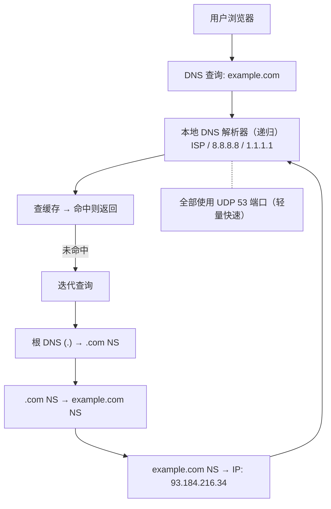
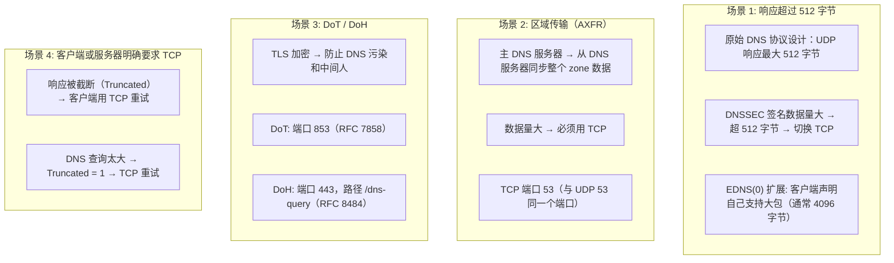
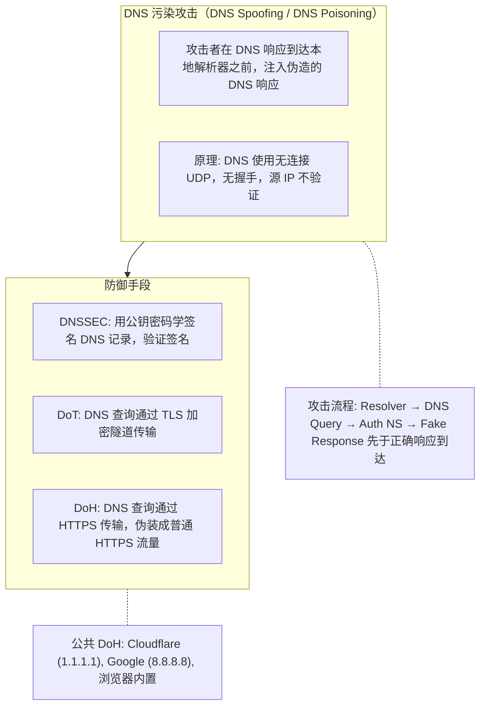

# DNS

## 1. DNS 解析全过程与 DNS 缓存

### 1.1 定义/背景

DNS（Domain Name System）是将人类可读域名（如 `www.example.com`）转换为机器 IP 地址（如 `93.184.216.34`）的分布式层级数据库。由于其分布式层级设计，完整 DNS 解析可能涉及多跳递归/迭代查询，理解各层缓存和查询类型是网络性能优化的基础。

### 1.2 DNS 解析完整流程

```
浏览器 DNS 缓存 (Chrome: chrome://net-internals/#dns)
     │ [命中则直接返回，跳过后续]
     ▼ [不存在]
系统 DNS 缓存 (Windows: ipconfig /displaydns, macOS: scutil --dns)
     │ [命中则直接返回]
     ▼ [不存在]
本地 DNS 解析器 (/etc/resolv.conf，通常为 ISP DNS 或 8.8.8.8)
     │
     ▼ [递归查询模式]
┌────────────────────────────────────────────────────────────┐
│  本地 DNS 解析器开始递归查询                                  │
│                                                            │
│  Step 1: 查询根域名服务器 (.) —— 全球 13 组根服务器         │
│       . → 返回 .com TLD 服务器地址                          │
│                                                            │
│  Step 2: 查询 .com TLD 顶级域名服务器                        │
│       .com → 返回 example.com 权威服务器地址                │
│                                                            │
│  Step 3: 查询 example.com 权威域名服务器                    │
│       example.com → 返回 A 记录: 93.184.216.34             │
│                    → 返回 AAAA 记录: 2606:2800:...         │
│                                                            │
│  最终返回: IP 地址                                          │
└────────────────────────────────────────────────────────────┘
```

### 1.3 递归查询 vs 迭代查询

```
递归查询（Resolver 替客户端完成所有查询）:
  客户端 → DNS Resolver → 根服务器 → TLD → 权威服务器 → DNS Resolver → 客户端
  (客户端只发一次请求，等一个结果)

迭代查询（每一步只返回最佳答案，客户端决定下一步）:
  客户端 → 根服务器 → [返回 TLD 地址]
  客户端 → TLD 服务器 → [返回权威地址]
  客户端 → 权威服务器 → [返回 IP]
  (DNS Resolver 通常做递归，DNS 服务器之间用迭代)
```

### 1.4 DNS 缓存层级

| 缓存位置 | 存活时间 | 优先级 | 备注 |
|---------|---------|-------|------|
| 浏览器 DNS 缓存 | TTL 分钟数或数分钟 | 最高 | Chrome 关闭后清除 |
| 操作系统 DNS 缓存 | TTL 分钟数 | 次高 | Windows/macOS 内置 |
| 本地 DNS 解析器缓存 | 可配置 | 视配置 | ISP DNS 或公共 DNS |
| 递归 DNS 服务器 | 取决于 TTL | 中 | 各大厂商 DNS 劫持案例高发区 |
| 权威 DNS 服务器 | 由域名所有者设定 | 来源 | TTL 太长会导致更新延迟 |

### 1.5 DNS 劫持案例分析

```
案例1: 运营商 DNS 劫持（最常见）
  用户访问 example.com → ISP DNS 返回劫持 IP（插广告）
  → 解决: 使用 DNSCrypt 或 DoH (DNS-over-HTTPS)

案例2: 百度/360 等国内厂商 DNS 污染
  访问 Google → DNS 返回错误 IP
  → 解决: DoH 绕过本地 DNS，直接与可信 DNS 通信

案例3: DNS 缓存投毒 (Kaminsky Attack)
  攻击者伪造 DNS 响应，提前注入错误 IP 到递归 DNS 缓存
  → 解决: 随机源端口 + DNSSEC 验证

案例4: 移动端 WiFi 强制跳转
  连接公共 WiFi 后访问任何网站都被重定向到登录页
  → 解决: DoH / DoT (DNS-over-TLS) / 4G 数据网络
```

### 1.6 DNS 代码示例

```javascript
// 场景1: HTML 中声明 DNS 预解析（最常用）
// 在 <head> 中声明，提前解析 CDN 域名
const html = `
  <link rel="dns-prefetch" href="//cdn.example.com" />
  <link rel="preconnect" href="https://cdn.example.com"
        crossorigin="anonymous" />
`;
// dns-prefetch: 仅 DNS 解析（低开销）
// preconnect: DNS + TCP + TLS 预连接（高开销，但效果更好）

// 场景2: 使用 fetch 间接触发 DNS 解析
fetch('https://example.com/favicon.ico', { mode: 'no-cors' })
  .then(() => console.log('DNS 已解析'));

// 场景3: DNS-over-HTTPS (DoH) — 防止 DNS 劫持
// 使用 Cloudflare / Google Public DNS / Quad9
async function dnsQueryDoH(domain) {
  const response = await fetch(
    `https://cloudflare-dns.com/dns-query?name=${domain}&type=A`,
    { headers: { 'Accept': 'application/dns-json' } }
  );
  const data = await response.json();
  return data.Answer?.[0]?.data; // e.g. "93.184.216.34"
}

// 场景4: DNS-over-TLS (DoT) — 加密 DNS 流量
// Node.js 示例（使用 DoT 端口 853）
import https from 'node:dns/promises';
// 注意：Node.js 原生 DoT 支持在 Node 18+ 中通过自定义 TLS 连接实现
// 实际生产环境推荐使用 dns.resolve() 并配合系统级 DoT 配置

// 场景5: 查看 Chrome DNS 缓存（仅供调试参考）
// 在浏览器地址栏输入: chrome://net-internals/#dns
// 查看 DNS Cache 状态

// 场景6: 监控 DNS 解析时间
const { promisify } = await import('node:dns');
const dns = promisify(require('node:dns'));
const start = Date.now();
const { address } = await dns.resolve4('example.com');
const duration = Date.now() - start;
console.log(`DNS 解析耗时: ${duration}ms, IP: ${address}`);
```

### 1.7 常见陷阱与最佳实践

| 陷阱 | 说明 | 解决方案 |
|------|------|---------|
| DNS 解析阻塞主线程 | 同步 DNS 解析会卡住浏览器 | 避免同步 DNS 调用，使用 `dns-prefetch` 预解析 |
| TTL 设置过长 | 域名 IP 变更后用户无法及时更新 | 静态资源域名 TTL 设置较短，及时更新配置 |
| 运营商 DNS 劫持 | ISP DNS 返回插广告的劫持页面 | 使用 DoH / DoT，使用公共 DNS（如 8.8.8.8） |
| 多个域名增加 DNS 开销 | 每个新域名都需要额外 DNS 查询 | 合并域名到同源，减少 DNS 查询数 |
| DNS 预解析失效 | HTTPS 页面对 HTTP 域名预解析被浏览器阻止 | 确保 `dns-prefetch` 和 `preconnect` 使用 HTTPS |

### 1.8 面试追问

**Q1: DNS 劫持和 DNS 污染有什么区别？**

DNS 劫持指运营商/网关篡改了 DNS 解析结果，将用户引导到指定 IP（通常是广告页面），属于主动篡改。DNS 污染（DNS pollution）指在 DNS 查询传输过程中，网络中间节点（如长城防火墙）对特定域名的查询返回虚假 IP，属于网络层面的过滤。两者都导致用户无法访问正确站点，DoH/DoT 可以同时防御。

**Q2: 什么是 DNSSEC？为什么国内很少使用？**

DNSSEC（DNS Security Extensions）通过数字签名验证 DNS 响应未被篡改。域名注册商需要在 DNS 区为每条记录配置签名，用户 resolver 验证签名链。但它不能加密 DNS 流量（需要 DoH/DoT），部署复杂，且国内运营商 DNS 劫持场景下签名验证会失败，因此国内部署率极低。

**Q3: 浏览器 DNS 缓存和 TCP 连接复用有什么关系？**

HTTP Keep-Alive 复用的是 TCP 连接，连接建立后域名已被解析，不需要再次 DNS 查询。但如果连接断开重连，就需要重新 DNS 查询。使用 HTTP/2 或 HTTP/3 时，同一域名的多个请求可以共用连接，减少 DNS 查询频率。结合 `preconnect` 可以同时预热 DNS + TCP + TLS。

## 2. DNS 解析与缓存（速记版）

### 2.1 DNS 解析流程

**DNS 解析层级（按顺序查询）：**

| 层级 | 缓存位置 | 说明 |
|------|---------|------|
| 1 | 浏览器缓存 | Chrome: chrome://net-internals/#dns |
| 2 | 系统缓存 | Windows: ipconfig /displaydns, macOS: sudo dscacheutil -flushcache |
| 3 | 本地 DNS 解析器 | /etc/resolv.conf，通常是 ISP 或 114.114.114.114 |
| 4 | 根域名服务器 (.) | 全球 13 组根服务器 |
| 5 | 顶级域名服务器 (TLD) | .com .net .org 等的 TLD 服务器 |
| 6 | 权威域名服务器 | example.com 的 NS 记录 |

**查询结果：** A 记录 / AAAA 记录 -> IP 地址（如 93.184.216.34）

### 2.2 DNS 缓存层级

| 缓存位置 | 存活时间 | 优先级 |
|---------|---------|-------|
| 浏览器 DNS 缓存 | TTL 分钟数或数分钟 | 最高 |
| 操作系统 DNS 缓存 | TTL 分钟数 | 次高 |
| 本地 DNS 解析器缓存 | 可配置 | 视配置 |
| 递归 DNS 服务器（ISP） | 取决于 TTL | 中 |
| 权威 DNS 服务器 | 由域名所有者设定 | 来源 |

### 2.3 DNS 解析代码示例

```javascript
// 在 <head> 中声明预解析
const html = `
  <link rel="dns-prefetch" href="//cdn.example.com" />
  <link rel="preconnect" href="https://cdn.example.com"
        crossorigin="anonymous" />
`;

// 使用 fetch 触发 DNS（间接方式）
fetch('https://example.com/favicon.ico', { mode: 'no-cors' })
  .then(() => console.log('DNS 已解析'));

// DNS-over-HTTPS (DoH) 示例 — 防止 DNS 污染
const dnsQuery = async (domain) => {
  const response = await fetch(
    `https://cloudflare-dns.com/dns-query?name=${domain}&type=A`,
    { headers: { 'Accept': 'application/dns-json' } }
  );
  const data = await response.json();
  return data.Answer?.[0]?.data;
};
```

## 3. DNS 用 UDP vs DNS 污染

### 3.1 定义/背景（一话说清）

DNS 主要用 UDP 53 端口查询（无握手、低延迟），但当响应超过 512 字节（DNSSEC）或进行区域传输时会切换 TCP；DNS 污染是攻击者对 DNS 查询的伪造响应，防御手段包括 DNSSEC（签名验证）、DoH（加密传输）和 DoT（TLS 加密）。

### 3.2 ASCII 原理图







### 3.3 完整代码示例（TS/JS）

```typescript
// ============ 浏览器 DNS 设置（DoH）============

// Chrome: 启用 DoH
// 设置 → 隐私和安全 → 安全 → 使用安全 DNS
// 或者通过 chrome://settings/security 访问

// 检测浏览器是否支持 DoH（通过 DNS-over-HTTPS API）
if ('dns' in window && 'resolve' in (window as any).dns) {
  const api = (window as any).dns;
  const result = await api.resolve('example.com', 'A');
  console.log('DoH 可用，当前解析结果:', result.addresses);
} else {
  console.log('浏览器不支持 DoH API');
}

// ============ 使用 fetch + DoH 查询（概念示例）============

// DoH 本质：用 HTTPS 请求代替 UDP 53 查询
// Cloudflare DoH 端点
const CLOUDFLARE_DOH = 'https://cloudflare-dns.com/dns-query';
const GOOGLE_DOH = 'https://dns.google/dns-query';

async function dohQuery(domain: string, type: string = 'A'): Promise<string[]> {
  const response = await fetch(
    `${CLOUDFLARE_DOH}?name=${domain}&type=${type}`,
    {
      headers: {
        // DoH 标准请求格式（RFC 8484）
        'Accept': 'application/dns-json',
      },
    }
  );
  const data = await response.json() as {
    Status: number;
    Answer?: { data: string; type: number }[];
  };

  if (data.Status !== 0) {
    throw new Error(`DNS 查询失败: ${data.Status}`);
  }

  return (data.Answer || []).map(a => a.data);
}

// 使用 DoH API（Chrome 96+ / Edge 96+）
async function browserDohQuery(domain: string): Promise<string[]> {
  const api = (window as any).dns;
  if (!api) throw new Error('DoH API 不可用');

  const result = await api.resolve(domain, 'A');
  return result.addresses;
}

// 对比测试
async function compareDohPerformance() {
  const domains = ['example.com', 'google.com', 'cloudflare.com'];

  for (const domain of domains) {
    const start = performance.now();

    // 传统 DNS（通过 fetch 测量连接时间）
    // 注意：fetch 不直接使用 DNS，所以用 connectStart - domainLookupStart
    // 简化：测量 HTTP 响应时间

    await fetch(`https://${domain}`, { mode: 'no-cors' });

    const duration = performance.now() - start;
    console.log(`${domain}: ${duration.toFixed(1)}ms`);
  }
}

// ============ Node.js DNS 模块（底层观察）============

import dns from 'dns';
import { promisify } from 'util';

const resolve4 = promisify(dns.resolve4);
const reverse = promisify(dns.reverse);

// DNS 解析类型
const aRecords = await resolve4('example.com');
console.log('A 记录（IPv4）:', aRecords);

// DNS over TLS (Node.js 原生不支持，需要第三方库如 dohjs/node-doh)
import { Resolver } from 'dns-promise'; // 假设的库

const resolver = new Resolver({
  endpoint: 'https://cloudflare-dns.com/dns-query',
  // 使用 DoH 查询，不经过系统 DNS
});

const result = await resolver.resolve('example.com', 'A');
console.log('DoH 查询结果:', result);

// ============ DNS 污染检测 ============

// 通过对比多个 DNS 解析结果判断是否被污染
async function detectDNSPoisoning(domain: string): Promise<{
  isPoisoned: boolean;
  results: { provider: string; ip: string }[];
}> {
  const providers = [
    { name: 'Cloudflare', ip: '1.1.1.1' },
    { name: 'Google', ip: '8.8.8.8' },
    { name: 'Quad9', ip: '9.9.9.9' },
    { name: 'AliDNS', ip: '223.6.6.6' },
  ];

  // 实际生产中需要向这些 IP 发送 DNS 查询
  // 这里模拟结果
  const results = providers.map(p => ({
    provider: p.name,
    // 真实场景：发送 DNS 查询到 p.ip
    ip: `模拟 IP for ${domain}`,
  }));

  // 检查所有结果是否一致
  const uniqueIPs = new Set(results.map(r => r.ip));
  const isPoisoned = uniqueIPs.size > 1;

  return { isPoisoned, results };
}
```

### 3.4 对比表

| 维度 | DNS over UDP | DNS over TCP | DoT (TLS) | DoH (HTTPS) |
|------|:------------:|:------------:|:---------:|:------------:|
| 端口 | 53 | 53 | 853 | 443 |
| 加密 | 无 | 无 | TLS 加密 | HTTPS（HTTP/2-3）|
| 隐私 | 无（可被监听）| 无（可被监听）| 好 | 极好（伪装为 HTTPS）|
| 性能 | 最快（无握手）| 较慢（有握手）| 较快 | 较快（HTTP/2 复用）|
| 企业管控 | 可监控 | 可监控 | 部分可监控 | 否（难监控） |
| 防污染 | 否（无） | 否（无） | 是（防注入） | 是（防注入） |
| 部署 | 原生 | 原生 | 需 DoT 服务器 | 需 DoH 服务器 |
| 浏览器支持 | N/A | N/A | 部分 | 广泛（Chrome/Firefox）|

### 3.5 常见陷阱与最佳实践

| 陷阱 | 说明 | 解决方案 |
|------|------|----------|
| 忽视 DNS 污染风险 | 企业网络/某些地区 DNS 可能被劫持 | 启用 DoH 或 DoT |
| DoH 在企业网络被阻止 | IT 管理员可能拦截 DoH 绕过审查 | 备用 DNS，提供回退方案 |
| DNS 缓存过长 | 污染的 DNS 记录被长时间缓存 | 合理设置 TTL，企业 DNS 定期刷新 |
| 混淆 DNS 污染和 DNS 投毒 | 污染 = 响应被伪造，投毒 = 缓存被污染 | 理解分层：查询层 vs 缓存层 |
| 多级 CDN 导致 DNS 复杂 | CNAME 链过长增加污染面 | 监控 CNAME 链深度 |

### 3.6 面试追问 + 参考答案要点

**Q1：DNS 为什么用 UDP 而不是 TCP？既然 TCP 更可靠？**
> DNS 选择 UDP 的核心原因是**低延迟和高效率**：DNS 是互联网中调用最频繁的协议（每个 HTTP 请求前都可能触发），用 UDP 避免握手开销（UDP 是无连接的，一个请求-响应就完成）。UDP 头部 8 字节，TCP 20 字节，对通常小于 512 字节的 DNS 查询，TCP 开销不可忽视。TCP 只在响应超过 512 字节（DNSSEC）或需要区域传输时使用。

**Q2：DNSSEC 和 DoH/DoT 解决的是同一个问题吗？有什么区别？**
> 不完全一样，是互补的。DNSSEC 解决的是**数据真实性**——验证 DNS 响应确实来自正确的权威服务器且未被篡改（通过数字签名）。DoH/DoT 解决的是**传输通道安全**——防止 DNS 查询和响应在传输过程中被监听、篡改或阻断。DNSSEC 不加密数据（只是签名），DoH 加密并隐藏查询内容。两者结合才能实现完整的 DNS 安全（真实 + 保密）。

**Q3：浏览器启用 DoH 后，企业网络管理员还能监控员工的 DNS 查询吗？**
> 基本不能，这就是 DoH 的隐私优势——DNS 查询被加密并伪装成普通 HTTPS 流量（URL 路径 /dns-query），企业代理/防火墙无法区分 DoH 流量和普通 HTTPS 请求。这带来了企业安全管控的挑战：攻击者也可能用 DoH 绕过企业 DNS 过滤。解决方案：企业可以在 DNS 层部署 DoH 代理（客户端 → 企业 DoH 代理 → 外部 DoH），或使用安全 DNS 服务（SES 或 1.1.1.1 for Business）。

### 3.7 参考来源 URL

- RFC 1035 (DNS): https://www.rfc-editor.org/rfc/rfc1035
- RFC 8484 (DoH): https://www.rfc-editor.org/rfc/rfc8484
- RFC 7858 (DoT): https://www.rfc-editor.org/rfc/rfc7858
- DNSSEC: https://www.icann.org/resources/pages/dnssec-what-is-it-why-important-2019-03-05-en
- Cloudflare DoH: https://cloudflare.com/1.1.1.1/encryption/dns-over-https/

## 4. DNS 为什么用 UDP 与 DNS 污染（速记版）

```
DNS 使用 UDP 的原因:
1. 低延迟: UDP 无握手，查询速度极快
2. 简单性: DNS 设计于 1983 年，协议简单高效
3. 轻量: 每个 DNS 响应通常 < 512 bytes

DNS 何时使用 TCP:
1. 响应超过 512 bytes（DNSSEC 签名数据大）
2. 区域传输 (AXFR)
3. DoT/DoH (DNS over TLS/HTTPS)

DNS 污染防御:
1. DNSSEC（DNS Security Extensions）— 用公钥签名 DNS 记录
2. DoH (DNS over HTTPS) — DNS 查询通过加密通道传输
3. DoT (DNS over TLS)
```

## 应用与行业实践

把域名解析看成一次网络请求的前置步骤：它耗时、会失败、结果按 TTL 被缓存。下面把本页知识落到具体场景上。

### 应用场景地图

| 场景 | 用到本页哪个知识点 | 典型技术选型 | 注意事项 |
| --- | --- | --- | --- |
| 后台管理导出万行表格，翻页时首包延迟抖动 | 解析耗时、缓存层级、多跳递归 | 进程内单例 HTTP 客户端加连接池 | 连接复用不改变 TTL，改解析后要等 TTL 到期 |
| 低端安卓机冷启动首屏白屏 | 解析排队、缓存命中 | 后台线程预热域名加系统解析缓存 | 预热失败不要重试，交给真实请求兜底 |
| 多人协作白板的长连接重连 | 分布式层级、TTL、多记录查询 | WebSocket 加 SRV 记录加多实例 | 长连接把 IP 固定在进程里，切流要主动断开 |
| 灰度发布把部分流量切到新集群 | 递归查询与缓存 TTL | 加权 DNS 或独立灰度域名 | TTL 设大时回滚慢，回滚预案要含刷新缓存 |
| 容器内微服务按域名互调 | 递归解析器、search 域拼接 | CoreDNS 加 Headless Service | 核对 ndots 与 search 域，防止解析次数放大 |
| 单机爬虫每秒发起大量请求 | 解析开销、缓存 | 进程内 DNS 缓存加连接池 | 缓存要有容量上限与过期时间，否则换 IP 不生效 |
| 门店收银系统断网后恢复联网 | 缓存写入、超时与重试 | 本地解析器加短超时重试 | 断网期间不要把失败结果写进缓存 |
| 客服收到"某站点打不开"工单后的解析层排查 | UDP 查询、DNS 污染 | 用多个解析器对比返回结果 | 指定解析器逐个对比，不要只看单一结论 |

### 三个场景拆解

#### 场景 1：后台管理的万行表格导出

**业务背景**：导出本身是低频操作，但打开页面后的翻页与筛选请求很密集，单次会话能发出成百上千次请求。痛点是首包延迟比后续请求高出一截，用户感觉页面"点一下卡一下"。

**怎么用本页知识解决**：思路是让解析与建连只发生一次，后续请求走同一条连接。解析结果的有效期交给 TTL 管，连接的有效期交给连接池管，两件事分开配置。

```go
// 全局只建一个客户端，避免每次请求重建连接池
var httpClient = &http.Client{
    Timeout: 5 * time.Second,
    Transport: &http.Transport{
        // 同域名保持足够的空闲连接，翻页请求直接复用
        MaxIdleConnsPerHost: 32,
        // 空闲连接保活时间，到期后重新建连并重新解析
        IdleConnTimeout: 90 * time.Second,
        // 建连阶段单独设超时，解析慢时以可预期错误结束
        DialContext: (&net.Dialer{
            Timeout:   2 * time.Second,
            KeepAlive: 30 * time.Second,
        }).DialContext,
    },
}
```

- 第二次翻页命中连接池，跳过解析与 TCP 握手，首包延迟的抖动随之下降。
- 建连超时只覆盖握手阶段，解析卡住时请求会快速失败，不会一直挂着占用线程。
- 连接池的存活时间与域名 TTL 是两套机制，前者管 TCP 复用，后者管解析结果何时刷新。
- 把客户端做成进程级单例，避免在每个请求处理函数里新建。

**怎么度量收益**：看 `time_namelookup` 与首包延迟 P95。测量方法是用 `curl -w '%{time_namelookup} %{time_connect} %{time_starttransfer}\n' -o /dev/null -s https://api.example.com/health` 连测 20 次，比较首尾差异；同时在解析器侧跑 `tcpdump -i any port 53 -nn`，数同一时间窗内的查询包数量。

**什么时候不该用**：
- 目标域名按租户拼接，每个请求域名都不同：连接池复用不到，应把域名收敛到一个入口，用 Host 头或路径区分租户。
- 业务要求故障时秒级摘除实例：连接池会把旧 IP 留在进程里，需要配合服务端主动断开或缩短空闲连接保活时间。

#### 场景 2：低端安卓机冷启动首屏

**业务背景**：启动阶段要连接口域名、图片 CDN 域名、埋点域名，弱网下解析请求排队，首屏白屏时间被拉长。规模量级可以用测试机复现：同一台设备重复冷启动，观察中位数的波动范围。

**怎么用本页知识解决**：思路是把解析从关键路径上挪走，在后台线程并发预热，主线程不等结果。预热只是把结果放进系统解析缓存，业务代码仍按原有方式发请求。

```java
// 启动时在后台线程并发预热核心域名，不阻塞首屏渲染
ExecutorService pool = Executors.newFixedThreadPool(3);
for (String host : new String[]{"api.example.com", "img.example.com"}) {
    pool.execute(() -> {
        try {
            // 触发一次解析，结果进入系统解析缓存
            InetAddress.getByName(host);
        } catch (UnknownHostException e) {
            // 预热失败不重试，真实请求会再解析一次
        }
    });
}
```

- 预热放在后台线程池，主线程不等待，首屏渲染不被解析阻塞。
- 预热失败的域名不做补偿，保持单一失败路径，避免启动阶段出现重试风暴。
- 线程池容量按要预热的域名个数设置，域名数量增长时同步调整。
- 预热只覆盖启动阶段必用的域名，其余域名按需解析。

**怎么度量收益**：看冷启动时长与首屏可见时间，用 `adb shell am start -W` 重复冷启动 20 次取中位数；再配合 Perfetto 抓一次启动阶段的网络时间线，确认解析阶段前移。解析失败率从客户端上报里按域名拆分统计。

**什么时候不该用**：
- 启动后十秒内不发网络请求的纯本地工具：预热是白做功，先做懒加载。
- 解析结果由 HTTPDNS 从服务端下发：系统解析缓存与它无关，要预热 HTTPDNS 客户端自己的缓存。

#### 场景 3：多人协作白板的长连接

**业务背景**：房间里每个用户维持一条 WebSocket，房间人数从个位数到几十人。服务端滚动发布时客户端断线重连，若重连时仍用缓存住的旧 IP，会连到已经下线的实例上。

**怎么用本页知识解决**：思路是让服务端实例列表由 DNS 记录表达，客户端每次重连都重新查一次，用完就丢，不把结果长期缓存在内存里。

```js
const dns = require('node:dns').promises;

async function pickBackend() {
  // 查 SRV 记录，拿到实例地址与端口，绕过单一 A 记录
  const records = await dns.resolveSrv('_whiteboard._tcp.example.com');
  // 先按优先级排序，再在同优先级内随机，避免压到同一实例
  records.sort((a, b) => a.priority - b.priority || Math.random() - 0.5);
  return records[0];
}
```

- 实例增减只改一条 SRV 记录，客户端不用跟着发版。
- 随机只在同优先级内做，保证优先级的语义不被破坏。
- 重连前重新解析，解析结果随连接一起丢弃，不受进程内长缓存影响。
- 查询失败时回退到上一次可用地址，同时上报一次失败事件。

**怎么度量收益**：看重连成功率、重连耗时 P95、解析 QPS。解析 QPS 从 CoreDNS 的 metrics 插件导出的请求计数看，指标名以你所用版本文档为准；重连耗时在客户端按"断开到重新连上"打点成直方图。

**什么时候不该用**：
- 后端只有单个实例：SRV 记录只增加一次查询，拿不到收益。
- 要求故障切换在毫秒级完成：DNS 的 TTL 粒度是秒级起步，改走代理层或服务端推送。

### 行业先进实践

**Happy Eyeballs（出处：IETF RFC 8305）**
客户端对 IPv6 与 IPv4 并行发起连接尝试，先建成的胜出，避免一侧不可达时串行等待。有效的原因是连接建立时间由可用的那条路径决定，而不是把两条路径的等待相加。借鉴方式：先确认自己的客户端同时查询 A 与 AAAA，再核对建连逻辑是不是并行，串行实现可以加一个短的 IPv6 等待窗口。

**DNS over HTTPS（出处：IETF RFC 8484；Firefox 官方文档的 DNS over HTTPS 说明）**
把 DNS 查询封装进 HTTPS 请求发给解析器，明文应答被中间设备篡改的成本变高。借鉴方式：先梳理哪些客户端跑在公共 WiFi、门店这类不可信网络，在这批客户端上试点，并保留按域名回退到系统解析器的开关。

**Kubernetes 的服务发现与 CoreDNS（出处：Kubernetes 官方文档 DNS for Services and Pods；CoreDNS 项目文档）**
Pod 通过 Service 名或 Headless Service 的 SRV 记录找到后端，集群内解析由 CoreDNS 承担，实例增减只改记录与 Endpoint。借鉴方式：核对 Pod 的 ndots 与 search 域配置，避免短名被拼成多个后缀依次查询；核对 CoreDNS 的 metrics 插件暴露的请求计数指标名。

**页面预解析提示（出处：MDN 文档 HTML attribute: rel）**
在页面头部用 `rel="dns-prefetch"` 与 `rel="preconnect"` 声明第三方域名，浏览器在空闲时提前完成解析与建连。借鉴方式：先看 DevTools Network 面板里 Connection Start 分组，确认第三方域名的解析确实排在主文档请求之后，再只对确实要用的域名加提示。

**Android 的 DnsResolver（出处：Android 官方文档）**
它提供比 `InetAddress` 可控的异步解析接口，便于给单次解析设超时并拿到失败原因。需核对官方文档：DnsResolver 的最低 API 等级、回调所在线程、是否支持自定义解析器与超时参数。

### 从学到用：落地路线

1. **试点**：先在后台管理这类可控入口做客户端复用与解析阶段打点。验收标准：面板上能同时看到解析阶段耗时与请求总数。
2. **验证**：把 TTL 与解析器配置纳入配置管理，做一次改记录并观测生效时间的实验。验收标准：写下"改记录到全量生效"的实测区间，并说明各缓存层级的作用。
3. **推广**：按客户端类型分批上线预解析、DoH、SRV 发现，每批带回退开关。验收标准：回退开关能在一次发布内生效，上线前后的解析失败率可对比。
4. **防回退**：把解析超时、TTL 上限、缓存容量写进代码规约与巡检项。验收标准：CI 或巡检能拦住"每个请求新建客户端"的写法。

### 动手作业

**目标**：给一个小服务加上"解析可观测、缓存可控"的用法，并用数据说明收益。

**步骤**：
1. 选一个自己可控的域名，用 `dig` 记录当前的 A、AAAA 与 TTL 值。
2. 写一个最小客户端，连测 20 次目标接口，记录每次的解析耗时与首包耗时。
3. 把客户端改成复用连接池的写法，重复第 2 步，保留两组数据。
4. 在解析器侧抓包：`tcpdump -i any port 53 -nn`，数两种写法下同一时间窗内的查询次数。
5. 把域名 TTL 改短再改回，记录生效时间与缓存层级的对应关系。
6. 写一页结论：哪些场景值得复用连接，哪些场景必须每次重新解析。

**验收标准**：
- 两组各 20 次的记录齐全，字段包含解析耗时与首包耗时。
- 抓包结果能说出查询次数差异，并指出差异来自哪一层缓存。
- TTL 实验给出"改记录到观测生效"的时间区间，且与 TTL 数值一致。
- 结论里写出至少两条不该复用连接的场景，并说明触发条件。
- 所有命令与配置可被他人按同样步骤复现。

