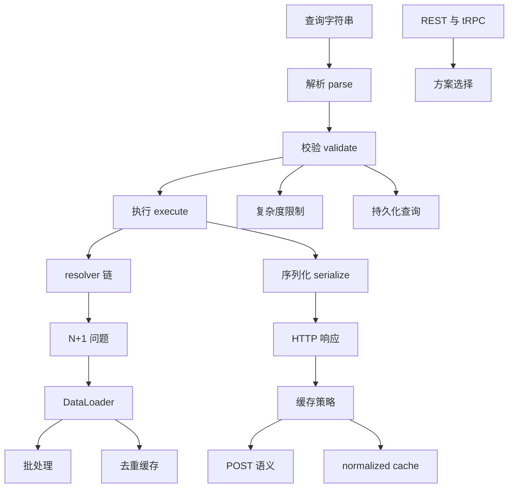
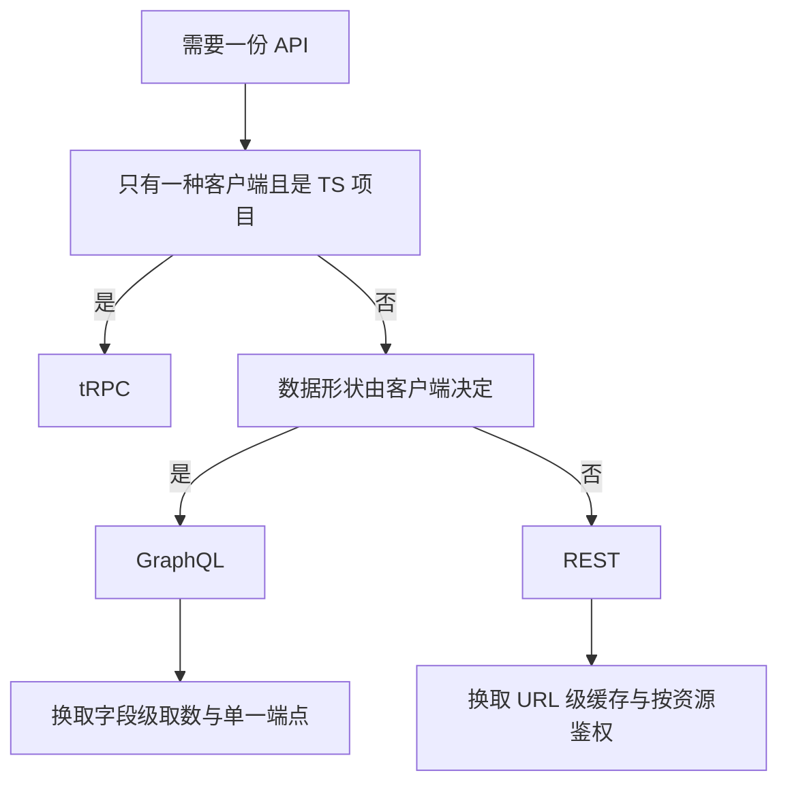
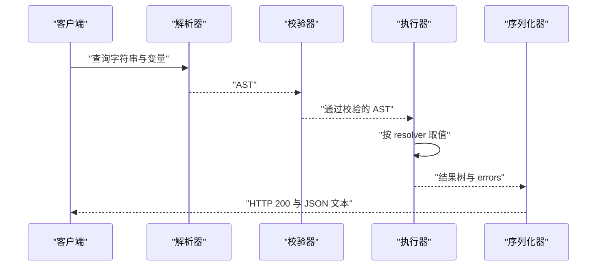
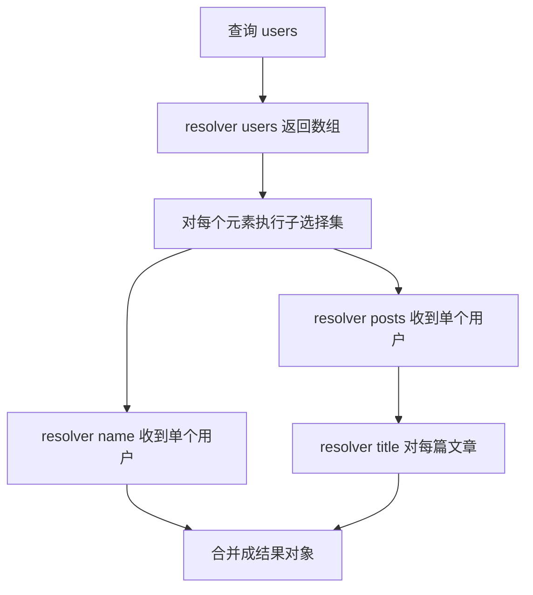
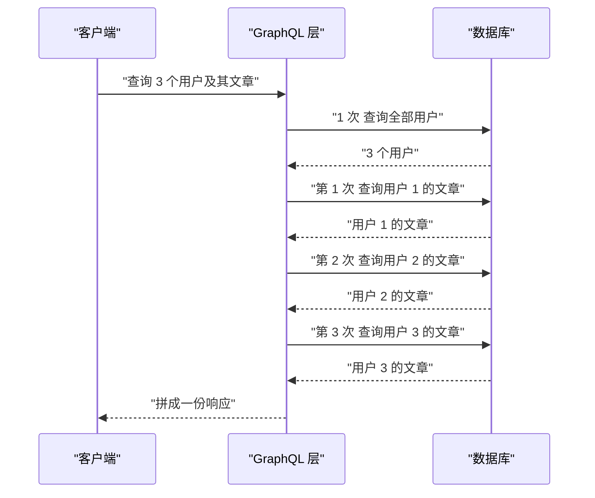
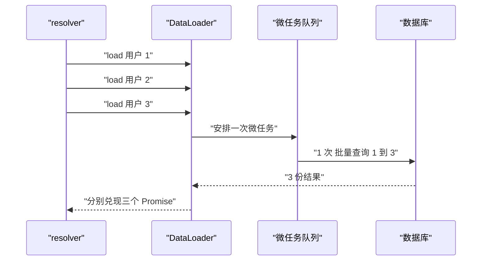
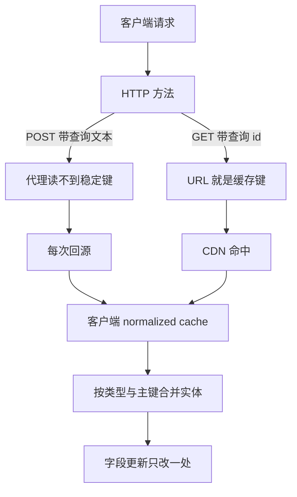
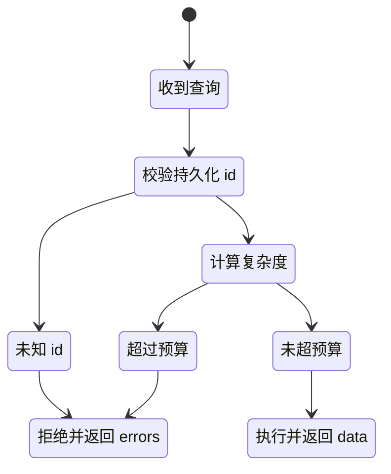

# GraphQL 与 API 设计：执行模型、N+1 与缓存

!!! abstract "学完这一页你能"
    - 说清一次 GraphQL 请求从字符串到 JSON 的四步流水线，以及每一步失败时客户端看到什么。
    - 手写一个能跑嵌套字段选择的迷你执行器，并解释 resolver 链的调用顺序。
    - 复现 N+1 问题，再用基于微任务调度的 DataLoader 把数据访问次数从 4 次压到 2 次。
    - 判断一份 API 该用 REST、tRPC 还是 GraphQL，并指出它的缓存键从哪里来。

## 0. 知识地图



建议按 1 到 7 的顺序读。第 1 节先做方案选择，第 2、3 节讲清执行模型，第 4、5 节解决执行中最常见的性能问题。

第 6、7 节把 GraphQL 当成一层可控的输入来治理：缓存怎么放、查询怎么限。每节末尾的动手验证脚本可以单独运行。

## 1. 方案选择：REST、tRPC、GraphQL 各自解决什么

**先想一个问题**

移动端首页要展示用户名、头像和最近 3 篇文章标题。用 REST 时，`/users/1` 会返回整份资料含 30 个字段，文章还要再请求 `/users/1/posts`。

两次往返，其中一次传输的内容用不上。这页要回答第一个问题：什么时候值得换协议。

**心智模型**

!!! tip "心智模型"
    - 一句话模型：GraphQL 把取数形状的决定权从服务端移到客户端，代价是服务端要为任意字段组合负责。
    - 日常类比：餐厅点菜，你在单子上勾选要吃的菜，厨房只做勾选的这些，一次上齐。
    - 类比不成立的地方：厨房不用为每种勾选组合重新备菜，GraphQL 服务端要为每种字段组合保证 resolver 正确且不超预算。

!!! note "术语：GraphQL"
    一种 API 查询语言与运行时，客户端发送描述字段的选择集，服务端按这份选择集取值。例：`{ user(id: 1) { name } }` 只返回 name。

**图解**



1. 先问客户端有几种。只有一种且前后端共用 TypeScript 时，tRPC 直接复用类型定义，不需要 schema 文件。
2. 再问数据形状谁说了算。多个客户端各自要不同字段时，服务端无法提前为每种组合定制端点，GraphQL 交给客户端写选择集。
3. 如果数据天然按资源划分、每个页面要的字段固定，REST 的 URL 直接当缓存键，代理层不需要理解请求体。
4. 三条路都会付出代价：tRPC 绑定 TS，GraphQL 要治理查询输入，REST 会产生超取与多次往返。

**一步一步来**

**第 1 步：用 REST 取首页需要的两段数据**

```js
// 第 1 跳：用户基本资料，响应里含 30 个字段
const userRes = await fetch('https://api.example.com/users/1');
const user = await userRes.json();

// 第 2 跳：该用户的文章列表
const postsRes = await fetch('https://api.example.com/users/1/posts');
const posts = await postsRes.json();

// 只挑首页用得上的三个值
const view = { name: user.name, avatar: user.avatar, posts: posts.map((p) => p.title) };
```

**这段代码在做什么**

- 两次 `fetch` 各自建立一个 HTTP 请求，总往返数为 2。
- `/users/1` 的响应体包含首页不用的字段，这部分字节照常传输与解析。
- `/users/1/posts` 返回全部文章，前端再截取前 3 条。
- 客户端拿到的数据形状由服务端决定，字段改名要改动两次请求的解析代码。

**运行结果**

```
往返次数: 2
传输字节: 用户资料 512 字节 + 文章列表 96 字节
首页实际使用字段: 3 个
```

**第 2 步：用一次 GraphQL 请求取回同样的数据**

```js
const query = `
  query Home($id: ID!) {
    user(id: $id) {
      name
      avatar
      posts(first: 3) { title }   # first 是服务端定义的分页参数
    }
  }
`;

const res = await fetch('https://api.example.com/graphql', {
  method: 'POST',                                   // GraphQL over HTTP 常用 POST
  headers: { 'content-type': 'application/json' },
  body: JSON.stringify({ query, variables: { id: '1' } }),
});
const { data, errors } = await res.json();          // errors 与 data 可以同时存在
```

**这段代码在做什么**

- 只有一个端点 `/graphql`，路由信息写在请求体里。
- 选择集里出现的字段才会被解析返回，`name` 与 `avatar` 之外的用户字段不出现在响应里。
- `variables` 把参数与查询文本分开，同一段查询文本可以被缓存和复用。
- 响应里 `data` 与 `errors` 是两个独立字段，部分字段失败时 `data` 仍可能有值。

**运行结果**

```
往返次数: 1
传输字节: 用户所需字段 84 字节
HTTP 状态: 200
```

**动手验证**

依赖：无，Node 20 自带 `node:http` 与全局 `fetch`。

```js
// rest-vs-graphql.mjs
import { createServer } from 'node:http';
import { strict as assert } from 'node:assert';

let restHits = 0;
let gqlHits = 0;
const bio = 'x'.repeat(400);            // 模拟 REST 里首页用不到的字段

const server = createServer(async (req, res) => {
  res.setHeader('content-type', 'application/json');
  if (req.url === '/rest/users/1') {
    restHits += 1;
    res.end(JSON.stringify({ id: 1, name: 'Ada', avatar: 'a.png', bio }));
    return;
  }
  if (req.url === '/rest/users/1/posts') {
    restHits += 1;
    res.end(JSON.stringify([{ title: 'graphql' }, { title: 'cache' }]));
    return;
  }
  if (req.url === '/graphql') {
    gqlHits += 1;
    let body = '';
    for await (const chunk of req) body += chunk;      // 请求体要手动读完
    const { query } = JSON.parse(body);
    assert.match(query, /posts/);                      // 断言客户端确实请求了 posts
    res.end(JSON.stringify({
      data: { user: { name: 'Ada', avatar: 'a.png', posts: [{ title: 'graphql' }, { title: 'cache' }] } },
    }));
    return;
  }
  res.statusCode = 404;
  res.end('{}');
});

await new Promise((resolve) => server.listen(0, resolve));
const base = `http://127.0.0.1:${server.address().port}`;

const user = await (await fetch(`${base}/rest/users/1`)).json();
const posts = await (await fetch(`${base}/rest/users/1/posts`)).json();
const restBytes = JSON.stringify({ user, posts }).length;

const query = '{ user(id: 1) { name avatar posts { title } } }';
const gql = await (await fetch(`${base}/graphql`, {
  method: 'POST',
  headers: { 'content-type': 'application/json' },
  body: JSON.stringify({ query }),
})).json();
const gqlBytes = JSON.stringify(gql).length;

assert.equal(restHits, 2);                            // REST 需要两次命中
assert.equal(gqlHits, 1);                             // GraphQL 只命中一次
assert.ok(restBytes > gqlBytes * 2, 'REST 响应明显更长');
console.log({ restHits, gqlHits, restBytes, gqlBytes });
server.close();
```

预期输出：

```
{ restHits: 2, gqlHits: 1, restBytes: 480, gqlBytes: 104 }
```

**常见坑**

| 现象 | 原因 | 怎么修 |
|:--|:--|:--|
| 换了 GraphQL，接口数量反而变多 | 每个页面写一段查询，没有人维护字段规范 | 建立 schema 评审流程，废弃字段走 `@deprecated` |
| 响应 200 但页面空白 | 只看 `data`，没检查 `errors` 数组 | 请求封装里同时解构 `data` 与 `errors`，有 errors 就上报 |
| tRPC 在移动端无法调用 | tRPC 依赖 TypeScript 类型在编译期对齐 | 需要多语言客户端时改用 GraphQL 或 REST |

**小结**

- GraphQL 用一次往返换字段级取数，代价是服务端要处理任意选择集。
- tRPC 适合单一 TS 客户端，REST 适合资源划分清楚的公开接口。
- 选型先问客户端数量，再问数据形状由谁决定。

## 2. 执行模型：解析、校验、执行、序列化

**先想一个问题**

客户端发来 `{ hello user(id: 1) { name } }`。服务端拿到的是一个字符串，它要先证明这段字符串合法，再去取数。

如果字段名写错了，服务端应该在取数之前就拒绝。这一节把这四步拆开看。

**心智模型**

!!! tip "心智模型"
    - 一句话模型：一次 GraphQL 请求是一条约定的流水线，字符串依次变成语法树、校验报告、结果树、JSON 文本。
    - 日常类比：寄快递先填单，柜台核对地址格式，再分拣运输，最后贴上面单。
    - 类比不成立的地方：快递员不会因为一个包裹地址错就退回整车，GraphQL 的校验失败会拒绝整份查询。

!!! note "术语：AST"
    Abstract Syntax Tree，抽象语法树，把源代码的结构表示成树形对象。例：`parse('{ hello }')` 得到一个 `Document` 节点，里面是 `Field` 节点。

**图解**



1. 解析阶段只关心括号、字段名、参数这些词法结构，不检查字段是否存在。
2. 校验阶段拿 AST 与 schema 比对，字段名、参数类型、必填参数都在这里检查。
3. 执行阶段调用 resolver 取数，把返回值按选择集裁剪成结果树。
4. 序列化阶段把结果树与错误列表转成 JSON 文本，状态码通常仍是 200。

**一步一步来**

**第 1 步：解析成 AST**

```js
import { parse } from 'graphql';   // 依赖: npm i graphql

const document = parse('{ hello user(id: 1) { name } }');

console.log(document.kind);                                 // Document
console.log(document.definitions[0].selectionSet.selections.map((s) => s.name.value));
```

**这段代码在做什么**

- `parse` 只做词法与语法分析，输入不合法时抛 `GraphQLError`。
- `document.kind` 是 `Document`，顶层可以有多段操作。
- 每个 `selection` 的 `name.value` 是字段名字符串。
- 这一步不会告诉你 `hello` 是否存在，也不看 schema。

**运行结果**

```
Document
[ 'hello', 'user' ]
```

**第 2 步：用 schema 校验**

```js
import { buildSchema, parse, validate } from 'graphql';

const schema = buildSchema(`
  type Query { hello: String!, user(id: ID!): User }
  type User { id: ID!, name: String! }
`);

const ok = parse('{ hello user(id: 1) { name } }');
console.log(validate(schema, ok).length);          // 0

const bad = parse('{ hello unknownField }');
const errors = validate(schema, bad);
console.log(errors.length, errors[0].message);
```

**这段代码在做什么**

- `buildSchema` 把 SDL 字符串编译成可校验的 schema 对象。
- `validate` 返回数组，空数组代表通过。
- 写错字段名时返回 1 条错误，且没有执行任何 resolver。
- 错误文案由库提供，跨版本可能微调，需核对官方文档：`graphql-js` 的 Validation 章节中错误消息的稳定性说明。

**运行结果**

```
0
1 Cannot query field "unknownField" on type "Query".
```

**第 3 步：执行并序列化**

```js
import { buildSchema, parse, execute } from 'graphql';

const schema = buildSchema(`
  type Query { hello: String!, user(id: ID!): User }
  type User { id: ID!, name: String! }
`);
const rootValue = {
  hello: () => 'world',
  user: ({ id }) => ({ id, name: 'Ada' }),     // 参数从第一个入参解构
};

const document = parse('{ hello user(id: 1) { name } }');
const result = await execute({ schema, document, rootValue });

console.log(result.data);
console.log(JSON.stringify(result));
```

**这段代码在做什么**

- `execute` 从根类型开始逐字段调用 `rootValue` 上的函数。
- `user(id: 1)` 的 `1` 被 ID 类型强制转成字符串 `"1"`。
- 结果树里只保留选择集出现的字段，`hello` 与 `user.name` 都在。
- 序列化后是一个普通 JSON 文本，错误会放在 `errors` 数组而不是状态码里。

**运行结果**

```
{ hello: 'world', user: { id: '1', name: 'Ada' } }
{"data":{"hello":"world","user":{"id":"1","name":"Ada"}}}
```

**动手验证**

依赖：`npm i graphql`。

```js
// phases.mjs
import { strict as assert } from 'node:assert';
import { buildSchema, parse, validate, execute } from 'graphql';

const schema = buildSchema(`
  type Query { hello: String!, user(id: ID!): User }
  type User { id: ID!, name: String! }
`);
const rootValue = {
  hello: () => 'world',
  user: ({ id }) => ({ id, name: 'Ada' }),
};

// 1. 解析
const document = parse('{ hello user(id: 1) { name } }');
assert.equal(document.kind, 'Document');

// 2. 校验
assert.equal(validate(schema, document).length, 0);
const badErrors = validate(schema, parse('{ hello unknownField }'));
assert.equal(badErrors.length, 1);

// 3. 执行
const result = await execute({ schema, document, rootValue });
assert.deepEqual(result.data, { hello: 'world', user: { id: '1', name: 'Ada' } });
assert.equal(result.errors, undefined);

// 4. 序列化
const text = JSON.stringify(result);
assert.equal(text.includes('"data"'), true);
console.log(text);
```

预期输出：

```
{"data":{"hello":"world","user":{"id":"1","name":"Ada"}}}
```

**常见坑**

| 现象 | 原因 | 怎么修 |
|:--|:--|:--|
| 客户端收到 200 却拿不到数据 | 错误放在响应体的 `errors` 里，状态码不是 400 | 请求封装检查 `errors`，非空就抛异常 |
| 校验通过但运行时崩 | 校验只保证结构与 schema 一致，不保证 resolver 返回类型 | 在 resolver 内返回 Promise 并用断言守住类型 |
| 服务启动后改了 schema 不生效 | schema 在启动时编译一次 | 改 SDL 后重启进程，或用开发态热重载 |

**小结**

- 四个阶段顺序固定：解析、校验、执行、序列化。
- 校验失败不会触发任何 resolver，这是它省成本的地方。
- 错误与数据可以同时出现在一份响应里。

## 3. resolver 链与字段选择：手写迷你执行器

**先想一个问题**

`{ users { name posts { title } } }` 这段查询里没有出现任何路径信息。服务端怎么知道 `posts` 要从哪个用户取？

答案是：resolver 的第一个参数是父字段的返回值。这一节用手写代码把这层传递关系跑通。

**心智模型**

!!! tip "心智模型"
    - 一句话模型：resolver 链是一次深度优先遍历，每个字段的函数拿到父对象，返回它的值。
    - 日常类比：剥洋葱，外层字段剥开后，内层字段看到的就是外层剩下的那层。
    - 类比不成立的地方：洋葱的层是固定的，GraphQL 的层级由客户端选择集决定，同一份数据可能被请求成三种形状。

!!! note "术语：resolver"
    解析函数，负责为某个字段返回值，签名通常是 `(parent, args, context, info)`。例：`posts: (user) => db.postsByUser(user.id)`。

**图解**



1. 根字段 `users` 的 resolver 不接收父对象，直接返回数组。
2. 执行器发现该字段带了子选择集，于是对数组里每个元素调用 `name` 与 `posts`。
3. `posts` 返回新数组，执行器继续对每篇文章调用 `title`。
4. 所有叶子字段取完后，结果按选择集拼回原形状。

**一步一步来**

**第 1 步：词法分析，把字符串切成 token**

```js
export function tokenize(src) {
  // 依次匹配标点、字段名、数字、字符串，y 标记表示从 lastIndex 处开始
  const re = /[{}():,]|[A-Za-z_][A-Za-z0-9_]*|-?\d+(?:\.\d+)?|"(?:[^"\\]|\\.)*"/y;
  const out = [];
  let i = 0;
  while (i < src.length) {
    if (/\s/.test(src[i])) { i += 1; continue; }      // 跳过空白
    re.lastIndex = i;
    const m = re.exec(src);
    if (!m) throw new Error('位置 ' + i + ' 出现未知字符');
    out.push(m[0]);
    i = re.lastIndex;
  }
  return out;
}
```

**这段代码在做什么**

- 正则按优先级排列，标点先于字段名匹配，避免把逗号读进名字。
- `y` 标记是粘性匹配，保证从当前位置往后连续扫描。
- 字符串分支带转义处理，`"a\"b"` 会被当成一个 token。
- 遇到正则覆盖不到的字符立刻抛错，不做静默跳过。

**运行结果**

```
tokenize('{ user(id: 1) { name } }')
['{','user','(','id',':','1',')','{','name','}','}']
```

**第 2 步：语法分析，生成嵌套选择集**

```js
export function parse(src) {
  const tokens = tokenize(src);
  let pos = 0;
  const peek = () => tokens[pos];
  const take = () => tokens[pos++];

  function selectionSet() {
    if (take() !== '{') throw new Error('此处需要花括号开头');
    const fields = [];
    while (peek() !== '}') {
      const name = take();
      const args = {};
      if (peek() === '(') {                  // 括号里是参数列表
        take();
        while (peek() !== ')') {
          const key = take();
          take();                            // 跳过冒号
          const raw = take();
          args[key] = raw[0] === '"' ? raw.slice(1, -1) : Number(raw);
          if (peek() === ',') take();
        }
        take();
      }
      fields.push({ name, args, selection: peek() === '{' ? selectionSet() : [] });
    }
    take();
    return fields;
  }

  const fields = selectionSet();
  if (pos !== tokens.length) throw new Error('查询结尾有多余内容');
  return { fields };
}
```

**这段代码在做什么**

- `pos` 是游标，`peek` 看不消费，`take` 看完就前进。
- 每个字段记录三样东西：字段名、参数对象、子选择数组。
- 遇到左花括号就递归进一层，这是嵌套查询的来源。
- 解析完必须消费掉全部 token，否则说明有多余内容。

**第 3 步：递归执行选择集**

```js
export async function runQuery(resolvers, document, rootValue) {
  async function run(parent, fields) {
    const out = {};
    for (const field of fields) {
      const resolver = resolvers[field.name];
      if (!resolver) throw new Error('缺少 resolver: ' + field.name);
      const value = await resolver(parent, field.args);
      if (field.selection.length === 0) {
        out[field.name] = value;                       // 叶子字段直接赋值
        continue;
      }
      out[field.name] = Array.isArray(value)
        ? await Promise.all(value.map((item) => run(item, field.selection)))
        : await run(value, field.selection);           // 单个对象继续下钻
    }
    return out;
  }
  return run(rootValue, document.fields);
}
```

**这段代码在做什么**

- `await` 让异步 resolver 也能被同一条链处理。
- 数组分支用 `Promise.all` 并发处理每个元素，顺序由数组下标保证。
- 单对象分支直接递归，对应一对一关系。
- 缺 resolver 时抛错，行为与真实实现里的非空字段错误接近。

**运行结果**

```
runQuery 返回:
{ users: [ { name: 'Ada', posts: [ { title: 'graphql' } ] } ] }
```

**动手验证**

依赖：无第三方依赖，单文件运行。

```js
// mini-executor.mjs
import { strict as assert } from 'node:assert';

function tokenize(src) {
  const re = /[{}():,]|[A-Za-z_][A-Za-z0-9_]*|-?\d+(?:\.\d+)?|"(?:[^"\\]|\\.)*"/y;
  const out = [];
  let i = 0;
  while (i < src.length) {
    if (/\s/.test(src[i])) { i += 1; continue; }
    re.lastIndex = i;
    const m = re.exec(src);
    if (!m) throw new Error('位置 ' + i + ' 出现未知字符');
    out.push(m[0]);
    i = re.lastIndex;
  }
  return out;
}

function parse(src) {
  const tokens = tokenize(src);
  let pos = 0;
  const peek = () => tokens[pos];
  const take = () => tokens[pos++];
  function selectionSet() {
    if (take() !== '{') throw new Error('此处需要花括号开头');
    const fields = [];
    while (peek() !== '}') {
      const name = take();
      const args = {};
      if (peek() === '(') {
        take();
        while (peek() !== ')') {
          const key = take();
          take();
          const raw = take();
          args[key] = raw[0] === '"' ? raw.slice(1, -1) : Number(raw);
          if (peek() === ',') take();
        }
        take();
      }
      fields.push({ name, args, selection: peek() === '{' ? selectionSet() : [] });
    }
    take();
    return fields;
  }
  const fields = selectionSet();
  if (pos !== tokens.length) throw new Error('查询结尾有多余内容');
  return { fields };
}

async function runQuery(resolvers, document, rootValue) {
  async function run(parent, fields) {
    const out = {};
    for (const field of fields) {
      const resolver = resolvers[field.name];
      if (!resolver) throw new Error('缺少 resolver: ' + field.name);
      const value = await resolver(parent, field.args);
      if (field.selection.length === 0) { out[field.name] = value; continue; }
      out[field.name] = Array.isArray(value)
        ? await Promise.all(value.map((item) => run(item, field.selection)))
        : await run(value, field.selection);
    }
    return out;
  }
  return run(rootValue, document.fields);
}

const db = {
  users: [{ id: 1, name: 'Ada' }, { id: 2, name: 'Linus' }],
  posts: { 1: [{ title: 'graphql' }, { title: 'cache' }], 2: [{ title: 'kernel' }] },
};
const resolvers = {
  users: () => db.users,
  name: (user) => user.name,
  posts: (user) => db.posts[user.id],
  title: (post) => post.title,
};

const document = parse('{ users { name posts { title } } }');
const result = await runQuery(resolvers, document, null);

assert.deepEqual(result, {
  users: [
    { name: 'Ada', posts: [{ title: 'graphql' }, { title: 'cache' }] },
    { name: 'Linus', posts: [{ title: 'kernel' }] },
  ],
});
assert.throws(() => parse('{ users { name'), /需要花括号|多余内容/);
console.log(JSON.stringify(result));
```

预期输出：

```
{"users":[{"name":"Ada","posts":[{"title":"graphql"},{"title":"cache"}]},{"name":"Linus","posts":[{"title":"kernel"}]}]}
```

**常见坑**

| 现象 | 原因 | 怎么修 |
|:--|:--|:--|
| 字段值变成 Promise 对象 | 忘记 `await` resolver 返回值 | 在执行器里统一 `await`，resolver 保持纯函数 |
| 迷你执行器遇到重名字段串味 | 用字段名做 resolver 的键，`Query.name` 与 `User.name` 会冲突 | 真实实现按类型分组，改成 `{ Query: {...}, User: {...} }` |
| 参数值类型不对 | 没有做类型强制转换 | 按 schema 声明把 ID 与 String 互转，数字参数显式 `Number` |

**小结**

- resolver 链靠父对象参数传递上下文，深度优先遍历选择集。
- 叶子字段直接赋值，带子选择集的字段继续下钻。
- 手写执行器说明了一件事：GraphQL 没有魔法，只有遍历加函数调用。

## 4. N+1 问题：一次查询变成 N+1 次数据访问

**先想一个问题**

用上一节的执行器查 `{ users { name posts { title } } }`，数据库日志里会出现几条 SQL？

很多人以为是 2 条。实际是 1 条查用户，再加每个用户 1 条查文章。3 个用户就是 4 条。

**心智模型**

!!! tip "心智模型"
    - 一句话模型：父字段返回 N 个对象后，子字段的 resolver 会被调用 N 次，每次都单独访问一次数据源。
    - 日常类比：老师收作业，逐个学生走过去收一次，而不是喊一句全班把作业放到讲台。
    - 类比不成立的地方：老师走 N 次只是累，服务端的每次往返都要建连接、序列化查询、等待网络。

!!! note "术语：N+1 查询问题"
    一次父查询之后跟着 N 次子查询，总次数是 1 + N。例：3 个用户各查一次文章，共 4 次。

**图解**



1. 根 resolver 一次性取出 3 个用户，这一步只花 1 次数据访问。
2. 执行器对数组每个元素调用 `posts` resolver，于是产生 3 次调用。
3. 如果 `posts` 里直接查库，每次调用就是一次独立查询。
4. 总次数是 4，用户数涨到 100 时就变成 101 次，响应时间随行数线性上涨。

**一步一步来**

**第 1 步：定义带计数的数据访问函数**

```js
const users = [{ id: 1 }, { id: 2 }, { id: 3 }];
const postsByUser = { 1: [{ title: 'a' }], 2: [{ title: 'b' }], 3: [{ title: 'c' }] };
let sqlCount = 0;

function selectUsers() {
  sqlCount += 1;                      // 统计调用次数
  return users;
}

function selectPostsByUser(id) {
  sqlCount += 1;                      // 每次调用都算一次查询
  return postsByUser[id];
}
```

**这段代码在做什么**

- 两个函数模拟两条 SQL，用全局计数器记录调用次数。
- `selectUsers` 一次返回全部用户，不对应任何循环。
- `selectPostsByUser` 按单个用户查询，天生会被调用多次。
- 计数器是后面断言的基础。

**运行结果**

```
selectUsers() 后 sqlCount = 1
```

**第 2 步：在 resolver 层为每个用户各查一次文章**

```js
const resolvers = {
  users: () => selectUsers(),
  name: (user) => user.name,
  posts: (user) => selectPostsByUser(user.id),   // 每个用户触发一次
  title: (post) => post.title,
};

const result = await runQuery(resolvers, parse('{ users { name posts { title } } }'), null);
console.log('SQL 次数:', sqlCount);              // 1 + 3 = 4
```

**这段代码在做什么**

- `users` 只被调用一次，返回长度为 3 的数组。
- 执行器遍历数组时，对每个元素调用 `posts`，所以 `selectPostsByUser` 跑 3 次。
- 叶子字段 `name` 和 `title` 不访问数据源，不计入次数。
- 结论：次数等于 1 加父数组长度，这就是 N+1 里的 N。

**运行结果**

```
SQL 次数: 4
```

**动手验证**

依赖：无第三方依赖。脚本假设上一节的解析器已经可用，这里用对象直接构造选择集来保持单文件。

```js
// n-plus-one.mjs
import { strict as assert } from 'node:assert';

const users = [{ id: 1 }, { id: 2 }, { id: 3 }];
const postsByUser = { 1: [{ title: 'a' }], 2: [{ title: 'b' }], 3: [{ title: 'c' }] };
let sqlCount = 0;

function selectUsers() { sqlCount += 1; return users; }
function selectPostsByUser(id) { sqlCount += 1; return postsByUser[id]; }

// 模拟执行器对每个用户调用 posts resolver 的行为
function resolveUsers(records) {
  return records.map((user) => ({
    id: user.id,
    posts: selectPostsByUser(user.id),      // 每个用户一次，问题就在这里
  }));
}

const result = resolveUsers(selectUsers());
assert.equal(sqlCount, 1 + users.length);
assert.equal(result.length, 3);

// 对照实验：一次性取出全部文章再按 user_id 分组
sqlCount = 0;
function selectAllPosts() {
  sqlCount += 1;                            // 无论多少用户都只查一次
  return [{ user_id: 1, title: 'a' }, { user_id: 2, title: 'b' }, { user_id: 3, title: 'c' }];
}
function groupByUserId(rows) {
  const map = new Map();
  for (const row of rows) {
    if (!map.has(row.user_id)) map.set(row.user_id, []);
    map.get(row.user_id).push({ title: row.title });
  }
  return map;
}

sqlCount = 0;
const all = groupByUserId(selectAllPosts());
const batched = users.map((user) => ({ id: user.id, posts: all.get(user.id) }));
assert.equal(sqlCount, 1);
assert.equal(batched.length, 3);
assert.deepEqual(batched[0].posts, [{ title: 'a' }]);

console.log('朴素实现 SQL 次数:', 1 + users.length, '批量实现 SQL 次数:', 1);
```

预期输出：

```
朴素实现 SQL 次数: 4 批量实现 SQL 次数: 1
```

**常见坑**

| 现象 | 原因 | 怎么修 |
|:--|:--|:--|
| 本地 3 条数据看不出问题，上线后接口超时 | 查询次数随行数线性增长，本地数据量小 | 在数据库日志或计数器里断言调用次数上限 |
| 改成批量查询后仍然慢 | 批量查询没建索引，一次扫描全表 | 给外键列建索引，并用 `WHERE user_id IN (...)` 限定范围 |
| 深层嵌套出现 N 乘 M 次调用 | 每层列表字段都单独查一次 | 对每层接入批量加载器，逐层把次数压回 1 |

**小结**

- N+1 的根源是子字段 resolver 被调用 N 次，每次独立访问数据源。
- 批量取回再按外键分组，可以把次数从 1+N 降到 2。
- 行数增长时次数增长，这才是它危险的地方。

## 5. DataLoader：批处理、去重与微任务调度

**先想一个问题**

把 N+1 改成批量查询，谁来收集这 N 个 key？resolver 是逐个被调用的，它不知道后面还有几个兄弟字段。

需要一层中间层：先记账，等同一轮调用结束后统一取数，再逐个回填。这就是 DataLoader。

**心智模型**

!!! tip "心智模型"
    - 一句话模型：load 时不立刻取数，只登记一个 key 与一个待兑现的 Promise，下一个微任务里把登记过的 key 合成一次批量调用。
    - 日常类比：拼单，谁先到就把菜单记下，等到发车前把所有人的需求汇总提交一次。
    - 类比不成立的地方：拼单可以等很久，DataLoader 只等到当前这轮微任务结束，跨宏任务就不会合并。

!!! note "术语：DataLoader"
    一个批处理与缓存加载器，把多次单 key 请求合并成一次多 key 请求。例：3 次 `load(id)` 触发 1 次 `batchFn([1,2,3])`。

**图解**



1. 三次 `load` 是同步发生的，全部登记进同一个批次。
2. `schedule` 只在第一次登记时安排一个微任务，后续登记不再重复安排。
3. 微任务执行时把队列取空，key 数组传给 `batchFn`。
4. 批量结果按 key 建索引，逐个 resolve 对应的 Promise。

**一步一步来**

**第 1 步：登记 key 并用缓存去重**

```js
export function createLoader(batchFn) {
  const cache = new Map();      // key 到 Promise，同一个 key 只发一次
  let queue = [];               // 当前批次登记到的条目
  let scheduled = false;        // 本轮微任务是否已安排

  return function load(key) {
    const hit = cache.get(key);
    if (hit) return hit;        // 并发请求同一 key 时复用同一个 Promise
    let resolve, reject;
    const promise = new Promise((res, rej) => { resolve = res; reject = rej; });
    cache.set(key, promise);
    queue.push({ key, resolve, reject });
    schedule();
    return promise;
  };
}
```

**这段代码在做什么**

- `cache` 的值是 Promise 而不是数据，这样第一个请求还没完成时第二个请求也能复用。
- 命中缓存直接返回，不会往队列里重复登记。
- 手工构造 Promise 是为了把 `resolve` 与 `reject` 存起来，留到批量返回时用。
- `load` 立即返回，调用方拿到的是尚未兑现的 Promise。

**运行结果**

```
load(1) === load(1)  为 true，队列长度仍为 1
```

**第 2 步：在微任务里统一派发**

```js
  function schedule() {
    if (scheduled) return;          // 同批次只安排一次
    scheduled = true;
    queueMicrotask(async () => {
      scheduled = false;
      const batch = queue;
      queue = [];
      const keys = batch.map((item) => item.key);   // cache 已保证 key 唯一
      try {
        const values = await batchFn(keys);
        const byKey = new Map(keys.map((key, i) => [key, values[i]]));
        for (const item of batch) item.resolve(byKey.get(item.key));
      } catch (error) {
        for (const item of batch) { cache.delete(item.key); item.reject(error); }
      }
    });
  }
```

**这段代码在做什么**

- `queueMicrotask` 把派发推迟到当前同步代码跑完之后，这是合并的关键。
- 先把 `queue` 换空数组，再在闭包里操作 `batch`，避免新一轮登记混进当前批次。
- `batchFn` 的返回值必须与 keys 顺序一致，这是后面按下标回填的前提。
- 出错时把失败 key 从缓存删掉，避免错误结果被永久缓存。

**运行结果**

```
batchFn 收到 [[1,2,3]]，只调用 1 次
```

**第 3 步：接入 resolver 并统计批次次数**

```js
let batchCalls = 0;
const loadPosts = createLoader(async (ids) => {
  batchCalls += 1;                              // 记录真实取数次数
  return ids.map((id) => postsByUser[id]);
});

const resolvers = {
  users: () => selectUsers(),
  posts: (user) => loadPosts(user.id),          // 返回 Promise，执行器会 await
  title: (post) => post.title,
};

const result = await runQuery(resolvers, parse('{ users { posts { title } } }'), null);
console.log('批次调用次数:', batchCalls);        // 用户查询 1 次 + 文章批量 1 次
```

**这段代码在做什么**

- `posts` resolver 只负责登记 key，不直接查库。
- 执行器遍历数组时同步调用 3 次 `loadPosts`，全部落进同一批次。
- 微任务触发后 `batchFn` 只被调用 1 次，拿到 3 个 id。
- 总数据访问次数变成 2，与用户数无关。

**运行结果**

```
批次调用次数: 1
总数据访问次数: 2
```

**动手验证**

依赖：无第三方依赖。断言关注两件事：批次次数与去重是否返回同一个 Promise。

```js
// dataloader.mjs
import { strict as assert } from 'node:assert';

function createLoader(batchFn) {
  const cache = new Map();
  let queue = [];
  let scheduled = false;

  function schedule() {
    if (scheduled) return;
    scheduled = true;
    queueMicrotask(async () => {
      scheduled = false;
      const batch = queue;
      queue = [];
      const keys = batch.map((item) => item.key);
      try {
        const values = await batchFn(keys);
        const byKey = new Map(keys.map((key, i) => [key, values[i]]));
        for (const item of batch) item.resolve(byKey.get(item.key));
      } catch (error) {
        for (const item of batch) { cache.delete(item.key); item.reject(error); }
      }
    });
  }

  return function load(key) {
    const hit = cache.get(key);
    if (hit) return hit;
    let resolve, reject;
    const promise = new Promise((res, rej) => { resolve = res; reject = rej; });
    cache.set(key, promise);
    queue.push({ key, resolve, reject });
    schedule();
    return promise;
  };
}

const postsByUser = {
  1: [{ title: 'graphql' }, { title: 'cache' }],
  2: [{ title: 'kernel' }],
  3: [{ title: 'scheduler' }],
  4: [{ title: 'index' }],
};

let batchCalls = 0;
const seenKeys = [];
const loadPosts = createLoader(async (ids) => {
  batchCalls += 1;
  seenKeys.push([...ids]);
  return ids.map((id) => postsByUser[id]);
});

// 同一轮同步调用四次，其中 id 为 1 的重复
const [a, b, c, d] = await Promise.all([
  loadPosts(1), loadPosts(2), loadPosts(3), loadPosts(1),
]);
assert.equal(batchCalls, 1, '四次 load 只应触发一次批量');
assert.deepEqual(seenKeys, [[1, 2, 3]], '同批 key 已去重');
assert.equal(a, d, '同一 key 返回同一个数组引用');
assert.equal(b.length, 1);

// 跨批次：下一轮微任务后再取，产生第二批
const e = await loadPosts(4);
assert.equal(batchCalls, 2);
assert.deepEqual(e, [{ title: 'index' }]);

console.log('批次调用次数:', batchCalls);
console.log('每批 keys:', JSON.stringify(seenKeys));
```

预期输出：

```
批次调用次数: 2
每批 keys: [[1,2,3],[4]]
```

**常见坑**

| 现象 | 原因 | 怎么修 |
|:--|:--|:--|
| 批次次数还是 N，完全没有合并 | `batchFn` 被同步调用，或每次 load 都新建了 loader | 把派发放进 `queueMicrotask`，并且同一个请求内复用同一个 loader 实例 |
| 只有第一次请求走缓存，后续都重新取 | 在批量返回后立刻删除了缓存 key | 只有 reject 时才删缓存，成功结果保留到本轮请求结束 |
| 列表字段重复拿同一条数据 | 同一实体在响应里出现多次，每个位置都调了 load | 保留 `cache` 的去重逻辑，key 用实体主键 |

**小结**

- 批处理靠微任务把同一轮同步调用收拢到一起。
- 去重靠缓存返回同一个 Promise，重复 key 不会进入队列。
- 错误路径要清缓存，成功路径要留缓存，两者行为不同。

## 6. 缓存难点：POST 语义与 normalized cache

**先想一个问题**

REST 的 `GET /users/1` 可以直接被 CDN 缓存，因为 URL 就是键。GraphQL 的 `POST /graphql` 请求体里有查询文本，响应里可能有任意字段。

代理不知道请求体的含义，也就没有稳定键。这一节看三层缓存各自卡在哪里。

**心智模型**

!!! tip "心智模型"
    - 一句话模型：缓存需要一个稳定键，GraphQL 把键从 URL 移到了请求体，于是链路各层都要重新定义键。
    - 日常类比：图书馆按书名号取书，书名写在借阅单里面而不是书脊上，管理员就没法按书脊快速定位。
    - 类比不成立的地方：图书管理员可以要求把书名写在外面，客户端无法改 CDN 的缓存逻辑，只能改协议用法。

!!! note "术语：normalized cache"
    规范化缓存，把响应树按实体主键拆成一张扁平表，引用位置只存主键。例：`{ user: { id: 1, name: 'Ada' } }` 存成 `User:1` 一条记录，查询结果里放引用。

**图解**



1. `GET /graphql?queryId=q1&variables=...` 时，URL 里带着查询标识，CDN 可以把整个 URL 当键。
2. `POST /graphql` 时，代理只看到路径与头部，请求体里的查询文本不参与键计算，只能回源。
3. 回源后的响应进入客户端规范化缓存，实体按 `类型:主键` 拆开存放。
4. 两次响应命中同一实体时字段被合并，引用该实体的组件读到同一份记录。

**一步一步来**

**第 1 步：用模拟代理观察两种方法的缓存差异**

```js
const store = new Map();                        // 模拟 CDN 的边缘缓存
const proxy = createServer(async (req, res) => {
  const key = req.method === 'GET' ? req.url : null;   // POST 没有稳定键
  if (key && store.has(key)) { res.end(store.get(key)); return; }
  const upstream = await fetch(originUrl + req.url, { method: req.method });
  const text = await upstream.text();
  if (key) store.set(key, text);
  res.end(text);
});
```

**这段代码在做什么**

- `key` 只在 GET 时才存在，POST 一律走回源分支。
- 命中时直接返回边缘缓存内容，源站计数不增加。
- 未命中时转发到源站并把响应写入缓存。
- 这就是为什么把查询放进 URL 能让 CDN 生效。

**运行结果**

```
POST 两次 -> 源站命中 2 次，边缘缓存 0 条
GET 两次  -> 源站命中 3 次，边缘缓存 1 条
```

**第 2 步：手写规范化缓存，按实体主键存扁平表**

```js
const table = new Map();                        // 键形如 User:1
function normalize(node) {
  if (Array.isArray(node)) return node.map(normalize);
  if (node && typeof node === 'object') {
    const out = {};
    for (const [k, v] of Object.entries(node)) out[k] = normalize(v);
    if (node.__typename && node.id) {
      const ref = `${node.__typename}:${node.id}`;
      table.set(ref, { ...(table.get(ref) ?? {}), ...out });   // 合并同实体字段
      return ref;                               // 原位置换成引用
    }
    return out;
  }
  return node;
}
```

**这段代码在做什么**

- 递归遍历响应树，先把子节点处理完，再判断当前节点是不是实体。
- 实体的判定条件是同时有 `__typename` 与 `id`。
- 同一实体第二次出现时用展开合并，旧字段不丢，新字段补上。
- 树上原来的位置留下字符串引用，取数据时再按引用回表。

**运行结果**

```
第一次 normalize 后 table.size = 1
第二次 normalize 后 table.size = 1，字段被合并
```

**动手验证**

依赖：无第三方依赖。

```js
// cache.mjs
import { createServer } from 'node:http';
import { strict as assert } from 'node:assert';

let originHits = 0;
const origin = createServer(async (req, res) => {
  originHits += 1;
  let body = '';
  for await (const chunk of req) body += chunk;
  res.end(JSON.stringify({ data: { user: { __typename: 'User', id: '1', name: 'Ada' } } }));
});
await new Promise((r) => origin.listen(0, r));
const originUrl = `http://127.0.0.1:${origin.address().port}`;

const edge = new Map();                       // 模拟 CDN 边缘缓存
const proxy = createServer(async (req, res) => {
  const key = req.method === 'GET' ? req.url : null;   // POST 取不到稳定键
  if (key && edge.has(key)) { res.end(edge.get(key)); return; }
  const upstream = await fetch(originUrl + req.url, { method: req.method });
  const text = await upstream.text();
  if (key) edge.set(key, text);
  res.end(text);
});
await new Promise((r) => proxy.listen(0, r));
const proxyUrl = `http://127.0.0.1:${proxy.address().port}`;

// POST 两次，源站被命中两次
for (let i = 0; i < 2; i += 1) {
  await fetch(proxyUrl + '/graphql', { method: 'POST', body: '{ user { name } }' });
}
assert.equal(originHits, 2);
assert.equal(edge.size, 0);

// GET 两次同一 URL，只有第一次回源
const getUrl = proxyUrl + '/graphql?queryId=q1';
await fetch(getUrl);
await fetch(getUrl);
assert.equal(originHits, 3);
assert.equal(edge.size, 1);

// 客户端规范化缓存
const table = new Map();
function normalize(node) {
  if (Array.isArray(node)) return node.map(normalize);
  if (node && typeof node === 'object') {
    const out = {};
    for (const [k, v] of Object.entries(node)) out[k] = normalize(v);
    if (node.__typename && node.id) {
      const ref = `${node.__typename}:${node.id}`;
      table.set(ref, { ...(table.get(ref) ?? {}), ...out });
      return ref;
    }
    return out;
  }
  return node;
}

const first = normalize({ data: { user: { __typename: 'User', id: '1', name: 'Ada' } } });
assert.deepEqual(first, { data: { user: 'User:1' } });
assert.equal(table.get('User:1').name, 'Ada');

normalize({ data: { user: { __typename: 'User', id: '1', avatar: 'a.png' } } });
assert.deepEqual(table.get('User:1'), { __typename: 'User', id: '1', name: 'Ada', avatar: 'a.png' });
assert.equal(table.size, 1);

console.log({ originHits, edgeKeys: [...edge.keys()], entities: [...table.keys()] });
proxy.close();
origin.close();
```

预期输出：

```
{ originHits: 3, edgeKeys: [ '/graphql?queryId=q1' ], entities: [ 'User:1' ] }
```

**常见坑**

| 现象 | 原因 | 怎么修 |
|:--|:--|:--|
| 加了 CDN，命中率仍然接近 0 | 只用了 POST，代理拿不到 URL 级键 | 改用 GET 加持久化查询 id，或核对 CDN 官方文档里的按请求体缓存能力 |
| 实体更新后页面还显示旧值 | 规范化缓存的实体没有被标记失效 | 按实体主键失效，而不是按整段查询失效 |
| 同一用户在两个查询里字段互相覆盖 | 后到的响应把先到的字段整体替换 | 合并时区分字段级覆盖，服务端 null 与未请求要分开处理 |

**小结**

- 缓存的第一个问题是键，GraphQL 把键从 URL 移到了请求体。
- GET 加持久化查询 id 能把键还给 URL，POST 需要额外能力支持。
- 客户端规范化缓存按实体主键存扁平表，更新时只改一处。

## 7. 查询复杂度限制与持久化查询

**先想一个问题**

深度优先遍历会执行客户端写下的任意嵌套。写个十层嵌套的片段，再加个列表字段，成本会成倍放大。

公开接口必须能在执行之前算出成本并拒绝。这一节做两件事：算成本、认 id。

**心智模型**

!!! tip "心智模型"
    - 一句话模型：复杂度是选择集的加权重，列表字段按分支倍率放大子选择集；持久化查询把请求体换成一个已登记 id。
    - 日常类比：预算表，每个字段标价，进循环的字段价格乘以循环次数，超预算的单子直接退单。
    - 类比不成立的地方：预算表的倍率是事前估计，真实数据分布会变，所以预算要定期用线上分布校准。

!!! note "术语：持久化查询"
    Persisted Query，客户端先上传查询文本换取 id，运行时只发 id 与变量。例：请求体从整段查询缩短成 `{ id: 'q1', variables: {...} }`。

**图解**



1. 收到请求后先认 id，未登记的 id 直接拒绝，这一步挡住任意查询文本。
2. 已知 id 的查询取出缓存的 AST，接着计算复杂度，避免重复解析。
3. 复杂度超过预算就返回 errors，不进入执行阶段，也不触碰数据源。
4. 通过的查询才执行，返回 data 与可能的 errors。

**一步一步来**

**第 1 步：为选择集计算加权成本**

```js
const weights = { user: 1, posts: 5, title: 1 };   // 每个字段的单位成本

function cost(selection, weights) {
  let total = 0;
  for (const [field, node] of Object.entries(selection)) {
    const own = weights[field] ?? 1;
    const fanout = node.listFanout ?? 1;            // 列表字段的估计条数
    const childCost = node.children ? cost(node.children, weights) : 0;
    total += own + fanout * childCost;
  }
  return total;
}

console.log(cost({ user: { children: { posts: { listFanout: 10, children: { title: {} } } } } }, weights));
```

**这段代码在做什么**

- 每个字段有单位成本，列表字段额外带一个分支倍率。
- 子选择集的成本先算出来，再乘以父字段的分支倍率。
- 叶子字段没有 children，成本就是自身权重。
- 上面的嵌套查询成本是 `1 + 1 * (5 + 10 * 1) = 16`。

**运行结果**

```
16
```

**第 2 步：预算拒绝与持久化查询白名单**

```js
const BUDGET = 10;
function guard(selection) {
  const c = cost(selection, weights);
  if (c > BUDGET) {
    return { ok: false, errors: [{ message: `查询复杂度 ${c} 超过预算 ${BUDGET}` }] };
  }
  return { ok: true, cost: c };
}

const registry = new Map([['q1', '{ user { name } }']]);   // 已登记的查询文本
function resolvePersisted(id) {
  const text = registry.get(id);
  if (!text) return { ok: false, errors: [{ message: '未知查询 id: ' + id }] };
  return { ok: true, text };
}
```

**这段代码在做什么**

- `guard` 只做比较，不修改选择集，方便单独测试。
- 超过预算返回结构化错误，调用方据此决定 HTTP 状态码。
- `registry` 是白名单，未登记的 id 一律拒绝。
- 已登记查询的文本可以缓存在内存里，运行时不需要重复解析。

**运行结果**

```
guard 便宜查询: { ok: true, cost: 2 }
guard 深查询:   { ok: false, errors: [ ... ] }
```

**动手验证**

依赖：无第三方依赖。

```js
// complexity.mjs
import { strict as assert } from 'node:assert';

const weights = { user: 1, posts: 5, title: 1 };

function cost(selection) {
  let total = 0;
  for (const [field, node] of Object.entries(selection)) {
    const own = weights[field] ?? 1;
    const fanout = node.listFanout ?? 1;
    const childCost = node.children ? cost(node.children) : 0;
    total += own + fanout * childCost;
  }
  return total;
}

const BUDGET = 10;
function guard(selection) {
  const c = cost(selection);
  return c > BUDGET
    ? { ok: false, errors: [{ message: `查询复杂度 ${c} 超过预算 ${BUDGET}` }] }
    : { ok: true, cost: c };
}

const cheap = { user: { children: { name: {} } } };
const deep = { user: { children: { posts: { listFanout: 10, children: { title: {} } } } } };

assert.deepEqual(guard(cheap), { ok: true, cost: 2 });
assert.equal(guard(deep).ok, false);
assert.match(guard(deep).errors[0].message, /超过预算/);

const registry = new Map([['q1', '{ user { name } }']]);
function resolvePersisted(id) {
  const text = registry.get(id);
  return text ? { ok: true, text } : { ok: false, errors: [{ message: '未知查询 id: ' + id }] };
}
assert.equal(resolvePersisted('q1').ok, true);
assert.equal(resolvePersisted('q9').ok, false);
assert.equal(resolvePersisted('q9').errors[0].message.includes('未知查询 id'), true);

console.log('cheap cost:', guard(cheap).cost, 'deep cost:', cost(deep));
console.log('q1 ok:', resolvePersisted('q1').ok, 'q9 ok:', resolvePersisted('q9').ok);
```

预期输出：

```
cheap cost: 2 deep cost: 16
q1 ok: true q9 ok: false
```

**常见坑**

| 现象 | 原因 | 怎么修 |
|:--|:--|:--|
| 预算挡住了正常页面 | 权重按最坏情况设定，没有用线上查询分布校准 | 采集线上查询的复杂度分位数，把预算设在高分位之上 |
| 持久化查询上线后客户端旧版本报未知 id | 白名单按版本清空或未做注册流程 | 保留旧 id 一段时间，注册流程设灰度与回滚 |
| 递归片段绕过深度限制 | 只统计字面嵌套层数，没统计片段展开次数 | 限制片段展开次数并统计展开后的总字段数 |

**小结**

- 复杂度限制在执行前算成本，超预算直接拒绝，不触碰数据源。
- 持久化查询把请求体换成 id，让 URL 级缓存与白名单同时成立。
- 两者配合的核心是把客户端自由输入收敛成可控集合。

## 综合对比

| 维度 | REST | tRPC | GraphQL |
|:--|:--|:--|:--|
| 端点数量 | 每个资源一个路径 | 每个过程一个路径 | 单一端点 |
| 取数粒度 | 服务端定 | 服务端定 | 客户端写选择集 |
| 首页往返次数 | 等于资源段数 | 等于过程数 | 1 次 |
| 类型契约 | OpenAPI 需单独维护 | 直接复用 TS 类型 | SDL 加代码生成 |
| HTTP 缓存键 | URL 加方法 | 路径加方法 | 需持久化查询 id 或按字段签名 |
| 一次请求的默认数据访问次数 | 每资源 1 次 | 每过程 1 次 | 1 加列表深度层数的额外次数 |
| 错误表达 | HTTP 状态码 | HTTP 状态码 | data 与 errors 并存，状态码多为 200 |
| 版本演进 | URL 版本号 | 随部署一起更新 | 字段标记废弃，schema 向后兼容 |
| 适合的场景 | 资源导向的公开接口 | 单一 TS 客户端的全栈项目 | 多客户端、字段按需的接口 |

## 应用与行业实践

### 应用场景地图

| 场景 | 用到本页哪个知识点 | 典型技术选型 | 注意事项 |
| --- | --- | --- | --- |
| 后台管理的万行表格：一页 50 行，每行要显示下单用户 | N+1 问题、DataLoader 批处理与去重 | Apollo Server + DataLoader + PostgreSQL | 每行取用户会变成 1+50 次查询，批处理函数必须按 id 顺序回填，缺数据补 null |
| 低端安卓机的首屏加载：首屏只画标题、价格、主图 | 执行模型四步、POST 语义、持久化查询 | Apollo Client + APQ + CDN | 查询文本随每次请求上传，体积大且 CDN 无法按 URL 命中，需要换 GET 加哈希 |
| 多人协作白板：同一块画布上 20 人同时画线 | resolver 链与字段选择、normalized cache、缓存键来源 | Apollo Client 规范化缓存 + WebSocket 增量 | 缓存键必须用稳定 id，键写成数组下标时，第 3 条线被删除会让后面全部错位 |
| 电商商品详情页：价格、库存、评价来自三个服务 | resolver 链、N+1、序列化阶段报错定位 | GraphQL 网关 + 各服务 REST | 三个服务串行等待会拉长 p95，需在 resolver 里并发取；单个服务失败要决定是置空还是整体报错 |
| 给外部开发者开放的查询接口 | 查询复杂度限制、持久化查询白名单 | GraphQL + 成本计算 + 白名单 | 不设深度和节点数上限时，一次嵌套查询可以拖垮数据库；对外必须按调用方配额限流 |
| 移动端弱网下的失败重试 | 四步流水线中每步的错误表现、POST 语义 | GraphQL over HTTP + 重试中间件 | POST 在部分网络中间层不会被自动重试，需要显式区分「可重试的 5xx」与「不可重试的校验错误」 |
| 数据大屏每 10 秒轮询一次 | 缓存键来源、序列化开销 | GraphQL + 响应缓存的哈希键 | 轮询不携带用户维度时能共用缓存，携带用户 token 时缓存键要带上用户标识 |
| 社交信息流：每条动态带作者和最近 3 条评论 | N+1、DataLoader 去重、复杂度限制 | GraphQL + DataLoader + Redis | 作者重复出现时靠 DataLoader 去重；评论用嵌套分页时成本按行数累计，需要按返回条目数计费 |
| 内部报表工具：字段由分析师临时拼 | 方案选择：REST、tRPC、GraphQL | tRPC 或 GraphQL，视客户端数量定 | 只有一个前端调用方时，tRPC 的类型推导链路短，不需要维护 schema 与 resolver 两层 |

### 三个场景拆解

#### 场景 1：后台管理的万行表格

**业务背景**：订单列表每页 50 行，每行要显示下单人昵称和头像，页面打开时数据库查询数随行数线性增长。规模量级可以自己复现：把每页行数从 10 调到 50，观察数据库慢查询日志里的查询条数变化。

**怎么用本页知识解决**：思路是把「取一个用户」的调用攒到同一个微任务里合并成一次 `IN` 查询。resolver 里只写单条取值，批处理交给 DataLoader。

```js
// 每个 HTTP 请求新建一个 DataLoader，避免请求之间串数据
function createLoaders() {
  return {
    userLoader: new DataLoader(async (ids) => {
      // ids 是本轮微任务里收集到的全部 userId
      const rows = await db.users.findMany({ where: { id: { in: ids } } });
      // 返回数组顺序必须与 ids 一一对应，缺的补 null
      return ids.map((id) => rows.find((r) => r.id === id) ?? null);
    }),
  };
}
// resolver 只表达「取一个人的昵称」，合并在框架层完成
const resolvers = {
  Order: { user: (order, _args, ctx) => ctx.loaders.userLoader.load(order.userId) },
};
```

- DataLoader 的批处理窗口在当前微任务结束时关闭，同一轮事件循环里的 `load` 调用会合并。
- 相同 id 重复 `load` 只会进入批处理数组一次，缓存命中在实例内部完成。
- loader 实例挂在请求上下文里，请求结束即丢弃，不会把上一个用户的数据带给下一个用户。
- 批处理函数必须返回与入参等长的数组，顺序写错会把昵称显示到别人头上。
- 数据库侧用 `IN` 查询代替 N 次单条查询，连接池占用随之下降。

**怎么度量收益**：在 Apollo Server 插件里按请求统计 SQL 条数，指标名记为 `graphql.sql_per_request`；数据库侧用 `pg_stat_statements` 看同一语句的调用次数；链路层面用 OpenTelemetry 的 span 树确认 DB span 挂在 resolver span 之下。测量方法：固定每页 50 行，切换 loader 开关各跑 20 次，对比 `graphql.sql_per_request` 的分布。

**什么时候不该用**：

- 列表只有一行、一次单表查询就能取完时，加 loader 只增加一层抽象。
- 批处理函数的入参集合会随页大小线性膨胀，页大小不设上限时单次 `IN` 列表会超出数据库参数上限。
- 数据必须强一致读到最新值时，loader 的请求级缓存会返回同一请求内的旧值。

#### 场景 2：低端安卓机的首屏加载

**业务背景**：首屏只需要标题、价格、主图三个字段，但每次都把完整查询文本随 POST 请求发上去，请求体积大且 CDN 无法按 URL 命中。规模量级可以自己量：用 Chrome DevTools Network 面板对比同一查询在 POST 与 GET 下的请求体字节数。

**怎么用本页知识解决**：把查询文本换成哈希，用 GET 发出，让 CDN 能以 URL 加查询参数为键缓存。服务端不认识哈希时，客户端再补发一次全文。

```js
// 查询全文在构建期登记到服务端白名单，运行时只传 sha256 哈希
const extensions = { persistedQuery: { version: 1, sha256Hash } };
const url = `/graphql?extensions=${encodeURIComponent(JSON.stringify(extensions))}`;

const res = await fetch(url, { method: 'GET' });
if (res.status === 400 || res.status === 404) {
  // 服务端未登记该哈希时，用 POST 补发完整查询，服务端登记后重试 GET
  return fetch('/graphql', {
    method: 'POST',
    headers: { 'content-type': 'application/json' },
    body: JSON.stringify({ query, extensions }),
  });
}
```

- GET 请求可以被 CDN 和浏览器 HTTP 缓存按 URL 命中，公共数据能跨用户共用同一份响应。
- 查询文本不再上行，请求体积由文本长度降到固定长度，弱网下首包到达会提前。
- 服务端需要维护哈希白名单，未登记的查询直接拒绝，顺带挡住了任意查询注入。
- 补发全文的分支必须有次数上限，否则哈希不匹配时会形成重试循环。
- 带用户身份的数据不要走 GET 缓存路径，缓存键要带上用户维度或直接绕过 CDN。

**怎么度量收益**：指标看首屏请求数与传输字节，用 Chrome DevTools Network 面板导出 HAR 统计；缓存效果看 CDN 日志里 `x-cache: HIT` 的比例；用户侧看 Lighthouse 报出的 LCP。测量方法：用 Network 面板的 throttling 选 Slow 4G，清空缓存各跑 10 次取中位数。

**什么时候不该用**：

- 查询里带用户私有字段时，CDN 共用响应会把 A 的数据发给 B。
- 需要在同一次请求里落审计日志时，被 CDN 直接应答的请求不会到应用层，日志会缺。
- 查询参数随用户输入变化（比如搜索关键词）时，哈希数量会膨胀，白名单维护成本上升。

#### 场景 3：多人协作白白的元素同步

**业务背景**：一块画布上 20 人同时画线，某条线被删除后，部分客户端画布上其他线跟着错位。规模量级可以自己复现：在本地开 3 个标签页连同一块画布，删除第 3 条线观察后面元素的渲染位置。

**怎么用本页知识解决**：把实体按稳定 id 写进规范化缓存，界面订阅实体而不是订阅列表下标。批量拉取缺失元素时用 DataLoader 合并同一帧内的请求。

```js
// 缓存键 = __typename + 稳定 id，不用数组下标
client.cache.writeFragment({
  id: `Stroke:${stroke.id}`,             // 与 schema 中的实体标识保持一致
  fragment: gql`
    fragment StrokeFields on Stroke { id points color }
  `,
  data: stroke,
});

// 同一帧内多个组件请求同一条线的详情，合并成一次读取
const strokeLoader = new DataLoader(async (ids) => {
  return ids.map((id) => client.readFragment({
    id: `Stroke:${id}`,
    fragment: StrokeFieldsFragment,
  }));
});
```

- 实体键稳定时，删除或更新单条线只影响订阅该实体的组件，其他组件不重渲染。
- 用下标做键时，删除会让后续元素全部换键，整张画布触发重渲染。
- 增量事件只写实体数据，列表顺序由单独的查询字段维护。
- DataLoader 的请求级缓存让同一帧内的重复读取合并，减少对缓存层的压力。
- 缓存与服务器状态不一致时，需要用一次完整查询做对账，不能只靠增量事件。

**怎么度量收益**：指标看重渲染次数与帧率，用 React DevTools Profiler 记录单次删除操作的 commit 次数；批处理效果在 batch 函数里记录每次批的长度，输出直方图；交互流畅度用 Chrome Performance 面板看长任务时长。测量方法：录制「删除第 3 条线」这一操作，对比用下标做键和用实体 id 做键的 commit 次数。

**什么时候不该用**：

- 状态只存在单机内存里，没有跨端一致要求时，引入规范化缓存会增加同步逻辑。
- 事件粒度是整份文档快照时，每次写入都会替换全部实体，规范化缓存的增量更新用不上。
- 元素没有天然唯一标识、只能靠位置区分时，先补出稳定 id 再谈缓存键。

### 行业先进实践

**每请求一个 DataLoader 实例（出处：graphql/dataloader 开源项目 README）**
README 给出的用法是把 loader 放到请求上下文，而不是模块级变量。批处理窗口在微任务结束时关闭，缓存生命周期与请求一致。借鉴方式：在 HTTP 中间件里创建 loader，通过 context 传给 resolver。

**规范化缓存按类型名加 id 建键（出处：Apollo Client 官方文档 Normalized cache 章节）**
缓存把响应拆成实体，按 `__typename` 加 `id` 存放，同一实体在不同查询间共享一份数据。写入后订阅该实体的组件会收到通知。借鉴方式：schema 里给可复用实体加稳定 id 字段，客户端配置 `dataIdFromObject` 或类型策略。

**Automatic Persisted Queries（出处：Apollo Server 官方文档 persisted queries 章节）**
客户端先只发 sha256 哈希，服务端查不到时返回错误，客户端补发完整查询，服务端登记后后续只发哈希。这样查询文本不再上行，也便于用 GET 加 CDN。借鉴方式：先统计查询文本的重复度，重复度高再上白名单。

**按查询成本折算配额（出处：GitHub Docs《Rate limits and node limits for the GraphQL API》）**
文档说明一次 GraphQL 请求会折算成点数并从小时配额中扣减，同时对单次查询的节点数设上限。这样把「查询规模」变成可计量的资源。借鉴方式：先限制深度与节点数，再按返回条目数做成本计算，把剩余配额写进响应扩展字段。

**需核对官方文档：Apollo Router 的 persisted query list 配置项与失败返回码**
如果你的项目用 Apollo Router 做网关，需要核对官方文档中的 persisted query list 配置项名称、未命中时返回的状态码，以及是否支持本地 safelist。核对清楚再决定白名单放在网关还是放在各个子图服务。

### 从学到用：落地路线

**第 1 步：在一个只读查询页面试点。**
选后台管理里一个只读的列表页，接入 DataLoader 并打开请求级缓存。验收标准：该页面在每页 50 行时，数据库查询条数不随行数增长。

**第 2 步：用可复现的对比实验验证收益。**
固定数据量和页大小，切换批处理开关各跑同一组操作，记录查询条数与 p95 耗时。验收标准：能拿出两组数据，且实验脚本可以被同事重跑。

**第 3 步：把模式推广到写入与实时场景。**
把 loader 创建挪到统一的请求上下文，按类型拆分 loader，并在客户端配置实体键。验收标准：新增 resolver 时不再手写批量查询，缓存键来源在代码里有明确写法。

**第 4 步：用护栏防止回退。**
在 CI 中加入查询深度、节点数与复杂度的检查，拒绝超过阈值的查询；对未在白名单内的查询直接拒绝。验收标准：故意提交一个深层嵌套查询时，CI 会失败而不是等到线上才发现。

### 动手作业

**目标**：实现一个能跑嵌套字段选择的迷你执行器，接上 DataLoader，并给出可复现的 N+1 对比数据。

**步骤**：

1. 定义 schema：`Order { id, userId, user { id, name } }`，用户数据放在内存 Map 里。
2. 手写执行器，按 `selectionSet` 递归调用 resolver，打印每个字段的调用顺序。
3. 用普通 resolver 跑一次包含 4 个订单的查询，统计用户数据的读取次数。
4. 引入 DataLoader，把用户读取换成 `load(userId)`，再跑同一条查询，统计读取次数。
5. 在批处理函数里加日志，记录每次批的入参长度，确认重复 id 被去重。
6. 加一个查询复杂度上限：按字段数与嵌套深度计算成本，超过阈值返回错误。
7. 写一份对照表，列出两步的读取次数、调用顺序与错误返回内容。

**验收标准**：

- 同一条查询在接入 DataLoader 前后，用户数据读取次数从每订单一次降到每批一次。
- 执行器打印的字段调用顺序符合同一层字段按查询文本顺序、嵌套字段在其父字段之后。
- 批处理函数的日志能证明重复 userId 只出现一次，且返回数组顺序与入参一致。
- 超出复杂度上限的查询返回结构化错误，客户端能读到错误信息且不拿到部分数据。
- 对照表中的数据可以由他人按步骤重跑得到相同结果。

## 深入阅读与参考

!!! tip "怎么用这些资料"
    先读「官方文档与规范」建立准确的概念，再读「源码与示例」核对细节，最后用「教程、书籍与视频」换一种讲法加深理解。每条都写明了读哪一节、带着什么问题读。

### 官方文档与规范

| 资源 | 为什么读 | 怎么读 |
|---|---|---|
| [GraphQL Learn](https://graphql.org/learn/) | GraphQL 官方教程，执行模型与 resolver 的第一手说明。 | 读 Queries、Schemas、Execution 三节，在 playground 跑一遍，再手写一个两字段 resolver。 |
| [Hasura 文档](https://hasura.io/docs/) | 看自动生成 GraphQL API 的方案，理解 schema 与数据源的关系。 | 读权限与关系映射部分，边读边问：这条查询会被编译成几次数据库访问？ |
| [JSON:API 规范](https://jsonapi.org/) | include 与 sparse fieldsets 是 REST 版的字段选择与预取。 | 读 Fetching Data 一节，实现一个 include 示例，与 GraphQL 字段选择对比。 |
| [Google API Improvement Proposals](https://google.aip.dev/) | AIP 标准方法给出 REST 资源与批量操作的权威约定。 | 读 AIP-121 与 AIP-131 至 135，为自己设计的 CRUD 接口列出方法映射表。 |
| [Microsoft Web API Design 最佳实践](https://learn.microsoft.com/en-us/azure/architecture/best-practices/api-design) | 清单式 REST 设计准则，便于与 GraphQL 方案逐条对照。 | 拿自己的接口核对命名、分页、版本策略，列出三条具体整改项。 |
| [POST request method](https://developer.mozilla.org/en-US/docs/Web/HTTP/Reference/Methods/POST) | 说明 POST 默认不可缓存，正是 GraphQL 缓存难点的根源。 | 读缓存与幂等部分，写一段笔记：为什么 CDN 缓存不了 GraphQL 响应。 |

### 源码与示例

| 资源 | 为什么读 | 怎么读 |
|---|---|---|
| [javascript-algorithms（trekhleb）](https://github.com/trekhleb/javascript-algorithms) | LRU Cache 的现成实现，可直接用于解析结果缓存实验。 | 读懂实现后合上仓库自己重写一遍，补一个容量为 2 的单元测试。 |
| [unstable_post_task.js](https://github.com/facebook/react/blob/main/packages/scheduler/unstable_post_task.js) | 真实调度器源码，帮助理解批处理该在什么时机触发。 | 读文件中任务排队与执行的顺序，画出时序图，对照 DataLoader 的调度。 |

### 教程、书籍与视频

| 资源 | 为什么读 | 怎么读 |
|---|---|---|
| [Richardson Maturity Model（Martin Fowler）](https://martinfowler.com/articles/richardsonMaturityModel.html) | 用成熟度分级判断 API 水平，理解 REST 与 GraphQL 的取舍。 | 读四级定义，给自己接口评级，写出升一级需要改的具体内容。 |
| [roadmap.sh API 设计路线](https://roadmap.sh/api-design) | 路线图帮你把本页知识点挂到完整的 API 学习路径上。 | 浏览路线图标出未掌握节点，挑两个排进接下来两周的学习计划。 |
| [阮一峰：Fetch API 教程](https://www.ruanyifeng.com/blog/2020/12/fetch-tutorial.html) | 用 fetch 调 GraphQL 端点时，才看得懂 POST 与错误处理细节。 | 按教程写一次 POST 请求，处理 HTTP 200 但含 errors 字段的响应。 |

## 自测题

??? question "一次 GraphQL 请求的四个阶段是什么，各阶段失败会怎样？"
    - 解析：字符串转 AST，语法错误时抛错，没有 HTTP 响应体里的 data。
    - 校验：AST 与 schema 比对，字段名或参数类型不符时返回 errors，不调用任何 resolver。
    - 执行：按选择集调用 resolver，单个字段抛错时该位置为 null，其余字段继续。
    - 序列化：结果树转 JSON，错误放进 errors 数组，状态码通常仍是 200。

??? question "resolver 的参数有哪些，为什么它不能假设自己只被调用一次？"
    - 参数依次是 parent、args、context、info。
    - parent 是父字段的返回值，args 是本次调用传入的参数对象。
    - 同一个 resolver 会被父数组的每个元素各调用一次，调用次数等于父数组长度。
    - 所以 resolver 内部不要放写操作和累计状态，除非你明确接受它被执行 N 次。

??? question "说明 N+1 是怎么产生的，用 users 与 posts 举例给出次数。"
    - 根字段 users 的 resolver 执行 1 次，返回 N 个用户。
    - 执行器遍历这 N 个用户，每个用户调用一次 posts resolver。
    - 若 posts 每次直接查库，总次数就是 1 + N。
    - 3 个用户是 4 次，100 个用户是 101 次，次数随行数线性增长。

??? question "DataLoader 的批处理为什么必须放到微任务里，同步调用 batchFn 会怎样？"
    - load 是逐个同步调用的，只有把派发推迟到同步代码之后，才能收集到完整的 key 列表。
    - 用 queueMicrotask 把派发排到当前同步任务结束之后，同一轮调用全部进同一批。
    - 如果 load 里直接调用 batchFn，每次调用只带一个 key，批处理退化成 N 次调用。
    - 跨宏任务的调用不会被合并，所以 loader 实例要按请求创建并复用。

??? question "DataLoader 的去重和缓存是同一件事吗？"
    - 在 DataLoader 的实现里是同一件事：cache 里存的是 Promise。
    - 第一个 load 创建 Promise 并放进 cache，第二个相同 key 的 load 直接拿到它。
    - 因此重复 key 不会进入队列，批量函数收到的 key 天然唯一。
    - 失败路径要把 key 从 cache 删除，否则错误结果会被后续请求复用。

??? question "为什么 GraphQL over POST 难以用 CDN 缓存，两种可行做法是什么？"
    - CDN 的键通常由 URL 与部分头部计算，请求体里的查询文本不参与。
    - POST 请求体不同但 URL 相同，代理无法区分，只能回源。
    - 做法一：改成 GET 加持久化查询 id，把查询标识放进 URL。
    - 做法二：使用支持按请求体缓存的产品能力，具体行为需核对官方文档：签名头与缓存键的配置方式。

??? question "normalized cache 的键长什么样，合并同一实体的两个响应会发生什么？"
    - 键由类型名与主键拼成，形如 `User:1`。
    - 响应对应的树上，实体的原位置被替换成这个字符串引用。
    - 第二个响应命中同一键时，字段按展开合并，旧字段保留，新字段补上。
    - 引用同一实体的多个组件读到同一份记录，一次更新就能让它们同步。

??? question "复杂度限制和持久化查询分别防住哪类风险？"
    - 复杂度限制防住执行成本失控：深层嵌套与多层列表会把数据访问次数成倍放大。
    - 它在执行之前算成本，超预算返回 errors，不触碰数据源。
    - 持久化查询防住任意查询文本：只接受已登记的 id，请求体变成 id 与变量。
    - 两者配合让 URL 级缓存与白名单同时成立，代价是新增注册流程与版本管理。

## 延伸阅读

- GraphQL 规范：Execution 章节、Validation 章节、Response 章节、Introspection 章节。
- GraphQL 规范：Persisted Documents 相关章节，需核对官方文档：当前草案状态的章节名。
- graphql-js 文档：Getting Started、Validation、Execution、Errors 章节。
- GraphQL over HTTP 规范：Request、Response、Methods 章节。
- DataLoader 文档：Batching、Caching、Batch Scheduling Function 章节。
- Apollo Client 文档：Caching Overview、Normalized Cache、Cache Invalidation 章节。
- tRPC 官方文档：Concepts、HTTP RPC Specification、Type Inference 章节。
- MDN Web 文档：HTTP 缓存、HTTP 请求方法、Cache-Control 章节。
- RFC 9111 HTTP Caching：Storing Responses in Caches 章节，需核对官方文档：POST 响应可存储条件的具体条款编号。
