# 状态码、重定向与方法

## 1. HTTP 状态码大全

### 1.1 定义/背景（一句话说清）

HTTP 状态码是服务器对客户端请求的响应状态，用三位数字表示，分为 1xx（信息性）、2xx（成功）、3xx（重定向）、4xx（客户端错误）、5xx（服务端错误），是排查网络问题、理解 HTTP 行为的核心知识。

### 1.2 ASCII 原理图

```mermaid
flowchart TB
    N0["HTTP 状态码全景图"]
    N1["1xx 信息性（处理中，实验性协议）"]
    N2["100 Continue 客户端继续发送（上传大文件前确认）"]
    N3["101 Switching Protocols WebSocket 协议升级"]
    N4["102 Processing 处理中（WebDAV，长操作）"]
    N5["2xx 成功"]
    N6["200 OK 标准成功"]
    N7["201 Created 资源创建成功（POST/PUT）"]
    N8["202 Accepted 异步任务已接受（处理中）"]
    N9["204 No Content 成功无返回体（DELETE成功）"]
    N10["206 Partial Content 分段下载/断点续传"]
    N11["207 Multi-Status 多状态（WebDAV）"]
    N12["3xx 重定向"]
    N13["301 Moved Permanently 永久重定向（SEO，浏览器缓存）"]
    N14["302 Found 临时重定向（保持原方法，但不可靠）"]
    N15["303 See Other 临时重定向（强制变 GET）"]
    N16["304 Not Modified 协商缓存命中（不返回 body）"]
    N17["307 Temporary Redirect 临时重定向（严格保持原方法）"]
    N18["308 Permanent Redirect 永久重定向（严格保持原方法）"]
    N19["4xx 客户端错误"]
    N20["400 Bad Request 请求格式错误（参数/语法错误）"]
    N21["401 Unauthorized 未认证（需要登录）"]
    N22["403 Forbidden 已认证但无权限"]
    N23["404 Not Found 资源不存在"]
    N24["405 Method Not Allowed HTTP 方法不支持"]
    N25["408 Request Timeout 请求超时"]
    N26["409 Conflict 资源冲突（版本冲突/重复唯一键）"]
    N27["410 Gone 资源永久删除（比 404 更明确）"]
    N28["413 Payload Too Large 请求体过大"]
    N29["414 URI Too Long URL 过长（GET 参数过多）"]
    N30["415 Unsupported Media Content-Type 不支持"]
    N31["422 Unprocessable Entity 请求格式正确但语义错误"]
    N32["429 Too Many Requests 频率限制（Rate Limiting"]
    N33["499 Client Closed Request 客户端主动关闭（nginx"]
    N34["5xx 服务端错误"]
    N35["500 Internal Server Error 一般性服务器错误（未处理异常"]
    N36["501 Not Implemented 功能未实现"]
    N37["502 Bad Gateway 上游服务器错误响应（网关/代理）"]
    N38["503 Service Unavailable服务不可用（过载/维护）"]
    N39["504 Gateway Timeout 上游服务器超时（网关/代理）"]
    N40["599 Origin Connect Timeout 源站连接超时（CDN 特有"]
    N41["502 vs 504 的本质区别"]
    N42["502 Bad Gateway:"]
    N43["网关/代理 收到了上游服务器的响应，但响应是错误的"]
    N44["（例如: upstream 返回 500 / 503 / 非 HTTP 响应）"]
    N45["504 Gateway Timeout:"]
    N46["网关/代理 等了很久没收到上游服务器的响应（超时）"]
    N47["（例如: upstream 处理太慢 / 完全无响应）"]
    N48["常见场景:"]
    N49["CDN 回源 源站 502 源站崩溃/返回错误页面"]
    N50["nginx 反向代理 后端服务 504 后端服务超时/无响应"]
    N51["304 Not Modified 原理"]
    N52["首次请求:"]
    N53["Client GET /style.css > Server"]
    N54["Client < 200 OK, ETag: 'abc123' < Server"]
    N55["Client 保存 ETag: 'abc123'"]
    N56["后续请求（带协商）:"]
    N57["Client GET /style.css >"]
    N58["If-None-Match: 'abc123'"]
    N59["Server 发现 ETag 匹配:"]
    N60["Client < 304 Not Modified (无 body) <"]
    N61["Client 继续使用本地缓存"]
    N62["节省: 整个响应 body 的传输（通常几百 KB）"]
    N63["304 响应只有 HTTP 头（约 200 字节）"]
    N0 --> N1
    N1 --> N2
    N2 --> N3
    N3 --> N4
    N4 --> N5
    N5 --> N6
    N6 --> N7
    N7 --> N8
    N8 --> N9
    N9 --> N10
    N10 --> N11
    N11 --> N12
    N12 --> N13
    N13 --> N14
    N14 --> N15
    N15 --> N16
    N16 --> N17
    N17 --> N18
    N18 --> N19
    N19 --> N20
    N20 --> N21
    N21 --> N22
    N22 --> N23
    N23 --> N24
    N24 --> N25
    N25 --> N26
    N26 --> N27
    N27 --> N28
    N28 --> N29
    N29 --> N30
    N30 --> N31
    N31 --> N32
    N32 --> N33
    N33 --> N34
    N34 --> N35
    N35 --> N36
    N36 --> N37
    N37 --> N38
    N38 --> N39
    N39 --> N40
    N40 --> N41
    N41 --> N42
    N42 --> N43
    N43 --> N44
    N44 --> N45
    N45 --> N46
    N46 --> N47
    N47 --> N48
    N48 --> N49
    N49 --> N50
    N50 --> N51
    N51 --> N52
    N52 --> N53
    N53 --> N54
    N54 --> N55
    N55 --> N56
    N56 --> N57
    N57 --> N58
    N58 --> N59
    N59 --> N60
    N60 --> N61
    N61 --> N62
    N62 --> N63
```



### 1.3 完整代码示例（TS/JS）

```typescript
// ============ HTTP 状态码在 fetch 中的处理 ============

async function safeFetch(url: string, options?: RequestInit) {
  const response = await fetch(url, options);
  const status = response.status;
  const statusText = response.statusText;

  // 2xx: 成功
  if (status >= 200 && status < 300) {
    const contentType = response.headers.get('content-type');
    if (contentType?.includes('application/json')) {
      return { ok: true, data: await response.json() };
    }
    return { ok: true, data: await response.text() };
  }

  // 304: 缓存命中（不应该在 fetch 中出现，浏览器自动处理）
  if (status === 304) {
    return { ok: true, data: null, cached: true };
  }

  // 3xx: 重定向（浏览器自动处理，除非手动 follow）
  if (status >= 300 && status < 400) {
    const location = response.headers.get('location');
    console.warn(`重定向到: ${location} (${status} ${statusText})`);
    // 可以手动处理：window.location.href = location;
    return { ok: false, redirect: location, status };
  }

  // 4xx: 客户端错误
  if (status === 400) {
    const error = await response.json().catch(() => response.text());
    throw new APIError('Bad Request', status, error);
  }
  if (status === 401) {
    // 未认证 → 跳转登录页
    throw new AuthError('Unauthorized', status);
  }
  if (status === 403) {
    throw new PermissionError('Forbidden', status);
  }
  if (status === 404) {
    throw new NotFoundError(`Resource not found: ${url}`, status);
  }
  if (status === 429) {
    const retryAfter = response.headers.get('Retry-After');
    throw new RateLimitError('Too Many Requests', status, retryAfter);
  }

  // 5xx: 服务端错误
  if (status >= 500) {
    const error = await response.text();
    throw new ServerError('Server Error', status, error);
  }

  throw new Error(`Unhandled status: ${status} ${statusText}`);
}

// 自定义错误类型
class APIError extends Error {
  constructor(message: string, public status: number, public body: unknown) {
    super(message);
    this.name = 'APIError';
  }
}

class AuthError extends APIError {
  constructor(message: string, status: number) {
    super(message, status, null);
    this.name = 'AuthError';
  }
}

class RateLimitError extends APIError {
  constructor(message: string, status: number, public retryAfter: string | null) {
    super(message, status, null);
    this.name = 'RateLimitError';
  }
}

// ============ 429 限流的前端处理 ============

async function fetchWithRateLimitHandling(url: string): Promise<unknown> {
  for (let attempt = 0; attempt < 3; attempt++) {
    try {
      const response = await fetch(url);

      if (response.status === 429) {
        const retryAfter = parseInt(
          response.headers.get('Retry-After') || '60',
          10
        );
        const waitMs = retryAfter * 1000 + Math.random() * 1000; // 加抖动
        console.warn(`限流触发，等待 ${waitMs}ms`);
        await new Promise(r => setTimeout(r, waitMs));
        continue; // 重试
      }

      return response.json();
    } catch (error) {
      if (attempt === 2) throw error;
      await new Promise(r => setTimeout(r, 1000 * 2 ** attempt));
    }
  }
}

// ============ 理解 304 缓存协商（Service Worker）============

// Service Worker 中的缓存策略
// 配合 Cache-Control 和 ETag 实现最优缓存
self.addEventListener('fetch', (event: FetchEvent) => {
  if (event.request.method !== 'GET') return;

  event.respondWith(
    caches.open('v1').then(async (cache) => {
      const cached = await cache.match(event.request);

      // 发起网络请求，带 If-None-Match / If-Modified-Since
      const networkResponse = await fetch(event.request, {
        // 不走 Service Worker 缓存，直接请求服务器
        cache: 'no-cache',
      });

      if (networkResponse.status === 304) {
        // 服务器返回 304 → 使用缓存
        return cached!;
      }

      // 服务器返回新内容 → 更新缓存
      cache.put(event.request, networkResponse.clone());
      return networkResponse;
    })
  );
});
```

### 1.4 对比表

| 分类 | 1xx | 2xx | 3xx | 4xx | 5xx |
|------|:---:|:---:|:---:|:---:|:---:|
| 含义 | 信息 | 成功 | 重定向 | 客户端错误 | 服务端错误 |
| 可缓存 | 否 | 是（(GET/HEAD)） | 注意：部分 | 否 | 否 |
| 可重试 | - | 是 | 否（（会变化）） | 注意：部分 | 是（(部分)） |
| 幂等性 | N/A | 是 | 否 | 否 | 否 |

| 常见错误码 | 含义 | 前端处理 |
|-----------|------|---------|
| 400 | 请求参数错误 | 显示错误信息给用户 |
| 401 | 未登录 | 跳转登录页 |
| 403 | 无权限 | 显示权限不足 |
| 404 | 资源不存在 | 显示 404 页面 |
| 429 | 限流 | 等待 Retry-After 后重试 |
| 500 | 服务器内部错误 | 显示错误页，报告错误 |
| 502 | 上游服务器错误 | 通常是 CDN/网关问题，显示错误 |
| 503 | 服务不可用 | 显示维护公告 |

### 1.5 常见陷阱与最佳实践

| 陷阱 | 说明 | 解决方案 |
|------|------|----------|
| 混淆 401 和 403 | 401=未认证（没登录），403=已认证无权限 | 严格区分，401 跳转登录，403 显示权限不足 |
| 200 返回错误 | 接口返回 200 但 body 里是错误 | 统一使用 HTTP 状态码 + 错误响应体 |
| 404 不区分来源 | 资源不存在 vs URL 写错 | 返回不同 body 信息帮助调试 |
| 5xx 不记录 | 服务器 500 无日志，难以排查 | 每个 5xx 必须有唯一 trace ID + 日志 |
| 滥用 202 Accepted | 用 202 表示"异步开始了"但不告知结果 | 提供查询接口，让客户端主动查询 |

### 1.6 面试追问 + 参考答案要点

**Q1：HTTP 状态码 201 和 202 的区别是什么？**
> 201 Created 表示资源已经被成功创建，通常返回新资源的 URI（Location 头），客户端可以立即使用这个资源。202 Accepted 表示请求已被接受，但处理尚未完成（异步任务），服务器可能最终成功也可能失败，客户端需要通过其他机制（如轮询/WebSocket）查询结果。场景：201 用于同步创建（文件上传到 CDN 并立即返回 URL），202 用于异步处理（视频转码任务，提交后返回任务 ID）。

**Q2：为什么 304 Not Modified 响应没有 body，但 HTTP 头仍然完整？**
> 304 是 HTTP 的缓存验证机制，服务器告诉客户端"你本地的缓存仍然有效，不需要重新传输 body"。因为 HTTP 规范设计时假设客户端已经有缓存的完整 body（包含首次请求的 ETag），所以只需要发送 HTTP 头（包含更新后的元数据如 Cache-Control），客户端使用本地缓存即可。这节省了大量带宽（可能几百 KB 的 body）。现代 HTTP/1.1 的 ETag + 304 机制是 CDN 和浏览器缓存高效运行的基础。

**Q3：什么情况下会收到 502 Bad Gateway？**
> 502 通常出现在反向代理/网关层（Nginx、CDN、API Gateway）：当这些中间层向"上游"（Origin Server、微服务）发起请求，收到的响应是非法的或错误的（超时、连接拒绝、上游返回非 HTTP 响应），中间层无法处理就返回 502 给客户端。典型场景：Nginx → uWSGI（Django/Flask）通信失败；CDN → 源站连接超时；API Gateway → 微服务崩溃。504 是等太久，502 是收到错误的响应。

### 1.7 参考来源 URL

- RFC 9110 (HTTP Semantics) - Status Codes: https://www.rfc-editor.org/rfc/rfc9110#section-15
- MDN HTTP Status Codes: https://developer.mozilla.org/en-US/docs/Web/HTTP/Status
- HTTP 状态码完整列表: https://httpstatuses.com/

## 2. HTTP 状态码（速记版）

```http
1xx 信息性状态码（处理中）
100 Continue           # 客户端继续发送请求
101 Switching Protocols # WebSocket 升级

2xx 成功状态码
200 OK                # 请求成功
201 Created           # 资源创建成功
202 Accepted          # 请求已接受，但处理未完成（异步任务）
204 No Content        # 请求成功，但无返回内容

3xx 重定向状态码
301 Moved Permanently  # 永久重定向（SEO 友好，更新书签）
302 Found              # 临时重定向（保持原请求方法）
303 See Other          # POST -> GET
304 Not Modified       # 协商缓存命中
307 Temporary Redirect # 临时重定向（保持原请求方法）
308 Permanent Redirect # 永久重定向（保持原请求方法）

4xx 客户端错误状态码
400 Bad Request        # 请求格式错误
401 Unauthorized       # 未认证
403 Forbidden          # 已认证但无权限
404 Not Found          # 资源不存在
405 Method Not Allowed # HTTP 方法不支持
409 Conflict           # 资源冲突（用户名已存在）
412 Precondition Failed # ETag 验证失败
429 Too Many Requests   # 请求频率超限

5xx 服务器错误状态码
500 Internal Server Error # 服务器内部错误
502 Bad Gateway            # 网关错误（上游服务器返回错误响应）
503 Service Unavailable    # 服务不可用（过载/维护）
504 Gateway Timeout        # 网关超时
```

## 3. 301/302/307/308 区别

### 3.1 定义/背景（一句话说清）

301 和 308 表示永久重定向（资源永久移至新地址），302、303 和 307 表示临时重定向（资源暂时在另一个地址）；核心区别在于是否严格保持原始 HTTP 方法——301/302 历史上不保证方法不变（POST 可能变 GET），307/308 严格要求方法不变，303 则强制将方法改为 GET。

### 3.2 ASCII 原理图

```mermaid
flowchart TB
    N0["HTTP 重定向状态码完整对比"]
    N1["永久重定向（Permanent）"]
    N2["301 Moved Permanently"]
    N3["方法: 注意：不保证（浏览器可能改 POST GET）"]
    N4["Body: 通常保留（不可靠）"]
    N5["兼容: 旧浏览器兼容性最好"]
    N6["用途: 旧系统兼容（不知道 308）"]
    N7["308 Permanent Redirect"]
    N8["方法: 正确：严格保持（POST/PUT 不变）"]
    N9["Body: 正确：保留"]
    N10["兼容: 现代浏览器（2015 RFC 7538）"]
    N11["用途: API 版本迁移，永久重定向 + 方法不变"]
    N12["临时重定向（Temporary）"]
    N13["302 Found (= 302 Moved Temporarily，历史上叫"]
    N14["方法: 注意：不保证（浏览器可能改 POST GET）"]
    N15["Body: 通常保留（不可靠）"]
    N16["兼容: 旧浏览器兼容性最好"]
    N17["用途: 临时维护页面（知道 307 后，应避免）"]
    N18["303 See Other"]
    N19["方法: 错误：强制变为 GET（即使原请求是 POST/PUT）"]
    N20["Body: 错误：丢弃"]
    N21["兼容: 现代浏览器"]
    N22["用途: POST 处理后重定向到结果页（302 303）"]
    N23["307 Temporary Redirect"]
    N24["方法: 正确：严格保持（POST/PUT 不变，body 保留）"]
    N25["Body: 正确：保留（客户端必须重新发送相同 body）"]
    N26["兼容: 现代浏览器"]
    N27["用途: 临时重定向，保持 HTTP 方法不变"]
    N28["特殊: 不允许自动重定向（浏览器必须问用户）"]
    N29["重定向的实际选择指南"]
    N30["永久重定向（资源永久移走）:"]
    N31["使用 308（标准）"]
    N32["兼容旧浏览器时才用 301"]
    N33["场景: 域名迁移、API 版本 v1 v2、URL 结构重写"]
    N34["临时重定向（资源暂时在别处）:"]
    N35["使用 307（标准）"]
    N36["兼容旧浏览器时才用 302"]
    N37["场景: 负载均衡、灰度发布、AB测试"]
    N38["POST 处理后重定向:"]
    N39["必须用 303（强制 GET，防止重复提交）"]
    N40["场景: 表单提交后重定向到结果页"]
    N41["常见错误:"]
    N42["错误：POST 后用 302 浏览器可能重试 GET 错误"]
    N43["正确：POST 后用 303 浏览器改为 GET 正确"]
    N0 --> N1
    N1 --> N2
    N2 --> N3
    N3 --> N4
    N4 --> N5
    N5 --> N6
    N6 --> N7
    N7 --> N8
    N8 --> N9
    N9 --> N10
    N10 --> N11
    N11 --> N12
    N12 --> N13
    N13 --> N14
    N14 --> N15
    N15 --> N16
    N16 --> N17
    N17 --> N18
    N18 --> N19
    N19 --> N20
    N20 --> N21
    N21 --> N22
    N22 --> N23
    N23 --> N24
    N24 --> N25
    N25 --> N26
    N26 --> N27
    N27 --> N28
    N28 --> N29
    N29 --> N30
    N30 --> N31
    N31 --> N32
    N32 --> N33
    N33 --> N34
    N34 --> N35
    N35 --> N36
    N36 --> N37
    N37 --> N38
    N38 --> N39
    N39 --> N40
    N40 --> N41
    N41 --> N42
    N42 --> N43
```



### 3.3 完整代码示例（TS/JS）

```typescript
// ============ HTTP 重定向在 Node.js 中的使用 ============

import express from 'express';

const app = express();

// 301 永久重定向（用于域名/URL 永久迁移）
app.get('/old-page', (req, res) => {
  // 旧 SEO 链接 → 永久跳转到新链接
  res.redirect(301, '/new-page');
});

// 302 临时重定向（旧方式，不推荐）
app.get('/maintenance', (req, res) => {
  res.redirect(302, '/temporary-page');
});

// 303 See Other（POST 后重定向到结果页）
app.post('/api/create-order', (req, res) => {
  const orderId = createOrder(req.body);

  // 303: 告诉浏览器用 GET 访问结果页
  // 防止用户刷新页面时重复 POST
  res.redirect(303, `/orders/${orderId}`);
});

// 307 Temporary Redirect（保持方法不变）
app.post('/api/migrate', (req, res) => {
  // 临时将请求代理到另一个服务器
  // 307 确保 POST body 保留
  res.redirect(307, 'https://new-server.example.com/api/migrate');
});

// 308 Permanent Redirect（永久重定向，保持方法不变）
app.put('/api/v1/users/:id', (req, res) => {
  // API v1 永久迁移到 v2，保持 PUT 方法
  res.redirect(308, `/api/v2/users/${req.params.id}`);
});

// ============ 正确理解 POST + 重定向 ============

// 浏览器行为分析：
// 用户提交 POST /api/create-order
// 服务器返回 303 Redirect to /orders/123
// 浏览器自动发送 GET /orders/123 （不是 POST！）

// 这是"Post-Redirect-Get (PRG)"模式：
// 防止用户刷新页面时重复提交表单
// 避免浏览器"重新提交表单？"提示

// 常见错误：使用 302 或 307 进行 PRG
// POST + 302 → 浏览器行为不确定（可能重试 POST）
// POST + 303 → 浏览器安全地改为 GET

// ============ 前端检测和处理重定向 ============

async function fetchWithRedirectHandling(url: string) {
  const response = await fetch(url, {
    redirect: 'manual', // 不自动跟随重定向，手动处理
  });

  const location = response.headers.get('location');

  switch (response.status) {
    case 301:
      console.log('永久重定向到:', location);
      // 搜索引擎更新索引
      break;
    case 302:
    case 303:
    case 307:
    case 308:
      console.log('临时重定向到:', location);
      break;
    case 200:
      return response;
    default:
      throw new Error(`Unexpected status: ${response.status}`);
  }
}

// ============ SSR 中的重定向（Next.js）============

// 永久重定向（SSR 层面）
// Next.js 使用 redirect() 工具
import { redirect } from 'next/navigation';

export async function GET() {
  // permanent: true → 308, permanent: false → 307
  redirect('/new-page', { permanent: true }); // 308
}

// 302/303 重定向
// 适用于：未登录 → 登录页
redirect('/login'); // 307

// 303 强制 GET
import { redirect } from 'next/navigation';
// Next.js App Router: 可以使用 NextResponse.redirect() 显式指定 303
import { NextResponse } from 'next/server';
export async function POST(request: Request) {
  await processForm(request);
  return NextResponse.redirect(new URL('/result', request.url), 303);
}
```

### 3.4 对比表

| 状态码 | 名称 | 永久/临时 | 方法是否改变 | Body 是否保留 | 推荐使用 |
|-------|------|:--------:|:-----------:|:------------:|---------|
| 301 | Moved Permanently | 永久 | 注意：不保证 | 通常保留 | 旧浏览器兼容 |
| 302 | Found | 临时 | 注意：不保证 | 通常保留 | 旧浏览器兼容 |
| 303 | See Other | 临时 | 否（强制 GET） | 否（丢弃） | **POST 处理后重定向** |
| 307 | Temporary Redirect | 临时 | 是（严格保持） | 是（保留） | **临时重定向（推荐）** |
| 308 | Permanent Redirect | 永久 | 是（严格保持） | 是（保留） | **永久重定向（推荐）** |

### 3.5 常见陷阱与最佳实践

| 陷阱 | 说明 | 解决方案 |
|------|------|----------|
| POST 后用 302 重定向 | 浏览器可能重复 POST（POST 是非幂等的）| 用 303（强制 GET）或 PRG 模式 |
| 不区分 301 和 302 | 永久迁移用 302 → 浏览器不缓存，SEO 不传递权重 | 永久迁移用 301/308 |
| 重定向循环 | A→B→C→A → 浏览器报错 "Too many redirects" | 配置监控 + 自动化测试 |
| 重定向链过长 | A→B→C→D→E → 每次重定向有 RTT 开销 | 合并重定向链（A→D 一步到位）|
| POST body 通过 302/307 传递 | HTTP 规范允许但不保证 | 303 后 body 自然被丢弃；307 需客户端实现 |

### 3.6 面试追问 + 参考答案要点

**Q1：为什么 HTTP/1.0 时代的 301/302 不能保证方法不变？**
> 这是历史兼容性问题。早期很多浏览器实现中，301/302 的响应如果是 POST 请求，浏览器会改为 GET 再发请求（因为很多服务器对 POST 返回 302 时只返回 HTML 页面而不是真正处理）。HTTP/1.1 引入 303 来明确"将方法改为 GET"，307 来明确"严格保持方法"。现代浏览器对 301/302 实际上保持方法不变（除非响应是 302 且有 Location），但规范仍然不保证，所以关键操作应该用 307/308。

**Q2：307 和 302 都是临时重定向，什么时候用 307？**
> 当你希望**严格保持原始 HTTP 方法和请求体**时用 307。例如：1. API 网关临时将请求代理到备用服务器（需要保持 POST body）。2. 灰度发布时将部分请求转发到新版本服务（保持原始请求）。3. 任何需要保持 HTTP 方法不变的场景。如果只是简单的"页面临时迁移"，302 够用（方法变化也无妨）。

**Q3：重定向对 SEO 的影响是什么？**
> 301/308：告诉搜索引擎"页面永久移走了"，权重（PageRank）会传递到新页面，搜索引擎更新索引。302/303/307：告诉搜索引擎"这是临时状态"，不传递权重，原始页面仍被索引。常见错误：用 302 做域名迁移 → SEO 权重不传递 → 搜索排名消失。正确做法：域名/URL 永久变更用 301 或 308。

### 3.7 参考来源 URL

- RFC 9110 (HTTP 重定向): https://www.rfc-editor.org/rfc/rfc9110#section-15.4
- RFC 7538 (308 Permanent Redirect): https://www.rfc-editor.org/rfc/rfc7538
- MDN HTTP redirects: https://developer.mozilla.org/en-US/docs/Web/HTTP/Redirections
- Post-Redirect-Get Pattern: https://en.wikipedia.org/wiki/Post/Redirect/Get

## 4. 301/302/307/308 区别（速记版）

| 状态码 | 类型 | 方法是否保持 | 说明 |
|--------|------|-------------|------|
| 301 | 永久 | 警告：POST 可能变 GET | 兼容旧浏览器 |
| 302 | 临时 | 警告：POST 可能变 GET | 兼容旧浏览器 |
| 303 | 临时 | 强制变为 GET | POST 处理后重定向 |
| 307 | 临时 | 严格保持原方法 | 标准临时重定向 |
| 308 | 永久 | 严格保持原方法 | 标准永久重定向 |

**实际建议：**
- 永久重定向：308（标准）/ 301（兼容旧浏览器）
- 临时重定向：307（标准）/ 302（兼容旧浏览器）
- POST 处理后重定向：303（强制 GET）

## 5. GET/POST/PUT/PATCH 幂等性

### 5.1 定义/背景（一句话说清）

幂等性指同一操作执行一次和执行多次的结果完全相同（服务器状态不变）。GET/HEAD/PUT/DELETE 是幂等的（可安全重复），POST/PATCH 是非幂等的（每次执行都产生新结果）。幂等性是构建可靠分布式系统和安全重试机制的基础。

### 5.2 ASCII 原理图

```mermaid
flowchart TB
    N0["HTTP 方法幂等性全景"]
    N1["幂等方法（Idempotent）: 一次和多次执行效果相同"]
    N2["GET 读资源 幂等 √"]
    N3["HEAD 读元数据 幂等 √"]
    N4["PUT 完整替换 幂等 √"]
    N5["DELETE 删除资源 幂等 √（重复删除 = 状态不变）"]
    N6["TRACE 回环检测 幂等 √"]
    N7["非幂等方法:"]
    N8["POST 创建/处理 非幂等 ×（每次都新建资源）"]
    N9["PATCH 部分修改 非幂等 ×（除非实现幂等）"]
    N10["安全方法（Safe）: 不修改服务器资源"]
    N11["GET / HEAD / OPTIONS / TRACE 安全 √"]
    N12["POST / PUT / DELETE / PATCH 不安全 ×"]
    N13["幂等性示例"]
    N14["PUT /users/123"]
    N15["Body: { 'name': 'Alice' }"]
    N16["第1次执行: name = 'Alice'"]
    N17["第2次执行: name = 'Alice' (没有变化)"]
    N18["第3次执行: name = 'Alice' (仍然没变化)"]
    N19["幂等！"]
    N20["POST /users"]
    N21["Body: { 'name': 'Alice' }"]
    N22["第1次执行: 创建 user"]
    N23["第2次执行: 创建 user"]
    N24["第3次执行: 创建 user"]
    N25["非幂等！多次执行 ≠ 一次执行"]
    N26["PUT vs PATCH 的区别"]
    N27["PUT /users/123"]
    N28["Body: { 'name': 'Alice', 'email': 'alice"]
    N29["语义: 完整替换资源"]
    N30["第1次: user"]
    N31["第2次: user"]
    N32["即使只有 name 字段，也传入所有字段（否则其他字段被清空）"]
    N33["PATCH /users/123"]
    N34["Body: { 'email': 'new@example.com' }"]
    N35["语义: 部分修改字段"]
    N36["第1次: user"]
    N37["第2次: user"]
    N38["只传需要修改的字段（其他字段保持不变）"]
    N39["注意: PATCH 天然非幂等"]
    N40["但可以通过实现变为幂等："]
    N41["PATCH + 条件判断（如版本号/ETag）"]
    N42["第2次执行时，如果版本已更新，拒绝修改"]
    N0 --> N1
    N1 --> N2
    N2 --> N3
    N3 --> N4
    N4 --> N5
    N5 --> N6
    N6 --> N7
    N7 --> N8
    N8 --> N9
    N9 --> N10
    N10 --> N11
    N11 --> N12
    N12 --> N13
    N13 --> N14
    N14 --> N15
    N15 --> N16
    N16 --> N17
    N17 --> N18
    N18 --> N19
    N19 --> N20
    N20 --> N21
    N21 --> N22
    N22 --> N23
    N23 --> N24
    N24 --> N25
    N25 --> N26
    N26 --> N27
    N27 --> N28
    N28 --> N29
    N29 --> N30
    N30 --> N31
    N31 --> N32
    N32 --> N33
    N33 --> N34
    N34 --> N35
    N35 --> N36
    N36 --> N37
    N37 --> N38
    N38 --> N39
    N39 --> N40
    N40 --> N41
    N41 --> N42
```



### 5.3 完整代码示例（TS/JS）

```typescript
// ============ HTTP 方法在 fetch 中的使用 ============

// GET: 获取资源（幂等，安全，可缓存）
async function getUser(id: string): Promise<User> {
  const response = await fetch(`/api/users/${id}`);
  if (!response.ok) throw new Error(`HTTP ${response.status}`);
  return response.json();
}

// POST: 创建资源（非幂等，不安全，不缓存）
async function createUser(data: Partial<User>): Promise<User> {
  const response = await fetch('/api/users', {
    method: 'POST',
    headers: { 'Content-Type': 'application/json' },
    body: JSON.stringify(data),
  });
  if (response.status === 201) {
    const location = response.headers.get('Location');
    return location ? getUser(location) : response.json();
  }
  throw new Error(`Creation failed: HTTP ${response.status}`);
}

// PUT: 完整替换（幂等，不安全，不缓存）
async function replaceUser(id: string, data: User): Promise<User> {
  const response = await fetch(`/api/users/${id}`, {
    method: 'PUT',
    headers: { 'Content-Type': 'application/json' },
    body: JSON.stringify(data), // 必须包含所有字段
  });
  return response.json();
}

// PATCH: 部分修改（非幂等，不安全，不缓存）
async function updateUserEmail(id: string, email: string): Promise<User> {
  const response = await fetch(`/api/users/${id}`, {
    method: 'PATCH',
    headers: { 'Content-Type': 'application/json' },
    body: JSON.stringify({ email }), // 只传需要修改的字段
  });
  return response.json();
}

// DELETE: 删除资源（幂等，不安全，不缓存）
async function deleteUser(id: string): Promise<void> {
  const response = await fetch(`/api/users/${id}`, { method: 'DELETE' });
  // 200 / 204 都合理（200 返回删除结果，204 无返回体）
  if (response.status === 404) {
    console.warn('资源不存在，视为删除成功（幂等）');
  }
}

// ============ 安全重试机制（利用幂等性）============

async function fetchWithRetry(
  url: string,
  options: RequestInit & { retries?: number } = {}
): Promise<Response> {
  const { retries = 3, ...fetchOptions } = options;

  for (let attempt = 0; attempt <= retries; attempt++) {
    try {
      const response = await fetch(url, {
        ...fetchOptions,
        // 幂等方法可以安全重试，非幂等需要额外逻辑
      });

      // 5xx / 网络错误 → 重试
      if (!response.ok && response.status >= 500) {
        if (attempt < retries) {
          await new Promise(r => setTimeout(r, 1000 * 2 ** attempt));
          continue;
        }
      }

      return response;
    } catch (error) {
      if (attempt < retries) {
        await new Promise(r => setTimeout(r, 1000 * 2 ** attempt));
        continue;
      }
      throw error;
    }
  }
  throw new Error('Max retries exceeded');
}

// 幂等方法重试（无风险）
await fetchWithRetry('/api/users/123', { method: 'DELETE' });

// 非幂等方法重试（风险！）
// 如果 POST 成功了但响应丢失，重试会导致重复创建
// 解决方案：使用 Idempotency Key

// ============ Idempotency Key（幂等性键）============

async function createOrderWithIdempotency(orderData: unknown): Promise<Order> {
  const idempotencyKey = crypto.randomUUID();

  const response = await fetch('/api/orders', {
    method: 'POST',
    headers: {
      'Content-Type': 'application/json',
      // Idempotency-Key: 告诉服务器这是幂等请求
      'Idempotency-Key': idempotencyKey,
    },
    body: JSON.stringify(orderData),
  });

  // 409 Conflict = 该 Idempotency Key 已处理，返回之前的结果
  if (response.status === 409) {
    // 返回 409 不一定是错误，可能是之前已经处理过了
    const existing = await response.json();
    return existing; // 返回之前创建的结果
  }

  return response.json();
}

// 服务端 Idempotency Key 实现（伪代码）
// 缓存: Map<IdempotencyKey, { status, response }>
// 收到新请求: 检查缓存
//   已存在且处理中 → 返回 409 或 202 Accepted
//   已存在且完成 → 返回缓存的 response
//   不存在 → 处理请求，缓存结果
```

### 5.4 对比表

| HTTP 方法 | 幂等性 | 安全性 | 缓存 | 请求体 | 标准用途 |
|----------:|:------:|:------:|:----:|:------:|---------|
| GET | 是（幂等） | 是（安全） | 是（可缓存） | 否（无） | 获取资源 |
| HEAD | 是（幂等） | 是（安全） | 是（可缓存） | 否（无） | 获取元数据 |
| POST | 否（非幂等） | 否（不安全） | 否（不缓存） | 是（支持） | 创建资源 |
| PUT | 是（幂等） | 否（不安全） | 否（不缓存） | 是（支持） | 完整替换 |
| PATCH | 否（非幂等） | 否（不安全） | 否（不缓存） | 是（支持） | 部分修改 |
| DELETE | 是（幂等） | 否（不安全） | 否（不缓存） | 注意：通常无 | 删除资源 |
| OPTIONS | 是（幂等） | 是（安全） | 否（不缓存） | 否（无） | CORS 预检 |
| HEAD | 是（幂等） | 是（安全） | 是（可缓存） | 否（无） | 检查资源是否存在 |

### 5.5 常见陷阱与 最佳实践

| 陷阱 | 说明 | 解决方案 |
|------|------|----------|
| POST 不幂等却重复提交 | 用户刷新页面/网络抖动导致重复 POST | PRG 模式 + Idempotency Key |
| PUT 漏传字段被清空 | PUT 是完整替换，漏字段 = 清空字段 | PUT 前先 GET，或者用 PATCH |
| PATCH 语义错误 | PATCH 只改字段，不是 merge | 明确 PATCH 语义：JSON Merge Patch vs JSON Patch |
| DELETE 非幂等实现 | 删除后返回 404（幂等），但记录日志 = 非幂等 | 删除操作本身幂等（无副作用）|
| 混淆幂等性和安全性 | PUT 是幂等的，但是不安全的 | 幂等 ≠ 安全；PUT 仍然修改资源 |

### 5.6 面试追问 + 参考答案要点

**Q1：为什么 DELETE 是幂等的，但 DELETE 后返回 404 却是正确的？**
> 幂等性的定义是"执行一次和执行多次的结果相同"。DELETE 第一次执行：资源被删除（状态变化）。DELETE 第二次执行：资源本来就不存在（状态没有变化，仍然是"不存在"）。所以最终状态一致——都是"不存在"。HTTP 规范明确说 DELETE 成功后可以返回 200（附响应体）或 204（无响应体），如果资源不存在应该返回 404——但 404 本身也符合幂等性（因为删除幂等操作的结果就是"资源不存在"）。

**Q2：如何让 PATCH 请求变成幂等的？**
> PATCH 天然非幂等，但可以通过条件判断实现幂等：1. **版本号/ETag**：PATCH 请求携带 `If-Match: <ETag>` 头，如果资源 ETag 不匹配（已被其他请求修改），返回 409 Conflict 并拒绝修改。这样重复的 PATCH（相同的 ETag）第一次成功，第二次被拒绝（资源版本已变），符合幂等语义。2. **JSON Patch + 测试操作**：使用 RFC 6902 的 `test` 操作，只有测试通过才执行，保证幂等。3. **补偿事务**：PATCH 执行前先记录操作历史，重复 PATCH 时返回之前的结果（Same Result Semantics，弱幂等）。

**Q3：PUT 和 PATCH 的本质区别是什么？**
> 语义层：PUT 是"用请求体完整替换资源的当前状态"，PATCH 是"按指令修改资源的部分字段"。实现层：PUT 应该包含资源的所有字段（否则缺失字段被设为 null 或默认值），PATCH 只需要包含要修改的字段。更深层：PUT 映射到"完整更新"（full replace），PATCH 映射到"增量更新"（partial update）。从 REST 规范角度，PUT 的 URI 可以指向"用户模板"（POST /users），也可以指向"具体资源"（PUT /users/123）。

### 5.7 参考来源 URL

- RFC 9110 (HTTP Semantics) - Method Definitions: https://www.rfc-editor.org/rfc/rfc9110#section-9
- Idempotency in HTTP: https://datatracker.ietf.org/doc/html/draft-ietf-httpapi-idempotency-key-header
- REST API Design - HTTP Methods: https://restfulapi.net/http-methods/
- JSON Patch (RFC 6902): https://www.rfc-editor.org/rfc/rfc6902

## 6. 请求方法与幂等性（速记版）

| 特性 | GET | POST | PUT | PATCH | DELETE |
|------|-----|------|-----|-------|--------|
| 语义 | 获取资源 | 创建/处理资源 | 完整替换资源 | 部分修改资源 | 删除资源 |
| 请求体 | 无（查询参数在 URL） | 支持 | 支持 | 支持 | 通常无 |
| 幂等性 | 是 | 否 | 是 | 否 | 是 |
| 缓存 | 可缓存 | 通常不缓存 | 不缓存 | 不缓存 | 不缓存 |

```http
# GET 示例
GET /users?page=1&limit=20 HTTP/1.1

# POST 示例 — 创建资源（返回 201 Created）
POST /users HTTP/1.1
{ "name": "Alice", "email": "alice@example.com" }

# PUT 示例 — 完整替换（幂等）
PUT /users/123 HTTP/1.1
{ "name": "Alice Updated", "email": "alice@example.com" }

# PATCH 示例 — 部分修改（非幂等）
PATCH /users/123 HTTP/1.1
{ "email": "newemail@example.com" }
```

## 深入阅读与参考

!!! tip "怎么用这些资料"
    先读「官方文档与规范」建立准确的概念，再读「源码与示例」核对细节，最后用「教程、书籍与视频」换一种讲法加深理解。每条都写明了读哪一节、带着什么问题读。

### 官方文档与规范

| 资源 | 为什么读 | 怎么读 |
|---|---|---|
| [RFC 9110 HTTP Semantics](https://www.rfc-editor.org/rfc/rfc9110) | 幂等与安全定义的权威出处，有争议时以此为准。 | 读第 9 章方法定义与状态码章节，重点看 301/302 语义差异并做笔记。 |
| [PUT request method](https://developer.mozilla.org/en-US/docs/Web/HTTP/Reference/Methods/PUT) | PUT 天然幂等的定义与整体替换语义讲得最准。 | 对照 PATCH 页读，思考 PUT 与 POST 创建资源时的行为差别。 |
| [GET request method](https://developer.mozilla.org/en-US/docs/Web/HTTP/Reference/Methods/GET) | 说明 GET 安全且幂等，是缓存与重试语义的基础。 | 读幂等性小结与示例节，想清楚什么场景不该用 GET。 |
| [PATCH request method](https://developer.mozilla.org/en-US/docs/Web/HTTP/Reference/Methods/PATCH) | 澄清 PATCH 并不幂等，最常被误当成 PUT 用。 | 读规范引用部分，设计一个重复执行会出错的补丁请求例子。 |
| [POST request method](https://developer.mozilla.org/en-US/docs/Web/HTTP/Reference/Methods/POST) | 解释 POST 非幂等的根源及常见幂等化做法。 | 读示例节，想重复提交订单时如何用幂等键规避副作用。 |
| [MDN HTTP 状态码](https://developer.mozilla.org/en-US/docs/Web/HTTP/Status) | 按类别罗列全部状态码，附使用场景与示例。 | 重点看 3xx 与 4xx，用 curl -i 触发 301/304/401/429 记响应头。 |
| [Redirections in HTTP](https://developer.mozilla.org/en-US/docs/Web/HTTP/Guides/Redirections) | 讲清 3xx 各码对请求方法与请求体的保留差异。 | 读 301/302/307/308 对照表，关注方法是否改变，再用 curl -L 验证。 |
| [HTTP conditional requests](https://developer.mozilla.org/en-US/docs/Web/HTTP/Guides/Conditional_requests) | 串起 304 与缓存验证，补全 3xx 家族的理解。 | 读 If-None-Match 一节，用 curl 带 ETag 头复现一次 304。 |
| [Writing an HTTP Server](https://docs.deno.com/runtime/fundamentals/http_server/) | 从服务端视角看状态码与 Location 头怎么写出来。 | 读响应构造部分，照着手写返回 301 与 405 的处理函数。 |

### 源码与示例

| 资源 | 为什么读 | 怎么读 |
|---|---|---|
| [Everything curl](https://everything.curl.dev/) | curl 是验证状态码与方法行为最快的手段。 | 读 HTTP 章节，用 -v -i -L -X 复现各方法并观察状态码变化。 |
| [HTTP Toolkit](https://httptoolkit.com/) | 拦截真实流量，直观看到重定向链与方法被改写。 | 开启拦截后访问一个 302 站点，观察 POST 是否被改成 GET。 |

### 教程、书籍与视频

| 资源 | 为什么读 | 怎么读 |
|---|---|---|
| [Julia Evans：HTTP zine](https://wizardzines.com/zines/http/) | 手绘风格速览状态码与方法，适合建立直觉。 | 通读一遍，把不熟的状态码与方法抄进自己的速查表。 |

## 应用与行业实践

### 应用场景地图

| 场景 | 用到本页哪个知识点 | 典型技术选型 | 注意事项 |
| --- | --- | --- | --- |
| 后台管理的万行表格翻页 | 304 Not Modified、ETag、GET 幂等 | 浏览器缓存 + 服务端 ETag + 前端请求库 | 列表接口用 GET；ETag 要覆盖查询参数 |
| 低端安卓机的首屏加载 | 301/308 重定向链、304 | CDN + Service Worker | 每多一跳重定向就多一次往返 |
| 多人协作白板的画布同步 | 409 Conflict、If-Match、412、428 | REST 快照 + WebSocket 广播 | 冲突响应要带服务端当前版本号 |
| 支付平台回调重复投递 | 幂等键、200 与 409 | 回调接收服务 + 数据库唯一索引 | 同一键必须返回同一响应体 |
| 表单提交后用户按 F5 | 303 See Other、POST/Redirect/GET | 服务端渲染框架 | 用 303，不要用 302 代替 |
| 弱网下的大文件分片上传 | 307/308 保持方法、5xx 重试 | 移动端网络库 + 断点续传 | 只对幂等的分片重试 |
| 开放平台接口限流 | 429 Too Many Requests、Retry-After | API 网关 | 客户端要读 Retry-After 再退避 |
| 域名切换与 HTTPS 强制跳转 | 301、308、HSTS | Nginx + CDN | 301 会被浏览器长期缓存，回滚代价高 |
| 线上 5xx 突增的排障 | 500/502/503/504 细分 | 反向代理日志 + 指标系统 | 先按状态码分组，再定位到上游 |

### 三个场景拆解

#### 场景 1：后台管理的万行表格翻页

**业务背景**
运营后台的订单列表按页拉取，每页 50 行，值班同学一天要刷新几十次。数据一天只变几百次，但每次翻页都会把整页 JSON 重新传一遍，在网络差的办公区能看到明显等待。

**怎么用本页知识解决**
思路是列表接口保持 GET 幂等，服务端为每个分页结果算一个 ETag，客户端下次带 If-None-Match，内容没变就返回 304。

```js
// 服务端：对分页列表结果做 ETag 校验
app.get('/api/rows', async (req, res) => {
  const { page = 1, size = 50, q = '' } = req.query;   // 分页参数固定，GET 保持幂等
  const data = await db.queryRows({ page, size, q });
  const etag = `"${data.version}-${page}-${size}-${hash(q)}"`; // 版本与参数一起生成标识
  res.set('Cache-Control', 'private, max-age=0, must-revalidate'); // 每次仍向服务端校验
  res.set('ETag', etag);
  if (req.headers['if-none-match'] === etag) {
    return res.status(304).end();                      // 内容未变，只回状态行不带响应体
  }
  res.json({ page, size, total: data.total, rows: data.rows });
});
```

- ETag 里拼进 data.version、page、size 和查询词哈希，任一项变化都会换标识。
- Cache-Control 用 private 加 must-revalidate，浏览器每次仍会问服务端，不会拿到过期数据。
- 命中 304 时直接 end()，不写响应体，浏览器按状态码取本地副本。
- GET 保持幂等，所以重试和缓存校验都安全；换成 POST 分页就失去这层保证。

**怎么度量收益**
在 Chrome DevTools 的 Network 面板看同一列表第二次请求的 Status 是否为 304、Transfer Size 是否只剩响应头大小。服务端统计 Nginx access log 中 $status 为 304 的请求占比，或采集 Prometheus 的 nginx_http_requests_total{status="304"}。前端用 PerformanceResourceTiming 的 transferSize 字段上报，对比加 ETag 前后的分位数。

**什么时候不该用**
- 实时日志流页面每次内容都在变，304 命中率接近 0，只会多一次校验往返。
- 单条详情响应只有几百字节，算 ETag 的开销与节省的体积接近，直接返回即可。

#### 场景 2：多人协作白板的画布同步

**业务背景**
白板的保存接口按整份快照提交，同一块画布允许多人同时拖拽元素。两个人前后脚按保存时，后提交的整份快照会覆盖前一份，用户只能等元素消失后才发现。

**怎么用本页知识解决**
思路是更新走 PUT，服务端保存版本号并回 ETag；客户端提交时带 If-Match，版本不一致就返回 409 并附上服务端当前版本，客户端拉最新快照合并后重试。

```js
// 服务端：PUT 快照时用 If-Match 做乐观并发控制
app.put('/api/boards/:id', async (req, res) => {
  const current = await store.getVersion(req.params.id); // 服务端当前版本号
  const ifMatch = req.headers['if-match'];
  if (!ifMatch) return res.status(428).end();            // 缺少先决条件，要求客户端带版本
  if (ifMatch !== `"${current}"`) {
    return res.status(409).json({ currentVersion: current }); // 版本过期，回传当前版本
  }
  const next = current + 1;
  await store.save(req.params.id, req.body, next);       // 写入快照并把版本加一
  res.set('ETag', `"${next}"`).status(200).json({ version: next });
});
```

- 缺少 If-Match 时返回 428，把"先读版本"变成协议层要求，不靠调用方自觉。
- 版本不一致返回 409，并把服务端当前版本放进响应体，客户端据此拉取最新快照。
- 保存成功后回写 ETag，客户端记下新版本供下次提交使用。
- PUT 是幂等的：同一版本重复提交结果一致，只有版本过期才会冲突。
- 409 只负责报冲突，合并策略仍要客户端实现，这一点要在接口文档里写清。

**怎么度量收益**
服务端统计 409 响应数与 PUT 请求总数的比值，按画布维度打标签。前端记录收到 409 后合并重试的次数与重试成功率。日终脚本统计保存后版本号跳变的次数，确认没有静默覆盖。

**什么时候不该用**
- 只有单人编辑的个人白板，加 If-Match 只会多一条 409 分支。
- 冲突后无法自动合并的内容（例如一整段富文本），409 会把合并工作推给用户，应改成按操作序列合并或采用 CRDT。

#### 场景 3：支付平台回调重复投递

**业务背景**
第三方支付平台在没收到 2xx 响应时会重发回调，网络抖动时同一笔订单的回调会到达两次以上。处理逻辑里有加积分、发券这类写操作，重复执行会让账目对不上。

**怎么用本页知识解决**
思路是把平台给出的事件 ID 当幂等键，用数据库唯一索引保证只处理一次；重复到达时返回首次处理的结果和同样的状态码。

```js
// 服务端：支付回调按事件 ID 去重
app.post('/webhooks/pay', async (req, res) => {
  const key = req.headers['idempotency-key'] || req.body.eventId;
  if (!key) return res.status(400).json({ error: 'missing key' }); // 没有键就不处理
  const inserted = await db.insertEventOnce(key);        // 唯一索引插入，重复时返回 false
  if (!inserted) {
    const old = await db.getEventResult(key);            // 取出首次处理结果
    return res.status(old.status).json(old.body);        // 重复投递返回同一响应
  }
  const result = await handlePayment(req.body);          // 首次投递，执行真实业务
  await db.saveEventResult(key, 200, result);
  res.status(200).json(result);                          // 返回 2xx，调用方停止重试
});
```

- 幂等键取事件 ID，缺失时返回 400，避免无键重试把问题拖到后面。
- 唯一索引插入决定谁拿到处理权，只有一个请求会看到 inserted 为 true。
- 重复请求返回首次的结果与同一状态码，调用方看到 2xx 就停止重试。
- 处理结果必须落库，否则重复请求无法还原首次响应。
- 处理失败要返回 5xx 并保留事件记录状态，让调用方重试时有据可依。

**怎么度量收益**
统计唯一索引冲突次数与回调总数的比值，作为去重命中率。每天跑对账脚本比对订单表、积分流水表与事件表。监控同一事件 ID 的处理次数，出现大于 1 就告警。

**什么时候不该用**
- 平台不提供稳定事件 ID 时只能对请求体做哈希，字段顺序变化会让哈希漂移，应先推动平台补齐事件 ID。
- 写操作本身没有业务唯一键（例如按比例调整余额），去重表替代不了业务唯一键，要先设计它。

### 行业先进实践

POST/Redirect/GET 与 303 See Other（出处：RFC 9110 HTTP Semantics）
服务端处理完表单 POST 后返回 303，浏览器改用 GET 请求 Location，用户刷新页面不会重复提交。这个做法把"写"和"读"拆成两次请求，重复提交从源头消失。你的项目可以把表单处理端点统一改成返回 303 加 Location。

条件请求与 ETag / If-None-Match（出处：RFC 9110 HTTP Semantics 与 MDN Web Docs 的 HTTP 缓存章节）
服务端给响应打 ETag，客户端下次带 If-None-Match，内容未变则回 304 且不带响应体。判断"内容是否变化"被放到服务端一次比较里完成。你的项目可以先给列表和详情接口加 ETag，再观察 304 占比。

幂等键请求头（出处：Stripe API 文档的 Idempotent requests 章节）
客户端为每次创建操作生成唯一键，服务端对同一键返回首次结果。它把重试的负担从"不能重试"变成"可以放心重试"。你的项目可以在创建订单、发起退款这类接口上接受 Idempotency-Key。

限流返回 429 与 Retry-After（出处：RFC 9110 HTTP Semantics 与 RFC 6585）
被限流时返回 429，并在 Retry-After 中给出等待秒数，客户端按该值退避。相比直接断连，客户端能算出重试时刻。你的项目可以在网关层统一补上这两个响应头。

资源版本号做乐观并发（出处：Kubernetes API 文档中 resourceVersion 与 409 Conflict 的说明）
更新资源时带上读到的版本号，版本过期返回 409，调用方重新读取再提交。它避免了长事务锁，也让冲突被调用方看见。你的项目可以把 resourceVersion 换成业务版本号字段。

### 从学到用：落地路线

第 1 步，先在一个读多写少的列表接口试点 ETag 与 304。
验收标准：连续两次请求同一列表，第二次返回 304 且响应体为空。

第 2 步，在测试环境用 curl 与浏览器 DevTools 复现 303、304、409 三类响应。
验收标准：能拿到三类真实响应，并存档对应的请求头与响应头。

第 3 步，把 303 与幂等键推广到全部表单端点和创建类接口。
验收标准：代码库里表单端点全部返回 303，创建类接口全部接受 Idempotency-Key 并落去重表。

第 4 步，把状态码写进接口契约与告警规则，防止回退。
验收标准：OpenAPI 文档列出每个端点的错误码，监控按状态码分组告警，CI 里有一条契约测试校验状态码。

### 动手作业

**目标**：给一个订单服务加上 ETag 缓存、303 表单跳转与幂等创建接口，用真实响应状态码验证效果。

**步骤**
1. 起一个最小服务，提供 GET /orders、POST /orders、PUT /orders/:id、POST /orders/form 四个端点，数据放 SQLite。
2. 给 GET /orders 生成 ETag 并处理 If-None-Match，命中时返回 304 且不写响应体。
3. 用 curl -i 连发两次相同请求，把两次响应头分别存成文件。
4. 给 POST /orders 加 Idempotency-Key 支持，用唯一索引去重，重复键返回首次结果与同一状态码。
5. 给 PUT /orders/:id 加 If-Match 校验，版本不一致时返回 409 并附当前版本。
6. 给 POST /orders/form 加 303 跳转，Location 指向订单详情页。
7. 写一个测试脚本，覆盖 200、304、303、409 四种状态码并断言响应体。

**验收标准**
- 第二次 GET /orders 返回 304，响应体长度为 0，响应头里带 ETag。
- 同一 Idempotency-Key 的两次 POST 返回相同状态码与相同响应体，数据库里只有一行订单。
- POST /orders/form 返回 303，Location 指向详情页，用 curl -L 跟随能得到 200。
- 版本过期的 PUT 返回 409，响应体包含服务端当前版本号。
- 测试脚本在 CI 中运行，任一状态码不符即判定失败。

