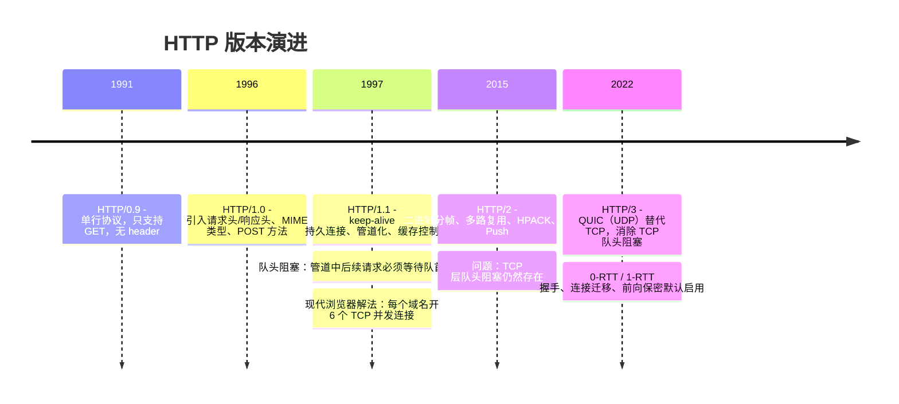
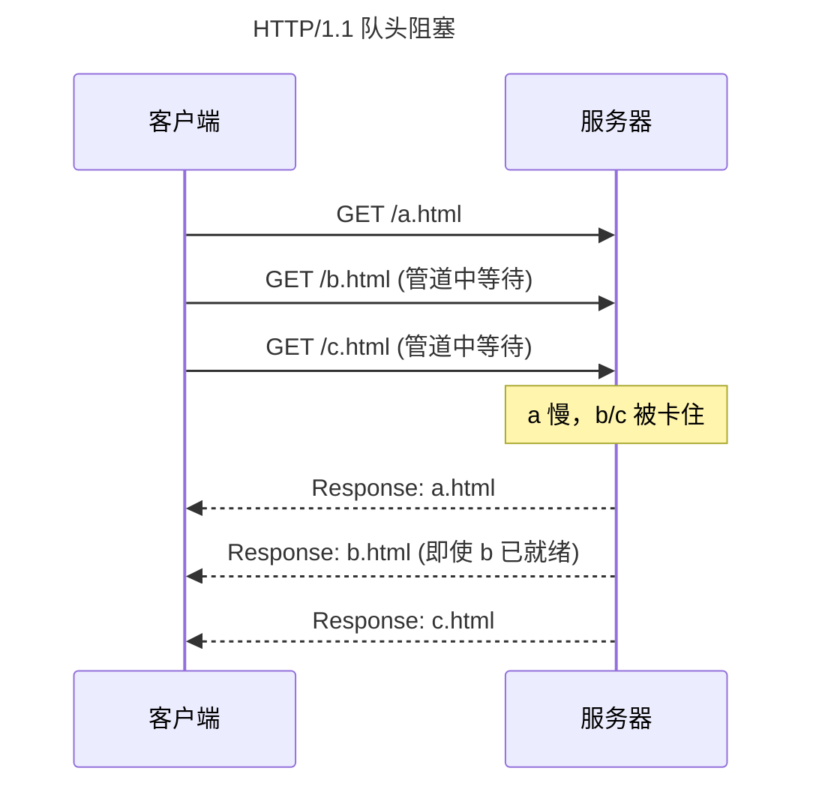
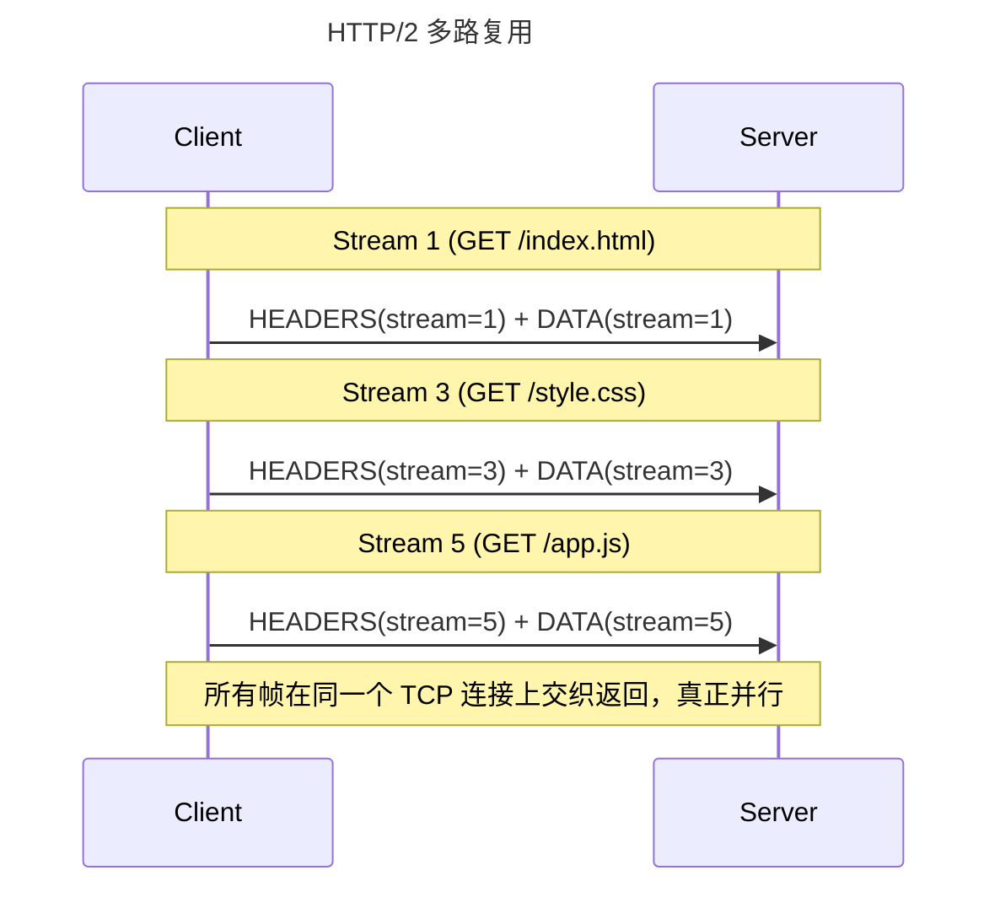
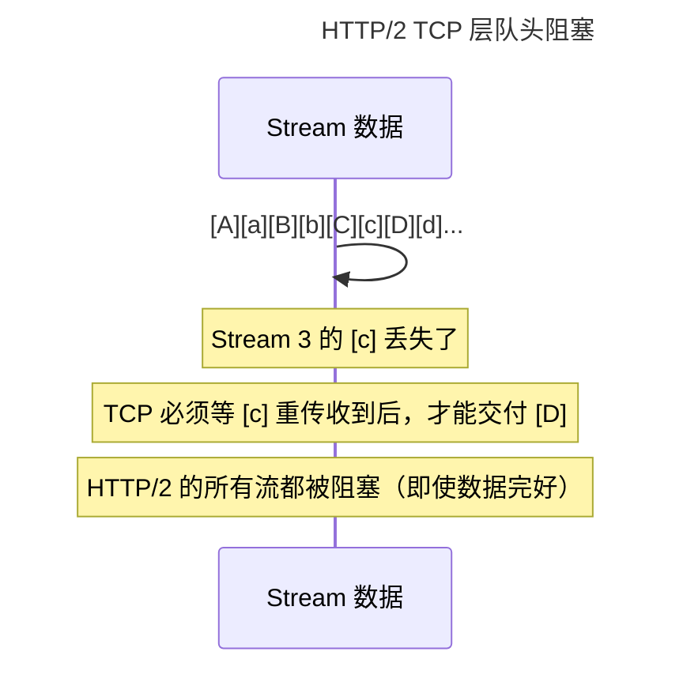
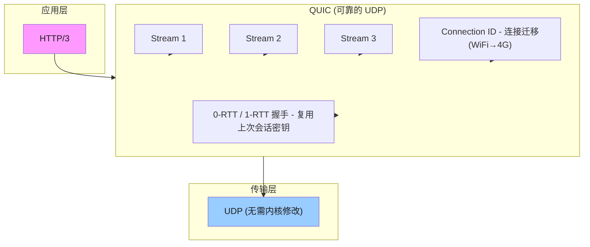
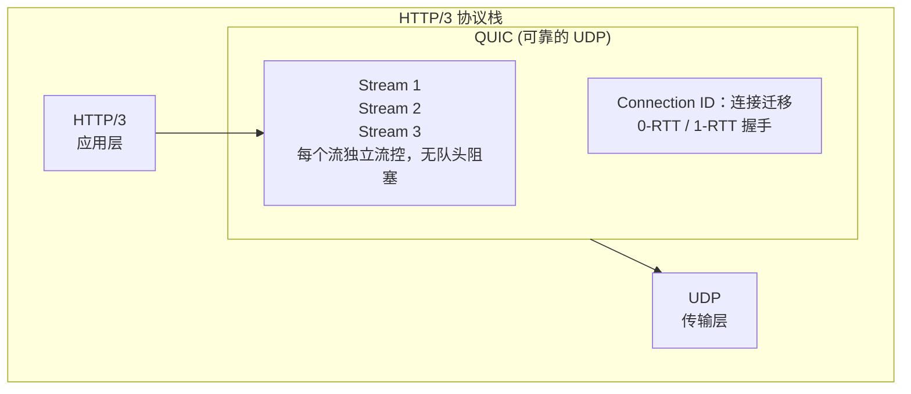
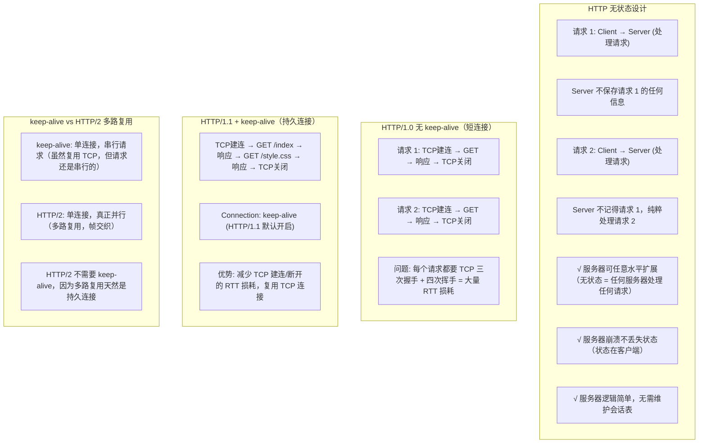

# HTTP 版本与连接复用

## 1. HTTP 各版本对比（1.0 / 1.1 / 2 / 3）

### 1.1 定义/背景（一句话说清）

HTTP 是互联网数据交换的核心协议，从 1991 年的单行协议演进到今天基于 QUIC 的 HTTP/3，每个版本都是为了解决前一个版本的性能瓶颈。

### 1.2 ASCII 时序/架构图











### 1.3 HPACK 头部压缩原理

```
HPACK 使用三个机制压缩 HTTP/2 头部：

1. 静态表（Static Table）：61 个预定义条目，index 直接引用
   Index 1:  :authority
   Index 2:  :method GET
   Index 4:  :path /
   Index 33: content-type: text/plain
   ...

2. 动态表（Dynamic Table）：当前连接中出现过的 Header，动态维护
   新增条目从 62 开始递增

3. Huffman 编码：对字符串值进行变长编码（ASCII 常用字符用短码）

结果：重复 Header 只传 index（1-2 bytes），节省约 60-90% 头部开销
```

### 1.4 完整代码示例（TS/JS）

```typescript
// HTTP 各版本的 Fetch 使用示例

// HTTP/1.1：每个域名最多 6 个并发连接（浏览器自动管理）
// 大量请求会排队——队头阻塞问题
const response1 = await fetch('/api/users');      // 并发 slot 1
const response2 = await fetch('/api/orders');     // 并发 slot 2
const response3 = await fetch('/api/products');    // 并发 slot 3

// HTTP/2：单连接多路复用，所有请求并行
// 浏览器自动使用 HTTP/2（如果服务器支持）
// 底层帧交织，无队头阻塞

// HTTP/3：通过 fetch 使用 HTTP/3
// Chrome 自动对支持 HTTP/3 的服务器使用 HTTP/3
// 可通过 protocol 属性检测当前使用的协议
const res = await fetch('https://http3.example.com/api');
console.log(res.url); // 协议是 h3-29 或 http/2 或 http/1.1

// 强制使用特定协议（测试用）
const controller = new AbortController();
const res2 = await fetch('https://example.com/api', {
  signal: controller.signal,
  // 注意：fetch 不直接暴露协议选择，这是网络栈的行为
});

// HTTP/2 Server Push 示例（Node.js）
// 注意：HTTP/2 Server Push 已被 HTTP/3 移除，现代浏览器也逐步放弃
function http2PushExample(req, res) {
  res.stream.confirmNew(); // 告诉连接层准备推送
  res.stream.pushStream({ ':path': '/style.css' }, (err, pushStream) => {
    pushStream.respondWithFile('/public/style.css', {
      'content-type': 'text/css',
    });
  });
  res.stream.respondWithFile('/public/index.html');
}
```

### 1.5 对比表

| 维度 | HTTP/1.1 | HTTP/2 | HTTP/3 |
|------|:--------:|:------:|:------:|
| 传输层 | TCP | TCP | QUIC (UDP) |
| 多路复用 | 否（无（6连接 workaround）） | 是（单连接多流） | 是（单连接多流） |
| 队头阻塞 | TCP 层（连接级） | TCP 层（连接级） | 否（无（流级独立）） |
| 头部压缩 | 否（无（纯文本）） | HPACK | QPACK（HPACK 升级） |
| Server Push | 否 | 是（（已废弃）） | 否 |
| 握手延迟 | 1-RTT（TCP+TLS） | 1-RTT（TCP+TLS） | 1-RTT / 0-RTT |
| 连接迁移 | 否 | 否 | 是（（Connection ID）） |
| 前向保密(PFS) | 可选 | 可选 | 是（默认启用） |
| 队头阻塞类型 | 连接级 | 连接级 | 流级（无阻塞） |
| 复杂度 | 低 | 中 | 高（UDP 穿透性） |

### 1.6 常见陷阱与最佳实践

| 陷阱 | 说明 | 解决方案 |
|------|------|----------|
| HTTP/2 下仍做域名分片 | 绕过 HTTP/1.1 并发限制的老技巧在 HTTP/2 下反而增加连接开销 | 合并域名，减少连接数 |
| HTTP/2 HPACK 索引中毒 | 动态表被污染导致安全问题和压缩失效 | 使用安全的代理/负载均衡器 |
| 0-RTT 重放攻击 | HTTP/3 0-RTT 数据可能被恶意重放 | 对 0-RTT 请求进行幂等性验证 |
| 中间设备不理解 QUIC | 企业防火墙/代理可能丢弃 UDP 443 流量 | 保留 TCP 443 回退方案 |
| HTTP/2 Server Push 滥用 | 推送不需要的资源浪费带宽 | 改用 preload 预加载提示 |

### 1.7 面试追问 + 参考答案要点

**Q1：HTTP/2 和 HTTP/3 的队头阻塞有何本质区别？**
> HTTP/2 的队头阻塞发生在 **TCP 层**——因为 TCP 保证字节流有序，丢失一个包后所有后续包都必须等待重传，即使这些包属于不同的 HTTP 流。HTTP/3 的队头阻塞发生在 **QUIC 流级别**——每个 QUIC 流独立有序，丢包只阻塞该流，其他流的数据正常交付给应用层。

**Q2：为什么 HTTP/3 要基于 UDP 而不是重新设计一个全新的传输层协议？**
> 1. **内核依赖**：TCP/UDP 在操作系统内核实现，更新需要内核升级，实际不可行。QUIC 在用户态实现，快速迭代。2. **穿透性**：防火墙、路由器、移动网络对 UDP 的支持已经很好（虽然有 QoS 限制）。3. **部署便利**：QUIC 可以通过客户端/服务端软件更新部署，不需要修改网络基础设施。4. **连接迁移**：UDP 包可以携带 Connection ID，切换网络（WiFi→4G）时无需重建连接。

**Q3：HPACK 头部压缩为什么比 HTTP/1.1 的 gzip 压缩更适合 HTTP/2？**
> 1. **无字典同步问题**：gzip 需要两端维护相同字典，HPACK 的静态表和动态表天然同步。2. **增量更新**：每次请求只传输增量头部，不需重新压缩整个消息。3. **抗重放**：HPACK 索引不能跨连接使用，不会泄露压缩字典。4. **安全性**：HPACK 设计上防止压缩侧信道攻击（CRIME/BREACH 攻击针对 HTTP 层压缩）。

### 1.8 参考来源 URL

- RFC 9110 (HTTP Semantics): https://www.rfc-editor.org/rfc/rfc9110
- RFC 9113 (HTTP/2): https://www.rfc-editor.org/rfc/rfc9113
- RFC 9114 (HTTP/3): https://www.rfc-editor.org/rfc/rfc9114
- HPACK: https://www.rfc-editor.org/rfc/rfc7541
- HTTP/3 explained: https://github.com/quicwg/base-drafts/wiki/Implementations

## 2. HTTP 各版本对比（速记版）

### 2.1 版本演进全景

| 版本 | 年份 | 关键特性 |
|------|------|---------|
| HTTP/0.9 | 1991 | 单行协议，只支持 GET，无 header |
| HTTP/1.0 | 1996 | 引入请求头/响应头、MIME 类型 |
| HTTP/1.1 | 1997 | 引入 keep-alive、管道化、缓存控制 |
| HTTP/2 | 2015 | 二进制分帧、多路复用、HPACK 压缩 |
| HTTP/3 | 2022 | QUIC (UDP) 替代 TCP，消除 TCP 队头阻塞 |

### 2.2 HTTP/1.1 的队头阻塞

**问题：** HTTP/1.1 管道化仍受队头阻塞影响。

**场景示例：**

```
客户端                          服务器
GET /a.html    →              (a 处理慢)
GET /b.html    →              (b 已完成，等待)
GET /c.html    →              (c 已完成，等待)
                               队首响应慢，b/c 被卡

< Response: a.html  (即使 b/c 已准备好)
< Response: b.html
```

**现代浏览器解决方案：** 多个 TCP 连接（通常 6 个）

### 2.3 HTTP/2 多路复用

**HTTP/2 帧结构：**

```
+---------------+---------------+-------+
| Length (3B) | Type (1B) | Flags (1B) |
+---------------+---------------+-------+
| Stream Identifier (4B)              |
+---------------------------------------+
| Frame Payload (...)                 |
+---------------------------------------+
```

**HTTP/2 帧类型：**

| 帧类型 | 说明 |
|--------|------|
| DATA | 传输实际数据（请求体/响应体） |
| HEADERS | 传输首部 |
| SETTINGS | 连接级配置 |
| WINDOW_UPDATE | 流控 |
| PING | 心跳检测 |

**多路复用示例：**

| Stream ID | 内容 |
|-----------|------|
| Stream 1 | HEADERS (stream=1) + DATA (stream=1) -> GET /index.html |
| Stream 3 | HEADERS (stream=3) + DATA (stream=3) -> GET /style.css |
| Stream 5 | HEADERS (stream=5) + DATA (stream=5) -> GET /app.js |

**优势：** 帧在同一个 TCP 连接上交织返回，完全并行，无队头阻塞

### 2.4 HTTP/2 仍有队头阻塞的原因

```
问题: HTTP/2 在 TCP 层仍有队头阻塞

原因: TCP 保证字节序（字节流），丢包会导致重传

       Stream 1: [A][B][C][D][E][F][G][H]...
       Stream 3: [a][b][c][d][e][f][g][h]...

       帧序列在 TCP 流中:
       [A][a][B][b][C][c][D][d]...
                  ↑
              Stream 3 的 [c] 丢失
              TCP 层重传 [c]

       Stream 1 的 [D] 虽然到达，但 TCP 层必须等 [c] 收到后才能交付
       → HTTP/2 的所有流都被阻塞（即使这些流的数据都完好）

HTTP/3 的解决: QUIC 替代 TCP，每个流独立流控，丢包只影响该流
```

### 2.5 HPACK 头部压缩原理

```
HPACK 使用两个表压缩:

1. 静态表 (Static Table): 已知常见的 Header Field
   Index 1: :authority
   Index 2: :method GET
   Index 4: :path /
   ...
   Index 33: content-type: text/plain
   ...

2. 动态表 (Dynamic Table): 动态维护当前连接中出现过的 Header

3. Huffman 编码: 对字符串值进行 Huffman 编码

结果: 重复 Header 只传输 index（1-2 bytes），节省约 60-90% Header 开销
```

### 2.6 HTTP/3 与 QUIC



## 3. HTTP 无状态与 keep-alive

### 3.1 定义/背景（一句话说清）

HTTP 无状态指服务器不保存客户端请求的历史记录，每次请求都独立；keep-alive 是 HTTP/1.1 的持久连接机制，让多个请求复用同一个 TCP 连接，避免重复建连的开销。

### 3.2 ASCII 原理图



### 3.3 完整代码示例（TS/JS）

```typescript
// Node.js HTTP/1.1 keep-alive 演示

import http from 'http';

// HTTP/1.1 默认启用 keep-alive
// 通过 Agent 控制连接池
const agent = new http.Agent({
  keepAlive: true,
  keepAliveMsecs: 30000,   // TCP socket 保持存活时间
  maxSockets: 5,           // 每个 host 最大并发 socket 数
  maxTotalSockets: 10,     // 所有 host 最大并发 socket 数
  scheduling: 'fifo',      // 'fifo' | 'lifo'（队列调度策略）
});

// 所有请求通过同一个 agent，自动复用 TCP 连接
async function fetchWithKeepAlive(path: string): Promise<string> {
  return new Promise((resolve, reject) => {
    const req = http.get({
      hostname: 'example.com',
      path,
      agent, // 传入 agent，复用连接池
    }, (res) => {
      let data = '';
      res.on('data', chunk => data += chunk);
      res.on('end', () => resolve(data));
    });
    req.on('error', reject);
  });
}

// 发出多个请求，复用同一个 TCP 连接（只建一次 TCP）
const [r1, r2, r3] = await Promise.all([
  fetchWithKeepAlive('/a'),
  fetchWithKeepAlive('/b'),
  fetchWithKeepAlive('/c'),
]);

// 主动关闭 keep-alive 连接
agent.destroy();


// ============ 无状态 + Cookie 实现会话 ============

// 服务端：读取 Cookie，维护会话（注意：会话存在服务端，不是 HTTP 协议本身）
import { parse } from 'cookie';

interface Session {
  userId: string;
  role: string;
  expires: number;
}

const sessions = new Map<string, Session>(); // 生产用 Redis

function handleRequest(req: http.IncomingMessage, res: http.ServerResponse) {
  const cookies = parse(req.headers.cookie || '');
  const sessionId = cookies['session_id'];

  let session: Session | null = null;
  if (sessionId) {
    session = sessions.get(sessionId);
    if (!session || session.expires < Date.now()) {
      sessions.delete(sessionId); // 会话过期
      session = null;
    }
  }

  if (!session) {
    // 生成新会话
    const newId = crypto.randomUUID();
    sessions.set(newId, {
      userId: 'user_123',
      role: 'admin',
      expires: Date.now() + 24 * 3600 * 1000,
    });
    res.setHeader('Set-Cookie', `session_id=${newId}; HttpOnly; SameSite=Strict`);
    return res.end(JSON.stringify({ message: 'New session created' }));
  }

  res.end(JSON.stringify({ userId: session.userId, role: session.role }));
}
```

### 3.4 对比表

| 维度 | 无状态 | 有状态 | 说明 |
|------|:------:|:------:|------|
| 服务器扩展性 | 极好 | 需 Session 共享 | 无状态服务器可任意水平扩展 |
| 每个请求大小 | 小（自包含） | 大（需带 session ID） | 差异通常可忽略 |
| 服务器崩溃 | 无影响 | 丢失会话 | 无状态天然容灾 |
| 实时状态 | 困难 | 自然 | 无状态需要轮询/WebSocket |
| 实现复杂度 | 低 | 中高（需存储） | Cookie/Token/JWT 各有权衡 |
| keep-alive 状态 | TCP 连接持久 | 不相关 | keep-alive 是传输层，与 HTTP 语义层独立 |

### 3.5 常见陷阱与最佳实践

| 陷阱 | 说明 | 解决方案 |
|------|------|----------|
| keep-alive 超时设置过长 | 服务器维护大量空闲连接浪费资源 | 根据业务合理设置 timeout（如 30s） |
| keep-alive 不设置 max | 恶意客户端建立大量连接耗尽服务器 | 限制单 IP 最大连接数 |
| 误以为 HTTP 协议本身有状态 | HTTP 是无状态协议，状态靠 Cookie/Session 在应用层实现 | 理解分层：HTTP 语义层 vs 应用层 |
| 大量并发请求仍用 HTTP/1.1 | keep-alive 不能解决队头阻塞 | 升级 HTTP/2 或 HTTP/3 |
| Session 存储在进程内存 | 多实例部署时 Session 不共享 | 用 Redis 等分布式存储 |

### 3.6 面试追问 + 参考答案要点

**Q1：既然 HTTP 无状态，为什么还需要 Cookie？Session 和 Token 的本质区别是什么？**
> HTTP 无状态是协议层面的约束，Cookie/Session/Token 是应用层实现状态的方式。本质区别：Session 状态存储在**服务端**（服务器维护 Map<sessionId, Session>），客户端只持有 sessionId。Token（如 JWT）状态存储在**客户端**（Token 本身包含用户信息，由服务端验签）。Session 更安全（服务端可随时撤销），Token 更易扩展（无状态，多服务器无同步压力），但 Token 一旦泄露难以撤销。

**Q2：keep-alive 和 HTTP/2 的多路复用都能复用连接，它们的区别是什么？**
> keep-alive 是 HTTP/1.1 的机制，**请求仍然是串行的**——必须等一个请求完全返回才能发下一个（即使 TCP 连接复用）。HTTP/2 多路复用**真正并行**——多个请求/响应的帧在同一个 TCP 连接上交织发送和接收，不互相等待。keep-alive 是 TCP 连接复用，HTTP/2 多路复用是 TCP 连接复用 + HTTP 请求并行。

**Q3：HTTP/2 和 HTTP/3 是否还需要 keep-alive？**
> 不需要了。HTTP/2 和 HTTP/3 的连接默认就是持久的，不需要 Connection: keep-alive 头。HTTP/2 使用多路复用，HTTP/3 基于 QUIC 连接，两者天然是长连接。关闭连接需要发送 GOAWAY 帧（HTTP/2）或 CONNECTION_CLOSE 帧（HTTP/3）。

### 3.7 参考来源 URL

- RFC 9110 (HTTP Semantics) - Connection Management: https://www.rfc-editor.org/rfc/rfc9110#section-8.2
- MDN - HTTP connection control: https://developer.mozilla.org/en-US/docs/Web/HTTP/Connection_management
- HTTP Keep-Alive vs HTTP/2 Multiplexing: https://developer.mozilla.org/en-US/docs/Web/HTTP/Connection_management_tester

## 4. HTTP 无状态与 keep-alive（速记版）

### 4.1 无状态设计

```http
HTTP 无状态 = 服务器不保存任何客户端请求的历史信息

为什么无状态？
1. 可扩展性: 服务器可以任意水平扩展（无状态 = 任何服务器处理任何请求）
2. 简单性: 服务器逻辑简单，不需要维护会话状态
3. 可靠性: 服务器崩溃不丢失状态（状态在客户端）

有状态 = 在应用层实现（Cookie/Token/自定义 Header）
```

### 4.2 keep-alive（持久连接）

```http
HTTP/1.0 时代: 每个请求都建立新的 TCP 连接，用完即关闭

HTTP/1.1 时代: 默认开启 keep-alive，多个请求复用同一 TCP 连接
+--TCP连接--><--请求1--><--响应1--><--请求2--><--响应2--><--请求3--><--响应3--><--关闭-->

请求头:
Connection: keep-alive  (HTTP/1.0 需要，HTTP/1.1 默认)
Keep-Alive: timeout=5, max=1000
```

## 深入阅读与参考

!!! tip "怎么用这些资料"
    先读「官方文档与规范」建立准确的概念，再读「源码与示例」核对细节，最后用「教程、书籍与视频」换一种讲法加深理解。每条都写明了读哪一节、带着什么问题读。

### 官方文档与规范

| 资源 | 为什么读 | 怎么读 |
|---|---|---|
| [MDN HTTP 演进](https://developer.mozilla.org/en-US/docs/Web/HTTP/Guides/Evolution_of_HTTP) | 一页梳理 HTTP/1.0 到 3 的演进动机与取舍，正对本页主线。 | 通读全文，边读边记各版本要解决的问题，读后画一张四版本对比表。 |
| [Connection management in HTTP/1.x](https://developer.mozilla.org/en-US/docs/Web/HTTP/Guides/Connection_management_in_HTTP_1.x) | 专讲 HTTP/1.x 连接管理与持久连接，直接对应 keep-alive 主题。 | 重点读持久连接与流水线两节，用 DevTools 观察请求是否复用同一连接。 |
| [Keep-Alive header](https://developer.mozilla.org/en-US/docs/Web/HTTP/Reference/Headers/Keep-Alive) | Keep-Alive 头部语义与 timeout、max 参数的官方说明。 | 读参数含义，再抓一个真实响应头，确认 timeout 与 max 的实际取值。 |
| [RFC 9110 HTTP Semantics](https://www.rfc-editor.org/rfc/rfc9110) | 方法与状态码语义的权威定义，是各版本对比的共同基础。 | 先读方法与状态码章节理清幂等性，再用 curl 逐个验证。 |
| [RFC 9112 HTTP/1.1](https://www.rfc-editor.org/rfc/rfc9112) | HTTP/1.1 报文格式与连接复用的正式规范依据。 | 读报文格式与分块传输一节，用 nc 手写请求看连接是否保持。 |
| [RFC 9113 HTTP/2](https://www.rfc-editor.org/rfc/rfc9113) | HTTP/2 帧、流与多路复用的规范定义，对比 1.1 的关键。 | 读帧与流定义，配合 Wireshark 抓一次 HTTP/2 会话来对照。 |
| [RFC 9114 HTTP/3](https://www.rfc-editor.org/rfc/rfc9114) | HTTP/3 与 HTTP/2 差异及队头阻塞变化的规范依据。 | 读与 HTTP/2 的差异一节，回答 QUIC 如何消除传输层队头阻塞。 |
| [HTTP Working Group 规范索引](https://httpwg.org/specs/) | 各 RFC 的统一入口，便于按主题追到最新规范原文。 | 从索引挑 Semantics、HTTP/1.1、HTTP/2、HTTP/3 四篇，建立阅读顺序。 |

### 源码与示例

| 资源 | 为什么读 | 怎么读 |
|---|---|---|
| [Writing an HTTP Server](https://docs.deno.com/runtime/fundamentals/http_server/) | 官方示例文档，动手实现服务器才能真正理解连接复用。 | 跟着写一个最小服务器，观察 keep-alive 生效与连接关闭的触发条件。 |

### 教程、书籍与视频

| 资源 | 为什么读 | 怎么读 |
|---|---|---|
| [HTTP/2 explained](https://http2-explained.haxx.se/) | 通俗讲解多路复用与头部压缩，比规范更易入门。 | 读完后用自己的话概括多路复用与 HPACK 原理，再与 RFC 9113 对照。 |
| [HTTP/3 explained](https://http3-explained.haxx.se/) | 系统讲 QUIC 与 HTTP/3，补齐连接迁移与丢包恢复。 | 读完对比 QUIC 与 TCP 在连接迁移、丢包恢复上的差异并做笔记。 |
| [Julia Evans：HTTP zine](https://wizardzines.com/zines/http/) | 轻量速览，适合快速建立版本与连接的整体印象。 | 先看样张，把版本差异与 keep-alive 要点抄成一张速记卡。 |

## 应用与行业实践

### 应用场景地图

| 场景 | 用到本页哪个知识点 | 典型技术选型 | 注意事项 |
| --- | --- | --- | --- |
| 后台管理的万行表格翻页 | HTTP/1.1 keep-alive、同源连接数上限 | HTTP/1.1 分页接口 + 前端并发队列 | 超出 6 条的请求会排队，翻页要取消上一页的在途请求 |
| 低端安卓机的首屏加载 | HTTP/2 多路复用、HPACK 头压缩 | HTTP/2 over TLS + 会话复用 | 低端机握手时间占首屏比例高，会话缓存要打开 |
| 多人协作白板的笔画同步 | keep-alive 与长连接超时 | WebSocket 或 SSE + 心跳 | 代理空闲超时小于心跳间隔就会反复断连 |
| 跨机房微服务调用 | HTTP/2 单连接多路复用 | gRPC over HTTP/2 | TCP 层丢包会让该连接上的全部流一起阻塞 |
| 地铁弱网下的地图切片 | HTTP/3 基于 QUIC 的抗丢包与 0-RTT | HTTP/3 + Alt-Svc 渐进升级 | 首访仍走 HTTP/1.1 或 HTTP/2，要等 Alt-Svc 缓存生效 |
| 静态资源 CDN 分发 | HTTP/1.1 域名分片与 HTTP/2 单连接的差别 | HTTP/2 单域名 + 长期缓存 | HTTP/2 下继续分片会多出握手与连接开销 |
| 站内通知推送 | HTTP 无状态、keep-alive | SSE 长连接 + 断线重连 | 重连要带抖动退避，否则会出现重连风暴 |
| 抓取外部站点数据 | 无状态、Cookie、连接复用 | 连接池 + 按目标限速 | 对端按连接限流时，加连接不一定加吞吐 |

### 三个场景拆解

#### 场景 1：后台管理的万行表格

**业务背景**：运营后台一张表默认 50 行一页，用户快速连点翻页时，旧请求还在路上，页面会闪回旧数据。同域下还有图表与导出接口，都在抢同一组连接。

**怎么用本页知识解决**：HTTP/1.1 靠 keep-alive 复用连接，但浏览器对单个源只开 6 条 TCP 连接。思路是自己控制并发数，并取消过期请求，把连接留给渲染必须的接口。

```js
const MAX = 4;                        // 在途分页请求上限，留 2 条连接给其他接口
let inFlight = 0;
const waiting = [];
function run(task) {                  // 有空位直接跑，没有就排队
  if (inFlight < MAX) return exec(task);
  return new Promise((resolve) => waiting.push(() => resolve(exec(task))));
}
async function exec(task) {
  inFlight += 1;
  try { return await task(); }
  finally {                           // 成功或失败都要释放名额并唤醒队首
    inFlight -= 1;
    if (waiting.length) waiting.shift()();
  }
}
let current = null;                   // 上一页请求的控制器
function loadPage(page, table) {
  if (current) current.abort();       // 翻页时取消旧请求，避免旧数据覆盖新数据
  current = new AbortController();
  return run(() => fetch(`/api/rows?page=${page}`, { signal: current.signal })
    .then((r) => r.json())
    .then((rows) => table.render(rows)));
}
```

- `MAX = 4` 把同源在途请求压在 4 条以内，其余连接留给首屏图表与导出接口。
- `current.abort()` 让被取消的请求立刻释放连接，服务端也会看到连接中断。
- 名额在 `finally` 里释放，请求报错不会把名额永久占住。
- keep-alive 发生在连接层，`fetch` 不需要额外配置，浏览器会沿用同源连接。
- 页面切到 HTTP/2 后同域只有一条连接，此时上限的对象从连接数变成流的调度。

**怎么度量收益**：用 Chrome DevTools 的 Network 面板看 Queueing 与 Stalled 两段时间，翻页操作的排队时间应下降。用 `chrome://net-export` 抓连接事件，确认同源连接数不超过 6。服务端在接入层日志里统计单条连接承载的请求条数。

**什么时候不该用**：

- 表格数据由 WebSocket 增量推送，翻页不产生新请求，取消逻辑没有作用。
- 单页只有一次列表请求、没有其他并发接口时，排队层只是多一层抽象。
- 游标分页需要严格顺序，取消后必须能重新取到游标，否则会漏行。

#### 场景 2：低端安卓机的首屏加载

**业务背景**：低端安卓机上，首屏除 HTML 外还要拉十几个 JS 与 CSS 切片，HTTP/1.1 下每个切片域名各开连接，握手时间被放大。可用 Chrome DevTools 把 CPU 降速 4 倍、网络设为 Slow 4G 复现。

**怎么用本页知识解决**：换成 HTTP/2，让同域资源在一条连接上并行发送，再用 HPACK 压掉重复的请求头。同时打开 TLS 会话复用，把回访时的完整握手省掉。

```nginx
server {
  listen 443 ssl;
  http2 on;                    # nginx 1.25.1 起用该指令替代 listen 里的 http2 参数
  ssl_certificate     /etc/ssl/site.crt;
  ssl_certificate_key /etc/ssl/site.key;
  ssl_session_cache   shared:SSL:10m;   # 会话缓存，回访客户端可跳过完整握手
  ssl_session_timeout 1h;
  ssl_session_tickets on;

  location /static/ {
    # 仅在服务端已开启 HTTP/3 时下发，否则会引来连接失败
    add_header Alt-Svc 'h3=":443"; ma=86400';
    expires 1y;
    add_header Cache-Control "public, immutable";
  }
}
```

- 单域名配合 `http2 on` 后，十几个切片共享一条 TCP 连接，省掉每域名一次握手。
- `ssl_session_cache` 与 `ssl_session_tickets` 让回访设备的第二次握手少一个往返。
- HTTP/2 下不需要为并行下载拆域名，把切片域名收拢回主域即可。
- `immutable` 配合一年过期时间，让切片直接命中本地缓存，不再产生请求。
- `Alt-Svc` 是 HTTP/3 的升级入口，浏览器缓存它之后才会走 QUIC，失败会回落。

**怎么度量收益**：看 Chrome DevTools Performance 面板的 LCP，以及 Network 面板 Connection ID 列的不同取值个数。用 Lighthouse 的 "Reduce initial server response time" 审计复核。服务端统计 TLS 完整握手次数与复用次数之比。

**什么时候不该用**：

- 专线环境里客户端与企业代理只支持 HTTP/1.1，开 HTTP/2 后仍走降级路径，收益不稳定。
- 首屏只有 1 到 2 个资源时，多路复用省下的连接开销抵不过协议协商时间。
- 需要按域名做流量隔离或灰度时，收拢到单域名会失去按域调度的能力。

#### 场景 3：多人协作白板的实时同步

**业务背景**：白板房间靠长连接推送他人笔画，用户在电梯或地铁里切换网络时连接会断，重连后要补拉期间的增量。故障表现是房间人数显示正常，但画面停住。

**怎么用本页知识解决**：keep-alive 只解决短请求的连接复用，长连接要靠心跳维持，并让服务端与网关的空闲超时对齐。客户端重连要带随机退避，避免整房间同时重连。

```js
import http from 'node:http';

const server = http.createServer(app);
server.keepAliveTimeout = 65000;  // 大于负载均衡 60s 空闲超时，避免复用到已关闭的连接
server.headersTimeout = 66000;    // 必须大于 keepAliveTimeout，否则 Node 会提前断开
server.requestTimeout = 0;        // SSE 是长响应，关闭请求级超时

server.on('connection', (socket) => {
  socket.setNoDelay(true);        // 笔画消息体积小，关掉 Nagle 减少攒包延迟
});

// 客户端重连退避：房间内客户端随机错开，避免同时打回服务端
function reconnectDelay(attempt) {
  const base = Math.min(30000, 1000 * 2 ** attempt); // 上限 30 秒
  return base / 2 + Math.random() * (base / 2);      // 半随机抖动
}
```

- `keepAliveTimeout` 比上游空闲超时大，能避免复用一条已被关闭的连接而收到 ECONNRESET。
- `headersTimeout` 大于 `keepAliveTimeout` 是 Node 的约束，配反了会直接断连。
- `requestTimeout = 0` 只对长响应场景开放，短接口仍应保留超时。
- `setNoDelay` 针对小消息，用延迟换吞吐的策略在这里不划算。
- 抖动退避把重连分散到时间窗口内，服务端不会在断网恢复瞬间被整房间连接打满。

**怎么度量收益**：接入层日志统计连接建立次数与房间数之比。客户端上报重连间隔与断连原因，区分心跳超时与服务端关闭。服务端观察进程 socket 数量随时间的变化，用 Chrome DevTools Network 面板的 EventStream 条目看消息到达间隔。

**什么时候不该用**：

- 消息量在每秒一条以内的低频通知，轮询的实现与运维成本低于长连接。
- 客户端处在只允许短连接的企业代理后面，长连接会被中间设备定时切断且无法协商。
- 房间内只有 1 至 2 个用户、会话时长在数十秒内，保持连接的开销高于重连一次。

### 行业先进实践

**用 Alt-Svc 做 HTTP/3 渐进升级（出处：IETF RFC 7838 / RFC 9114）**
服务端在响应头里给出 `h3` 备用服务，浏览器缓存该信息，后续连接才尝试 QUIC，失败则回落。升级动作与首访解耦，单个客户端失败不影响整体可用。借鉴方式是在静态资源域先下发 Alt-Svc，统计回落次数后再决定扩大范围。

**HPACK 头压缩与按需合并资源（出处：IETF RFC 7541 / RFC 9113）**
HTTP/2 用静态表与动态表压缩重复头字段，请求中重复的 Cookie 与 User-Agent 不再逐条全量发送。合并资源在 HTTP/2 下仍有意义，收益来自减少流的调度次数。借鉴方式是把切片域名先收拢，再按实际瀑布图决定合并粒度。

**连接池与超时对齐（出处：Node.js 官方文档 http 模块 / gRPC 官方文档 Keepalive 指南）**
客户端 keep-alive 超时要短于服务端与网关的空闲超时，否则会复用到即将关闭的连接。gRPC 的 keepalive ping 存在服务端最小间隔限制，配得过密会被判为滥用。借鉴方式是把客户端、网关、服务端三层超时画在一张时间轴上核对。需核对官方文档：gRPC keepalive 各语言默认值与服务端 enforcement 参数名。

**把连接复用情况纳入可观测性（出处：OpenTelemetry 语义约定 / Chrome DevTools 官方文档）**
HTTP 指标里带上协议版本与连接复用标记，才能在版本升级后判断收益来自哪一层。浏览器侧用 DevTools 的 Connection ID 与协议列做前端验证。借鉴方式是在接入层日志中记录协议版本与连接标识。需核对官方文档：OpenTelemetry HTTP 语义约定中协议版本属性的确切名称。

### 从学到用：落地路线

1. **试点**：选一个内部后台或静态资源域改造，范围只覆盖一个域名与一类接口。验收标准：灰度名单内客户端的协议版本可查，HTTP/2 或 HTTP/3 命中比例可统计。
2. **验证**：用前后对比实验验证收益，固定网络与设备条件各跑 20 次取中位数。验收标准：LCP 或首字节时间的中位数下降，且 p95 没有变差，连接建立次数有记录。
3. **推广**：把配置模板化，按域名分批放开，每批观察一个完整业务周期。验收标准：每批都有回滚开关，回滚操作在 5 分钟内完成。
4. **防回退**：把协议版本、连接复用率、超时错配写入告警与 CI 检查。验收标准：协议版本回落到 HTTP/1.1 或超时配置倒挂时，流水线或告警能拦住。

### 动手作业

**目标**：给一个静态站点页做 HTTP/1.1 与 HTTP/2 的对照实验，并用连接复用数据说明两者差别。

**步骤**

1. 本地起一个站点，准备 1 个 HTML 加 12 个切片资源，总大小控制在 1MB 以内。
2. 用自签证书开启 HTTPS，先只监听 HTTP/1.1，确认页面正常。
3. 打开 HTTP/2（`http2 on`），资源内容与缓存策略保持不变。
4. 在 Chrome DevTools 里把网络设为 Slow 4G、CPU 降速 4 倍，分别记录两种协议下的 LCP 与连接条数。
5. 两种协议各刷新 10 次，统计 Network 面板里 Connection ID 的不同取值个数。
6. 把服务端 `keepAliveTimeout` 从 65 秒改成 5 秒，重复第 5 步，观察连接复用条数的变化。
7. 把三种配置的数据整理成一页对照表，写出结论与适用边界。

**验收标准**

- 三种配置各有一组不少于 10 次刷新的原始数据，含 LCP 与连接条数。
- 能给出协议版本与连接条数对应的证据，而不是只看总耗时。
- 能解释 `keepAliveTimeout` 改小后连接复用条数变化的原因。
- 结论里写清实验环境限制，例如单机、无 CDN、固定带宽档位。
- 附上复现步骤，他人按步骤能得到方向一致的结论。

