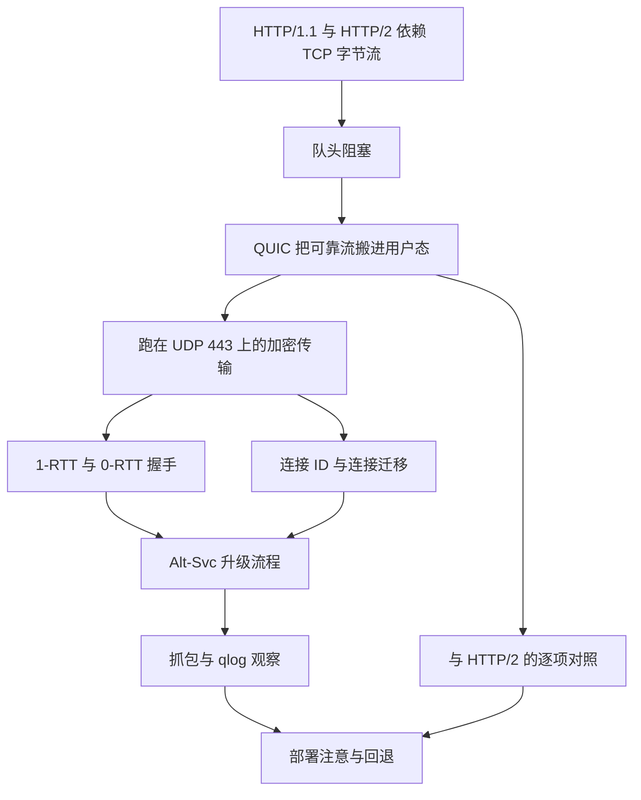
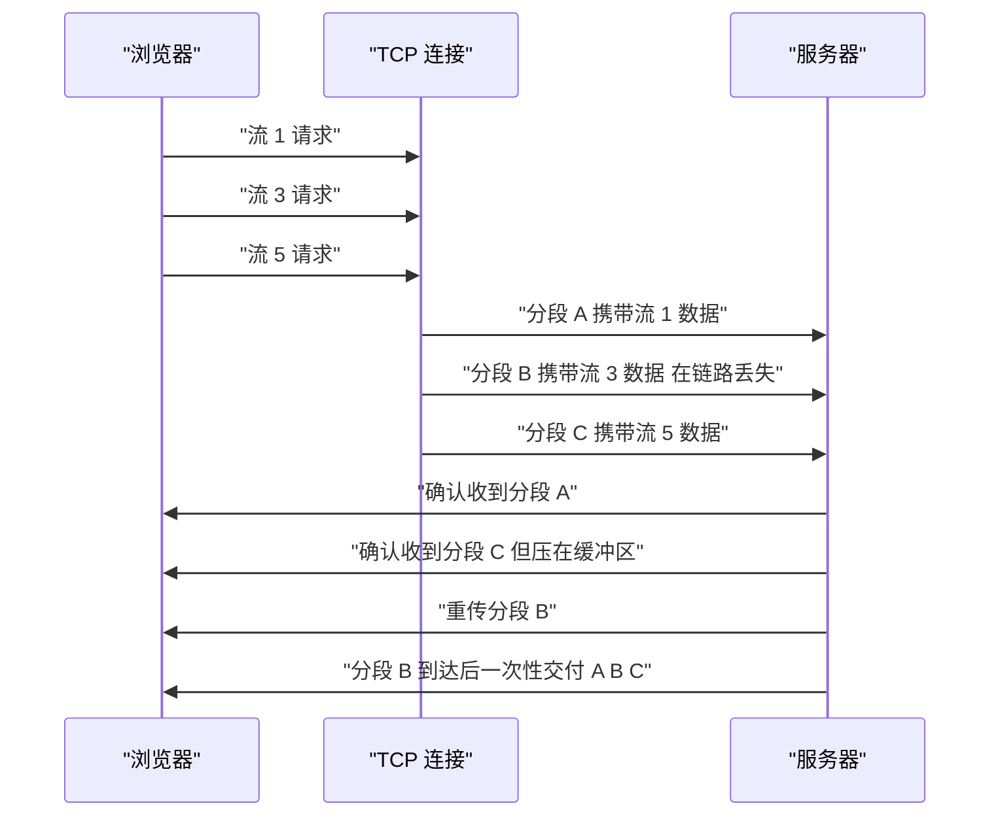
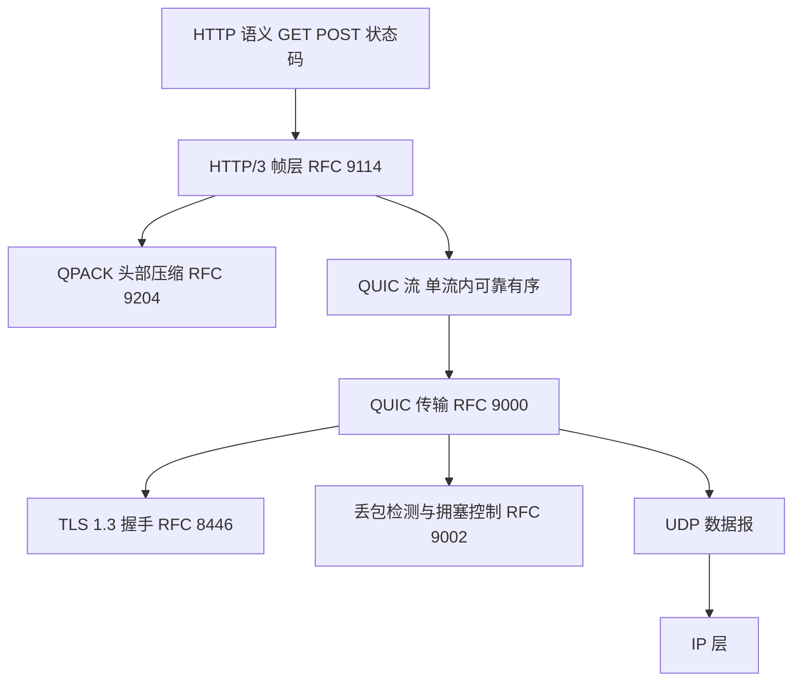
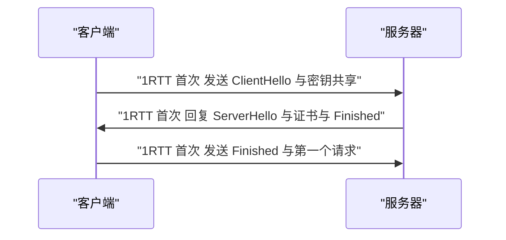
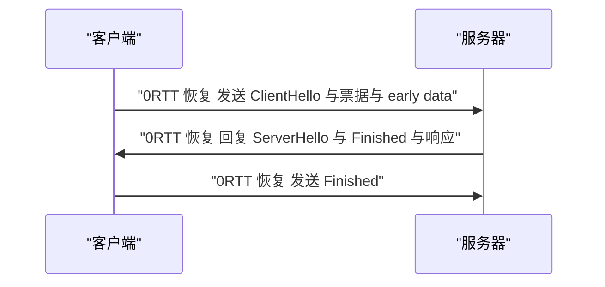
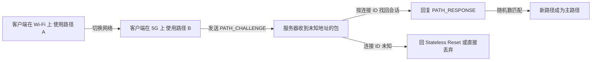
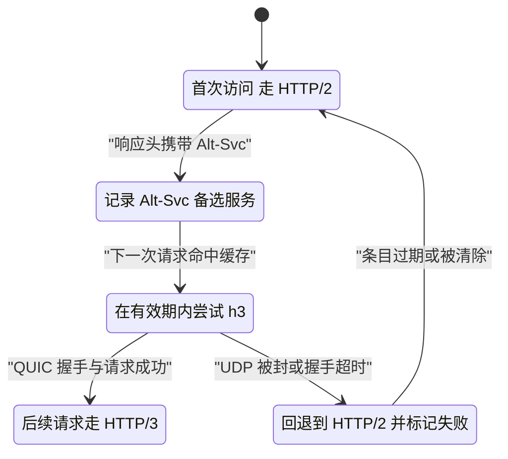
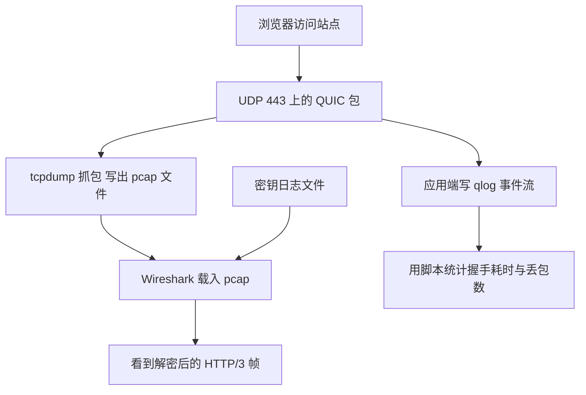
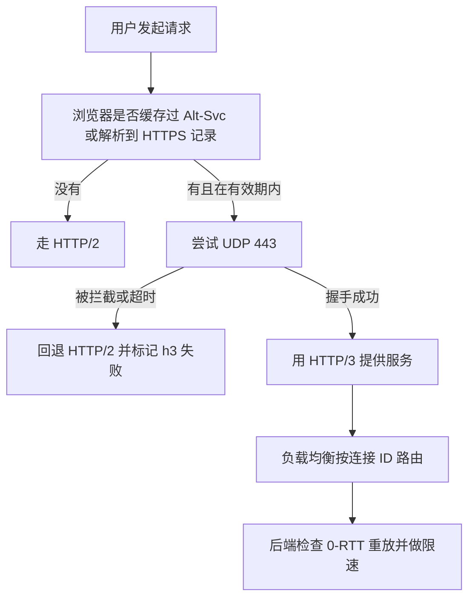

# HTTP/3 与 QUIC 实战

!!! abstract "学完这一页你能"

- 说出 HTTP/2 在丢包时被队头阻塞卡住的原因，并跑出一段可复现的对比实验。
- 手写 QUIC 变量长度整数的编解码与长首部解析，并用断言覆盖四个档位的边界值。
- 画出 1-RTT 与 0-RTT 的握手时序，指出 0-RTT 的重放风险落在哪里。
- 解析 Alt-Svc 响应头并画出 HTTP/2 到 HTTP/3 的升级与回退流程。

## 0. 知识地图



图里有三条主线：左边是问题，中间是机制，右边是落地。

左边一个问题贯穿全页：丢了一个包，谁被卡住。

中间的机制包括 QUIC 的四件事：流、握手、连接 ID、丢包恢复。

右边是工程操作：怎么升级、怎么观察、怎么排除故障。

建议按编号顺序读，读第 3 节和第 4 节时回头看一眼这张图。

第 5 节之后的内容都建立在第 1 到第 4 节的结论之上。

## 1. 队头阻塞：HTTP/2 的复用救不了丢包

**先想一个问题**

一个页面同时请求 60 张图片，走 HTTP/2 时它们复用一条 TCP 连接。

链路丢了一个 TCP 分段，浏览器会看到什么？

答案取决于你问的是"哪个协议"，而不是"哪张图片更重要"。

**心智模型**

!!! tip "心智模型"
    - 一句话模型：HTTP/2 的多路复用只发生在应用层，TCP 仍然要求字节按序交付。
    - 日常类比：一条单车道隧道，60 辆车依次进入，最前面那辆抛锚，后面 59 辆全停在隧道外。
    - 类比不成立的地方：隧道里的车可以倒车绕路，TCP 不会丢下缺失字节往前交付，接收方必须先补齐空洞。

!!! note "术语：队头阻塞"
    队头阻塞指队首元素未就绪时，排在后面的元素即使已就绪也无法被处理。例：TCP 缓冲区里第 3 个分段缺失，第 4、5 个分段已经到了也不能交给应用层。

!!! note "术语：多路复用"
    多路复用指在一条连接上同时承载多条逻辑流。例：HTTP/2 的流标识符加帧格式，让一条 TCP 连接里并存 60 个请求。

**图解**



1. 浏览器在同一条 TCP 连接上打开三条流，请求被编码成帧。
2. 发送方把三条流的帧写进同一个 TCP 字节流，切成多个分段。
3. 承载流 3 数据的分段丢失，承载流 1 与流 5 的分段正常到达。
4. 接收方内核缓冲区出现空洞，不会把流 1、流 5 的字节交给应用层。
5. 应用层拿不到数据，三条流一起等待，这就是传输层队头阻塞。
6. 发送方按重传计时器补发丢失分段，空洞填上后数据一次性上交。

**一步一步来**

第一步要做的是：把链路丢包建模成一张块清单，并写出 TCP 的按序交付规则。

```js
// step1: 构造全局到达顺序，TCP 遇到空洞就停止交付
const STREAMS = ['s1', 's2', 's3'];
const LOST = new Set(['s2#2']);            // 第 2 条流的第 2 个块丢失

function arrivalOrder() {                  // TCP 看到的全局字节顺序
  const order = [];
  for (const s of STREAMS) {
    for (let i = 1; i <= 4; i++) order.push(`${s}#${i}`);
  }
  return order;
}

function tcpDeliver() {
  const got = [];
  for (const block of arrivalOrder()) {
    if (LOST.has(block)) break;            // 空洞之后的字节全部压住
    got.push(block);
  }
  return got;
}
```

**这段代码在做什么**

- `STREAMS` 与 `LOST` 描述可复现的实验条件，改 `LOST` 就能改丢包位置。
- `arrivalOrder` 把三条流的块摊平成一个全局序列，这是 TCP 眼里的世界。
- `tcpDeliver` 遇到第一个丢失块就 `break`，对应接收缓冲区的空洞。
- 返回数组只包含空洞之前的块，后面的块即使到达也不算交付。
- 换掉 `LOST` 里的元素，输出会变化，说明结论来自模型而不是写死的结果。

第二步要做的是：给每条流加独立偏移，让交付按流进行。

```js
// step2: 每条流单独记录到达情况，互不牵连
function quicDeliver() {
  const result = {};
  for (const s of STREAMS) {
    const got = [];
    for (let i = 1; i <= 4; i++) {
      if (LOST.has(`${s}#${i}`)) continue; // 只跳过本流缺失的块
      got.push(i);                         // 本流偏移连续，可以上交
    }
    result[s] = got;
  }
  return result;
}
```

**这段代码在做什么**

- 外层循环按流分组，内层循环按偏移递增，对应 QUIC 的单流有序语义。
- `LOST` 判定只影响当前流，其他流的循环照常推进。
- 返回值是流编号到已交付偏移的映射，直接看出谁被卡住。
- 这里暂时不重传丢失块，只观察同一时刻各流的交付状态。

运行结果：

```
TCP 交付 [ 's1#1', 's1#2', 's1#3', 's1#4', 's2#1' ]
QUIC 交付 { s1: [ 1, 2, 3, 4 ], s2: [ 1, 3, 4 ], s3: [ 1, 2, 3, 4 ] }
```

**动手验证**

```js
// hol-blocking.mjs  运行环境 Node 20+  无第三方依赖
import assert from 'node:assert/strict';

const STREAMS = ['s1', 's2', 's3'];
const LOST = new Set(['s2#2']);

function tcpDeliver(lost = LOST) {
  const got = [];
  for (const s of STREAMS) {
    for (let i = 1; i <= 4; i++) {
      const block = `${s}#${i}`;
      if (lost.has(block)) return got;   // 空洞出现，停止交付
      got.push(block);
    }
  }
  return got;
}

function quicDeliver(lost = LOST) {
  const out = {};
  for (const s of STREAMS) {
    out[s] = [];
    for (let i = 1; i <= 4; i++) {
      if (!lost.has(`${s}#${i}`)) out[s].push(i);
    }
  }
  return out;
}

// 断言 1：丢包时 TCP 只交付到空洞之前
assert.deepEqual(tcpDeliver(), ['s1#1', 's1#2', 's1#3', 's1#4', 's2#1']);
// 断言 2：丢包时 QUIC 有两条流完整交付
const q = quicDeliver();
assert.deepEqual(q.s1, [1, 2, 3, 4]);
assert.deepEqual(q.s3, [1, 2, 3, 4]);
// 断言 3：无丢包时两种模型交付的块数相同
const none = new Set();
assert.equal(tcpDeliver(none).length, 12);
assert.deepEqual(quicDeliver(none).s2, [1, 2, 3, 4]);

console.log('TCP:', tcpDeliver().join(' '));
console.log('QUIC s1:', q.s1.join(','), 's2:', q.s2.join(','), 's3:', q.s3.join(','));
```

预期输出：

```
TCP: s1#1 s1#2 s1#3 s1#4 s2#1
QUIC s1: 1,2,3,4 s2: 1,3,4 s3: 1,2,3,4
```

**常见坑**

| 现象 | 原因 | 怎么修 |
| --- | --- | --- |
| 弱网下网络面板里多条请求同时转圈 | 一条 TCP 连接被丢包堵住，所有流等同一个重传 | 换成 HTTP/3，或把关键资源拆到独立连接上 |
| 以为 HTTP/2 回退到 HTTP/1.1 就能绕开 | 回退只换协议版本，传输层还是同一条 TCP | 用限速与丢包工具复现，确认瓶颈在传输层再动手 |
| 开了 HTTP/3 但弱网下没有变化 | 浏览器还没拿到 Alt-Svc，首访仍走 TCP | 检查响应头是否带 Alt-Svc，确认 DNS 上的 HTTPS 记录是否配置 |

**小结**

- HTTP/2 的复用停在应用层，丢包阻塞发生在 TCP 缓冲区。
- QUIC 把有序性限制在单条流内部，其他流不受影响。
- 只改协议版本不改传输层，队头阻塞不会被移除。

## 2. QUIC 的底座：UDP 443 上加可靠传输与 TLS 1.3

**先想一个问题**

中间设备只认 TCP 和 UDP 两种协议。

要部署一套新的可靠传输，走哪条路能穿过这些设备？

答案是借用已经打通的 UDP 端口，把可靠性自己实现一遍。

**心智模型**

!!! tip "心智模型"
    - 一句话模型：QUIC 把可靠传输、加密握手、多路复用合并成一个跑在 UDP 之上的协议。
    - 日常类比：UDP 是一条没有护栏的土路，QUIC 在土路上自己铺轨、自己发车、自己调度。
    - 类比不成立的地方：土路不保证顺序，QUIC 的可靠性完全由用户态代码完成，操作系统内核不帮忙重传。

!!! note "术语：QUIC"
    QUIC 是 RFC 9000 定义的通用传输协议。例：一个 HTTP/3 请求的字节被装进 QUIC 包，再装进 UDP 数据报发出。

!!! note "术语：HTTP/3"
    HTTP/3 是 RFC 9114 定义的 HTTP 语义到 QUIC 的映射，ALPN 标识符是 `h3`。例：两端协商出 `h3` 后，一个 GET 请求变成一条双向 QUIC 流。

!!! note "术语：ALPN"
    ALPN 全称 Application-Layer Protocol Negotiation，是 TLS 的扩展，让客户端在握手中列出支持的协议名。例：客户端列出 `h3` 和 `h2`，服务器从中选一个。

**图解**



1. 最上层是 HTTP 语义，GET、POST、状态码在三个 HTTP 版本里含义不变。
2. HTTP/3 帧层把请求和响应编码成帧，写进 QUIC 流。
3. QPACK 处理头部压缩，动态表更新走单向流，不阻塞请求流。
4. QUIC 流提供可靠有序的字节流，顺序只在单条流内保证。
5. QUIC 传输层负责重传、丢包检测、拥塞控制与流量控制。
6. TLS 1.3 握手被搬进 QUIC 包，没有独立的 TLS 记录层。
7. 最下面是 UDP 数据报，一个数据报里可以装多个 QUIC 包。

**一步一步来**

第一步要做的是：按 RFC 9000 第 16 节实现变量长度整数的编码。

```js
// QUIC 变量长度整数：首字节高 2 位表示长度档位
const TIERS = [
  { len: 1, tag: 0n },
  { len: 2, tag: 1n },
  { len: 4, tag: 2n },
  { len: 8, tag: 3n },
];

function encodeVarint(v) {
  if (v < 0n || v > (1n << 62n) - 1n) throw new RangeError('超出 62 位范围');
  for (const { len, tag } of TIERS) {
    const max = (1n << BigInt(len * 8 - 2)) - 1n;  // 去掉 2 个标志位后的上限
    if (v > max) continue;
    const out = Buffer.alloc(len);
    let x = (tag << BigInt(len * 8 - 2)) | v;      // 档位写到最高两位
    for (let i = len - 1; i >= 0; i--) {           // 从低字节往高字节回填
      out[i] = Number(x & 0xffn);
      x >>= 8n;
    }
    return out;
  }
}
```

**这段代码在做什么**

- `TIERS` 列出四种档位，长度分别是 1、2、4、8 字节，档位编号写在首字节高 2 位。
- `max` 是当前档位去掉 2 个标志位后能表示的最大值，逐档比较选出够用的最小长度。
- 循环从最低字节开始回填，等价于大端序写入，避免依赖额外的字节序 API。
- 超出 62 位范围直接抛错，因为 8 字节档位只剩 62 位数据位。
- 这个整数编码同时用于包序号、流偏移、错误码等字段，所以要先写对。

第二步要做的是：写出解码函数，并解析 QUIC 长首部。

```js
// 解码：高 2 位的值 0 1 2 3 分别对应 1 2 4 8 字节
function decodeVarint(buf, offset = 0) {
  const first = buf[offset];
  const len = 1 << (first >> 6);
  let x = BigInt(first & 0x3f);                    // 首字节低 6 位是数据高位
  for (let i = 1; i < len; i++) {
    x = (x << 8n) | BigInt(buf[offset + i]);       // 后续字节全是数据
  }
  return { value: x, size: len };
}

// 长首部：RFC 9000 第 17.2 节
function parseLongHeader(buf) {
  if ((buf[0] & 0x80) === 0) throw new Error('不是长首部');
  const version = buf.readUInt32BE(1);             // 版本号固定 4 字节
  let p = 5;
  const dcidLen = buf[p++];                        // 目标连接 ID 长度 1 字节
  const dcid = buf.subarray(p, p + dcidLen); p += dcidLen;
  const scidLen = buf[p++];                        // 源连接 ID 长度 1 字节
  const scid = buf.subarray(p, p + scidLen); p += scidLen;
  return { version, dcid, scid, headerLength: p };
}
```

**这段代码在做什么**

- 解码时先读首字节高 2 位，用左移算出总长度，省掉一张查找表。
- 首字节低 6 位是数值的高位部分，后续字节按大端序拼接。
- `parseLongHeader` 检查首字节最高位，为 1 才走长首部分支。
- 连接 ID 长度字段决定后面读多少字节，两端可以选不同长度。
- 返回值里的 `headerLength` 表示长首部末尾的偏移，后续字段从这里开始读。

运行结果：

```
encodeVarint 64n -> 40 40
decodeVarint 40 40 -> 64n size 2
长首部 version 1 dcid 8394c8f03e515708 scid 空 headerLength 15
```

**动手验证**

```js
// quic-varint.mjs  运行环境 Node 20+  无第三方依赖
import assert from 'node:assert/strict';

const TIERS = [
  { len: 1, tag: 0n },
  { len: 2, tag: 1n },
  { len: 4, tag: 2n },
  { len: 8, tag: 3n },
];

function encodeVarint(v) {
  if (v < 0n || v > (1n << 62n) - 1n) throw new RangeError('超出 62 位范围');
  for (const { len, tag } of TIERS) {
    const max = (1n << BigInt(len * 8 - 2)) - 1n;
    if (v > max) continue;
    const out = Buffer.alloc(len);
    let x = (tag << BigInt(len * 8 - 2)) | v;
    for (let i = len - 1; i >= 0; i--) {
      out[i] = Number(x & 0xffn);
      x >>= 8n;
    }
    return out;
  }
}

function decodeVarint(buf, offset = 0) {
  const first = buf[offset];
  const len = 1 << (first >> 6);
  let x = BigInt(first & 0x3f);
  for (let i = 1; i < len; i++) x = (x << 8n) | BigInt(buf[offset + i]);
  return { value: x, size: len };
}

function parseLongHeader(buf) {
  if ((buf[0] & 0x80) === 0) throw new Error('不是长首部');
  const version = buf.readUInt32BE(1);
  let p = 5;
  const dcidLen = buf[p++];
  const dcid = buf.subarray(p, p + dcidLen); p += dcidLen;
  const scidLen = buf[p++];
  const scid = buf.subarray(p, p + scidLen); p += scidLen;
  return { version, dcid, scid, headerLength: p };
}

// 每个档位的下界与上界都要覆盖，边界最容易写错
const CASES = [0n, 63n, 64n, 16383n, 16384n, 1073741823n, 1073741824n, (1n << 62n) - 1n];
for (const v of CASES) {
  const enc = encodeVarint(v);
  const dec = decodeVarint(enc);
  assert.equal(dec.value, v, `往返失败: ${v}`);
  assert.equal(dec.size, enc.length);
}

assert.deepEqual(encodeVarint(64n), Buffer.from([0x40, 0x40]));
assert.deepEqual(encodeVarint(16384n), Buffer.from([0x80, 0x00, 0x40, 0x00]));
assert.throws(() => encodeVarint(1n << 62n), RangeError);

const hex = 'c000000001088394c8f03e51570800';
const h = parseLongHeader(Buffer.from(hex, 'hex'));
assert.equal(h.version, 1);
assert.equal(h.dcid.toString('hex'), '8394c8f03e515708');
assert.equal(h.scid.length, 0);
assert.equal(h.headerLength, 15);

console.log('encodeVarint 64n ->', encodeVarint(64n).toString('hex'));
console.log('decodeVarint ->', decodeVarint(encodeVarint(64n)).value, 'size', decodeVarint(encodeVarint(64n)).size);
console.log('长首部 version', h.version, 'dcid', h.dcid.toString('hex'), 'scid 空 headerLength', h.headerLength);
```

预期输出：

```
encodeVarint 64n -> 4040
decodeVarint -> 64n size 2
长首部 version 1 dcid 8394c8f03e515708 scid 空 headerLength 15
```

**常见坑**

| 现象 | 原因 | 怎么修 |
| --- | --- | --- |
| 解码出来的数值偶尔偏移一位 | 首字节低 6 位被当成完整数值，忘了它是高位 | 按大端序拼接后续字节，用往返断言覆盖四个档位 |
| 把 63 与 64 编码成同样长度 | 边界判断写成小于而不是小于等于 | 对每个档位的上界与下界各写一条断言 |
| 连接 ID 解析错位，后面字段全部读错 | 长度字段没读就跳过了连接 ID 字节 | 先读长度字节，再按长度移动偏移，记录 `headerLength` 便于自检 |

**小结**

- QUIC 借用 UDP 端口穿过中间设备，可靠性由用户态实现。
- 变量长度整数是包序号、流偏移等字段的通用编码，必须先写对。
- TLS 1.3 握手被搬进 QUIC 包，没有独立的记录层。

## 3. 连接建立：1-RTT 与 0-RTT 省下了哪一段路

**先想一个问题**

用户第二次访问你的站点，TLS 1.3 的会话票据还在有效期内。

请求能不能在服务器确认身份之前就发出去？

0-RTT 允许这么做，代价是这批数据可以被重放。

**心智模型**

!!! tip "心智模型"
    - 一句话模型：0-RTT 让客户端在第一个飞行包里带上应用数据，代价是这批数据没有防重放能力。
    - 日常类比：你常去一家店，店员认识你，你进门就把钱放柜台上喊老样子。
    - 类比不成立的地方：店员可能换班，收银机可以拒绝第二次扣款；0-RTT 数据在密码学层面无法阻止重放，只能由服务器自己记录见过的票据。

!!! note "术语：会话票据"
    会话票据是服务器在上一次连接里发给客户端的加密凭据，供下次连接恢复密钥。例：客户端保存票据，重连时在 ClientHello 里带上它，跳过证书校验环节。

!!! note "术语：0-RTT"
    0-RTT 指客户端在首个飞行包中携带应用数据，不需要等待服务器回复。例：恢复连接时，GET 请求和 ClientHello 装在同一个包里发出。

!!! note "术语：重放攻击"
    重放攻击指攻击者复制合法数据包并再次发送，让服务器重复执行同一操作。例：复制一个 0-RTT 的转账请求，服务器执行两次。

**图解**



1. 首次连接时客户端只有一个密钥共享，服务器要选参数。
2. 服务器回复 ServerHello、证书、CertificateVerify、Finished，一个飞行包发完。
3. 客户端收到并校验后，才发 Finished 与自己加密的第一个请求。
4. 应用数据最早在 1 个往返之后才能发出，这条路径叫 1-RTT。



1. 客户端手里有上一次留下的票据，重连时直接在 ClientHello 后附上早期数据。
2. 请求在零个往返内离开客户端，服务器收到票据就开始处理。
3. 服务器若接受早期数据，回复里带上确认，否则让客户端重发。
4. 客户端最后补发 Finished，握手在应用数据之后收尾。

**一步一步来**

第一步要做的是：定义票据的签发与有效期检查。

```js
// step1: 服务器签发票据，记录签发时间和是否已被使用
const TICKET_TTL_MS = 10 * 60 * 1000;   // 票据有效期 10 分钟
const tickets = new Map();               // 票据标识 -> 元数据

function issueTicket(id, clientId, now = Date.now()) {
  tickets.set(id, { clientId, issuedAt: now, used: false });
  return id;
}

function checkTicket(id, now = Date.now()) {
  const t = tickets.get(id);
  if (!t) return 'unknown_ticket';                   // 没见过这张票据
  if (now - t.issuedAt > TICKET_TTL_MS) return 'expired';
  if (t.used) return 'replayed';                     // 第二次出现
  t.used = true;                                     // 用掉即作废
  return 'accepted';
}
```

**这段代码在做什么**

- `TICKET_TTL_MS` 把票据有效期写成常量，便于在测试里改成一个很小的值。
- `issueTicket` 记录客户端标识，真实实现还会绑定更多上下文。
- `checkTicket` 按未知、过期、已用、通过四条路径返回不同结果。
- `t.used` 是单次使用的标记，第二次带同一张票据的请求会被拒。
- 这里刻意不引入随机性，让断言可以覆盖全部四条分支。

第二步要做的是：算一次往返延迟，看 0-RTT 究竟省了多少时间。

```js
// step2: 假设单程 20 毫秒，那么一个往返是 40 毫秒
const ONE_WAY_MS = 20;
const RTT_MS = ONE_WAY_MS * 2;

function timeToFirstByteMs(mode) {
  if (mode === 'first') return RTT_MS;    // 首次要等 1 个往返
  if (mode === 'resume0rtt') return 0;    // 恢复时随首包发出
  throw new Error('未知模式');
}
```

**这段代码在做什么**

- `ONE_WAY_MS` 表示单程链路延迟，`RTT_MS` 是一个往返的耗时。
- `timeToFirstByteMs` 用一个分支表达两种模式的差值。
- 首次连接需要等服务器回复，所以等于一个往返。
- 恢复连接时请求随首包离开，等待时间为零。
- 这个模型忽略了服务器处理时间，用于比较两种模式之间的差。

运行结果：

```
首次连接首个字节等待 40 ms，恢复连接等待 0 ms，相差 40 ms
票据路径 accepted -> replayed -> expired -> unknown_ticket
```

**动手验证**

```js
// zero-rtt-replay.mjs  运行环境 Node 20+  无第三方依赖
import assert from 'node:assert/strict';
import { randomUUID } from 'node:crypto';

const TICKET_TTL_MS = 10 * 60 * 1000;
const tickets = new Map();

function issueTicket(clientId, now = Date.now()) {
  const id = randomUUID();
  tickets.set(id, { clientId, issuedAt: now, used: false });
  return id;
}

function checkTicket(id, now = Date.now()) {
  const t = tickets.get(id);
  if (!t) return 'unknown_ticket';
  if (now - t.issuedAt > TICKET_TTL_MS) return 'expired';
  if (t.used) return 'replayed';
  t.used = true;
  return 'accepted';
}

const T0 = 1_700_000_000_000;
const id1 = issueTicket('device-A', T0);
const r1 = checkTicket(id1, T0 + 1000);
const r2 = checkTicket(id1, T0 + 2000);
assert.equal(r1, 'accepted');
assert.equal(r2, 'replayed');                              // 重放被拦住

const id2 = issueTicket('device-A', T0);
assert.equal(checkTicket(id2, T0 + TICKET_TTL_MS + 1), 'expired');
assert.equal(checkTicket('no-such-ticket', T0), 'unknown_ticket');

const ONE_WAY_MS = 20;
const RTT_MS = ONE_WAY_MS * 2;
const firstByteFirst = RTT_MS;
const firstByteResumed = 0;
assert.equal(firstByteFirst - firstByteResumed, 40);

console.log(`首次连接首个字节等待 ${firstByteFirst} ms，恢复连接等待 ${firstByteResumed} ms，相差 ${firstByteFirst - firstByteResumed} ms`);
console.log('票据路径', [r1, r2, 'expired', 'unknown_ticket'].join(' -> '));
```

预期输出：

```
首次连接首个字节等待 40 ms，恢复连接等待 0 ms，相差 40 ms
票据路径 accepted -> replayed -> expired -> unknown_ticket
```

**常见坑**

| 现象 | 原因 | 怎么修 |
| --- | --- | --- |
| 同一个下单请求被执行两次 | 0-RTT 数据可被重放，接口不幂等 | 只让 GET、HEAD、OPTIONS 走 0-RTT，写操作等握手完成 |
| 票据被复制后仍然有效 | 服务器只在内存里存票据，没有单次使用标记 | 记录票据使用状态并设置很短的有效期，落库或落共享缓存 |
| 0-RTT 请求的响应被中间节点缓存 | 早期数据缺少与完整握手一致的缓存语义 | 对 0-RTT 响应显式设置缓存头，并在服务端校验方法 |

**小结**

- 1-RTT 指应用数据最早在首个往返结束后发出，握手与请求分开。
- 0-RTT 把请求提前到首包，代价是数据可被重放。
- 防重放只能靠服务器自己记录票据使用状态，并在有效期上收紧。

## 4. 连接迁移：换网络为什么不断线

**先想一个问题**

手机从 Wi-Fi 切到 5G，客户端的 IP 地址变了。

如果连接靠源 IP、源端口、目标 IP、目标端口这四元组标识，连接会怎样？

TCP 连接在这里会断，QUIC 可以继续。

**心智模型**

!!! tip "心智模型"
    - 一句话模型：QUIC 用连接 ID 标识连接，四元组只表示当前使用的路径。
    - 日常类比：手机号不变，你换了个城市照样接电话，运营商只看号码不看你在哪。
    - 类比不成立的地方：换城市后基站要重新登记，QUIC 也要做路径验证，验证不通过就退回原路径。

!!! note "术语：连接迁移"
    连接迁移指客户端的地址或端口变化后，QUIC 连接继续可用。例：手机从 Wi-Fi 切到 5G 后，下载不中断。

!!! note "术语：连接 ID"
    连接 ID 是标识 QUIC 连接的一串字节，两端各自选择，写在每个包的头部。例：长首部与短首部都携带目标连接 ID，服务器据此找到会话状态。

!!! note "术语：路径验证"
    路径验证是确认新地址属于对端的过程，用 PATH_CHALLENGE 与 PATH_RESPONSE 两个帧完成，见 RFC 9000 第 8.2 节。

**图解**



1. 客户端换网，源地址和源端口都变了，包从新路径出发。
2. 客户端先在新路径上发一个 PATH_CHALLENGE 帧，里面是一串随机数据。
3. 服务器收到的包来自陌生地址，但连接 ID 能对上已有会话。
4. 服务器把同样的随机数据放进 PATH_RESPONSE 帧，沿新路径发回。
5. 客户端核对随机数一致，确认新路径可达，把主路径切过去。
6. 如果连接 ID 在服务器上查不到，服务器发 Stateless Reset 或直接丢弃。

**一步一步来**

第一步要做的是：把服务器会话表的键从四元组换成连接 ID。

```js
// step1: 会话按连接 ID 索引，四元组只记录当前主路径
const sessions = new Map();   // 连接 ID 十六进制 -> 会话

function newSession(connId, addrs) {
  const s = {
    connId,
    sendAddr: addrs.send,       // 服务器发给客户端的地址
    recvAddr: addrs.recv,       // 客户端当前的源地址
    pendingAddr: null,
    challenge: null,
  };
  sessions.set(connId, s);
  return s;
}

function onPacket(connId, srcAddr) {
  const s = sessions.get(connId);
  if (!s) return 'unknown_connection';
  if (s.recvAddr !== srcAddr) return 'send_path_challenge';
  return 'deliver';
}
```

**这段代码在做什么**

- `sessions` 的主键是连接 ID，换地址不影响查表结果。
- `recvAddr` 记录客户端当前的源地址，与包里的地址比较。
- `onPacket` 只做路由判断，不直接切换路径。
- 地址不一致时返回一个动作名，由上层负责构造挑战帧。
- 连接 ID 查不到时返回未知连接，由上层决定是否发 Stateless Reset。

第二步要做的是：实现路径验证的挑战与应答，只有随机数匹配才切换。

```js
// step2: 挑战随机数必须一一对应
function onPathResponse(connId, token) {
  const s = sessions.get(connId);
  if (!s || s.challenge === null) return 'ignore';     // 没有待验证路径
  if (s.challenge !== token) return 'ignore';          // 随机数不匹配
  s.recvAddr = s.pendingAddr;                          // 切换主路径
  s.pendingAddr = null;
  s.challenge = null;
  return 'migrated';
}
```

**这段代码在做什么**

- 挑战随机数存在会话里，同一时刻只允许一条待验证路径。
- 应答里的随机数与挑战不一致时直接忽略，防止第三方伪造。
- 验证通过后把 `recvAddr` 更新为新地址，之后包按新地址交付。
- 清空 `pendingAddr` 与 `challenge`，为下一次迁移做准备。
- 旧路径不需要立即丢弃，可以保留一段时间作为回退路径。

运行结果：

```
同地址 -> deliver
新地址 -> send_path_challenge
错误随机数 -> ignore
正确随机数 -> migrated
迁移后同地址 -> deliver
```

**动手验证**

```js
// conn-migration.mjs  运行环境 Node 20+  无第三方依赖
import assert from 'node:assert/strict';
import { randomBytes } from 'node:crypto';

const sessions = new Map();

function newSession(connId, recvAddr) {
  const s = { connId, recvAddr, pendingAddr: null, challenge: null };
  sessions.set(connId, s);
  return s;
}

function onPacket(connId, srcAddr) {
  const s = sessions.get(connId);
  if (!s) return 'unknown_connection';
  if (s.recvAddr !== srcAddr) {
    s.pendingAddr = srcAddr;
    s.challenge = randomBytes(8).toString('hex');   // 新挑战随机数
    return 'send_path_challenge';
  }
  return 'deliver';
}

function onPathResponse(connId, token) {
  const s = sessions.get(connId);
  if (!s || s.challenge === null || s.challenge !== token) return 'ignore';
  s.recvAddr = s.pendingAddr;
  s.pendingAddr = null;
  s.challenge = null;
  return 'migrated';
}

const ID = 'a1b2c3d4e5f60718';
const WIFI = '192.168.1.20:51234';
const CELL = '10.40.7.9:60122';
const s = newSession(ID, WIFI);

assert.equal(onPacket(ID, WIFI), 'deliver');
assert.equal(onPacket(ID, CELL), 'send_path_challenge');
const token = s.challenge;
assert.equal(onPathResponse(ID, 'deadbeef'), 'ignore');       // 伪造应答
assert.equal(onPathResponse(ID, token), 'migrated');
assert.equal(onPacket(ID, CELL), 'deliver');                  // 新路径生效
assert.equal(onPacket('unknown-id', CELL), 'unknown_connection');

console.log('同地址 ->', 'deliver');
console.log('新地址 ->', 'send_path_challenge');
console.log('错误随机数 ->', 'ignore');
console.log('正确随机数 ->', 'migrated');
console.log('迁移后同地址 ->', onPacket(ID, CELL));
```

预期输出：

```
同地址 -> deliver
新地址 -> send_path_challenge
错误随机数 -> ignore
正确随机数 -> migrated
迁移后同地址 -> deliver
```

**常见坑**

| 现象 | 原因 | 怎么修 |
| --- | --- | --- |
| 用户换网后下载中断，重连才恢复 | 负载均衡按四元组哈希，包被送到别的后端 | 用连接 ID 做哈希或路由，让同一连接始终落到同一后端 |
| 迁移后延迟突然升高 | 新路径质量差，但没有回退机制 | 保留旧路径一段时间，监测丢包率后退回 |
| 任意第三方都能把连接劫持到自己的地址 | 服务器没做路径验证就切换 | 必须完成 PATH_CHALLENGE 与 PATH_RESPONSE 的随机数核对 |

**小结**

- QUIC 用连接 ID 标识连接，四元组只表示当前路径。
- 地址变化后必须先完成路径验证，验证通过才切换。
- 负载均衡要按连接 ID 路由，否则迁移会打到错误的实例。

## 5. Alt-Svc：浏览器怎么从 HTTP/2 走到 HTTP/3

**先想一个问题**

浏览器第一次访问你的站点，并不知道服务器支持 HTTP/3。

它不会先猜着发 QUIC 包，因为猜错的代价是白等一个超时。

那它是怎么知道要换协议的？

**心智模型**

!!! tip "心智模型"
    - 一句话模型：Alt-Svc 是服务器在响应头里留下的一张便条，告诉浏览器下次可以换协议和地址来找我。
    - 日常类比：老店门口贴告示，说新店在同一栋楼的另一扇门，从明天起直接去那边。
    - 类比不成立的地方：告示在浏览器缓存里只放 ma 秒，超过就作废，而且这张便条本身可能被中间代理改动。

!!! note "术语：Alt-Svc"
    Alt-Svc 是 RFC 7838 定义的响应头，用来声明同一个源在别的协议与端口上也能提供服务。例：`Alt-Svc: h3=":443"; ma=86400` 表示同主机 443 端口支持 h3，缓存 86400 秒。

!!! note "术语：ma"
    ma 是 Alt-Svc 的参数，全称 max-age，单位是秒，表示浏览器可以缓存这条备选服务多久。例：`ma=3600` 表示一小时内可以直接尝试 h3。

!!! note "术语：HTTPS 记录"
    HTTPS 记录是 RFC 9460 定义的 DNS 记录类型，可以在解析阶段就声明该域名支持 h3，省掉首次 TCP 请求。

**图解**



1. 首次访问只能走 TCP，因为浏览器还不知道有别的选择。
2. 响应头里带上 Alt-Svc，浏览器把它和当前源关联起来存进缓存。
3. 有效期内的下一次请求，浏览器按便条给出的协议与端口发起尝试。
4. 尝试成功，后续请求直接走 HTTP/3。
5. 尝试失败，浏览器回退到 HTTP/2，并在一段时间内不再尝试 h3。
6. 缓存过期后浏览器重新走 HTTP/2，等待新的 Alt-Svc 声明。

**一步一步来**

第一步要做的是：起一个本地 HTTP 服务器，在响应里返回 Alt-Svc 头。

```js
import http from 'node:http';

// 监听随机端口，避免和本机其他服务冲突
const server = http.createServer((req, res) => {
  res.setHeader('Alt-Svc', 'h3=":443"; ma=86400, h3-29=":443"; ma=3600');
  res.setHeader('Content-Type', 'text/plain; charset=utf-8');
  res.end('ok\n');
});
```

**这段代码在做什么**

- 服务器对每个请求都返回 Alt-Svc，声明同主机 443 端口支持 h3。
- 第二条声明给出 h3-29 这个旧草案标识，有效期更短。
- `ma` 的单位是秒，86400 秒等于 24 小时。
- 生产环境通常只在 HTTPS 响应里发这个头，本地用明文 HTTP 便于观察。

第二步要做的是：解析响应头，并实现一个带过期的缓存。

```js
// 解析 Alt-Svc：逗号分隔多条声明，分号分隔参数
function parseAltSvc(value) {
  return value.split(',').map((entry) => {
    const [protoPart, ...paramParts] = entry.trim().split(';');
    const eq = protoPart.indexOf('=');
    const proto = protoPart.slice(0, eq).trim();
    const authority = protoPart.slice(eq + 1).replaceAll('"', '').trim();
    const params = {};
    for (const p of paramParts) {
      const [k, v] = p.trim().split('=');
      params[k.trim()] = v === undefined ? true : Number(v);
    }
    return { proto, authority, ma: params.ma ?? 86400 };
  });
}
```

**这段代码在做什么**

- `split(',')` 把多条声明切开，每条声明独立解析。
- 取出协议名与 authority，authority 去掉引号后是端口或主机加端口。
- `ma` 缺省时按 RFC 7838 取 86400 秒。
- 参数值统一转成数字，`persist` 这类无值参数记为 `true`。
- 返回数组里每条记录都可以独立判断是否可用。

运行结果：

```
解析结果 [
  { proto: 'h3', authority: ':443', ma: 86400 },
  { proto: 'h3-29', authority: ':443', ma: 3600 }
]
缓存命中后选择协议 h3
有效期过后缓存为空
```

**动手验证**

```js
// alt-svc.mjs  运行环境 Node 20+  无第三方依赖
import assert from 'node:assert/strict';
import http from 'node:http';

function parseAltSvc(value) {
  return value.split(',').map((entry) => {
    const [protoPart, ...paramParts] = entry.trim().split(';');
    const eq = protoPart.indexOf('=');
    const proto = protoPart.slice(0, eq).trim();
    const authority = protoPart.slice(eq + 1).replaceAll('"', '').trim();
    const params = {};
    for (const p of paramParts) {
      const [k, v] = p.trim().split('=');
      params[k.trim()] = v === undefined ? true : Number(v);
    }
    return { proto, authority, ma: params.ma ?? 86400 };
  });
}

class AltSvcCache {
  constructor() { this.map = new Map(); }
  store(origin, value, now = Date.now()) {
    const entries = parseAltSvc(value);
    const ma = Math.min(...entries.map((e) => e.ma));
    this.map.set(origin, { entries, expiresAt: now + ma * 1000 });
    return entries;
  }
  get(origin, now = Date.now()) {
    const rec = this.map.get(origin);
    if (!rec) return null;
    if (now >= rec.expiresAt) { this.map.delete(origin); return null; }
    return rec.entries;
  }
}

const HEADER = 'h3=":443"; ma=86400, h3-29=":443"; ma=3600';
const server = http.createServer((req, res) => {
  res.setHeader('Alt-Svc', HEADER);
  res.setHeader('Content-Type', 'text/plain; charset=utf-8');
  res.end('ok\n');
});
await new Promise((r) => server.listen(0, '127.0.0.1', r));
const { port } = server.address();

const res = await fetch(`http://127.0.0.1:${port}/`);
const header = res.headers.get('alt-svc');
assert.equal(header, HEADER);
assert.equal(await res.text(), 'ok\n');

const cache = new AltSvcCache();
const entries = cache.store('http://127.0.0.1', header, 0);
assert.equal(entries.length, 2);
assert.deepEqual(entries[0], { proto: 'h3', authority: ':443', ma: 86400 });
assert.equal(cache.get('http://127.0.0.1', 1000).length, 2);
assert.equal(cache.get('http://127.0.0.1', 3600 * 1000), null);   // 最短 ma 生效
assert.equal(cache.get('http://127.0.0.1', 3600 * 1000 + 1), null);

server.close();
console.log('解析结果');
console.table(entries);
console.log('缓存命中后选择协议', entries[0].proto);
console.log('有效期过后缓存为空');
```

预期输出：

```
解析结果
┌─────────┬────────┬───────────┬───────┐
│ (index) │ proto  │ authority │ ma    │
├─────────┼────────┼───────────┼───────┤
│ 0       │ 'h3'   │ ':443'    │ 86400 │
│ 1       │ 'h3-29'│ ':443'    │ 3600  │
└─────────┴────────┴───────────┴───────┘
缓存命中后选择协议 h3
有效期过后缓存为空
```

**常见坑**

| 现象 | 原因 | 怎么修 |
| --- | --- | --- |
| 浏览器一直走 HTTP/2 | 响应没有 Alt-Svc，或者被中间代理删掉 | 检查响应头是否原样到达，确认 CDN 是否透传该头 |
| 升级只生效很短时间 | 多条声明里最短的 ma 决定缓存寿命 | 让所有声明的 ma 一致，或只保留需要的那条 |
| 改了端口但浏览器还去旧端口 | Alt-Svc 的 authority 写的是旧端口 | 返回新的 authority，并把 ma 设短一点加速切换 |

**小结**

- 首次访问只能走 TCP，Alt-Svc 是后续升级的入口。
- 缓存寿命由所有声明里最短的 ma 决定。
- DNS 上的 HTTPS 记录可以把升级提前到解析阶段。

## 6. 抓包观察：从 UDP 数据包到 qlog

**先想一个问题**

你在浏览器里看到请求走了 h3，想用命令行确认。

UDP 443 上的字节在抓包里长什么样？

你只能看到包的大小、方向和时刻，看不到明文。

**心智模型**

!!! tip "心智模型"
    - 一句话模型：抓包能看到谁在什么时候发了多大的 UDP 包，看不到内容，除非另外提供 TLS 密钥。
    - 日常类比：隔着毛玻璃看快递分拣，包裹数量、大小、时间可见，内容不可见。
    - 类比不成立的地方：毛玻璃挡不住热成像；拿到 TLS 密钥日志的人可以解开全部会话，所以密钥日志文件要当成密码保管。

!!! note "术语：qlog"
    qlog 是记录 QUIC 事件的结构化日志格式，包含包收发、丢包、拥塞窗口变化。规范是 IETF 的 qlog 草案，需核对官方文档：确认当前草案或 RFC 编号，以及事件枚举的字段名。

!!! note "术语：SSLKEYLOGFILE"
    SSLKEYLOGFILE 是一个环境变量，浏览器与部分工具把 TLS 会话密钥写进它指向的文件，供 Wireshark 解密。例：启动浏览器前设置该变量，抓包时载入日志即可看到明文。

**图解**



1. 浏览器把请求装进 QUIC 包，再放进 UDP 数据报。
2. 在网卡上运行的抓包工具把数据报原样写进 pcap 文件。
3. 应用自己也能记录 qlog，粒度比抓包更细，包含丢包与拥塞事件。
4. Wireshark 载入 pcap，没有密钥时只能显示包类型与长度。
5. 把密钥日志文件配进 Wireshark，才能看到解密的 HTTP/3 帧。
6. 也可以用脚本读取 qlog，统计握手耗时与丢包数量。

**一步一步来**

第一步要做的是：确认抓包与解密的命令入口。

```bash
# 抓 UDP 443，-n 不做域名解析，-w 写出文件
sudo tcpdump -i any -n udp port 443 -w quic.pcap

# 只抓前 200 个包，避免文件太大
sudo tcpdump -i any -n -c 200 udp port 443 -w quic-first200.pcap

# 确认 curl 是否带 HTTP3 特性，输出里要找 HTTP3 这一项
curl --version
```

**这段代码在做什么**

- `-i any` 表示监听全部接口，容器与虚拟网卡环境里常用。
- `-n` 关闭反向域名解析，避免抓包时产生额外 DNS 查询。
- `-c 200` 限制包数量，便于在交互式环境里控制文件大小。
- `curl --version` 的输出了列出编译期特性，其中包含 HTTP3 才能用 `--http3`。
- 具体特性名与参数需核对官方文档：确认本地 curl 版本支持的 HTTP/3 开关名称。

第二步要做的是：用脚本读一段事件流，算出握手到首个 HTTP 事件的时间与丢包数。

```js
// 简化事件模型：每行一个 JSON，字段名不代表规范
const lines = [
  '{"time":0,"kind":"connection_started"}',
  '{"time":12,"kind":"packet_sent","bytes":1200}',
  '{"time":58,"kind":"packet_received","bytes":900}',
  '{"time":58,"kind":"http_frame_created"}',
  '{"time":120,"kind":"packet_lost"}',
];

function summarize(events) {
  const t0 = events[0].time;
  const http = events.find((e) => e.kind === 'http_frame_created');
  const lost = events.filter((e) => e.kind === 'packet_lost').length;
  const bytes = events.reduce((sum, e) => sum + (e.bytes ?? 0), 0);
  return { handshakeToHttpMs: http.time - t0, lost, bytes };
}
```

**这段代码在做什么**

- 事件按时间排序，第一条是连接开始，它的时间作为基准点。
- `http_frame_created` 表示 HTTP 帧已经组装完成，用它衡量握手开销。
- 丢包数按事件类型计数，真实 qlog 还会给出丢包原因。
- 字节数对带 `bytes` 字段的事件求和，用于估算握手流量。
- 这段事件模型是为了练习解析，字段名需要按官方规范核对。

运行结果：

```
握手到首个 HTTP 事件 58 ms
丢包 1 个
发送与接收字节合计 2100
```

**动手验证**

```js
// qlog-summary.mjs  运行环境 Node 20+  无第三方依赖
import assert from 'node:assert/strict';

// 简化事件模型，字段名用于练习解析，真实 qlog 结构需核对官方文档
const RAW = [
  '{"time":0,"kind":"connection_started"}',
  '{"time":12,"kind":"packet_sent","bytes":1200}',
  '{"time":58,"kind":"packet_received","bytes":900}',
  '{"time":58,"kind":"http_frame_created"}',
  '{"time":120,"kind":"packet_lost"}',
  '{"time":160,"kind":"packet_sent","bytes":320}',
];

function parse(raw) {
  return raw.map((line) => JSON.parse(line)).sort((a, b) => a.time - b.time);
}

function summarize(events) {
  const t0 = events[0].time;
  const http = events.find((e) => e.kind === 'http_frame_created');
  assert.ok(http, '缺少 http_frame_created 事件');
  const lost = events.filter((e) => e.kind === 'packet_lost').length;
  const handshakePackets = events.filter(
    (e) => e.kind === 'packet_sent' || e.kind === 'packet_received',
  ).length;
  const bytes = events.reduce((sum, e) => sum + (e.bytes ?? 0), 0);
  return { handshakeToHttpMs: http.time - t0, lost, handshakePackets, bytes };
}

const events = parse(RAW);
const s = summarize(events);

assert.equal(s.handshakeToHttpMs, 58);
assert.equal(s.lost, 1);
assert.equal(s.handshakePackets, 4);
assert.equal(s.bytes, 2420);

console.log('握手到首个 HTTP 事件', s.handshakeToHttpMs, 'ms');
console.log('丢包', s.lost, '个');
console.log('参与握手的包', s.handshakePackets, '个');
console.log('发送与接收字节合计', s.bytes);
```

预期输出：

```
握手到首个 HTTP 事件 58 ms
丢包 1 个
参与握手的包 4 个
发送与接收字节合计 2420
```

**常见坑**

| 现象 | 原因 | 怎么修 |
| --- | --- | --- |
| Wireshark 只显示乱码或未知协议 | 抓的是加密后的 QUIC 载荷，没有密钥 | 设置密钥日志环境变量，并在 Wireshark 的 TLS 设置里载入该文件 |
| 抓不到任何 QUIC 包 | 浏览器这次走的是 TCP，没有触发 h3 | 先确认响应头里有 Alt-Svc，再用同一浏览器会话复现 |
| 密钥日志写入失败 | 浏览器以受限用户运行，没有文件写权限 | 把日志写到该用户可写目录，并在抓包结束后立刻删除 |

**小结**

- 抓包只能看到 UDP 包的元信息，解密需要额外的密钥日志。
- qlog 提供比抓包更细的事件，适合统计握手耗时与丢包。
- 先确认流量确实走了 h3，再排查解密配置。

## 7. 部署注意：UDP 443、MTU、负载均衡与回退

**先想一个问题**

你的服务在办公室网络里访问时总是回落到 HTTP/2，家用网络却是 HTTP/3。

问题出在哪一段链路上？

先测 UDP 443 能不能通，再看负载均衡与回退策略。

**心智模型**

!!! tip "心智模型"
    - 一句话模型：HTTP/3 的可用性由 UDP 443 能否通过，以及链路上每个设备是否放行 QUIC 共同决定。
    - 日常类比：新开一条公交线路，路修好了不等于每个小区门口都有站。
    - 类比不成立的地方：公交换乘需要乘客自己走；QUIC 失败后浏览器自动回退 HTTP/2，用户不用操作，但会白等一个握手超时。

!!! note "术语：路径 MTU"
    路径 MTU 是从源到目标不用分片就能通过的最大 IP 包长度。QUIC 要求数据报至少 1200 字节，见 RFC 9000 第 14.1 节。

!!! note "术语：无状态重置"
    无状态重置是服务器在不持有连接状态时发出的一个包，让对端尽快放弃连接，见 RFC 9000 第 10.3 节。

!!! note "术语：幂等方法"
    幂等方法指执行一次与执行多次结果相同的方法，HTTP 语义里 GET、HEAD、OPTIONS、PUT、DELETE 属于这类。

**图解**



1. 浏览器先看有没有可用的备选服务声明，没有就直接走 HTTP/2。
2. 有声明时尝试 UDP 443，这一步决定了是否进入 HTTP/3 分支。
3. 尝试失败会回退，并在缓存里标记一段时间不再试。
4. 尝试成功进入 HTTP/3 分支，负载均衡需要按连接 ID 选后端。
5. 后端还要处理 0-RTT 的重放检查与放大攻击防护。
6. 每个环节都会影响最终采用哪个协议。

**一步一步来**

第一步要做的是：写一个 UDP 可达性探测，用回包判断路径是否畅通。

```js
import dgram from 'node:dgram';

// 发 8 字节探测包，收到任何回包都算路径可用
function probeUdp(host, port, timeoutMs = 500) {
  return new Promise((resolve) => {
    const sock = dgram.createSocket('udp4');
    const done = (ok) => { sock.close(); resolve(ok); };
    const timer = setTimeout(() => done(false), timeoutMs);
    sock.on('message', () => { clearTimeout(timer); done(true); });
    sock.on('error', () => { clearTimeout(timer); done(false); });
    sock.send(Buffer.alloc(8), port, host, (err) => {
      if (err) { clearTimeout(timer); done(false); }
    });
  });
}
```

**这段代码在做什么**

- 超时计时器兜底，超过 `timeoutMs` 没有回包就判定不可达。
- 收到任何 UDP 回包都算路径畅通，不需要解析内容。
- `error` 事件覆盖发送失败与内核上报的错误。
- 回调里的 `err` 处理同步发送失败的情况。
- 超时只能说明没收到回包，可能是服务器不回应非法包，需核对官方文档：确认目标服务器是否对不合法包回 Version Negotiation 或 Stateless Reset。

第二步要做的是：把 0-RTT 限制在幂等方法上，并检查回退策略。

```js
// 只有幂等方法允许走 0-RTT
const SAFE_METHODS = new Set(['GET', 'HEAD', 'OPTIONS']);

function allowEarlyData(method) {
  return SAFE_METHODS.has(method.toUpperCase());
}

// 回退策略：h3 失败后按 Alt-Svc 的 ma 决定多久再试
function nextRetryDelayMs(maSeconds, failedAtMs, nowMs) {
  const retryAt = failedAtMs + maSeconds * 1000;
  return Math.max(0, retryAt - nowMs);
}
```

**这段代码在做什么**

- `SAFE_METHODS` 列出允许随首包发出的方法，写操作排除在外。
- `allowEarlyData` 统一转大写，避免大小写差异导致判断失效。
- `nextRetryDelayMs` 用 Alt-Svc 的 ma 计算下一次尝试的时间点。
- 返回值不会小于零，保证调用方拿到可直接使用的延迟。
- 这段逻辑是教学模型，真实浏览器的回退策略需核对官方文档：确认所用浏览器对 h3 失败后的冷却时间。

运行结果：

```
UDP 可达 true
回退端口 不可达 false
GET 允许 0-RTT true
POST 允许 0-RTT false
下次重试延迟 3600000 ms
```

**动手验证**

```js
// deploy-check.mjs  运行环境 Node 20+  无第三方依赖
import assert from 'node:assert/strict';
import dgram from 'node:dgram';

function probeUdp(host, port, timeoutMs = 500) {
  return new Promise((resolve) => {
    const sock = dgram.createSocket('udp4');
    const done = (ok) => { sock.close(); resolve(ok); };
    const timer = setTimeout(() => done(false), timeoutMs);
    sock.on('message', () => { clearTimeout(timer); done(true); });
    sock.on('error', () => { clearTimeout(timer); done(false); });
    sock.send(Buffer.alloc(8), port, host, (err) => {
      if (err) { clearTimeout(timer); done(false); }
    });
  });
}

const SAFE_METHODS = new Set(['GET', 'HEAD', 'OPTIONS']);
const allowEarlyData = (method) => SAFE_METHODS.has(method.toUpperCase());
const nextRetryDelayMs = (maSeconds, failedAtMs, nowMs) =>
  Math.max(0, failedAtMs + maSeconds * 1000 - nowMs);

// 起一个本地 UDP 回显服务，模拟 UDP 443 畅通
const echo = dgram.createSocket('udp4');
echo.on('message', (msg, rinfo) => echo.send(Buffer.from('pong'), rinfo.port, rinfo.address));
await new Promise((r) => echo.bind(0, '127.0.0.1', r));
const openPort = echo.address().port;

// 取一个刚关闭的端口，确定无人监听
const tmp = dgram.createSocket('udp4');
await new Promise((r) => tmp.bind(0, '127.0.0.1', r));
const closedPort = tmp.address().port;
await new Promise((r) => tmp.close(r));

const reachable = await probeUdp('127.0.0.1', openPort);
const unreachable = await probeUdp('127.0.0.1', closedPort, 300);
assert.equal(reachable, true);
assert.equal(unreachable, false);

assert.equal(allowEarlyData('GET'), true);
assert.equal(allowEarlyData('post'), false);
assert.equal(nextRetryDelayMs(3600, 0, 0), 3600 * 1000);
assert.equal(nextRetryDelayMs(3600, 0, 3600 * 1000 + 1), 0);

echo.close();
console.log('UDP 可达', reachable);
console.log('已关闭端口 可达', unreachable);
console.log('GET 允许 0-RTT', allowEarlyData('GET'));
console.log('POST 允许 0-RTT', allowEarlyData('post'));
console.log('下次重试延迟', nextRetryDelayMs(3600, 0, 0), 'ms');
```

预期输出：

```
UDP 可达 true
已关闭端口 可达 false
GET 允许 0-RTT true
POST 允许 0-RTT false
下次重试延迟 3600000 ms
```

**常见坑**

| 现象 | 原因 | 怎么修 |
| --- | --- | --- |
| 办公室网络全部回退 HTTP/2 | 企业代理只放行 TCP，UDP 443 被拦 | 保留 HTTP/2 入口，同时用 DNS 的 HTTPS 记录与 Alt-Svc 双通道声明 |
| 大包被丢弃，连接反复重试 | 路径 MTU 太小，UDP 分片被中间设备丢弃 | 遵守 1200 字节最小数据报要求，让 QUIC 自己做路径 MTU 探测 |
| 迁移后请求打到空会话的后端 | 负载均衡按四元组哈希 | 改成按连接 ID 路由，或让后端共享连接状态 |
| 0-RTT 请求被重复执行 | 缺少重放检查与幂等限制 | 只放开安全方法，服务端记录票据使用状态并短期有效 |

**小结**

- UDP 443 是否可达决定了 HTTP/3 能不能用，回退路径必须保留。
- QUIC 要求数据报至少 1200 字节，路径 MTU 与分片策略要一起检查。
- 负载均衡按连接 ID 路由，0-RTT 只放开幂等方法。

## 综合对比

| 维度 | HTTP/1.1 | HTTP/2 | HTTP/3 |
| --- | --- | --- | --- |
| 传输层依赖 | TCP | TCP | QUIC over UDP |
| 一条连接上的并发单位 | 一次一个请求，或流水线 | 流，用流标识符区分 | 流，用流标识符区分 |
| 丢包影响范围 | 该连接上全部请求 | 该连接上全部流 | 仅丢失数据所在的那条流 |
| 应用数据最早发出的时刻 | 连接建立后 | 连接建立后 | 恢复连接时可为 0 个往返 |
| 头部压缩 | 无，或 gzip 压缩正文 | HPACK，RFC 7541 | QPACK，RFC 9204 |
| 加密范围 | 可选 TLS，覆盖部分内容 | 可选 TLS，覆盖部分内容 | 除部分首部字段外全部加密 |
| 连接标识 | 四元组 | 四元组 | 连接 ID 加四元组 |
| 换网后连接是否保留 | 否 | 否 | 是，需先完成路径验证 |
| 协议协商方式 | 直接使用 | ALPN 协商出 h2 | ALPN 协商出 h3，配合 Alt-Svc 或 HTTPS 记录 |
| 服务端推送 | 无 | RFC 9113 定义，浏览器支持状态需核对官方文档 | RFC 9114 定义，浏览器支持状态需核对官方文档 |
| 中间设备可见内容 | 请求行与头部明文 | 头部压缩后加密 | 首部字段之外的载荷全部加密 |
| 部署前置条件 | 无 | TLS 与 ALPN | UDP 443 可达，证书，ALPN 含 h3 |

## 应用与行业实践

### 应用场景地图

| 场景 | 用到本页哪个知识点 | 典型技术选型 | 注意事项 |
| --- | --- | --- | --- |
| 后台管理的万行表格 | 队头阻塞 | HTTP/3 + Alt-Svc | 表格分页加载，避免单连接传全量 |
| 低端安卓的首屏加载 | 0-RTT、Alt-Svc | HTTP/3 + TLS 1.3 会话票据 | 0-RTT 只用于幂等 GET，服务端防重放 |
| 多人协作白板 | 连接迁移 | QUIC + WebTransport | 会话用连接 ID 绑定，不用客户端 IP |
| 直播连麦弹幕 | 队头阻塞、0-RTT | HTTP/3 + WebTransport | UDP 被限速时回退到 HTTP/2 |
| 移动端弱网文件上传 | 连接迁移、1-RTT | HTTP/3 分块上传 | 每块校验，重传不阻塞其他流 |
| 跨国 API 网关 | Alt-Svc、回退 | 边缘 HTTP/3，源站 HTTP/2 | 保留 TCP 443，Alt-Svc 的 ma 先短后长 |
| 物联网设备固件升级 | 0-RTT、MTU | HTTP/3 分块下载 | 设备端确认 UDP 缓冲区与 MTU |
| 车联网导航地图瓦片 | 队头阻塞、连接迁移 | HTTP/3 + 瓦片缓存 | 隧道内 UDP 封锁时回退 |

### 三个场景拆解

#### 场景 1：后台管理的万行表格

**业务背景**：后台表格一屏要加载 40 到 80 个接口片段，弱网丢包时 HTTP/2 的单连接被队头阻塞卡住，滚动到哪就等哪。规模量级：并发 200 人的内部系统，用 `tc` 加 1% 丢包就能复现。

**怎么用本页知识解决**：思路是让浏览器在丢包时把不同接口片段放到独立 QUIC 流，同时保留 HTTP/2 回退。配置如下。

```nginx
# 同时监听 TCP 443 与 UDP 443
listen 443 ssl;              # TCP 443 保留 HTTP/2
http2 on;                    # 开启 HTTP/2 回退
listen 443 quic reuseport;   # UDP 443 开启 QUIC

# QUIC 依赖 TLS 1.3
ssl_protocols TLSv1.3;       # 只启用 TLS 1.3

# 告诉浏览器可以尝试 HTTP/3
add_header Alt-Svc 'h3=":443"; ma=600' always;  # 缓存 600 秒
```

- `listen 443 quic reuseport` 在 UDP 443 上开启 QUIC，TCP 443 继续服务 HTTP/2。
- `http2 on` 保证不支持 HTTP/3 的浏览器仍走 HTTP/2。
- `Alt-Svc` 头让浏览器缓存 HTTP/3 地址，`ma=600` 先观察 10 分钟。
- `ssl_protocols TLSv1.3` 是 QUIC 的 TLS 版本要求。

**怎么度量收益**：用 Chrome DevTools Network 面板看 `Load` 与 `Finish`，在 `tc qdisc add dev eth0 root netem loss 1% delay 50ms` 下重复 20 次取中位数。对比同一表格页在 `h2` 与 `h3` 下的 `Load` 时间。

**什么时候不该用**：
- 内网丢包率长期为 0，且浏览器到网关延迟低于 5ms。
- 表格必须在首屏一次渲染完整 1 万行，无法分页或虚拟滚动。

#### 场景 2：低端安卓的首屏加载

**业务背景**：低端安卓机首次访问要等完整握手，第二次访问仍要重新建立 TLS。规模量级：用 Chrome Remote Debugging 在一台 2GB 内存安卓机上测 `First Contentful Paint` 即可复现。

**怎么用本页知识解决**：思路是用 Alt-Svc 让第二次访问走 HTTP/3，用 0-RTT 把首屏 GET 提前发出。用 `PerformanceObserver` 读取 `nextHopProtocol` 确认协议版本。

```js
// 监听资源加载，读取协议版本
new PerformanceObserver((list) => {
  for (const entry of list.getEntries()) {
    // h3 表示该资源走了 HTTP/3
    console.log(entry.name, entry.nextHopProtocol, entry.duration);
  }
}).observe({ type: 'resource', buffered: true }); // 补读已有条目

// 读取首屏导航的协议与耗时
const nav = performance.getEntriesByType('navigation')[0];
console.log('导航协议', nav.nextHopProtocol); // 第二次访问应为 h3
```

- `PerformanceObserver` 监听 `resource`，读取每个资源的 `nextHopProtocol`。
- `nextHopProtocol` 为 `h3` 说明浏览器走了 HTTP/3。
- `navigation` 条目记录首屏导航的协议与 `duration`。
- 用 `buffered: true` 补读注册前的资源条目。

**怎么度量收益**：Chrome DevTools Performance 面板看 `First Contentful Paint` 与 `Largest Contentful Paint`；Chrome Remote Debugging 连接低端安卓机。用 `chrome://net-export` 导出网络日志，筛选 `QUIC_SESSION`。

**什么时候不该用**：
- 目标安卓机的系统 WebView 不支持 UDP 443，或企业 Wi-Fi 封锁 UDP 443。
- 首屏 GET 会写数据库或扣库存，不能承受 0-RTT 重放。

#### 场景 3：多人协作白板

**业务背景**：白板在移动端从 Wi-Fi 切到 4G 时，HTTP/2 连接需要重新握手，画笔会断几秒。规模量级：用一个手机开热点再关闭热点，就能复现连接迁移。

**怎么用本页知识解决**：思路是让 QUIC 用连接 ID 识别会话，服务端不把会话绑定到客户端 IP。代码用 quic-go 接受连接，按连接对象保存白板状态。

```go
// 在 UDP 443 上监听 QUIC
listener, err := quic.ListenAddr(":443", tlsConf, nil)
if err != nil { log.Fatal(err) } // 监听失败直接退出

for {
    // 接受一条 QUIC 连接
    conn, err := listener.Accept(context.Background())
    if err != nil { continue } // 单次失败不退出

    go func() {
        // 会话绑定到连接对象，不绑定客户端 IP
        session := newBoardSession(conn)
        // 接受双向流，读取白板操作
        stream, err := conn.AcceptStream(context.Background())
        if err != nil { return }
        session.ReadLoop(stream) // 在流上处理消息
    }()
}
```

- `quic.ListenAddr` 在 UDP 443 上监听 QUIC。
- `listener.Accept` 返回连接对象，连接迁移由 QUIC 栈处理。
- `newBoardSession(conn)` 把会话状态挂在连接对象上。
- `conn.AcceptStream` 接受双向流，白板消息按流隔离。
- 不用 `conn.RemoteAddr()` 做会话键，IP 变化不会丢状态。

**怎么度量收益**：服务端开启 qlog，用 qvis 查看 `PATH_CHALLENGE` 与 `PATH_RESPONSE`；客户端用 `chrome://net-export` 记录 `QUIC_SESSION`。指标：迁移后首个白板消息的往返时间。

**什么时候不该用**：
- 白板只固定在工位有线网使用，没有网络切换。
- 服务端已经用短连接和 IP 绑定会话，迁移后仍会重建状态。

### 行业先进实践

Alt-Svc 渐进升级（出处：RFC 7838 / MDN Web Docs）。做法是服务端在 HTTP/2 响应里加 `Alt-Svc: h3=":443"; ma=3600`，浏览器缓存后尝试 HTTP/3。为什么有效：首次仍走 TCP，UDP 被封时不会直接不可用。你的项目可先给灰度域名加短 `ma`，观察 qlog 后延长。

nginx 同时监听 TCP 与 UDP 443（出处：nginx 官方文档 ngx_http_v3_module）。做法是保留 `listen 443 ssl` 与 `http2 on`，再加 `listen 443 quic reuseport`。为什么有效：HTTP/3 失败时浏览器直接回退到 HTTP/2，不需要改客户端。你的项目可先在一台边缘节点开 QUIC，源站不动。

Chrome 的连接迁移（出处：Chromium 官方文档 QUIC）。做法是 QUIC 用连接 ID 而不是四元组标识连接，Wi-Fi 切蜂窝时继续用原连接。为什么有效：省掉重新握手与 TLS 恢复。你的项目可把会话状态从 IP 键改成连接 ID 键。需核对官方文档：具体核对当前 Chrome 是否默认启用连接迁移，以及 `chrome://flags` 中的开关名。

Cloudflare 边缘开启 HTTP/3（出处：Cloudflare 官方文档 HTTP/3）。做法是 CDN 边缘监听 UDP 443，通过 Alt-Svc 通知浏览器，源站继续用 HTTP/2 或 HTTP/1.1。为什么有效：边缘到用户走 QUIC，边缘到源站走成熟协议。你的项目若已用 CDN，可先在控制台开启 HTTP/3，再核对回退开关。需核对官方文档：具体核对控制台开关名称与支持的套餐。

qlog 与 qvis 分析（出处：qlog 开源项目 / IETF qlog 草案）。做法是 QUIC 实现输出 JSON 事件，qvis 读取后画出丢包、RTT 与流状态。为什么有效：定位握手失败与队头阻塞不靠猜。你的项目可在测试环境开启 qlog，对比 HTTP/2 与 HTTP/3 的恢复事件。需核对官方文档：具体核对你的 QUIC 库是否支持 qlog 以及输出目录配置。

### 从学到用：落地路线

1. 试点：选一个内部后台或灰度域名，开启 UDP 443 与 Alt-Svc，保留 TCP 443 的 HTTP/2。验收标准：`curl --http3` 返回 200，`curl --http2` 也返回 200。
2. 验证：在弱网下用 Chrome DevTools 与 qlog 对比同一页面的 HTTP/2 与 HTTP/3。验收标准：`tc` 加 1% 丢包重复 20 次，`Load` 时间中位数不高于 HTTP/2。
3. 推广：把 Alt-Svc 的 `ma` 从 600 秒延长到 86400 秒，扩大到更多域名。验收标准：监控中 HTTP/3 请求占比上升，同时 HTTP/2 回退请求没有 5xx。
4. 防回退：保留 TCP 443 监听，监控 UDP 443 丢包与 Alt-Svc 缓存，准备关闭开关。验收标准：关闭 QUIC 后，所有客户端在一个 `ma` 周期内回到 HTTP/2 且功能正常。

### 动手作业

目标：搭一个静态站点，同时提供 HTTP/2 与 HTTP/3，并验证 Alt-Svc 升级、0-RTT 恢复与连接迁移。

步骤：
1. 用 nginx 配置 `listen 443 ssl`、`http2 on`、`listen 443 quic reuseport` 与 `Alt-Svc` 头。
2. 准备一个含 30 个图片资源的页面，确保每个资源可单独缓存。
3. 用 `curl --http2` 与 `curl --http3` 分别请求页面，记录 `time_total`。
4. 用 `tc qdisc add dev eth0 root netem loss 1% delay 50ms` 加弱网，重复第 3 步 20 次。
5. 用 Chrome DevTools Network 面板记录 `Load` 与 `Finish`，用 `PerformanceObserver` 打印 `nextHopProtocol`。
6. 在服务端开启 qlog，用 qvis 查看握手与丢包事件。
7. 在手机上切换 Wi-Fi 与蜂窝网络，观察白板或长连接是否断开。

验收标准：
- `curl --http3` 与 `curl --http2` 都能返回 200，且响应头含 `Alt-Svc`。
- 弱网 1% 丢包下重复 20 次，HTTP/3 的 `Load` 时间中位数不高于 HTTP/2。
- `PerformanceObserver` 在第二次访问时打印出 `h3`。
- qlog 中能看到 0-RTT 或连接迁移事件，且无连接失败。
- 关闭 UDP 443 后，浏览器在一个 `ma` 周期内回到 HTTP/2 且页面可用。

## 深入阅读与参考

!!! tip "怎么用这些资料"
    先读「官方文档与规范」建立准确的概念，再读「源码与示例」核对细节，最后用「教程、书籍与视频」换一种讲法加深理解。每条都写明了读哪一节、带着什么问题读。

### 官方文档与规范

| 资源 | 为什么读 | 怎么读 |
|---|---|---|
| [RFC 9000 QUIC](https://www.rfc-editor.org/rfc/rfc9000) | QUIC 官方规范，传输与加密整合的权威定义。 | 先读概述与连接建立章节，带着'0-RTT 从哪来'的问题读，再画出握手时序。 |
| [RFC 9114 HTTP/3](https://www.rfc-editor.org/rfc/rfc9114) | HTTP/3 官方规范，说明多路复用与队头阻塞的差异。 | 重点读与 HTTP/2 的差异小节，读完标出哪些机制被下移到 QUIC。 |
| [RFC 9113 HTTP/2](https://www.rfc-editor.org/rfc/rfc9113) | HTTP/2 帧与流的定义，是理解 TCP 层队头阻塞的前提。 | 读帧与流一节，再用 Wireshark 抓 HTTP/2 帧，观察单连接丢包的影响。 |
| [Transport Layer Security (TLS) configuration](https://developer.mozilla.org/en-US/docs/Web/Security/Practical_implementation_guides/TLS) | TLS 配置实践指南，覆盖部署 HTTP/3 所需的 TLS 1.3。 | 对照自己服务器的 TLS 配置，检查是否启用 TLS 1.3 与必要套件。 |

### 源码与示例

| 资源 | 为什么读 | 怎么读 |
|---|---|---|
| [Everything curl](https://everything.curl.dev/) | curl 实战手册，可动手复现 HTTP/3 请求。 | 读 HTTP 相关章节，用 curl -v --http3 请求站点并观察握手输出。 |
| [HTTP Toolkit](https://httptoolkit.com/) | 拦截真实浏览器与 Node 请求，观察协议与头部。 | 安装后拦截本地请求，对比 HTTP/2 与 HTTP/3 的响应头差异。 |

### 教程、书籍与视频

| 资源 | 为什么读 | 怎么读 |
|---|---|---|
| [HTTP/3 explained](https://http3-explained.haxx.se/) | 系统梳理 QUIC 机制，含连接迁移与丢包恢复对比。 | 读连接迁移与丢包恢复两节，读完列出 QUIC 相对 TCP 的关键差别。 |
| [Cloudflare 博客](https://blog.cloudflare.com/) | 工程视角的 HTTP/3 文章，附真实测量数据。 | 选读 HTTP/3 与性能相关篇目，重点看灰度上线与回退经验。 |
| [HTTP/2 explained](https://http2-explained.haxx.se/) | 讲透 HTTP/2 多路复用与头部压缩，可作对比基线。 | 读完后概括多路复用原理，再思考它为何救不了丢包。 |
| [TLS 1.2 逐字节图解](https://tls12.xargs.org/) | 逐字节拆解握手，便于对比 1-RTT 与 0-RTT。 | 读握手往返部分，数清 TLS 1.2 与 TLS 1.3 各自的往返次数。 |
| [HTTP Archive Web Almanac 2024 性能章](https://almanac.httparchive.org/en/2024/performance) | 行业实测数据，了解 HTTP/3 采用度与性能现状。 | 读性能章的数据小节，记下 HTTP/3 采用比例作为部署参考。 |

## 自测题

??? question "HTTP/2 已经有流了，为什么还会有队头阻塞？"

    HTTP/2 的多路复用作用在应用层，帧仍然按顺序写进一条 TCP 字节流。

    TCP 要求字节按序交付，接收缓冲区出现空洞时不会把后续字节交给应用层。

    所以丢失一个分段会让这条连接上所有流一起等待重传。

    这是传输层队头阻塞，与 HTTP/2 的流调度无关。

??? question "QUIC 为什么选择 UDP 而不是自己新造一个 IP 协议？"

    中间设备只认 TCP 与 UDP，新协议号在多数网络里会被直接丢弃。

    UDP 443 在多数网络里已经放行，借用它可以提高穿透率。

    代价是可靠性、重传、拥塞控制全部要在用户态实现。

    QUIC 还要求数据报至少 1200 字节，并且服务器回复量受 3 倍放大限制，见 RFC 9000 第 8.1 节与第 14.1 节。

??? question "1-RTT 和 0-RTT 分别指什么？"

    1-RTT 指应用数据最早在首个往返结束后发出。

    首次连接时客户端只有一个密钥共享，需要等服务器回复 ServerHello 与证书。

    0-RTT 指恢复连接时，客户端在第一个飞行包里带上应用数据。

    省下的时间等于一个往返，不包含服务器处理时间。

??? question "0-RTT 的风险具体是什么？"

    early data 在密码学层面没有防重放能力，攻击者可以复制并重复发送。

    重放会导致同一个请求被服务器执行多次。

    缓解办法是只允许幂等方法走 0-RTT。

    服务器还要记录票据的使用状态并设置有效期，见 RFC 8446 第 8 节。

??? question "HTTP/3 连接迁移为什么不会断线？"

    QUIC 用连接 ID 标识连接，四元组只表示当前使用的路径。

    地址变化后，服务器仍能按连接 ID 找到会话状态。

    切换前必须完成路径验证：PATH_CHALLENGE 与 PATH_RESPONSE 的随机数要一致，见 RFC 9000 第 8.2 节。

    未通过验证的新地址不会成为主路径。

??? question "Alt-Svc 头里的 ma 有什么作用？"

    ma 是 max-age，单位是秒，表示浏览器可以缓存这条备选服务多久。

    缓存期内浏览器可以直接尝试声明的协议与端口。

    多条声明同时存在时，最短的 ma 决定整个条目何时过期。

    缺省值为 86400 秒，见 RFC 7838 第 3 节。

??? question "为什么抓到的 QUIC 包在 Wireshark 里看不到内容？"

    QUIC 除部分首部字段外全部加密，抓包只能看到包类型与长度。

    要解密需要 TLS 会话密钥，通常由 SSLKEYLOGFILE 指向的日志提供。

    载入密钥日志后还需要确认流量确实走了 h3，而不是回退到了 TCP。

    密钥日志能解开全部会话，必须按密码级别保管，用完立刻删除。

??? question "上线 HTTP/3 时，哪些部署项必须先确认？"

    UDP 443 是否在全部链路上放行，回退到 HTTP/2 的路径是否可用。

    ALPN 是否同时声明 h3 与 h2，证书链是否完整。

    负载均衡是否按连接 ID 路由，或者让后端共享会话状态。

    0-RTT 是否只放开幂等方法，放大攻击防护与限速是否就位。

## 延伸阅读

- RFC 9000 QUIC: A UDP-Based Multiplexed and Secure Transport
  - 第 2 节 Streams
  - 第 5 节 Connections
  - 第 7 节 Packetization and Reliability
  - 第 8 节 Address Validation
  - 第 9 节 Connection Migration
  - 第 16 节 Variable-Length Integer Encoding
  - 第 17 节 Packet Formats
- RFC 9001 Using TLS to Secure QUIC
  - 第 4 节 Carrying TLS Messages
- RFC 9002 QUIC Loss Detection and Congestion Control
  - 第 2 节 Conventions and Definitions
  - 第 6 节 Loss Detection
- RFC 9114 HTTP/3
  - 第 4 节 HTTP Request Lifecycle
  - 第 6 节 Connection Closure
- RFC 9204 QPACK: Field Compression for HTTP/3
  - 第 2 节 Compression Process Overview
- RFC 8446 The Transport Layer Security Protocol Version 1.3
  - 第 4.2.10 节 Early Data Indication
  - 第 8 节 0-RTT and Anti-Replay
- RFC 7838 HTTP Alternative Services
  - 第 3 节 The Alt-Svc Header Field
- RFC 9460 Service Binding and Parameter Specification via the DNS
  - 第 7 节 Special Handling of ServiceMode Records
- RFC 9113 HTTP/2 与 RFC 9110 HTTP Semantics 的对应章节
- Node.js 官方文档
  - node:dgram 章节
  - node:crypto 章节
  - node:http 章节
  - 需核对官方文档：Node.js 当前是否内置 HTTP/3 客户端，以及是否有写入 QUIC 密钥的启动参数
- IETF qlog 主规范草案
  - 需核对官方文档：确认草案当前版本号，以及 time、name、data 字段与事件枚举的完整定义
- Wireshark User's Guide
  - TLS 协议解密配置章节
