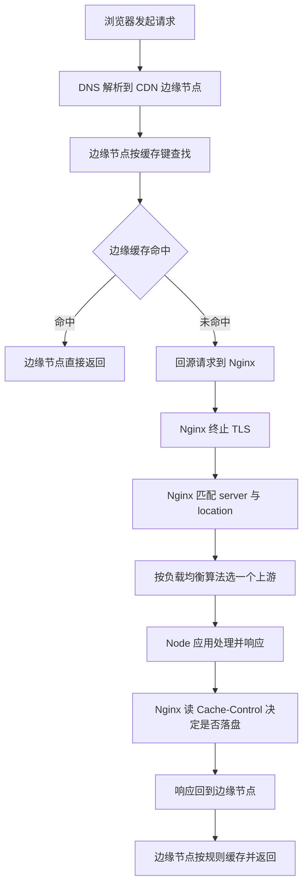
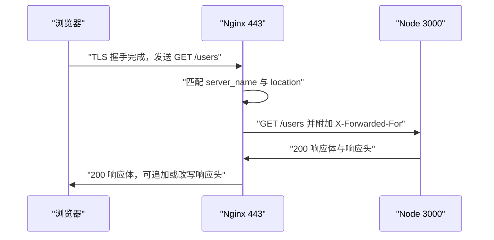
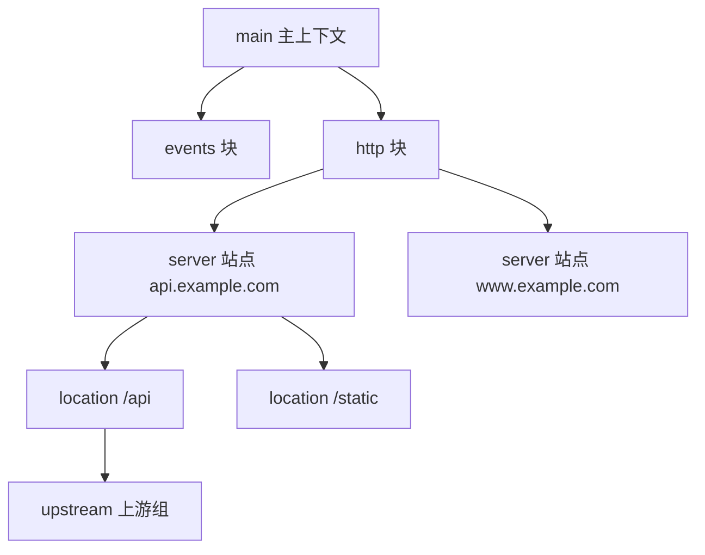
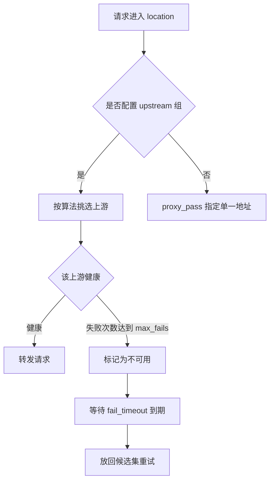
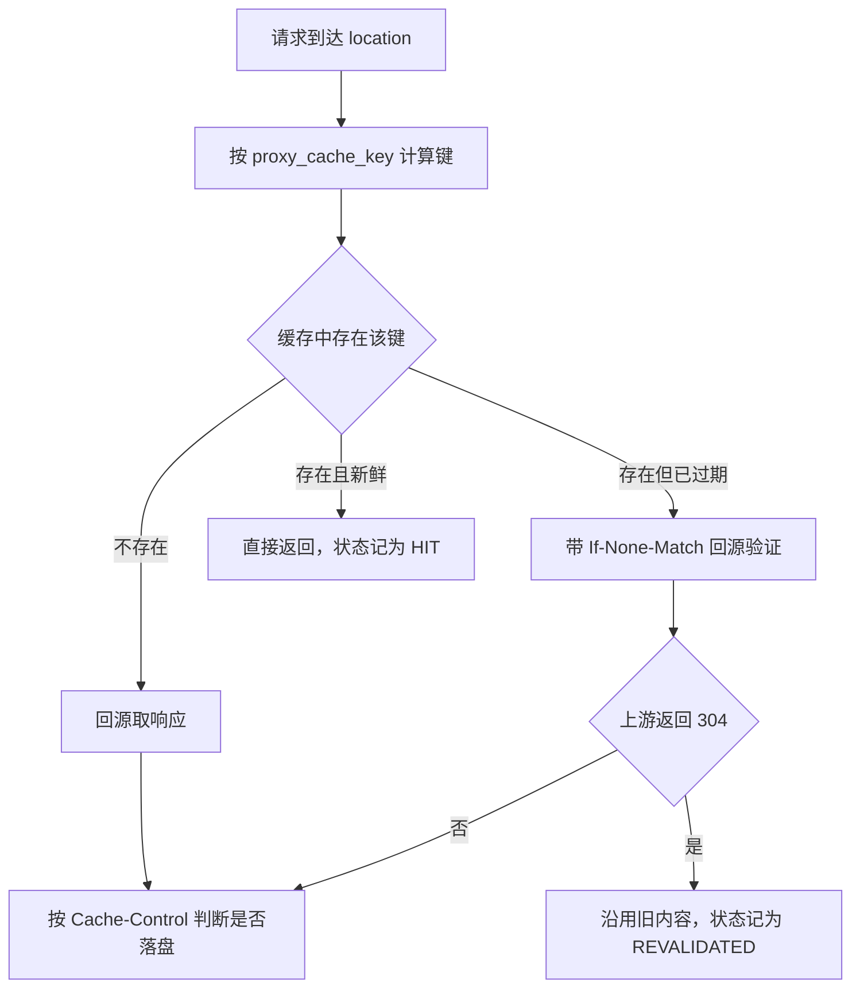
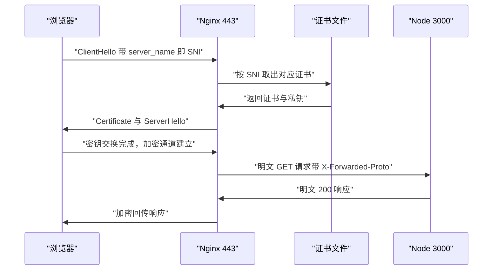
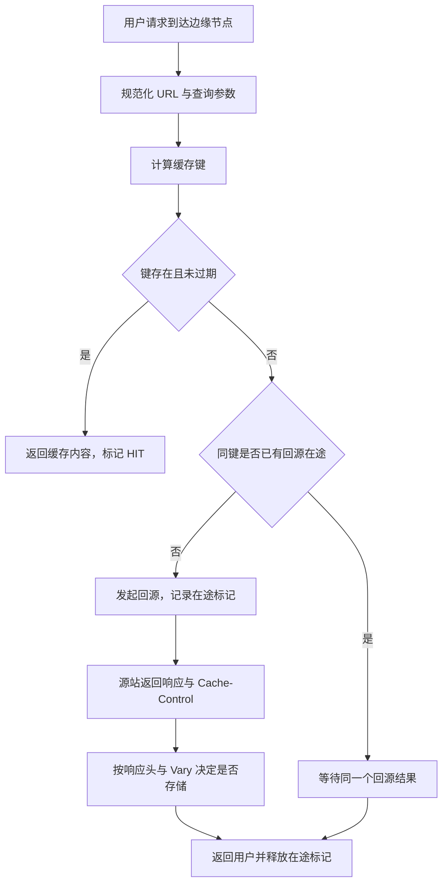
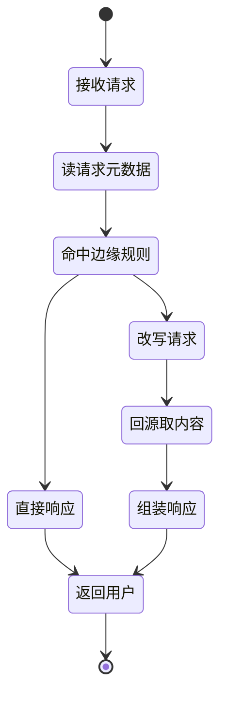
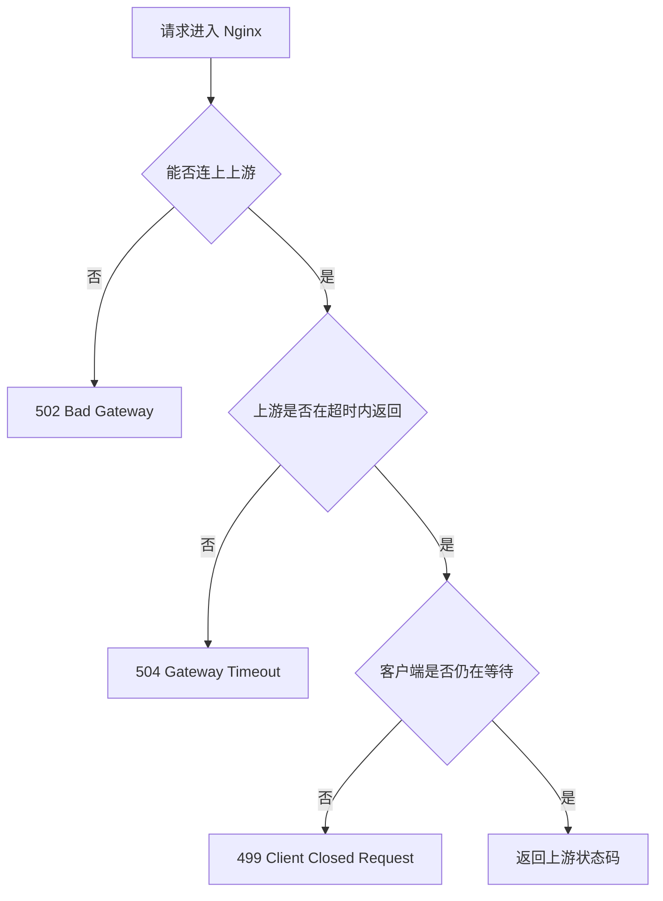

# Nginx、CDN 与边缘：流量是怎么到你的服务器的

!!! abstract "学完这一页你能"
    - 说清一次请求从浏览器到 Node 服务的完整链路，并指出 Nginx 与 CDN 各自站在链路的哪一段。
    - 读懂含 http、server、location 三层上下文的配置，判断一条指令最终由谁的值生效。
    - 从轮询、加权轮询、最少连接、IP 哈希四种算法中选一种，并给出可复核的选择依据。
    - 写出一条缓存规则，列出缓存键的组成部分，并用日志与状态码区分 HIT、MISS、502、504。

## 0. 知识地图



建议按编号顺序读。第 1 节建立整条链路的全局印象，第 2 到第 5 节讲源站这一侧的 Nginx，第 6 与第 7 节把视角移到离用户更近的 CDN 与边缘节点。第 8 节把前面的配置合成一份可排障的检查清单。

## 1. 一次请求的旅程：反向代理为什么存在

**先想一个问题**

你的 Node 服务监听 3000 端口，用户在地址栏输入的是 `https://api.example.com`，地址里没有端口号，也没有 `http://` 之外的任何信息。443 端口的流量由谁接住，又由谁交给 3000 端口的进程？

**心智模型**

!!! tip "心智模型"
    一句话模型：反向代理是站在服务器这一侧的统一入口，浏览器只认识它，不认识后面的应用进程。  
    日常类比：小区前台代收所有快递，住户不用各自在门口等快递员。  
    类比不成立处：前台不会改写快递单，而 Nginx 会改写请求头、重写路径、并直接返回命中缓存的内容。

!!! note "术语：反向代理（Reverse Proxy）"
    代表服务器接收客户端请求、再把请求转发给后端进程的中间服务。例：浏览器请求 `https://api.example.com/users`，Nginx 收到后转发给 `http://127.0.0.1:3000/users`。

**图解**



1. 浏览器与 Nginx 完成 TLS 握手，证书由 Nginx 提供，Node 进程不接触证书。
2. Nginx 按 `server_name` 找到站点，再按 `location` 找到转发规则。
3. Nginx 用 HTTP 明文访问上游，并补上真实客户端地址等头部。
4. 上游返回响应，Nginx 可以在回传前改写响应头或压缩响应体。
5. 浏览器自始至终没有直连 3000 端口，3000 端口也不必对外网开放。

**一步一步来**

第一步：用 Node 起一个上游服务，并让它把收到的关键头部原样回显。

```js
// 上游服务：模拟 Node 业务进程
import http from "node:http";

const origin = http.createServer((req, res) => {
  // 读取代理写入的真实客户端 IP 头
  const ip = req.headers["x-forwarded-for"] ?? "unknown";
  res.writeHead(200, { "content-type": "application/json" });
  // 回显路径、IP、原始协议、Host，便于核对代理改写结果
  res.end(JSON.stringify({
    path: req.url,
    ip,
    proto: req.headers["x-forwarded-proto"],
    host: req.headers.host,
  }));
});

origin.listen(3000, () => console.log("origin on 3000"));
```

**这段代码在做什么**

- 创建一个 HTTP 服务并监听 3000 端口。
- 读取 `x-forwarded-for` 请求头，取不到时填 `unknown`。
- 把响应类型设为 JSON。
- 回显路径、客户端 IP、原始协议、Host 四个字段。
- 这四个字段正好覆盖代理最常改写的三处信息。

运行结果：`origin on 3000`

第二步：用 Node 写一个最小代理，把浏览器请求转发到上游。

```js
import http from "node:http";

const proxy = http.createServer((clientReq, clientRes) => {
  // 构造转发给上游的请求选项
  const options = {
    host: "127.0.0.1",
    port: 3000,
    path: clientReq.url,
    method: clientReq.method,
    headers: {
      ...clientReq.headers,
      // 追加真实客户端地址，形成可追溯的链
      "x-forwarded-for": clientReq.socket.remoteAddress ?? "",
      // 声明原始协议，后端据此判断是否要跳转 HTTPS
      "x-forwarded-proto": "https",
      // 覆盖 Host，让上游按域名处理虚拟主机
      host: "api.example.com",
    },
  };
  // 把上游响应原样写回客户端
  const upstream = http.request(options, (upstreamRes) => {
    clientRes.writeHead(upstreamRes.statusCode, upstreamRes.headers);
    upstreamRes.pipe(clientRes);
  });
  clientReq.pipe(upstream);
});

proxy.listen(8080, () => console.log("proxy on 8080"));
```

**这段代码在做什么**

- 为每条请求构造转发选项，路径保持原样传递。
- 在 `x-forwarded-for` 里写入 socket 对端地址。
- 写入 `x-forwarded-proto`，值为 `https`，即使本地是明文连接。
- 覆盖 `host` 头，让上游按 `api.example.com` 处理请求。
- 用 `pipe` 把请求体与响应体双向搬运，代理不缓冲整个响应。

运行结果：`proxy on 8080`

**动手验证**

```js
// 依赖：仅 Node 20+ 内置模块
import http from "node:http";
import assert from "node:assert/strict";

// 1. 上游服务
const origin = http.createServer((req, res) => {
  res.writeHead(200, { "content-type": "application/json" });
  res.end(JSON.stringify({
    path: req.url,
    ip: req.headers["x-forwarded-for"],
    proto: req.headers["x-forwarded-proto"],
    host: req.headers.host,
  }));
});
await new Promise((r) => origin.listen(3000, r));

// 2. 代理服务
const proxy = http.createServer((cReq, cRes) => {
  const up = http.request({
    host: "127.0.0.1",
    port: 3000,
    path: cReq.url,
    method: cReq.method,
    headers: {
      ...cReq.headers,
      "x-forwarded-for": cReq.socket.remoteAddress ?? "",
      "x-forwarded-proto": "https",
      host: "api.example.com",
    },
  }, (upRes) => {
    cRes.writeHead(upRes.statusCode, upRes.headers);
    upRes.pipe(cRes);
  });
  cReq.pipe(up);
});
await new Promise((r) => proxy.listen(8080, r));

// 3. 通过代理发请求，校验改写结果
const body = await new Promise((resolve, reject) => {
  http.get("http://127.0.0.1:8080/users?id=7", (res) => {
    let data = "";
    res.on("data", (c) => (data += c));
    res.on("end", () => resolve(data));
  }).on("error", reject);
});
const parsed = JSON.parse(body);
assert.equal(parsed.path, "/users?id=7");     // 路径与查询串未被改动
assert.equal(parsed.proto, "https");          // 原始协议被声明为加密
assert.equal(parsed.host, "api.example.com"); // Host 被覆盖
assert.equal(parsed.ip, "127.0.0.1");         // 真实客户端地址被透传
console.log("PASS", parsed);

origin.close();
proxy.close();
```

预期输出：`PASS { path: '/users?id=7', ip: '127.0.0.1', proto: 'https', host: 'api.example.com' }`

**常见坑**

| 现象 | 原因 | 怎么修 |
| --- | --- | --- |
| 上游日志里客户端 IP 全是 127.0.0.1 | 只转发了请求，没有透传真实地址 | 在 Nginx 里设置 `proxy_set_header X-Forwarded-For $proxy_add_x_forwarded_for` |
| 上游生成的跳转地址指向 127.0.0.1:3000 | Host 头没有被改写 | 设置 `proxy_set_header Host $host` |
| 后端反复把用户跳转到 HTTPS 登录页 | 后端读不到原始协议，误判为明文访问 | 设置 `proxy_set_header X-Forwarded-Proto $scheme` |

**小结**

- 反向代理代表服务器，正向代理代表客户端，二者方向相反。
- 代理要改写三类信息：客户端地址、原始协议、目标主机。
- 上游只监听内网地址，可以避免把应用进程直接暴露到公网。

## 2. Nginx 配置结构：指令、上下文、继承

**先想一个问题**

`http` 块里写了 `proxy_read_timeout 60s`，某个 `server` 块写了 `30s`，`location` 里没有写。这条 location 处理请求时，超时到底是 60 秒还是 30 秒？

**心智模型**

!!! tip "心智模型"
    一句话模型：Nginx 配置是一棵嵌套的树，子上下文继承父上下文的指令，就近写的值覆盖父级。  
    日常类比：公司制度里总部规定年假 10 天，部门规定 8 天，个人表上没写就按部门算。  
    类比不成立处：`add_header` 这类指令不会合并父子的值，子上下文写了新值就只保留子上下文的值。

!!! note "术语：指令与上下文"
    指令（directive）是配置里以分号结尾的一条设置，例：`worker_processes 4;`。上下文（context）是能容纳其他指令的块，例：`http`、`server`、`location`。

**图解**



1. `main` 是最外层，`worker_processes` 这类全局指令写在这里。
2. `events` 管连接处理方式，例如每个 worker 允许的连接数。
3. `http` 管所有 HTTP 站点的共同设置，缓存定义与日志格式放在这一层。
4. `server` 代表一个站点，用 `listen` 与 `server_name` 区分。
5. `location` 代表站点内的一段路径，转发规则写在这一层。

**一步一步来**

第一步：写一份三层结构的 `nginx.conf`，每行都有注释。

```nginx
# main 层：进程数量，通常等于 CPU 核数
worker_processes 4;

events {
    worker_connections 1024;   # 每个 worker 允许的连接数
}

http {
    # 这一层的超时值会被下层继承
    proxy_read_timeout 60s;
    proxy_connect_timeout 5s;

    server {
        listen 80;
        server_name api.example.com;

        # 站点级覆盖：本站点读超时改为 30 秒
        proxy_read_timeout 30s;

        location /api/ {
            # 这里没有写 proxy_read_timeout，沿用 server 的 30s
            proxy_pass http://node_upstream;
        }
    }
}
```

**这段代码在做什么**

- `worker_processes 4` 决定工作进程数量，写在 main 层。
- `events` 块只放连接相关的指令。
- `proxy_read_timeout 60s` 写在 http 层，作为全站默认值。
- `server` 块把读超时改成 30 秒，只影响这个站点。
- `location /api/` 没有写超时，因此沿用的是 30 秒。

运行结果：`location /api/` 的 `proxy_read_timeout` 等于 `30s`。

第二步：用 Node 把配置文本解析成树，并算出每个 location 的生效值。

```js
// 依赖：仅 Node 20+ 内置模块
import assert from "node:assert/strict";

// 1. 把配置文本解析成 上下文 加 指令 的树
function parse(text) {
  const root = { kind: "main", name: "main", directives: [], children: [] };
  const stack = [root];
  for (const raw of text.split("\n")) {
    const line = raw.replace(/#.*$/, "").trim();      // 去掉行尾注释
    if (!line) continue;                               // 跳过空行
    const open = line.match(/^([a-z_]+)(?:\s+(\S+))?\s*\{$/);
    if (open) {                                        // 形如 http { 或 location /api/ {
      const kind = open[1];
      const name = open[2] ? `${kind} ${open[2]}` : kind;
      const node = { kind, name, directives: [], children: [] };
      stack.at(-1).children.push(node);
      stack.push(node);
      continue;
    }
    if (line === "}") { stack.pop(); continue; }        // 上下文结束
    const [key, ...rest] = line.replace(/;$/, "").split(/\s+/);
    stack.at(-1).directives.push({ key, value: rest.join(" ") });
  }
  return root;
}

// 2. 从当前上下文向上查找，最近一次定义生效
function lookup(chain, key) {
  for (let i = chain.length - 1; i >= 0; i -= 1) {
    const hit = chain[i].directives.find((d) => d.key === key);
    if (hit) return { value: hit.value, from: chain[i].name };
  }
  return null;
}

// 3. 深度遍历，收集每个 location 的生效值
function walk(node, chain = [], out = {}) {
  const next = [...chain, node];
  for (const child of node.children) walk(child, next, out);
  if (node.kind === "location") {
    out[next.map((n) => n.name).join(".")] = {
      readTimeout: lookup(next, "proxy_read_timeout"),
      connectTimeout: lookup(next, "proxy_connect_timeout"),
    };
  }
  return out;
}
```

**这段代码在做什么**

- `parse` 逐行读取，用正则识别块的开始与结束。
- 用 `stack` 记录当前所在上下文，`{` 入栈，`}` 出栈。
- 非块行拆成键与值，存进当前上下文的指令数组。
- `lookup` 从最深的上下文往上找，返回第一个命中的值及来源。
- `walk` 递归整棵树，为每个 `location` 输出生效结果。

第三步：用第一步的配置文本跑一遍，断言来源层级。

```js
const cfg = `
http {
    proxy_read_timeout 60s;
    proxy_connect_timeout 5s;
    server {
        server_name api.example.com;
        proxy_read_timeout 30s;
        location /api/ {
            proxy_pass http://node_upstream;
        }
    }
}
`;

const tree = parse(cfg);
const result = walk(tree);
const key = "main.http.server.location /api/";
assert.equal(result[key].readTimeout.value, "30s");        // 来自 server
assert.equal(result[key].readTimeout.from, "server");
assert.equal(result[key].connectTimeout.value, "5s");       // 来自 http
assert.equal(result[key].connectTimeout.from, "http");
console.log("PASS", result[key]);
```

**这段代码在做什么**

- 定义一份与第一步一致的配置文本。
- 解析成树后遍历，取得 `location /api/` 的生效结果。
- 断言读超时命中 `server` 层，因为这一层写了新值。
- 断言连接超时命中 `http` 层，因为下层没有写。
- 两个断言一起证明继承规则是"就最近的一层生效"。

运行结果：`PASS { readTimeout: { value: '30s', from: 'server' }, connectTimeout: { value: '5s', from: 'http' } }`

**动手验证**

```js
// 依赖：仅 Node 20+ 内置模块
import assert from "node:assert/strict";

function parse(text) {
  const root = { kind: "main", name: "main", directives: [], children: [] };
  const stack = [root];
  for (const raw of text.split("\n")) {
    const line = raw.replace(/#.*$/, "").trim();
    if (!line) continue;
    const open = line.match(/^([a-z_]+)(?:\s+(\S+))?\s*\{$/);
    if (open) {
      const kind = open[1];
      const name = open[2] ? `${kind} ${open[2]}` : kind;
      stack.at(-1).children.push({ kind, name, directives: [], children: [] });
      stack.push(stack.at(-1).children.at(-1));
      continue;
    }
    if (line === "}") { stack.pop(); continue; }
    const [key, ...rest] = line.replace(/;$/, "").split(/\s+/);
    stack.at(-1).directives.push({ key, value: rest.join(" ") });
  }
  return root;
}

function lookup(chain, key) {
  for (let i = chain.length - 1; i >= 0; i -= 1) {
    const hit = chain[i].directives.find((d) => d.key === key);
    if (hit) return { value: hit.value, from: chain[i].name };
  }
  return null;
}

function walk(node, chain = [], out = {}) {
  const next = [...chain, node];
  for (const child of node.children) walk(child, next, out);
  if (node.kind === "location") {
    out[next.map((n) => n.name).join(".")] = lookup(next, "proxy_read_timeout");
  }
  return out;
}

const tree = parse(`
http {
  proxy_read_timeout 60s;
  server {
    proxy_read_timeout 30s;
    location /a { proxy_pass http://up; }
    location /b { proxy_read_timeout 10s; proxy_pass http://up; }
  }
  server {
    location /c { proxy_pass http://up; }
  }
}
`);
const out = walk(tree);
assert.equal(out["main.http.server.location /a"].value, "30s");
assert.equal(out["main.http.server.location /a"].from, "server");
assert.equal(out["main.http.server.location /b"].value, "10s");
assert.equal(out["main.http.server.location /b"].from, "location /b");
assert.equal(out["main.http.server.location /c"].value, "60s");
assert.equal(out["main.http.server.location /c"].from, "http");
console.log("PASS", JSON.stringify(out, null, 0));
```

预期输出：`PASS {...}`，其中 `/a` 为 `30s` 来自 `server`，`/b` 为 `10s` 来自自己，`/c` 为 `60s` 来自 `http`。

**常见坑**

| 现象 | 原因 | 怎么修 |
| --- | --- | --- |
| 改了 http 层的 `add_header` 却对某个 server 不生效 | `add_header` 不合并，子层写了新值就只保留子层的 | 在需要该头的每个上下文重复写一遍 |
| 配置改了但行为没变 | 没有执行 `nginx -t` 与 reoad | 先 `nginx -t` 校验，再 `nginx -s reload` |
| 同一条指令在两个 server 里行为不同 | 指令写在 server 层，另一个站点没有继承到 | 把公共指令上移到 http 层，或逐个 server 补齐 |

**小结**

- 配置是一棵树：main、http、server、location 逐层收窄。
- 查找规则是从当前层向上找，最近的一层生效。
- `add_header` 与 `proxy_set_header` 这类数组型指令要按上下文重复书写。

## 3. 反向代理与负载均衡：算法与健康检查

**先想一个问题**

你有三台 Node 服务，一台 4 核、两台 2 核。用户请求进来后，凭什么规则决定这一条发给谁？某台机器挂掉后，流量还要不要继续发过去？

**心智模型**

!!! tip "心智模型"
    一句话模型：负载均衡是在一组上游之间挑一个的规则，健康检查负责把坏掉的上游暂时踢出候选集。  
    日常类比：银行叫号机把排队的人分到各个窗口，关掉的窗口不会出现在叫号列表里。  
    类比不成立处：叫号只看窗口空闲，Nginx 还能按权重、按客户端地址、按响应时间做分配。

!!! note "术语：上游与上游组"
    上游（upstream）指 Nginx 后面真正处理请求的服务进程。上游组（upstream block）是一组上游加上算法的配置块。例：`upstream node_upstream { server 10.0.0.11:3000; }`。

**图解**



1. `proxy_pass` 指向一个上游组时，才会启用负载均衡。
2. 算法决定候选顺序，默认是轮询。
3. 每条新请求都会先检查目标上游是否处于健康状态。
4. 连续失败达到 `max_fails` 次，该上游被标记为不可用。
5. `fail_timeout` 到期后，Nginx 会再试一次并决定是否恢复。

**一步一步来**

第一步：写一个上游组，把算法与健康检查参数配在一起。

```nginx
# upstream 块放在 http 上下文里
upstream node_upstream {
    least_conn;                                  # 算法：最少连接
    server 10.0.0.11:3000 weight=2 max_fails=3 fail_timeout=10s;
    server 10.0.0.12:3000 weight=1;               # 权重默认 1
    server 10.0.0.13:3000 backup;                 # 仅在前两台都不可用时启用
    keepalive 32;                                 # 与上游保持 32 条长连接
}
```

**这段代码在做什么**

- `least_conn` 把新请求交给当前连接数最少的上游。
- `weight=2` 让第一台承担的连接数是第二台的两倍。
- `max_fails=3` 表示连续失败三次后判定不可用。
- `fail_timeout=10s` 同时是失败统计窗口与摘除时长。
- `backup` 标记兜底上游，只有主上游全挂才启用。

运行结果：健康时流量按 2 比 1 分配；第一台挂掉后流量转到第二台；两台都挂才轮到 backup。

第二步：用 Node 实现四种算法，观察各自的分配结果。

```js
// 依赖：仅 Node 20+ 内置模块
import assert from "node:assert/strict";

// 1. 轮询：按顺序取下一个
function roundRobin(servers) {
  let i = 0;
  return () => servers[i++ % servers.length].name;
}

// 2. 加权轮询：按权重展开成池子再轮询
function weighted(servers) {
  const pool = servers.flatMap((s) =>
    Array.from({ length: s.weight }, () => s.name));
  let i = 0;
  return () => pool[i++ % pool.length];
}

// 3. 最少连接：选当前连接数最小的
function leastConn(servers) {
  return () => [...servers].sort((a, b) => a.conns - b.conns)[0].name;
}

// 4. IP 哈希：同一客户端固定落到同一台上游
function ipHash(servers) {
  return (ip) => {
    let h = 0;
    for (const ch of ip) h = (h * 31 + ch.charCodeAt(0)) % 100000;
    return servers[h % servers.length].name;
  };
}

const servers = [
  { name: "a", weight: 2, conns: 5 },
  { name: "b", weight: 1, conns: 1 },
];

assert.deepEqual([roundRobin(servers)(), roundRobin(servers)()], ["a", "a"]);
const rr = roundRobin(servers);
assert.deepEqual([rr(), rr(), rr(), rr()], ["a", "b", "a", "b"]);

const w = weighted(servers);
assert.deepEqual([w(), w(), w()], ["a", "a", "b"]);  // 权重 2 比 1

assert.equal(leastConn(servers)(), "b");             // b 连接数只有 1

const ih = ipHash(servers);
assert.equal(ih("10.0.0.7"), ih("10.0.0.7"));        // 同一 IP 结果稳定
console.log("PASS", rr(), leastConn(servers)(), ih("10.0.0.7"));
```

**这段代码在做什么**

- 轮询用一个自增下标配取模，得到循环序列。
- 加权轮询先把权重展开成数组，再对数组做轮询。
- 最少连接对当前连接数排序，取最小的一台。
- IP 哈希把客户端地址映射成整数，再对上游数量取模。
- 四组断言分别验证分配序列、权重比例、选择依据与稳定性。

运行结果：`PASS a b b`（最后一项随 IP 值变化）。

**动手验证**

```js
// 依赖：仅 Node 20+ 内置模块
import assert from "node:assert/strict";

// 上游组：含权重、健康状态、当前连接数
const servers = [
  { name: "a", weight: 2, conns: 5, healthy: true },
  { name: "b", weight: 1, conns: 1, healthy: true },
  { name: "c", weight: 1, conns: 0, healthy: false },
];

// 加权轮询，同时跳过不健康的上游
function pick(servers) {
  const pool = servers.filter((s) => s.healthy)
    .flatMap((s) => Array.from({ length: s.weight }, () => s.name));
  let i = 0;
  return () => pool[i++ % pool.length];
}

const next = pick(servers);
const seq = [next(), next(), next(), next()];
assert.deepEqual(seq, ["a", "a", "b", "a"]);   // c 不健康，被排除
assert.ok(!seq.includes("c"));

// 健康检查：连续失败达到阈值后摘除
const state = new Map(servers.map((s) => [s.name, { fails: 0, down: false }]));
function onFail(name, maxFails = 3) {
  const st = state.get(name);
  st.fails += 1;
  if (st.fails >= maxFails) st.down = true;
  return st;
}
assert.equal(onFail("a").down, false);
assert.equal(onFail("a").down, false);
assert.equal(onFail("a").down, true);           // 第三次失败后摘除
assert.equal(state.get("b").down, false);

// 摘除后重新选，只会落在 b 上
const after = pick(servers.map((s) =>
  s.name === "a" ? { ...s, healthy: false } : s));
assert.deepEqual([after(), after()], ["b", "b"]);
console.log("PASS", seq.join(","), "a down:", state.get("a").down);
```

预期输出：`PASS a,a,b,a a down: true`

**常见坑**

| 现象 | 原因 | 怎么修 |
| --- | --- | --- |
| 用户登录后立刻掉线 | 用了轮询，会话存在单个进程内存里 | 改成 IP 哈希，或把会话存到共享存储 |
| 一台慢机器越积越多请求 | 轮询不看当前负载，慢机器还在接收请求 | 改用 `least_conn`，并给上游设置超时 |
| 摘除的机器一直不恢复 | `fail_timeout` 太短导致误判，或健康检查路径返回非 2xx | 核对健康检查接口的状态码与 `fail_timeout` |

**小结**

- 轮询适合上游配置一致、请求耗时接近的场景。
- 加权轮询适合机器规格不同，最少连接适合请求耗时差异大。
- IP 哈希解决会话粘性，代价是一台机器故障会影响固定的一批用户。

## 4. 缓存：Cache-Control、缓存键与落盘位置

**先想一个问题**

同一个接口一秒钟被请求 500 次，返回内容十秒内不会变。你希望只有第一次打到 Node，其余 499 次由 Nginx 直接返回。这件事由客户端头还是服务端头决定？

**心智模型**

!!! tip "心智模型"
    一句话模型：缓存由响应头里的新鲜度声明和缓存键两部分共同决定，键相同才可能命中。  
    日常类比：图书馆按"书名加版次"找书，书名相同版次不同就是两本书。  
    类比不成立处：缓存过期后不会自动消失，而是进入需要重新验证的状态，验证通过可继续沿用旧内容。

!!! note "术语：缓存键（Cache Key）"
    缓存键是查找缓存条目的索引字符串，内容不同但键相同的请求会共用一份响应。例：`proxy_cache_key "$scheme$request_method$host$request_uri"` 会把 `GET` 与 `POST` 分成两条。

**图解**



1. 请求先经过 `location`，Nginx 按 `proxy_cache_key` 算出索引。
2. 键不存在时直接回源，响应回来后判断是否允许落盘。
3. 键存在且仍在新鲜期内，直接返回，`$upstream_cache_status` 为 `HIT`。
4. 键存在但已过期，Nginx 带上验证头回源。
5. 上游返回 304 时沿用旧内容，状态为 `REVALIDATED`。

**一步一步来**

第一步：在 `http` 层定义缓存区，在 `location` 层引用并指定缓存键。

```nginx
http {
    # 缓存定义：目录、目录层级、共享内存区名与大小、磁盘上限、闲置清理时间
    proxy_cache_path /var/cache/nginx levels=1:2 keys_zone=api_cache:10m
                     max_size=1g inactive=60m use_temp_path=off;

    server {
        location /api/ {
            proxy_cache api_cache;                                       # 引用上面的区
            proxy_cache_key "$scheme$request_method$host$request_uri";   # 缓存键
            proxy_cache_valid 200 302 10m;                               # 成功响应缓存 10 分钟
            proxy_cache_valid 404 1m;                                    # 404 只缓存 1 分钟
            proxy_cache_bypass $http_authorization;                      # 带鉴权头时跳过缓存
            add_header X-Cache-Status $upstream_cache_status;            # 便于观察命中情况
            proxy_pass http://node_upstream;
        }
    }
}
```

**这段代码在做什么**

- `proxy_cache_path` 定义磁盘目录与共享内存区，`keys_zone` 名字在后面被引用。
- `proxy_cache` 打开缓存并绑定到共享内存区。
- `proxy_cache_key` 决定哪些请求算作同一条缓存。
- `proxy_cache_valid` 给不同状态码设置不同时长。
- `add_header` 把命中状态写进响应头，便于脚本核对。

运行结果：第一次请求响应头带 `X-Cache-Status: MISS`，第二次带 `HIT`。

第二步：用 Node 实现一份按 `Cache-Control` 决策的缓存，验证共享缓存与私有缓存取值的差别。

```js
// 依赖：仅 Node 20+ 内置模块
import assert from "node:assert/strict";

// 1. 把 Cache-Control 解析成对象
function parseCC(value = "") {
  return Object.fromEntries(
    value.split(",")
      .map((p) => p.trim().split("="))
      .filter(([k]) => k)
      .map(([k, v]) => [k.toLowerCase(), v ?? true]),
  );
}

// 2. 判断能否缓存与剩余时长，shared 为 true 表示 Nginx 或 CDN
function decide(res, shared) {
  const cc = parseCC(res.headers["cache-control"]);
  if (cc["no-store"]) return { cacheable: false, ttl: 0, stale: false };
  const ttl = Number(
    shared ? (cc["s-maxage"] ?? cc["max-age"] ?? 0) : (cc["max-age"] ?? 0),
  );
  return { cacheable: ttl > 0, ttl, stale: Boolean(cc["stale-while-revalidate"]) };
}

// 浏览器视角：只认 max-age
assert.deepEqual(
  decide({ headers: { "cache-control": "public, s-maxage=600, max-age=60" } }, false),
  { cacheable: true, ttl: 60, stale: false },
);

// Nginx 与 CDN 视角：优先认 s-maxage
assert.deepEqual(
  decide({ headers: { "cache-control": "public, s-maxage=600, max-age=60" } }, true),
  { cacheable: true, ttl: 600, stale: false },
);

// no-store 任何一方都不缓存
assert.equal(decide({ headers: { "cache-control": "no-store" } }, true).cacheable, false);

// stale-while-revalidate 允许过期后先返回旧内容
assert.equal(
  decide({ headers: { "cache-control": "public, max-age=60, stale-while-revalidate=30" } }, true).stale,
  true,
);
console.log("PASS", decide({ headers: { "cache-control": "public, s-maxage=600" } }, true));
```

**这段代码在做什么**

- `parseCC` 把逗号分隔的指令拆成键值对，无等号的指令取值 `true`。
- `decide` 先看 `no-store`，命中则任何缓存都不保存。
- 共享缓存优先取 `s-maxage`，取不到再退回 `max-age`。
- 私有缓存只用 `max-age`，忽略 `s-maxage`。
- 最后一组断言验证过期后允许先用旧内容的策略。

**动手验证**

```js
// 依赖：仅 Node 20+ 内置模块
import assert from "node:assert/strict";

// 用 Map 模拟 Nginx 的缓存区
const store = new Map();
let originHits = 0;
let counter = 0;

function parseCC(value = "") {
  return Object.fromEntries(
    value.split(",").map((p) => p.trim().split("=")).filter(([k]) => k)
      .map(([k, v]) => [k.toLowerCase(), v ?? true]),
  );
}

function cacheKey(req) {
  return [req.method, req.headers.host, req.url].join("|");
}

function handle(req, now) {
  const key = cacheKey(req);
  const hit = store.get(key);
  if (hit && hit.expires > now) {
    return { status: "HIT", ttl: hit.ttl, body: hit.body };
  }
  originHits += 1;
  counter += 1;
  const body = `payload-${counter}`;
  const cc = parseCC(hit ? hit.cc : "public, s-maxage=10");
  const ttl = Number(cc["s-maxage"] ?? cc["max-age"] ?? 0);
  if (ttl > 0) {
    store.set(key, { body, ttl, cc: hit ? hit.cc : "public, s-maxage=10", expires: now + ttl });
  }
  return { status: "MISS", ttl, body };
}

const req = { method: "GET", url: "/api/list?page=1", headers: { host: "api.example.com" } };

const r1 = handle(req, 0);
const r2 = handle(req, 3);
assert.equal(r1.status, "MISS");
assert.equal(r2.status, "HIT");
assert.equal(r2.body, r1.body);          // 命中时返回同一份内容
assert.equal(originHits, 1);             // 只回源一次

const r3 = handle(req, 30);              // 超过 10 秒有效期
assert.equal(r3.status, "MISS");
assert.equal(originHits, 2);

const other = handle({ ...req, url: "/api/list?page=2" }, 31);
assert.equal(other.status, "MISS");      // 查询串不同，键不同
console.log("PASS", r1.status, r2.status, r3.status, "origin:", originHits);
```

预期输出：`PASS MISS HIT MISS origin: 3`

**常见坑**

| 现象 | 原因 | 怎么修 |
| --- | --- | --- |
| 缓存一直不命中 | 响应带 `Set-Cookie` 或 `Cache-Control: private`，共享缓存拒绝保存 | 接口层去掉 `Set-Cookie`，或把默认规则改为 `proxy_ignore_headers` 后显式控制 |
| 缓存了带用户信息的响应并发给别人 | 缓存键没包含鉴权维度，`Authorization` 没有参与键 | 键里加入 `$http_authorization`，或对需要鉴权的路径设置 `proxy_cache_bypass` |
| 磁盘被缓存写满 | 只设了 `max_size` 没设 `inactive`，旧文件没有清理时机 | 同时设置 `max_size=1g` 与 `inactive=60m` |

**小结**

- `Cache-Control` 决定能不能缓存与缓存多久，缓存键决定谁和谁共用。
- `s-maxage` 面向 Nginx 与 CDN，`max-age` 面向浏览器。
- 命中状态写在响应头里，是排查缓存问题最快的入口。

## 5. HTTPS 终止：证书、SNI 与 HSTS

**先想一个问题**

你的 Node 进程要处理业务逻辑，还要不要同时管证书续期、TLS 版本升级？如果 Nginx 已经把加密解开，Node 收到的是明文还是密文？

**心智模型**

!!! tip "心智模型"
    一句话模型：HTTPS 终止是把解密工作放在入口层完成，内网只跑明文 HTTP。  
    日常类比：大楼门口的安检只在门口做一次，楼内走廊不再重复安检。  
    类比不成立处：走廊虽然不做安检，但要限制谁能进，否则明文流量在内网可被直接读取。

!!! note "术语：TLS 终止（TLS Termination）"
    TLS 终止指在入口服务完成 TLS 握手与解密，再把明文请求转给后端。例：浏览器与 Nginx 走 HTTPS，Nginx 与 Node 之间走 HTTP。

**图解**



1. 浏览器在 ClientHello 里带上 `server_name`，这个字段就是 SNI。
2. Nginx 按 SNI 选择证书，一个 IP 可以承载多个域名。
3. Nginx 把证书链发给浏览器，浏览器校验签发链与有效期。
4. 双方完成密钥交换，之后的字节全部加密。
5. Nginx 解密后以明文访问 Node，并声明原始协议为 `https`。

**一步一步来**

第一步：写一份终止配置，包含证书、协议版本、HSTS 与明文跳转。

```nginx
server {
    listen 443 ssl;
    http2 on;                                          # 需核对官方文档：不同版本写法有差异
    server_name api.example.com;

    ssl_certificate     /etc/letsencrypt/live/api.example.com/fullchain.pem;
    ssl_certificate_key /etc/letsencrypt/live/api.example.com/privkey.pem;
    ssl_protocols TLSv1.2 TLSv1.3;                     # 只允许这两个版本
    ssl_session_cache shared:SSL:10m;                  # 复用会话，减少握手
    add_header Strict-Transport-Security "max-age=31536000; includeSubDomains" always;

    location / {
        proxy_set_header X-Forwarded-Proto $scheme;    # 告诉后端原始协议
        proxy_pass http://node_upstream;
    }
}
server {
    listen 80;
    server_name api.example.com;
    return 301 https://$host$request_uri;              # 明文请求整体跳转
}
```

**这段代码在做什么**

- `ssl_certificate` 指向完整证书链，包含中间证书。
- `ssl_certificate_key` 指向私钥文件，权限需要限制。
- `ssl_protocols` 关闭旧版本，只保留 1.2 与 1.3。
- HSTS 头让浏览器在未来一年内只走 HTTPS。
- 80 端口的 server 只做跳转，不承载业务。

运行结果：访问 `http://api.example.com/a?b=1` 返回 301，`Location` 为 `https://api.example.com/a?b=1`。

第二步：用 Node 验证终止层的三类判断：按 SNI 选证书、明文跳转、HSTS 头拼接。

```js
// 依赖：仅 Node 20+ 内置模块，本脚本不启动真实 TLS，只验证终止层的决策逻辑
import assert from "node:assert/strict";

// 1. 按 SNI 选择证书：一个 IP 承载多个域名
const certs = {
  "api.example.com": "fullchain-api.pem",
  "www.example.com": "fullchain-www.pem",
};
function pickCert(servername) {
  return certs[servername] ?? certs["www.example.com"];  // 未匹配时用默认证书
}

// 2. 明文请求跳转到 HTTPS，保留路径与查询串
function redirectToHttps(req) {
  if (req.proto === "https") return null;                // 已加密不再跳
  const host = req.headers.host ?? "example.com";
  return `https://${host}${req.url}`;
}

// 3. HSTS 头：告诉浏览器未来一段时间只走 HTTPS
function hstsHeader(maxAge) {
  return `max-age=${maxAge}; includeSubDomains`;
}

assert.equal(pickCert("api.example.com"), "fullchain-api.pem");
assert.equal(pickCert("other.example.com"), "fullchain-www.pem");
assert.equal(
  redirectToHttps({ proto: "http", url: "/a?b=1", headers: { host: "api.example.com" } }),
  "https://api.example.com/a?b=1",
);
assert.equal(redirectToHttps({ proto: "https", url: "/a", headers: {} }), null);
assert.equal(hstsHeader(31536000), "max-age=31536000; includeSubDomains");
console.log("PASS", pickCert("api.example.com"), hstsHeader(31536000));
```

**这段代码在做什么**

- 证书表用域名作键，模拟 SNI 到证书文件的映射。
- `pickCert` 在没有精确匹配时回退到默认证书，避免握手直接失败。
- `redirectToHttps` 只在协议不是 `https` 时生成跳转地址。
- 跳转地址保留原始路径与查询串。
- `hstsHeader` 拼接 `max-age` 与 `includeSubDomains` 两个参数。

同步验证脚本：把上面三段函数与断言合成单文件运行即可。

预期输出：`PASS fullchain-api.pem max-age=31536000; includeSubDomains`

**常见坑**

| 现象 | 原因 | 怎么修 |
| --- | --- | --- |
| 部分设备提示证书不受信任 | 只配了站点证书，没带中间证书 | 使用 `fullchain.pem` 而不是 `cert.pem` |
| 浏览器地址栏显示"不安全" | 页面里混用了 `http://` 资源 | 检查页面中图片、脚本、接口的协议，统一改 HTTPS |
| 开了 HSTS 后某个子域名无法访问 | `includeSubDomains` 让子域名也被强制 HTTPS，而该子域名没有证书 | 先确认所有子域名都有证书，再决定是否加 `includeSubDomains` 与 preload |

**小结**

- TLS 终止把证书与握手集中到入口层，后端只处理业务。
- SNI 让一个 IP 承载多个域名，默认证书是兜底。
- 明文跳转与 HSTS 一起用，前者立即生效，后者防止下次再走明文。

## 6. CDN：缓存键、回源与缓存击穿

**先想一个问题**

你的用户分布在不同地区，源站只有一台。同一个静态文件被请求十万次。怎样才能让其中九成九的请求不落到源站，同时又不至于给用户返回过期内容？

**心智模型**

!!! tip "心智模型"
    一句话模型：CDN 是把缓存放在离用户近的节点上，只有节点没有内容时才回源。  
    日常类比：连锁便利店在社区备货，缺货时才向总仓订货。  
    类比不成立处：便利店卖完就没了，CDN 在过期瞬间可以先把旧内容发出去，同时异步去源站取新的。

!!! note "术语：回源（Origin Fetch）"
    回源指 CDN 节点没有可用缓存时，向源站发起请求取内容。例：用户在上海节点请求 `/logo.png`，节点未命中，于是向 `origin.example.com` 取一次并缓存。

**图解**



1. 边缘节点先规范化 URL，去掉不影响内容的参数。
2. 用规范化结果加方法、主机拼出缓存键。
3. 键存在且未过期，直接返回。
4. 键不存在时先检查是否有同键请求正在回源。
5. 有在途请求就等待同一份结果，避免同一秒打爆源站。
6. 回源响应按 `Cache-Control` 与 `Vary` 决定是否存储。

**一步一步来**

第一步：写一份 CDN 侧需要理解的源站响应头，标明各字段的作用。

```http
HTTP/1.1 200 OK
Cache-Control: public, max-age=60, s-maxage=600, stale-while-revalidate=30
Vary: Accept-Encoding
ETag: "a1b2c3"
Content-Type: application/json
```

**这段代码在做什么**

- `public` 表示响应可以被共享缓存保存。
- `max-age=60` 给浏览器，`s-maxage=600` 给 CDN 节点。
- `stale-while-revalidate=30` 允许过期后 30 秒内先用旧内容。
- `Vary: Accept-Encoding` 说明压缩版本不同要分开存。
- `ETag` 用于过期后的重新验证，可返回 304。

运行结果：浏览器缓存 60 秒，CDN 节点缓存 600 秒，压缩与非压缩各存一份。

第二步：用 Node 实现缓存键与并发合并，验证同键并发只回源一次。

```js
// 依赖：仅 Node 20+ 内置模块
import assert from "node:assert/strict";

// 1. 计算缓存键：方法、主机、规范化路径、白名单查询参数
const ALLOWED = ["page", "lang"];                 // 只有这两个参数参与缓存键
function cacheKey(req) {
  const url = new URL(req.url, `http://${req.headers.host}`);
  const kept = ALLOWED
    .filter((k) => url.searchParams.has(k))
    .map((k) => `${k}=${url.searchParams.get(k)}`);
  kept.sort();                                    // 参数顺序不影响键
  return [req.method, req.headers.host, url.pathname, kept.join("&")].join("|");
}

// 2. 边缘缓存与在途合并
const store = new Map();
const inflight = new Map();
let originCalls = 0;

async function handle(req, fetchOrigin) {
  const key = cacheKey(req);
  if (store.has(key)) return { status: "HIT", body: store.get(key) };
  if (!inflight.has(key)) {
    originCalls += 1;
    inflight.set(key, fetchOrigin(req).then((body) => {
      store.set(key, body);                       // 回源结果写入缓存
      inflight.delete(key);                       // 释放在途标记
      return body;
    }));
  }
  return { status: "MISS", body: await inflight.get(key) };
}
```

**这段代码在做什么**

- `ALLOWED` 定义白名单，只有白名单内的参数影响缓存键。
- `kept.sort()` 保证 `page=1&lang=zh` 与 `lang=zh&page=1` 得到同一个键。
- `store` 保存已缓存内容，`inflight` 保存正在回源的请求。
- 命中缓存直接返回，不再调用 `fetchOrigin`。
- 同键并发时，后到的请求复用同一条在途 Promise。

第三步：跑断言，确认顺序请求与并发请求的差别。

```js
const req = { method: "GET", url: "/list?lang=zh&utm=abc", headers: { host: "cdn.example.com" } };
const r1 = await handle(req, async () => "payload");
const r2 = await handle(req, async () => "payload");
assert.equal(r1.status, "MISS");
assert.equal(r2.status, "HIT");
assert.equal(originCalls, 1);                     // 第二次没有回源

store.clear();
const [a, b] = await Promise.all([
  handle({ method: "GET", url: "/x", headers: { host: "cdn.example.com" } }, async () => "v"),
  handle({ method: "GET", url: "/x", headers: { host: "cdn.example.com" } }, async () => "v"),
]);
assert.equal(a.status, "MISS");
assert.equal(b.status, "MISS");
assert.equal(originCalls, 2);                     // 只多了一次回源
console.log("PASS", originCalls, a.body, b.body);
```

**这段代码在做什么**

- 第一次请求未命中，触发一次回源并写入缓存。
- 第二次请求键相同，直接命中，`originCalls` 仍为 1。
- `utm=abc` 不在白名单，不参与缓存键，因此仍能命中。
- 清空缓存后发两条并发请求，只有一条真正回源。
- 断言确认并发场景下 `originCalls` 只增加 1。

运行结果：`PASS 2 v v`

**动手验证**

```js
// 依赖：仅 Node 20+ 内置模块
import assert from "node:assert/strict";

const ALLOWED = ["page", "lang"];
function cacheKey(req) {
  const url = new URL(req.url, `http://${req.headers.host}`);
  const kept = ALLOWED.filter((k) => url.searchParams.has(k))
    .map((k) => `${k}=${url.searchParams.get(k)}`);
  kept.sort();
  return [req.method, req.headers.host, url.pathname, kept.join("&")].join("|");
}

const store = new Map();
const inflight = new Map();
let originCalls = 0;

async function handle(req, fetchOrigin) {
  const key = cacheKey(req);
  if (store.has(key)) return { status: "HIT", body: store.get(key) };
  if (!inflight.has(key)) {
    originCalls += 1;
    inflight.set(key, fetchOrigin(req).then((body) => {
      store.set(key, body);
      inflight.delete(key);
      return body;
    }));
  }
  return { status: "MISS", body: await inflight.get(key) };
}

// 场景一：顺序请求，第二次命中
const req = { method: "GET", url: "/list?lang=zh&utm=abc", headers: { host: "cdn.example.com" } };
const r1 = await handle(req, async () => "payload");
const r2 = await handle(req, async () => "payload");
assert.equal(r1.status, "MISS");
assert.equal(r2.status, "HIT");
assert.equal(originCalls, 1);

// 场景二：参数顺序不同，缓存键相同
assert.equal(
  cacheKey({ method: "GET", url: "/a?page=1&lang=zh", headers: { host: "h" } }),
  cacheKey({ method: "GET", url: "/a?lang=zh&page=1", headers: { host: "h" } }),
);

// 场景三：非白名单参数不影响键
assert.equal(
  cacheKey({ method: "GET", url: "/a?page=1&utm=x", headers: { host: "h" } }),
  cacheKey({ method: "GET", url: "/a?page=1&utm=y", headers: { host: "h" } }),
);

// 场景四：并发请求只回源一次
store.clear();
const [a, b] = await Promise.all([
  handle({ method: "GET", url: "/x", headers: { host: "cdn.example.com" } }, async () => "v"),
  handle({ method: "GET", url: "/x", headers: { host: "cdn.example.com" } }, async () => "v"),
]);
assert.equal(a.status, "MISS");
assert.equal(b.status, "MISS");
assert.equal(originCalls, 2);
console.log("PASS", r1.status, r2.status, "origin:", originCalls);
```

预期输出：`PASS MISS HIT origin: 2`

**常见坑**

| 现象 | 原因 | 怎么修 |
| --- | --- | --- |
| 缓存命中率长期偏低 | 缓存键包含随机参数或统计参数，每次请求都是新键 | 把不影响内容的参数排除出缓存键 |
| 用户拿到压缩内容却提示乱码 | 压缩与非压缩没有分开存，缺少 `Vary: Accept-Encoding` | 在源站响应里加上 `Vary: Accept-Encoding` |
| 缓存过期瞬间源站被打满 | 同一热点内容的请求同时判定过期，同时回源 | 开启 `stale-while-revalidate` 与并发合并，把过期时间加随机抖动 |

**小结**

- 缓存键决定命中范围，白名单参数与参数排序都要显式处理。
- 并发合并让同键的多条请求只产生一次回源。
- `stale-while-revalidate` 把过期瞬间的回源尖峰摊平。

## 7. 边缘计算：把一部分逻辑前移

**先想一个问题**

首页要根据用户所在国家显示不同文案，还要对每次请求做一次简单鉴权。如果这两件事都放在源站，跨太平洋的往返延迟会叠加到每一次请求上。能不能放到边缘节点做？

**心智模型**

!!! tip "心智模型"
    一句话模型：边缘计算是在离用户近的节点上运行一小段逻辑，能在节点解决就不回源。  
    日常类比：社区诊所先做分诊与包扎，需要手术才转到大医院。  
    类比不成立处：诊所设备固定，而边缘节点能读请求头、改响应、也能访问外部接口。

!!! note "术语：边缘计算（Edge Computing）"
    边缘计算指在 CDN 节点上运行用户自定义逻辑，例如改写请求、直接返回响应。例：节点读取 `cf-ipcountry` 头，直接返回当地语言的首页片段。

**图解**



1. 节点收到请求，先读取地理、设备、协议等元数据。
2. 命中边缘规则时，可能直接响应，不再回源。
3. 未命中直接响应时，改写请求后再回源。
4. 回源内容到达节点后，与边缘生成的部分一起组装。
5. 组装结果返回用户，并把可缓存部分写入节点缓存。

**一步一步来**

第一步：用 Node 实现一条中间件链，验证"先分流、再短路"的执行顺序。

```js
// 依赖：仅 Node 20+ 内置模块
import assert from "node:assert/strict";

// 1. 中间件链：每个函数处理请求，或交给下一个
function compose(middlewares) {
  return async (req) => {
    let i = -1;
    const next = async () => {
      i += 1;
      if (i >= middlewares.length) return { status: 200, body: "origin" };
      return middlewares[i](req, next);
    };
    return next();
  };
}

// 2. 按国家分流：给请求打上变体标记
const ab = async (req, next) => {
  if (req.path !== "/") return next();
  req.variant = req.headers["cf-ipcountry"] === "CN" ? "cn" : "global";
  return next();
};

// 3. 边缘直接返回，不访问源站
const shortCircuit = async (req, next) => {
  if (req.path === "/health") return { status: 200, body: "edge-ok", hitOrigin: false };
  const res = await next();
  return { ...res, hitOrigin: true, variant: req.variant ?? "default" };
};
```

**这段代码在做什么**

- `compose` 把中间件数组串成一条链，用下标控制推进。
- `next` 到达数组末尾时返回模拟的源站响应。
- `ab` 只在根路径上根据国家头设置 `variant`。
- `shortCircuit` 对 `/health` 直接返回，完全跳过源站。
- 其余路径先取源站结果，再补上 `hitOrigin` 与 `variant`。

第二步：跑断言，核对短路与回源两条分支。

```js
const app = compose([ab, shortCircuit]);

const health = await app({ path: "/health", headers: {} });
assert.deepEqual(health, { status: 200, body: "edge-ok", hitOrigin: false });

const req = { path: "/", headers: { "cf-ipcountry": "CN" } };
const home = await app(req);
assert.equal(home.hitOrigin, true);       // 这条走了回源
assert.equal(home.variant, "cn");         // 边缘写入的国家变体
assert.equal(req.variant, "cn");          // 标记写在请求对象上

const other = await app({ path: "/list", headers: {} });
assert.equal(other.variant, "default");   // 非根路径不参与分流
console.log("PASS", health.body, home.variant, other.variant);
```

**这段代码在做什么**

- `/health` 命中短路分支，`hitOrigin` 为 `false`。
- 根路径带 `cf-ipcountry: CN`，`variant` 为 `cn` 且需要回源。
- 标记同时留在请求对象与响应对象上，便于后续中间件读取。
- 非根路径未命中分流规则，变体取默认值。
- 三组断言覆盖短路、回源、默认三条分支。

运行结果：`PASS edge-ok cn default`

**动手验证**

```js
// 依赖：仅 Node 20+ 内置模块
import assert from "node:assert/strict";

function compose(middlewares) {
  return async (req) => {
    let i = -1;
    const next = async () => {
      i += 1;
      if (i >= middlewares.length) return { status: 200, body: "origin" };
      return middlewares[i](req, next);
    };
    return next();
  };
}

let originCalls = 0;
const countOrigin = async (req, next) => {
  originCalls += 1;
  return next();
};
const ab = async (req, next) => {
  if (req.path !== "/") return next();
  req.variant = req.headers["cf-ipcountry"] === "CN" ? "cn" : "global";
  return next();
};
const shortCircuit = async (req, next) => {
  if (req.path === "/health") return { status: 200, body: "edge-ok", hitOrigin: false };
  const res = await next();
  return { ...res, hitOrigin: true, variant: req.variant ?? "default" };
};
const rewrite = async (req, next) => {
  if (req.path === "/api/v1/user") req.path = "/internal/user";  // 对外路径改写
  return next();
};

const app = compose([ab, rewrite, shortCircuit, countOrigin]);

const health = await app({ path: "/health", headers: {} });
assert.equal(health.hitOrigin, false);
assert.equal(originCalls, 0);              // 短路分支没有走计数中间件

const home = await app({ path: "/", headers: { "cf-ipcountry": "CN" } });
assert.equal(home.variant, "cn");
assert.equal(home.hitOrigin, true);
assert.equal(originCalls, 1);

const api = await app({ path: "/api/v1/user", headers: {} });
assert.equal(api.hitOrigin, true);
assert.equal(originCalls, 2);

console.log("PASS", health.body, home.variant, "origins:", originCalls);
```

预期输出：`PASS edge-ok cn origins: 2`

**常见坑**

| 现象 | 原因 | 怎么修 |
| --- | --- | --- |
| 边缘改写的请求让源站 404 | 路径改写规则与源站路由不一致 | 把改写后的路径在源站也登记，或用固定前缀区分 |
| 边缘缓存了带用户信息的响应 | 短路返回的内容没有声明 `Cache-Control`，节点按默认策略保存 | 在边缘返回时显式写上 `Cache-Control: private` 或 `no-store` |
| 边缘代码报错导致整站 500 | 自定义逻辑异常直接中断请求 | 在边缘代码里加兜底分支，异常时透传给源站 |

**小结**

- 边缘计算的价值是把能在节点完成的事做完，减少一次跨区域往返。
- 中间件链的顺序就是执行顺序，短路分支要放在回源分支之前。
- 边缘返回的内容必须显式声明缓存策略，否则容易把私有内容缓存。

## 8. 常见配置与排障：从日志定位到配置行

**先想一个问题**

用户反馈"偶尔打不开"，你手里只有访问日志与错误日志。怎样在五分钟内判断是客户端断开、上游拒绝连接，还是上游处理超时？

**心智模型**

!!! tip "心智模型"
    一句话模型：状态码指向链路上的某一段，配置项决定那一段的超时与重试行为。  
    日常类比：快递单上的"已揽收""运输中""派送失败"各自对应不同的处理点。  
    类比不成立处：快递状态由人工扫码产生，状态码由链路中不同组件各自写入。

!!! note "术语：499、502、504"
    499 表示客户端在响应返回前就断开了连接，常见于用户主动取消或客户端超时。502 表示 Nginx 从上游读到非法响应或连接被拒。504 表示 Nginx 等待上游超时。

**图解**



1. 连接阶段失败，例如上游进程未启动或端口不通，结果是 502。
2. 连接成功但响应超时，超过 `proxy_read_timeout` 后返回 504。
3. 上游返回期间客户端已经断开，日志记为 499。
4. 三条例外之外，Nginx 直接把上游状态码透传给用户。
5. 每一步都能在 `error.log` 里找到对应文字描述。

**一步一步来**

第一步：写一份覆盖常见问题的排障清单配置，每项都标注检查目的。

```nginx
server {
    access_log /var/log/nginx/access.log main;   # 记录状态码与上游耗时
    error_log  /var/log/nginx/error.log warn;    # 记录连接与超时原因

    proxy_connect_timeout 5s;                    # 连上上游的最长等待
    proxy_send_timeout 30s;                      # 向上游写请求体的最长等待
    proxy_read_timeout 30s;                      # 读上游响应的最长等待
    proxy_next_upstream error timeout http_502;  # 这些情况才重试下一台

    gzip on;
    gzip_vary on;                                # 让 CDN 区分压缩版本
    gzip_types application/json text/css application/javascript;

    location /api/ {
        proxy_set_header Host $host;
        proxy_set_header X-Forwarded-For $proxy_add_x_forwarded_for;
        proxy_set_header X-Forwarded-Proto $scheme;
        proxy_pass http://node_upstream;
    }
}
```

**这段代码在做什么**

- 访问日志记录状态码，错误日志记录连接失败原因。
- 三个超时分别约束连接、写请求、读响应三个阶段。
- `proxy_next_upstream` 限定哪些失败才允许换一台重试。
- `gzip_vary on` 让下游缓存区分压缩与未压缩。
- 三条 `proxy_set_header` 保证上游能读出真实访问信息。

运行结果：`error.log` 里出现 `upstream timed out` 时，对应访问日志的 504 可以定位到 `proxy_read_timeout`。

第二步：用 Node 写一个配置检查器，把可疑配置项与状态码分类一次性输出。

```js
// 依赖：仅 Node 20+ 内置模块
import assert from "node:assert/strict";

// 1. 配置检查规则：每条规则给出触发条件与说明
const rules = [
  { code: "MISSING_HOST_HEADER",
    test: (c) => c.proxyPass && !c.proxySetHost,
    msg: "缺少 proxy_set_header Host，上游虚拟主机可能不匹配" },
  { code: "CACHE_NO_KEY",
    test: (c) => c.proxyCache && !c.proxyCacheKey,
    msg: "开启 proxy_cache 但没有 proxy_cache_key，默认键可能不区分查询串" },
  { code: "GZIP_NO_VARY",
    test: (c) => c.gzip && !c.gzipVary,
    msg: "开启 gzip 但缺少 gzip_vary on，下游缓存可能把压缩内容发给不支持的客户端" },
  { code: "LONG_TTL_NO_REVALIDATE",
    test: (c) => c.maxAge > 86400 && !c.staleWhileRevalidate,
    msg: "缓存超过一天且无 stale-while-revalidate，过期瞬间会有回源尖峰" },
];

function lint(config) {
  return rules.filter((r) => r.test(config)).map((r) => r.code);
}

// 2. 状态码分类：把日志里的结果映射到排查方向
function classify(status, upstreamTimeouts, clientAborted) {
  if (clientAborted) return "499 客户端在响应前断开，检查客户端超时与后端耗时";
  if (status === 502) return "502 上游返回非法响应或连接被拒，检查上游进程与协议";
  if (status === 504 && upstreamTimeouts > 0) {
    return "504 上游超时，检查 proxy_read_timeout 与上游耗时";
  }
  return "其他，按 access.log 与 error.log 对照";
}
```

**这段代码在做什么**

- `rules` 把常见配置风险写成可执行的检查函数。
- `lint` 返回所有命中的风险码，顺序与规则数组一致。
- `classify` 优先判断客户端断开，因为这种日志里常带 499。
- 502 与 504 分开判断，504 还要确认日志里确实有超时记录。
- 两条主线覆盖"配置静态检查"与"日志动态判断"。

运行结果见下一步的断言。

第三步：跑断言，核对风险码顺序与分类结果。

```js
const bad = {
  proxyPass: true, proxySetHost: false,
  proxyCache: true, proxyCacheKey: false,
  gzip: true, gzipVary: false,
  maxAge: 604800, staleWhileRevalidate: false,
};
assert.deepEqual(lint(bad), [
  "MISSING_HOST_HEADER",
  "CACHE_NO_KEY",
  "GZIP_NO_VARY",
  "LONG_TTL_NO_REVALIDATE",
]);
assert.deepEqual(lint({ proxyPass: true, proxySetHost: true }), []);

assert.match(classify(502, 0, false), /^502/);
assert.match(classify(504, 3, false), /^504/);
assert.match(classify(499, 0, true), /^499/);
assert.match(classify(200, 0, false), /^其他/);
console.log("PASS", lint(bad).join(","));
```

**这段代码在做什么**

- 构造一份含四项风险的配置对象，断言四个风险码全部命中。
- 构造一份只缺一项的配置，确认规则互不误报。
- 三个 `match` 分别验证 502、504、499 的分类前缀。
- 最后一个断言确认正常状态码走默认分支。
- 输出风险码列表，便于复制到工单里。

运行结果：`PASS MISSING_HOST_HEADER,CACHE_NO_KEY,GZIP_NO_VARY,LONG_TTL_NO_REVALIDATE`

**动手验证**

```js
// 依赖：仅 Node 20+ 内置模块
import assert from "node:assert/strict";

const rules = [
  { code: "MISSING_HOST_HEADER", test: (c) => c.proxyPass && !c.proxySetHost },
  { code: "CACHE_NO_KEY", test: (c) => c.proxyCache && !c.proxyCacheKey },
  { code: "GZIP_NO_VARY", test: (c) => c.gzip && !c.gzipVary },
  { code: "LONG_TTL_NO_REVALIDATE", test: (c) => c.maxAge > 86400 && !c.staleWhileRevalidate },
];
const lint = (c) => rules.filter((r) => r.test(c)).map((r) => r.code);

function classify(status, upstreamTimeouts, clientAborted) {
  if (clientAborted) return "499 client closed before response";
  if (status === 502) return "502 bad gateway from upstream";
  if (status === 504 && upstreamTimeouts > 0) return "504 upstream timeout";
  return "other check access and error log";
}

// 静态检查
const bad = {
  proxyPass: true, proxySetHost: false,
  proxyCache: true, proxyCacheKey: false,
  gzip: true, gzipVary: false,
  maxAge: 604800, staleWhileRevalidate: false,
};
assert.deepEqual(lint(bad), [
  "MISSING_HOST_HEADER", "CACHE_NO_KEY", "GZIP_NO_VARY", "LONG_TTL_NO_REVALIDATE",
]);
assert.deepEqual(lint({ proxyPass: true, proxySetHost: true }), []);
assert.deepEqual(lint({ maxAge: 60, staleWhileRevalidate: false }), []);

// 状态码分类
assert.match(classify(502, 0, false), /^502/);
assert.match(classify(504, 0, false), /^other/);   // 没有超时记录时不判为 504
assert.match(classify(504, 3, false), /^504/);
assert.match(classify(499, 0, true), /^499/);

// 模拟一次完整排障：从日志行到配置建议
const logLine = { status: 504, upstreamTimeouts: 2, clientAborted: false };
const verdict = classify(logLine.status, logLine.upstreamTimeouts, logLine.clientAborted);
assert.match(verdict, /^504/);
console.log("PASS", lint(bad).join(","), "|", verdict);
```

预期输出：`PASS MISSING_HOST_HEADER,CACHE_NO_KEY,GZIP_NO_VARY,LONG_TTL_NO_REVALIDATE | 504 upstream timeout`

**常见坑**

| 现象 | 原因 | 怎么修 |
| --- | --- | --- |
| 日志里大量 502 但上游进程在跑 | 上游返回了非法响应，或协议不匹配 | 先用 `curl` 直连上游端口确认响应格式，再核对 `proxy_pass` 是否带多余路径 |
| 504 只在个别接口出现 | 该接口耗时超过 `proxy_read_timeout`，其余接口正常 | 对该 location 单独提高读超时，同时排查接口慢查询 |
| 开启 gzip 后 CDN 命中率下降 | 缓存键没有区分压缩版本 | 打开 `gzip_vary on`，让下游按 `Accept-Encoding` 分开存 |

**小结**

- 状态码是链路的定位器，499、502、504 各自指向不同环节。
- 三个超时分别约束连接、写、读，配置时要分开考虑。
- 配置检查可以脚本化，把风险项在发布前拦住。

## 综合对比

| 维度 | Nginx 反向代理 | Nginx 缓存 | CDN 边缘缓存 | 边缘计算 |
| --- | --- | --- | --- | --- |
| 位置 | 源站入口 | 源站入口同一台机器 | 离用户的节点 | 离用户的节点 |
| 缓存介质 | 不缓存，只转发 | 磁盘加共享内存 | 节点本地存储 | 节点本地存储 |
| 缓存键配置 | 不涉及 | `proxy_cache_key` | 节点侧缓存键规则 | 自定义逻辑可改写键 |
| 新鲜度来源 | 不涉及 | 响应头 `Cache-Control` | 响应头加节点侧 TTL | 自定义逻辑决定 |
| 命中后是否回源 | 每次都回源 | 不命中或过期才回源 | 不命中或过期才回源 | 短路分支完全不回源 |
| 能否改写请求 | 能 | 能 | 能，能力受节点产品限制 | 能，可写完整逻辑 |
| 证书处理 | 终止 TLS | 不涉及 | 节点侧终止 TLS | 节点侧终止 TLS |
| 典型排障入口 | `error.log` 的连接错误 | `$upstream_cache_status` | 节点侧缓存命中日志 | 边缘脚本日志 |

## 应用与行业实践

### 应用场景地图

| 场景 | 用到本页哪个知识点 | 典型技术选型 | 注意事项 |
| --- | --- | --- | --- |
| 后台管理的万行表格翻页与导出 | 缓存键组成、`$upstream_cache_status` | Nginx `proxy_cache` + Node 查询接口 | 缓存键必须包含全部查询串；带用户身份的响应不要放进共享缓存 |
| 低端安卓的首屏加载 | CDN 缓存键、Cache-Control、强缓存与协商缓存 | 带内容指纹的文件名 + CDN | HTML 不要长缓存，否则发版后用户拿不到新入口 |
| 多人协作白板 | 反向代理超时、负载均衡算法选择 | Nginx WebSocket 升级 + `ip_hash` | 连接被固定到单台后端，扩缩容要等连接自然结束 |
| 电商大促的秒杀下单 | 负载均衡算法与健康检查 | 最少连接 + `max_fails` | 下单接口耗时差异大，裸轮询会把慢请求堆到同一台机器 |
| 短视频封面图墙 | CDN 回源、缓存击穿 | CDN + `proxy_cache_lock` | 冷键同时回源会打满上游，需要合并回源请求 |
| 灰度发布新版本 | location 分流、上游权重、缓存键 | upstream 权重 + 灰度标记 | 缓存键不含灰度标记时，两个版本的响应会互相覆盖 |
| 移动端日志上报 | HTTPS 终止、502 与 504 的区分 | Nginx TLS 终止 + Node 接收端 | 客户端超时短，边缘要把 499 与 504 分开统计 |
| 静态资源跨地域分发 | CDN 回源、HSTS | CDN + HSTS 响应头 | HSTS 一旦下发，回退到 HTTP 的窗口很长 |

### 三个场景拆解

#### 场景 1：后台管理的万行表格

**业务背景**

运营每天在后台翻页、排序、导出，读请求数量是写请求的数十倍。表格接口要扫表排序，单次响应落在百毫秒级，用 `curl` 连打 20 次同一 URL 就能复现这个量级。

**怎么用本页知识解决**

思路是让重复查询在 Nginx 层被吸收：显式写出缓存键，只缓存 200，用缓存锁把并发回源压成一个。

```nginx
# 定义缓存区：落盘路径、目录分层、共享内存区名、容量、闲置淘汰时间
proxy_cache_path /var/cache/nginx/table levels=1:2 keys_zone=table:10m max_size=2g inactive=10m;

server {
  listen 443 ssl;
  location /api/rows {
    proxy_cache table;                                  # 使用名为 table 的缓存区
    proxy_cache_key "$scheme$host$uri$is_args$args";     # 缓存键含全部查询串，避免串页
    proxy_cache_valid 200 30s;                          # 只缓存 200，存活 30 秒
    proxy_cache_lock on;                                # 同一缓存键只放一个请求回源
    add_header X-Cache-Status $upstream_cache_status;    # 响应头暴露 HIT 或 MISS
    proxy_pass http://node_api;
  }
}
```

- `proxy_cache_path` 写在 `http` 上下文，`proxy_cache` 写在 `location` 上下文，继承关系定了归属。
- 查询串决定结果，缓存键少一段就会出现 page=1 的结果给 page=2。
- `proxy_cache_valid 200 30s` 只给成功响应建缓存，错误页不会被缓存住。
- `proxy_cache_lock on` 让同一缓存键的并发请求排队复用一次回源。
- 响应头与日志同时暴露状态，排障时不用猜是缓存还是后端。

**怎么度量收益**

看 access log 里 `$upstream_cache_status` 的 HIT 占比，用 `awk` 统计。同时用 `wrk` 打同一 URL，对比压测前后 Node 侧的请求计数与 P95 响应时间。

**什么时候不该用**

- 表格带用户维度权限过滤，且响应里含个人信息，放进共享缓存会串号。
- 导出接口带一次性 token，且每次结果都不同，缓存只增加复杂度。
- 数据写入后必须立刻可见，30 秒的存活时间已经超出业务容忍范围。

#### 场景 2：低端安卓的首屏加载

**业务背景**

低端安卓机型解析大体积 JS 的时间偏长，首屏卡在等待主包下载。用 Chrome DevTools 的 Network 面板按机型限速，就能复现这条等待链路。

**怎么用本页知识解决**

思路是把静态资源与入口 HTML 分开处理：带指纹的资源长缓存，HTML 每次回源校验。

```nginx
# 文件名带内容指纹，内容变了文件名就变，可以放心长缓存
location ~* \.(js|css|woff2|webp)$ {
  expires 1y;                                                    # 下发 Expires 与 max-age
  add_header Cache-Control "public, max-age=31536000, immutable";
  access_log off;                                                # 静态命中不再写日志
}

# HTML 是入口，发版必须立即生效，交给浏览器每次回源校验
location = /index.html {
  add_header Cache-Control "no-cache";
}
```

- `immutable` 告诉浏览器在有效期内不必发校验请求，省掉一次往返。
- 指纹文件名是长缓存的前提，没有指纹就只能靠短 max-age 兜底。
- `access_log off` 让静态命中不占日志与磁盘。
- HTML 不设长 max-age，发版后新入口才会被取到。
- CDN 侧要确认缓存键包含文件名，否则不同版本会被当成同一个对象。

**怎么度量收益**

用 Lighthouse 跑移动端配置，看 LCP 与"使用高效的缓存策略"审计项。用 DevTools Network 面板确认重复访问时资源显示 from disk cache 或 from memory cache，并在 CDN 控制台看该域名的缓存命中率。

**什么时候不该用**

- 资源文件名不带指纹，设一年 max-age 后用户拿不到修复版本。
- 接口响应被当成静态资源处理，长缓存会把用户数据发错人。
- 资源体积很小且首屏不依赖它，长缓存带来的收益低于配置成本。

#### 场景 3：多人协作白板

**业务背景**

白板靠长连接同步笔迹，一次断线就丢一段操作。用 `ss -tn state established` 观察服务端连接数，就能看到重连是否集中到某一台后端。

**怎么用本页知识解决**

思路是让 Nginx 正确转发升级头，把长连接超时调到大于业务空闲时间，并用 `ip_hash` 把同一客户端固定到同一后端。

```nginx
map $http_upgrade $connection_upgrade {
  default upgrade;
  ''      close;                 # 非 WebSocket 请求不带 Connection: upgrade
}
upstream whiteboard {
  ip_hash;                       # 同一客户端 IP 固定到同一后端，保住内存中的房间状态
  server 10.0.0.11:3000 max_fails=2 fail_timeout=10s;
  server 10.0.0.12:3000 max_fails=2 fail_timeout=10s;
}
server {
  location /ws {
    proxy_pass http://whiteboard;
    proxy_http_version 1.1;                  # 升级到 WebSocket 需要 HTTP/1.1
    proxy_set_header Upgrade $http_upgrade;
    proxy_set_header Connection $connection_upgrade;
    proxy_read_timeout 300s;                 # 空闲超过 300 秒才断开长连接
  }
}
```

- `map` 要写在 `http` 上下文，它给升级与非升级请求分别取值。
- `proxy_http_version 1.1` 是升级的必要条件，少了这个头升级不会发生。
- `proxy_read_timeout` 要大于业务空闲间隔，否则空闲的房间会被边缘掐断。
- `ip_hash` 把同一客户端固定到同一后端，代价是扩缩容时连接不会自动搬走。
- `max_fails` 与 `fail_timeout` 属于被动检查，节点恢复靠后续请求试探。

**怎么度量收益**

用 `ss -tn state established` 数服务端连接，用 Nginx access log 统计 499 与 502 的条数，看断线是否集中。客户端记录重连次数，对比调整超时前后同一时段的重连总数。

**什么时候不该用**

- 客户端出口 IP 是运营商大共享地址，`ip_hash` 会把大量用户压到同一台后端。
- 房间状态已经放在 Redis 这类共享存储，固定连接就没有必要。
- 白板只是短会话，用户打开即关闭，长超时配置会占住连接资源。

### 行业先进实践

**缓存锁合并回源（出处：Nginx 官方文档 ngx_http_proxy_module 的 proxy_cache_lock 指令）**

做法是同一缓存键在同一时刻只放一个请求回源，其余请求等待并复用结果。它把冷键瞬间的并发回源压成一次，上游不会被同一份内容打满。借鉴方式是在回源慢、内容相同的接口上开启该指令，再用 `$upstream_cache_status` 观察 MISS 是否集中在冷启动时刻。

**分层缓存与回源屏蔽（出处：Cloudflare 官方文档 Tiered Cache；Fastly 官方文档 Shielding）**

做法是在边缘节点与源站之间加一层上层缓存，边缘未命中时先去上层缓存取。回源流量从每个边缘节点各回一次，变成每个区域回一次。借鉴方式是在源站前放一台 Nginx 做上层缓存，让 CDN 的回源地址指向它。

**自定义缓存键（出处：Cloudflare 官方文档 Cache Keys）**

做法是把缓存键拆成可配置字段，可以忽略指定查询串或指定请求头。营销跟踪参数因此不会生成重复对象，命中率随之提升。借鉴方式是在 Nginx 里显式写 `proxy_cache_key`，只保留真正影响响应内容的字段。

**区分主动与被动健康检查（出处：Nginx 官方文档 ngx_http_upstream_module；Nginx Plus 文档的 Active Health Checks）**

开源版通过 `max_fails` 与 `fail_timeout` 做被动检查，主动健康检查属于 Nginx Plus。被动检查只在下游请求失败后摘除节点，恢复依赖后续请求试探。借鉴方式是先设 `max_fails=2` 与 `fail_timeout=10s`，再评估是否为主动探测引入其他上游组件。

**边缘配置即注解（出处：Ingress-Nginx 官方文档的 Annotations 章节）**

做法是把缓存、超时、上传体积这些边缘参数写在 Ingress 注解里，与业务清单一起提交。配置跟着服务走，回滚应用时边缘配置一起回滚。借鉴方式是把 location 级别的参数抽成模板文件，纳入同一个代码仓库评审。需核对官方文档：你所使用的 Ingress 控制器版本支持哪些注解名称与作用范围。

### 从学到用：落地路线

**第 1 步：试点**
在一个静态资源域名或一个只读接口上先改缓存头与缓存键，其他配置不动。
验收标准：上线 24 小时内能从响应头读到 `X-Cache-Status`，且该域名 5xx 条数没有增长。

**第 2 步：验证**
用 `wrk` 反复打同一 URL，用 access log 统计 HIT 与 MISS 的条数，记录后端请求数的变化。
验收标准：同一 URL 的 HIT 条数大于零，后端请求数按预期下降，P95 有前后两次记录可对比。

**第 3 步：推广**
把试点配置抽成模板，按域名逐个切换，每次只改一个变量并留出观察窗口。
验收标准：每个域名上线 48 小时内的 HIT 占比与 P95 都有记录，异常时能只回滚单个域名。

**第 4 步：防止回退**
配置纳入版本库与 CI，禁止手工编辑线上文件；对命中率与 5xx 比例设告警。
验收标准：用 `diff` 核对线上文件与仓库内容一致，告警规则在演练中能真实触发一次。

### 动手作业

**目标**：在本机用 Nginx 反向代理一个 Node 服务，跑通缓存 HIT 与 MISS、502 与 504 的区分、以及节点摘除三件事。

**步骤**

1. 用 Node 起两个端口，各提供一个 `/slow` 接口，接口固定等待 1 秒后返回当前时间戳。
2. 在 `http` 上下文写 `proxy_cache_path`，在 `location /slow` 打开 `proxy_cache`，显式写 `proxy_cache_key`，打开 `proxy_cache_lock`，并加 `X-Cache-Status` 响应头。
3. 在 `upstream` 里写两个后端，各带 `max_fails=2` 与 `fail_timeout=10s`，用 `proxy_read_timeout` 设为 500 毫秒。
4. 用 `curl -i` 连续请求三次 `/slow`，记录每次的 `X-Cache-Status` 与总耗时。
5. 停掉全部后端进程，请求一次，观察状态码；再恢复后端但让接口等待 3 秒，请求一次，观察状态码。
6. 用 `wrk` 以并发方式打同一 URL，然后用 `awk` 统计 access log 中该 URL 的 HIT 与 MISS 条数。

**验收标准**

- 连续三次请求 `/slow`，第一次为 MISS，后两次为 HIT，第三次耗时明显低于第一次。
- 后端全停时返回 502，后端超时返回 504，两者在 access log 的 `$status` 字段里能分别统计。
- 停掉一台后端并连续请求后，该后端在一段时间内不再收到流量，`fail_timeout` 过后重新收到流量。
- `wrk` 压测同一 URL 后，access log 中该 URL 的 MISS 条数为 1，其余为 HIT，说明缓存锁生效。

## 深入阅读与参考

!!! tip "怎么用这些资料"
    先读「官方文档与规范」建立准确的概念，再读「源码与示例」核对细节，最后用「教程、书籍与视频」换一种讲法加深理解。每条都写明了读哪一节、带着什么问题读。

### 官方文档与规范

| 资源 | 为什么读 | 怎么读 |
|---|---|---|
| [Cache-Control header](https://developer.mozilla.org/en-US/docs/Web/HTTP/Reference/Headers/Cache-Control) | Cache-Control 指令语义与组合规则的第一手参考，写 Nginx 缓存配置时逐条对照。 | 重点辨析 no-cache 与 no-store、s-maxage 与 max-age，把结论写成配置注释再实测。 |
| [MDN：子资源完整性](https://developer.mozilla.org/en-US/docs/Web/Security/Subresource_Integrity) | CDN 分发脚本的完整性校验，是边缘侧安全最容易被忽略的一环。 | 给一个 CDN 脚本加 integrity，故意改错哈希看报错，顺带弄清 SRI 与 CORS 的关系。 |
| [HTML 规范：浏览上下文与同源](https://html.spec.whatwg.org/multipage/browsers.html) | origin 的定义决定了 HTTPS 终止与跨源隔离头在边缘如何生效。 | 读 origin 与跨源隔离部分，回头核对本站 COOP/COEP 与同源策略设置。 |

### 源码与示例

| 资源 | 为什么读 | 怎么读 |
|---|---|---|
| [TanStack Query 文档](https://tanstack.com/query/latest) | 客户端缓存键与失效的代码示例，与 CDN 缓存键设计互为印证。 | 读 query key 与 invalidation 章节，对照自己 CDN 的缓存键拆分粒度。 |

### 教程、书籍与视频

| 资源 | 为什么读 | 怎么读 |
|---|---|---|
| [MDN HTTP 缓存（中文）](https://developer.mozilla.org/zh-CN/docs/Web/HTTP/Caching) | 用中文讲透浏览器缓存判定流程，是理解 CDN 回源与命中率的前置知识。 | 按文中示例给同一资源配不同 Cache-Control，在 Network 面板记录命中与回源差异。 |

## 自测题

??? question "反向代理和正向代理分别代表谁？各解决什么问题？"
    反向代理代表服务器接收请求，浏览器不知道后面有几台应用，解决统一入口与隐藏内网地址。  
    正向代理代表客户端发出请求，服务器不知道真实客户端，解决客户端侧访问控制与匿名。  
    判断依据看代理替谁隐藏身份：替服务器隐藏就是反向，替客户端隐藏就是正向。  
    本页讨论的 Nginx 与 CDN 都属于反向代理这一侧。

??? question "http、server、location 三层都写了 proxy_read_timeout，哪一层生效？为什么？"
    生效的是 location 层的值，因为查找规则是从当前上下文向上找第一个命中。  
    location 里写了就用 location，没写就向上取 server，server 也没写才取 http。  
    这条规则的例外是数组型指令，例如 `add_header` 不会与父级合并。  
    所以公共值适合放 http 层，站点差异放 server 层，路径差异放 location 层。

??? question "轮询、加权轮询、最少连接、IP 哈希分别在什么场景选？"
    轮询适合上游机器规格一致、请求耗时接近的场景，分配最均匀。  
    加权轮询适合机器规格不同，用 `weight` 让强机器承压按比例增加。  
    最少连接适合请求耗时差异大，避免慢机器连接堆积。  
    IP 哈希适合需要会话粘性，代价是一台机器故障会影响固定的一批用户。  
    选择依据是先判断是否需要粘性，再判断机器规格与请求耗时是否一致。

??? question "响应头是 Cache-Control: public, s-maxage=600, max-age=60，Nginx 与浏览器各缓存多久？"
    浏览器只看 `max-age`，缓存 60 秒。  
    Nginx 与 CDN 属于共享缓存，优先取 `s-maxage`，缓存 600 秒。  
    两者都认 `public`，都拒绝保存带 `no-store` 的响应。  
    过期后是否继续沿用取决于是否有 `stale-while-revalidate`。

??? question "缓存键里通常包含哪些部分？为什么要把 utm 参数排除？"
    常见组成是协议、请求方法、主机名、路径与查询串。  
    方法不同语义不同，例如 GET 与 POST 不能共用一份缓存。  
    utm 这类统计参数不影响内容，若参与键会让每次分享链接都产生新缓存。  
    处理方式是把参与键的参数做成白名单，其余参数一律忽略。  
    参数顺序也要规范化，例如先排序再拼键。

??? question "HTTPS 终止放在 Nginx，代价是什么？"
    Nginx 到后端之间是明文 HTTP，内网可读，必须限制谁能访问后端端口。  
    后端拿不到原始协议的自动判断能力，需要读取 `X-Forwarded-Proto`。  
    证书续期与协议版本升级都集中在入口层，改动影响面大。  
    客户端真实地址需要靠 `X-Forwarded-For` 透传，代理链越长越要检查。

??? question "CDN 回源时怎样避免同一热点内容把源站打满？"
    用并发合并让同键的多条请求只产生一次回源。  
    用 `stale-while-revalidate` 在过期后先返回旧内容，同时异步更新。  
    给过期时间加随机抖动，避免同一批内容同时到期。  
    对热点内容设置较长的 `s-maxage`，减少回源频率。  
    回源失败时明确是否允许返回旧内容，避免在故障时完全空窗。

??? question "502 与 504 怎么区分？各指向哪一段配置？"
    502 表示 Nginx 连上了上游或尝试连接，但读到非法响应或连接被拒。  
    504 表示连接已建立，但上游在超时内没有返回响应。  
    502 先查上游进程、端口与响应格式，再看 `proxy_pass` 路径是否正确。  
    504 先查 `proxy_read_timeout` 与接口耗时，再看是否需要给该接口单独提高超时。  
    499 是第三类，表示客户端先断开，排查方向是客户端超时与后端耗时。

## 延伸阅读

- Nginx 官方文档，`Beginner's Guide` 章节
- Nginx 官方文档，`ngx_http_proxy_module` 章节中的 `proxy_pass`、`proxy_cache_key`、`proxy_cache_valid`、`proxy_read_timeout`、`proxy_next_upstream`
- Nginx 官方文档，`ngx_http_upstream_module` 章节中的 `upstream`、`least_conn`、`ip_hash`、`keepalive`、`max_fails`、`fail_timeout`
- Nginx 官方文档，`ngx_http_headers_module` 章节中的 `add_header`
- Nginx 官方文档，`ngx_http_gzip_module` 章节中的 `gzip_vary`、`gzip_types`
- Nginx 官方文档，`Configuring HTTPS servers` 章节
- IETF RFC 9111，`HTTP Caching` 中的 `Cache-Control`、`Age`、`Vary` 相关小节
- MDN Web Docs，`HTTP caching` 与 `Cache-Control` 页面
- Cloudflare 官方文档，`Cache Keys` 与 `Vary` 相关章节
- Fastly 官方文档，`Vary` 与 `Surrogate-Control` 章节
- Let's Encrypt 官方文档，`Challenge Types` 与 `Certbot` 章节
- Node.js 官方文档，`node:http` 与 `node:tls` 模块章节
- 需核对官方文档：`http2 on` 指令的版本要求，以及 `proxy_next_upstream` 支持的全部取值列表
