# nginx 代理与负载均衡

## 1. nginx 正向代理 / 反向代理 / 负载均衡

### 1.1 定义/背景（一句话说清）

正向代理代理客户端（代表用户访问外部网络，需要用户配置）；反向代理代理服务器（隐藏真实服务器，客户端以为代理就是源站）。负载均衡是反向代理的一种形式，将请求分配到多个后端服务器。nginx 是高性能的反向代理/负载均衡器，同时也是前端静态资源服务器。

### 1.2 ASCII 原理图

```mermaid
flowchart TB
    N0["正向代理 vs 反向代理 vs 负载均衡"]
    N1["正向代理（Forward Proxy）:"]
    N2["用户浏览器"]
    N3["(配置代理服务器 IP)"]
    N4["正向代理服务器"]
    N5["代理站在客户端侧"]
    N6["(Proxy Server)"]
    N7["代表用户访问外部网络"]
    N8["目标网站 A / 目标网站 B / ..."]
    N9["用途:"]
    N10["- 企业内网过滤（禁止访问某些网站）"]
    N11["- 翻墙（用户通过境外代理访问被墙网站）"]
    N12["- 缓存加速（代理缓存常用资源）"]
    N13["- 匿名访问（隐藏用户真实 IP）"]
    N14["客户端必须配置代理:"]
    N15["Browser Proxy IP:Port Target Website"]
    N16["反向代理（Reverse Proxy）:"]
    N17["用户浏览器"]
    N18["以为访问的是 example.com"]
    N19["反向代理/ nginx"]
    N20["代理站在服务器侧"]
    N21["(Reverse Proxy)"]
    N22["代表服务器接收请求"]
    N23["> 真实服务器 A (10.0.0.1:8080)"]
    N24["> 真实服务器 B (10.0.0.2:8080)"]
    N25["> 真实服务器 C (10.0.0.3:8080)"]
    N26["用途:"]
    N27["- 隐藏源站真实 IP（安全）"]
    N28["- SSL 终止（TLS 在 nginx 终止，源站用 HTTP）"]
    N29["- 负载均衡"]
    N30["- 静态资源服务"]
    N31["- 缓存加速"]
    N32["- 安全防护（WAF / DDoS）"]
    N33["用户不知道真实服务器存在:"]
    N34["Browser https://example.com nginx"]
    N35["nginx 负载均衡算法"]
    N36["1. 轮询（Round Robin）—— 默认"]
    N37["请求 1 A 请求 2 B 请求 3 C 请求 4"]
    N38["问题: 不考虑服务器性能差异"]
    N39["2. 加权轮询（Weighted Round Robin）"]
    N40["A(weight=3) B(weight=1)"]
    N41["A A A B A A A B ..."]
    N42["问题: 无法解决 session 亲和性"]
    N43["3. IP Hash"]
    N44["hash(IP) % 3 同一 IP 始终路由 到同一 server"]
    N45["优点: Session 保持（同一个用户去同一台服务器）"]
    N46["缺点: server 下线时 hash 重算，用户 session 丢失"]
    N47["4. 最少连接（Least Connections）"]
    N48["新请求 当前连接数最少的 server"]
    N49["适合: 请求处理时间差异大的场景"]
    N50["5. URL Hash"]
    N51["hash(URL) % N 同一资源 URL 始终路由到同一 server"]
    N52["优点: 缓存友好（同一资源总去同一台 server）"]
    N53["缺点: server 下线时重算"]
    N54["6. 一致性哈希（Consistent Hash）"]
    N55["改进的 URL Hash，server 下线时影响范围最小"]
    N56["nginx HTTP 请求处理流程"]
    N57["Client Request"]
    N58["1. 读取 HTTP 请求行 / 请求头"]
    N59["2. Server Name 匹配（virtual server）"]
    N60["3. Location 匹配（URL path 匹配）"]
    N61["4. Rewrite 模块（重写 URL）"]
    N62["5. 权限控制（allow / deny）"]
    N63["6. Try Files（尝试静态文件）"]
    N64["7. Proxy Pass / FastCGI Pass（反向代理 / Fast"]
    N65["8. 响应头处理（gzip / cache / add_header）"]
    N66["9. 日志记录（access_log）"]
    N67["Client Response"]
    N0 --> N1
    N1 --> N2
    N2 --> N3
    N3 --> N4
    N4 --> N5
    N5 --> N6
    N6 --> N7
    N7 --> N8
    N8 --> N9
    N9 --> N10
    N10 --> N11
    N11 --> N12
    N12 --> N13
    N13 --> N14
    N14 --> N15
    N15 --> N16
    N16 --> N17
    N17 --> N18
    N18 --> N19
    N19 --> N20
    N20 --> N21
    N21 --> N22
    N22 --> N23
    N23 --> N24
    N24 --> N25
    N25 --> N26
    N26 --> N27
    N27 --> N28
    N28 --> N29
    N29 --> N30
    N30 --> N31
    N31 --> N32
    N32 --> N33
    N33 --> N34
    N34 --> N35
    N35 --> N36
    N36 --> N37
    N37 --> N38
    N38 --> N39
    N39 --> N40
    N40 --> N41
    N41 --> N42
    N42 --> N43
    N43 --> N44
    N44 --> N45
    N45 --> N46
    N46 --> N47
    N47 --> N48
    N48 --> N49
    N49 --> N50
    N50 --> N51
    N51 --> N52
    N52 --> N53
    N53 --> N54
    N54 --> N55
    N55 --> N56
    N56 --> N57
    N57 --> N58
    N58 --> N59
    N59 --> N60
    N60 --> N61
    N61 --> N62
    N62 --> N63
    N63 --> N64
    N64 --> N65
    N65 --> N66
    N66 --> N67
```



### 1.3 完整代码示例（TS/JS）

```nginx
# ============ 完整 nginx 配置示例 ============

# 全局配置
user nginx;
worker_processes auto;
error_log /var/log/nginx/error.log warn;
pid /var/run/nginx.pid;

events {
    worker_connections 1024;
    use epoll;           # Linux 高性能事件模型
    multi_accept on;
}

http {
    # 基础配置
    include /etc/nginx/mime.types;
    default_type application/octet-stream;

    # 日志格式（JSON 格式，便于 ELK 分析）
    log_format main '$remote_addr - $remote_user [$time_local] '
                    '"$request" $status $body_bytes_sent '
                    '"$http_referer" "$http_user_agent" '
                    '"$http_x_forwarded_for" '
                    'rt=$request_time uct="$upstream_connect_time"';

    access_log /var/log/nginx/access.log main;

    # 性能优化
    sendfile on;
    tcp_nopush on;        # 发送 HTTP 响应头时，Nagle 算法优化
    tcp_nodelay on;       # 对 keep-alive 连接禁用 Nagle
    keepalive_timeout 65;
    keepalive_requests 1000;

    # gzip 压缩
    gzip on;
    gzip_vary on;
    gzip_proxied any;
    gzip_comp_level 6;
    gzip_types text/plain text/css application/json application/javascript
               application/xml application/xml+rss text/javascript;

    # ============ 负载均衡 Upstream ============
    upstream backend {
        # 方式 1: 加权轮询（默认）
        server 10.0.0.1:8080 weight=3;
        server 10.0.0.2:8080 weight=1;

        # 方式 2: IP Hash（Session 保持）
        # ip_hash;

        # 方式 3: 最少连接
        # least_conn;

        # 健康检查
        # 注意: nginx 商业版有主动健康检查，开源版需要第三方模块
        server 10.0.0.3:8080 max_fails=3 fail_timeout=30s backup;

        keepalive 32;       # 到 upstream 的长连接数
    }

    upstream api_backend {
        server 10.0.0.4:3000;
        server 10.0.0.5:3000;
        keepalive 16;
    }

    # ============ HTTP Server（80 → 443 重定向）============
    server {
        listen 80;
        server_name example.com www.example.com;

        # HSTS（强制 HTTPS）
        add_header Strict-Transport-Security
            'max-age=31536000; includeSubDomains; preload';

        # 永久重定向到 HTTPS
        return 301 https://$host$request_uri;
    }

    # ============ HTTPS Server（443）============
    server {
        listen 443 ssl http2;
        server_name example.com www.example.com;

        # SSL 证书（Let's Encrypt）
        ssl_certificate /etc/letsencrypt/live/example.com/fullchain.pem;
        ssl_certificate_key /etc/letsencrypt/live/example.com/privkey.pem;

        # TLS 配置（推荐）
        ssl_protocols TLSv1.2 TLSv1.3;
        ssl_ciphers ECDHE-ECDSA-AES128-GCM-SHA256:ECDHE-RSA-AES128-GCM-SHA256;
        ssl_prefer_server_ciphers off;
        ssl_session_cache shared:SSL:10m;
        ssl_session_timeout 1d;

        # OCSP Stapling
        ssl_stapling on;
        ssl_stapling_verify on;
        resolver 8.8.8.8 8.8.4.4 valid=300s;
        ssl_trusted_certificate /etc/letsencrypt/live/example.com/chain.pem;

        # ============ 静态资源 / SPA ============
        location / {
            root /var/www/static;
            index index.html;
            # SPA 路由 fallback
            try_files $uri $uri/ /index.html;

            # 长期缓存（带指纹的文件）
            location ~* \.(js|css|png|jpg|jpeg|gif|ico|svg|woff2|woff)$ {
                expires 1y;
                add_header Cache-Control 'public, immutable';
            }

            # HTML 不缓存
            location ~* \.html$ {
                expires -1;
                add_header Cache-Control 'no-cache, no-store, must-revalidate';
            }
        }

        # ============ 反向代理到 API ============
        location /api/ {
            proxy_pass http://backend;
            proxy_http_version 1.1;

            # 传递真实客户端 IP
            proxy_set_header Host $host;
            proxy_set_header X-Real-IP $remote_addr;
            proxy_set_header X-Forwarded-For $proxy_add_x_forwarded_for;
            proxy_set_header X-Forwarded-Proto $scheme;

            # 连接复用
            proxy_set_header Connection "";

            # 超时设置
            proxy_connect_timeout 5s;
            proxy_send_timeout 60s;
            proxy_read_timeout 60s;

            # 不缓存 API 响应
            proxy_no_cache $cookie_nocache;
            proxy_cache_bypass $cookie_nocache;
        }

        # ============ 代理到内部服务 ============
        location /admin/ {
            # 内部管理后台（仅内网访问）
            allow 10.0.0.0/8;
            allow 172.16.0.0/12;
            deny all;

            proxy_pass http://backend;
            proxy_set_header Host $host;
            proxy_set_header X-Real-IP $remote_addr;
        }

        # ============ WebSocket 代理 ============
        location /ws/ {
            proxy_pass http://backend;
            proxy_http_version 1.1;
            proxy_set_header Upgrade $http_upgrade;
            proxy_set_header Connection "upgrade";
            proxy_set_header Host $host;
            proxy_set_header X-Real-IP $remote_addr;

            # WebSocket 超时（很长）
            proxy_read_timeout 86400s;
            proxy_send_timeout 86400s;

            # 禁用缓冲（实时通信需要）
            proxy_buffering off;
        }

        # ============ SSE 代理 ============
        location /stream/ {
            proxy_pass http://backend;
            proxy_http_version 1.1;
            proxy_set_header Host $host;
            proxy_set_header X-Real-IP $remote_addr;

            # 禁用 nginx 缓冲（实时流需要）
            proxy_buffering off;
            proxy_cache off;

            # SSE 超时（长连接）
            proxy_read_timeout 86400s;

            # 推送完成前不关闭连接
            chunked_transfer_encoding on;
        }

        # ============ 缓存配置 ============
        proxy_cache_path /var/cache/nginx levels=1:2
            keys_zone=my_cache:10m max_size=1g inactive=60m use_temp_path=off;

        location /cached-api/ {
            proxy_pass http://backend;
            proxy_cache my_cache;
            proxy_cache_valid 200 10m;
            proxy_cache_valid 404 1m;
            proxy_cache_use_stale error timeout http_500 http_502 http_503;
            proxy_cache_key "$host$request_uri$http_authorization";
            add_header X-Cache-Status $upstream_cache_status;
        }

        # ============ 限流 ============
        # 按 IP 限流
        limit_req_zone $binary_remote_addr zone=api_limit:10m rate=10r/s;

        location /api/ {
            limit_req zone=api_limit burst=20 nodelay;
            proxy_pass http://backend;
        }

        # 按服务器限流（连接数）
        limit_conn_zone $binary_remote_addr zone=conn_limit:10m;

        location / {
            limit_conn conn_limit 10;
            root /var/www/static;
        }

        # ============ 安全头 ============
        add_header X-Frame-Options "SAMEORIGIN" always;
        add_header X-Content-Type-Options "nosniff" always;
        add_header X-XSS-Protection "1; mode=block" always;
        add_header Referrer-Policy "strict-origin-when-cross-origin" always;
    }
}
```

### 1.4 对比表

| 维度 | 正向代理 | 反向代理 | 负载均衡器 |
|------|:-------:|:--------:|:----------:|
| 代理位置 | 客户端侧 | 服务器侧 | 服务器侧 |
| 代理对象 | 用户（隐藏用户 IP）| 服务器（隐藏服务器结构）| 多个服务器 |
| 用户配置 | 需要配置代理 | 无需配置（透明）| 无需配置 |
| 目标 | 访问受限制的外部网站 | 提供统一的公网入口 | 分散请求压力 |
| 典型软件 | Squid, VPN | nginx, HAProxy, Apache | nginx, HAProxy, AWS ALB |
| SSL 终止 | 用户侧（用户 <→ 代理 <→ 服务器）| 是（反向代理侧） | 是（通常支持） |
| 缓存 | 代理缓存（用户常用资源）| 是（（源站资源）） | 是（（可选）） |

| nginx upstream 策略 | 说明 | 适用场景 |
|-------------------|------|---------|
| 轮询 | 默认均匀分配 | 服务器性能相同 |
| 加权轮询 | weight 参数 | 服务器性能不同 |
| IP Hash | 同 IP 同 server | 需要 Session 保持 |
| 最少连接 | 连接最少优先 | 长连接/长处理时间 |
| URL Hash | 同 URL 同 server | 缓存友好 |
| 一致性哈希 | 最小影响范围 | 大规模缓存 |

### 1.5 常见陷阱与 最佳实践

| 陷阱 | 说明 | 解决方案 |
|------|------|----------|
| X-Forwarded-For 被伪造 | 恶意用户伪造 X-Forwarded-For 头绕过 IP 限流 | 在第一跳 nginx 设置真实 IP，后面的代理不要相信 XFF |
| proxy_buffering 阻塞 | nginx 默认缓冲响应体，导致 SSE/实时通信延迟 | `proxy_buffering off;` |
| upstream keepalive 不足 | 频繁建立/断开 upstream 连接 | `keepalive N` + `proxy_http_version 1.1` + `Connection ""` |
| SSL 证书链不完整 | 浏览器不信任中间 CA | 始终使用完整证书链（fullchain.pem）|
| 不设置 Host header | upstream 收到请求 Host 为空 | `proxy_set_header Host $host;` |
| HTTP/2 不兼容 | nginx HTTP/2 模块不存在或编译时未启用 | 检查 `nginx -V | grep http_v2_module` |

### 1.6 面试追问 + 参考答案要点

**Q1：nginx 和 CDN 的关系是什么？CDN 是反向代理吗？**
> CDN 的边缘节点本质上是**分布式反向代理集群**。每个 CDN PoP 就是一台（或一组）nginx/HAProxy 做反向代理：用户请求 → CDN 边缘节点（反向代理）→ 缓存命中返回，miss 则回源（另一个反向代理指向源站）。但 CDN 比普通反向代理多了：1. 全球分布（Anycast 路由）。2. 缓存智能（自动压缩、自动格式转换）。3. DDoS 防护。4. 边缘计算。简单理解：CDN = 全球分布式反向代理 + 高级缓存 + 安全防护。

**Q2：nginx 为什么能比 Apache 高性能？**
> 1. **事件驱动架构**：nginx 使用 epoll（Linux）/ kqueue（BSD）事件驱动模型，每个 worker 可以处理数千个并发连接（Apache 每个连接一个进程/线程，消耗大量内存）。2. **异步非阻塞**：请求处理是事件驱动的，worker 在等待 I/O（磁盘/网络）时让出 CPU 处理其他请求。3. **模块化**：nginx 核心极小，功能通过模块（http、stream、mail 等）扩展，编译时可选。4. **内存分配**：nginx 的内存池管理减少内存碎片，提高分配效率。

**Q3：nginx upstream 故障时如何实现自动故障转移？**
> 两种方式：1. **nginx 自带故障转移**：通过 `max_fails` + `fail_timeout`，当某个 upstream 连续失败 N 次后，nginx 在 fail_timeout 时间内不再向其发请求，到期后重新尝试。如果该 upstream 恢复正常，继续使用。2. **第三方模块（nginx_upstream_check_module）**：淘宝开源的主动健康检查模块，定期向 upstream 发送 HTTP 请求，主动探测健康状态，不依赖真实请求来判断。生产环境推荐：使用 Kubernetes Service（自带健康检查 + 自动摘除）+ Ingress Controller（nginx-ingress）。

### 1.7 参考来源 URL

- nginx Documentation: https://nginx.org/en/docs/
- nginx Admin Guide: https://docs.nginx.com/nginx/admin-guide/
- nginx Performance Tuning: https://www.nginx.com/blog/tuning-nginx/
- HAProxy vs nginx: https://www.nginx.com/blog/nginx-plus-vs-software-load-balancers/

## 2. nginx 代理与负载均衡（速记版）

**正向代理 vs 反向代理：**

| 类型 | 位置 | 代表 | 用途 |
|------|------|------|------|
| 正向代理 | 客户端侧 | 用户 → 正向代理 → 目标网站 | 翻墙、企业内网过滤 |
| 反向代理 | 服务器侧 | 用户 → 反向代理 → 应用服务器 A/B/C | 负载均衡、安全防护、SSL 终止 |

**架构示意：**

```
正向代理:
用户 → [正向代理服务器] → 目标网站（代理代表用户）

反向代理:
用户 → [反向代理服务器] → 应用服务器 A/B/C（代理代表服务器）
```

```nginx
upstream backend {
    ip_hash;
    server 10.0.0.1:8080 weight=3;
    server 10.0.0.2:8080 weight=1;
    keepalive 32;
}

server {
    listen 443 ssl http2;
    server_name example.com;

    ssl_certificate /etc/nginx/ssl/example.com.crt;
    ssl_certificate_key /etc/nginx/ssl/example.com.key;
    ssl_protocols TLSv1.2 TLSv1.3;

    location /api/ {
        proxy_pass http://backend;
        proxy_http_version 1.1;
        proxy_set_header Host $host;
        proxy_set_header X-Real-IP $remote_addr;
        proxy_set_header X-Forwarded-For $proxy_add_x_forwarded_for;
        proxy_set_header X-Forwarded-Proto $scheme;
        proxy_set_header Connection "";
    }

    location /static/ {
        alias /var/www/static/;
        expires 1y;
        add_header Cache-Control "public, immutable";
    }
}
```

### 2.1 nginx 负载均衡算法

```nginx
# 1. 轮询（默认）
server 10.0.0.1:8080;
server 10.0.0.2:8080;

# 2. 加权轮询
server 10.0.0.1:8080 weight=3;
server 10.0.0.2:8080 weight=1;

# 3. IP Hash（Session 保持）
ip_hash;

# 4. 最少连接
least_conn;

# 5. URL Hash（缓存友好）
hash $request_uri consistent;
```

### 2.2 nginx 静态资源缓存

```nginx
# 策略1: 基于文件指纹（最推荐）
location /static/ {
    expires 1y;
    add_header Cache-Control "public, max-age=31536000, immutable";
}

# 策略2: 基于扩展名
location ~* \.(js|css|png|jpg|ico|svg|woff2)$ {
    expires 30d;
}

# 策略3: HTML 禁止缓存
location ~* \.html$ {
    expires -1;
    add_header Cache-Control "no-cache, no-store, must-revalidate";
}

# 策略4: CDN + 源站缓存
location / {
    proxy_cache my_cache;
    proxy_cache_valid 200 10m;
    proxy_cache_use_stale error timeout http_500 http_502 http_503;
    add_header X-Cache-Status $upstream_cache_status;
}
```

## 应用与行业实践

### 应用场景地图

| 场景 | 用到本页哪个知识点 | 典型技术选型 | 注意事项 |
|---|---|---|---|
| 后台管理的万行表格导出 CSV | 反向代理、upstream、proxy_read_timeout | nginx + 两个导出服务实例 | 默认 60 秒读超时会掐断长任务，要单独放开 |
| 低端安卓手机打开活动页首屏 | 反向代理兼作静态资源入口 | nginx 本地伺服静态文件 + 上游 API | 静态与接口拆成两个 location，静态不进 upstream |
| 多人协作白板的实时笔迹同步 | 反向代理、WebSocket 升级、ip_hash | nginx + 白板 WebSocket 节点 | 必须透传 Upgrade 与 Connection 头，放宽读超时 |
| 小程序图片回源到对象存储 | 反向代理隐藏源站 | nginx + 私有桶对象存储 | 源站地址不外泄，鉴权与防盗链放在 nginx 层 |
| App 新老接口的灰度放量 | upstream 权重、split_clients | nginx + v1 与 v2 两组后端 | 分流键要固定，同一用户不能每次换版本 |
| 内网服务调用合作方开放接口 | 正向代理 | nginx 监听 3128 + 内网 DNS | 必须做域名白名单，否则会变成开放代理 |
| 票务开售瞬间的抢购流量 | 负载均衡、故障摘除 | nginx + 多后端 + 限流模块 | max_fails 与 fail_timeout 调小，坏节点尽快摘掉 |
| 大文件切片上传到转码集群 | 反向代理、proxy_request_buffering | nginx + 转码节点 | 关掉请求缓冲，避免 nginx 先落盘再转发 |

### 三个场景拆解

#### 场景 1：多人协作白板的实时笔迹同步

**业务背景**：白板房间的笔迹靠 WebSocket 持续下发，代理层一断，用户看到的是别人的光标停在原地。规模按「单房间 20 人、并发房间数按压测逐步加到瓶颈」来估，用压测脚本复现，不必依赖真实用户量。

**怎么用本页知识解决**

思路是反向代理把 `/ws/` 转到白板节点组，用 ip_hash 让同一客户端稳定落在同一节点，显式透传升级头完成协议切换，再把读超时放宽到分钟级。

```nginx
upstream collab_ws {                       # 白板节点组
    ip_hash;                               # 同一来源 IP 固定到同一节点
    server 10.0.0.11:8080;                 # 白板节点 A
    server 10.0.0.12:8080;                 # 白板节点 B
    keepalive 64;                          # 与后端复用的空闲长连接数
}
server {
    listen 80;
    location /ws/ {
        proxy_pass http://collab_ws;
        proxy_http_version 1.1;            # 协议升级的前提，1.0 没有 Upgrade
        proxy_set_header Upgrade $http_upgrade;
        proxy_set_header Connection "upgrade";   # 透传升级意图，不能被改成 close
        proxy_read_timeout 300s;           # 后端 300 秒无数据才断开
    }
}
```

- ip_hash 让房间内存状态不必立刻改成共享存储，先把流量稳定住。
- proxy_http_version 1.1 必须显式写，默认 1.0 时升级请求到不了后端。
- Connection 头写成 "upgrade"，若留默认值 nginx 会把它替换掉，握手不成立。
- proxy_read_timeout 按客户端心跳间隔的 2 到 3 倍设置，设小了会周期性掉线。

**怎么度量收益**

看 WebSocket 握手成功率与长连接存活时长。测量方法：日志格式加入 `$upstream_addr` 与 `$upstream_response_time`，用 awk 统计 `/ws/` 返回 101 的条数；客户端用 wscat 挂 30 分钟看是否掉线；开 stub_status 观察 active connections 曲线是否随房间数线性上升。

**什么时候不该用**

- 后端只有一台白板节点时，upstream 不带来分配收益，只多一层配置要维护。
- 房间状态只存在单机内存且没有广播同步机制时，扩容后新老用户分到不同节点仍会丢状态，ip_hash 只能缓解。
- 秒级刷新就够用的看板（比如每 5 秒拉一次数据），换成 WebSocket 会增加长连接数与排障成本。

#### 场景 2：后台管理的万行表格导出

**业务背景**：运营点「导出全部订单」，一个请求要跑几十秒，代理层默认 60 秒读超时会把连接断掉，用户拿到半截 CSV。复现方法：造 5 万行数据，记录导出耗时与返回状态码即可。

**怎么用本页知识解决**

思路是把导出接口单独拆一个 location，配到独立的 upstream，放大读超时，关掉响应缓冲让数据边生成边下发，再准备一个备用节点。

```nginx
upstream export_api {
    least_conn;                            # 按当前连接数分配，导出耗时不均
    server 10.0.1.21:9000 weight=3 max_fails=2 fail_timeout=10s;
    server 10.0.1.22:9000 backup;          # 主力全挂时才启用的备用节点
    keepalive 32;
}
server {
    listen 80;
    location /api/export/ {
        proxy_pass http://export_api;
        proxy_http_version 1.1;
        proxy_set_header Connection "";    # keepalive 生效要求清空该头
        proxy_read_timeout 600s;           # 只对这个 location 生效
        proxy_buffering off;               # 边生成边下发，不先攒在 nginx
        proxy_set_header X-Real-IP $remote_addr;   # 后端日志记录真实来源
    }
}
```

- least_conn 适合耗时差异大的接口，按连接数而不是固定权重分配。
- weight=3 与 backup 组合，主力扛量，备用只在主力全部失败时接管。
- proxy_read_timeout 写在 location 内，其他接口继续用默认值。
- proxy_buffering off 让客户端更早收到第一段数据，降低感知等待。
- X-Real-IP 让后端日志能对上客户端 IP，导出对账时用得上。

**怎么度量收益**

看导出接口的 `$request_time` 分布、`$status` 为 499 的条数（客户端提前断开）、5xx 比例。测量方法：access log 按 `$request_time` 排序找长尾，用 awk 统计 499，压测时用 wrk 固定并发观察超时是否消失。

**什么时候不该用**

- 本应在几秒内返回的接口（例如只导当前页的 200 行），把超时放宽到 600 秒只会掩盖后端慢查询。
- 客户端网络差、导出人数多时，关掉 buffering 会让慢客户端一直占着后端连接，此时应改成异步任务加下载链接。
- 导出结果需要审计留档的场景，边生成边下发的流式响应不好留存中间产物。

#### 场景 3：内网服务调用合作方开放接口

**业务背景**：内网多台服务要调用两三家合作方的 HTTP 接口，若直接放通外网出口，任何服务都能访问任意域名。出口策略由运维统一维护，改动要走审批。

**怎么用本页知识解决**

思路是让客户端显式指向正向代理，用 map 做域名白名单，用内网 DNS 解析目标，连接超时设短以便快速失败。

```nginx
map $host $proxy_allowed {                 # 白名单映射表，命中为 1
    default 0;
    api.partner.example 1;                 # 已签约的合作方接口
    data.gov.example 1;
}
server {
    listen 3128;                           # 正向代理端口，客户端需显式配置
    resolver 10.0.0.53 valid=60s;          # 用内网 DNS，避免写死目标 IP
    if ($proxy_allowed = 0) { return 403; }   # 白名单外直接拒绝
    location / {
        proxy_pass $scheme://$host$request_uri;   # 按请求里的域名转发
        proxy_set_header Host $host;
        proxy_connect_timeout 5s;          # 连不上目标就快速失败
        proxy_read_timeout 30s;
    }
}
```

- 正向代理代理的是客户端，浏览器走系统代理设置，命令行用 curl 的 `-x` 参数。
- map 在做 location 匹配前完成查表，比在 location 里堆多条 if 便于维护。
- resolver 让 nginx 运行时解析域名，合作方换 IP 时不用改配置。
- 白名单外的域名返回 403，日志里能直接看到被拒的 Host。
- 目标为 HTTPS 时要用 CONNECT 方法，官方发行版的处理能力需核对官方文档：核对模块列表里是否有 CONNECT 相关指令。

**怎么度量收益**

看 403 拒绝次数、`$upstream_connect_time`、active connections。测量方法：开 stub_status 读连接数；用 curl `-x` 逐个验证白名单内外；access log 按 `$host` 分组统计被拒域名排行。

**什么时候不该用**

- 需要按调用方做配额或计费的场景，正向代理只能按域名维度限制，做不到按业务线分摊。
- 调用私有协议或需要双向 TLS 的场景，正向代理只处理 HTTP 语义，覆盖不到。
- 只有一两个固定出口、且目标域名不变的场景，直接在防火墙上放通域名比多维护一个代理进程省事。

### 行业先进实践

**上游连接复用 keepalive（出处：nginx 官方文档 ngx_http_upstream_module 中 keepalive 指令）**：在 upstream 块声明 keepalive 连接数，同时在 location 里设 proxy_http_version 1.1 并把 Connection 头置空。这样 nginx 与后端之间保持一批长连接，省掉每个请求的 TCP 握手。借鉴方式：先给 QPS 最高的那个 upstream 加 keepalive 32，再用 `$upstream_connect_time` 观察变化。

**被动健康检查 max_fails 与 fail_timeout（出处：nginx 官方文档 ngx_http_upstream_module 中 server 指令参数）**：给每台后端设置失败次数阈值与摘除时长，达到阈值就在这段时间内不再分发。客户端不会再持续打到已经坏掉的节点。借鉴方式：先用 2 次 / 10 秒这类保守值试点，结合日志中的 `$upstream_status` 调整阈值。

**代理层重试的幂等边界（出处：nginx 官方文档 ngx_http_proxy_module 中 proxy_next_upstream）**：默认只在 error 与 timeout 时重试下一台，且对非幂等请求默认不重试，需要显式加 non_idempotent 才放开。这避免「扣款」这类请求被发到第二台执行两次。借鉴方式：先确认接口是否幂等，只有幂等接口才考虑调整该指令。

**WebSocket 代理配置（出处：nginx 官方文档 WebSocket proxying 章节）**：写 1.1 版本、透传 Upgrade 与 Connection 两个头，并用 proxy_read_timeout 设定空闲上限。不设这些头，升级请求到 nginx 就停在 1.0 语义上，握手不成立。借鉴方式：把 `/ws/` 单独拆 location，超时按心跳间隔的倍数设置。

**百分比分流做灰度（出处：nginx 官方文档 ngx_http_split_clients_module）**：用 split_clients 对某个变量（例如 `$cookie_uid`）做哈希，按配置比例落到两个 upstream。同一用户的哈希稳定，不会在版本之间来回跳。借鉴方式：先在非核心接口按 5% 分流，盯新版本错误率再放量。

### 从学到用：落地路线

**第 1 步：挑一个非核心接口试点。** 选已经有多个后端实例、且不涉及支付的接口，单独写出它的 upstream 与 location。验收标准：`nginx -t` 通过，日志中该接口的 `$upstream_addr` 出现两个以上后端地址。

**第 2 步：在预发环境压测验证。** 用 wrk 或 k6 对试点接口打固定 QPS，记录错误率与响应时间。验收标准：连续压测 5 分钟，`$upstream_response_time` 分布与单机直连时相比没有恶化，5xx 比例低于团队既定阈值。

**第 3 步：把模板推广到同类接口。** 将 upstream、超时、健康检查参数写成配置模板，按接口逐个套用，每次只改一个。验收标准：每次上线只影响一个 upstream，回滚只需还原一个文件，灰度期间能从日志区分新老配置的流量分布。

**第 4 步：加防回退机制。** 配置由仓库生成，CI 里跑 `nginx -t`，禁止手工登录机器改生成文件。验收标准：出现 5xx 升高或某个 upstream 的后端全部被摘除时能触发告警，且任何配置改动都有对应的提交记录。

### 动手作业

**目标**：在本机用 Docker 起两个后端实例和一个 nginx，把反向代理、负载均衡、WebSocket 升级、正向代理白名单四件事各验证一遍。

**步骤**

1. 建两个目录，各放一个内容为 node-a 与 node-b 的 index.html，用 `python3 -m http.server 8001` 和 `8002` 分别启动。
2. 写 nginx.conf：80 端口反向代理到 upstream demo，server 写两行，并加 keepalive 声明与 `proxy_set_header Connection ""`。
3. `nginx -t` 通过后启动，连续 curl 根路径 20 次，把返回内容里的 node 名记下来。
4. 给其中一台加上 `max_fails=2 fail_timeout=10s`，手动停掉它，再 curl 10 次看是否只返回另一台。
5. 加一个 `/ws/` location，配 1.1 版本与升级头，用 wscat 或 websocat 连一次。
6. 再加一个监听 3128 的 server，用 map 写两三条域名白名单，配 resolver。
7. 用 `curl -x http://127.0.0.1:3128` 分别访问白名单内与白名单外的地址，再把 access log 格式改成带 `$upstream_addr` 与 `$upstream_response_time` 后复查日志。

**验收标准**

- `nginx -t` 无错误；在 curl 循环请求期间执行 `nginx -s reload`，没有请求失败。
- 20 次 curl 中 node-a 与 node-b 都出现过，两边次数之差不超过 2。
- 停掉 node-a 后连续 10 次请求全部返回 node-b，日志中不再出现 node-a 的地址。
- wscat 连接 `/ws/` 时收到 101 状态码，服务端推送的消息在 1 秒内能看到。
- `curl -x` 访问白名单内地址返回 200 或 502（说明已转发），访问白名单外地址返回 403。

