# REST 与 GraphQL

## 1. RESTful vs GraphQL

### 1.1 定义/背景（一句话说清）

RESTful 是基于 HTTP 语义的资源导向架构风格，通过 URL 表示资源，通过 HTTP 方法表示操作；GraphQL 是 Facebook 提出的 API 查询语言，客户端精确声明需要的数据字段，一次请求解决 Over-fetching 和 Under-fetching 问题，但增加了服务端复杂度。

### 1.2 ASCII 原理图

```mermaid
flowchart TB
    N0["RESTful API 风格"]
    N1["资源: /users, /orders, /products"]
    N2["HTTP 方法 = 操作语义:"]
    N3["GET /users > 获取用户列表（查）"]
    N4["GET /users/123 > 获取单个用户（查）"]
    N5["POST /users > 创建用户（增）"]
    N6["PUT /users/123 > 完整替换用户（改）"]
    N7["PATCH /users/123 > 部分修改用户（改）"]
    N8["DELETE /users/123 > 删除用户（删）"]
    N9["REST 响应:"]
    N10["GET /users/123 { 'id': 123, 'name': 'A"]
    N11["'phone': '...', 'address': {...}, 'order"]
    N12["问题: 前端只需要 name + email，但拿到了整个对象"]
    N13["Over-fetching（过度获取）：浪费带宽 + 解析时间"]
    N14["GraphQL API 风格"]
    N15["单一端点: POST /graphql"]
    N16["查询（Query）:"]
    N17["query {"]
    N18["user(id: '123') { 精确指定"]
    N19["name"]
    N20["email"]
    N21["GraphQL 响应（只返回请求的字段）:"]
    N22["'data': {"]
    N23["'user': {"]
    N24["'name': 'Alice',"]
    N25["'email': 'alice@example.com'"]
    N26["vs REST: 返回整个 user 对象（Over-fetching）"]
    N27["RESTful 的 N+1 问题 vs GraphQL 解决"]
    N28["RESTful:"]
    N29["首页需要: 用户信息 + 朋友列表 + 最新帖子"]
    N30["请求 1: GET /users/123 1 次请求"]
    N31["请求 2: GET /users/123/friends 1 次请求"]
    N32["请求 3: GET /users/123/posts 1 次请求"]
    N33["总计: 3 个 HTTP 请求（N+1 问题）"]
    N34["GraphQL:"]
    N35["POST /graphql"]
    N36["query {"]
    N37["user(id: '123') {"]
    N38["name"]
    N39["friends(first: 5) { name avatar }"]
    N40["posts(last: 3) { title content }"]
    N41["总计: 1 个请求，服务器内部做 DataLoader（批量查询优化）"]
    N0 --> N1
    N1 --> N2
    N2 --> N3
    N3 --> N4
    N4 --> N5
    N5 --> N6
    N6 --> N7
    N7 --> N8
    N8 --> N9
    N9 --> N10
    N10 --> N11
    N11 --> N12
    N12 --> N13
    N13 --> N14
    N14 --> N15
    N15 --> N16
    N16 --> N17
    N17 --> N18
    N18 --> N19
    N19 --> N20
    N20 --> N21
    N21 --> N22
    N22 --> N23
    N23 --> N24
    N24 --> N25
    N25 --> N26
    N26 --> N27
    N27 --> N28
    N28 --> N29
    N29 --> N30
    N30 --> N31
    N31 --> N32
    N32 --> N33
    N33 --> N34
    N34 --> N35
    N35 --> N36
    N36 --> N37
    N37 --> N38
    N38 --> N39
    N39 --> N40
    N40 --> N41
```



### 1.3 完整代码示例（TS/JS）

```typescript
// ============ RESTful API 客户端 ============

interface User {
  id: string;
  name: string;
  email: string;
  avatar?: string;
  phone?: string;
  address?: Address;
  orders?: Order[];
}

async function getUser(id: string): Promise<User> {
  const response = await fetch(`/api/users/${id}`);
  return response.json();
}

async function getUsers(page = 1, limit = 20): Promise<User[]> {
  const response = await fetch(`/api/users?page=${page}&limit=${limit}`);
  return response.json();
}

async function createUser(data: Partial<User>): Promise<User> {
  const response = await fetch('/api/users', {
    method: 'POST',
    headers: { 'Content-Type': 'application/json' },
    body: JSON.stringify(data),
  });
  return response.json();
}

async function updateUser(id: string, data: Partial<User>): Promise<User> {
  // PATCH 用于部分更新（推荐）
  const response = await fetch(`/api/users/${id}`, {
    method: 'PATCH',
    headers: { 'Content-Type': 'application/json' },
    body: JSON.stringify(data),
  });
  return response.json();
}

async function deleteUser(id: string): Promise<void> {
  await fetch(`/api/users/${id}`, { method: 'DELETE' });
}

// ============ GraphQL 客户端（Apollo Client）============

import { ApolloClient, InMemoryCache, gql, HttpLink } from '@apollo/client';

const client = new ApolloClient({
  link: new HttpLink({ uri: '/graphql' }),
  cache: new InMemoryCache(),
  // 缓存策略
  defaultOptions: {
    watchQuery: { fetchPolicy: 'cache-and-network' },
    query: { fetchPolicy: 'network-only' },
  },
});

// 定义查询
const GET_USER = gql`
  query GetUser($id: ID!) {
    user(id: $id) {
      id
      name
      email
      avatar
      friends(first: 5) {
        id
        name
        avatar
      }
      posts(last: 3) {
        id
        title
        content
        createdAt
      }
    }
  }
`;

// 执行查询（精确获取需要的字段）
const { data } = await client.query({
  query: GET_USER,
  variables: { id: '123' },
});

// 只请求需要的字段（比 REST 减少 80% 数据量）
const GET_USER_MINIMAL = gql`
  query GetUserMinimal($id: ID!) {
    user(id: $id) {
      name
      avatar
    }
  }
`;

// ============ GraphQL Mutations（变更）============

const CREATE_USER = gql`
  mutation CreateUser($input: CreateUserInput!) {
    createUser(input: $input) {
      id
      name
      email
    }
  }
`;

await client.mutate({
  mutation: CREATE_USER,
  variables: {
    input: {
      name: 'Alice',
      email: 'alice@example.com',
    },
  },
});

// ============ GraphQL Subscriptions（实时订阅）============

const MESSAGE_SUBSCRIPTION = gql`
  subscription OnMessageReceived($channelId: ID!) {
    messageReceived(channelId: $channelId) {
      id
      content
      sender { name avatar }
      createdAt
    }
  }
`;

// WebSocket 订阅（需要 WebSocket 链接）
// Apollo Client 自动通过 WebSocket 订阅
// const subscription = client.subscribe({
//   query: MESSAGE_SUBSCRIPTION,
//   variables: { channelId: 'room-1' },
// }).subscribe({
//   next: ({ data }) => console.log('新消息:', data),
//   error: (err) => console.error(err),
// });

// ============ RESTful vs GraphQL 选择决策 ============

function chooseAPIStyle(scenario: string): 'REST' | 'GraphQL' {
  switch (scenario) {
    case '移动端低带宽': return 'GraphQL'; // 减少 Over-fetching
    case '公开 API（第三方）': return 'REST'; // 简单易理解，缓存友好
    case '微服务聚合': return 'GraphQL'; // 统一网关，一次请求聚合多个服务
    case '简单 CRUD': return 'REST'; // 不需要复杂查询
    case '需要强类型 Schema': return 'GraphQL'; // 自动生成 TypeScript 类型
    case '需要离线缓存': return 'Apollo + GraphQL'; // 成熟的缓存生态
    default: return 'REST';
  }
}
```

### 1.4 对比表

| 维度 | RESTful | GraphQL |
|------|:-------:|:-------:|
| 数据获取 | 多个端点，固定返回 | 单一端点，客户端自描述 |
| Over-fetching | 常见（返回多余字段）| 无（精确返回需要字段）|
| Under-fetching/N+1 | 常见（多端点聚合）| 可用 DataLoader 解决 |
| 缓存 | HTTP 缓存天然支持 | 需额外缓存层（Apollo Cache）|
| 强类型 Schema | 无 | 有（自动生成 TS 类型）|
| API 版本控制 | /v1/users（版本分支）| 通过 Schema 演化（向后兼容）|
| 文件上传 | 直接支持 | 需额外处理（Base64/multipart）|
| 错误处理 | HTTP 状态码 | 200 OK + errors 数组 |
| 学习曲线 | 低 | 中高 |
| 服务端复杂度 | 低 | 高（需要 Schema/Resolver/DataLoader）|
| 客户端复杂度 | 中（手动聚合）| 中（Query language 学习）|
| 实时订阅 | WebSocket 额外实现 | 原生支持（Subscriptions）|

### 1.5 常见陷阱与 最佳实践

| 陷阱 | 说明 | 解决方案 |
|------|------|----------|
| REST 中 Over-fetching | 每个端点返回固定字段集合 | 用 query 参数（?fields=name,email）|
| GraphQL N+1 | 每个字段单独查数据库 | DataLoader（批量 + 缓存）|
| GraphQL 滥用 | 任何操作都用 GraphQL mutation | 简单查询用 REST，复杂用 GraphQL |
| REST API 不一致 | 各端点命名/返回格式不统一 | OpenAPI 规范 + 自动化测试 |
| GraphQL Query 复杂度 | 恶意客户端构造超深/超宽查询 | Query 复杂度分析 + 深度限制 |
| REST 过度工程 | 为简单操作设计复杂 HATEOAS | 适度 REST，不要教条化 |

### 1.6 面试追问 + 参考答案要点

**Q1：RESTful 的"过度获取"（Over-fetching）问题如何解决？**
> 三种方案：1. **Query 参数过滤字段**（`GET /users/123?fields=name,email`），非标准但实用。2. **分页 + 稀疏字段集**（JSON:API 规范的 `fields[type]` 参数）。3. **改用 GraphQL**，从根本上解决此问题。选择取决于团队规模：小型团队 REST 够用，微服务/移动端/数据密集型场景 GraphQL 优势明显。

**Q2：GraphQL 的 N+1 问题是什么？如何解决？**
> N+1 问题：GraphQL 查询 `user { friends { posts { comments } } }`，Resolver 可能对每个 user 执行一次 friends 查询、每个 friend 执行一次 posts 查询、每个 post 执行一次 comments 查询，数据库查询数量爆炸式增长（N=层级深度）。解决方案：DataLoader——将同类型、同条件的查询收集到一批，用 IN 查询批量获取，在当前请求的同一 tick 内做缓存去重。例如：100 个 friend 的 posts，统一成 1 个 `SELECT * FROM posts WHERE friend_id IN (...)`。

**Q3：RESTful 和 GraphQL 各自在什么场景下是更好的选择？**
> REST 适合：公开 API（简单、HTTP 缓存友好、CDN 友好、工具支持完善）、简单 CRUD 系统、移动端低频请求。GraphQL 适合：移动端高频请求（减少 Over-fetching）、微服务聚合层（统一网关）、前端驱动数据需求（客户端决定数据结构）、需要强类型和自动补全的开发者体验。两者并不互斥——可以 REST 做基础设施 API，GraphQL 做前端聚合层。

### 1.7 参考来源 URL

- REST Architectural Constraints: https://www.ics.uci.edu/~fielding/pubs/dissertation/top.htm
- GraphQL: https://graphql.org/
- GraphQL vs REST: https://放置graphql.com/learn/why-graphql/
- Apollo Client: https://www.apollographql.com/docs/react/
- DataLoader: https://github.com/graphql/dataloader

## 2. RESTful vs GraphQL（速记版）

### 2.1 RESTful 流行原因

```
RESTful 设计原则:
1. 资源导向: 所有内容都是资源（/users, /orders, /products）
2. HTTP 语义: GET(查), POST(增), PUT(改), DELETE(删), PATCH(部分改)
3. 无状态: 每个请求包含所有必要信息
4. 分层系统: 客户端不需要知道服务端架构
```

### 2.2 GraphQL 为什么出现

```
RESTful 的问题:
1. Over-fetching（过度获取）
   /api/user/123 返回整个对象，但前端只需要 name + avatar

2. Under-fetching（不足获取）/ N+1 问题
   首页需要: 用户信息 + 朋友列表 + 最新帖子
   REST: GET /user → GET /friends → GET /posts

3. 端点爆炸
   /api/v1/users → /api/v2/users → ...
```

```graphql
# GraphQL 查询示例
query {
  user(id: "123") {
    name
    avatar
    friends(first: 5) {
      name
      avatar
    }
  }
}

# 响应（精确匹配请求的字段，无冗余）
{
  "data": {
    "user": {
      "name": "Alice",
      "avatar": "https://...",
      "friends": [...]
    }
  }
}
```

## 深入阅读与参考

!!! tip "怎么用这些资料"
    先读「官方文档与规范」建立准确的概念，再读「源码与示例」核对细节，最后用「教程、书籍与视频」换一种讲法加深理解。每条都写明了读哪一节、带着什么问题读。

### 官方文档与规范

| 资源 | 为什么读 | 怎么读 |
|---|---|---|
| [Fielding 博士论文第 5 章 REST](https://roy.gbiv.com/pubs/dissertation/rest_arch_style.htm) | REST 的原始定义，六大约束是判断是否 RESTful 的唯一标尺。 | 只读第 5 章，列出六个约束各写一句解释，再对照 GraphQL 缺哪几条。 |
| [Zalando RESTful API Guidelines](https://opensource.zalando.com/restful-api-guidelines/) | 工业界 REST 落地规范，Must 级条目可直接当评审清单。 | 读 Must 条目整理成团队检查清单，拿现有 API 逐条打分并记录扣分项。 |
| [GraphQL Learn](https://graphql.org/learn/) | GraphQL 官方入门，把 schema、查询与执行串成一条线。 | 按序读 Queries、Schemas、Execution，在 playground 里跑一遍查询。 |
| [GraphQL 规范](https://spec.graphql.org/) | 权威规范，错误传播与校验规则是 REST 对照的关键差异点。 | 查 Execution 与 Validation 章，带着部分失败怎么返回的问题去读。 |
| [GraphQL Yoga](https://the-guild.dev/graphql/yoga-server/docs) | 可运行的服务端实现，能把概念立刻变成可调试的代码。 | 用 Yoga 起一个服务并加订阅，对比它与 REST 轮询的实时性差别。 |
| [Hasura 文档](https://hasura.io/docs/) | 展示数据库直连生成 API 的模式，理解 resolver 层被省略的代价。 | 连一个 Postgres 自动生成 API，配好权限后评估灵活性与可控性损失。 |

### 源码与示例

| 资源 | 为什么读 | 怎么读 |
|---|---|---|
| [ts-rest](https://ts-rest.com/) | 同一份 contract 同时产出 REST 服务端与客户端，类型即文档。 | 定义共享 contract 并生成两端代码，体会 REST 的类型化写法。 |
| [JSONPlaceholder](https://jsonplaceholder.typicode.com/) | 免费 REST 数据源，可零成本对比两种风格的取数方式。 | 用它做请求练习，再对同类数据设想一次 GraphQL 查询并比较取数量。 |

### 教程、书籍与视频

| 资源 | 为什么读 | 怎么读 |
|---|---|---|
| [Principled GraphQL](https://principledgraphql.com/) | 十条原则讲透 schema 设计权衡，适合从会用走向会设计。 | 读十条原则，对照自己 schema 找违背处，写出三条具体改进。 |

## 应用与行业实践

### 应用场景地图

| 场景 | 用到本页哪个知识点 | 典型技术选型 | 注意事项 |
| --- | --- | --- | --- |
| 后台管理的万行表格 | 客户端声明字段，避开 Over-fetch | GraphQL 查询 + 游标分页；OpenAPI 描述的 REST 列表接口 | 全量列导出别走 GraphQL，逐字段解析有成本 |
| 低端安卓的首屏加载 | 一次请求取齐数据，减少往返次数 | GraphQL 客户端 + 持久化查询；OkHttp | 首屏只有一块内容时，引入 GraphQL 客户端不划算 |
| 多人协作白板 | 变更用 HTTP 方法表达，实时流只订阅关心的字段 | REST 端点持久化 + GraphQL Subscription | 高频拖拽要另选二进制帧并保证操作顺序 |
| 电商商品详情页 | 一次请求聚合多个后端服务 | GraphQL 网关 + DataLoader 批处理 | 不做批处理，上游调用数会随字段数放大 |
| 移动端信息流的多卡片类型 | 客户端按卡片类型声明字段 | GraphQL 片段 + 代码生成 | 片段命名要统一，否则同名字段冲突难排查 |
| 对外开放平台的第三方接入 | URL 表示资源，HTTP 方法表示操作 | REST + OpenAPI 契约 + 版本路径 | 破坏性变更走新版本，老版本写弃用时间 |
| 设备批量上报数据 | 用 HTTP 方法表达写入语义 | REST 批量端点 + 幂等键 | 重试必须幂等，否则同一条数据入库两次 |
| 仪表盘的任意维度组合查询 | 客户端精确声明维度与指标 | GraphQL 查询 + 深度与复杂度上限 | 放开任意组合前，先设查询成本上限 |

### 三个场景拆解

#### 场景 1：后台管理的万行表格

**业务背景**：运营后台的订单表有三十多列，行数随业务增长到万行级。前端每页只显示 20 行，接口却一次返回全部列，响应体里多数字段没有上屏。

**怎么用本页知识解决**：列表页用 GraphQL 只取当前页需要的列，服务端按页读取；导出和详情跳转继续用 REST 资源接口。下面的 schema 为示意，字段名按你的业务替换。

```graphql
query OrderTable($page: Int!, $size: Int!, $status: OrderStatus) {
  orders(page: $page, size: $size, status: $status) {  # 只读当前页记录
    totalCount                                          # 渲染分页器所需的总数
    nodes {
      id        # 表格主键，用于行选择与跳转详情
      orderNo   # 列表默认展示的订单号
      amount    # 金额列
      status    # 状态列，配合状态筛选
    }
  }
}
```

- 服务端按 page 与 size 只读一页，不做整表序列化。
- nodes 里只列 4 个字段，未选中的列不进入响应体。
- totalCount 与列表同级返回，省掉一次独立的计数请求。
- status 作为可选参数，不传时不加过滤条件。

**怎么度量收益**：看响应体字节数（Chrome DevTools Network 面板的 Size 列）、列表接口 P95 延迟（服务端 Micrometer 的 `http.server.requests`）、表格可交互时间（Performance 面板）。测量时固定一份数据快照和同一个账号，勾选 Disable cache，各刷新 10 次取中位数。

**什么时候不该用**：
- CSV 导出接口要全量列，逐字段声明没有收益。
- 公开只读接口可以靠 GET URL 加 ETag 命中 CDN 缓存，改成 POST 查询会丢掉这层缓存。

#### 场景 2：低端安卓的首屏加载

**业务背景**：首页冷启动要串行等待三个接口返回。弱网下三次往返叠加，白屏时间超出用户耐心。用模拟器把网络限速到 3G 档位就能复现。

**怎么用本页知识解决**：把三个接口合并成一次 GraphQL 请求，字段按首屏需要声明；上行请求体改用持久化查询，只发哈希。

```graphql
query HomeFirstScreen($first: Int!) {
  viewer {                 # 头部头像与昵称，原先单独一个接口
    id
    nickname
    avatarUrl(size: 96)    # 只取 96 像素图，首屏用不到原图
  }
  feed(first: $first) {    # 信息流列表，原先单独一个接口
    edges {
      node {
        id
        title
        coverUrl(size: 320)  # 列表缩略图地址
      }
    }
  }
  unreadCount              # 底部角标数量，原先单独一个接口
}
```

- 三次往返压成一次，弱网下的等待时间主要来自一次 RTT。
- 图片地址带尺寸参数，客户端不做二次裁剪。
- 首屏用不到的字段不写进查询，响应体随声明收缩。
- 持久化查询命中后，上行只剩一个哈希字符串。

**怎么度量收益**：看首屏请求数（OkHttp EventListener 计数）、首屏渲染时间（Android Studio Profiler 或 Macrobenchmark 的 startupTimingMetric）、请求体字节数。在模拟器限速档和一台低端真机上各跑 10 次，记录中位数与最差值。

**什么时候不该用**：
- 首页只有一块内容、只调一个接口时，接入 GraphQL 客户端只增加包体积。
- 需要按 HTTP 状态码做 CDN 缓存的静态资源接口，用 GET 资源 URL 即可。

#### 场景 3：多人协作白板

**业务背景**：白板上多名用户同时拖拽图形，每个图形有二十多个属性。客户端只关心其中一部分，全量广播会让弱网设备的状态落后于其他人。

**怎么用本页知识解决**：图形变更走 REST 端点持久化，实时广播走 GraphQL Subscription，只订阅坐标。

```graphql
subscription OnBoardChange($boardId: ID!) {
  boardChanged(boardId: $boardId) {  # 订阅指定白板的变更流
    opId                             # 操作编号，用于去重与断线重放
    shape {
      id                             # 图形标识
      x                              # 只订阅坐标，填充色等属性不订阅
      y
    }
  }
}
```

- 持久化用 POST 到资源端点，断线后可按操作编号补齐。
- 订阅只带坐标，每帧字节数随字段收缩。
- opId 让客户端丢弃重复帧，重连后按编号重放。
- 广播与落库分离，落库失败不影响已订阅的客户端收到通知。

**怎么度量收益**：看 WebSocket 每帧字节数（DevTools 的 WS 面板 Length 列）、端到端同步延迟（客户端给操作打时间戳，对端渲染时再打一次，差值上报）、断线重连后的状态一致率。用两台设备在同一白板轮流拖拽，记录 100 次操作的延迟分布。

**什么时候不该用**：
- 只需要服务端单向推送、客户端不挑字段时，用 SSE 就能满足。
- 每秒数十次的拖拽采样上报，改走二进制帧可以省掉文本解析开销。

### 行业先进实践

**DataLoader 批处理与请求级缓存（出处：graphql/dataloader 开源项目）**
它把同一轮解析中的单条查询合并成一次批量调用，解决字段解析触发的 N+1。做法是在每个请求内新建实例，按 key 聚合并发调用。借鉴方式是把实例挂在请求上下文，避免跨请求缓存脏数据。

**自动持久化查询 APQ（出处：Apollo 官方文档 Automatic Persisted Queries）**
客户端先发查询哈希，服务端未命中时再让客户端补发完整查询。命中后上行只有哈希，弱网下省下的字节可观。借鉴时核对服务端对未知哈希的返回约定，避免客户端陷入重试循环。

**写接口幂等键（出处：Stripe 官方文档 Idempotency）**
客户端在写请求头带一个唯一键，服务端对同一键只落库一次，重试返回同一个结果。设备上报和支付类接口都能用这个约定挡住重复写入。借鉴时要为幂等键设过期时间，并让存储层按 key 保存首次结果。

**条件请求与 304 复用（出处：RFC 9110 HTTP 语义、MDN HTTP 缓存文档）**
用 ETag 配 If-None-Match，内容未变时服务端返回 304，客户端和 CDN 都省下响应体。借鉴时给只读资源接口加 ETag，并在网关层核对 304 是否被正确透传。

**REST 与 GraphQL 双轨并存并给出迁移指引（出处：GitHub 官方文档 REST API 与 GraphQL API）**
两套接口同时对外，文档说明各自适用条件，客户端可以按端点逐项替换。老客户端不改也能跑，新客户端按需取字段。借鉴做法是新增只读能力先补 GraphQL，老 REST 端点写弃用时间与替代说明。

### 从学到用：落地路线

**第 1 步：挑一个只读接口试点。** 只改查询路径，不动写路径。
验收标准：该接口能返回与原 REST 接口一致的数据，且客户端查询里只出现要用的字段。

**第 2 步：用实验验证收益。** 固定数据快照、禁用缓存，改造前后各跑 10 次取中位数。
验收标准：记录到响应体字节数与 P95 延迟两组中位数，延迟没有变差。

**第 3 步：把约定写成模板再推广。** 命名、分页、错误码三条约定固化成评审清单。
验收标准：新接口的 schema 评审能逐条对照这份清单打勾。

**第 4 步：用 CI 挡住回退。** 加 schema 校验和查询复杂度上限，破坏性变更必须走新版本并写弃用时间。
验收标准：CI 在检测到破坏性变更时失败，每次合并都产出弃用清单。

### 动手作业

**目标**：给一个已有的 REST 商品列表接口套一层 GraphQL，让客户端按需取字段，并用测量数据说明收益。

**步骤**：
1. 选一个只读的 REST 列表接口，记录当前响应体大小与 P95 延迟，跑 10 次取中位数。
2. 写 GraphQL schema，把列表和单条详情做成两类字段，并加上分页参数。
3. 字段解析器内部调用原来的 REST 接口，业务逻辑保持不变。
4. 接入 DataLoader，让同一请求内的多条详情查询合并成一次批量调用。
5. 写一个客户端查询，只声明表格实际展示的那几列。
6. 重跑第 1 步的测量，把改造前后的两组数字并列记录。
7. 给 schema 加上查询深度与复杂度上限，并测一次超限查询。

**验收标准**：
- 客户端没有声明的字段不出现在响应体中。
- 同一请求内 N 条详情只触发 1 次上游批量调用，调用次数可在上游日志中数出。
- 固定数据快照、禁用缓存下各跑 10 次，能给出响应体字节数与 P95 的两次中位数。
- 超出深度上限的查询被拒绝，并返回明确的错误信息。
- 原 REST 接口仍可访问，本次改造没有破坏它。

