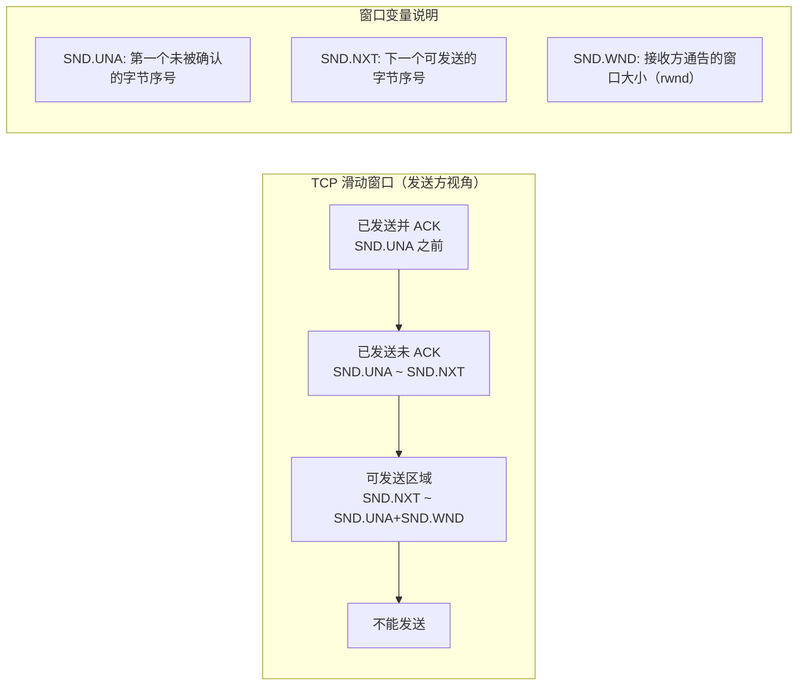
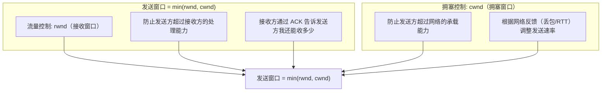
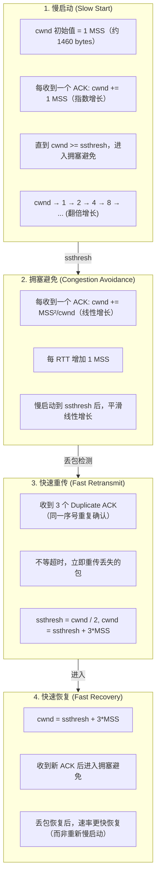
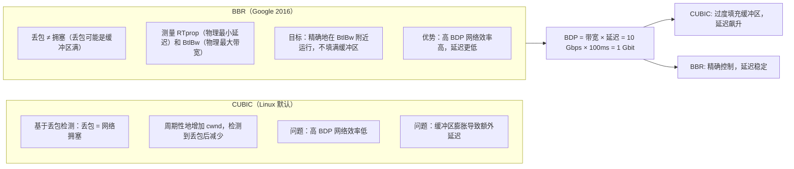

# TCP 拥塞与流量控制

## 1. TCP 拥塞控制 / 滑动窗口

### 1.1 定义/背景（一句话说清）

TCP 滑动窗口是流量控制机制，防止发送方超过接收方处理能力；拥塞控制是防止发送方超过网络承载能力的机制。两者共同决定 TCP 的发送速率，是理解 TCP 性能的核心。

### 1.2 ASCII 原理图









### 1.3 完整代码示例（TS/JS）

```typescript
// TCP 拥塞控制在 Node.js 中的体现（通过 net 模块）

import net from 'net';

// TCP 连接性能观测（通过 socket 信息）
const socket = net.connect(443, 'example.com', () => {
  // 获取 socket 缓冲区大小（反映流量控制）
  console.log('发送缓冲区大小:', socket.bufferSize, 'bytes');
  // bufferSize > 0 说明发送速率 > 网络吸收能力

  // socket.bytesRead / socket.bytesWritten 可用于监控
});

// Node.js 不直接暴露 cwnd，但可以通过测量 RTT 和吞吐量推算
async function measureTCPThroughput(host: string, path: string) {
  const entries = performance.getEntriesByType('resource') as any[];

  // 等待资源加载完成
  await fetch(`https://${host}${path}`);

  const entry = entries.find(e => e.name.includes(path));
  if (!entry) return;

  const {
    connectStart, connectEnd,
    secureConnectionStart, secureConnectionEnd,
    responseStart, responseEnd,
    transferSize,
  } = entry;

  const tcpTime = connectEnd - connectStart;
  const tlsTime = secureConnectionEnd - secureConnectionStart;
  const ttfb = responseStart - connectEnd;  // Time To First Byte
  const totalTime = responseEnd - connectStart;
  const throughput = transferSize / (totalTime / 1000); // bytes/s

  console.log(`
    TCP 建连: ${tcpTime.toFixed(1)}ms
    TLS 握手: ${tlsTime.toFixed(1)}ms
    TTFB:     ${ttfb.toFixed(1)}ms
    吞吐率:   ${(throughput / 1024 / 1024).toFixed(2)} MB/s
  `);

  // 分析：如果 TTFB 很大，可能是拥塞窗口限制（慢启动）
  // 解决：使用 TLS 1.3 0-RTT，或预热连接
}

// ============ HTTP/2 多路复用 + TCP 拥塞控制 ============

// HTTP/2 在单 TCP 连接上多路复用
// 问题：所有流共享同一个 cwnd
// 一个流丢包 → cwnd 减少 → 所有流速率下降

// 解决方案：HTTP/3（QUIC）为每个流独立控制

// ============ Connection: keep-alive vs 每次新建连接 ============

// 短连接（每次请求新建 TCP）
// cwnd 从 1 MSS 开始 → 慢启动 → 达到预期速率
// 大量请求时，每次都要重新慢启动，效率极低

// 长连接（keep-alive / HTTP/2）
// cwnd 保持在较高水平 → 新请求可以立即全速发送
// 充分利用已经"热身"好的拥塞窗口

// 预热连接（Connection Warm-up）
async function warmUpConnection(apiBase: string) {
  // 发送一个小请求预热连接
  // 这个请求触发 TCP 三次握手 + TLS 握手，建立连接
  // 后续真实请求复用这个"热"连接
  await fetch(`${apiBase}/ping`, {
    method: 'HEAD', // 只探测，不传数据
  });
  // 现在 cwnd 已经增长，后续请求更快
}

// ============ Web 性能优化：减少 RTT = 提高有效吞吐量 ============

// 关键公式：有效吞吐量 ≈ (cwnd / RTT)
// RTT 越小，有效吞吐量越大

// 在高延迟网络（移动网络）中：
// 1. CDN 就近接入 → 减少物理距离 → 降低 RTT
// 2. HTTP/2 多路复用 → 减少握手次数
// 3. TLS 1.3 1-RTT → 减少握手 RTT
// 4. 0-RTT → 消除握手 RTT（对重复连接）
```

### 1.4 对比表

| 维度 | 流量控制（rwnd） | 拥塞控制（cwnd） |
|------|:----------------:|:----------------:|
| 控制目标 | 接收方缓存 | 网络瓶颈 | 
| 控制者 | 接收方（通告窗口大小） | 发送方（主动调整） |
| 工具 | ACK 中的 rwnd 字段 | 慢启动/拥塞避免/快速重传 |
| 触发条件 | 接收方缓存满 | 丢包或 RTT 异常 |
| 目的 | 不让接收方溢出 | 不让网络过载 |
| 公式 | 发送窗口 ≤ rwnd | 发送窗口 ≤ cwnd |
| 最终 | 发送窗口 = min(rwnd, cwnd) | |

| 算法 | 类型 | 丢包检测 | 优势 | 劣势 |
|------|------|:--------:|------|------|
| TCP Reno | 基于丢包 | 是 | 简单稳定 | 高 BDP 效率低 |
| CUBIC | 基于丢包 | 是 | Linux 默认，稳定 | 缓冲区膨胀 |
| BBR | 基于模型 | 否 | 高 BDP 高效，低延迟 | 公平性争议 |
| DCTCP | 基于丢包 | 是（精确） | 数据中心低延迟 | 需要 ECN 支持 |

### 1.5 常见陷阱与最佳实践

| 陷阱 | 说明 | 解决方案 |
|------|------|----------|
| 混淆流量控制和拥塞控制 | rwnd 和 cwnd 共同决定发送窗口，但目的不同 | 理解 min(rwnd, cwnd) 公式 |
| 小文件不用 CDN | 每个请求都要慢启动，带宽利用率极低 | CDN 预热，HTTP/2 多路复用 |
| 移动网络频繁断连 | 每次断连重连都要重新慢启动 | HTTP/3 连接迁移，TCP keep-alive |
| TCP 缓冲区设太大 | 导致高延迟（Bufferbloat） | 合理设置 socket 缓冲区大小 |
| BBR 在低带宽链路表现差 | BBR 假设丢包 ≠ 拥塞，低带宽下不适用 | 链路自适应：BBR vs CUBIC 按需切换 |

### 1.6 面试追问 + 参考答案要点

**Q1：为什么 TCP 慢启动是必要的？**
> 慢启动的目的是在不了解网络容量的情况下，**安全地探测可用带宽**。如果一开始就用大窗口发送，可能导致网络设备（路由器、交换机）缓冲区溢出，产生大量丢包和重传，反而降低吞吐量。慢启动用指数增长快速找到网络容量上限（ssthresh），然后进入拥塞避免平稳运行。初始 cwnd 从 1 MSS 开始是保守但安全的策略。

**Q2：快速重传为什么要求收到 3 个 Duplicate ACK？**
> 3 个是经验值，平衡了**准确性**和**及时性**：收到 1-2 个 Duplicate ACK 可能是包重排（网络中有时延不同的路径），不一定是丢包。收到 3 个 Duplicate ACK 说明数据包确实丢失了（对方收到了后续数据，但丢失的那个数据还没到）。此时可以确定丢包，触发快速重传而不必等待超时计时器，提高恢复速度。

**Q3：为什么 QUIC 能解决 TCP 的队头阻塞问题？**
> TCP 的队头阻塞发生在**传输层**：TCP 保证字节流有序，丢失一个包后所有后续包（包括属于其他 HTTP 流的包）都要等待该包重传，即使这些包本身完好无损。QUIC 的队头阻塞发生在**流级别**：每个 QUIC 流独立有序，丢失一个流的一个包，只阻塞该流，其他流的数据正常交付给应用层。这是 HTTP/2 相比 HTTP/1.1 的进步被 TCP 层抵消，而 HTTP/3 用 QUIC 彻底解决了这个问题。

### 1.7 参考来源 URL

- RFC 5681 (TCP Congestion Control): https://www.rfc-editor.org/rfc/rfc5681
- RFC 7323 (TCP Selective Acknowledgment): https://www.rfc-editor.org/rfc/rfc7323
- BBR: https://queue.acm.org/detail.cfm?id=3022184
- TCP CUBIC: https://www.kernel.org/doc/Documentation/networking/tcp_cubic.txt
- tcp_nodelay / socket buffer tuning: https://www.techtarget.com/searchnetworkte

## 2. 拥塞控制、滑动窗口、流量控制（速记版）

### 2.1 TCP 滑动窗口

**发送方滑动窗口结构（以字节为单位）：**

| 区域 | 说明 |
|------|------|
| 已发送并 ACK | 数据已发送且已收到确认 |
| 已发送未 ACK | 数据已发送但未收到确认 |
| 可发送区域 | 可以发送的新数据 |
| 不能发送 | 超过窗口大小的数据 |

```
[SENT & ACKED] | [SENT NOT ACK] | [NOT SENT] | [CANNOT SEND]
     SND.UNA      SND.NND        SND.UNA+SND.WND
```

**流量控制 vs 拥塞控制：**

- 流量控制：防止发送方超过接收方的处理能力（工具：rwnd）
- 拥塞控制：防止发送方超过网络的承载能力（工具：cwnd）
- 发送窗口 = min(rwnd, cwnd)

### 2.2 拥塞控制四算法

```
1. 慢启动 (Slow Start):
   - cwnd 初始值 = 1 MSS
   - 每收到一个 ACK，cwnd += 1 MSS
   - 指数增长，直到达到 ssthresh

2. 拥塞避免 (Congestion Avoidance):
   - 每收到一个 ACK，cwnd += MSS²/cwnd
   - 线性增长（每 RTT 增加 1 MSS）

3. 快速重传 (Fast Retransmit):
   - 收到 3 个 Duplicate ACK（同一 seq 未 ACK）
   - 不等超时，立即重传丢失的包

4. 快速恢复 (Fast Recovery):
   - cwnd = ssthresh + 3*MSS
   - 收到新 ACK 后进入拥塞避免
```

## 深入阅读与参考

!!! tip "怎么用这些资料"
    先读「官方文档与规范」建立准确的概念，再读「源码与示例」核对细节，最后用「教程、书籍与视频」换一种讲法加深理解。每条都写明了读哪一节、带着什么问题读。

### 官方文档与规范

| 资源 | 为什么读 | 怎么读 |
|---|---|---|
| [Wireshark 文档入口](https://www.wireshark.org/docs/) | 官方文档，能把窗口、重传等抽象概念落到真实报文上验证。 | 按入门指南抓一次连接，用 tcp.analysis 过滤器看窗口与重传，读完解释每个异常包。 |

### 源码与示例

| 资源 | 为什么读 | 怎么读 |
|---|---|---|
| [Beej 网络编程指南](https://beej.us/guide/bgnet/) | 有可直接运行的套接字示例，看清应用层如何感知 TCP 行为。 | 读套接字发送接收章节并编译示例，带着“发送何时阻塞”的问题读，读完做小实验。 |

### 教程、书籍与视频

| 资源 | 为什么读 | 怎么读 |
|---|---|---|
| [High Performance Browser Networking](https://hpbn.co/) | 读 HTTP/2 章节，看清多路复用为何仍受 TCP 拥塞控制拖累。 | 先读 HTTP/2 一节，带着“一条 TCP 为何互相拖累”的问题读，读完对比 QUIC 的设计动机。 |
| [小林 coding](https://xiaolincoding.com/) | 图解滑动窗口与拥塞控制，中文表述直观，适合先建立整体图景。 | 读滑动窗口与拥塞控制两篇，读前自问“窗口由谁决定”，读后口述一遍全过程。 |
| [HTTP/3 explained](https://http3-explained.haxx.se/) | 从 QUIC 视角反看 TCP 丢包恢复与拥塞控制的固有局限。 | 读丢包恢复与连接迁移两节，边读边列 TCP 与 QUIC 的差异表，读完归纳各自取舍。 |

## 应用与行业实践

### 应用场景地图

| 场景 | 用到本页哪个知识点 | 典型技术选型 | 注意事项 |
| --- | --- | --- | --- |
| 后台管理的万行表格首屏加载 | 接收窗口 rwnd、发送速率取 cwnd 与 rwnd 的较小值 | 游标分页、视口渲染、HTTP/2 多路复用 | 单个响应体过大时瓶颈在拥塞窗口，先分页再谈压缩 |
| 低端安卓机的首屏图片加载 | 接收端读取慢导致 rwnd 收缩、慢启动 | OkHttp 连接池、按视口加载图片 | 并发过高会让同一条链路反复进入拥塞 |
| 多人协作白板的光标与笔画同步 | 小包发送、Nagle 与延迟确认互相等待 | WebSocket 二进制帧、批量合并、TCP_NODELAY | 最终保存的数据不能走可丢弃通道 |
| 跨地域机房的数据库主从复制 | 带宽时延积、窗口缩放 | TCP 长连接、事务日志批量发送 | 长肥管道不放大窗口，单连接吃不满带宽 |
| 移动网络下的视频分片上传 | 丢包触发 cwnd 收缩、快重传与快恢复 | 分片上传、断点续传、HTTP/3 | 切网后旧连接超时，重建连接会重新走慢启动 |
| 大文件分片下载（CDN 回源） | 慢启动阶段与并发连接数 | Range 请求、多分片并发 | 分片数超过链路带宽时只会互相抢占 |
| 容器镜像分层拉取 | 接收端磁盘写入慢反向压住 rwnd | 镜像分层、并发拉取层 | 节点磁盘抖动时先看 rwnd 再看网络 |
| 实时日志采集上报 | 发送缓冲与拥塞窗口共同排队 | 长连接批量上报、gRPC 流 | 上报失败要落盘重试，不能只靠 TCP 重传 |

### 三个场景拆解

#### 场景 1：后台管理的万行表格首屏加载

**业务背景**

运营后台打开订单列表要等数秒，表格规模从几千行到十万行。复现方法：本地用固定种子生成行数据，记录从点击到首屏可交互的时间。

**怎么用本页知识解决**

思路是把一次大响应拆成多次小响应，让每一段传输落在拥塞窗口能快速推完的范围内，别让窗口替应用排队。

```js
// 前端按视口请求数据，避免一次性拉全表
const PAGE = 200;                                // 每页行数与服务端预算对齐
async function load(cursor, ctrl) {
  const res = await fetch(
    `/api/rows?cursor=${cursor}&limit=${PAGE}`,   // 游标分页，服务端走索引不回表
    { signal: ctrl.signal }                       // 取消旧请求，防止慢响应堆积
  );
  const { rows, next } = await res.json();        // 响应体控制在几十 KB
  renderRows(rows);                               // 只渲染视口附近的行
  return next;
}
```

- 游标分页让响应体大小可控，发送端不会长时间停在拥塞避免的线性增长里。
- AbortController 取消旧请求，防止用户快速翻页时多条响应同时占用接收缓冲区。
- 只渲染视口附近的行，主线程不被 DOM 构建占满，socket 读取不被阻塞，rwnd 不会被动收缩。
- 分页响应本身已是整块数据，Nagle 打开或关闭对它的影响落在噪声里。

**怎么度量收益**

- 指标：首屏可交互时间、单请求响应体字节数、请求总数、TCP 重传率。
- 工具：浏览器 DevTools 的 Network 面板看 TTFB 与 Content Download；服务端用 `ss -ti` 看 cwnd、rwnd、retrans；网关访问日志统计响应体 p99。
- 方法：同一份数据集、同一网络条件，改动前后各跑 20 次取中位数。

**什么时候不该用**

- 用户明确要导出全量数据时，分页会把总时间拉长，应改成流式导出到文件。
- 数据只有几百行、响应体在几十 KB 以内时，分页多出的往返比节省的时间还多。

#### 场景 2：低端安卓机的首屏图片加载

**业务背景**

低端机解码慢，App 读 socket 的速度跟不上服务端发送，接收窗口持续收缩。复现方法：固定一台低端机与一张 4G 卡，记录首屏图片全部完成的时间。

**怎么用本页知识解决**

限制并发，复用连接跳过慢启动，按视口决定请求哪些图。

```kotlin
val client = OkHttpClient.Builder()
    // 连接池复用连接，避免每张图都从慢启动开始
    .connectionPool(ConnectionPool(4, 5, TimeUnit.MINUTES))
    .dispatcher(Dispatcher().apply {
        maxRequests = 8         // 全局并发上限，防止首屏图片同时抢链路
        maxRequestsPerHost = 4  // 同一图床域名的并发上限
        // 需按所用 OkHttp 版本核对 Dispatcher 的字段名
    })
    .build()

fun loadVisible(urls: List<String>) {
    urls.forEach { url ->                 // 只请求视口内的图片
        client.newCall(Request.Builder().url(url).build()).enqueue(callback)
    }
}
```

- 连接池复用让后续图片省掉握手与慢启动，直接在已有 cwnd 上继续发。
- 并发上限把链路留给当前视口的图片，防止请求同时排队把接收窗口挤满。
- 按视口加载减少同一时刻的解码量，App 读取 socket 跟得上，rwnd 不会持续收缩。
- 服务端按设备输出匹配尺寸，减少要传的字节数，慢启动到达阈值的耗时随之缩短。

**怎么度量收益**

- 指标：首屏图片完成时间 p95、连接建立次数、重传率、App 峰值内存。
- 工具：Android Studio Profiler 看内存与主线程；Chrome DevTools 远程调试看请求瀑布；服务端 `ss -ti` 看 rwnd 与 retrans。

**什么时候不该用**

- 首屏只有一张 LCP 大图时，限并发没有收益，要先降这张图的体积与解码成本。
- 请求数在个位数且都走在同一条已建立的连接上时，调整并发上限的差别落在重复运行的波动里。

#### 场景 3：多人协作白板的光标与笔画同步

**业务背景**

同一次会议几十人同时画，光标移动每秒产生几十到上百个坐标点，画面出现一卡一顿。复现方法：本地起服务，用脚本开 30 条连接每 16ms 发一个光标点，记录回显延迟的 p50 与 p95。

**怎么用本页知识解决**

先把小包攒成一批再发，再关掉 Nagle，最后按可丢弃与不可丢弃把消息分开。

```js
const ws = new WebSocket(url);
ws.binaryType = 'arraybuffer';    // 二进制帧省掉文本解析
let pending = [];                 // 攒一批光标增量
function onCursor(p) { pending.push(p); }

setInterval(() => {
  if (!pending.length) return;    // 没有增量就不发空包
  ws.send(encodeBatch(pending));  // 每 16ms 发一次，对齐一帧
  pending = [];
}, 16);
```

- 服务端对每条 WebSocket 连接调用 `setNoDelay(true)` 关闭 Nagle，合并后的批次立即出栈。
- 16ms 合并把上百个小包并成一条，绕开小包与延迟确认互相等待。
- 光标位置可以丢，落笔与抬笔不能丢，两类消息用不同标志位或不同通道。
- 消息带序号，接收端按序号丢弃过期光标，乱序到达不会画出回跳。

**怎么度量收益**

- 指标：端到端回显延迟 p50、p95、p99，WebSocket 帧每秒，重传计数。
- 工具：浏览器 Performance 面板的 Event Timing 与帧率；服务端连接上的帧计数器；`ss -ti` 看 retrans 与 rwnd。

**什么时候不该用**

- 文档正文的自动保存必须可靠且有序，不能走可丢弃通道。
- 参与者只有两三人且在内网时，关 Nagle 与批量合并的差别很小，不值得维护两套消息通道。

### 行业先进实践

**BBR 拥塞控制（出处：Google 公开的 BBR 论文 / Linux 内核网络文档）**

BBR 用带宽与时延的估计值决定发送速率，不把丢包当作拥塞的唯一信号。它适合有随机丢包的长距离链路，因为基于丢包的算法会把随机丢包误判成拥塞。借鉴方式：先在下载类服务上切换算法做对照实验。需核对官方文档：核对当前内核版本是否内置 bbr 模块，以及 `net.ipv4.tcp_congestion_control` 的取值方式。

**HTTP/2 与 gRPC 的应用层流控（出处：RFC 9113 / gRPC 官方文档）**

在一条 TCP 连接上给每条流单独算窗口，慢流不会占满整条连接的接收缓冲。TCP 的 rwnd 是整条连接共享的，一条慢流会拖住其余流，应用层窗口把这层耦合解开。借鉴方式：把初始窗口大小做成可配置项，先在压测环境调。

**HTTP/3 over QUIC（出处：RFC 9000 / RFC 9114）**

QUIC 在用户态实现每流流控与拥塞控制，一个流丢包不阻塞其余流。弱网移动端收益来自没有 TCP 层的队头阻塞。借鉴方式：先在移动端灰度。注意 QUIC 加密后 `ss` 看不到内部窗口，要依赖实现暴露的连接统计。

**用 `ss -ti` 观测 cwnd、rwnd 与 retrans（出处：iproute2 的 ss 手册页）**

该命令输出每条连接的拥塞窗口、接收窗口与重传计数。把"慢"拆成发送侧受限还是接收侧受限，排障时先分清方向再动手。借鉴方式：写进排障手册，规定报障时先抓一次现场。

**客户端的每主机连接上限（出处：Chromium 网络栈文档 / OkHttp 官方文档）**

连接数上限决定拥塞控制实例的个数，连接开得越多，每条连接分到的窗口增长越慢。接入新 SDK 前先看它的连接池与并发默认值。需核对官方文档：核对 Chromium 与 OkHttp 当前版本中每主机并发上限的具体常量。

### 从学到用：落地路线

1. 试点：选一个内部工具类服务（例如后台导出或日志上报），只做观测不调参数。验收标准：能用 `ss -ti` 导出该服务的 cwnd、rwnd、retrans 时间序列。
2. 验证：在试点上做单变量改动，先改并发上限，再改分页大小，每轮跑同一份压测脚本 20 次。验收标准：改动带来的收益大于同配置重复运行的波动范围。
3. 推广：把验证过的配置写进服务模板，随代码评审一起走。验收标准：新服务默认带该配置，模板里有说明与回滚开关。
4. 防回退：把指标接进看板并设阈值。验收标准：重传率或 p99 延迟越界时自动通知，回滚开关一步可执行。

### 动手作业

**目标**

在本机搭一对客户端与服务端，用同一份数据量观察发送速率受 cwnd 限制与受 rwnd 限制时的差别。

**步骤**

1. 写一个 TCP 服务端，循环接收并打印收到的字节数，读取前先 sleep 一段时长模拟慢消费者。
2. 写一个客户端，向该服务端发送固定大小的数据，发送端不加应用层限速。
3. 用参数控制服务端每次读取前的 sleep 时长，分别取 0ms 与 50ms 跑两轮。
4. 发送期间在另一个终端执行 `ss -ti`，记录 rwnd、cwnd、retrans 的变化。
5. 把客户端发送缓冲改为固定小块（例如每次写 4KB），重复第 3 步，观察两轮的差别。
6. 服务端改回不 sleep，在客户端与目标之间用 `tc` 注入 1% 丢包，记录 cwnd 的变化。
7. 把各轮数据整理成表，标注每一轮是发送侧受限还是接收侧受限。

**验收标准**

- 能画出两轮实验里 rwnd 随时间的变化，并指出哪一轮属于接收侧受限。
- 能指出注入丢包后 cwnd 收缩的采样点，并说明重传计数是否同步上升。
- 提交的记录包含命令、参数与原始输出，别人按同样步骤能复现出同方向的结论。
- 能说明改动发送缓冲大小后，速率变化的原因落在哪个窗口上。

