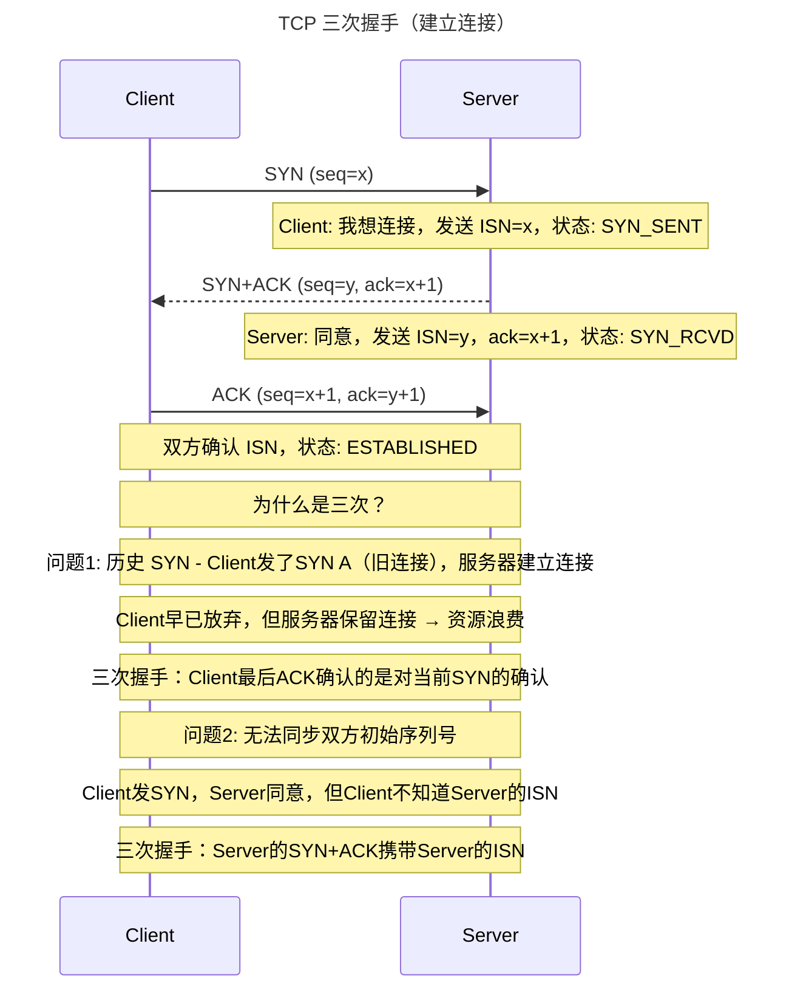
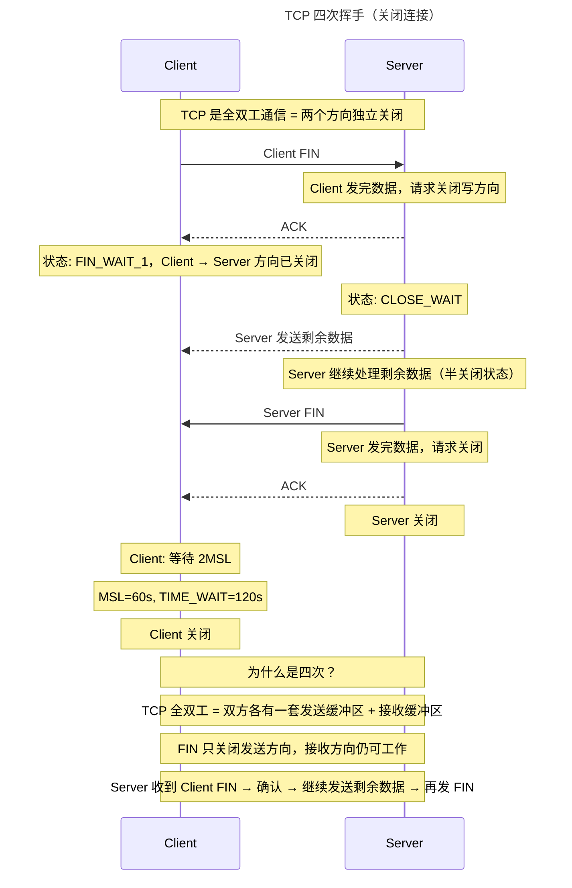
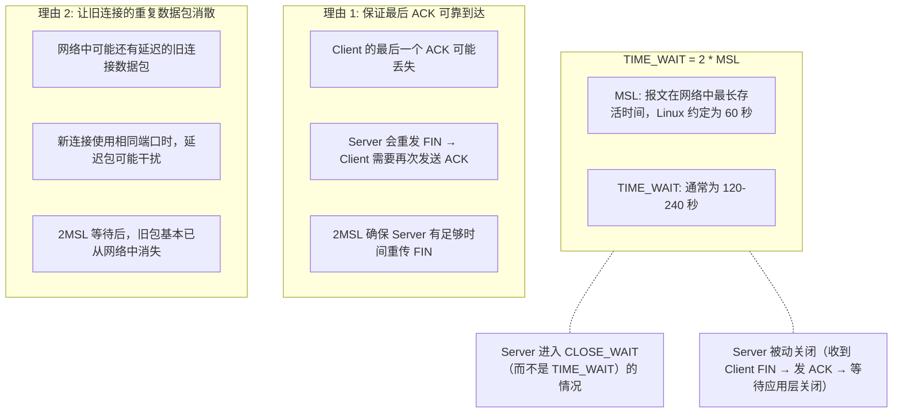
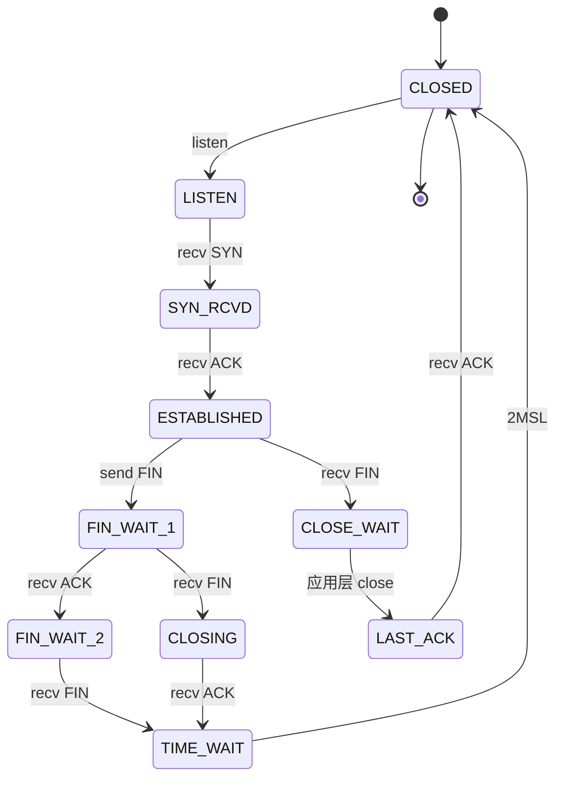
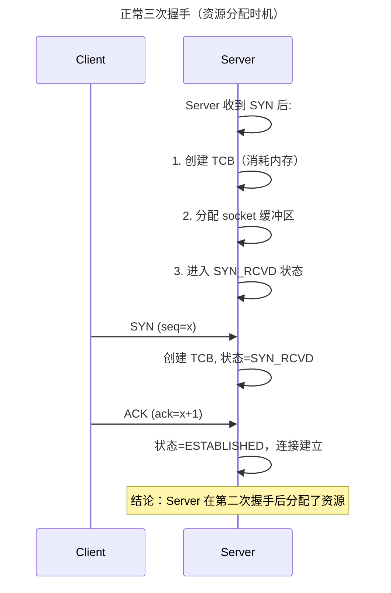
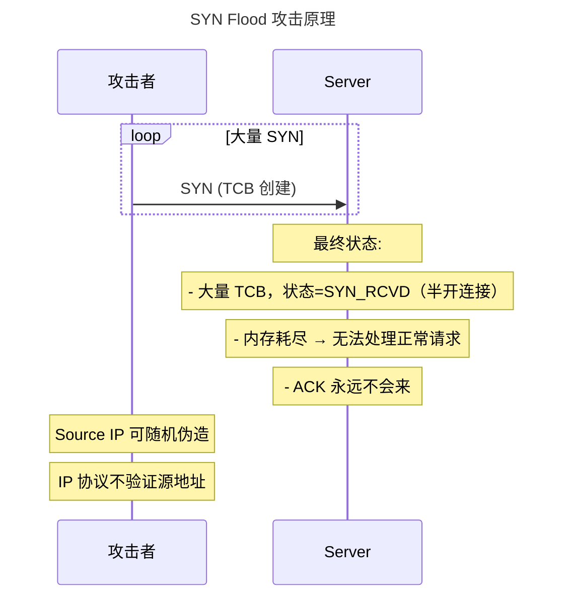
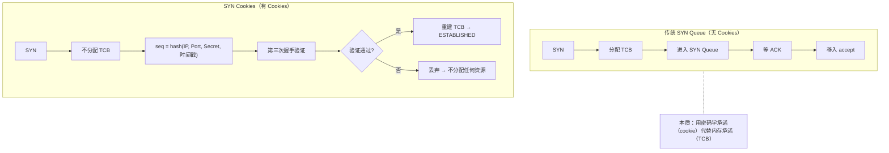
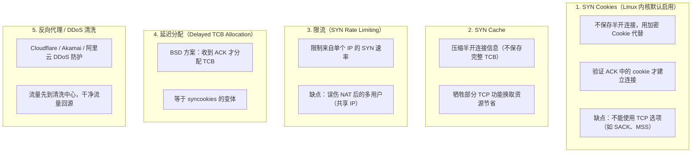

# 握手、挥手与 SYN Flood

## 1. 三次握手 vs 四次挥手（时序图）

### 1.1 定义/背景（一句话说清）

TCP 三次握手建立可靠连接，确保双方都能发送和接收数据并同步初始序列号；四次挥手关闭全双工连接，因为每个方向需要单独关闭（发送 FIN 表示该方向已无数据），TIME_WAIT 等待 2MSL 确保最后 ACK 可靠到达并清除网络中的延迟报文。

### 1.2 ASCII 时序图









### 1.3 完整代码示例（TS/JS）

```typescript
// ============ TCP 连接状态在前端的体现 ============

// WebSocket 连接状态
const ws = new WebSocket('wss://example.com/ws');

// WebSocket 状态对应 TCP 连接状态：
// WebSocket.CONNECTING  = TCP SYN_SENT / SYN_RCVD
// WebSocket.OPEN        = TCP ESTABLISHED
// WebSocket.CLOSING     = TCP FIN_WAIT_1 / FIN_WAIT_2
// WebSocket.CLOSED      = TCP CLOSED / TIME_WAIT

ws.onopen = () => {
  console.log('WebSocket OPEN → 对应 TCP ESTABLISHED');
};

ws.onclose = (event) => {
  // event.code: 1000=正常关闭, 1001=服务器关闭, 1006=异常关闭
  // event.wasClean: 是否优雅关闭（对应 TCP 是否正常四次挥手）
  console.log(`WebSocket CLOSED: code=${event.code}, clean=${event.wasClean}`);

  // 如果 wasClean=false，可能是连接被强制关闭（RST）
  // 对应 TCP 的 RST 报文（Reset）
  if (!event.wasClean) {
    console.warn('连接异常关闭，可能是网络中断或服务器崩溃');
    // 重连逻辑
    setTimeout(() => reconnect(), 1000);
  }
};

// ============ HTTP/1.1 keep-alive 连接关闭 ============

// HTTP/1.1 keep-alive 连接可以被任一方关闭
// 关闭时发送 FIN，触发四次挥手

// Node.js 中观察连接关闭
import http from 'http';

const req = http.get('http://example.com/', (res) => {
  res.on('data', () => {});
  res.on('end', () => {
    // 响应结束，但 TCP 连接不关闭（keep-alive）
    console.log('HTTP 响应结束，TCP 连接保持');
  });
});

req.on('close', () => {
  // 这个事件在 TCP 连接真正关闭时触发
  // 可以是正常关闭（FIN 交换）或异常关闭（RST）
  console.log('TCP 连接已关闭');
});

// ============ 优雅关闭 WebSocket（完整四次挥手）============

class GracefulWebSocket {
  constructor(url: string) {
    this.ws = new WebSocket(url);
    this.ws.onclose = (event) => this.handleClose(event);
  }

  send(data: unknown) {
    if (this.ws.readyState === WebSocket.OPEN) {
      this.ws.send(JSON.stringify(data));
    } else {
      console.warn('WebSocket 未打开，消息未发送');
    }
  }

  close(code = 1000, reason = 'Client normal close') {
    // WebSocket.close() 发送 FIN 帧，触发服务器端的 onclose
    // 服务器可以选择发送 Close 帧作为响应（可选）
    // 浏览器自动完成剩余握手
    this.ws.close(code, reason);
  }

  private handleClose(event: CloseEvent) {
    if (event.wasClean) {
      console.log(`优雅关闭: code=${event.code}, reason=${event.reason}`);
    } else {
      console.error(`异常关闭: code=${event.code}, 原因可能是网络错误`);
    }
  }
}

// ============ HTTP/2 和 HTTP/3 的连接关闭 ============

// HTTP/2 不使用 TCP 四次挥手，改用 GOAWAY 帧
// GOAWAY 告诉对方"我不再接受新流了，但我会处理正在进行的流"
// 用于优雅关闭 HTTP/2 连接，不丢请求

// HTTP/3 使用 CONNECTION_CLOSE 帧
// 作用类似 GOAWAY，但运行在 QUIC 层

// Node.js HTTP/2 graceful shutdown
import http2 from 'http2';

const server = http2.createServer();

server.on('stream', (stream, headers) => {
  stream.respond({ 'content-type': 'text/plain' });
  stream.end('Hello');
});

process.on('SIGTERM', () => {
  // 发送 GOAWAY，不再接受新连接
  server.close(() => {
    console.log('HTTP/2 服务器已关闭');
    process.exit(0);
  });
});
```

### 1.4 对比表

| 维度 | 三次握手 | 四次挥手 |
|------|:--------:|:--------:|
| 目的 | 建立双向可靠连接 | 关闭双向通信 |
| 主动方 | Client（通常）| 双方均可 |
| 包的数量 | 3 | 4（FIN → ACK → FIN → ACK）|
| 半开状态 | SYN_SENT | FIN_WAIT_1/2, CLOSE_WAIT |
| 等待状态 | 无 | TIME_WAIT（主动关闭方）|
| 主要风险 | 历史连接/ISN 不同步 | 端口占用/资源泄漏 |

| TCP 状态 | 含义 | 正常/异常 |
|---------|------|:--------:|
| TIME_WAIT | 等待 2MSL | 正常（持续 120-240s）|
| CLOSE_WAIT | 被动关闭方未调用 close() | 异常（可能是代码 bug）|
| FIN_WAIT_2 | 对方确认了我的 FIN，我等对方的 FIN | 正常（有超时）|
| LAST_ACK | 被动关闭方发了 FIN，等最终 ACK | 正常（短时）|
| SYN_RCVD | 大量 → SYN Flood 攻击 | 异常（需要防御）|

### 1.5 常见陷阱与最佳实践

| 陷阱 | 说明 | 解决方案 |
|------|------|----------|
| CLOSE_WAIT 大量堆积 | 应用层未调用 socket.close()，内存泄漏 | 检查代码，确保每个 accept 的 socket 都被关闭 |
| TIME_WAIT 占用大量端口 | 高并发短连接导致端口耗尽 | 启用 tcp_tw_reuse，允许重用 TIME_WAIT 连接 |
| 主动关闭用 POST 请求 | POST 请求后服务器立即关闭，客户端收到 RST | POST 后服务器应返回响应再关闭 |
| 不处理连接异常断开 | 网络中断时 TCP 不发送 FIN，客户端不知道 | 使用心跳/keep-alive 检测断线 |
| HTTP/1.1 频繁新建连接 | 每次都要三次握手 + TLS 握手 + 四次挥手 | 使用 keep-alive 或升级 HTTP/2/3 |

### 1.6 面试追问 + 参考答案要点

**Q1：为什么四次挥手时，主动关闭方要等 TIME_WAIT 2MSL？**
> TIME_WAIT 有两个作用：1. **可靠性**：确保被动关闭方（服务器）收到最终的 ACK。如果 ACK 丢失，服务器会重发 FIN，客户端需要再次发送 ACK。2MSL 确保服务器有足够时间重传。2. **清除延迟报文**：网络中可能还有旧连接的延迟数据，2MSL 后这些数据基本从网络中消失，避免干扰使用同一端口的新连接。

**Q2：服务器出现大量 CLOSE_WAIT 是什么原因？如何排查？**
> CLOSE_WAIT 表示服务器收到了客户端的 FIN（连接想关闭），但服务器的应用层没有调用 close() 关闭对应的 socket。常见原因：1. 代码 bug——处理请求后忘记调用 socket.close()。2. 数据库连接泄漏——获取连接后未释放。3. HTTP 长连接——客户端已关闭，但服务器 keep-alive 超时未到。排查方法：`netstat -an | grep CLOSE_WAIT | wc -l`，然后逐进程排查文件描述符使用情况。

**Q3：TCP 的 RST 报文是什么？什么时候会收到 RST？**
> RST（Reset）是 TCP 的一种特殊控制报文，表示"连接异常终止，立即关闭"。收到 RST 后，双方不进入 TIME_WAIT，直接进入 CLOSED 状态。触发 RST 的场景：1. 收到不存在的端口上的连接（服务器未监听）。2. 收到不在当前连接序号范围内的数据。3. 应用程序主动调用 close() 并设置 SO_LINGER 为 0。4. 服务器崩溃后客户端发送数据，客户端收到 RST。在前端中，如果 WebSocket 连接异常断开（wasClean=false），通常是因为收到了 RST。

### 1.7 参考来源 URL

- RFC 793 (TCP) - Connection Establishment/Termination: https://www.rfc-editor.org/rfc/rfc793
- RFC 1122 (Requirements for Internet Hosts): https://www.rfc-editor.org/rfc/rfc1122
- TIME_WAIT and its behavior: https://blog.cloudflare.com/todie-expletiveinserted-attack-of-the-giant/
- TCP State Machine: https://www.syngress.com/hackers-and-cyberattacks/tcp-ip-protocol-structure-and-operations/

## 2. 三次握手 vs 四次挥手（速记版）

### 2.1 为什么是三次握手，不是两次

**两次握手的问题：**

- 无法防止历史连接初始化混乱
- 无法同步初始序列号 (ISN)

**三次握手完整过程：**

| 步骤 | Client | Server |
|------|--------|--------|
| 1 | SYN (seq=x) → | 请求连接，发送 ISN=x |
| 2 | | ← SYN+ACK (seq=y, ack=x+1) |
| 3 | ACK (seq=x+1, ack=y+1) → | |

**结果：** 握手完成，双方确认对方 ISN

### 2.2 为什么是四次挥手

**原因：** TCP 是全双工通信，每个方向需要单独关闭。

**挥手详细过程：**

| 步骤 | Client | Server | 说明 |
|------|--------|--------|------|
| 1 | FIN → | | Client 发送完数据，请求关闭 |
| 2 | | ← ACK | Server 确认收到 FIN |
| 3 | | | (Client 进入 FIN_WAIT_2) |
| 4 | | | 此时：Client → Server 方向已关闭 |
| 5 | | | Server → Client 方向仍开放 |
| 6 | | FIN → | Server 也发送完数据，请求关闭 |
| 7 | ACK → | | Client 确认收到 FIN |
| 8 | 等待 2MSL | 关闭连接 | |

### 2.3 TIME_WAIT 存在的理由

```
为什么需要 TIME_WAIT（等待 2MSL）？

1. 保证最后 ACK 到达被动关闭方
   如果 Client 的最后一个 ACK 丢失:
   Server 会重发 FIN，Client 需要再次发送 ACK
   2MSL 确保 Server 有足够时间重传 FIN

2. 让旧连接的重复数据包在网络中消散
   旧连接的网络中可能还有延迟的数据包

3. MSL:
   Linux: MSL = 60 秒
   TIME_WAIT = 2 * MSL = 120-240 秒
```

## 3. SYN Flood 与防御

### 3.1 定义/背景（一句话说清）

SYN Flood 是最经典的 DDoS 攻击方式，攻击者发送大量 SYN 包但不完成三次握手，导致服务器维护大量半开连接（TCP 五元组 + TCB），最终耗尽服务器资源。防御核心是**不在未完成握手的连接上分配资源**，代表技术是 SYN Cookies。

### 3.2 ASCII 原理图









### 3.3 完整代码示例（TS/JS）

```typescript
// ============ 理解 SYN Flood 在前端的影响 ============

// 前端无法直接控制 TCP 层，但可以理解其对连接池的影响

// 当服务器遭受 SYN Flood 时：
// 1. 服务器 SYN Queue 满（即使使用 SYN Cookies）
// 2. 新连接无法建立
// 3. 前端 fetch / WebSocket 连接超时

// 前端超时处理（健壮性设计）
async function robustFetch(url: string, options: {
  timeout?: number;
  retries?: number;
  retryDelay?: number;
} = {}) {
  const { timeout = 10000, retries = 3, retryDelay = 1000 } = options;

  for (let attempt = 0; attempt <= retries; attempt++) {
    const controller = new AbortController();
    const timer = setTimeout(() => controller.abort(), timeout);

    try {
      const response = await fetch(url, {
        signal: controller.signal,
      });
      clearTimeout(timer);
      return response;
    } catch (error: any) {
      clearTimeout(timer);
      if (attempt === retries) throw error;

      // 网络抖动重试，区分超時和其他错误
      const isTimeout = error.name === 'AbortError';
      const delay = isTimeout
        ? retryDelay * Math.pow(2, attempt) // 指数退避
        : retryDelay;

      await new Promise(r => setTimeout(r, delay));
    }
  }
  throw new Error('All retries exhausted');
}

// ============ 服务器端 SYN Flood 防御配置 ============

// nginx 防 SYN Flood 相关的配置（间接）
// 注意: nginx 本身不处理 SYN Flood（SYN 在 TCP 层，nginx 在 HTTP 层）
// 防御由内核（syncookies）和网络设备处理

// nginx upstream 健康检查 + 降级
// 当某个 upstream 遭受攻击响应慢时，自动切到备用
const upstreamConfig = `
upstream backend {
  server 10.0.0.1:8080 max_fails=3 fail_timeout=30s;
  server 10.0.0.2:8080 backup;  # 备用服务器
  keepalive 32;
}

server {
  location /api/ {
    proxy_pass http://backend;
    proxy_connect_timeout 5s;
    proxy_next_upstream error timeout http_502;
  }
}
`;

// ============ 理解为什么前端开发者需要了解 SYN Flood ============

// 1. 为什么有时候连接"卡住"但不报错？
//    → SYN Queue 满，新连接无法建立

// 2. 为什么 DDoS 攻击会导致前端大量超时？
//    → 服务器忙于处理攻击，无暇响应正常请求

// 3. 如何在前端层面缓解？
//    → 使用 CDN（CDN 节点作为反向代理，吸收 SYN Flood）
//    → 多个 API 域名（分散到不同 IP，减少单点影响）
//    → 重试 + 降级策略

// ============ CDN 防护 SYN Flood ============

// CDN 网络（如 Cloudflare）的防护机制：
// 1. 全球 Anycast 分布，攻击流量被分散到全球节点
// 2. 每个节点有容量限制，超过则丢弃
// 3. 智能识别正常流量（Browser Challenge / JS Challenge）
// 4. 干净流量通过，不经过被攻击的源站

// 前端配置：强制使用 HTTPS（HSTS）防止中间人注入
// 在 HTTP 层面无法防御 SYN Flood，但可以减少其他攻击面
```

### 3.4 对比表

| 防御方式 | 原理 | 优点 | 缺点 |
|---------|------|------|------|
| SYN Cookies | 不分配 TCB，用 Cookie 代替 | 无状态，性能好，Linux 内核原生支持 | 不能使用 TCP 选项（ MSS/SACK）|
| SYN Cache | 压缩 TCB 信息 | 保留更多 TCP 功能 | 实现复杂 |
| 限流 | 限制 SYN 速率 | 简单直接 | 误伤 NAT 用户 |
| 反向代理 | 代理清洗流量 | 吸收大规模攻击 | 需要额外基础设施 |
| 延迟分配 TCB | 等 ACK 才分配 | 与 Cookies 类似 | 兼容性差 |

| 攻击类型 | 特点 | 防御 |
|---------|------|------|
| 传统 SYN Flood | 伪造源 IP | SYN Cookies + 限流 |
| Amplification SYN Flood | 伪造源 IP 为受害者 IP（反射） | 运营商级别过滤 |
| ACK Flood | 发大量 ACK 耗尽带宽 | 限流 + 深度包检测 |
| Connection Flood | 建立完整连接（成本更高） | 限流 + 行为分析 |

### 3.5 常见陷阱与最佳实践

| 陷阱 | 说明 | 解决方案 |
|------|------|----------|
| 认为 HTTP 层能防御 SYN Flood | SYN Flood 是 TCP 层攻击，HTTP 层无法感知 | 网络层/内核防御（syncookies）|
| 只依赖 SYN Cookies | Cookies 禁用部分 TCP 特性（SACK、MSS）| Cookies + 限流 + CDN 多层防御 |
| 忽视应用层 DDoS | SYN Flood 只是 DDoS 的一种 | 全面 DDoS 防护（阿里云/Cloudflare）|
| 服务器 TCP backlog 设太小 | 正常连接积压 | 合理设置 net.ipv4.tcp_max_syn_backlog |
| 没有 CDN 保护 | 源站直接暴露 | 使用 CDN，隐藏源站 IP |

### 3.6 面试追问 + 参考答案要点

**Q1：SYN Cookies 是如何工作的？它的数学原理是什么？**
> SYN Cookies 的核心是用一个**密码学可验证的承诺**代替内存存储。Server 在收到 SYN 后，不分配 TCB，而是计算：`cookie = hash(srcIP, srcPort, dstIP, dstPort, timestamp, secret)`，并将 cookie 作为初始序列号（ISN）返回。Client 发送 ACK（ack=cookie+1）时，Server 用相同的参数验证 cookie 是否合法（secret 未过期，timestamp 在允许范围内）。如果合法，说明 Client 确实收到了 Server 的 SYN（因为 Client 无法伪造 cookie），重建连接状态。整个过程不需要 Server 保存任何连接信息。

**Q2：为什么 SYN Cookies 不能使用 SACK（Selective Acknowledgment）？**
> SACK 允许接收方告诉发送方"我已经收到了 1-1000 和 2000-3000"（跳过丢失的数据）。这需要**发送方**维护一个 SACK 状态（哪些数据被确认了）。在没有 SYN Cookies 时，这个状态在 TCB 中分配。使用 SYN Cookies 时，不分配 TCB，所以无法维护 SACK 状态。因此启用 SYN Cookies 时，SACK 会被自动禁用。这是一个典型的安全与功能之间的权衡。

**Q3：SYN Flood 和 CC 攻击（Challenge Collapsar）有什么区别？**
> SYN Flood 攻击 TCP 层，用大量半开连接耗尽服务器连接资源（内存/端口）。CC 攻击针对 HTTP 层，模拟大量正常用户请求（带有完整 Cookie、User-Agent 的 GET/POST），消耗服务器 CPU/内存/数据库连接。CC 攻击更难防御，因为请求看起来完全正常。防御方法：HTTP 层限流、验证码（CAPTCHA）、人机识别、WAF 规则。

### 3.7 参考来源 URL

- RFC 4987 (TCP SYN Flooding): https://www.rfc-editor.org/rfc/rfc4987
- Linux syncookies documentation: https://www.kernel.org/doc/Documentation/networking/ip-sysctl.txt
- SYN Cookies 原理: https://www.syngress.com/hackers-and-cyberattacks/syn-flood-dos-and-the-different-ways-to-mitigate/
- Cloudflare DDoS Protection: https://www.cloudflare.com/learning/ddos/syn-flood/

## 4. SYN Flood 与防御（速记版）

```
SYN Flood 攻击原理:

攻击者发送大量 SYN 包，但不完成三次握手
服务器维护大量半开连接 (SYN_RECV)，消耗资源

防御机制:
1. SYN Cookies:
   - 服务器不保存半开连接
   - 用加密 Cookie (seq = hash(...))
   - 完成第三次握手时验证 Cookie 才建立连接

2. SYN Cache:
   - 压缩半开连接信息（不保存完整 TCB）

3. 限流:
   - 限制来自单个 IP 的 SYN 速率

4. DDoS 防护服务:
   - Cloudflare, Akamai 等
```

## 应用与行业实践

### 应用场景地图

| 场景 | 用到本页哪个知识点 | 典型技术选型 | 注意事项 |
| --- | --- | --- | --- |
| 后台管理系统的万行表格导出接口，每次请求新建连接 | 四次挥手，主动关闭方进 TIME_WAIT | HTTP/1.1 keep-alive、客户端连接池 | 批量导出要盯客户端 TIME_WAIT 计数，端口耗尽是这类接口的常见瓶颈 |
| 低端安卓机的首屏加载，一次拉多个接口 | 三次握手多花一个 RTT，首屏被放大 | HTTP/2 多路复用、连接预热 | 用同一台设备对比复用连接与不复用的首屏时间，别只看服务端耗时 |
| 多人协作白板房间内的笔迹实时同步 | 半关闭：FIN 只关一个方向 | WebSocket、应用层心跳 | 滚动发布时先发 FIN 再读残余数据，直接 close 会发 RST 丢掉在途笔迹 |
| 公网 API 网关被伪造源 IP 的 SYN 打满 | SYN 半连接队列、SYN Flood 防御 | SYN Cookie、前置反向代理 | 开启后部分 TCP 选项会丢失，要在压测环境复现一遍 |
| 手机从 Wi-Fi 切到 4G 后长连接卡住 | 三次握手同步序列号、连接标识由四元组决定 | 客户端心跳重连、gRPC Keepalive | 切换后的旧连接是半开状态，只能靠超时或心跳发现 |
| 短连接压测脚本打到一定 QPS 就上不去 | 四次挥手 + TIME_WAIT 占用源端口 | 压测工具的长连接模式、连接池 | 先分清是客户端端口耗尽还是服务端 accept 队列溢出 |
| 容器平台滚动发布时的 502 | 服务端主动关闭走完整四次挥手 | preStop 钩子、应用优雅停机 | 进程收到 SIGTERM 立刻 close，在途请求会被 RST |
| 内网服务之间 gRPC 调用量上涨 | 三次握手开销、连接复用 | gRPC 连接池、HTTP/2 | 连接池太小，握手开销会被摊到每个请求上 |
| 日志 Agent 每分钟上报一次小批量数据 | 短连接握手开销与长连接保活的取舍 | 长连接 + 批量发送 | 长连接必须配心跳，否则 NAT 超时后写入静默失败 |

### 三个场景拆解

#### 场景 1：万行表格导出接口的短连接抖动

**业务背景**：导出接口每次请求新建 TCP 连接，运营同时点批量导出时成功率随并发线程数上升而下降。在压测机上调并发线程数，同时看 `ss -s` 的 TIME_WAIT 计数，就能复现这条曲线。

**怎么用本页知识解决**：四次挥手说明主动关闭的一方要在 TIME_WAIT 停留 2MSL，这期间本地端口被占住。把客户端改成连接池复用，让服务端去当主动关闭方，客户端的端口消耗就降下来。

```bash
# 1. 数清 TIME_WAIT 落在哪一端：本机若是客户端，说明本机主动关闭
ss -tan state time-wait | wc -l
# 2. 看本地可用端口范围，估算短连接的理论并发上限
cat /proc/sys/net/ipv4/ip_local_port_range
# 3. 确认 TIME_WAIT 复用开关，该选项只对客户端主动发起的连接生效
cat /proc/sys/net/ipv4/tcp_tw_reuse
# 4. 连续建 50 次连接并主动关闭，复现端口占用
python3 -c "
import socket
for _ in range(50):
    s = socket.create_connection(('127.0.0.1', 8080))      # 建连，走三次握手
    s.sendall(b'GET / HTTP/1.1\r\nHost: x\r\n\r\n')
    s.close()                                              # 主动关闭，本端进 TIME_WAIT
"
```

- 第 1 条命令给出的是本机全部 TIME_WAIT 连接数，要连跑几次看它随并发变化。
- 第 2 条命令的两个数字相减，就是客户端短连接可用的源端口总量。
- 第 4 段脚本跑完后立刻再跑第 1 条命令，能看到计数上升，这就是端口被占住的直接证据。
- 把客户端换成连接池后重跑同样并发，TIME_WAIT 计数应当落在服务端而不是客户端。

**怎么度量收益**：客户端看 `ss -tan state time-wait | wc -l` 的峰值；服务端看 `nstat -az` 里的 `TcpExtListenOverflows` 与 `TcpExtListenDrops`，判断瓶颈是否转移到 accept 队列；业务侧用压测工具的请求成功率和 p99 延迟。

**什么时候不该用**：

- 一次性上传单个大文件的接口，每条连接只发一个请求，连接池拿不到复用收益，还多占内存。
- 客户端与服务端在同一台机器上走回环的压测，源端口不是瓶颈，改连接池测不出差别，这时应先看 accept 队列。

#### 场景 2：多人协作白板的长连接与优雅下线

**业务背景**：白板房间里多人同时画，笔迹要实时同步，服务端滚动发布时房间里的人掉线重连。用一个脚本模拟 200 条长连接、发布一次，统计重连次数即可复现规模。

**怎么用本页知识解决**：四次挥手说明每个方向单独关闭，FIN 只表示发送方向没有数据了。服务端下线时先广播业务层重连提示，再只关发送方向，继续读对端残余数据，最后才释放连接。

```python
import socket

# 项目内自定义函数：向房间内所有连接发重连提示
broadcast({"type": "reconnect"})

# 只关发送方向：内核发 FIN，告诉对端“我不再发数据”
conn.shutdown(socket.SHUT_WR)

# 继续读，直到对端也发 FIN（recv 返回空），在途笔迹不会丢
while True:
    chunk = conn.recv(4096)
    if not chunk:
        break
    save_edit(chunk)   # 项目内自定义函数：落库后再确认

# 两个方向都关闭后，才释放文件描述符
conn.close()
```

- `shutdown(socket.SHUT_WR)` 只影响发送方向，接收方向仍然可读，这正对应四次挥手里的半关闭。
- 直接用 `close()` 且接收缓冲还有未读数据时，内核发 RST，对端已经写出的笔迹会被丢弃。
- 循环读到 `recv` 返回空，说明对端也发了 FIN，两个方向都关完。
- 把这段逻辑放进发布流程的停机钩子里，重启前先广播提示，重连会集中在提示之后而非被强制断开。

**怎么度量收益**：看发布期间的重连次数、`ss -tan state fin-wait-2` 与 `close-wait` 的连接数、以及消息丢失率。消息丢失率的算法是服务端发出的笔迹编号序列与落库编号序列做差集。

**什么时候不该用**：

- 对端长时间不发数据，服务端发出 FIN 后对方不回 FIN，连接会停在 FIN_WAIT_2 等超时；业务不在意在途消息时，直接关闭并让客户端重连，代码行数少。
- 实时语音房间若走 UDP，没有连接与半关闭的概念，这套流程用不上。

#### 场景 3：公网网关的抗 SYN 洪峰

**业务背景**：网关直接暴露在公网，攻击者用伪造源 IP 发 SYN，服务端每收一个 SYN 就要排队并重传 SYN+ACK。用一台机器按固定速率发 SYN、逐步提速，观察正常客户端握手成功率下降的拐点，就能测出当前队列的上限。

**怎么用本页知识解决**：三次握手的第二步要求服务端先分配半连接资源，队列满了就丢弃，正常用户也连不上。开启 SYN Cookie 后服务端不分配状态，把连接信息编码进序列号，等对方回 ACK 再校验。

```bash
# 半连接队列满时用 SYN Cookie 代替分配连接状态
sysctl -w net.ipv4.tcp_syncookies=1
# 抬高半连接队列上限，与 listen() 的 backlog 参数取较小值生效
sysctl -w net.ipv4.tcp_max_syn_backlog=8192
# 减少 SYN+ACK 重传次数，缩短伪造源地址占住队列的时间
sysctl -w net.ipv4.tcp_synack_retries=2
# 确认 accept 队列上限，避免握手完成后没人 accept 而被丢弃
sysctl -w net.core.somaxconn=4096
# 回看被丢弃的连接计数，判断队列是否仍然不够
nstat -az | grep -i listen
```

- `tcp_syncookies` 是开关，队列没满时内核不走 Cookie 路径，正常连接的选项不受影响。
- `tcp_max_syn_backlog` 要与应用 `listen()` 的 backlog 一起调，内核取两者中的较小值。
- `tcp_synack_retries` 调小会让合法但慢的客户端更容易超时，改动前先测正常客户端的重传比例。
- 参数名与取值行为以你所用内核版本的 ip-sysctl 文档为准，改完用 `sysctl -a` 回读确认。

**怎么度量收益**：看 `nstat -az` 里的 `TcpExtListenOverflows`、`TcpExtListenDrops`、`TcpExtSyncookiesSent`、`TcpExtSyncookiesRecv`；配合正常客户端的握手成功率与首字节延迟。压测时把攻击流量速率和成功率画在同一张图上找拐点。

**什么时候不该用**：

- 纯内网服务之间没有伪造源地址的攻击面，开 SYN Cookie 还要处理 TCP 选项丢失带来的兼容问题。
- 攻击流量已经打满出口带宽，调内核参数没有效果，要在上游做流量清洗或扩容带宽。

### 行业先进实践

`SYN Cookie（出处：RFC 4987《TCP SYN Flooding Attacks and Common Mitigations》与 Linux 内核 ip-sysctl 文档）`
半连接队列满时服务端不保存连接状态，把信息编码进 SYN+ACK 的序列号，收到 ACK 再还原。伪造源地址的 SYN 不再占用内存，真实客户端仍能完成握手。借鉴方式是在压测环境打开 `net.ipv4.tcp_syncookies`，用 `nstat` 观察 `TcpExtSyncookiesSent` 与正常握手成功率。

`lingering_close（出处：nginx 官方文档 ngx_http_core_module）`
nginx 关闭连接前会继续读一段时间的残余数据，再决定发 FIN 还是 RST。带未读数据的连接直接关闭会触发 RST，客户端可能丢掉已经写出的响应。借鉴方式是把 `lingering_close` 与 `lingering_timeout` 显式写进配置，默认值以官方文档为准，并核对它与 upstream 超时是否冲突。

`preStop 钩子与 terminationGracePeriodSeconds（出处：Kubernetes 官方文档“Pod 生命周期”）`
Pod 删除时先执行 preStop，再发 SIGTERM，超过宽限期才 SIGKILL。这段窗口让负载均衡有时间摘流量，进程有时间处理在途请求。借鉴方式是在 preStop 里做短暂等待并调用应用的优雅停机接口，宽限期按最长请求耗时设置。

`gRPC Keepalive（出处：gRPC 官方文档 Keepalive）`
客户端按 `keepalive_time` 定期发 HTTP/2 PING，服务端可配 enforcement policy 限制最小间隔。链路经过 NAT 后空闲超时会静默丢弃映射，PING 能把半开连接换成新连接。借鉴方式是把 keepalive 时间设成小于链路上的 NAT 空闲超时，并核对服务端的最小间隔限制。

`TCP Fast Open（出处：RFC 7413）`
允许在 SYN 报文里携带数据，省掉握手完成后的第一个 RTT。短请求场景可以把请求数据提前发出，减少一次往返。借鉴方式是在受控内网先试，核对 `net.ipv4.tcp_fastopen` 取值与两端支持情况，公网路径上的中间设备可能不支持。

### 从学到用：落地路线

1. 先在一个非核心的导出接口或压测网关试点，只做观测不改配置。验收标准：能给出本机 `ss -tan state <状态> | wc -l` 与 `nstat -az` 中 `TcpExtListenOverflows` 的基线数值。
2. 只改一个变量，比如把该接口的客户端改成连接池，或用同一脚本对比开启 SYN Cookie 前后。验收标准：同并发下 TIME_WAIT 峰值或 `TcpExtListenOverflows` 下降，且业务成功率与 p99 没有变差。
3. 把验证过的配置写进版本库里的部署模板和内核参数清单，并配上对应指标告警。验收标准：新建环境自带该配置，告警在一次压测中被真实触发。
4. 在 CI 里加一条检查，确认这些配置项仍然存在于模板中。验收标准：手动删掉配置项的提交会让 CI 检查失败。

### 动手作业

**目标**：在本机或一台测试机上搭出最小实验，把 TIME_WAIT 的成因和 SYN 队列溢出的现象都复现出来，并留下可复核的记录。

**步骤**：

1. 准备一台 Linux 机器或容器，确认有 `ss`、`nstat`、`python3`，记录 `net.ipv4.tcp_syncookies`、`net.ipv4.tcp_max_syn_backlog`、`net.core.somaxconn` 的当前值。
2. 写一个最小 TCP 服务端，`listen` 的 backlog 设为 5，接受连接后不读数据。
3. 用 Python 客户端连续建 200 次连接并立刻关闭，每次之后跑一次 `ss -tan state time-wait | wc -l` 并记录。
4. 把客户端改成复用同一条连接发 200 次请求，重跑，记录同一指标和总耗时。
5. 用另一台机器或本机脚本只发 SYN、不回 ACK，逐步提高速率，观察 `nstat -az | grep -i listen` 的计数变化。
6. 打开 `net.ipv4.tcp_syncookies=1`，重跑第 5 步，对比正常客户端还能否完成握手。
7. 把两次实验整理成表：参数取值、TIME_WAIT 峰值、`TcpExtListenOverflows`、正常握手成功率，最后把改过的 sysctl 恢复成第 1 步记录的原值。

**验收标准**：

- 能给出连接复用前后 TIME_WAIT 峰值两个数字，并说明差值来自哪一端的主动关闭。
- 能指出 `ss -tan state time-wait` 输出里哪一列说明本机是主动关闭方。
- 能在半连接队列打满时复现出 `TcpExtListenOverflows` 增长，并给出开启 SYN Cookie 后的对比数据。
- 实验记录里每条结论后面都跟着产生该结论的命令。
- 结束实验时所有改过的 sysctl 都恢复为记录的原值。

