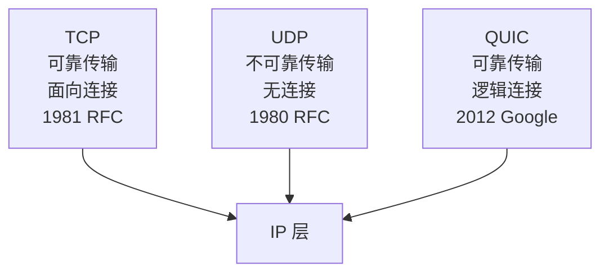
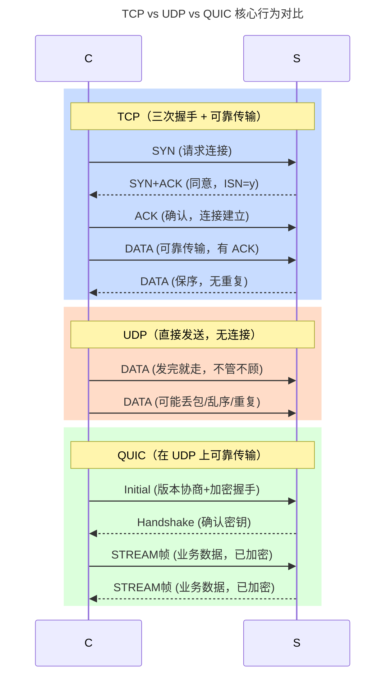
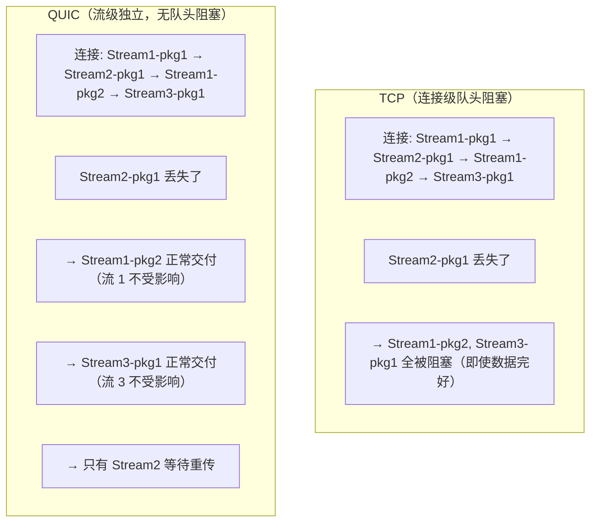
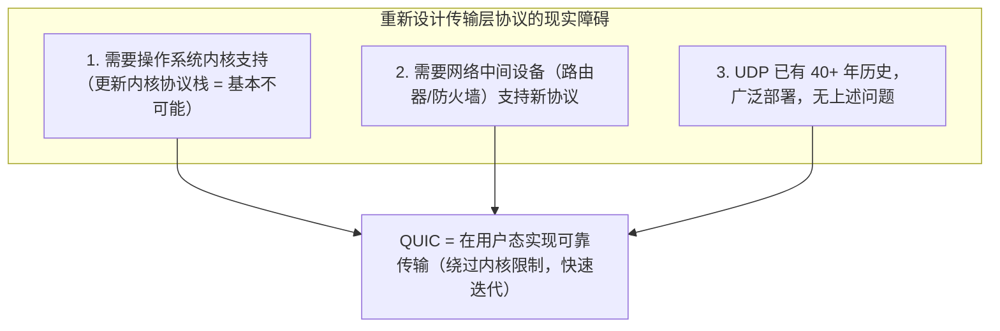
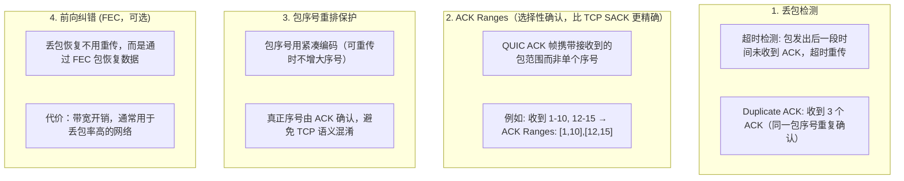
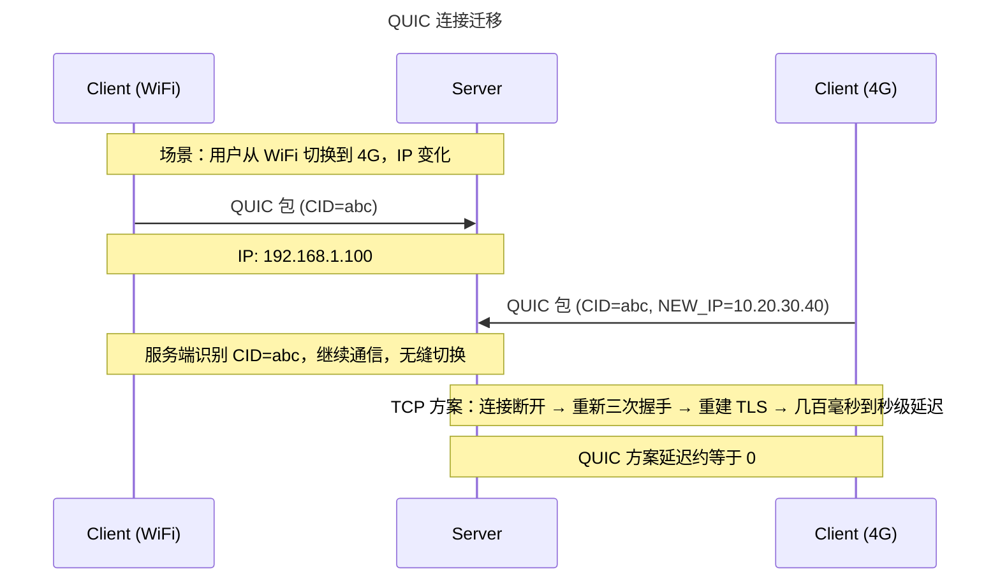
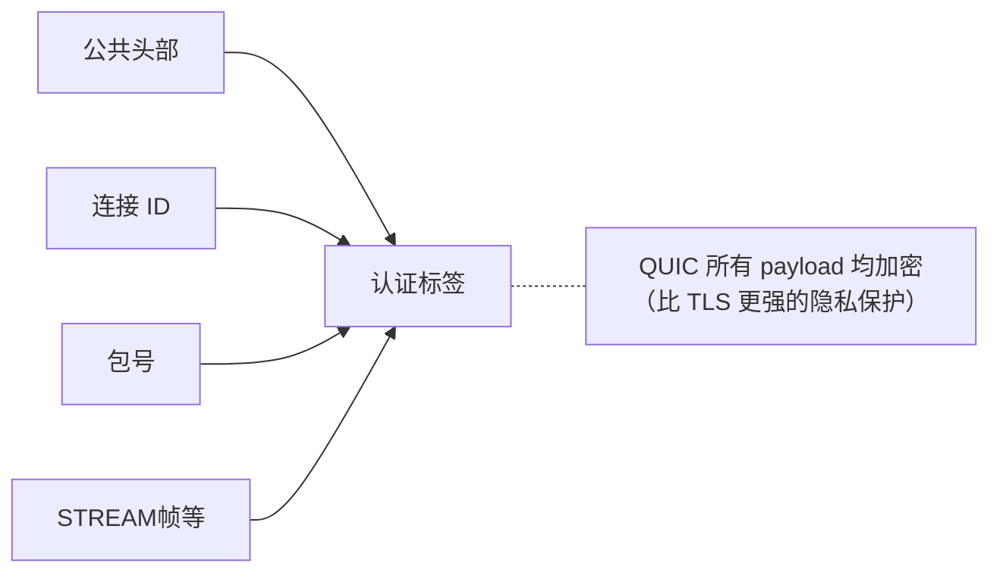

# TCP、UDP 与 QUIC

## 1. TCP vs UDP vs QUIC

### 1.1 定义/背景（一句话说清）

TCP、UDP 和 QUIC 是三种传输层协议：TCP 是面向连接、可靠但有队头阻塞的全双工协议；UDP 是无连接、不可靠但开销极低的无状态协议；QUIC 是 Google 在 UDP 之上构建的可靠传输协议，兼具两者优点并消除了 TCP 的队头阻塞。

### 1.2 ASCII 原理图







### 1.3 完整代码示例（TS/JS）

```typescript
// TCP vs UDP vs QUIC 在 Web 前端的应用场景

// ============ 场景 1：HTTP 协议自动选择传输层 =============

// HTTP/1.1 → 强制 TCP（无选择）
const h1 = await fetch('/api/data'); // 底层：TCP + TLS

// HTTP/2 → 强制 TCP（即使应用层多路复用）
const h2 = await fetch('https://h2.example.com/api/data');
// 底层：TCP + TLS + HTTP/2 多路复用（TCP 层队头阻塞）

// HTTP/3 → 优先 QUIC，失败回退
const h3 = await fetch('https://h3.example.com/api/data');
// 底层：QUIC (UDP) → 失败则 HTTP/2 (TCP)

// ============ 场景 2：WebRTC 使用 UDP（媒体流） =============

// WebRTC 的媒体流（RTP/RTCP）直接走 UDP
// DataChannel 提供可靠/有序选项（应用层实现）
const pc = new RTCPeerConnection({
  // 音视频轨道走 UDP（RTP）
  video: { minBitrate: 1000, maxBitrate: 5000 },
  audio: { minBitrate: 32, maxBitrate: 128 },
});

// DataChannel 可以配置为可靠或不可靠
const channel = pc.createDataChannel('gameState', {
  ordered: false,          // 不保证顺序（类似 UDP）
  maxRetransmits: 0,      // 不可靠模式（类似 UDP）
  // 如果需要可靠性：ordered: true, maxRetransmits: 3
});

channel.onmessage = (event) => {
  const gameState = JSON.parse(event.data);
  // 适用于: 游戏手柄状态、实时位置更新（允许丢包）
};

// ============ 场景 3：TCP 直连（WebSocket） =============

const ws = new WebSocket('wss://game.example.com/realtime');
// WebSocket 底层使用 TCP
// 问题：TCP 的队头阻塞会影响 WebSocket 的实时性
// 解决：用多个 WebSocket 连接（每个连接独立 TCP，不互相阻塞）
const ws1 = new WebSocket('wss://game.example.com/control');  // 控制命令
const ws2 = new WebSocket('wss://game.example.com/audio');   // 音频流

// ============ 场景 4：判断网络支持 QUIC =============

function supportsHTTP3(): Promise<boolean> {
  return new Promise((resolve) => {
    const url = window.location.href;
    const start = performance.now();

    fetch(url, { mode: 'cors' }).then(() => {
      const entries = performance.getEntriesByType('resource') as any[];
      const current = entries[entries.length - 1];
      if (current?.nextHopProtocol?.startsWith('h3')) {
        resolve(true);
      } else {
        resolve(false);
      }
    }).catch(() => {
      resolve(false);
    });
  });
}

const isHTTP3 = await supportsHTTP3();
console.log(isHTTP3 ? '使用 HTTP/3 (QUIC)' : '使用 HTTP/2 或 HTTP/1.1');

// ============ 场景 5：QUIC 在游戏中的适用性分析 =============

function selectTransportForGame(gameType: string) {
  switch (gameType) {
    case 'fps': {
      // FPS 游戏：允许丢包，低延迟 > 可靠性
      // → UDP（WebRTC DataChannel, unordered, maxRetransmits=0）
      console.log('→ UDP (DataChannel, unreliable)');
      break;
    }
    case 'moba': {
      // MOBA：部分丢包可接受，大量小更新
      // → UDP with reliability（WebRTC DataChannel, ordered, maxRetransmits=3）
      console.log('→ UDP with partial reliability');
      break;
    }
    case 'turn-based': {
      // 回合制：必须可靠，顺序无关
      // → WebSocket（TCP，回合指令）
      console.log('→ WebSocket (TCP, reliable)');
      break;
    }
    case 'chat': {
      // 聊天：必须可靠有序
      // → HTTP/2 或 HTTP/3（长连接+多路复用）
      console.log('→ HTTP/2 or HTTP/3');
      break;
    }
  }
}
```

### 1.4 对比表

| 维度 | TCP | UDP | QUIC |
|------|:---:|:---:|:----:|
| 头部开销 | 20B | 8B | 20-40B |
| 连接建立 | 1-RTT + TLS 1-RTT | 0-RTT | 1-RTT + 0-RTT |
| 可靠性 | 可靠（ACK 重传） | 不可靠 | 可靠（用户态 ACK） |
| 顺序性 | 保序 | 不保序 | 流内保序，流间独立 |
| 流量控制 | rwnd（接收窗口） | 无 | 独立流控 + 连接级流控 |
| 拥塞控制 | 内核实现（难改） | 无 | 用户态实现（灵活） |
| 队头阻塞 | 连接级（所有流） | 无 | 流级（仅丢包流） |
| 连接迁移 | 不支持 | 不支持 | 支持（CID） |
| 数据加密 | TLS（部分） | 无 | 内置完整加密 |
| 多路复用 | 无（需 HTTP/2） | 无 | 流级（原生） |
| 适用场景 | WebSocket、HTTPS | DNS、VoIP、游戏 | HTTP/3、实时通信 |

### 1.5 常见陷阱与最佳实践

| 陷阱 | 说明 | 解决方案 |
|------|------|----------|
| 在需要低延迟的场景用 TCP | TCP 的拥塞控制过于保守，重传延迟高 | 对延迟敏感场景用 UDP 或 QUIC |
| 在需要可靠性的场景用 UDP | 丢包会导致数据不完整 | 在应用层实现可靠性（ACK、重传） |
| 混淆 HTTP 协议和传输层 | HTTP/2 使用 TCP，HTTP/3 使用 QUIC | 理解分层：HTTP 语义 vs TCP/UDP/QUIC 传输 |
| QUIC 穿透性失败无回退 | 防火墙阻止 UDP 443 | 始终保留 TCP 回退路径 |
| WebRTC 误用可靠 DataChannel | 可靠性带来队头阻塞，丧失低延迟优势 | 根据场景选择 ordered/unordered |

### 1.6 面试追问 + 参考答案要点

**Q1：为什么 DNS 主要用 UDP 而不是 TCP？**
> DNS 设计于 1983 年（RFC 882/883），选择 UDP 的核心理由：1. **低延迟**：DNS 查询是高频操作（每个 HTTP 请求前都要 DNS），UDP 无握手，查询速度极快（毫秒级）。2. **简单性**：DNS 协议简单，每个响应通常小于 512 字节。3. **轻量**：UDP 头部 8 字节 vs TCP 20 字节，对 DNS 这种小请求更高效。TCP 用于：响应超过 512 字节（DNSSEC）、区域传输（AXFR）、连接型查询。

**Q2：QUIC 能否完全替代 TCP？**
> 不能，原因有三：1. **穿透性**：企业网络、防火墙、某些移动网络对 UDP 支持不完整（QoS 限制、深度包检测可能拦截）。2. **协议成熟度**：TCP 有 40+ 年部署经验，QUIC 仍在快速迭代中。3. **场景差异**：对可靠性要求极高的场景（如文件传输）TCP 仍是首选。QUIC 更适合 Web 场景（HTTP/3）、实时通信（游戏/语音）和移动网络（连接迁移）。

**Q3：既然 QUIC 基于 UDP，是否意味着 QUIC 不如 TCP 可靠？**
> 不是。QUIC 在用户态实现了完整的可靠性机制：包序号重排、ACK Ranges 选择性确认、丢包重传、流量控制、拥塞控制。相比内核实现的 TCP，QUIC 的可靠性机制更精细（流级），并且因为独立于操作系统，可以更快速地修复 bug 和部署新算法。实际上 QUIC 的可靠性**优于** TCP（在丢包场景下，因为队头阻塞只影响单个流）。

### 1.7 参考来源 URL

- RFC 793 (TCP): https://www.rfc-editor.org/rfc/rfc793
- RFC 768 (UDP): https://www.rfc-editor.org/rfc/rfc768
- RFC 9000 (QUIC): https://www.rfc-editor.org/rfc/rfc9000
- QUIC vs TCP Comparison (Google): https://www.chromium.org/quic/
- WebRTC DataChannel: https://developer.mozilla.org/en-US/docs/Web/API/RTCDataChannel

## 2. TCP vs UDP vs QUIC（速记版）

| 特性 | TCP | UDP | QUIC |
|------|-----|-----|------|
| 连接性 | 面向连接 | 无连接 | 面向连接（逻辑） |
| 可靠性 | 可靠传输 | 不可靠 | 可靠传输 |
| 顺序性 | 保序 | 不保序 | 保序（流内） |
| 拥塞控制 | 有 | 无 | 有 |
| 头部大小 | 20B | 8B | 20-40B (可变) |
| 队头阻塞 | 有（传输层） | 无 | 无（流内） |
| 连接迁移 | 不支持 | 不支持 | 支持 |
| 握手延迟 | 1-RTT | 0-RTT | 1-RTT / 0-RTT |

## 3. QUIC 基于 UDP 如何保证可靠性

### 3.1 定义/背景（一句话说清）

QUIC 是 Google 于 2012 年提出的传输层协议，运行在 UDP 之上，在用户态实现可靠的传输机制，从而获得比 TCP 更低的连接建立延迟和更好的拥塞控制灵活性，同时消除了 TCP 的队头阻塞问题。

### 3.2 ASCII 原理图









### 3.3 完整代码示例（TS/JS）

```typescript
// QUIC 在前端的应用场景

// 场景 1: fetch API 自动使用 HTTP/3（QUIC）
// 浏览器自动决定是否使用 HTTP/3，无需前端代码干预
const response = await fetch('https://http3.example.com/api/data');
// 网络栈自动尝试 HTTP/3，失败回退 HTTP/2 → HTTP/1.1

// 场景 2: 检测当前使用的协议（Performance API）
const connInfo = performance.getEntriesByType('resource')
  .find(r => r.name.includes('api/data')) as PerformanceResourceTiming;

if ('nextHopProtocol' in connInfo) {
  console.log('协议:', (connInfo as any).nextHopProtocol);
  // 'h3-29' → HTTP/3 draft-29
  // 'h2'    → HTTP/2
  // 'http/1.1' → HTTP/1.1
}

// 场景 3: 检测 QUIC 连接建立时间
const quicSetup = performance.getEntriesByType('resource')
  .filter(r => (r as any).nextHopProtocol?.startsWith('h3'));

quicSetup.forEach(entry => {
  const rtt = (entry as any).connectEnd - (entry as any).connectStart;
  console.log('QUIC 连接时间:', rtt, 'ms'); // 通常比 TCP+TLS 快 30-50%
});

// 场景 4: HTTP/3 服务器推送感知（已废弃，不推荐使用）
// Server Push 在 HTTP/3 中已被移除，改用 Early Hints
// <link rel="preload" href="/style.css" as="style" fetchpriority="high">

// 场景 5: 使用 undici（Node.js HTTP/3 客户端）
// 注意: Node.js 原生 HTTP/3 支持需要使用实验性模块或第三方库
// 以下使用模拟代码说明概念
async function quicRequestExample() {
  // undici v6+ 支持 HTTP/3 (底层使用 npm:nextjs/QUIC)
  const { Agent, request } = await import('undici');

  const agent = new Agent({
    connect: {
      // QUIC 特定选项
      keepAliveTimeout: 30000,
      // 未设置则默认 UDP 443 端口尝试 QUIC，失败回退 TCP
    }
  });

  const { statusCode, body } = await request(
    'https://example.com/api',
    { dispatcher: agent }
  );

  const text = await body.text();
  console.log('响应:', statusCode, text);
}

// 场景 6: 使用 Cloudflare Workers 的 QUIC 支持
// Cloudflare Workers 自动使用 HTTP/3（QUIC）
// 前端无需特殊代码，fetch() 自动走 QUIC
async function workerQuicExample() {
  const data = await fetch('https://ai-api.example.com/chat', {
    method: 'POST',
    body: JSON.stringify({ message: 'Hello' }),
    headers: { 'Content-Type': 'application/json' },
  });
  return data.json();
}
```

### 3.4 对比表

| 维度 | TCP | UDP | QUIC |
|------|:---:|:---:|:----:|
| 连接性 | 面向连接 | 无连接 | 逻辑连接（用户态） |
| 可靠性 | 可靠传输 | 不可靠 | 可靠传输（用户态实现） |
| 顺序性 | 保序 | 不保序 | 流内保序，流间独立 |
| 拥塞控制 | 有（内核） | 无 | 有（用户态，灵活） |
| 队头阻塞 | TCP 层（连接级） | 无 | 无（流级独立） |
| 头部大小 | 20B | 8B | 20-40B（可变） |
| 握手延迟 | 1-RTT + TLS | 0-RTT | 1-RTT / 0-RTT |
| 连接迁移 | 不支持 | 不支持 | 支持（CID 机制） |
| 数据加密 | TLS 加密 payload | 无 | 内置加密（整个 payload） |
| 部署难度 | 内核 | 无 | 用户态软件升级 |
| 移动网络优化 | 差（切换 IP 断连） | N/A | 好（Connection Migration） |

### 3.5 常见陷阱与最佳实践

| 陷阱 | 说明 | 解决方案 |
|------|------|----------|
| 0-RTT 重放攻击 | 第二次连接的早期数据可能被恶意重放 | 对 0-RTT 请求进行幂等性验证，限制 0-RTT 数据内容 |
| QUIC 穿透性问题 | 企业网络/防火墙可能阻止 UDP 流量 | 保留 TCP 回退，始终确保 HTTP/2 可用 |
| QUIC 头部开销 | QUIC 头部比 TCP/IP 头加起来还大 | 对于小请求/响应，HTTP/3 未必更快 |
| 拥塞控制算法不兼容 | QUIC 的拥塞控制是用户态的，可能与网络设备冲突 | 使用标准算法（CUBIC/BBR），避免激进策略 |
| HTTP/3 主动关闭 | 服务端主动关闭时通知机制不如 HTTP/2 GOAWAY | 使用 Application-Level 关闭确认 |

### 3.6 面试追问 + 参考答案要点

**Q1：QUIC 的连接迁移（Connection Migration）是如何实现的？**
> 每个 QUIC 连接有一个或多个 Connection ID（CID），CID 与底层 IP 地址解耦。当客户端 IP 变化时（WiFi→4G），客户端继续使用相同的 CID 发送数据包（现在从新 IP 发出），服务端根据 CID 识别连接并更新路径。数据包到达新 IP 后，QUIC 层自动更新连接路径，无需重建连接，延迟几乎为零。

**Q2：QUIC 的 0-RTT 握手安全吗？有什么风险？**
> 0-RTT 使用上次会话的密钥直接加密发送数据，节省 1-RTT。但存在**重放攻击**风险：攻击者可以截获并重放 0-RTT 数据。另外，0-RTT 数据不提供前向保密（密钥是上次会话复用的）。实践中，对 0-RTT 请求应进行幂等性验证，或限制 0-RTT 可发送的数据内容（如只允许读操作）。

**Q3：QUIC 的拥塞控制为什么比 TCP 更灵活？**
> TCP 的拥塞控制在内核中实现，更新需要升级操作系统。QUIC 的拥塞控制在用户态实现，应用可以：1. 在同一连接上运行多个独立的拥塞控制算法（按场景切换）。2. 快速迭代新算法（软件更新即可）。3. 针对不同流使用不同策略（流级拥塞控制）。4. 精细化控制（精确到单个包的 ACK 确认）。BBR、PCC、COPA 等新算法首先在 QUIC 上实验。

### 3.7 参考来源 URL

- IETF QUIC Working Group: https://datatracker.ietf.org/wg/quic/documents/
- RFC 9000 (QUIC 传输协议): https://www.rfc-editor.org/rfc/rfc9000
- RFC 9001 (QUIC TLS): https://www.rfc-editor.org/rfc/rfc9001
- Chromium QUIC Implementation: https://www.chromium.org/quic/
- QUIC 设计文档: https://github.com/quicwg/base-drafts/wiki

## 4. QUIC 为什么基于 UDP（速记版）

### 4.1 为什么选择 UDP

```
重新设计传输层协议的现实障碍:
1. 需要操作系统内核支持（更新内核协议栈 = 不可能）
2. 需要网络中间设备（路由器、防火墙）支持
3. UDP 已有广泛部署，无上述问题

QUIC = 在用户态实现可靠传输（绕过内核限制，快速迭代）
```

### 4.2 QUIC 可靠性实现

```
QUIC 丢包恢复机制:

1. 丢包检测:
   - 超时检测: 包发出后一段时间未收到 ACK，超时重传
   - Duplicate ACK: 收到 3 个 ACK（同一 seq 未 ACK）

2. ACK Ranges（选择性确认）:
   QUIC ACK 帧携带"接收到的包范围"，比 TCP 的 SACK 更精确

3. 连接迁移（Connection Migration）:
   - 每个连接有一个 Connection ID（可变）
   - 客户端切换网络（WiFi->4G）时，继续使用同一 Connection ID
   - 数据包到达新 IP，QUIC 层自动更新连接路径
   - 无需重新建立连接（TCP 会断开重连）
```

## 深入阅读与参考

!!! tip "怎么用这些资料"
    先读「官方文档与规范」建立准确的概念，再读「源码与示例」核对细节，最后用「教程、书籍与视频」换一种讲法加深理解。每条都写明了读哪一节、带着什么问题读。

### 官方文档与规范

| 资源 | 为什么读 | 怎么读 |
|---|---|---|
| [RFC 9000 QUIC](https://www.rfc-editor.org/rfc/rfc9000) | QUIC权威RFC，理解连接建立与传输加密整合的必读规范。 | 读第1-4章概述与连接建立，带着“QUIC如何替代TCP”的问题读。 |
| [Wireshark 文档入口](https://www.wireshark.org/docs/) | 抓包工具权威文档，亲手验证TCP握手与QUIC包结构。 | 读入门与过滤器章节，抓一次TCP握手和QUIC握手并对比。 |

### 源码与示例

| 资源 | 为什么读 | 怎么读 |
|---|---|---|
| [Beej 网络编程指南](https://beej.us/guide/bgnet/) | 从代码层面理解TCP套接字，看清连接建立与数据传输。 | 读套接字API章节，写一个简单TCP客户端，观察连接过程。 |

### 教程、书籍与视频

| 资源 | 为什么读 | 怎么读 |
|---|---|---|
| [HTTP/3 explained](https://http3-explained.haxx.se/) | 图解HTTP/3与QUIC，直观对比TCP的连接迁移与丢包恢复。 | 重点读QUIC连接迁移和丢包恢复章节，读后画图对比TCP。 |
| [High Performance Browser Networking](https://hpbn.co/) | 经典性能书，从TCP到HTTP/2讲透延迟与拥塞控制根源。 | 精读TCP与TLS章节，带着“为何需要QUIC”的问题读。 |
| [小林 coding](https://xiaolincoding.com/) | 图解TCP基础，快速建立三次握手、四次挥手直觉。 | 读TCP章节，口述握手挥手过程，再对比QUIC的0-RTT。 |

## 应用与行业实践

### 应用场景地图

| 场景 | 用到本页哪个知识点 | 典型技术选型 | 注意事项 |
| --- | --- | --- | --- |
| 后台管理的万行表格翻页与导出 | TCP 队头阻塞、连接复用、Nagle 合并 | HTTP/1.1 keep-alive + 游标分页；导出单独连接 | 导出流占满连接池会拖慢翻页，两条业务分开 |
| 低端安卓的首屏加载 | QUIC 握手轮次、0-RTT、连接迁移 | HTTP/3 over QUIC，保留 HTTP/2 回退 | 0-RTT 只用于幂等 GET；UDP 被封锁要能降级 |
| 多人协作白板 | UDP 无重传、QUIC 不可靠数据报 | 笔迹走 UDP/数据报，状态走可靠流 | 笔迹带序号去重，靠关键帧纠正累计丢失 |
| 地铁里的短视频起播 | QUIC 用户态丢包恢复、UDP 无队头阻塞 | HTTP/3 + 分段缓存 | 部分运营商对 UDP 限速，要按域名回退 |
| 多人实时语音房 | UDP 无连接、开销固定 | RTP/SRTP over UDP + 前向纠错 | 丢包用 PLC、FEC 掩盖，不做重传 |
| 游戏登录与对局同步 | 可靠流与低延迟通道的取舍 | 登录走 TCP 或 QUIC 可靠流，位置同步走 UDP | 两条通道的序号要对齐，否则状态错乱 |
| 内网服务间调用 | TCP 连接建立开销、单连接队头阻塞 | gRPC over HTTP/2，或基于 QUIC 的传输 | 长连接要设 keepalive 与空闲回收 |
| 传感器心跳上报 | UDP 无状态、头部开销小 | CoAP over UDP，按需加 DTLS | NAT 映射会过期，心跳间隔要短于映射存活时间 |
| 大文件断点续传 | TCP 可靠流、流量控制 | HTTP Range over TCP/TLS | 断点位置由服务端校验哈希，避免半包覆盖 |

### 三个场景拆解

#### 场景 1：后台管理的万行表格翻页与导出

**业务背景**
运营后台单表上万行，每页 50 行，用户连续翻页并随时点导出 CSV。导出体积比一页数据高出两个数量级。

**怎么用本页知识解决**
思路是让翻页复用同一条 TCP 连接，把每页服务端扫描量固定，导出另走一条连接，避免它挤占翻页。

```js
const http = require('node:http');
// 客户端：复用一个 Agent，相邻翻页共用一个 TCP 连接
const agent = new http.Agent({ keepAlive: true, maxSockets: 6 });
http.get({ host: 'api.internal.test', path: '/rows?cursor=0', agent }, (res) => {
  res.resume();                                 // 必须消费响应，连接才会回到池
});

// 服务端：游标分页 + 关闭 Nagle
const server = http.createServer((req, res) => {
  res.socket.setNoDelay(true);                  // 小 JSON 不再等 Nagle 合并
  const url = new URL(req.url, 'http://localhost');
  const cursor = Number(url.searchParams.get('cursor') || 0);
  const rows = queryRows(cursor, 50);           // 占位：换成你的游标查询
  res.setHeader('Content-Type', 'application/json');
  res.end(JSON.stringify({ rows, next: cursor + 50 }));
});
server.keepAliveTimeout = 65000;                // 大于反向代理空闲阈值，减少重建
server.listen(3000);
```

- keepAlive 让相邻翻页复用连接，省掉三次握手与慢启动。
- 游标分页把每页的服务端扫描量固定为 50 行，翻页耗时与页码无关。
- setNoDelay 针对小于 MSS 的 JSON 响应；响应变大后要重新测包数与带宽开销。
- 导出走独立 Agent 或独立域名，避免它占满 maxSockets 把翻页请求排队。
- 若同一连接上跑 HTTP/2，单次丢包会阻塞这条连接上的全部流，导出必须拆出去。

**怎么度量收益**
看翻页请求的耗时分解、连接重建次数、导出期间翻页的 P95。方法：`curl -o /dev/null -s -w '%{time_connect} %{time_starttransfer}\n'` 连打 20 次，确认 time_connect 只在第一次非零；服务端用 `ss -tan state established '( dport = :3000 )'` 数连接条数。

**什么时候不该用**
- 用户只打开一次页面、不再翻页：连接池与游标分页的维护成本换不回收益。
- 数据量固定为几百行且一次性返回：分页会新增请求轮次，直接返回整表更省事。
- 瓶颈在数据库慢查询：此时调整传输参数不改变结果，先看慢查询日志。

#### 场景 2：低端安卓的首屏加载

**业务背景**
首屏目标是用户发出请求后尽快看到可点内容。设备 CPU 弱、常见 3G 或弱 4G，握手轮次占首屏时间比例高。

**怎么用本页知识解决**
思路是把传输握手与加密握手合并到一次往返，并用 0-RTT 复用会前会话；同时保留 HTTP/2 回退路径。

```bash
# 同一 URL 连打 5 次，看各阶段耗时（curl 需构建时启用 HTTP/3 才能加 --http3）
for i in 1 2 3 4 5; do
  curl -o /dev/null -s -w \
    'tcp=%{time_connect} tls=%{time_appconnect} ttfb=%{time_starttransfer}\n' \
    https://example.test/
done

# 打开 --http3 再跑一遍，比较 tls 与 ttfb 的差值
# 弱网复现：回环加 100ms 延迟与 3% 丢包
sudo tc qdisc add dev lo root netem delay 100ms loss 3%
# 实验结束务必清理
sudo tc qdisc del dev lo root
```

- time_appconnect 减 time_connect 是握手段耗时；QUIC 在 UDP 上把传输与加密握手合成一步。
- time_starttransfer 减 time_appconnect 覆盖请求发送到首字节，受 RTT 与拥塞窗口共同影响。
- 0-RTT 让请求随首个 UDP 包发出，仅对幂等 GET 使用，写请求必须等握手完成。
- tc netem 在回环复现丢包，比在办公网测更能反映弱网下的差值。
- UDP 被阻断时要靠 Alt-Svc 提示客户端切回 HTTP/2，回退路径必须有测试覆盖。

**怎么度量收益**
看 time_connect、time_appconnect、time_starttransfer 三个阶段的分布，以及首屏绘制时间与协议回退率。首屏用 `PerformanceObserver` 监听 paint 条目；回退率由服务端按协议版本统计请求数占比。

**什么时候不该用**
- 客户端网络对 UDP 出站封锁：只上 HTTP/3 会让首屏变差，必须先确认回退生效。
- 内网应用且请求数少、连接能长时间复用：省下的握手轮次占比低，新增 QUIC 会带来额外运维面。
- 瓶颈在主线程 JS 执行或图片解码：换传输层不改变首屏，先看火焰图。

#### 场景 3：多人协作白板

**业务背景**
一间会议室 5 到 20 人同时画线，每人每秒产生几十个笔迹点，延迟敏感，丢一两个点不影响可读性。成员加入、图层顺序这类状态不能丢。

**怎么用本页知识解决**
思路是把笔迹走 UDP，带自增序号；状态变更走可靠流，并定时发关键帧纠正累计丢失。

```js
const dgram = require('node:dgram');
const sock = dgram.createSocket('udp4');   // 无连接，不做握手与重传
const lastSeq = new Map();                 // 每个 strokeId 记录已收到的最新序号
let seq = 0;

function sendDot(x, y, strokeId) {
  const msg = Buffer.from(JSON.stringify({ strokeId, seq: seq++, x, y }));
  sock.send(msg, 41234, '127.0.0.1');      // 笔迹点：丢了就丢，不排队重传
}

sock.on('message', (buf, rinfo) => {
  const p = JSON.parse(buf.toString());
  if (p.seq <= (lastSeq.get(p.strokeId) ?? -1)) return; // 丢弃迟到与重复的旧点
  lastSeq.set(p.strokeId, p.seq);
  draw(p);                                 // 只画新点，不回退
});

setInterval(() => sendKeyframe(canvasState()), 2000); // 定时关键帧，纠正累计丢失
```

- UDP 不重传，抖动不会被重传队列放大，代价是丢点。
- 序号让接收端丢弃旧包，乱序到达不会把已画的笔迹回退。
- 每 2 秒发一次关键帧，覆盖累计丢失，也让中途加入的成员追平。
- 加入房间、清屏、图层顺序走 TCP 或 QUIC 可靠流，保证到达与顺序。
- QUIC 有不可靠数据报扩展（RFC 9221），可在一条已加密连接上同时跑可靠流与数据报。

**怎么度量收益**
看笔迹端到端延迟、丢点率、两次关键帧之间的偏差累计。发送端用 `performance.now()` 打时间戳，渲染端回传同一笔迹的绘制时间；服务端用 `ss -u` 看 UDP 接收队列，Recv-Q 长时间非零说明内核缓冲已满。

**什么时候不该用**
- 白板内容需要逐点可追溯（签名、审计）：丢点不可接受，全程走可靠流。
- 单人对自己的草稿板：没有并发写者，本地渲染加定期保存即可。
- 接收端要按严格顺序重放（录制回放）：UDP 乱序需额外重排缓冲，成本高于直接走 TCP。

### 行业先进实践

**HTTP/3 与 Alt-Svc 平滑升级（出处：IETF RFC 9114 / IETF RFC 7838）**
服务端用 Alt-Svc 响应头声明同源的 HTTP/3 端点，客户端下次访问直接试 QUIC，失败回退 HTTP/2。新旧协议并行一段时间，不支持 UDP 的网络不会被排除在外。借鉴方式：先在静态资源域名开启，把回退率作为上线门槛。

**QUIC 不可靠数据报扩展（出处：IETF RFC 9221）**
该扩展允许在同一条 QUIC 连接上发送不重传的数据报，和可靠流共享加密与拥塞控制。对实时媒体这类"新帧覆盖旧帧"的数据，省掉了另开 UDP 端口和自建加密。借鉴方式：白板、语音这类场景先评估能否复用已有的 QUIC 连接。

**QUIC 连接迁移与 0-RTT 会话复用（出处：IETF RFC 9000 / IETF RFC 9001）**
QUIC 用连接 ID 而非四元组标识连接，手机从 Wi-Fi 切到蜂窝时连接不断，会话票据还支持 0-RTT 恢复。有效的原因是握手与传输状态绑定在连接 ID 上。借鉴方式：移动端应用把切网重连失败率列为观测指标。

**TCP Fast Open（出处：IETF RFC 7413）**
TFO 允许客户端在 SYN 包中携带数据，服务端校验 cookie 后即可交付给应用，省掉一次往返。它只对重复访问的客户端生效，首次访问仍需完整握手。借鉴方式：先确认服务端与客户端内核都开启该选项，再比较首包时间。

**Happy Eyeballs 与协议回退（出处：IETF RFC 8305）**
该做法让客户端在双栈或双协议间并行尝试，先连上的胜出，避免单一通道不可达时长时间等待。它把"选哪条路"交给实测结果，而不是静态配置。借鉴方式：QUIC 与 TCP 的竞速可以借用同一套思路，记录竞速胜出比例。

### 从学到用：落地路线

第 1 步：在一个内部后台试点，把翻页接口改游标分页并开启 keepAlive。验收标准：连续 20 次翻页中 time_connect 只在第一次非零。

第 2 步：在测试环境用 tc netem 注入延迟与丢包，对比 HTTP/2 与 HTTP/3 的三段耗时，并验证回退路径可用。验收标准：产出一张对比表，且断掉 UDP 后请求全部成功。

第 3 步：把验证通过的配置推广到同域名的全部后端，Alt-Svc 由服务端下发，客户端自行切换。验收标准：服务端按协议版本统计的 QUIC 占比达到自定阈值并稳定一周。

第 4 步：保留"关闭 UDP"的开关与灰度维度（按域名或版本放量），出现 P95 抬升就回退。验收标准：演练中关闭开关后 5 分钟内流量回到 TCP，且监控无告警。

### 动手作业

**目标**
在本机复现丢包环境，对比 TCP 与 UDP 在同样丢包下的行为差异，并把结论写成一页说明文档。

**步骤**
1. 用 Node 写一个 UDP 回显端与发送端，发送端每秒发 50 个带序号的小包，接收端记录到达、丢失与乱序。
2. 用 Node 写语义相同的 TCP 回显，采用固定长度前缀分帧，发送频率保持每秒 50 条。
3. 用 `sudo tc qdisc add dev lo root netem delay 100ms loss 5%` 在回环注入丢包，实验结束后用 `sudo tc qdisc del dev lo root` 清理。
4. 在 0% 与 5% 两组丢包下各跑 60 秒，记录到达率、乱序率、端到端延迟分位，以及 `ss -ti` 输出中的重传计数。
5. 给 UDP 接收端加上序号去重与每 2 秒一次的关键帧，重跑并观察数据是否收敛且不回退。
6. 把两组数据整理成表格，每条结论后面附上产生它的命令或脚本路径。

**验收标准**
- 交付 0% 与 5% 两组数据，每组采集时长不短于 60 秒。
- UDP 到达率低于 100%，TCP 在连接未断开时数据完整到达，两组结果可重复跑出。
- `ss -ti` 中 TCP 重传计数随丢包率上升，能在输出里指出对应字段。
- 加入序号与关键帧后，接收端不再出现旧序号覆盖新数据的情况。
- 文档中每个结论都能对应到一条可复现的命令或一段脚本。

