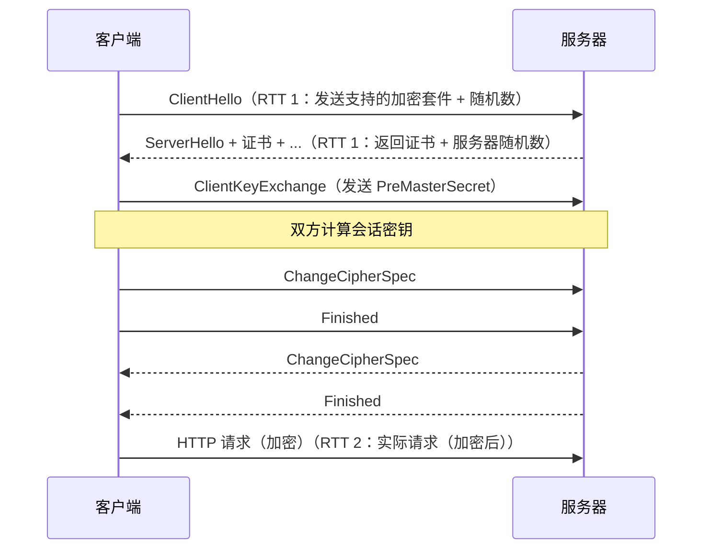
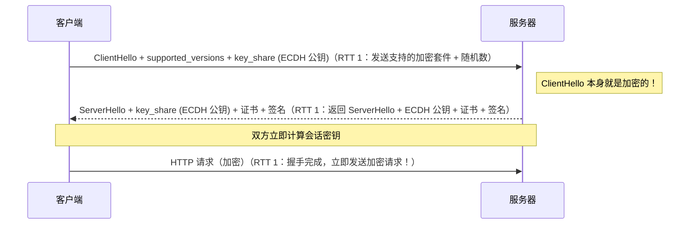
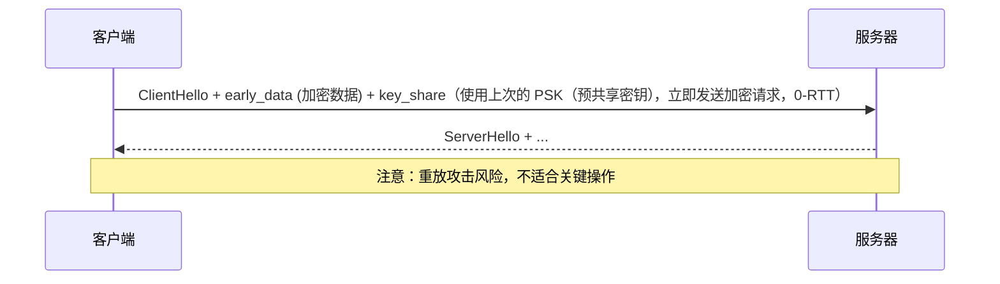
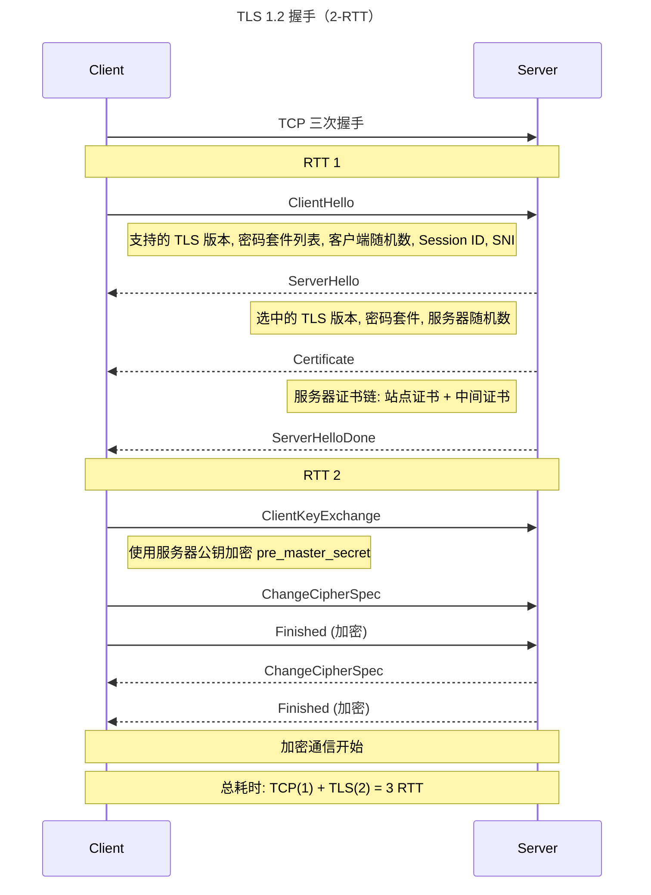
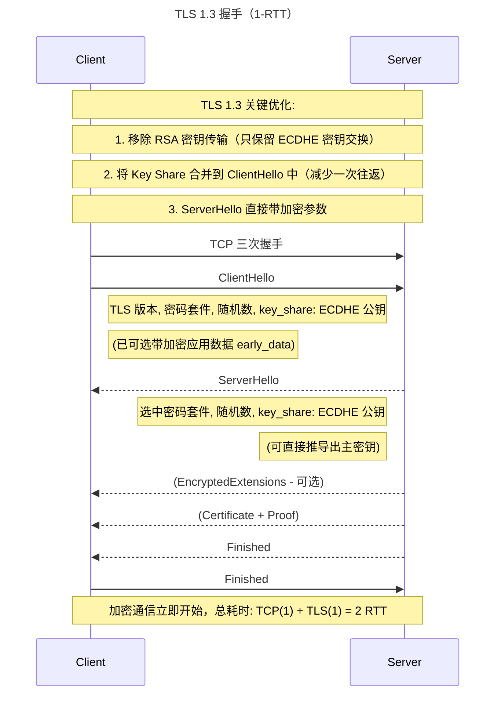
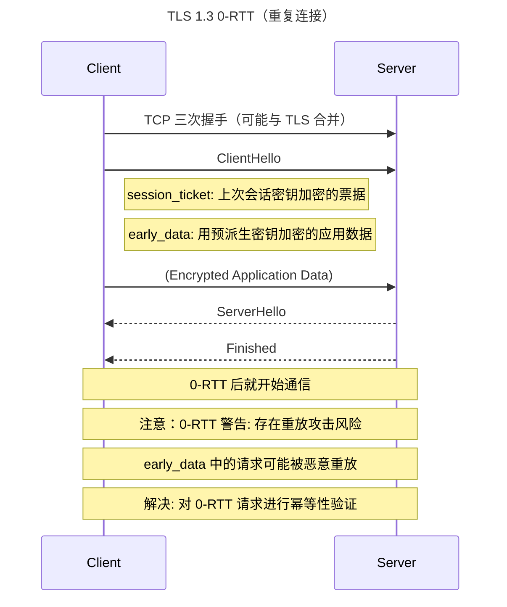
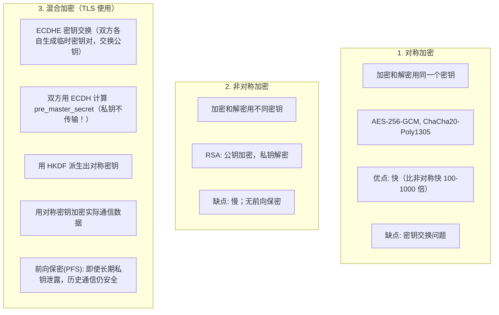

# HTTPS 与 TLS 握手

## 1. HTTPS 与 TLS 1.3 握手详解

### 1.1 定义/背景

HTTPS 是 HTTP over TLS，在 HTTP 和 TCP 之间插入 TLS 层，提供加密传输、服务器身份认证和数据完整性保护。TLS 1.3 是 2018 年标准化的最新版本，将完整握手从 2-RTT 减少到 1-RTT（甚至 0-RTT），并移除了不安全的加密套件，是现代互联网的安全基石。

### 1.2 TLS 1.2 vs TLS 1.3 握手对比

**TLS 1.2 — 完整握手（2-RTT）：**



**TLS 1.3 — 完整握手（1-RTT）：**



**TLS 1.3 — 0-RTT（Resumption）：**



### 1.3 TLS 1.3 相比 TLS 1.2 的改进

| 特性 | TLS 1.2 | TLS 1.3 |
|------|---------|---------|
| 完整握手 RTT | 2-RTT | 1-RTT |
| 0-RTT | 不支持 | 支持（PSK 恢复会话） |
| RSA 密钥交换 | 支持（不提供前向安全） | **移除** |
| CBC 模式 | 支持（易受 BEAST/POODLE 攻击） | **移除** |
| SHA-1 签名 | 支持（弱安全） | **移除** |
| 主动加密握手 | 否 | 是（ClientHello 加密） |
| 密钥交换算法 | RSA / ECDHE | **仅 ECDHE**（提供前向安全） |
| 加密套件数量 | 30+ | **仅 5 个**（协商简化） |
| 握手可见性 | ClientHello 明文 | ClientHello 可选加密 |

### 1.4 完整 HTTPS 请求代码（Node.js）

```typescript
import https from 'node:https';
import http from 'node:http';

// HTTPS 请求示例：验证服务器证书
const options = {
  hostname: 'example.com',
  port: 443,
  path: '/api/data',
  method: 'GET',
  rejectUnauthorized: true, // 正确：验证服务器证书（必须开启！）
  // 自定义 CA（企业内网场景）
  // ca: fs.readFileSync('/path/to/internal-ca.crt'),
};

const req = https.request(options, (res) => {
  console.log(`状态码: ${res.statusCode}`);
  console.log(`TLS 版本: ${res.socket.getProtocol()}`); // TLSv1.3
  console.log(`Cipher: ${res.socket.getCipher()}`);       // TLS_AES_256_GCM_SHA384

  let data = '';
  res.on('data', chunk => data += chunk);
  res.on('end', () => console.log(data));
});

req.on('error', (e) => console.error('请求错误:', e.message));

// TLS 会话恢复（节省握手时间）
import TLS from 'node:tls';

const session = TLS.createSecureContext({ ... });
req.on('socket', (socket) => {
  socket.setSession(session); // 复用会话，快速恢复
});

// 服务端配置 TLS 1.3
const serverOptions: https.ServerOptions = {
  key: fs.readFileSync('/path/to/server.key'),
  cert: fs.readFileSync('/path/to/server.crt'),
  minVersion: 'TLSv1.3',           // 强制 TLS 1.3
  maxVersion: 'TLSv1.3',
  // 优先使用 AEAD 加密套件
  honorCipherOrder: true,
  // 必须开启 SNI（Server Name Indication）
  SNICallback: (servername, cb) => {
    const ctx = createSecureContextForHost(servername);
    cb(null, ctx);
  },
  // HSTS（HTTP Strict Transport Security）
  // 通过 response 头设置，不在 TLS 层配置
};

https.createServer(serverOptions, (req, res) => {
  res.setHeader('Strict-Transport-Security',
    'max-age=31536000; includeSubDomains; preload');
  res.end('Hello HTTPS');
}).listen(443);
```

### 1.5 前向安全（Forward Secrecy）与 ECDHE

```javascript
// RSA 密钥交换：服务端用公钥加密 PreMasterSecret 发送给客户端
// 问题：如果服务端私钥被泄露，历史流量可被解密（无前向安全）

// ECDHE 密钥交换（TLS 1.3 唯一支持）：
// 双方各自生成临时 ECDH 密钥对，用对方的公钥和自己的私钥计算共享密钥
// 每次会话使用新的临时密钥，即使长期私钥泄露，历史会话仍安全
// 公式: shared_secret = ECDH(client_private, server_public)
//              = ECDH(server_private, client_public)

import crypto from 'node:crypto';

// 模拟 ECDHE 握手（简化版）
function ecdheHandshake() {
  // 客户端：生成 ECDH 密钥对
  const client = crypto.createECDH('secp256r1');
  client.generateKeys();
  const clientPublicKey = client.getPublicKey();

  // 服务器：生成 ECDH 密钥对
  const server = crypto.createECDH('secp256r1');
  server.generateKeys();
  const serverPublicKey = server.getPublicKey();

  // 双方各自用自己的私钥 + 对方的公钥，计算出相同的共享密钥
  const clientSharedSecret = client.computeSecret(serverPublicKey);
  const serverSharedSecret = server.computeSecret(clientPublicKey);

  // 双方独立导出会话密钥（HKDF）
  const clientKey = crypto.createHash('sha256').update(clientSharedSecret).digest();
  const serverKey = crypto.createHash('sha256').update(serverSharedSecret).digest();

  console.log('共享密钥一致:', clientKey.equals(serverKey));
  return clientKey;
}

ecdheHandshake();
// 临时密钥对每次会话不同，私钥泄露不影响历史会话
```

### 1.6 证书链与 CA 验证

```
证书链（从叶子到根）:
  Leaf Certificate（服务器证书）
    签发者: Intermediate CA（中级证书）
      签发者: Root CA（根证书）
        内置于操作系统/浏览器受信任根存储

验证流程（浏览器自动完成）:
  1. 服务器发送完整证书链（不含根证书）
  2. 浏览器用中间证书的公钥验证叶子证书签名
  3. 浏览器用根证书的公钥验证中间证书签名
  4. 验证根证书在本地受信任存储中
  5. 验证证书的 Common Name / SAN 匹配域名
  6. 验证证书未过期（notBefore < now < notAfter）
  7. 验证证书未被吊销（OCSP / CRL）
  8. 验证域名与请求 Host 匹配
```

### 1.7 常见陷阱与最佳实践

| 陷阱 | 说明 | 解决方案 |
|------|------|---------|
| `rejectUnauthorized: false` | 跳过证书验证，中间人攻击 | 生产环境必须开启 `rejectUnauthorized: true` |
| 使用自签名证书 | 浏览器不信任 | 使用 Let's Encrypt（免费）或购买商业 CA |
| TLS 版本配置过旧 | TLS 1.0/1.1 有已知漏洞 | 配置 `minVersion: 'TLSv1.3'` |
| 混用 HTTP 和 HTTPS | HTTPS 页面的 HTTP 资源被浏览器阻止 | 全站 HTTPS，用 CSP upgrade-insecure-requests |
| 证书链不完整 | 中间证书缺失导致部分客户端验证失败 | 服务端配置完整证书链（含中间证书） |
| 未配置 HSTS | 首次 HTTP 请求可被降级攻击 | 添加 HSTS 响应头，建议提交到 HSTS Preload List |
| 0-RTT 用于关键操作 | 0-RTT 有重放攻击风险 | 0-RTT 仅用于幂等操作（如 GET 请求），幂等操作禁止带状态 |

### 1.8 面试追问

**Q1: 什么是前向安全（Forward Secrecy）？为什么 TLS 1.3 只支持 ECDHE？**

前向安全指即使攻击者事后获取了服务端的长期私钥，也无法解密之前记录的加密通信流量。TLS 1.2 的 RSA 密钥交换中，会话密钥由客户端用服务端公钥加密发送，若攻击者获取服务端私钥即可解密所有历史会话。TLS 1.3 只支持 ECDHE，每次会话使用临时 ECDH 密钥对，私钥泄露只能影响当前会话，历史会话因临时密钥已销毁而无法解密。

**Q2: 什么是 OCSP Stapling？它解决了什么问题？**

传统证书验证时，浏览器需向 CA 的 OCSP 服务器查询证书是否被吊销，增加一次 HTTP 请求（可能慢，且泄露用户访问的域名）。OCSP Stapling 允许服务端定期从 CA 获取 OCSP 响应并附在 TLS 握手时发送给客户端，浏览器直接使用附带的 OCSP 响应，无需额外请求。Node.js 的 `https.createServer` 在配置证书链时默认支持 OCSP Stapling。

**Q3: HTTPS 会降低服务器性能吗？如何优化？**

TLS 1.3 的 1-RTT 握手已大幅减少性能损耗，ECDHE 的 CPU 开销比 RSA 更低。优化方案：（1）开启 TLS 1.3，减少 RTT；（2）开启会话恢复（Session Resumption / PSK），重复连接跳过握手；（3）开启 OCSP Stapling，避免客户端额外查询；（4）使用硬件加速（AES-NI）；（5）使用 HTTP/2/HTTP/3 多路复用，在一个连接上处理多个请求。

---

> 参考：
>
> - https://developer.mozilla.org/zh-CN/docs/Web/Security/Same-origin_policy（同源策略）
> - https://developer.mozilla.org/zh-CN/docs/Web/HTTP/CSP（Content Security Policy）
> - https://developer.mozilla.org/zh-CN/docs/Web/HTTP/Cookies（Cookie）
> - https://developer.mozilla.org/zh-CN/docs/Web/API/Window/postMessage（postMessage）
> - https://developer.mozilla.org/zh-CN/docs/Web/API/BroadcastChannel（BroadcastChannel）
> - https://developer.mozilla.org/zh-CN/docs/Web/API/Web_Workers_API/Using_web_workers（Web Worker）
> - https://www.chromium.org/Home/chromium-security/site-isolation（Site Isolation）
> - https://www.chromium.org/Home/chromium-security/site-isolation（Chrome Site Isolation）
> - https://web.dev/articles/same-site-same-origin（同源 vs 同站）
> - https://blog.cloudflare.com/road-to-0-rtt（TLS 1.3 0-RTT）
> - https://www.cloudflare.com/learning/dns/dns-security/（DNS 安全）
> - https://www.cloudflare.com/learning/ssl/what-happens-in-a-tls-handshake/（TLS 握手详解）
> - https://blog.cloudflare.com/doH/（DNS-over-HTTPS）
> - https://developer.mozilla.org/zh-CN/docs/Web/HTTP/Caching（Caching HTTP）
> - https://web.dev/articles/http-cache（HTTP 缓存深度指南）
> - https://www.chromium.org/developers/design-documents/os-allocations（沙箱设计文档）
> - https://www.jb51.net/article/282533.htm（Map/Set/WeakMap/WeakSet 详解）
> - https://blog.csdn.net/qi_bai_jin/article/details/158261107（V8 垃圾回收原理）
> - https://cloud.tencent.com/developer/news/2263970（Vue3 Proxy + Reflect 响应式）

## 2. HTTPS 握手 TLS 1.2 vs 1.3

### 2.1 定义/背景（一句话说清）

HTTPS = HTTP over TLS，TLS 1.2 需要 2-RTT（TCP 握手 + TLS 握手分开），TLS 1.3 将密钥交换合并到第一次消息中，减少到 1-RTT（首次）或 0-RTT（重复连接），并移除所有不安全的密码套件，前向保密（PFS）成为默认配置。

### 2.2 ASCII 时序图









### 2.3 完整代码示例（TS/JS）

```typescript
// ============ TLS 1.2 vs 1.3 在 Node.js 中的体现 ============

import https from 'https';
import http2 from 'http2';
import { Agent as Http2Agent } from 'http2';

// Node.js 中 HTTPS 使用 TLS 1.2
const agent1 = new https.Agent({
  minVersion: 'TLSv1.2',
  maxVersion: 'TLSv1.2',
});

// Node.js 中 HTTP/2 over TLS 使用 TLS 1.3（如果支持）
const agent2 = new Http2Agent({
  // HTTP/2 over TLS 会自动协商最高版本
  maxDeflateDynamicTableSize: 4096,
});

// ============ TLS 握手信息观测（Node.js）============

import tls from 'tls';
import net from 'net';

const socket = net.connect(443, 'example.com', () => {
  const cipher = socket.getCipher();
  const protocol = socket.getProtocol(); // 'TLSv1.3' 或 'TLSv1.2'
  const isSessionReused = socket.isSessionReused(); // 是否复用会话

  console.log(`
    加密套件: ${cipher.name}
    协议版本: ${protocol}
    会话复用: ${isSessionReused ? '是（0-RTT 可能性）' : '否（首次握手）'}
  `);
});

socket.on('secure', () => {
  const cert = socket.getPeerCertificate();
  console.log('服务器证书:', {
    subject: cert.subject,
    issuer: cert.issuer,
    validFrom: cert.valid_from,
    validTo: cert.valid_to,
    fingerprint: cert.fingerprint256,
  });
});

// ============ HTTPS 握手时间测量（前端）============

async function measureTLSHandshake() {
  const entries = performance.getEntriesByType('resource') as any[];

  await fetch('https://example.com/api');

  const entry = entries[entries.length - 1];
  const {
    connectStart, connectEnd,
    secureConnectionStart, secureConnectionEnd,
    responseStart, requestStart,
  } = entry;

  console.log(`
    TCP 建连:    ${(connectEnd - connectStart).toFixed(1)}ms
    TLS 握手:    ${(secureConnectionEnd - secureConnectionStart).toFixed(1)}ms
      协议版本:  ${entry?.nextHopProtocol}
    TTFB:        ${(responseStart - connectEnd).toFixed(1)}ms
    总耗时:      ${(responseStart - requestStart).toFixed(1)}ms
  `);

  // TLS 1.3 vs TLS 1.2 的差异:
  // TLS 1.3: secureConnectionEnd - secureConnectionStart ≈ 1 RTT
  // TLS 1.2: secureConnectionEnd - secureConnectionStart ≈ 1-2 RTT
  // 在高延迟网络中，这个差异显著（100ms+）
}

// ============ Node.js 创建 HTTPS 服务器 ============

import https from 'https';
import fs from 'fs';

const server = https.createServer({
  // TLS 1.3（Node.js 12+ 默认支持）
  // TLS 1.2（fallback）
  cert: fs.readFileSync('/path/to/cert.pem'),
  key: fs.readFileSync('/path/to/key.pem'),
  // 推荐: 仅启用 TLS 1.3 和 TLS 1.2（禁用 SSLv3, TLS 1.0, TLS 1.1）
  minVersion: 'TLSv1.2',
  maxVersion: 'TLSv1.3',
  // 前向保密: 使用 ECDHE 类密码套件（自动）
  // 推荐密码套件顺序（Node.js 默认已按安全性排序）
  honorCipherOrder: true, // 服务器端选择最佳密码套件
  // HSTS 头
}, (req, res) => {
  res.setHeader('Strict-Transport-Security',
    'max-age=31536000; includeSubDomains; preload');
  res.end('Hello, HTTPS with TLS 1.3!');
});

server.listen(443, () => {
  console.log('HTTPS 服务器运行在 TLS 1.2/1.3');
});

// ============ TLS 1.3 0-RTT 请求（Node.js）============

import tls from 'tls';

// 检查当前 Node.js 是否支持 TLS 1.3 0-RTT
console.log('TLS 1.3 支持:', tls.constants.tls1_3 !== undefined);

// TLS 1.3 Session Resumption（会话复用）
// Session Ticket 机制：首次握手后，服务器发送 session ticket
// 客户端保存，下次连接时带上，直接恢复会话
// 效果接近 0-RTT，但更安全（session ticket 有时效性）

const sessionTicket = Buffer.alloc(0); // 模拟保存的票据

const socket = tls.connect(443, 'example.com', {
  session: sessionTicket, // 传入上次保存的 session
}, () => {
  if (socket.isSessionReused()) {
    console.log('Session 复用成功（可能是 0-RTT）');
  }
});

// 保存 session ticket（用于下次连接）
socket.on('session', (ticket) => {
  // 持久化 ticket（存储到 Redis / LocalStorage）
  console.log('收到 Session Ticket, 长度:', ticket.length);
});
```

### 2.4 对比表

| 维度 | TLS 1.2 | TLS 1.3 | TLS 1.3 改进 |
|------|:-------:|:-------:|------------|
| 首次握手 RTT | 2-RTT | 1-RTT | 减少 50% |
| 重复握手 RTT | 1-RTT（Session ID）| 0-RTT（0-RTT 数据）| 减少到 0 |
| RSA 密钥传输 | 支持 | 否（移除） | 更安全（无前向保密问题）|
| 密码套件数量 | 37+ | 5 个 | 简化 + 更安全 |
| 前向保密(PFS) | 可选（需 ECDHE）| 是（默认） | 始终启用 |
| 0-RTT | 不支持 | 支持（有重放风险）| 低延迟 |
| 易用性 | 复杂 | 简化 | 配置更安全 |
| 兼容性 | 广泛 | 逐步普及 | 需 TLS 1.2 回退 |

### 2.5 常见陷阱与最佳实践

| 陷阱 | 说明 | 解决方案 |
|------|------|----------|
| 禁用 TLS 1.3 强制 1.2 | TLS 1.3 比 1.2 快 30%+ | 启用 TLS 1.3，保留 1.2 作为 fallback |
| RSA 私钥泄露 | RSA 密钥传输无前向保密 | 始终使用 ECDHE 密钥交换 |
| 0-RTT 用于非幂等请求 | 0-RTT 数据可能被重放 | 只对幂等请求使用 0-RTT（GET/HEAD）|
| 证书链不完整 | 中间证书缺失导致验证失败 | 始终包含完整证书链（含中间 CA）|
| HSTS 不启用 | 首次请求仍可被降级攻击 | `Strict-Transport-Security: max-age=31536000` |
| 混用 HTTP 和 HTTPS | HTTPS 内容引用 HTTP 资源 | 全部使用 HTTPS（HSTS 自动升级）|

### 2.6 面试追问 + 参考答案要点

**Q1：TLS 1.3 为什么比 TLS 1.2 快？具体减少在哪里？**
> TLS 1.3 将密钥交换从两次往返合并为一次：TLS 1.2 需要 ClientHello（密码套件列表）+ ServerHello（选择结果）+ ClientKeyExchange（发送 pre_master_secret），需要 2-RTT。TLS 1.3 要求 ClientHello 中直接携带 key_share（ECDHE 公钥），ServerHello 携带自己的 key_share，双方在第一个 RTT 内就能推导出主密钥，实现 0-RTT 数据发送和 1-RTT 完整握手。同时 TLS 1.3 只支持 ECDHE，消除了 RSA 密钥交换的复杂性。

**Q2：什么是前向保密（PFS），为什么 TLS 1.3 将其设为默认？**
> 前向保密（Perfect Forward Secrecy）指即使长期密钥（如服务器私钥）泄露，历史通信记录仍然安全。TLS 1.2 的 RSA 密钥传输模式下，服务器私钥用于解密 pre_master_secret，一旦私钥泄露，攻击者可以解密所有历史流量（因为 pre_master_secret 可以被恢复）。TLS 1.3 只使用 ECDHE 临时密钥交换——每次会话的密钥都是临时生成的，不依赖长期私钥。私钥泄露后，攻击者只能攻击当前会话，历史会话因使用不同的临时密钥而安全。

**Q3：0-RTT 的重放攻击是如何发生的？如何防御？**
> 0-RTT 允许客户端在第一次握手消息中就发送加密的应用数据（使用预派生的密钥）。问题：攻击者可以截获并重放这些加密数据。如果 0-RTT 数据是"转账 100 元"这类非幂等请求，攻击者只需重放加密后的数据，服务器解密后发现是合法请求，执行转账。防御：1. 限制 0-RTT 用于幂等请求（GET、HEAD 等）。2. 在应用层实现请求 ID 或 Nonce 机制。3. 服务器对 0-RTT 数据标记来源，禁止直接执行非幂等操作。4. 使用 OCSP（Online Certificate Status Protocol）验证客户端证书。

### 2.7 参考来源 URL

- RFC 5246 (TLS 1.2): https://www.rfc-editor.org/rfc/rfc5246
- RFC 8446 (TLS 1.3): https://www.rfc-editor.org/rfc/rfc8446
- TLS 1.3 Explained: https://www.rfc-editor.org/rfc/rfc8446#section-1.2
- Hybrid Cryptography (ECDHE + AES): https://developer.mozilla.org/en-US/docs/Web/Security/Transport_Layer_Security
- 0-RTT and Replay Attacks: https://blog.cloudflare.com/introducing-0-rtt/

## 3. HTTPS 握手与 TLS 1.2 vs 1.3（速记版）

### 3.1 HTTPS 握手（TLS 1.2）

**TLS 1.2：需要 2-RTT**

| 步骤 | Client | Server | 说明 |
|------|--------|--------|------|
| 1 | | | TCP 三次握手 |
| 2 | ClientHello → | | 发送支持的 TLS 版本、密码套件、SNI |
| 3 | | ← ServerHello | 选择 TLS 版本 |
| 4 | | ← Certificate | 服务器证书链 |
| 5 | | ← ServerHelloDone | |
| 6 | ClientKeyExchange → | | 发送 pre-master secret |
| 7 | | | 双方计算 master secret |
| 8 | ChangeCipherSpec → | | |
| 9 | | ← ChangeCipherSpec | |
| 10 | Finished (加密) → | | |
| 11 | | ← Finished (加密) | |
| 12 | | | 加密通信开始 |

### 3.2 TLS 1.3 优化

```
TLS 1.3: 只需要 1-RTT（首次）/ 0-RTT（后续）

1. 握手从 2-RTT 减少到 1-RTT
   TLS 1.3 将 Key Exchange 合并到第一次消息中

2. 0-RTT（抗重放攻击）
   第二次连接使用 session ticket (early_data)
   代价: 存在重放攻击风险

3. 移除不安全的密码套件
   TLS 1.3 只保留:
   - AEAD: AES-128-GCM, AES-256-GCM, ChaCha20-Poly1305
   - 密钥交换: ECDHE
   移除: 错误：RSA 密钥传输, 错误：CBC 模式, 错误：SHA-1, 错误：MD5

4. 前向保密 (PFS) 默认启用
```

### 3.3 对称加密 vs 非对称加密

```javascript
// 1. 对称加密（加密和解密用同一个密钥）
const crypto = require('crypto');
const key = crypto.randomBytes(32);
const iv = crypto.randomBytes(16);
const cipher = crypto.createCipheriv('aes-256-gcm', key, iv);
let encrypted = cipher.update('secret data', 'utf8', 'hex');
encrypted += cipher.final('hex');
const authTag = cipher.getAuthTag();

// 2. 非对称加密（加密和解密用不同密钥）
const { generateKeyPairSync } = require('crypto');
const { publicKey, privateKey } = generateKeyPairSync('rsa', { modulusLength: 2048 });

// 3. 混合加密（TLS/HTTPS 使用）
/*
  1. ECDHE 密钥交换（双方各自生成临时密钥对，交换公钥）
  2. 双方用 ECDH 计算 pre-master secret（不需要传输私钥！）
  3. 用 PRF 派生出对称密钥
  4. 用对称密钥加密实际通信数据

  优势: 前向保密（PFS — Perfect Forward Secrecy）
*/
```

## 深入阅读与参考

!!! tip "怎么用这些资料"
    先读「官方文档与规范」建立准确的概念，再读「源码与示例」核对细节，最后用「教程、书籍与视频」换一种讲法加深理解。每条都写明了读哪一节、带着什么问题读。

### 官方文档与规范

| 资源 | 为什么读 | 怎么读 |
|---|---|---|
| [RFC 8446 TLS 1.3](https://www.rfc-editor.org/rfc/rfc8446) | TLS 1.3 的权威规范，握手流程与密钥调度的最终依据。 | 精读第 4 章握手协议与附录 A 状态机，带着“1-RTT 如何省掉往返”读，再对照图解复盘。 |
| [Transport Layer Security (TLS)](https://developer.mozilla.org/en-US/docs/Web/Security/Defenses/Transport_Layer_Security) | MDN 对 TLS 的入门解释，术语准确且面向 Web 开发者。 | 先读概述与握手小节，扫清证书、会话、前向保密等术语，再进入 RFC 细节。 |
| [Transport Layer Security (TLS) configuration](https://developer.mozilla.org/en-US/docs/Web/Security/Practical_implementation_guides/TLS) | MDN 的 TLS 配置实操指南，把协议知识落到服务端配置。 | 读协议版本与密码套件建议章节，给自己站点的 nginx/证书配置做一次对照检查。 |
| [Mozilla Web 安全指南](https://infosec.mozilla.org/guidelines/web_security) | Mozilla 的配置基线，给出可直接照抄的 TLS 推荐参数。 | 查看 TLS 配置生成器，选中间兼容档，把生成的配置与自家服务器现状逐项比对。 |
| [SSL Labs](https://www.ssllabs.com/ssltest/) | 在线检测真实站点的握手细节与协议支持情况。 | 输入自己的域名跑一次测试，重点看握手模拟与证书链，找出不支持 1.3 的原因。 |
| [Wireshark 文档入口](https://www.wireshark.org/docs/) | 抓包是验证握手理论最直接的手段，官方文档给入门与过滤语法。 | 读入门指南与显示过滤器章节，用 tls.handshake 过滤器抓一次访问网站的完整握手。 |

### 源码与示例

| 资源 | 为什么读 | 怎么读 |
|---|---|---|
| [TLS 1.3 逐字节图解](https://tls13.xargs.org/) | 把 TLS 1.3 握手拆到每个字节，抽象流程立刻变得具体。 | 按 ClientHello 到 Finished 顺序逐帧读，记录每个扩展字段，再回看 RFC 对应段落。 |
| [TLS 1.2 逐字节图解](https://tls12.xargs.org/) | TLS 1.2 逐字节解析，是与 1.3 做往返次数对比的参照物。 | 重点数清 1.2 的往返次数与密钥交换位置，与 1.3 图解并排列表对比差异。 |

### 教程、书籍与视频

| 资源 | 为什么读 | 怎么读 |
|---|---|---|
| [阮一峰：SSL/TLS 协议运行机制](https://www.ruanyifeng.com/blog/2014/09/illustration-ssl.html) | 中文入门讲解清晰，适合零基础建立握手整体图景。 | 通读后合上文章，自己口述一遍握手四步，再标出哪些步骤在 TLS 1.3 中被删减。 |
| [Cloudflare 博客](https://blog.cloudflare.com/) | 工程视角讲 TLS 与性能取舍，配有实测数据。 | 挑 TLS 1.3、0-RTT 与 QUIC 相关文章，记录实测结论，思考自己站点的启用顺序。 |
| [小林 coding](https://xiaolincoding.com/) | 图解 TCP 三次握手，是理解 TLS 握手承载层的前置知识。 | 读 TCP 连接建立与断开章节，确保能口述三次握手，再看 TLS 握手如何在其中发生。 |

## 应用与行业实践

### 应用场景地图

| 场景 | 用到本页哪个知识点 | 典型技术选型 | 注意事项 |
|---|---|---|---|
| 后台管理的万行表格分批拉取 | 会话恢复、连接复用 | nginx + 带连接池的客户端 | 连接池上限小于并发数时请求会排队 |
| 低端安卓机的首屏加载 | TLS 1.3 的 1-RTT、密钥交换与证书链 | ECDSA 证书、X25519、OCSP Stapling | 老机型不支持 1.3 时要保留 1.2 |
| 多人协作白板的实时通道 | 会话恢复、TLS 终止点位置 | WebSocket over TLS、边缘终止 | 0-RTT 写入会被重放，画布重复落笔 |
| 图片 CDN 的边缘缓存命中 | 证书链大小与握手往返 | 边缘终止 TLS、回源另建连接 | 中间证书带多了首包变大 |
| 物联网设备固件升级下载 | 双向认证、服务器身份认证 | mTLS、设备预置根证书 | 设备时钟不准会判定证书过期 |
| 开放平台给第三方的 API | SNI 与服务器身份认证 | 单 IP 多域名、SAN 证书 | 不支持 SNI 的老客户端会拿到错证书 |
| 内网服务之间的调用 | 1-RTT 与 0-RTT 的取舍 | mTLS、服务网格 sidecar | 早期数据只能放幂等请求 |
| 移动端日志上报链路 | 数据完整性与加密传输 | gRPC over TLS、长连接 | 空闲超时要比 NAT 老化时间短 |

### 三个场景拆解

#### 场景 1：多人协作白板的断线重连

**业务背景**：白板房间里多人同时拖动图形，网络抖动会让长连接断开后重连。重连每次都跑完整握手，边缘节点的 CPU 与首帧时间都会上升。复现方法：同一房间用压测脚本发起 50 条连接，反复断开再连。

**怎么用本页知识解决**：先让重连走 TLS 会话恢复，把完整握手降为恢复握手。再用日志确认恢复是否真的命中。

```nginx
# 在 http 块里定义只记录 TLS 关键字段的日志格式
log_format tls '$remote_addr $ssl_protocol $ssl_cipher $ssl_session_reused';
server {
    listen 443 ssl;
    ssl_protocols TLSv1.2 TLSv1.3;         # 1.3 用 PSK 恢复，1.2 走会话缓存
    ssl_session_cache shared:SSL:10m;      # 1.2 的会话缓存，大小按并发连接估算
    ssl_session_timeout 1h;                # 缓存有效期，与客户端重连间隔对齐
    ssl_session_tickets on;                # 1.3 的恢复依赖 ticket，关掉就退化为完整握手
    access_log /var/log/nginx/tls.log tls; # 日志里 r 表示复用了会话，点号表示没复用
}
```

- `ssl_protocols` 同时留 1.2 和 1.3，只留 1.3 会让老客户端连不上。
- `ssl_session_timeout` 设得比重连间隔长，缓存才有命中机会。
- `ssl_session_tickets on` 是 1.3 恢复的前提，关掉每次都要完整握手。
- 日志里的 `$ssl_session_reused` 是判断收益的直接证据。

**怎么度量收益**：看 `$ssl_session_reused` 为 r 的比例、`curl -w '%{time_appconnect}'` 的耗时、边缘节点 CPU。统计用 nginx 日志聚合，验证单次用 `openssl s_client -tls1_3 -brief`。

**什么时候不该用**：

- 白板的落笔属于写操作，走 0-RTT 会被重放，画布上会重复出现同一笔。
- 合规要求端到端加密时，不能在边缘终止 TLS 再解密，会话恢复也就不适用。

#### 场景 2：低端安卓机的首屏加载

**业务背景**：低端安卓机 CPU 弱，首屏要访问多个域名，每个域名都要新建连接。用户从 Wi-Fi 切到移动网络时，握手会重来一遍。复现方法：用 Chrome DevTools 的 Performance 面板录制首屏，看加密相关耗时。

**怎么用本页知识解决**：减少握手的次数与每次握手的字节数。次数靠域名收敛与 TLS 1.3 的 1-RTT，字节数靠证书链裁剪与 OCSP Stapling。

```bash
# 看协商出的协议版本与加密套件
openssl s_client -connect example.com:443 -tls1_3 -brief </dev/null
# 数证书链里有几张证书，每多一张首包就更大
openssl s_client -connect example.com:443 -showcerts </dev/null | grep -c "BEGIN CERTIFICATE"
# 确认服务器是否把 OCSP 响应随握手下发
openssl s_client -connect example.com:443 -status </dev/null | grep -i "OCSP Response Status"
# 量 TLS 握手完成的时刻，time_appconnect 就是这一项
curl -o /dev/null -s -w '%{time_appconnect}\n' https://example.com/
```

- `-brief` 输出协议版本与加密套件，用来确认客户端确实协商到 TLS 1.3。
- `grep -c` 的结果是证书张数，只保留签发链上必要的那几张。
- `-status` 有输出说明开了 Stapling，客户端省掉一次去 CA 的查询。
- `time_appconnect` 只含 TLS 握手时间，不含后续内容传输。

**怎么度量收益**：指标是 `time_appconnect`、首屏 FCP、握手字节数。测量用 curl、DevTools Performance 面板、Wireshark 过滤 `tls.handshake` 的包长。

**什么时候不该用**：

- 服务端要兼容只支持 RSA 的旧客户端时，不能只部署 ECDSA 证书。
- 客户端不可控时，不能把服务端配成只允许 TLS 1.3，老机型会直接连不上。

#### 场景 3：后台管理的万行表格

**业务背景**：内部后台要展示上万行数据，前端按分页并发拉取接口。每次改筛选条件都会再发一批请求。复现方法：把并发请求数设成 20，在 Network 面板数连接条数。

**怎么用本页知识解决**：让这批请求复用同一条 TCP 与 TLS 连接，避免每次新建连接都跑完整握手。客户端连接池的上限要大于并发数。

```python
import requests
from requests.adapters import HTTPAdapter

# 会话对象持有连接池，会复用已经建好的 TLS 连接
session = requests.Session()
# pool_maxsize 不小于并发请求数，否则多出来的请求会排队
adapter = HTTPAdapter(pool_connections=8, pool_maxsize=20)
session.mount("https://", adapter)
# 第二批请求默认复用连接，不再触发完整 TLS 握手
for page in range(1, 6):
    r = session.get("https://api.internal/rows", params={"page": page}, timeout=3)
    print(page, r.status_code)
```

- `requests.Session()` 持有连接池，跨请求复用同一条连接。
- `pool_maxsize` 小于并发数时，多余请求等空闲连接，调大并发不会涨吞吐。
- 服务端 keep-alive 超时短于连接池空闲时间，连接会被中途断掉。
- 复用生效后，只有整批请求的第一条需要付握手开销。

**怎么度量收益**：指标是连接条数、`time_appconnect` 与 `time_total`、服务端 `$ssl_session_reused` 为 r 的比例。测量用 Network 面板、`curl -w`、nginx 访问日志。

**什么时候不该用**：

- 并发数远超连接池上限时，继续加并发只增加排队，不减少握手次数。
- 内网服务已在可信机房直连时，再叠 0-RTT 只增加配置复杂度，收益有限。

### 行业先进实践

1. **OCSP Stapling（出处：RFC 6066 / nginx 官方文档 ngx_http_ssl_module）**
   服务器把 CA 签发的 OCSP 响应缓存下来，随握手一起下发。客户端省掉一次单独查询，也避免把访问的域名暴露给 CA。借鉴：先开 `ssl_stapling`，再用 `openssl s_client -status` 验证。

2. **证书自动申请与续期（出处：RFC 8555 / Let's Encrypt 官方文档 / Certbot 文档）**
   ACME 协议让客户端自动申请与续期证书，Let's Encrypt 的证书有效期是 90 天。人工换证书容易漏，自动化把过期风险移到流程之外。借鉴：把续期与 reload 写进定时任务或 CI，并保留到期告警。

3. **用配置生成器做基线（出处：Mozilla SSL Configuration Generator）**
   该生成器按客户端兼容面给出协议版本、加密套件与 HSTS 的配置片段。它依据公开的客户端支持情况，减少手写配置漏掉弱套件。借鉴：先用它生成基线，再按自家客户端分布决定是否放开旧版本。

4. **HSTS 预加载（出处：RFC 6797 / hstspreload.org）**
   服务器用 Strict-Transport-Security 响应头，让浏览器之后只用 HTTPS 访问。提交到预加载列表后，首次访问也不会走明文。借鉴：先在子域用较短的 max-age 验证，确认没有明文依赖再提交。

5. **0-RTT 的取舍（出处：RFC 8446 第 8 节 0-RTT and Anti-Replay）**
   0-RTT 把恢复握手的首个请求放进早期数据，代价是这段数据可以被重放。标准因此要求服务端自己做防重放，并限制早期数据的用途。借鉴：只让幂等的 GET 走 0-RTT，写操作一律等 1-RTT 完成。

### 从学到用：落地路线

1. 试点：先在一个内部后台的单台 nginx 上开 TLS 1.3 与会话恢复。验收标准：`openssl s_client -tls1_3 -brief` 能协商到 TLS 1.3，日志出现 `$ssl_session_reused` 为 r 的记录。
2. 验证：用 curl 与 DevTools 在同一台机器上对比开启前后的 `time_appconnect`。验收标准：同一路径重复请求 20 次，握手耗时中位数下降，且没有失败请求。
3. 推广：把验证过的配置片段与灰度流程发到其他服务。验收标准：每个服务上线后一周内无 TLS 相关告警，旧协议版本占比在预期内。
4. 防回退：把证书到期、协议版本分布、会话恢复命中率做成面板并配告警。验收标准：到期前 14 天有告警，命中率跌破阈值时留下人工确认记录。

### 动手作业

**目标**：在一台可控主机上量出 TLS 1.2 与 1.3 握手的差别，并验证会话恢复是否命中。

**步骤**：

1. 用 nginx 或 Caddy 起一个只开 TLS 1.2 的站点，配一张自签证书。
2. 用 `openssl s_client -connect host:443 -tls1_2 -brief </dev/null` 记录协议版本与套件。
3. 用 `curl -o /dev/null -s -w '%{time_appconnect}\n'` 重复 20 次，把输出写进文件。
4. 把配置改成 TLS 1.3，重复第 2、3 步，输出写到另一个文件。
5. 在 nginx 日志里加上 `$ssl_session_reused`，重复请求同一路径并统计 r 的比例。
6. 用 Wireshark 过滤 `tls.handshake.type == 1`，对比两次抓包的握手往返次数。

**验收标准**：

- 能给出 TLS 1.2 与 1.3 各自的握手往返次数，并有抓包文件为证。
- 20 次请求的 `time_appconnect` 有原始记录，别人可以重算中位数。
- 日志里能看到至少一次 `$ssl_session_reused` 为 r 的记录。
- 报告写明客户端版本、服务端配置与网络位置，可照着重跑一遍。

