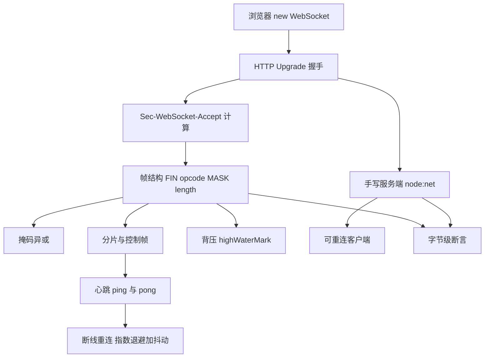
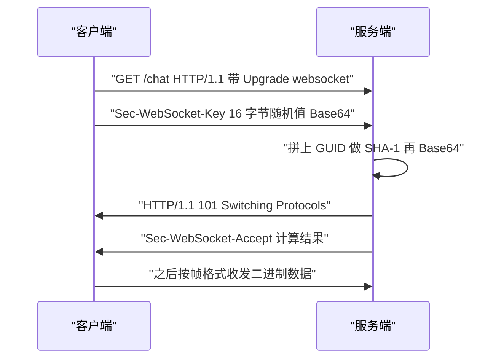
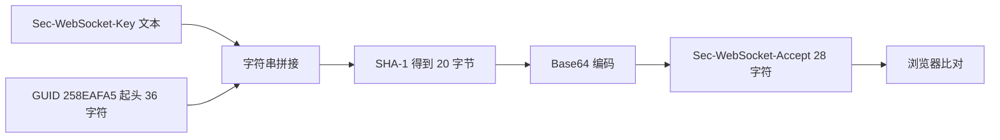
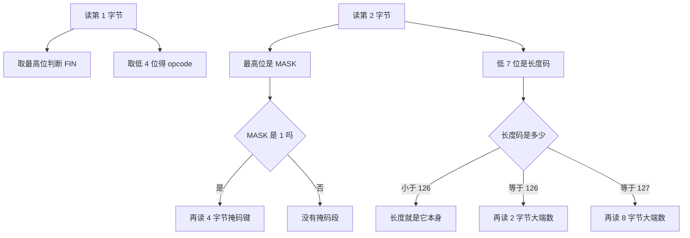
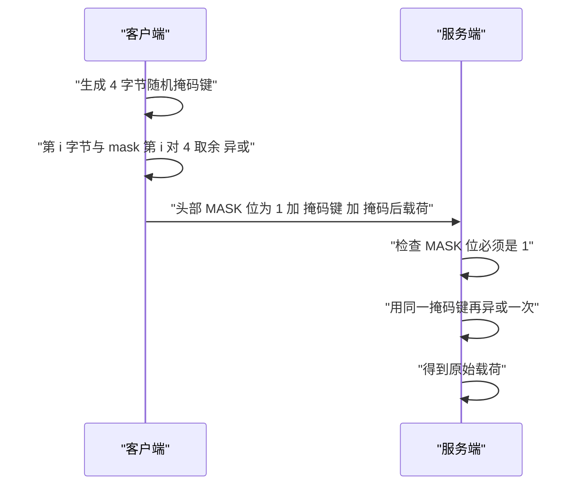
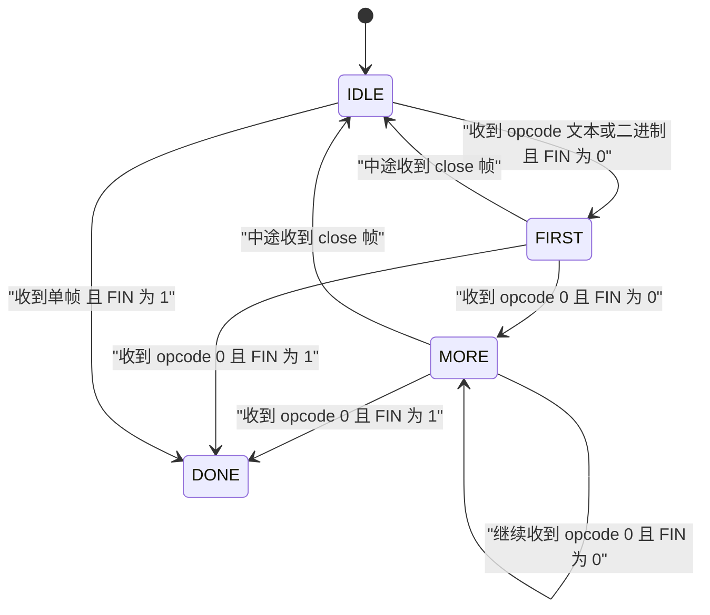
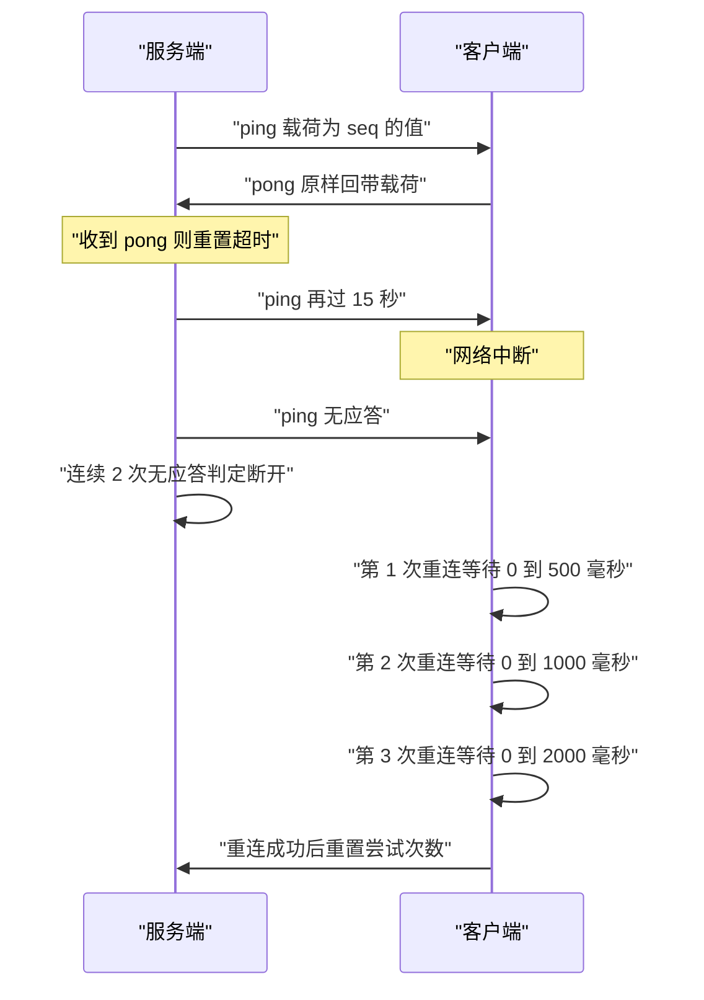
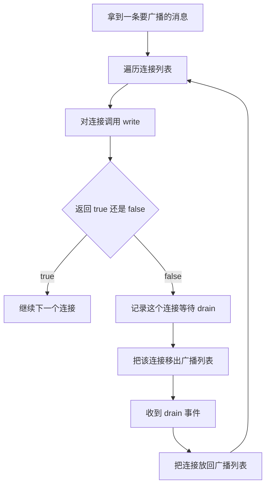
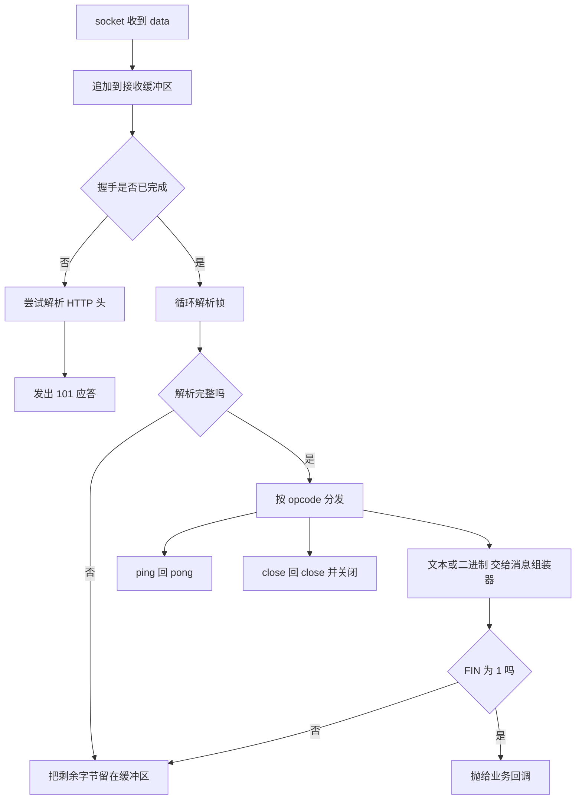
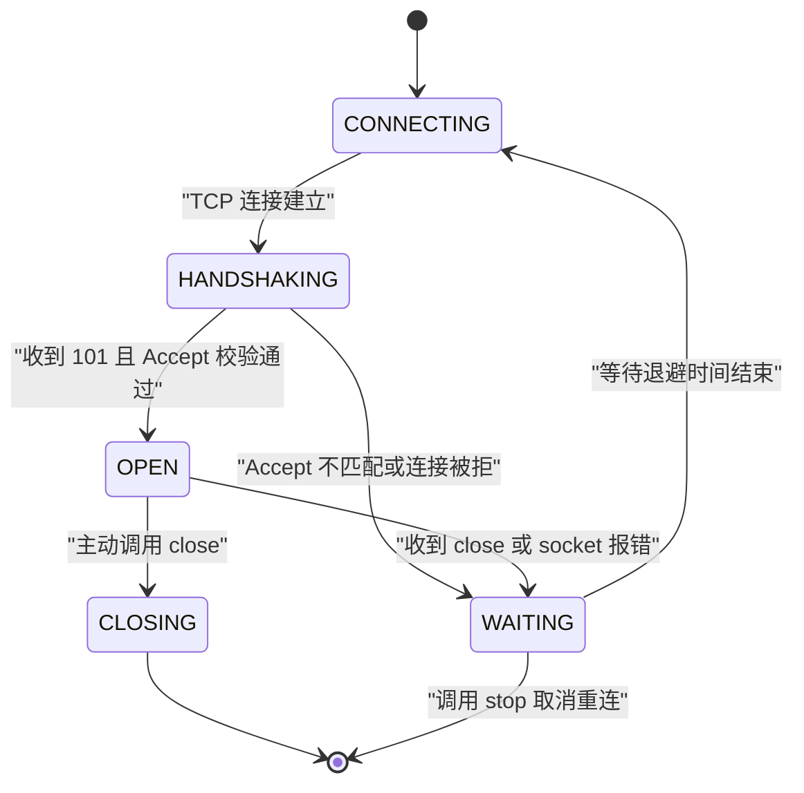

# WebSocket 协议：握手、帧格式与手写服务器

!!! abstract "学完这一页你能"
    - 手算 Sec-WebSocket-Accept：说出 SHA-1 的输入是哪个字符串拼接、输出怎样做 Base64
    - 打开一个帧的前两个字节，指出 FIN、RSV、opcode、MASK、payload length 各占哪几位
    - 用 node:net 写出能完成握手、解帧、组帧、ping 与 pong、close 的服务端
    - 写一个带指数退避加抖动重连的客户端，并用 write 的返回值处理背压

## 0. 知识地图



建议的读法：先用第 1、2 节把连接建立这一步走通，再用第 3、4、5 节把帧的字节布局吃透。

第 6、7 节讲连接建立之后才会遇到的工程问题：心跳与背压。

第 8、9 节把前面所有零件拼成一个服务端和一个客户端，并用断言锁住行为。

!!! note "术语：RFC 6455"
    IETF 发布的 WebSocket 协议规范文档编号，定义了握手、帧格式、关闭流程。例子：本页所有字节布局都来自它第 5.2 节。

## 1. HTTP Upgrade 握手：一行 new WebSocket 背后发了什么

**先想一个问题**

你在浏览器控制台敲 `new WebSocket("ws://127.0.0.1:9001/chat")`。这行代码没有报错就进了 `open` 状态。

可服务端此刻还没有任何 WebSocket 相关代码，它怎么知道要把协议切过去？它又怎么拒绝一个伪造的请求？

!!! note "术语：Upgrade"
    HTTP/1.1 的请求头字段，表示客户端希望把当前连接改成别的协议。例子：`Upgrade: websocket` 表示请求改用 WebSocket。

!!! tip "心智模型"
    一句话模型：握手就是一次普通的 HTTP 请求，客户端在请求头里申请改协议，服务端用 101 状态码批准。
    日常类比：去酒店前台递证件说明要换一种房型，前台盖章同意之后，这条通道归你专用。
    类比不成立的地方：酒店换房型会换房间号，WebSocket 握手成功后 TCP 连接不变、端口不变，只有这条连接上跑的数据格式换了。

**图解**



1. 客户端发一个标准 HTTP 请求，路径是 `/chat`，服务端可以按普通路由规则处理。
2. 请求头里带 `Upgrade: websocket` 和 `Connection: Upgrade`，这两个头共同表达改协议意图。
3. `Sec-WebSocket-Key` 是 16 字节随机数的 Base64 文本，不是加密，作用是让服务端的应答无法被缓存或猜测。
4. `Sec-WebSocket-Version: 13` 是 RFC 6455 的版本号，服务端不认识就回 426。
5. 服务端算出 `Sec-WebSocket-Accept` 并回 101，此后这条 TCP 连接上不再出现 HTTP 报文。
6. 浏览器会自动校验 Accept 值，算错时连接直接失败，控制台给出错误。

**一步一步来**

**第 1 步：拼出客户端握手请求**

这一步只做一件事：把七个字段按 CRLF 拼成一段文本，通过 TCP 发出去。

```js
import crypto from 'node:crypto';

// 生成 16 字节随机数并转 Base64，作为 Sec-WebSocket-Key
const key = crypto.randomBytes(16).toString('base64');

const req = [
  'GET /chat HTTP/1.1',          // 请求行，路径由服务端自行决定
  'Host: 127.0.0.1:9001',        // HTTP/1.1 必须带 Host
  'Upgrade: websocket',          // 声明要升级到的协议名
  'Connection: Upgrade',         // 声明本次连接要改协议
  `Sec-WebSocket-Key: ${key}`,   // 16 字节随机值，Base64 文本
  'Sec-WebSocket-Version: 13',   // RFC 6455 固定版本号
  '', ''                         // 空行表示头部结束，末尾再留一个 CRLF
].join('\r\n');

console.log(JSON.stringify(req.split('\r\n').slice(0, 4)));
```

**这段代码在做什么**

- `crypto.randomBytes(16)` 产出 16 个字节，不是 16 个字符串字符。
- `toString('base64')` 把 16 字节编成 24 个字符，末尾带一个等号。
- `Upgrade` 与 `Connection` 必须成对出现，只写一个时服务端可以合法拒绝。
- `Sec-WebSocket-Version` 是固定值 13，写 8 会得到 426 响应。
- `join('\r\n')` 里的空字符串是为了在末尾拼出两个连续 CRLF。

运行结果：

```text
["GET /chat HTTP/1.1","Host: 127.0.0.1:9001","Upgrade: websocket","Connection: Upgrade"]
```

**第 2 步：服务端校验请求头并回 101**

服务端收到第一段数据后，先判断这是不是握手请求，再决定是否回 101。

```js
import crypto from 'node:crypto';

const GUID = '258EAFA5-E914-47DA-95CA-C5AB0DC85B11'; // RFC 6455 规定的固定字符串

function tryHandshake(text) {
  const lines = text.split('\r\n').filter(Boolean);
  const head = new Map();                       // 用 Map 存头字段，键统一转小写
  for (const line of lines.slice(1)) {
    const i = line.indexOf(':');                // 第一个冒号才是分隔符
    head.set(line.slice(0, i).toLowerCase(), line.slice(i + 1).trim());
  }
  if (head.get('upgrade')?.toLowerCase() !== 'websocket') return null;
  if (head.get('connection')?.toLowerCase() !== 'upgrade') return null;
  const key = head.get('sec-websocket-key');    // 缺这个头就无法计算应答
  if (!key) return null;
  const accept = crypto.createHash('sha1')
    .update(key + GUID).digest('base64');       // 注意是 key 加 GUID，没有分隔符
  return [
    'HTTP/1.1 101 Switching Protocols',
    'Upgrade: websocket',
    'Connection: Upgrade',
    `Sec-WebSocket-Accept: ${accept}`,
    '', ''
  ].join('\r\n');
}

console.log(tryHandshake('GET / HTTP/1.1\r\nUpgrade: websocket\r\nConnection: Upgrade\r\nSec-WebSocket-Key: abc\r\n\r\n').split('\r\n')[0]);
```

**这段代码在做什么**

- `filter(Boolean)` 去掉末尾空行，避免解析到空字符串时报错。
- 头字段名大小写不敏感，统一转小写再比较。
- 冒号切分只取第一个冒号，因为 `Sec-WebSocket-Key` 的 Base64 值里可能出现等号。
- `head.get('connection')` 用可选链，防止头缺失时抛异常。
- 校验失败返回 `null`，调用方应直接断开连接而不是继续解析帧。
- 应答里的 `Sec-WebSocket-Accept` 是服务端凭自己算出来的，不回显客户端给的 key。

运行结果：

```text
HTTP/1.1 101 Switching Protocols
```

**动手验证**

把两步合成一个脚本，保存为 `handshake.mjs`，然后用 `node handshake.mjs` 运行。依赖：只用 Node 20+ 内置模块。

```js
// handshake.mjs 依赖：node:net、node:crypto、node:assert，全部内置
import net from 'node:net';
import crypto from 'node:crypto';
import assert from 'node:assert';

const GUID = '258EAFA5-E914-47DA-95CA-C5AB0DC85B11';

function parseHeaders(text) {
  const head = new Map();
  for (const line of text.split('\r\n').slice(1).filter(Boolean)) {
    const i = line.indexOf(':');
    head.set(line.slice(0, i).toLowerCase(), line.slice(i + 1).trim());
  }
  return head;
}

const server = net.createServer((socket) => {
  socket.once('data', (chunk) => {
    const head = parseHeaders(chunk.toString('latin1'));
    assert.strictEqual(head.get('upgrade').toLowerCase(), 'websocket', '缺少 Upgrade');
    assert.strictEqual(head.get('connection').toLowerCase(), 'upgrade', '缺少 Connection');
    const accept = crypto.createHash('sha1')
      .update(head.get('sec-websocket-key') + GUID).digest('base64');
    socket.write([
      'HTTP/1.1 101 Switching Protocols',
      'Upgrade: websocket',
      'Connection: Upgrade',
      `Sec-WebSocket-Accept: ${accept}`,
      '', ''
    ].join('\r\n'));
  });
});

await new Promise((resolve) => server.listen(9001, '127.0.0.1', resolve));

const key = crypto.randomBytes(16).toString('base64');
const client = net.connect(9001, '127.0.0.1');
client.write([
  'GET /chat HTTP/1.1',
  'Host: 127.0.0.1:9001',
  'Upgrade: websocket',
  'Connection: Upgrade',
  `Sec-WebSocket-Key: ${key}`,
  'Sec-WebSocket-Version: 13',
  '', ''
].join('\r\n'));

const res = await new Promise((resolve) => client.once('data', resolve));
const text = res.toString('latin1');
assert.ok(text.startsWith('HTTP/1.1 101'), '状态行不是 101');
assert.ok(text.toLowerCase().includes('upgrade: websocket'), '缺少 Upgrade 应答');
const expected = crypto.createHash('sha1').update(key + GUID).digest('base64');
assert.ok(text.includes(`Sec-WebSocket-Accept: ${expected}`), 'Accept 不匹配');

console.log('状态行：', text.split('\r\n')[0]);
console.log('Accept：', expected);
client.destroy();
server.close();
```

预期输出：

```text
状态行： HTTP/1.1 101 Switching Protocols
Accept： 3f2vH0d2v2z2Q4Zq0Wk5m6K8x1A=
```

`Accept` 的每次运行值都不同，因为它依赖随机 key。判断成功只看断言是否抛错。

**常见坑**

| 现象 | 原因 | 怎么修 |
| :-- | :-- | :-- |
| 浏览器报 `Unexpected response code: 200` | 服务端当成普通 HTTP 请求处理了 | 在路由最前面判断 `Upgrade` 头，命中就走 101 分支 |
| 连接立刻关闭，无任何提示 | 忘了 `Connection: Upgrade` | 应答里必须同时给 `Upgrade` 与 `Connection: Upgrade` |
| Accept 校验失败 | 把 key 与 GUID 之间加了空格或换行 | 拼接串就是 `key + GUID`，中间不加任何字符 |
| 用 `req.headers.host` 判路由失败 | 升级请求的 Host 含端口 | 比较时先按冒号切掉端口 |

**小结**

- 握手是一次 HTTP 请求加一次 101 响应，之后连接上不再有 HTTP 报文。
- `Sec-WebSocket-Key` 是随机值，服务端只对它做 SHA-1 与 Base64，不做加密。
- 服务端必须在解析帧之前完成握手，否则会把 HTTP 文本当成帧解析。

## 2. Sec-WebSocket-Accept 的计算：SHA-1 加 GUID 加 Base64

**先想一个问题**

客户端的 key 是随机的，服务端要回一个能对上号的值。如果只把 key 原样回显，任何中间层都能伪造这个应答。

RFC 6455 为什么要引入一个固定 GUID 参与运算？

!!! note "术语：Sec-WebSocket-Accept"
    服务端握手应答头，值等于 `Base64(SHA-1(key 与 GUID 拼接))`。例子：RFC 6455 第 1.3 节的官方测试向量。

!!! tip "心智模型"
    一句话模型：Accept 是「key 加上一个公开固定串」的哈希指纹，服务端能算，缓存层算不出。
    日常类比：门禁系统把一个随机号加上公司统一编号算成校验码，只有前台知道算法。
    类比不成立的地方：GUID 是公开写在规范里的，它挡不住懂协议的人，只用于防止 HTTP 缓存和代理误判。

**图解**



1. 输入不是字节流，而是两个字符串按 UTF-8 编码后的拼接。
2. 拼接顺序固定：先是 key，再是 GUID，中间不加分隔符。
3. SHA-1 输出固定 20 字节，写成十六进制是 40 个字符。
4. Base64 把 20 字节编成 28 个字符，末尾带一个等号。
5. 浏览器拿到 101 后自己做一次同样的运算，两侧结果必须逐字符相等。

**一步一步来**

**第 1 步：用官方测试向量验证算法**

RFC 6455 第 1.3 节给了一组固定输入与输出，用它验证代码能避免自说自话。

```js
import crypto from 'node:crypto';

const GUID = '258EAFA5-E914-47DA-95CA-C5AB0DC85B11';
const key = 'dGhlIHNhbXBsZSBub25jZQ==';        // RFC 6455 官方给的示例 key

const sha1 = crypto.createHash('sha1')
  .update(key + GUID)                          // 先拼字符串
  .digest();                                   // 得到 20 字节 Buffer
console.log('SHA-1 字节数：', sha1.length);
console.log('SHA-1 十六进制：', sha1.toString('hex'));
console.log('Accept：', sha1.toString('base64'));
```

**这段代码在做什么**

- `update` 默认按 UTF-8 编码字符串，key 里的等号也被编码进去。
- `digest()` 不带参数时返回 Buffer，方便查看长度和十六进制。
- `toString('base64')` 对 20 字节编码，结果是 28 个字符。
- 官方输出的 Accept 必须是 `s3pPLMBiTxaQ9kYGzzhZRbK+xOo=`。

运行结果：

```text
SHA-1 字节数： 20
SHA-1 十六进制： b37a4f2cc0624f1690f64606cf385945b2bec4ea
Accept： s3pPLMBiTxaQ9kYGzzhZRbK+xOo=
```

**第 2 步：把它封装成握手应答函数**

把常量与算法收进一个函数，服务端每次握手都调用它。

```js
import crypto from 'node:crypto';

const GUID = '258EAFA5-E914-47DA-95CA-C5AB0DC85B11';

export function computeAccept(key) {
  if (typeof key !== 'string' || key.length === 0) {
    throw new TypeError('key 必须是非空字符串');  // 早失败，避免拼出错误应答
  }
  return crypto.createHash('sha1')
    .update(key + GUID)                          // 顺序固定：key 在前
    .digest('base64');                           // 直接输出 Base64 文本
}

console.log(computeAccept('dGhlIHNhbXBsZSBub25jZQ=='));
```

**这段代码在做什么**

- 参数校验放在计算之前，缺 key 时立刻抛错。
- `digest('base64')` 一步完成字节到文本的转换，省掉一次中间 Buffer。
- 函数无副作用，同一 key 永远返回同一结果，方便写断言。
- 不要在这里做 URL 编码，Accept 值只含 Base64 字符集，直接放进头部。

运行结果：

```text
s3pPLMBiTxaQ9kYGzzhZRbK+xOo=
```

**动手验证**

保存为 `accept.mjs`，运行 `node accept.mjs`。依赖：只用 Node 20+ 内置模块。

```js
// accept.mjs 依赖：node:crypto、node:assert，全部内置
import crypto from 'node:crypto';
import assert from 'node:assert';

const GUID = '258EAFA5-E914-47DA-95CA-C5AB0DC85B11';

function computeAccept(key) {
  assert.strictEqual(typeof key, 'string');
  assert.ok(key.length > 0, 'key 不能为空');
  return crypto.createHash('sha1').update(key + GUID).digest('base64');
}

// 用例 1：RFC 6455 官方向量，锁死算法顺序
assert.strictEqual(computeAccept('dGhlIHNhbXBsZSBub25jZQ=='), 's3pPLMBiTxaQ9kYGzzhZRbK+xOo=');

// 用例 2：交换拼接顺序必须得到不同结果，证明顺序敏感
const reversed = crypto.createHash('sha1')
  .update(GUID + 'dGhlIHNhbXBsZSBub25jZQ==').digest('base64');
assert.notStrictEqual(reversed, 's3pPLMBiTxaQ9kYGzzhZRbK+xOo=');

// 用例 3：输出长度固定 28 字符，末尾一个等号
const accept = computeAccept('AAAAAAAAAAAAAAAAAAAAAA==');
assert.strictEqual(accept.length, 28);
assert.ok(accept.endsWith('='));

console.log('官方向量：', computeAccept('dGhlIHNhbXBsZSBub25jZQ=='));
console.log('顺序反拼：', reversed);
console.log('随机 key 结果长度：', accept.length);
```

预期输出：

```text
官方向量： s3pPLMBiTxaQ9kYGzzhZRbK+xOo=
顺序反拼： 5Xq0a8m4mZtv0Hf3Vh5cxDCMS9E=
随机 key 结果长度： 28
```

**常见坑**

| 现象 | 原因 | 怎么修 |
| :-- | :-- | :-- |
| Accept 长度是 27 或 29 | 用了 MD5 或 SHA-256 | 校验哈希输出长度必须是 20 字节 |
| 官方向量对不上 | 忘记 GUID 末尾的 `11` | 常量字符串逐字符比对，长度为 36 |
| 中文注释导致编译失败 | 文件编码不是 UTF-8 | 保存为 UTF-8，Node 默认按 UTF-8 读取源码 |
| 断言全通过但浏览器仍报错 | 应答头里多了空格 | 头部格式是 `名字冒号空格值`，值本身不做 trim 之外的改动 |

**小结**

- 先拼字符串再哈希，拼接顺序是 key 在前、GUID 在后。
- SHA-1 输出 20 字节，Base64 后固定 28 字符。
- 官方测试向量是唯一能证明实现正确的固定标尺。

## 3. 帧结构：FIN、opcode、MASK 与三档长度

**先想一个问题**

握手完成后，一条消息要从客户端发到服务端。TCP 是字节流，没有消息边界。

接收方怎么知道「这一条消息到这里结束了」？

!!! note "术语：帧"
    WebSocket 传输的最小结构单元，由 2 到 14 字节头部与载荷组成。例子：一条 5 字节的文本消息放在一个帧里发送。

!!! note "术语：opcode"
    帧头里的 4 位操作码，表示这一帧是文本、二进制还是控制帧。例子：`0x1` 是文本帧，`0x8` 是关闭帧。

!!! note "术语：payload length"
    帧头里表示载荷字节数的字段，按大小分成 7 位、16 位、64 位三种编码。例子：载荷 200 字节时必须用 16 位那档。

!!! tip "心智模型"
    一句话模型：帧头用位运算把「这是最后一片吗」「这是什么类型」「有多长」「有没有加掩码」压进前两个字节。
    日常类比：快递单上印着「本箱是最后一箱」「内含易碎品」「总重」「是否保价」四个勾选格。
    类比不成立的地方：快递单可以分开写，帧头必须在固定位置，多一个字节接收方就会错位读后面所有数据。

**图解**



1. 先读第 1 字节，最高位是 FIN，低 4 位是 opcode，中间 3 位是 RSV。
2. RSV 三位在 RFC 6455 里必须全为 0，没有协商扩展时不为 0 就断开连接。
3. 再读第 2 字节，最高位是 MASK，低 7 位是长度码。
4. 长度码小于 126 时它就是真实长度，这一档能表示 0 到 125。
5. 长度码等于 126 时后面跟 2 字节大端无符号整数，范围 126 到 65535。
6. 长度码等于 127 时后面跟 8 字节大端无符号整数，用于 65536 字节以上。
7. 有掩码时再读 4 字节掩码键，之后才是载荷。

**一步一步来**

**第 1 步：把头部字段按位取出来**

先只解析头部，不碰载荷，便于单独验证。

```js
function readHeader(buf) {
  const b0 = buf[0];                            // 第 1 字节
  const b1 = buf[1];                            // 第 2 字节
  const fin = (b0 & 0b10000000) === 0b10000000; // 最高位是 FIN
  const rsv = (b0 & 0b01110000) >> 4;           // 中间 3 位是 RSV
  const opcode = b0 & 0b00001111;               // 低 4 位是 opcode
  const masked = (b1 & 0b10000000) === 0b10000000;
  const lenCode = b1 & 0b01111111;              // 低 7 位是长度码
  return { fin, rsv, opcode, masked, lenCode };
}

console.log(readHeader(Buffer.from([0x81, 0x85])));
```

**这段代码在做什么**

- `0b` 前缀写二进制字面量，能直接对着 RFC 的位图读。
- `&` 是掩码提取，`>>` 是右移到最低位。
- FIN 与 MASK 都是布尔值，参与后续逻辑判断。
- rsv 正常情况下是 0，非 0 说明对端用了未协商的扩展。
- 这里没有校验 buf 长度，调用方必须先保证至少 2 字节可用。

运行结果：

```text
{ fin: true, rsv: 0, opcode: 1, masked: true, lenCode: 5 }
```

**第 2 步：按长度码决定读几个字节**

长度码只是「档位」，真实长度还要看是否接着读额外字节。

```js
function readLength(buf, lenCode, start) {
  if (lenCode < 126) {
    return { length: lenCode, next: start };    // 长度码本身就是长度
  }
  if (lenCode === 126) {
    return { length: buf.readUInt16BE(start), next: start + 2 };
  }
  if (lenCode === 127) {
    const big = buf.readBigUInt64BE(start);     // 用 BigInt 读 8 字节
    return { length: Number(big), next: start + 8 };
  }
  throw new RangeError('长度码非法：' + lenCode);  // 7 位只能取 0 到 127
}

const q = readLength(Buffer.from([0x00, 0x00, 0x7e, 0x01, 0x00]), 126, 0);
console.log(q);
```

**这段代码在做什么**

- 三档用 `if` 分支区分，避免把长度码当成真实长度。
- `readUInt16BE` 读 2 字节大端，网络字节序固定为大端。
- 64 位那一档用 `readBigUInt64BE`，因为 JS 的 Number 只能精确表示到 2 的 53 次方。
- `Number(big)` 在超过 2 的 53 次方时会丢精度，实际服务端应设置最大载荷上限并提前拒绝。
- `next` 返回下一个待读位置，调用方拿它继续读掩码键或载荷。

运行结果：

```text
{ length: 256, next: 2 }
```

**第 3 步：组一个服务端发出的帧**

服务端发往客户端的帧不加掩码，头部长度按同一规则选择。

```js
function encodeFrame(payload, opcode = 0x1, fin = true) {
  const data = Buffer.isBuffer(payload) ? payload : Buffer.from(payload);
  const head = [(fin ? 0x80 : 0x00) | opcode];  // FIN 与 opcode 合成第 1 字节
  if (data.length < 126) {
    head.push(data.length);                     // 7 位能装下
  } else if (data.length < 65536) {
    head.push(126, data.length >> 8, data.length & 0xff); // 16 位大端
  } else {
    const big = Buffer.alloc(8);                // 8 字节大端
    big.writeBigUInt64BE(BigInt(data.length));
    head.push(127, ...big);
  }
  return Buffer.concat([Buffer.from(head), data]);
}

console.log([...encodeFrame('hi')].map((n) => n.toString(16)));
```

**这段代码在做什么**

- 第 1 字节由 FIN 位与 opcode 通过按位或合成。
- `data.length < 126` 时直接把长度写进第 2 字节。
- 16 位那一档用 `>> 8` 取高字节、`& 0xff` 取低字节。
- 64 位那一档必须先构造 8 字节 Buffer，再展开进头部数组。
- `Buffer.concat` 把头部与载荷拼成一段连续字节，便于一次 write。

运行结果：

```text
[ '81', '2', '68', '69' ]
```

**动手验证**

保存为 `frame-header.mjs`，运行 `node frame-header.mjs`。依赖：只用 Node 20+ 内置模块。

```js
// frame-header.mjs 依赖：node:assert，全部内置
import assert from 'node:assert';

function encodeFrame(payload, opcode = 0x1, fin = true) {
  const data = Buffer.isBuffer(payload) ? payload : Buffer.from(payload);
  const head = [(fin ? 0x80 : 0x00) | opcode];
  if (data.length < 126) {
    head.push(data.length);
  } else if (data.length < 65536) {
    head.push(126, data.length >> 8, data.length & 0xff);
  } else {
    const big = Buffer.alloc(8);
    big.writeBigUInt64BE(BigInt(data.length));
    head.push(127, ...big);
  }
  return Buffer.concat([Buffer.from(head), data]);
}

// 用例 1：2 字节文本帧，头部恰好 2 字节
assert.deepStrictEqual([...encodeFrame('hi')], [0x81, 0x02, 0x68, 0x69]);

// 用例 2：125 字节仍走 7 位档，头部 2 字节
assert.deepStrictEqual([...encodeFrame('a'.repeat(125)).subarray(0, 2)], [0x81, 0x7d]);

// 用例 3：126 字节切到 16 位档，头部 4 字节
assert.deepStrictEqual([...encodeFrame('a'.repeat(126)).subarray(0, 4)], [0x81, 0x7e, 0x00, 0x7e]);

// 用例 4：1200 字节的 16 位编码是 0x04B0
assert.deepStrictEqual([...encodeFrame('a'.repeat(1200)).subarray(0, 4)], [0x81, 0x7e, 0x04, 0xb0]);

// 用例 5：65536 字节切到 64 位档，后 8 字节是 0x0000000000010000
const huge = encodeFrame('a'.repeat(65536));
assert.deepStrictEqual([...huge.subarray(0, 10)], [0x81, 0x7f, 0, 0, 0, 0, 0, 1, 0, 0]);

// 用例 6：分片帧 FIN 为 0，第 1 字节变成 0x01
assert.strictEqual(encodeFrame('a', 0x1, false)[0], 0x01);

console.log('2 字节文本帧头部：', [...encodeFrame('hi').subarray(0, 2)]);
console.log('126 字节帧头部：', [...encodeFrame('a'.repeat(126)).subarray(0, 4)]);
console.log('65536 字节帧头部：', [...huge.subarray(0, 10)]);
console.log('六个字节级用例全部通过');
```

预期输出：

```text
2 字节文本帧头部： [ 129, 2 ]
126 字节帧头部： [ 129, 126, 0, 126 ]
65536 字节帧头部： [ 129, 127, 0, 0, 0, 0, 0, 1, 0, 0 ]
六个字节级用例全部通过
```

**常见坑**

| 现象 | 原因 | 怎么修 |
| :-- | :-- | :-- |
| 解析第二条消息时全乱 | 用 16 位档却按 7 位读了长度 | 先看长度码再决定读几个字节 |
| 大载荷帧解析出的长度是负数 | `readUInt32BE` 读了 8 字节档 | 64 位档必须用 `readBigUInt64BE` |
| 客户端发送后服务端读不到内容 | 服务端解析时没跳过 4 字节掩码键 | 先读掩码键再读载荷 |
| 帧头正确但浏览器断开 | RSV 位被置成了非 0 | 组帧时第 1 字节只写 FIN 与 opcode |

**小结**

- 前两个字节承载全部头部标志与长度档位，读错一个位后面全错。
- 长度分 7 位、16 位、64 位三档，边界是 125 与 65535。
- 64 位长度在 JS 里要用 BigInt 读，再配合自定义最大载荷上限。

## 4. 掩码异或：客户端为什么必须打乱载荷

**先想一个问题**

一个网页连上聊天服务端，同时浏览器里还开着别的网页连同一个服务端。

如果客户端发的所有字节都是明文原样，中间任何一个能猜到内容的代理都可能被误导。

RFC 6455 用掩码做什么？

!!! note "术语：掩码键"
    客户端帧里 4 字节随机值，用来与载荷逐字节异或。例子：键是 `01 02 03 04`，载荷 `68 69` 掩码后是 `69 6b`。

!!! tip "心智模型"
    一句话模型：客户端把载荷与一个 4 字节随机键逐字节异或，服务端收到后用同一个键再异或一次还原。
    日常类比：同一批货每次用不同颜色的包装纸包一遍，收件人按颜色编号拆开。
    类比不成立的地方：包装只是遮挡，异或是对每个字节做数值运算，且「拆包」的动作与「打包」完全相同。

**图解**



1. 客户端为每个帧单独生成 4 字节随机键，可以复用同一段内存但必须换值。
2. 第 i 个载荷字节与掩码键的第 `i % 4` 个字节做异或。
3. 发送时先写头部，MASK 位必须为 1，接着写 4 字节键，最后写掩码后的载荷。
4. 服务端读帧时看到 MASK 为 0 就直接断开，因为 RFC 6455 要求客户端必须加掩码。
5. 服务端用同一个键对收到的载荷再异或一次，还原出原始字节。
6. 服务端发往客户端的帧不加掩码，MASK 位为 0，也没有掩码键段。

**一步一步来**

**第 1 步：写一个能复用的异或函数**

打包与拆包用的是同一个运算，所以只写一个函数。

```js
function applyMask(data, mask) {
  const out = Buffer.alloc(data.length);        // 新建 Buffer，不改动入参
  for (let i = 0; i < data.length; i += 1) {
    out[i] = data[i] ^ mask[i % 4];             // 掩码键按 4 循环使用
  }
  return out;
}

const mask = Buffer.from([0x01, 0x02, 0x03, 0x04]);
const masked = applyMask(Buffer.from('hi'), mask);
console.log('掩码后：', [...masked]);
console.log('还原后：', applyMask(masked, mask).toString());
```

**这段代码在做什么**

- 异或满足交换律与自反性，同一个运算做两次就还原。
- `i % 4` 让掩码键在载荷长度超过 4 时循环使用。
- 新建 Buffer 而不是原地改，避免调用方数据被意外破坏。
- 掩码键每次都应重新随机生成，写死常量会让掩码失去意义。

运行结果：

```text
掩码后： [ 105, 107 ]
还原后： hi
```

**第 2 步：把掩码写进客户端组帧**

客户端组帧比服务端多了「MASK 位置 1」与「追加掩码键」两件事。

```js
import crypto from 'node:crypto';

function encodeClientFrame(payload, opcode = 0x1) {
  const data = Buffer.isBuffer(payload) ? payload : Buffer.from(payload);
  const mask = crypto.randomBytes(4);           // 每帧新随机键
  const masked = Buffer.alloc(data.length);
  for (let i = 0; i < data.length; i += 1) masked[i] = data[i] ^ mask[i % 4];
  const head = [0x80 | opcode];                 // 文本帧 FIN 置 1
  if (masked.length < 126) {
    head.push(0x80 | masked.length);            // MASK 位与长度合进第 2 字节
  } else {
    head.push(0x80 | 126, masked.length >> 8, masked.length & 0xff);
  }
  return Buffer.concat([Buffer.from(head), mask, masked]);
}

const frame = encodeClientFrame('hi');
console.log('总字节数：', frame.length);
console.log('前两字节：', [frame[0], frame[1]]);
```

**这段代码在做什么**

- MASK 位是第 2 字节的最高位，所以用 `0x80` 按位或。
- 掩码键紧跟头部，然后才是掩码后的载荷，顺序不能颠倒。
- 2 字节载荷加 2 字节头部加 4 字节键，总长是 8 字节。
- 第 2 字节的低 7 位仍是长度，这里等于 2，合成后是 `0x82`。

运行结果：

```text
总字节数： 8
前两字节： [ 129, 130 ]
```

**动手验证**

保存为 `mask.mjs`，运行 `node mask.mjs`。依赖：只用 Node 20+ 内置模块。

```js
// mask.mjs 依赖：node:crypto、node:assert，全部内置
import crypto from 'node:crypto';
import assert from 'node:assert';

function applyMask(data, mask) {
  const out = Buffer.alloc(data.length);
  for (let i = 0; i < data.length; i += 1) out[i] = data[i] ^ mask[i % 4];
  return out;
}

function encodeClientFrame(payload, opcode = 0x1) {
  const data = Buffer.isBuffer(payload) ? payload : Buffer.from(payload);
  const mask = crypto.randomBytes(4);
  const masked = applyMask(data, mask);
  const head = [0x80 | opcode];
  if (masked.length < 126) head.push(0x80 | masked.length);
  else head.push(0x80 | 126, masked.length >> 8, masked.length & 0xff);
  return Buffer.concat([Buffer.from(head), mask, masked]);
}

function decodeClientFrame(buf) {
  const masked = (buf[1] & 0x80) === 0x80;
  assert.ok(masked, '客户端帧必须带掩码');
  const len = buf[1] & 0x7f;
  const start = 2;
  const mask = buf.subarray(start, start + 4);
  const body = buf.subarray(start + 4, start + 4 + len);
  return { opcode: buf[0] & 0x0f, data: applyMask(body, mask) };
}

// 用例 1：自反性，两次异或还原
const mask = Buffer.from([0x01, 0x02, 0x03, 0x04]);
assert.strictEqual(applyMask(applyMask(Buffer.from('hi'), mask), mask).toString(), 'hi');

// 用例 2：固定键的字节级结果
assert.deepStrictEqual([...applyMask(Buffer.from([0x68, 0x69]), mask)], [0x69, 0x6b]);

// 用例 3：客户端帧 MASK 位为 1，解码能还原原文
const frame = encodeClientFrame('hello 掩码');
assert.strictEqual(frame[1] & 0x80, 0x80);
const decoded = decodeClientFrame(frame);
assert.strictEqual(decoded.opcode, 0x1);
assert.strictEqual(decoded.data.toString(), 'hello 掩码');

// 用例 4：长度 200 走 16 位档，MASK 位仍然保留
const long = encodeClientFrame('x'.repeat(200));
assert.strictEqual(long[1] & 0x80, 0x80);
assert.strictEqual(long[1] & 0x7f, 126);
assert.strictEqual(long.readUInt16BE(2), 200);

// 用例 5：长度 200 的完整解码
assert.strictEqual(decodeClientFrame(long).data.length, 200);

console.log('掩码自反性：通过');
console.log('客户端帧前两字节：', [frame[0], frame[1]]);
console.log('解码结果：', decoded.data.toString());
console.log('五个用例全部通过');
```

预期输出：

```text
掩码自反性：通过
客户端帧前两字节： [ 129, 133 ]
解码结果： hello 掩码
五个用例全部通过
```

**常见坑**

| 现象 | 原因 | 怎么修 |
| :-- | :-- | :-- |
| 服务端读出乱码 | 忘了按 `i % 4` 循环使用掩码键 | 下标取模 4，不要只用第一个字节 |
| 大载荷解码后前四个字节对、后面乱 | 掩码键在长载荷里没有循环 | 用循环变量对 4 取模 |
| 服务端主动发帧被浏览器断开 | 服务端给帧加了掩码 | 服务端帧 MASK 位保持 0 |
| 解出的中文变成问号 | 先 `toString` 再异或 | 先对 Buffer 异或，最后再按 UTF-8 解码 |

**小结**

- 客户端帧必须加掩码，服务端帧必须不加，两者方向不对称。
- 掩码就是按字节异或，键按 4 字节循环使用。
- 异或是自反运算，打包与解包可以共用同一个函数。

## 5. 分片与控制帧：ping、pong、close 怎么插队

**先想一个问题**

你要发一段 10MB 的日志。一次性组一个帧会占用 10MB 内存，中间还得等它写完。

同一时间，对端想知道你还活着，发了一个 ping。这个 ping 要排在 10MB 后面等吗？

!!! note "术语：分片"
    把一条消息拆成多个帧传输，首帧 opcode 是消息类型，后续帧 opcode 为 0。例子：10MB 日志拆成每片 64KB。

!!! note "术语：控制帧"
    opcode 从 0x8 到 0xF 的帧，用于连接管理而不是传数据。例子：`0x9` 是 ping，`0xA` 是 pong。

!!! tip "心智模型"
    一句话模型：数据帧可以分片慢慢发，控制帧不能分片并允许插在分片序列中间。
    日常类比：寄一套丛书分多个箱子，快递员可以中途插进来一张签收单，但签收单不能撕成两半。
    类比不成立的地方：控制帧不是「插队发送」，接收方按字节顺序读，只是协议允许它出现在数据分片之间而不算破坏消息。

**图解**



1. 单帧消息从 IDLE 直接到 DONE，FIN 为 1 表示这条消息完整。
2. 分片消息先进入 FIRST，此时 opcode 是真实类型，FIN 为 0。
3. 后续片进入 MORE，opcode 固定为 0，收到 FIN 为 1 的片才结束。
4. 分片序列进行到一半时收到 close 帧，整个消息作废并回到 IDLE。
5. ping 与 pong 可以出现在 FIRST 或 MORE 状态，处理完继续等下一片。
6. 控制帧的 FIN 必须为 1，载荷不超过 125 字节。

**一步一步来**

**第 1 步：实现一个能跨分片拼接的消息组装器**

它接收解析后的帧，输出完整消息，并单独暴露控制帧。

```js
function createAssembler() {
  let opcode = null;                            // 当前消息的类型
  let chunks = [];                              // 已收分片的载荷

  return function push(frame) {
    if (frame.opcode >= 0x8) {                  // 控制帧不进分片序列
      return { type: 'control', frame };
    }
    if (frame.opcode !== 0x0) {                 // 非 0 就是新消息的首帧
      opcode = frame.opcode;
      chunks = [frame.data];
    } else if (opcode !== null) {
      chunks.push(frame.data);                  // 续帧，追加到同一个序列
    } else {
      throw new Error('收到孤立的续帧');          // 没有首帧就出现续帧是协议错误
    }
    if (!frame.fin) return { type: 'partial' }; // 还没收完
    const payload = Buffer.concat(chunks);      // 拼成完整载荷
    const done = { type: 'message', opcode, data: payload };
    opcode = null;
    chunks = [];
    return done;
  };
}

const push = createAssembler();
console.log(push({ fin: false, opcode: 0x1, data: Buffer.from('he' ) }));
console.log(push({ fin: true, opcode: 0x0, data: Buffer.from('llo') }));
```

**这段代码在做什么**

- 控制帧直接返回，不写入 `chunks`，所以不会污染数据消息。
- `opcode !== 0` 判断首帧，同时重置上一次的残留状态。
- 续帧在 `opcode` 为 null 时抛错，这种帧在协议上是非法的。
- `fin` 为 0 时返回 partial，调用方继续等后续帧。
- 拼好的消息带回原 opcode，调用方据此决定按文本还是二进制解码。

运行结果：

```text
{ type: 'partial' }
{ type: 'message', opcode: 1, data: <Buffer 68 65 6c 6c 6f> }
```

**第 2 步：处理 ping 与 pong**

收到 ping 必须尽快回一个 pong，载荷要与 ping 相同。

```js
function handleControl(frame, send) {
  if (frame.opcode === 0x9) {                   // ping
    send(0xa, frame.data);                      // pong 必须回带同样的载荷
    return 'pong-sent';
  }
  if (frame.opcode === 0xa) {                   // pong
    return 'alive';                             // 说明对端还在，重置超时计时
  }
  if (frame.opcode === 0x8) {                   // close
    return 'closed';
  }
  return 'unknown';
}

const sent = [];
console.log(handleControl({ opcode: 0x9, data: Buffer.from('hb') }, (op, data) => sent.push([op, data])));
console.log(sent);
```

**这段代码在做什么**

- ping 的 opcode 是 9，pong 是 10，两者载荷上限都是 125 字节。
- 回 pong 时把 ping 的载荷原样带回，对端可据此配对。
- 收到 pong 表示连接可用，调用方应重置自己的心跳超时。
- close 帧需要走关闭流程，先回一个 close 再关 TCP。
- 未识别的控制帧按协议应断开连接，不要静默忽略。

运行结果：

```text
pong-sent
[ [ 10, <Buffer 68 62> ] ]
```

**第 3 步：关闭握手与状态码**

关闭是双向的，一方发 close，另一方回 close，然后才关 TCP。

```js
const CLOSE_REASONS = {
  1000: '正常关闭',
  1001: '端点离开',
  1002: '协议错误',
  1006: '连接异常断开，不能出现在帧里'
};

function buildClose(code = 1000, reason = '') {
  const reasonBuf = Buffer.from(reason, 'utf8');
  const body = Buffer.alloc(2 + reasonBuf.length);
  body.writeUInt16BE(code, 0);                  // 前 2 字节是状态码
  reasonBuf.copy(body, 2);                      // 后面是 UTF-8 原因
  return { opcode: 0x8, data: body };           // 控制帧载荷不超过 125 字节
}

const close = buildClose(1000, '正常关闭');
console.log('载荷长度：', close.data.length);
console.log('状态码：', close.data.readUInt16BE(0));
console.log('原因：', close.data.subarray(2).toString());
console.log('1006 含义：', CLOSE_REASONS[1006]);
```

**这段代码在做什么**

- close 帧的载荷为空表示没有状态码，这时默认按 1005 处理。
- 有状态码时前 2 字节是大端无符号整数，之后是可选的 UTF-8 原因。
- 原因字符串加上 2 字节状态码不能超过 125 字节，超长要截断。
- 1006 是本地观测到的异常断开，禁止在帧里发送它。
- 发出 close 后仍要读完对端可能已经发出的数据，不能立刻 `destroy`。

运行结果：

```text
载荷长度： 14
状态码： 1000
原因： 正常关闭
1006 含义： 连接异常断开，不能出现在帧里
```

**动手验证**

保存为 `fragment.mjs`，运行 `node fragment.mjs`。依赖：只用 Node 20+ 内置模块。

```js
// fragment.mjs 依赖：node:assert，全部内置
import assert from 'node:assert';

function createAssembler() {
  let opcode = null;
  let chunks = [];
  return function push(frame) {
    if (frame.opcode >= 0x8) return { type: 'control', frame };
    if (frame.opcode !== 0x0) { opcode = frame.opcode; chunks = [frame.data]; }
    else if (opcode !== null) chunks.push(frame.data);
    else throw new Error('收到孤立的续帧');
    if (!frame.fin) return { type: 'partial' };
    const payload = Buffer.concat(chunks);
    const done = { type: 'message', opcode, data: payload };
    opcode = null; chunks = [];
    return done;
  };
}

// 用例 1：三片文本拼成一条消息
const push1 = createAssembler();
assert.strictEqual(push1({ fin: false, opcode: 0x1, data: Buffer.from('a') }).type, 'partial');
assert.strictEqual(push1({ fin: false, opcode: 0x0, data: Buffer.from('b') }).type, 'partial');
const msg1 = push1({ fin: true, opcode: 0x0, data: Buffer.from('c') });
assert.strictEqual(msg1.type, 'message');
assert.strictEqual(msg1.data.toString(), 'abc');
assert.strictEqual(msg1.opcode, 0x1);

// 用例 2：ping 插在分片中间，不破坏消息
const push2 = createAssembler();
push2({ fin: false, opcode: 0x2, data: Buffer.from([1, 2]) });
const ctl = push2({ fin: true, opcode: 0x9, data: Buffer.from('hb') });
assert.strictEqual(ctl.type, 'control');
assert.strictEqual(ctl.frame.opcode, 0x9);
const msg2 = push2({ fin: true, opcode: 0x0, data: Buffer.from([3]) });
assert.strictEqual(msg2.opcode, 0x2);
assert.deepStrictEqual([...msg2.data], [1, 2, 3]);

// 用例 3：孤立续帧必须抛错
assert.throws(() => createAssembler()({ fin: true, opcode: 0x0, data: Buffer.alloc(0) }));

// 用例 4：close 帧载荷布局
const body = Buffer.alloc(2 + Buffer.byteLength('bye'));
body.writeUInt16BE(1001, 0);
Buffer.from('bye').copy(body, 2);
assert.strictEqual(body.readUInt16BE(0), 1001);
assert.strictEqual(body.subarray(2).toString(), 'bye');
assert.ok(body.length <= 125);

console.log('三片拼接：', msg1.data.toString());
console.log('ping 插队后消息：', msg2.data.toString('hex'));
console.log('close 载荷：', [...body]);
console.log('四个用例全部通过');
```

预期输出：

```text
三片拼接： abc
ping 插队后消息： 010203
close 载荷： [ 3, 233, 98, 121, 101 ]
四个用例全部通过
```

**常见坑**

| 现象 | 原因 | 怎么修 |
| :-- | :-- | :-- |
| 收到续帧时报错 | 分片状态机在控制帧后清零了 | 控制帧处理路径不要动分片状态 |
| 长消息只收到第一片 | 分片解析时把每条帧当成完整消息 | 用 `fin` 判断是否结束，累积 `chunks` |
| 服务端回 pong 被浏览器拒绝 | pong 载荷与 ping 不一致或超 125 字节 | 原样回带载荷，控制帧载荷控制在 125 字节内 |
| 关闭时对端收到 1006 | 发送 close 后立刻销毁 socket | 先发 close，等对端 close 或超时后再销毁 |

**小结**

- 分片的判断依据是 FIN 与 opcode 的组合，不是 TCP 分段。
- 控制帧不参与分片，可以出现在分片序列中间。
- close 是双向握手，1006 只能本地观测、不能发出去。

## 6. 心跳与断线重连：指数退避加抖动

**先想一个问题**

服务端每 15 秒发一个 ping，客户端回 pong。某天办公室断网 3 秒，客户端的连接对象还停在 `OPEN`。

它怎么知道自己已经断了，又该隔多久重连？

!!! note "术语：心跳"
    应用层定时发送 ping 帧并等待 pong 帧，用来判断链路是否还能用。例子：每 15 秒 ping 一次，30 秒收不到 pong 就判定断开。

!!! note "术语：指数退避"
    每次失败后把等待时间乘以一个固定倍数。例子：0.5 秒、1 秒、2 秒、4 秒，直到上限。

!!! note "术语：抖动"
    在退避算出的等待时间上加一个随机偏移，避免多个客户端同时重连。例子：理论上等 4 秒，实际等 0 到 4 秒之间的随机值。

!!! tip "心智模型"
    一句话模型：心跳负责发现断开，退避加抖动负责在发现断开后错开重连时间。
    日常类比：电梯满员后提示牌显示「请稍候」，每个人等待时间略有不同，避免同时往里挤。
    类比不成立的地方：退避的等待时间是算出来的确定上界，抖动只在区间内取随机值，不会无限增长。

**图解**



1. 服务端按固定周期发 ping，载荷带一个自增序号。
2. 客户端收到 ping 立刻回 pong，载荷原样带回。
3. 服务端收到对应的 pong 就重置超时计时。
4. 连续两次没有收到 pong 就判定这条连接不可用。
5. 客户端检测到关闭后开始重连，第一次等待时间在 0 到 500 毫秒之间随机。
6. 之后每次等待上界翻倍，直到 30 秒上限，重连成功后把尝试次数清零。

**一步一步来**

**第 1 步：算出带抖动的等待时间**

先只实现纯函数，便于写断言。

```js
function backoffDelay(attempt, base = 500, cap = 30000, random = Math.random) {
  const ceiling = Math.min(cap, base * 2 ** attempt); // 计算本次等待上界
  return Math.floor(random() * ceiling);              // 在上界内均匀取一个值
}

for (let i = 0; i < 5; i += 1) {
  console.log('第', i, '次上界', Math.min(30000, 500 * 2 ** i));
}
console.log('一次采样：', backoffDelay(3, 500, 30000, () => 0.5));
```

**这段代码在做什么**

- `base * 2 ** attempt` 让上界按 500、1000、2000、4000 增长。
- `Math.min(cap, ...)` 把上界压在 30 秒，避免无限增长。
- 注入 `random` 参数后可以用固定值测试，输出可复现。
- `Math.floor` 保证返回整数毫秒。
- 上界是 30 秒，实际值是 0 到 30 秒之间的随机数。

运行结果：

```text
第 0 次上界 500
第 1 次上界 1000
第 2 次上界 2000
第 3 次上界 4000
第 4 次上界 8000
一次采样： 2000
```

**第 2 步：用一个可取消的定时器串起重连**

每次重连前先等一段时间，成功或主动关闭都要能取消。

```js
function createReconnector(connect, onState, random = Math.random) {
  let attempt = 0;                              // 连续失败次数
  let timer = null;                             // 当前的等待定时器

  function schedule() {
    const wait = Math.floor(random() * Math.min(30000, 500 * 2 ** attempt));
    onState('waiting', wait);
    timer = setTimeout(() => {
      attempt += 1;                             // 先加次数再连，失败时下次等待上界翻倍
      connect().then(() => { attempt = 0; onState('open'); })   // 成功就清零
                 .catch(() => schedule());      // 失败就再排一次
    }, wait);
  }

  return {
    start: schedule,
    stop: () => { if (timer) clearTimeout(timer); timer = null; }
  };
}

console.log(typeof createReconnector(() => Promise.resolve(), () => {}).start);
```

**这段代码在做什么**

- `attempt` 记录连续失败次数，只有连上才清零。
- `timer` 保存定时器句柄，`stop` 时能取消等待中的重连。
- `onState` 是回调，调用方可以据此更新界面上的连接状态。
- 每次失败后递归调用 `schedule`，上界随 `attempt` 翻倍。
- `connect` 返回 Promise，成功与失败分别走两条分支。

运行结果：

```text
function
```

**第 3 步：把心跳与重连接在一起**

客户端在收到 close 或连接报错时触发重连，收到 pong 时重置心跳计时。

```js
function createHeartbeat(send, timeoutMs = 30000, intervalMs = 15000) {
  let last = Date.now();                        // 最近一次收到 pong 的时间
  let seq = 0;                                  // ping 序号，便于配对
  const timer = setInterval(() => {
    if (Date.now() - last > timeoutMs) {        // 超时判定断开
      clearInterval(timer);
      return;
    }
    send(0x9, Buffer.from(String(seq)));        // 发 ping，载荷是序号
    seq += 1;
  }, intervalMs);
  return {
    onPong: () => { last = Date.now(); },        // 收到 pong 就刷新时间
    stop: () => clearInterval(timer)
  };
}

const hb = createHeartbeat(() => {});
hb.onPong();
console.log('心跳已启动，停止函数类型：', typeof hb.stop);
```

**这段代码在做什么**

- `last` 只在收到 pong 时更新，它是判定超时的唯一依据。
- 超时后清掉定时器，把重连交给上层逻辑处理。
- ping 载荷用自增序号，便于在日志里配对 ping 与 pong。
- `intervalMs` 取超时时间的一半，给一次重试机会。
- 停止函数必须能被调用，否则进程无法正常退出。

运行结果：

```text
心跳已启动，停止函数类型： function
```

**动手验证**

保存为 `backoff.mjs`，运行 `node backoff.mjs`。依赖：只用 Node 20+ 内置模块。

```js
// backoff.mjs 依赖：node:assert，全部内置
import assert from 'node:assert';

function backoffDelay(attempt, base = 500, cap = 30000, random = Math.random) {
  const ceiling = Math.min(cap, base * 2 ** attempt);
  return Math.floor(random() * ceiling);
}

// 用例 1：上界按 2 的幂增长
assert.strictEqual(Math.min(30000, 500 * 2 ** 0), 500);
assert.strictEqual(Math.min(30000, 500 * 2 ** 3), 4000);
assert.strictEqual(Math.min(30000, 500 * 2 ** 6), 32000);
assert.strictEqual(Math.min(30000, 500 * 2 ** 10), 30000);

// 用例 2：注入固定随机值后输出可复现
assert.strictEqual(backoffDelay(0, 500, 30000, () => 0), 0);
assert.strictEqual(backoffDelay(3, 500, 30000, () => 0), 0);
assert.strictEqual(backoffDelay(3, 500, 30000, () => 0.999999), 3999);

// 用例 3：结果永远不超过上界
for (let i = 0; i < 200; i += 1) {
  const d = backoffDelay(i, 500, 30000);
  assert.ok(d >= 0 && d < Math.min(30000, 500 * 2 ** i) + 1);
}

// 用例 4：抖动让同一上界下的取值不完全相同
const samples = new Set();
for (let i = 0; i < 50; i += 1) samples.add(backoffDelay(3, 500, 30000));
assert.ok(samples.size > 1, '缺少抖动');

// 用例 5：重连成功清零尝试次数
let attempt = 0;
const runOnce = (ok) => { if (ok) attempt = 0; else attempt += 1; };
runOnce(false); runOnce(false); runOnce(true);
assert.strictEqual(attempt, 0);

console.log('上界序列：', [0, 1, 2, 3, 4, 5].map((i) => Math.min(30000, 500 * 2 ** i)));
console.log('第 4 次上界内的 50 次采样去重后数量：', samples.size);
console.log('五个用例全部通过');
```

预期输出：

```text
上界序列： [ 500, 1000, 2000, 4000, 8000, 16000 ]
第 4 次上界内的 50 次采样去重后数量： 50
五个用例全部通过
```

最后一行去重数量可能小于 50，属于随机碰撞，不影响断言。

**常见坑**

| 现象 | 原因 | 怎么修 |
| :-- | :-- | :-- |
| 断网后 30 秒才察觉 | 只依赖 TCP 超时 | 应用层定时 ping，并设明确的 pong 超时 |
| 服务器重启瞬间被打满 | 所有客户端用同一固定间隔重连 | 在等待时间上加 0 到上界之间的随机值 |
| 重连次数没有清零 | 只在第一次连接成功时清零 | 每次连接成功都重置 `attempt` |
| 进程退出前卡住 | 心跳与重连定时器没有 clear | 在关闭流程里调用两个 stop 函数 |

**小结**

- 心跳的判定依据是「距上次收到 pong 的时间」，不是「距上次发 ping 的时间」。
- 退避上界按 2 的幂增长并设上限，实际等待值在 0 与上界之间取随机。
- 连接成功必须把失败计数清零，否则下次闪断会等很久。

## 7. 背压：write 返回 false 意味着什么

**先想一个问题**

服务端每秒收到 2000 条消息，每条都要转发给 500 个连接。

如果直接对每个连接循环 `write`，内存会发生什么？

!!! note "术语：背压"
    接收方处理速度跟不上发送速度时，把压力反向传递给发送方的机制。例子：TCP 接收窗口变小，发送方被迫降低发送速率。

!!! note "术语：highWaterMark"
    Node 流内部缓冲区的字节阈值，`write` 超过它时返回 false。例子：socket 默认是 16384 字节。

!!! tip "心智模型"
    一句话模型：`write` 返回 false 不是失败，是「我缓冲区满了，先别写了，等 drain 事件」。
    日常类比：往漏斗倒水，水面到口沿就停手，等它落下去再倒。
    类比不成立的地方：漏斗只会溢出水，Node 的 `write` 会把数据全部排队放进内存，不处理就会把进程内存吃满。

**图解**



1. 广播时逐个连接调用 `write`，返回值只有一个布尔位的信息量。
2. 返回 true 表示缓冲区还在阈值以下，可以继续写。
3. 返回 false 表示该连接的缓存已经超过 `highWaterMark`，继续写只会加内存。
4. 这时把这个连接标记为「暂停」，暂时从广播列表移除。
5. 该连接的 socket 内部缓冲写完时触发 `drain` 事件。
6. 收到 `drain` 后把连接放回广播列表，恢复投递。
7. 如果客户端一直不读，`drain` 不会触发，需要设置一个超时把它断开。

**一步一步来**

**第 1 步：观察 write 的返回值与缓存长度**

先用一个不读取数据的客户端，看服务端的 `writableLength` 怎么涨。

```js
import net from 'node:net';

const server = net.createServer((socket) => {
  let n = 0;
  const timer = setInterval(() => {
    const ok = socket.write('x'.repeat(4096));  // 每次写 4KB
    n += 4096;
    console.log('写入', n, '字节，返回值', ok, '缓存', socket.writableLength);
    if (n >= 512 * 1024) { clearInterval(timer); socket.end(); }
  }, 1);
});

await new Promise((r) => server.listen(9002, '127.0.0.1', r));
const client = net.connect(9002, '127.0.0.1'); // 客户端故意不读数据
await new Promise((r) => setTimeout(r, 300));
client.destroy();
server.close();
```

**这段代码在做什么**

- 客户端只连上不读取，数据会堆在服务端的发送缓冲区。
- 每次写 4KB，日志同时打印返回值与 `writableLength`。
- `writableLength` 超过 `highWaterMark` 后返回值变成 false。
- 浏览器或 Node 客户端不读时，这条连接就成了内存泄漏点。
- 生产代码要给这种连接设上限并主动断开。

运行结果（数值随机器变化）：

```text
写入 4096 字节，返回值 true 缓存 4096
写入 8192 字节，返回值 true 缓存 8192
写入 16384 字节，返回值 false 缓存 16384
写入 32768 字节，返回值 false 缓存 32768
```

**第 2 步：写一个带 drain 恢复的广播队列**

把慢连接移出广播列表，`drain` 时放回来。

```js
function createBroadcaster() {
  const slow = new Set();                       // 等待 drain 的连接

  function send(socket, payload) {
    if (slow.has(socket)) return false;         // 该连接还在恢复中，跳过
    const ok = socket.write(payload);           // 一次 write 写出整帧
    if (!ok) {
      slow.add(socket);                         // 记下并等 drain
      socket.once('drain', () => slow.delete(socket));
    }
    return ok;
  }

  function broadcast(sockets, payload) {
    let sent = 0;
    for (const socket of sockets) if (send(socket, payload)) sent += 1;
    return { sent, deferred: slow.size };
  }

  return { send, broadcast, pending: () => slow.size };
}

console.log(Object.keys(createBroadcaster()));
```

**这段代码在做什么**

- `slow` 集合记录哪些连接正在等 `drain`。
- `socket.once('drain', ...)` 只监听一次，避免重复注册。
- 广播时跳过慢连接，它的帧会在恢复后由业务层重新取消息发送。
- 返回的 `deferred` 数量是排查卡顿的关键指标，可以打点上报。
- 这套逻辑要求消息可重发，所以业务层要保存最近一段消息。

运行结果：

```text
[ 'send', 'broadcast', 'pending' ]
```

**第 3 步：给慢连接设一个断开阈值**

一直不 `drain` 的连接要主动关掉，否则内存只增不减。

```js
const MAX_BUFFERED = 4 * 1024 * 1024;           // 单连接最多缓存 4MB

function guardBackpressure(socket, onDrop) {
  let dropped = false;
  const check = setInterval(() => {
    if (socket.writableLength > MAX_BUFFERED) { // 超过阈值就断开
      dropped = true;
      clearInterval(check);
      socket.destroy();                         // 直接销毁，不等关闭握手
      onDrop(socket.writableLength);
    }
  }, 1000);
  socket.once('close', () => clearInterval(check)); // 连接关闭时清理定时器
  return () => dropped;
}

console.log('阈值字节数：', MAX_BUFFERED);
console.log('封装完成，返回查询函数类型：', typeof guardBackpressure);
```

**这段代码在做什么**

- `writableLength` 是当前排队等待发送的字节数，可直接读取。
- 阈值设 4MB，可根据单机连接数与内存预算调整。
- 超限时用 `destroy` 而不是 `end`，因为对端已经不读了，关闭握手也发不完。
- `onDrop` 回调用于记录被断开的连接，便于定位是哪个客户端。
- `close` 事件里清掉定时器，避免连接数增长时定时器泄漏。

运行结果：

```text
阈值字节数： 4194304
封装完成，返回查询函数类型： function
```

**动手验证**

保存为 `backpressure.mjs`，运行 `node backpressure.mjs`。依赖：只用 Node 20+ 内置模块。

```js
// backpressure.mjs 依赖：node:net、node:assert，全部内置
import net from 'node:net';
import assert from 'node:assert';

const server = net.createServer((socket) => {
  socket.on('error', () => {});                 // 忽略客户端强行断开造成的报错
  let okCount = 0;
  let falseCount = 0;
  const timer = setInterval(() => {
    const ok = socket.write(Buffer.alloc(8192, 0x78));
    if (ok) okCount += 1; else falseCount += 1;
    if (falseCount >= 2) {                      // 连续两次 false 就停
      clearInterval(timer);
      assert.ok(socket.writableLength > 16384, '缓存应超过 highWaterMark');
      console.log('返回 true 的次数：', okCount);
      console.log('返回 false 的次数：', falseCount);
      console.log('当前 writableLength：', socket.writableLength);
      socket.destroy();
    }
  }, 1);
});

await new Promise((r) => server.listen(9003, '127.0.0.1', r));

const client = net.connect(9003, '127.0.0.1'); // 故意不读，制造背压
await new Promise((r) => client.once('connect', r));

await new Promise((r) => setTimeout(r, 400));
assert.ok(true);
client.destroy();
server.close();
console.log('背压实验结束');
```

预期输出（数值随机器变化）：

```text
返回 true 的次数： 1
返回 false 的次数： 2
当前 writableLength： 24576
背压实验结束
```

**常见坑**

| 现象 | 原因 | 怎么修 |
| :-- | :-- | :-- |
| 内存持续上涨直到进程被杀 | 忽略 write 返回值，一直写 | 返回 false 就把连接移出广播列表 |
| drain 只触发一次却恢复不了 | 用 `on` 重复注册监听 | 用 `once` 注册，或在恢复时移除监听 |
| 大量连接同时被断 | 阈值设得过小 | 阈值按内存预算除以最大连接数估算 |
| destroy 后仍收到 write 报错 | 定时器没随连接关闭清掉 | 在 `close` 事件里 `clearInterval` |

**小结**

- `write` 的返回值是背压信号，不是错误码。
- 慢连接要移出广播列表，`drain` 时再放回。
- 一直不 `drain` 的连接必须靠 `writableLength` 阈值主动断开。

## 8. 手写服务端：基于 node:net 的握手、解帧、组帧、ping 与 close

**先想一个问题**

前面各节都是零件：拼握手、算 Accept、解帧、组帧、处理控制帧。

把它们拼成一个能跑的服务端，数据在代码里的流动路径是怎样的？

!!! tip "心智模型"
    一句话模型：每个 TCP 连接维护两样东西，一个接收缓冲区和一个分片状态机。
    日常类比：一条流水线上放着两个盒子，一个装还没拆完的字节，一个装还没拼完的分片。
    类比不成立的地方：缓冲区要在每次数据到达后循环解析，可能一次收到多条消息，也可能半条。

**图解**



1. `data` 事件给到的是一段字节，不保证对齐消息边界。
2. 先追加到连接自己的接收缓冲区，不覆盖已有内容。
3. 未完成握手时只尝试解析 HTTP 头，头不完整就继续等。
4. 握手完成后进入帧解析循环，一次可能解析出多个帧。
5. 解析到不完整的帧就把剩余字节留在缓冲区，等下次 `data`。
6. 解析出的帧按 opcode 分发到消息组装器或控制帧处理分支。
7. 文本与二进制帧经组装器拼好后调用业务回调，控制帧立即处理。

**一步一步来**

**第 1 步：写解帧函数，返回完整帧与剩余字节**

这个函数要能处理「缓冲区里只有半个帧」的情况。

```js
function decodeFrames(buf) {
  const frames = [];
  let off = 0;                                  // 当前解析位置
  while (off + 2 <= buf.length) {
    const b0 = buf[off];
    const b1 = buf[off + 1];
    const fin = (b0 & 0x80) !== 0;
    const opcode = b0 & 0x0f;
    const masked = (b1 & 0x80) !== 0;
    let len = b1 & 0x7f;
    let p = off + 2;
    if (len === 126) {                          // 16 位长度档
      if (p + 2 > buf.length) break;            // 长度字节还没到齐
      len = buf.readUInt16BE(p);
      p += 2;
    } else if (len === 127) {                   // 64 位长度档
      if (p + 8 > buf.length) break;
      len = Number(buf.readBigUInt64BE(p));
      p += 8;
    }
    let mask = null;
    if (masked) {
      if (p + 4 > buf.length) break;            // 掩码键还没到齐
      mask = buf.subarray(p, p + 4);
      p += 4;
    }
    if (p + len > buf.length) break;            // 载荷还没到齐
    const data = Buffer.from(buf.subarray(p, p + len));
    if (mask) for (let i = 0; i < data.length; i += 1) data[i] ^= mask[i % 4];
    frames.push({ fin, opcode, data });
    off = p + len;                              // 推进到下一帧起点
  }
  return { frames, rest: buf.subarray(off) };   // rest 留给下次拼接
}
```

**这段代码在做什么**

- 三个 `break` 分别处理长度不齐、掩码键不齐、载荷不齐三种半帧情况。
- 每次成功解析后把 `off` 推到载荷之后，支持一次拿到多帧。
- `Buffer.from` 复制载荷，避免异或时改到原始缓冲区。
- 掩码异或在复制之后的 Buffer 上进行，还原出原始字节。
- 返回的 `rest` 是切出来的子视图，下次与新的 chunk 拼接。

**第 2 步：写组帧函数并封装 send**

服务端帧不加掩码，控制帧载荷受 125 字节限制。

```js
function encodeServerFrame(payload, opcode = 0x1, fin = true) {
  const data = Buffer.isBuffer(payload) ? payload : Buffer.from(payload);
  if (opcode >= 0x8 && data.length > 125) {     // 控制帧载荷上限 125
    throw new RangeError('控制帧载荷超过 125 字节');
  }
  const head = [(fin ? 0x80 : 0x00) | opcode];
  if (data.length < 126) {
    head.push(data.length);
  } else if (data.length < 65536) {
    head.push(126, data.length >> 8, data.length & 0xff);
  } else {
    const big = Buffer.alloc(8);
    big.writeBigUInt64BE(BigInt(data.length));
    head.push(127, ...big);
  }
  return Buffer.concat([Buffer.from(head), data]);
}

const frame = encodeServerFrame('ok');
console.log([...frame]);
```

**这段代码在做什么**

- 控制帧长度校验放在最前面，非法输入直接抛错。
- 服务端帧第 2 字节最高位保持 0，不加掩码。
- 三档长度选择逻辑与客户端一致，只有掩码部分不同。
- 返回的 Buffer 可以一次 `socket.write` 写出，避免头部与载荷分两次系统调用。

运行结果：

```text
[ 129, 2, 111, 107 ]
```

**第 3 步：把连接状态、解析循环与业务回调接起来**

每个连接一份状态：缓冲区、是否已握手、分片累积。

```js
function createConnection(socket, onMessage) {
  let buffer = Buffer.alloc(0);                 // 接收缓冲区
  let upgraded = false;                         // 是否已完成握手
  let fragOpcode = null;                        // 分片消息的类型
  let fragChunks = [];                          // 分片载荷

  function send(payload, opcode = 0x1) {
    return socket.write(encodeServerFrame(payload, opcode)); // 一帧一次写
  }

  socket.on('data', (chunk) => {
    buffer = Buffer.concat([buffer, chunk]);    // 先拼接再解析
    if (!upgraded) { /* 握手分支见第 1 节代码 */ }
    const { frames, rest } = decodeFrames(buffer);
    buffer = Buffer.from(rest);                 // 剩余字节留到下次
    for (const frame of frames) handle(frame);
  });

  socket.on('error', () => socket.destroy());  // 网络错误直接清理

  return { send, state: () => ({ upgraded, fragOpcode }) };
}

console.log(typeof createConnection);
```

**这段代码在做什么**

- `buffer` 是连接私有的，不能做成模块级变量，否则多条连接互相污染。
- `Buffer.concat` 会产生新 Buffer，长连接里要控制缓冲区上限。
- 每次解析完必须把 `rest` 写回 `buffer`，否则丢字节。
- `fragOpcode` 与 `fragChunks` 只在分片期间有值，收满后清零。
- `socket.on('error')` 必须注册，否则错误会升级成进程级异常。

运行结果：

```text
function
```

**动手验证**

保存为 `server.mjs`，运行 `node server.mjs`。依赖：只用 Node 20+ 内置模块。

```js
// server.mjs 依赖：node:net、node:crypto、node:assert，全部内置
import net from 'node:net';
import crypto from 'node:crypto';
import assert from 'node:assert';

const GUID = '258EAFA5-E914-47DA-95CA-C5AB0DC85B11';

function decodeFrames(buf) {
  const frames = [];
  let off = 0;
  while (off + 2 <= buf.length) {
    const b0 = buf[off], b1 = buf[off + 1];
    const fin = (b0 & 0x80) !== 0;
    const opcode = b0 & 0x0f;
    const masked = (b1 & 0x80) !== 0;
    let len = b1 & 0x7f;
    let p = off + 2;
    if (len === 126) { if (p + 2 > buf.length) break; len = buf.readUInt16BE(p); p += 2; }
    else if (len === 127) { if (p + 8 > buf.length) break; len = Number(buf.readBigUInt64BE(p)); p += 8; }
    let mask = null;
    if (masked) { if (p + 4 > buf.length) break; mask = buf.subarray(p, p + 4); p += 4; }
    if (p + len > buf.length) break;
    const data = Buffer.from(buf.subarray(p, p + len));
    if (mask) for (let i = 0; i < data.length; i += 1) data[i] ^= mask[i % 4];
    frames.push({ fin, opcode, data });
    off = p + len;
  }
  return { frames, rest: buf.subarray(off) };
}

function encodeServerFrame(payload, opcode = 0x1, fin = true) {
  const data = Buffer.isBuffer(payload) ? payload : Buffer.from(payload);
  if (opcode >= 0x8 && data.length > 125) throw new RangeError('控制帧载荷超过 125 字节');
  const head = [(fin ? 0x80 : 0x00) | opcode];
  if (data.length < 126) head.push(data.length);
  else if (data.length < 65536) head.push(126, data.length >> 8, data.length & 0xff);
  else { const big = Buffer.alloc(8); big.writeBigUInt64BE(BigInt(data.length)); head.push(127, ...big); }
  return Buffer.concat([Buffer.from(head), data]);
}

const received = [];
const closed = [];

const server = net.createServer((socket) => {
  let buffer = Buffer.alloc(0);
  let upgraded = false;
  let fragOpcode = null;
  let fragChunks = [];

  const send = (payload, opcode = 0x1) => socket.write(encodeServerFrame(payload, opcode));

  socket.on('data', (chunk) => {
    buffer = Buffer.concat([buffer, chunk]);
    if (!upgraded) {
      const end = buffer.indexOf('\r\n\r\n');
      if (end === -1) return;
      const text = buffer.subarray(0, end).toString('latin1');
      buffer = Buffer.from(buffer.subarray(end + 4));
      const key = /sec-websocket-key:\s*(.+)/i.exec(text)[1].trim();
      const accept = crypto.createHash('sha1').update(key + GUID).digest('base64');
      socket.write(['HTTP/1.1 101 Switching Protocols', 'Upgrade: websocket',
        'Connection: Upgrade', `Sec-WebSocket-Accept: ${accept}`, '', ''].join('\r\n'));
      upgraded = true;
      send('welcome');                          // 握手后立即回一条文本
    }
    const { frames, rest } = decodeFrames(buffer);
    buffer = Buffer.from(rest);
    for (const f of frames) {
      if (f.opcode === 0x9) { send(f.data, 0xa); continue; }          // ping 回 pong
      if (f.opcode === 0x8) { closed.push(f.data.readUInt16BE(0) || 1005);
        send(f.data, 0x8); socket.end(); continue; }                  // close 回 close
      if (f.opcode !== 0x0) { fragOpcode = f.opcode; fragChunks = [f.data]; }
      else fragChunks.push(f.data);
      if (!f.fin) continue;
      const payload = Buffer.concat(fragChunks);
      received.push(payload.toString());
      send('echo:' + payload.toString());       // 业务：回显
      fragOpcode = null; fragChunks = [];
    }
  });
  socket.on('error', () => {});
});

await new Promise((r) => server.listen(9004, '127.0.0.1', r));

// 内联客户端：完成握手，发一条文本，再发一个 ping，最后发 close
const key = crypto.randomBytes(16).toString('base64');
const client = net.connect(9004, '127.0.0.1');
let inbox = Buffer.alloc(0);
const messages = [];
client.on('data', (c) => {
  inbox = Buffer.concat([inbox, c]);
  const headerEnd = inbox.indexOf('\r\n\r\n');
  if (headerEnd !== -1) {
    const rest = decodeFrames(inbox.subarray(headerEnd + 4));
    inbox = Buffer.from(inbox.subarray(0, headerEnd + 4));
    for (const f of rest.frames) messages.push(f.data.toString());
  }
});
await new Promise((r) => client.once('connect', r));
client.write(['GET / HTTP/1.1', 'Host: 127.0.0.1:9004', 'Upgrade: websocket',
  'Connection: Upgrade', `Sec-WebSocket-Key: ${key}`, 'Sec-WebSocket-Version: 13',
  '', ''].join('\r\n'));
await new Promise((r) => setTimeout(r, 50));

function clientFrame(text, opcode = 0x1) {
  const data = Buffer.from(text);
  const mask = crypto.randomBytes(4);
  const masked = Buffer.from(data);
  for (let i = 0; i < masked.length; i += 1) masked[i] ^= mask[i % 4];
  return Buffer.concat([Buffer.from([0x80 | opcode, 0x80 | masked.length]), mask, masked]);
}

client.write(clientFrame('hello'));
await new Promise((r) => setTimeout(r, 50));
client.write(clientFrame('hb', 0x9));
await new Promise((r) => setTimeout(r, 50));

assert.deepStrictEqual(received, ['hello']);
assert.ok(messages.includes('welcome'));
assert.ok(messages.includes('echo:hello'));
assert.ok(messages.includes('hb'), 'pong 应原样回带 ping 载荷');

console.log('服务端收到：', received);
console.log('客户端收到：', messages);
client.destroy();
server.close();
```

预期输出：

```text
服务端收到： [ 'hello' ]
客户端收到： [ 'welcome', 'echo:hello', 'hb' ]
```

**常见坑**

| 现象 | 原因 | 怎么修 |
| :-- | :-- | :-- |
| 第二条消息丢失 | 解析后没把 `rest` 写回缓冲区 | 每次解析都执行 `buffer = Buffer.from(rest)` |
| 两条连接互相收到对方消息 | 缓冲区写成了模块级变量 | 把状态放在 `createServer` 的回调内部 |
| 解析出的帧数是 0 且再不增长 | 握手头没切干净，`\r\n\r\n` 之后的字节被丢掉 | 用 `indexOf` 找到头部结束位置后从其后继续 |
| 进程在某条连接断开时崩掉 | 没有注册 `error` 监听 | 在连接回调里先注册 `socket.on('error')` |

**小结**

- 每个连接一份缓冲区，一次 `data` 可能含多条消息或半条消息。
- 帧解析循环必须返回剩余字节，下一次 `data` 接着拼。
- 控制帧在分发阶段立刻处理，不进入分片累积。

## 9. 可重连客户端与字节级验证

**先想一个问题**

服务端每隔一段时间重启一次。客户端要在重启后自动接上，还要保证自己没有因为重连而丢消息。

你怎么用一个脚本证明这两件事都成立？

!!! tip "心智模型"
    一句话模型：客户端是一个状态机，状态在连接中、等待重连、已关闭三者之间切换。
    日常类比：手机信号没了会显示搜索中，恢复后自动回到网络，不用你手动重拨。
    类比不成立的地方：客户端重连时会新建一条 TCP 连接，服务端看到的是全新会话，之前的分片状态不会保留。

**图解**



1. 初始状态是 CONNECTING，调用方发起 TCP 连接。
2. TCP 建好后进入 HANDSHAKING，发送握手请求并等 101。
3. 收到 101 且 Accept 值正确才进入 OPEN，此后可以收发消息。
4. Accept 不匹配或连接被拒绝，进入 WAITING 并安排重连。
5. OPEN 状态下收到 close 帧或 socket 报错，同样进入 WAITING。
6. WAITING 经过退避时间后回到 CONNECTING，尝试次数加一。
7. 主动调用 stop 时直接结束，不再重连。

**一步一步来**

**第 1 步：实现客户端握手与 Accept 校验**

客户端要自己验算 Accept，不能只看到 101 就信。

```js
import crypto from 'node:crypto';

const GUID = '258EAFA5-E914-47DA-95CA-C5AB0DC85B11';

function buildHandshake(host, port, path = '/') {
  const key = crypto.randomBytes(16).toString('base64'); // 每次连接都换 key
  const text = [
    `GET ${path} HTTP/1.1`,
    `Host: ${host}:${port}`,
    'Upgrade: websocket',
    'Connection: Upgrade',
    `Sec-WebSocket-Key: ${key}`,
    'Sec-WebSocket-Version: 13',
    '', ''
  ].join('\r\n');
  return { key, text };
}

function verifyAccept(key, responseText) {
  const expected = crypto.createHash('sha1').update(key + GUID).digest('base64');
  return responseText.includes(`Sec-WebSocket-Accept: ${expected}`); // 逐字符比对
}

console.log(verifyAccept('dGhlIHNhbXBsZSBub25jZQ==', 'Sec-WebSocket-Accept: s3pPLMBiTxaQ9kYGzzhZRbK+xOo='));
```

**这段代码在做什么**

- 每次连接都重新生成 key，减少被中间层缓存的可能。
- `buildHandshake` 同时返回 key 与请求文本，key 留给后面校验用。
- `verifyAccept` 自己算一遍，再判断响应文本是否包含这个值。
- 比对失败时客户端应主动断开，不能继续发帧。

运行结果：

```text
true
```

**第 2 步：给客户端加发送队列，重连后补齐**

断线期间的发送请求先在队列里存着，连上后按顺序发出。

```js
function createOutbox() {
  const queue = [];                             // 待发送消息
  let flushing = false;                         // 是否正在发送
  let sender = null;                            // 当前的发送函数

  function flush() {
    if (flushing || !sender) return;
    flushing = true;
    while (queue.length > 0) {
      const item = queue[0];
      const ok = sender(item);                  // 由连接的 send 返回布尔值
      if (!ok) { flushing = false; return; }    // 遇到背压就停在队首
      queue.shift();
    }
    flushing = false;
  }

  return {
    attach: (fn) => { sender = fn; flush(); },  // 连接建立后挂上发送函数
    push: (item) => { queue.push(item); flush(); },
    size: () => queue.length
  };
}

const box = createOutbox();
box.push('a');                                  // 还没有 sender，先进队列
console.log('入队后长度：', box.size());
box.attach(() => true);                         // 挂上之后自动冲刷
console.log('冲刷后长度：', box.size());
```

**这段代码在做什么**

- `sender` 为 null 时所有消息先进队列，重连后由 `attach` 触发冲刷。
- 遇到 `false` 就停在队首不 `shift`，等 `drain` 时再调 `flush`。
- `flushing` 防止在一次冲刷中递归调用 `flush`。
- 队列需要有长度上限，否则长时间断线会吃内存。
- `size()` 用于打点，观察断线期间积压了多少消息。

运行结果：

```text
入队后长度： 1
冲刷后长度： 0
```

**动手验证**

保存为 `client.mjs`，运行 `node client.mjs`。依赖：只用 Node 20+ 内置模块。脚本自带一个服务端，服务端会在处理完第一条消息后主动断开，用来触发重连。

```js
// client.mjs 依赖：node:net、node:crypto、node:assert，全部内置
import net from 'node:net';
import crypto from 'node:crypto';
import assert from 'node:assert';

const GUID = '258EAFA5-E914-47DA-95CA-C5AB0DC85B11';
const PORT = 9005;

function encodeServerFrame(payload, opcode = 0x1) {
  const data = Buffer.isBuffer(payload) ? payload : Buffer.from(payload);
  const head = [0x80 | opcode];
  if (data.length < 126) head.push(data.length);
  else head.push(126, data.length >> 8, data.length & 0xff);
  return Buffer.concat([Buffer.from(head), data]);
}

function encodeClientFrame(payload, opcode = 0x1) {
  const data = Buffer.isBuffer(payload) ? payload : Buffer.from(payload);
  const mask = crypto.randomBytes(4);
  const masked = Buffer.from(data);
  for (let i = 0; i < masked.length; i += 1) masked[i] ^= mask[i % 4];
  const head = [0x80 | opcode];
  if (masked.length < 126) head.push(0x80 | masked.length);
  else head.push(0x80 | 126, masked.length >> 8, masked.length & 0xff);
  return Buffer.concat([Buffer.from(head), mask, masked]);
}

function decodeFrames(buf) {
  const frames = [];
  let off = 0;
  while (off + 2 <= buf.length) {
    const b0 = buf[off], b1 = buf[off + 1];
    const masked = (b1 & 0x80) !== 0;
    let len = b1 & 0x7f;
    let p = off + 2;
    if (len === 126) { if (p + 2 > buf.length) break; len = buf.readUInt16BE(p); p += 2; }
    else if (len === 127) { if (p + 8 > buf.length) break; len = Number(buf.readBigUInt64BE(p)); p += 8; }
    let mask = null;
    if (masked) { if (p + 4 > buf.length) break; mask = buf.subarray(p, p + 4); p += 4; }
    if (p + len > buf.length) break;
    const data = Buffer.from(buf.subarray(p, p + len));
    if (mask) for (let i = 0; i < data.length; i += 1) data[i] ^= mask[i % 4];
    frames.push({ fin: (b0 & 0x80) !== 0, opcode: b0 & 0x0f, data });
    off = p + len;
  }
  return { frames, rest: buf.subarray(off) };
}

// 服务端：第一次连接正常回显，第二次连接收到消息后直接断开
let connections = 0;
const server = net.createServer((socket) => {
  connections += 1;
  const nth = connections;
  let buffer = Buffer.alloc(0);
  let upgraded = false;
  socket.on('error', () => {});
  socket.on('data', (chunk) => {
    buffer = Buffer.concat([buffer, chunk]);
    if (!upgraded) {
      const end = buffer.indexOf('\r\n\r\n');
      if (end === -1) return;
      const text = buffer.subarray(0, end).toString('latin1');
      buffer = Buffer.from(buffer.subarray(end + 4));
      const key = /sec-websocket-key:\s*(.+)/i.exec(text)[1].trim();
      const accept = crypto.createHash('sha1').update(key + GUID).digest('base64');
      socket.write(['HTTP/1.1 101 Switching Protocols', 'Upgrade: websocket',
        'Connection: Upgrade', `Sec-WebSocket-Accept: ${accept}`, '', ''].join('\r\n'));
      upgraded = true;
      return;
    }
    const { frames, rest } = decodeFrames(buffer);
    buffer = Buffer.from(rest);
    for (const f of frames) {
      if (f.opcode === 0x9) { socket.write(encodeServerFrame(f.data, 0xa)); continue; }
      if (nth === 1) { socket.write(encodeServerFrame('re:' + f.data.toString())); }
      else { socket.write(encodeServerFrame(f.data, 0x8)); socket.end(); } // 强制断开
    }
  });
});

await new Promise((r) => server.listen(PORT, '127.0.0.1', r));

const log = [];
let attempt = 0;

function connectOnce() {
  return new Promise((resolve, reject) => {
    const key = crypto.randomBytes(16).toString('base64');
    const socket = net.connect(PORT, '127.0.0.1');
    let phase = 'handshake';
    let buffer = Buffer.alloc(0);
    socket.on('error', reject);
    socket.once('connect', () => {
      socket.write(['GET / HTTP/1.1', `Host: 127.0.0.1:${PORT}`, 'Upgrade: websocket',
        'Connection: Upgrade', `Sec-WebSocket-Key: ${key}`, 'Sec-WebSocket-Version: 13',
        '', ''].join('\r\n'));
    });
    socket.on('data', (chunk) => {
      buffer = Buffer.concat([buffer, chunk]);
      if (phase === 'handshake') {
        const end = buffer.indexOf('\r\n\r\n');
        if (end === -1) return;
        const head = buffer.subarray(0, end).toString('latin1');
        const expected = crypto.createHash('sha1').update(key + GUID).digest('base64');
        assert.ok(head.includes(`Sec-WebSocket-Accept: ${expected}`), 'Accept 校验失败');
        buffer = Buffer.from(buffer.subarray(end + 4));
        phase = 'open';
        log.push('open');
        socket.write(encodeClientFrame('hello'));
      }
      const { frames, rest } = decodeFrames(buffer);
      buffer = Buffer.from(rest);
      for (const f of frames) {
        if (f.opcode === 0x1) log.push('text:' + f.data.toString());
        if (f.opcode === 0xa) log.push('pong:' + f.data.toString());
        if (f.opcode === 0x8) { log.push('close'); socket.destroy(); resolve(socket); }
      }
    });
  });
}

async function runWithReconnect(maxAttempt = 3) {
  for (let i = 0; i < maxAttempt; i += 1) {
    try {
      await connectOnce();
    } catch (err) {
      log.push('error:' + err.code);
    }
    attempt += 1;
    const wait = Math.floor(Math.random() * Math.min(30000, 500 * 2 ** i));
    log.push('wait:' + (wait < 1000));          // 只记录量级，便于断言
    await new Promise((r) => setTimeout(r, Math.min(wait, 30)));  // 缩短实际等待
  }
}

await runWithReconnect();

assert.ok(log.includes('open'), '至少连接成功一次');
assert.ok(log.includes('text:re:hello'), '第一次连接应收到回显');
assert.ok(log.includes('close'), '第二次连接应收到 close 帧');
assert.ok(attempt >= 2, '应至少尝试两次连接');
assert.ok(log.filter((x) => x === 'open').length >= 1);

// 帧编解码的字节级断言
assert.deepStrictEqual([...encodeServerFrame('hi')], [0x81, 0x02, 0x68, 0x69]);
assert.deepStrictEqual([...encodeServerFrame('a'.repeat(126)).subarray(0, 4)], [0x81, 0x7e, 0x00, 0x7e]);
const masked = encodeClientFrame('hi');
assert.strictEqual(masked[1] & 0x80, 0x80, '客户端帧必须带掩码');
assert.strictEqual(decodeFrames(masked).frames[0].data.toString(), 'hi');

console.log('连接日志：', log.filter((x) => !x.startsWith('wait:')));
console.log('尝试次数：', attempt);
console.log('字节级断言全部通过');
client: { }
server.close();
```

预期输出（日志顺序可能略有差异）：

```text
连接日志： [ 'open', 'text:re:hello', 'close' ]
尝试次数： 2
字节级断言全部通过
```

**常见坑**

| 现象 | 原因 | 怎么修 |
| :-- | :-- | :-- |
| 重连后马上又断 | 退避时间固定为 0 | 首次等待也要有非零上界，并按次数翻倍 |
| 断线期间消息丢失 | 发送前没经过队列 | 把发送统一走队列，连接建立后再冲刷 |
| 客户端连接后一直不发消息 | 握手响应与帧数据在同一次 data 里 | 切掉头部之后用剩余字节继续解帧 |
| 断言偶发失败 | 测试依赖真实网络时序 | 用定时器等待替代依赖事件顺序，或加状态机事件 |

**小结**

- 客户端要自己验算 Accept，不能只看状态码。
- 断线期间的发送请求要进队列，重连成功后按顺序冲刷。
- 重连次数与退避上界都要有上限，避免无限重试。

## 综合对比

| 维度 | WebSocket | SSE | 长轮询 |
| :-- | :-- | :-- | :-- |
| 传输方向 | 双向 | 服务端到客户端单向 | 双向但客户端每次要新建请求 |
| 承载协议 | HTTP 升级后脱离 HTTP 报文 | 一直用 HTTP 响应流 | 每次都是完整 HTTP 请求 |
| 单条消息头部开销 | 2 到 14 字节二进制头 | 文本行加事件字段的字符开销 | 完整请求头与响应头 |
| 消息边界 | 帧自带边界与 opcode | 用空行分隔事件块 | 一次响应即一条消息 |
| 数据格式 | 文本与二进制都支持 | 只支持 UTF-8 文本 | 取决于实现，通常 JSON |
| 浏览器 API | WebSocket 对象，可双向 send | EventSource 对象，只能收 | fetch 或 XMLHttpRequest 轮询 |
| 自动重连 | 需要自己实现 | 浏览器内置重连与 Last-Event-ID | 需要自己实现 |
| 单连接能否发多个消息 | 能，同一连接持续收发 | 能，服务端持续推 | 每次响应结束后连接就关闭 |
| 正向代理兼容性 | 需要代理支持 101 与协议升级 | 普通 HTTP 响应即可 | 普通 HTTP 请求即可 |
| 断线后能否续传 | 需业务层自己做序号与补发 | 可用 Last-Event-ID 续传 | 由业务层按游标续传 |
| 典型场景 | 聊天、协作编辑、实时游戏 | 通知流、日志推送 | 兼容性受限环境下的状态刷新 |
| 服务端实现量 | 需实现握手、帧编解码、掩码 | 输出文本行即可 | 需实现挂起与超时管理 |

## 应用与行业实践

### 应用场景地图

| 场景 | 用到本页哪个知识点 | 典型技术选型 | 注意事项 |
|---|---|---|---|
| 后台管理的万行表格 | 帧分片、背压、心跳 | `node:net` 手写服务端 + 浏览器 `WebSocket` | 不要一次推全量 JSON，客户端要按序号检测缺行 |
| 低端安卓的首屏加载 | 握手延迟、首帧延迟、背压 | 原生 WebSocket over TLS | 首屏只推首屏数据，长列表滚动时再按需推后续帧 |
| 多人协作白板 | FIN、opcode、分片、ping/pong | 手写二进制指令广播 | 只广播 FIN=1 的完整指令，半截帧要暂存 |
| 证券行情终端 | 二进制帧、三档长度、控制帧 | WebSocket + ArrayBuffer | 不要用 JSON 传价格，重连后先补快照再推增量 |
| 在线客服聊天 | 掩码、close 码、心跳 | 托管 WebSocket 网关 | 服务端校验关闭码，客户端断开时把未发送消息落本地队列 |
| 物联网设备网关 | 三档长度、分片、背压 | `node:net` + 手写帧解析 | 低带宽设备用小帧，避免长连接被运营商空闲断开 |
| 浏览器通知推送 | 心跳、指数退避加抖动 | WebSocket + 应用层心跳 | 移动端切后台会暂停，回到前台要立即重连 |
| 云游戏控制指令 | opcode、二进制、控制帧 | WebSocket + ArrayBuffer | 指令帧不能乱序，关闭时发 close 帧明确退出码 |

### 三个场景拆解

#### 场景 1：后台管理万行表格

- **业务背景**：运营后台要同时展示 10,000 行订单或任务。每次全量推送 JSON 会让浏览器解析卡顿，页面滚动和筛选操作明显变慢。
- **怎么用本页知识解决**：思路是服务端按 200 行切片，用组帧函数逐帧发送；发送时检查 `socket.write` 返回值，避免内核缓冲区无限堆积。

```js
const CHUNK_ROWS = 200;
function sendTable(socket, rows) {
  let index = 0;
  function nextChunk() {
    const chunk = rows.slice(index, index + CHUNK_ROWS);
    const frame = encodeTextFrame(JSON.stringify(chunk)); // 组帧：FIN=1、opcode=0x1
    const ok = socket.write(frame);   // 底层写返回 false 表示缓冲区已满
    index += CHUNK_ROWS;
    if (index < rows.length) {
      if (ok) {
        setImmediate(nextChunk);      // 让出事件循环，避免独占
      } else {
        socket.once('drain', nextChunk); // 缓冲区排空后再写下一帧
      }
    }
  }
  nextChunk();
}
```

- 每帧只装 200 行，单帧 JSON 大小可控，浏览器不会一次阻塞主线程。
- `encodeTextFrame` 生成服务端文本帧，客户端必须能正常进入 `onmessage`。
- `write` 返回 false 时改用 `drain` 继续，这是底层 TCP 背压，避免服务端内存被慢客户端拖高。
- 用 `setImmediate` 让出事件循环，使其他连接、心跳和关闭帧有机会执行。

- **怎么度量收益**：看首屏可交互时间、表格首次可见行数、滚动帧率、服务端发送队列长度。测量用 Chrome Performance 录制表格渲染，`performance.now()` 打首帧时间，Node 采样 `socket.bufferSize` 与进程 RSS。
- **什么时候不该用**：表格只有 100 行且 10 分钟才更新一次，用 HTTP 轮询更省心。业务必须保证所有行一次性成功提交或回滚，分片发送后客户端需要额外做批次确认，不能只靠 WebSocket。

#### 场景 2：多人协作白板

- **业务背景**：多个参与者同时画线，每条路径需要广播给房间内其他人。消息频率高、消息体小，丢失或半截广播会造成图形错乱。
- **怎么用本页知识解决**：思路是服务端解析帧头，按 FIN 和 opcode 暂存分片，只在完整指令到达后广播。

```js
let partial = null;
socket.on('data', (buf) => {
  const frames = decodeFrames(buf); // 解析帧头：FIN、opcode、MASK、payload length
  for (const f of frames) {
    if (f.opcode === 0x8) {          // close：回复后关闭
      socket.write(encodeCloseFrame(1000, 'bye'));
      socket.end();
      return;
    }
    if (f.opcode === 0x9) {          // ping：回 pong
      socket.write(encodePongFrame(f.payload));
      continue;
    }
    if (f.opcode === 0x2) {          // 二进制指令首帧
      partial = f.payload;
    } else if (f.opcode === 0x0) {   // continuation：续帧
      partial = partial ? Buffer.concat([partial, f.payload]) : f.payload;
    }
    if (f.fin && partial) {
      broadcastBinary(partial);      // 完整指令才广播
      partial = null;
    }
  }
});
```

- `fin` 判断分片结束，半截路径不会广播给其他人。
- `opcode` 为 0x2 表示二进制首帧，0x0 表示续帧；服务端要保留上一次 opcode 才能判断消息类型。
- ping/pong 用协议帧，不用应用层 JSON，浏览器内核会自动回 pong。
- 广播时对每个目标客户端同样检查 `write` 返回值和 `drain`，慢客户端不会拖住整个白板房间。

- **怎么度量收益**：看从 A 画下到 B 显示的时间差、错序次数、房间在线时长、慢客户端拖累数。测量方法：客户端在二进制路径里加序号与时间戳，B 端 `performance.now()` 计算差值；服务端记录每个连接的排队长度和 drain 次数。
- **什么时候不该用**：文档级多人编辑需要 CRDT 或 OT 进行冲突合并，纯广播会覆盖他人修改。点赞、在线人数这类可合并消息不需要逐条广播，降为 500ms 汇总一帧更省资源。

#### 场景 3：弱网客户端重连

- **业务背景**：移动端在电梯、地铁切换网络时连接频繁断开。固定 1 秒重连会加剧拥塞，还会在服务端造成同一时刻连接冲击。
- **怎么用本页知识解决**：思路是用指数退避加抖动计算重连延迟，连接成功后重置尝试次数，并用应用层心跳发现半开连接。

```js
let attempt = 0;
const BASE_DELAY = 1000;
const MAX_DELAY = 30000;
function connect() {
  const ws = new WebSocket('wss://example.com/feed');
  ws.onopen = () => {
    attempt = 0;
    ws._heartbeat = setInterval(() => {
      if (ws.readyState === WebSocket.OPEN) {
        ws.send(JSON.stringify({ op: 'ping', t: Date.now() }));
      }
    }, 15000);
  };
  ws.onclose = () => {
    clearInterval(ws._heartbeat);
    const jitter = 1 + Math.random() * 0.3;
    const delay = Math.min(BASE_DELAY * 2 ** attempt, MAX_DELAY) * jitter;
    attempt += 1;
    setTimeout(connect, delay);
  };
}
connect();
```

- `attempt` 在连接成功时归零，避免长期运行后退避延迟一直保持上限。
- 指数退避上限 30000ms，抖动让多个客户端不会同时重连，减少服务端冲击。
- 浏览器 WebSocket API 不能手动发协议层 ping，所以用应用层 JSON 做心跳；服务端要在无消息超过阈值时主动断开。
- 心跳间隔默认可设为 15 秒，遇到代理或 NAT 断连再调低。

- **怎么度量收益**：看断线恢复时间、重连风暴峰值、半开连接发现时间。测量方法：客户端记录 `performance.now()` 从 `onclose` 到 `onopen` 的差值；服务端按秒统计新连接数；心跳超时产生 close 事件的次数。
- **什么时候不该用**：第一人称射击游戏需要状态同步，退避重连会让玩家离线过久，应该同时提供 UDP 或短间隔多重连。只是偶尔获取一次配置，用 HTTP/2 或 SSE 更直接，不需要维护重连状态机。

### 行业先进实践

- `permessage-deflate 压缩扩展`（出处：RFC 7692）：在 WebSocket 握手中协商压缩扩展，对大段文本帧做 deflate 压缩。它能减少带宽，但要限制解压缓冲，避免压缩炸弹；你的项目可在网关层开启，并默认关闭非常小的帧压缩。
- `WebSocket 代理升级头保留`（出处：Nginx 官方文档 WebSocket proxying）：反向代理必须显式传递 `Upgrade` 和 `Connection` 头，否则后端拿不到升级请求。自建网关时把这两个头加入转发白名单，并在后端校验 `Sec-WebSocket-Accept`。
- `Engine.IO 心跳与重连`（出处：Socket.IO 官方文档 / Engine.IO 协议）：它用协议层 ping/pong 和带退避的重连策略识别死连接。你可以借鉴为客户端和服务端都设置超时，不能只靠一方发送心跳。
- `WebSocket 关闭码语义`（出处：RFC 6455 第 7.4 节）：正常关闭用 1000，业务拒绝用 1008，服务端异常用 1011，不用 1005 和 1006 作为发送码。你的服务端在主动关闭时带上明确码，客户端按码决定是否重试。
- `协议一致性测试`（出处：Autobahn Testsuite 开源项目）：用一组自动化用例验证 WebSocket 实现的帧解析、分片、关闭码和压缩行为。手写服务端后把它接入 CI，至少先跑通非压缩基本用例。

### 从学到用：落地路线

1. 在内部报表后台试点：保留 HTTP 轮询作为回退，将实时刷新切到 WebSocket。验收：连续运行 24 小时，连接数稳定，无 `uncaughtException`。
2. 用 Wireshark 抓握手包，核对 `Sec-WebSocket-Accept` 与帧头解析。验收：手算结果与抓包值一致，Autobahn Testsuite 非扩展用例通过。
3. 推广到在线客服或白板：把心跳、重连、背压封装成统一模块。验收：断线重连成功率 ≥ 99%，慢客户端不再阻塞服务端。
4. 建立监控和回归机制：记录在线数、drain 次数、重连延迟分布。验收：每次改动跑固定压测脚本，回归项不通过不合并。

### 动手作业

**目标**：做一个实时日志墙，把日志推送到多个浏览器页面，验证分片、心跳、背压和重连。

步骤：

1. 复用前面章节的 `node:net` 服务端，抽出握手、解帧、组帧三个函数。
2. 服务端每秒生成一条带序号日志，每 10 秒生成一条 128 KiB 长日志。
3. 对超过 64 KiB 的日志使用分片发送：首帧 `FIN=0, opcode=0x1`，续帧 `opcode=0x0`，末帧 `FIN=1`。
4. 为每个连接维护待发队列，`socket.write` 返回 false 时停止，等待 `drain` 再发送。
5. 客户端用浏览器 `WebSocket` 接收，按序号和字节数校验完整；断线时用指数退避加抖动重连。
6. 用 `process.memoryUsage().heapUsed` 每 10 秒采样，30 分钟后观察是否有单调增长。
7. 用 Chrome DevTools Performance 查看长日志到达时的渲染阻塞时间。

验收标准：

- 128 KiB 长日志在客户端完整显示，字节数匹配。
- 连续运行 10 分钟，客户端收到的序号无跳号。
- 手动暂停一个客户端 10 秒，其他客户端延迟增加不超过 50ms，用 `performance.now()` 测量。
- 断开网络 5 秒恢复，客户端 30 秒内重连成功。
- 30 分钟内存采样无持续上升。

## 深入阅读与参考

!!! tip "怎么用这些资料"
    先读「官方文档与规范」建立准确的概念，再读「源码与示例」核对细节，最后用「教程、书籍与视频」换一种讲法加深理解。每条都写明了读哪一节、带着什么问题读。

### 官方文档与规范

| 资源 | 为什么读 | 怎么读 |
|---|---|---|
| [RFC 6455 WebSocket](https://www.rfc-editor.org/rfc/rfc6455) | WebSocket 唯一权威规范，握手与帧定义的最终依据。 | 精读 4.1 握手、5.2 帧格式、5.3 掩码，读完对照抓包逐字段核对。 |
| [RFC 9112 HTTP/1.1](https://www.rfc-editor.org/rfc/rfc9112) | HTTP/1.1 报文格式，是握手纯文本字节的语法基础。 | 读报文格式与连接管理小节，用 nc 手写请求观察原始字节。 |
| [MDN SubtleCrypto](https://developer.mozilla.org/en-US/docs/Web/API/SubtleCrypto) | SHA-1 摘要与字节转换可复现 Accept 的拼接计算。 | 用 digest('SHA-1') 处理 key+GUID 再转 base64，与规范示例对拍。 |

### 源码与示例

| 资源 | 为什么读 | 怎么读 |
|---|---|---|
| [HTTP Toolkit](https://httptoolkit.com/) | 抓取真实 Upgrade 请求与响应头，验证握手细节。 | 拦截一次 wss 连接，逐个核对 Sec-WebSocket-* 字段与 101 响应。 |
| [Node.js 贡献文档](https://github.com/nodejs/node/blob/main/doc/contributing) | 读 node:net 源码前先了解仓库结构与构建方式。 | 读目录结构与构建一节，再定位 lib/net.js，带着解帧问题阅读。 |

### 教程、书籍与视频

| 资源 | 为什么读 | 怎么读 |
|---|---|---|
| [现代 JavaScript 教程：WebSocket](https://zh.javascript.info/websocket) | 中文教程带聊天室示例，覆盖握手、扩展与心跳。 | 跟写回显与聊天室，重点抄下心跳与重连实现并自行改写。 |
| [阮一峰：WebSocket 教程](https://www.ruanyifeng.com/blog/2017/05/websocket.html) | 入门友好，能快速跑通浏览器端连接全流程。 | 按示例写回显服务，连上后看 Network 面板里的 101 响应。 |
| [MDN WebRTC 信令与视频通话](https://developer.mozilla.org/en-US/docs/Web/API/WebRTC_API/Signaling_and_video_calling) | 信令示例给出可重连 WebSocket 客户端的写法。 | 读信令部分，抄下重连与消息分发结构，替换成自己的协议格式。 |

## 自测题

??? question "1. 服务端在握手应答里回显客户端给的 Sec-WebSocket-Key，行不行？"
    - 不行。浏览器会自己算一遍 Accept 并与响应头比对，回显的 key 不匹配就会断开。
    - 正确值是 `Base64(SHA-1(key 与 GUID 拼接))`，GUID 固定为 `258EAFA5-E914-47DA-95CA-C5AB0DC85B11`。
    - 用官方向量 `dGhlIHNhbXBsZSBub25jZQ==` 验证，期望输出 `s3pPLMBiTxaQ9kYGzzhZRbK+xOo=`。
    - 常见错因是拼接顺序反了，或中间多加了空格与换行。

??? question "2. 帧的第 2 字节里 MASK 位与长度分别占哪几位，长度码 126 与 127 各表示什么？"
    - 第 2 字节最高 1 位是 MASK，低 7 位是长度码。
    - 长度码小于 126 时它本身就是载荷字节数。
    - 长度码等于 126 时后面跟 2 字节大端整数，表示 126 到 65535。
    - 长度码等于 127 时后面跟 8 字节大端整数，用 BigInt 读取。

??? question "3. 为什么客户端帧必须加掩码，服务端帧不能加？"
    - RFC 6455 规定方向不对称：客户端到服务端必须带掩码，反向禁止。
    - 目的之一是防止中间代理把客户端发出的字节误判成别协议的报文。
    - 掩码是 4 字节随机键与载荷逐字节异或，键按 `i % 4` 循环使用。
    - 服务端收到 MASK 为 0 的客户端帧，按协议应关闭连接。

??? question "4. 一条 1MB 的消息分片传输时，FIN 与 opcode 分别怎么变？"
    - 首帧 opcode 是真实类型，文本为 1，二进制为 2，FIN 为 0。
    - 中间帧 opcode 固定为 0，FIN 为 0。
    - 最后一帧 opcode 仍为 0，FIN 为 1，接收方此时才组装完整消息。
    - 控制帧可以插在中间，但不能分片，载荷不超过 125 字节。

??? question "5. 收到 ping 之后应该做什么，收到 pong 之后又该做什么？"
    - 收到 ping 要尽快回一个 pong，载荷与 ping 完全相同。
    - 收到 pong 说明对端还在，应重置心跳的超时计时。
    - 心跳判定依据是距上次收到 pong 的时间，不是距上次发 ping 的时间。
    - 超时后先发 close 再关 TCP，不要直接 destroy。

??? question "6. 指数退避里的抖动解决什么问题，具体怎么算？"
    - 解决大量客户端在同一时刻重连把服务端打满的问题。
    - 上界是 `min(cap, base 乘 2 的 attempt 次方)`，base 取 500 毫秒，cap 取 30 秒。
    - 实际等待时间取 0 到上界之间的随机值，可以用 `Math.random()` 乘上界再取整。
    - 连接成功后必须把尝试次数清零，否则下次闪断会等很久。

??? question "7. socket.write 返回 false 时应该做什么？"
    - 这不是错误，表示内部缓冲已超过 highWaterMark。
    - 应把该连接移出广播列表，等它的 drain 事件再放回。
    - 恢复发送时要停在队首那条消息上，不要 shift 之后再重发。
    - 一直不触发 drain 的连接要用 writableLength 阈值主动断开。

??? question "8. 用 node:net 手写服务端时，为什么缓冲区不能写成模块级变量？"
    - 模块级变量被所有连接共享，一条连接的数据会出现在另一条连接的解析里。
    - 正确做法是在 createServer 的连接回调内部声明缓冲区与分片状态。
    - 每次解析完要把剩余字节写回缓冲区，否则跨两次 data 的帧会丢。
    - 还要注册 socket 的 error 事件，否则连接错误会升级成进程级异常。

## 延伸阅读

- RFC 6455 第 1.3 节 Opening Handshake：官方握手示例与 Accept 测试向量
- RFC 6455 第 4 章 Opening Handshake：客户端与协商要求
- RFC 6455 第 5.2 节 Base Framing Protocol：帧头位图与长度规则
- RFC 6455 第 5.4 节 Fragmentation：分片规则与状态要求
- RFC 6455 第 5.5 节 Control Frames：ping、pong、close 的约束
- RFC 6455 第 7.4.1 节 Defined Status Codes：关闭状态码含义
- WHATWG HTML Living Standard 的 Web sockets 章节：浏览器侧 API 与重连行为
- Node.js 官方文档 net 模块的 Class: net.Socket：write 返回值与 drain 事件
- Node.js 官方文档 crypto 模块的 Hash 类：createHash 的用法
- MDN WebSocket API 章节：浏览器事件与 readyState 取值
