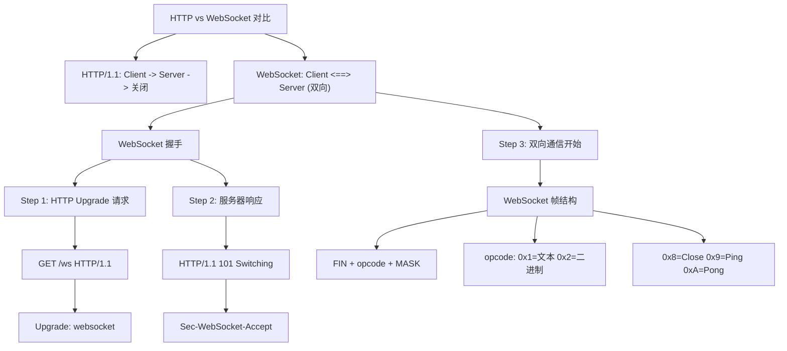

# WebSocket 与 SSE

## 1. WebSocket 原理

### 1.1 定义/背景（一句话说清）

WebSocket 是基于 TCP 的全双工通信协议，通过 HTTP Upgrade 握手建立持久连接，服务器和客户端可随时互相发送帧，无需每次请求-响应，解决了 HTTP 轮询的效率问题，是实时双向通信的事实标准。

### 1.2 ASCII 原理图



### 1.3 完整代码示例（TS/JS）

```typescript
// ============ WebSocket 客户端完整实现 ============

class WebSocketClient {
  private ws: WebSocket | null = null;
  private reconnectAttempts = 0;
  private readonly maxReconnectAttempts = 10;
  private reconnectTimer: ReturnType<typeof setTimeout> | null = null;
  private heartbeatTimer: ReturnType<typeof setInterval> | null = null;
  private readonly heartbeatInterval = 30000;
  private messageQueue: unknown[] = [];
  private manualClose = false;

  constructor(
    private readonly url: string,
    private readonly options: {
      reconnectInterval?: number;
      heartbeatInterval?: number;
      onMessage?: (data: unknown) => void;
      onOpen?: () => void;
      onClose?: (code: number, reason: string) => void;
      onError?: (error: Event) => void;
    } = {}
  ) {
    this.connect();
  }

  connect() {
    this.ws = new WebSocket(this.url);
    // 可选：添加子协议
    // this.ws = new WebSocket(this.url, ['graphql-ws', 'mqtt']);

    this.ws.onopen = () => {
      this.reconnectAttempts = 0;
      this.startHeartbeat();
      this.flushQueue();
      this.options.onOpen?.();
    };

    this.ws.onmessage = (event: MessageEvent) => {
      // 文本消息
      if (typeof event.data === 'string') {
        // 心跳响应不触发 onMessage
        if (event.data === 'pong') return;
        try {
          const parsed = JSON.parse(event.data);
          this.options.onMessage?.(parsed);
        } catch {
          this.options.onMessage?.(event.data);
        }
      }
      // 二进制消息
      else if (event.data instanceof Blob) {
        this.handleBinaryMessage(event.data);
      } else if (event.data instanceof ArrayBuffer) {
        this.handleBinaryMessage(new Blob([event.data]));
      }
    };

    this.ws.onerror = (error: Event) => {
      this.options.onError?.(error);
    };

    this.ws.onclose = (event: CloseEvent) => {
      this.stopHeartbeat();
      this.options.onClose?.(event.code, event.reason || '');

      if (!this.manualClose) {
        this.scheduleReconnect();
      }
    };
  }

  send(data: unknown) {
    const payload = typeof data === 'string' ? data : JSON.stringify(data);

    if (this.ws?.readyState === WebSocket.OPEN) {
      this.ws.send(payload);
    } else {
      // 离线队列，连接恢复后发送
      this.messageQueue.push(payload);
    }
  }

  close(code = 1000, reason = 'Client normal close') {
    this.manualClose = true;
    this.stopHeartbeat();
    clearTimeout(this.reconnectTimer!);
    this.ws?.close(code, reason);
  }

  get readyState(): number {
    return this.ws?.readyState ?? WebSocket.CLOSED;
  }

  private startHeartbeat() {
    this.heartbeatTimer = setInterval(() => {
      if (this.ws?.readyState === WebSocket.OPEN) {
        this.ws.send('ping');
      }
    }, this.heartbeatInterval);
  }

  private stopHeartbeat() {
    if (this.heartbeatTimer) {
      clearInterval(this.heartbeatTimer);
      this.heartbeatTimer = null;
    }
  }

  private scheduleReconnect() {
    if (this.reconnectAttempts >= this.maxReconnectAttempts) {
      console.error('最大重连次数已达上限');
      return;
    }

    const delay = (this.options.reconnectInterval ?? 3000) *
                  Math.pow(1.5, this.reconnectAttempts);

    this.reconnectTimer = setTimeout(() => {
      this.reconnectAttempts++;
      this.manualClose = false;
      this.connect();
    }, delay);
  }

  private flushQueue() {
    while (this.messageQueue.length > 0) {
      const msg = this.messageQueue.shift();
      if (msg) this.send(msg);
    }
  }

  private async handleBinaryMessage(blob: Blob) {
    const buffer = await blob.arrayBuffer();
    const view = new DataView(buffer);

    // 解析自定义二进制协议
    // 例如: 前 4 字节是消息类型，后面是 payload
    const messageType = view.getUint32(0, true);
    const payload = buffer.slice(4);
    console.log('Binary message type:', messageType, 'payload size:', payload.byteLength);
  }
}

// 使用示例
const wsClient = new WebSocketClient('wss://api.example.com/ws', {
  reconnectInterval: 2000,
  onMessage: (data) => console.log('收到:', data),
  onOpen: () => console.log('WebSocket 已连接'),
  onClose: (code, reason) => console.log(`关闭: ${code} ${reason}`),
});

// 发送消息
wsClient.send({ type: 'subscribe', channel: 'price_updates' });

// ============ WebSocket 服务端（Node.js + ws 库）============

import { WebSocketServer, WebSocket } from 'ws';

const wss = new WebSocketServer({ port: 8080, path: '/ws' });

// 心跳机制（防止断开的连接占用资源）
wss.on('connection', (ws: WebSocket, req) => {
  const ip = req.socket.remoteAddress;
  console.log(`客户端连接: ${ip}`);

  // 设置 ping/pong 处理
  ws.isAlive = true;
  ws.on('pong', () => { ws.isAlive = true; });

  ws.on('message', (data: Buffer, isBinary: boolean) => {
    if (isBinary) {
      // 处理二进制数据
      console.log(`收到二进制: ${data.length} bytes`);
      ws.send(data); // echo
    } else {
      const message = data.toString();
      console.log(`收到文本: ${message}`);
      ws.send(`Echo: ${message}`);
    }
  });

  ws.on('close', (code, reason) => {
    console.log(`断开: ${code} ${reason}`);
  });
});

// 心跳定时器
const interval = setInterval(() => {
  wss.clients.forEach((ws: any) => {
    if (!ws.isAlive) {
      ws.terminate(); // 不优雅，直接断开
      return;
    }
    ws.isAlive = false;
    ws.ping(); // 触发客户端 pong
  });
}, 30000);

wss.on('close', () => clearInterval(interval));

// ============ WebSocket over HTTP/2 ============

// HTTP/2 理论上支持 WebSocket
// 但 WebSocket over HTTP/2 并未被广泛实现
// 大多数 WebSocket 仍然使用 HTTP/1.1 升级

// ============ WebSocket 与 Web Workers ============

// 在 Worker 中运行 WebSocket（不阻塞主线程）
// worker-websocket.js
self.onmessage = (event) => {
  const ws = new WebSocket(event.data.url);

  ws.onopen = () => self.postMessage({ type: 'open' });
  ws.onmessage = (e) => self.postMessage({ type: 'message', data: e.data });
  ws.onerror = (e) => self.postMessage({ type: 'error', data: e });
};
```

### 1.4 对比表

| 维度 | HTTP 轮询 | 长轮询 | WebSocket | SSE |
|------|:---------:|:------:|:---------:|:---:|
| 连接建立 | 每次请求新建 | 每次请求新建 | 一次握手持久 | 一次握手持久 |
| 通信方向 | 客户端主动 | 客户端主动 | 全双工 | 服务端→客户端 |
| 服务器推送 | 不支持 | 支持（但低效）| 支持 | 支持 |
| 延迟 | 高 | 中 | 低 | 低 |
| HTTP 头开销 | 每次都带 | 每次都带 | 仅握手 | 仅握手 |
| 兼容性 | 极好 | 极好 | 较好（IE10+）| 较差（不支持 IE）|
| 断线重连 | 无 | 无 | 需手动实现 | 原生 EventSource |

### 1.5 常见陷阱与最佳实践

| 陷阱 | 说明 | 解决方案 |
|------|------|----------|
| 没有心跳检测 | 网络中断时连接可能"挂死"而不触发 onclose | 实现 ping/pong 心跳机制 |
| 重连风暴 | 多个客户端同时断线，同时重连导致服务器过载 | 指数退避 + 抖动（jitter）|
| 消息队列溢出 | 离线消息积压导致内存问题 | 限制队列大小，超出后丢弃旧消息 |
| 二进制帧处理缺失 | 只处理文本，不知道如何处理二进制 | 显式处理 Blob / ArrayBuffer |
| WebSocket over 代理被降级 | 某些代理将 WebSocket 降级为 HTTP | 使用 WSS（TLS），更难被识别 |
| 断线不通知 | 页面切换时连接可能静默断开 | visibilitychange 事件 + 重连逻辑 |

### 1.6 面试追问 + 参考答案要点

**Q1：WebSocket 为什么需要掩码（Masking）？**
> WebSocket 规范要求客户端发送给服务器的帧必须掩码（MASK=1）。这是为了**防止代理缓存污染攻击**（Turnbull, 2011）：恶意客户端可以在 WebSocket 握手后，通过被污染的代理发送特殊构造的帧，该帧看起来像 HTTP 请求（HTTP 请求通常以 GET 开头），可能被代理缓存。掩码机制使得攻击者无法预测帧内容，防止代理误判。服务端到客户端的帧不需要掩码（因为代理不会修改服务端响应）。

**Q2：WebSocket 和 HTTP/2 多路复用都能双向通信，它们的区别是什么？**
> 1. **协议层**：WebSocket 是独立协议（ws://），HTTP/2 是 HTTP 的扩展（同一个连接传输 HTTP 语义）。2. **语义**：WebSocket 有自己的帧类型（Ping/Pong/Close/Text/Binary），HTTP/2 使用帧传输 HTTP 请求/响应。3. **使用场景**：WebSocket 适合持续的双向实时通信（聊天、游戏），HTTP/2 多路复用适合混合请求/响应和推送的 Web 应用。4. **代理支持**：HTTP/2 需要 ALPN（应用层协议协商），WebSocket 更广泛支持。

**Q3：WebSocket 断开后如何保证消息不丢失？**
> 1. **消息队列**：连接断开时将消息存入队列，连接恢复后 flush。2. **应用层 ACK**：发送消息后等待服务端 ACK，ACK 超时则重发。3. **消息 ID + 去重**：每条消息带唯一 ID，服务端去重后处理。4. **持久化队列（RabbitMQ/Kafka）**：服务端将消息先写入消息队列再响应客户端。5. **补偿机制**：连接恢复后查询"上次收到消息 ID"，服务端补发缺失的消息。

### 1.7 参考来源 URL

- RFC 6455 (WebSocket Protocol): https://www.rfc-editor.org/rfc/rfc6455
- MDN WebSocket: https://developer.mozilla.org/en-US/docs/Web/API/WebSocket
- WebSocket API: https://websockets.spec.whatwg.org/
- WebSocket vs HTTP/2: https://stackoverflow.com/questions/14703627/websockets-vs-server-sent-events-polling

## 2. WebSocket 原理（速记版）

**WebSocket 与 HTTP 对比：**

| 协议 | 连接方式 | 说明 |
|------|---------|------|
| HTTP/1.1 | 请求-响应 | 客户端发起请求，服务器响应 |
| WebSocket | 双向实时 | HTTP 升级后，全双工双向通信 |

```
HTTP/1.1: Client → HTTP → Server (单向请求-响应)
WebSocket: Client ←→ WS ←→ Server (双向实时通信)
```

**连接过程：** Client HTTP → HTTP 升级请求 → WebSocket 双向通信

### 2.1 WebSocket 握手

```http
# HTTP 升级请求（浏览器自动完成）
GET /ws HTTP/1.1
Host: api.example.com
Upgrade: websocket
Connection: Upgrade
Sec-WebSocket-Version: 13
Sec-WebSocket-Key: dGhlIHNhbXBsZSBub25jZQ==
Origin: https://example.com

# 服务器响应
HTTP/1.1 101 Switching Protocols
Upgrade: websocket
Connection: Upgrade
Sec-WebSocket-Accept: s3pPLMBiTxaQ9kYGzzhZRbK+xOo=
```

### 2.2 WebSocket 帧结构

```
 0                   1                   2                   3
 0 1 2 3 4 5 6 7 8 9 0 1 2 3 4 5 6 7 8 9 0 1 2 3 4 5 6 7 8 9 0 1
+-+-+-+-+-------+-+---------------+-------------------------------+
|F|R|R|R| opcode|M|     mask      |         payload length        |
|I|S|S|S|  (4)  |A|     (1)       |             (7/16/64)          |
|N|V|V|V|       |S|               |                               |
+-+-+-+-+-------+-+---------------+-------------------------------+
|     payload len (7 bits)       |  extended payload length      |
+---------------------------------+-------------------------------+
|                   Masking-Key (if mask bit is 1)                |
+---------------------------------+---------------------------------+
|                           Payload Data                           |
+-----------------------------------------------------------------------------:

opcode: 0x1=文本帧, 0x2=二进制帧, 0x8=关闭, 0x9=Ping, 0xA=Pong
```

### 2.3 WebSocket 心跳与断线重连

```javascript
class WebSocketClient {
  // 第 1 段：构造与配置初始化——把"连接参数"和"运行时状态"分开存放，并把 options 缺省值一次算好
  // 为什么这样写：用 || 提供默认值是常见做法，但注意它会把显式传入的 0 / '' 也当作"没传"而回退到默认值；
  // 若业务允许 reconnectInterval = 0（立即重连），应改用 ?? 或 hasOwnProperty 判断。
  // 数据流：this.url 等配置在整个生命周期只读，this.reconnectAttempts / this.ws / this.messageQueue 则被后续各个方法读写。
  constructor(url, options = {}) {
    this.url = url;
    this.reconnectInterval = options.reconnectInterval || 3000;
    this.maxReconnectAttempts = options.maxReconnectAttempts || 10;
    this.heartbeatInterval = options.heartbeatInterval || 30000;
    this.reconnectAttempts = 0;
    this.ws = null;
    this.manualClose = false;      // 区分"用户主动关闭"与"网络意外断开"，只有后者才允许重连
    this.messageQueue = [];        // 断线期间 send() 的兜底缓冲区，重连成功后由 flushQueue 排空
    this.connect();                // 构造函数里直接发起连接，意味着 new 出来的实例"自启动"，无法先配置再连
  }

  // 第 2 段：建立连接并绑定三件套事件（open / message / close）——整个重连机制的核心就在这里
  // 为什么这样写：把重连、心跳、补发队列全部挂在 onclose/onopen 回调上，而不是写循环轮询，属于事件驱动；
  // 易错点：onopen 里必须把 reconnectAttempts 归零，否则累计计数会把后续"本来能成功"的重连也卡在上限外；
  // 边界：每次 connect() 都新建 WebSocket，旧实例不再被引用，但要留神旧实例的回调是否还在触发（此处靠 onclose 自洽）。
  connect() {
    this.ws = new WebSocket(this.url);
    this.ws.onopen = () => {
      this.reconnectAttempts = 0;   // 握手成功即重置退避计数，让下一次断线从最小延迟重新开始
      this.startHeartbeat();
      this.flushQueue();            // 连接可用后才补发离线期间积压的消息，保证顺序
    };
    this.ws.onmessage = (e) => {
      if (e.data === 'pong') return;  // 心跳响应
      this.handleMessage(e.data);     // 业务消息交由子类/外部实现的钩子处理
    };
    this.ws.onclose = () => {
      this.stopHeartbeat();
      if (!this.manualClose) this.reconnect();  // 主动 close() 时 manualClose=true，此处被短路，避免"关掉又自动连回来"
    };
  }

  // 第 3 段：心跳保活——用定时器周期性发 ping，让中间代理/网关不因空闲而掐断连接
  // 为什么这样写：只在 readyState 为 OPEN 时发送，避免在 CONNECTING/CLOSING 状态调用 send 抛 InvalidStateError；
  // 易错点：heartbeatTimer 必须在 onclose 与 close() 里清掉，否则连接已死、定时器还在跑，造成定时器泄漏与僵尸发送。
  startHeartbeat() {
    this.heartbeatTimer = setInterval(() => {
      if (this.ws.readyState === WebSocket.OPEN) {
        this.ws.send('ping');
      }
    }, this.heartbeatInterval);
  }

  // 第 4 段：指数退避重连——1.5 的幂次递增延迟，避免服务端刚重启就被重连风暴打死
  // 为什么这样写：delay = 基础间隔 × 1.5^已重试次数，第 0 次 3s、第 1 次 4.5s、第 2 次 6.75s……逐步拉长；
  // 边界：计数在 setTimeout 回调里才自增，所以判断用的是"已调度过几次"；达到 maxReconnectAttempts(10) 后静默放弃，不再通知调用方；
  // 潜在问题：若连接成功后立刻又断，计数已在 onopen 归零，所以惩罚不会累积；但多次断连会叠加多个 setTimeout，缺少"取消上一个定时器"的守卫。
  reconnect() {
    if (this.reconnectAttempts >= this.maxReconnectAttempts) return;
    const delay = this.reconnectInterval * Math.pow(1.5, this.reconnectAttempts);
    setTimeout(() => {
      this.reconnectAttempts++;
      this.connect();
    }, delay);
  }

  // 第 5 段：发送入口——"能发就发、不能发就囤"，对上层屏蔽连接状态
  // 为什么这样写：对象自动 JSON 序列化、字符串原样透传，调用方不必关心协议编码；
  // 边界：this.ws 可能因重连被替换，此处读的是最新实例；但未判 empty 的 else 分支会把消息无限堆积（队列无上限），
  // 若长期断线需要额外的容量上限与丢弃策略。
  send(data) {
    if (this.ws.readyState === WebSocket.OPEN) {
      this.ws.send(typeof data === 'string' ? data : JSON.stringify(data));
    } else {
      this.messageQueue.push(data);  // 队列消息，连接恢复后发送
    }
  }

  // 第 6 段：主动关闭——先立"手动"标志再关，顺序不能反
  // 为什么这样写：close() 会同步/异步触发 onclose，若先关闭后设标志，onclose 看到的 manualClose 仍是 false，会误触发重连；
  // 1000 是 WebSocket 正常关闭码，让对端知道这是有意为之而非网络故障。
  close() {
    this.manualClose = true;
    this.stopHeartbeat();
    this.ws.close(1000, 'Client closed');
  }

  // 第 7 段：排空离线队列——循环取出并发送积压消息
  // 易错点（本段是典型反面教材）：三元表达式里重复调用了 this.messageQueue.shift()，
  // 而 shift() 不只是"读"，它每次都真的从数组头部删除元素——因此每轮循环至少消费 2 条消息却最多只发出 1 条，
  // 其余消息被静默丢弃；当队列被抽空时 shift() 返回 undefined，JSON.stringify(undefined) 又是 undefined，
  // 最终还会向服务端发出一个 undefined 帧。正确写法应先用 const item = this.messageQueue.shift() 取一次再判断类型。
  // 复杂度：本意是 O(n) 的单趟清空，但因重复 shift 变成了"边丢边发"。
  flushQueue() {
    while (this.messageQueue.length > 0) {
      this.ws.send(typeof this.messageQueue.shift() === 'string'
        ? this.messageQueue.shift()
        : JSON.stringify(this.messageQueue.shift()));
    }
  }
}
```
## 3. SSE vs WebSocket vs 长轮询

### 3.1 定义/背景（一句话说清）

SSE（Server-Sent Events）基于 HTTP 的单向服务端推送，适用于服务器到浏览器的实时通知；WebSocket 是基于 TCP 的全双工双向通信；长轮询是 HTTP 轮询的优化，服务器挂起请求直到有新数据或超时。三者各有适用场景，需根据通信方向、实时性要求和兼容性选择。

### 3.2 ASCII 原理图

```mermaid
flowchart TB
    N0["SSE vs WebSocket vs 长轮询 时序对比"]
    N1["SSE（服务端 客户端单向）:"]
    N2["Client HTTP GET /stream > Server"]
    N3["Client < data: {...}\n\n < Server (随时推送)"]
    N4["Client < data: {...}\n\n < Server"]
    N5["Client < event: close\n\n < Server (完成)"]
    N6["WebSocket（全双工）:"]
    N7["Client HTTP Upgrade > Server"]
    N8["Client <--> 双向帧交换 --> Server"]
    N9["(服务器随时推送，客户端随时发送，真正对等通信)"]
    N10["长轮询:"]
    N11["Client HTTP GET /poll > Server (服务器挂起)"]
    N12["Client < 200 {...data} < Server (有新数据)"]
    N13["Client HTTP GET /poll > Server (立即发起新请求)"]
    N14["Client < 200 timeout < Server (无数据，超时)"]
    N15["Client HTTP GET /poll > Server (立即发起新请求)"]
    N16["(不断重复，请求之间有间隙)"]
    N17["SSE 事件流格式"]
    N18["每个事件以双换行符 (\n\n) 分隔:"]
    N19["event: stock_update\n"]
    N20["id: 42\n"]
    N21["data: {'symbol':'AAPL','price':175.3}\n\"]
    N22["event: notification\n"]
    N23["data: You have 3 new messages\n\n"]
    N24[":comment\n 注释（心跳保活）"]
    N25["retry: 5000\n 断线重连间隔(ms)"]
    N26["字段说明:"]
    N27["data: 事件数据（最重要，多行 data: 会拼接）"]
    N28["event: 事件类型（自定义，如 stock_update）"]
    N29["id: 事件 ID（浏览器维护 Last-Event-ID，断线后自动发送）"]
    N30["retry: 重连间隔（毫秒）"]
    N31[":comment: 注释行（心跳，可被浏览器忽略）"]
    N32["SSE vs WebSocket 选型决策树"]
    N33["需要实时通信？"]
    N34["只需服务端推送（服务器 浏览器）？"]
    N35["需要兼容 IE / 旧浏览器？ 长轮询（兼容但低效）"]
    N36["需要 AI/LLM 流式输出？ SSE（ReadableStream 原生）"]
    N37["普通推送（通知、行情） SSE（最简单，推荐）"]
    N38["需要双向通信（浏览器 <--> 服务器）？"]
    N39["延迟 < 100ms（游戏、实时协作）？ WebSocket"]
    N40["消息可靠性要求极高？ WebSocket + 应用层 ACK"]
    N41["低频交互 + 高并发推送？ SSE + fetch POST"]
    N0 --> N1
    N1 --> N2
    N2 --> N3
    N3 --> N4
    N4 --> N5
    N5 --> N6
    N6 --> N7
    N7 --> N8
    N8 --> N9
    N9 --> N10
    N10 --> N11
    N11 --> N12
    N12 --> N13
    N13 --> N14
    N14 --> N15
    N15 --> N16
    N16 --> N17
    N17 --> N18
    N18 --> N19
    N19 --> N20
    N20 --> N21
    N21 --> N22
    N22 --> N23
    N23 --> N24
    N24 --> N25
    N25 --> N26
    N26 --> N27
    N27 --> N28
    N28 --> N29
    N29 --> N30
    N30 --> N31
    N31 --> N32
    N32 --> N33
    N33 --> N34
    N34 --> N35
    N35 --> N36
    N36 --> N37
    N37 --> N38
    N38 --> N39
    N39 --> N40
    N40 --> N41
```



### 3.3 完整代码示例（TS/JS）

```typescript
// ============ SSE 完整实现（Node.js + Express）============

import express from 'express';
import { createClient } from 'redis';

const app = express();

app.get('/stream/:userId', async (req: express.Request, res: express.Response) => {
  const { userId } = req.params;

  // 设置 SSE 必需的响应头
  res.writeHead(200, {
    'Content-Type': 'text/event-stream',
    'Cache-Control': 'no-cache',
    'Connection': 'keep-alive',
    // 禁用 nginx 缓冲（防止实时变批量）
    'X-Accel-Buffering': 'no',
  });

  // 立即 flush HTTP 头
  res.flushHeaders();

  // Redis Pub/Sub 订阅该用户的通知频道
  const subscriber = createClient();
  await subscriber.connect();

  const channel = `user:${userId}:events`;
  await subscriber.subscribe(channel, (message) => {
    // 新消息到达，立即发送给 SSE 客户端
    res.write(`data: ${message}\n\n`);
  });

  // 定期发送注释行作为心跳
  const heartbeat = setInterval(() => {
    res.write(`:heartbeat ${Date.now()}\n\n`);
  }, 15000);

  // 客户端断开时清理
  req.on('close', async () => {
    clearInterval(heartbeat);
    await subscriber.unsubscribe(channel);
    await subscriber.quit();
    console.log(`[SSE] 客户端断开: ${userId}`);
  });
});

// ============ SSE 客户端 + EventSource ============

const es = new EventSource('/stream/user123');

// 默认 message 事件
es.onmessage = (e: MessageEvent) => {
  const data = JSON.parse(e.data);
  console.log('[SSE 默认事件]', data);
};

// 自定义事件类型
es.addEventListener('stock_update', (e: MessageEvent) => {
  const { symbol, price } = JSON.parse(e.data);
  console.log(`[${symbol}] ${price}`);
});

es.addEventListener('notification', (e: MessageEvent) => {
  showNotification(e.data);
});

// 连接状态
es.onopen = () => console.log('[SSE] 连接已建立');
es.onerror = (e: Event) => {
  console.error('[SSE] 连接错误', e);
  if (es.readyState === EventSource.CLOSED) {
    // 永久关闭，需手动重连
    console.log('[SSE] 连接已关闭');
  }
};

// 获取最后事件 ID（用于断线后恢复）
console.log('Last-Event-ID:', es.lastEventId);

// ============ 使用 fetch + ReadableStream（SSE 的现代替代）============

// AI 流式输出的标准方式（ChatGPT/Gemini 接口）
async function streamAIResponse(prompt: string) {
  const response = await fetch('https://api.example.com/chat', {
    method: 'POST',
    headers: { 'Content-Type': 'application/json' },
    body: JSON.stringify({ prompt }),
  });

  if (!response.body) throw new Error('No response body');

  const reader = response.body
    .pipeThrough(new TextDecoderStream())
    .getReader();

  while (true) {
    const { value, done } = await reader.read();
    if (done) break;

    // SSE 格式: data: {...}\n\n
    const lines = value.split('\n');
    for (const line of lines) {
      if (line.startsWith('data: ')) {
        const content = line.slice(6);
        if (content === '[DONE]') {
          console.log('流式输出完成');
          return;
        }
        try {
          const parsed = JSON.parse(content);
          console.log('Token:', parsed.token);
        } catch {}
      }
    }
  }
}

// ============ WebSocket vs SSE 降级策略 ============

class RealtimeTransport {
  private ws: WebSocket | null = null;
  private es: EventSource | null = null;

  async connect(url: string): Promise<void> {
    // 优先 WebSocket
    if (this.supportsWebSocket()) {
      this.ws = new WebSocket(url);
      this.ws.onmessage = (e) => this.handleMessage(e.data);
    } else {
      // 降级为 SSE
      this.es = new EventSource(url);
      this.es.onmessage = (e) => this.handleMessage(e.data);
    }
  }

  private supportsWebSocket(): boolean {
    return typeof WebSocket !== 'undefined';
  }

  private handleMessage(data: unknown) {
    console.log('收到消息:', data);
  }

  send(data: unknown) {
    // 如果使用 SSE（单向），需要额外建立 fetch 请求发送数据
    if (this.ws) {
      this.ws.send(JSON.stringify(data));
    } else {
      // SSE 降级方案：用 fetch 发送
      fetch('/api/sse-command', {
        method: 'POST',
        body: JSON.stringify(data),
      });
    }
  }

  close() {
    this.ws?.close();
    this.es?.close();
  }
}
```

### 3.4 对比表（详细版）

| 维度 | SSE | WebSocket | 长轮询 | 短轮询 |
|------|:---:|:---------:|:------:|:------:|
| 通信方向 | **单向**（服务端→客户端）| **全双工** | 单向（伪推送）| 单向 |
| 连接特性 | 长连接（HTTP）| 长连接（TCP）| 每次请求后关闭再发起 | 短连接 |
| 协议 | HTTP (text/event-stream) | ws:// / wss:// | HTTP | HTTP |
| HTTP 头开销 | 仅首次握手 | 仅握手有头（帧头 2B）| 每轮询次都带完整 HTTP 头 | 每轮次都带完整 HTTP 头 |
| 自动重连 | 是（原生 EventSource） | 否（需手动实现） | 否（需手动实现） | N/A |
| 断线消息补发 | 是（via Last-Event-ID） | 否（需应用层实现） | 否（需应用层实现） | 否 |
| 二进制数据 | 否（仅文本（UTF-8）） | 是（原生二进制帧） | 是 | 是 |
| 单连接多路复用 | 是（（HTTP/2）） | 否（（每连接一流）） | 否 | 否 |
| 穿过代理 | 是 | 注意：（可能被降级）| 是 | 是 |
| 复杂度 | 低 | 中高 | 中 | 低 |
| IE/Edge Legacy | 否 | 否 | 是 | 是 |
| 适用场景 | 推送/AI 流式/LLM | 聊天/游戏/实时协作 | 兼容旧系统 | 低频状态轮询 |

### 3.5 常见陷阱与最佳实践

| 陷阱 | 说明 | 解决方案 |
|------|------|----------|
| nginx 默认缓冲 SSE | nginx 收到完整响应才转发，实时变"批量" | `proxy_buffering off;` 或 `X-Accel-Buffering: no` |
| nginx 超时断开 | 默认 `proxy_read_timeout 60s` 导致连接被斩断 | `proxy_read_timeout 86400;` |
| EventSource 不支持 POST | EventSource 只接受 GET，无法发送认证信息 | 配合 fetch + 一次性 token；或 cookie/Authorization header |
| SSE 连接数限制 | 浏览器同源 HTTP 连接数有限制（HTTP/1.1 通常 6 个）| 改用 HTTP/2；或合并多个 SSE 流为 1 个 |
| 浏览器关闭不通知服务端 | 页面关闭/切换，SSE 连接不会发送 close 通知 | `navigator.sendBeacon` 通知服务端；或心跳超时判定 |

### 3.6 面试追问 + 参考答案要点

**Q1：AI 大模型的流式输出为什么用 SSE 而不是 WebSocket？**
> 1. **语义匹配**：LLM 推理只有服务端输出，不需要客户端发送数据，SSE 语义完全吻合。2. **标准 HTTP 兼容**：SSE 是标准 HTTP，长连接穿越代理和 CDN 比 WebSocket 更容易。3. **自动重连**：EventSource 自动处理断线重连，对 AI 流式对话场景友好（对话中断后自动续接）。4. **fetch + ReadableStream**：现代 AI API（如 OpenAI Chat API）使用 SSE 格式，配合 `fetch()` 返回的 `ReadableStream`，前端可精确控制流消费。5. **简单实现**：服务端只需每生成一个 token 就 `res.write('data: ...\n\n')`，无需维护复杂 WebSocket 状态。

**Q2：SSE 如何保证消息不丢失（断线重连后）？**
> SSE 通过 `Last-Event-ID` 机制保证：1. 服务器每次发送事件时携带 `id:` 字段。2. 浏览器自动维护 `es.lastEventId`。3. 断线重连时，浏览器在 HTTP 请求头中自动发送 `Last-Event-ID: <id>`。4. 服务器从 Redis/MQ 中读取 `id ≥ Last-Event-ID` 的未发消息，从断线位置补发。关键点：服务器必须在每次事件中主动发送 `id:` 字段（浏览器只在重连时才发送，平常不发送）。

**Q3：什么情况下应该选择长轮询而不是 SSE 或 WebSocket？**
> 1. **需要兼容 IE9/IE10**（EventSource 不支持，WebSocket 需 polyfill）。2. **服务器端架构限制**（现有系统基于轮询，难以升级为 WebSocket）。3. **防火墙/代理限制**（企业网络可能阻止非标准端口，HTTP 端口 80/443 最通用）。4. **极低频更新场景**（如新闻通知，一天可能只有几条），长轮询的资源消耗可能低于持续连接。

### 3.7 参考来源 URL

- MDN - Using server-sent events: https://developer.mozilla.org/en-US/docs/Web/API/Server-sent_events/Using_server-sent_events
- SSE vs WebSocket (Cloudflare): https://blog.cloudflare.com/sse-websockets-data-transfer/
- EventSource spec: https://html.spec.whatwg.org/multipage/server-sent-events.html
- OpenAI Streaming API (SSE): https://platform.openai.com/docs/api-reference/completions

## 4. SSE vs WebSocket vs 长轮询（速记版）

### 4.1 核心定义

**Server-Sent Events（SSE）**：一种基于 HTTP 的轻量级协议，用于实现服务器→客户端的**单向实时推送**。浏览器通过 `EventSource` API 建立持久 HTTP 连接，服务器随时可发送事件流，浏览器自动解析并触发 `onmessage` 回调。

**WebSocket**：基于 TCP 的独立协议，**全双工**双向通信。双方可随时互相发送帧，无需 HTTP 升级（详见 1.6 节）。

**长轮询（Long Polling）**：HTTP 轮询的变种，客户端发送请求后服务器**挂起**，直到有数据或超时才返回响应；客户端收到响应后立即发起新请求。

### 4.2 SSE 协议规范与数据格式

SSE 的数据传输使用 **MIME 类型 `text/event-stream`**，每个事件由多行文本组成，以**双换行符（`\n\n`）**作为分隔：

```
字段: 值\n
字段: 值\n
\n
data: {"price": 100.5}\n
\n
id: 42\n
event: stock_update\n
data: {"symbol": "AAPL", "price": 175.3}\n
retry: 5000\n
\n
```

**字段说明：**

| 字段 | 作用 |
|------|------|
| `data:` | 事件负载（可多行，会拼接在一起，以 `\n\n` 结束） |
| `id:` | 事件 ID，浏览器自动维护 `Last-Event-ID`，断线后自动在 `Last-Event-ID` header 中发送，用于服务器回溯补发 |
| `event:` | 事件类型（默认 `message`，可自定义类型如 `stock_update`） |
| `retry:` | 断线后重连间隔（毫秒，默认约 3s，服务器可覆盖） |
| `:comment` | 注释行（忽略，用于心跳保活） |

**服务端 Node.js 实现（Express）：**
```javascript
app.get('/stream', (req, res) => {
  res.setHeader('Content-Type', 'text/event-stream');
  res.setHeader('Cache-Control', 'no-cache');
  res.setHeader('Connection', 'keep-alive');
  res.setHeader('X-Accel-Buffering', 'no'); // 禁用 nginx 缓冲
  res.flushHeaders(); // 立即发送 HTTP 头，不要等 body

  const sendStockUpdate = (symbol, price) => {
    res.write(`event: stock_update\n`);
    res.write(`data: ${JSON.stringify({ symbol, price, ts: Date.now() })}\n\n`);
  };

  const interval = setInterval(() => {
    sendStockUpdate('AAPL', (170 + Math.random() * 5).toFixed(2));
  }, 1000);

  req.on('close', () => {
    clearInterval(interval);
    console.log('[SSE] 客户端断开');
  });
});
```

**客户端 `EventSource` API：**
```javascript
const es = new EventSource('/stream');

// 默认 message 事件（event:type 未指定时）
es.onmessage = (e) => {
  console.log('[默认事件]', e.data); // e.data 是纯字符串
};

// 自定义事件类型
es.addEventListener('stock_update', (e) => {
  const data = JSON.parse(e.data);
  console.log(`[${data.symbol}] ${data.price}`);
});

// 连接状态
es.onopen = () => console.log('[SSE] 连接已建立');
es.onerror = (e) => {
  console.error('[SSE] 连接错误', e);
  // EventSource 自动重连（除非 readyState === CLOSED）
  if (es.readyState === EventSource.CLOSED) {
    console.log('[SSE] 连接已永久关闭，需手动重连');
  }
};

// 手动关闭
es.close();

// 获取最后的事件 ID（用于断线后重连）
console.log('Last-Event-ID:', es.lastEventId);
```

### 4.3 重连机制（Last-Event-ID 与断线恢复）

SSE 的自动重连是面试高频考点：

```
连接正常时：
  服务器发送 → id:42 → data:{...}

断线重连时：
  客户端 HTTP 请求 header 自动带上：
    Last-Event-ID: 42

  服务器可从 Redis/MQ 中读取 id≥42 的未发消息，
  从断线位置开始补发，实现"消息不丢失"
```

> 注意：**常见误解**：浏览器只在 **SSE 断线重连**时自动发送 `Last-Event-ID`。如果想每次消息都带 ID，服务器必须主动在每次事件中发送 `id:` 字段。

### 4.4 三方案完整对比表

| 维度 | **SSE** | **WebSocket** | **长轮询** | **短轮询** |
|------|:-------:|:-------------:|:----------:|:----------:|
| 通信方向 | **单向（服务端→客户端）** | **全双工** | 客户端轮询，服务端可推 | 客户端轮询 |
| 连接特性 | 长连接（HTTP） | 长连接（TCP） | 每次请求后关闭再发起 | 短连接（每次请求后关闭） |
| 协议 | HTTP（text/event-stream） | ws:// / wss:// | HTTP | HTTP |
| HTTP 头开销 | 仅首次握手有头 | 仅握手有头（帧头 2 字节） | 每轮询次都带完整 HTTP 头 | 每轮次都带完整 HTTP 头 |
| 自动重连 | 是（原生 EventSource） | 否（需手动实现） | 否（需手动实现） | N/A |
| 断线消息补发 | 是（via Last-Event-ID） | 否（需应用层实现） | 否（需应用层实现） | 否 |
| 二进制数据 | 否（仅文本（UTF-8）） | 是（原生二进制帧） | 是 | 是 |
| 单连接多路复用 | 是（（HTTP/2）） | 否（（每连接一流）） | 否 | 否 |
| 穿过代理 | 是 | 注意：（可能被降级为 HTTP） | 是 | 是 |
| 复杂度 | 低 | 中高 | 中 | 低 |
| IE/Edge Legacy | 否 | 否 | 是 | 是 |
| 适用场景 | 推送通知、实时数据、股票/天气、AI 流式输出 | 聊天、游戏、实时协作 | 兼容旧系统、低频更新 | 低频状态轮询 |

### 4.5 选型决策树

**实时通信技术选型：**

| 问题 | 选项 | 推荐 |
|------|------|------|
| 需要实时通信？ | 是 | 继续判断 |
| 只需服务端推送（服务器 → 浏览器）？ | 是 | 继续判断 |
| 消息量极大（>10k 连接）？ | 是 | SSE（HTTP/2 多路复用更优） |
| 需 AI/LLM 流式输出？ | 是 | SSE（原生 ReadableStream 支持） |
| 普通推送（通知、行情）？ | - | SSE（最简单，推荐） |
| 需要双向通信（浏览器 ↔ 服务器）？ | 是 | 继续判断 |
| 延迟敏感（<100ms），游戏/协作？ | 是 | WebSocket |
| 消息可靠性要求极高？ | 是 | WebSocket + 应用层 ACK |
| 低频（每隔几秒才发一条）？ | - | SSE（客户端用 fetch POST 发请求） |

### 4.6 常见坑点与最佳实践

| 坑点 | 说明 | 解决方案 |
|------|------|----------|
| **nginx 默认缓冲 SSE** | nginx 收到响应后才转发，导致实时变"批量" | `proxy_buffering off;` 或设置响应头 `X-Accel-Buffering: no` |
| **nginx 超时断开** | 默认 `proxy_read_timeout 60s` 导致连接被斩断 | `proxy_read_timeout 86400;` |
| **SSE 连接数限制** | 浏览器同源 HTTP 连接数有限制（HTTP/1.1 通常 6 个） | 改用 HTTP/2；或合并多个 SSE 流为 1 个 |
| **EventSource 不支持 POST** | `EventSource` 只接受 GET，无法发送认证信息 | 配合 fetch + 一次性 token 方案；或用 cookie/Authorization header |
| **多标签页重复连接** | 每个标签页都会新建 SSE 连接 | 服务端维护心跳；或使用 SharedWorker / BroadcastChannel |
| **SSE 无法穿透代理** | 某些企业代理不认识 SSE，流被截断 | 降级为轮询；或使用 WebSocket over TLS（WSS） |
| **浏览器关闭时连接不通知服务端** | 客户端页面关闭/切换，SSE 连接不会发送 close 通知 | 使用 `navigator.sendBeacon` 在页面卸载时发通知；或服务端心跳超时判定 |

**Node.js + Redis Pub/Sub 实现多人 SSE 广播：**
```javascript
// 服务端：Redis 广播，多个 SSE 客户端可订阅同一频道
const redis = require('redis');
const subscriber = redis.createClient();

app.get('/stream/:userId', async (req, res) => {
  const { userId } = req.params;
  res.setHeader('Content-Type', 'text/event-stream');
  res.setHeader('Cache-Control', 'no-cache');
  res.setHeader('Connection', 'keep-alive');
  res.flushHeaders();

  const channel = `user:${userId}:events`;
  subscriber.subscribe(channel, (message) => {
    // 新消息到达，立即发送给 SSE 客户端
    res.write(`data: ${message}\n\n`);
  });

  req.on('close', () => {
    subscriber.unsubscribe(channel);
  });
});
```

### 4.7 高频面试追问

**Q1：AI 大模型的流式输出为什么用 SSE 而不是 WebSocket？**
> SSE 与 SSE 在 LLM 流式输出中的差异：
> 1. **语义匹配**：`fetch()` 返回的 `ReadableStream` 可直接通过 `TextDecoderStream` 转为 SSE 格式，前端只需 `EventSource` 或 fetch 流式消费
> 2. **天然单向**：LLM 推理只有服务端输出，无需客户端推送，SSE 语义完全吻合
> 3. **标准 HTTP 兼容**：SSE 是标准 HTTP，长连接穿越代理和 CDN 比 WebSocket 更容易
> 4. **自动重连**：EventSource 自动处理断线重连，对 AI 流式对话场景友好
> 5. **简单实现**：服务端只需每生成一个 token 就 `res.write()` 一行数据，无需维护复杂的状态

**Q2：SSE 能否实现浏览器向服务器发送数据？**
> 原生 `EventSource` **只支持 GET**，但有几种 workaround：
> 1. **同域下额外建立 WebSocket 连接** 用于客户端→服务端（常见方案）
> 2. **用 `fetch('POST')` 发送指令**，SSE 专门接收服务器推送
> 3. **EventSource 支持自定义 URL，服务器根据 URL 参数路由不同频道**

**Q3：SSE 与 WebSocket 在 Node.js 生态中的性能差异？**
> - **SSE**：基于 HTTP，长连接复用，Node.js 的单线程 event loop 中大量 SSE 连接主要消耗内存而非 CPU，适合高并发单向推送（如直播弹幕）
> - **WebSocket**：需要维护状态化的连接帧解析，适合双向通信；大量连接时推荐使用 `uWebSockets.js` / `ws` 库的 cluster 模式或 Redis pub/sub 水平扩展

**Q4：WebSocket 断开后，SSE 能否作为降级方案？**
> 是的，这是生产环境中的标准降级策略：
```javascript
// 优先尝试 WebSocket，失败则降级为 SSE
let transport = null;
if (new WebSocket) {
  try {
    const ws = new WebSocket(url);
    transport = ws;
  } catch {
    transport = new EventSource(url);
  }
} else {
  transport = new EventSource(url);
}
```

> 参考：
> - [MDN - Using server-sent events](https://developer.mozilla.org/en-US/docs/Web/API/Server-sent_events/Using_server-sent_events)
> - [SSE 技术详解](https://cloud.tencent.com/developer/article/1194063)
> - [实时技术对比: SSE vs WebSocket vs Long Polling](https://cloud.tencent.com/developer/article/2521124)
> - [SSE (Server-Sent Events) 协议详解](https://blog.csdn.net/jkzyx123/article/details/145704261)

## 深入阅读与参考

!!! tip "怎么用这些资料"
    先读「官方文档与规范」建立准确的概念，再读「源码与示例」核对细节，最后用「教程、书籍与视频」换一种讲法加深理解。每条都写明了读哪一节、带着什么问题读。

### 官方文档与规范

| 资源 | 为什么读 | 怎么读 |
|---|---|---|
| [RFC 6455 WebSocket](https://www.rfc-editor.org/rfc/rfc6455) | 帧格式与握手的权威定义，理解协议本质必读。 | 精读第 4 章握手与第 5 章帧格式，抓包对照 Upgrade 过程，再手算一帧掩码。 |
| [Writing WebSocket client applications](https://developer.mozilla.org/en-US/docs/Web/API/WebSockets_API/Writing_WebSocket_client_applications) | 官方讲解浏览器端 API 与生命周期，衔接原理与代码。 | 读构造、readyState 与事件回调部分，然后写一个带自动重连的客户端。 |
| [Writing WebSocket servers](https://developer.mozilla.org/en-US/docs/Web/API/WebSockets_API/Writing_WebSocket_servers) | 从服务端视角拆解握手校验与帧解析，让原理落地。 | 读握手字段校验与帧解析段，思考分片与掩码处理，再对照所用语言的实现。 |
| [MDN 使用 SSE](https://developer.mozilla.org/en-US/docs/Web/API/Server-sent_events/Using_server-sent_events) | 官方 SSE 指南，为对比 WebSocket 与长轮询提供基准。 | 读 EventSource 事件与自动重连部分，做通知示例，列出它与 WS 的取舍。 |
| [Socket.IO 文档](https://socket.io/docs/v4/) | 展示轮询与 WebSocket 的自动降级，理解长轮询的现实价值。 | 读传输协商与房间广播章节，观察降级发生的过程，再写对比结论。 |
| [MDN WebTransport](https://developer.mozilla.org/en-US/docs/Web/API/WebTransport_API) | 了解基于 HTTP/3 的替代方案，扩展传输选型的视野。 | 读概念与示例部分，比较它与 WebSocket 在延迟与多路复用上的差异。 |

### 源码与示例

| 资源 | 为什么读 | 怎么读 |
|---|---|---|
| [Writing a WebSocket server in JavaScript (Deno)](https://developer.mozilla.org/en-US/docs/Web/API/WebSockets_API/Writing_a_WebSocket_server_in_JavaScript_Deno) | 用最少代码实现握手与帧解析，可直接运行验证。 | 本地跑通回显服务，在解析帧处打断点，观察掩码与 opcode。 |
| [Writing a WebSocket server in C#](https://developer.mozilla.org/en-US/docs/Web/API/WebSockets_API/Writing_WebSocket_server) | 另一种语言的实现，帮助识别协议中不变的部分。 | 对照 JS 版读握手与帧读取代码，找出与语言无关的协议步骤。 |

### 教程、书籍与视频

| 资源 | 为什么读 | 怎么读 |
|---|---|---|
| [阮一峰：WebSocket 教程](https://www.ruanyifeng.com/blog/2017/05/websocket.html) | 中文入门讲得清楚，快速建立握手与全双工的整体认识。 | 跟着示例写回显服务，在浏览器 Network 面板确认 101 状态码。 |
| [现代 JavaScript 教程：网络请求](https://zh.javascript.info/network) | 覆盖 Fetch 与轮询，为长轮询对比打基础。 | 学完 Fetch 与跨域后实现轮询请求，体会其与 WS 推送的差异。 |
| [现代 JavaScript 教程：WebSocket](https://zh.javascript.info/websocket) | 讲解握手、扩展与心跳，覆盖实战细节。 | 重点读心跳与重连章节，实现一个聊天室并加上断线重连。 |
| [MDN WebRTC 信令与视频通话](https://developer.mozilla.org/en-US/docs/Web/API/WebRTC_API/Signaling_and_video_calling) | 真实案例，展示 WebSocket 在信令场景中的不可替代性。 | 实现一对一通话，同时自写 WS 信令服务，体会双向实时需求。 |

## 应用与行业实践

### 应用场景地图

| 场景 | 用到本页哪个知识点 | 典型技术选型 | 注意事项 |
| --- | --- | --- | --- |
| 多人协作白板的图元拖动同步 | 全双工帧、持久连接 | WebSocket 加房间广播 | 后加入者要先用 HTTP 拉快照 |
| 后台管理的万行表格实时刷新 | 轮询效率问题、三种方案选型 | SSE 推变化行 | 必须带行 id，否则前端要整表重排 |
| 行情看板的报价刷新 | 服务端单向推送 | SSE | 高频报价要按时间窗合并成一条帧 |
| 手机端弱网 IM 的消息收发 | 全双工、断线重连 | WebSocket 加序号回执 | 重连后按序号补拉并按 id 去重 |
| 构建日志与上传进度推送 | 服务端单向推送 | SSE | 日志刷屏时要限流，否则前端卡顿 |
| 在线客服的会话转接 | 持久连接、会话保持 | WebSocket 加心跳 | 代理空闲超时须大于心跳间隔 |
| 运维告警大屏 | 服务端单向推送 | SSE 或 WebSocket | 服务端重启后要能被前端察觉并重连 |
| 浏览器插件与本地服务通信 | 握手走 HTTP Upgrade | WebSocket 连本机端口 | 端口冲突与本地防火墙要提前探测 |

### 三个场景拆解

#### 场景 1：多人协作白板的光标与图元同步

**业务背景**：两人同时拖动同一个图元时，靠定时轮询拉全量数据会让后动手的一方看到图元跳回旧位置。房间规模按同时在线 2 到 20 人、每人每秒 5 到 20 次拖动事件估算，用本地脚本压测即可复现。

**怎么用本页知识解决**：把每个连接按房间分组，收到一次操作就转发给同房间的其他连接，不写库也不用轮询。

```js
const { WebSocketServer } = require('ws');
const rooms = new Map();                          // roomId -> Set<连接>
const wss = new WebSocketServer({ server });      // 复用 HTTP 服务的 Upgrade

wss.on('connection', (ws, req) => {
  const roomId = new URL(req.url, 'http://local').searchParams.get('room');
  if (!rooms.has(roomId)) rooms.set(roomId, new Set());
  rooms.get(roomId).add(ws);                      // 连接加入房间
  ws.roomId = roomId;
  ws.on('message', raw => {
    const op = JSON.parse(raw);                   // 操作：图元 id 加新坐标
    for (const peer of rooms.get(roomId)) {
      if (peer !== ws && peer.readyState === 1) {  // 1 表示 OPEN
        peer.send(JSON.stringify(op));            // 只转给同房间其他人
      }
    }
  });
  ws.on('close', () => rooms.get(roomId).delete(ws)); // 断开时清理
});
```

- 连接建立走的就是本页讲的 HTTP Upgrade，服务端不必另开端口。
- 广播只发给同房间连接，单条消息的扇出等于房间在线人数。
- 判断 `readyState === 1` 可以避免向正在关闭的连接写数据。
- 广播不做持久化，新加入的连接需要先用 HTTP 拉一次快照。

**怎么度量收益**：在 Chrome DevTools 的 Network 面板按 WS 过滤，比较改造前后 1 分钟内的请求条数。服务端用 `wss.clients.size` 和 `close` 事件记录在线连接数与断开原因。前端在 `performance.now()` 处打点，量出本端操作到对端渲染的间隔。

**什么时候不该用**：白板只做单人查看回放，HTTP 拉一次 JSON 就够，实时通道是多余依赖。企业内网代理强制断开空闲连接且不允许改配置时，长连接维持不住，短轮询要维护的代码和配置都少于长连接方案。

#### 场景 2：后台管理的万行表格实时刷新

**业务背景**：上万行的表格靠前端定时轮询全量接口，返回报文体积远大于真正变化的那几行，导出和筛选还会互相打断。变化频率按每分钟几条到几十条估算，用造数脚本即可复现。

**怎么用本页知识解决**：这条链路只有服务端到客户端一个方向，先在页面的选型对比里挑 SSE，重连交给浏览器处理。服务端只推变化行，前端按行 id 合并。

```js
const clients = new Set();                          // 已连接的浏览器
app.get('/rows/stream', (req, res) => {             // Express 路由写法
  res.writeHead(200, {
    'Content-Type': 'text/event-stream',            // SSE 要求的类型
    'Cache-Control': 'no-cache',
    'Connection': 'keep-alive',
  });
  res.write('retry: 3000\n\n');                     // 断线重连间隔
  clients.add(res);
  req.on('close', () => clients.delete(res));       // 关页签时清理
});

function pushChanged(rows) {                        // rows 只含变化行
  const frame = `data: ${JSON.stringify(rows)}\n\n`; // 空行表示一帧结束
  for (const res of clients) res.write(frame);
}
```

- `text/event-stream` 是 SSE 的识别条件，缺了它浏览器不会进入流式解析。
- 每帧以空行结尾，前端的 `onmessage` 才会触发一次回调。
- 报文体积与变化量成正比，与表总行数无关。
- 返回 JSON 要带行 id，前端按 id 覆盖或插入，避免整表重排。
- 客户端不写重连代码，`EventSource` 会按 `retry` 指定的间隔重连。

**怎么度量收益**：用 DevTools 的 Network 面板统计 1 分钟内的请求条数，与改造前的轮询基线对比。把每条响应的 `Content-Length` 累加，比较同一时间窗内的传输字节数。数据新鲜度用页面打点时间与服务端写库时间之差衡量。

**什么时候不该用**：数据一天只变一次，定时任务加手动刷新即可，长连接是额外的运维面。服务端只能全量重算、拿不到变化行 id 时，增量推送缺少数据基础，应先改数据层。

#### 场景 3：手机端弱网 IM 的消息收发

**业务背景**：移动端在地铁、电梯里频繁进出弱网，连接断开会造成消息丢失或重复。用 DevTools 的 Offline 开关加网络限速，能反复复现断线到恢复的整个过程。

**怎么用本页知识解决**：给每条消息编号，重连时带上已处理的最大序号，服务端先补发缺口再进入实时推送。

```js
let lastSeq = 0;                                    // 已处理的最大序号
let retry = 0;
function connect() {
  const ws = new WebSocket(WS_URL + '?after=' + lastSeq); // 带断点重连
  ws.onopen = () => { retry = 0; };
  ws.onmessage = ev => {
    const msg = JSON.parse(ev.data);
    if (msg.seq <= lastSeq) return;                 // 重复消息直接丢弃
    render(msg);
    lastSeq = msg.seq;                              // 推进断点
    ws.send(JSON.stringify({ ack: msg.seq }));      // 回执供服务端清理
  };
  ws.onclose = () => {                              // 按指数退避重连
    retry += 1;
    setTimeout(connect, Math.min(30000, 1000 * 2 ** retry));
  };
}
```

- 序号由服务端单调递增分配，客户端只做比较，不本地生成。
- `after` 参数告诉服务端补发起点，不必全量重推。
- 用 `seq <= lastSeq` 丢弃重复，重复投递不会产生重复气泡。
- 退避设上限，避免弱网下的重连风暴，连上后把计数清零。
- 存活探测走 WebSocket 的 ping 与 pong 控制帧，不占用业务消息通道。

**怎么度量收益**：服务端按连接记录 close code 与断开时刻，统计正常关闭与异常关闭的比例。客户端在重连成功后上报本次补发的消息条数和耗时。消息一致性用序号连续性检查，出现缺口就告警。

**什么时候不该用**：每人每天只收发几条消息的产品，HTTP 拉取配合系统推送即可，长连接的收益抵不上成本。运行在会被系统冻结的 H5 容器里时，长连接无法常驻，改用推送通知加打开时拉取。

### 行业先进实践

**反向代理显式放行 Upgrade 头（出处：nginx 官方文档 WebSocket proxying）**
nginx 默认不转发 Upgrade 与 Connection 这类逐跳头，不设置时握手返回 200 而不是 101。官方示例要求在 location 里写上 `proxy_set_header Upgrade $http_upgrade;`、`proxy_set_header Connection "upgrade";`，并把读超时调到大于心跳间隔。你的项目可以在网关里给推送路径单独开一条 location，只改超时与缓冲，不影响其他路由。

**心跳用 ping 与 pong 控制帧（出处：RFC 6455）**
RFC 6455 定义了 ping 与 pong 控制帧，收到 ping 的一方要回 pong，控制帧不进入业务消息队列。用控制帧探活能让中间设备持续看到链路上的流量，也不会让业务解析逻辑多处理一种消息类型。借鉴方式是在服务端定时 ping，连续未收到 pong 就主动 close，让客户端走重连流程。

**单向推送优先选 EventSource（出处：HTML 规范的 EventSource 接口，MDN Server-sent events 文档）**
EventSource 自带重连，并在重连请求里带上 `Last-Event-ID` 头，服务端据此续传。数据流只有一个方向时，它省掉了连接管理与重连代码。选型时先判断数据方向，只有单向需求就先上 SSE。

**多实例广播走发布订阅层（出处：Redis 官方文档 Pub/Sub）**
每个 WebSocket 进程订阅同一个频道，收到消息后只写给本机持有的连接，进程之间不直接建连。扩容只需增加订阅者，广播逻辑不动。借鉴方式是把在线连接与消息分发分开，发布订阅只管分发，离线补偿另存消息表，因为 Pub/Sub 本身不落盘。

**网关的逐跳头与超时按实际控制器核对（需核对官方文档：核对所用 Ingress Controller 的注解名称、默认读超时、响应缓冲开关与协议版本要求）**
上一条给的是 nginx 的写法，换成 Ingress 或云负载均衡后，字段名与默认值都不同。配置错的表现是握手返回 400、连接被定时切断、帧被缓冲到超时才下发。落地前在测试环境抓一次握手响应码与断开时刻，比对着文档核对。

### 从学到用：落地路线

**第 1 步：选一个页面试点，优先挑单向推送的需求。** 验收标准：该页面 1 分钟内发出的 HTTP 请求条数，从轮询基线降到个位数。

**第 2 步：给试点接上心跳与重连，连续观测一整天。** 验收标准：服务端日志能按 close code 分类统计断开原因，异常断开有可查的基线值。

**第 3 步：把连接管理与重连抽成公共模块，再推广到双向场景。** 验收标准：新页面接入只改配置，不复制连接与重连代码。

**第 4 步：给推送加开关，保留轮询回退路径。** 验收标准：关掉开关后功能不缺失，开关本身有测试覆盖。

### 动手作业

**目标**：做一个双标签页同步的待办清单，支持断线重连与增量同步。

**步骤**：

1. 用 Node 起一个服务，静态托管页面并在同一端口挂 WebSocket 服务。
2. 定义消息格式 `{ type, id, seq, payload }`，服务端维护待办数组与自增 seq。
3. 连接时带上 `after` 参数，服务端先补发 seq 大于该值的消息，再进入实时推送。
4. 客户端写重连逻辑：指数退避，重连时带上本地记录的最大 seq。
5. 服务端定时发 ping，客户端超过两倍间隔未收到就主动 close。
6. 在 DevTools 里切到 Offline 十秒再恢复，记录帧与数据的变化过程。
7. 加一个"关闭实时"开关，回退到 5 秒轮询，用于前后对比。

**验收标准**：

- 在一个标签页新增或勾选待办，另一个标签页在 1 秒内出现同样变化。
- 切到 Offline 十秒再恢复后，两个标签页的列表按 id 去重后完全一致。
- 服务端日志里每个连接都有 close code 记录。
- 关闭实时开关后，轮询路径能拿到同一份数据。
- 同一条消息被重复投递时，列表里不出现重复条目。

