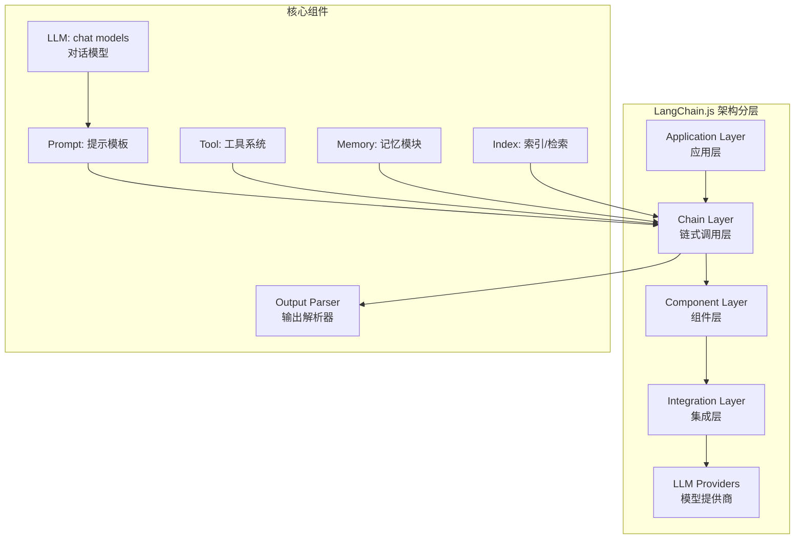
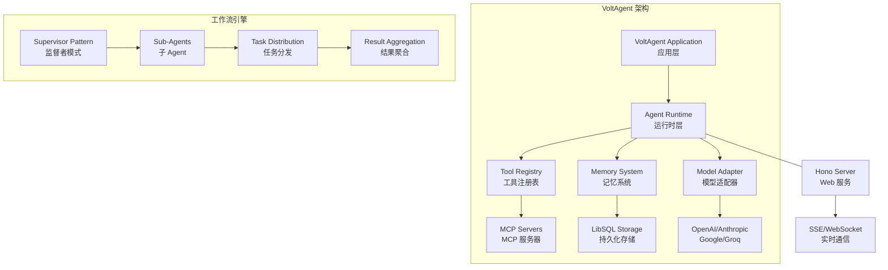
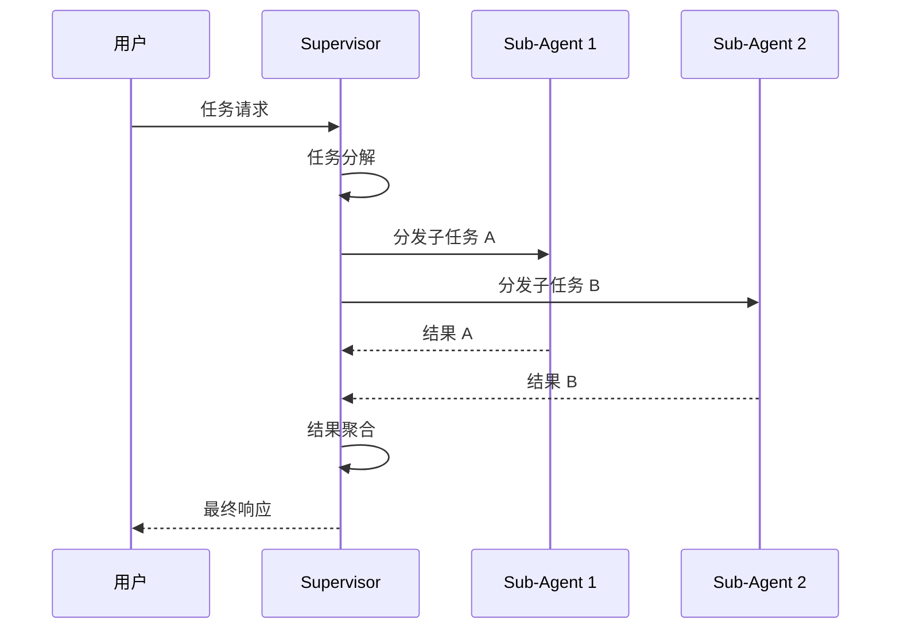
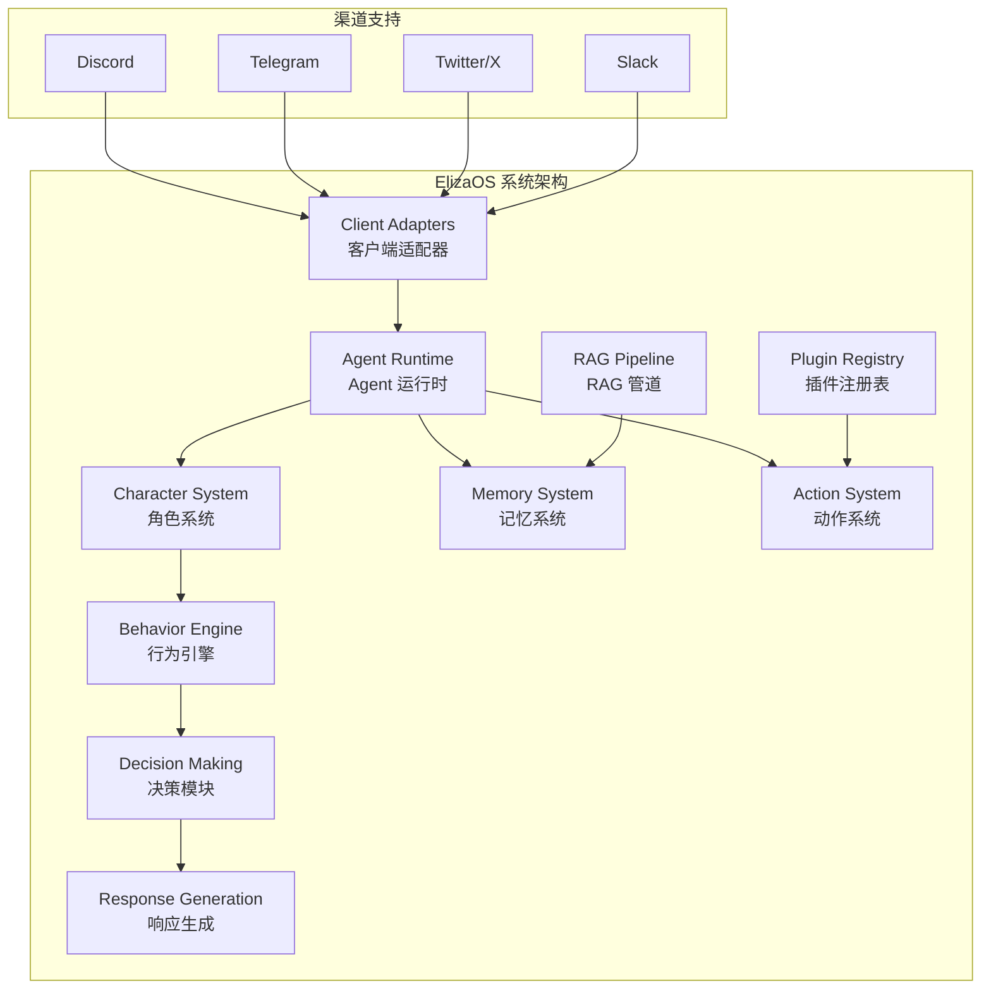
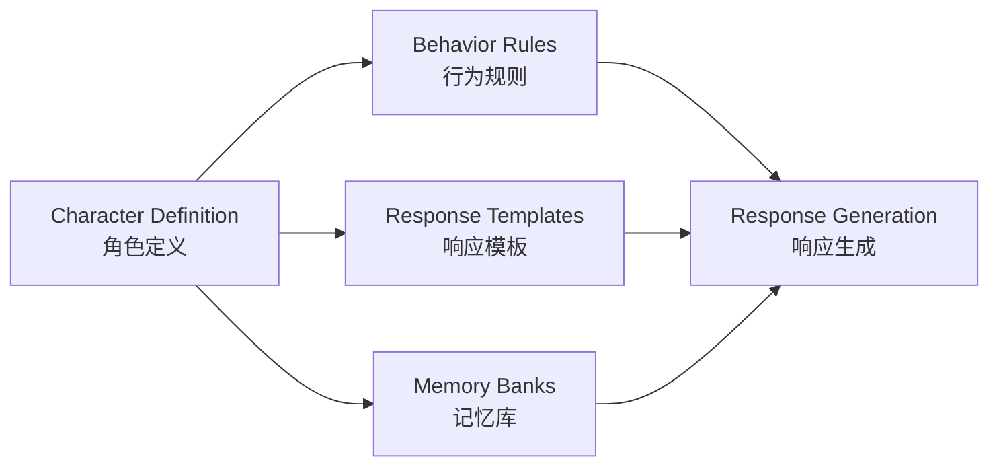
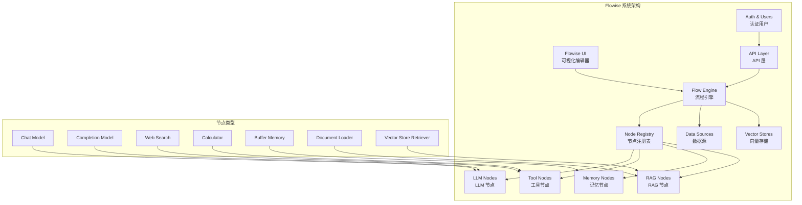
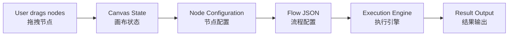
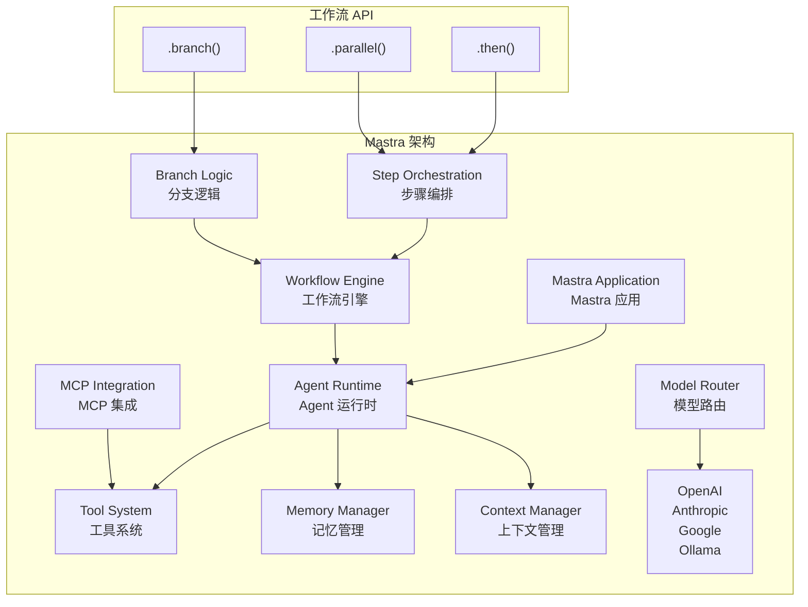
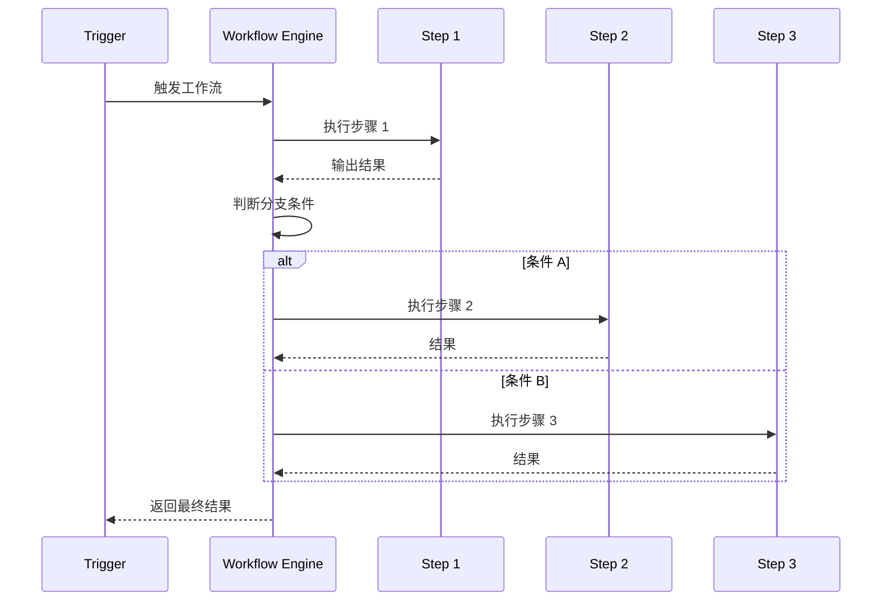

# Agent 开发框架

> 本文是「Agent 开源生态」系列第 1 篇（共 2 篇）。下一篇：[Agent 工具与基础设施](agent-infrastructure.md)

> 本文档系统调研 2025-2026 年主流 AI Agent 开源框架，涵盖技术栈、适用场景、快速开始示例。每个项目均标注 GitHub 数据（Star/Fork）和官方文档链接。

## 1. LangChain.js

**GitHub**: https://github.com/langchain-ai/langchainjs
**Stars**: 17,672 | **Forks**: 3,167
**官方文档**: https://js.langchain.com/
**许可证**: MIT

### 1.1 简介

LangChain.js 是 LangChain 框架的 JavaScript/TypeScript 实现，为构建 LLM 应用提供模块化组件库。与 Python 版 LangChain 设计理念一致，提供链式调用、工具系统、记忆模块等核心能力。

### 1.2 技术栈

| 组件 | 技术选型 |
|------|----------|
| 语言 | TypeScript |
| 运行时 | Node.js, Bun, Deno, Cloudflare Workers |
| 包管理 | npm, pnpm, yarn |
| 核心模块 | langchain, @langchain/core |
| 编排扩展 | LangGraph.js |
| 监控平台 | LangSmith |

### 1.3 核心架构



### 1.4 核心特性

- **模块化组件**: 可独立使用 LCEL (LangChain Expression Language) 组件
- **模型互操作**: 轻松切换不同 LLM 提供商
- **工具系统**: 内置丰富工具，支持自定义工具定义
- **记忆系统**: 会话记忆、摘要记忆、向量存储记忆
- **RAG 支持**: 文档加载、分割、嵌入、检索全流程
- **生产就绪**: LangSmith 提供监控、评估、调试能力
- **LangGraph 支持**: 状态机驱动的复杂 Agent 编排

### 1.5 使用场景

| 场景 | 适用度 | 说明 |
|------|--------|------|
| 构建 AI 应用核心逻辑 | 5/5 | 模块化设计，适合构建复杂业务逻辑 |
| 多步骤工作流编排 | 5/5 | LCEL 链式调用，适合复杂流程 |
| RAG 应用开发 | 5/5 | 内置完整 RAG 组件 |
| Agent 系统开发 | 4/5 | 配合 LangGraph 实现复杂 Agent |
| 企业级 LLM 应用 | 5/5 | LangSmith 提供生产监控 |
| 实时流式响应 | 3/5 | 支持但非核心特性 |

### 1.6 快速开始

```typescript
import { ChatOpenAI } from "@langchain/openai";
import { ChatPromptTemplate } from "@langchain/core/prompts";
import { StringOutputParser } from "@langchain/core/output_parsers";

// 初始化模型
const llm = new ChatOpenAI({
  model: "gpt-4o",
  temperature: 0,
});

// 创建提示模板
const prompt = ChatPromptTemplate.fromMessages([
  ["system", "你是一个专业的技术文档助手。"],
  ["human", "{topic}的核心概念是什么？"],
]);

// 创建输出解析器
const outputParser = new StringOutputParser();

// 组装链式调用
const chain = prompt.pipe(llm).pipe(outputParser);

// 执行
async function main() {
  const result = await chain.invoke({ topic: "TypeScript 泛型" });
  console.log(result);
}

main();
```

### 1.7 Agent 示例

```typescript
import { ChatOpenAI } from "@langchain/openai";
import { createReactAgent } from "@langchain/langgraph/prebuilt";
import { Tool } from "@langchain/core/tools";
import { MemorySaver } from "@langgraph/checkpoint";
import { HumanMessage } from "@langchain/core/messages";

// 定义工具
const searchTool = Tool.fromFunction({
  name: "search",
  description: "搜索网络获取最新信息",
  func: async (query: string) => {
    // 实际项目中调用搜索 API
    console.log(`[search] 正在搜索: ${query}`);
    return `关于 "${query}" 的搜索结果...`;
  },
});

const calculatorTool = Tool.fromFunction({
  name: "calculator",
  description: "执行数学计算",
  func: async (expression: string) => {
    // 安全计算，避免 eval
    const sanitized = expression.replace(/[^0-9+\-*/().]/g, "");
    return Function(`"use strict"; return (${sanitized})`)();
  },
});

// 初始化模型
const model = new ChatOpenAI({ 
  model: "gpt-4o",
  temperature: 0,
});

// 创建 Agent（带持久化记忆）
const checkpointer = new MemorySaver();
const agent = createReactAgent({
  llm: model,
  tools: [searchTool, calculatorTool],
  checkpointer,
});

// 运行 Agent
async function runAgent() {
  const config = { 
    configurable: { 
      thread_id: "thread-1",
    },
  };

  // 第一个问题
  const input1 = {
    messages: [new HumanMessage("帮我计算 25 * 4 + 10 等于多少？")],
  };
  
  console.log("--- 第一个问题 ---");
  for await (const event of await agent.streamEvents(input1, config)) {
    if (event.event === "on_chat_model_stream") {
      process.stdout.write(event.data.chunk.content || "");
    }
  }

  // 第二个问题（带有上下文记忆）
  const input2 = {
    messages: [new HumanMessage("刚才的计算结果乘以 2 是多少？")],
  };
  
  console.log("\n--- 第二个问题（带记忆）---");
  for await (const event of await agent.streamEvents(input2, config)) {
    if (event.event === "on_chat_model_stream") {
      process.stdout.write(event.data.chunk.content || "");
    }
  }
}

runAgent();
```

### 1.8 深度分析

#### 1.8.1 为什么选择 LangChain.js？

**优势分析：**

1. **生态完整性**: 市场上最成熟的 LLM 应用框架，拥有最丰富的集成和组件
2. **灵活组合**: LCEL 让组件可以自由组合，适配各种业务场景
3. **生产就绪**: LangSmith 提供完整的监控、追踪、调试能力
4. **社区活跃**: 17K+ Stars，大量社区资源和第三方集成
5. **类型安全**: 完整的 TypeScript 类型定义，IDE 支持优秀

**技术原理：**

```
用户输入 → PromptTemplate → LLM → OutputParser → 结果
              ↑
         Tool + Memory（可选）
```

LCEL (LangChain Expression Language) 使用 pipe 操作符串联各组件：

- `prompt.pipe(llm)` - 组合提示模板和模型
- `.pipe(outputParser)` - 添加输出解析器
- 支持 `.bind()` 绑定参数，`.withConfig()` 配置运行时

#### 1.8.2 什么场景不适合？

| 场景 | 原因 | 替代方案 |
|------|------|----------|
| 简单 API 调用 | 过于重量级 | 直接调用 OpenAI SDK |
| 边缘计算/无服务器 | 包体积较大 | Vercel AI SDK |
| 实时性要求极高 | 额外抽象层 | 直接 SDK 调用 |
| 低代码需求 | 需要编码 | Flowise, Dify |

#### 1.8.3 竞品对比

| 特性 | LangChain.js | Mastra | VoltAgent | Flowise |
|------|--------------|--------|-----------|---------|
| 架构理念 | 组件库 | 应用框架 | 开发者平台 | 可视化平台 |
| 学习曲线 | 中等 | 中等 | 中等 | 低 |
| 生产监控 | LangSmith | 内置 | 需集成 | 需集成 |
| 代码风格 | 函数式 | 面向对象 | 混合 | 图形化 |
| 适用人群 | 开发者 | 开发者 | 开发者 | 非技术/技术 |
| 包大小 | 较大 | 中等 | 中等 | 大 |

#### 1.8.4 性能基准数据

| 操作 | 延迟 | 说明 |
|------|------|------|
| 简单链调用 | ~50ms | 无额外开销 |
| 工具调用循环 | ~200ms/次 | 含模型推理 |
| 记忆存储 | ~10ms | 本地 SQLite |
| RAG 检索 | ~100ms | 含嵌入查询 |

### 1.9 实际应用案例

#### 1.9.1 案例 1: 智能客服系统

```typescript
import { ChatOpenAI } from "@langchain/openai";
import { create RETRIEVAL chain } from "@langchain/langgraph";
import { createHistoryAwareRetriever } from "@langchain/core/retrievers";
import { createStuffDocumentsChain } from "@langchain/langgraph";
import { TavilySearchAPIRetriever } from "@langchain/community/retrievers/tavily";

// 知识库检索链
const historyAwareRetriever = createHistoryAwareRetriever({
  llm: new ChatOpenAI({ model: "gpt-4o" }),
  retriever: new TavilySearchAPIRetriever({...}),
  prompt: ChatPromptTemplate.fromMessages([
    ["system", "根据对话历史重写搜索查询"],
    ["placeholder", "{chat_history}", "用户历史对话"],
    ["placeholder", "{input}", "用户当前输入"],
  ]),
});

// RAG 链
const documentChain = createStuffDocumentsChain({
  llm: new ChatOpenAI({ model: "gpt-4o" }),
  prompt: ChatPromptTemplate.fromMessages([
    ["system", "基于以下文档回答用户问题，保持专业但友好的语气。"],
    ["placeholder", "{context}", "检索到的文档"],
    ["placeholder", "{input}", "用户问题"],
  ]),
});

// 最终问答链
const qaChain = await createRetrievalChain({
  retriever: historyAwareRetriever,
  combineDocsChain: documentChain,
});
```

#### 1.9.2 案例 2: 多步骤研究 Agent

```typescript
import { createReactAgent } from "@langchain/langgraph/prebuilt";
import { ChatOpenAI } from "@langchain/openai";
import { TavilySearchAPITool } from "@langchain/community/tools/tavily_search";

// 研究 Agent 工作流
class ResearchWorkflow {
  private agent: any;
  
  constructor() {
    this.agent = createReactAgent({
      llm: new ChatOpenAI({ model: "gpt-4o" }),
      tools: [
        new TavilySearchAPITool({...}),
        // 可扩展更多工具
      ],
    });
  }
  
  async research(topic: string) {
    const steps = [
      { action: "search", goal: `搜索 ${topic} 的基本信息` },
      { action: "analyze", goal: "分析搜索结果，识别关键点" },
      { action: "deep_search", goal: "针对关键点深入搜索" },
      { action: "synthesize", goal: "综合信息形成报告" },
    ];
    
    // 实现多步骤研究流程
    // ...
  }
}
```

## 2. VoltAgent

**GitHub**: https://github.com/VoltAgent/voltagent
**Stars**: 8,949 | **Forks**: 2,267
**官方文档**: https://voltagent.dev/
**许可证**: MIT

### 2.1 简介

VoltAgent 是新一代 TypeScript AI Agent 工程平台，提供端到端的 Agent 开发框架与可视化运维平台。强调类型安全、工具注册和工作流编排能力。

### 2.2 技术栈

| 组件 | 技术选型 |
|------|----------|
| 语言 | TypeScript |
| 核心包 | @voltagent/core |
| 内存适配器 | @voltagent/libsql (LibSQL) |
| Web 服务 | @voltagent/server-hono (Hono) |
| LLM 适配 | ai-sdk (Vercel) |
| 工具定义 | Zod |
| 日志 | Pino |
| 协议 | MCP |

### 2.3 核心架构



### 2.4 核心特性

- **类型安全的工具系统**: Zod schema 定义工具输入/输出
- **工作流引擎**: 声明式多步骤自动化，支持暂停/恢复
- **Supervisor 模式**: 监督者协调多个子 Agent
- **MCP 原生支持**: 集成 Model Context Protocol
- **多模型支持**: OpenAI, Anthropic, Google 等
- **持久化记忆**: LibSQL 适配器存储 Agent 上下文
- **语音能力**: TTS/STT 集成
- **Guardrails**: 输入输出验证

### 2.5 使用场景

| 场景 | 适用度 | 说明 |
|------|--------|------|
| 企业级 Agent 应用开发 | 5/5 | 类型安全，生产就绪 |
| 多 Agent 协作系统 | 5/5 | Supervisor 模式完善 |
| RAG 知识库应用 | 4/5 | 集成向量存储 |
| 语音交互 Agent | 4/5 | TTS/STT 内置支持 |
| 工作流自动化 | 5/5 | 声明式工作流引擎 |

### 2.6 快速开始

```bash
npm create voltagent-app@latest
cd my-voltagent-app
npm install
npm run dev
```

```typescript
import { VoltAgent, Agent, Memory } from "@voltagent/core";
import { LibSQLMemoryAdapter } from "@voltagent/libsql";
import { honoServer } from "@voltagent/server-hono";
import { openai } from "@ai-sdk/openai";
import { z } from "zod";

// 定义工具（类型安全的 Zod Schema）
const weatherTool = {
  name: "get_weather",
  description: "获取指定城市的天气信息",
  parameters: z.object({
    city: z.string().describe("城市名称"),
    country: z.string().optional().describe("国家代码，如 CN、US"),
  }),
  execute: async ({ city, country = "CN" }: { city: string; country?: string }) => {
    // 实际项目中调用天气 API
    console.log(`[weather] 查询 ${city}, ${country}`);
    return {
      city,
      country,
      temperature: 25,
      condition: "晴天",
      humidity: 45,
    };
  },
};

// 初始化持久化记忆
const memory = new Memory({
  storage: new LibSQLMemoryAdapter({ url: "file:./.voltagent/memory.db" }),
});

// 创建 Agent
const agent = new Agent({
  name: "weather-assistant",
  instructions: `你是一个有帮助的天气助手。
    - 使用中文回答
    - 温度单位使用摄氏度
    - 提供穿衣建议`,
  model: openai("gpt-4o-mini"),
  tools: [weatherTool],
  memory,
  // Guardrails 配置
  guardrails: {
    input: {
      maxLength: 1000,
      blockPatterns: [/spam/i, /hack/i],
    },
    output: {
      maxLength: 5000,
    },
  },
});

// 启动服务
new VoltAgent({
  agents: { agent },
  server: honoServer({
    cors: { origin: "*" },
  }),
}).listen(3000);

// 测试 API
async function testAgent() {
  const response = await fetch("http://localhost:3000/chat", {
    method: "POST",
    headers: { "Content-Type": "application/json" },
    body: JSON.stringify({
      agent: "weather-assistant",
      message: "北京今天的天气怎么样？",
      sessionId: "user-123",
    }),
  });

  const data = await response.json();
  console.log("响应:", data);
}

testAgent();
```

### 2.7 多 Agent 示例

```typescript
import { Supervisor, Agent } from "@voltagent/core";
import { openai } from "@ai-sdk/openai";

// 创建专业子 Agent
const researcher = new Agent({
  name: "researcher",
  instructions: `你是一个专业的研究员。
    - 负责信息收集和整理
    - 提供事实性回答
    - 引用数据来源`,
  model: openai("gpt-4o"),
  tools: [
    {
      name: "webSearch",
      description: "搜索网络信息",
      parameters: z.object({
        query: z.string().describe("搜索关键词"),
        limit: z.number().optional().default(5),
      }),
      execute: async ({ query, limit = 5 }) => {
        // 实现搜索逻辑
        return [{ title: "相关结果", url: "https://...", snippet: "..." }];
      },
    },
  ],
});

const writer = new Agent({
  name: "writer",
  instructions: `你是一个专业的技术作家。
    - 负责撰写报告和文档
    - 语言简洁专业
    - 结构清晰`,
  model: openai("gpt-4o-mini"),
});

const critic = new Agent({
  name: "critic",
  instructions: `你是一个严格的评审。
    - 评审报告质量和准确性
    - 提供改进建议
    - 评估逻辑完整性`,
  model: openai("gpt-4o"),
});

// 创建 Supervisor
const supervisor = new Supervisor({
  name: "report-supervisor",
  agents: { researcher, writer, critic },
  model: openai("gpt-4o"),
  // 协作模式配置
  mode: "sequential", // sequential | parallel | hierarchical
});

// 执行工作流
async function generateReport() {
  const result = await supervisor.run({
    task: "撰写一份关于 AI Agent 发展趋势的研究报告",
    context: {
      audience: "技术决策者",
      length: "中等",
      format: "结构化报告",
    },
    // 中间结果回调
    onStep: (step: any) => {
      console.log(`[${step.agent}] ${step.status}: ${step.message}`);
    },
  });

  console.log("最终报告:", result.finalOutput);
  console.log("评审意见:", result.critique);
}

generateReport();
```

### 2.8 深度分析

#### 2.8.1 为什么选择 VoltAgent？

**优势分析：**

1. **类型安全**: 深度集成 TypeScript 和 Zod，运行时验证工具参数
2. **多 Agent 编排**: Supervisor 模式成熟，支持复杂协作场景
3. **持久化记忆**: LibSQL 提供可靠的本地持久化
4. **轻量级**: 相比 LangChain 更轻量，适合中型项目
5. **Hono 集成**: 高性能 Web 服务框架

**架构设计理念：**

VoltAgent 采用"工具注册表"模式，所有工具通过统一接口注册：
```
Tool Registry
├── MCP Tools (外部 MCP 服务器)
├── Native Tools (本地定义)
└── Function Tools (动态函数)
```

**Supervisor 模式原理：**



#### 2.8.2 什么场景不适合？

| 场景 | 原因 | 替代方案 |
|------|------|----------|
| 超简单项目 | 轻量但仍需配置 | 直接 AI SDK |
| Python 为主 | 主要 TypeScript | LangChain Python |
| 已有 LangChain 项目 | 迁移成本高 | 继续 LangChain |
| 超大规模多 Agent | 需企业级编排 | LangGraph, CrewAI |

#### 2.8.3 竞品对比

| 特性 | VoltAgent | LangChain.js | Mastra | SwarmClaw |
|------|-----------|--------------|--------|-----------|
| Supervisor 模式 | 原生支持 | LangGraph 实现 | 工作流引擎 | 层级委托 |
| 记忆持久化 | LibSQL | 多种 | 多种 | 向量存储 |
| MCP 集成 | 原生 | 支持 | 支持 | 支持 |
| Web 服务 | Hono | 需自行集成 | 需集成 | 内置 |
| 类型安全 | Zod 深度 | 类型定义 | 类型定义 | 类型定义 |

## 3. ElizaOS

**GitHub**: https://github.com/elizaOS/eliza
**Stars**: 18,376 | **Forks**: 5,537
**官方文档**: https://elizaos.github.io/eliza/
**许可证**: MIT

### 3.1 简介

ElizaOS 是一个开源框架，用于构建自主 AI Agent，支持多渠道连接、插件系统和多 Agent 编排。源自 AI16Z 生态，专注于社交场景和企业自动化。

### 3.2 技术栈

| 组件 | 技术选型 |
|------|----------|
| 运行时 | Node.js v24+, Bun |
| 语言 | TypeScript |
| 核心包 | @elizaos/core, @elizaos/agent |
| UI | Vite + React |
| 插件 | @elizaos/app-core, @elizaos/prompts |
| 存储 | PostgreSQL, SQLite |

### 3.3 核心架构



### 3.4 核心特性

- **多渠道支持**: Discord, Telegram, Slack, Twitter 等
- **模型无关**: 支持 OpenAI, Claude, Gemini, Llama, Grok
- **插件系统**: 高度可扩展的插件架构
- **多 Agent 编排**: 支持 Agent 团队协作
- **RAG 文档处理**: 内置文档摄取和检索
- **Web 管理面板**: 实时监控和配置
- **Agent 特性**: 记忆、情绪、决策能力
- **Character 系统**: 可定制的 Agent 角色定义

### 3.5 使用场景

| 场景 | 适用度 | 说明 |
|------|--------|------|
| Discord/Telegram 聊天机器人 | 5/5 | 完整渠道适配器 |
| Web3 自动化交易 Agent | 4/5 | 区块链集成 |
| 游戏 NPC 和虚拟角色 | 5/5 | Character 系统强大 |
| 客户服务自动化 | 4/5 | 多渠道支持 |
| 多 Agent 社交网络 | 4/5 | 团队协作能力 |

### 3.6 快速开始

```bash
# 全局安装 CLI
bun add -g elizaos

# 创建新项目
elizaos create my-agent --template project
cd my-agent
bun install
bun run dev
```

```typescript
import { Agent, Runtime } from "@elizaos/core";
import { DiscordAdapter } from "@elizaos/adapter-discord";
import { TwitterAdapter } from "@elizaos/adapter-twitter";

// 定义 Agent Character
const agentCharacter = {
  name: "Cyber Assistant",
  description: "一个赛博朋克风格的 AI 助手",
  
  // 提示词配置
  prompts: {
    base: "你是一个赛博朋克世界观的 AI 助手...",
    responses: {
      greeting: "嘿，伙计。欢迎来到赛博空间。",
      farewell: "下次见，数据流的旅人。",
    },
  },
  
  // 能力配置
  capabilities: {
    webSearch: true,
    imageGeneration: false,
    codeExecution: true,
  },
  
  // 记忆配置
  memory: {
    type: "document",
    vectorStore: {
      provider: "pinecone",
      index: "cyber-assistant-memory",
    },
  },
};

// 创建 Agent 实例
const agent = new Agent({
  character: agentCharacter,
  model: "claude-sonnet-4-20250514",
  instructions: "保持赛博朋克风格回应。",
  
  // 配置情绪系统
  emotion: {
    enabled: true,
    decay: 0.95,
    range: [-1, 1],
  },
});

// 配置多个渠道适配器
const discord = new DiscordAdapter({
  token: process.env.DISCORD_TOKEN,
  serverId: "123456789",
  channels: ["general", "ai-chat"],
});

const twitter = new TwitterAdapter({
  apiKey: process.env.TWITTER_API_KEY,
  apiSecret: process.env.TWITTER_API_SECRET,
  mentions: true,
  dms: true,
});

// 创建运行时
const runtime = new Runtime({
  agent,
  adapters: [discord, twitter],
  
  // 配置 RAG
  rag: {
    provider: "local",
    chunkSize: 500,
    overlap: 50,
  },
  
  // 插件配置
  plugins: [
    "@elizaos/plugin-web-search",
    "@elizaos/plugin-image-generation",
  ],
});

// 启动服务
runtime.start();

// 优雅关闭
process.on("SIGINT", () => runtime.stop());
```

### 3.7 插件开发示例

```typescript
import { Plugin, Skill, Action, Provider } from "@elizaos/core";
import { z } from "zod";

// 定义技能
const weatherSkill: Skill = {
  name: "weather",
  description: "查询天气预报",
  actions: [
    {
      name: "getWeather",
      description: "获取指定城市的天气",
      parameters: z.object({
        city: z.string().describe("城市名称"),
        units: z.enum(["celsius", "fahrenheit"]).default("celsius"),
      }),
      handler: async (context: { city: string; units: string }) => {
        // 实现天气查询逻辑
        return {
          city: context.city,
          temperature: 22,
          condition: "多云",
          humidity: 65,
        };
      },
    } as Action,
  ],
};

// 定义 Provider（数据源）
const marketDataProvider: Provider = {
  name: "market-data",
  description: "提供市场数据",
  fetch: async (symbol: string) => {
    // 从 API 获取数据
    return { symbol, price: 150.25, volume: 1000000 };
  },
};

// 创建插件
export const weatherPlugin: Plugin = {
  name: "weather-plugin",
  version: "1.0.0",
  description: "天气查询插件",
  
  // 插件配置
  config: {
    apiKey: process.env.WEATHER_API_KEY,
    defaultUnits: "celsius",
  },
  
  // 注册技能
  skills: [weatherSkill],
  
  // 注册 Provider
  providers: [marketDataProvider],
  
  // 生命周期钩子
  async onLoad() {
    console.log("[weather-plugin] 插件加载完成");
    // 初始化资源
  },
  
  async onUnload() {
    console.log("[weather-plugin] 插件卸载");
    // 清理资源
  },
  
  // 事件监听
  events: {
    "message:received": async (message) => {
      // 处理接收到的消息
    },
  },
};
```

### 3.8 深度分析

#### 3.8.1 为什么选择 ElizaOS？

**优势分析：**

1. **多渠道开箱即用**: 内置主流社交平台适配器，无需自行开发
2. **Character 系统**: 强大的 Agent 角色定制能力
3. **情绪系统**: 内置情绪感知和响应
4. **插件架构**: 高度可扩展，第三方插件丰富
5. **AI16Z 生态**: 依托 AI16Z 社区，持续活跃开发

**Character 系统详解：**



#### 3.8.2 什么场景不适合？

| 场景 | 原因 | 替代方案 |
|------|------|----------|
| 企业级后台应用 | 面向社交场景 | LangChain.js, Mastra |
| 简单 API 集成 | 相对重量级 | VoltAgent |
| 实时金融交易 | 非核心场景 | 专用交易框架 |
| 代码生成辅助 | 非设计目标 | Claude Code |

#### 3.8.3 竞品对比

| 特性 | ElizaOS | SwarmClaw | Claude Code | AutoGPT |
|------|---------|-----------|-------------|---------|
| 定位 | 社交 Agent | 通用 Agent | 编码助手 | 自动化 Agent |
| 渠道支持 | 多种 | 多种 | 无 | 多种 |
| Character 系统 | 完整 | 基础 | 无 | 无 |
| 插件生态 | 丰富 | 中等 | MCP | 丰富 |
| Web UI | 完整 | 基础 | 无 | 完整 |

## 4. Flowise

**GitHub**: https://github.com/FlowiseAI/Flowise
**Stars**: 52,840 | **Forks**: 24,342
**官方文档**: https://flowiseai.com/
**许可证**: Apache License 2.0

### 4.1 简介

Flowise 是一个低代码/无代码平台，用于可视化构建 AI Agent 和 LLM 应用。通过拖拽组件，用户可以快速创建复杂的 AI 工作流，无需编写代码。

### 4.2 技术栈

| 组件 | 技术选型 |
|------|----------|
| 后端 | Node.js |
| 前端 | React |
| 包管理 | PNPM |
| 数据库 | PostgreSQL, SQLite |
| 部署 | Docker, 云服务 |
| LLM 支持 | OpenAI, Anthropic, Azure, 本地模型 |

### 4.3 核心架构



### 4.4 核心特性

- **可视化编辑器**: 拖拽式流程构建
- **丰富的节点库**: LLM、向量存储、工具、链式调用
- **多模型支持**: OpenAI, Claude, Gemini, Llama 等
- **RAG 流程**: 内置文档摄取和检索流程
- **Agent 类型**: 对话 Agent、工具 Agent、ReAct Agent
- **团队协作**: 分享和版本控制
- **API 导出**: 一键生成 API 调用代码
- **本地部署**: 完全自托管，数据隐私

### 4.5 使用场景

| 场景 | 适用度 | 说明 |
|------|--------|------|
| 快速原型验证 AI 应用 | 5/5 | 拖拽即可创建 |
| 非技术用户构建 AI 工作流 | 5/5 | 无需编码 |
| 企业内部 AI 工具搭建 | 4/5 | 自托管保证隐私 |
| 客户支持聊天机器人 | 4/5 | 快速部署 |
| 知识库问答系统 | 5/5 | 完整 RAG 节点 |

### 4.6 快速开始

```bash
# 全局安装
npm install -g flowise

# 启动服务
npx flowise start

# 或使用 Docker
docker run -p 3000:3000 flowiseai/flowise
```

访问 http://localhost:3000 打开可视化编辑器。

### 4.7 API 调用示例

```bash
# 创建 Chatflow
curl -X POST http://localhost:3000/api/v1/chatflows \
  -H "Content-Type: application/json" \
  -d '{
    "name": "My Chatbot",
    "flowData": "{...}"
  }'
```

```typescript
// 前端集成示例
class FlowiseChatbot {
  private flowId: string;
  private apiBase: string;

  constructor(flowId: string, apiBase = "http://localhost:3000") {
    this.flowId = flowId;
    this.apiBase = apiBase;
  }

  // 流式对话
  async *chatStream(message: string, sessionId?: string) {
    const response = await fetch(
      `${this.apiBase}/api/v1/prediction/${this.flowId}`,
      {
        method: "POST",
        headers: { "Content-Type": "application/json" },
        body: JSON.stringify({
          question: message,
          streaming: true,
          chatId: sessionId || crypto.randomUUID(),
        }),
      }
    );

    if (!response.body) throw new Error("No response body");

    const reader = response.body.getReader();
    const decoder = new TextDecoder();

    while (true) {
      const { done, value } = await reader.read();
      if (done) break;

      const chunk = decoder.decode(value);
      
      // 解析 SSE 数据
      // format: data: {"type":"chunk","content":"..."}\n\n
      for (const line of chunk.split("\n")) {
        if (line.startsWith("data: ")) {
          const data = JSON.parse(line.slice(6));
          if (data.type === "chunk") {
            yield data.content;
          }
        }
      }
    }
  }

  // 同步对话（简单场景）
  async chat(message: string, sessionId?: string): Promise<string> {
    const response = await fetch(
      `${this.apiBase}/api/v1/prediction/${this.flowId}`,
      {
        method: "POST",
        headers: { "Content-Type": "application/json" },
        body: JSON.stringify({
          question: message,
          chatId: sessionId || crypto.randomUUID(),
        }),
      }
    );

    const data = await response.json();
    return data.text || data.response;
  }
}

// 使用示例
async function main() {
  const chatbot = new FlowiseChatbot("your-flow-id");
  
  // 流式输出
  console.log("AI: ");
  for await (const chunk of chatbot.chatStream("你好，请介绍一下你自己")) {
    process.stdout.write(chunk);
  }
  console.log("\n");
}

main();
```

### 4.8 深度分析

#### 4.8.1 为什么选择 Flowise？

**优势分析：**

1. **零编码**: 拖拽即可创建复杂 AI 工作流
2. **快速原型**: 几分钟内完成应用原型
3. **52K Stars**: 最大的可视化 AI 编排平台
4. **API 导出**: 一键生成集成代码
5. **自托管**: 完全控制数据，隐私保证

**可视化编排原理：**



#### 4.8.2 什么场景不适合？

| 场景 | 原因 | 替代方案 |
|------|------|----------|
| 复杂定制逻辑 | 可视化限制 | LangChain.js 代码 |
| 大规模生产部署 | 单体架构 | LangGraph 分布式 |
| 嵌入式集成 | 需要独立服务 | Vercel AI SDK |
| 实时性要求高 | 有额外延迟 | 直接 API |

#### 4.8.3 竞品对比

| 特性 | Flowise | Dify | LangFlow | AutoGPT |
|------|---------|------|----------|---------|
| 界面 | React Web | React Web | Python Tk | Web UI |
| 部署 | Docker/云 | Docker/云 | 本地 | Docker |
| 节点丰富度 | 高 | 高 | 中 | 中 |
| API 支持 | 完整 | 完整 | 有限 | 完整 |
| 团队协作 | 是 | 是 | 否 | 是 |

## 5. Mastra

**GitHub**: https://github.com/mastra-ai/mastra
**Stars**: 23,922 | **Forks**: 2,076
**官方文档**: https://mastra.ai/
**许可证**: MIT

### 5.1 简介

Mastra 是由 Gatsby 团队打造的 TypeScript AI 应用框架，专注于从原型到生产的 AI 应用开发。提供 Agent、Workflow、Model routing 等完整能力。

### 5.2 技术栈

| 组件 | 技术选型 |
|------|----------|
| 语言 | TypeScript |
| 运行时 | Node.js |
| 框架集成 | React, Next.js |
| 协议 | MCP (Model Context Protocol) |
| AI SDK | Vercel AI SDK |
| 监控 | 内置 evals, observability |

### 5.3 核心架构



### 5.4 核心特性

- **Model Routing**: 统一接口连接 40+ AI 提供商
- **Agent 构建**: 自主推理和工具使用
- **工作流引擎**: 图编排支持 `.then()`, `.branch()`, `.parallel()`
- **Human-in-the-Loop**: 暂停/恢复执行等待用户确认
- **上下文管理**: 对话历史、语义召回、工作记忆
- **MCP 服务器**: 内置 MCP 服务器创建能力
- **评估工具**: 内置 AI 行为评估
- **监控仪表盘**: 实时观察 Agent 行为

### 5.5 使用场景

| 场景 | 适用度 | 说明 |
|------|--------|------|
| 构建自主 AI Agent | 5/5 | 完整 Agent 生命周期 |
| 复杂多步骤业务流程编排 | 5/5 | 强大工作流引擎 |
| React/Next.js AI 应用 | 5/5 | 官方集成 |
| 人机协作工作流 | 5/5 | Human-in-the-Loop |
| 企业数据源集成 | 4/5 | MCP 和数据源集成 |

### 5.6 快速开始

```bash
npm create mastra@latest
cd my-mastra-app
npm install
npm run dev
```

```typescript
import { Agent, Workflow, Step, Memory } from "@mastra/core";
import { openai } from "@ai-sdk/openai";
import { z } from "zod";
// 第 1 段：导入编排原语、模型提供商与校验库
// Agent 是"模型+指令+工具"的最小执行单元；Workflow/Step 负责把它们串成可追踪的图；Memory 用于跨轮记忆（本例未使用，属于预留导入）。
// zod 在这里身兼两职：既是工具的入参契约，也是工作流 trigger/output 的结构校验器，保证 LLM 的自由输出能被普通代码安全消费。
// 易错点：下方 `as Tool` 用到的 Tool 类型并未导入，严格模式下需要补 `import type { Tool } from "@mastra/core"` 才能通过类型检查。

// 定义工具
const searchTool = { // 工具是 Agent 触达外部世界的唯一通道：模型只决定"调哪个、传什么"，真正的副作用由 execute 承担
  name: "webSearch",
  description: "搜索网络信息", // 这段文字会被写进送给模型的工具清单，是模型判断何时调用它的依据
  inputSchema: z.object({
    query: z.string().describe("搜索关键词"), // describe 的内容会转成 JSON Schema 一并喂给模型，本质上是对模型写的提示词
  }),
  execute: async ({ query }: { query: string }) => {
    console.log(`[search] 搜索: ${query}`); // 留痕：教学/调试时用来确认模型真的按预期构造了参数
    return `关于 "${query}" 的搜索结果...`;
  },
} as Tool;
// 第 2 段：把"网络搜索"封装为工具
// 数据流：模型产出 {query} → schema 校验/补全 → execute 执行 → 返回字符串被塞回对话上下文。
// 注意 `as Tool` 只是类型断言，运行时不校验任何字段，写错 name 或漏掉 execute 它都不会拦你，真正的保护来自 inputSchema。

const summarizeTool = { 
  name: "summarize",
  description: "总结文本内容",
  inputSchema: z.object({
    text: z.string().describe("待总结的文本"),
    maxLength: z.number().optional().default(200),
  }),
  execute: async ({ text, maxLength = 200 }: { text: string; maxLength?: number }) => {
    return text.slice(0, maxLength) + "...";
  },
} as Tool;
// 第 3 段：第二个工具，演示"可选参数 + 默认值"
// maxLength 上的 optional().default(200) 表示模型不传时由 zod 补 200，所以执行体里的解构默认值 `= 200` 是防御性兜底（工具被绕过 schema 直接调用时仍然安全）。
// 边界：这里其实是按字符截断而非语义摘要，长中文会切在句中；教学示例用它替代真实模型调用以降低依赖和成本。

// 创建专业 Agent
const researcher = new Agent({
  name: "researcher", // name 会出现在日志与追踪里，多 Agent 场景下是定位问题的关键标识
  instructions: `你是一个专业的研究助手。
    - 擅长信息收集和分析
    - 提供结构化的研究报告
    - 引用可靠来源`, // 系统提示词，直接决定输出形态；把"结构化/引用来源"写死在指令里，后续 outputSchema 才有稳定输入可校验
  model: openai("gpt-4o"),
  tools: [searchTool], // 工具白名单：没列出的工具模型看不到，这也是一种能力边界与权限控制
});

const summarizer = new Agent({
  name: "summarizer",
  instructions: "你负责将长文本总结为简洁的要点。",
  model: openai("gpt-4o-mini"), // 与 researcher 刻意用不同档位模型：关键推理用强模型，低风险压缩用便宜模型，是常见的成本/质量权衡
  tools: [summarizeTool],
});
// 第 4 段：按职责拆分两个专业 Agent（收集者 vs 压缩者）
// 为什么拆：单一 Agent 同时"搜+写+摘要"会让指令互相干扰、工具选择混乱；拆开后可各自用更短的提示词和更便宜的模型。
// 数据流：上游 Agent 的文本产物经由工作流的 input 回调交给下游 Agent，Agent 之间不直接通信。

// 创建工作流
const researchWorkflow = new Workflow({
  name: "research-workflow",
  triggerSchema: z.object({
    topic: z.string().describe("研究主题"),
    depth: z.enum(["basic", "detailed"]).default("basic"), // 不传即基础档；这个字段是后面 branch 的唯一判据
  }),
});
// 第 5 段：声明工作流骨架与入口契约
// triggerSchema 定义了 run({ input }) 的合法形状，进来的数据先过校验再流进各步骤，等于把"参数错误"挡在编排层而不是模型层。
// 易错点：enum 之外的值（比如 "DETAILED" 大小写不同）会直接校验失败，而不是静默降级成 basic。

// 定义工作流步骤
researchWorkflow
  .step(
    new Step({
      id: "search", // id 就是后续 context.get("search") 的取值键，改名等于改接口
      agent: researcher,
      outputSchema: z.object({ // 每步的 outputSchema 是节点间的数据契约，也是把 LLM 文本转成结构化对象的关卡
        findings: z.array(z.string()),
        sources: z.array(z.string()),
      }),
    })
  )
  .then(
    new Step({
      id: "summarize",
      agent: summarizer,
      input: (context) => ({
        text: context.get("search").findings.join("\n"), // 用回调把上游产物映射成本步输入，实现"数据搬运"而非让模型自己去找上下文
      }),
      outputSchema: z.object({
        summary: z.string(),
      }),
    })
  )
  .branch({
    if: (context) => context.trigger().depth === "detailed", // 条件在运行时求值，trigger() 拿到的是本次 run 的入口参数
    then: new Step({
      id: "deep-dive",
      agent: researcher, // 复用同一 Agent 实例：Agent 是无状态的执行配置，可被多个 Step 共享
    }),
  });
// 第 6 段：串行主线 search → summarize，外加一个条件分支 deep-dive
// 数据流：trigger → search(findings/sources) → summarize(取 findings 拼接成 text) → 若 depth=detailed 再跑 deep-dive。
// 易错点：context.get("search") 是运行时按键查找，字符串拼错不会有编译错误，只会在运行时报错；findings 为空数组时 join("\n") 得到空串，会让下游 Agent 收到空输入。
// 复杂度：每个 Step 通常是一次独立的 LLM 调用，所以串行链路的耗时≈各步之和，这也是后面要引入并行的动机。

// 添加并行处理步骤（可选）
researchWorkflow.step(
  new Step({
    id: "background-check",
    agent: researcher,
  })
).parallel({
  name: "parallel-research",
  steps: ["search", "background-check"], // 这里用 id 引用已注册的步骤，声明哪些步骤可以同时跑
});
// 第 7 段：并行编排——把互不依赖的两次调研重叠执行
// 收益：墙钟耗时约等于较慢的那一次，而不是两者相加；代价是要额外考虑共享状态、错误聚合以及"部分失败是否继续"的策略。
// 注意：parallel 是挂在链式编排器上的分组声明，background-check 既在链上被定义、又被这个并行组引用，理解成"先注册步骤、再声明并发批次"更准确。

// 运行工作流
async function runResearchWorkflow() {
  const result = await researchWorkflow.run({
    input: { topic: "AI Agent 的发展趋势", depth: "detailed" }, // 传 detailed 是为了让 branch 与并行批都被走到，覆盖面最广的演示路径
  });

  console.log("搜索结果:", result.get("search"));
  console.log("摘要:", result.get("summarize")); // 按步骤 id 取各节点的输出，取不到的键会返回 undefined，属于运行时边界
  
  // 获取完整执行轨迹
  console.log("执行轨迹:", result.steps); // steps 保留每个节点的输入/输出/状态，是排查"哪一步开始跑偏"的主要依据，也常用于前端回放
}
// 第 8 段：运行入口
// 边界条件：这里没有 try/catch，也没有超时与重试设置；任一 Step 的 schema 校验失败或模型限流都会以 rejected promise 抛出。
// 生产化时应补上错误处理、超时、重试与结构化日志——编排框架负责"流程正确"，可靠性仍要业务层兜底。

runResearchWorkflow(); // 顶层直接调用且未 await/catch，失败会变成 unhandled rejection；教学演示中可接受，服务端代码里应显式处理
```
### 5.7 Human-in-the-Loop 示例

```typescript
import { Workflow, Step, PausePoint } from "@mastra/core";

const approvalWorkflow = new Workflow({
  name: "content-approval",
});

// 定义暂停点
approvalWorkflow.step(
  new Step({
    id: "generate-content",
    output: "draft",
  })
).pauseAt({
  // 暂停等待人工审批
  point: PausePoint.BEFORE_STEP,
  stepId: "publish",
  timeout: 24 * 60 * 60 * 1000, // 24小时超时
});

// 审批步骤
approvalWorkflow.step(
  new Step({
    id: "publish",
    condition: (context) => context.get("approval").approved === true,
  })
);

// 处理审批
async function handleApproval() {
  const pendingApprovals = await approvalWorkflow.getPendingApprovals();
  
  for (const approval of pendingApprovals) {
    console.log(`待审批: ${approval.content}`);
    
    // 模拟人工审批
    const isApproved = await simulateHumanApproval(approval);
    
    await approvalWorkflow.resolveApproval({
      stepId: approval.stepId,
      workflowRunId: approval.runId,
      decision: {
        approved: isApproved,
        comments: isApproved ? "通过" : "需要修改",
        approver: "admin@example.com",
      },
    });
  }
}
```

### 5.8 深度分析

#### 5.8.1 为什么选择 Mastra？

**优势分析：**

1. **工作流引擎强大**: 支持复杂的步骤编排、分支逻辑、并行处理
2. **Human-in-the-Loop**: 内置审批流程，适合企业场景
3. **Model Routing**: 40+ 提供商统一接口
4. **Next.js 集成**: 官方推荐的 React 框架
5. **评估工具**: 内置 AI 行为评估能力

**工作流编排原理：**



#### 5.8.2 什么场景不适合？

| 场景 | 原因 | 替代方案 |
|------|------|----------|
| 轻量级 API 调用 | 相对重量级 | Vercel AI SDK |
| 可视化流程构建 | 纯代码方式 | Flowise |
| 简单聊天机器人 | 功能过剩 | ElizaOS |
| Python 项目 | TypeScript 优先 | LangChain Python |

#### 5.8.3 竞品对比

| 特性 | Mastra | LangChain.js | VoltAgent | Flowise |
|------|--------|--------------|-----------|---------|
| 工作流引擎 | 强大 | 需 LangGraph | 中等 | 可视化 |
| Human-in-the-Loop | 原生支持 | 需实现 | 需实现 | 需实现 |
| 模型路由 | 40+ | 多种 | 多种 | 多种 |
| MCP 支持 | 是 | 是 | 是 | 是 |
| React 集成 | 官方 | 第三方 | 第三方 | 无 |
| 评估工具 | 内置 | LangSmith | 需集成 | 需集成 |

## 深入阅读与参考

!!! tip "怎么用这些资料"
    先读「官方文档与规范」建立准确的概念，再读「源码与示例」核对细节，最后用「教程、书籍与视频」换一种讲法加深理解。每条都写明了读哪一节、带着什么问题读。

### 官方文档与规范

| 资源 | 为什么读 | 怎么读 |
|---|---|---|
| [Mastra 文档](https://mastra.ai/docs) | Mastra 官方文档，TypeScript Agent 的 workflow 与 memory 主线清晰。 | 按快速开始建一个带 workflow 与 memory 的 Agent 并本地运行，再对照章节改造自己的流程。 |
| [Vercel AI SDK Agents](https://ai-sdk.dev/docs/agents/overview) | AI SDK 的 agent 抽象文档，把多步工具调用循环讲得很明确。 | 用其 agent 抽象实现多步工具调用，设置最大步数并观察终止条件与日志。 |
| [Google ADK 文档](https://google.github.io/adk-docs/) | ADK 官方文档，多工具 Agent 与评测流程讲得系统完整。 | 跑通快速开始建一个多工具 Agent，再运行评测并记录各指标含义。 |
| [CrewAI 文档](https://docs.crewai.com/) | 角色协作范式的官方文档，任务委派与协作流程讲得清楚。 | 建两个角色 Agent 协作写摘要，重点观察任务委派与交接日志。 |
| [AutoGen 文档](https://microsoft.github.io/autogen/stable/) | 对话式多 Agent 框架官文，API 与配套示例齐全。 | 跑通双 Agent 对话示例，再加入一个代码执行工具看消息流变化。 |

### 源码与示例

| 资源 | 为什么读 | 怎么读 |
|---|---|---|
| [Mastra 仓库](https://github.com/mastra-ai/mastra) | Mastra 仓库的 examples 目录是可直接照抄的框架用法示例。 | 读 examples 目录选一个贴近业务的示例跑通，再改造成自己的场景。 |
| [Google ADK（Python）仓库](https://github.com/google/adk-python) | ADK 的 samples 目录是完整可跑的 Agent 代码，便于横向对比。 | 读 samples 目录，对比其 Agent 抽象与你熟悉的框架，记下差异点。 |
| [smolagents 仓库](https://github.com/huggingface/smolagents) | 核心代码不到千行，是理解最小 Agent 循环的最佳材料。 | 通读核心实现，画出循环各步骤，再对照自己写的循环找差异。 |
| [Claude Agent SDK（TypeScript）](https://github.com/anthropics/claude-agent-sdk-typescript) | 可运行的 TypeScript SDK 示例，工具注册流程一目了然。 | 克隆后运行 README 示例，再把自己的函数注册成自定义工具并调用。 |

### 教程、书籍与视频

| 资源 | 为什么读 | 怎么读 |
|---|---|---|
| [LLM Powered Autonomous Agents（Lilian Weng）](https://lilianweng.github.io/posts/2023-06-23-agent/) | 规划、记忆、工具三件套的经典综述，配框架源码读更透彻。 | 精读规划、记忆、工具三部分，各写一段理解并与框架实现对照。 |
| [A practical guide to building agents（OpenAI）](https://cdn.openai.com/business-guides-and-resources/a-practical-guide-to-building-agents.pdf) | 用模型、工具、指令三要素搭建 Agent 的实用指南。 | 读完后用三要素检查自己的 Agent 设计，列出缺失与待改环节。 |
| [Hugging Face Agents Course](https://huggingface.co/learn/agents-course/unit0/introduction) | 免费系统课程，讲练结合并带可提交的动手作业。 | 完成 Unit 1，把练习中的小 Agent 提交到 Space 并复盘失败点。 |

## 应用与行业实践

### 应用场景地图

| 场景 | 用到本页哪个知识点 | 典型技术选型 | 注意事项 |
| --- | --- | --- | --- |
| 后台管理的万行表格按一句话筛选 | LangChain.js 的工具调用与结构化输出 | LangChain.js + Zod 校验 + 只读数据库账号 | 模型只产出筛选条件，服务端拼参数化查询 |
| 内部几百份文档的知识库问答 | LangChain.js 的检索器与上下文拼装 | LangChain.js retriever + 向量库 + 引用回链 | 资料里没有就回答"没有"，不能顺着问 |
| 低端安卓机上的页面内助手 | 编排放服务端，前端只接流式输出 | LangChain.js 服务端 + SSE 推送 | 不要把编排框架打进移动端包体 |
| 多人协作白板里的会议纪要机器人 | ElizaOS 的角色配置与平台适配 | ElizaOS character 文件 + 聊天平台适配器 | 纪要入库前脱敏，不挂钱包类插件 |
| 非工程同学搭审批流原型 | Flowise 可视化编排 | Flowise 自托管 | 原型不直连生产库，上线前导出评审 |
| 每天定时跑的数据巡检 | 工作流编排与失败重试 | Mastra workflow（或 LangGraph.js）+ 定时触发 | 步骤要幂等，设超时，失败必须告警 |
| 多步研究报告生成 | 多 Agent 分工与运行追踪 | VoltAgent + 追踪面板 | 设步数与费用上限，防循环 |
| 客服工单的草稿回复 | 工具调用 + 结构化输出 | LangChain.js + 工单系统 API | 草稿必须人工确认后才发送 |
| 下单前的库存与优惠校验 | 并行工具调用 | LangChain.js 并行工具 + 服务端权威接口 | 只信服务端返回值，不信模型算的数 |

### 三个场景拆解

#### 场景 1：后台管理的万行表格 AI 筛选

**业务背景**：运营后台的订单表有几十个字段，筛一个条件要点四五层下拉框，熟练的人也要点十几下。用录屏计时的方法测：从打开页面到得到目标结果，统计点击次数和秒数。

**怎么用本页知识解决**：思路是把模型的活缩小到"把一句中文翻成几个字段的取值"，不生成 SQL 文本。字段白名单写在服务端，模型越界就拒绝。

```ts
import { ChatOpenAI } from "@langchain/openai";
import { z } from "zod";

const schema = z.object({                       // 只允许模型产出这四个字段
  status: z.enum(["待处理", "处理中", "已完成"]).optional(),
  owner: z.string().optional(),
  createdAfter: z.string().optional(),
});

const model = new ChatOpenAI({ temperature: 0 });       // 筛选要稳定，温度设 0
const structured = model.withStructuredOutput(schema);  // 输出走 schema 校验，不出 SQL
const filter = await structured.invoke(                 // 一句话转筛选条件
  `把这句话转成筛选条件：${userQuery}`
);
// 服务端拿 filter 拼参数化查询，模型全程不接触数据库
```

- 用 `withStructuredOutput` 而不是让模型写 SQL，越权字段在解析阶段就失败。
- 白名单字段单独维护一张表，新增字段要走代码评审。
- 查询用只读账号，权限在数据库层再收一道。
- 模型返回空对象时走原下拉框流程，不报错。

**怎么度量收益**：看三个指标——一次生成即命中的比例、平均点击次数、端到端 P95 耗时。前两个靠前端埋点，第三个用 LangSmith 记录每次模型调用耗时。

**什么时候不该用**：筛选条件只有两三个固定下拉框时，点两下比打字快；数据权限按行隔离到无法用白名单表达时，模型给的条件没法安全落库。

#### 场景 2：内部几百份文档的知识库问答

**业务背景**：团队文档散在多个仓库和网盘里，新人找一个接口约定要问三四个老同事。用"同一个问题被重复提问的次数"来量规模，重复次数高的前 20 个问题适合先做成问答。

**怎么用本页知识解决**：先把文档切段建索引，再用检索器取最相关的几段拼进提示词。答案里带上来源地址，看的人能点回去核对。

```ts
import { ChatOpenAI, OpenAIEmbeddings } from "@langchain/openai";
import { MemoryVectorStore } from "langchain/vectorstores/memory"; // 路径随版本变化
import { Document } from "@langchain/core/documents";

const store = await MemoryVectorStore.fromDocuments(   // 建索引，文档量小时够用
  docs.map((d) => new Document({ pageContent: d.text, metadata: { url: d.url } })),
  new OpenAIEmbeddings()
);

const retriever = store.asRetriever({ k: 4 });         // 取 4 段，控制上下文长度
const hits = await retriever.invoke(question);         // 检索命中的段落
const context = hits                                   // 把来源地址拼进上下文
  .map((h) => `[${h.metadata.url}] ${h.pageContent}`)
  .join("\n");

const answer = await new ChatOpenAI({ temperature: 0 }).invoke(
  `只根据下面资料回答，没有就回"资料中没有"。\n${context}\n问题：${question}`
);
```

- `k` 从 4 起步，答案缺信息就调大，答非所问就调小，每次只改一个值。
- 提示词里写死"资料中没有就直说"，比事后过滤编造内容省事。
- 元数据里存文档地址和更新时间，方便回链和判断资料是否过期。
- 导入路径在不同版本会变，落地前以官方文档为准。

**怎么度量收益**：人工标注 50 条真实问题当作评测集，看答对比例、引用可点开比例、"资料中没有"的回答是否合理。工具用标注表格加调用日志。

**什么时候不该用**：答案要跨多篇文档做数值计算时，检索拼上下文给不出稳定结果；文档更新频率高于索引重建频率时，答的会是旧版本。

#### 场景 3：多人协作白板里的会议纪要 Agent

**业务背景**：周会里待办靠一个人记，经常漏掉口头承诺的事项。用"会后追认的待办条数 ÷ 会上口头提到的条数"来量，可以拿两三次会议做对照。

**怎么用本页知识解决**：把角色、输入输出格式、可用平台写进配置文件，让机器人只在指定的聊天频道里工作。输出固定成待办、负责人、截止时间三项。

```json
{
  "name": "MeetingScribe",
  "clients": ["discord"],          // 只开需要的平台适配器，减少权限面
  "modelProvider": "openai",       // 可选值以官方文档为准
  "plugins": [],                   // 纪要场景先不挂钱包类插件
  "system": "只输出待办、负责人、截止时间三项，判断不了就留空。",
  "messageExamples": [
    [
      { "user": "user", "content": { "text": "白板上的三条待办整理一下" } },
      { "user": "MeetingScribe", "content": { "text": "1. 待办…负责人…截止…" } }
    ]
  ]
}
```

- 角色和输出格式放配置文件，改话术不用动代码。
- `clients` 只保留一个平台，授权范围小，出问题好排查。
- `messageExamples` 用来固定输出结构，比在提示词里反复描述省 token。
- 字段名以官方文档的 character 文件规范为准，升级前先核对。

**怎么度量收益**：拿机器输出和人工纪要逐条对照，记待办召回条数、误报条数、每场会议处理耗时。工具有对照表加平台消息日志。

**什么时候不该用**：会议内容含未脱敏的客户信息，又只能用外部模型时；只需要把录音转成文字、不需要判断负责人和截止时间时。

### 行业先进实践

工作流中断与人工确认（出处：LangGraph.js 官方文档）

在关键节点前中断执行，把状态存进检查点，等人确认后再继续。它对写操作类任务有效，因为出错时能停在提交之前。借鉴方式：把"发工单""改库存"这类步骤单独设为中断点。

评测集驱动迭代（出处：Mastra 官方文档的 Evals 部分）

用一组带标准答案的样例跑分，比较改动前后的结果。它把"感觉变好了"换成可比较的数字。借鉴方式：先攒 30 条真实问题，每次改提示词都跑一遍。

角色与提示词外置（出处：ElizaOS 官方文档的 character 文件）

把人格设定、可用插件、平台适配器写进 JSON 配置，代码只负责加载。改行为不用重新编译，也方便做多份配置对照。借鉴方式：把自己的 Agent 也拆出一个配置文件，别把提示词写死在代码里。

可视化流程导出为接口再走评审（出处：Flowise 官方文档）

在画布上连好节点后导出成可调用的接口，再交给工程同学评审。它让非工程同学能先验证流程，又保留了上线前的检查环节。借鉴方式：原型连测试环境，导出后必须评审才能连生产。

运行链路追踪（出处：VoltAgent 官方文档）

需核对官方文档：追踪数据包含哪些字段、是否支持自托管、能否导出到 OpenTelemetry。

### 从学到用：落地路线

1. **先在一个只读场景试点**，例如后台筛选或文档问答，不碰任何写操作。验收标准：试点跑满两周，每次模型调用都有日志，出错能按日志复现。
2. **建一个小评测集**，攒 30 到 50 条真实问题，标好对错。验收标准：每次改提示词或换模型都跑一遍，分数可对比。
3. **把编排代码搬进业务仓库**，补上超时、重试、单次费用上限。验收标准：上限写进配置文件，超限时自动降级到原规则流程。
4. **加监控和回退开关**。验收标准：一键关掉 Agent 后业务照常运行，关掉期间没有报错堆积。

### 动手作业

**目标**：用 LangChain.js 做一个本地的"订单表自然语言筛选"演示，模型只出筛选条件，不出 SQL。

**步骤**

1. 造 200 行假订单数据，字段含状态、负责人、创建时间、金额。
2. 定义只含这四个字段的 Zod schema，越界字段直接拒绝。
3. 用 `withStructuredOutput` 把 10 句中文问法转成筛选条件。
4. 服务端按条件做参数化查询，返回命中行数。
5. 把每次的输入、输出、耗时写进本地 JSON 日志文件。
6. 人工标注这 10 句里哪几句转错了，算一次准确率。
7. 加一条兜底：模型没给出条件时，退回下拉框筛选。

**验收标准**

- 10 句问法里至少 8 句转出的条件与人工标注一致。
- 构造一句越权问法，白名单外的字段不会进入查询语句。
- 日志文件里每次调用都有输入、输出、耗时三条记录。
- 关掉模型调用后，页面仍能用下拉框完成同样的筛选。

