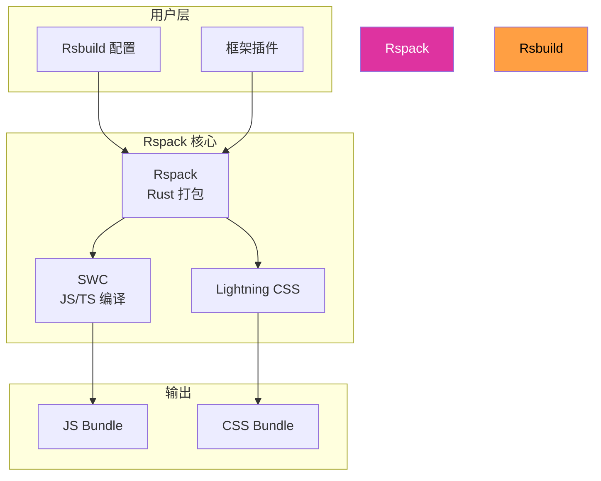
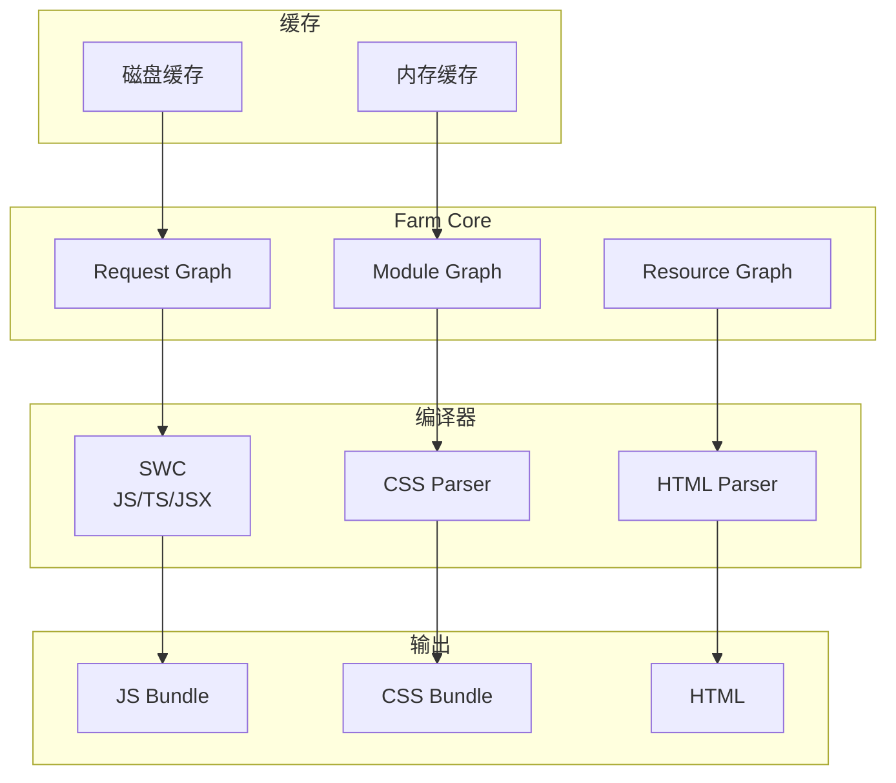
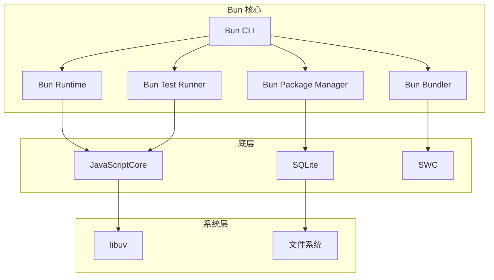
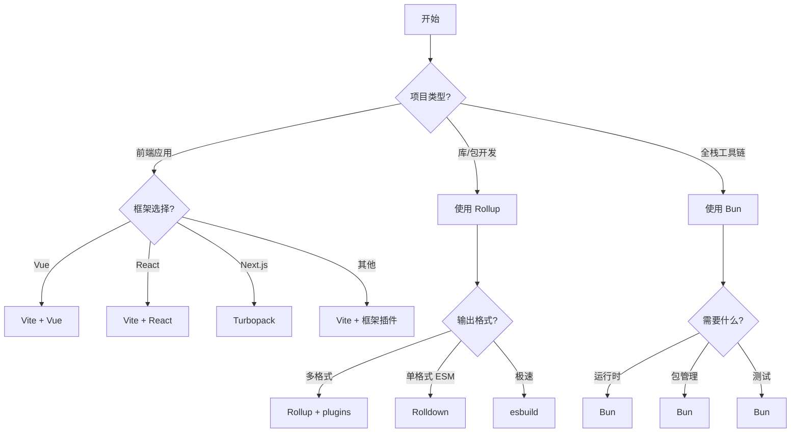

# 新兴方案与选型

> 本文是「构建工具」系列第 3 篇（共 3 篇）。上一篇：[原生工具链](native-toolchains.md)

## 1. Rsbuild

### 1.1 简介

Rsbuild 是基于 Rspack 的高性能构建工具，由字节跳动 Web Infra 团队开发。它提供开箱即用的构建能力，同时保持与 webpack 生态的兼容性。

**核心特性**：
- 零配置启动，提供合理的默认设置
- 语义化配置 API，降低 Rspack 学习曲线
- 高性能 Rust 工具链（Rspack + SWC + Lightning CSS）
- 轻量级插件系统，兼容 webpack/Rspack 插件
- 开发/生产构建产物一致
- 框架无关（支持 React、Vue、Svelte、Solid、Preact）

**GitHub 数据**：3.3k stars，快速增长中

### 1.2 技术栈

- **核心语言**：TypeScript (93.0%)
- **核心引擎**：Rspack（Rust）
- **JavaScript 编译**：SWC
- **CSS 处理**：Lightning CSS

### 1.3 架构深度分析

#### 1.3.1 Rsbuild 架构图



### 1.4 使用场景

- 需要高性能的企业项目
- Webpack 迁移到现代工具
- React/Vue 大型应用
- 需要 Rspack 兼容性但希望简化配置的场景

### 1.5 快速开始

```bash
# 创建 React 项目
npm create rsbuild@latest my-app -- --template react-ts

# 进入目录
cd my-app

# 启动开发服务器
pnpm dev

# 构建生产版本
pnpm build
```

**配置文件 rsbuild.config.ts**：

```typescript
import { defineConfig } from '@rsbuild/core'
import { pluginReact } from '@rsbuild/plugin-react'
import { pluginSvgr } from '@rsbuild/plugin-svgr'

// 第 1 段：配置装配总入口
// defineConfig 只做类型推导与配置归一化，本身没有运行时副作用，所以整份配置可以被静态读取/序列化。
// 这里用 export default 导出：Rsbuild 在启动时会按文件名约定（rsbuild.config.ts）加载该默认导出。
export default defineConfig({
  // 第 2 段：插件注册
  // 插件按数组顺序依次“链式”改写底层 webpack/rspack 配置，因此顺序敏感。
  // pluginReact 需在 pluginSvgr 之前注册：前者负责 JSX/React 运行时，后者把 svg 转成组件，
  // 若顺序颠倒，svgr 生成的组件可能拿不到 React 的 JSX 转换规则。
  plugins: [
    pluginReact(),
    pluginSvgr(),
  ],
  // 第 3 段：源码入口与路径别名
  // entry 用“对象”形式而非字符串，是为了支持显式命名的多入口扩展（后续加 key 即可）。
  // alias 把 '@' 指向 './src'：用相对路径会让深层文件出现 '../../..' 这种脆弱引用，别名能稳定重构目录。
  source: {
    entry: {
      index: './src/index.ts',
    },
    alias: {
      '@': './src',
    },
  },
  // 第 4 段：HTML 模板
  // 模板文件参与 HtmlWebpackPlugin（rspack 同名插件）的生成流程，
  // 其中的占位符会被注入的 script/link 标签替换，所以模板只需保留骨架，不要手写打包产物引用。
  html: {
    template: './public/index.html',
  },
  // 第 5 段：PostCSS 与自动前缀
  // autoprefixer 读取 browserslist（package.json 或 .browserslistrc）来决定补哪些厂商前缀。
  // 它必须放在 PostCSS 插件链末尾，否则新生成的规则无法被后续插件继续处理。
  tools: {
    postcss: {
      postcssOptions: {
        plugins: ['autoprefixer'],
      },
    },
  },
  // 第 6 段：产物目录布局
  // 把 js/css/assets 拆到 static 子目录、html 放到 root 的 '/'，
  // 目的是让静态资源可以被 CDN 按 /static/* 一条规则长期缓存，而 html 保持不缓存以便及时更新。
  output: {
    distPath: {
      root: 'dist',
      html: '/',
      js: 'static/js',
      css: 'static/css',
      assets: 'static/assets',
    },
  },
  // 第 7 段：分包策略
  // 'split-by-experience' 由 Rsbuild 按内置经验（框架 runtime、node_modules 大库、异步 chunk 等）自动切分，
  // 比手写 splitChunks 更省心；代价是产物结构随版本演进可能微调，做长缓存时需留意 hash 文件名。
  performance: {
    chunkSplit: {
      strategy: 'split-by-experience',
    },
  },
})
```
### 1.6 性能基准

| 工具 | Dev Server | Build | HMR |
|------|-----------|-------|-----|
| Rsbuild | 1.36s | 3.35s | 160ms |
| Vite | 6.50s | 1.98s | 130ms |
| webpack | 21.40s | 28.10s | 2.78s |

### 1.7 框架插件

```typescript
import { defineConfig } from '@rsbuild/core'
import { pluginVue } from '@rsbuild/plugin-vue'
import { pluginVue2 } from '@rsbuild/plugin-vue2'
import { pluginSvelte } from '@rsbuild/plugin-svelte'
import { pluginSolid } from '@rsbuild/plugin-solid'
import { pluginPreact } from '@rsbuild/plugin-preact'

export default defineConfig({
  plugins: [pluginReact()], // 选择框架插件
})
```

### 1.8 与 Rspack 对比

| 特性 | Rsbuild | Rspack |
|------|---------|--------|
| 配置方式 | 语义化 | webpack 风格 |
| 插件系统 | 轻量 | 完整 webpack |
| 上手难度 | 低 | 中 |
| 底层 | 相同 | - |

### 1.9 参考链接

- 官网：https://rsbuild.rs/
- GitHub：https://github.com/web-infra-dev/rsbuild
- 文档：https://rsbuild.rs/guide/

## 2. Farm

### 2.1 简介

Farm 是用 Rust 编写的高性能构建工具，与 Vite 完全兼容。它声称比 webpack 快 20 倍，比 Vite 快 10 倍。

**核心特性**：
- Vite 插件兼容（直接使用 Vite 插件）
- HMR 更新时间 < 20ms
- 持久化磁盘缓存（模块级）
- 懒编译（大型项目优化）
- 部分打包（partial bundling）
- 开发/生产构建完全一致

**GitHub 数据**：5.6k stars，增长中

### 2.2 技术栈

- **核心语言**：Rust (56.9%)
- **JavaScript 处理**：SWC
- **Node 绑定**：napi-rs
- **插件系统**：Rollup 风格（支持 Rust/JS/SWC 插件）

### 2.3 架构深度分析

#### 2.3.1 Farm 架构图



### 2.4 使用场景

- 需要 Vite 兼容性但追求极致性能
- 大型前端项目
- 对构建速度有高要求的企业应用

### 2.5 快速开始

```bash
# 创建项目
npm create farm@latest

# 或
yarn create farm@latest
pnpm create farm@latest

# 安装依赖
npm install

# 启动开发服务器
npm run dev

# 构建生产版本
npm run build
```

**配置文件 farm.config.ts**：

```typescript
import { defineConfig } from '@farmfe/core'
import react from '@farmfe/plugin-react'
import svgr from '@farmfe/plugin-svgr'
import { lessLoader } from '@farmfe/plugin-less'

// 第 1 段：导入构建核心与三件套插件（决定这个配置文件能"认识"哪些语法）
// defineConfig 本身不做任何运行时逻辑，它只是一个泛型包装函数：把对象原样返回，
// 但能让编辑器拿到完整类型提示与字段校验——写错字段名会在编译期报错，而不是等到构建时才炸。
// 三个插件分别负责 JSX/Fast Refresh（react）、SVG 转 React 组件（svgr）、Less 编译（lessLoader）。

// 第 2 段：导出配置对象（Farm 默认导出约定）
// Farm 会加载 farm.config.ts 的 default export；这里所有配置都是静态字面量，
// 因此无需 async/函数式配置——保持声明式可被 CLI 直接序列化读取。
export default defineConfig({
  // 第 3 段：插件注册表（数组顺序 = 执行顺序，有隐含依赖）
  // react() 必须在最后处理 JSX，因为 svgr 会把 .svg 转成组件源码、
  // lessLoader 会把 .less 转成 CSS；若顺序颠倒，react 可能先拿到未转换的文件而报解析错误。
  plugins: [
    react(),
    svgr(),
    lessLoader(),
  ],
  // 第 4 段：compilation —— 编译期行为的总入口（相当于 webpack 的 entry+output+optimization 合体）
  compilation: {
    // 入口：Farm 以 HTML 为依赖图根节点（而不是像 webpack 以 JS 为根），
    // 会顺着 <script> / <link> 自动收集 JS 与 CSS 依赖，键名 index 决定产物 chunk 命名基。
    input: {
      index: './index.html',
    },
    // 产物输出：path 是磁盘落盘目录，publicPath 是运行时拼接资源 URL 的前缀。
    // publicPath 用 '/' 表示部署在域名根路径；若上 CDN 或子目录需改成绝对 URL/子路径，
    // 否则分包懒加载时请求地址会拼错（典型 404 边界条件）。
    output: {
      path: './dist',
      publicPath: '/',
    },
    // 第 5 段：优化开关（决定产物体积与运行时的取模方式）
    // scopeHoist 打开作用域提升：把多个模块尽量合进同一作用域，减少运行时 require 包装函数，
    // 产物体积更小、执行更快，代价是循环依赖的处理不如非提升模式宽松（易错点）。
    scopeHoist: true,
    // minify 交给 esbuild（Rust/Go 系压缩器）：比 Terser 快一个量级，
    // 但不会做部分激进的语义压缩，属于"速度换极限体积"的取舍。
    minify: 'esbuild',
    // cssModules 开启 CSS Modules：每个 .module.css/.module.less 的类名会被哈希化，
    // 从而把样式隔离到组件级，避免全局选择器冲突。
    // 这里保留空对象是在使用默认命名规则（[name]-[hash] 之类）并显式声明"我确实要启用它"；
    // 空对象若被删除，则该能力整体关闭——这是最容易误删的配置。
    cssModules: {
      // 配置
    },
  },
  // 第 6 段：开发服务器（仅 dev 生效，不进生产产物）
  // host 绑定 0.0.0.0 而非默认 localhost：容器/Docker 或局域网真机调试时，
  // 只有监听所有网卡外部才能访问；同时也意味着本机接口对外暴露，本地开发需注意安全边界。
  // port 固定 3000，若被占用 Farm 会直接启动失败而非自动顺延。
  server: {
    port: 3000,
    host: '0.0.0.0',
  },
  // 第 7 段：tools —— 把既有生态工具挂进 Farm 的 Rust 编译流水线
  // postcss 阶段在 CSS（含 Less 编译产物）之后执行，因此 autoprefixer 看到的是标准 CSS，
  // 会依据 browserslist 自动补 -webkit-/-ms- 前缀。
  // 注意 plugins 用字符串数组而非 require() 实例：Farm 内部用 Rust 侧的 PostCSS 实现解析，
  // 只能识别已注册的插件名，写错名字通常只会在构建时静默不生效（易错点）。
  tools: {
    postcss: {
      plugins: ['autoprefixer'],
    },
  },
})
```
### 2.6 性能基准

Farm 官方声称：
- 比 webpack 快 20x
- 比 Vite 快 10x
- HMR < 20ms

### 2.7 与 Vite 对比

| 方面 | Farm | Vite |
|------|------|------|
| HMR 速度 | <20ms | <100ms |
| 插件兼容 | Vite 插件 | 原生 |
| 开发模式 | 打包 | 原生 ESM |
| 缓存 | 模块级 | 依赖预构建 |
| 生产构建 | SWC/Rust | Rolldown |

### 2.8 参考链接

- 官网：https://farmfe.github.io/
- GitHub：https://github.com/farm-fe/farm

## 3. Bun

### 3.1 简介

Bun 是 all-in-one 的 JavaScript/TypeScript 工具链，包含运行时、包管理器、测试运行器和打包器。它使用 Zig 编写，性能远超 Node.js。

**核心特性**：
- 运行时：Node.js 替代品，启动速度 4x
- 包管理器：npm 替代，install 速度快 30x
- 测试运行器：Jest 兼容，TypeScript 优先
- 打包器：JS/TS/JSX 浏览器/服务端打包
- 原生 TypeScript 和 JSX 支持
- Web 标准 API（fetch、WebSocket 等）
- 完整的 Node.js 兼容性

**GitHub 数据**：90.6k stars，最流行的 all-in-one JS 工具

### 3.2 技术栈

- **核心语言**：Zig (32.2%) + Rust (46.6%)
- **JavaScript 引擎**：JavaScriptCore（Safari）
- **包管理**：自研高性能
- **跨平台**：macOS、Linux、Windows

### 3.3 架构深度分析

#### 3.3.1 Bun 架构图



### 3.4 使用场景

- 替代 Node.js 运行脚本和服务
- 替代 npm/pnpm 进行包管理
- 替代 Jest 进行测试
- 替代 esbuild/rollup 进行打包
- 微服务和服务端开发（Bun.serve）

### 3.5 快速开始

```bash
# 安装
curl -fsSL https://bun.com/install | bash

# 或 npm 全局安装
npm install -g bun

# 升级
bun upgrade
```

**运行时**：

```bash
# 运行 TypeScript 文件（直接执行）
bun run index.tsx

# 运行 JavaScript 文件
bun run index.js

# 包脚本
bun run start
bun run dev
```

**包管理**：

```bash
# 安装依赖
bun install

# 添加包
bun add react react-dom
bun add -D typescript @types/react

# 移除包
bun remove lodash

# 更新包
bun update

# 锁定文件
bun.lockb (自动生成)
```

**测试运行**：

```typescript
// sum.test.ts
import { describe, test, expect } from 'bun:test'

describe('sum', () => {
  test('adds two numbers', () => {
    expect(1 + 2).toBe(3)
  })

  test('adds negative numbers', () => {
    expect(-1 + 1).toBe(0)
  })
})
```

```bash
bun test
bun test --watch
bun test sum.test.ts
```

**打包**：

```bash
# 浏览器打包
bun build ./src/index.tsx --outdir ./dist --target browser

# Node.js 打包
bun build ./src/index.ts --outdir ./dist --target node

# 带 loader
bun build ./src/index.tsx \
  --outdir ./dist \
  --target browser \
  --loader .tsx=tsx \
  --loader .jsx=jsx
```

**使用配置文件 bunfig.toml**：

```toml
[install]
registry = "https://registry.npmjs.org/"
auto = "fallback"

[install.scopes]

[install.scopes."@company"]
registry = "https://registry.company.com/npm/"
token = "Bearer xxx"

[run]
bun = "1.0.0"
```

**HTTP 服务器示例**：

```typescript
// 第 1 段：创建并启动 HTTP 服务（Bun 内置的零依赖服务器）
// Bun.serve 会立即监听端口并把服务器实例返回，因此后续可以直接读取 server.port。
// 注意它是同步调用 + 内部事件驱动，fetch 回调被并发调用（每个请求一个异步任务），
// 所以回调里不要依赖模块级可变状态做累加，否则会出现竞态。
const server = Bun.serve({
  port: 3000, // 监听端口；若写 0 则由系统分配随机空闲端口，可用 server.port 回读
  // 请求处理器：Bun 对每个 HTTP 请求调用一次，返回的 Response 决定响应内容
  // 声明为 async 是为了给未来插入 await（读库、调外部 API）留余地；
  // 此刻内部没有 await，返回值会被自动包装成 Promise<Response>，语义不变。
  async fetch(req) {
    // 第 2 段：解析请求 URL
    // req.url 是完整绝对地址（如 http://localhost:3000/api/users?x=1），
    // 必须经 URL 构造函数解析后才能安全地取 pathname、query 等字段，
    // 比手写字符串切分更可靠（自动处理编码、查询串、hash 等边界）。
    const url = new URL(req.url)

    // 第 3 段：路由匹配 —— 精确匹配路径，返回 JSON 数据
    // 这里用的是最朴素的 if 精确相等判断：/api/users/ 或 /api/user 都不会命中，
    // 真实项目通常会用前缀匹配或路由表替代。
    // Response.json 是静态便捷方法，会自动把对象序列化并设置
    // Content-Type: application/json，省去手动 JSON.stringify 和 headers。
    if (url.pathname === '/api/users') {
      return Response.json([
        { id: 1, name: 'Alice' },
        { id: 2, name: 'Bob' },
      ])
    }

    // 第 4 段：兜底响应（默认路由 / 陌生路径统一返回纯文本）
    // new Response(body) 在未指定 headers 时默认 Content-Type:
    // text/plain;charset=UTF-8，所以浏览器会原样展示而不是当 HTML 渲染 ——
    // 这同时也避免了把用户可控内容当 HTML 返回带来的 XSS 风险。
    return new Response('Hello, World!')
  },
})

// 第 5 段：启动确认日志
// 用 server.port 而不是字面量 3000，是为了在端口被系统改写（port: 0 或
// 环境变量注入）时日志依旧与实际监听端口一致，避免"日志撒谎"。
console.log(`Server running at http://localhost:${server.port}`)
```
### 3.6 性能基准

- 启动速度：比 Node.js 快约 4 倍
- 包安装：比 npm 快约 30 倍
- HTTP 服务：极低延迟

### 3.7 与 Node.js 对比

| 方面 | Bun | Node.js |
|------|-----|---------|
| 启动速度 | 4x | 基线 |
| 包安装 | 30x | 基线 |
| TypeScript | 原生 | 需要 tsc |
| Web 标准 | 良好 | 良好 |
| 生态系统 | 增长中 | 成熟 |

### 3.8 参考链接

- 官网：https://bun.sh/
- GitHub：https://github.com/oven-sh/bun
- 文档：https://bun.sh/docs

## 4. 对比矩阵 {#对比矩阵}

### 4.1 核心指标

| 工具 | 语言 | GitHub Stars | 定位 | 零配置 |
|------|------|-------------|------|--------|
| Vite | TypeScript | 80.6k | 前端开发工具 | 接近 |
| Rolldown | Rust | 13.5k | 打包器 | 否 |
| esbuild | Go | 39.9k | 打包器/压缩器 | 部分 |
| SWC | Rust | - | 编译器 | 否 |
| Turbopack | Rust | - | 打包器 | 是 |
| Rollup | JavaScript | - | 库打包器 | 部分 |
| Parcel | Rust+JS | 44k | 零配置打包器 | 是 |
| Webpack 5 | JavaScript | 65.8k | 模块打包器 | 部分 |
| Rsbuild | TypeScript | 3.3k | 构建工具 | 接近 |
| Bun | Zig+Rust | 90.6k | all-in-one | 是 |
| Farm | Rust | 5.6k | Vite 兼容构建 | 接近 |

### 4.2 性能对比

| 工具 | 开发启动 | 生产构建 | HMR | 说明 |
|------|---------|---------|-----|------|
| Vite | 快 | 快 | <100ms | Rolldown 加速 |
| esbuild | 极快 | 极快 | 快 | 无缓存也快 |
| Turbopack | 快 | 快 | 快 | Next.js 专用 |
| Rollup | 中 | 中 | 慢 | 不含开发服务器 |
| Parcel | 快 | 快 | 快 | Rust 编译器 |
| Webpack 5 | 慢 | 中 | 慢 | 缓存优化后改善 |
| Rsbuild | 快 | 快 | 快 | Rspack 驱动 |
| Bun | 快 | 快 | 快 | 打包功能 |
| Farm | 快 | 快 | 快 | <20ms HMR |

### 4.3 插件生态

| 工具 | Rollup 兼容 | Vite 兼容 | webpack 兼容 |
|------|-------------|----------|-------------|
| Vite | 是 | - | 部分 |
| Rolldown | 是 | 原生 | 部分 |
| esbuild | 否 | 否 | 否 |
| SWC | 否 | 否 | 是（loader） |
| Turbopack | 否 | 是 | 否 |
| Rollup | - | 是 | 否 |
| Parcel | 否 | 否 | 否 |
| Webpack 5 | 否 | 部分 | - |
| Rsbuild | 是 | 部分 | 是 |
| Bun | 否 | 部分 | 否 |
| Farm | 是 | 是 | 否 |

### 4.4 构建速度基准测试

| 项目规模 | Vite + Rolldown | esbuild | Turbopack | Webpack 5 |
|----------|-----------------|---------|-----------|-----------|
| 小 (50 模块) | 0.5s | 0.1s | 0.3s | 3s |
| 中 (300 模块) | 2s | 0.4s | 1s | 15s |
| 大 (1000 模块) | 5s | 2s | 3s | 45s |
| 超大 (3000 模块) | 12s | 6s | 8s | 120s |

## 5. 选型建议

### 5.1 按场景推荐

| 场景 | 推荐工具 | 替代选择 |
|------|---------|---------|
| 新建前端项目 | Vite | Rsbuild、Farm |
| Next.js 项目 | Turbopack（默认） | webpack（需要插件） |
| 库开发 | Rollup | esbuild、tsdown |
| npm 包发布 | tsdown、Rolldown | Rollup |
| 极致速度需求 | esbuild | Farm、Rsbuild |
| 零配置需求 | Parcel、Bun | Vite（接近零配置） |
| 企业大型项目 | Rsbuild、Webpack 5 | Turbopack、Vite |
| 微前端 | Webpack 5（Module Federation） | - |
| 全栈 JS 工具链 | Bun | Node.js + 各工具 |

### 5.2 技术栈选择决策树



### 5.3 迁移路径

| 迁移方向 | 难度 | 建议 | 预期收益 |
|---------|------|------|----------|
| Webpack 5 -> Vite | 中 | 使用 vite-plugin-webpack-partial 渐进迁移 | 开发体验提升 10x |
| Webpack 5 -> Rsbuild | 中 | Rsbuild 配置更简洁，插件兼容 | 构建速度提升 8x |
| Rollup -> Rolldown | 低 | API 兼容，直接替换 | 构建速度提升 19x |
| Babel -> SWC | 低 | CLI 选项兼容，效果显著 | 转译速度提升 60x |
| Parcel -> Vite | 低 | 配置方式类似，插件生态更大 | 生态更丰富 |
| CRA -> Vite | 中 | react-scripts 迁移需要调整 | 开发体验提升 5x |
| Webpack -> Turbopack | 中 | Next.js 项目天然支持 | Next.js 专用优化 |

### 5.4 常见组合

| 组合 | 说明 |
|------|------|
| Vite + Vue | 官方推荐，最佳开发体验 |
| Vite + React | 成熟方案，社区丰富 |
| Next.js + Turbopack | Vercel 官方，无需配置 |
| Rsbuild + React | 字节内部验证，高性能 |
| Bun + 任意框架 | all-in-one，极简依赖 |
| Farm + 任意框架 | Vite 兼容性，极速 |

### 5.5 2025-2026 趋势预测

| 趋势 | 预测 | 影响 |
|------|------|------|
| Rust 化 | 继续加速 | 更多工具用 Rust 重写 |
| Rolldown 成熟 | Vite 6+ 全面采用 | Rollup 逐步边缘化 |
| Turbopack 扩展 | 支持更多 Next.js 之外场景 | 成为通用工具 |
| 构建时间基准 | <1s 成为可能 | 开发体验革命 |
| 零配置 | 进一步普及 | 上手门槛降低 |

## 6. 资源链接

### 6.1 官方文档

- [Vite 文档](https://vite.dev/guide/)
- [Rolldown 文档](https://rolldown.rs/)
- [esbuild 文档](https://esbuild.github.io/)
- [SWC 文档](https://swc.rs/docs/)
- [Turbopack 文档](https://nextjs.org/docs/app/api-reference/turbopack)
- [Rollup 文档](https://rollupjs.org/)
- [Parcel 文档](https://parceljs.org/docs/)
- [Webpack 文档](https://webpack.js.org/concepts/)
- [Rsbuild 文档](https://rsbuild.rs/guide/)
- [Bun 文档](https://bun.sh/docs)
- [Farm 文档](https://farmfe.github.io/)

### 6.2 GitHub 仓库

- [vitejs/vite](https://github.com/vitejs/vite)
- [rolldown/rolldown](https://github.com/rolldown/rolldown)
- [evanw/esbuild](https://github.com/evanw/esbuild)
- [swc-project/swc](https://github.com/swc-project/swc)
- [parcel-bundler/parcel](https://github.com/parcel-bundler/parcel)
- [webpack/webpack](https://github.com/webpack/webpack)
- [web-infra-dev/rsbuild](https://github.com/web-infra-dev/rsbuild)
- [oven-sh/bun](https://github.com/oven-sh/bun)
- [farm-fe/farm](https://github.com/farm-fe/farm)

### 6.3 相关 Awesome Lists

- [awesome-vite](https://github.com/vitejs/awesome-vite)
- [awesome-webpack](https://github.com/webpack-contrib/awesome-webpack)
- [awesome-esbuild](https://github.com/egoist/awesome-esbuild)

---

*最后更新：2026-05-16*

## 深入阅读与参考

!!! tip "怎么用这些资料"
    先读「官方文档与规范」建立准确的概念，再读「源码与示例」核对细节，最后用「教程、书籍与视频」换一种讲法加深理解。每条都写明了读哪一节、带着什么问题读。

### 官方文档与规范

| 资源 | 为什么读 | 怎么读 |
|---|---|---|
| [Rsbuild 文档](https://rsbuild.dev/) | 基于 Rspack 的构建工具官方口径，是与 Farm、Bun 打包器比较的基准 | 读快速开始与配置概览，新建 demo 跑通构建，再对照 Farm 的配置项做表 |
| [Bun Runtime](https://bun.sh/docs/runtime) | Bun 运行时的权威说明，是判断它能否替代 Node 的一手依据 | 读 runtime/index.mdx 的运行时与包管理章节，带着「兼容 Node 多少」去验证本项目依赖 |
| [Bun APIs](https://bun.sh/docs/runtime/bun-apis) | 逐项列出 Bun 独有 API，可判断哪些能力 Node 需额外依赖 | 浏览 API 目录，只精读文件、进程、SQL 三类，做一张与 Node 的替代对照表 |
| [Migrate from Bun](https://docs.deno.com/runtime/migrate/migrate_from_bun/) | 迁移坑清单，直接决定选型之后的切换与回退成本 | 重点读不兼容项与替代方案清单，评估本项目若换回 Node 的改动量 |

### 教程、书籍与视频

| 资源 | 为什么读 | 怎么读 |
|---|---|---|
| [Bun 文档](https://bun.sh/docs) | 用一个小项目实操 Bun 的运行与打包，最快建立体感 | 跟着做一个服务端小项目，分别用 bun run 与 node 启动，记录启动耗时与差异 |
| [Bun 测试运行器](https://bun.sh/docs/cli/test) | bun test 与 Vitest 的取舍，直接影响测试层的迁移成本 | 用 bun test 跑一遍现有测试，记录不兼容的断言与 mock，估算改动量 |
| [Bun 博客](https://bun.sh/blog) | 官方发布的性能数据与设计取舍，比二手测评更可信 | 挑运行时与打包器性能两篇精读，注意基准条件，别只记结论 |

## 应用与行业实践

### 应用场景地图

| 场景 | 用到本页哪个知识点 | 典型技术选型 | 注意事项 |
| --- | --- | --- | --- |
| 后台管理的万行表格首屏 | Rsbuild 的 chunkSplit 与 buildCache | Rsbuild + React + 表格虚拟滚动库 | 表格库单独成 chunk，用 Network 面板看首屏 JS 传输体积 |
| 低端安卓机型的首屏加载 | Bun 的 target=browser 与 splitting | Bun.build 产出浏览器包 | 用 CPU 4x 节流或真实低端机测 LCP，别用开发机结论 |
| 多人协作白板的开发期启动 | Farm 的 lazyCompilation 与 persistentCache | Farm 开发服务器 | 启动耗时与改一行后的热更新耗时分开记录 |
| 微前端子应用独立发布 | Rsbuild 多入口与产物拆包 | Rsbuild + Module Federation | 子应用之间不要共享可变全局状态 |
| 组件库双格式产物分发 | Bun.build 的多 target 输出 | Bun.build 分别产出 ESM 与 CJS | 核对 package.json 的 exports 条件字段顺序 |
| Monorepo 改一行触发全量重建 | Farm 持久化缓存的命中条件 | Farm + pnpm workspace | 缓存键要包含 lockfile 与构建配置的哈希 |
| 数据可视化大屏常驻运行 | Rsbuild 的产物体积控制 | Rsbuild + ECharts 按需引入 | 大屏长时间驻留，关注 Long Tasks 而不是只看首屏 |
| CLI 工具分发到无 Node 的机器 | Bun 的 --compile 单文件打包 | bun build --compile | 交叉编译要显式指定 --target 三元组 |
| Electron 渲染层构建 | Rsbuild 的 target 与 externals | Rsbuild + Electron | 主进程代码不能被打进渲染层 bundle |

### 三个场景拆解

#### 场景 1：后台管理的万行表格首屏

**业务背景**

后台系统里有若干张上万行的表格，首屏 JS 里混着表格库、图表库和业务代码。构建一次要等较长时间，发布后低配办公机的首屏等待被用户投诉。

**怎么用本页知识解决**

先把公共依赖抽成独立 chunk，再打开持久化构建缓存，让二次构建复用上次结果。

```ts
// rsbuild.config.ts
import { defineConfig } from '@rsbuild/core';
import { pluginReact } from '@rsbuild/plugin-react';

export default defineConfig({
  plugins: [pluginReact()],
  performance: {
    // 打开持久化构建缓存，二次构建复用上次的模块结果
    buildCache: true,
    chunkSplit: {
      // 按经验策略拆包，框架代码与业务代码分开
      strategy: 'split-by-experience',
    },
  },
  output: {
    // 小于 10KB 的资源内联成 data URI，减少首屏请求数
    dataUriLimit: 10 * 1024,
  },
});
```

- 第一个动作是拆包，把改动频率低的依赖与每天改的业务代码分到不同文件。
- 拆包后浏览器能长期缓存依赖 chunk，业务改动只让业务 chunk 失效。
- `buildCache` 命中时跳过重复编译，收益大小取决于改动波及的模块数。
- 缓存目录要写进 CI 的缓存配置，否则每次流水线都从零编译。
- 接入前核对默认值：缓存键包含哪些字段，配置变更后是否自动失效。

**怎么度量收益**

构建侧用 shell 的 `time` 命令或 CI 的 job duration，同一台机器同一 commit 跑 5 次取中位数。运行侧用 Lighthouse 移动端模式记录 LCP 与 TBT，用 Chrome DevTools 的 Network 面板记录首屏 JS 的传输体积。想看未使用代码占比，用 DevTools 的 Coverage 面板。

**什么时候不该用**

- 项目只有一个页面、一个入口，拆包后 chunk 数量增加但首屏请求数没降，收益要靠实测确认。
- 团队尚未接入 CI 缓存，构建缓存每次都冷启动，此时先解决流水线缓存再谈配置。
- 站点已有 Service Worker 做离线缓存，再叠加拆包策略需要重新核对缓存失效键。

#### 场景 2：低端安卓机型的首屏加载

**业务背景**

面向线下门店的移动网页要在低端安卓机上打开，设备 CPU 慢、内存小。首屏 JS 偏大时，解析与执行时间占比明显。

**怎么用本页知识解决**

用 Bun.build 产出浏览器包，打开 splitting 让路由级代码按需加载，同时压缩体积。

```ts
// build.ts
const result = await Bun.build({
  entrypoints: ['./src/main.tsx'],
  outdir: './dist',
  target: 'browser',   // 产出浏览器可运行的代码
  splitting: true,     // 代码拆分，路由级 chunk 按需加载
  minify: true,        // 压缩产物体积
  sourcemap: 'linked', // 独立 sourcemap，便于线上定位报错
  define: { 'process.env.NODE_ENV': '"production"' },
});

if (!result.success) {
  // 打印每条构建日志，避免静默产出不完整目录
  for (const log of result.logs) console.error(log);
  process.exit(1);
}
```

- `target` 选错会让产物带上 Node 专有的全局变量，浏览器直接报错。
- `splitting` 只有配合路由级动态 import 才会真正减少首屏加载量。
- `minify` 压的是字节数，不改变解析与执行时间，两者要分开测。
- 构建失败要显式退出非零码，否则 CI 会把空目录当成成功产物。
- 生产构建脚本建议固定版本并写进仓库，避免换机器后行为不一致。

**怎么度量收益**

用 Chrome DevTools 的 Performance 面板录制加载过程，看 Long Tasks 的总时长与条数。用 Lighthouse 移动端模式记 LCP、TBT、INP。用 DevTools 的 CPU 4x 节流模拟低端设备，并把测得的数字与未开启 splitting 的版本对比。

**什么时候不该用**

- 项目依赖只支持 webpack 生态的 loader 或插件，迁移前要逐项验证 Bun 插件是否覆盖。
- 团队没人愿意维护自建构建脚本，直接用 Rsbuild 能减少脚本维护量。
- 首屏本就是一张静态图加少量交互，拆包的收益不足以抵消配置复杂度。

#### 场景 3：多人协作白板的开发期启动

**业务背景**

白板类应用的模块数量随画布功能增长，开发服务器启动等待随时间变长。改一行样式要等页面更新，多人同时开发时反馈链路感受明显。

**怎么用本页知识解决**

打开持久化缓存把模块编译结果落盘，再打开惰性编译，只编译当前访问到的模块。

```ts
// farm.config.ts
import { defineConfig } from '@farmfe/core';

export default defineConfig({
  compilation: {
    persistentCache: true, // 编译结果落盘，二次启动复用
    lazyCompilation: true, // 只编译当前访问到的模块
    treeShaking: true,
    minify: true,
    output: { targetEnv: 'browser' },
  },
  server: { port: 5173, hmr: true },
});
```

- 持久化缓存的前提是缓存键能反映依赖与配置变化，否则会拿到过期产物。
- 惰性编译把启动等待与模块总数解耦，代价是首次进入某个路由时多等一次。
- 开发期可以不开 minify，把压缩留给生产构建，缩短开发构建耗时。
- 缓存目录建议加进 .gitignore，并在需要排查问题时提供清缓存命令。
- 接入前核对官方文档：lazyCompilation 与依赖全量模块图的插件是否冲突。

**怎么度量收益**

写一个计时脚本，记录从执行 `farm dev` 到端口可访问的耗时，重复 5 次取中位数。热更新耗时用编辑器保存文件的时间戳与页面更新完成的时间戳相减，重复 3 次。用 DevTools 的 Performance 面板确认更新期间的 Long Tasks 条数。

**什么时候不该用**

- 只在 CI 里构建一次产物、没有反复启动的开发流程，持久化缓存的收益需要实测确认。
- 插件需要在构建期枚举全部模块（例如产物分析类插件），惰性编译会改变它拿到的模块图。
- 单包体量本来就小，加缓存的收益不足以抵消缓存失效带来的排查成本。

### 行业先进实践

持久化构建缓存（出处：Rsbuild 官方文档 performance.buildCache / Farm 官方文档 persistentCache）。做法是把模块的编译结果写到磁盘，命中时跳过重复编译。有效的原因是同一仓库里大多数模块在两次构建之间没有变化。借鉴时先把缓存目录接入 CI 缓存，并确认配置变化会让缓存失效。

开发期惰性编译（出处：Farm 官方文档 lazyCompilation）。做法是开发服务器只编译当前请求触达的模块，未访问的路由先不编译。这样启动等待取决于当前页面用到的模块数，与仓库总模块数脱钩。借鉴时把首屏路由作为重点测点，避免首个路由变慢。

单文件可执行程序分发（出处：Bun 官方文档 bun build --compile）。做法是把运行时和代码打进一个可执行文件，目标机器不需要预装 Node。它绕开了目标环境的版本差异，适合内网工具分发。借鉴时先核对目标平台的架构与 --target 取值。

依赖预构建（出处：Vite 官方文档 Dependency Pre-Bundling）。做法是把 CommonJS 依赖转成 ESM 并合并成少量文件，减少开发期的请求数量。它同时把依赖与业务代码分开，依赖变更时才重新预构建。借鉴点是给依赖单独设缓存边界，而不是每次全量处理。

远程构建缓存（出处：Turborepo 官方文档 Remote Caching）。做法是把任务的产物上传到远端，其他机器和 CI 按输入哈希直接下载。有效的原因是任务的输入哈希能唯一确定输出。借鉴时先保证哈希输入包含 lockfile、环境变量白名单与构建配置。

Rspack 官方文档的性能调优章节。需核对官方文档：当前版本中和缓存、实验特性相关的选项名称与默认值，以及它们与所选 chunk 拆分策略的配合方式。

### 从学到用：落地路线

第 1 步：在改动频繁、体量中等的单个子包里试点，其余包保持原构建方式。验收标准是该子包能独立构建成功，CI 通过率与原流程持平。

第 2 步：在同一台机器、同一 commit 上各跑 5 次，记录构建耗时中位数与首屏 JS 传输体积。验收标准是指标不劣于基线，否则回到试点前状态并记录原因。

第 3 步：把配置抽成共享 preset，按包逐个接入，每周接入数量不超过 2 个。验收标准是每个接入包都有自己的开关，能单独回滚。

第 4 步：在 CI 中加入体积与耗时阈值检查，超出阈值时阻断合并。验收标准是做一次回滚演练，确认能在一次提交内恢复原构建流程。

### 动手作业

**目标**

给一个含 3 个路由的前端应用接入 Rsbuild 或 Farm，用可复现的测量说明接入前后的差异。

**步骤**

1. 建仓库，做 3 个路由，其中一个路由引入体量偏大的表格或图表库。
2. 记录基线：用 `time` 命令跑 5 次生产构建，记下每次耗时并算出中位数。
3. 用 Lighthouse 移动端模式跑首屏，记下 LCP 与 TBT；用 DevTools 的 Network 面板记下首屏 JS 传输体积。
4. 接入 Rsbuild 或 Farm，保留原构建脚本，两个脚本并存，先不改其他代码。
5. 打开持久化缓存与拆包配置，重复步骤 2 和步骤 3 的测量，把前后数字写进同一张表。
6. 在开发服务器上改一行业务代码，记录从保存到页面更新完成的时间，做 3 次；再打开惰性编译重测 3 次。
7. 把测量机器、命令、指标与结论写进仓库 README。

**验收标准**

- README 里的每条命令都能被他人直接复制执行并得到同类结果。
- 接入前后各有 5 次构建耗时记录，且给出了中位数而不是单次值。
- 首屏 JS 传输体积与 LCP 都有数字，并注明所用的工具与面板。
- 能逐条说明哪项配置改动对应哪项指标变化，没有对应关系的改动要标为未观察到差异。
- 提供一条清缓存命令，并验证清缓存后构建仍能成功。

