# 主流打包器

> 本文是「构建工具」系列第 1 篇（共 3 篇）。下一篇：[原生工具链](native-toolchains.md)

> 本文档调研 2025-2026 年主流 JavaScript/TypeScript 构建工具，覆盖核心项目特性、技术栈、使用场景和快速开始指南。

## 1. 概述

2025-2026 年，JavaScript 构建工具生态正在经历重大变革：

| 趋势 | 说明 |
|------|------|
| **Rust 重写运动** | esbuild、SWC、Rolldown、Rspack、Farm 等核心工具纷纷用 Rust 重写，性能提升 10-100x |
| **Vite 成为新标准** | Vite 6.x 结合 Rolldown，成为现代前端项目的事实标准 |
| **零配置优先** | Parcel、Farm、Farm 等工具主打零配置体验，降低上手门槛 |
| **增量构建** | Turbopack、Farm 等工具通过缓存和懒编译优化大型项目构建速度 |

### 1.1 生态架构总览

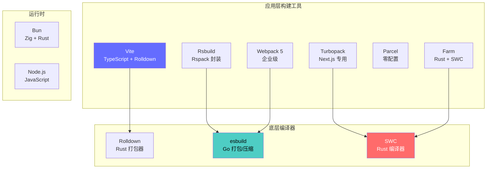

### 1.2 关键数据来源

- GitHub Trending 2026-05
- npm registry 下载量趋势
- 官方基准测试数据

## 2. Vite

### 2.1 简介

Vite（法语"快速"，发音 `/viːt/`）是新一代前端构建工具，由 Vue 作者尤雨溪发起，现已成为生态最活跃的前端工具之一。Vite 6.x 正式将 Rolldown 作为生产构建引擎，标志着全面 Rust 化时代的到来。

**核心特性**：

- 开发环境基于原生 ES Modules，热更新极快（HMR < 100ms）
- 生产构建使用 Rolldown，输出高度优化的静态资源
- 提供开箱即用的默认配置，支持插件扩展
- 框架无关，通过插件支持 Vue、React、Svelte、Solid 等

**GitHub 数据**：80.6k stars，活跃维护中

### 2.2 技术栈

- **核心语言**：TypeScript
- **构建引擎**：Rolldown（Rust）
- **开发服务器**：原生 ESM + 自定义中间件
- **插件系统**：兼容 Rollup 插件生态

### 2.3 架构深度分析

#### 2.3.1 开发模式架构

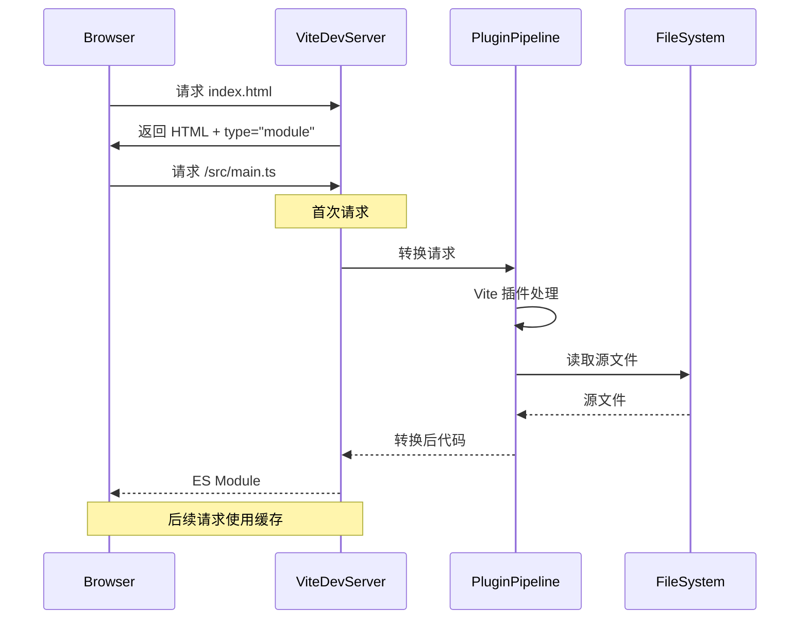

#### 2.3.2 Vite 与 Rolldown 协作流程

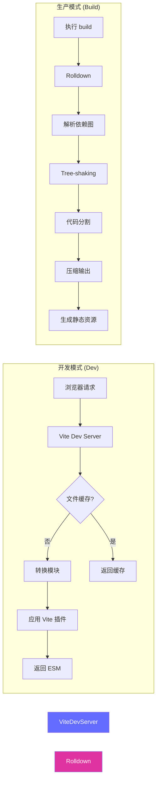

### 2.4 核心原理

#### 2.4.1 为什么 Vite 开发速度快？

**传统打包器的困境**：
```
Webpack: 冷启动需要构建整个依赖图
├── 解析所有模块 (1000+ files)
├── 转换每个模块 (Babel/SWC)
├── 构建依赖图
└── 输出 bundle
时间: 10-60s
```

**Vite 的解决方案**：
```
Vite: 基于浏览器原生 ESM
├── 服务器启动 (即时)
├── 按需转换 (仅请求的文件)
└── 模块懒加载
时间: <1s 启动
```

**关键差异**：
| 特性 | 传统打包器 (Webpack) | Vite |
|------|---------------------|------|
| 启动方式 | 先打包再启动 | 先启动再按需打包 |
| 依赖处理 | 全部打包 | 浏览器直接请求 node_modules |
| 转换时机 | 启动时 | 请求时 |
| 缓存单位 | 整个项目 | 单个文件 |

#### 2.4.2 依赖预构建 (Dependency Pre-bundling)

Vite 使用 esbuild 进行依赖预构建，解决以下问题：

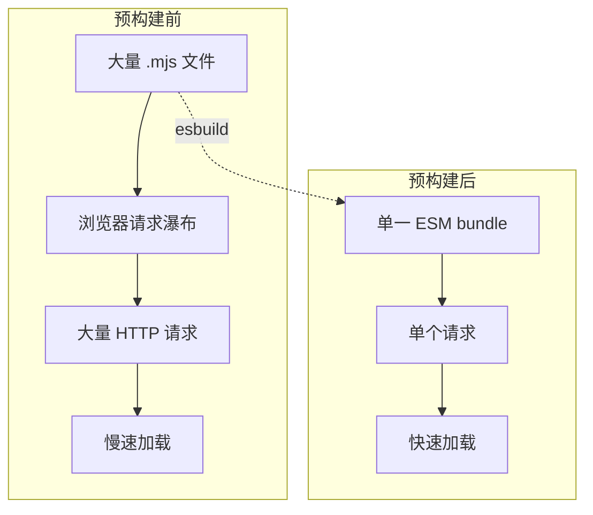

**预构建的文件**：

- `node_modules` 中的 ESM 依赖
- 有大量内部模块的包
- 使用不同导出格式的包（CJS/ESM 混合）

#### 2.4.3 HMR 原理

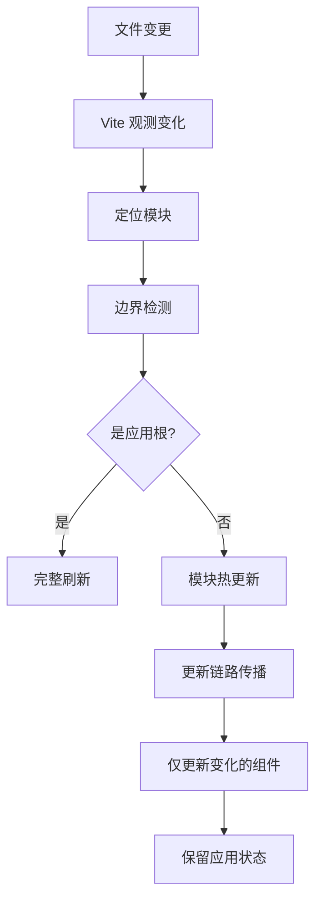

**Vite HMR vs Webpack HMR**：

| 方面 | Webpack | Vite |
|------|---------|------|
| 精度 | Chunk 级别 | 模块级别 |
| 速度 | 100-500ms | <100ms |
| 状态保留 | 部分支持 | 完全支持 |
| 实现方式 | 热替换 | 模块重新执行 |

### 2.5 Vite 6 重大更新

Vite 6.0 引入了以下关键变化：

#### 2.5.1 环境变量与模式系统

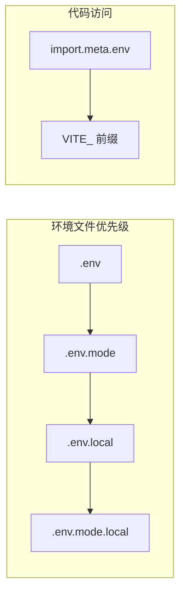

```typescript
// .env.development
VITE_API_URL=http://localhost:4000
VITE_ENABLE_LOGGING=true

// .env.production
VITE_API_URL=https://api.example.com
VITE_ENABLE_LOGGING=false
```

#### 2.5.2 兼容包模式 (Legacy Compatibility)

处理 CJS/ESM 混合包：

```typescript
// vite.config.ts
export default defineConfig({
  plugins: [react()],
  optimizeDeps: {
    // 强制预构建某些包
    include: ['some-cjs-package'],
    // 排除某些包
    exclude: ['huge-but-not-needed'],
  },
})
```

### 2.6 使用场景

- 现代 SPA（单页应用）和 MPA（多页应用）
- 需要快速冷启动的开发环境
- 追求一致开发/生产构建输出的项目
- 微前端架构中的子应用

### 2.7 快速开始

```bash
# 创建项目
npm create vite@latest my-app -- --template vue-ts

# 进入目录
cd my-app

# 安装依赖
npm install

# 启动开发服务器
npm run dev

# 构建生产版本
npm run build
```

**配置文件 vite.config.ts**：

```typescript
// 第 1 段：导入构建期依赖（Vite 配置的类型与插件）
// defineConfig 只是用于类型推导的包装函数，运行时是恒等函数，返回值原样透传，因此不会影响配置行为。
// 三个导入在构建阶段被 Node 加载：vite 提供类型/校验，plugin-vue 负责 SFC 编译，unocss 负责原子化样式。
import { defineConfig } from 'vite'
import vue from '@vitejs/plugin-vue'
import UnoCSS from 'unocss/vite'

// 第 2 段：插件注册（决定源码如何被转换）
// Vite 的插件数组按顺序参与 dev 的按需转换与 build 的打包；vue() 处理 .vue 单文件组件，
// UnoCSS() 以"按需生成"的方式在扫描源码后产出原子类 CSS，二者互不冲突，但 UnoCSS 需早于样式收集阶段生效。
export default defineConfig({
  plugins: [
    vue(),
    UnoCSS(),
  ],
  // 第 3 段：开发服务器配置（仅 dev 生效，不影响生产产物）
  // port 指定监听端口；proxy 用于绕过浏览器同源策略，把 /api 前缀的请求转发到后端，避免本地开发时的 CORS 问题。
  server: {
    port: 3000,
    proxy: {
      // '/api' 是前缀匹配：/api/users 会被转发为 http://localhost:4000/api/users（默认不重写路径，即保留 /api）。
      '/api': {
        target: 'http://localhost:4000',
        // changeOrigin 会把请求头 Host 改写成 target 的 host，绕过后端基于 Host 的虚拟主机/校验；
        // 这是本地代理最常见的 404/403 排查点，后端若强校验 Origin/Host 需另行处理。
        changeOrigin: true,
      },
    },
  },
  // 第 4 段：生产构建配置（决定产物形态与体积）
  // target: 'esnext' 意味着不再为老旧浏览器降级语法（不做 ES5 转译），产物更小更快，
  // 代价是浏览器兼容性由使用方负责，适合现代浏览器面向的内部或中台项目。
  build: {
    target: 'esnext',
    minify: 'esbuild',  // 使用 esbuild 压缩：速度远快于 terser，但压缩率与部分高级优化略弱
    // 第 5 段：Rollup 输出策略（控制 chunk 拆分）
    // manualChunks 把 vue 与 vue-router 强制归入同一个 'vue-vendor' chunk：
    // 目的是让框架代码与业务代码分离，业务迭代时该 chunk 的 hash 不变，用户可长期命中浏览器缓存。
    // 注意：同一条目内多个包会打进同一文件，过度合并会削弱"改一处只失效一个 chunk"的收益。
    rollupOptions: {
      output: {
        manualChunks: {
          'vue-vendor': ['vue', 'vue-router'],
        },
      },
    },
  },
})
```
**TypeScript 类型检查**（与 Vite 解耦，需单独运行）：

```bash
# 监视模式
tsc --watch

# 或使用 vite-plugin-checker
import checker from 'vite-plugin-checker'
plugins: [checker({ vueTronic: true })]
```

### 2.8 插件系统详解

Vite 插件继承自 Rollup 插件系统，并进行了扩展：

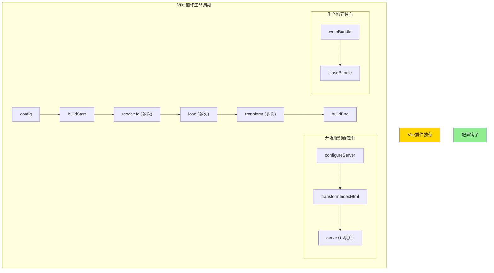

#### 2.8.1 插件示例

```typescript
import type { Plugin } from 'vite'

export function myPlugin(): Plugin {
  return {
    name: 'my-plugin',  // 唯一标识
    enforce: 'pre',     // 或 'post'
    
    // 配置钩子
    config(config) {
      // 修改配置
      return { /* ... */ }
    },
    
    // 解析钩子
    resolveId(source, importer) {
      if (source.startsWith('\0')) {
        return source  // 虚拟模块
      }
      return null  // 继续处理
    },
    
    // 加载钩子
    load(id) {
      if (id === '\0virtual-module') {
        return 'export const value = 42'
      }
    },
    
    // 转换钩子
    transform(code, id) {
      if (id.endsWith('.vue')) {
        return {
          code: transformVue(code),
          map: generateSourceMap(),
        }
      }
    },
  }
}
```

### 2.9 Vite vs Rollup 插件差异

| 钩子 | Rollup | Vite | 说明 |
|------|--------|------|------|
| `configureServer` | 无 | 有 | 配置开发服务器 |
| `transformIndexHtml` | 无 | 有 | 转换 HTML |
| `apply` | 支持 | 支持 | 条件应用 |
| 钩子顺序 | 是 | 是 | `enforce` 字段 |

### 2.10 性能基准

| 场景 | Vite + esbuild | Vite + Rolldown | Webpack 5 |
|------|----------------|-----------------|-----------|
| 冷启动 (100 模块) | 1.2s | 0.8s | 12s |
| 冷启动 (1000 模块) | 6s | 3s | 45s |
| HMR (单组件) | 50ms | 30ms | 200ms |
| 生产构建 | 4s | 2.5s | 35s |

### 2.11 迁移指南

#### 2.11.1 从 Webpack 迁移

```bash
# 1. 安装 Vite
npm install -D vite

# 2. 安装插件
npm install -D vite-plugin-webpack-partial \
            @vitejs/plugin-react \
            vite-plugin-checker
```

```typescript
// vite.config.ts
import { defineConfig } from 'vite'
import react from '@vitejs/plugin-react'
import { partialConfig } from 'vite-plugin-webpack-partial'

export default defineConfig({
  plugins: [
    react(),
    partialConfig({
      // 处理 webpack 特定配置
      resolve: {
        alias: {
          '@': '/src',
        },
      },
    }),
  ],
})
```

#### 2.11.2 从 CRA 迁移

```bash
# 1. 创建新的 Vite 项目
npm create vite@latest my-app -- --template react-ts

# 2. 复制源代码
cp -r old-app/src new-app/

# 3. 安装依赖
cd new-app && npm install

# 4. 调整路径和配置
# - 修改 index.html 位置
# - 调整 public 目录
# - 更新 package.json scripts
```

### 2.12 参考链接

- 官网：https://vite.dev/
- GitHub：https://github.com/vitejs/vite
- 文档：https://vite.dev/guide/

## 3. Rollup

### 3.1 简介

Rollup 是 JavaScript 模块打包器，专注于 ES 模块优化和 Tree-shaking。它是现代打包器的重要灵感来源，Vite 和 WMR 都采纳了其插件 API。

**核心特性**：

- 基于深度执行路径分析的 Tree-shaking
- 代码分割（通过动态 import）
- 强大的插件系统（被 Vite 继承）
- 多种输出格式：ESM、CommonJS、UMD、SystemJS
- 支持 Web、Node 和其他平台
- 非固执己见，适合特殊构建流程

**GitHub 数据**：前端工具链的基础设施级项目

### 3.2 技术栈

- **核心语言**：JavaScript/TypeScript
- **解析器**：acorn（ES 解析）
- **插件系统**：基于 taps 的链式插件
- **压缩**：Terser（可选）

### 3.3 架构深度分析

#### 3.3.1 Rollup 架构图

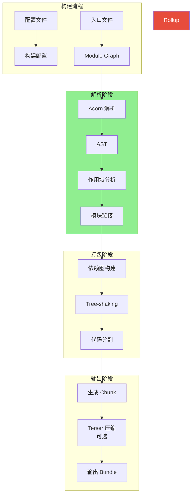

#### 3.3.2 插件系统架构

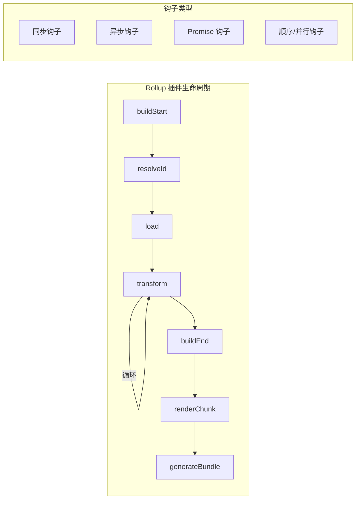

### 3.4 核心原理

#### 3.4.1 Tree-shaking 深入分析

Rollup 的 Tree-shaking 基于静态分析：

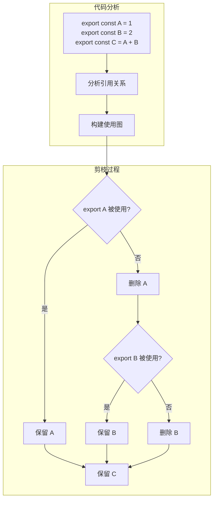

**关键点**：

1. **静态分析**：基于 AST，不执行代码
2. **引用追踪**：跟踪每个 export 的使用情况
3. **副作用分析**：识别有副作用的代码（不能删除）

```javascript
// 示例代码
import { used, unused } from './module'

console.log(used)  // used 被使用

// Tree-shaking 后
import { used } from './module'
console.log(used)
```

#### 3.4.2 代码分割原理

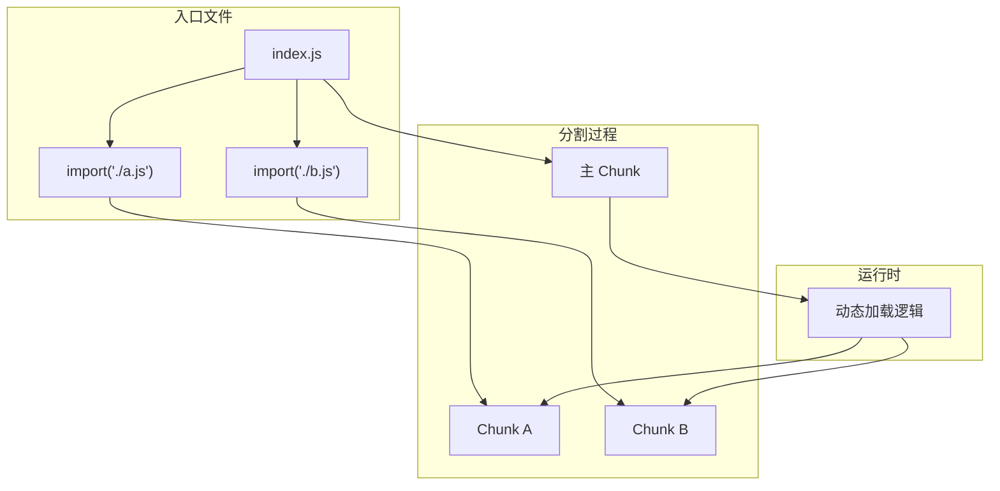

#### 3.4.3 输出格式详解

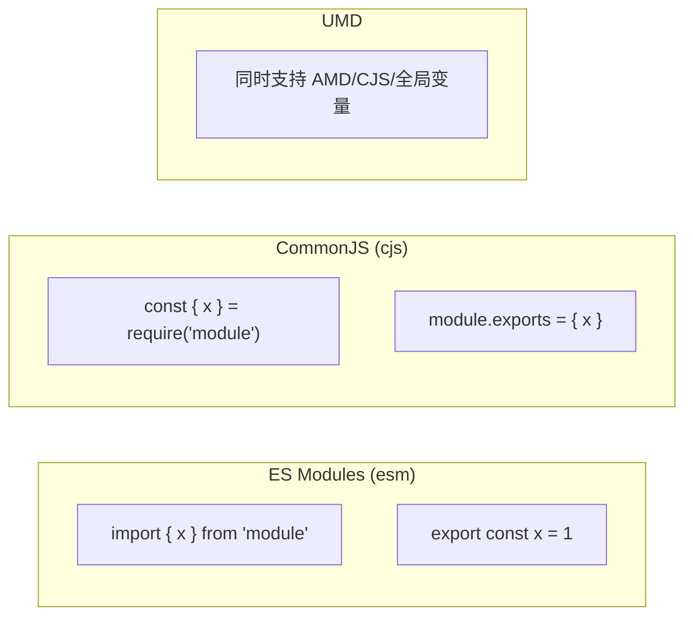

### 3.5 输出格式说明

| format | 说明 | 使用场景 |
|--------|------|----------|
| `es` | ES Modules | 现代浏览器、动态 import |
| `cjs` | CommonJS | Node.js、旧版打包器 |
| `umd` | UMD | 同时支持 AMD/CJS/全局变量 |
| `iife` | IIFE | 浏览器直接引入（script 标签） |
| `system` | SystemJS | SystemJS 模块加载器 |

### 3.6 使用场景

- 库和 npm 包开发
- 需要精确控制输出的场景
- Vite 生产构建的前身
- UMD/CJS/ESM 多格式输出

### 3.7 快速开始

```bash
# 安装
npm install -D rollup

# 基本使用
npx rollup src/index.js -o dist/bundle.js -f es
```

**配置文件 rollup.config.js**：

```javascript
import resolve from '@rollup/plugin-node-resolve'
import commonjs from '@rollup/plugin-commonjs'
import terser from '@rollup/plugin-terser'
import typescript from '@rollup/plugin-typescript'
import json from '@rollup/plugin-json'

export default {
  input: 'src/index.ts',
  output: {
    file: 'dist/bundle.js',
    format: 'esm',
    sourcemap: true,
    // 代码分割
    manualChunks: {
      'vendor': ['lodash', 'axios'],
    },
  },
  plugins: [
    resolve(),        // 解析 node_modules
    commonjs(),       // 转换 CJS 为 ESM
    typescript(),     // TypeScript 编译
    terser(),         // 压缩
    json(),           // 支持 import.meta from './package.json'
  ],
  // 外部依赖（不打包）
  external: ['react', 'react-dom'],
}
```

**多格式输出配置**：

```javascript
import resolve from '@rollup/plugin-node-resolve'
import commonjs from '@rollup/plugin-commonjs'
import terser from '@rollup/plugin-terser'

export default {
  input: 'src/index.ts',
  output: [
    // ESM
    {
      file: 'dist/index.mjs',
      format: 'esm',
      sourcemap: true,
    },
    // CommonJS
    {
      file: 'dist/index.cjs',
      format: 'cjs',
      sourcemap: true,
      exports: 'named',
    },
    // UMD
    {
      file: 'dist/index.umd.js',
      format: 'umd',
      name: 'MyLib',  // 全局变量名
      sourcemap: true,
      globals: {
        react: 'React',
      },
    },
  ],
  plugins: [
    resolve(),
    commonjs(),
    terser(),  // 只在生产构建时使用
  ],
}
```

**使用 Vite 的 rollup 插件**：

```javascript
// rollup.config.js
import { defineConfig } from 'vite'
import vue from '@vitejs/plugin-vue'

export default defineConfig({
  plugins: [
    vue(),
  ],
  build: {
    rollupOptions: {
      // 在这里添加 Rollup 配置
      output: {
        manualChunks: {
          'vue-vendor': ['vue'],
        },
      },
    },
  },
})
```

### 3.8 插件开发指南

Rollup 插件采用钩子系统：

```javascript
// 自定义 Rollup 插件
export function myPlugin(options = {}) {
  return {
    name: 'my-plugin',
    
    // 解析钩子
    resolveId(source, importer) {
      if (source.startsWith('virtual:')) {
        return source.replace('virtual:', '\0virtual:')
      }
      return null  // 继续处理
    },
    
    // 加载钩子
    load(id) {
      if (id.startsWith('\0virtual:')) {
        return `export const value = ${options.value || 42}`
      }
    },
    
    // 转换钩子
    transform(code, id) {
      if (id.endsWith('.special')) {
        return {
          code: transformSpecial(code),
          map: null,
        }
      }
    },
    
    // 构建完成钩子
    generateBundle(options, bundle, isWrite) {
      // 可以修改 bundle 内容
      if (isWrite) {
        // 输出前处理
      }
    },
  }
}
```

### 3.9 与其他工具对比

| 特性 | Rollup | Webpack | esbuild | Parcel |
|------|--------|---------|---------|--------|
| Tree-shaking | 优秀 | 良好 | 基础 | 良好 |
| 代码分割 | 优秀 | 优秀 | 支持 | 支持 |
| 插件系统 | 优秀 | 丰富 | 有限 | 有限 |
| 输出格式 | 全部 | 全部 | 有限 | 有限 |
| 零配置 | 否 | 部分 | 部分 | 是 |
| 生产优化 | 优秀 | 优秀 | 优秀 | 优秀 |

### 3.10 性能对比

| 场景 | Rollup | Webpack | esbuild |
|------|--------|---------|---------|
| 库构建 | 快速 | 慢 | 极快 |
| 增量构建 | 不支持 | 支持 | 不支持 |
| Tree-shaking | 最精确 | 良好 | 基础 |

### 3.11 迁移指南

#### 3.11.1 从 Rollup 迁移到其他工具

**迁移到 Rolldown**：

```javascript
// rollup.config.js
import { defineConfig } from 'rolldown'  // 只需改这一行

export default defineConfig({
  input: 'src/index.ts',
  output: {
    file: 'dist/bundle.js',
    format: 'esm',
  },
})
```

**迁移到 esbuild**：

```javascript
// rollup.config.js -> esbuild 配置
import * as esbuild from 'esbuild'

esbuild.build({
  entryPoints: ['src/index.ts'],
  bundle: true,
  outfile: 'dist/bundle.js',
  format: 'esm',
  splitting: true,  // 需要 ESM 格式
  target: 'es2020',
})
```

### 3.12 参考链接

- 官网：https://rollupjs.org/
- GitHub：https://github.com/rollup/rollup

## 4. Webpack 5

### 4.1 简介

Webpack 是最成熟的 JavaScript 模块打包器，v4+ 无需配置文件即可工作。它是业界事实标准，拥有庞大的插件生态。

**核心特性**：

- 静态模块打包器，从入口构建依赖图
- 代码分割和延迟加载
- 强大的 Loader 系统（预处理任何文件类型）
- 丰富的 Plugin 系统（打包优化、资源管理、环境注入）
- 持久化缓存（filesystem cache）
- 模块联邦（Module Federation，微前端解决方案）

**GitHub 数据**：65.8k stars，Web 生态的核心基础设施

### 4.2 技术栈

- **核心语言**：JavaScript/TypeScript
- **解析器**：acorn
- **模块系统**：支持 ESM、CJS、AMD
- **缓存**：filesystem（5.x 新增）
- **Plugin 系统**：Tapable（基于事件流）

### 4.3 架构深度分析

#### 4.3.1 Webpack 架构图

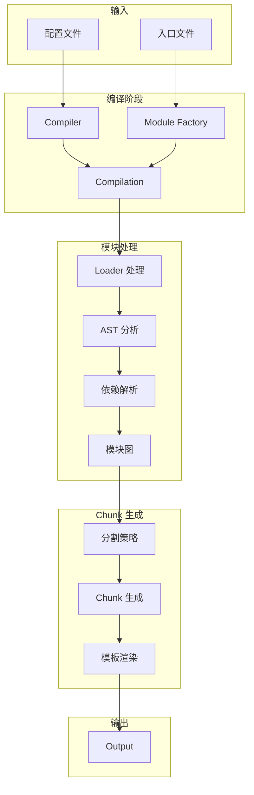

#### 4.3.2 Module Federation 架构

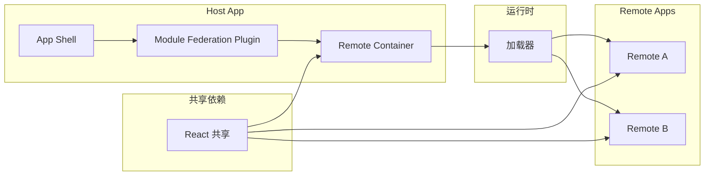

### 4.4 核心原理

#### 4.4.1 依赖图构建

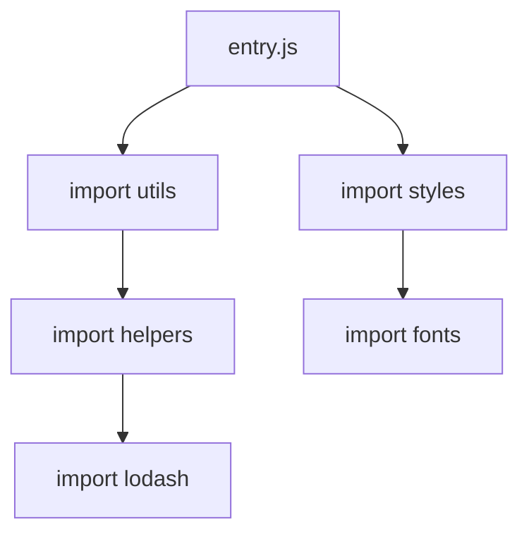

Webpack 从入口开始，递归解析所有依赖，构建完整图谱。

#### 4.4.2 Loader 链

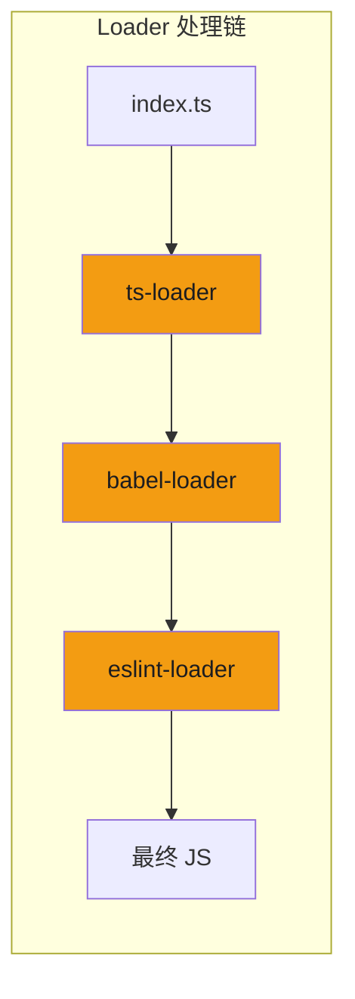

```javascript
// loader 从右到左，从下到上执行
module.exports = {
  module: {
    rules: [
      {
        test: /\.tsx?$/,
        use: [
          'ts-loader',      // 最后执行
          'babel-loader',   // 然后
          'eslint-loader',  // 最先执行
        ],
      },
    ],
  },
}
```

#### 4.4.3 Plugin 机制 (Tapable)

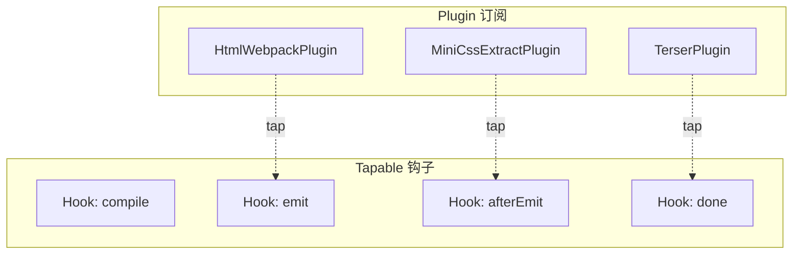

### 4.5 使用场景

- 大型企业级应用
- 需要精确控制打包行为
- 微前端架构（Module Federation）
- 需要复杂构建流程的项目
- CRA 迁移（CRA 内部使用 webpack）

### 4.6 快速开始

```bash
# 安装
npm install -D webpack webpack-cli

# 基本使用
npx webpack src/index.js -o dist/
```

**完整配置文件 webpack.config.js**：

```javascript
// 第 1 段：引入构建期依赖
// 这里 require 的都是「Node 侧、构建时」执行的模块，最终不会被打进浏览器产物；
// path 的作用是把相对路径拼成绝对路径（webpack 的 output.path 等字段强制要求绝对路径，传相对路径会直接报错）。
// 四个插件各司其职：注入 HTML、把 CSS 抽成独立文件、压缩 JS、让 .vue 单文件组件可编译，缺哪个对应环节就会失败。
const path = require('path')
const HtmlWebpackPlugin = require('html-webpack-plugin')
const MiniCssExtractPlugin = require('mini-css-extract-plugin')
const TerserPlugin = require('terser-webpack-plugin')
const { VueLoaderPlugin } = require('vue-loader')

// 第 2 段：导出「函数式配置」，按启动参数区分开发/生产
// webpack 允许导出对象或函数；只有导出函数才能拿到 argv.mode，从而在同一份配置里做条件分支，
// 避免维护 webpack.dev.js / webpack.prod.js 两份高度重复的文件（单一事实来源）。
// argv 由 CLI 的 --mode 传入；若用 Node API 调用而不透传 argv，这里会得到 undefined，从而全部退化为开发模式。
// 形参 env 本配置未使用，是 webpack 约定的固定参数位，保留以便日后接 --env 开关。
module.exports = (env, argv) => {
  const isProduction = argv.mode === 'production'

  return {
    // 第 3 段：入口与输出——决定「从哪开始打包」以及「产物长什么样、放在哪」
    // 入口是 TS 文件，真正的编译交给后面的 ts-loader；单入口时 [name] 恒为 main。
    // 生产用 [contenthash]：内容不变则文件名不变，配合长缓存让老用户持续命中缓存；开发用固定名便于调试。
    // chunkFilename 作用于 splitChunks 拆出的异步块；clean: true 每次构建前清空 output.path，
    // 防止历史哈希文件堆积——注意它的清理范围仅限 dist，不会误删别处文件。
    entry: './src/index.ts',
    output: {
      path: path.resolve(__dirname, 'dist'),
      filename: isProduction ? '[name].[contenthash].js' : '[name].js',
      chunkFilename: '[name].[contenthash].chunk.js',
      clean: true,
    },
    // 第 4 段：模块解析规则——决定 import 的路径如何被定位到真实文件
    // extensions 让 import './App' 能命中 .ts/.tsx；顺序即优先级，从左往右依次尝试，靠前可减少文件系统探测次数。
    // alias['@'] 是路径别名，避免 '../../../' 这类脆弱相对路径（通常需在 tsconfig 的 paths 里同步配置，否则 IDE 报错）。
    // ⚠️ 易错点：下面的 react 别名把非生产环境指向了 react-dom，等于让 `from 'react'` 在开发环境拿到 DOM 实现，
    // 语义上是反的（常见正确做法是让 react/react-dom 指向同一份实例或直接留空）。此处保留原样，供教学对照排错。
    resolve: {
      extensions: ['.ts', '.tsx', '.js', '.jsx', '.json'],
      alias: {
        '@': path.resolve(__dirname, 'src'),
        'react': isProduction ? 'react' : 'react-dom',
      },
    },
    // 第 5 段：转译与资源规则——按后缀把文件分发给不同 loader
    // rules 从上到下匹配，每条用 test 正则筛选，命中后 use 生效；use 为数组时 loader 从右向左执行（最右的先跑）。
    // 关键边界：exclude: /node_modules/ 必须加，否则依赖里成千上万的文件会被一起编译，构建时间会爆炸式增长。
    module: {
      rules: [
        // TypeScript
        // ts-loader 走完整类型检查，慢但正确；追求构建速度时通常再加 transpileOnly 并用 ForkTsChecker 在旁路做检查。
        {
          test: /\.tsx?$/,
          use: 'ts-loader',
          exclude: /node_modules/,
        },
        // Vue
        // 解析 .vue 单文件组件，必须与 plugins 里的 VueLoaderPlugin 配合，才能把 <template>/<script>/<style> 拆成子模块。
        {
          test: /\.vue$/,
          use: 'vue-loader',
        },
        // CSS
        // 生产用 MiniCssExtractPlugin.loader 抽出独立 .css（可缓存、可与 JS 并行加载）；
        // 开发用 vue-style-loader 以 <style> 注入，只有注入式才能支撑样式热更新。
        // css-loader 负责解析 @import/url，postcss-loader 在最右侧所以最先执行，承担 autoprefixer 等转换。
        {
          test: /\.css$/,
          use: [
            isProduction ? MiniCssExtractPlugin.loader : 'vue-style-loader',
            'css-loader',
            'postcss-loader',
          ],
        },
        // 图片
        // webpack 5 内置 asset module，取代 file-loader：直接把文件输出到 dist 并返回访问 URL，无需额外依赖。
        {
          test: /\.(png|jpg|gif|svg)$/,
          type: 'asset/resource',
        },
        // 字体
        // 同理按资源文件输出；与图片分开写，便于日后单独给字体调整策略（例如小字体改 asset/inline 内联进 CSS 减少请求）。
        {
          test: /\.(woff|woff2|eot|ttf|otf)$/,
          type: 'asset/resource',
        },
      ],
    },
    // 第 6 段：插件——在编译产物的生命周期上做整体加工（loader 管单个文件，plugin 管整包）
    // VueLoaderPlugin 必须注册，否则 vue-loader 无法为 .vue 派生出对应的子模块规则。
    // HtmlWebpackPlugin 以模板生成 index.html 并自动注入带哈希的 script 标签，免去手工同步文件名。
    // MiniCssExtractPlugin 用条件展开只在生产注册：开发环境走 style 注入用不到它，且其 loader 未被使用时注册也是空转；
    // `...(cond ? [x] : [])` 是 webpack 配置里最常用的条件插拔写法，注意展开的是数组而非对象。
    plugins: [
      new VueLoaderPlugin(),
      new HtmlWebpackPlugin({
        template: './public/index.html',
        title: 'My App',
      }),
      ...(isProduction ? [
        new MiniCssExtractPlugin({
          filename: '[name].[contenthash].css',
        }),
      ] : []),
    ],
    // 第 7 段：优化策略——体积压缩与代码分割
    // minimize 为 false 时整个 minimizer 会被忽略，所以 TerserPlugin 实际只在生产生效，开发保留可读代码便于断点调试。
    // splitChunks.chunks: 'all' 表示同步与异步引入都参与拆分；多个 cacheGroups 冲突时由 priority 高者仲裁。
    // vendor（priority 10）先把 node_modules 抢走，使业务代码改动不污染第三方库的哈希，避免用户缓存被整片刷掉；
    // common（priority 5 且未设 test）兜底收集「被 ≥2 个 chunk 引用」的模块，匹配面很宽，容易顺带抽走业务公共代码。
    optimization: {
      minimize: isProduction,
      minimizer: [new TerserPlugin()],
      splitChunks: {
        chunks: 'all',
        cacheGroups: {
          vendor: {
            test: /[\\/]node_modules[\\/]/,
            name: 'vendors',
            priority: 10,
          },
          common: {
            minChunks: 2,
            priority: 5,
          },
        },
      },
    },
    // 第 8 段：开发服务器——只服务本地热更新，生产构建完全不读这一段，写错也只影响开发体验
    // static 指定静态资源根目录；hot 开启 HMR，改样式或组件时局部替换模块，页面状态不会丢失。
    // proxy 把 /api 开头的请求转发到 4000 端口后端，规避开发期跨域；字符串简写不做路径重写，
    // 即后端必须真的以 /api 为前缀提供接口，否则要改写成对象形式并配 pathRewrite。
    devServer: {
      static: './dist',
      hot: true,
      port: 3000,
      proxy: {
        '/api': 'http://localhost:4000',
      },
    },
    // 第 9 段：持久化缓存——把 loader/plugin 的处理结果落盘，二次构建与冷启动显著加速（webpack 5 特性）
    // cacheDirectory 特意放在 dist 之外，否则会被 output.clean 在每次构建时连带清掉，缓存形同虚设。
    // 边界：缓存与配置内容、依赖版本绑定，升级依赖或改配置后 webpack 会自动失效重建，无需手动删目录。
    cache: {
      type: 'filesystem',
      cacheDirectory: path.resolve(__dirname, '.webpack-cache'),
    },
  }
}
```
**Module Federation 配置（微前端）**：

```javascript
// host/webpack.config.js
module.exports = {
  plugins: [
    new ModuleFederationPlugin({
      name: 'host',
      remotes: {
        remote: 'remote@http://localhost:3001/remote.js',
      },
      shared: ['react', 'react-dom'],
    }),
  ],
}

// remote/webpack.config.js
module.exports = {
  plugins: [
    new ModuleFederationPlugin({
      name: 'remote',
      filename: 'remote.js',
      exposes: {
        './Button': './src/Button',
      },
      shared: ['react', 'react-dom'],
    }),
  ],
}
```

### 4.7 性能优化建议

1. **启用持久化缓存**（5.x 内置）：
   ```javascript
   cache: { type: 'filesystem' }
   ```

2. **并行处理**：
   ```javascript
   module.exports = {
     parallelism: 100,
   }
   ```

3. **Tree-shaking 优化**：
   ```javascript
   optimization: {
     usedExports: true,
     sideEffects: true,
   }
   ```

4. **代码分割**：
   ```javascript
   optimization: {
     splitChunks: {
       chunks: 'all',
       cacheGroups: { /* ... */ },
     },
   }
   ```

### 4.8 迁移指南

#### 4.8.1 从 Webpack 5 迁移到 Vite

```bash
# 1. 移除 webpack 相关依赖
npm uninstall webpack webpack-cli webpack-dev-server

# 2. 安装 Vite
npm install -D vite

# 3. 安装框架插件
npm install -D @vitejs/plugin-react
```

```typescript
// vite.config.ts
import { defineConfig } from 'vite'
import react from '@vitejs/plugin-react'

export default defineConfig({
  plugins: [react()],
  server: {
    port: 3000,
  },
})
```

**主要差异**：

| Webpack | Vite | 说明 |
|---------|------|------|
| `module.rules` | `plugins` | 转换方式不同 |
| `resolve.alias` | `resolve.alias` | 配置兼容 |
| `webpack.DllPlugin` | 预构建 | 不同实现 |
| `ModuleFederationPlugin` | 微前端方案 | 需重新设计 |

#### 4.8.2 从 CRA 迁移

```bash
# 1. 使用 create-vite 创建项目
npm create vite@latest my-app -- --template react-ts

# 2. 复制源代码
cp -r my-cra-app/src my-app/

# 3. 调整文件
# - 移动 index.html 到项目根目录
# - 检查 public 目录
# - 更新 index.tsx 入口
```

### 4.9 参考链接

- 官网：https://webpack.js.org/
- GitHub：https://github.com/webpack/webpack
- 文档：https://webpack.js.org/concepts/

## 5. Parcel

### 5.1 简介

Parcel 是零配置打包工具，"Works out of the box"是其核心理念。它使用 Rust 编写的编译器，实现 10-100 倍于传统工具的性能。

**核心特性**：

- 零配置：开箱即用，支持 HTML、CSS、JavaScript、TypeScript、图片、Sass、SVG、Vue
- 内置开发服务器（HTTPS 支持、API 代理）
- 热更新保留应用状态（React Fast Refresh、Vue Hot Reloading）
- 美观的错误诊断（语法高亮、修复提示、文档链接）
- 生产优化自动应用（Tree-shaking、压缩、图片优化、代码分割）

**GitHub 数据**：44k stars，版本 2.x 稳定

### 5.2 技术栈

- **核心语言**：Rust (17.8%) + JavaScript (80.2%)
- **JavaScript 编译**：SWC
- **CSS 解析**：Firefox 级 Rust CSS 解析器
- **并行处理**：Worker threads
- **缓存**：智能磁盘缓存

### 5.3 架构深度分析

#### 5.3.1 Parcel 2 架构图

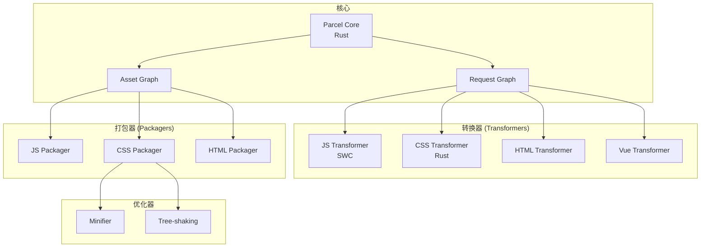

#### 5.3.2 自动检测原理

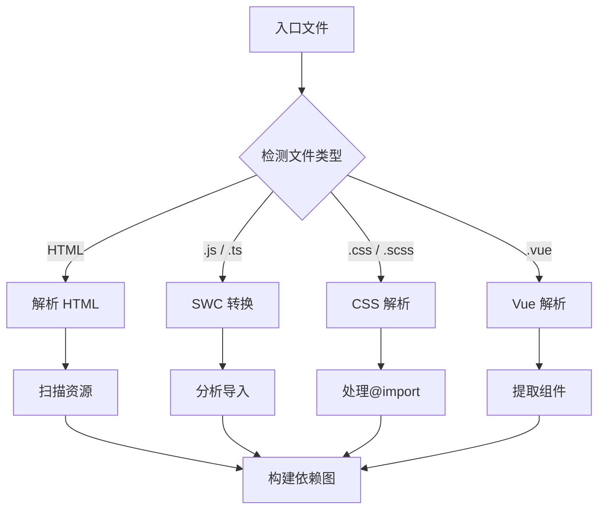

### 5.4 核心原理

#### 5.4.1 零配置如何实现？

Parcel 通过文件类型自动检测工作：

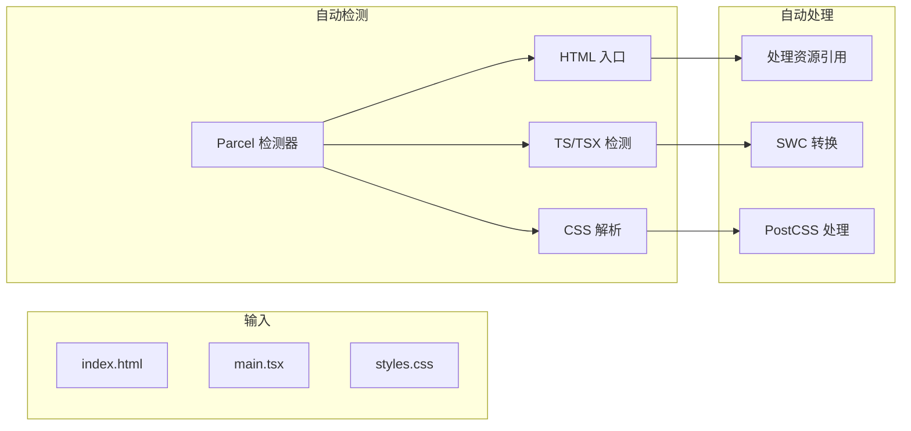

#### 5.4.2 缓存系统

```mermaid
flowchart TD
    subgraph "缓存键"
        A[文件内容 Hash] --> B[依赖列表 Hash]
        B --> C[转换选项 Hash]
        C --> D[ Parcel 版本 Hash]
        D --> E[缓存键]
    end

    subgraph "缓存查找"
        E --> F{缓存命中?}
        F -->|是| G[使用缓存结果]
        F -->|否| H[重新构建]
    end
```

### 5.5 使用场景

- 快速原型和小型项目
- 不希望配置复杂的场景
- 需要零配置多框架支持的项目
- 学习/教学场景

### 5.6 快速开始

```bash
# 安装
npm install -D parcel

# 直接运行（无需配置）
npx parcel index.html

# 构建生产版本
npx parcel build index.html
```

**项目结构（零配置示例）**：

```html
<!-- index.html -->
<html>
  <head>
    <title>My Parcel App</title>
    <link rel="stylesheet" href="styles.css">
  </head>
  <body>
    <h1>Hello, World!</h1>
    <script type="module" src="app.tsx"></script>
  </body>
</html>
```

```typescript
// app.tsx
import React from 'react'
import ReactDOM from 'react-dom/client'
import { Button } from './components'
import './styles.css'

ReactDOM.createRoot(document.body).render(
  <Button>Click me</Button>
)
```

```typescript
// components/Button.tsx
export function Button({ children }: { children: React.ReactNode }) {
  return <button className="btn">{children}</button>
}
```

**高级配置 .parcelrc**：

```json
{
  "extends": "@parcel/config-default",
  "resolvers": ["@parcel/resolver-default"],
  "transformers": {
    "*.vue": ["@parcel/transformer-vue"]
  },
  "packagers": {
    "*.txt": ["@parcel/packager-raw"]
  }
}
```

### 5.7 性能基准

- 开发服务器启动：约 48ms（大型项目）
- Rust 编译器：10-100x 于 JavaScript 工具
- CSS 处理：超过 100x 于其他工具

### 5.8 与 Vite 对比

| 方面 | Parcel | Vite |
|------|--------|------|
| 配置需求 | 零配置 | 需少量配置 |
| 插件系统 | 自有 | Rollup 兼容 |
| 开发模式 | 打包 | 原生 ESM |
| Vue 支持 | 需插件 | 原生插件 |
| 生态 | 较小 | 庞大 |

### 5.9 参考链接

- 官网：https://parceljs.org/
- GitHub：https://github.com/parcel-bundler/parcel

## 深入阅读与参考

!!! tip "怎么用这些资料"
    先读「官方文档与规范」建立准确的概念，再读「源码与示例」核对细节，最后用「教程、书籍与视频」换一种讲法加深理解。每条都写明了读哪一节、带着什么问题读。

### 官方文档与规范

| 资源 | 为什么读 | 怎么读 |
|---|---|---|
| [Rollup 文档](https://cn.rollupjs.org/) | 库打包与 Tree Shaking 的权威说明，概念定义准确。 | 先读 Introduction 与 Tree-shaking 两节，再对照自己库的产物，检查未用导出是否被摇掉。 |
| [Vite 官方文档](https://cn.vitejs.dev/) | 开发服务器与构建流程的官方说明，版本特性最全。 | 按 Guide 读 Getting Started 与 Build，重点比较 dev 与 build 两条链路，边读边在本机跑一遍。 |
| [webpack 文档](https://webpack.js.org/concepts/) | 核心概念与 loader/plugin 机制的官方定义，术语标准。 | 先读 Concepts 各节建立术语，再读依赖图一节，读后画一张从 entry 到 chunk 的流程图。 |
| [esbuild FAQ](https://esbuild.github.io/faq/) | 讲清 esbuild 的取舍与边界，理解工具链分工。 | 带着“为什么它不做类型检查与降级”去读，读后用自己的话说明它与 Vite、webpack 的分工。 |

### 源码与示例

| 资源 | 为什么读 | 怎么读 |
|---|---|---|
| [rollup](https://github.com/rollup/rollup) | 从模块图入口看打包器如何解析并链接模块。 | 先看类字段与 addModule 的调用链，带着“依赖何时入图”阅读，读后回看 treeshake 文档。 |
| [vite](https://github.com/vitejs/vite) | 开发服务器主干，理解中间件如何拼出 dev 体验。 | 读 createServer 中中间件注册顺序，带着“HTML 与模块请求各走哪段”读，读后画链路图。 |
| [Rolldown 入门](https://rolldown.rs/guide/getting-started) | 用最小示例跑通 Rust 版 Rollup，直观感受新实现。 | 照示例建入口跑一次构建，对比输出与 Rollup 是否一致，记录差异与耗时。 |

### 教程、书籍与视频

| 资源 | 为什么读 | 怎么读 |
|---|---|---|
| [Rollup 简介（中文）](https://cn.rollupjs.org/introduction/) | 中文示例带你把库打成 esm 与 cjs 双格式。 | 照做一遍并对比两份产物的 import 与 require 写法，理解 format 选项的实际作用。 |
| [Vite：为什么选 Vite（中文）](https://cn.vitejs.dev/guide/why.html) | 官方解释原生 ESM 开发服务器与预构建的动机。 | 带着“为何 dev 不打包、预构建解决什么”读，读后复述冷启动与 HMR 的差异。 |
| [Vite：插件 API（中文）](https://cn.vitejs.dev/guide/api-plugin.html) | 插件钩子是自定义构建流程的入口，示例可直接跑。 | 写一个 transform 插件打印执行顺序，对比 dev 与 build 下钩子触发的差异并记录。 |
| [Vite：构建生产版本（中文）](https://cn.vitejs.dev/guide/build.html) | 讲清生产构建的分包策略与产物结构，贴近优化实践。 | 配置 manualChunks 前后各构建一次，对比 chunk 数量与体积，写下结论。 |
| [webpack 入门指南](https://webpack.js.org/guides/getting-started/) | 从零手配项目，体会 loader 与 plugin 的分工。 | 按顺序加入 CSS loader 与 HTML 插件，每步都跑一次构建，观察配置与产物的对应关系。 |

## 应用与行业实践

### 应用场景地图

| 场景 | 用到本页哪个知识点 | 典型技术选型 | 注意事项 |
| --- | --- | --- | --- |
| 后台管理系统里上万行的数据表格 | Webpack 5 代码分割与 cacheGroups | React + Webpack 5 + 路由懒加载 | 表格库要拆成异步 chunk，否则首屏跟着下载 |
| 门店导购用千元安卓机扫码打开的 H5 | Vite 构建目标与依赖预构建 | Vue 3 + Vite | 构建目标要对着低端机内核，polyfill 手工核对 |
| 多人协作白板的实时画布页面 | Vite 开发服务器与 HMR | Vite + WebSocket 状态同步 | 锁死 lockfile，预构建缓存失效会让冷启动变慢 |
| 内部组件库发布到私有 npm | Rollup 多格式输出与 tree-shaking | Rollup + TypeScript + tsc 出类型 | sideEffects 字段与声明文件入口要写对 |
| 多团队拼成的微前端门户 | Webpack 5 Module Federation | Webpack 5 + 运行时共享依赖 | 共享依赖版本要提前约定，否则运行时报错 |
| 营销活动落地页赶时间上线 | Parcel 零配置构建 | Parcel | 产物体积与目标浏览器需手工检查 |
| Node 服务端渲染的同构应用 | Vite SSR 与 Rollup 双产物 | Vite + Node 服务 | 客户端与服务端入口分开，避免重复打包 |
| Electron 桌面端主进程与渲染进程 | Webpack 5 持久化缓存 | Webpack 5 + Electron | 两个进程各出一份配置，不能共用 entry |
| 离线优先的 PWA | Webpack 5 代码分割与按需加载 | Webpack 5 + Service Worker 插件 | chunk 名要稳定，否则缓存清单频繁失效 |

### 三个场景拆解

#### 场景 1：后台管理系统的万行数据表格

**业务背景**：表格页一次渲染上万行，路由切回来要重新下载表格库与导出库，用户体感是点击后白屏一段可感知的时间。规模用路由数、表格列数、每页行数描述，在本地用 `performance.now()` 打点即可复现。

**怎么用本页知识解决**：把表格库与导出库从首屏 bundle 摘出去，做成路由级异步 chunk，再打开文件系统缓存缩短二次构建等待。

```js
// webpack.config.js
module.exports = {
  optimization: {
    splitChunks: {
      cacheGroups: {
        // 表格与导出库拆到独立 chunk，只在进入该路由时下载
        table: {
          test: /[\\/]node_modules[\\/](ag-grid|xlsx)[\\/]/,
          name: 'vendor-table',
          chunks: 'async',
        },
      },
    },
  },
  // 中间结果写到磁盘，二次构建只重编改动过的模块
  cache: { type: 'filesystem' },
};
```

- `chunks: 'async'` 限定只处理动态 import 产生的 chunk，首屏入口不受影响。
- `name` 固定后，chunk 名在多次构建之间保持不变，方便做体积对比。
- `cache.type` 打开后，构建耗时的收益在模块数多的仓库里才明显，小仓库看不出来。
- 缓存键包含 mode 与 loader 配置，改配置后第一次构建会变慢，属于预期行为。

**怎么度量收益**：用 webpack-bundle-analyzer 看入口 chunk 与异步 chunk 的组成；用 Lighthouse 看 TBT；用 `performance.getEntriesByType('resource')` 统计首屏脚本的 transferSize。测量方法是在同一台机器、同一浏览器版本下，改动前后各跑 5 次，比较中位数。

**什么时候不该用**：

- 表格页就是登录后的默认首页，路由懒加载不会推迟下载，拆包只增加请求数。
- CI 里没有体积断言，拆出去的 chunk 过一阵又被打回主包，收益归零。

#### 场景 2：低端安卓机上的 H5 首屏

**业务背景**：导购用千元安卓机扫码进 H5，首屏脚本解压后体积偏大，白屏时间随内核版本上下波动。量级用构建产物的字节数与路由数量描述，在 Chrome DevTools 里把 CPU 降到 4 倍并模拟慢速网络即可复现。

**怎么用本页知识解决**：把构建目标对齐低端机内核，减少不必要的语法降级；同时把框架运行时拆成独立文件，让它在多次发版之间能被缓存命中。

```js
// vite.config.js
import { defineConfig } from 'vite';

export default defineConfig({
  build: {
    // 目标对齐低端机常见内核，避免多余的降级代码
    target: 'es2015',
    rollupOptions: {
      output: {
        // 框架运行时代码改动少，单独成文件便于长期缓存
        manualChunks: { framework: ['vue'] },
      },
    },
  },
});
```

- `target` 定得偏低会注入大量降级代码，定得太高会在老内核上直接报语法错误，要按真实机型分布选。
- `manualChunks` 把不常变的依赖单独成块，业务代码发版时这部分文件的哈希不变。
- 拆包后请求数增加，HTTP/1.1 环境下要控制异步 chunk 的数量。
- 依赖预构建只在开发期生效，生产体积要靠构建配置与 import 方式控制。

**怎么度量收益**：用 Lighthouse 的移动端配置取 FCP、LCP、TBT；用 rollup-plugin-visualizer 看 chunk 组成；用 DevTools Network 面板统计首屏传输字节数。每次改动在同一机型或同一 CPU 降速倍数下跑 5 次，记录中位数与四分位差。

**什么时候不该用**：

- 项目已经在用 Webpack 且团队只维护一套配置，换构建器的迁移成本高于体积收益。
- 首屏瓶颈在后端接口或首屏大图，压缩脚本对 LCP 的改善被其他耗时掩盖。

#### 场景 3：内部组件库发布到私有 npm

**业务背景**：多条业务线共用一套组件，直接引用源码时每个项目都要自己编译 TS，类型声明路径与样式入口经常对不上。量级用使用方项目数与组件数描述，用 `npm pack --dry-run` 查看发布内容即可复现。

**怎么用本页知识解决**：用 Rollup 出两份产物，ES 模块给上层打包器继续 tree-shaking，CommonJS 给老工具链；框架依赖 external 出去，交给使用方安装。

```js
// rollup.config.mjs
export default {
  input: 'src/index.ts',
  // 框架源码由使用方提供，避免打进产物造成重复
  external: ['react', 'react-dom'],
  output: [
    // 保留模块结构，使用方打包器能按文件做 tree-shaking
    { dir: 'dist/esm', format: 'es', preserveModules: true },
    // 老工具链走 CJS 入口
    { dir: 'dist/cjs', format: 'cjs', exports: 'named' },
  ],
};
```

- `external` 漏写会导致产物内嵌框架副本，使用方页面出现两份运行时。
- `preserveModules: true` 让产物目录与源码目录对应，排查体积问题时能定位到具体文件。
- 类型声明交给 `tsc --emitDeclarationOnly` 生成，Rollup 只负责 JS 产物。
- `package.json` 的 `exports` 字段要把两套入口和类型入口都指清楚。

**怎么度量收益**：在使用方项目跑 rollup-plugin-visualizer，看组件库占依赖总体积的比例；用 `npm pack --dry-run` 看包内文件数与解压体积；用 `grep` 在 `dist/esm` 里搜框架包名，确认没被打进去。

**什么时候不该用**：

- 组件库只在单仓库内使用，走 workspace 源码引用即可，多一份构建产物只增加发布步骤。
- 组件带大量 CSS 与静态资源，Rollup 需要额外插件链，配置成本高于节省的编译时间。

### 行业先进实践

**依赖预构建缓存（出处：Vite 官方文档「依赖预构建」）**
Vite 首次启动时把 `node_modules` 里的 CommonJS 依赖转成 ESM 并写入 `node_modules/.vite` 缓存。浏览器因此只需发少量请求，依赖数增加时冷启动耗时的增长幅度变小。借鉴方式是把 lockfile 提交到仓库，让缓存失效条件可追踪、可复现。

**文件系统持久化缓存（出处：webpack 官方文档「Cache」）**
`cache.type = 'filesystem'` 把模块与 chunk 的中间结果写到磁盘，二次构建只重编改动过的模块。缓存键会带上 mode 与 loader 配置，配置一动缓存就整体失效。借鉴方式是先在一个中等规模仓库打开它，用 `--profile` 记录改动前后的构建耗时。

**Module Federation（出处：webpack 官方文档「Module Federation」）**
它让一个构建产物在运行时从另一个构建产物加载模块，共享依赖只加载一份。适合多团队各自发布、却要拼成同一页面的场景。借鉴方式是用例先行：先约定共享依赖的版本范围，再把共享项逐个加进 `shared` 字段，每加一个跑一次端到端用例。

**保留模块结构的库产物（出处：Rollup 官方文档「output.preserveModules」）**
开启后每个源文件对应一个产物文件，使用方打包器能按文件判断哪些代码未被引用。若压成单文件，使用方只能整体引入或依赖副作用分析结果。借鉴方式是同时产出单文件与保留结构两套，用使用方项目的体积对比决定对外暴露哪套入口。

**作用域提升默认开启（出处：Parcel 官方文档「Scope hoisting」）**
Parcel 在生产构建里把模块合并进同一作用域，减少模块包装函数带来的运行开销，并且不需要写配置。代价是产物结构与调试映射的可读性下降。借鉴方式是把 Parcel 当作零配置基线，用它的产物体积做参照，再判断是否值得为 Webpack 写更多配置。

### 从学到用：落地路线

1. 试点：先在一个路由数不超过二十、产物体积可测的中型应用里只改一项配置。验收标准：构建产物有改动前后两份记录，该项改动能单独回滚。
2. 验证：用 Lighthouse 与 bundle 分析器在同一机器跑固定次数的对比，把中位数写进仓库文档。验收标准：关键指标方向与预期一致，且功能回归用例全部通过。
3. 推广：把验证通过的配置抽成共享 preset 包，其他仓库按需引入。验收标准：新接入的仓库只改一行配置就能复现试点结果。
4. 防回退：在 CI 里加体积与性能预算断言，超预算直接失败。验收标准：人为提交一次会推高主包体积的改动，CI 能拦下并打印出具体的 chunk 名。

### 动手作业

**目标**：在一个三路由的前端应用上，比较两种构建配置的首屏脚本体积与加载耗时，并写出可复现的结论。

**步骤**：

1. 建基线：用 create-vite 起一个 React 或 Vue 项目，补两个路由页面，其中一个页面引入图表库。
2. 采数据：执行生产构建，记录入口 chunk 与各异步 chunk 的字节数，写进 `baseline.md`。
3. 改一项：在配置里加 `manualChunks` 或 `splitChunks`，把图表库拆成独立 chunk。
4. 再采集：用同一条命令重建，把新数据写进 `after.md`，两份记录写明构建命令与包管理器版本。
5. 测运行期：用 Lighthouse 移动端配置各跑 5 次，记录 FCP、LCP、TBT 的中位数。
6. 反向验证：把图表库改回同步引入，确认指标回落，证明改动与结果相关。
7. 写结论：说明从哪条路由进入时拆包有收益，哪种进入路径下没有收益。

**验收标准**：

- 仓库里有 `baseline.md` 与 `after.md`，两条构建命令可原样复制执行。
- 两份记录的 chunk 名与字节数取自构建输出，不是手写估计。
- Lighthouse 每个指标都有 5 次数据，报告中给出中位数。
- 结论里至少写出一条「拆包没有收益」的进入路径。
- 改动可单独回滚，回滚后构建输出与 `baseline.md` 一致。

