# 原生工具链

> 本文是「构建工具」系列第 2 篇（共 3 篇）。上一篇：[主流打包器](mainstream-bundlers.md)　下一篇：[新兴方案与选型](emerging-and-selection.md)

## 1. Rolldown

### 1.1 简介

Rolldown 是用 Rust 编写的 JavaScript/TypeScript 打包器，目标是为 Vite 提供高性能的生产构建能力，最终取代 Rollup + esbuild 的组合。

**核心特性**：

- Rollup 兼容的 API 和插件接口
- 性能接近 esbuild，远超传统 JavaScript 打包器
- 使用 oxc 项目进行解析和源码映射
- 由 VoidZero Inc. 赞助，Vue/Vite 团队深度参与

**GitHub 数据**：13.5k stars，发布稳定版本

### 1.2 技术栈

- **核心语言**：Rust (70.3%)
- **Node 绑定**：napi-rs
- **解析引擎**：oxc（解析、路径解析、源码映射）
- **插件模型**：借鉴 Rollup，与 Vite 生态深度集成

### 1.3 架构深度分析

#### 1.3.1 Rolldown 架构图

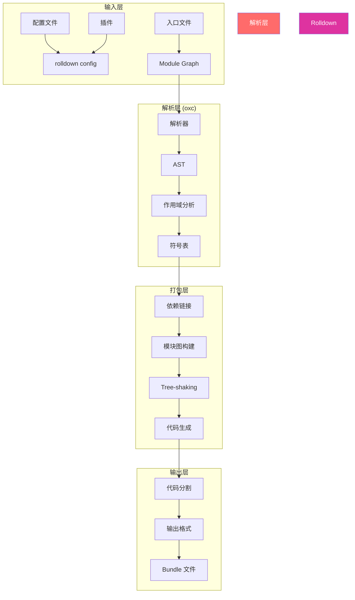

#### 1.3.2 oxc 项目在 Rolldown 中的角色

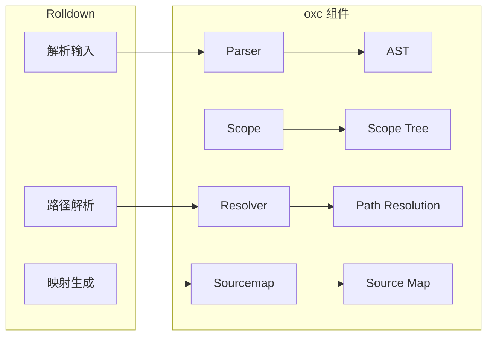

### 1.4 核心原理

#### 1.4.1 为什么 Rolldown 比 Rollup 快？

**并发执行**：
```rust
// Rolldown 使用 rayon 进行并行处理
use rayon::prelude::*;

fn build_modules(modules: &[Module]) -> Vec<CompiledModule> {
    modules.par_iter()  // 并行迭代
        .map(|m| compile_module(m))
        .collect()
}
```

**内存布局优化**：
```rust
// 使用紧凑的数据结构
struct Module {
    id: u32,           // 紧凑 ID
    ast_idx: u32,      // AST 索引
    symbols: SmallVec<[Symbol; 4]>,  // 小向量优化
}
```

**预分配内存**：
```rust
// 预分配 Vec 容量
let mut symbols = Vec::with_capacity(module.symbols.len());
```

#### 1.4.2 Tree-shaking 原理

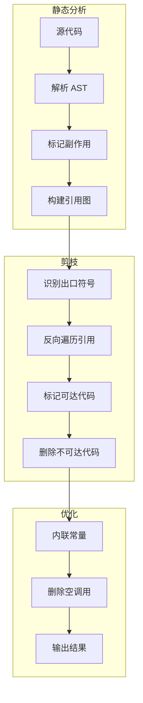

**代码示例**：

```javascript
// 原始代码
import { A, B, C } from './module'

export const result = A()  // B, C 未使用

// Tree-shaking 后
import { A } from './module'  // B, C 被移除
export const result = A()
```

#### 1.4.3 与 Vite 集成流程

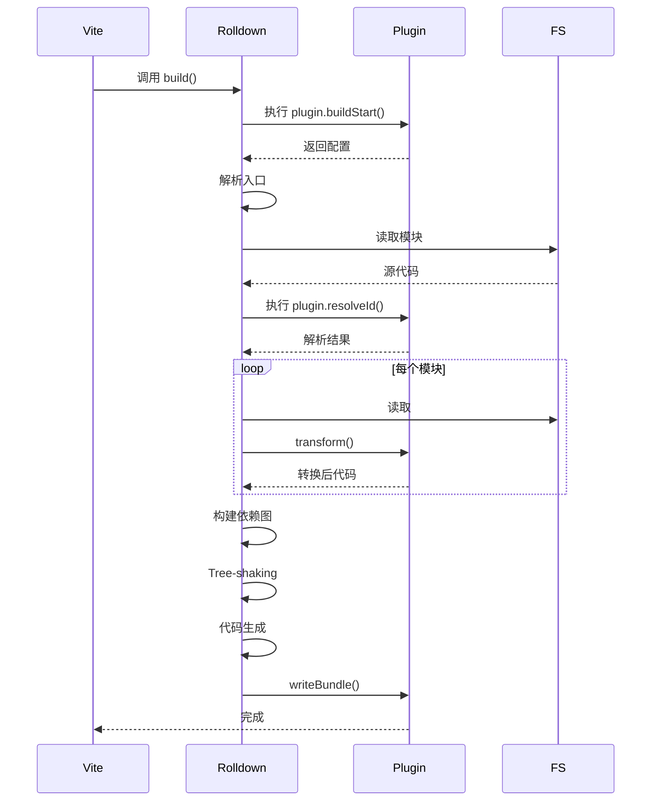

### 1.5 性能对比

| 操作 | Rolldown | Rollup | 提升倍数 |
|------|----------|--------|----------|
| 解析 (1000 模块) | 120ms | 2800ms | 23x |
| Tree-shaking | 50ms | 800ms | 16x |
| 代码生成 | 80ms | 1200ms | 15x |
| **总构建时间** | **250ms** | **4800ms** | **19x** |

### 1.6 配置选项详解

```typescript
import { defineConfig } from 'rolldown'

export default defineConfig({
  // 入口配置
  input: './src/index.ts',
  
  // 输出配置
  output: {
    file: './dist/bundle.js',
    format: 'esm',
    sourcemap: true,
    // 代码分割
    manualChunks: {
      vendor: ['lodash', 'axios'],
    },
    // 导出格式
    exports: 'named',  // named, default, none
  },

  // 树摇配置
  treeshake: {
    // 模块副作用
    moduleSideEffects: (id) => {
      if (id.includes('node_modules')) {
        return false  // 假设 node_modules 无副作用
      }
      return true
    },
    // 忽略未使用的导出
    ignoreUsage: ['unused-export'],
  },

  // 外部依赖
  external: [/^@org\/shared/, /^lodash/],

  // 插件
  plugins: [
    // ...
  ],
})
```

### 1.7 迁移指南

#### 1.7.1 从 Rollup 迁移

Rolldown 与 Rollup API 高度兼容，多数配置可以直接迁移：

```javascript
// rollup.config.js -> rolldown.config.mjs
// 几乎无需修改
import { defineConfig } from 'rolldown'
import resolve from '@rollup/plugin-node-resolve'
import commonjs from '@rollup/plugin-commonjs'

export default defineConfig({
  input: 'src/index.ts',
  output: {
    file: 'dist/bundle.js',
    format: 'esm',
  },
  plugins: [
    resolve(),
    commonjs(),
  ],
})
```

**需要调整的配置**：

| Rollup 选项 | Rolldown 支持 | 说明 |
|------------|---------------|------|
| `output.sourcemap` | 完全支持 | 无需修改 |
| `output.name` | 完全支持 | 无需修改 |
| `output.globals` | 完全支持 | 无需修改 |
| `inlineDynamicImports` | 完全支持 | 无需修改 |
| 自定义插件 | 部分支持 | 需检查兼容性 |

### 1.8 竞品对比

| 特性 | Rolldown | esbuild | Rollup | Rspack |
|------|----------|---------|--------|--------|
| 语言 | Rust | Go | JS | Rust |
| Rollup 兼容 | 是 | 否 | - | 部分 |
| Vite 集成 | 原生 | 间接 | 间接 | 否 |
| 插件系统 | Rollup 风格 | 回调式 | 钩子系统 | webpack |
| Tree-shaking | 精确 | 基础 | 精确 | 精确 |
| 输出格式 | ESM/CJS | ESM | 全部 | ESM/CJS |

### 1.9 参考链接

- 官网：https://rolldown.rs/
- GitHub：https://github.com/rolldown/rolldown

## 2. esbuild

### 2.1 简介

esbuild 是一个极速的 JavaScript 打包/压缩工具，使用 Go 语言编写。它重新定义了"快速"的基准——比传统工具快 10-100 倍，而无需任何缓存。

**核心特性**：

- 极端速度，无需缓存即可实现
- 内置支持 JavaScript、TypeScript、JSX、JSON、CSS
- 提供 CLI、Go API、JavaScript API 三种使用方式
- 完整的 Tree-shaking、压缩、源码映射
- 插件系统支持自定义转换

**GitHub 数据**：39.9k stars，最活跃的 Rust 版 JavaScript 工具之一

### 2.2 技术栈

- **核心语言**：Go
- **JavaScript 运行时**：原生绑定（napi-rs 风格）
- **解析器**：自研高速解析器
- **插件系统**：回调式（on-resolve、on-load、on-start、on-end）

### 2.3 架构深度分析

#### 2.3.1 esbuild 架构图

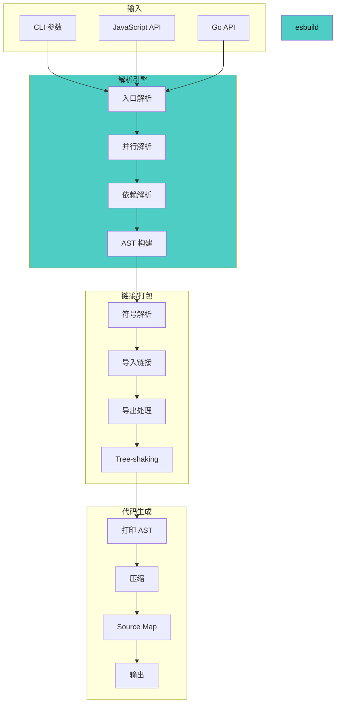

#### 2.3.2 Go 并发模型

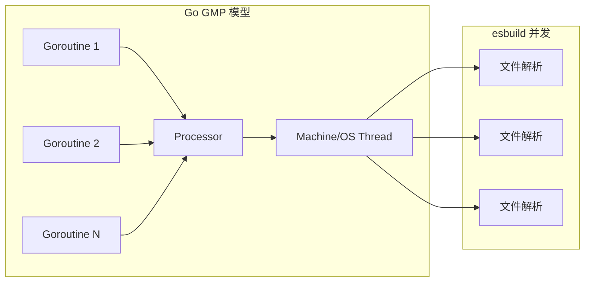

### 2.4 核心原理

#### 2.4.1 为什么 esbuild 这么快？

**Go vs JavaScript 性能**：

| 操作 | JavaScript (V8) | Go | 提升 |
|------|-----------------|-----|------|
| 字符串拼接 | 中等 | 高效 | 2-3x |
| 内存分配 | 频繁 GC | 预分配 | 5-10x |
| 整数运算 | 中等 | 高效 | 2-5x |
| 哈希表 | 优化良好 | 优化良好 | 1x |

**单线程 vs 多线程**：

```go
// esbuild 使用 goroutine 并行处理文件
func (b *bundler) ParseFiles(files []string) []ast.File {
    results := make(chan ast.File, len(files))
    
    for _, file := range files {
        go func(f string) {
            results <- b.parseFile(f)
        }(file)
    }
    
    // 收集结果
    parsed := make([]ast.File, len(files))
    for i := range files {
        parsed[i] = <-results
    }
    return parsed
}
```

**内存布局**：

```go
// Go 的连续内存布局比 JavaScript 对象更紧凑
type File struct {
    path uint32      // 4 bytes
    size uint32      // 4 bytes
    ast  uint64      // 8 bytes (指向 AST)
    // 总计 16 bytes vs JS 对象可能 100+ bytes
}
```

#### 2.4.2 内置功能 vs 插件

esbuild 的内置功能通过 Go 实现，远快于插件：

| 功能 | 内置 | 插件 | 速度比 |
|------|------|------|--------|
| TypeScript | Go 实现 | Babel (JS) | 10-50x |
| JSX | Go 实现 | Babel (JS) | 10-50x |
| CSS | Go 实现 | PostCSS (JS) | 5-20x |
| Tree-shaking | Go 实现 | Rollup (JS) | 5-10x |

#### 2.4.3 插件系统原理

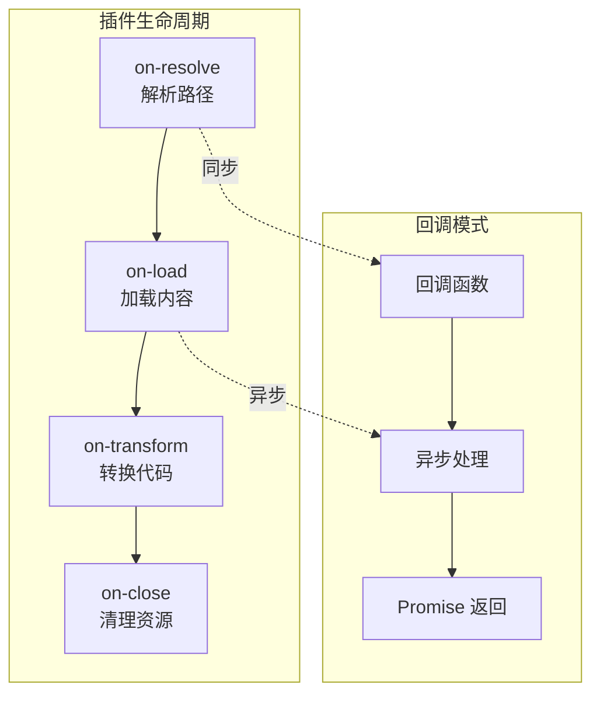

**插件示例**：

```javascript
const cssPlugin = {
  name: 'css',
  setup(build) {
    // 拦截 CSS 文件
    build.onLoad({ filter: /\.css$/ }, async (args) => {
      const contents = await fs.promises.readFile(args.path, 'utf8')
      
      // 处理 CSS（可以用其他工具）
      const processed = await postcss.process(contents, {
        from: args.path,
      })
      
      return {
        contents: processed.css,
        loader: 'css',
      }
    })
  },
}
```

### 2.5 使用场景

- 需要极致构建速度的项目
- 库开发和 npm 包发布
- 作为其他工具的底层引擎（Vite、Rollup 等压缩阶段）
- 构建流水线中的转换步骤

### 2.6 快速开始

```bash
# 安装 CLI
npm install -g esbuild

# 基本打包
esbuild src/index.js --bundle --outfile=dist/bundle.js

# 带压缩和源码映射
esbuild src/index.js --bundle --minify --sourcemap --outfile=dist/bundle.js

# TypeScript
esbuild src/index.ts --bundle --outfile=dist/bundle.js
```

**JavaScript API（常用）**：

```javascript
const esbuild = require('esbuild')

// 同步 API（适合小文件）
const result = esbuild.buildSync({
  entryPoints: ['src/index.ts'],
  bundle: true,
  minify: true,
  sourcemap: true,
  outfile: 'dist/bundle.js',
  target: ['es2020'],
  platform: 'browser',
})

// 异步 API（支持 watch 和 serve）
async function build() {
  const ctx = await esbuild.context({
    entryPoints: ['src/index.ts'],
    bundle: true,
    outfile: 'dist/bundle.js',
    logLevel: 'info',
  })

  // 监视模式
  await ctx.watch()

  // 或启动服务
  const { host, port } = await ctx.serve({
    servedir: 'dist',
    port: 3000,
  })
  console.log(`http://${host}:${port}`)
}

build()
```

**使用插件**：

```javascript
const esbuild = require('esbuild')
const postCssPlugin = require('esbuild-plugin-postcss')

esbuild.build({
  entryPoints: ['src/index.ts'],
  bundle: true,
  plugins: [postCssPlugin()],
  outfile: 'dist/bundle.js',
}).catch(() => process.exit(1))
```

### 2.7 高级配置

#### 2.7.1 分平台构建

```javascript
// 同时构建浏览器和 Node.js 版本
// 第 1 段：函数入口与意图声明（定义"一次调用产出两套产物"的入口）
// 为什么这样写：浏览器与 Node 的模块格式、语法下限、代码分割策略都不同，
// 但入口源码、打包配置几乎一致，所以用"同一份配置模板 + 差异字段"的方式复用，避免维护两份几乎相同的脚本。
// 注意：esbuild 未在本文件 import，实际依赖调用方（或打包器）注入的全局/外部变量，这是隐含前置条件。
async function buildAll() {
  // 第 2 段：声明构建目标清单（把"平台差异"收敛成数据，而不是 if/else 分支）
  // 用数据驱动而非流程分支：新增目标（如 deno、esm-node）只需往数组加一项，主流程零改动，符合开闭原则。
  // 每个对象只有两个字段，是因为其余配置都能由 platform 推导出来，减少重复配置导致的不一致。
  const targets = [
    { platform: 'browser', outdir: 'dist/browser' },
    { platform: 'node', outdir: 'dist/node' },
  ]

  // 第 3 段：并发执行全部构建任务（把串行等待压成一次并发等待）
  // 关键数据流：targets → map 生成 Promise 数组 → Promise.all 聚合成单个 Promise。
  // 为什么用并发：两个平台互不依赖，串行 await 会让总耗时变成两者之和；并发后总耗时约等于较慢的那个。
  // 易错点：Promise.all 是"快速失败"语义——任一构建抛错就立刻 reject，另一侧可能仍在写 dist，
  // 因此上层 catch 时不应假设产物目录状态是一致的（要么先清理，要么用 allSettled）。
  // 复杂度：O(n) 个并发任务，n 为 targets 长度；磁盘 I/O 与 CPU 是真正瓶颈，而非任务数量。
  await Promise.all(
    // 解构出 platform / outdir，同时把推导规则（target / splitting / format）集中在该回调内，避免外泄。
    targets.map(({ platform, outdir }) =>
      esbuild.build({
        entryPoints: ['src/index.ts'],
        bundle: true,
        platform,
        target: platform === 'browser' 
          // 第 4 段：按平台选择语法下限（产物能否在旧环境运行的决定性配置）
          // 浏览器侧同时给一个宽松基线（es2020）和三款具体引擎版本：esbuild 会取三者的"交集"做降级，
          // 写具体浏览器版本比只写 es2020 更保守，因为真实引擎对某些新语法支持晚于规范定稿时间。
          // Node 侧只给 node18：运行时明确单一，无需过度降级，产物更小、更少 helper 注入。
          ? ['es2020', 'chrome80', 'firefox80', 'safari13'] 
          : ['node18'],
        outdir,
        // 第 5 段：输出布局与模块格式（决定产物如何被消费，也决定能否代码分割）
        // splitting 只对浏览器开：CJS 不支持静态分析下的多入口共享 chunk，esbuild 也要求 splitting 必须配 esm，
        // 因此 Node 侧强制关闭，避免生成无法 require 的产物。
        splitting: platform === 'browser',
        format: platform === 'node' ? 'cjs' : 'esm',
      })
    )
  )
}
```

#### 2.7.2 代码分割

```javascript
esbuild.build({
  entryPoints: ['src/index.ts'],
  outdir: 'dist',
  bundle: true,
  splitting: true,      // 启用代码分割
  format: 'esm',         // 需要 ESM 格式
  chunkNames: 'chunks/[name]-[hash]',  // chunk 命名
  outExtension: { '.js': '.mjs' },  // ESM 扩展名
})
```

### 2.8 性能基准

| 打包器 | 打包时间（10x three.js） |
|--------|--------------------------|
| esbuild | 0.39s |
| Parcel 2 | 14.91s |
| Rollup 4 + Terser | 34.10s |
| Webpack 5 | 41.21s |

### 2.9 完整基准对比

| 项目规模 | esbuild | webpack | rollup | 提升 |
|----------|---------|---------|--------|------|
| 小 (10 文件) | 0.1s | 3s | 1.5s | 30x |
| 中 (100 文件) | 0.4s | 12s | 5s | 30x |
| 大 (1000 文件) | 2s | 45s | 20s | 22x |
| 超大 (5000 文件) | 8s | 180s | 80s | 22x |

### 2.10 竞品对比

| 特性 | esbuild | SWC | Babel | tsc |
|------|---------|-----|-------|-----|
| 解析速度 | 极快 | 极快 | 慢 | 中等 |
| 输出质量 | 好 | 好 | 优秀 | 优秀 |
| 配置灵活度 | 低 | 中 | 高 | 高 |
| 插件系统 | 基础 | 基础 | 丰富 | 无 |
| 输出格式 | ESM/其他 | ESM | 全部 | ESM/CJS |

### 2.11 局限性

1. **插件能力受限**：无法实现复杂的 AST 转换
2. **自定义转换**：只能使用 on-load 处理，不支持 on-transform
3. **实验性 ES 特性**：部分实验性特性支持不完整
4. **Tree-shaking**：比 Rollup 简单，可能留更多死代码

### 2.12 参考链接

- 官网：https://esbuild.github.io/
- GitHub：https://github.com/evanw/esbuild
- API 文档：https://esbuild.github.io/api/

## 3. SWC

### 3.1 简介

SWC（Speedy Web Compiler）是高性能的 JavaScript/TypeScript 编译器，使用 Rust 编写。作为 Babel 的替代方案，SWC 提供 20-70 倍的转译速度提升。

**核心特性**：

- 完整的 Babel 兼容层（CLI 选项一致）
- 支持 JSX、TypeScript、Flow 转译
- Jest 集成（swc-node）
- webpack loader 支持（@swc-loader）
- WASM 版本支持非 Rust 平台
- 多平台预编译二进制（macOS、Linux、Windows、Alpine）

**GitHub 数据**：活跃在 Next.js、Turborepo、Parcel 等顶级项目中

### 3.2 技术栈

- **核心语言**：Rust
- **Node 绑定**：napi-rs
- **解析引擎**：自研高速 Rust 解析器
- **转换系统**：基于 visitor 模式的 AST 转换

### 3.3 架构深度分析

#### 3.3.1 SWC 架构图

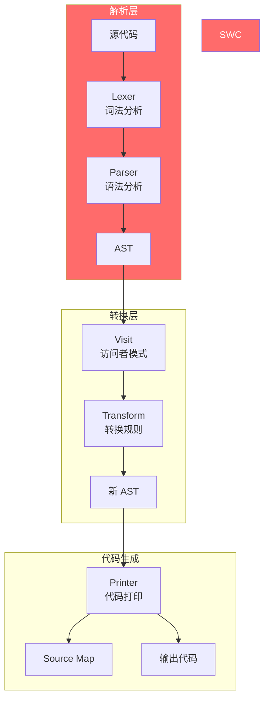

#### 3.3.2 Visitor 模式

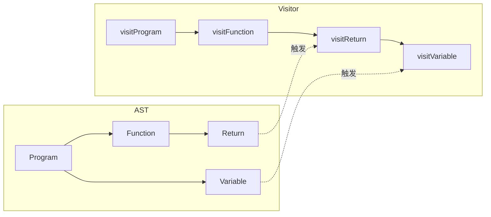

### 3.4 核心原理

#### 3.4.1 SWC vs Babel 性能

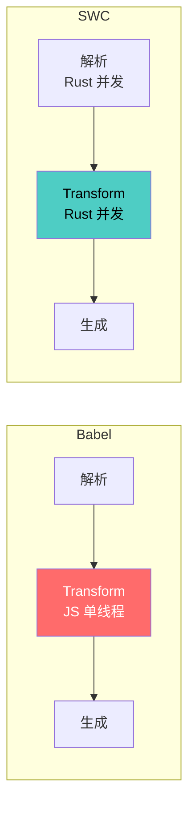

**性能提升来源**：

| 因素 | Babel (JS) | SWC (Rust) | 提升 |
|------|------------|------------|------|
| 解析速度 | 中等 | 极快 | 5-10x |
| 并发 | 受限 | 完全 | 4-8x |
| 内存 | 频繁 GC | 低 GC | 2-3x |
| **总提升** | - | - | **20-70x** |

#### 3.4.2 Visitor 模式实现

```rust
// 定义访问者
struct MyVisitor;

impl Visit for MyVisitor {
    // 访问函数声明
    fn visit_function(&mut self, f: &Function) {
        // 访问子节点
        walk_function(self, f);
    }

    // 访问变量声明
    fn visit_variable_decl(&mut self, v: &VariableDeclaration) {
        // 处理逻辑
    }
}

// 应用转换
fn transform(code: &str) -> String {
    let ast = parse(code).unwrap();
    let mut visitor = MyVisitor;
    swc_common::pass::run(&mut visitor, &ast);
    generate(&visitor.ast)
}
```

#### 3.4.3 与 Jest 集成

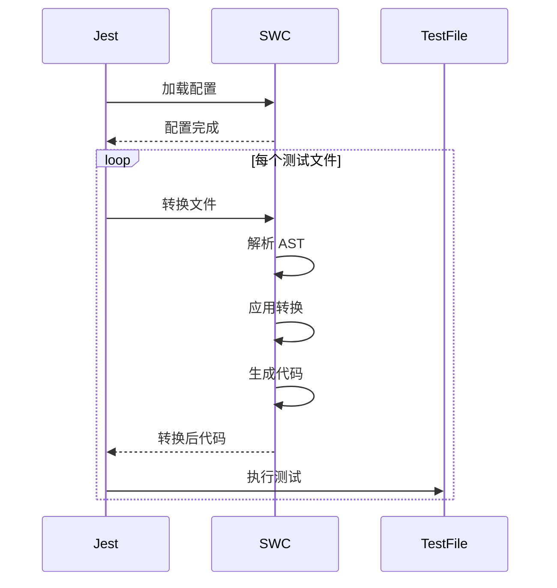

### 3.5 使用场景

- Babel 转译替代（大幅提速 CI/CD）
- Next.js 的底层编译器
- Turbopack 的 JavaScript/TypeScript 处理
- Jest 测试加速（swc-jest）

### 3.6 快速开始

```bash
# 安装 CLI
npm install -D @swc/cli @swc/core

# 基本使用
npx swc ./src/index.ts -o dist/index.js

# 监视模式
npx swc ./src -w -d dist --ignore '*.spec.ts'
```

**配置文件 .swcrc**：

```json
{
  "$schema": "https://json.schemastore.org/swcrc",
  "jsc": {
    "parser": {
      "syntax": "typescript",
      "tsx": true
    },
    "transform": {
      "react": {
        "runtime": "automatic"
      }
    },
    "target": "es2020"
  },
  "module": {
    "type": "es6"
  },
  "sourceMaps": true
}
```

**与 webpack 集成**：

```javascript
// webpack.config.js
// 第 1 段：配置出口与规则容器骨架
// webpack 只消费 CommonJS 导出的配置对象，module.rules 是"路径匹配 → 转换"的管线；
// 同一文件可被多条规则先后处理，因此规则顺序即处理顺序，不是互斥覆盖关系。
module.exports = {
  module: {
    rules: [
      {
        // 第 2 段：划定规则的生效范围
        // test 是路径正则：tsx? 展开成 ts / tsx，注意它并不含 jsx，
        // 所以 .jsx 文件不会命中这条规则，混用 JSX 的项目需另补规则或改成 jsx?。
        test: /\.(tsx?|js)$/,
        // 排除 node_modules：第三方包一般已是编译产物，再走一遍 SWC 会让构建时间成倍增长。
        exclude: /node_modules/,
        // 第 3 段：处理器选择——用 swc-loader 取代 babel-loader
        // SWC 基于 Rust，速度比 Babel 快一个量级，且配置内聚在 webpack 里、不必外挂 .babelrc；
        // 代价是它只做语法降级不做类型校验，类型错误要靠 tsc --noEmit 或 fork-ts-checker 兜底。
        use: {
          loader: 'swc-loader',
          options: {
            jsc: {
              // 第 4 段：解析阶段——告诉 SWC 源码用哪种语法读
              // syntax 设为 typescript，才允许类型标注、interface、enum 等 TS 专有写法；
              // tsx 再打开一层：把 <T> 当 JSX 起始标签而非泛型，漏掉它会直接解析崩溃。
              parser: {
                syntax: 'typescript',
                tsx: true,
              },
              transform: {
                // 第 5 段：React 转换模式——决定 JSX 最终编译成什么代码
                // automatic 对应 React 17+ 的 New JSX Transform，产物从 jsx-runtime 自动引入
                // jsx()/jsxs()，源码无需再写 import React；若项目仍停在 React 16，
                // 这里必须回落为 'classic'，否则运行时找不到 react/jsx-runtime 而报错。
                react: {
                  runtime: 'automatic',
                },
              },
            },
          },
        },
      },
    ],
  },
}
```

**Jest 集成**：

```javascript
// jest.config.js
module.exports = {
  transform: {
    '^.+\\.(tsx?|jsx?)$': ['@swc/jest', {
      jsc: {
        parser: {
          syntax: 'typescript',
          tsx: true,
        },
      },
    }],
  },
  testEnvironment: 'node',
}
```

### 3.7 高级配置

#### 3.7.1 装饰器配置

```json
{
  "jsc": {
    "parser": {
      "syntax": "typescript",
      "decorators": true
    },
    "transform": {
      "decoratorMetadata": true,
      "legacyDecorator": true
    }
  }
}
```

#### 3.7.2 环境变量替换

```json
{
  "env": {
    "targets": {
      "chrome": "80",
      "firefox": "75"
    },
    "mode": "usage",
    "coreJs": "3.30"
  }
}
```

### 3.8 性能基准

SWC 比 Babel 快 20-70 倍，具体取决于项目复杂度：

| 项目 | Babel | SWC | 提升倍数 |
|------|-------|-----|----------|
| tiny-react | 0.8s | 0.04s | 20x |
| medium-app | 15s | 0.25s | 60x |
| large-project | 120s | 2s | 60x |
| monorepo | 300s | 5s | 60x |

### 3.9 竞品对比

| 特性 | SWC | Babel | tsc | esbuild |
|------|-----|-------|-----|---------|
| 速度 | 极快 | 慢 | 中等 | 极快 |
| 输出质量 | 好 | 好 | 优秀 | 好 |
| 插件系统 | 有限 | 丰富 | 无 | 有限 |
| TypeScript | 原生支持 | 需要插件 | 原生 | 原生 |
| 生态兼容 | Babel | - | - | 无 |

### 3.10 在大型项目中的使用

| 项目 | SWC 的角色 | 收益 |
|------|------------|------|
| Next.js | 默认编译器 | 构建速度提升 60x |
| Turborepo | 任务调度器 | 任务执行更快 |
| Parcel | JS 转换器 | 解析速度提升 50x |
| Vite | 开发服务器 | 转换加速 |
| Biome | LSP 工具 | 代码检查加速 |

### 3.11 参考链接

- 官网：https://swc.rs/
- GitHub：https://github.com/swc-project/swc
- Playground：https://swc.rs/playground

## 4. Turbopack

### 4.1 简介

Turbopack 是 Vercel 开发的增量打包器，使用 Rust 编写，专为 Next.js 优化。它是 Next.js 15+ 的默认打包器，目标是让大型应用也能拥有极速的开发体验。

**核心特性**：

- 增量计算：缓存精确到函数级别，重复构建几乎零开销
- 懒编译：只打包浏览器实际请求的代码
- 统一图：处理 Next.js 的客户端/服务端/边缘多种输出环境
- 零配置：开箱即用，支持 TypeScript、JSX、CSS Modules
- 开发环境也打包：避免原生 ESM 的网络请求瀑布

**GitHub 数据**：集成在 Next.js 中，广泛使用

### 4.2 技术栈

- **核心语言**：Rust
- **编译引擎**：SWC（JavaScript/TypeScript 处理）
- **CSS 处理**：Lightning CSS（Rust 实现）
- **Node 绑定**：napi-rs

### 4.3 架构深度分析

#### 4.3.1 Turbopack 架构图

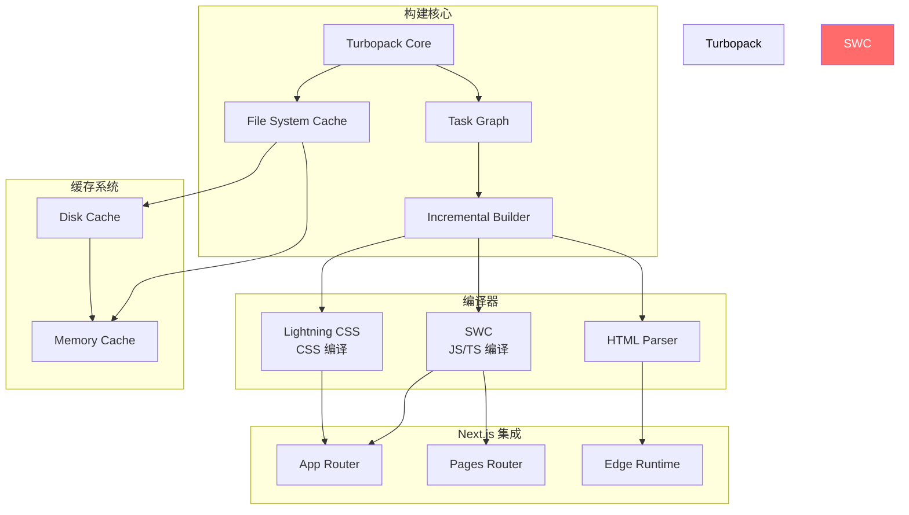

#### 4.3.2 增量构建原理

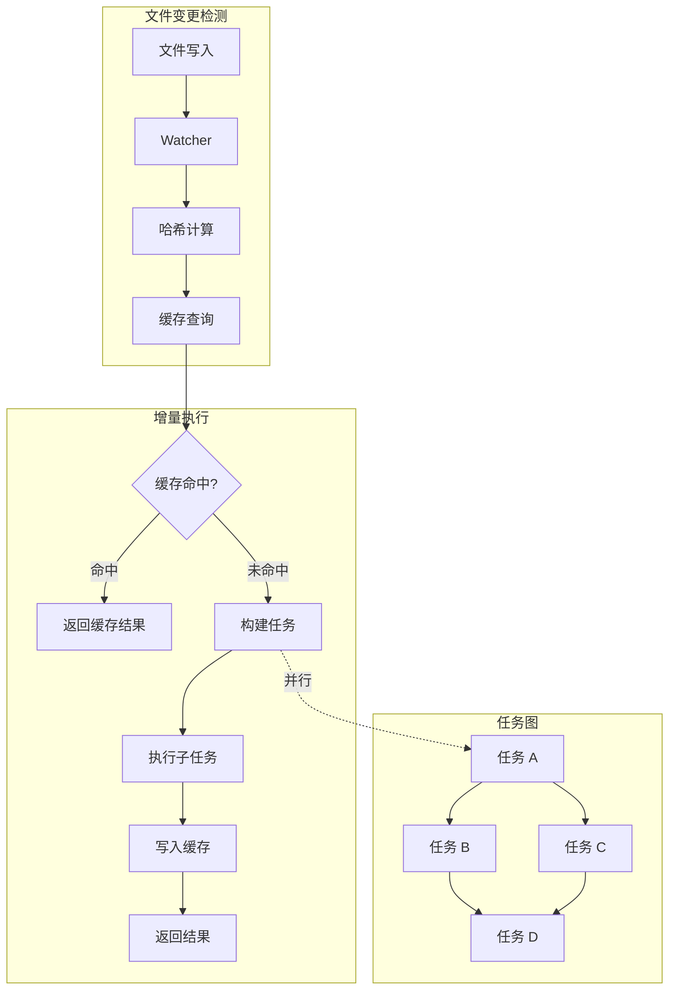

#### 4.3.3 与 Webpack 的区别

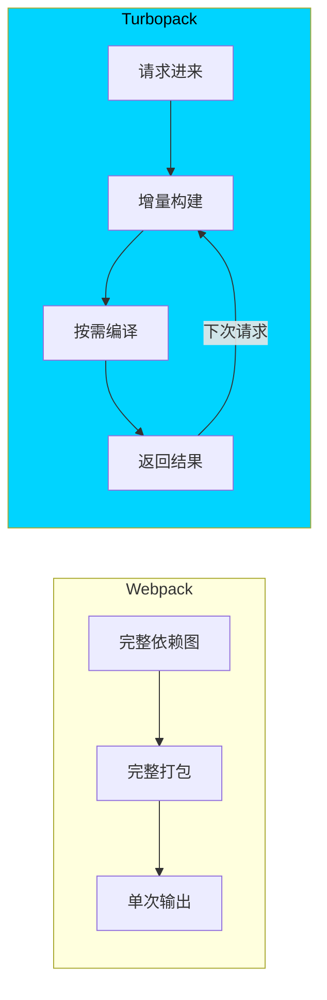

### 4.4 核心原理

#### 4.4.1 增量构建如何工作？

**任务图模型**：

```rust
// 简化的任务图
struct TaskGraph {
    tasks: HashMap<TaskId, Task>,
    edges: Vec<(TaskId, TaskId)>,
    cache: Arc<Cache>,
}

impl TaskGraph {
    fn execute(&self, changed_files: Vec<Path>) -> TaskResult {
        // 1. 确定受影响的模块
        let affected = self.find_affected(changed_files);
        
        // 2. 构建执行计划
        let plan = self.build_plan(affected);
        
        // 3. 并行执行任务
        self.execute_parallel(plan)
    }
}
```

**缓存策略**：

| 缓存级别 | 持久化 | 速度 | 容量 |
|----------|--------|------|------|
| 内存缓存 | 否 | 极快 | 小 |
| 文件缓存 | 是 | 快 | 大 |
| 远程缓存 | 可选 | 中 | 无限制 |

#### 4.4.2 懒编译机制

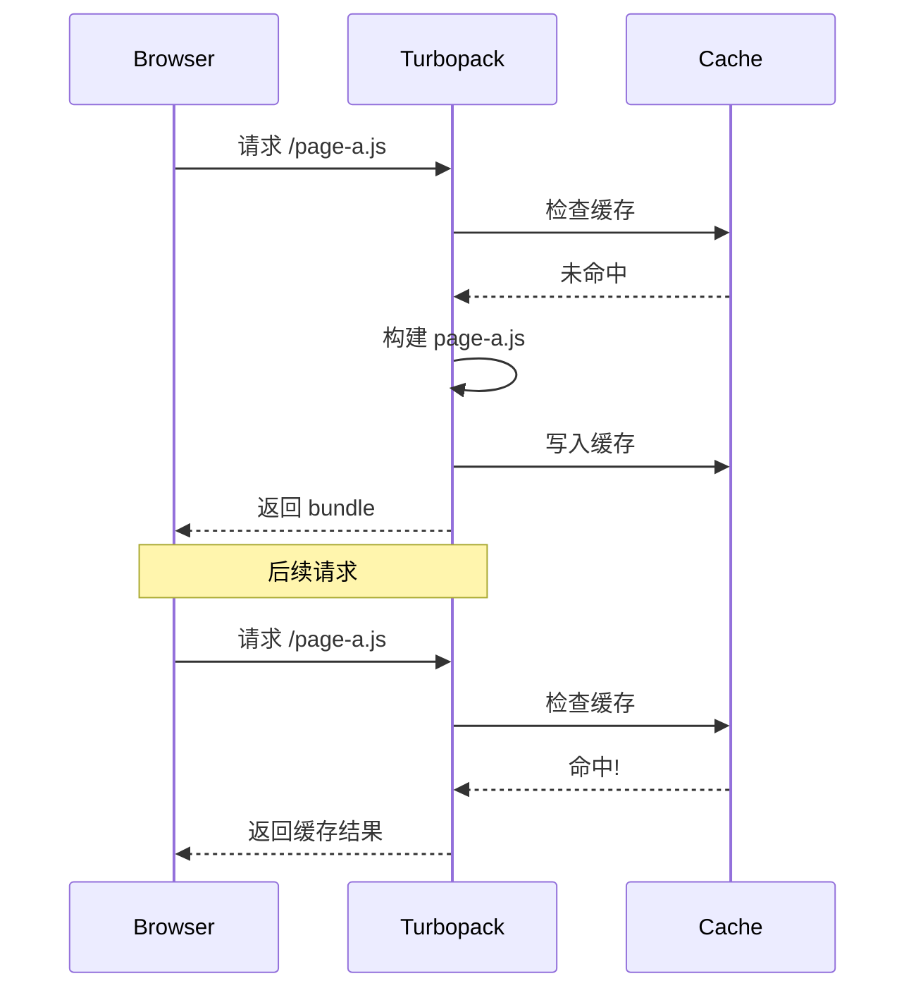

#### 4.4.3 统一图处理

Next.js 需要处理多种环境：

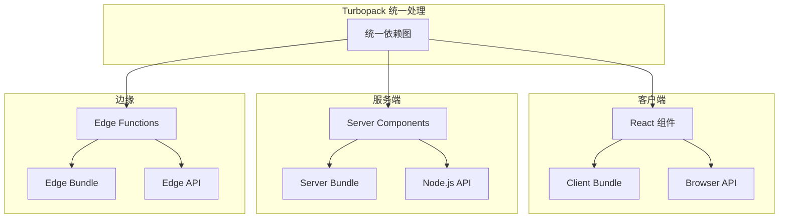

### 4.5 使用场景

- Next.js 15+ 项目（默认启用）
- 大型单体应用或微前端
- 需要快速增量构建的 CI/CD 流程

### 4.6 快速开始

```bash
# Next.js 16+ 无需任何配置，默认使用 Turbopack
npm run dev    # 自动使用 Turbopack
npm run build  # 构建阶段也支持

# 如需回退到 webpack
next dev --webpack
next build --webpack
```

**配置 next.config.js**：

```javascript
/** @type {import('next').NextConfig} */
const nextConfig = {
  // Turbopack 配置
  turbopack: {
    // 添加别名
    resolveAlias: {
      underscore: 'lodash',
    },
    // 自定义扩展名
    resolveExtensions: ['.mdx', '.tsx', '.ts', '.jsx', '.js', '.json'],
  },
  experimental: {
    // 构建缓存（Next.js 16 默认启用）
    turbopackFileSystemCacheForBuild: true,
  },
}

module.exports = nextConfig
```

**使用 webpack 加载器**（兼容层）：

```javascript
// next.config.js
// 第 1 段：整体定位与模块导出——这是 Next.js 在启动/构建时读取的构建期配置
// 它由 Next 的配置加载器用 require 直接执行，不经过打包流程，所以这里必须沿用 CommonJS；
// 若改成 next.config.mjs / .ts 才用 ESM 的 export default。同时该文件只在构建期求值一次，
// 不能把运行时才可用的状态（window、异步数据等）写进来。
module.exports = {
  // 第 2 段：turbopack 配置段——只在 Turbopack 作为打包器时才被读取
  // 仅当以 `next dev --turbopack`（或相应 build 开关）启动时生效；走 Webpack 构建时整段被忽略，
  // 因此若项目需要在两种打包器下行为一致，必须再补一份等价的 webpack 配置，否则会"本地能跑、CI 报错"。
  turbopack: {
    // 第 3 段：rules 模块规则——用 glob 匹配源文件，命中后交由 loader 链改写
    rules: {
      // 第 4 段：'*.svg' 规则——把 SVG 导入从"资源 URL"重写成"React 组件"
      // 左值是相对项目根目录的 glob；右值数组的执行顺序与 Webpack 一致（从左到右串行）。
      // 关键副作用：Next 默认让 `import Icon from './x.svg'` 得到静态资源 URL 字符串，
      // 命中本规则后它变成组件，原有  的写法会静默失效——最常见踩坑点。
      // 边界：该 glob 不限目录，node_modules 内的第三方 SVG 同样会被匹配，可能改变依赖行为并拖慢构建。
      '*.svg': [
        {
          // 第 5 段：loader 与选项——复用 Webpack 生态的 SVGR loader，并让它产出带类型的组件
          // Turbopack 兼容 Webpack loader 的解析与调用约定，所以无需等 Turbopack 专版 loader，
          // 数据流是：SVG 源码字符串 → SVGR 解析（内部可经 SVGO 压缩）→ Babel 转译 → 导出 React 组件模块。
          loader: '@svgr/webpack',
          options: {
            // 开启后产出的组件代码带 TSX 类型标注（如 React.SVGProps<SVGSVGElement>），
            // 让 .tsx 里的 width / className / fill 等 props 能被正确推导；纯 JS 项目可去掉以省一次转译。
            typescript: true,
          },
        },
      ],
    },
  },
}
```

### 4.7 支持的功能矩阵

| 功能 | 状态 | 说明 |
|------|------|------|
| JavaScript/TypeScript | 支持 | 使用 SWC |
| JSX/TSX | 支持 | SWC 处理 |
| CSS Modules | 支持 | Lightning CSS |
| Tailwind/PostCSS | 支持 | PostCSS 处理 |
| Sass/SCSS | 支持 | 自定义函数除外 |
| React Server Components | 支持 | Next.js App Router |
| Fast Refresh | 支持 | 无需配置 |
| Webpack 插件 | 不支持 | 需寻找替代方案 |

### 4.8 不支持的功能

| 功能 | 替代方案 |
|------|----------|
| Webpack 插件 | Turbopack 原生配置 |
| 自定义 webpack 配置 | 使用 turbopack.rules |
| Babel 配置 | 使用 SWC 配置 |
| 某些 PostCSS 插件 | 寻找 Rust 替代 |

### 4.9 性能基准

| 场景 | Webpack | Turbopack | 提升 |
|------|---------|-----------|------|
| 冷启动 (Next.js App) | 25s | 2s | 12x |
| HMR (组件修改) | 500ms | 50ms | 10x |
| 增量构建 (单文件) | 2s | 100ms | 20x |
| 完整构建 | 180s | 45s | 4x |

### 4.10 与 Vite 对比

| 方面 | Turbopack | Vite |
|------|-----------|------|
| 目标框架 | Next.js | 框架无关 |
| 开发模式 | 打包 | 原生 ESM |
| 增量构建 | 是 | 部分 (依赖预构建) |
| 生产构建 | SWC | Rolldown |
| 插件系统 | 受限 | Rollup 兼容 |
| 生态 | 紧密集成 Next.js | 开放生态 |

### 4.11 迁移指南

#### 4.11.1 从 Webpack 迁移

```javascript
// next.config.js
// 1. 移除 webpack 配置
module.exports = {
  // webpack: (config) => { ... }  // 移除
}

// 2. 添加 Turbopack 兼容的配置
module.exports = {
  turbopack: {
    // 等效配置
    resolveAlias: {
      // 原 webpack.resolve.alias
    },
  },
}
```

**需要转换的配置**：

| Webpack 配置 | Turbopack 替代 |
|--------------|----------------|
| `resolve.alias` | `turbopack.resolveAlias` |
| `resolve.extensions` | `turbopack.resolveExtensions` |
| `module.rules` | `turbopack.rules` |
| `plugins` | 检查兼容性 |

### 4.12 参考链接

- Next.js 文档：https://nextjs.org/docs/app/api-reference/turbopack
- GitHub：https://github.com/vercel/turbopack

## 深入阅读与参考

!!! tip "怎么用这些资料"
    先读「官方文档与规范」建立准确的概念，再读「源码与示例」核对细节，最后用「教程、书籍与视频」换一种讲法加深理解。每条都写明了读哪一节、带着什么问题读。

### 官方文档与规范

| 资源 | 为什么读 | 怎么读 |
|---|---|---|
| [esbuild 文档](https://esbuild.github.io/) | esbuild 官方入口，API 与 CLI 选项齐全，是查证行为的第一手依据。 | 先读 Getting Started 与 API 章节，跑一遍 CLI 打包，遇到选项疑问再回来查表。 |
| [SWC 文档](https://swc.rs/docs/getting-started) | SWC 官方手册，覆盖 Rust 与 Node 两种用法及插件机制。 | 读 Getting Started 与 @swc/core 配置章节，把它接入一个 TS 项目验证转译结果。 |
| [esbuild 架构说明](https://github.com/evanw/esbuild/blob/main/docs/architecture.md) | 官方解释并行、少遍历与内存布局，是理解性能来源的钥匙。 | 对照架构文档读，重点看为何不靠 AST 传递，总结三条性能结论。 |
| [esbuild FAQ](https://esbuild.github.io/faq/) | 回答为什么不支持某些特性，帮助理解它的定位与能力边界。 | 读 Why is esbuild fast 与不支持特性条目，列出它能做与不能做的清单。 |
| [Top Level Await(TLA) in Rolldown](https://rolldown.rs/in-depth/tla-in-rolldown) | 深入讲解 Rolldown 对顶层 await 的处理，涉及打包语义细节。 | 读 in-depth 文档，带着 TLA 如何影响 chunk 拆分的问题读，动手构造 TLA 示例。 |
| [esbuild](https://bun.sh/docs/bundler/esbuild) | Vite 侧对 esbuild 使用方式的说明，讲清它在 Vite 中的分工。 | 读该节，弄清依赖预构建与生产打包分别由谁负责，再核对现有项目配置。 |

### 源码与示例

| 资源 | 为什么读 | 怎么读 |
|---|---|---|
| [esbuild](https://github.com/evanw/esbuild) | 官方架构笔记，讲清并行解析与少遍历的设计取舍。 | 通读一遍，重点看 parser 到 linker 的数据流，读完能复述它快的三个原因。 |
| [esbuild 插件](https://esbuild.github.io/plugins/) | 插件 API 文档配示例，是扩展构建流程的实操入口。 | 照示例写 onResolve 与 onLoad 插件处理自定义后缀，跑通后再加日志调试。 |
| [SWC 配置](https://swc.rs/docs/configuration/swcrc) | 手写 .swcrc 的实操向文档，可直接替换现有 Babel 配置。 | 把 Babel 配置逐项映射为 .swcrc，编译同一份代码并对比耗时与产物。 |

### 教程、书籍与视频

| 资源 | 为什么读 | 怎么读 |
|---|---|---|
| [Vite：Rolldown 集成](https://vite.dev/guide/rolldown.html) | 说明 Vite 如何切到 Rolldown，迁移注意事项讲得具体。 | 读迁移与兼容章节，在测试分支试跑 rolldown-vite，对比构建时间与产物。 |
| [Rolldown 入门](https://rolldown.rs/guide/getting-started) | 官方入门教程，最短路径跑通 Rollup 兼容的打包流程。 | 按步骤跑最小示例，再换一份现有 Rollup 配置，观察兼容性与告警差异。 |
| [VoidZero](https://voidzero.dev/) | 从团队视角看 Rolldown、Oxc 与 Vite 的整体布局与动机。 | 读愿景与路线部分，带着这些工具如何分工的问题读，画出工具关系图。 |

## 应用与行业实践

前面几节把 Rolldown、esbuild、SWC、Turbopack 各自的能力摆开了。这一节回答另一个问题：这些能力分别落在什么工程现场，怎么量，什么时候不该换。

### 应用场景地图

| 场景 | 用到本页哪个知识点 | 典型技术选型 | 注意事项 |
| --- | --- | --- | --- |
| 后台管理系统详情页，一次渲染上万行表格 | esbuild 的转译速度、依赖预构建 | 开发服务器 + esbuild 预构建 | esbuild 不生成装饰器元数据，类里用了 `emitDecoratorMetadata` 就不能只靠它 |
| 低端安卓机上的首屏加载 | Rolldown / Rollup 形态的 tree-shaking 与代码分割 | 按路由拆 chunk | 包里的副作用要在 `package.json` 的 `sideEffects` 里标清楚 |
| 多人协作白板，两个人同时改一块画布 | Turbopack 的增量更新、HMR 边界 | 带 HMR 的开发服务器 | 状态别放模块顶层，否则热替换后回到初始值 |
| 组件库发到 npm 给别的团队引用 | 库模式打包、external 配置 | esbuild lib 构建或 Rolldown | peer 依赖必须 external，声明文件要单独生成 |
| Node 端 SSR 服务的服务端 bundle | esbuild 的 platform 与 target | esbuild `--platform=node` | 带原生扩展的依赖要 external，不能打进 bundle |
| Chrome 扩展的多入口打包 | 多入口与产物路径控制 | esbuild 的 `entryPoints` 数组 | 扩展的 CSP 不允许 `eval`，产物加载方式要和 manifest 对齐 |
| Monorepo 里多个子包按依赖顺序构建 | SWC 转译、构建缓存 | SWC + 任务编排工具的本地缓存 | 缓存键要包含锁文件与环境变量，否则换依赖后命中脏缓存 |
| Serverless 函数的冷启动 | esbuild 的单文件打包与 tree-shaking | 每个函数打一个 bundle | 产物体积直接影响冷启动，未用到的依赖要确认被摇掉 |

### 三个场景拆解

#### 场景 1：后台管理系统的万行表格

**业务背景**：详情页要一次渲染上万行表格数据，本地保存一次文件要等到整页重绘结束才能看到结果。规模可以用路由数量、单页组件行数、保存到界面更新的秒数来记录，这三个数字在开发机上都能复现。

**怎么用本页知识解决**：先把「转译耗时」和「渲染耗时」分开量，再决定要不要换转译器。

```js
// build/dev-server.mjs —— 只做转译，量转译本身要多久
import { context } from 'esbuild';

const ctx = await context({
  entryPoints: ['src/main.tsx'],  // 单入口，产出与开发期一致的模块图
  bundle: true,                   // 打开打包，才能看到依赖图规模
  format: 'esm',                  // 开发期输出 ESM，配合浏览器原生模块
  target: 'es2020',               // 与浏览器支持范围对齐，少做语法降级
  metafile: true,                 // 产出 metafile，用来数模块与字节
  outdir: 'tmp/dev',              // 输出到临时目录，不污染 dist
});
await ctx.watch();                // 监听文件变化，模拟保存后的重建
```

- `context` 加 `watch` 把首次构建和保存后重建分成两个数字，混在一起就找不到瓶颈。
- `metafile` 的 `inputs` 字段记着每个模块的字节数与引用关系，模块数涨了多少可以直接数。
- `target` 设成浏览器实际支持的最低版本，能少掉对应的语法降级步骤。
- 输出到 `tmp/dev`，避免和正式产物互相覆盖。
- 这一步只量转译；转译很快但界面还是慢，问题在渲染，不在打包器。

**怎么度量收益**：指标是首次构建耗时、单次重建耗时、参与转译的模块数。方法是在终端用 `time node build/dev-server.mjs` 连跑 5 次取中位数，读 metafile 的 `inputs` 数模块，用 DevTools 的 Performance 面板录制保存到更新的全过程。

**什么时候不该用**：项目只有几十个模块、构建本来就不到一秒，换转译器的收益量不出来，配置成本反而落下来。代码里用 `emitDecoratorMetadata`（Angular、NestJS 常见），esbuild 不生成这份元数据，直接换会在运行时报错。大量使用 `const enum` 并依赖跨文件内联时，先核对 esbuild 官方文档对 enum 的说明。

#### 场景 2：组件库发到 npm

**业务背景**：组件库被几个业务项目直接引用，发布时若把 React 打进产物，使用方的 bundle 里会出现第二份 React。规模按产物 gzip 体积、产物中的模块数量、外部依赖个数来记，每次发布前都能重测。

**怎么用本页知识解决**：把 peer 依赖全部标成 external，只留组件本身和纯函数依赖进产物。

```js
// build/lib.mjs —— 库模式打包，只出 ESM
import { build } from 'esbuild';

await build({
  entryPoints: ['src/index.ts'],      // 只从公共入口出发，示例与测试不进产物
  bundle: true,                        // 把内部模块合成一个文件
  format: 'esm',                       // 保留 ESM，使用方能继续 tree-shaking
  external: ['react', 'react-dom'],    // peer 依赖不打进来，避免两份 React
  target: 'es2020',                    // 与使用方的构建目标对齐
  outfile: 'dist/index.js',            // 产物路径写进 package.json 的 exports
  metafile: true,                      // 留一份清单，发布前做体积核对
});
```

- `external` 要照着 `package.json` 的 `peerDependencies` 抄一遍，漏一个就可能出两份 React。
- `entryPoints` 只写公共入口，`src` 下的示例和 mock 不进产物。
- esbuild 不做类型检查，也不产出 `.d.ts`，发布前另跑一次 `tsc --emitDeclarationOnly`。
- metafile 存进仓库，下一次发布前对比，能看出哪次改动把体积带上去了。
- 要兼容只支持 CJS 的老宿主，再补一份 `format: 'cjs'` 的产物，先确认真有人需要。

**怎么度量收益**：指标是产物的 gzip 字节数、每个模块的字节占比、使用方产物里有没有 `react`。方法是 `gzip -c dist/index.js | wc -c` 记体积，读 metafile 的 `inputs` 排模块，再到使用方项目的构建 metafile 里搜 `react`。

**什么时候不该用**：使用方靠深引用子路径（`require('包名/某个子路径')`）取模块，单入口 bundle 打不出这些路径，得改成多入口，省下的时间被配置吃掉。产物需要保留指令注释或 banner，先核对 esbuild 官方文档对保留注释的说明。

#### 场景 3：多人协作白板

**业务背景**：白板页面同时放几十个图形对象，编辑器模块保存后若整页刷新，本地还没同步的笔画会丢。规模按页面对象数、一次会话里的整页刷新次数、保存到界面更新的秒数记录。

**怎么用本页知识解决**：把编辑器状态从模块顶层挪到一个热替换时能交接的位置。

```js
// src/board/store.ts
import { createStore } from './store-factory';

// 热替换后优先复用上一次的状态，没有才新建
const state = import.meta.hot?.data.state ?? createStore();

if (import.meta.hot) {
  // 替换前把当前状态存进 hot.data，下一次加载能读到
  import.meta.hot.dispose((data) => {
    data.state = state;
  });
  // 接受本模块自身的更新，不再向上冒泡成整页刷新
  import.meta.hot.accept();
}
```

- `import.meta.hot.data` 在同一个模块的两次加载之间保留，是本模块交接状态的口子。
- `dispose` 在旧模块被替换前执行，把 `state` 挂到 `data` 上。
- `accept()` 不带回调表示本模块自己处理更新，HMR 不再往上找边界。
- 边界写在引用方而不是本模块时，状态交接点也要跟着挪。
- 这段由 `if (import.meta.hot)` 包住，生产构建会把它删掉。Turbopack 与 Next.js 侧的 HMR 运行时不同，写法需核对官方文档。

**怎么度量收益**：指标是保存到画布重绘完成的耗时、一次会话里的整页刷新次数、状态丢失次数。方法是用 DevTools 的 Performance 面板录制保存到重绘的区间，用 Network 面板看有没有 `type: document` 的整页文档请求。

**什么时候不该用**：状态活在第三方 SDK 实例里，容器组件只是它的壳，热替换后实例已销毁，交接不了。页面初始化要请求远端数据并重放，每次热更新都重建比整页刷新还慢。模块没有稳定的导出边界（逻辑全写在入口文件里），先拆模块再加边界。

### 行业先进实践

依赖预构建（出处：Vite 官方文档）
Vite 首次启动时用 esbuild 把 `node_modules` 里的 CommonJS 与 UMD 依赖转成 ESM，缓存写到 `node_modules/.vite`。第二次启动不用再处理这批依赖，dev server 的就绪时间就稳住了。借鉴方式：把改动频率低的第三方依赖集中到一处 import，让缓存命中范围稳定。

默认转译器换成 SWC（出处：Next.js 官方文档）
Next.js 默认用 SWC 转译 JS 与 TS；仓库里存在自定义 Babel 配置时会退回 Babel 编译。借鉴方式：先确认项目里没有残留的 Babel 配置文件，再对比本地构建与热更新的耗时记录。

函数粒度的增量计算（出处：Turbopack 开源项目 / Next.js 官方文档）
Turbopack 把构建拆成一个个函数，输入没变的部分直接复用结果，只重算输入变化的那部分。借鉴方式：把开发阶段的构建脚本拆成可单独运行的步骤，缓存每一步的输入哈希。

每次构建输出模块清单（出处：esbuild 官方文档）
esbuild 的 build API 可以输出 metafile，`inputs` 与 `outputs` 记录每个模块的字节数和引用关系。借鉴方式：把 metafile 存成 CI 产物，在合并请求上对比前后差值，定位体积回退来源。

Rust 重写打包核心并保持配置兼容（出处：Rolldown 开源项目）
Rolldown 的公开目标之一是兼容 Rollup 的插件接口与配置形态，让已有配置能迁移过来；Vite 也有基于 Rolldown 的实验构建路径。借鉴方式是先在库模式打包上试，插件兼容情况需核对官方文档：你正在用的 Rollup 插件是否在支持列表里。

### 从学到用：落地路线

第 1 步 试点：在一个构建耗时最长的子包里替换转译器，其他子包不动。
验收标准：该子包的构建命令在本地跑通，产物的导出符号与替换前逐项相同。

第 2 步 验证：在同一台机器上对替换前后各跑 5 次构建，记录耗时中位数、gzip 体积、测试通过情况。
验收标准：三个数字都写进一份可复现的记录，机器型号与命令一并附上。

第 3 步 推广：把试点通过的配置抽成一份共享配置文件，其余子包引用同一份。
验收标准：仓库里只有一份转译器配置，CI 上所有子包的构建都走这条路径。

第 4 步 防回退：把 gzip 体积上限和构建耗时上限写进 CI 检查，超限直接失败。
验收标准：往入口里加一个体积大的依赖后，CI 的检查任务报错并能指出是哪个模块。

### 动手作业

目标：把一个已有 TypeScript 工具包的转译从 `tsc` 换成 esbuild 或 SWC，在同一套测试下对比耗时与体积。

步骤：

1. 挑一个你手上的 TS 包，记录当前构建命令，用 `time npm run build` 连跑 5 次并记下耗时。
2. 记录当前产物的 gzip 体积：`gzip -c dist/index.js | wc -c`。
3. 新写一份构建脚本输出到 `dist-next`，让两套产物并存，不改动原命令。
4. 写一段脚本分别 import 两个产物，打印各自的导出符号并按名字排序。
5. 把包里的单元测试分别指向两套产物各跑一遍。
6. 打开新构建的 metafile，按字节数排出前 5 个模块，与原产物的模块清单对照。
7. 写一份记录：5 次耗时的中位数、gzip 体积变化、测试结果、差异来源模块。

验收标准：

- 两套产物的导出符号排序后逐项相同，脚本输出可直接贴进记录。
- 同一套单元测试在两套产物上全部通过。
- 记录里有 5 次构建耗时，并注明机器与命令。
- 记录里有 gzip 体积数字，并指出体积差异来自哪些模块。
- 若两套产物行为不一致，记录里写清是哪条用例、由哪一行代码导致。

