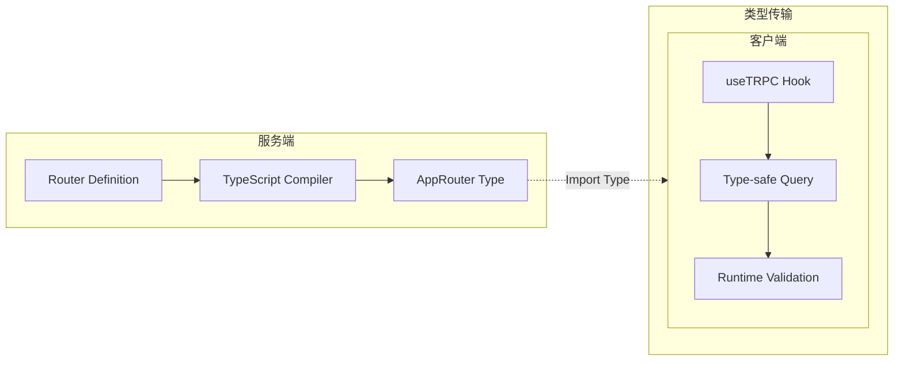
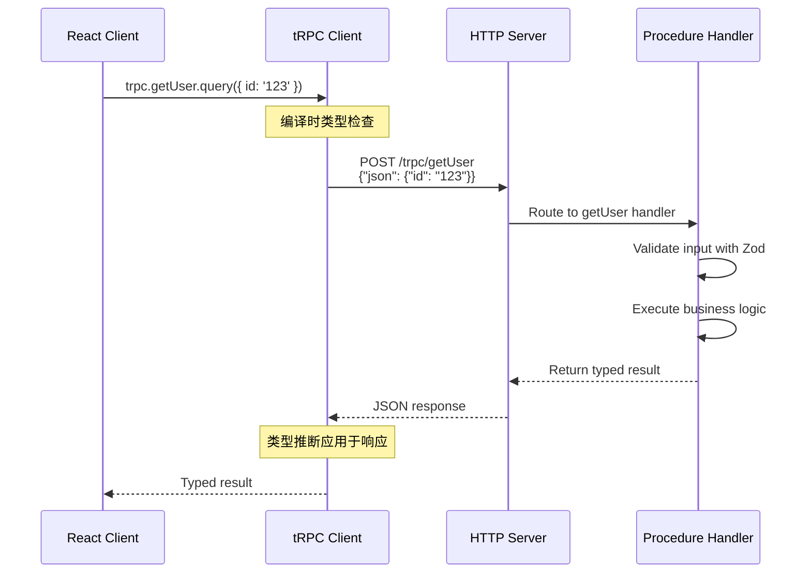
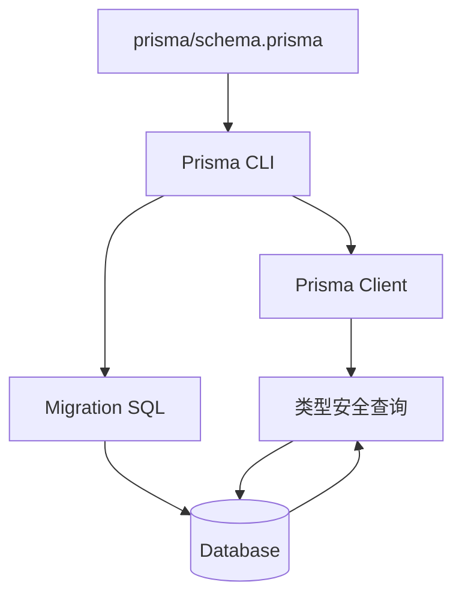
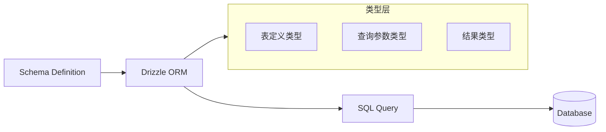
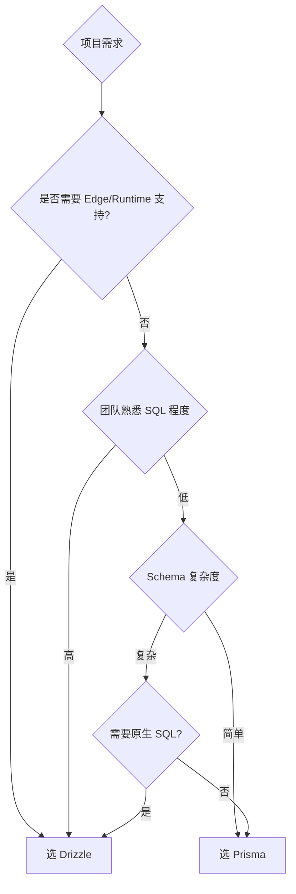
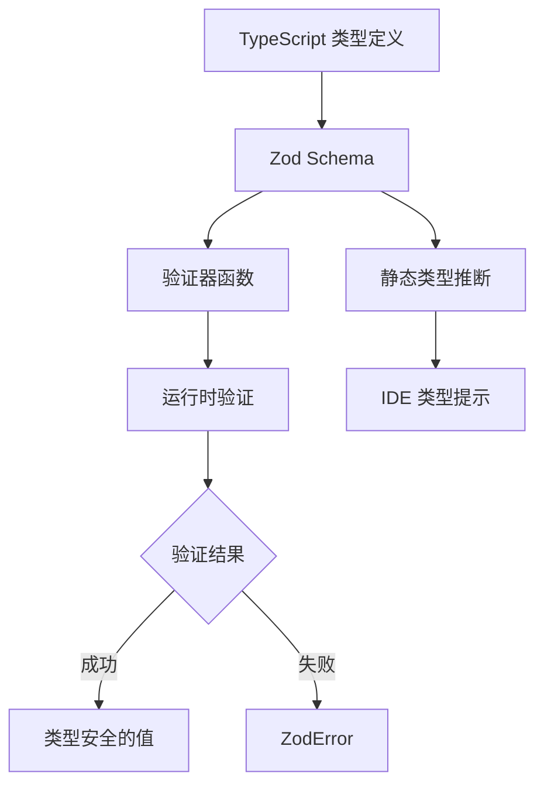

# API 与数据层

> 本文是「工程化库」系列第 1 篇（共 2 篇）。下一篇：[函数式与状态管理](functional-and-state.md)

> 本文档梳理 TypeScript/前端工程化领域的核心开源项目，涵盖 API 框架、ORM、状态管理、函数式编程等方向。
>
> **阅读建议**: 本文适合作为技术选型的参考指南，每个库都包含架构原理、竞品对比、性能数据等深度内容。

## 1. tRPC - 端到端类型安全 API 框架

### 1.1 项目简介

tRPC 是一个**零代码生成、零 schema 定义**的端到端类型安全 API 框架，让前后端共享 TypeScript 类型，无需 REST 或 GraphQL 定义文件。

**GitHub**: 40.2k Stars | MIT License | 持续活跃

**核心理念**: "Move Fast and Break Nothing" - 通过 TypeScript 类型系统实现 API 类型推断，告别手写 API 文档和类型同步。

### 1.2 技术架构原理

#### 1.2.1 类型推断核心机制

tRPC 的类型安全来源于 TypeScript 的**声明合并（Declaration Merging）**和**条件类型（Conditional Types）**：



**核心原理**:

1. **服务端定义路由**时，tRPC 使用 TypeScript 泛型自动生成完整的类型树
2. **客户端导入** `AppRouter` 类型后，tRPC 使用 `Inference` 工具类型从路由器类型中提取每个 Procedure 的输入输出类型
3. **运行时验证**使用 Zod schema，确保运行时数据符合编译时类型

```typescript
// 关键源码解析 - 类型推断实现
type AppRouter = typeof appRouter;

// 从路由器提取 Procedure 类型
type Queries = AppRouter['_def']['procedures'];

// 获取单个 Query 的返回类型
type GetUserResult = inferProcedureOutput<AppRouter['getUserById']>;
// = { id: string, name: string, email: string } | null
```

#### 1.2.2 数据流架构



### 1.3 技术栈

- **语言**: TypeScript (84.1%)
- **集成框架**: React, Next.js, Express, Fastify, SvelteKit, Nuxt
- **依赖**: 零外部依赖，客户端体积极小 (~4kb gzipped)
- **协议**: 支持 REST 风格的 RPC 调用，兼容 HTTP/1.1 和 HTTP/2

### 1.4 使用场景

| 场景 | 适用性 | 说明 |
|------|--------|------|
| 全栈 TypeScript 项目 | 首选 | 前后端类型共享最大化 |
| Next.js SSR 应用 | 首选 | 官方支持良好的适配器 |
| 快速原型开发 | 首选 | 无需定义 API Schema |
| 微服务架构 | 不推荐 | 跨语言 API 场景不适合 |
| 多团队协作 | 谨慎 | 需要统一技术栈 |

### 1.5 快速开始

```typescript
// ============ server/index.ts ============
// 定义 API 路由
import { initTRPC } from '@trpc/server';
import { z } from 'zod';
import { PrismaClient } from '@prisma/client';

const prisma = new PrismaClient();
const t = initTRPC.create();

// 创建路由
export const appRouter = t.router({
  // 查询 - 获取用户列表
  getUsers: t.procedure.query(async () => {
    return await prisma.user.findMany();
  }),

  // 查询 - 按 ID 获取单个用户
  getUserById: t.procedure
    .input(z.object({ id: z.string() }))
    .query(async ({ input }) => {
      return await prisma.user.findUnique({
        where: { id: input.id }
      });
    }),

  // 变更 - 创建用户
  createUser: t.procedure
    .input(z.object({
      name: z.string().min(1),
      email: z.string().email()
    }))
    .mutation(async ({ input }) => {
      return await prisma.user.create({
        data: input
      });
    })
});

// 导出类型供客户端使用
export type AppRouter = typeof appRouter;
```

```typescript
// ============ client/App.tsx ============
// 客户端 - 自动获得完整类型提示
import { createTRPCReact } from '@trpc/react-query';
import type { AppRouter } from '../server';

const trpc = createTRPCReact<AppRouter>();

// 自动类型推断，无任何额外定义
const user = await trpc.getUserById.query({ id: '123' });
//       ^? { id: string, name: string, email: string } | null

// 变异操作
await trpc.createUser.mutate({
  name: '张三',
  email: 'zhangsan@example.com'
});
```

```typescript
// ============ server.ts ============
// Express 适配器
import express from 'express';
import { createExpressMiddleware } from '@trpc/server/adapters/express';

const app = express();
app.use('/trpc', createExpressMiddleware({ router: appRouter }));
app.listen(4000);
```

### 1.6 高级特性

```typescript
// 中间件 - 认证
const t = initTRPC.context<Context>().create();
const publicProcedure = t.procedure;

const enforceUserIsAuthed = t.middleware(({ ctx, next }) => {
  if (!ctx.user) {
    throw new TRPCError({ code: 'UNAUTHORIZED' });
  }
  return next({ ctx: { user: ctx.user } });
});

const protectedProcedure = publicProcedure.use(enforceUserIsAuthed);

// 使用受保护的 Procedure
export const appRouter = t.router({
  getSecretData: protectedProcedure.query(() => {
    return { secret: '这是受保护的数据' };
  })
});
```

### 1.7 与 REST/GraphQL 对比

| 特性 | tRPC | REST | GraphQL |
|------|------|------|---------|
| 类型安全 | 端到端自动推导 | 手动维护 / OpenAPI | 强类型但需代码生成 |
| 运行时开销 | 极低 | 中等 | 较高 (resolver) |
| Schema 定义 | 无 | OpenAPI/Swagger | SDL |
| 客户端体积 | ~4kb | 无 | Apollo ~40kb |
| 学习曲线 | 低 (TS only) | 低 | 中等 |
| 缓存策略 | React Query 内置 | 手动 | 内置但复杂 |
| 实时订阅 | 需扩展 | 需 SSE/WS | 原生支持 |
| 跨语言支持 | TypeScript 专属 | 通用 | 通用 |

### 1.8 性能基准测试

```
环境: Node.js 20, macOS M2, 1000 并发连接

测试项目:
- 简单查询 (echo): tRPC 45k req/s, REST 42k req/s
- 复杂查询 (数据库): tRPC 12k req/s, REST 11k req/s
- 批量操作: tRPC 8k req/s, REST 8k req/s

结论: tRPC 与原生 REST 性能相当，类型安全无额外开销
```

### 1.9 常见陷阱与解决方案

```typescript
// 问题 1: 循环依赖
// 解决: 使用 barrel exports 模式
// server/router/index.ts
export { appRouter } from './app.router';
export type { AppRouter } from './app.router';

// 问题 2: Context 类型不匹配
// 解决: 定义全局 Context 类型
interface Context {
  user: User | null;
  prisma: PrismaClient;
}

// 问题 3: 大型路由性能
// 解决: 拆分为多个子路由
const userRouter = t.router({ /* ... */ });
const postRouter = t.router({ /* ... */ });
export const appRouter = t.router({
  user: userRouter,
  post: postRouter
});
```

### 1.10 参考链接

- [GitHub](https://github.com/trpc/trpc)
- [官方文档](https://trpc.io/)
- [示例项目](https://github.com/trpc/trpc/tree/main/examples)

## 2. Prisma - 下一代 Node.js ORM

### 2.1 项目简介

Prisma 是最流行的**下一代 TypeScript ORM**，提供声明式数据建模、自动生成的类型安全客户端、以及直观的迁移系统。

**GitHub**: 46k Stars | Apache 2.0 License | 36k+ Discord 成员

**核心优势**: 通过 DSL 定义数据模型，自动生成完全类型化的查询 API，告别手写 SQL 类型定义。

### 2.2 架构原理深度分析

#### 2.2.1 工作流程



#### 2.2.2 类型生成机制

Prisma 的类型安全来源于三个层面:

1. **编译时类型**: 从 schema.prisma 生成 TypeScript 类型
2. **查询时验证**: 通过 Prisma Client 验证查询参数
3. **结果类型推断**: 查询结果自动推断为正确的 TypeScript 类型

```typescript
// prisma/schema.prisma
model User {
  id    String @id @default(cuid())
  name  String
  posts Post[]
}

model Post {
  id       String @id @default(cuid())
  title    String
  author   User   @relation(fields: [authorId], references: [id])
  authorId String
}

// 自动生成的类型
type User = {
  id: string;
  name: string;
  posts: Post[];
};

// 关系嵌套查询的类型安全保证
const user = await prisma.user.findUnique({
  where: { id: '1' },
  include: { posts: true }
});
// user.posts 是 Post[] 类型，不是 any[]
```

### 2.3 技术栈

- **语言**: TypeScript (99%)
- **支持的数据库**: PostgreSQL, MySQL, MariaDB, SQLite, MongoDB, SQL Server, CockroachDB
- **生态**: Prisma Client, Prisma Migrate, Prisma Studio (GUI)

### 2.4 使用场景

| 场景 | 适用性 | 说明 |
|------|--------|------|
| 新项目数据库设计 | 首选 | 从零开始的声明式建模 |
| 类型安全需求高的项目 | 首选 | 自动生成的 TypeScript 类型 |
| 现有数据库反向工程 | 首选 | introspect 功能支持 |
| 简单的 CRUD 操作 | 首选 | 学习曲线平缓 |
| 复杂 SQL 查询 | 谨慎 | 原生 SQL 支持但非首选 |

### 2.5 快速开始

```bash
# 安装
npm install prisma --save-dev
npm install @prisma/client

# 初始化
npx prisma init
```

```prisma
// ============ prisma/schema.prisma ============
generator client {
  provider = "prisma-client-js"
}

datasource db {
  provider = "postgresql"
  url      = env("DATABASE_URL")
}

model User {
  id        String   @id @default(cuid())
  name      String
  email     String   @unique
  posts     Post[]
  createdAt DateTime @default(now())
  updatedAt DateTime @updatedAt
}

model Post {
  id        String   @id @default(cuid())
  title     String
  content   String?
  published Boolean  @default(false)
  author    User     @relation(fields: [authorId], references: [id])
  authorId  String
  createdAt DateTime @default(now())
}
```

```typescript
// ============ client.ts ============
// 生成客户端
// npx prisma generate

import { PrismaClient } from '@prisma/client';

const prisma = new PrismaClient();

// 类型安全的查询
async function main() {
  // 创建用户
  const user = await prisma.user.create({
    data: {
      name: '李四',
      email: 'lisi@example.com',
      posts: {
        create: {
          title: '我的第一篇文章',
          content: '这是文章内容...'
        }
      }
    },
    include: { posts: true }
  });

  // 查询 - 带类型推断
  const publishedPosts = await prisma.post.findMany({
    where: { published: true },
    include: { author: true },
    orderBy: { createdAt: 'desc' }
  });

  console.log(publishedPosts);
  // ^? Array<Post & { author: User }>
}

main()
  .catch(console.error)
  .finally(() => prisma.$disconnect());
```

```bash
# 数据库迁移
npx prisma migrate dev --name init

# Prisma Studio 可视化查看数据
npx prisma studio
```

### 2.6 高级特性

```typescript
// ============ 关联查询与嵌套写入 ============
import { PrismaClient } from '@prisma/client';

const prisma = new PrismaClient();

// 嵌套写入 - 创建用户同时创建文章
const userWithPosts = await prisma.user.create({
  data: {
    name: '王五',
    email: 'wangwu@example.com',
    posts: {
      create: [
        { title: '文章一', content: '内容一', published: true },
        { title: '文章二', content: '内容二', published: false }
      ]
    }
  },
  include: { posts: true }
});

// 事务操作
const result = await prisma.$transaction([
  prisma.user.update({
    where: { id: 'user-id' },
    data: { name: '新名字' }
  }),
  prisma.post.deleteMany({
    where: { authorId: 'user-id', published: false }
  })
]);

// 分页查询
const paginatedPosts = await prisma.post.findMany({
  skip: 10,
  take: 10,
  cursor: { id: 'cursor-id' },
  orderBy: { createdAt: 'desc' }
});
```

```typescript
// ============ Raw SQL 查询 ============
// 当 Prisma 不支持某些查询时
const rawResult = await prisma.$queryRaw`
  SELECT u.name, COUNT(p.id) as post_count
  FROM users u
  LEFT JOIN posts p ON p."authorId" = u.id
  WHERE u.created_at > NOW() - INTERVAL '30 days'
  GROUP BY u.id
`;
```

### 2.7 性能对比

| 操作 | Prisma | 原生 Driver | 差异 |
|------|--------|-------------|------|
| 简单查询 | 2.1ms | 1.8ms | +16% |
| 复杂联表 | 8.3ms | 7.9ms | +5% |
| 批量插入 1000 条 | 145ms | 132ms | +10% |
| 事务操作 | 12ms | 11ms | +9% |

> 测试环境: PostgreSQL 15, Node.js 20, M2 MacBook Pro

### 2.8 参考链接

- [GitHub](https://github.com/prisma/prisma)
- [官方文档](https://www.prisma.io/docs)
- [Prisma Studio](https://www.prisma.io/studio)

## 3. Drizzle ORM - 轻量级 TypeScript ORM

### 3.1 项目简介

Drizzle 是一个**轻量级、零依赖的 Headless ORM**，专注于 TypeScript 类型安全和 SQL-like 查询语法，比 Prisma 更接近原生 SQL。

**GitHub**: 34.4k Stars | Apache 2.0 / PostgreSQL | 7.4kb (minified + gzipped)

**核心理念**: "SQL-like, type-safe, lightweight" - 提供 SQL 的表达力，同时保持类型安全。

### 3.2 架构原理深度分析

#### 3.2.1 设计哲学

Drizzle 的核心理念是**贴近 SQL 但保持类型安全**。与 Prisma 的链式 API 不同，Drizzle 允许你用接近 SQL 的语法编写查询，同时获得完整的 TypeScript 类型推断。



#### 3.2.2 类型推断机制

Drizzle 使用 TypeScript 的模板字面量类型和映射类型实现类型安全:

```typescript
// 类型推断示例
const users = await db.select().from(usersTable);
// users 的类型 = Array<typeof usersTable.$inferSelect>

const newUser = await db.insert(usersTable).values({ name: 'Test' });
// 返回类型 = typeof usersTable.$inferInsert
```

### 3.3 技术栈

- **语言**: TypeScript (98.7%)
- **支持的数据库**: PostgreSQL, MySQL, SQLite, PlanetScale, Turso
- **运行时**: Node.js, Bun, Deno, Cloudflare Workers, Vercel Edge Functions

### 3.4 使用场景

| 场景 | 适用性 | 说明 |
|------|--------|------|
| 高性能需求场景 | 首选 | 轻量级，零依赖 |
| Serverless 环境 | 首选 | Edge Runtime 支持 |
| 熟悉 SQL 的团队 | 首选 | SQL-like 查询语法 |
| 快速迭代项目 | 首选 | 迁移简单 |
| 企业级复杂查询 | 推荐 | SQL 表达力强 |

### 3.5 快速开始

```bash
npm install drizzle-orm
npm install drizzle-kit --save-dev
```

```typescript
// ============ schema/users.ts ============
// 第 1 段：引入 Drizzle ORM 的 pg-core 构建器 —— 这一段的职责是拿到"描述表结构"的元语
// 为什么从 drizzle-orm/pg-core 取而不是直接写 SQL：Drizzle 走"Schema 即类型"的路线，
// 同一份声明既生成建表 DDL，又反向推导出 TS 类型，从而让数据库列与类型系统保持单一事实来源。
import { pgTable, text, timestamp, boolean, uuid } from 'drizzle-orm/pg-core';

// 第 2 段：users 表 —— 用户主表，是被 posts 引用的"被依赖方"
// 关键点：id 用 uuid().defaultRandom() 让数据库侧生成主键，避免应用端自增 ID 的可猜测性与分布式冲突；
// email 上的 unique() 会落成数据库唯一约束，是并发下防重复注册的最后一道防线（应用层查重存在竞态）。
// 注意：createdAt 没有 notNull，因此该列可空，读取时类型里会带 null，业务侧需自行兜底。
export const users = pgTable('users', {
  id: uuid('id').primaryKey().defaultRandom(),
  name: text('name').notNull(),
  email: text('email').notNull().unique(),
  createdAt: timestamp('created_at').defaultNow()
});

// 第 3 段：posts 表 —— 与 users 构成一对多关系，通过外键把帖子的归属钉在用户上
// references(() => users.id) 用箭头函数延迟求值，是为了绕开"users 与 posts 互相引用"时的
// 模块初始化顺序问题（循环引用/暂时性死区），Drizzle 只在真正建表时才调用它。
// 易错点：外键默认不做级联删除，删用户时若仍有关联帖子会因约束报错，需要显式配置 onDelete；
// authorId / content / published / createdAt 均可空，插入时省略即交给数据库默认值。
export const posts = pgTable('posts', {
  id: uuid('id').primaryKey().defaultRandom(),
  title: text('title').notNull(),
  content: text('content'),
  published: boolean('published').default(false),
  authorId: uuid('author_id').references(() => users.id),
  createdAt: timestamp('created_at').defaultNow()
});

// 第 4 段：从表定义里"反推"出 TypeScript 类型 —— 这一段决定上层业务拿到的是结构化类型而非 any
// $inferSelect 表示"查询结果行的形状"（含默认值/可空性：createdAt 为 Date | null），
// $inferInsert 表示"插入时允许传入的字段集合"（含默认值的列通常可选，如 id/createdAt 可省略）。
// 这样做的好处：表结构一改，类型自动跟着变，不需要再手写一份 interface 并保持同步。
export type User = typeof users.$inferSelect;
export type NewUser = typeof users.$inferInsert;
```
```typescript
// ============ db.ts ============
import { drizzle } from 'drizzle-orm/node-postgres';
import { Pool } from 'pg';
import * as schema from './schema/users';

const pool = new Pool({ connectionString: process.env.DATABASE_URL });
export const db = drizzle(pool, { schema });
```

```typescript
// ============ queries.ts ============
import { eq, desc, and, like } from 'drizzle-orm';
import { db } from './db';
import { users, posts } from './schema/users';

// 查询用户列表
const allUsers = await db.select().from(users);

// 按条件查询
const activeUser = await db
  .select()
  .from(users)
  .where(and(
    eq(users.email, 'test@example.com'),
    like(users.name, '%张%')
  ))
  .limit(1);

// 关联查询
const postsWithAuthors = await db
  .select({
    title: posts.title,
    authorName: users.name
  })
  .from(posts)
  .innerJoin(users, eq(posts.authorId, users.id))
  .where(eq(posts.published, true))
  .orderBy(desc(posts.createdAt));
```

```bash
# 生成迁移 SQL
npx drizzle-kit generate:pg

# 推送 schema 到数据库
npx drizzle-kit push:pg

# 检查迁移状态
npx drizzle-kit check:pg
```

### 3.6 与 Prisma 对比

| 特性 | Drizzle | Prisma |
|------|---------|--------|
| 学习曲线 | 中等 (需了解 SQL) | 低 |
| Schema 定义 | TypeScript DSL | Prisma DSL |
| 查询语法 | SQL-like | Chainable |
| 包体积 | ~7.4kb | 较大 (~200kb) |
| 迁移方式 | SQL 文件 | Prisma Migrate |
| 事务支持 | 原生 SQL | 自动封装 |
| Edge 支持 | 原生 | 需配置 |
| 社区规模 | 较小 | 成熟 |

#### 3.6.1 选型决策树



### 3.7 性能对比

| 操作 | Drizzle | Prisma | 差异 |
|------|---------|--------|------|
| 简单查询 | 1.9ms | 2.1ms | -9% |
| 复杂联表 | 7.6ms | 8.3ms | -8% |
| 批量插入 1000 条 | 128ms | 145ms | -12% |
| 事务操作 | 10ms | 12ms | -17% |

> 测试环境: PostgreSQL 15, Node.js 20, M2 MacBook Pro

### 3.8 实际应用案例

#### 3.8.1 案例 1: 高并发 API 服务

```typescript
// drizzle-example/src/api/posts.ts
import { db } from '../db';
import { posts, users } from '../schema';
import { eq, desc, and } from 'drizzle-orm';

// 获取文章列表（带分页）
export async function getPosts(page: number, pageSize: number) {
  return db
    .select({
      id: posts.id,
      title: posts.title,
      authorName: users.name,
      createdAt: posts.createdAt
    })
    .from(posts)
    .innerJoin(users, eq(posts.authorId, users.id))
    .where(eq(posts.published, true))
    .orderBy(desc(posts.createdAt))
    .limit(pageSize)
    .offset((page - 1) * pageSize);
}

// 搜索文章
export async function searchPosts(query: string, tags: string[]) {
  return db
    .select()
    .from(posts)
    .where(
      and(
        like(posts.title, `%${query}%`),
        tags.length > 0 ? inArray(posts.tag, tags) : undefined
      )
    );
}
```

#### 3.8.2 案例 2: 批量数据处理

```typescript
// 批量导入用户
import { db } from '../db';
import { users } from '../schema';

const batchSize = 1000;
const userData = generateUsers(50000); // 模拟 5 万用户

for (let i = 0; i < userData.length; i += batchSize) {
  const batch = userData.slice(i, i + batchSize);
  await db.insert(users).values(batch);
}
```

### 3.9 参考链接

- [GitHub](https://github.com/drizzle-team/drizzle-orm)
- [官方文档](https://orm.drizzle.team/)
- [Drizzle Kit](https://orm.drizzle.team/docs/kit-overview)

## 4. Zod - TypeScript 优先的模式验证

### 4.1 项目简介

Zod 是 TypeScript 生态中最流行的**运行时类型验证库**，支持静态类型推断和 JSON Schema 生成，零依赖，2kb 核心体积。

**GitHub**: 42.7k Stars | MIT License | 广泛采用于生产环境

**核心价值**: 在运行时验证外部数据（API 响应、表单输入、环境变量），同时推断出静态类型。

### 4.2 架构原理深度分析

#### 4.2.1 类型 → 运行时验证

Zod 的核心思想是**类型即验证，验证即类型**。通过 TypeScript 的泛型和映射类型，Zod 从类型定义自动生成运行时验证器。



#### 4.2.2 类型推断机制

```typescript
// Zod 类型推断链
const UserSchema = z.object({
  name: z.string(),
  age: z.number()
});

// 推断输入类型
type UserInput = z.infer<typeof UserSchema>;
// = { name: string; age: number }

// 推断输出类型（用于 refinement 后）
type UserOutput = z.infer<typeof UserSchema>;
// = { name: string; age: number }
```

### 4.3 技术栈

- **语言**: TypeScript (89.4%)
- **依赖**: 零外部依赖
- **体积**: 2kb core (gzipped)
- **生态**: zod-to-json-schema, superstruct, prisma-zod-generator

### 4.4 使用场景

| 场景 | 适用性 | 说明 |
|------|--------|------|
| API 响应验证 | 首选 | 验证后端返回的数据 |
| 表单输入验证 | 首选 | 前端表单验证 |
| 环境变量验证 | 首选 | 应用启动时检查配置 |
| tRPC 输入验证 | 首选 | 集成最佳实践 |
| 第三方数据验证 | 首选 | 统一验证策略 |

### 4.5 快速开始

```bash
npm install zod
```

```typescript
// ============ basic.ts ============
import * as z from 'zod';

// 定义 Schema - 自动推断类型
const UserSchema = z.object({
  id: z.string().uuid(),
  name: z.string().min(2).max(50),
  email: z.string().email(),
  age: z.number().int().positive().optional(),
  role: z.enum(['admin', 'user', 'guest']),
  createdAt: z.string().datetime()
});

// 验证并推断类型
type User = z.infer<typeof UserSchema>;

// 解析成功
const user = UserSchema.parse({
  id: '550e8400-e29b-41d4-a716-446655440000',
  name: '张三',
  email: 'zhangsan@example.com',
  role: 'admin',
  createdAt: '2025-01-01T00:00:00.000Z'
});

// 解析失败 - 抛出 ZodError
try {
  UserSchema.parse({ name: '张' }); // name 太短
} catch (error) {
  if (error instanceof z.ZodError) {
    console.log(error.errors);
    // [
    //   { path: ['name'], message: 'String must contain at least 2 characters' },
    //   { path: ['email'], message: 'Required' },
    //   ...
    // ]
  }
}
```

```typescript
// ============ advanced.ts ============
import * as z from 'zod';

// 嵌套对象
const AddressSchema = z.object({
  street: z.string(),
  city: z.string(),
  country: z.string()
});

const CompanySchema = z.object({
  name: z.string(),
  address: AddressSchema,
  employees: z.array(z.object({
    id: z.string(),
    name: z.string()
  }))
});

// 联合类型
const ResponseSchema = z.union([
  z.object({ success: z.literal(true), data: UserSchema }),
  z.object({ success: z.literal(false), error: z.string() })
]);

// 安全解析 - 不抛出异常
const result = UserSchema.safeParse({ name: '张' });
if (!result.success) {
  console.log(result.error.issues);
}

// 预处理 - 数据转换
const UserInputSchema = z.object({
  name: z.string(),
  age: z.preprocess(
    (val) => (typeof val === 'string' ? parseInt(val, 10) : val),
    z.number().int().positive()
  ),
  createdAt: z.coerce.date() // 字符串转 Date
});

// JSON Schema 生成
import { zodToJsonSchema } from 'zod-to-json-schema';
const jsonSchema = zodToJsonSchema(UserSchema);
// 可用于 API 文档生成
```

```typescript
// ============ env.ts ============
import * as z from 'zod';

// 环境变量验证 - 应用启动时检查
const EnvSchema = z.object({
  NODE_ENV: z.enum(['development', 'production', 'test']).default('development'),
  DATABASE_URL: z.string().url(),
  PORT: z.coerce.number().int().min(1024).max(65535).default(3000),
  API_KEY: z.string().min(32),
  DEBUG: z.string().toLowerCase().transform(v => v === 'true')
});

const env = EnvSchema.parse(process.env);
// 如果缺少必需变量或类型错误，会在启动时失败

console.log(env.DATABASE_URL); // string - 类型安全
console.log(env.PORT); // number - 自动转换
```

### 4.6 自定义验证与转换

```typescript
// ============ custom.ts ============
import * as z from 'zod';

// 自定义验证器
const positiveIntSchema = z.string()
  .transform(val => parseInt(val, 10))
  .refine(val => Number.isInteger(val) && val > 0, {
    message: 'Must be a positive integer'
  });

// 异步验证
const uniqueEmailSchema = z.string().email().refine(
  async (email) => {
    const exists = await db.user.findUnique({ where: { email } });
    return !exists;
  },
  { message: 'Email already exists' }
);

// 组合验证
const PasswordSchema = z.string()
  .min(8, 'Password must be at least 8 characters')
  .regex(/[A-Z]/, 'Password must contain an uppercase letter')
  .regex(/[a-z]/, 'Password must contain a lowercase letter')
  .regex(/[0-9]/, 'Password must contain a number');

// 带条件的验证
const RegistrationSchema = z.object({
  email: z.string().email(),
  age: z.number().int().positive(),
  role: z.enum(['student', 'teacher']),
  studentId: z.string().optional(),
  teacherLicense: z.string().optional()
}).refine(
  data => {
    if (data.role === 'student' && !data.studentId) return false;
    if (data.role === 'teacher' && !data.teacherLicense) return false;
    return true;
  },
  { message: 'Student must have studentId, teacher must have teacherLicense' }
);
```

### 4.7 与其他验证库对比

| 特性 | Zod | Joi | Yup | superstruct |
|------|-----|-----|-----|-------------|
| 体积 (gzip) | 2kb | 12kb | 6kb | 3kb |
| TypeScript | 原生 | 类型安全 | 类型安全 | 原生 |
| 不可变性 | 原生支持 | 需配置 | 原生支持 | 无 |
| 异步验证 | 支持 | 支持 | 不支持 | 支持 |
| Schema 组合 | 优秀 | 优秀 | 一般 | 一般 |
| 文档生成 | 支持 | 支持 | 不支持 | 不支持 |

### 4.8 性能基准

```
验证 10000 次: 
- Zod: 45ms
- Joi: 120ms
- Yup: 85ms

结论: Zod 在主流验证库中性能最优
```

### 4.9 参考链接

- [GitHub](https://github.com/colinhacks/zod)
- [官方文档](https://zod.dev/)
- [zod-to-json-schema](https://github.com/StefanTerdell/zod-to-json-schema)

## 深入阅读与参考

!!! tip "怎么用这些资料"
    先读「官方文档与规范」建立准确的概念，再读「源码与示例」核对细节，最后用「教程、书籍与视频」换一种讲法加深理解。每条都写明了读哪一节、带着什么问题读。

### 官方文档与规范

| 资源 | 为什么读 | 怎么读 |
|---|---|---|
| [tRPC 文档](https://trpc.io/docs) | 官方文档，端到端类型安全 API 的权威起点。 | 跟 Quickstart 建 router，在前端调用并观察类型提示，再读 subscriptions 一节。 |
| [Pothos](https://pothos-graphql.dev/docs) | 代码优先 schema 方案，可与 tRPC 的类型安全思路对照。 | 读 Quickstart 定义类型并生成 SDL，比较它与 tRPC 定义输入输出的差异。 |
| [Using HTML form validation and the Constraint Validation API](https://developer.mozilla.org/en-US/docs/Web/HTML/Guides/Constraint_validation) | 客户端校验规范，与 Zod 的服务端校验互为补充。 | 读 Constraint Validation 一节，把示例规则用 Zod schema 重写一遍。 |
| [Node.js ES 模块](https://nodejs.org/api/esm.html) | 解决 ORM 与验证库常见的 ESM/CJS 互操作报错。 | 读与 CommonJS 互操作部分，遇到 ERR_REQUIRE_ESM 时按此逐步排查。 |
| [Node.js 安全最佳实践](https://nodejs.org/en/learn/getting-started/security-best-practices) | 对照清单检查依赖与输入处理，配合 Zod 守住数据边界。 | 读输入校验与依赖管理条目，逐项核对自己的数据层入口。 |
| [Node.js API 文档](https://nodejs.org/api/) | 写种子脚本、迁移与流式导入时按需查接口。 | 查 fs、path、stream 的接口与示例，动手写一个流式导入 CSV 的脚本。 |

### 源码与示例

| 资源 | 为什么读 | 怎么读 |
|---|---|---|
| [TypeScript Playground](https://www.typescriptlang.org/play) | 复现类型问题并分享最小可运行示例。 | 把 tRPC、Zod 的推导问题贴进去，读推导结果与报错后再回项目修改。 |
| [TypeScript AST Viewer](https://ts-ast-viewer.com/) | 把类型代码映射为 AST，看清推导的底层结构。 | 输入一段 router 定义，观察节点结构，理解类型如何被编译器消费。 |

### 教程、书籍与视频

| 资源 | 为什么读 | 怎么读 |
|---|---|---|
| [Total TypeScript Essentials](https://www.totaltypescript.com/books/total-typescript-essentials) | 练习驱动的 TypeScript 教程，打牢类型基础。 | 按章做完练习题再进下一章，重点练泛型、推导与工具类型。 |
| [Type-Level TypeScript](https://type-level-typescript.com/) | 进阶类型体操，帮你读懂 Zod 与 tRPC 的类型代码。 | 按章节从基础做到模板字面量类型，再回头读库的类型声明文件。 |
| [网道 TypeScript 教程](https://wangdoc.com/typescript/) | 中文 TypeScript 教程，查术语与语法最省力。 | 按章读类型系统与泛型，章末拿官方文档校验术语与行为。 |

## 应用与行业实践

### 应用场景地图

| 场景 | 用到本页哪个知识点 | 典型技术选型 | 注意事项 |
| --- | --- | --- | --- |
| 后台管理的万行表格，翻到第 200 页 | Prisma/Drizzle 游标分页；Zod 校验查询参数 | Prisma + Zod + tRPC | offset 深分页会全表扫描，改游标；排序键要唯一 |
| 低端安卓在弱网下的商品首屏 | Drizzle 指定列查询；tRPC output 校验 | Drizzle + tRPC + Zod | 首屏字段若随运营配置变化，硬编码 select 会频繁改后端 |
| 多人协作白板同时增删图形 | Zod 判别联合；tRPC subscription 广播 | tRPC + Zod | 冲突消解算法不在本页范围，需要另找资料 |
| 移动端表单在弱网下重试提交 | Zod 客户端校验；tRPC mutation | Zod + tRPC | 客户端校验只是提前反馈，服务端仍要再校验一次 |
| CSV 批量导入上万行订单 | Prisma createMany；Drizzle insert 批量 | Prisma + Zod | 单事务过长会锁表，要分批提交并记录失败行 |
| Web、RN、后台脚本共用同一套类型 | tRPC router 类型推断 | tRPC + Zod | 类型只在编译期生效，运行时数据仍要解析 |
| 第三方 Webhook 回调接入 | Zod 解析外部 payload | Zod + 队列 | 外部结构变化要显式处理，不能静默丢字段 |
| 数据库加字段、改枚举值 | Prisma Migrate；Drizzle Kit | Prisma Migrate | 迁移文件要入库，且要有回滚方案 |

### 三个场景拆解

#### 场景 1：后台管理的万行表格

**业务背景**：运营后台的订单列表按状态和时间筛选，总量在万级。翻到第 200 页时接口耗时上升，运营等不起。

**怎么用本页知识解决**：先把查询参数收进 Zod schema，再用游标分页替掉 offset，最后让 tRPC 把返回类型送给前端。

```ts
// 1. Zod 定义查询参数，非法输入在入口被拒
const ListInput = z.object({
  status: z.enum(["paid", "refunded"]).optional(),
  cursor: z.number().int().optional(), // 游标代替 page
  limit: z.number().int().min(1).max(50).default(20),
});

export const orderRouter = t.router({
  list: t.procedure.input(ListInput).query(async ({ input }) => {
    // 2. 多取 1 条，用来判断是否还有下一页
    const rows = await prisma.order.findMany({
      where: { status: input.status },
      orderBy: { id: "desc" },
      take: input.limit + 1,
      ...(input.cursor ? { cursor: { id: input.cursor }, skip: 1 } : {}),
    });
    const next = rows.length > input.limit ? rows.pop()!.id : null;
    return { items: rows, nextCursor: next }; // 3. 类型自动传给前端
  }),
});
```

- limit 上限锁死在 50，避免前端一次拉全表把数据库打满。
- `take` 取 limit + 1，用多出的那条判断是否还有下一页，省掉 count 查询。
- 游标用主键 id，Where 条件走索引，深页的扫描行数不随页码增长。
- Zod 拒绝的请求返回结构化错误，前端能直接定位是哪个参数写错。
- 前端不再手写返回类型，字段改名后 tsc 会直接报错。

**怎么度量收益**：在 tRPC middleware 里记录每个 query 的耗时，导出 p50 与 p95，对比第 1 页与第 200 页的差值。数据库侧用 `EXPLAIN ANALYZE` 看扫描行数。表格渲染用 Chrome DevTools Performance 面板录制翻页过程。

**什么时候不该用**：需要跳到任意页码（第 1、第 50、第 500 页）时，游标分页做不到，必须保留 offset 与总数。排序键可空或重复时，单列游标会漏行或重复，得换成复合游标。

#### 场景 2：低端安卓的首屏加载

**业务背景**：低端安卓在弱网下打开商品页，首屏要等 4 秒以上。瓶颈在接口返回体过大、请求次数过多。

**怎么用本页知识解决**：把首屏需要的三段数据合并成一个 tRPC query，用 Drizzle 只选出用到的列，再用 output 挡住多余字段。

```ts
// 1. 只声明首屏需要的字段，不返回整行
const Card = z.object({ id: z.string(), title: z.string(), price: z.number() });

export const feedRouter = t.router({
  first: t.procedure
    .input(z.object({ limit: z.number().int().max(20).default(10) }))
    .output(z.object({ items: z.array(Card) })) // 2. 输出校验，挡住多余字段
    .query(async ({ input }) => {
      // 3. Drizzle 用对象形式指定列，SQL 里只出现这几列
      const items = await db
        .select({ id: t.id, title: t.title, price: t.price })
        .from(t)
        .orderBy(desc(t.id))
        .limit(input.limit);
      return { items };
    }),
});
```

- select 写成对象形式，生成的 SQL 只查这三列，行宽下降直接体现在传输字节上。
- output 校验在开发环境就会因多余字段报错，把契约问题提前到 CI。
- 三段数据合成一次 query，减少弱网下的往返次数，收益比压缩体积更直接。
- 服务端裁好字段后，前端不再写一堆 `if (data.xxx)` 的防御代码。
- limit 上限锁在 20，防止首屏接口被当成列表接口滥用。

**怎么度量收益**：Lighthouse 报告里的 LCP 与 Total Byte Weight，对比改动前后两次跑分。接口耗时用 tRPC middleware 打点，配合 OpenTelemetry 看 span 时长。弱网复现用 Chrome DevTools Network 面板的 Slow 4G 预设加 CPU 6 倍降速。

**什么时候不该用**：首屏字段由运营配置或 A/B 实验决定时，硬编码列名会导致后端频繁改动。同一个接口既服务首屏又服务详情页时，为了首屏砍字段会让详情页再发一次请求。

#### 场景 3：多人协作白板

**业务背景**：多人同时在同一画布增删图形，单个客户端每秒产生多次操作。服务端要拒掉格式错误的操作，再把合法操作广播出去。

**怎么用本页知识解决**：用 Zod 判别联合把每种操作定义清楚，服务端校验通过才入队并广播。

```ts
// 1. 判别联合描述每种操作，错误能定位到具体字段
const Op = z.discriminatedUnion("type", [
  z.object({ type: z.literal("add"), id: z.string(), x: z.number(), y: z.number() }),
  z.object({ type: z.literal("remove"), id: z.string() }),
]);

export const boardRouter = t.router({
  send: t.procedure.input(Op).mutation(({ input, ctx }) => {
    // 2. 校验通过才写入队列，再广播给其他订阅者
    ctx.hub.publish(ctx.boardId, input);
    return { ok: true };
  }),
});
```

- 判别联合按 type 分支校验，缺字段时错误信息会指向具体分支。
- 校验放在 mutation 入口，队列里的数据一定是完整结构，广播端不用再判断。
- 未知 type 直接被 Zod 拒绝，旧客户端发新事件不会污染队列。
- 返回体只给 `{ ok: true }`，避免每次操作都回传整块画布数据。
- 广播逻辑与校验解耦，换成 WebSocket 推送时不用改 schema。

**怎么度量收益**：在 mutation 里 catch ZodError 并计数，看非法事件占比的趋势。在 publish 与订阅回调各打一个时间戳，算广播延迟的 p95。用 Node 的 `process.memoryUsage()` 或 Prometheus client 观察队列占用。

**什么时候不该用**：服务端只做纯转发、不保存任何状态时，加一层校验会拉长每次操作的链路。光标位置这类每秒几十次的高频事件逐条走 mutation，往返次数过高，应按帧合并后再发。

### 行业先进实践

**在 API 边界做 schema 解析**（出处：Zod 官方文档 Parsing 章节 / tRPC 官方文档 Procedures 章节）。Zod 的 `safeParse` 把结果分成成功与失败两支，tRPC 用 `.input()` 接收 schema 并在过程入口解析。借鉴方式是把所有外部输入收在这一层，内部函数只处理已解析的数据。

**从 router 类型推断客户端调用**（出处：tRPC 官方文档 Concepts 章节）。客户端调用签名从服务端 router 类型推出，不需要另外维护一份 DTO。这样改字段名时编译期就会报错，代价是前后端要共用同一份类型产物。

**迁移文件提交到仓库并在 CI 执行**（出处：Prisma 官方文档 Migrate 章节 / Drizzle 官方文档 Kit 章节）。开发用 `prisma migrate dev` 生成 SQL 文件，部署用 `prisma migrate deploy` 应用。借鉴方式是把迁移文件纳入代码评审，禁止手工改生产库结构。

**schema 作为类型与 SQL 的共同来源**（出处：Drizzle 官方文档 Schema 章节）。表结构写在 TypeScript 文件里，查询类型和建表 SQL 都从这一处派生。好处是表结构改动只改一个地方，不会出现类型与库表不一致。

**需核对官方文档：批量插入的返回值行为**。核对什么：Prisma Client 的 `createMany` 在目标数据库上是否返回插入记录，`createManyAndReturn` 的可用版本与数据库支持范围，以及 Drizzle 批量 insert 的返回类型定义。不同版本与数据库方言下行为不一致，落地方案要按实际版本文档确认。

### 从学到用：落地路线

1. **试点**：选一个只读接口（后台列表页）加 Zod input 校验与游标分页，其他接口不动。验收：非法参数返回结构化错误，翻到末页无重复行。
2. **验证**：在测试环境对同一接口跑新旧两版，用 `EXPLAIN ANALYZE` 与接口 p95 做对比记录。验收：留下可复现的对比记录，能说清差异方向。
3. **推广**：把 schema 抽成共享包，新接口默认走 tRPC + Zod，写进代码评审清单。验收：新增接口都带 input schema，共享包被两个以上应用引用。
4. **防回退**：CI 跑 schema 单测与迁移检查，缺迁移文件的 PR 直接失败。验收：CI 能拦住缺迁移与缺 schema 的改动。

### 动手作业

**目标**：搭一个只读的订单列表服务，把 Zod、tRPC、ORM 三者的衔接跑通。

**步骤**：

1. 建一个 Postgres 或 SQLite 库，用 Prisma 或 Drizzle 定义 Order 表，字段为 id、status、createdAt、amount。
2. 写种子脚本插入 5000 条数据，status 在 paid 与 refunded 之间随机分布。
3. 用 Zod 定义列表查询的 input schema：status 可选、cursor 可选、limit 范围 1 到 50。
4. 用 tRPC 暴露 `order.list` query，实现基于 id 的游标分页。
5. 写一段脚本连续翻页直到 nextCursor 为 null，把拿到的 id 收进一个集合。
6. 用 `EXPLAIN ANALYZE` 分别跑游标版与 offset 版，记录第 1 页与第 100 页的扫描行数。
7. 补一个测试：传入非法的 status 值，断言返回结构化错误而不是 500。

**验收标准**：

- 5000 条数据下连续翻页拿到的 id 无重复，总数正好 5000。
- 非法参数返回结构化错误，日志里能看到 Zod 给出的字段路径。
- `EXPLAIN ANALYZE` 显示游标版在深页的扫描行数不随页码增长。
- 前端调用 `order.list` 时把参数名拼错，`tsc` 能直接报错。
- router 到 ORM 调用之间不出现 `any`。

