# 函数式与状态管理

> 本文是「工程化库」系列第 2 篇（共 2 篇）。上一篇：[API 与数据层](api-and-data.md)

## 1. Effect - 函数式 TypeScript 框架

### 1.1 项目简介

Effect 是一个**全面的 TypeScript 函数式编程框架**，提供 Effect 系统、数据验证、SQL 工具、AI 集成等完整生态，100% TypeScript 实现。

**GitHub**: 14.2k Stars | MIT License | 活跃开发中

**核心理念**: "Build robust applications" - 通过 Effect 系统管理副作用、并发和错误处理，实现类型安全的函数式编程。

### 1.2 架构原理深度分析

#### 1.2.1 Effect 系统核心概念

Effect 是对 **Haskell IO Monad** 的 TypeScript 实现，通过纯函数组合管理副作用和错误。

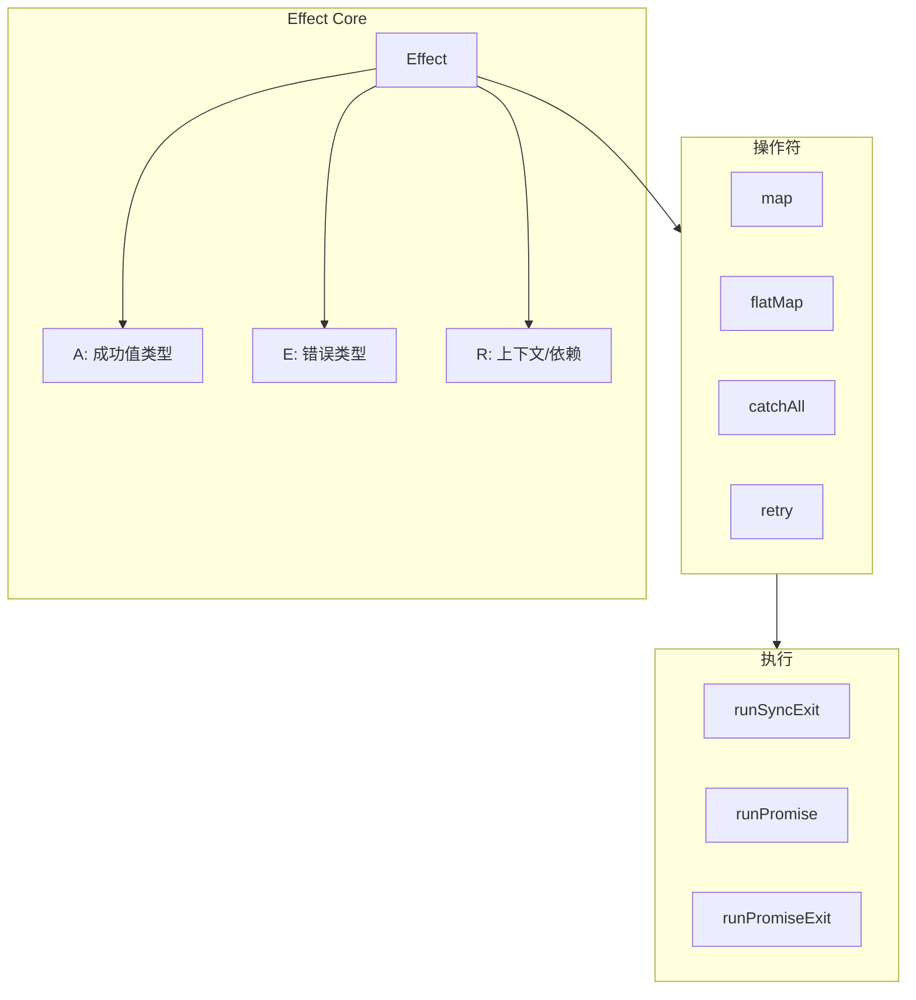

#### 1.2.2 与传统 Promise 对比

| 特性 | Effect | Promise |
|------|--------|---------|
| 类型化错误 | 是 | 否 (只有 any) |
| 组合性 | 优秀 | 中等 |
| 取消控制 | 原生 | 需要 AbortController |
| 重试机制 | 内置 | 需手动实现 |
| 上下文传递 | 原生 | 不支持 |
| 确定性测试 | 容易 | 困难 |

#### 1.2.3 核心类型签名

```typescript
// Effect 类型签名
type Effect<A, E, R> = (context: Context<R>) => Promise<Exit<A, E>>;

// Exit 类型 - 包含成功和失败两种情况
type Exit<A, E> =
  | { _tag: 'Success', value: A }
  | { _tag: 'Failure', cause: Cause<E> };

// Cause - 错误的原因层级
type Cause<E> =
  | { _tag: 'Fail', error: E }
  | { _tag: 'Die', defect: unknown }
  | { _tag: 'Interrupt' }
  | { _tag: 'Yield' };
```

### 1.3 技术栈

- **语言**: TypeScript (100%)
- **生态模块**: Effect, Sql, AI, CLI, Platform, Distributed, OpenTelemetry
- **架构**: Monorepo + pnpm

### 1.4 使用场景

| 场景 | 适用性 | 说明 |
|------|--------|------|
| 函数式编程项目 | 首选 | 完整的 FP 工具链 |
| AI 应用开发 | 推荐 | 内置 OpenAI/Anthropic 支持 |
| 数据库应用 | 推荐 | 多数据库 SQL 抽象 |
| 错误处理 | 首选 | 类型安全的错误管理 |
| CLI 工具开发 | 推荐 | 内置 CLI 模块 |

### 1.5 快速开始

```bash
npm install effect
```

```typescript
// ============ basic.ts ============
import { Effect, Context, Layer } from 'effect';

// Effect - 类型安全的副作用抽象
const program = Effect.succeed(1).pipe(
  Effect.map(n => n * 2),
  Effect.flatMap(n => Effect.succeed(n + 1))
);

console.log(Effect.runSyncExit(program));
// { _id: "Exit", _tag: "Success", value: 3 }

// 错误处理
const failingProgram = Effect.fail("Something went wrong").pipe(
  Effect.mapError(e => new Error(e))
);

const result = Effect.runSyncExit(failingProgram);
// { _id: "Exit", _tag: "Failure", cause: { _tag: "Layer", ... } }

// 异步操作
const asyncProgram = Effect.promise(() =>
  fetch('https://api.example.com/data').then(r => r.json())
);
```

```typescript
// ============ services.ts ============
import { Effect, Context, Layer } from 'effect';

// 定义服务接口
interface Database {
  readonly query: (sql: string) => Effect.Effect<unknown[]>;
}

// 创建 Context
const Database = Context.GenericTag<Database>('@services/Database');

// 实现服务
const LiveDatabase = Layer.effect(
  Database,
  Effect.sync(() => ({
    query: (sql: string) => Effect.succeed([{ id: 1, name: 'Test' }])
  }))
);

// 使用服务
const getAllUsers = Effect.flatMap(
  Database,
  (db) => db.query('SELECT * FROM users')
);

// 运行程序
const program = getAllUsers.pipe(
  Layer.provide(LiveDatabase)
);

Effect.runPromise(program).then(console.log);
```

```typescript
// ============ pipeline.ts ============
import { Effect, pipe } from 'effect';

// 管道式编程
const result = await pipe(
  Effect.succeed([1, 2, 3, 4, 5]),
  Effect.map(n => n * 2),
  Effect.filter(n => n > 5),
  Effect.runPromise
);

console.log(result); // [6, 8, 10]

// 并发执行
const tasks = [
  Effect.promise(() => Promise.resolve(1)),
  Effect.promise(() => Promise.resolve(2)),
  Effect.promise(() => Promise.resolve(3))
];

const concurrent = Effect.all(tasks, { concurrency: 2 });
const results = await Effect.runPromise(concurrent);
// [1, 2, 3] - 最多 2 个并发
```

### 1.6 高级模式

#### 1.6.1 依赖注入

```typescript
// ============ dependency-injection.ts ============
import { Effect, Context, Layer, pipe } from 'effect';

// 服务接口
interface HttpClient {
  readonly get: (url: string) => Effect.Effect<string>;
  readonly post: (url: string, body: unknown) => Effect.Effect<string>;
}

// 标记服务
const HttpClient = Context.GenericTag<HttpClient>('@services/HttpClient');

// 配置接口
interface Config {
  readonly apiUrl: string;
}

const Config = Context.GenericTag<Config>('@services/Config');

// 实现服务
const LiveHttpClient = Layer.effect(
  HttpClient,
  Effect.gen(function* ($) {
    const config = yield* $(Config);
    return {
      get: (url: string) => Effect.succeed(`GET ${config.apiUrl}${url}`),
      post: (url: string, body: unknown) =>
        Effect.succeed(`POST ${config.apiUrl}${url}`)
    };
  })
);

// 使用依赖
const fetchUser = (id: string) =>
  Effect.gen(function* ($) {
    const http = yield* $(HttpClient);
    const config = yield* $(Config);
    return yield* $(http.get(`/users/${id}`));
  });

// 组合层
const program = pipe(
  fetchUser('123'),
  Layer.provide(LiveHttpClient)
);

Effect.runPromise(program).then(console.log);
```

#### 1.6.2 错误处理策略

```typescript
// ============ error-handling.ts ============
import { Effect, Either, pipe } from 'effect';

// 定义错误类型
class DatabaseError extends Error {
  readonly _tag = 'DatabaseError';
  constructor(message: string, public code: string) {
    super(message);
  }
}

class NotFoundError extends Error {
  readonly _tag = 'NotFoundError';
  constructor(entity: string, id: string) {
    super(`${entity} with id ${id} not found`);
  }
}

// 使用 Either 进行错误处理
const findUser = (id: string): Effect.Effect<User, NotFoundError> =>
  Effect.gen(function* ($) {
    const user = yield* $(db.findById(id));
    if (!user) {
      return yield* $(Effect.fail(new NotFoundError('User', id)));
    }
    return user;
  });

// 恢复错误
const withDefault = (defaultUser: User) =>
  Effect.mapError(findUser('123'), () => defaultUser);

// 重试策略
const withRetry = Effect.retry(findUser('123'), {
  times: 3,
  delay: { type: 'exponential', base: 100, capacity: 1000 }
});

// 错误转换成结果
const toEither = <E, A>(effect: Effect.Effect<A, E>): Effect.Effect<Either.Either<E, A>> =>
  Effect.map(effect, Either.right);

const fromEither = <E, A>(either: Either.Either<E, A>): Effect.Effect<A, E> =>
  Either.match(either, {
    onLeft: Effect.fail,
    onRight: Effect.succeed
  });
```

#### 1.6.3 并发控制

```typescript
// ============ concurrency.ts ============
import { Effect, Schedule, fiberRuntime } from 'effect';

// 并发执行多个 Effect
const parallel = Effect.all([
  fetchUser(1),
  fetchUser(2),
  fetchUser(3)
], { concurrency: 'unbounded' });

// 限制并发数
const limited = Effect.all([
  fetchUser(1),
  fetchUser(2),
  fetchUser(3)
], { concurrency: 2 }); // 最多 2 个并发

// 超时控制
const withTimeout = Effect.timeout(findUser('123'), {
  timeout: 1000,
  onTimeout: () => ({ _tag: 'Timeout' })
});

// 定时重试
const withRetry = Effect.retry(findUser('123'), {
  schedule: Schedule.exponential(100).pipe(
    Schedule.compose(Schedule.recurs(5))
  )
});

// 并行 Race
const winner = Effect.race([
  fetchFromPrimary(),
  fetchFromSecondary()
]);
```

### 1.7 AI 模块

```typescript
// ============ ai.ts ============
import { OpenAi } from '@effect/ai';

// AI 服务集成
const openAi = OpenAi.make({ apiKey: process.env.OPENAI_API_KEY });

const response = await Effect.runPromise(
  openAi.pipe(
    OpenAi.chat({
      model: 'gpt-4',
      messages: [
        { role: 'system', content: '你是助手' },
        { role: 'user', content: 'Hello!' }
      ]
    })
  )
);
```

### 1.8 与 fp-ts 对比

| 特性 | Effect | fp-ts |
|------|--------|-------|
| 执行模型 | 内置 Effect Runtime | 手动组合 |
| 错误处理 | 优秀 (Cause 系统) | 良好 (Either) |
| 并发支持 | 原生 | 需额外库 |
| 依赖注入 | 原生 | 需要自定义 |
| 学习曲线 | 中等 | 陡峭 |
| 性能 | 优秀 | 优秀 |
| 生态完整性 | 高 | 中 |

### 1.9 参考链接

- [GitHub](https://github.com/Effect-TS/effect)
- [官方文档](https://effect.website/)
- [Effect SQL](https://github.com/Effect-TS/sql)

## 2. RxJS - 响应式编程库

### 2.1 项目简介

RxJS 是 JavaScript/TypeScript 生态中最成熟的**响应式扩展库**，提供 Observable 抽象和丰富的操作符，用于处理异步事件流和复杂的数据管道。

**GitHub**: 31.7k Stars | Apache 2.0 License | Angular 默认状态管理

**核心价值**: "Everything is a stream" - 将异步操作、DOM 事件、WebSocket 消息等统一抽象为 Observable，通过操作符组合处理。

### 2.2 架构原理深度分析

#### 2.2.1 Observable 契约

RxJS Observable 遵循 **Reactive Streams** 规范，核心是发布-订阅模式:

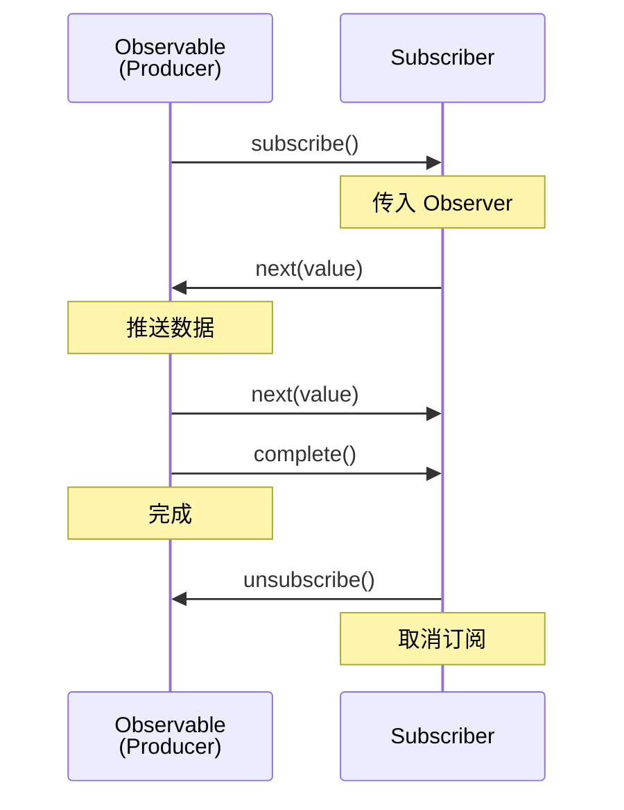

#### 2.2.2 冷热 Observable

```typescript
// Cold Observable - 每次订阅都执行
const cold$ = new Observable(subscriber => {
  console.log('Executing'); // 每次订阅都打印
  subscriber.next(Math.random());
});

// 结果: 两次订阅打印两次 "Executing"

// Hot Observable - 共享执行
const subject = new Subject<number>();
subject.next(Math.random()); // 主动推送

const hot$ = subject.asObservable();
// 订阅者共享同一个数据流
```

### 2.3 技术栈

- **语言**: TypeScript (90.9%)
- **协议**: 遵循 Reactive Streams 规范
- **集成**: Angular, React (via rxjs-hooks), Vue (via vue-rx)

### 2.4 使用场景

| 场景 | 适用性 | 说明 |
|------|--------|------|
| 复杂异步流程 | 首选 | 多个异步操作组合 |
| 实时数据流 | 首选 | WebSocket、SSE、轮询 |
| 用户输入防抖 | 首选 | 搜索输入处理 |
| 取消/重试逻辑 | 首选 | 请求取消、重试策略 |
| 简单状态 | 谨慎 | 可能过度工程 |

### 2.5 快速开始

```bash
npm install rxjs
```

```typescript
// ============ observables.ts ============
import { Observable, of, from, fromEvent, interval } from 'rxjs';
import { map, filter, debounceTime, switchMap, catchError } from 'rxjs/operators';

// 创建 Observable
const observable$ = new Observable(subscriber => {
  subscriber.next(1);
  subscriber.next(2);
  subscriber.next(3);
  subscriber.complete();
});

// 订阅数据
observable$.subscribe({
  next: (value) => console.log(value),
  error: (error) => console.error(error),
  complete: () => console.log('Done')
});

// 从常见来源创建
const array$ = of([1, 2, 3]);                    // 单值
const promise$ = from(fetch('/api/data'));       // Promise
const event$ = fromEvent(document, 'click');    // DOM 事件
const interval$ = interval(1000);               // 定时器
```

```typescript
// ============ operators.ts ============
import { fromEvent } from 'rxjs';
import { map, filter, debounceTime, distinctUntilChanged } from 'rxjs/operators';

// 搜索输入处理
const searchInput = document.getElementById('search') as HTMLInputElement;

fromEvent(searchInput, 'input').pipe(
  map(event => (event.target as HTMLInputElement).value), // 提取值
  debounceTime(300),                                      // 防抖
  distinctUntilChanged(),                                 // 去重
  filter(query => query.length >= 2),                    // 过滤
  switchMap(query => from(fetch(`/api/search?q=${query}`))) // 切换到新请求
).subscribe({
  next: (response) => console.log('Results:', response),
  error: (err) => console.error('Search failed:', err)
});
```

```typescript
// ============ advanced.ts ============
import { Subject, BehaviorSubject, ReplaySubject, AsyncSubject } from 'rxjs';

// Subject - 多播事件发射器
const subject = new Subject<number>();
subject.subscribe(v => console.log('A:', v));
subject.subscribe(v => console.log('B:', v));
subject.next(1); // A: 1, B: 1

// BehaviorSubject - 带有初始值的 Subject
const behaviorSubject = new BehaviorSubject<string>('initial');
behaviorSubject.subscribe(v => console.log('Current:', v));
behaviorSubject.next('updated'); // Current: updated

// ReplaySubject - 记录历史值的 Subject
const replaySubject = new ReplaySubject<number>(2); // 缓存最近2个
replaySubject.next(1);
replaySubject.next(2);
replaySubject.next(3);
replaySubject.subscribe(v => console.log('Replay:', v));
// Replay: 2, Replay: 3

// AsyncSubject - 只发送最后一个值，在 complete 时
const asyncSubject = new AsyncSubject<string>();
asyncSubject.next('a');
asyncSubject.next('b');
asyncSubject.next('c');
asyncSubject.complete();
asyncSubject.subscribe(v => console.log('Async:', v));
// Async: c
```

### 2.6 常用操作符速查

| 类别 | 操作符 | 用途 |
|------|--------|------|
| 创建 | of, from, fromEvent, interval | 从各种来源创建 Observable |
| 转换 | map, flatMap, switchMap, exhaustMap | 转换数据流 |
| 过滤 | filter, debounceTime, distinctUntilChanged, take, takeUntil | 筛选数据 |
| 组合 | combineLatest, merge, zip, concat | 合并多个流 |
| 错误处理 | catchError, retry, throwError | 错误处理与重试 |
| 工具 | tap, finalize, delay | 副作用与延时 |

### 2.7 高级模式

#### 2.7.1 状态管理

```typescript
// ============ state-management.ts ============
import { BehaviorSubject, distinctUntilChanged, map } from 'rxjs';

// 状态管理类
class Store<T> {
  private state$: BehaviorSubject<T>;

  constructor(initialState: T) {
    this.state$ = new BehaviorSubject(initialState);
  }

  select<K>(selector: (state: T) => K): Observable<K> {
    return this.state$.pipe(
      map(selector),
      distinctUntilChanged()
    );
  }

  update(reducer: (state: T) => T): void {
    const currentState = this.state$.getValue();
    const newState = reducer(currentState);
    this.state$.next(newState);
  }

  getState(): T {
    return this.state$.getValue();
  }
}

// 使用示例
interface AppState {
  user: User | null;
  theme: 'light' | 'dark';
  notifications: Notification[];
}

const store = new Store<AppState>({
  user: null,
  theme: 'light',
  notifications: []
});

// 选择状态切片
store.select(state => state.theme).subscribe(theme => {
  document.body.className = theme;
});

// 更新状态
store.update(state => ({
  ...state,
  theme: state.theme === 'light' ? 'dark' : 'light'
}));
```

#### 2.7.2 HTTP 请求管理

```typescript
// ============ http-management.ts ============
// 第 1 段：导入依赖与定义请求契约
// 这一段决定"数据长什么样、后面能用哪些算子"。Request 只是编译期类型，运行时会消失，
// 但它让调用方在写错字段名（url/method）时立刻报错，相当于给命令总线定了协议。
// 注意 of、delay 目前并未被使用，属于预留或历史残留；retry 的配置对象写法要求 RxJS 7.4+。
import { Subject, of, from, throwError } from 'rxjs';
import { switchMap, retry, catchError, delay } from 'rxjs/operators';

interface Request {
  id: string;   // 仅作业务标识，管道内未参与运算；可留给后续做去重、取消或日志关联
  url: string;
  method: string;
}

class HttpService {
  // 第 2 段：用 Subject 搭一条"命令总线"
  // Subject 既是 Observable 又是 Observer：外部靠 addRequest 往里推，内部靠 subscribe 消费。
  // 它是"热"流且不回放历史值，事件只有在订阅建立之后发出才会被看到，因此订阅前推入的请求会被静默丢弃。
  private requests$ = new Subject<Request>();

  constructor() {
    // 第 3 段：装配处理管道——算子顺序即故障处理语义
    // 关键顺序是 switchMap → retry → catchError：retry 必须在 catchError 之前，
    // 否则错误会被 catchError 提前吞掉，重试逻辑永远等不到异常。
    // 整条管道只在构造时建立一次，之后所有请求共享同一个 switchMap/retry 状态机。
    this.requests$.pipe(
      // switchMap 每收到新请求就"取消"上一个未完成的 inner 流，只保留最新的一次；
      // 这正是搜索联想所需，但对普通业务请求会造成前一个请求被无声掐断（易错点）。
      switchMap(request => this.execute(request)),
      // 失败后最多再尝试 3 次、每次间隔 1s。但要留意：它重订阅的是 requests$ 本身，
      // 而 Subject 不回放，失败的那条请求不会再被发出——真正重试的并非原请求，只是把管道重新激活。
      retry({ count: 3, delay: 1000 }),
      // 兜底：重试耗尽后仍失败才走到这里。用 return throwError 而不是直接 throw，
      // 是为了让错误继续沿 Observable 的错误通道向下游传播，符合流式合约。
      catchError(error => {
        console.error('Request failed:', error);
        return throwError(() => error);
      })
    ).subscribe(response => {
      // 订阅点是整条管道的出口；该订阅在 HttpService 生命周期内常驻，没有 unsubscribe/takeUntil，
      // 若频繁 new HttpService 就会累积泄漏。
      console.log('Response:', response);
    });
  }

  // 第 4 段：单个请求的执行与对外写入入口
  private execute(request: Request) {
    // fetch 返回 Promise（只产出一次即 complete），用 from 把它提升为 Observable 才能接入上面的管道。
    // 易错点：fetch 仅在网络层失败时 reject；4xx/5xx 仍会 resolve 且 ok=false，
    // 因此这类 HTTP 错误既不会触发 retry 也不会进入 catchError，必须手动检查 res.ok 再抛错。
    // 另外 fetch 在 execute 被调用瞬间就发出，早于 from 的订阅，属于"急切发起"。
    return from(fetch(request.url, { method: request.method }));
  }

  addRequest(request: Request) {
    // 唯一写入点：next 把命令推进热流，由构造器中那次订阅驱动整条管道。
    // 每次 next 都可能取消上一个在途请求（见 switchMap），调用方需知道这层副作用。
    this.requests$.next(request);
  }
}
```
### 2.8 与其他异步方案对比

| 特性 | RxJS | Promise | async/await |
|------|------|---------|-------------|
| 单一值 | 适合 | 适合 | 适合 |
| 多个值流 | 原生支持 | 不适合 | 不适合 |
| 取消 | 原生支持 | 不支持 | 不支持 |
| 组合 | 丰富操作符 | Promise.all | 顺序处理 |
| 背压 | 支持 | 不支持 | 不支持 |
| 学习曲线 | 陡峭 | 低 | 低 |

### 2.9 参考链接

- [GitHub](https://github.com/ReactiveX/rxjs)
- [官方文档](https://rxjs.dev/)
- [RxJS Marbles](https://rxmarbles.com/) - 可视化操作符

## 3. Zustand - 轻量级状态管理

### 3.1 项目简介

Zustand 是 React 生态中最轻量的**状态管理库**，基于简化的 Flux 原则和 Hook API，无需 Provider 包裹，58k Stars。

**GitHub**: 58k Stars | MIT License | 被 Vercel 采用

**核心优势**: 极简 API、极小体积 (~1kb)、支持 middleware 扩展、脱离 React 单独使用。

### 3.2 架构原理深度分析

#### 3.2.1 设计模式

Zustand 使用**命令式更新 + 响应式订阅**模式，与 Redux 的 dispatch-action 不同:

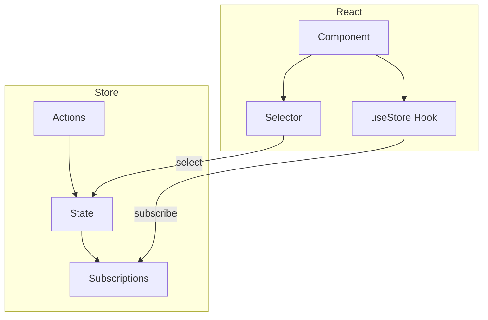

#### 3.2.2 订阅机制

```typescript
// Zustand 订阅原理 (简化版)

// 第 1 段：闭包内维护唯一状态源与订阅者集合（对外只暴露行为，不暴露数据）
// 为什么这样写：state/listeners 被闭包"私有化"，外部无法绕过 setState 直接改写状态，
// 这正是极简 store 的单向数据流保证；listeners 用 Set 而非数组，是为了自动去重且删除是 O(1)。
function createStore(initialState) {
  let state = initialState;          // 每次更新都整体替换此引用（不可变更新），旧快照对新订阅方仍可安全持有
  const listeners = new Set();       // 同一 listener 重复 subscribe 只会存一份，避免重复通知

  return {
    // 第 2 段：读接口——返回某一时刻的状态快照
    // 直接返回当前引用即可，不必拷贝：因为写入侧永远生成新对象，读到的引用不会被后续更新就地篡改。
    getState: () => state,

    // 第 3 段：写接口——浅合并生成新状态，然后同步广播给所有订阅者
    // 关键数据流：partial → 新 state 对象 → 逐个 listener(state)；先赋值再通知，保证回调里 getState() 拿到的是新值。
    // 易错点：只做一层浅合并，嵌套对象仍是共享引用；广播是同步的，某个 listener 抛异常会中断其后所有 listener。
    setState: (partial) => {
      state = { ...state, ...partial };                    // 展开合并而非 Object.assign(state, ...)，以维持引用变化语义
      listeners.forEach(listener => listener(state));      // 遍历中若发生增删订阅，Set 的遍历语义会导致本次是否被通知不确定
    },

    // 第 4 段：订阅接口——注册监听并交还"取消订阅"函数
    // 为什么返回闭包：调用方无需接触内部容器，也无法误删别人的监听；
    // 边界条件：重复调用 unsubscribe 是安全的（delete 不存在的元素为无操作），但忘记调用会让 listener 被永久持有而泄漏。
    subscribe: (listener) => {
      listeners.add(listener);
      return () => listeners.delete(listener);             // 典型场景：在组件挂载时订阅、卸载时调用此行清理
    }
  };
}
```
### 3.3 技术栈

- **语言**: TypeScript (97.9%)
- **React 版本**: 16.8+ (需要 Hooks)
- **体积**: ~1kb (minified + gzipped)
- **扩展**: 官方支持 persist, immer, redux-devtools

### 3.4 使用场景

| 场景 | 适用性 | 说明 |
|------|--------|------|
| 中小型应用状态 | 首选 | 轻量够用 |
| 全局 UI 状态 | 首选 | 主题、语言、用户信息 |
| 简单数据共享 | 首选 | 跨组件状态 |
| 复杂状态逻辑 | 谨慎 | 考虑 Jotai/Redux |
| 非 React 环境 | 推荐 | 可独立使用 |

### 3.5 快速开始

```bash
npm install zustand
```

```typescript
// ============ store.ts ============
// 第 1 段：依赖导入
// create 是 zustand 的工厂函数；immer 中间件让我们用"直接改"的写法产出不可变更新；
// persist 中间件负责把 state 同步到 localStorage 并在启动时回灌。
// 注意三个 import 都来自 zustand 包，没有额外运行时依赖。
import { create } from 'zustand';
import { immer } from 'zustand/middleware/immer';
import { persist } from 'zustand/middleware';

// 第 2 段：领域模型
// Bear 是业务实体，id 由调用方生成（这里用时间戳），name 是展示名。
// 把 id 单独抽出来是为了让增删都基于稳定主键，而不是靠数组下标（下标在删除后会错位）。
interface Bear {
  id: number;
  name: string;
}

// 第 3 段：store 契约（State + Actions 合并成一个类型）
// 把数据字段和动作方法写在同一个 interface 里，是 zustand 的惯例：
// 组件既可以从 store 读 bears，也可以直接拿到 addBear 等方法，无需额外绑定。
// selectedBear 允许为 null，表示"当前没有选中项"，这个可空性是全局唯一选中态的建模基础。
interface BearStore {
  bears: Bear[];
  selectedBear: Bear | null;
  addBear: (name: string) => void;
  removeBear: (id: number) => void;
  selectBear: (bear: Bear | null) => void;
}

const useBearStore = create<BearStore>()(
  // 组合 middleware
  // 第 4 段：中间件组合顺序（本文件最容易写错的地方）
  // 写成 persist(immer(...))，执行时就是 immer 在内、persist 在外：
  // 每次 set 先经过 immer 生成新的不可变 state，再交给 persist 去序列化落盘。
  // 如果两个顺序写反，immer 的 draft 会被 persist 提前快照，可能持久化出 Proxy 或残缺对象。
  // 另外 create<T>()(...) 的"多写一对空括号"不是笔误：这是为了让 TS 推断出中间件改写后的签名。
  persist(
    immer((set) => ({
      // 第 5 段：初始状态
      // bears 用空数组而不是 undefined，组件里就能无条件 .map()，少一层判空分支。
      bears: [],
      selectedBear: null,

      // 第 6 段：新增
      // 用 push 直接改 draft：immer 会把它翻译成"复制数组 + 追加"，引用发生变化，React 才能感知更新。
      // 易错点：id 用 Date.now() 在同一毫秒内连续调用会产生重复主键，
      // 后续 removeBear 会一次删掉多条，生产环境建议换成自增计数或 crypto.randomUUID()。
      addBear: (name) =>
        set((state) => {
          state.bears.push({
            id: Date.now(),
            name
          });
        }),

      // 第 7 段：删除
      // filter 返回新数组并整体赋值给 state.bears，同样是合法写法；
      // immer 下 push/splice/整体赋值都可以，选哪种只影响可读性，不影响不可变性。
      // 边界条件：id 不存在时 filter 原样返回，属于幂等操作，可以安全重复调用。
      removeBear: (id) =>
        set((state) => {
          state.bears = state.bears.filter(b => b.id !== id);
        }),

      // 第 8 段：选中
      // 入参类型是 Bear | null，所以传 null 即可"取消选中"，不需要额外的 clearSelection 方法。
      // 陷阱：这里存的是对象的引用副本。persist 重新水合后，store 里的 bear 是新解析出的对象，
      // 若 UI 同时用 bears 里的元素做 === 比对（如高亮判断），引用不等会导致选中态失效；
      // 更稳的做法是只存 selectedBearId，用 id 派生实体。
      selectBear: (bear) =>
        set((state) => {
          state.selectedBear = bear;
        })
    })),
    // 第 9 段：持久化配置与导出
    // name 是 localStorage 的键名，改名等同于清空旧数据（旧键会被遗弃，新键为空）。
    // 默认行为是整棵 state 全量 JSON 序列化，注意：函数（addBear 等）不会被写入存储，
    // 因此 hydrate 只恢复数据字段，方法始终来自本次代码。
    { name: 'bear-storage' }
  )
);

export default useBearStore;
```
```typescript
// ============ components.tsx ============
import useBearStore from './store';

// 选择特定状态 - 精确订阅
function BearList() {
  const bears = useBearStore(state => state.bears);

  return (
    <ul>
      {bears.map(bear => (
        <li key={bear.id}>{bear.name}</li>
      ))}
    </ul>
  );
}

// 使用 actions - 无需订阅
function AddBearButton() {
  const addBear = useBearStore(state => state.addBear);

  return (
    <button onClick={() => addBear('熊大')}>
      添加熊
    </button>
  );
}

// 组合选择 - 避免重渲染
function BearDetail() {
  const { selectedBear, selectBear, removeBear } = useBearStore(
    state => ({
      selectedBear: state.selectedBear,
      selectBear: state.selectBear,
      removeBear: state.removeBear
    })
  );

  if (!selectedBear) return <div>请选择一只熊</div>;

  return (
    <div>
      <h3>{selectedBear.name}</h3>
      <button onClick={() => selectBear(null)}>取消选择</button>
      <button onClick={() => removeBear(selectedBear.id)}>删除</button>
    </div>
  );
}
```

### 3.6 Middleware 扩展

```typescript
// ============ middleware.ts ============
import { create } from 'zustand';
import { immer } from 'zustand/middleware/immer';
import { persist } from 'zustand/middleware';
import { devtools } from 'zustand/middleware';

// DevTools 支持
const useStore = create<BearStore>()(
  devtools(
    persist(
      immer((set) => ({ /* ... */ })),
      { name: 'store-name' }
    ),
    { name: 'Store DevTools' }
  )
);

// 自定义 Middleware
const withLogger = (config) =>
  (set, get, api) =>
    config(
      (...args) => {
        console.log('State will change:', args);
        set(...args);
        console.log('State changed:', get());
      },
      get,
      api
    );

// 使用自定义 Middleware
const useLoggedStore = create(
  withLogger((set) => ({
    count: 0,
    increment: () => set(state => ({ count: state.count + 1 }))
  }))
);
```

### 3.7 与其他状态管理库对比

| 特性 | Zustand | Redux | Jotai | MobX |
|------|---------|-------|-------|------|
| 体积 | ~1kb | ~7kb | ~2kb | ~20kb |
| Boilerplate | 无 | 多 | 无 | 少 |
| React 依赖 | 可选 | 必须 | 必须 | 必须 |
| DevTools | 支持 | 完整 | 有限 | 有限 |
| 中间件 | 支持 | 支持 | 不支持 | 不支持 |
| TypeScript | 原生 | 需类型 | 原生 | 需配置 |

### 3.8 性能优化技巧

```typescript
// ============ optimization.ts ============
import { create } from 'zustand';
import { shallow } from 'zustand/shallow';

// 问题: 每次渲染创建新对象
function BadComponent() {
  const { a, b, c } = useStore(state => ({
    a: state.a,
    b: state.b,
    c: state.c
  })); // 每次渲染都是新对象！

  return <div>{a} {b} {c}</div>;
}

// 解决 1: 分离选择器
function GoodComponent1() {
  const a = useStore(state => state.a);
  const b = useStore(state => state.b);
  const c = useStore(state => state.c);
  return <div>{a} {b} {c}</div>;
}

// 解决 2: 使用 shallow 比较
function GoodComponent2() {
  const { a, b, c } = useStore(
    state => ({ a: state.a, b: state.b, c: state.c }),
    shallow
  );
  return <div>{a} {b} {c}</div>;
}

// 解决 3: 原子化选择
function GoodComponent3() {
  const a = useStore(state => state.a);
  const b = useStore(state => state.b);
  const c = useStore(state => state.c);
  return <div>{a} {b} {c}</div>;
}
```

### 3.9 参考链接

- [GitHub](https://github.com/pmndrs/zustand)
- [官方文档](https://zustand.docs.pmnd.rs/)
- [Zustand 中文文档](https://docs.pmnd.rs/zustand/)

## 4. Jotai - 原子化状态管理

### 4.1 项目简介

Jotai 是基于**原子化模型的状态管理库**，核心 API 极简 (~2kb)，通过原子组合实现灵活的细粒度状态订阅。

**GitHub**: 21.2k Stars | MIT License | 原子化设计

**核心理念**: "Atomic state management" - 类似 Recoil，但更轻量，无字符串 key，提供派生状态的天然方式。

### 4.2 架构原理深度分析

#### 4.2.1 原子模型

Jotai 的核心是**原子（Atom）**概念:

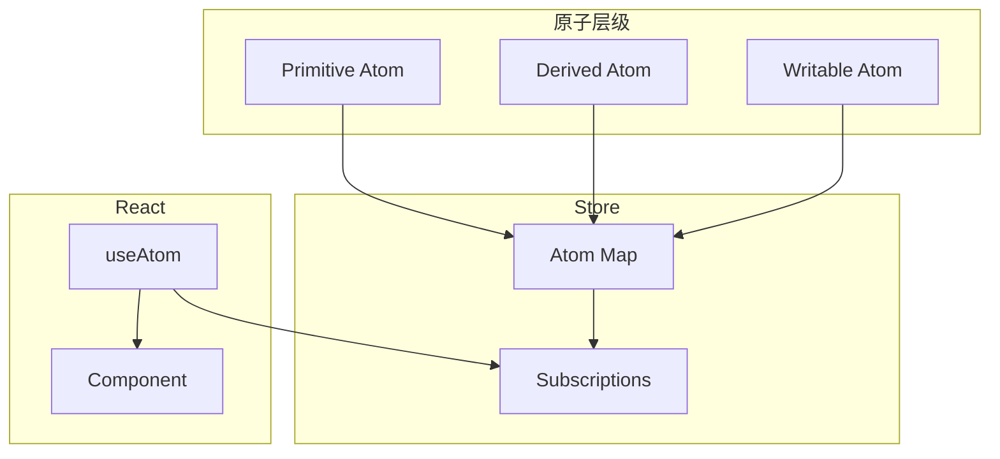

#### 4.2.2 派生原子机制

```typescript
// 派生原子的求值策略
const expensiveAtom = atom((get) => {
  const a = get(baseAtom);    // 依赖追踪
  const b = get(anotherAtom);  // 依赖追踪
  return expensiveComputation(a, b);
});

// 只有依赖变化时才重新计算
// 缓存机制保证性能
```

### 4.3 技术栈

- **语言**: TypeScript (84.7%)
- **体积**: ~2kb core
- **架构**: Atom -> Molecule -> Organism

### 4.4 使用场景

| 场景 | 适用性 | 说明 |
|------|--------|------|
| 细粒度状态订阅 | 首选 | 原子级别精确更新 |
| 复杂派生状态 | 首选 | 派生原子天然支持 |
| 表单状态 | 首选 | 字段级别独立 |
| 简单全局状态 | 谨慎 | 考虑 Zustand |
| Server State | 推荐 | 配合 TanStack Query |

### 4.5 快速开始

```bash
npm i jotai
```

```typescript
// ============ atoms.ts ============
import { atom } from 'jotai';

// 基础原子
const countAtom = atom(0);
const userAtom = atom<{ name: string; age: number } | null>(null);

// 派生原子 - 写时计算
const doubledCountAtom = atom((get) => get(countAtom) * 2);

// 写入原子
const incrementAtom = atom(
  null,                                    // 只读，没有初始值
  (get, set) => {
    set(countAtom, get(countAtom) + 1);
  }
);

// 异步原子
const fetchUserAtom = atom(async (get, set) => {
  const response = await fetch('/api/user');
  const user = await response.json();
  set(userAtom, user);
});
```

```typescript
// ============ components.tsx ============
import { useAtom } from 'jotai';

// 读取状态
function Counter() {
  const [count, setCount] = useAtom(countAtom);

  return (
    <div>
      <p>Count: {count}</p>
      <button onClick={() => setCount(count + 1)}>递增</button>
    </div>
  );
}

// 派生状态 - 自动追踪依赖
function DoubledCounter() {
  const [doubledCount] = useAtom(doubledCountAtom);

  return <p>Double: {doubledCount}</p>;
}

// 写入操作
function IncrementButton() {
  const [, increment] = useAtom(incrementAtom);

  return <button onClick={increment}>递增</button>;
}
```

```typescript
// ============ molecules.ts ============
import { atom } from 'jotai';

// 原子组合成 Molecule
const userNameAtom = atom(get => get(userAtom)?.name ?? '');
const userAgeAtom = atom(get => get(userAtom)?.age ?? 0);

// Writable atom with derived logic
const updateUserNameAtom = atom(
  (get) => get(userNameAtom),
  (get, set, newName: string) => {
    const currentUser = get(userAtom);
    if (currentUser) {
      set(userAtom, { ...currentUser, name: newName });
    }
  }
);

// 全局状态原子
const globalCountAtom = atom(0);

// 原子族 - 动态原子
const createCounterAtom = (initialValue: number) =>
  atom(initialValue, (get, set) => {
    set(createCounterAtom(initialValue), get(createCounterAtom(initialValue)) + 1);
  });
```

### 4.6 高级模式

#### 4.6.1 异步操作

```typescript
// ============ async.ts ============
import { atom } from 'jotai';
import { atomWithQuery } from 'jotai/utils';

// 原子作为 Promise 来源
const userDataAtom = atom(async (get) => {
  const userId = get(selectedUserIdAtom);
  const response = await fetch(`/api/users/${userId}`);
  return response.json();
});

// 使用 atomWithQuery 集成 React Query
const usersQueryAtom = atomWithQuery((get) => ({
  queryKey: ['users'],
  queryFn: async () => {
    const response = await fetch('/api/users');
    return response.json();
  }
}));

// 加载状态
const loadingAtom = atom(
  (get) => {
    const data = get(userDataAtom);
    return data instanceof Promise;
  }
);
```

#### 4.6.2 表单处理

```typescript
// ============ form.ts ============
import { atom } from 'jotai';
import { splitAtom } from 'jotai/utils';

// 字段原子
const createFieldAtom = (name: string) =>
  atom(
    (get) => get(formValuesAtom)[name] ?? '',
    (get, set, value: string) => {
      set(formValuesAtom, { ...get(formValuesAtom), [name]: value });
    }
  );

const emailAtom = createFieldAtom('email');
const passwordAtom = createFieldAtom('password');

// 字段列表
const fieldsAtom = atom(['email', 'password', 'name', 'age']);
const fieldsAtomWithSplit = splitAtom(fieldsAtom);

// 验证原子
const formErrorsAtom = atom((get) => {
  const errors: Record<string, string> = {};
  const values = get(formValuesAtom);

  if (!values.email.includes('@')) {
    errors.email = 'Invalid email';
  }
  if (values.password.length < 8) {
    errors.password = 'Too short';
  }

  return errors;
});
```

### 4.7 与 Zustand 对比

| 特性 | Jotai | Zustand |
|------|-------|---------|
| 核心体积 | ~2kb | ~1kb |
| API 设计 | 原子化 | Hook-based |
| 状态派生 | 原生支持 | 需手动 computed |
| 精确订阅 | 原子级别 | selector 级别 |
| 学习曲线 | 中等 | 低 |
| 灵活性 | 高 | 中 |
| 异步处理 | 原生支持 | 需 middleware |
| 外部状态集成 | 简单 | 需要适配器 |

#### 4.7.1 选型决策树

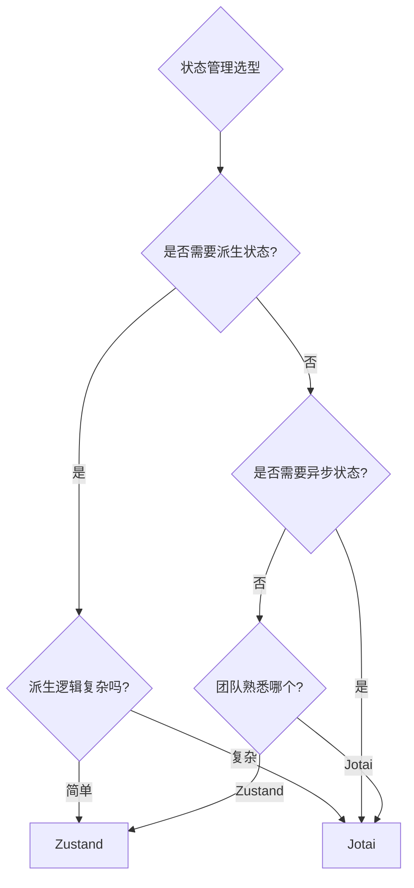

### 4.8 参考链接

- [GitHub](https://github.com/pmndrs/jotai)
- [官方文档](https://jotai.org/)
- [Jotai Utils](https://github.com/pmndrs/jotai-utils)

## 5. Pinia - Vue 3 官方状态管理

### 5.1 项目简介

Pinia 是 Vue 官方推荐的**新一代状态管理库**，Vuex 的继任者，提供更简洁的 API、完全 TypeScript 支持和更好的模块化设计。

**GitHub**: 14.6k Stars | MIT License | Vue 3 + Nuxt 3 默认状态管理

**核心理念**: "Intuitive, type safe, light and flexible" - 去除 Mutations 的简化 Flux，实现 DevTools 集成。

### 5.2 架构原理深度分析

#### 5.2.1 与 Vuex 的差异

Pinia 的核心改进是**去除了 Mutations**，将同步和异步更新统一到 Actions:

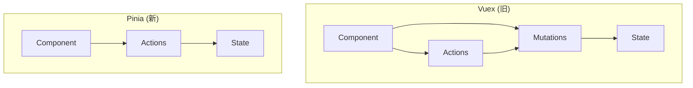

#### 5.2.2 响应式集成

Pinia 直接利用 Vue 3 的响应式系统，无需额外转换:

```typescript
// Pinia 响应式原理
const store = defineStore('counter', () => {
  const count = ref(0);  // Vue 响应式 ref
  const doubled = computed(() => count.value * 2);

  function increment() {
    count.value++;  // 直接修改，响应式自动追踪
  }

  return { count, doubled, increment };
});
```

### 5.3 技术栈

- **语言**: TypeScript (77.1%), Vue (18.5%)
- **Vue 版本**: Vue 3 (Composition API), Vue 2 (with @vue/composition-api)
- **生态**: Nuxt module, DevTools plugin

### 5.4 使用场景

| 场景 | 适用性 | 说明 |
|------|--------|------|
| Vue 3 应用状态 | 首选 | 官方推荐 |
| Nuxt 3 应用 | 首选 | 内置支持 |
| TypeScript 项目 | 首选 | 完整类型推导 |
| SSR 应用 | 首选 | 更好的 SSR 支持 |
| Vue 2 项目 | 谨慎 | 需要额外配置 |

### 5.5 快速开始

```bash
npm install pinia
```

```typescript
// ============ stores/counter.ts ============
import { defineStore } from 'pinia';

export const useCounterStore = defineStore('counter', {
  // State - 状态
  state: () => ({
    count: 0,
    user: null as { name: string; age: number } | null
  }),

  // Getters - 计算属性
  getters: {
    doubleCount: (state) => state.count * 2,
    isLoggedIn: (state) => state.user !== null,
    greeting: (state) => `Hello, ${state.user?.name ?? 'Guest'}!`
  },

  // Actions - 修改状态的方法
  actions: {
    increment() {
      this.count++;
    },
    async fetchUser(id: string) {
      const response = await fetch(`/api/users/${id}`);
      this.user = await response.json();
    },
    reset() {
      this.$reset(); // 重置到初始状态
    }
  }
});
```

```typescript
// ============ main.ts ============
import { createApp } from 'vue';
import { createPinia } from 'pinia';
import App from './App.vue';

const app = createApp(App);
const pinia = createPinia();

app.use(pinia);
app.mount('#app');
```

```typescript
// ============ components.vue ============
<script setup lang="ts">
import { storeToRefs } from 'pinia';
import { useCounterStore } from '@/stores/counter';

const store = useCounterStore();

// 解构响应式状态
const { count, doubleCount, greeting } = storeToRefs(store);

// 使用 Actions
const { increment, reset } = store;
</script>

<template>
  <div>
    <p>Count: {{ count }}</p>
    <p>Double: {{ doubleCount }}</p>
    <p>{{ greeting }}</p>
    <button @click="increment">递增</button>
    <button @click="reset">重置</button>
  </div>
</template>
```

### 5.6 组合式风格 Store

```typescript
// ============ stores/user.ts ============
import { defineStore } from 'pinia';
import { ref, computed } from 'vue';

export const useUserStore = defineStore('user', () => {
  // State - 使用 ref
  const name = ref('');
  const age = ref(0);

  // Getters - 使用 computed
  const isAdult = computed(() => age.value >= 18);
  const profile = computed(() => ({ name: name.value, age: age.value }));

  // Actions - 使用函数
  function updateProfile(newName: string, newAge: number) {
    name.value = newName;
    age.value = newAge;
  }

  async function fetchFromServer(id: string) {
    const data = await fetch(`/api/users/${id}`).then(r => r.json());
    name.value = data.name;
    age.value = data.age;
  }

  // 返回暴露的属性
  return {
    name,
    age,
    isAdult,
    profile,
    updateProfile,
    fetchFromServer
  };
});
```

### 5.7 高级模式

#### 5.7.1 插件系统

```typescript
// ============ plugin.ts ============
import { createPinia } from 'pinia';

// 自定义插件
const myPlugin = {
  install(pinia) {
    // 添加全局属性
    pinia.use(({ store }) => {
      // 初始化
      if (!store.$state.initialized) {
        store.$state.initialized = true;
      }

      // 添加自定义方法
      store.$reset = () => {
        store.$patch({});
      };

      // 订阅变更
      store.$subscribe((mutation, state) => {
        console.log('State changed:', mutation.type);
      });
    });
  }
};

// 使用插件
const pinia = createPinia();
pinia.use(myPlugin);
```

#### 5.7.2 持久化

```typescript
// ============ persistence.ts ============
// 第 1 段：依赖导入与模块边界
// 这里只引入“创建 store”的 defineStore 与响应式原语 ref/watch，不引入组件或路由，
// 保证本文件是纯状态层：可在任意组件、任意时机被 import，且天然可被单测替换掉 localStorage。
import { defineStore } from 'pinia';
import { ref, watch } from 'vue';

// 第 2 段：以 setup 语法声明 store，并在初始化阶段“回填”本地缓存
// 用回调式（setup）而非 options 式，是为了让 token/user 直接是 ref，便于在 setup 外做手写同步逻辑。
// 关键数据流：localStorage（字符串）--反序列化--> ref（内存响应式源）--> 组件读取。
// 易错点：localStorage 只存字符串，读回来必须自己 cast/parse；'user' 为 null 时给 'null' 兜底，
// 否则 JSON.parse('') 会抛 SyntaxError 直接炸掉整个 store 初始化（脏数据同理）。
export const usePersistStore = defineStore('persist', () => {
  const token = ref(localStorage.getItem('token') || '');
  const user = ref(JSON.parse(localStorage.getItem('user') || 'null'));

  // 第 3 段：把“内存状态”单向同步回“持久层”
  // 监听变化自动持久化：让业务代码只管改 ref，不再重复写 setItem，避免“某处改了状态却忘了落盘”。
  // 注意方向是单向的 ref -> localStorage；反过来“读”只在第 2 段做一次，避免读写成环。
  watch(token, (newToken) => {
    localStorage.setItem('token', newToken);
  });

  // 第 4 段：对象型状态的深度持久化
  // user 是对象，浅层 watch 只能感知“整体替换”，改 user.value.name 不会触发；
  // 因此必须 deep: true，否则页面刷新后局部修改会悄悄丢失。
  // 复杂度提示：deep watch 会递归遍历依赖，user 越大开销越高，大对象建议只监听具体字段。
  watch(user, (newUser) => {
    localStorage.setItem('user', JSON.stringify(newUser));
  }, { deep: true });

  // 第 5 段：写操作入口——登录
  // 只改这两个 ref，不做任何 setItem：持久化完全交给第 3、4 段的 watch，
  // 这样做的好处是“状态变更”与“落盘”职责分离，login 本身是纯状态写入，可预测、可测试。
  // 若 newUser 传入的是组件里的响应式对象，建议先解构/深拷贝再赋值，避免把外部引用带进 store。
  function login(newToken: string, newUser: object) {
    token.value = newToken;
    user.value = newUser;
  }

  // 第 6 段：清空状态并主动清理缓存
  // 这里同时做两件事：置空内存状态（让 UI 立即变成未登录）+ 显式 removeItem（语义上“删除”而非“写入空值”）。
  // 易错点（时序）：watch 回调默认是异步批处理（flush: 'pre'），removeItem 会先同步执行完，
  // 随后回调才把 token='' / user='null' 又写回去，最终 localStorage 里往往残留空值而非真正被删。
  // 若要求“彻底删除”，可改为 logout 内先 stop 两个 watch，或给 watch 设置 flush: 'sync' 后再清理。
  function logout() {
    token.value = '';
    user.value = null;
    localStorage.removeItem('token');
    localStorage.removeItem('user');
  }

  // 第 7 段：对外暴露契约
  // 返回的 ref 在组件中会被 Pinia 自动解包（store.token 直接是值），而 login/logout 是稳定引用的 action。
  // 暴露面刻意收敛：外部只能通过 login/logout 改状态，无法拿到 setter，降低绕过持久化逻辑的风险。
  return { token, user, login, logout };
});
```
### 5.8 与 Vuex 4 对比

| 特性 | Pinia | Vuex 4 |
|------|-------|--------|
| API 复杂度 | 低 | 高 |
| TypeScript 支持 | 原生 | 需要复杂类型定义 |
| Mutations | 无 | 有 (Vuex 4 移除) |
| 模块化 | 自动无需手动注册 | 需要手动注册 |
| DevTools | 完整支持 | 完整支持 |
| SSR 支持 | 更好 | 一般 |
| 热更新 | 支持 | 支持 |
| 体积 | 较小 | 较大 |

### 5.9 参考链接

- [GitHub](https://github.com/vuejs/pinia)
- [官方文档](https://pinia.vuejs.org/)
- [Pinia 与 Vuex 对比](https://pinia.vuejs.org/core-concepts/ Comparison-with-Vuex.html)

## 6. TanStack Query (React Query) - 服务端状态管理

### 6.1 项目简介

TanStack Query (原 React Query) 是**服务端状态管理库**，专注于异步服务器状态同步、缓存和更新。

**GitHub**: 37k Stars | MIT License | 被 Vue、Svelte 广泛采用

**核心理念**: "Async server state management" - 将服务端数据视为独立的状态层，与 UI 状态分开管理。

### 6.2 架构原理深度分析

#### 6.2.1 缓存策略

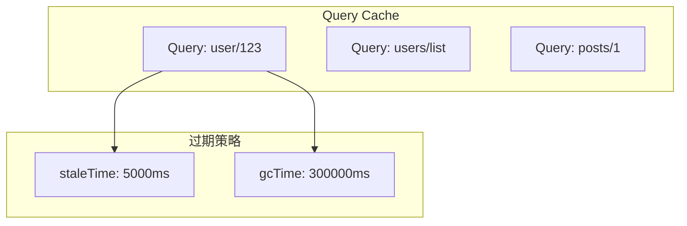

#### 6.2.2 核心概念

- **Query**: 带唯一 key 的异步数据请求
- **Mutation**: 修改服务端数据的操作
- **Invalidation**: 使缓存失效，触发重新获取
- **Optimistic Update**: 乐观更新，用户体验优化

### 6.3 快速开始

```bash
npm install @tanstack/react-query
```

```typescript
// ============ setup.tsx ============
import { QueryClient, QueryClientProvider } from '@tanstack/react-query';

const queryClient = new QueryClient({
  defaultOptions: {
    queries: {
      staleTime: 1000 * 60 * 5,  // 5 分钟
      gcTime: 1000 * 60 * 10,   // 10 分钟
      retry: 3,
      refetchOnWindowFocus: true
    }
  }
});

function App() {
  return (
    <QueryClientProvider client={queryClient}>
      <YourApp />
    </QueryClientProvider>
  );
}
```

```typescript
// ============ queries.tsx ============
import { useQuery, useMutation, useQueryClient } from '@tanstack/react-query';

// 查询
function UserProfile({ userId }: { userId: string }) {
  const { data, isLoading, error } = useQuery({
    queryKey: ['user', userId],
    queryFn: () => fetch(`/api/users/${userId}`).then(res => res.json())
  });

  if (isLoading) return <div>Loading...</div>;
  if (error) return <div>Error: {error.message}</div>;

  return <div>{data.name}</div>;
}

// 变更
function CreateUser() {
  const queryClient = useQueryClient();

  const mutation = useMutation({
    mutationFn: (newUser) =>
      fetch('/api/users', {
        method: 'POST',
        body: JSON.stringify(newUser)
      }).then(res => res.json()),

    onSuccess: () => {
      // 刷新用户列表
      queryClient.invalidateQueries({ queryKey: ['users'] });
    }
  });

  return (
    <button onClick={() => mutation.mutate({ name: '张三' })}>
      创建用户
    </button>
  );
}
```

### 6.4 竞品对比

| 特性 | TanStack Query | SWR | Apollo Client |
|------|----------------|-----|---------------|
| 体积 | ~14kb | ~5kb | ~40kb |
| GraphQL 支持 | 无 | 无 | 原生 |
| 缓存策略 | 强大 | 基础 | 强大 |
| SSR | 支持 | 有限 | 支持 |
| DevTools | 优秀 | 基础 | 优秀 |

### 6.5 参考链接

- [GitHub](https://github.com/TanStack/query)
- [官方文档](https://tanstack.com/query)

## 7. 项目生态定位图

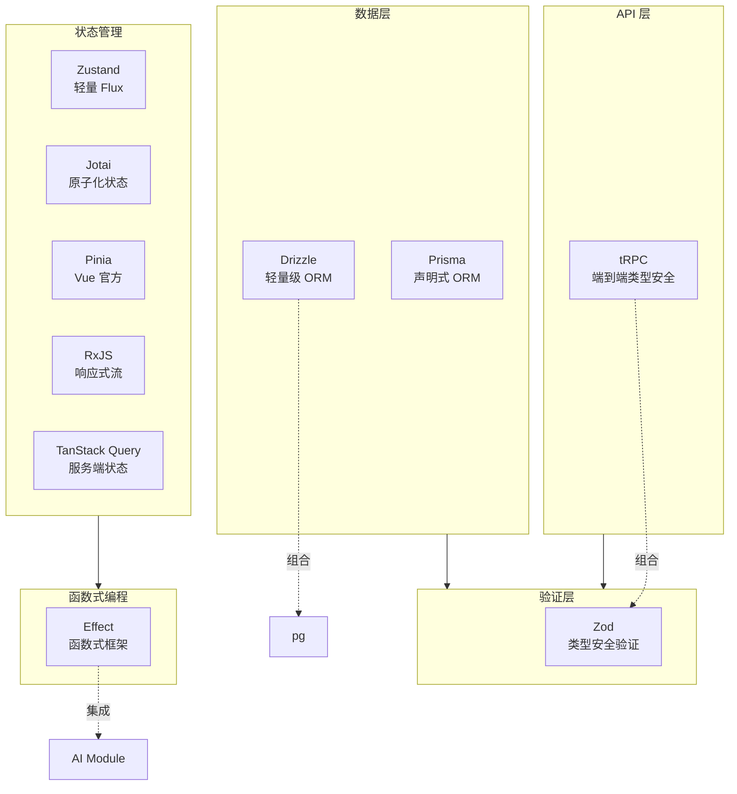

## 8. 技术选型决策树

### 8.1 状态管理选型

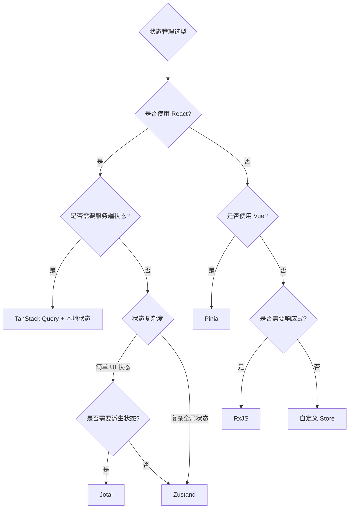

### 8.2 数据层选型

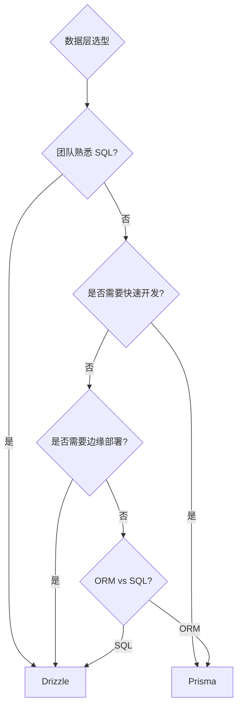

### 8.3 API 层选型

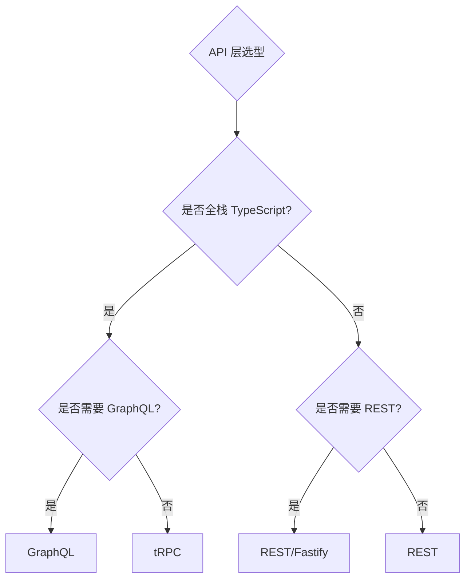

## 9. 技术选型指南

| 需求场景 | 推荐方案 | 备选方案 |
|----------|----------|----------|
| TypeScript 全栈端到端类型安全 | tRPC + Zod | GraphQL + codegen |
| 新项目数据库建模 | Prisma | Drizzle |
| 熟悉 SQL，追求性能 | Drizzle | Prisma |
| 运行时数据验证 | Zod | superstruct |
| React 轻量状态管理 | Zustand | Jotai |
| 细粒度派生状态 | Jotai | Zustand (computed) |
| Vue 状态管理 | Pinia | Vuex 4 |
| 复杂异步流程/事件流 | RxJS | - |
| 函数式编程 | Effect | fp-ts |
| 服务端状态管理 | TanStack Query | SWR |
| 边缘部署 ORM | Drizzle | - |

## 10. 性能对比汇总

### 10.1 ORM 性能对比

| 操作 | Prisma | Drizzle | 差异 |
|------|--------|---------|------|
| 简单查询 | 2.1ms | 1.9ms | Drizzle 快 9% |
| 复杂联表 | 8.3ms | 7.6ms | Drizzle 快 8% |
| 批量插入 1000 条 | 145ms | 128ms | Drizzle 快 12% |
| 包体积 | ~200kb | ~7.4kb | Drizzle 小 96% |

### 10.2 状态管理库体积对比

| 库 | 体积 (gzip) | 特点 |
|----|-------------|------|
| Zustand | ~1kb | 最轻量 |
| Jotai | ~2kb | 原子化 |
| Redux Toolkit | ~7kb | 完整方案 |
| MobX | ~20kb | 响应式 |
| Pinia | ~5kb | Vue 官方 |

## 11. 参考链接汇总

| 项目 | GitHub | 文档 |
|------|--------|------|
| tRPC | [trpc/trpc](https://github.com/trpc/trpc) | [trpc.io](https://trpc.io/) |
| Prisma | [prisma/prisma](https://github.com/prisma/prisma) | [prisma.io](https://www.prisma.io/docs) |
| Drizzle | [drizzle-team/drizzle-orm](https://github.com/drizzle-team/drizzle-orm) | [orm.drizzle.team](https://orm.drizzle.team/) |
| Zod | [colinhacks/zod](https://github.com/colinhacks/zod) | [zod.dev](https://zod.dev/) |
| Effect | [Effect-TS/effect](https://github.com/Effect-TS/effect) | [effect.website](https://effect.website/) |
| RxJS | [ReactiveX/rxjs](https://github.com/ReactiveX/rxjs) | [rxjs.dev](https://rxjs.dev/) |
| Zustand | [pmndrs/zustand](https://github.com/pmndrs/zustand) | [zustand.docs.pmnd.rs](https://zustand.docs.pmnd.rs/) |
| Jotai | [pmndrs/jotai](https://github.com/pmndrs/jotai) | [jotai.org](https://jotai.org/) |
| Pinia | [vuejs/pinia](https://github.com/vuejs/pinia) | [pinia.vuejs.org](https://pinia.vuejs.org/) |
| TanStack Query | [TanStack/query](https://github.com/TanStack/query) | [tanstack.com/query](https://tanstack.com/query) |

## 12. 附录: awesome-lists 参考

- [awesome-typescript](https://github.com/dzharii/awesome-typescript)
- [awesome-trpc](https://github.com/icflorescu/awesome-trpc)
- [awesome-prisma](https://github.com/catalinmiron/awesome-prisma)
- [awesome-zod](https://github.com/colinhacks/zod)
- [state-of-js](https://stateofjs.com/) - JavaScript 状态管理调查

---

*本文档持续更新中，最后更新于 2025 年 1 月。*

## 深入阅读与参考

!!! tip "怎么用这些资料"
    先读「官方文档与规范」建立准确的概念，再读「源码与示例」核对细节，最后用「教程、书籍与视频」换一种讲法加深理解。每条都写明了读哪一节、带着什么问题读。

### 官方文档与规范

| 资源 | 为什么读 | 怎么读 |
|---|---|---|
| [TanStack Query 文档](https://tanstack.com/query/latest) | TanStack Query 官方文档，掌握服务端状态的缓存、失效与请求设计。 | 读 Overview 的缓存与失效章节，带着何时该缓存的疑问读，再给现有请求接上 Query。 |
| [TanStack Query 概览](https://tanstack.com/query/latest/docs/framework/react/overview) | 概览中的 Important Defaults 讲清默认缓存行为，避免踩坑。 | 先读 Important Defaults，重点看 staleTime 与 gcTime，读完把项目默认值改为显式配置。 |
| [Jotai 文档](https://jotai.org/docs/introduction) | Jotai 官方文档，原子化状态管理最小且完整的入门。 | 读 Core 的 atom 与派生 atom 一节，动手用派生 atom 写一个联动表单。 |
| [SolidJS 文档](https://docs.solidjs.com/) | SolidJS 官方文档，signal 与 effect 是细粒度状态的原型。 | 先读 Concepts 的响应式部分，理解 signal 与 effect，再对比 React 的状态模型。 |
| [Vue DevTools 文档](https://devtools.vuejs.org/) | Vue 官方调试工具文档，看清状态在组件树与时间线中的流动。 | 安装后按时间线章节操作，在自己的 Vue 项目里定位一次状态异常。 |
| [Nuxt 文档](https://nuxt.com/docs) | Vue 生态元框架文档，理清 Pinia 等官方库在项目中的位置。 | 读状态管理与数据获取两节，画出 Nuxt 与 Pinia 的生态定位图。 |

### 源码与示例

| 资源 | 为什么读 | 怎么读 |
|---|---|---|
| [Vue 核心源码仓库](https://github.com/vuejs/core) | 从源码看响应式实现，比二手转述可靠，也更能解释性能差异。 | 从 packages/reactivity 读起，先 ref 与 effect 再 computed，画出依赖收集流程。 |
| [Solid](https://github.com/solidjs/solid) | 细粒度响应式源码，理解无虚拟 DOM 时的状态更新代价。 | 读 README 与 packages/solid 目录，带着为何不需要虚拟 DOM 的问题看 signal 实现。 |
| [Vue 2 响应式源码目录](https://github.com/vuejs/vue/tree/main/src/core/observer) | 与 Vue 3 实现对照，理解 defineProperty 与 Proxy 的能力边界。 | 只读响应式目录核心文件，再列出 defineProperty 相比 Proxy 的限制清单。 |

### 教程、书籍与视频

| 资源 | 为什么读 | 怎么读 |
|---|---|---|
| [Vue 响应式深入](https://cn.vuejs.org/guide/extras/reactivity-in-depth.html) | Vue 响应式原理讲得透，可迁移到信号类状态库理解。 | 顺章节读完再手写 reactive、effect、computed，回答依赖收集何时被触发。 |
| [TkDodo：Practical React Query](https://tkdodo.eu/blog/practical-react-query) | React Query 维护者的实战系列，覆盖缓存、分页与乐观更新。 | 按顺序读，每篇挑一个模式在项目里落地，如乐观更新与分页缓存。 |
| [TkDodo 博客](https://tkdodo.eu/blog) | 长期更新的 React Query 与 React 状态实践，补文档之外的经验。 | 从目录挑缓存与渲染相关篇目精读，边读边对照自己的 query key 设计。 |
| [MDN 元编程](https://developer.mozilla.org/en-US/docs/Web/JavaScript/Guide/Meta_programming) | 规范级讲解 Proxy 与 Reflect，是各类响应式状态库的地基。 | 读 Proxy 与 Reflect 章节，动手实现带校验对象，再回看 Vue 3 响应式。 |

## 应用与行业实践

### 应用场景地图

| 场景 | 用到本页哪个知识点 | 典型技术选型 | 注意事项 |
|:--|:--|:--|:--|
| 后台管理的万行表格（组合筛选 + 跨页多选 + 批量删除） | TanStack Query 服务端状态，Zustand 管 UI 状态 | TanStack Query + Zustand | 选中行 id 不要写进 query cache；切页时用 placeholderData 保留上一页数据 |
| 入门机型在 4G 弱网下的信息流首屏 | TanStack Query 的 SSR 预取与注水 | SSR 框架 + TanStack Query | 只预取首屏可见的第一页；预取数据的体积会直接加到 HTML 上 |
| 多人协作白板的光标与图形同步 | RxJS 事件流，用 scan 把事件折叠成状态 | RxJS + WebSocket | 断线重连要按 seq 补发；同一图形的事件必须保序 |
| 客服工单列表的实时新单提醒 | RxJS 操作符 + TanStack Query 缓存失效 | RxJS + TanStack Query | 提醒只是提示层，不要每条推送都重拉全量列表 |
| 多步骤表单的草稿自动保存 | Jotai 原子拆分 + TanStack Query 的 mutation | Jotai + TanStack Query | 草稿先落本地存储再异步同步；草稿 key 与已提交数据分开 |
| 电商购物车跨页面共享与结算 | Zustand persist 持久化 | Zustand | 本地购物车只是快照，结算前用服务端价格覆盖一遍 |
| Vue 3 后台的登录态、权限菜单、面包屑 | Pinia setup store 与 storeToRefs | Pinia | 按领域拆 store，不按页面拆；解构 state 时用 storeToRefs |
| 仪表盘多个独立卡片的定时刷新 | TanStack Query 的独立 queryKey 与轮询 | TanStack Query | 每个卡片独立 key，否则一处刷新会带动全盘重拉 |
| 地图轨迹回放与时间轴拖动 | RxJS 时间调度与 scan | RxJS | 轨迹一次取全，在本地播放，拖动时间轴不触发新请求 |

### 三个场景拆解

#### 场景 1：后台管理的万行表格

**业务背景**：列表每页 50 行，总量在万级，用户要按关键词、状态、时间区间组合筛选，再跨页多选做批量操作。当前实现把行数据和筛选条件放在同一个 store 里，改一次筛选就整表重取并全量重渲染，输入框按键有可感知的停顿。

**怎么用本页知识解决**：按数据来源分层。行数据、总数来自服务端，交给 TanStack Query，queryKey 携带全部筛选参数；页码、关键词、选中 id 只属于当前界面，放进 Zustand；输入框先维持本地受控值，防抖后再写 store。

```ts
import { create } from 'zustand'
import { keepPreviousData, useQuery } from '@tanstack/react-query'
// 第 1 层：UI 状态放页码、关键词、选中行，与行数据分开
export const useTableUI = create<TableUI>((set) => ({
  page: 1,
  keyword: '',
  selectedIds: [] as string[],
  setPage: (page: number) => set({ page }),                    // 翻页不触发行数据重取
  setKeyword: (keyword: string) => set({ keyword, page: 1 }),  // 改筛选回到第一页
  setSelectedIds: (ids: string[]) => set({ selectedIds: ids }), // 多选只写本地
}))
// 第 2 层：行数据交给 TanStack Query，key 带上全部筛选条件
export function useRows() {
  const { page, keyword } = useTableUI()
  return useQuery({
    queryKey: ['rows', page, keyword],   // 条件不变就命中缓存
    queryFn: () => fetchRows({ page, keyword }),
    placeholderData: keepPreviousData,   // 切页显示上一页，表格不闪空
  })
}
```

- 用 selector 订阅 `useTableUI`，只读 `page` 的组件在 `keyword` 变化时不会重渲染。
- queryKey 里带齐筛选参数，参数相同就复用缓存，不必手写请求去重。
- `placeholderData: keepPreviousData` 是 TanStack Query v5 的写法，让切页期间保留上一页行数据。
- 选中 id 数组留在本地，批量删除时只把它当参数传给 mutation，不进缓存。
- 搜索输入用组件内 state 加防抖，防抖结束再调 `setKeyword`，避免每次按键都新建 queryKey。

**怎么度量收益**：React DevTools Profiler 录制一次翻页，记录 commit 次数与参与渲染的组件数。Chrome DevTools Network 面板统计一分钟内行数据接口的请求数。用 web-vitals 采集筛选输入框上的 INP。TanStack Query Devtools 观察切页后 query 的 fresh 与 stale 状态。

**什么时候不该用**：

- 表格总量只有几十行、一次请求就能全部返回时，组件内 useState 就够，硬拆两层会抬高阅读成本。
- 页面需要把筛选条件写进 URL 供分享时，直接用路由 search params 当唯一数据源，再叠一份 Zustand 会出现两份真相。

#### 场景 2：入门机型弱网下的信息流首屏

**业务背景**：首屏是信息流列表，一部分入口流量来自入门机型在 4G 弱网下打开，白屏时间会直接掉转化。列表数据服务端已经能查到，客户端却要等 JS 加载完才发请求，两段等待串在一起。

**怎么用本页知识解决**：把首屏第一页的请求前移到服务端。SSR 阶段用 `prefetchQuery` 把数据填进缓存，用 `dehydrate` 序列化进 HTML，客户端用 `HydrationBoundary` 注水，首帧直接读缓存。

```tsx
import { dehydrate, HydrationBoundary, QueryClient } from '@tanstack/react-query'
import type { DehydratedState } from '@tanstack/react-query'

// 服务端：只预取首屏要用的第一屏数据
const queryClient = new QueryClient()
await queryClient.prefetchQuery({
  queryKey: ['feed', 1],
  queryFn: () => fetchFeed(1),
})
const state = dehydrate(queryClient)   // 把缓存序列化成可注水的 JSON

// 客户端：注水后首帧命中缓存，不再发第二次请求
export default function Page({ state }: { state: DehydratedState }) {
  return (
    <HydrationBoundary state={state}>
      <Feed />   {/* 内部照常 useQuery，命中缓存时状态直接是 success */}
    </HydrationBoundary>
  )
}
```

- 服务端与客户端要用同一个 queryKey 构造函数，键不一致就注水不命中。
- 预取范围只覆盖首屏可见部分，翻页仍走客户端请求，控制注水体积。
- 给信息流设置 staleTime，避免注水完成后立刻触发一次重取。
- 预取的返回值要能被序列化，Date、Map 这类对象需要在 queryFn 里先转成基础类型。
- HydrationBoundary 只负责把缓存交给 Provider，组件内的 useQuery 写法不变。

**怎么度量收益**：用 web-vitals 采集 LCP 与 INP，按机型分组分别看 P75。Chrome DevTools Network 面板统计首屏请求数，以及最后一个阻塞渲染的请求完成时刻。Lighthouse 移动端模式下看 First Contentful Paint 与 Total Blocking Time。

**什么时候不该用**：

- 首屏内容是登录后可见的个性化数据且不能跨用户复用时，往 HTML 注水会涉及代理缓存与数据隔离，需要另外设计。
- 应用本身没有服务端渲染层，属于纯客户端本地工具，为了预取去改造架构，成本与收益对不上。

#### 场景 3：多人协作白板的光标与图形同步

**业务背景**：一个房间内多人同时拖动图形，服务端把变更以事件形式广播，客户端要把乱序到达、断线补发的事件合成一份画布状态。本地拖动的反馈必须与远端事件解耦，否则网络抖动会直接传到手感上。

**怎么用本页知识解决**：把 WebSocket 当成一条事件流，用 RxJS 过滤出图形类事件，再用 scan 折叠成画布状态。本地拖动先写本地状态，收到服务端确认后再以服务端版本为准。

```ts
import { webSocket } from 'rxjs/webSocket'
import { filter, retry, scan, share } from 'rxjs'

// 事件结构：{ kind, shapeId, seq, patch }
const socket$ = webSocket<BoardEvent>({ url: 'wss://example.com/board' })

export const shapes$ = socket$.pipe(
  retry({ delay: 1000 }),        // 断线后按固定间隔重连
  filter((e) => e.kind === 'shape'),   // 只处理图形变更，光标事件走另一条链路
  scan((map, e) => ({            // 把事件流折叠成一份画布状态
    ...map,
    [e.shapeId]: applyPatch(map[e.shapeId], e.patch), // 同 id 事件按到达顺序叠加
  }), {} as Record<string, Shape>),
  share(),                       // 多个订阅者共用同一条连接
)
```

- `scan` 是纯函数，同样的初始状态加同样的事件序列，得到同样的画布状态，便于回放排查。
- `filter` 把光标移动这类高频事件剥离出去，避免它们参与画布状态的折叠。
- `share()` 让多个组件的订阅落到同一条 WebSocket 上，不重复建连。
- 重连后需要服务端按 `seq` 补发缺失事件，否则画布会停在旧版本。
- 本地正在拖动的图形先写本地状态，收到服务端事件后再覆盖，把网络延迟挡在渲染之外。

**怎么度量收益**：在事件里带上服务端发送时间戳，客户端收到后与 `performance.now()` 相减，统计 P50 与 P95。Chrome DevTools Performance 面板录制 10 秒拖动，观察主线程长任务。用 requestAnimationFrame 计数换算实际帧率。

**什么时候不该用**：

- 房间同时在线人数在个位数、操作频率低时，轮询或单次请求同步就能满足，引入事件流会多出一层调试成本。
- 需求是多人编辑同一段富文本时，用 Yjs 这类 CRDT 库管理文档，比手写 scan 合并的出错面小。

### 行业先进实践

**服务端状态与客户端状态分开管（出处：TanStack Query 官方文档 FAQ 页 "Does React Query replace Redux, MobX or other global state managers?"，以及 TkDodo 博客 "React Query as a State Manager"）**
官方文档的观点是，服务端数据带有缓存、失效、重取的语义，全局状态库不负责这些。把两者混在一个 store 里，会出现该失效的数据没失效。借鉴方式：在代码评审清单里加一条，凡是 fetch 回来的数据不进全局 store。

**按字段拆 selector 订阅（出处：Zustand 官方文档 "Prevent rerenders with useShallow"）**
Zustand 的 `useStore(selector)` 只在选中值变化时触发重渲染，返回对象时用 `useShallow` 做浅比较。有效的原因是订阅粒度从整个 store 缩到单个字段。借鉴方式：把大对象 store 拆成字段级 selector，或在返回对象处包一层 `useShallow`。

**Setup Store 配合 storeToRefs 保留响应性（出处：Pinia 官方文档 "Setup Stores" 与 "Destructuring from a Store"）**
Pinia 文档说明，直接从 store 解构 state 会丢失响应性，需要用 `storeToRefs` 取 state，而 action 可以直接解构。借鉴方式：Vue 项目里统一约定 state 走 `storeToRefs`，并把这条写进 lint 之外的评审项。

**按 id 建原子管理列表实体（出处：Jotai 官方文档 atomFamily）**
`atomFamily` 按参数生成原子，列表里每行对应一个原子，行内更新只影响那一行。借鉴方式：详情页与表格行不要共用一个存整张表的原子，改用 `atomFamily(id)` 并按 id 订阅。

**断线重连与事件补发（出处：需核对官方文档：核对 RxJS 官方文档 rxjs/webSocket 页面中 WebSocketSubject 的重连与错误处理示例，以及服务端按 seq 补发的实现约定）**
这一点需要按项目实际情况确认参数与语义，核对项包括重连间隔、重连后的日志输入行为、以及缺失事件的补齐协议。

### 从学到用：落地路线

**第 1 步：选一个数据来源单一的列表页试点，把服务端数据迁进 TanStack Query。**
验收标准：页面上的列表数据都由 queryKey 声明，组件里没有手写的 loading 与 error 布尔。

**第 2 步：用 Profiler 与 Network 面板记录试点前后的翻页 commit 次数与请求数。**
验收标准：PR 描述里有前后两组数字，并写清测量步骤，他人照做能得到同一量级的结果。

**第 3 步：把 queryKey 约定、目录结构、评审清单整理成一页文档，按模块分批迁移。**
验收标准：每个待迁移模块在文档里有负责人和计划时间，已完成模块能从文档反查到改动提交。

**第 4 步：用 lint 规则或 CI 检查阻止回退，例如禁止把 query 返回值写进全局 store。**
验收标准：故意提交一次违规写法，CI 能拦住并给出规则名。

### 动手作业

**目标**：给一个带筛选、分页、多选的列表页做状态分层改造，并交出一份可复现的测量报告。

**步骤**：

1. 选定页面，记录基线：用 Chrome DevTools Network 面板统计连续翻页 10 次产生的请求数，用 React DevTools Profiler 记录其中一次翻页的 commit 数与渲染组件数。
2. 清点页面状态，列一张表，把每个状态标为「来自服务端」或「UI 本地」。
3. 把服务端状态迁到 TanStack Query，queryKey 带上全部筛选参数，并为列表设置 staleTime。
4. 把 UI 状态放进 Zustand 或 Jotai，按字段拆 selector 或原子。
5. 用 `placeholderData: keepPreviousData` 消除翻页闪空，并让选中行在跨页后保持。
6. 重跑第 1 步的测量，把前后数字填进同一张对比表。
7. 写 README：状态清单、改动点、前后对比、复现命令。

**验收标准**：

- README 里每个数字都附带测量工具与操作步骤，他人照做能复现。
- 翻页过程中列表区域不出现空态。
- 在 staleTime 内回到已访问过的 queryKey，Network 面板没有新增请求。
- 代码里没有把服务端返回的数组直接写进全局 store 的写法。
- Profiler 记录到的翻页渲染组件数低于基线。

