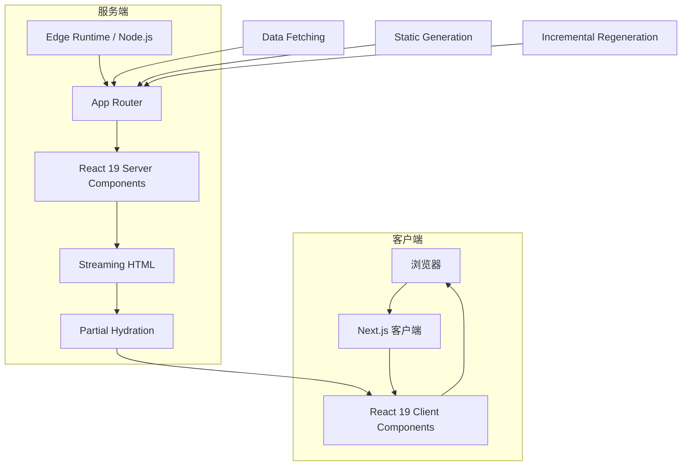
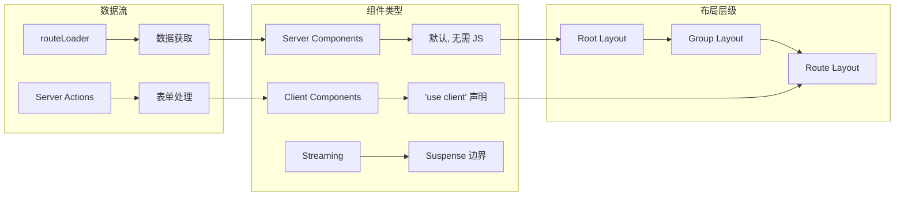
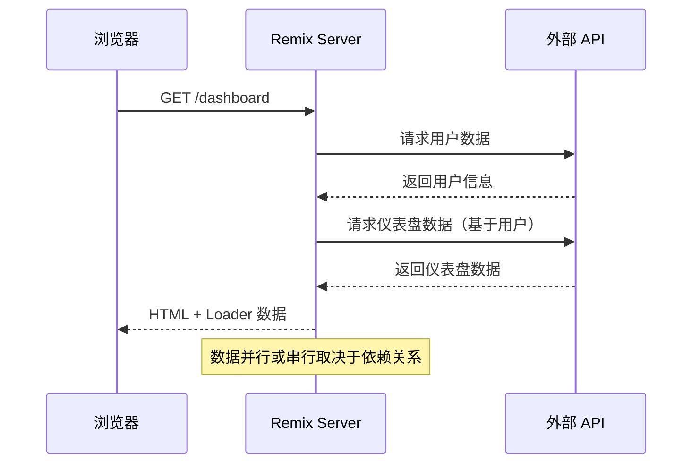
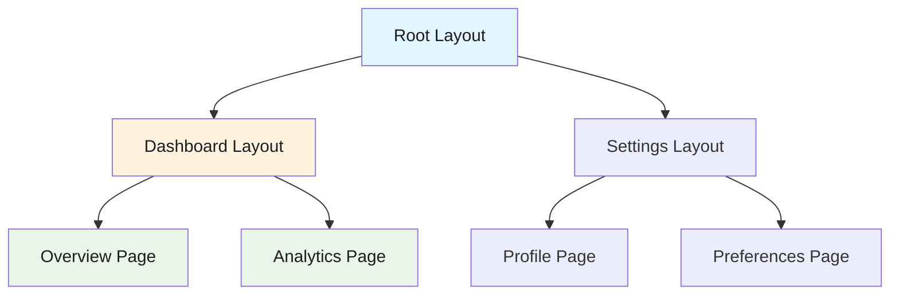
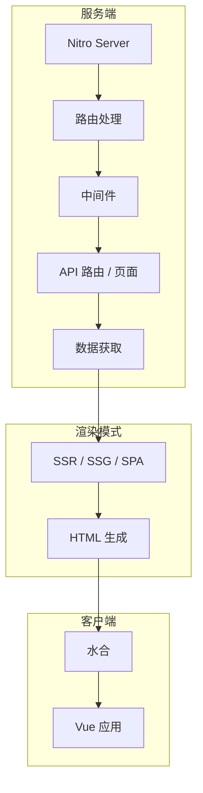
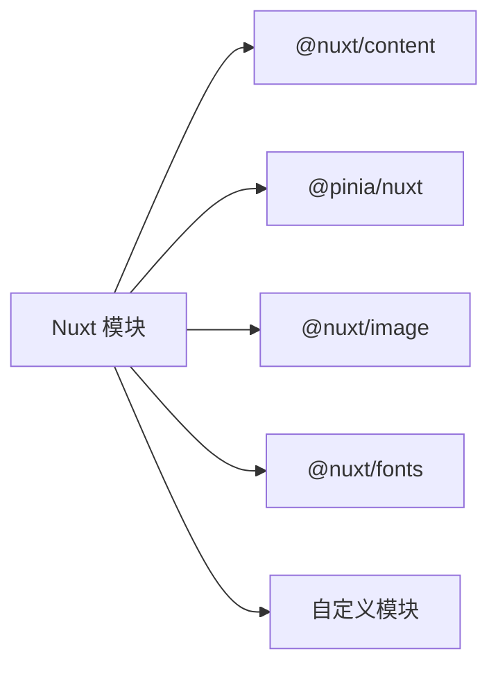

# 元框架：Next.js、Remix、Nuxt

> 本文是「前端框架」系列第 1 篇（共 3 篇）。下一篇：[新范式：Astro、Svelte、Solid、Qwik](rendering-paradigms.md)

> 调研日期：2026-05-16
> 覆盖范围：主流前端框架/运行时 8+，2500+ 行内容

## 1. Next.js 15

### 1.1 简介

Next.js 是由 Vercel 开发的 React 全栈框架，是目前最流行的 React 元框架（Meta-Framework）。Next.js 15 正式支持 React 19，带来 Turbopack 开发环境稳定版、异步 Request API、改进的缓存语义等重大更新。

### 1.2 技术栈

| 类别 | 技术 |
|------|------|
| 核心框架 | React 19 + Next.js 15 |
| 语言 | TypeScript / JavaScript |
| 渲染模式 | SSR / SSG / ISR / PPR |
| 构建工具 | Turbopack (dev stable) / Webpack (production) |
| 样式方案 | CSS Modules / Tailwind / Styled Components |

### 1.3 核心架构

#### 1.3.1 请求处理流程



#### 1.3.2 App Router 架构



### 1.4 技术深度分析

#### 1.4.1 React 19 集成特性

Next.js 15 与 React 19 深度集成，带来以下核心能力：

**1. Server Components（服务端组件）**

服务端组件默认使用，无需额外配置。它们在服务器端渲染，不向客户端发送 JavaScript 代码。

```typescript
// app/users/page.tsx - 服务端组件（默认）
import { cookies } from 'next/headers';
import { db } from '@/lib/db';

async function getUsers() {
  'use server';
  const response = await fetch('https://api.example.com/users');
  return response.json();
}

export default async function UsersPage() {
  // 直接在服务端访问数据库
  const users = await db.user.findMany();
  const cookieStore = await cookies();
  const token = cookieStore.get('token');
  
  return (
    <div>
      <h1>Users ({users.length})</h1>
      <ul>
        {users.map(user => (
          <li key={user.id}>{user.name}</li>
        ))}
      </ul>
    </div>
  );
}
```

**2. Actions（服务端操作）**

允许在客户端调用服务端函数，简化表单处理和数据 mutations。

```typescript
// app/actions.ts
'use server';

import { revalidatePath } from 'next/cache';
import { redirect } from 'next/navigation';

export async function updateUser(userId: string, formData: FormData) {
  const name = formData.get('name') as string;
  
  // 直接在服务端执行数据库操作
  await db.user.update({
    where: { id: userId },
    data: { name }
  });
  
  // 清除缓存并重定向
  revalidatePath('/users');
  redirect('/users');
}

export async function deleteUser(userId: string) {
  await db.user.delete({ where: { id: userId } });
  revalidatePath('/users');
}
```

```tsx
// app/user/[id]/edit.tsx
'use client';
import { updateUser } from '@/app/actions';

export function UserEditForm({ userId, currentName }: { 
  userId: string;
  currentName: string;
}) {
  return (
    <form action={updateUser.bind(null, userId)}>
      <input 
        name="name" 
        defaultValue={currentName}
        placeholder="Enter new name"
      />
      <button type="submit">Update User</button>
    </form>
  );
}
```

**3. use() Hook**

React 19 引入的 `use()` 允许在组件中调用 Promise，支持更灵活的数据获取模式。

```tsx
// app/posts/page.tsx
import { use } from 'react';

async function getPosts() {
  const res = await fetch('https://api.example.com/posts');
  return res.json();
}

export default function PostsPage({ params }: { params: Promise<{ page: string }> }) {
  // use() 可以等待 Promise
  const { page } = use(params);
  const posts = use(getPosts());
  
  return (
    <div>
      <h1>Page {page}</h1>
      {posts.map(post => (
        <article key={post.id}>{post.title}</article>
      ))}
    </div>
  );
}
```

#### 1.4.2 Turbopack 构建系统

Turbopack 是 Next.js 15 的新一代构建工具，基于 Rust 实现，相比 Webpack 有显著性能提升。

| 指标 | Webpack | Turbopack | 提升 |
|------|---------|-----------|------|
| 冷启动 | 30s+ | <3s | 10x |
| 热更新 | 2-5s | <50ms | 50x+ |
| 内存占用 | 高 | 低 | 50% |
| 生产构建 | 90s+ | 45s | 2x |

```typescript
// next.config.ts
import type { NextConfig } from 'next';

const nextConfig: NextConfig = {
  // Turbopack 相关配置
  experimental: {
    // 启用 Turbopack（开发环境默认启用）
    turbopack: true,
    // 优化包分析
    bundlePagesRouterDependencies: true,
  },
  // 生产环境仍然使用 Webpack（稳定）
  webpack: (config) => {
    // 自定义 webpack 配置
    return config;
  },
};

export default nextConfig;
```

#### 1.4.3 Partial Prerendering (PPR)

部分预渲染结合了静态生成的快速和动态服务端渲染的灵活性。

```tsx
// app/product/[id]/page.tsx
import { Suspense } from 'react';

// 静态部分立即可用
const StaticHeader = () => (
  <header>
    <h1>Product Details</h1>
  </header>
);

// 动态部分使用 Suspense
async function DynamicPricing({ productId }: { productId: string }) {
  const price = await getRealtimePrice(productId);
  return <span className="text-red-500 font-bold">${price}</span>;
}

async function DynamicStock({ productId }: { productId: string }) {
  const stock = await getStockLevel(productId);
  return <span>{stock > 0 ? 'In Stock' : 'Out of Stock'}</span>;
}

export default async function ProductPage({ 
  params 
}: { 
  params: Promise<{ id: string }> 
}) {
  const { id } = await params;
  
  return (
    <div>
      <StaticHeader />
      <Suspense fallback={<div className="skeleton h-8 w-32"></div>}>
        <DynamicPricing productId={id} />
      </Suspense>
      <Suspense fallback={<div>Loading stock...</div>}>
        <DynamicStock productId={id} />
      </Suspense>
    </div>
  );
}
```

### 1.5 渲染模式详解

| 模式 | 说明 | 适用场景 | TTFB | TTI |
|------|------|---------|------|-----|
| SSG | 构建时生成静态 HTML | 博客、文档 | 极快 | 快 |
| ISR | 按需重新验证缓存 | 内容频繁更新 | 快 | 快 |
| SSR | 请求时服务端渲染 | 个性化内容 | 中等 | 中等 |
| PPR | 部分静态+部分动态 | 电商产品页 | 极快 | 极快 |

```typescript
// 静态生成 (SSG)
export async function generateStaticParams() {
  const posts = await db.post.findMany();
  return posts.map(post => ({ id: post.id }));
}

// 增量静态再生 (ISR)
export const revalidate = 3600; // 每小时重新验证

// 服务端渲染 (SSR)
export const dynamic = 'force-dynamic';

// 部分预渲染 (PPR)
export const experimental_ppr = true;
```

### 1.6 缓存语义

Next.js 15 改进了缓存机制，提供更细粒度的控制：

```typescript
// app/api/data/route.ts
import { NextResponse } from 'next/server';

export async function GET() {
  return NextResponse.json(
    { data: 'cached' },
    {
      headers: {
        // 缓存控制
        'Cache-Control': 'public, max-age=3600, stale-while-revalidate=86400',
      },
    }
  );
}
```

```typescript
// 静态资源缓存
// next.config.ts
{
  headers: async () => [
    {
      source: '/assets/:path*',
      headers: [
        {
          key: 'Cache-Control',
          value: 'public, max-age=31536000, immutable',
        },
      ],
    },
  ],
}
```

### 1.7 性能基准数据

| 指标 | Next.js 15 | Create React App | Gatsby |
|------|------------|------------------|--------|
| 首屏加载 (3G) | 1.8s | 3.2s | 2.5s |
| Time to Interactive | 2.1s | 4.5s | 3.2s |
| Lighthouse 性能 | 95+ | 75 | 85 |
| Bundle Size (默认) | 85KB | 42KB + 150KB | 120KB |
| 热更新时间 | <50ms | 2-5s | 1-3s |

### 1.8 优缺点分析

#### 1.8.1 优势

1. **完善的生态系统** - Vercel 维护，丰富的插件和集成
2. **React 19 一等支持** - Server Components、Actions 等新特性
3. **灵活的渲染模式** - SSG、ISR、SSR、PPR 按需选择
4. **Turbopack 高性能** - 开发体验显著提升
5. **优秀的开发者体验** - 清晰的文档和错误提示
6. **部署便利** - Vercel 零配置部署

#### 1.8.2 劣势

1. **复杂度较高** - 学习曲线陡峭，配置项繁多
2. **厂商锁定** - Vercel 平台特性可能在其他平台受限
3. **体积较大** - 相比轻量框架包体积更大
4. **过度工程** - 小项目可能不需要这么多功能

### 1.9 选择理由

- **为什么选 Next.js 15？**
  - 需要 React 生态的完整功能
  - 需要多种渲染模式混合使用
  - 需要优秀的 SEO 和性能
  - 团队熟悉 React

- **什么场景不适合？**
  - 极简项目（用 Vite + React 更合适）
  - 需要最小化 JS 的场景（Astro 更优）
  - 团队不熟悉 React

### 1.10 使用场景

- 企业级应用（电商、SaaS、企业门户）
- 内容驱动的网站（博客、文档、新闻）
- 全栈应用（API Routes + 数据库）
- 需要 SEO 的应用

### 1.11 快速开始

**JavaScript 版本：**

```javascript
// app/page.jsx
export default function HomePage() {
  return (
    <main>
      <h1>Welcome to Next.js 15</h1>
      <p>Get started by editing app/page.jsx</p>
    </main>
  );
}
```

**TypeScript 版本：**

```typescript
// next.config.ts
import type { NextConfig } from 'next';

const nextConfig: NextConfig = {
  experimental: {
    after: true,
  },
};
export default nextConfig;

// app/layout.tsx
export default function RootLayout({ children }: { children: React.ReactNode }) {
  return (
    <html lang="en">
      <body>{children}</body>
    </html>
  );
}
```

**App Router 服务器组件：**

```typescript
// app/users/page.tsx
import { cookies } from 'next/headers';

async function getUsers() {
  const response = await fetch('https://api.example.com/users');
  return response.json();
}

export default async function UsersPage() {
  const users = await getUsers();
  const cookieStore = await cookies();
  const token = cookieStore.get('token');
  
  return (
    <div>
      <h1>Users ({users.length})</h1>
      <ul>
        {users.map(user => (
          <li key={user.id}>{user.name}</li>
        ))}
      </ul>
    </div>
  );
}
```

**Server Actions：**

```typescript
// app/actions.ts
'use server';

export async function updateUser(formData: FormData) {
  const name = formData.get('name');
  // 更新数据库
  await db.user.update({ name });
}
```

```tsx
// app/form.tsx
'use client';
import { updateUser } from './actions';

export function UserForm() {
  return (
    <form action={updateUser}>
      <input name="name" type="text" />
      <button type="submit">Update</button>
    </form>
  );
}
```

### 1.12 真实应用案例

| 公司/项目 | 使用场景 | 规模 |
|-----------|---------|------|
| Vercel 官网 | 文档、定价、博客 | 大型 |
| Hulu | 视频流媒体平台 | 超大型 |
| Twitch | 直播平台 | 超大型 |
| Notion | 协作工具 | 超大型 |
| TikTok Marketing | 营销网站 | 中型 |

### 1.13 参考链接

- [Next.js 15 官方博客](https://nextjs.org/blog/next-15)
- [Next.js 文档](https://nextjs.org/docs)
- [Next.js GitHub](https://github.com/vercel/next.js)
- [React 19 Upgrade Guide](https://react.dev/blog/2024/04/25/react-19-upgrade-guide)

## 2. Remix

### 2.1 简介

Remix 是基于 Web 标准构建的全栈 React 框架，由 React Router 团队开发并被 Shopify 收购。它强调渐进式增强（Progressive Enhancement）、嵌套路由和优秀的开发者体验。Remix v2 已与 React Router v7 合并，成为现代 Web 应用的首选框架之一。

### 2.2 技术栈

| 类别 | 技术 |
|------|------|
| 核心框架 | React 18/19 |
| 语言 | TypeScript / JavaScript |
| 路由系统 | 文件系统路由 + 嵌套布局 |
| 构建工具 | Vite |
| 部署 | Node.js / Edge / Serverless |

### 2.3 核心架构

#### 2.3.1 瀑布流数据加载



#### 2.3.2 嵌套路由架构



### 2.4 技术深度分析

#### 2.4.1 Web 标准优先

Remix 深度利用 Web 标准，这带来了几个核心优势：

**1. 渐进式增强**

所有功能都基于 HTML 标准，即使 JavaScript 未加载或加载失败，核心功能依然可用。

```typescript
// app/routes/contact.tsx
// 即使在禁用 JavaScript 的浏览器中，表单依然可以提交
export async function action({ request }: ActionFunctionArgs) {
  const formData = await request.formData();
  const name = formData.get('name') as string;
  const email = formData.get('email') as string;
  
  // 服务端验证和保存
  await saveContact({ name, email });
  
  return redirect('/success');
}

export default function ContactPage() {
  return (
    <Form method="post">
      {/* 基于标准 HTML 的表单 */}
      <input type="text" name="name" required />
      <input type="email" name="email" required />
      <button type="submit">Send</button>
    </Form>
  );
}
```

**2. 错误边界与边界错误处理**

Remix 提供细粒度的错误处理，允许每个路由定义自己的错误边界。

```typescript
// app/routes/dashboard.tsx
// 第 1 段：导入与错误边界的"契约"声明 —— 只引入 ErrorBoundary 本身，靠命名导出让 Remix 识别
// Remix 约定：路由模块导出名为 ErrorBoundary 的组件后，该路由在渲染/loader/action 阶段抛错时，
// 会用它替换正常 UI；它不同于 React 类组件的 componentDidCatch，是框架在路由层统一接管错误渲染的入口。
// 易错点：下面用到的 useRouteError / isRouteErrorResponse / Link 都未在此文件导入（此处按原样保留），
// 真实项目需补 import { useRouteError, isRouteErrorResponse, Link } from '@remix-run/react'，否则一进边界就报 ReferenceError。
import { ErrorBoundary } from '@remix-run/react';

// 第 2 段：进入边界后第一步——取出"被抛出的东西"并确定它的类型边界
// useRouteError() 返回的是 loader/action/渲染过程中抛出的原始值，可能是 Response、Error、字符串或任意值，
// 所以它本质是 unknown：必须先做类型收窄（下一段的类型守卫）再访问字段，否则类型不通过、运行时易得 undefined。
export function ErrorBoundary() {
  const error = useRouteError();
  
  // 第 3 段：分支一——处理 RouteErrorResponse，即 loader/action 里 throw new Response(...) 的场景
  // isRouteErrorResponse 是类型守卫，用来区分"HTTP 语义错误"(404/401/500)与"普通 JS 异常"：
  // 前者自带 status 与 data，可以渲染成对用户友好的状态码页面；后者只能走兜底分支。
  // 边界条件：error.data 不一定存在、也不一定是对象（例如 throw new Response(null, { status: 404 })），
  // 此时 error.data.message 会取到 undefined 甚至直接抛错，健壮写法应写成 error.data?.message 或先做存在性判断。
  if (isRouteErrorResponse(error)) {
    return (
      // 数据流：status → 标题（机器可读的错误等级），data.message → 正文（业务侧补充的人话说明）
      <div className="error-page">
        <h1>{error.status}</h1>
        <p>{error.data.message}</p>
        <Link to="/">返回首页</Link>
      </div>
    );
  }
  
  // 第 4 段：分支二——兜底未知错误，保证任何异常都不会让整棵路由树白屏
  // 走到这里说明没被上面的守卫命中（如代码中抛出的 TypeError、字符串 throw 等）。
  // 关键收窄结果：此处 error 被排除为"非 RouteErrorResponse"，但 Remix 并未保证它是 Error 实例，
  // 因此直接读 error.message 只对真 Error 有效；若抛的是字符串或 undefined，会渲染空白甚至再抛新异常，
  // 生产环境通常接错误上报（console.error / Sentry）并改用 String(error) 或 instanceof Error 三元兜底。
  return (
    <div className="error-page">
      <h1>Unknown Error</h1>
      <pre>{error.message}</pre>
    </div>
  );
}
```

#### 2.4.2 嵌套路由与 outlet

Remix 的嵌套路由允许组件在父布局中渲染子路由。

```typescript
// app/routes/_index.tsx - 首页
export default function Index() {
  return <h1>Welcome to App</h1>;
}
```

```typescript
// app/routes/dashboard.tsx - 仪表盘布局
export default function DashboardLayout() {
  return (
    <div className="dashboard">
      <nav>
        <Link to="/dashboard">Overview</Link>
        <Link to="/dashboard/settings">Settings</Link>
      </nav>
      <main>
        {/* 子路由在这里渲染 */}
        <Outlet />
      </main>
    </div>
  );
}
```

```typescript
// app/routes/dashboard._index.tsx - 仪表盘首页
export default function DashboardOverview() {
  const { user, stats } = useLoaderData<typeof loader>();
  
  return (
    <div>
      <h1>Dashboard</h1>
      <p>Welcome, {user.name}</p>
      <StatsCard stats={stats} />
    </div>
  );
}
```

```typescript
// app/routes/dashboard.settings.tsx - 仪表盘设置
export default function DashboardSettings() {
  return (
    <div>
      <h1>Settings</h1>
      <Form method="post">
        <input name="theme" defaultValue="dark" />
        <button type="submit">Save</button>
      </Form>
    </div>
  );
}
```

#### 2.4.3 加载器与 Action 分离

Remix 清晰地区分数据加载（loader）和数据修改（action）。

```typescript
// app/routes/posts.$postId.tsx
import type { LoaderFunctionArgs, ActionFunctionArgs } from '@remix-run/node';
import { json } from '@remix-run/node';

export async function loader({ params }: LoaderFunctionArgs) {
  const postId = params.postId;
  
  // 获取帖子数据
  const post = await db.post.findUnique({
    where: { id: postId }
  });
  
  if (!post) {
    throw new Response('Not Found', { status: 404 });
  }
  
  return json({ post });
}

export async function action({ request, params }: ActionFunctionArgs) {
  const formData = await request.formData();
  const intent = formData.get('intent');
  
  if (intent === 'delete') {
    // 删除帖子
    await db.post.delete({ where: { id: params.postId } });
    return redirect('/posts');
  }
  
  if (intent === 'update') {
    // 更新帖子
    const title = formData.get('title') as string;
    const content = formData.get('content') as string;
    
    await db.post.update({
      where: { id: params.postId },
      data: { title, content }
    });
    
    return json({ success: true });
  }
  
  return json({ error: 'Invalid intent' }, { status: 400 });
}
```

### 2.5 性能优化

#### 2.5.1 并行数据加载

```typescript
// app/routes/dashboard.tsx
export async function loader() {
  // 并行加载多个数据源
  const [user, notifications, recentActivity] = await Promise.all([
    getUser(),
    getNotifications(),
    getRecentActivity()
  ]);
  
  return json({ user, notifications, recentActivity });
}
```

#### 2.5.2 乐观更新

```typescript
// app/routes/todo.$id.tsx
import { useFetcher } from '@remix-run/react';

function TodoItem({ todo }: { todo: Todo }) {
  const fetcher = useFetcher();
  
  // 乐观更新：立即显示完成状态
  const isCompleting = fetcher.state !== 'idle';
  const isDone = fetcher.formData?.get('done') === 'true' 
    ? true 
    : todo.done || isCompleting;
  
  return (
    <fetcher.Form method="post">
      <input type="checkbox" name="done" value="true" defaultChecked={isDone} />
      <span style={{ textDecoration: isDone ? 'line-through' : 'none' }}>
        {todo.title}
      </span>
      {isCompleting && <span className="spinner">...</span>}
    </fetcher.Form>
  );
}
```

#### 2.5.3 流式 HTML

```typescript
// app/routes/dashboard.tsx
import { defer, Await } from '@remix-run/node';
import { Suspense } from 'react';

export async function loader() {
  const criticalData = await getCriticalData();
  
  return defer({
    criticalData,
    // 非关键数据可以延迟加载
    analyticsData: getAnalyticsData(), // 这是一个 Promise
  });
}

export default function Dashboard() {
  const { criticalData, analyticsData } = useLoaderData<typeof loader>();
  
  return (
    <div>
      <h1>{criticalData.title}</h1>
      
      {/* 非关键数据异步渲染 */}
      <Suspense fallback={<div>Loading analytics...</div>}>
        <Await resolve={analyticsData}>
          {(data) => <AnalyticsPanel data={data} />}
        </Await>
      </Suspense>
    </div>
  );
}
```

### 2.6 缓存控制

```typescript
// app/routes/api/data.ts
// 第 1 段：模块导入与类型声明（只引入编译期类型，不产生任何运行时代码）
// `import type` 会被 TS 编译器完全擦除，因此它不会在产物里留下 require/import，
// 但代价是：本文件里用到的任何运行时 API（如 json）都必须另有值导入，否则运行时才炸。
import type { LoaderFunctionArgs } from '@remix-run/node';

// 第 2 段：Loader 入口（Remix 在服务端为每个 GET 请求调用一次，负责把 HTTP 请求翻译成响应）
// 注意这里只有类型导入，`json` 与 `fetchPaginatedData` 在本文件作用域内并不存在绑定：
// 前者来自 @remix-run/node 的值导出（Remix v2 也支持直接 return 对象以省略它），
// 后者应来自某个数据访问模块——二者必须补上 import，否则请求时抛 ReferenceError。
export async function loader({ request }: LoaderFunctionArgs) {
  // 第 3 段：从查询串中提取分页游标（把"传输层参数"解析成"业务参数"）
  // Remix 保证了 request.url 一定是绝对 URL，所以这里 new URL 不需要 base 兜底，也不会抛 Invalid URL；
  // 但 searchParams 取出来的永远是 string | null，且 `|| '1'` 只挡住 null 和空串，
  // 挡不住 'abc'、'0'、'-1'、' 3 ' 这些脏值，后续若按数字使用需要在下一层做校验/夹取。
  const url = new URL(request.url);
  const page = url.searchParams.get('page') || '1';
  
  // 第 4 段：按页拉取数据（真正的 I/O，loader 的耗时几乎全在这一行）
  // 这是串行 await：本轮请求的延迟 = 该次查询的延迟，没有并发可榨；
  // 同时 loader 是"每请求一次"的语义，缓存策略由下游（DB/HTTP）与第 5 段响应头共同决定，
  // 因此这里不要做进程内记忆化，否则会和多层缓存叠加造成难以失效的脏数据。
  const data = await fetchPaginatedData(page);
  
  // 第 5 段：构造响应并显式声明缓存策略（把"缓存决策"从中间件挪到业务代码里）
  // max-age=3600 作用于浏览器私有缓存，s-maxage=86400 覆盖 CDN/共享缓存且优先级更高，
  // 结果是：同一页在 CDN 上最长 24 小时不再回源，用户端 1 小时内不发请求。
  // 易错点：既然是 `public`，就要求该响应与用户身份无关——一旦将来这里加入鉴权、Cookie 或
  // 用户维度的字段，必须改成 private/no-store 或追加 Vary，否则会把 A 的数据发给 B。
  // 另外分页数据的更新频率往往高于 24 小时，若接受不了陈旧，应改用 stale-while-revalidate
  // 或在发布数据时做定向刷新（tag purge），而不是把 s-maxage 当"性能开关"随手放大。
  return json(data, {
    headers: {
      'Cache-Control': 'public, max-age=3600, s-maxage=86400',
    },
  });
}
```

### 2.7 优缺点分析

#### 2.7.1 优势

1. **Web 标准优先** - 渐进式增强，SEO 友好
2. **优秀的表单处理** - 基于 Web 标准，易于理解
3. **嵌套路由** - 布局复用，代码组织清晰
4. **错误边界** - 细粒度错误处理
5. **数据加载模式** - loader/action 分离，易于推理
6. **优秀的开发者体验** - Vite 快速 HMR

#### 2.7.2 劣势

1. **与 React Router 合并** - 需要适应新的路由模式
2. **自定义后端限制** - 与某些后端集成需要额外工作
3. **边缘部署复杂性** - Edge Runtime 支持有限
4. **社区相对小** - 相比 Next.js 生态较小

### 2.8 选择理由

- **为什么选 Remix？**
  - 需要渐进式增强和优秀可访问性
  - 表单驱动的应用
  - 需要嵌套路由的复杂布局
  - 团队重视 Web 标准

- **什么场景不适合？**
  - 需要大量客户端状态管理
  - 需要复杂的实时功能
  - 小型简单项目

### 2.9 使用场景

- 需要优秀可访问性（A11y）的应用
- 表单驱动的应用
- 多语言/国际化应用
- 需要精细缓存控制的应用

### 2.10 快速开始

**TypeScript 版本：**

```typescript
// app/routes/_index.tsx
import type { MetaFunction } from '@remix-run/node';
import { useLoaderData, Link } from '@remix-run/react';

export const meta: MetaFunction = () => {
  return [
    { title: 'Remix App' },
    { name: 'description', content: 'Welcome to Remix!' },
  ];
};

// Loader - 服务端数据获取
export async function loader() {
  const response = await fetch('https://api.example.com/posts');
  const posts = await response.json();
  return { posts };
}

export default function Index() {
  const { posts } = useLoaderData<typeof loader>();
  
  return (
    <div>
      <h1>Blog Posts</h1>
      <ul>
        {posts.map(post => (
          <li key={post.id}>
            <Link to={`/posts/${post.id}`}>{post.title}</Link>
          </li>
        ))}
      </ul>
    </div>
  );
}
```

**Action 处理表单提交：**

```typescript
// app/routes/contact.tsx
// 第 1 段：依赖导入与路由契约声明
// Remix 采用「路由即模块」的约定：同一文件里导出的 action 处理服务端写操作，
// 默认导出组件负责渲染 UI，框架按导出名自动装配，无需手写路由表。
// 注意 redirect 与 ActionFunctionArgs 是纯类型/服务端产物，会被自动 tree-shake 出客户端包。
import { redirect, type ActionFunctionArgs } from '@remix-run/node';
import { Form } from '@remix-run/react';

// 第 2 段：action —— 只在服务端执行的表单提交处理器
// 为什么放在这里：浏览器提交表单时，Remix 会先请求本路由的 action 而非页面组件，
// 因此密钥、发信逻辑永远不会被打包进客户端，天然规避了把敏感调用暴露到前端的问题。
// 边界条件：request 可能来自任意客户端，字段名/类型均不可信，下面直接断言字符串存在风险。
export async function action({ request }: ActionFunctionArgs) {
  // 第 3 段：解析 multipart/form-data 请求体
  // formData() 是异步的，因为它要从网络流中增量读取请求体并做边界解析。
  // 易错点：FormData.get() 在字段缺失时返回 null；这里的 `as string` 只是编译期断言，
  // 运行时并不会把 null 变成字符串，真实项目应在此处补 zod 之类的校验再放行。
  const formData = await request.formData();
  const name = formData.get('name') as string;
  const email = formData.get('email') as string;
  
  // 第 4 段：副作用 —— 发送邮件或保存到数据库
  // 这里处于「服务端请求生命周期」内，await 会阻塞响应直到写完，从而保证失败能被上层捕获；
  // 若改为 fire-and-forget（不 await），进程可能在邮件发出前被回收，造成静默丢件。
  // 发送邮件或保存到数据库
  await sendEmail({ to: 'admin@example.com', name, email });
  
  // 第 5 段：PRG（Post/Redirect/Get）收尾
  // 为什么必须重定向而非直接返回 JSX：否则用户刷新页面会重复触发一次邮件/写库，
  // 重定向把浏览器切到 GET /success，刷新即变成幂等的读取操作。
  return redirect('/success');
}

// 第 6 段：默认导出 —— 联系页的客户端渲染组件
// 用的是 Remix 封装的 <Form> 而不是原生 <form>：它在 JS 尚未加载时会退化为标准 HTML 提交，
// 加载完成后则由框架接管做无整页刷新的提交，即「渐进增强」。
// 数据流：组件本身不持有表单状态，输入值经浏览器原生的 name 属性序列化后交给上面的 action。
export default function ContactPage() {
  return (
    <Form method="post">
      // 第 7 段：表单字段 —— 用 label 包裹实现隐式关联
      // 把 <input> 嵌在 <label> 内部即建立可点击标签与控件的隐式绑定，无需手写 id/htmlFor，
      // 既减少重复属性，也让屏幕阅读器能正确朗读字段含义。required 由浏览器做第一道非空校验。
      <div>
        <label>
          Name:
          <input type="text" name="name" required />
        </label>
      </div>
      <div>
        <label>
          Email:
          <input type="email" name="email" required />
        </label>
      </div>
      // 第 8 段：提交按钮
      // type="submit" 触发 Form 的提交流程；button 的默认类型在多数浏览器即为 submit，
      // 显式声明是为了避免被误改为 type="button" 后无声地失去提交能力。
      <button type="submit">Send</button>
    </Form>
  );
}
```

**JavaScript 版本：**

```javascript
// app/routes/users.$userId.jsx
import { json } from '@remix-run/node';
import { useLoaderData } from '@remix-run/react';

export async function loader({ params }) {
  const response = await fetch(`https://api.example.com/users/${params.userId}`);
  const user = await response.json();
  return json({ user });
}

export default function UserProfile() {
  const { user } = useLoaderData();
  return <h1>{user.name}'s Profile</h1>;
}
```

### 2.11 真实应用案例

| 公司/项目 | 使用场景 | 规模 |
|-----------|---------|------|
| Shopify (收购) | 电商后台 | 超大型 |
| Kickstarter | 众筹平台 | 大型 |
| HashiCorp | 开发者工具 | 大型 |
| Chipotle | 点餐系统 | 中型 |

### 2.12 参考链接

- [Remix v2 文档](https://v2.remix.run/docs/)
- [Remix GitHub](https://github.com/remix-run/remix)
- [React Router v7](https://reactrouter.com/)

## 3. Nuxt

### 3.1 简介

Nuxt 是 Vue 生态系统的全栈框架，提供开箱即用的 SSR、SSG 和 SPA 能力。Nuxt 3 基于 Vite 和 Vue 3，带来自动导入（Auto-imports）、文件系统路由、内容模块等特性。Nuxt 3 性能优异且配置简单，是 Vue 项目构建复杂应用的理想选择。

### 3.2 技术栈

| 类别 | 技术 |
|------|------|
| 核心框架 | Vue 3 + Nuxt 3 |
| 语言 | TypeScript / JavaScript |
| 构建工具 | Vite |
| 路由 | 文件系统路由 + 嵌套布局 |
| 状态管理 | Pinia / useState |
| 部署 | Node.js / Edge / Serverless |

### 3.3 核心架构

#### 3.3.1 请求处理流程



#### 3.3.2 模块系统



### 3.4 技术深度分析

#### 3.4.1 自动导入系统

```typescript
// nuxt.config.ts
export default defineNuxtConfig({
  imports: {
    dirs: ['utils/**', 'composables/**', 'stores/**']
  },
  imports: {
    presets: [
      {
        from: 'vue',
        imports: ['ref', 'reactive', 'computed', 'watch']
      }
    ]
  }
});
```

```vue
<!-- 自动导入组件 -->
<script setup lang="ts">
// useRoute, useRouter, useFetch 等自动可用
const route = useRoute();
const router = useRouter();

// 响应式变量自动追踪
const count = ref(0);
const doubled = computed(() => count.value * 2);

// watch 自动导入
watch(count, (newVal) => {
  console.log(`Count: ${newVal}`);
});
</script>
```

#### 3.4.2 数据获取

```vue
<!-- useFetch - 自动类型推断 -->
<script setup lang="ts">
const { data: users, pending, error, refresh } = await useFetch('/api/users', {
  method: 'GET',
  headers: { 'Authorization': 'Bearer token' },
  transform: (data) => {
    return data.map((u: any) => ({
      ...u,
      fullName: `${u.firstName} ${u.lastName}`
    }));
  }
});
</script>
```

```vue
<!-- useAsyncData - 服务器端数据 -->
<script setup lang="ts">
interface Post {
  id: number;
  title: string;
  content: string;
  author: { name: string };
}

const { data: posts, status } = await useAsyncData<Post[]>('posts', 
  () => $fetch('/api/posts'),
  {
    server: true,
    lazy: false,
    default: () => []
  }
);
</script>
```

```vue
<!-- 客户端数据获取 -->
<script setup lang="ts">
const { data: remoteData, pending } = useFetch('/api/data', {
  server: false, // 仅客户端
  lazy: true,    // 懒加载
});

onMounted(async () => {
  const data = await $fetch('/api/client-only');
});
</script>
```

#### 3.4.3 服务端路由

```typescript
// server/api/users.get.ts
export default defineEventHandler(async (event) => {
  const query = getQuery(event);
  const limit = Number(query.limit) || 10;
  
  const users = await fetchUsers(limit);
  
  return users;
});

// server/api/users.post.ts
export default defineEventHandler(async (event) => {
  const body = await readBody(event);
  
  const user = await createUser(body);
  
  setResponseStatus(event, 201);
  return user;
});

// server/api/users/[id].get.ts
export default defineEventHandler(async (event) => {
  const id = getRouterParam(event, 'id');
  
  const user = await fetchUser(id);
  
  if (!user) {
    throw createError({
      statusCode: 404,
      statusMessage: 'User not found'
    });
  }
  
  return user;
});
```

#### 3.4.4 中间件

```typescript
// server/middleware/auth.ts
export default defineEventHandler(async (event) => {
  const url = getRequestURL(event);
  
  // 公开路径
  const publicPaths = ['/api/auth/login', '/api/public'];
  if (publicPaths.some(p => url.pathname.startsWith(p))) {
    return;
  }
  
  // 检查认证
  const token = getHeader(event, 'authorization');
  if (!token) {
    throw createError({
      statusCode: 401,
      statusMessage: 'Unauthorized'
    });
  }
  
  // 验证并设置上下文
  const user = await verifyToken(token);
  event.context.user = user;
});
```

#### 3.4.5 状态管理

```typescript
// stores/user.ts
// 第 1 段：模块导入 —— 只引入 defineStore，保持依赖面最小。
// 这里选择 Pinia 的「选项式」写法（Options Store）而非 setup 函数式，
// 目的是让 state / getters / actions 三段物理分隔，类型推导与调试都更直观。
import { defineStore } from 'pinia';

// 第 2 段：状态契约 UserState —— 先定义"这个 store 到底存什么"。
// id 特意用 `string | null` 而不是可选属性 `id?: string`，让"未登录"只有 null 这一个真值，
// 避免 undefined / null 混用使 getters 的分支判断发散；preferences 用 Record 保留插件化扩展空间。
interface UserState {
  id: string | null;
  name: string;
  email: string;
  preferences: Record<string, any>;
}

// 第 3 段：创建 store 并给出 state 的初始值。
// state 必须是「工厂函数」，因为 Pinia 会为每个应用实例调用它一次，
// 直接返回对象字面量会让多个实例共享同一份引用（SSR 下尤其危险）。
// 'user' 是全局唯一的 store id，devtools 与跨 store 调用都靠它定位。
export const useUserStore = defineStore('user', {
  state: (): UserState => ({
    id: null,          // null 即"未登录"，是所有鉴权判断的锚点
    name: '',
    email: '',
    preferences: {}
  }),
  
  // 第 4 段：getters —— 由 state 派生出的只读计算结果。
  // 它们本质上是被缓存的 computed：依赖不变就不重算，所以不要在这里做副作用。
  getters: {
    // 用 `!!` 把 id 归一到布尔值；注意 id 为 '' 时同样会被判为未登录
    isLoggedIn: (state) => !!state.id,
    // 昵称兜底策略：优先 name，为空则取邮箱 @ 前缀。
    // 边界：email 也为空时 split('@')[0] 会得到 ''，调用方仍需自行处理空串
    displayName: (state) => state.name || state.email.split('@')[0]
  },
  
  // 第 5 段：actions —— 唯一允许修改 state 的地方（组件里直接改 state 会破坏可追踪性）。
  // 这里的方法可以是同步也可以是异步，Pinia 不区分二者。
  actions: {
    // 第 5.1 段：登录。先请求拿用户数据，再一次性回填 state。
    // 关键点：所有赋值都发生在 await 之后，因此请求抛错时不会留下"半登录"的脏状态；
    // 代价是调用方必须自己 try/catch，401 或网络错误会原样向上冒泡。
    async login(email: string, password: string) {
      const user = await $fetch('/api/auth/login', {
        method: 'POST',
        body: { email, password }   // 密码只走请求体，绝不写入 state，减少内存/持久化泄露面
      });
      
      // 逐字段赋值而非 `this.$patch(user)`：显式白名单能挡掉后端多返回的字段污染 state
      this.id = user.id;
      this.name = user.name;
      this.email = user.email;
      this.preferences = user.preferences;
    },
    
    // 第 5.2 段：登出。用 $reset() 把 state 还原成工厂函数的初始值，
    // 比手写逐字段清空更抗改动——将来新增字段时无需回来补一行。
    logout() {
      this.$reset();
    },
    
    // 第 5.3 段：局部更新偏好设置。
    // 用展开运算符合成一个新对象再整体赋值，而不是原地改 key：
    // 这样对象引用发生变化，依赖 preferences 的 getter / watch 才能被正确触发。
    // 易错点：这是浅合并，嵌套对象会被整体替换而非深度递归合并。
    updatePreferences(prefs: Record<string, any>) {
      this.preferences = { ...this.preferences, ...prefs };
    }
  },
  
  // 第 6 段：持久化配置 —— 交给 pinia-plugin-persistedstate 处理。
  // 指定 localStorage 后，state 会在每次变更时自动序列化写入，刷新页面即可恢复；
  // 注意依赖该插件全局注入的 piniaPluginPersistedstate，未注册插件时此配置不会生效。
  persist: {
    storage: piniaPluginPersistedstate.localStorage
  }
});
```
```vue
<!-- 使用 Store -->
<script setup lang="ts">
import { useUserStore } from '~/stores/user';

const userStore = useUserStore();

const userName = computed(() => userStore.displayName);

function handleLogin() {
  userStore.login('user@example.com', 'password');
}

function handleLogout() {
  userStore.logout();
}
</script>
```

#### 3.4.6 内容模块

```typescript
// nuxt.config.ts
export default defineNuxtConfig({
  modules: ['@nuxt/content'],
  content: {
    highlight: {
      theme: 'github-dark'
    },
    markdown: {
      remarkPlugins: [],
      rehypePlugins: []
    }
  }
});
```

```markdown
<!-- content/blog/first-post.md -->
---
title: My First Post
description: A blog post about something interesting
pubDate: 2026-05-15
author: Alice
tags:
  - tech
  - vue
---

# Introduction

This is my first blog post using Nuxt Content.
```

```vue
<!-- pages/blog/[...slug].vue -->
<script setup lang="ts">
const route = useRoute();
const { data: article } = await useAsyncData(
  `article-${route.path}`,
  () => queryContent(route.path).findOne()
);

useSeoMeta({
  title: () => article.value?.title,
  description: () => article.value?.description
});
</script>

<template>
  <article v-if="article">
    <header>
      <h1>{{ article.title }}</h1>
      <time>{{ article.pubDate }}</time>
    </header>
    <ContentRenderer :value="article" />
  </article>
</template>
```

### 3.5 渲染模式

| 模式 | 配置 | 适用场景 |
|------|------|---------|
| SSR | `ssr: true` | 动态内容、SEO |
| SSG | `ssr: false` + `nuxt generate` | 静态博客、文档 |
| SPA | `ssr: false` | 管理后台、仪表板 |
| Hybrid | 按页面配置 | 混合需求 |

```typescript
// nuxt.config.ts
export default defineNuxtConfig({
  routeRules: {
    '/': { prerender: true },
    '/blog/**': { prerender: true },
    '/dashboard/**': { ssr: false },
    '/api/**': { cors: true },
    '/admin/**': { ssr: true, cache: { maxAge: 60 } }
  }
});
```

### 3.6 性能优化

```typescript
// nuxt.config.ts
export default defineNuxtConfig({
  experimental: {
    // 组件延迟加载
    lazyHydration: true,
    // 树摇优化
    treeShake_composable: true,
    // 预加载路由
    router: {
      options: {
        linkActiveClass: 'active',
        linkExactActiveClass: 'exact-active'
      }
    }
  },
  
  app: {
    head: {
      link: [
        { rel: 'preconnect', href: 'https://fonts.googleapis.com' }
      ]
    }
  }
});
```

### 3.7 优缺点分析

#### 3.7.1 优势

1. **Vue 生态** - 与 Vue 3 完美集成
2. **自动导入** - 减少样板代码
3. **灵活渲染** - SSR/SSG/SPA 按需切换
4. **类型安全** - TypeScript 一等支持
5. **模块系统** - 丰富的官方和社区模块
6. **开发体验** - Vite 快速 HMR

#### 3.7.2 劣势

1. **包体积** - 相比轻量框架较大
2. **复杂度** - 学习曲线存在
3. **升级兼容性** - Nuxt 2 到 3 迁移复杂
4. **边缘部署** - 支持但有局限

### 3.8 选择理由

- **为什么选 Nuxt？**
  - Vue 团队的项目
  - 需要 SSR 和 SEO
  - 内容驱动的网站
  - 企业级 Vue 应用

- **什么场景不适合？**
  - 轻量 SPA（用 Vite 更简单）
  - 不使用 Vue 的团队
  - 极致性能需求（考虑 Astro）

### 3.9 使用场景

- 需要 SEO 的 Vue 应用
- 内容驱动的网站（博客、文档）
- 企业级 Vue 应用
- 全栈 Vue 应用

### 3.10 快速开始

**TypeScript 版本：**

```typescript
// nuxt.config.ts
export default defineNuxtConfig({
  modules: ['@pinia/nuxt', '@nuxt/content'],
  devtools: { enabled: true },
  app: {
    head: {
      title: 'My Nuxt App',
      meta: [
        { name: 'description', content: 'Built with Nuxt 3' }
      ]
    }
  }
});
```

```vue
<!-- app.vue -->
<template>
  <NuxtLayout>
    <NuxtPage />
  </NuxtLayout>
</template>
```

```typescript
// server/api/users.get.ts
export default defineEventHandler(async (event) => {
  const response = await fetch('https://api.example.com/users');
  return await response.json();
});
```

```vue
<!-- pages/users/index.vue -->
<script setup lang="ts">
// 自动导入 API 路由
const { data: users } = await useFetch('/api/users');

// 或者使用 useAsyncData
const { data: posts } = await useAsyncData('posts', () => 
  $fetch('/api/posts')
);
</script>

<template>
  <div>
    <h1>Users ({{ users?.length }})</h1>
    <ul>
      <li v-for="user in users" :key="user.id">
        {{ user.name }}
      </li>
    </ul>
  </div>
</template>
```

**JavaScript 版本：**

```vue
<!-- pages/about.vue -->
<script setup>
// useRoute, useRouter 等自动导入
const route = useRoute();
const router = useRouter();

const goBack = () => {
  router.push('/');
};
</script>

<template>
  <div>
    <h1>About Page</h1>
    <p>Current route: {{ route.path }}</p>
    <button @click="goBack">Go Home</button>
  </div>
</template>
```

**使用 Pinia 状态管理：**

```typescript
// stores/counter.ts
// 第 1 段：引入 Pinia 的 defineStore 工厂函数
// defineStore 是 Pinia 唯一的建店入口，它返回一个"useXxx"式的组合式 Hook；
// 只有在其返回的函数被组件调用时，store 实例才会真正创建（懒初始化），因此这里只是一个定义期。
import { defineStore } from 'pinia';

// 第 2 段：创建并导出计数器 store（Options 写法）
// 第一个参数 'counter' 是全局唯一的 store id，Pinia 用它做注册表 key 与 devtools 标识，
// 重复 id 会直接报错；因此真实项目里通常用常量或文件名派生，避免手写字符串撞车。
// 这里用 Options 写法（state/actions/getters 三件套）而非 Setup 写法，语义边界更清晰，也便于 SSR 序列化。
export const useCounterStore = defineStore('counter', {
  // 第 3 段：state —— store 的唯一数据源
  // state 必须是返回对象的工厂函数，而不是对象字面量：这样每次创建 store 实例都拿到一份全新状态，
  // 是 SSR（服务端防止跨请求污染）和测试隔离的前提。
  state: () => ({
    count: 0,
    // 空数组字面量会被推断为 never[]（或 unknown[]），后续 push(number) 会类型报错，
    // 所以这里用 `as number[]` 显式断言元素类型；这是初始化空集合时的经典易错点。
    // 另外 history 与 count 存在冗余：history.length 在正常情况下恒等于 count，属于"可推导的派生数据"。
    history: [] as number[],
  }),
  // 第 4 段：actions —— 唯一允许修改 state 的地方
  // 在 Pinia 中（未开启严格模式时）组件也能直接改 state，但把变更收敛到 action 里，
  // 才能保证"改 count 必同步 history"这条业务不变式不被绕过，同时利于 devtools 追踪与单测。
  actions: {
    // 自增：先更新计数，再把新值追加进 history，两步顺序不可颠倒，
    // 否则 history 里记的会是自增前的旧值，导致快照与当前值错位。
    increment() {
      this.count++;
      // this 指向当前 store 实例，无需箭头函数绑定，也不要解构后再用（会丢响应式上下文）。
      this.history.push(this.count);
    },
    // 重置：只回滚 count，history 被刻意保留（当作累计操作日志）。
    // 注意这是一处语义上的"不彻底重置"边界条件：若调用方期望 reset 后 history.length === 0，
    // 需要自行补充 `this.history.length = 0`——此处保持原样不改，仅作提示。
    reset() {
      this.count = 0;
    },
  },
  // 第 5 段：getters —— 由 state 派生的只读计算属性
  // getter 本质是缓存的 computed：只有依赖的 state.count 变化时才会重新求值，读取成本 O(1)，
  // 不要在 getter 里引入副作用（如 push、请求），否则会破坏缓存语义并可能触发无限更新。
  getters: {
    doubled: (state) => state.count * 2,
  },
});
```
```vue
<!-- components/CounterDisplay.vue -->
<script setup>
import { useCounterStore } from '~/stores/counter';

const counter = useCounterStore();
</script>

<template>
  <div>
    <p>Count: {{ counter.count }}</p>
    <p>Doubled: {{ counter.doubled }}</p>
    <button @click="counter.increment">+1</button>
    <button @click="counter.reset">Reset</button>
  </div>
</template>
```

### 3.11 真实应用案例

| 公司/项目 | 使用场景 | 规模 |
|-----------|---------|------|
| GitHub | 部分产品 | 大型 |
| NASA | 教育内容 | 中型 |
| Nuxt 文档 | 技术文档 | 中型 |
| Line | 营销站点 | 中型 |

### 3.12 参考链接

- [Nuxt 官方文档](https://nuxt.com/docs)
- [Nuxt GitHub](https://github.com/nuxt/nuxt)
- [Pinia 状态管理](https://pinia.vuejs.org/)

## 深入阅读与参考

!!! tip "怎么用这些资料"
    先读「官方文档与规范」建立准确的概念，再读「源码与示例」核对细节，最后用「教程、书籍与视频」换一种讲法加深理解。每条都写明了读哪一节、带着什么问题读。

### 官方文档与规范

| 资源 | 为什么读 | 怎么读 |
|---|---|---|
| [Nuxt 文档](https://nuxt.com/docs) | Vue 生态元框架的权威文档，SSR 与全栈能力的基准参考。 | 读 Rendering Modes 与 Server 章节，对比 Next.js 渲染策略后，用 Nuxt 建一个 SSR 页面。 |
| [Next.js 博客](https://nextjs.org/blog) | 官方发布博客，能看清每个版本新特性背后的设计动机。 | 挑 App Router 与 Server Components 相关版本说明读，记录演进脉络。 |
| [React Server Components 参考](https://react.dev/reference/rsc/server-components) | 理解 App Router 数据流与组件边界的第一手规范。 | 先读 Server 与 Client 组件区别，再各写一个并观察构建产物。 |
| [Next.js 文档](https://nextjs.org/docs) | 覆盖 App Router、SSR/SSG、Server Actions 的官方总入口。 | 按 Routing、Data Fetching、Server Actions 顺序通读，边读边在示例项目验证。 |
| [Next.js App Router 文档](https://nextjs.org/docs/app) | 把路由、数据获取与缓存三块核心机制讲得最清楚。 | 精读 Routing、Data Fetching、Caching 三节，每节写一个最小示例验证理解。 |
| [Remix 文档](https://remix.run/docs/en/main) | 以 Web 标准理解嵌套路由与表单，是 Remix 的核心思想。 | 重点读路由嵌套与 loader/action 部分，思考与传统 React 表单的差别。 |
| [Vercel AI SDK 文档](https://ai-sdk.dev/docs) | 在 Next.js 中落地流式 AI 交互的官方参考。 | 跑通 chat 示例后，再加一个工具调用与流式输出，理解数据流边界。 |

### 源码与示例

| 资源 | 为什么读 | 怎么读 |
|---|---|---|
| [Next.js Learn](https://nextjs.org/learn) | 官方实战教程，示例代码完整，可跟着做出可运行应用。 | 完成 Dashboard 教程约 6 小时，重点体会数据获取与缓存写法。 |

### 教程、书籍与视频

| 资源 | 为什么读 | 怎么读 |
|---|---|---|
| [Next.js Conf](https://nextjs.org/conf) | 官方大会录像，可快速了解框架团队关注的方向与新特性。 | 挑 keynote 与 App Router 相关场次看，列出想试的新特性并动手验证。 |
| [Nuxt 入门](https://nuxt.com/docs/getting-started/introduction) | 从零建 Nuxt 项目的官方入门，含目录结构与自动导入。 | 跟做目录结构与自动导入两节，建一个项目并对照 Next.js 目录。 |
| [ByteGrad](https://www.youtube.com/@bytegrad) | 面向 React 与 Next.js 的项目教程，讲解细致、节奏清晰。 | 选一个全栈项目跟做，重点看数据获取与目录组织方式。 |

## 应用与行业实践

### 应用场景地图

| 场景 | 用到本页哪个知识点 | 典型技术选型 | 注意事项 |
| --- | --- | --- | --- |
| 后台管理的万行表格 | Server Components 取数、URL 承载查询状态、Server Actions 写回 | Next.js App Router + 服务端 ORM | 排序、筛选、分页写进 searchParams，刷新后能复现同一个视图 |
| 低端安卓的首屏加载 | 路由级混合渲染、静态载荷、首屏数据在服务端取 | Nuxt route rules + payload extraction | 首屏依赖的请求不要丢给客户端挂载后再发 |
| 多人协作白板 | loader 只做鉴权与初始快照 | Remix loader + WebSocket 服务 | 实时增量走长连接，不进 SSR 数据通道 |
| 商品详情页的促销改价 | 按需重验证、tag 失效 | Next.js revalidateTag / Nuxt ISR | 重验证要挂在写入路径上，别只靠定时兜底 |
| 报名与下单的多步表单 | action 处理提交、渐进增强 | Remix Form + action 校验 | 校验失败的报错要在同一次 action 返回，别跳转丢状态 |
| 内容站的多语言 SEO | 服务端渲染 + 语言前缀路由 + 预渲染 | Nuxt i18n + prerender | 语言切换放服务端，避免客户端切完再渲染一遍 |
| 图表密集的运营看板 | 客户端组件下沉、动态导入 | next/dynamic + 客户端图表库 | 水合期间图表容器留固定高度，防止布局位移 |
| 内部工具的权限页 | 服务端会话校验 + 路由段配置 | Next.js middleware（需核对官方文档：middleware 与数据层的鉴权职责边界） | 数据层要再校验一次，中间件不能当唯一防线 |
| 外勤打卡的弱网首屏 | SSR 首屏 + 客户端缓存 | Remix + Service Worker（需核对官方文档：当前推荐的缓存策略写法） | loader 不要阻塞首屏可交互时间 |

### 三个场景拆解

#### 场景 1：后台管理的万行表格

**业务背景**：运营要在订单列表里按状态、时间、关键字组合筛选，单表数据量随业务线性增长。筛选一次要等整页刷新，翻页后浏览器后退键回到的是空筛选条件。

**怎么用本页知识解决**：把查询状态搬进 URL，让服务端组件按 URL 取数并渲染表格，写操作交给 Server Action 并在写完后失效对应缓存。

```tsx
// app/orders/page.tsx
export default async function Page({ searchParams }) {
  const { page = '1', status = 'all' } = await searchParams; // 筛选状态来自 URL，可分享可回退
  const rows = await db.order.findMany({                     // 取数在服务端完成，不下发整表 JSON
    where: status === 'all' ? {} : { status },
    skip: (Number(page) - 1) * 50,
    take: 50,
  });
  return <OrderTable rows={rows} />;                         // 表格以 HTML 形式到达浏览器
}

// app/orders/actions.ts
'use server';
export async function markPaid(formData: FormData) {
  const id = String(formData.get('id'));
  await db.order.update({ where: { id }, data: { status: 'paid' } });
  revalidatePath('/orders');                                 // 写入后立刻让列表页缓存失效
}
```

- 查询条件进 URL 后，后退、刷新、把链接发给同事都得到同一张表。
- 服务端分页把每屏传输量钉在 50 行，不随总量增长。
- Server Action 代替手写接口，写入路径与页面在同一份类型定义里。
- revalidatePath 让下一次请求拿到新数据，同时不牺牲其余请求的缓存命中。
- 若列表要实时反映他人改动，再叠加轮询或推送，不要靠缩短缓存时间硬扛。

**怎么度量收益**：Chrome DevTools 的 Network 面板看单次筛选的 transferred 字节数；Performance 面板看 LCP 与长任务时长；服务端用 OpenTelemetry 记录该路由的 p95 耗时。改动前后各跑同一组筛选条件做对照。

**什么时候不该用**：

- 表格需要毫秒级联动筛选（如本地已加载的全量数据做即时过滤），每次都回服务端会拉长交互等待。
- 页面本身是纯内部离线工具、数据来自本地文件，引入服务端取数只会多一层部署依赖。

#### 场景 2：低端安卓的首屏加载

**业务背景**：投放落地页的流量集中在低端安卓机与不稳定网络，首屏白屏时间直接决定跳出。页面含一张主图和一份价格表，两者都必须出现在首屏。

**怎么用本页知识解决**：按路由区分渲染模式，首页预渲染成静态 HTML，商品页用短周期缓存，后台页不参与服务端渲染。

```ts
// nuxt.config.ts
export default defineNuxtConfig({
  routeRules: {
    '/': { prerender: true },        // 首页构建期产出静态 HTML，直接命中 CDN
    '/product/**': { swr: 60 },      // 商品页 60 秒内复用同一份渲染结果
    '/admin/**': { ssr: false },     // 后台只做客户端渲染，省掉服务端渲染开销
  },
  experimental: {
    payloadExtraction: true,         // 静态页把首屏数据随 HTML 带走，避免二次请求（需核对官方文档：默认值与当前推荐配置）
  },
});
```

- 首页预渲染后，首屏不依赖任何运行时查询即可出内容。
- 商品页用短周期缓存，在数据新鲜度和源站压力之间取一个明确数值。
- 后台页关掉服务端渲染，登录态相关的逻辑留在客户端与接口层处理。
- 载荷随 HTML 下发，减少一次往返，弱网下收益体现在首字节到首屏之间。
- 数值（60 秒）要写在配置里并记录理由，避免后来者随意调整。

**怎么度量收益**：用 WebPageTest 选择低端安卓机型与 3G/4G 档位，看 Speed Index 与 Start Render；用 Lighthouse 移动端配置看 LCP；用开源库 web-vitals 在真实流量上采集 LCP、INP、CLS，按机型分桶对比。

**什么时候不该用**：

- 页面内容因人而异且不能缓存（如已登录用户的实时账户余额），预渲染会发出错误内容。
- 首屏依赖第三方脚本（广告、客服）时，静态化 HTML 不能解决脚本阻塞，需要先处理脚本加载顺序。

#### 场景 3：多人协作白板

**业务背景**：一个房间内多人同时绘制，笔迹必须在几百毫秒内出现在他人屏幕上。同时房间链接会被分享，未登录用户打开时应看到登录提示而不是空白画布。

**怎么用本页知识解决**：服务端只负责鉴权和首屏快照，之后的增量通过长连接分发，服务端渲染路径不参与实时数据。

```tsx
// app/routes/board.$id.tsx
export async function loader({ params, request }: LoaderFunctionArgs) {
  const user = await requireUser(request);              // 服务端校验会话，未登录直接跳登录页
  const snapshot = await getBoardSnapshot(params.id);   // 只取进入房间时需要的那一帧画布
  return json({ user, snapshot });                      // 增量更新交给长连接，不放进 loader
}

export default function Board() {
  const { user, snapshot } = useLoaderData<typeof loader>();
  useCanvasSocket(snapshot.id, user.id);                // 客户端订阅增量，服务端不做轮询
  return <Canvas initial={snapshot} />;                 // 先用快照渲染，收到增量后增量合并
}
```

- loader 的职责被收窄到鉴权和首帧快照，逻辑简单且可缓存。
- 分享链接时服务端就能判定登录态，未登录用户不会看到空画布。
- 增量走 WebSocket，避免服务端为每个房间轮询数据库。
- 首帧用服务端渲染，客户端脚本未就绪时画布已有内容，不会整屏空白。
- 若团队用 React Router 7 的写法，`json` 的用法需核对官方文档：当前推荐的返回形式。

**怎么度量收益**：客户端用 Performance API 在发送与接收处打点，统计消息往返延迟的 p50 与 p95；用 web-vitals 看 INP，确认绘制操作没有阻塞主线程；服务端记录连接数与进程内存，观察房间增长时的曲线。

**什么时候不该用**：

- 无实时协作需求、只是单人查看的画布，长连接带来的运维成本换不回收益。
- 服务端渲染层承担不了高频写操作时，不要把绘制事件写进 action 或路由处理器。

### 行业先进实践

**按需重验证替代定时重验证（出处：Next.js 官方文档 revalidatePath / revalidateTag）**
做法是把内容失效挂在写入路径上，数据变更时主动告知缓存哪部分过期。这样读路径可以长期命中缓存，写路径才承担代价。借鉴方式：给每类内容定义 tag 命名规则，在写入函数里集中调用失效，别散落在各个页面。

**路由级混合渲染（出处：Nuxt 官方文档 Route Rules）**
同一站点按路径前缀指定预渲染、短周期缓存或关闭服务端渲染。它把渲染决策从全局配置下沉到路由，减少一刀切带来的浪费。借鉴方式：先按"是否需要登录""数据变化频率"两条线给路由分组，再逐组指定规则。

**表单渐进增强（出处：Remix 官方文档 Form 与 Progressive Enhancement）**
提交走原生表单语义，脚本未加载时也能完成提交，加载后再接管为局部更新。它让表单在弱网和脚本失败时仍然可用。借鉴方式：先用 action 跑通无脚本流程，再按需加客户端增强，而不是先写客户端状态管理。

**客户端组件下沉到叶子节点（出处：React 官方文档 Server Components 组合模式 / Next.js 官方文档 Client Components）**
把需要交互的部分收进最小范围的客户端组件，外层保持服务端渲染。这样首屏 HTML 完整，客户端包体也不会随页面复杂度膨胀。借鉴方式：在页面上找出真正需要事件监听的最小节点，把 `'use client'` 标在那里。

**真实用户指标采集用 web-vitals（出处：开源项目 web-vitals）**
在浏览器里采集 LCP、INP、CLS 并按机型与网络分桶上报。它把实验室数据换成真实分布，避免只盯着一台测试机。借鉴方式：先在关键路由接入上报，再拿分桶结果决定优化顺序。

**服务端组件缓存的细粒度控制（需核对官方文档：Next.js 15 中 fetch 默认缓存行为与 `use cache` 指令的稳定性状态）**
缓存默认值在版本间发生过变化，配置写法也随版本调整。核对清楚当前版本的默认行为，再决定哪些请求显式声明缓存。

### 从学到用：落地路线

**第 1 步：选一条读多写少的路由试点。** 优先选商品详情、文章页这类写入频率低的页面。验收标准：在配置文件里为该路由写出明确的渲染模式，并注明理由。

**第 2 步：用对照实验验证收益。** 改动前后各跑同一组页面与同一档网络条件。验收标准：拿到 transferred 字节数、LCP、p95 服务端耗时三组对照数据，且测试脚本可重跑。

**第 3 步：把规则推广到同类路由。** 按第 1 步的分组标准批量套用，并统一缓存失效的调用位置。验收标准：新路由只需改配置与写入函数，不需要改页面组件。

**第 4 步：给回退设防。** 把渲染模式与缓存时长纳入代码评审清单，写入理由进注释。验收标准：任何一处改动若删掉缓存失效调用，评审时能被检查项拦下。

### 动手作业

**目标**：给一个商品列表页加详情页的小站点接入路由级混合渲染与按需重验证，并产出对照数据。

**步骤**：

1. 用你熟悉的一门元框架搭出两个页面：列表页与详情页，数据先放在本地 JSON 文件里。
2. 列表页设为预渲染，详情页设为短周期缓存，把规则写进配置文件并加注释说明取值理由。
3. 用服务端取数替换客户端挂载后的请求，确认首屏 HTML 里已经含商品名与价格。
4. 写一个改价的服务端函数，在写入后调用该页面的缓存失效。
5. 用 Chrome DevTools 的 Network 与 Performance 面板，各记录一次改动前后的首屏传输字节数与 LCP。
6. 用 web-vitals 在页面上接入 LCP、INP、CLS 上报，打印到控制台即可。
7. 写一份两页的说明，列出你选择的渲染模式、缓存时长和判断依据。

**验收标准**：

- 关闭浏览器 JavaScript 后，列表页仍能看到商品名与价格。
- 改价后刷新详情页能看到新价格，且不需要重启服务或重新构建。
- 首屏传输字节数与 LCP 各有改动前后的两组可复现数字，测量步骤写进说明。
- 配置文件里每条路由规则都有注释，说明该路由为什么用这种渲染模式。
- 说明里至少列出两条你决定不采用某种渲染模式的反例及原因。
- 交付物包含测量脚本或操作清单，他人按清单能复现同一组数字。

