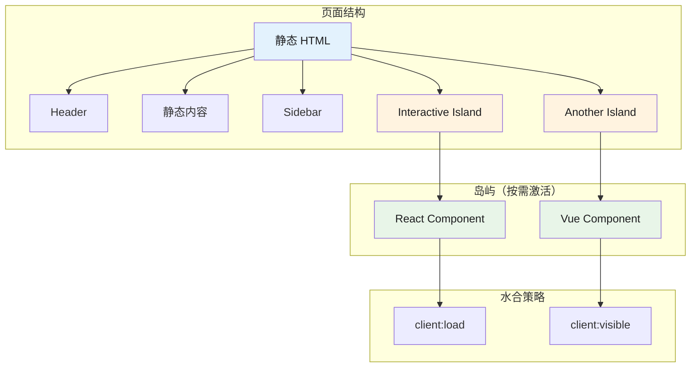
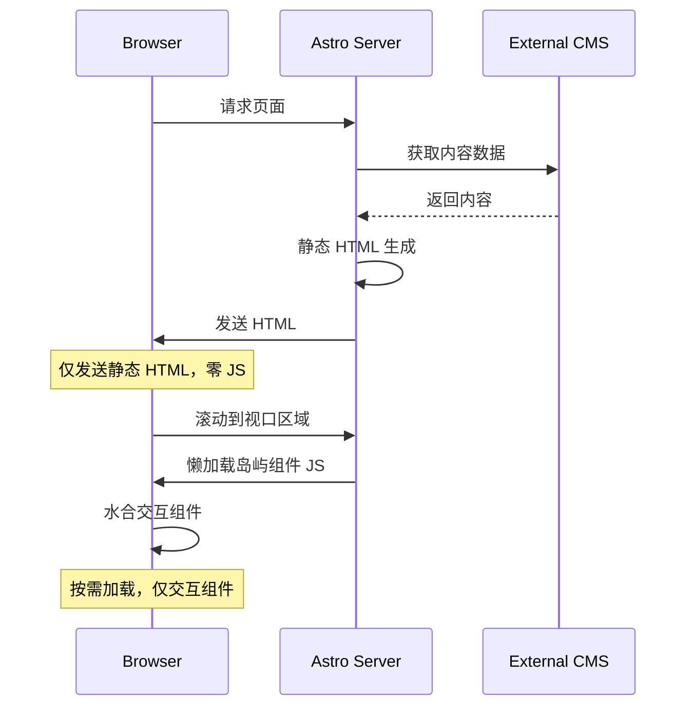
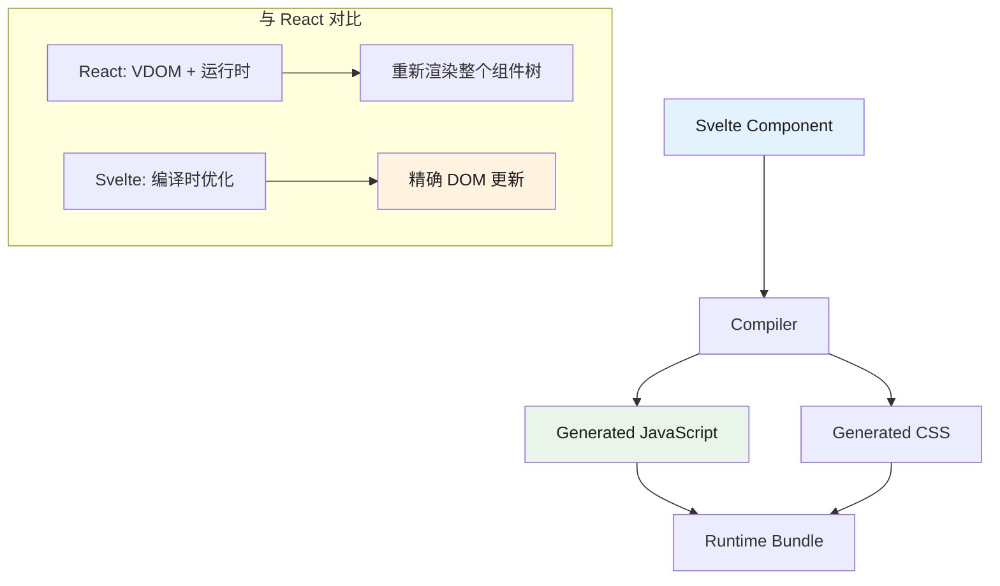
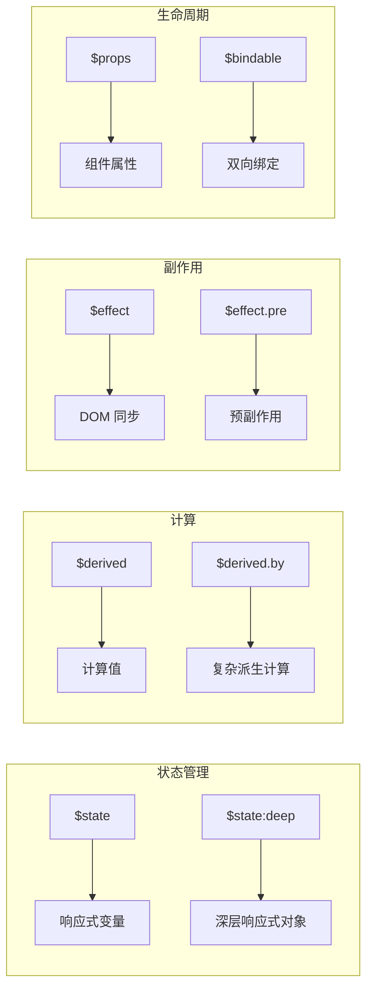
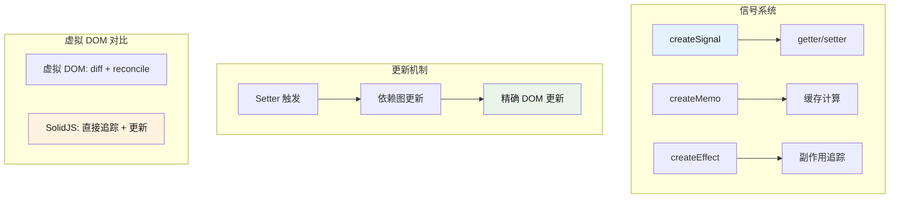
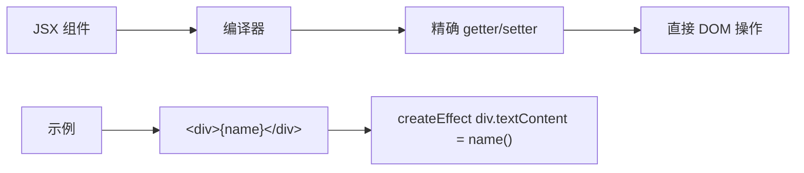
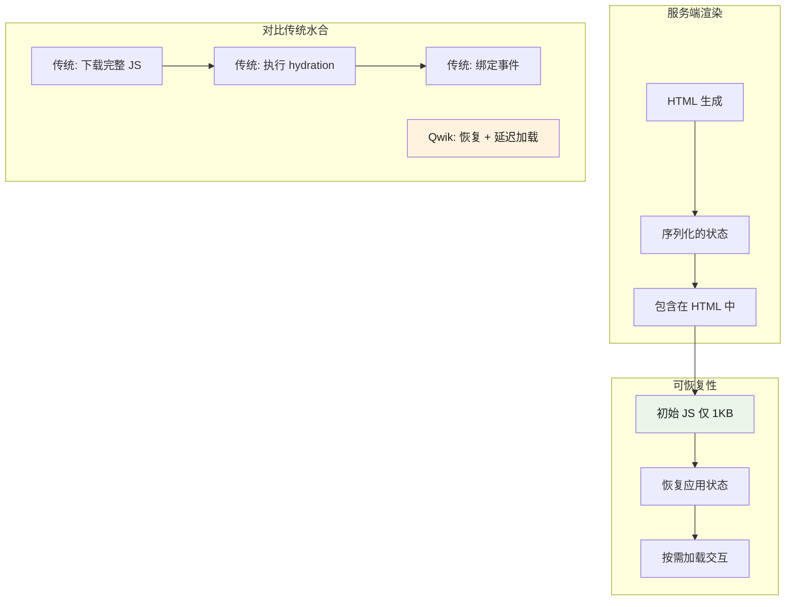

# 新范式：Astro、Svelte、Solid、Qwik

> 本文是「前端框架」系列第 2 篇（共 3 篇）。上一篇：[元框架：Next.js、Remix、Nuxt](meta-frameworks.md)　下一篇：[Bun 运行时与框架选型](runtime-and-selection.md)

## 1. Astro

### 1.1 简介

Astro 是一个内容驱动的 Web 框架，以"服务器优先"架构和"岛屿架构"（Islands Architecture）著称。Astro 5.0 带来内容层（Content Layer）、服务器岛屿（Server Islands）等新特性，默认发送零 JavaScript，适合内容密集型网站。官方支持 React、Vue、Svelte、Solid 等多种 UI 框架。

### 1.2 技术栈

| 类别 | 技术 |
|------|------|
| 核心语言 | Astro (HTML-first) |
| 组件支持 | React, Vue, Svelte, Solid, Preact, Lit, web components |
| 内容格式 | Markdown, MDX, Content Collections |
| 构建工具 | Vite |
| 部署适配器 | Vercel, Netlify, Cloudflare, AWS, Deno |

### 1.3 核心架构

#### 1.3.1 岛屿架构原理



#### 1.3.2 渲染流程



### 1.4 技术深度分析

#### 1.4.1 内容层（Content Layer）

Astro 5.0 引入的统一内容接口，支持多种数据源。

```typescript
// astro.config.mjs
import { defineConfig } from 'astro/config';
import mdx from '@astrojs/mdx';
import vercel from '@astrojs/vercel/static';

export default defineConfig({
  integrations: [mdx()],
  output: 'hybrid',
  adapter: vercel({
    imageService: true,
  }),
});
```

```typescript
// src/content.config.ts
import { defineCollection, z } from 'astro:content';
import { github } from '@astrojs/db';

// 定义内容集合
const blog = defineCollection({
  type: 'content',
  schema: z.object({
    title: z.string(),
    description: z.string(),
    pubDate: z.date(),
    updatedDate: z.date().optional(),
    author: z.string(),
    tags: z.array(z.string()),
    image: z.object({
      url: z.string(),
      alt: z.string(),
    }).optional(),
  }),
});

const products = defineCollection({
  type: 'data',
  schema: z.object({
    name: z.string(),
    price: z.number(),
    category: z.string(),
  }),
});

// 导出集合
export const collections = { blog, products };
```

```typescript
// src/lib/content.ts - 自定义内容源
import { defineCollection, getCollection } from 'astro:content';

const apiCollection = defineCollection({
  type: 'data',
  loader: async () => {
    const response = await fetch('https://api.example.com/products');
    const data = await response.json();
    
    return data.map(item => ({
      id: item.id,
      ...item,
    }));
  },
  schema: z.object({
    name: z.string(),
    price: z.number(),
  }),
});
```

#### 1.4.2 岛屿策略详解

Astro 提供多种岛屿水合策略，适用于不同场景：

```astro
---
import ReactCounter from '../components/ReactCounter.tsx';
import VueShoppingCart from '../components/VueShoppingCart.vue';
import SvelteSearch from '../components/SvelteSearch.svelte';
import HeavyChart from '../components/HeavyChart.svelte';
---

<!-- 1. client:load - 页面加载时立即水合 -->
<!-- 适用：小部件、导航、需要即时交互的组件 -->
<ReactCounter client:load initialCount={5} />

<!-- 2. client:idle - 浏览器空闲时水合 -->
<!-- 适用：非关键交互组件 -->
<ReactCounter client:idle initialCount={10} />

<!-- 3. client:visible - 进入视口时水合 -->
<!-- 适用：折叠面板、标签页、内容内嵌组件 -->
<VueShoppingCart client:visible />

<!-- 4. client:media="(max-width: 768px)" - 媒体查询匹配时水合 -->
<!-- 适用：响应式组件 -->
<SvelteSearch client:media="(max-width: 768px)" />

<!-- 5. client:only="react" - 仅客户端渲染，不 SSR -->
<!-- 适用：依赖浏览器 API 的组件 -->
<HeavyChart client:only="react" />
```

#### 1.4.3 服务端岛屿（Server Islands）

Astro 5.0 的创新功能，允许部分页面动态渲染：

```astro
---
// 获取静态数据
const { title, content } = await getStaticPageData();
---

<html>
  <head>
    <title>{title}</title>
  </head>
  <body>
    <header>
      <!-- 静态内容：CDN 缓存 -->
      <h1>{title}</h1>
      <p>{content}</p>
    </header>
    
    <main>
      <!-- 服务端岛屿：按需动态渲染 -->
      <astro:island 
        component="DynamicPricing" 
        props={{ productId: 123 }}
        client:visible
      />
      
      <!-- 服务端岛屿：用户特定内容 -->
      <astro:island 
        component="UserRecommendations" 
        props={{ userId: currentUser.id }}
        client:load
      />
    </main>
  </body>
</html>
```

#### 1.4.4 命令式岛屿（View Transitions）

```astro
---
// src/pages/blog/[slug].astro
import { getStaticPaths, getEntry } from 'astro:content';
import Layout from '../layouts/Layout.astro';

export function getStaticPaths() {
  return [
    { params: { slug: 'first-post' } },
    { params: { slug: 'second-post' } },
  ];
}

const { slug } = Astro.params;
const entry = await getEntry('blog', slug);
const { Content } = await entry.render();
---

<Layout>
  <article>
    <h1>{entry.data.title}</h1>
    <Content />
  </article>
</Layout>
```

```astro
---
import { ViewTransitions } from 'astro:transitions';
---

<head>
  <ViewTransitions />
</head>

<main>
  <!-- 页面内容 -->
</main>
```

### 1.5 组件集成

#### 1.5.1 与 React 集成

```tsx
// src/components/InteractiveButton.tsx
import { useState } from 'react';

interface Props {
  label: string;
  onClick?: () => void;
}

export default function InteractiveButton({ label, onClick }: Props) {
  const [count, setCount] = useState(0);
  
  return (
    <button 
      onClick={() => {
        setCount(c => c + 1);
        onClick?.();
      }}
      className="bg-blue-500 px-4 py-2 rounded"
    >
      {label} - Clicked {count} times
    </button>
  );
}
```

```astro
---
import InteractiveButton from './components/InteractiveButton.tsx';
---

<html>
  <body>
    <main>
      <h1>Welcome</h1>
      
      <!-- 在视口可见时激活 -->
      <InteractiveButton 
        client:visible 
        label="Click me" 
      />
    </main>
  </body>
</html>
```

#### 1.5.2 与 Vue 集成

```vue
<!-- src/components/Counter.vue -->
<template>
  <div class="counter">
    <p>Count: {{ count }}</p>
    <button @click="increment">+1</button>
  </div>
</template>

<script setup>
import { ref } from 'vue';

const count = ref(0);
const increment = () => count.value++;
</script>
```

```astro
---
import Counter from './components/Counter.vue';
---

<main>
  <Counter client:idle />
</main>
```

### 1.6 性能基准数据

| 指标 | Astro | Next.js | Gatsby | HTML 静态 |
|------|-------|---------|--------|-----------|
| 首屏 JS | 0KB | 85KB+ | 120KB+ | 0KB |
| TTFB | 极快 | 快 | 快 | 极快 |
| Lighthouse | 100 | 90+ | 85 | 100 |
| 懒加载延迟 | 即时 | 延迟 | 延迟 | 即时 |
| 岛屿水合 | 按需 | 整体 | 整体 | 无 |

### 1.7 优缺点分析

#### 1.7.1 优势

1. **零 JS 默认** - 极致性能，SEO 友好
2. **岛屿架构** - 按需水合，灵活控制
3. **多框架支持** - React/Vue/Svelte 混用
4. **内容优先** - Markdown/MDX 一等支持
5. **构建速度快** - Vite 驱动
6. **部署灵活** - 多平台适配器

#### 1.7.2 劣势

1. **生态较小** - 相比 Next.js 插件较少
2. **复杂交互受限** - 大量岛屿可能导致复杂性
3. **状态管理** - 不如 React 生态完善
4. **学习曲线** - 岛屿策略需要理解

### 1.8 选择理由

- **为什么选 Astro？**
  - 内容驱动的网站（博客、文档、营销页）
  - 需要极致首屏性能
  - SEO 为核心需求
  - 多框架组件混用
  - 大部分内容静态，少数交互

- **什么场景不适合？**
  - 全功能 SPA（用 Next.js/Nuxt 更合适）
  - 大量实时交互（复杂状态管理）
  - 团队不熟悉 SSR 概念

### 1.9 使用场景

- 内容网站（博客、文档、营销页）
- 需要 SEO 优化的静态站点
- 部分页面需要交互的混合站点
- 企业官网和作品集

### 1.10 快速开始

**JavaScript 版本：**

```astro
---
// src/pages/index.astro
import { getCollection } from 'astro:content';

// 服务端代码在 frontmatter 中执行
const posts = await getCollection('blog');
---

<html lang="en">
  <head>
    <title>My Blog</title>
  </head>
  <body>
    <h1>Latest Posts</h1>
    <ul>
      {posts.map(post => (
        <li>
          <a href={`/blog/${post.slug}`}>{post.data.title}</a>
        </li>
      ))}
    </ul>
  </body>
</html>
```

**TypeScript 版本：**

```typescript
// src/content/config.ts
// 第 1 段：引入 Astro 的内容集合基础设施
import { defineCollection, z } from 'astro:content';
// `astro:content` 是 Astro 提供的虚拟模块（virtual module），由 Astro 的 Vite 插件在构建期注入，
// 因此在纯 tsc / node 环境下直接运行会报"找不到模块"——它必须跑在 Astro 的编译管线里。
// z 是 Astro 内置再导出的 zod，用它做 schema 可以避免项目里再装一份 zod 导致版本不一致。

// 第 2 段：声明 blog 集合的形态与字段契约
const blogCollection = defineCollection({
  type: 'content', // 标记为"内容集合"，条目对应 src/content/blog 下的 Markdown/MDX 文件；Astro 5 起该字段为兼容保留项
  schema: z.object({
    // schema 在构建期对每条 frontmatter 做校验+类型推导：校验失败会直接中断构建并指出具体文件，
    // 这是把"运行时才崩"提前到"编译期报错"的关键；同时它让 getCollection('blog') 的返回值自带类型
    title: z.string(),
    description: z.string(),
    pubDate: z.date(), // 注意：这里能通过，是因为 YAML 会把未加引号的 2024-01-01 解析成 Date；若写成 '2024-01-01' 字符串则会校验失败，需要用 z.coerce.date() 兜底
    author: z.string(),
  }),
  // 提示：这里没写 transform，所以 schema 只做校验与裁剪，不改变数据形状；若想让 pubDate 变成格式化字符串，应在此处加 transform
});

// 第 3 段：把集合注册给 Astro（必须是名为 collections 的具名导出）
export const collections = {
  blog: blogCollection, // 对象的 key 就是后续 getCollection('blog') / getEntry('blog', slug) 使用的集合名，改名会波及所有调用点
  // 新增集合时在此追加即可，无需改任何页面代码；复杂度为 O(1)，此处只是一张静态映射表
};
```
```astro
---
// src/pages/blog/[...slug].astro
import { getCollection } from 'astro:content';
import type { CollectionEntry } from 'astro:content';

export async function getStaticPaths() {
  const blogEntries = await getCollection('blog');
  return blogEntries.map(entry => ({
    params: { slug: entry.slug },
    props: { entry },
  }));
}

interface Props {
  entry: CollectionEntry<'blog'>;
}

const { entry } = Astro.props;
const { Content } = await entry.render();
---

<html>
  <head>
    <title>{entry.data.title}</title>
  </head>
  <body>
    <h1>{entry.data.title}</h1>
    <time>{entry.data.pubDate.toLocaleDateString()}</time>
    <article>
      <Content />
    </article>
  </body>
</html>
```

**岛屿架构 - 与 React 组件集成：**

```astro
---
import BuyButton from '../components/BuyButton.jsx';
import { getProductDetails } from 'ecommerce-package';

const product = await getProductDetails(Astro.params.slug);
---

<ProductPageLayout>
  
  <h2>{product.name}</h2>
  <!-- client:load 表示立即加载，client:visible 表示视口可见时加载 -->
  <BuyButton id={product.id} client:load />
</ProductPageLayout>
```

### 1.11 真实应用案例

| 公司/项目 | 使用场景 | 规模 |
|-----------|---------|------|
| Firebase 文档 | 技术文档 | 超大型 |
| GitLab 文档 | 产品文档 | 大型 |
| NVIDIA 营销 | 营销页面 | 中型 |
| Mailchimp 博客 | 内容站点 | 中型 |
| The Oddit | 电商 | 中型 |

### 1.12 参考链接

- [Astro 官方文档](https://astro.build/docs/)
- [Astro 5.0 博客](https://astro.build/blog/astro-5/)
- [Astro GitHub](https://github.com/withastro/astro)

## 2. Svelte 5

### 2.1 简介

Svelte 是一个编译型框架，组件在构建时转换为高效的 imperative 代码，而非虚拟 DOM 运行时。Svelte 5 引入 Runes 系统，提供更强大的响应式原语，替代了之前的 `$:` 语法。新版本同时改进性能、SSR 和开发体验。

### 2.2 技术栈

| 类别 | 技术 |
|------|------|
| 核心框架 | Svelte 5 |
| 编译目标 | Vanilla JS + CSS |
| 响应式系统 | Runes ($state, $derived, $effect) |
| 构建工具 | Vite |
| 部署 | 任何静态托管 / SSR 运行时 |

### 2.3 核心架构

#### 2.3.1 编译原理



#### 2.3.2 Runes 系统



### 2.4 技术深度分析

#### 2.4.1 Runes 系统详解

Svelte 5 的 Runes 系统提供了更精确的响应式控制：

**1. $state - 响应式状态**

```svelte
<script lang="ts">
  // 基础响应式变量
  let count = $state(0);
  
  // 深层响应式对象
  let user = $state({
    name: 'Alice',
    profile: {
      age: 25,
      preferences: ['reading', 'coding']
    }
  });
  
  // 数组响应式
  let items = $state<string[]>([]);
  
  function increment() {
    count++;
  }
  
  function updateUserName() {
    user.name = 'Bob';
  }
  
  function addItem() {
    items = [...items, `Item ${items.length + 1}`];
  }
  
  function updateNested() {
    user.profile.preferences.push('gaming');
  }
</script>
```

**2. $derived - 派生计算**

```svelte
<script lang="ts">
  let price = $state(100);
  let quantity = $state(2);
  let discount = $state(0.1);
  
  // 简单派生
  const subtotal = $derived(price * quantity);
  
  // 复杂派生
  const total = $derived.by(() => {
    const base = price * quantity;
    const discountAmount = base * discount;
    return base - discountAmount;
  });
  
  // 派生数组
  const numbers = $state([1, 2, 3, 4, 5]);
  const doubled = $derived(numbers.map(n => n * 2));
  const sum = $derived(numbers.reduce((a, b) => a + b, 0));
</script>
```

**3. $effect - 副作用处理**

```svelte
<script lang="ts">
  let count = $state(0);
  let name = $state('Alice');
  
  // 自动依赖追踪
  $effect(() => {
    console.log(`Count changed: ${count}`);
    document.title = `Count: ${count}`;
  });
  
  // 清理函数
  $effect(() => {
    const interval = setInterval(() => {
      console.log('tick');
    }, 1000);
    
    return () => clearInterval(interval);
  });
  
  // 指定依赖
  $effect(() => {
    console.log(`Name changed: ${name}`);
  }, { name }); // 只在 name 变化时触发
  
  // 预副作用（同步）
  $effect.pre(() => {
    console.log('Runs before DOM update');
  });
</script>
```

**4. $props - 属性传递**

```svelte
<!-- Child.svelte -->
<script lang="ts">
  interface Props {
    title: string;
    count?: number;
    onIncrement?: () => void;
    // 可变属性
    value?: { current: number };
  }
  
  let { 
    title, 
    count = 0, 
    onIncrement,
    value = $bindable(0)
  }: Props = $props();
  
  function handleClick() {
    count++;
    onIncrement?.();
  }
  
  function updateValue() {
    value = { current: value.current + 1 };
  }
</script>
```

**5. $bindable - 双向绑定**

```svelte
<!-- Parent.svelte -->
<script lang="ts">
  import Child from './Child.svelte';
  
  let value = $state({ current: 10 });
</script>

<Child bind:value={value} />
<p>Value in parent: {value.current}</p>
```

#### 2.4.2 组件通信

```svelte
<!-- Event handlers -->
<script lang="ts">
  let { onNotify } = $props<{ onNotify?: (msg: string) => void }>();
  
  function notify() {
    onNotify?.('Hello from child');
  }
</script>

<!-- Context API -->
<script lang="ts">
  import { getContext, setContext } from 'svelte';
  
  const themeKey = Symbol('theme');
  
  setContext(themeKey, $state({
    dark: true,
    toggle() {
      this.dark = !this.dark;
    }
  }));
  
  const theme = getContext(themeKey);
</script>

<!-- 插槽 -->
<script lang="ts">
  let { children } = $props();
</script>

<div class="container">
  {@render children()}
</div>
```

### 2.5 SvelteKit SSR

```typescript
// src/routes/+page.server.ts
export async function load({ fetch, cookies }) {
  const response = await fetch('https://api.example.com/data');
  const data = await response.json();
  
  return {
    items: data.items,
    user: cookies.get('user'),
    timestamp: new Date().toISOString(),
  };
}
```

```svelte
<!-- src/routes/+page.svelte -->
<script lang="ts">
  let { data } = $props();
  
  let filter = $state('');
  
  const filteredItems = $derived(
    data.items.filter(item => 
      item.name.toLowerCase().includes(filter.toLowerCase())
    )
  );
</script>

<h1>Data from Server</h1>
<p>Loaded at: {data.timestamp}</p>

<input bind:value={filter} placeholder="Filter..." />

<ul>
  {#each filteredItems as item}
    <li>{item.name}</li>
  {/each}
</ul>
```

### 2.6 路由与布局

```typescript
// src/routes/+layout.svelte
<script lang="ts">
  // 第 1 段：组件入参与全局主题状态声明
  // Svelte 5 使用 runes($props/$state)替代旧的 export let / 响应式赋值；
  // 这里 children 是从父级传入的"渲染片段"(snippet)，本质是可调用的渲染函数，
  // 稍后用 {@render children()} 才会真正把子页面内容插入布局。
  let { children } = $props();
  // theme 用 $state 声明为响应式：任何重新赋值都会触发依赖它的模板区域增量重渲染；
  // 初始值 'light' 决定了首屏不带 dark 类，避免暗色闪烁。
  let theme = $state('light');
</script>

// 第 2 段：布局根容器与暗色主题绑定
// 注意此处只在 <div> 上挂 class，theme 需要在祖先节点生效，
// 这样内部子页面也能通过 CSS 层叠（如 .dark main { ... }）继承到主题样式；
// class:dark 是 Svelte 的类指令，true 时添加 dark 类、false 时移除，等价于手写模板字符串但无多余空白。
<div class:dark={theme === 'dark'}>
  // 第 3 段：导航区（静态、与主题无关）
  // 导航链接由布局统一维护，所有路由共享；此处无需响应式依赖，
  // 因此 theme 变化不会重建这部分 DOM，利于渲染性能。
  <nav>
    <a href="/">Home</a>
    <a href="/about">About</a>
  </nav>
  
  // 第 4 段：内容插槽 —— 布局的核心职责
  // {@render children()} 才是布局真正"包裹"子路由的位置：
  // 父级传入的 snippet 在此被调用并返回 DOM，实现单点布局 + 多页面复用；
  // 易错点：children 必须调用（加括号），漏掉括号不会渲染出任何内容。
  <main>
    {@render children()}
  </main>
  
  // 第 5 段：主题切换按钮与副作用入口
  // onclick 内联箭头函数在点击时重新赋值 theme，触发 class:dark 重新求值；
  // 依赖 $state 的响应式，这里无需手动操作 DOM 或 classList；
  // 易错点：该状态位于组件实例内，刷新后不持久化，如需记住需配合 localStorage/服务端。
  <button onclick={() => theme = theme === 'light' ? 'dark' : 'light'}>
    Toggle Theme
  </button>
</div>
```
```typescript
// src/routes/api/users/+server.ts
export async function GET({ url }) {
  const limit = Number(url.searchParams.get('limit') || 10);
  const users = await getUsers(limit);
  
  return Response.json(users);
}

export async function POST({ request }) {
  const body = await request.json();
  const user = await createUser(body);
  
  return Response.json(user, { status: 201 });
}
```

### 2.7 性能基准数据

| 指标 | Svelte 5 | React 19 | Vue 3 | SolidJS |
|------|----------|----------|-------|---------|
| Bundle Size | 1.5KB | 45KB | 33KB | 7KB |
| 运行时开销 | 极低 | 中等 | 中等 | 极低 |
| 初始渲染 | 极快 | 快 | 快 | 极快 |
| 更新性能 | 极快 | 快 | 快 | 极快 |
| 内存占用 | 低 | 中等 | 中等 | 低 |

### 2.8 优缺点分析

#### 2.8.1 优势

1. **编译时优化** - 无虚拟 DOM，直接操作 DOM
2. **极小包体积** - 运行时极小
3. **Runes 系统** - 精确响应式控制
4. **优秀开发者体验** - 简单语法，清晰错误
5. **CSS 作用域** - 组件级样式封装
6. **TypeScript 一等支持** - 类型安全

#### 2.8.2 劣势

1. **生态系统较小** - 相比 React/Vue 插件少
2. **团队熟悉度** - 学习曲线存在
3. **大型应用复杂性** - 状态管理需谨慎
4. **SEO 支持** - SSR 相对新生

### 2.9 选择理由

- **为什么选 Svelte 5？**
  - 需要极致性能
  - 小型到中型应用
  - 包体积敏感场景
  - 喜欢声明式语法但不喜欢虚拟 DOM

- **什么场景不适合？**
  - 大型企业级应用（React 更成熟）
  - 需要丰富生态的场景
  - 团队不熟悉编译型框架

### 2.10 使用场景

- 需要极致性能的 Web 应用
- 小型到中型的应用
- 交互式数据可视化
- 需要小巧包体积的应用

### 2.11 快速开始

**TypeScript 版本：**

```svelte
<!-- src/lib/Counter.svelte -->
<script lang="ts">
  // Svelte 5 Runes 语法
  let count = $state(0);
  const doubled = $derived(count * 2);
  
  function increment() {
    count++;
  }
  
  $effect(() => {
    console.log(`Count changed to: ${count}`);
  });
</script>

<main>
  <p>Count: {count}</p>
  <p>Doubled: {doubled}</p>
  <button onclick={increment}>Click me</button>
</main>
```

**JavaScript 版本：**

```svelte
<!-- src/App.svelte -->
<script>
  import Counter from './lib/Counter.svelte';
  
  let name = $state('World');
  let items = $state([]);
  
  function addItem() {
    items = [...items, `Item ${items.length + 1}`];
  }
</script>

<h1>Hello {name}!</h1>

<input bind:value={name} placeholder="Enter name" />

{#if items.length > 0}
  <ul>
    {#each items as item, i}
      <li>{i + 1}. {item}</li>
    {/each}
  </ul>
{/if}

<button onclick={addItem}>Add Item</button>
<Counter />
```

**使用 SvelteKit 进行 SSR：**

```typescript
// src/routes/+page.server.ts
export async function load() {
  const response = await fetch('https://api.example.com/data');
  const data = await response.json();
  
  return {
    items: data.items,
    timestamp: new Date().toISOString(),
  };
}
```

```svelte
<!-- src/routes/+page.svelte -->
<script>
  let { data } = $props();
</script>

<h1>Data from Server</h1>
<p>Loaded at: {data.timestamp}</p>
<ul>
  {#each data.items as item}
    <li>{item.name}</li>
  {/each}
</ul>
```

### 2.12 真实应用案例

| 公司/项目 | 使用场景 | 规模 |
|-----------|---------|------|
| Spotify | 播放列表管理 | 大型 |
| IBM | 企业工具 | 中型 |
| Netflix | 部分前端 | 中型 |
| World Wide Fund | 营销站点 | 小型 |
| Chess.com | 游戏界面 | 中型 |

### 2.13 参考链接

- [Svelte 5 发布博客](https://svelte.dev/blog/svelte-5-is-here)
- [Svelte 文档](https://svelte.dev/docs)
- [Svelte GitHub](https://github.com/sveltejs/svelte)

## 3. SolidJS

### 3.1 简介

SolidJS 是一个用于构建用户界面的声明式 JavaScript 库，采用细粒度响应式系统，无需虚拟 DOM。所有更新直接操作真实 DOM，实现了接近原生的性能。SolidJS 拥有 JSX 语法和 TypeScript 一等支持，与 React 语法相似但行为不同。

### 3.2 技术栈

| 类别 | 技术 |
|------|------|
| 核心框架 | SolidJS |
| 语法 | JSX |
| 响应式系统 | Signals / Memos / Effects |
| 路由 | @solidjs/router |
| 状态管理 | createSignal, createStore |
| 构建工具 | Vite |

### 3.3 核心架构

#### 3.3.1 响应式系统原理



#### 3.3.2 编译时优化



### 3.4 技术深度分析

#### 3.4.1 Signals 响应式原语

```typescript
// src/App.tsx
import { createSignal, createMemo, createEffect, For, Show } from 'solid-js';
import { render } from 'solid-js/web';

// 基础信号
const [count, setCount] = createSignal(0);
const [name, setName] = createSignal('Alice');

// 派生计算 - 自动缓存
const doubled = createMemo(() => count() * 2);
const greeting = createMemo(() => `Hello, ${name()}!`);

// 副作用 - 自动依赖追踪
createEffect(() => {
  console.log(`Count: ${count()}, Doubled: ${doubled()}`);
  document.title = `Count: ${count()}`;
});

// 数组信号
const [items, setItems] = createSignal<string[]>([]);

// 更新函数
function addItem() {
  setItems(prev => [...prev, `Item ${prev.length + 1}`]);
}

function reset() {
  setCount(0);
  setName('Guest');
  setItems([]);
}
```

#### 3.4.2 JSX 与响应式集成

```tsx
// 响应式属性
function UserCard() {
  const [user, setUser] = createSignal({
    name: 'Alice',
    avatar: '/avatar.png',
    online: true
  });
  
  return (
    <div class="card">
      
      <h2>{user().name}</h2>
      <span class:hidden={!user().online}>
        Online
      </span>
    </div>
  );
}

// 动态样式
function StyledBox() {
  const [color, setColor] = createSignal('blue');
  const [size, setSize] = createSignal(100);
  
  return (
    <div 
      style={{
        'background-color': color(),
        'width': `${size()}px`,
        'height': `${size()}px`
      }}
    />
  );
}
```

#### 3.4.3 控制流组件

```tsx
// 第 1 段：整体定位（同一文件演示 SolidJS 三种控制流组件）
// 这三个组件共享同一前提：Solid 的组件函数只执行一次，render 期间建立的信号是"长期存活"的响应式源，
// 后续更新靠细粒度追踪直接改 DOM，而不是重新执行函数、重建整棵 JSX。理解这一点才能看懂下面每一段的意图。
// For 组件 - 高效列表渲染
function ItemList() {
  // 第 2 段：列表数据源（读写成对出现）
  // createSignal 返回 [getter, setter]：items 是函数而非数组，必须 items() 才能取值并登记依赖；
  // 直接写 <For each={items}> 会拿不到更新，这是 Solid 与 React 心智模型最主要的分歧点。
  const [items, setItems] = createSignal([
    { id: 1, text: 'Item 1' },
    { id: 2, text: 'Item 2' },
    { id: 3, text: 'Item 3' },
  ]);
  
  return (
    <ul>
      // 第 3 段：For 的键控协调（keyed reconciliation）
      // 默认以数组元素的"引用身份"作 key：增删/重排时复用并移动已有 DOM 节点，只对真正变化的行做更新，
      // 复杂度为 O(n) 的 diff + 必要的最小 DOM 操作，优于整体 innerHTML 重建。
      // 易错点：若每次 setItems 都用 map 生成全新对象，引用全变，For 会判定所有行都是新元素而整表重建。
      <For each={items()}>
        {(item, index) => (
          // index 同样是访问器（Accessor<number>）而非数字，必须 index() 才取值；
          // 这也是 For 能在前面插入行后仍保持"位置序号"实时的原因。
          <li>
            {index() + 1}. {item.text}
            // 第 4 段：删除一行（按 id 过滤，函数式更新）
            // 用 setItems(prev => ...) 而非引用外部 items()，避免闭包捕获旧值导致的更新丢失（stale closure）；
            // item 由 For 逐行传入，对该行是稳定引用，因此这里捕获它是安全的。
            // 边界：空数组时 For 不渲染任何节点（本段未提供 fallback，UI 会呈现空 <ul>）。
            <button onClick={() => setItems(prev => 
              prev.filter(i => i.id !== item.id)
            )}>
              Delete
            </button>
          </li>
        )}
      </For>
    </ul>
  );
}

// Show 组件 - 条件渲染
function UserStatus() {
  // 第 5 段：可空状态（用 null 表示未登录）
  // 显式标注 `null | { name: string }` 让 TS 在下方强制我们处理"未登录"分支，
  // 也解释了后面为什么需要 `!`：类型收窄信息不会自动穿过 Show 的 JSX children。
  const [user, setUser] = createSignal<null | { name: string }>(null);
  
  return (
    <div>
      // 第 6 段：Show 基础用法（when + fallback）
      // when 为假值时渲染 fallback，为真时渲染 children；切换是"挂载/卸载"而非隐藏，子树的副作用与状态随之销毁重建。
      // user()! 的非空断言是必要的妥协：Solid 无法把 when 的求值结果反向传递到类型层，这里由人肉保证安全性。
      <Show 
        when={user()} 
        fallback={<p>Please log in</p>}
      >
        <p>Welcome, {user()!.name}!</p>
      </Show>
      
      // 第 7 段：Show 的函数式子节点（类型收窄 + 免重建）
      // children 写成函数时，参数是 Accessor<NonNullable<T>>，即"一定非空"的值访问器：
      // 既省掉 `!`，又能让这段内容在真值期间被记忆化复用——when 从同一个真值到另一个真值时不会无谓重建。
      // 代价是必须用 currentUser() 取值，不能当成对象直接用。
      <Show when={user()}>
        {(currentUser) => (
          <p>Logged in as: {currentUser().name}</p>
        )}
      </Show>
    </div>
  );
}

// Switch/Match - 多条件
function StatusBadge() {
  // 第 8 段：枚举型状态的信号
  // 用字面量联合类型把取值限制在三态之内，让 Switch 分支穷尽性一目了然；
  // setStatus 在本片段中未被调用，属于保留给外部触发（如轮询/SSE）的写入器，并非死代码。
  const [status, setStatus] = createSignal<'pending' | 'active' | 'error'>('pending');
  
  return (
    // 第 9 段：Switch/Match 的短路匹配
    // Switch 自上而下求值每个 Match 的 when，命中第一个真值即停止并只挂载该分支；全不命中才用 fallback。
    // 与一堆嵌套 Show 相比，它只保留"当前命中"这一份 DOM 与状态，切换时旧分支被销毁，天然避免多分支同时存活的隐藏开销。
    // 易错点：顺序即优先级（把宽松条件写在前面会吞掉后面的分支）；这里的 when 是布尔表达式，与 Show 接收"任意值"不同。
    <Switch fallback={<span>Unknown</span>}>
      <Match when={status() === 'pending'}>
        <span class="badge warning">Pending</span>
      </Match>
      <Match when={status() === 'active'}>
        <span class="badge success">Active</span>
      </Match>
      <Match when={status() === 'error'}>
        <span class="badge error">Error</span>
      </Match>
    </Switch>
  );
}
```
#### 3.4.4 状态管理

```typescript
// createStore - 深层响应式对象
import { createStore } from 'solid-js/store';

const [state, setState] = createStore({
  user: {
    name: 'Alice',
    preferences: {
      theme: 'dark',
      language: 'en'
    }
  },
  posts: [] as Post[],
  loading: false
});

// 路径更新
function updateTheme(theme: string) {
  setState('user', 'preferences', 'theme', theme);
}

function addPost(post: Post) {
  setState('posts', posts => [...posts, post]);
}

function removePost(postId: string) {
  setState('posts', posts => posts.filter(p => p.id !== postId));
}
```

```typescript
// 跨组件状态共享
// src/store.ts
// 第 1 段：依赖导入与类型契约——先把“状态长什么样”和“谁有权改状态”钉死
// 为什么把类型放在最前面：Solid 的 store 是建立在 Proxy 上的响应式代理，类型写清楚后，
// setState 的路径写法才能拿到编译期校验（字段名拼错、值域越界会立刻报错而不是运行时才炸）。
// 注意：User 未在本模块声明，默认由外部类型定义提供；主题用内联字面量联合而非 enum，
// 是为了让 if (theme === 'dark') 这类判断能被 TS 自动收窄。
import { createContext, useContext, ParentComponent } from 'solid-js';
import { createStore } from 'solid-js/store';

interface AppState {
  user: User | null;
  theme: 'light' | 'dark';
}

// StoreValue 刻意把「只读状态」与「可写动作」拆成两个字段：
// 消费方拿到 state 只能读（顺应 store 的使用直觉），想改必须走 actions，
// 于是所有写入点被收敛到一处，未来加日志、鉴权或持久化都只需改 Provider。
interface StoreValue {
  state: AppState;
  actions: {
    login: (user: User) => void;
    logout: () => void;
    setTheme: (theme: 'light' | 'dark') => void;
  };
}

// 第 2 段：创建 Context 通道——只定义一个“标识”，不放任何默认实现
// 这里故意不传默认值，导致 useContext 的返回类型是 StoreValue | undefined；
// 这个 undefined 正是第 6 段那道运行时守卫存在的理由。
// 易错点：别在这里塞默认对象，否则忘记包 Provider 时错误会被静默吞掉，
// 组件照常运行但状态与全局脱节，排查成本极高。
const StoreContext = createContext<StoreValue>();

// 第 3 段：StoreProvider——全应用响应式状态的唯一拥有者
// ParentComponent 是 Solid 对“带 children 的组件”的类型别名（children 为可选属性）。
// 关键前提：Solid 组件只在挂载时执行一次，不随状态变化重跑，
// 因此下面的 createStore 与 actions 在整个应用生命周期内只会被创建一次。
export const StoreProvider: ParentComponent = (props) => {
  // createStore 返回 [只读代理, setter] 二元组：读取 state.user 只会订阅 user 这一个字段，
  // 改动 theme 不会触发该订阅者更新——这是 Solid 细粒度响应式区别于全量 diff 的核心。
  const [state, setState] = createStore<AppState>({
    user: null,
    theme: 'light'
  });
  
  // 第 4 段：actions——用“路径式 setState”写入，保住更新粒度
  // 易错点：若写成 setState({ user }) 会走对象合并分支，结果看似相同，
  // 但路径写法 setState('user', user) 语义更窄、意图更明确，也只触碰目标字段。
  // 复杂度：三者均为 O(1)，无需展开或重建整个 state。
  // 又因为这些函数是稳定引用（Provider 只跑一次），可以安全地当依赖项或直接下传。
  const actions = {
    login: (user: User) => setState('user', user),
    logout: () => setState('user', null),
    setTheme: (theme: 'light' | 'dark') => setState('theme', theme)
  };
  
  // 第 5 段：注入值——state 是响应式代理，actions 是普通对象
  // 数据流：Provider 注入 { state, actions } → 任意后代经 useStore() 取用 →
  // 读 state.xxx 建立订阅、调 actions.xxx 触发更新，形成单向闭环，无需逐层透传 props。
  // 易错点：此处的 JSX 会被编译成 getter，value 里的对象字面量每次求值都会重新创建；
  // 好在 state 与 actions 本身是稳定引用，内容对比并无变化，实践中通常无碍，
  // 若确实需要稳定引用，可先把 value 提取为变量再传入。
  return (
    <StoreContext.Provider value={{ state, actions }}>
      {props.children}
    </StoreContext.Provider>
  );
};

// 第 6 段：useStore——消费入口，把“可能为 undefined”收敛成“必定可用”
// 不直接对外暴露 useContext 与 StoreContext，是为了让调用方无法绕过这道守卫，
// 同时把内部键名藏起来，后续重命名 Context 不会波及使用方。
// 用 throw 而非返回 null：一能让类型系统自动把 context 收窄为 StoreValue（函数不会正常
// 带着 undefined 返回），二能把误用暴露在开发期最近的位置，避免状态读不到却静默降级。
// 边界条件：必须在组件或响应式作用域内调用——Solid 的 useContext 依赖组件所有权上下文，
// 在普通工具函数、异步回调或事件监听里调用会取不到值。
export function useStore() {
  const context = useContext(StoreContext);
  if (!context) throw new Error('useStore must be used within StoreProvider');
  return context;
}
```
#### 3.4.5 路由系统

```tsx
// src/App.tsx
// 第 1 段：依赖引入（引入 SolidJS 路由系统的三个核心导出）
// Router 是路由容器（负责匹配 URL 并渲染对应组件），Route 是单个路由规则，
// A 是路由感知的 <a> 替代品：它会在客户端做软导航（不整页刷新），
// 并自动为当前激活链接加上 aria-current="page"，便于做高亮样式。
import { Router, Route, A } from '@solidjs/router';

// 第 2 段：布局组件（所有页面共享的外壳）
// 关键数据流：Router 会把匹配到的页面组件作为 children 注入到 root 组件中，
// 因此这里只负责渲染导航 + <main> 插槽，具体页面内容由子路由决定。
// 易错点：Solid 中 props 是只读的 getter，不能用解构（{ children } = props）取 children，
// 否则会脱离响应式追踪、失去更新能力，所以这里写成 props.children。
function Layout(props: { children: any }) {
  return (
    <div>
      <nav>
        <A href="/">Home</A>
        <A href="/about">About</A>
        <A href="/users">Users</A>
      </nav>
      <main>{props.children}</main>
    </div>
  );
}

// 第 3 段：静态页面组件（无参数、无状态，仅输出一段标题）
// 这三个组件是最简单的叶子路由目标，复杂度 O(1)，纯粹用于演示路由切换。
function Home() {
  return <h1>Welcome</h1>;
}

function About() {
  return <h1>About</h1>;
}

function Users() {
  return <h1>Users</h1>;
}

// 第 4 段：带参数的详情页组件
// 它本身不认识 URL，只接收父级路由通过 props.params 解析出来的 id，
// 这样组件保持纯粹、可复用（也便于脱离路由单独测试）。
// 边界条件：id 来源是 URL 片段，天然是 string；若后端要求数字需自行转换，
// 且它是用户可控输入，渲染/查询前应做校验，避免注入或越界。
function UserProfile(props: { id: string }) {
  return <h1>User {props.id}</h1>;
}

// 第 5 段：路由表装配（App 作为 Router 的唯一入口）
// root={Layout} 指定全局布局，Router 匹配成功后把命中的 Route 组件塞进 Layout 的 children。
function App() {
  return (
    <Router root={Layout}>
      <Route path="/" component={Home} />
      <Route path="/about" component={About} />
      <Route path="/users" component={Users} />
      // 第 6 段：动态路由（:id 是路径参数占位符）
      // 匹配优先级：/users/:id 比静态的 /users 更具体，因此访问 /users/42 会落到这里，
      // 而 /users 仍命中上面的 Users。props.params.id 即占位符的实际值。
      // 易错点：这里把 component 写成内联箭头函数，每次渲染都会产生新函数引用，
      // 对纯展示无害，但若该组件内部依赖 onMount/状态保持，建议抽成独立组件或用 memo，
      // 否则可能触发不必要的重新创建。
      <Route path="/users/:id" component={(props) => 
        <UserProfile id={props.params.id} />
      } />
    </Router>
  );
}
```
### 3.5 SolidStart SSR

```tsx
// src/routes/index.tsx
import { createAsync } from '@solidjs/router';
import { For, Show } from 'solid-js';

export default function Home() {
  // 服务端数据获取
  const posts = createAsync(() => 
    fetch('/api/posts').then(r => r.json())
  );
  
  return (
    <div>
      <h1>Posts</h1>
      <Show when={posts()} fallback={<p>Loading...</p>}>
        <For each={posts()}>
          {post => (
            <article>
              <h2>{post.title}</h2>
              <p>{post.excerpt}</p>
            </article>
          )}
        </For>
      </Show>
    </div>
  );
}
```

```tsx
// src/routes/users/[id].tsx
import { createAsync, useParams } from '@solidjs/router';
import { Show } from 'solid-js';

export default function UserProfile() {
  const params = useParams();
  
  const user = createAsync(() => 
    fetch(`/api/users/${params.id}`).then(r => r.json())
  );
  
  return (
    <Show when={user()} fallback={<p>Loading user...</p>}>
      <div>
        <h1>{user()!.name}</h1>
        <p>{user()!.email}</p>
      </div>
    </Show>
  );
}
```

### 3.6 性能基准数据

| 指标 | SolidJS | React 19 | Svelte 5 | Vue 3 |
|------|---------|----------|-----------|-------|
| Bundle Size | 7KB | 45KB | 1.5KB | 33KB |
| 运行时开销 | 极低 | 中等 | 极低 | 中等 |
| 更新性能 | 最快 | 快 | 快 | 快 |
| 内存占用 | 最低 | 中等 | 低 | 中等 |
| 初始渲染 | 极快 | 快 | 极快 | 快 |

### 3.7 优缺点分析

#### 3.7.1 优势

1. **极高性能** - 无虚拟 DOM，细粒度更新
2. **精确响应式** - 只更新必要的 DOM 节点
3. **与 React 相似** - 较低的迁移成本
4. **TypeScript 支持** - 一等类型支持
5. **小包体积** - 运行时仅 7KB
6. **SSR 支持** - SolidStart 提供服务端渲染

#### 3.7.2 劣势

1. **生态较小** - 相比 React 社区和库少
2. **JSX 语法** - 与 React 混淆可能
3. **学习曲线** - 响应式系统需要适应
4. **第三方集成** - React 生态库不兼容

### 3.8 选择理由

- **为什么选 SolidJS？**
  - 需要极致性能
  - 从 React 迁移
  - 实时数据可视化/仪表板
  - 游戏 UI

- **什么场景不适合？**
  - 需要丰富生态的场景
  - 不熟悉响应式编程
  - 大型企业应用（需更成熟生态）

### 3.9 使用场景

- 需要极致性能的应用
- 实时数据可视化/仪表板
- 游戏 UI
- 对包体积敏感的应用

### 3.10 快速开始

**TypeScript 版本：**

```typescript
// src/App.tsx
import { createSignal, createEffect, For } from 'solid-js';
import { render } from 'solid-js/web';

function App() {
  const [count, setCount] = createSignal(0);
  const [items, setItems] = createSignal<string[]>([]);
  
  const doubled = () => count() * 2;
  
  createEffect(() => {
    console.log('Count changed:', count());
  });
  
  const addItem = () => {
    setItems(prev => [...prev, `Item ${prev.length + 1}`]);
  };
  
  return (
    <div>
      <h1>SolidJS Counter</h1>
      <p>Count: {count()}</p>
      <p>Doubled: {doubled()}</p>
      <button onClick={() => setCount(c => c + 1)}>Increment</button>
      
      <hr />
      
      <h2>Items ({items().length})</h2>
      <button onClick={addItem}>Add Item</button>
      <ul>
        <For each={items()}>
          {(item, index) => (
            <li>{index() + 1}. {item}</li>
          )}
        </For>
      </ul>
    </div>
  );
}

render(() => <App />, document.getElementById('root')!);
```

**JavaScript 版本：**

```javascript
// src/store.js
import { createStore } from 'solid-js/store';

const [state, setState] = createStore({
  user: null,
  posts: [],
  loading: false,
});

export { state, setState };
```

```javascript
// src/components/UserProfile.jsx
import { Show } from 'solid-js';
import { state } from '../store';

function UserProfile() {
  return (
    <Show when={state.user} fallback={<p>Loading...</p>}>
      <div>
        
        <h2>{state.user.name}</h2>
        <p>{state.user.bio}</p>
      </div>
    </Show>
  );
}

export default UserProfile;
```

**使用 SolidStart 进行 SSR：**

```typescript
// src/routes/index.tsx
import { createAsync } from '@solidjs/router';
import { For, Show } from 'solid-js';

export default function Home() {
  const data = createAsync(() => fetch('/api/posts').then(r => r.json()));
  
  return (
    <div>
      <h1>Posts</h1>
      <Show when={data()} fallback={<p>Loading...</p>}>
        <For each={data()}>
          {post => <article><h2>{post.title}</h2></article>}
        </For>
      </Show>
    </div>
  );
}
```

### 3.11 真实应用案例

| 公司/项目 | 使用场景 | 规模 |
|-----------|---------|------|
| SolidJS 官网 | 文档网站 | 中型 |
| Twitter (部分) | 社交平台 | 大型 |
| RE:DOM | UI 库 | 小型 |
| Edian | 教育平台 | 中型 |

### 3.12 参考链接

- [SolidJS 官方文档](https://www.solidjs.com/docs/latest)
- [SolidStart 文档](https://start.solidjs.com/)
- [SolidJS GitHub](https://github.com/solidjs/solid)

## 4. Qwik

### 4.1 简介

Qwik 是由 Builder.io 开发的创新性框架，以"可恢复性"（Resumability）为核心概念，宣称"无论应用多复杂，都能即时加载"。Qwik 不进行传统的 hydration，而是从服务器状态恢复应用，只需约 1kb 的初始 JS，交互时才加载对应 JavaScript。

### 4.2 技术栈

| 类别 | 技术 |
|------|------|
| 核心框架 | Qwik |
| 语法 | JSX |
| 响应式系统 | Signals |
| 路由 | QwikCity |
| 部署 | Edge / Serverless / Node.js |

### 4.3 核心架构

#### 4.3.1 可恢复性原理



#### 4.3.2 序列化状态

```html
<!-- 生成的 HTML 包含可恢复状态 -->
<script type="qwik/json">
{"refs":{"count":{"kind":"signal","value":0}},"state":{"count":0}}
</script>
```

### 4.4 技术深度分析

#### 4.4.1 可恢复性详解

Qwik 的核心创新是"可恢复性"，而不是传统的水合：

```tsx
// src/routes/index.tsx
import { component$, useSignal, $ } from '@builder.io/qwik';

// 组件仅在交互时加载
export default component$(() => {
  const count = useSignal(0);
  
  return (
    <div>
      <h1>Count: {count.value}</h1>
      {/* onClick$ 延迟加载 */}
      <button onClick$={() => count.value++}>
        Increment
      </button>
    </div>
  );
});
```

生成的 HTML 包含：

1. 完整的静态 HTML
2. 序列化的组件状态
3. 仅 1KB 的初始 JavaScript
4. 交互时按需加载的代码

#### 4.4.2 延迟执行（Lazy Execution）

```tsx
import { component$, useSignal, useVisibleTask$, $ } from '@builder.io/qwik';

export default component$(() => {
  const data = useSignal<string>('initial');
  
  // 仅在客户端可见时执行
  useVisibleTask$(async () => {
    const result = await fetchData();
    data.value = result;
  });
  
  // 手动延迟加载
  const loadHeavyComponent = $(async () => {
    const { HeavyChart } = await import('./HeavyChart');
    // 使用 HeavyChart
  });
  
  return (
    <div>
      <p>{data.value}</p>
      <button onClick$={loadHeavyComponent}>
        Load Chart
      </button>
    </div>
  );
});
```

#### 4.4.3 QRL（Qwik Resource Locator）

```tsx
import { component$, useSignal, $ } from '@builder.io/qwik';

// 闭包自动序列化为 QRL
export const incrementCount = $(() => {
  // 这个函数会被延迟加载
  console.log('increment');
});

export default component$(() => {
  return (
    <button onClick$={incrementCount}>
      Click me
    </button>
  );
});
```

#### 4.4.4 路由与数据加载

```tsx
// src/routes/products/[id]/index.tsx
import { routeLoader$, component$ } from '@builder.io/qwik-city';

export const useProductData = routeLoader$(async (requestEvent) => {
  const productId = requestEvent.params.id;
  
  const response = await fetch(
    `https://api.example.com/products/${productId}`
  );
  
  return await response.json();
});

export default component$(() => {
  const product = useProductData();
  
  return (
    <div>
      <h1>{product.value.name}</h1>
      <p>{product.value.description}</p>
      <p>Price: ${product.value.price}</p>
    </div>
  );
});
```

```tsx
// 路由级别的 actions
import { routeAction$, zod$, z, Form } from '@builder.io/qwik-city';

export const useSubscribeAction = routeAction$(
  async (data, requestEvent) => {
    // 服务端处理
    const email = data.email;
    
    await saveToDatabase(email);
    await sendWelcomeEmail(email);
    
    return { success: true };
  },
  zod$({
    email: z.string().email('Please enter a valid email'),
  })
);

export default component$(() => {
  const action = useSubscribeAction();
  
  return (
    <Form action={action}>
      <input 
        name="email" 
        type="email" 
        placeholder="your@email.com"
      />
      <button 
        type="submit" 
        disabled={action.isRunning}
      >
        {action.isRunning ? 'Subscribing...' : 'Subscribe'}
      </button>
      
      {action.value?.failed && (
        <p class="error">Invalid email</p>
      )}
    </Form>
  );
});
```

#### 4.4.5 模块化延迟加载

```tsx
import { component$, useTask$, $ } from '@builder.io/qwik';

interface ChartProps {
  data: number[];
}

// 这个组件会单独打包，按需加载
export const HeavyChart = component$<ChartProps>(({ data }) => {
  useTask$(({ track }) => {
    track(() => data);
    // 初始化图表
  });
  
  return <canvas id="chart" />;
});

// 父组件延迟加载子组件
export const Dashboard = component$(() => {
  const showChart = useSignal(false);
  
  return (
    <div>
      <button onClick$={() => showChart.value = true}>
        Show Chart
      </button>
      
      {showChart.value && (
        <HeavyChart data={[1, 2, 3, 4, 5]} />
      )}
    </div>
  );
});
```

### 4.5 性能基准数据

| 指标 | Qwik | Next.js | Astro | 静态 HTML |
|------|------|---------|-------|-----------|
| 初始 JS | ~1KB | 85KB+ | 0KB | 0KB |
| TTFB | 快 | 快 | 极快 | 极快 |
| 完整水合 | 无需 | 完整 | 无 | 无 |
| 交互延迟 | 即时 | 延迟 | 即时 | 无 |
| Lighthouse | 100 | 90+ | 100 | 100 |

### 4.6 优缺点分析

#### 4.6.1 优势

1. **极小初始 JS** - 仅 1KB 即可交互
2. **即时可恢复** - 无需完整 hydration
3. **完美 SEO** - 服务端渲染完整 HTML
4. **按需加载** - 仅加载需要的代码
5. **边缘部署优化** - 适合 CDN 边缘
6. **渐进式交互** - 静态内容优先

#### 4.6.2 劣势

1. **生态较小** - 库和插件有限
2. **学习曲线** - $ 和序列化概念需理解
3. **调试复杂性** - 序列化状态难以调试
4. **团队熟悉度** - 相对新的框架

### 4.7 选择理由

- **为什么选 Qwik？**
  - 需要极致首屏性能
  - 大型电商/营销站点
  - SEO 优先的内容
  - 移动端性能敏感

- **什么场景不适合？**
  - 大量实时交互的 SPA
  - 不需要极致性能的场景
  - 团队不熟悉新范式

### 4.8 使用场景

- 需要极致首屏性能的应用
- 大型电商网站
- 静态站点需要部分交互
- 对 SEO 有高要求的页面

### 4.9 快速开始

**TypeScript 版本：**

```typescript
// src/routes/index.tsx
import { component$ } from '@builder.io/qwik';
import { useSignal } from '@builder.io/qwik';

export default component$(() => {
  const count = useSignal(0);
  
  return (
    <div>
      <h1>Qwik Counter</h1>
      <p>Count: {count.value}</p>
      <button
        onClick$={() => count.value++}
        class="bg-blue-500 px-4 py-2 text-white rounded"
      >
        Increment
      </button>
    </div>
  );
});
```

**JavaScript 版本：**

```javascript
// src/components/Counter.jsx
import { component$, useSignal } from '@builder.io/qwik';

export const Counter = component$(() => {
  const count = useSignal(0);
  
  return (
    <div class="counter">
      <span>Value: {count.value}</span>
      <button onClick$={() => count.value++}>+</button>
      <button onClick$={() => count.value--}>-</button>
    </div>
  );
});
```

**使用 routeLoader$ 进行数据加载：**

```typescript
// src/routes/products/[id]/index.tsx
import { routeLoader$ } from '@builder.io/qwik-city';

export const useProductData = routeLoader$(async (requestEvent) => {
  const productId = requestEvent.params.id;
  const response = await fetch(`https://api.example.com/products/${productId}`);
  return await response.json();
});

export default component$(() => {
  const product = useProductData();
  
  return (
    <div>
      <h1>{product.value.name}</h1>
      <p>{product.value.description}</p>
      <p>Price: ${product.value.price}</p>
    </div>
  );
});
```

**使用 routeAction$ 处理表单：**

```typescript
import { routeAction$, zod$, z } from '@builder.io/qwik-city';

export const useSubscribeAction = routeAction$(
  async (data) => {
    // 保存邮箱到数据库
    await saveEmail(data.email);
    return { success: true };
  },
  zod$({
    email: z.string().email(),
  })
);

export default component$(() => {
  const action = useSubscribeAction();
  
  return (
    <Form action={action}>
      <input name="email" type="email" placeholder="your@email.com" />
      <button type="submit" disabled={action.isRunning}>
        {action.isRunning ? 'Subscribing...' : 'Subscribe'}
      </button>
      {action.value?.failed && <p>Invalid email</p>}
    </Form>
  );
});
```

### 4.10 真实应用案例

| 公司/项目 | 使用场景 | 规模 |
|-----------|---------|------|
| Builder.io | 官网 | 中型 |
| Dreamface | 社交应用 | 中型 |
| NUXT | 框架文档 | 小型 |
| Chess.com | 游戏界面 | 中型 |

### 4.11 参考链接

- [Qwik 官方文档](https://qwik.dev/docs/)
- [Qwik GitHub](https://github.com/QwikDev/qwik)
- [QwikCity 路由文档](https://qwik.dev/docs/qwikcity/)

## 深入阅读与参考

!!! tip "怎么用这些资料"
    先读「官方文档与规范」建立准确的概念，再读「源码与示例」核对细节，最后用「教程、书籍与视频」换一种讲法加深理解。每条都写明了读哪一节、带着什么问题读。

### 官方文档与规范

| 资源 | 为什么读 | 怎么读 |
|---|---|---|
| [Svelte 文档](https://svelte.dev/docs) | 编译型框架官方文档，runes 是 Svelte 5 核心。 | 重点读 runes 章节的 $state/$derived/$effect，读完改造一个旧组件。 |
| [SolidJS 文档](https://docs.solidjs.com/) | Solid 官方概念文档，讲清 signal 与 effect 模型。 | 先读 Concepts 响应式部分，理解 signal/effect，再写一个依赖追踪示例。 |
| [Qwik 文档](https://qwik.dev/docs/) | Qwik 官方文档，resumability 是核心差异点。 | 读 resumability 概念，对比 hydration 开销，画一张加载时序图。 |
| [Astro 文档](https://docs.astro.build/zh-cn/getting-started/) | Astro 官方文档，Islands 架构与内容站点首选。 | 读 Islands 与渲染模式章节，思考哪些组件该保留交互。 |

### 源码与示例

| 资源 | 为什么读 | 怎么读 |
|---|---|---|
| [Solid](https://github.com/solidjs/solid) | 直接读 Solid 源码入口，理解细粒度响应式实现。 | 读 README 与 packages/solid 目录，带着“为什么无需虚拟 DOM”问题，做计数器对比。 |

### 教程、书籍与视频

| 资源 | 为什么读 | 怎么读 |
|---|---|---|
| [Svelte 交互式教程](https://svelte.dev/tutorial/svelte/welcome-to-svelte) | 官方交互式教程，动手理解编译与响应式更新。 | 按顺序做完基础部分约 2 小时，重点观察状态更新与 DOM 变更。 |
| [Solid 交互式教程](https://www.solidjs.com/tutorial/introduction_basics) | 官方交互式教程，快速上手 Solid 响应式。 | 做完 Reactivity 小节，对比 React state 更新差异，记录不同点。 |
| [Astro 博客教程](https://docs.astro.build/en/tutorial/0-introduction/) | 官方博客教程，完整实践 Astro 内容站点。 | 做完整个博客教程，检查产物零 JS 页面，记录哪些页面无水合。 |
| [Astro 博客](https://astro.build/blog/) | Astro 官方博客，了解内容站点与群岛架构实践。 | 挑群岛架构相关文章读，结合文档理解适用场景。 |
| [Svelte 博客](https://svelte.dev/blog) | Svelte 官方博客，理解编译型框架设计取舍。 | 读编译与响应式相关文章，对比 React 运行时方案。 |
| [Leptos Book](https://book.leptos.dev/) | Leptos 官方书，用 Rust 实践细粒度响应式。 | 做一个细粒度响应式计数器，与 Solid 的 signal 思路对照。 |

## 应用与行业实践

本页讲过的四个框架各有适用面。下面把知识点放回具体业务，给出选型依据、度量方法和回退边界。

### 应用场景地图

| 场景 | 用到本页哪个知识点 | 典型技术选型 | 注意事项 |
|:--|:--|:--|:--|
| 文档站的文章列表与详情页 | Astro 默认零客户端 JS、内容集合 | Astro + Markdown/MDX | 只给交互块加 client 指令，列表项保持静态 |
| 低端安卓上的活动落地页首屏 | Qwik 可恢复性、状态随 HTML 序列化 | Qwik City + routeLoader$ | 首屏脚本里别放第三方统计 SDK |
| 后台管理的万行表格 | Svelte 5 runes 的细粒度更新 | Svelte 5 + 虚拟滚动组件 | $effect 里不要回写 $state，会形成循环 |
| 多人协作白板 | Solid 信号与直接 DOM 更新 | Solid + Canvas + WebSocket | 指针移动事件走原生监听，不进响应式系统 |
| 电商列表页的筛选与分页 | Astro SSR 加岛屿按需激活 | Astro SSR 适配器 + 框架岛屿 | 筛选条件写进 URL 查询串，便于分享与回退 |
| 仪表盘定时刷新 | Solid createResource 与 Suspense | Solid + 轮询或 SSE | 切换数据源时要处理迟到响应的竞态 |
| 站内搜索面板 | Astro 岛屿 + client:idle | Astro + Solid 岛屿 + 构建期索引 | 索引随岛屿延迟加载，不占首屏 |
| 老系统的渐进迁移 | 岛屿内混用多个框架 | Astro + 多框架集成 | 同一页面别放同一框架的两个大版本 |
| 配置项密集的表单页 | Svelte 5 的 $state 与 $derived | Svelte 5 + 服务端校验 | 校验规则两端各写一份时容易走偏，抽成共享模块 |

### 三个场景拆解

#### 场景 1：后台管理的万行表格

**业务背景**

运营在后台按关键字筛选订单，单个页面一次加载万级行数。输入框每敲一个字都会卡顿，用户重复点击，筛选结果与输入内容对不上。

**怎么用本页知识解决**

思路：把输入和筛选结果都写成信号，让框架自己推依赖，避免每次输入重建整张表。

```svelte
<script>
  let rows = $state([]);      // 原始数据，只有加载函数写它
  let keyword = $state('');   // 输入框的唯一数据源
  let hits = $derived(        // 派生值，依赖变化时才重算
    keyword === '' ? rows : rows.filter(r => r.name.includes(keyword))
  );
  async function load() {
    rows = await (await fetch('/api/rows')).json();
  }
</script>

{#each hits as row (row.id)} <!-- 带 key，复用已有行节点 -->
  <Row {row} />
{/each}
```

- `$state` 代理数组，改 `rows[i].name` 只更新对应行的 DOM，不重建整表。
- `$derived` 记住上次结果，`keyword` 不变时不会重算过滤器。
- `{#each}` 的 `(row.id)` 让 Svelte 复用节点，输入过程中表格结构保持稳定。
- 别用 `$effect` 监听 `keyword` 再写 `hits`，那样会多一轮渲染。
- 万行只靠响应式不够，还要虚拟滚动，只渲染视口内的行。

**怎么度量收益**

- 输入到列表更新：在 oninput 里 `performance.mark('input')`，列表渲染后 `performance.mark('rendered')`，用 `performance.measure` 读取。
- 交互延迟：用 web-vitals 采集 INP，上报到自建 RUM 端点。
- 长任务：`PerformanceObserver` 订阅 `longtask`，记录每次筛选的主线程任务时长。
- 实验室对照：Chrome DevTools 的 Performance 面板录制同一次输入，对比改动前后的任务条。

**什么时候不该用**

- 表格需要跨行公式、分组小计时，把计算放服务端，前端只翻页，否则客户端算一遍会占满主线程。
- 团队已有成熟的 React 表格组件与列配置体系，且现有页面 INP 在可接受范围，迁移成本高于收益。

#### 场景 2：低端安卓的首屏加载

**业务背景**

投放页在低端安卓机上打开，首屏要等脚本下载并执行完才能点按钮。这类设备 CPU 弱，同一份脚本的执行时间被拉长，首屏可用时间随之下移。

**怎么用本页知识解决**

思路：不在客户端重跑组件来恢复交互，让服务端把状态写进 HTML，事件触发时再取对应代码。

```tsx
import { component$, useSignal } from '@builder.io/qwik';

export const PlanPicker = component$(() => {
  const plan = useSignal('basic');  // 值会随 HTML 一起序列化
  return (
    <div>
      {/* $ 后缀把这段处理函数切成独立 chunk */}
      <button onClick$={() => (plan.value = 'basic')}>基础版</button>
      <button onClick$={() => (plan.value = 'pro')}>专业版</button>
      <p>{plan.value}</p>
    </div>
  );
});
```

- `component$` 里的状态由 Qwik 序列化进 HTML，浏览器不重新执行组件函数。
- `onClick$` 是懒加载边界，对应代码在首次点击前才下载。
- 页面里可交互位置越多，可恢复性省下的启动开销越大。
- 服务端数据用 Qwik City 的 `routeLoader$` 取，别在客户端 effect 里发首屏请求。

**怎么度量收益**

- 首次交互前的脚本量：Chrome DevTools 的 Coverage 面板读未使用字节，Performance 面板读脚本求值耗时。
- 核心指标：用 web-vitals 采集 LCP、INP、TTFB，或用 CrUX 看真实用户的分位值。
- 主线程阻塞：Lighthouse 的 Total Blocking Time，同机同节流配置下对比。
- 首个输入延迟：`PerformanceObserver` 订阅 `first-input`，记录事件处理延迟。

**什么时候不该用**

- 页面是长时间驻留的编辑器，交互集中在打开之后很久，恢复阶段省下的开销占比小，不足以覆盖 `$` 边界带来的开发习惯改变。
- 项目大量依赖直接操作 window 的地图、图表库，阻塞源在第三方库本身，换框架不解决该问题。

#### 场景 3：文档站的站内搜索面板

**业务背景**

技术文档站页面数量多，用户要按标题找到某一篇。搜索框不能拖慢正文页首屏，也不能让每个页面都背一份索引。

**怎么用本页知识解决**

思路：页面骨架由 Astro 输出成静态 HTML，只把搜索框做成岛屿，等浏览器空闲再激活，索引随岛屿一起延迟加载。

```astro
---
import Search from '../components/Search.tsx';        // 岛屿组件
import { getCollection } from 'astro:content';
const docs = await getCollection('docs');             // 构建期读取
const items = docs.map(d => ({ id: d.id, title: d.data.title }));
---
<article><h1>用户手册</h1></article>
<Search client:idle items={items} />   {/* 主线程空闲后激活 */}
```

- `getCollection` 在构建期执行，`items` 随 HTML 输出，浏览器不再请求索引接口。
- `client:idle` 让搜索组件的 JS 在主线程空闲后加载，用户不点搜索就不等它。
- 岛屿内部用 Solid 的 `createSignal` 存输入、`createMemo` 存过滤结果，只有输入变化才重算。
- Solid 组件不要解构 props，解构会丢掉响应性，改为 `props.items` 访问。
- 结果条数多时给 `<For>` 外面套滚动容器，只渲染可见行。

**怎么度量收益**

- 首屏脚本：Chrome DevTools 的 Coverage 面板读未使用字节，用 `client:load` 与 `client:idle` 两次构建做对照。
- LCP：Lighthouse 或 WebPageTest 在同一设备预设与网络节流下各跑一次，读 LCP 字段。
- 搜索响应：`performance.mark` 标记输入，`requestAnimationFrame` 回调里再 mark 一次，用 `performance.measure` 读间隔。

**什么时候不该用**

- 搜索需要模糊匹配与全文索引时，前端过滤只覆盖标题字段，改词库要重新构建，此时索引与查询放服务端省事。
- 页面里多个岛屿要共享同一份可变状态（购物车与推荐位联动）时，把整块区域交给一个框架，别用岛屿切开。

### 行业先进实践

**岛屿架构与按需激活指令（出处：Astro 官方文档 Islands architecture 与 client 指令页）**
做法是页面默认输出静态 HTML，只有交互组件通过 `client:load`、`client:idle`、`client:visible` 激活。它把"需要 JS 的范围"从整页缩到组件，收益落在首屏脚本字节与主线程任务数上。借鉴方式：新页面先按零 JS 写，再逐个加指令，每加一次就跑一趟 Lighthouse 对照。

**用可恢复性替代水合（出处：Qwik 官方文档 Resumability 与 Think Qwik 章节）**
做法是把组件状态与事件监听位置序列化进 HTML，浏览器不再重新执行组件函数来恢复交互。对首屏脚本执行时间敏感的设备，这个差别直接体现在可用时间上。借鉴方式：只在首屏关键路径上引入，先在一个落地页做前后对照，确认首个输入延迟下降再铺开。

**把状态集中写、派生值交给框架（出处：Svelte 官方文档 Runes 章节、SolidJS 官方文档 Fine-grained reactivity 章节）**
Svelte 5 用 `$state`、`$derived`、`$effect` 声明依赖，Solid 用 `createSignal`、`createMemo`，两者都把更新落到具体 DOM 节点。共同前提是状态写在一处、派生值不手写。借鉴方式：把"输入状态加派生结果"写进代码规范，禁止在 effect 里回写状态。

**用真实用户数据盯 Core Web Vitals（出处：web-vitals 开源库、web.dev 的 Core Web Vitals 文档）**
做法是在页面引入 web-vitals，采集 LCP、INP、CLS 并上报，看分位值而不是平均值。实验室工具复现不了真实设备与真实网络。借鉴方式：把上报端点接到现有监控，先在改动过的页面开小比例采样。

**服务端岛屿与流式输出（出处：Astro 官方文档 Server islands 页）**
做法是把个性化、耗时长的片段用 `server:defer` 放到页面其余部分之后渲染，缓存友好的外壳先到达浏览器。借鉴方式：需核对官方文档，确认你使用的 Astro 版本与部署适配器是否支持 server islands，以及不支持时的降级表现。

### 从学到用：落地路线

1. 先在一个改动代价小的页面试点：挑交互集中、访问量看得见的页面，用本页框架重写其中的交互块。验收标准：试点页构建通过，且没有新增运行时依赖。
2. 用可复现的实验验证：同一台设备、同一网络节流配置下，对比改动前后的首屏脚本字节、LCP 与首个输入延迟。验收标准：三次测量的中位数记录在案，差异方向一致。
3. 沉淀成团队约定再推广：把状态写法、client 指令选择、目录结构写成短文档，附上试点页作为参考实现。验收标准：第二个页面由另一位成员按文档独立完成，不需要口头解释。
4. 用自动检查防回退：在 CI 里加构建产物体积上限与 Lighthouse CI 断言，超阈值直接失败。验收标准：故意多引一个体积超标的依赖时，流水线报错。

### 动手作业

目标：做一个文档站，正文静态输出，站内搜索用岛屿实现，并在同一页对比两种激活时机。

步骤：

1. 用 Astro 建站，写三篇 Markdown 文档，放进内容集合。
2. 把首页与详情页做成静态，确认构建产物里没有这两页对应的框架运行时。
3. 写一个 Solid 搜索组件，接收标题数组，用 `createSignal` 存关键字、`createMemo` 存过滤结果。
4. 先用 `client:load` 挂在页面上，记录首屏脚本字节与 LCP。
5. 改成 `client:idle`，同机同节流配置再记录一次。
6. 给搜索组件加空结果提示，确认空态不触发额外请求。
7. 把两次测量结果写进 README，附测量命令与设备信息。

验收标准：

1. 详情页在禁用 JavaScript 的浏览器里能正常阅读正文。
2. 构建产物里有搜索组件对应的独立 chunk，首页 HTML 里没有内联该组件代码。
3. `client:load` 与 `client:idle` 两次记录都写进 README，含工具名与节流配置。
4. 连续输入 5 个字符的过程中，DevTools Performance 面板里没有超过 50ms 的长任务。
5. 空结果状态下页面不报错，输入框仍可继续编辑。

