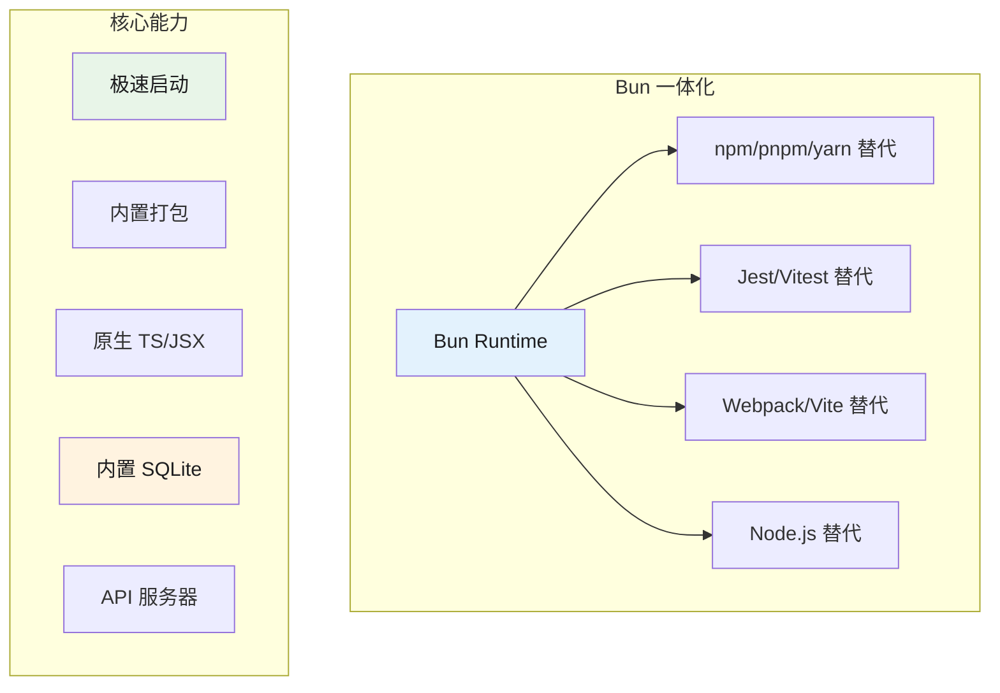
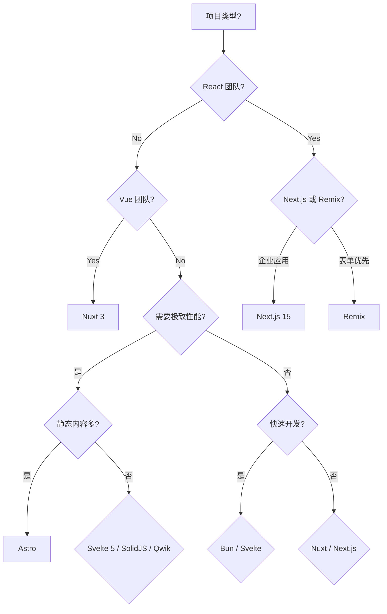

# Bun 运行时与框架选型

> 本文是「前端框架」系列第 3 篇（共 3 篇）。上一篇：[新范式：Astro、Svelte、Solid、Qwik](rendering-paradigms.md)

## 1. Bun

### 1.1 简介

Bun 是由 Jarred Sumner 开发的"一体化" JavaScript 工具链，设计为 Node.js 的直接替代品。它同时是 JavaScript 运行时、包管理器、构建工具和测试运行器。Bun 基于 JavaScriptCore 引擎，启动速度比 Node.js 快 3 倍，内置 TypeScript 和 JSX 支持。

### 1.2 技术栈

| 类别 | 技术 |
|------|------|
| 核心 | JavaScriptCore 引擎 |
| 语言支持 | JavaScript, TypeScript, JSX, TSX |
| 内置功能 | 运行时、包管理器、测试、bundler |
| 数据库支持 | 内置 SQLite, PostgreSQL, MySQL |
| 部署 | 任何 Node.js 环境 |

### 1.3 核心架构

#### 1.3.1 工具链整合



### 1.4 技术深度分析

#### 1.4.1 内置 HTTP 服务器

```typescript
// server.ts
import { serve } from 'bun';

const server = serve({
  port: 3000,
  
  async fetch(req) {
    const url = new URL(req.url);
    
    // 路由处理
    if (url.pathname === '/api/users') {
      return Response.json([
        { id: 1, name: 'Alice' },
        { id: 2, name: 'Bob' },
      ]);
    }
    
    if (url.pathname === '/api/posts') {
      const posts = await getPosts();
      return Response.json(posts);
    }
    
    // 静态文件服务
    if (url.pathname === '/') {
      return new Response(
        Bun.file('./public/index.html'),
        { headers: { 'Content-Type': 'text/html' } }
      );
    }
    
    // 404
    return new Response('Not Found', { status: 404 });
  },
});

console.log(`Server running on http://localhost:${server.port}`);
```

#### 1.4.2 模板引擎

```typescript
// template.ts
// 第 1 段：引入渲染函数 —— 从 Bun 运行时内置的 bun:html 模块取出 render。
// 选用内置模块而非 EJS/Handlebars 等第三方引擎，可省去依赖安装与打包开销；
// render 是纯函数式调用、不持有全局状态，同一份模板可以反复复用，多次渲染互不污染。
import { render } from 'bun:html';

// 第 2 段：定义模板骨架 —— 用模板字符串承载 HTML，把「页面结构」与「运行时数据」彻底解耦。
// 关键数据流：{{ title }}、{{ greeting }} 会被第二个参数对象的同名属性替换（按 HTML 规则转义，天然规避 XSS）；
// {{ for item in items }} 与 {{ /for }} 是必须成对出现的块级指令，只写一半会导致解析报错或整段退化为静态文本；
// 易错点：此处每一行都属于字符串内容，切勿在模板内部加 // 注释，否则会原样打印进最终 HTML。
const template = `
<!DOCTYPE html>
<html>
<head><title>{{ title }}</title></head>
<body>
  <h1>{{ greeting }}</h1>
  <ul>
    {{ for item in items }}
    <li>{{ item }}</li>
    {{ /for }}
  </ul>
</body>
</html>
`;

// 第 3 段：绑定数据上下文并触发渲染 —— 第二个参数对象的键就是模板里占位符的查找表。
// 边界条件：键缺失不会抛错，而是静默渲染为空串，属于难以察觉的失败模式，改模板时务必同步改数据；
// items 需为可迭代结构，循环体每轮把当前元素赋给 item 后再展开一次模板片段。
// 复杂度约为 O(模板长度 + 展开后的输出长度)：整体只需一趟线性扫描。
const html = render(template, {
  title: 'Bun Template',
  greeting: 'Hello from Bun!',
  items: ['Item 1', 'Item 2', 'Item 3']
});

// 第 4 段：输出渲染结果 —— render 返回的是完整 HTML 字符串（非 DOM 对象），
// 直接交给 console.log 便于在命令行逐行核验占位符替换与循环展开是否符合预期。
console.log(html);
```

#### 1.4.3 数据库操作

```typescript
// database.ts
import { Database } from 'bun:sqlite';

// 内存数据库
const db = new Database(':memory:');

// 创建表
db.run(`
  CREATE TABLE users (
    id INTEGER PRIMARY KEY,
    name TEXT NOT NULL,
    email TEXT UNIQUE,
    created_at DATETIME DEFAULT CURRENT_TIMESTAMP
  )
`);

// 插入数据
const insert = db.prepare('INSERT INTO users (name, email) VALUES (?, ?)');
insert.run('Alice', 'alice@example.com');
insert.run('Bob', 'bob@example.com');

// 事务处理
db.exec('BEGIN TRANSACTION');
try {
  db.run("INSERT INTO users (name, email) VALUES ('Charlie', 'charlie@example.com')");
  db.run("INSERT INTO users (name, email) VALUES ('David', 'david@example.com')");
  db.exec('COMMIT');
} catch (error) {
  db.exec('ROLLBACK');
}

// 查询数据
const users = db.query('SELECT * FROM users').all();
console.log(users);

// 参数化查询
const olderUsers = db.query(
  'SELECT * FROM users WHERE created_at < datetime("now", "-30 days")'
).all();

// 更新数据
const update = db.prepare('UPDATE users SET name = ? WHERE id = ?');
update.run('Alice Smith', 1);

// 删除数据
const delete = db.prepare('DELETE FROM users WHERE id = ?');
delete.run(2);

// 导出数据库
const fileDB = new Database('./data.db');
fileDB.run('CREATE TABLE IF NOT EXISTS posts (id INTEGER, content TEXT)');
```

#### 1.4.4 文件操作

```typescript
// fileops.ts
import { readFile, writeFile, mkdir, exists } from 'fs';
import { watch } from 'fs';

// 读取文件
const content = await Bun.file('./data.json').text();
const json = await Bun.file('./data.json').json();

// 写入文件
await Bun.write('./output.txt', 'Hello, Bun!');
await Bun.write('./data.json', JSON.stringify({ hello: 'world' }));

// 流式读写
const file = Bun.file('./large-file.txt');
const reader = file.stream().getReader();

while (true) {
  const { done, value } = await reader.read();
  if (done) break;
  console.log(new TextDecoder().decode(value));
}

// 监听文件变化
const watcher = watch('./src', { recursive: true }, (event, filename) => {
  console.log(`${event}: ${filename}`);
});

// 目录操作
await mkdir('./dist/assets', { recursive: true });

// 检查文件存在
const hasFile = await exists('./config.json');
```

#### 1.4.5 WebSocket 服务器

```typescript
// websocket.ts
// 第 1 段：导入与服务器实例化——用 Bun 内置 Server 同时托管 HTTP 与 WebSocket
// 关键点：Bun 把 HTTP 升级（upgrade）和 WebSocket 事件回调放在同一个配置对象里，因此不需要再额外挂载 ws 库。
import { Server } from 'bun';

const server = new Server({
  port: 3000, // 监听端口；生产环境通常从 process.env.PORT 读取，并可能配合 TLS 监听 443
  
  // 第 2 段：HTTP 入口 fetch——每个普通请求先尝试升级为 WebSocket，失败才回退到 HTTP 响应
  // 为什么这样写：WebSocket 握手本质上是一个带 Upgrade 头的 HTTP 请求，Bun 让开发者显式调用 server.upgrade(req) 来决定是否升级。
  // 易错点：upgrade 成功时返回 true，此时 fetch 必须直接 return（不能继续写 Response），否则会报错或产生未定义行为。
  fetch(req, server) {
    // 升级为 WebSocket
    if (server.upgrade(req)) {
      return;
    }
    
    // 边界条件：非 WebSocket 请求（例如浏览器直接访问）没有 Upgrade 头，这里返回 426 Upgrade Required，提示客户端必须使用 WebSocket 协议。
    return new Response('Upgrade required', { status: 426 });
  },
  
  // 第 3 段：WebSocket 生命周期回调——open/message/close 分别对应连接建立、收到消息、连接关闭
  // 数据流：客户端连入 → open 发欢迎语 → 客户端发消息 → message 回显 → 断开时触发 close。
  // 说明：perMessageDeflate 开启后，Bun 会在协议层对每条消息做 permessage-deflate 压缩；文本/大消息省带宽，但小消息可能因压缩头而略微增大。
  websocket: {
    open(ws) {
      console.log('Client connected');
      ws.send('Welcome!'); // 连接一建立就推送欢迎语，让客户端确认链路可用
    },
    
    message(ws, message) {
      console.log('Received:', message);
      ws.send(`Echo: ${message}`); // 简单的回显逻辑；注意 message 可能是 string 或 Buffer，模板字符串会隐式调用 toString()（Buffer 默认按 UTF-8 解码）
    },
    
    close(ws, code, reason) {
      // 客户端或服务端主动关闭都会进入这里；code 是 WebSocket 关闭码（如 1000 正常关闭），reason 是可选原因
      // 易错点：close 里不能再调用 ws.send，因为连接已经不可写。
      console.log('Client disconnected');
    },
    
    perMessageDeflate: true
  }
});

// 第 4 段：启动确认——Server 构造函数是同步返回的，此时端口已开始监听；若端口被占用会在实例化时抛错。
console.log('WebSocket server running');
```

#### 1.4.6 测试框架

```typescript
// sum.test.ts
import { test, expect, describe, beforeEach, afterEach } from 'bun:test';

describe('Math Utils', () => {
  test('sum adds two numbers', () => {
    expect(sum(2, 3)).toBe(5);
  });
  
  test('sum handles negative numbers', () => {
    expect(sum(-1, 1)).toBe(0);
  });
  
  test('sum with zero', () => {
    expect(sum(0, 5)).toBe(5);
  });
});

describe('String Utils', () => {
  test('uppercase', () => {
    expect(toUpperCase('hello')).toBe('HELLO');
  });
  
  test('reverse', () => {
    expect(reverse('abc')).toBe('cba');
  });
});

// 异步测试
test('async fetch', async () => {
  const response = await fetch('https://jsonplaceholder.typicode.com/users/1');
  const data = await response.json();
  expect(data.id).toBe(1);
});

// 跳过和仅运行
test.skip('skipped test', () => {
  // 不会执行
});

test.only('only this test', () => {
  expect(1 + 1).toBe(2);
});

// 模拟
test('mock example', async () => {
  const mockFn = vi.fn(() => Promise.resolve('mocked'));
  
  const result = await mockFn();
  expect(result).toBe('mocked');
  expect(mockFn).toHaveBeenCalledTimes(1);
});
```

#### 1.4.7 构建打包

```bash
# 基本打包
bun build ./src/index.tsx --outdir ./dist

# 浏览器目标
bun build ./src/app.tsx \
  --outdir ./dist \
  --target browser \
  --minify

# Node.js 目标
bun build ./src/server.ts \
  --outdir ./dist \
  --target node

# 库输出
bun build ./src/index.ts \
  --outdir ./dist \
  --target bun \
  --format esm

# 编译为可执行文件
bun build --compile ./app.ts --outfile myapp
```

#### 1.4.8 包管理

```bash
# 安装依赖（比 npm 快 30 倍）
bun install

# 添加依赖
bun add react
bun add -D typescript @types/react

# 移除依赖
bun remove react

# 更新依赖
bun update

# 锁定文件
bun lockfile

# 缓存管理
bun pm cache rm
```

### 1.5 性能基准数据

| 指标 | Bun | Node.js | Deno | 备注 |
|------|-----|---------|------|------|
| 启动速度 | 3x | baseline | 2x | JavaScriptCore 优化 |
| 包安装 | 30x | baseline | 5x | 比 npm 快 |
| HTTP 服务器 | 2x | baseline | 1.5x | 基准测试 |
| TypeScript 运行时 | 10x | 需 tsc | 1x | 内置支持 |

### 1.6 优缺点分析

#### 1.6.1 优势

1. **一体化工具链** - 运行时+包管理+构建+测试
2. **极速启动** - JavaScriptCore 引擎
3. **内置 TypeScript** - 无需额外配置
4. **SQLite 内置** - 简化数据库操作
5. **与 Node.js 兼容** - 大部分模块可用
6. **开发体验** - 快速反馈循环

#### 1.6.2 劣势

1. **生态系统** - 部分 npm 包可能不兼容
2. **生产验证** - Node.js 生产经验更丰富
3. **调试工具** - Node.js 调试生态更完善
4. **长期稳定** - 相对较新

### 1.7 选择理由

- **为什么选 Bun？**
  - 需要快速开发循环
  - 小型 API 服务器
  - 脚本和 CLI 工具
  - TypeScript 项目
  - SQLite 数据库应用

- **什么场景不适合？**
  - 大型企业后端（Node.js 更稳定）
  - 需要特定 Node.js 模块
  - 生产环境需要验证

### 1.8 使用场景

- 需要快速开发循环的项目
- 需要一体化工具链的团队
- API 服务器
- 脚本和 CLI 工具

### 1.9 快速开始

**运行时 - JavaScript 版本：**

```javascript
// server.js
// 第 1 段：创建并启动 HTTP 服务器（Bun.serve 入口）
// Bun.serve 是 Bun 内置的零依赖服务，传入配置对象即立刻开始监听，不存在单独的 listen() 步骤；
// 返回值 server 携带运行时信息（如实际端口），第 5 段打印日志时会用到。
const server = Bun.serve({
  port: 3000,
  // fetch 是每个请求的处理入口，必须返回 Response（或 Promise<Response>），
  // 返回字符串等其它值会直接抛错——这是与 Express 的 res.send() 风格最大的差异。
  fetch(req) {
    const url = new URL(req.url);
    
    // 第 2 段：路由匹配 —— 根路径返回纯文本
    // req.url 是绝对地址，所以能直接交给 URL 解析，取出 pathname 只比较路径部分；
    // 这样设计意味着查询串被天然忽略，/xxx?a=1 与 /xxx 命中同一分支。
    if (url.pathname === '/') {
      // 未指定头时默认是 text/plain;charset=utf-8，浏览器会按纯文本渲染
      return new Response('Welcome to Bun!');
    }
    
    // 第 3 段：/api/users 返回 JSON 列表
    // 用 Response.json() 而非 JSON.stringify 手工拼 header，
    // 它会自动序列化并补上 Content-Type: application/json，避免漏设头导致前端解析失败。
    if (url.pathname === '/api/users') {
      return Response.json([
        { id: 1, name: 'Alice' },
        { id: 2, name: 'Bob' },
      ]);
    }
    
    // 第 4 段：兜底分支 —— 未命中任何路由时的响应
    // 各分支都用 return 提前退出，因此执行到这里必然是未知路径；
    // 必须显式写 status: 404，否则默认 200 会让客户端和爬虫把错误页当成正常内容。
    return new Response('Not Found', { status: 404 });
  },
});

// 第 5 段：启动确认日志
// 读 server.port 而不是写死 3000：若端口改成 0 由系统随机分配，这里打印的才是真实端口。
console.log(`Listening on localhost:${server.port}`);
```

**运行时 - TypeScript 版本：**

```typescript
// app.ts
// 第 1 段：模块导入 —— 声明运行时与数据访问能力
// bun 内置的 serve 直接提供 HTTP 服务器，无需 Express/Koa 等框架；
// sql 是从 ./db 导出的模板字符串标签函数，用于参数化查询。
import { serve } from 'bun';
import { sql } from './db';

// 第 2 段：启动 HTTP 服务并注册统一请求处理器
// serve 接收配置对象，port 决定监听端口；fetch 是每个请求进入的唯一入口，
// 因此路由分发必须在这里手工完成，未命中的路径会落到后面的 404 分支。
const server = serve({
  port: 4000,
  async fetch(req) {
    // 第 3 段：把原始 Request 解析成可操作的 URL
    // req.url 是完整地址（含协议与主机），转成 URL 对象后才能安全地取 pathname；
    // 直接用字符串比较会因查询串或尾斜杠导致匹配失败。
    const url = new URL(req.url);
    
    // 第 4 段：路由命中 /api/posts 时查询数据库并返回 JSON
    // sql 标签函数会自动把插值转义为参数，这里无插值但仍走预编译，天然防注入；
    // LIMIT 10 是硬性截断，避免全表扫描拖垮响应，属于典型的分页雏形（暂未支持 page 参数）。
    if (url.pathname === '/api/posts') {
      const posts = await sql`SELECT * FROM posts LIMIT 10`;
      // Response.json 会自动设置 Content-Type: application/json 并序列化对象数组；
      // 注意 await 只等待查询，不等待响应体写出，异常需在此处向上抛出。
      return Response.json(posts);
    }
    
    // 第 5 段：兜底分支 —— 所有未匹配路径统一返回 404
    // 显式设置 status: 404，否则默认 200 会让客户端误判为成功；
    // 这里是同步返回，与上面的 async 查询形成对比，体现处理器可混合同步/异步返回。
    return new Response('Not Found', { status: 404 });
  },
});

// 第 6 段：启动后回读实际端口
// 使用 server.port 而非字面量 4000，是因为传入 port: 0 时系统会动态分配，
// 回读可保证日志始终反映真实监听端口。
console.log(`Server running on port ${server.port}`);
```

**数据库操作：**

```typescript
// db.ts
import { Database } from 'bun:sqlite';

const db = new Database(':memory:');

// 创建表
db.run(`
  CREATE TABLE users (
    id INTEGER PRIMARY KEY,
    name TEXT NOT NULL,
    email TEXT UNIQUE
  )
`);

// 插入数据
const insert = db.prepare('INSERT INTO users (name, email) VALUES (?, ?)');
insert.run('Alice', 'alice@example.com');
insert.run('Bob', 'bob@example.com');

// 查询数据
const users = db.query('SELECT * FROM users').all();
console.log(users);

export { db };
```

**测试示例：**

```typescript
// sum.test.ts
import { test, expect, describe } from 'bun:test';

function sum(a: number, b: number): number {
  return a + b;
}

describe('Math Utils', () => {
  test('sum adds two numbers', () => {
    expect(sum(2, 3)).toBe(5);
  });
  
  test('sum handles negative numbers', () => {
    expect(sum(-1, 1)).toBe(0);
  });
});

test('async fetch', async () => {
  const response = await fetch('https://jsonplaceholder.typicode.com/users/1');
  const data = await response.json();
  expect(data.id).toBe(1);
});
```

**构建和部署：**

```bash
# 安装依赖（比 npm 快 30 倍）
bun install

# 运行开发服务器
bun run dev

# 构建生产版本
bun build ./src/index.tsx --outdir ./dist --target browser

# 编译为单文件可执行文件
bun build --compile ./app.ts --outfile myapp

# 运行测试
bun test

# 运行 benchmark
bun test --bench
```

### 1.10 真实应用案例

| 公司/项目 | 使用场景 | 规模 |
|-----------|---------|------|
| Bun 官方 | 内部工具 | 中型 |
| Oven (团队) | Bun 本身开发 | 小型 |
| Vercel (部分) | Edge Functions | 中型 |

### 1.11 参考链接

- [Bun 官方文档](https://bun.sh/docs)
- [Bun GitHub](https://github.com/oven-sh/bun)
- [Bun 包管理器](https://bun.sh/docs/cli/install)

## 2. 对比总结

### 2.1 渲染模式对比

| 框架 | SSR | SSG | ISR | PPR | Islands |
|------|-----|-----|-----|-----|---------|
| Next.js 15 | Yes | Yes | Yes | Yes | No |
| Remix | Yes | Yes | No | No | No |
| Astro | Yes | Yes | Yes | No | Yes |
| Svelte 5 | Yes | Yes | Yes* | No | 需 SvelteKit |
| SolidJS | Yes | Yes | Yes* | No | 需 SolidStart |
| Qwik | Yes | Yes | Yes | No | Yes |
| Nuxt | Yes | Yes | Yes | No | No |

*Svelte/SolidJS 的 ISR 需要额外配置

### 2.2 性能对比

| 框架 | 初始 JS | Bundle | SSR 开销 | 运行时开销 |
|------|---------|--------|----------|-----------|
| Astro | 0KB | 极小 | 低 | 无 |
| Qwik | ~1KB | 小 | 低 | 低 |
| Svelte 5 | 1.5KB | 极小 | 中 | 极低 |
| SolidJS | 7KB | 小 | 中 | 极低 |
| Nuxt | 20KB+ | 中 | 中 | 中 |
| Remix | 40KB+ | 中 | 中 | 中 |
| Next.js 15 | 85KB+ | 中 | 中 | 中 |

### 2.3 开发者体验对比

| 框架 | 学习曲线 | 文档质量 | 生态丰富度 | 工具链完整度 |
|------|----------|----------|------------|-------------|
| Astro | 低 | 优秀 | 中 | 完整 |
| Svelte 5 | 低 | 优秀 | 中 | 完整 |
| Nuxt | 低 | 优秀 | 高 | 完整 |
| Qwik | 中 | 良好 | 中 | 完整 |
| Remix | 低 | 优秀 | 高 | 完整 |
| SolidJS | 中 | 良好 | 中 | 完整 |
| Next.js 15 | 中 | 优秀 | 高 | 最完整 |
| Bun | 低 | 良好 | 中 | 完整 |

### 2.4 选择建议

| 场景 | 推荐框架 | 备选 |
|------|----------|------|
| React 全栈企业应用 | Next.js 15 | Remix |
| Vue 全栈应用 | Nuxt 3 | - |
| 内容驱动静态站 | Astro | - |
| 极致性能 SPA | Svelte 5 / SolidJS | Qwik |
| 移动端性能优先 | Qwik | Astro |
| 小型 API 服务器 | Bun | - |
| 快速原型 | Svelte 5 / Bun | Nuxt |
| 表单驱动应用 | Remix | Next.js |

## 3. 选择决策树



---

*文档最后更新：2026-05-16*

## 深入阅读与参考

!!! tip "怎么用这些资料"
    先读「官方文档与规范」建立准确的概念，再读「源码与示例」核对细节，最后用「教程、书籍与视频」换一种讲法加深理解。每条都写明了读哪一节、带着什么问题读。

### 官方文档与规范

| 资源 | 为什么读 | 怎么读 |
|---|---|---|
| [Bun Runtime](https://bun.sh/docs/runtime) | 运行时核心概念与配置的权威出处，选型必读 | 读 CLI 与模块解析章节，对照自己项目的启动方式，列出不确定点 |
| [Bun APIs](https://bun.sh/docs/runtime/bun-apis) | 内置 API 决定替代 Node 的成本，先抓常用几类 | 重点读文件、HTTP、进程 API，勾出项目里可替换的 Node 调用 |
| [Migrate from Bun](https://docs.deno.com/runtime/migrate/migrate_from_bun/) | 迁移与回退清单，用来评估锁定风险与退出成本 | 读兼容性差异与降级步骤，读完整理一份选型风险清单 |

### 源码与示例

| 资源 | 为什么读 | 怎么读 |
|---|---|---|
| [Bun 文档](https://bun.sh/docs) | 边做边比，最快建立 Bun 与 Node 的差异体感 | 按文档跑通一个小项目：装依赖、启动、打包，记录三类耗时差异 |
| [Bun 测试运行器](https://bun.sh/docs/cli/test) | 测试兼容性决定迁移成本，实测比读文档更可信 | 用 bun test 重跑现有 Vitest 用例，记录失败项与 watch 行为差异 |

### 教程、书籍与视频

| 资源 | 为什么读 | 怎么读 |
|---|---|---|
| [Bun 博客](https://bun.sh/blog) | 博客形式讲清性能取舍，选型前先建立直觉判断 | 通读基准测试部分，追问差异在哪些场景被放大，再拿自己项目复测 |

## 应用与行业实践

### 应用场景地图

| 场景 | 用到本页哪个知识点 | 典型技术选型 | 注意事项 |
|---|---|---|---|
| - | - | - | - |
| 低端安卓机上的营销落地页首屏 | 岛屿架构按交互点下发 JS；构建只打包入口 | Astro 页面 + Svelte 岛 + bun build | 标注客户端指令前先清点交互点，标多了就退回整页水合 |
| 后台管理系统里的两万行订单表格 | 编译期框架的产物体积；bun test 跑纯函数回归 | Svelte 或 Solid 表格 + bun test | 行高固定才能用乘法算偏移，窗口计算要有用例兜住 |
| 多人协作白板的实时笔画同步 | Bun.serve 在同一进程内提供 WebSocket | Bun.serve + 浏览器原生 WebSocket | 连接集合在进程内存里，多实例部署时跨实例收不到消息 |
| 文档站每次提交后的构建 | bun install 与 bun run 替换安装与脚本层 | Bun + 静态站点生成器 | 锁定运行时版本，仓库里只留一套 lockfile |
| 边缘节点处理表单 webhook | Bun.serve 单文件启动；Bun.file 读文件 | Bun + 容器镜像或边缘平台 | 先核对目标平台是否提供 Bun 运行时 |
| 大促期间的商品详情页 SSR | 服务端渲染首屏加局部水合 | Astro SSR 或 Qwik + Bun 构建 | 压测要覆盖冷启动与并发连接数两个维度 |
| 内部 CLI 与网页共用同一份校验逻辑 | Bun 直接执行 TypeScript，不需要额外编译步骤 | Bun + workspace 共享包 | 共享包不能引用只有 Node 才有的内置模块 |
| monorepo 里十个包同时装依赖 | bun install 的工作区支持 | Bun workspaces | 先在本地跑一遍全部包的安装，再切换 CI |

### 三个场景拆解

#### 场景 1：低端安卓机上的营销落地页首屏

**业务背景**

落地页在低端安卓机上首屏空白时间长，用户还没看到内容就滑走。页面由十来个区块拼成，其中只有倒计时、报名表单、轮播三处需要交互。

**怎么用本页知识解决**

思路是把页面拆成静态区块与交互岛，构建时只把岛的入口交给 Bun 打包，静态区块留在 HTML 里。

```ts
// build.ts：只把交互岛作为入口交给 Bun 打包
const result = await Bun.build({
  entrypoints: [                       // 白名单：不在这里的模块不会进浏览器
    "./src/islands/countdown.ts",
    "./src/islands/form.ts",
    "./src/islands/carousel.ts",
  ],
  outdir: "./public/js",
  target: "browser",                   // 产物面向浏览器，不注入 Node 垫片
  minify: true,                        // 压缩空白与标识符，减少传输字节
  sourcemap: "linked",                 // 保留映射文件，线上可定位源码
});

if (!result.success) throw new Error("构建失败"); // 失败立刻中断 CI
```

- entrypoints 就是白名单，改动岛屿范围只需改这个数组。
- target 设为 browser 后，打包器不为 Node 内置模块生成垫片。
- minify 与 sourcemap 只影响传输与排查，改动可以单独回退。
- 构建失败让 CI 中断，避免半成品产物推到 CDN。
- 产物字节按 outdir 里的文件逐个核对，不做整体估算。

**怎么度量收益**

- 首屏：Lighthouse 的 Performance 分数与 LCP，移动端开启 Slow 4G 与 4x CPU 节流。
- 传输量：DevTools Network 面板按 JS 过滤，记录 Transfer Size 与 Coverage 未使用字节。
- 主线程：DevTools Performance 面板录一次加载，看 Total Blocking Time 与 Long Task 数量。
- 回归：把上述三项写进 CI 报告，比较改动前后的读数。

**什么时候不该用**

- 每个区块都要先请求接口才能渲染出内容，静态 HTML 里留不下任何可见文本时。
- 团队没有产物字节的检查流程，岛屿边界会被随手改回整页水合时。
- 页面交互点超过区块数量的一半，拆岛带来的请求数超过收益时。

#### 场景 2：多人协作白板的实时笔画同步

**业务背景**

一个白板房间同时在线人数在几十人量级，每落一笔就产生一串坐标点，要立刻广播给同房间其他人。改用轮询会让移动端的耗电与流量都涨上去。

**怎么用本页知识解决**

思路是用 Bun.serve 在一个进程里同时提供静态页面与 WebSocket 通道，省掉独立网关这一层。

```ts
// server.ts：一个进程内同时提供静态页面与 WebSocket 通道
const peers = new Set<ServerWebSocket>();        // 当前在线的连接
Bun.serve({
  port: 3000,
  fetch(req, server) {
    if (new URL(req.url).pathname === "/ws") {
      // 把 /ws 升级为 WebSocket，其余请求落到下面的静态分支
      return server.upgrade(req) ? undefined : new Response("升级失败", { status: 400 });
    }
    return new Response(Bun.file("./public/index.html")); // 直接回文件，不经打包
  },
  websocket: {
    open(ws) { peers.add(ws); },                 // 连接进来就登记
    message(ws, msg) {
      for (const peer of peers) if (peer !== ws) peer.send(msg); // 转发给其他人
    },
    close(ws) { peers.delete(ws); },             // 断开就移除，避免集合膨胀
  },
});
```

- /ws 之外的请求落到静态分支，一个进程承担静态服务与消息转发。
- open 与 close 成对维护集合，断开的连接不会留在内存里。
- message 里回显给发送者会形成自激循环，所以先判断 peer !== ws。
- 要按房间隔离时，把 Set 换成 Map，并在 upgrade 的 data 字段里写入房间号。
- 连接集合存在进程内存，多实例部署时跨实例收不到消息。

**怎么度量收益**

- 端到端延迟：客户端 send 前记时间戳，收到回显后相减，取 p95 与 p99。
- 连接数：服务端定时打印集合大小，观察断开后是否回落到零。
- 内存：定时打印 process.memoryUsage() 的堆使用量，观察长连接挂一小时后的曲线。
- 背压：服务端统计每秒转发条数，和客户端实际收到条数对比。

**什么时候不该用**

- 进房间要按数据库里的权限记录做校验时，单进程内存集合撑不住。
- 部署环境只允许单实例，而在线人数需要横向扩容时。
- 要求消息持久化与断线重放时，进程重启会丢掉全部连接状态。

#### 场景 3：后台管理系统里的两万行订单表格

**业务背景**

运营筛出两万行订单后滚动卡顿，改一次筛选条件浏览器就短暂无响应。这个仓库改动频繁，每次提交都要等完整测试跑完。

**怎么用本页知识解决**

思路是把"渲染多少行"写成可测的纯函数，用 bun test 在毫秒级跑回归；表格组件交给编译期框架。

```ts
// window.test.ts：用 Bun 内置测试运行器验证可视窗口计算
import { test, expect } from "bun:test";   // 内置运行器，不需要额外测试依赖
import { visibleRange } from "./window";   // 纯函数，输入滚动位置与行高

test("两万行只渲染可视窗口加缓冲", () => {
  const range = visibleRange({
    scrollTop: 4000, rowHeight: 40, viewportHeight: 800, total: 20000, buffer: 2,
  });
  expect(range.start).toBe(98);   // 4000 / 40 = 100，再减 2 行缓冲
  expect(range.end).toBe(122);    // 可视 20 行加尾部 2 行缓冲
});
```

- visibleRange 不碰 DOM，测试不需要浏览器环境。
- bun test 直接跑 TypeScript，省掉单独的编译步骤。
- 断言写死边界值，算法改动时先看这两条是否变红。
- 两万行只在内存里建索引，DOM 节点数由 range 决定，不随总行数增长。
- 行高固定才能用乘法算偏移，行高可变时要换成实测高度累加。

**怎么度量收益**

- DOM 规模：控制台执行 document.querySelectorAll("tbody tr").length，滚到上中下三处各测一次。
- 交互响应：DevTools Performance 面板录一次滚动与一次筛选，看 Long Task 数量与最长任务耗时。
- 测试耗时：记录 bun test 输出的用例数与总用时，与迁移前的读数对比。
- 首屏：Lighthouse 桌面配置下取三次 Performance 分数的中位数。

**什么时候不该用**

- 需要一次导出完整表格或整页打印，虚拟滚动会丢掉视口外的行时。
- 每行高度由内容撑开且无法预估，偏移量必须用实测高度累加时。
- 团队不熟悉编译期框架的事件绑定差异，改动频率高于学习投入时。

### 行业先进实践

按交互点下发脚本（出处：Astro 官方文档 Islands architecture 一节）
组件默认在服务端渲染成 HTML，只有标注客户端指令的组件才把 JS 发到浏览器。有效之处是把"这块要不要 JS"变成每个组件的一次显式决策。借鉴方式是在自己项目里列一张组件表，逐个写出交互点，写不出来的就不标。

可恢复性跳过重复执行（出处：Qwik 官方文档中关于 resumability 的说明）
把状态与事件位置序列化进 HTML，浏览器接管时按需恢复，而不是重新执行整棵组件树。它针对的是水合阶段的那一次全量执行。借鉴方式是先量出自己项目的水合耗时占比，再决定是否值得换框架。

用 bun install 承接安装层（出处：Bun 官方文档的包管理章节）
Bun 读取 package.json 并生成自己的 lockfile，安装耗时被官方文档列为设计目标之一。借鉴方式是只替换本地与 CI 的安装步骤，保留 package-lock.json 作为回退路径。

用 bun test 承接现有用例（出处：Bun 官方文档的 Test runner 章节）
文档列出了与 Jest 接近的匹配器与钩子清单，迁移前逐项核对。借鉴方式是先迁移纯函数测试，依赖浏览器环境的用例留在原运行器里。

容器内安装与运行分阶段（出处：需核对官方文档：Bun 官方文档的容器与部署指南页，核对是否给出多阶段构建与 --frozen-lockfile 的推荐写法）

### 从学到用：落地路线

1. 试点：挑一个不承接对外流量的仓库或页面，只替换运行与包管理这一层。验收标准是安装与测试命令各跑通一次，新的 lockfile 进入版本库。
2. 验证：把同一份用例在 Node 与原包管理器下各跑一遍，整理差异清单。验收标准是清单里每一项都写着原因或对应的 issue 编号。
3. 推广：按仓库逐个替换，替换前确认该项目用到的 Node API 在兼容列表内。验收标准是每个仓库都保留一条走 Node 的 CI 任务，并且真实跑通过一次。
4. 防止回退：把运行时版本与脚本名固定进 CI 配置，加一条检查禁止两套 lockfile 并存。验收标准是两套 lockfile 同时出现时任务失败。

### 动手作业

目标：做一个含三个区块的本地页面（静态文案、倒计时、筛选输入），分别用整页水合与岛屿两种方式构建，量出 JS 传输字节与主线程阻塞的差距。

步骤

1. 新建目录，用 bun init 生成 package.json 与 tsconfig.json，确认 bun run 可用。
2. 写页面骨架，静态文案、倒计时、筛选输入各自独立成模块。
3. 版本 A：三个模块挂到同一个入口，整页水合。
4. 版本 B：只把倒计时与筛选输入写进 Bun.build 的 entrypoints，静态文案留在 HTML 里。
5. 同一台机器、同一浏览器配置下打开两个版本，记录 Network 面板的 JS 传输字节与 Performance 面板的 Long Task 数量。
6. 把两次读数写进一份 Markdown 表格，注明测量时间、浏览器版本与节流设置。
7. 改动版本 B：把筛选输入也改成静态渲染，观察字节变化与去掉的模块是否对应。

验收标准

- 两个版本都能在本地打开，倒计时与筛选交互可用。
- 表格里每个版本各有一行，字段包含 JS 传输字节、Long Task 数量、最长任务耗时。
- 测量记录写清浏览器版本、节流设置与测量次数。
- 版本 B 的 JS 传输字节低于版本 A，且差值能对应到被移除的模块。
- 仓库里保留构建脚本命令，clone 后不需要额外步骤即可复现两次测量。

