# JavaScript 构建工具生态调研

> 本文档调研 2025-2026 年主流 JavaScript/TypeScript 构建工具，覆盖核心项目特性、技术栈、使用场景和快速开始指南。

## 目录

- [概述](#1-vite)
- [1. Vite](#1-vite_1)
- [2. Rolldown](#2-rolldown)
- [3. esbuild](#3-esbuild)
- [4. SWC](#4-swc)
- [5. Turbopack](#5-turbopack)
- [6. Rollup](#6-rollup)
- [7. Parcel](#7-parcel)
- [8. Webpack 5](#8-webpack-5)
- [9. Rsbuild](#9-rsbuild)
- [10. Bun](#10-bun)
- [11. Farm](#11-farm)
- [对比矩阵](#对比矩阵)

---

## 概述

2025-2026 年，JavaScript 构建工具生态正在经历重大变革：

| 趋势 | 说明 |
|------|------|
| **Rust 重写运动** | esbuild、SWC、Rolldown、Rspack、Farm 等核心工具纷纷用 Rust 重写，性能提升 10-100x |
| **Vite 成为新标准** | Vite 6.x 结合 Rolldown，成为现代前端项目的事实标准 |
| **零配置优先** | Parcel、Farm、Farm 等工具主打零配置体验，降低上手门槛 |
| **增量构建** | Turbopack、Farm 等工具通过缓存和懒编译优化大型项目构建速度 |

### 生态架构总览

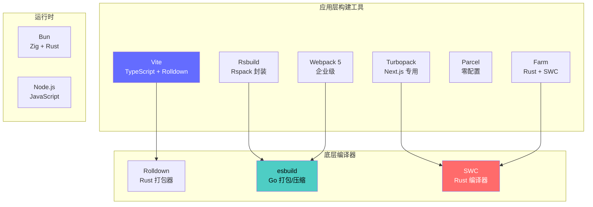

### 关键数据来源

- GitHub Trending 2026-05
- npm registry 下载量趋势
- 官方基准测试数据

---

## 1. Vite

### 简介

Vite（法语"快速"，发音 `/viːt/`）是新一代前端构建工具，由 Vue 作者尤雨溪发起，现已成为生态最活跃的前端工具之一。Vite 6.x 正式将 Rolldown 作为生产构建引擎，标志着全面 Rust 化时代的到来。

**核心特性**：
- 开发环境基于原生 ES Modules，热更新极快（HMR < 100ms）
- 生产构建使用 Rolldown，输出高度优化的静态资源
- 提供开箱即用的默认配置，支持插件扩展
- 框架无关，通过插件支持 Vue、React、Svelte、Solid 等

**GitHub 数据**：80.6k stars，活跃维护中

### 技术栈

- **核心语言**：TypeScript
- **构建引擎**：Rolldown（Rust）
- **开发服务器**：原生 ESM + 自定义中间件
- **插件系统**：兼容 Rollup 插件生态

### 架构深度分析

#### 开发模式架构

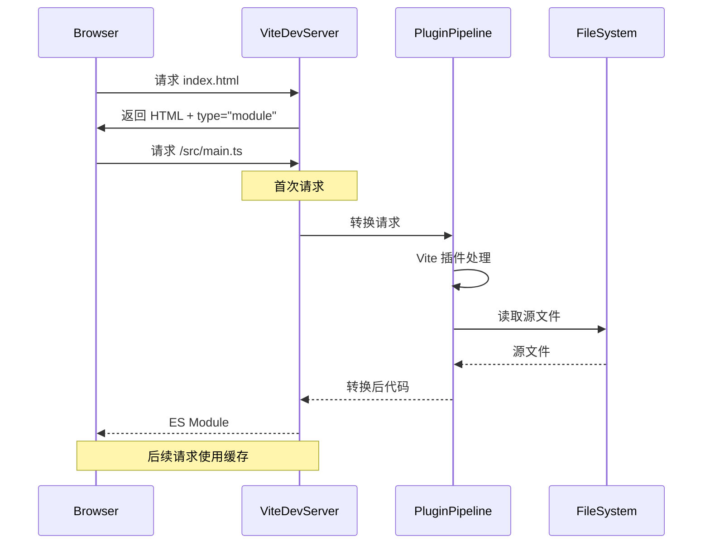

#### Vite 与 Rolldown 协作流程

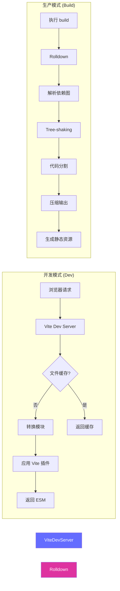

### 核心原理

#### 1. 为什么 Vite 开发速度快？

**传统打包器的困境**：
```
Webpack: 冷启动需要构建整个依赖图
├── 解析所有模块 (1000+ files)
├── 转换每个模块 (Babel/SWC)
├── 构建依赖图
└── 输出 bundle
时间: 10-60s
```

**Vite 的解决方案**：
```
Vite: 基于浏览器原生 ESM
├── 服务器启动 (即时)
├── 按需转换 (仅请求的文件)
└── 模块懒加载
时间: <1s 启动
```

**关键差异**：
| 特性 | 传统打包器 (Webpack) | Vite |
|------|---------------------|------|
| 启动方式 | 先打包再启动 | 先启动再按需打包 |
| 依赖处理 | 全部打包 | 浏览器直接请求 node_modules |
| 转换时机 | 启动时 | 请求时 |
| 缓存单位 | 整个项目 | 单个文件 |

#### 2. 依赖预构建 (Dependency Pre-bundling)

Vite 使用 esbuild 进行依赖预构建，解决以下问题：

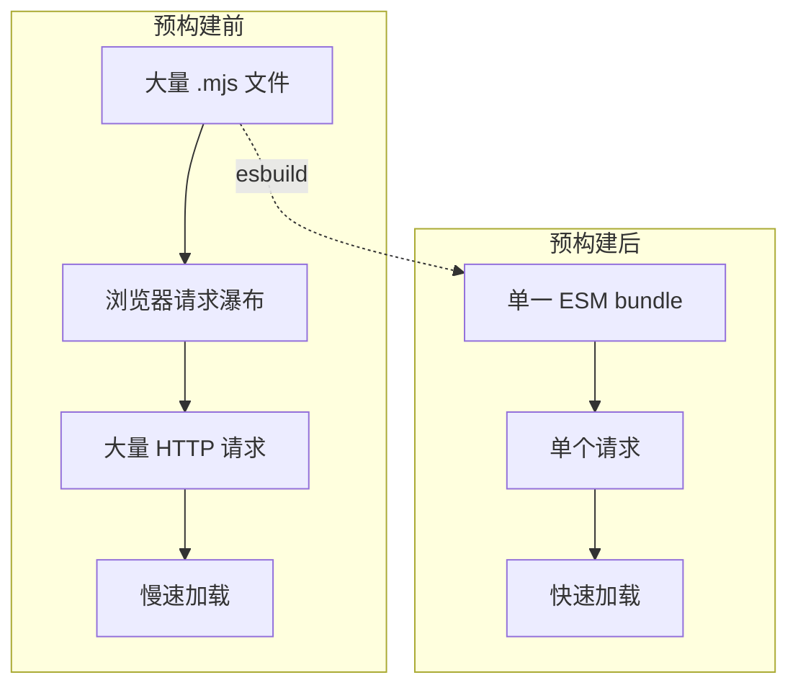

**预构建的文件**：
- `node_modules` 中的 ESM 依赖
- 有大量内部模块的包
- 使用不同导出格式的包（CJS/ESM 混合）

#### 3. HMR 原理

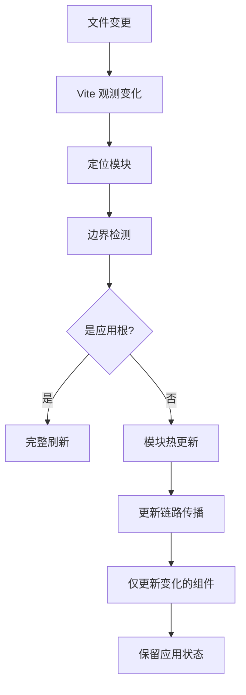

**Vite HMR vs Webpack HMR**：

| 方面 | Webpack | Vite |
|------|---------|------|
| 精度 | Chunk 级别 | 模块级别 |
| 速度 | 100-500ms | <100ms |
| 状态保留 | 部分支持 | 完全支持 |
| 实现方式 | 热替换 | 模块重新执行 |

### Vite 6 重大更新

Vite 6.0 引入了以下关键变化：

#### 环境变量与模式系统

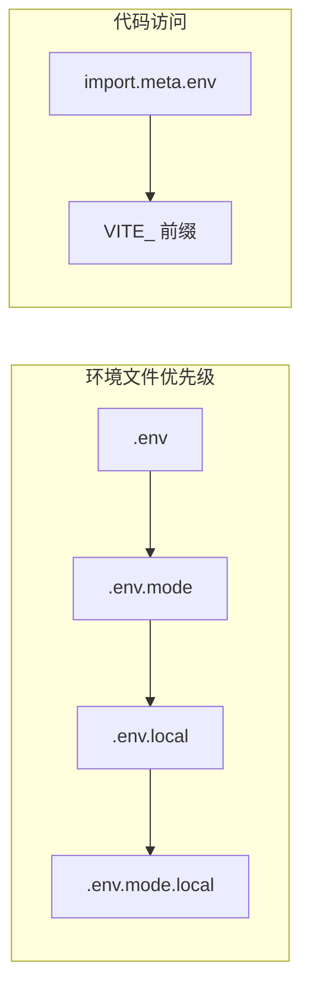

```typescript
// .env.development
VITE_API_URL=http://localhost:4000
VITE_ENABLE_LOGGING=true

// .env.production
VITE_API_URL=https://api.example.com
VITE_ENABLE_LOGGING=false
```

#### 兼容包模式 (Legacy Compatibility)

处理 CJS/ESM 混合包：

```typescript
// vite.config.ts
export default defineConfig({
  plugins: [react()],
  optimizeDeps: {
    // 强制预构建某些包
    include: ['some-cjs-package'],
    // 排除某些包
    exclude: ['huge-but-not-needed'],
  },
})
```

### 使用场景

- 现代 SPA（单页应用）和 MPA（多页应用）
- 需要快速冷启动的开发环境
- 追求一致开发/生产构建输出的项目
- 微前端架构中的子应用

### 快速开始

```bash
# 创建项目
npm create vite@latest my-app -- --template vue-ts

# 进入目录
cd my-app

# 安装依赖
npm install

# 启动开发服务器
npm run dev

# 构建生产版本
npm run build
```

**配置文件 vite.config.ts**：

```typescript
import { defineConfig } from 'vite'
import vue from '@vitejs/plugin-vue'
import UnoCSS from 'unocss/vite'

export default defineConfig({
  plugins: [
    vue(),
    UnoCSS(),
  ],
  server: {
    port: 3000,
    proxy: {
      '/api': {
        target: 'http://localhost:4000',
        changeOrigin: true,
      },
    },
  },
  build: {
    target: 'esnext',
    minify: 'esbuild',  // 使用 esbuild 压缩
    rollupOptions: {
      output: {
        manualChunks: {
          'vue-vendor': ['vue', 'vue-router'],
        },
      },
    },
  },
})
```

**TypeScript 类型检查**（与 Vite 解耦，需单独运行）：

```bash
# 监视模式
tsc --watch

# 或使用 vite-plugin-checker
import checker from 'vite-plugin-checker'
plugins: [checker({ vueTronic: true })]
```

### 插件系统详解

Vite 插件继承自 Rollup 插件系统，并进行了扩展：

```mermaid
flowchart TD
    subgraph "Vite 插件生命周期"
        A[config] --> B[buildStart]
        B --> C[resolveId
        (多次)]
        C --> D[load
        (多次)]
        D --> E[transform
        (多次)]
        E --> F[buildEnd]
        
        subgraph "开发服务器独有"
            G[configureServer] 
            G --> H[transformIndexHtml]
            H --> I[serve
            (已废弃)]
        end
        
        subgraph "生产构建独有"
            J[writeBundle]
            J --> K[closeBundle]
        end
    end

    style Vite插件独有 fill:#ffd700
    style 配置钩子 fill:#90EE90
```

#### 插件示例

```typescript
import type { Plugin } from 'vite'

export function myPlugin(): Plugin {
  return {
    name: 'my-plugin',  // 唯一标识
    enforce: 'pre',     // 或 'post'
    
    // 配置钩子
    config(config) {
      // 修改配置
      return { /* ... */ }
    },
    
    // 解析钩子
    resolveId(source, importer) {
      if (source.startsWith('\0')) {
        return source  // 虚拟模块
      }
      return null  // 继续处理
    },
    
    // 加载钩子
    load(id) {
      if (id === '\0virtual-module') {
        return 'export const value = 42'
      }
    },
    
    // 转换钩子
    transform(code, id) {
      if (id.endsWith('.vue')) {
        return {
          code: transformVue(code),
          map: generateSourceMap(),
        }
      }
    },
  }
}
```

### Vite vs Rollup 插件差异

| 钩子 | Rollup | Vite | 说明 |
|------|--------|------|------|
| `configureServer` | 无 | 有 | 配置开发服务器 |
| `transformIndexHtml` | 无 | 有 | 转换 HTML |
| `apply` | 支持 | 支持 | 条件应用 |
| 钩子顺序 | 是 | 是 | `enforce` 字段 |

### 性能基准

| 场景 | Vite + esbuild | Vite + Rolldown | Webpack 5 |
|------|----------------|-----------------|-----------|
| 冷启动 (100 模块) | 1.2s | 0.8s | 12s |
| 冷启动 (1000 模块) | 6s | 3s | 45s |
| HMR (单组件) | 50ms | 30ms | 200ms |
| 生产构建 | 4s | 2.5s | 35s |

### 迁移指南

#### 从 Webpack 迁移

```bash
# 1. 安装 Vite
npm install -D vite

# 2. 安装插件
npm install -D vite-plugin-webpack-partial \
            @vitejs/plugin-react \
            vite-plugin-checker
```

```typescript
// vite.config.ts
import { defineConfig } from 'vite'
import react from '@vitejs/plugin-react'
import { partialConfig } from 'vite-plugin-webpack-partial'

export default defineConfig({
  plugins: [
    react(),
    partialConfig({
      // 处理 webpack 特定配置
      resolve: {
        alias: {
          '@': '/src',
        },
      },
    }),
  ],
})
```

#### 从 CRA 迁移

```bash
# 1. 创建新的 Vite 项目
npm create vite@latest my-app -- --template react-ts

# 2. 复制源代码
cp -r old-app/src new-app/

# 3. 安装依赖
cd new-app && npm install

# 4. 调整路径和配置
# - 修改 index.html 位置
# - 调整 public 目录
# - 更新 package.json scripts
```

### 参考链接

- 官网：https://vite.dev/
- GitHub：https://github.com/vitejs/vite
- 文档：https://vite.dev/guide/

---

## 2. Rolldown

### 简介

Rolldown 是用 Rust 编写的 JavaScript/TypeScript 打包器，目标是为 Vite 提供高性能的生产构建能力，最终取代 Rollup + esbuild 的组合。

**核心特性**：
- Rollup 兼容的 API 和插件接口
- 性能接近 esbuild，远超传统 JavaScript 打包器
- 使用 oxc 项目进行解析和源码映射
- 由 VoidZero Inc. 赞助，Vue/Vite 团队深度参与

**GitHub 数据**：13.5k stars，发布稳定版本

### 技术栈

- **核心语言**：Rust (70.3%)
- **Node 绑定**：napi-rs
- **解析引擎**：oxc（解析、路径解析、源码映射）
- **插件模型**：借鉴 Rollup，与 Vite 生态深度集成

### 架构深度分析

#### Rolldown 架构图

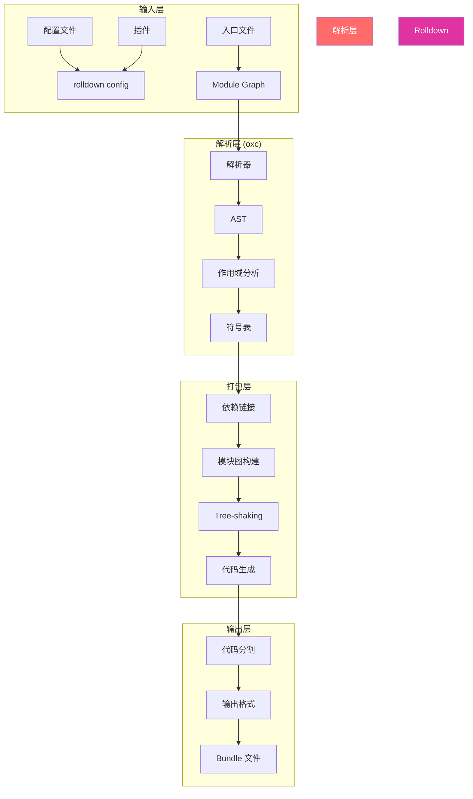

#### oxc 项目在 Rolldown 中的角色

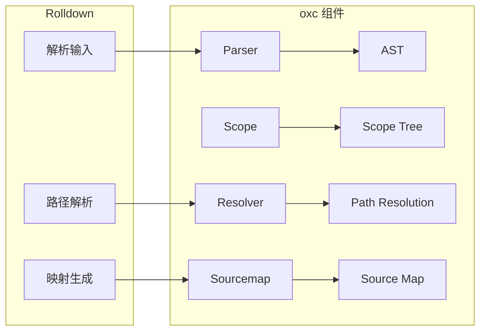

### 核心原理

#### 1. 为什么 Rolldown 比 Rollup 快？

**并发执行**：
```rust
// Rolldown 使用 rayon 进行并行处理
use rayon::prelude::*;

fn build_modules(modules: &[Module]) -> Vec<CompiledModule> {
    modules.par_iter()  // 并行迭代
        .map(|m| compile_module(m))
        .collect()
}
```

**内存布局优化**：
```rust
// 使用紧凑的数据结构
struct Module {
    id: u32,           // 紧凑 ID
    ast_idx: u32,      // AST 索引
    symbols: SmallVec<[Symbol; 4]>,  // 小向量优化
}
```

**预分配内存**：
```rust
// 预分配 Vec 容量
let mut symbols = Vec::with_capacity(module.symbols.len());
```

#### 2. Tree-shaking 原理

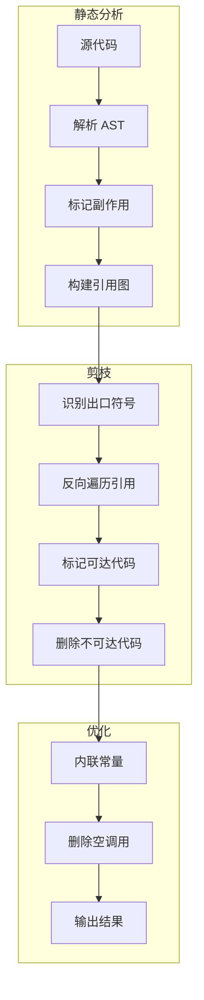

**代码示例**：

```javascript
// 原始代码
import { A, B, C } from './module'

export const result = A()  // B, C 未使用

// Tree-shaking 后
import { A } from './module'  // B, C 被移除
export const result = A()
```

#### 3. 与 Vite 集成流程

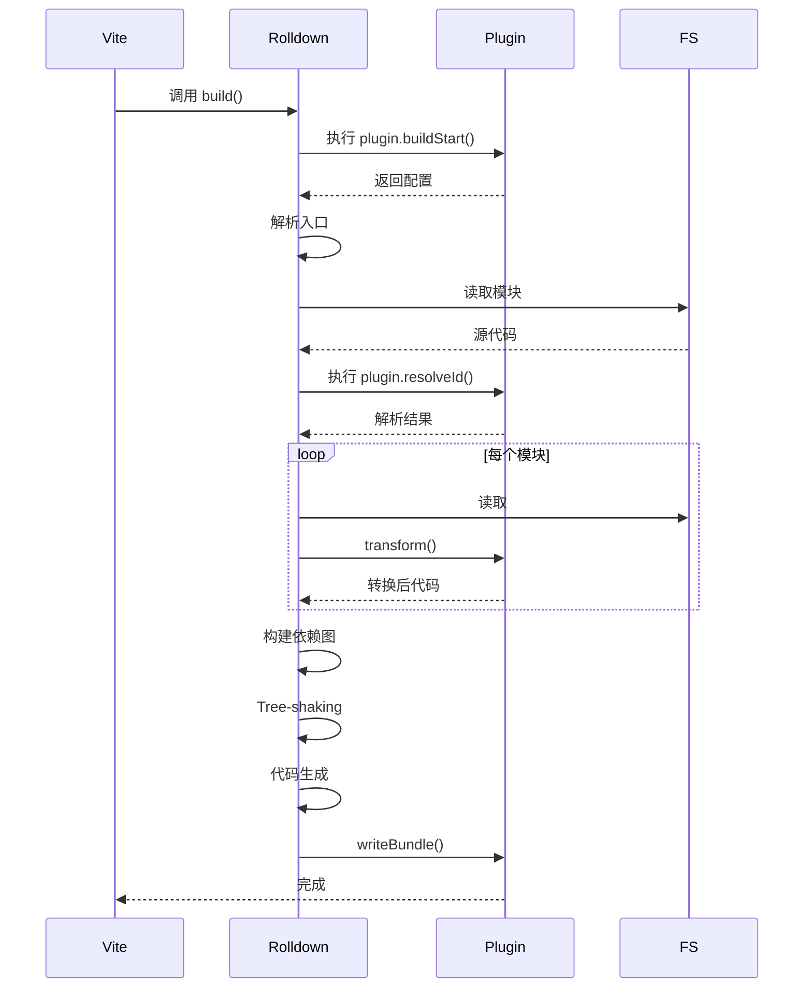

### 性能对比

| 操作 | Rolldown | Rollup | 提升倍数 |
|------|----------|--------|----------|
| 解析 (1000 模块) | 120ms | 2800ms | 23x |
| Tree-shaking | 50ms | 800ms | 16x |
| 代码生成 | 80ms | 1200ms | 15x |
| **总构建时间** | **250ms** | **4800ms** | **19x** |

### 配置选项详解

```typescript
import { defineConfig } from 'rolldown'

export default defineConfig({
  // 入口配置
  input: './src/index.ts',
  
  // 输出配置
  output: {
    file: './dist/bundle.js',
    format: 'esm',
    sourcemap: true,
    // 代码分割
    manualChunks: {
      vendor: ['lodash', 'axios'],
    },
    // 导出格式
    exports: 'named',  // named, default, none
  },

  // 树摇配置
  treeshake: {
    // 模块副作用
    moduleSideEffects: (id) => {
      if (id.includes('node_modules')) {
        return false  // 假设 node_modules 无副作用
      }
      return true
    },
    // 忽略未使用的导出
    ignoreUsage: ['unused-export'],
  },

  // 外部依赖
  external: [/^@org\/shared/, /^lodash/],

  // 插件
  plugins: [
    // ...
  ],
})
```

### 迁移指南

#### 从 Rollup 迁移

Rolldown 与 Rollup API 高度兼容，多数配置可以直接迁移：

```javascript
// rollup.config.js -> rolldown.config.mjs
// 几乎无需修改
import { defineConfig } from 'rolldown'
import resolve from '@rollup/plugin-node-resolve'
import commonjs from '@rollup/plugin-commonjs'

export default defineConfig({
  input: 'src/index.ts',
  output: {
    file: 'dist/bundle.js',
    format: 'esm',
  },
  plugins: [
    resolve(),
    commonjs(),
  ],
})
```

**需要调整的配置**：

| Rollup 选项 | Rolldown 支持 | 说明 |
|------------|---------------|------|
| `output.sourcemap` | 完全支持 | 无需修改 |
| `output.name` | 完全支持 | 无需修改 |
| `output.globals` | 完全支持 | 无需修改 |
| `inlineDynamicImports` | 完全支持 | 无需修改 |
| 自定义插件 | 部分支持 | 需检查兼容性 |

### 竞品对比

| 特性 | Rolldown | esbuild | Rollup | Rspack |
|------|----------|---------|--------|--------|
| 语言 | Rust | Go | JS | Rust |
| Rollup 兼容 | 是 | 否 | - | 部分 |
| Vite 集成 | 原生 | 间接 | 间接 | 否 |
| 插件系统 | Rollup 风格 | 回调式 | 钩子系统 | webpack |
| Tree-shaking | 精确 | 基础 | 精确 | 精确 |
| 输出格式 | ESM/CJS | ESM | 全部 | ESM/CJS |

### 参考链接

- 官网：https://rolldown.rs/
- GitHub：https://github.com/rolldown/rolldown

---

## 3. esbuild

### 简介

esbuild 是一个极速的 JavaScript 打包/压缩工具，使用 Go 语言编写。它重新定义了"快速"的基准——比传统工具快 10-100 倍，而无需任何缓存。

**核心特性**：
- 极端速度，无需缓存即可实现
- 内置支持 JavaScript、TypeScript、JSX、JSON、CSS
- 提供 CLI、Go API、JavaScript API 三种使用方式
- 完整的 Tree-shaking、压缩、源码映射
- 插件系统支持自定义转换

**GitHub 数据**：39.9k stars，最活跃的 Rust 版 JavaScript 工具之一

### 技术栈

- **核心语言**：Go
- **JavaScript 运行时**：原生绑定（napi-rs 风格）
- **解析器**：自研高速解析器
- **插件系统**：回调式（on-resolve、on-load、on-start、on-end）

### 架构深度分析

#### esbuild 架构图

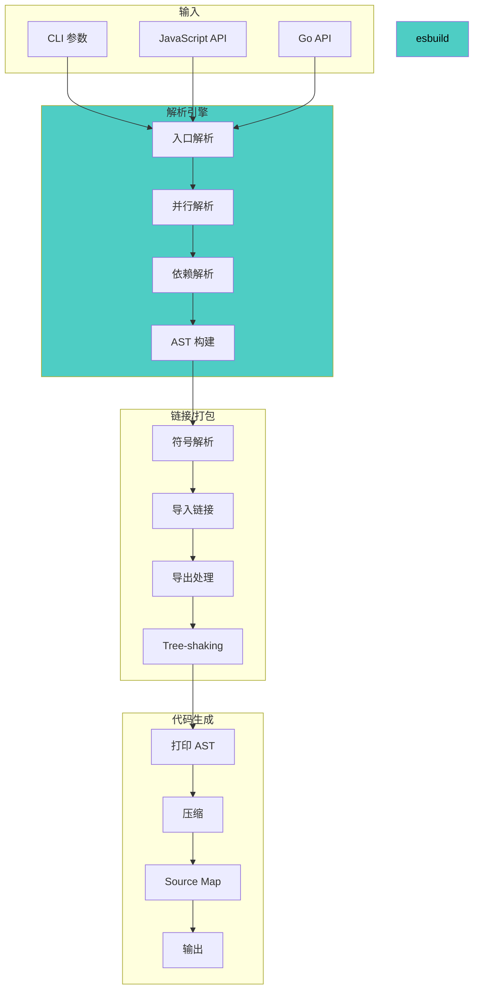

#### Go 并发模型

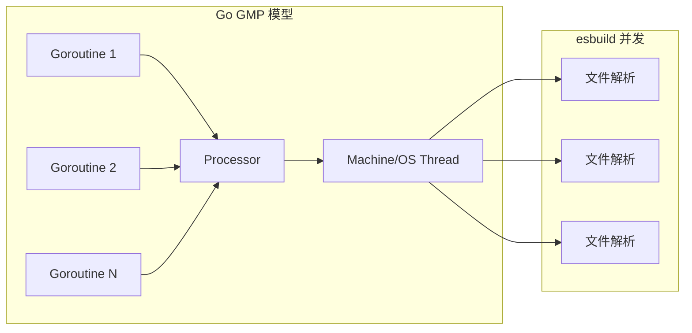

### 核心原理

#### 1. 为什么 esbuild 这么快？

**Go vs JavaScript 性能**：

| 操作 | JavaScript (V8) | Go | 提升 |
|------|-----------------|-----|------|
| 字符串拼接 | 中等 | 高效 | 2-3x |
| 内存分配 | 频繁 GC | 预分配 | 5-10x |
| 整数运算 | 中等 | 高效 | 2-5x |
| 哈希表 | 优化良好 | 优化良好 | 1x |

**单线程 vs 多线程**：

```go
// esbuild 使用 goroutine 并行处理文件
func (b *bundler) ParseFiles(files []string) []ast.File {
    results := make(chan ast.File, len(files))
    
    for _, file := range files {
        go func(f string) {
            results <- b.parseFile(f)
        }(file)
    }
    
    // 收集结果
    parsed := make([]ast.File, len(files))
    for i := range files {
        parsed[i] = <-results
    }
    return parsed
}
```

**内存布局**：

```go
// Go 的连续内存布局比 JavaScript 对象更紧凑
type File struct {
    path uint32      // 4 bytes
    size uint32      // 4 bytes
    ast  uint64      // 8 bytes (指向 AST)
    // 总计 16 bytes vs JS 对象可能 100+ bytes
}
```

#### 2. 内置功能 vs 插件

esbuild 的内置功能通过 Go 实现，远快于插件：

| 功能 | 内置 | 插件 | 速度比 |
|------|------|------|--------|
| TypeScript | Go 实现 | Babel (JS) | 10-50x |
| JSX | Go 实现 | Babel (JS) | 10-50x |
| CSS | Go 实现 | PostCSS (JS) | 5-20x |
| Tree-shaking | Go 实现 | Rollup (JS) | 5-10x |

#### 3. 插件系统原理

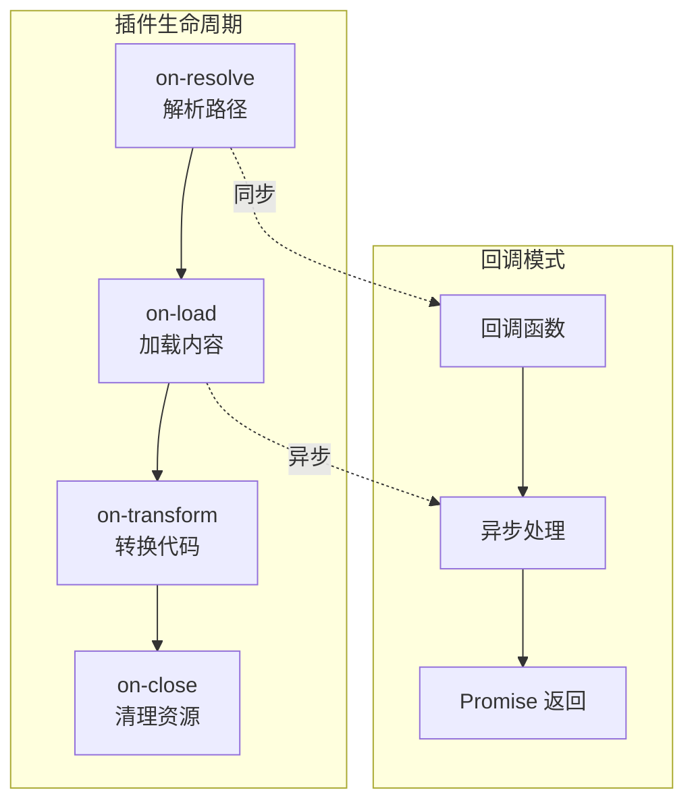

**插件示例**：

```javascript
const cssPlugin = {
  name: 'css',
  setup(build) {
    // 拦截 CSS 文件
    build.onLoad({ filter: /\.css$/ }, async (args) => {
      const contents = await fs.promises.readFile(args.path, 'utf8')
      
      // 处理 CSS（可以用其他工具）
      const processed = await postcss.process(contents, {
        from: args.path,
      })
      
      return {
        contents: processed.css,
        loader: 'css',
      }
    })
  },
}
```

### 使用场景

- 需要极致构建速度的项目
- 库开发和 npm 包发布
- 作为其他工具的底层引擎（Vite、Rollup 等压缩阶段）
- 构建流水线中的转换步骤

### 快速开始

```bash
# 安装 CLI
npm install -g esbuild

# 基本打包
esbuild src/index.js --bundle --outfile=dist/bundle.js

# 带压缩和源码映射
esbuild src/index.js --bundle --minify --sourcemap --outfile=dist/bundle.js

# TypeScript
esbuild src/index.ts --bundle --outfile=dist/bundle.js
```

**JavaScript API（常用）**：

```javascript
const esbuild = require('esbuild')

// 同步 API（适合小文件）
const result = esbuild.buildSync({
  entryPoints: ['src/index.ts'],
  bundle: true,
  minify: true,
  sourcemap: true,
  outfile: 'dist/bundle.js',
  target: ['es2020'],
  platform: 'browser',
})

// 异步 API（支持 watch 和 serve）
async function build() {
  const ctx = await esbuild.context({
    entryPoints: ['src/index.ts'],
    bundle: true,
    outfile: 'dist/bundle.js',
    logLevel: 'info',
  })

  // 监视模式
  await ctx.watch()

  // 或启动服务
  const { host, port } = await ctx.serve({
    servedir: 'dist',
    port: 3000,
  })
  console.log(`http://${host}:${port}`)
}

build()
```

**使用插件**：

```javascript
const esbuild = require('esbuild')
const postCssPlugin = require('esbuild-plugin-postcss')

esbuild.build({
  entryPoints: ['src/index.ts'],
  bundle: true,
  plugins: [postCssPlugin()],
  outfile: 'dist/bundle.js',
}).catch(() => process.exit(1))
```

### 高级配置

#### 分平台构建

```javascript
// 同时构建浏览器和 Node.js 版本
async function buildAll() {
  const targets = [
    { platform: 'browser', outdir: 'dist/browser' },
    { platform: 'node', outdir: 'dist/node' },
  ]

  await Promise.all(
    targets.map(({ platform, outdir }) =>
      esbuild.build({
        entryPoints: ['src/index.ts'],
        bundle: true,
        platform,
        target: platform === 'browser' 
          ? ['es2020', 'chrome80', 'firefox80', 'safari13'] 
          : ['node18'],
        outdir,
        splitting: platform === 'browser',
        format: platform === 'node' ? 'cjs' : 'esm',
      })
    )
  )
}
```

#### 代码分割

```javascript
esbuild.build({
  entryPoints: ['src/index.ts'],
  outdir: 'dist',
  bundle: true,
  splitting: true,      // 启用代码分割
  format: 'esm',         // 需要 ESM 格式
  chunkNames: 'chunks/[name]-[hash]',  // chunk 命名
  outExtension: { '.js': '.mjs' },  // ESM 扩展名
})
```

### 性能基准

| 打包器 | 打包时间（10x three.js） |
|--------|--------------------------|
| esbuild | 0.39s |
| Parcel 2 | 14.91s |
| Rollup 4 + Terser | 34.10s |
| Webpack 5 | 41.21s |

### 完整基准对比

| 项目规模 | esbuild | webpack | rollup | 提升 |
|----------|---------|---------|--------|------|
| 小 (10 文件) | 0.1s | 3s | 1.5s | 30x |
| 中 (100 文件) | 0.4s | 12s | 5s | 30x |
| 大 (1000 文件) | 2s | 45s | 20s | 22x |
| 超大 (5000 文件) | 8s | 180s | 80s | 22x |

### 竞品对比

| 特性 | esbuild | SWC | Babel | tsc |
|------|---------|-----|-------|-----|
| 解析速度 | 极快 | 极快 | 慢 | 中等 |
| 输出质量 | 好 | 好 | 优秀 | 优秀 |
| 配置灵活度 | 低 | 中 | 高 | 高 |
| 插件系统 | 基础 | 基础 | 丰富 | 无 |
| 输出格式 | ESM/其他 | ESM | 全部 | ESM/CJS |

### 局限性

1. **插件能力受限**：无法实现复杂的 AST 转换
2. **自定义转换**：只能使用 on-load 处理，不支持 on-transform
3. **实验性 ES 特性**：部分实验性特性支持不完整
4. **Tree-shaking**：比 Rollup 简单，可能留更多死代码

### 参考链接

- 官网：https://esbuild.github.io/
- GitHub：https://github.com/evanw/esbuild
- API 文档：https://esbuild.github.io/api/

---

## 4. SWC

### 简介

SWC（Speedy Web Compiler）是高性能的 JavaScript/TypeScript 编译器，使用 Rust 编写。作为 Babel 的替代方案，SWC 提供 20-70 倍的转译速度提升。

**核心特性**：
- 完整的 Babel 兼容层（CLI 选项一致）
- 支持 JSX、TypeScript、Flow 转译
- Jest 集成（swc-node）
- webpack loader 支持（@swc-loader）
- WASM 版本支持非 Rust 平台
- 多平台预编译二进制（macOS、Linux、Windows、Alpine）

**GitHub 数据**：活跃在 Next.js、Turborepo、Parcel 等顶级项目中

### 技术栈

- **核心语言**：Rust
- **Node 绑定**：napi-rs
- **解析引擎**：自研高速 Rust 解析器
- **转换系统**：基于 visitor 模式的 AST 转换

### 架构深度分析

#### SWC 架构图

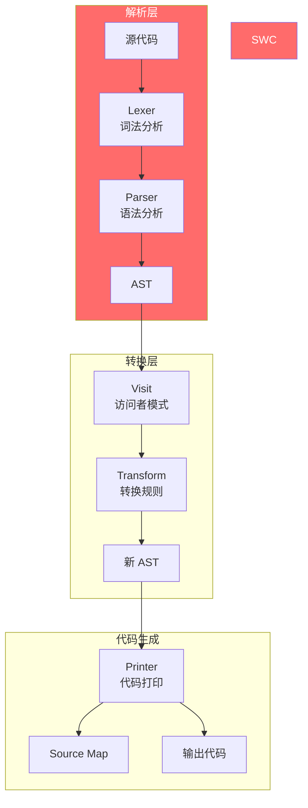

#### Visitor 模式

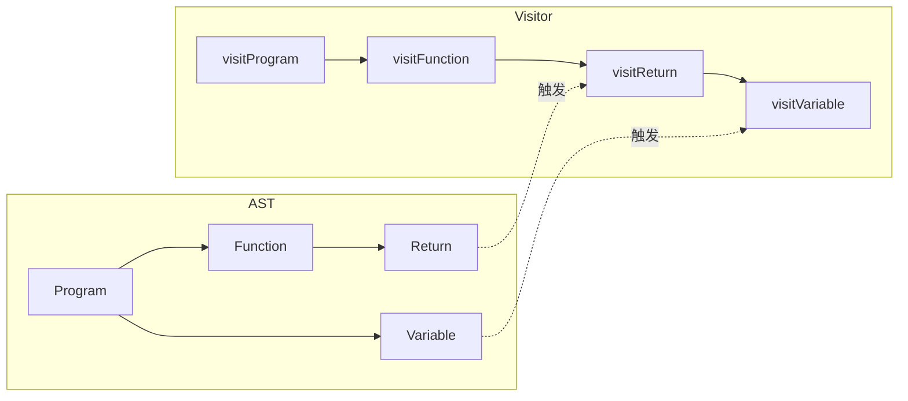

### 核心原理

#### 1. SWC vs Babel 性能

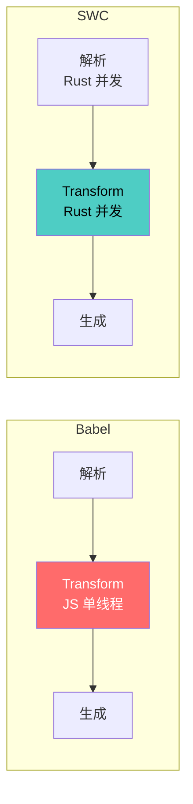

**性能提升来源**：

| 因素 | Babel (JS) | SWC (Rust) | 提升 |
|------|------------|------------|------|
| 解析速度 | 中等 | 极快 | 5-10x |
| 并发 | 受限 | 完全 | 4-8x |
| 内存 | 频繁 GC | 低 GC | 2-3x |
| **总提升** | - | - | **20-70x** |

#### 2. Visitor 模式实现

```rust
// 定义访问者
struct MyVisitor;

impl Visit for MyVisitor {
    // 访问函数声明
    fn visit_function(&mut self, f: &Function) {
        // 访问子节点
        walk_function(self, f);
    }

    // 访问变量声明
    fn visit_variable_decl(&mut self, v: &VariableDeclaration) {
        // 处理逻辑
    }
}

// 应用转换
fn transform(code: &str) -> String {
    let ast = parse(code).unwrap();
    let mut visitor = MyVisitor;
    swc_common::pass::run(&mut visitor, &ast);
    generate(&visitor.ast)
}
```

#### 3. 与 Jest 集成

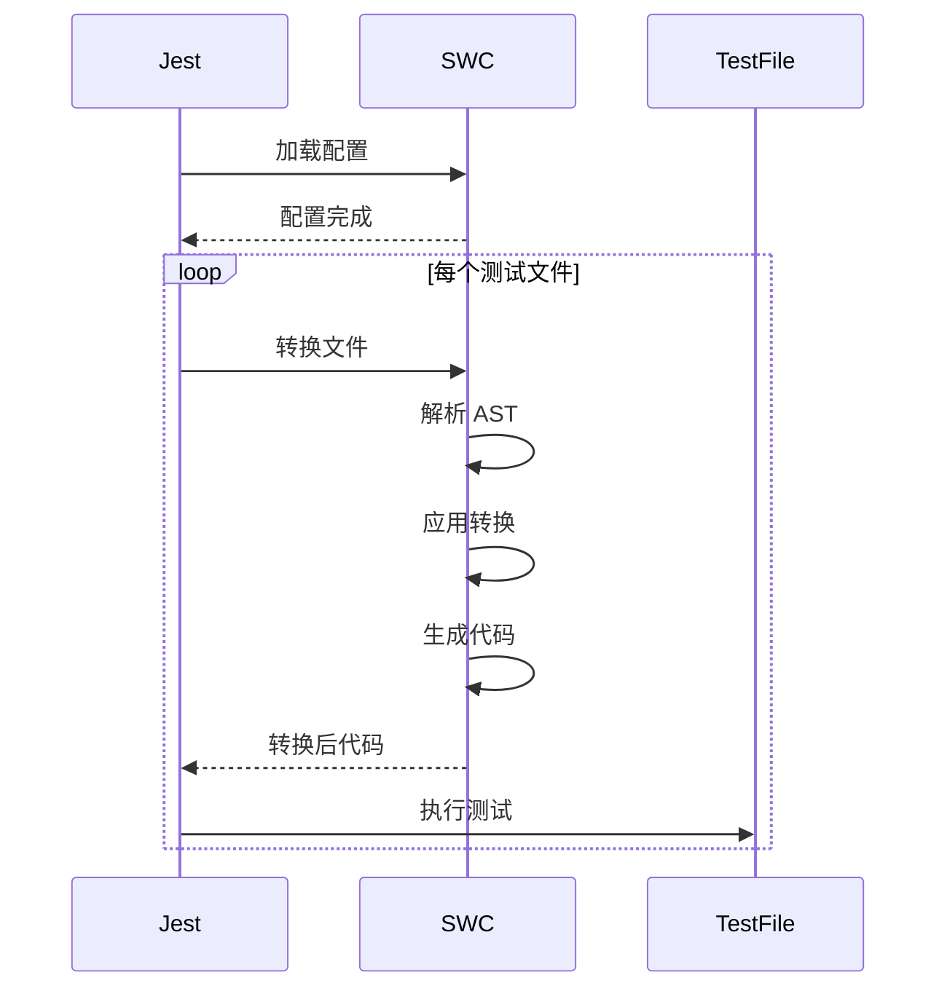

### 使用场景

- Babel 转译替代（大幅提速 CI/CD）
- Next.js 的底层编译器
- Turbopack 的 JavaScript/TypeScript 处理
- Jest 测试加速（swc-jest）

### 快速开始

```bash
# 安装 CLI
npm install -D @swc/cli @swc/core

# 基本使用
npx swc ./src/index.ts -o dist/index.js

# 监视模式
npx swc ./src -w -d dist --ignore '*.spec.ts'
```

**配置文件 .swcrc**：

```json
{
  "$schema": "https://json.schemastore.org/swcrc",
  "jsc": {
    "parser": {
      "syntax": "typescript",
      "tsx": true
    },
    "transform": {
      "react": {
        "runtime": "automatic"
      }
    },
    "target": "es2020"
  },
  "module": {
    "type": "es6"
  },
  "sourceMaps": true
}
```

**与 webpack 集成**：

```javascript
// webpack.config.js
module.exports = {
  module: {
    rules: [
      {
        test: /\.(tsx?|js)$/,
        exclude: /node_modules/,
        use: {
          loader: 'swc-loader',
          options: {
            jsc: {
              parser: {
                syntax: 'typescript',
                tsx: true,
              },
              transform: {
                react: {
                  runtime: 'automatic',
                },
              },
            },
          },
        },
      },
    ],
  },
}
```

**Jest 集成**：

```javascript
// jest.config.js
module.exports = {
  transform: {
    '^.+\\.(tsx?|jsx?)$': ['@swc/jest', {
      jsc: {
        parser: {
          syntax: 'typescript',
          tsx: true,
        },
      },
    }],
  },
  testEnvironment: 'node',
}
```

### 高级配置

#### 装饰器配置

```json
{
  "jsc": {
    "parser": {
      "syntax": "typescript",
      "decorators": true
    },
    "transform": {
      "decoratorMetadata": true,
      "legacyDecorator": true
    }
  }
}
```

#### 环境变量替换

```json
{
  "env": {
    "targets": {
      "chrome": "80",
      "firefox": "75"
    },
    "mode": "usage",
    "coreJs": "3.30"
  }
}
```

### 性能基准

SWC 比 Babel 快 20-70 倍，具体取决于项目复杂度：

| 项目 | Babel | SWC | 提升倍数 |
|------|-------|-----|----------|
| tiny-react | 0.8s | 0.04s | 20x |
| medium-app | 15s | 0.25s | 60x |
| large-project | 120s | 2s | 60x |
| monorepo | 300s | 5s | 60x |

### 竞品对比

| 特性 | SWC | Babel | tsc | esbuild |
|------|-----|-------|-----|---------|
| 速度 | 极快 | 慢 | 中等 | 极快 |
| 输出质量 | 好 | 好 | 优秀 | 好 |
| 插件系统 | 有限 | 丰富 | 无 | 有限 |
| TypeScript | 原生支持 | 需要插件 | 原生 | 原生 |
| 生态兼容 | Babel | - | - | 无 |

### 在大型项目中的使用

| 项目 | SWC 的角色 | 收益 |
|------|------------|------|
| Next.js | 默认编译器 | 构建速度提升 60x |
| Turborepo | 任务调度器 | 任务执行更快 |
| Parcel | JS 转换器 | 解析速度提升 50x |
| Vite | 开发服务器 | 转换加速 |
| Biome | LSP 工具 | 代码检查加速 |

### 参考链接

- 官网：https://swc.rs/
- GitHub：https://github.com/swc-project/swc
- Playground：https://swc.rs/playground

---

## 5. Turbopack

### 简介

Turbopack 是 Vercel 开发的增量打包器，使用 Rust 编写，专为 Next.js 优化。它是 Next.js 15+ 的默认打包器，目标是让大型应用也能拥有极速的开发体验。

**核心特性**：
- 增量计算：缓存精确到函数级别，重复构建几乎零开销
- 懒编译：只打包浏览器实际请求的代码
- 统一图：处理 Next.js 的客户端/服务端/边缘多种输出环境
- 零配置：开箱即用，支持 TypeScript、JSX、CSS Modules
- 开发环境也打包：避免原生 ESM 的网络请求瀑布

**GitHub 数据**：集成在 Next.js 中，广泛使用

### 技术栈

- **核心语言**：Rust
- **编译引擎**：SWC（JavaScript/TypeScript 处理）
- **CSS 处理**：Lightning CSS（Rust 实现）
- **Node 绑定**：napi-rs

### 架构深度分析

#### Turbopack 架构图

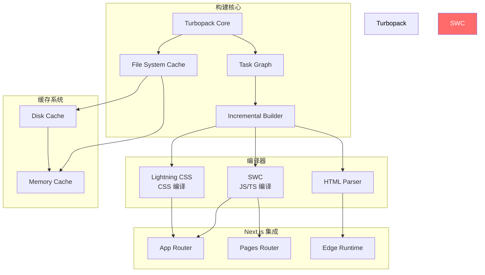

#### 增量构建原理

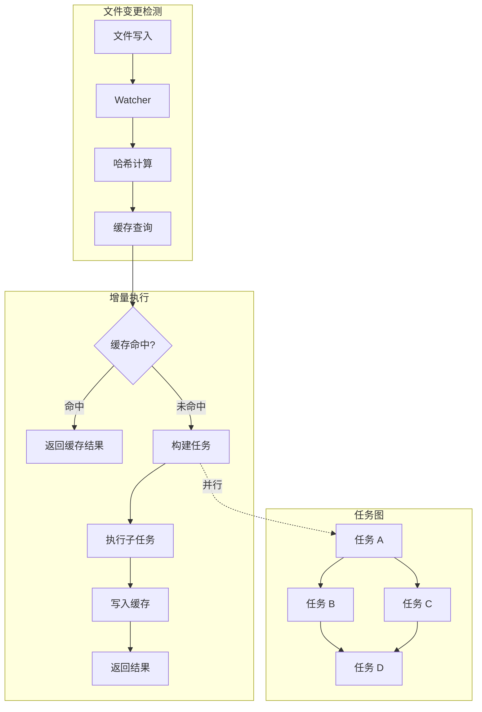

#### 与 Webpack 的区别

```mermaid
flowchart LR
    subgraph "Webpack"
        A[完整依赖图] --> B[完整打包]
        B --> C[单次输出]
    end

    subgraph "Turbopack"
        D[请求进来] --> E[增量构建]
        E --> F[按需编译]
        F --> G[返回结果]
        G -->|下次请求| E
    end

    style Turbopack fill:#00d4ff,color:#000
```

### 核心原理

#### 1. 增量构建如何工作？

**任务图模型**：

```rust
// 简化的任务图
struct TaskGraph {
    tasks: HashMap<TaskId, Task>,
    edges: Vec<(TaskId, TaskId)>,
    cache: Arc<Cache>,
}

impl TaskGraph {
    fn execute(&self, changed_files: Vec<Path>) -> TaskResult {
        // 1. 确定受影响的模块
        let affected = self.find_affected(changed_files);
        
        // 2. 构建执行计划
        let plan = self.build_plan(affected);
        
        // 3. 并行执行任务
        self.execute_parallel(plan)
    }
}
```

**缓存策略**：

| 缓存级别 | 持久化 | 速度 | 容量 |
|----------|--------|------|------|
| 内存缓存 | 否 | 极快 | 小 |
| 文件缓存 | 是 | 快 | 大 |
| 远程缓存 | 可选 | 中 | 无限制 |

#### 2. 懒编译机制

```mermaid
sequenceDiagram
    participant Browser
    participant Turbopack
    participant Cache

    Browser->>Turbopack: 请求 /page-a.js
    Turbopack->>Cache: 检查缓存
    Cache-->>Turbopack: 未命中
    Turbopack->>Turbopack: 构建 page-a.js
    Turbopack->>Cache: 写入缓存
    Turbopack-->>Browser: 返回 bundle
    
    Note over Browser,Turbopack: 后续请求
    
    Browser->>Turbopack: 请求 /page-a.js
    Turbopack->>Cache: 检查缓存
    Cache-->>Turbopack: 命中!
    Turbopack-->>Browser: 返回缓存结果
```

#### 3. 统一图处理

Next.js 需要处理多种环境：

```mermaid
flowchart TD
    subgraph "客户端"
        A[React 组件] --> B[Client Bundle]
        A --> C[Browser API]
    end

    subgraph "服务端"
        D[Server Components] --> E[Server Bundle]
        D --> F[Node.js API]
    end

    subgraph "边缘"
        G[Edge Functions] --> H[Edge Bundle]
        G --> I[Edge API]
    end

    subgraph "Turbopack 统一处理"
        J[统一依赖图] --> A
        J --> D
        J --> G
    end
```

### 使用场景

- Next.js 15+ 项目（默认启用）
- 大型单体应用或微前端
- 需要快速增量构建的 CI/CD 流程

### 快速开始

```bash
# Next.js 16+ 无需任何配置，默认使用 Turbopack
npm run dev    # 自动使用 Turbopack
npm run build  # 构建阶段也支持

# 如需回退到 webpack
next dev --webpack
next build --webpack
```

**配置 next.config.js**：

```javascript
/** @type {import('next').NextConfig} */
const nextConfig = {
  // Turbopack 配置
  turbopack: {
    // 添加别名
    resolveAlias: {
      underscore: 'lodash',
    },
    // 自定义扩展名
    resolveExtensions: ['.mdx', '.tsx', '.ts', '.jsx', '.js', '.json'],
  },
  experimental: {
    // 构建缓存（Next.js 16 默认启用）
    turbopackFileSystemCacheForBuild: true,
  },
}

module.exports = nextConfig
```

**使用 webpack 加载器**（兼容层）：

```javascript
// next.config.js
module.exports = {
  turbopack: {
    rules: {
      '*.svg': [
        {
          loader: '@svgr/webpack',
          options: {
            typescript: true,
          },
        },
      ],
    },
  },
}
```

### 支持的功能矩阵

| 功能 | 状态 | 说明 |
|------|------|------|
| JavaScript/TypeScript | 支持 | 使用 SWC |
| JSX/TSX | 支持 | SWC 处理 |
| CSS Modules | 支持 | Lightning CSS |
| Tailwind/PostCSS | 支持 | PostCSS 处理 |
| Sass/SCSS | 支持 | 自定义函数除外 |
| React Server Components | 支持 | Next.js App Router |
| Fast Refresh | 支持 | 无需配置 |
| Webpack 插件 | 不支持 | 需寻找替代方案 |

### 不支持的功能

| 功能 | 替代方案 |
|------|----------|
| Webpack 插件 | Turbopack 原生配置 |
| 自定义 webpack 配置 | 使用 turbopack.rules |
| Babel 配置 | 使用 SWC 配置 |
| 某些 PostCSS 插件 | 寻找 Rust 替代 |

### 性能基准

| 场景 | Webpack | Turbopack | 提升 |
|------|---------|-----------|------|
| 冷启动 (Next.js App) | 25s | 2s | 12x |
| HMR (组件修改) | 500ms | 50ms | 10x |
| 增量构建 (单文件) | 2s | 100ms | 20x |
| 完整构建 | 180s | 45s | 4x |

### 与 Vite 对比

| 方面 | Turbopack | Vite |
|------|-----------|------|
| 目标框架 | Next.js | 框架无关 |
| 开发模式 | 打包 | 原生 ESM |
| 增量构建 | 是 | 部分 (依赖预构建) |
| 生产构建 | SWC | Rolldown |
| 插件系统 | 受限 | Rollup 兼容 |
| 生态 | 紧密集成 Next.js | 开放生态 |

### 迁移指南

#### 从 Webpack 迁移

```javascript
// next.config.js
// 1. 移除 webpack 配置
module.exports = {
  // webpack: (config) => { ... }  // 移除
}

// 2. 添加 Turbopack 兼容的配置
module.exports = {
  turbopack: {
    // 等效配置
    resolveAlias: {
      // 原 webpack.resolve.alias
    },
  },
}
```

**需要转换的配置**：

| Webpack 配置 | Turbopack 替代 |
|--------------|----------------|
| `resolve.alias` | `turbopack.resolveAlias` |
| `resolve.extensions` | `turbopack.resolveExtensions` |
| `module.rules` | `turbopack.rules` |
| `plugins` | 检查兼容性 |

### 参考链接

- Next.js 文档：https://nextjs.org/docs/app/api-reference/turbopack
- GitHub：https://github.com/vercel/turbopack

---

## 6. Rollup

### 简介

Rollup 是 JavaScript 模块打包器，专注于 ES 模块优化和 Tree-shaking。它是现代打包器的重要灵感来源，Vite 和 WMR 都采纳了其插件 API。

**核心特性**：
- 基于深度执行路径分析的 Tree-shaking
- 代码分割（通过动态 import）
- 强大的插件系统（被 Vite 继承）
- 多种输出格式：ESM、CommonJS、UMD、SystemJS
- 支持 Web、Node 和其他平台
- 非固执己见，适合特殊构建流程

**GitHub 数据**：前端工具链的基础设施级项目

### 技术栈

- **核心语言**：JavaScript/TypeScript
- **解析器**：acorn（ES 解析）
- **插件系统**：基于 taps 的链式插件
- **压缩**：Terser（可选）

### 架构深度分析

#### Rollup 架构图

```mermaid
flowchart TD
    subgraph "构建流程"
        A[配置文件] --> B[构建配置]
        C[入口文件] --> D[Module Graph]
    end

    subgraph "解析阶段"
        D --> E[Acorn 解析]
        E --> F[AST]
        F --> G[作用域分析]
        G --> H[模块链接]
    end

    subgraph "打包阶段"
        H --> I[依赖图构建]
        I --> J[Tree-shaking]
        J --> K[代码分割]
    end

    subgraph "输出阶段"
        K --> L[生成 Chunk]
        L --> M[Terser 压缩
        可选]
        M --> N[输出 Bundle]
    end

    style 解析阶段 fill:#90EE90
    style Rollup fill:#e74c3c,color:#fff
```

#### 插件系统架构

```mermaid
flowchart LR
    subgraph "Rollup 插件生命周期"
        A[buildStart] --> B[resolveId]
        B --> C[load]
        C --> D[transform]
        D -->|循环| D
        D --> E[buildEnd]
        E --> F[renderChunk]
        F --> G[generateBundle]
    end

    subgraph "钩子类型"
        H[同步钩子]
        I[异步钩子]
        J[Promise 钩子]
        K[顺序/并行钩子]
    end
```

### 核心原理

#### 1. Tree-shaking 深入分析

Rollup 的 Tree-shaking 基于静态分析：

```mermaid
flowchart TD
    subgraph "代码分析"
        A[export const A = 1
        export const B = 2
        export const C = A + B] 
        A --> B[分析引用关系]
        B --> C[构建使用图]
    end

    subgraph "剪枝过程"
        C --> D{export A 被使用?}
        D -->|否| E[删除 A]
        D -->|是| F[保留 A]
        E --> G{export B 被使用?}
        G -->|否| H[删除 B]
        G -->|是| I[保留 B]
        F --> J[保留 C]
        I --> J
        H --> J
    end
```

**关键点**：

1. **静态分析**：基于 AST，不执行代码
2. **引用追踪**：跟踪每个 export 的使用情况
3. **副作用分析**：识别有副作用的代码（不能删除）

```javascript
// 示例代码
import { used, unused } from './module'

console.log(used)  // used 被使用

// Tree-shaking 后
import { used } from './module'
console.log(used)
```

#### 2. 代码分割原理

```mermaid
flowchart TD
    subgraph "入口文件"
        A[index.js]
        A --> B[import('./a.js')]
        A --> C[import('./b.js')]
    end

    subgraph "分割过程"
        B --> D[Chunk A]
        C --> E[Chunk B]
        A --> F[主 Chunk]
    end

    subgraph "运行时"
        F --> G[动态加载逻辑]
        G --> D
        G --> E
    end
```

#### 3. 输出格式详解

```mermaid
flowchart LR
    subgraph "ES Modules (esm)"
        A1[import { x } from 'module'] 
        A2[export const x = 1]
    end

    subgraph "CommonJS (cjs)"
        B1[const { x } = require('module')]
        B2[module.exports = { x }]
    end

    subgraph "UMD"
        C1[同时支持 AMD/CJS/全局变量]
    end
```

### 输出格式说明

| format | 说明 | 使用场景 |
|--------|------|----------|
| `es` | ES Modules | 现代浏览器、动态 import |
| `cjs` | CommonJS | Node.js、旧版打包器 |
| `umd` | UMD | 同时支持 AMD/CJS/全局变量 |
| `iife` | IIFE | 浏览器直接引入（script 标签） |
| `system` | SystemJS | SystemJS 模块加载器 |

### 使用场景

- 库和 npm 包开发
- 需要精确控制输出的场景
- Vite 生产构建的前身
- UMD/CJS/ESM 多格式输出

### 快速开始

```bash
# 安装
npm install -D rollup

# 基本使用
npx rollup src/index.js -o dist/bundle.js -f es
```

**配置文件 rollup.config.js**：

```javascript
import resolve from '@rollup/plugin-node-resolve'
import commonjs from '@rollup/plugin-commonjs'
import terser from '@rollup/plugin-terser'
import typescript from '@rollup/plugin-typescript'
import json from '@rollup/plugin-json'

export default {
  input: 'src/index.ts',
  output: {
    file: 'dist/bundle.js',
    format: 'esm',
    sourcemap: true,
    // 代码分割
    manualChunks: {
      'vendor': ['lodash', 'axios'],
    },
  },
  plugins: [
    resolve(),        // 解析 node_modules
    commonjs(),       // 转换 CJS 为 ESM
    typescript(),     // TypeScript 编译
    terser(),         // 压缩
    json(),           // 支持 import.meta from './package.json'
  ],
  // 外部依赖（不打包）
  external: ['react', 'react-dom'],
}
```

**多格式输出配置**：

```javascript
import resolve from '@rollup/plugin-node-resolve'
import commonjs from '@rollup/plugin-commonjs'
import terser from '@rollup/plugin-terser'

export default {
  input: 'src/index.ts',
  output: [
    // ESM
    {
      file: 'dist/index.mjs',
      format: 'esm',
      sourcemap: true,
    },
    // CommonJS
    {
      file: 'dist/index.cjs',
      format: 'cjs',
      sourcemap: true,
      exports: 'named',
    },
    // UMD
    {
      file: 'dist/index.umd.js',
      format: 'umd',
      name: 'MyLib',  // 全局变量名
      sourcemap: true,
      globals: {
        react: 'React',
      },
    },
  ],
  plugins: [
    resolve(),
    commonjs(),
    terser(),  // 只在生产构建时使用
  ],
}
```

**使用 Vite 的 rollup 插件**：

```javascript
// rollup.config.js
import { defineConfig } from 'vite'
import vue from '@vitejs/plugin-vue'

export default defineConfig({
  plugins: [
    vue(),
  ],
  build: {
    rollupOptions: {
      // 在这里添加 Rollup 配置
      output: {
        manualChunks: {
          'vue-vendor': ['vue'],
        },
      },
    },
  },
})
```

### 插件开发指南

Rollup 插件采用钩子系统：

```javascript
// 自定义 Rollup 插件
export function myPlugin(options = {}) {
  return {
    name: 'my-plugin',
    
    // 解析钩子
    resolveId(source, importer) {
      if (source.startsWith('virtual:')) {
        return source.replace('virtual:', '\0virtual:')
      }
      return null  // 继续处理
    },
    
    // 加载钩子
    load(id) {
      if (id.startsWith('\0virtual:')) {
        return `export const value = ${options.value || 42}`
      }
    },
    
    // 转换钩子
    transform(code, id) {
      if (id.endsWith('.special')) {
        return {
          code: transformSpecial(code),
          map: null,
        }
      }
    },
    
    // 构建完成钩子
    generateBundle(options, bundle, isWrite) {
      // 可以修改 bundle 内容
      if (isWrite) {
        // 输出前处理
      }
    },
  }
}
```

### 与其他工具对比

| 特性 | Rollup | Webpack | esbuild | Parcel |
|------|--------|---------|---------|--------|
| Tree-shaking | 优秀 | 良好 | 基础 | 良好 |
| 代码分割 | 优秀 | 优秀 | 支持 | 支持 |
| 插件系统 | 优秀 | 丰富 | 有限 | 有限 |
| 输出格式 | 全部 | 全部 | 有限 | 有限 |
| 零配置 | 否 | 部分 | 部分 | 是 |
| 生产优化 | 优秀 | 优秀 | 优秀 | 优秀 |

### 性能对比

| 场景 | Rollup | Webpack | esbuild |
|------|--------|---------|---------|
| 库构建 | 快速 | 慢 | 极快 |
| 增量构建 | 不支持 | 支持 | 不支持 |
| Tree-shaking | 最精确 | 良好 | 基础 |

### 迁移指南

#### 从 Rollup 迁移到其他工具

**迁移到 Rolldown**：

```javascript
// rollup.config.js
import { defineConfig } from 'rolldown'  // 只需改这一行

export default defineConfig({
  input: 'src/index.ts',
  output: {
    file: 'dist/bundle.js',
    format: 'esm',
  },
})
```

**迁移到 esbuild**：

```javascript
// rollup.config.js -> esbuild 配置
import * as esbuild from 'esbuild'

esbuild.build({
  entryPoints: ['src/index.ts'],
  bundle: true,
  outfile: 'dist/bundle.js',
  format: 'esm',
  splitting: true,  // 需要 ESM 格式
  target: 'es2020',
})
```

### 参考链接

- 官网：https://rollupjs.org/
- GitHub：https://github.com/rollup/rollup

---

## 7. Parcel

### 简介

Parcel 是零配置打包工具，"Works out of the box"是其核心理念。它使用 Rust 编写的编译器，实现 10-100 倍于传统工具的性能。

**核心特性**：
- 零配置：开箱即用，支持 HTML、CSS、JavaScript、TypeScript、图片、Sass、SVG、Vue
- 内置开发服务器（HTTPS 支持、API 代理）
- 热更新保留应用状态（React Fast Refresh、Vue Hot Reloading）
- 美观的错误诊断（语法高亮、修复提示、文档链接）
- 生产优化自动应用（Tree-shaking、压缩、图片优化、代码分割）

**GitHub 数据**：44k stars，版本 2.x 稳定

### 技术栈

- **核心语言**：Rust (17.8%) + JavaScript (80.2%)
- **JavaScript 编译**：SWC
- **CSS 解析**：Firefox 级 Rust CSS 解析器
- **并行处理**：Worker threads
- **缓存**：智能磁盘缓存

### 架构深度分析

#### Parcel 2 架构图

```mermaid
flowchart TD
    subgraph "核心"
        A[Parcel Core
        Rust] --> B[Request Graph]
        A --> C[Asset Graph]
    end

    subgraph "转换器 (Transformers)"
        B --> D[JS Transformer
        SWC]
        B --> E[CSS Transformer
        Rust]
        B --> F[HTML Transformer]
        B --> G[Vue Transformer]
    end

    subgraph "打包器 (Packagers)"
        C --> H[JS Packager]
        C --> I[CSS Packager]
        C --> J[HTML Packager]
    end

    subgraph "优化器"
        I --> K[Minifier]
        I --> L[Tree-shaking]
    end
```

#### 自动检测原理

```mermaid
flowchart TD
    A[入口文件] --> B{检测文件类型}
    B -->|HTML| C[解析 HTML]
    B -->|.js|.ts| D[SWC 转换]
    B -->|.css|.scss| E[CSS 解析]
    B -->|.vue| F[Vue 解析]
    
    C --> G[扫描资源]
    D --> H[分析导入]
    E --> I[处理@import]
    F --> J[提取组件]
    
    G --> K[构建依赖图]
    H --> K
    I --> K
    J --> K
```

### 核心原理

#### 1. 零配置如何实现？

Parcel 通过文件类型自动检测工作：

```mermaid
flowchart LR
    subgraph "输入"
        A[index.html]
        B[main.tsx]
        C[styles.css]
    end

    subgraph "自动检测"
        D[Parcel 检测器] --> E[HTML 入口]
        D --> F[TS/TSX 检测]
        D --> G[CSS 解析]
    end

    subgraph "自动处理"
        E --> H[处理资源引用]
        F --> I[SWC 转换]
        G --> J[PostCSS 处理]
    end
```

#### 2. 缓存系统

```mermaid
flowchart TD
    subgraph "缓存键"
        A[文件内容 Hash] --> B[依赖列表 Hash]
        B --> C[转换选项 Hash]
        C --> D[ Parcel 版本 Hash]
        D --> E[缓存键]
    end

    subgraph "缓存查找"
        E --> F{缓存命中?}
        F -->|是| G[使用缓存结果]
        F -->|否| H[重新构建]
    end
```

### 使用场景

- 快速原型和小型项目
- 不希望配置复杂的场景
- 需要零配置多框架支持的项目
- 学习/教学场景

### 快速开始

```bash
# 安装
npm install -D parcel

# 直接运行（无需配置）
npx parcel index.html

# 构建生产版本
npx parcel build index.html
```

**项目结构（零配置示例）**：

```html
<!-- index.html -->
<html>
  <head>
    <title>My Parcel App</title>
    <link rel="stylesheet" href="styles.css">
  </head>
  <body>
    <h1>Hello, World!</h1>
    <script type="module" src="app.tsx"></script>
  </body>
</html>
```

```typescript
// app.tsx
import React from 'react'
import ReactDOM from 'react-dom/client'
import { Button } from './components'
import './styles.css'

ReactDOM.createRoot(document.body).render(
  <Button>Click me</Button>
)
```

```typescript
// components/Button.tsx
export function Button({ children }: { children: React.ReactNode }) {
  return <button className="btn">{children}</button>
}
```

**高级配置 .parcelrc**：

```json
{
  "extends": "@parcel/config-default",
  "resolvers": ["@parcel/resolver-default"],
  "transformers": {
    "*.vue": ["@parcel/transformer-vue"]
  },
  "packagers": {
    "*.txt": ["@parcel/packager-raw"]
  }
}
```

### 性能基准

- 开发服务器启动：约 48ms（大型项目）
- Rust 编译器：10-100x 于 JavaScript 工具
- CSS 处理：超过 100x 于其他工具

### 与 Vite 对比

| 方面 | Parcel | Vite |
|------|--------|------|
| 配置需求 | 零配置 | 需少量配置 |
| 插件系统 | 自有 | Rollup 兼容 |
| 开发模式 | 打包 | 原生 ESM |
| Vue 支持 | 需插件 | 原生插件 |
| 生态 | 较小 | 庞大 |

### 参考链接

- 官网：https://parceljs.org/
- GitHub：https://github.com/parcel-bundler/parcel

---

## 8. Webpack 5

### 简介

Webpack 是最成熟的 JavaScript 模块打包器，v4+ 无需配置文件即可工作。它是业界事实标准，拥有庞大的插件生态。

**核心特性**：
- 静态模块打包器，从入口构建依赖图
- 代码分割和延迟加载
- 强大的 Loader 系统（预处理任何文件类型）
- 丰富的 Plugin 系统（打包优化、资源管理、环境注入）
- 持久化缓存（filesystem cache）
- 模块联邦（Module Federation，微前端解决方案）

**GitHub 数据**：65.8k stars，Web 生态的核心基础设施

### 技术栈

- **核心语言**：JavaScript/TypeScript
- **解析器**：acorn
- **模块系统**：支持 ESM、CJS、AMD
- **缓存**：filesystem（5.x 新增）
- **Plugin 系统**：Tapable（基于事件流）

### 架构深度分析

#### Webpack 架构图

```mermaid
flowchart TD
    subgraph "输入"
        A[配置文件]
        B[入口文件]
    end

    subgraph "编译阶段"
        A --> C[Compiler]
        B --> D[Module Factory]
        C --> E[Compilation]
        D --> E
    end

    subgraph "模块处理"
        E --> F[Loader 处理]
        F --> G[AST 分析]
        G --> H[依赖解析]
        H --> I[模块图]
    end

    subgraph "Chunk 生成"
        I --> J[分割策略]
        J --> K[Chunk 生成]
        K --> L[模板渲染]
    end

    subgraph "输出"
        L --> M[Output]
    end
```

#### Module Federation 架构

```mermaid
flowchart LR
    subgraph "Host App"
        A[App Shell] 
        A --> B[Module Federation Plugin]
        B --> C[Remote Container]
    end

    subgraph "Remote Apps"
        D[Remote A]
        E[Remote B]
    end

    subgraph "运行时"
        C --> F[加载器]
        F --> D
        F --> E
    end

    subgraph "共享依赖"
        G[React 共享]
        G --> C
        G --> D
        G --> E
    end
```

### 核心原理

#### 1. 依赖图构建

```mermaid
flowchart TD
    A[entry.js] --> B[import utils]
    A --> C[import styles]
    B --> D[import helpers]
    C --> E[import fonts]
    D --> F[import lodash]
```

Webpack 从入口开始，递归解析所有依赖，构建完整图谱。

#### 2. Loader 链

```mermaid
flowchart LR
    subgraph "Loader 处理链"
        A[index.ts] --> B[ts-loader]
        B --> C[babel-loader]
        C --> D[eslint-loader]
        D --> E[最终 JS]
    end

    style B fill:#f39c12
    style C fill:#f39c12
    style D fill:#f39c12
```

```javascript
// loader 从右到左，从下到上执行
module.exports = {
  module: {
    rules: [
      {
        test: /\.tsx?$/,
        use: [
          'ts-loader',      // 最后执行
          'babel-loader',   // 然后
          'eslint-loader',  // 最先执行
        ],
      },
    ],
  },
}
```

#### 3. Plugin 机制 (Tapable)

```mermaid
flowchart TD
    subgraph "Tapable 钩子"
        A[Hook: compile]
        B[Hook: emit]
        C[Hook: afterEmit]
        D[Hook: done]
    end

    subgraph "Plugin 订阅"
        E[HtmlWebpackPlugin]
        F[MiniCssExtractPlugin]
        G[TerserPlugin]
    end

    E -.->|tap| B
    F -.->|tap| C
    G -.->|tap| D
```

### 使用场景

- 大型企业级应用
- 需要精确控制打包行为
- 微前端架构（Module Federation）
- 需要复杂构建流程的项目
- CRA 迁移（CRA 内部使用 webpack）

### 快速开始

```bash
# 安装
npm install -D webpack webpack-cli

# 基本使用
npx webpack src/index.js -o dist/
```

**完整配置文件 webpack.config.js**：

```javascript
const path = require('path')
const HtmlWebpackPlugin = require('html-webpack-plugin')
const MiniCssExtractPlugin = require('mini-css-extract-plugin')
const TerserPlugin = require('terser-webpack-plugin')
const { VueLoaderPlugin } = require('vue-loader')

module.exports = (env, argv) => {
  const isProduction = argv.mode === 'production'

  return {
    entry: './src/index.ts',
    output: {
      path: path.resolve(__dirname, 'dist'),
      filename: isProduction ? '[name].[contenthash].js' : '[name].js',
      chunkFilename: '[name].[contenthash].chunk.js',
      clean: true,
    },
    resolve: {
      extensions: ['.ts', '.tsx', '.js', '.jsx', '.json'],
      alias: {
        '@': path.resolve(__dirname, 'src'),
        'react': isProduction ? 'react' : 'react-dom',
      },
    },
    module: {
      rules: [
        // TypeScript
        {
          test: /\.tsx?$/,
          use: 'ts-loader',
          exclude: /node_modules/,
        },
        // Vue
        {
          test: /\.vue$/,
          use: 'vue-loader',
        },
        // CSS
        {
          test: /\.css$/,
          use: [
            isProduction ? MiniCssExtractPlugin.loader : 'vue-style-loader',
            'css-loader',
            'postcss-loader',
          ],
        },
        // 图片
        {
          test: /\.(png|jpg|gif|svg)$/,
          type: 'asset/resource',
        },
        // 字体
        {
          test: /\.(woff|woff2|eot|ttf|otf)$/,
          type: 'asset/resource',
        },
      ],
    },
    plugins: [
      new VueLoaderPlugin(),
      new HtmlWebpackPlugin({
        template: './public/index.html',
        title: 'My App',
      }),
      ...(isProduction ? [
        new MiniCssExtractPlugin({
          filename: '[name].[contenthash].css',
        }),
      ] : []),
    ],
    optimization: {
      minimize: isProduction,
      minimizer: [new TerserPlugin()],
      splitChunks: {
        chunks: 'all',
        cacheGroups: {
          vendor: {
            test: /[\\/]node_modules[\\/]/,
            name: 'vendors',
            priority: 10,
          },
          common: {
            minChunks: 2,
            priority: 5,
          },
        },
      },
    },
    devServer: {
      static: './dist',
      hot: true,
      port: 3000,
      proxy: {
        '/api': 'http://localhost:4000',
      },
    },
    cache: {
      type: 'filesystem',
      cacheDirectory: path.resolve(__dirname, '.webpack-cache'),
    },
  }
}
```

**Module Federation 配置（微前端）**：

```javascript
// host/webpack.config.js
module.exports = {
  plugins: [
    new ModuleFederationPlugin({
      name: 'host',
      remotes: {
        remote: 'remote@http://localhost:3001/remote.js',
      },
      shared: ['react', 'react-dom'],
    }),
  ],
}

// remote/webpack.config.js
module.exports = {
  plugins: [
    new ModuleFederationPlugin({
      name: 'remote',
      filename: 'remote.js',
      exposes: {
        './Button': './src/Button',
      },
      shared: ['react', 'react-dom'],
    }),
  ],
}
```

### 性能优化建议

1. **启用持久化缓存**（5.x 内置）：
   ```javascript
   cache: { type: 'filesystem' }
   ```

2. **并行处理**：
   ```javascript
   module.exports = {
     parallelism: 100,
   }
   ```

3. **Tree-shaking 优化**：
   ```javascript
   optimization: {
     usedExports: true,
     sideEffects: true,
   }
   ```

4. **代码分割**：
   ```javascript
   optimization: {
     splitChunks: {
       chunks: 'all',
       cacheGroups: { /* ... */ },
     },
   }
   ```

### 迁移指南

#### 从 Webpack 5 迁移到 Vite

```bash
# 1. 移除 webpack 相关依赖
npm uninstall webpack webpack-cli webpack-dev-server

# 2. 安装 Vite
npm install -D vite

# 3. 安装框架插件
npm install -D @vitejs/plugin-react
```

```typescript
// vite.config.ts
import { defineConfig } from 'vite'
import react from '@vitejs/plugin-react'

export default defineConfig({
  plugins: [react()],
  server: {
    port: 3000,
  },
})
```

**主要差异**：

| Webpack | Vite | 说明 |
|---------|------|------|
| `module.rules` | `plugins` | 转换方式不同 |
| `resolve.alias` | `resolve.alias` | 配置兼容 |
| `webpack.DllPlugin` | 预构建 | 不同实现 |
| `ModuleFederationPlugin` | 微前端方案 | 需重新设计 |

#### 从 CRA 迁移

```bash
# 1. 使用 create-vite 创建项目
npm create vite@latest my-app -- --template react-ts

# 2. 复制源代码
cp -r my-cra-app/src my-app/

# 3. 调整文件
# - 移动 index.html 到项目根目录
# - 检查 public 目录
# - 更新 index.tsx 入口
```

### 参考链接

- 官网：https://webpack.js.org/
- GitHub：https://github.com/webpack/webpack
- 文档：https://webpack.js.org/concepts/

---

## 9. Rsbuild

### 简介

Rsbuild 是基于 Rspack 的高性能构建工具，由字节跳动 Web Infra 团队开发。它提供开箱即用的构建能力，同时保持与 webpack 生态的兼容性。

**核心特性**：
- 零配置启动，提供合理的默认设置
- 语义化配置 API，降低 Rspack 学习曲线
- 高性能 Rust 工具链（Rspack + SWC + Lightning CSS）
- 轻量级插件系统，兼容 webpack/Rspack 插件
- 开发/生产构建产物一致
- 框架无关（支持 React、Vue、Svelte、Solid、Preact）

**GitHub 数据**：3.3k stars，快速增长中

### 技术栈

- **核心语言**：TypeScript (93.0%)
- **核心引擎**：Rspack（Rust）
- **JavaScript 编译**：SWC
- **CSS 处理**：Lightning CSS

### 架构深度分析

#### Rsbuild 架构图

```mermaid
flowchart TD
    subgraph "用户层"
        A[Rsbuild 配置]
        B[框架插件]
    end

    subgraph "Rspack 核心"
        A --> C[Rspack
        Rust 打包]
        B --> C
        C --> D[SWC
        JS/TS 编译]
        C --> E[Lightning CSS]
    end

    subgraph "输出"
        D --> F[JS Bundle]
        E --> G[CSS Bundle]
    end

    style Rspack fill:#de33a0,color:#fff
    style Rsbuild fill:#ff9f43,color:#000
```

### 使用场景

- 需要高性能的企业项目
- Webpack 迁移到现代工具
- React/Vue 大型应用
- 需要 Rspack 兼容性但希望简化配置的场景

### 快速开始

```bash
# 创建 React 项目
npm create rsbuild@latest my-app -- --template react-ts

# 进入目录
cd my-app

# 启动开发服务器
pnpm dev

# 构建生产版本
pnpm build
```

**配置文件 rsbuild.config.ts**：

```typescript
import { defineConfig } from '@rsbuild/core'
import { pluginReact } from '@rsbuild/plugin-react'
import { pluginSvgr } from '@rsbuild/plugin-svgr'

export default defineConfig({
  plugins: [
    pluginReact(),
    pluginSvgr(),
  ],
  source: {
    entry: {
      index: './src/index.ts',
    },
    alias: {
      '@': './src',
    },
  },
  html: {
    template: './public/index.html',
  },
  tools: {
    postcss: {
      postcssOptions: {
        plugins: ['autoprefixer'],
      },
    },
  },
  output: {
    distPath: {
      root: 'dist',
      html: '/',
      js: 'static/js',
      css: 'static/css',
      assets: 'static/assets',
    },
  },
  performance: {
    chunkSplit: {
      strategy: 'split-by-experience',
    },
  },
})
```

### 性能基准

| 工具 | Dev Server | Build | HMR |
|------|-----------|-------|-----|
| Rsbuild | 1.36s | 3.35s | 160ms |
| Vite | 6.50s | 1.98s | 130ms |
| webpack | 21.40s | 28.10s | 2.78s |

### 框架插件

```typescript
import { defineConfig } from '@rsbuild/core'
import { pluginVue } from '@rsbuild/plugin-vue'
import { pluginVue2 } from '@rsbuild/plugin-vue2'
import { pluginSvelte } from '@rsbuild/plugin-svelte'
import { pluginSolid } from '@rsbuild/plugin-solid'
import { pluginPreact } from '@rsbuild/plugin-preact'

export default defineConfig({
  plugins: [pluginReact()], // 选择框架插件
})
```

### 与 Rspack 对比

| 特性 | Rsbuild | Rspack |
|------|---------|--------|
| 配置方式 | 语义化 | webpack 风格 |
| 插件系统 | 轻量 | 完整 webpack |
| 上手难度 | 低 | 中 |
| 底层 | 相同 | - |

### 参考链接

- 官网：https://rsbuild.rs/
- GitHub：https://github.com/web-infra-dev/rsbuild
- 文档：https://rsbuild.rs/guide/

---

## 10. Bun

### 简介

Bun 是 all-in-one 的 JavaScript/TypeScript 工具链，包含运行时、包管理器、测试运行器和打包器。它使用 Zig 编写，性能远超 Node.js。

**核心特性**：
- 运行时：Node.js 替代品，启动速度 4x
- 包管理器：npm 替代，install 速度快 30x
- 测试运行器：Jest 兼容，TypeScript 优先
- 打包器：JS/TS/JSX 浏览器/服务端打包
- 原生 TypeScript 和 JSX 支持
- Web 标准 API（fetch、WebSocket 等）
- 完整的 Node.js 兼容性

**GitHub 数据**：90.6k stars，最流行的 all-in-one JS 工具

### 技术栈

- **核心语言**：Zig (32.2%) + Rust (46.6%)
- **JavaScript 引擎**：JavaScriptCore（Safari）
- **包管理**：自研高性能
- **跨平台**：macOS、Linux、Windows

### 架构深度分析

#### Bun 架构图

```mermaid
flowchart TD
    subgraph "Bun 核心"
        A[Bun CLI] --> B[Bun Runtime]
        A --> C[Bun Package Manager]
        A --> D[Bun Test Runner]
        A --> E[Bun Bundler]
    end

    subgraph "底层"
        B --> F[JavaScriptCore]
        C --> G[SQLite]
        D --> F
        E --> H[SWC]
    end

    subgraph "系统层"
        F --> I[libuv]
        G --> J[文件系统]
    end
```

### 使用场景

- 替代 Node.js 运行脚本和服务
- 替代 npm/pnpm 进行包管理
- 替代 Jest 进行测试
- 替代 esbuild/rollup 进行打包
- 微服务和服务端开发（Bun.serve）

### 快速开始

```bash
# 安装
curl -fsSL https://bun.com/install | bash

# 或 npm 全局安装
npm install -g bun

# 升级
bun upgrade
```

**运行时**：

```bash
# 运行 TypeScript 文件（直接执行）
bun run index.tsx

# 运行 JavaScript 文件
bun run index.js

# 包脚本
bun run start
bun run dev
```

**包管理**：

```bash
# 安装依赖
bun install

# 添加包
bun add react react-dom
bun add -D typescript @types/react

# 移除包
bun remove lodash

# 更新包
bun update

# 锁定文件
bun.lockb (自动生成)
```

**测试运行**：

```typescript
// sum.test.ts
import { describe, test, expect } from 'bun:test'

describe('sum', () => {
  test('adds two numbers', () => {
    expect(1 + 2).toBe(3)
  })

  test('adds negative numbers', () => {
    expect(-1 + 1).toBe(0)
  })
})
```

```bash
bun test
bun test --watch
bun test sum.test.ts
```

**打包**：

```bash
# 浏览器打包
bun build ./src/index.tsx --outdir ./dist --target browser

# Node.js 打包
bun build ./src/index.ts --outdir ./dist --target node

# 带 loader
bun build ./src/index.tsx \
  --outdir ./dist \
  --target browser \
  --loader .tsx=tsx \
  --loader .jsx=jsx
```

**使用配置文件 bunfig.toml**：

```toml
[install]
registry = "https://registry.npmjs.org/"
auto = "fallback"

[install.scopes]

[install.scopes."@company"]
registry = "https://registry.company.com/npm/"
token = "Bearer xxx"

[run]
bun = "1.0.0"
```

**HTTP 服务器示例**：

```typescript
const server = Bun.serve({
  port: 3000,
  async fetch(req) {
    const url = new URL(req.url)

    if (url.pathname === '/api/users') {
      return Response.json([
        { id: 1, name: 'Alice' },
        { id: 2, name: 'Bob' },
      ])
    }

    return new Response('Hello, World!')
  },
})

console.log(`Server running at http://localhost:${server.port}`)
```

### 性能基准

- 启动速度：比 Node.js 快约 4 倍
- 包安装：比 npm 快约 30 倍
- HTTP 服务：极低延迟

### 与 Node.js 对比

| 方面 | Bun | Node.js |
|------|-----|---------|
| 启动速度 | 4x | 基线 |
| 包安装 | 30x | 基线 |
| TypeScript | 原生 | 需要 tsc |
| Web 标准 | 良好 | 良好 |
| 生态系统 | 增长中 | 成熟 |

### 参考链接

- 官网：https://bun.sh/
- GitHub：https://github.com/oven-sh/bun
- 文档：https://bun.sh/docs

---

## 11. Farm

### 简介

Farm 是用 Rust 编写的高性能构建工具，与 Vite 完全兼容。它声称比 webpack 快 20 倍，比 Vite 快 10 倍。

**核心特性**：
- Vite 插件兼容（直接使用 Vite 插件）
- HMR 更新时间 < 20ms
- 持久化磁盘缓存（模块级）
- 懒编译（大型项目优化）
- 部分打包（partial bundling）
- 开发/生产构建完全一致

**GitHub 数据**：5.6k stars，增长中

### 技术栈

- **核心语言**：Rust (56.9%)
- **JavaScript 处理**：SWC
- **Node 绑定**：napi-rs
- **插件系统**：Rollup 风格（支持 Rust/JS/SWC 插件）

### 架构深度分析

#### Farm 架构图

```mermaid
flowchart TD
    subgraph "Farm Core
    Rust"
        A[Request Graph]
        B[Module Graph]
        C[Resource Graph]
    end

    subgraph "编译器"
        D[SWC
        JS/TS/JSX]
        E[CSS Parser]
        F[HTML Parser]
    end

    subgraph "缓存"
        G[磁盘缓存]
        H[内存缓存]
    end

    subgraph "输出"
        I[JS Bundle]
        J[CSS Bundle]
        K[HTML]
    end

    A --> D
    B --> E
    C --> F
    G --> A
    H --> B
    D --> I
    E --> J
    F --> K
```

### 使用场景

- 需要 Vite 兼容性但追求极致性能
- 大型前端项目
- 对构建速度有高要求的企业应用

### 快速开始

```bash
# 创建项目
npm create farm@latest

# 或
yarn create farm@latest
pnpm create farm@latest

# 安装依赖
npm install

# 启动开发服务器
npm run dev

# 构建生产版本
npm run build
```

**配置文件 farm.config.ts**：

```typescript
import { defineConfig } from '@farmfe/core'
import react from '@farmfe/plugin-react'
import svgr from '@farmfe/plugin-svgr'
import { lessLoader } from '@farmfe/plugin-less'

export default defineConfig({
  plugins: [
    react(),
    svgr(),
    lessLoader(),
  ],
  compilation: {
    input: {
      index: './index.html',
    },
    output: {
      path: './dist',
      publicPath: '/',
    },
    scopeHoist: true,
    minify: 'esbuild',
    cssModules: {
      // 配置
    },
  },
  server: {
    port: 3000,
    host: '0.0.0.0',
  },
  tools: {
    postcss: {
      plugins: ['autoprefixer'],
    },
  },
})
```

### 性能基准

Farm 官方声称：
- 比 webpack 快 20x
- 比 Vite 快 10x
- HMR < 20ms

### 与 Vite 对比

| 方面 | Farm | Vite |
|------|------|------|
| HMR 速度 | <20ms | <100ms |
| 插件兼容 | Vite 插件 | 原生 |
| 开发模式 | 打包 | 原生 ESM |
| 缓存 | 模块级 | 依赖预构建 |
| 生产构建 | SWC/Rust | Rolldown |

### 参考链接

- 官网：https://farmfe.github.io/
- GitHub：https://github.com/farm-fe/farm

---

## 对比矩阵 {#对比矩阵}

### 核心指标

| 工具 | 语言 | GitHub Stars | 定位 | 零配置 |
|------|------|-------------|------|--------|
| Vite | TypeScript | 80.6k | 前端开发工具 | 接近 |
| Rolldown | Rust | 13.5k | 打包器 | 否 |
| esbuild | Go | 39.9k | 打包器/压缩器 | 部分 |
| SWC | Rust | - | 编译器 | 否 |
| Turbopack | Rust | - | 打包器 | 是 |
| Rollup | JavaScript | - | 库打包器 | 部分 |
| Parcel | Rust+JS | 44k | 零配置打包器 | 是 |
| Webpack 5 | JavaScript | 65.8k | 模块打包器 | 部分 |
| Rsbuild | TypeScript | 3.3k | 构建工具 | 接近 |
| Bun | Zig+Rust | 90.6k | all-in-one | 是 |
| Farm | Rust | 5.6k | Vite 兼容构建 | 接近 |

### 性能对比

| 工具 | 开发启动 | 生产构建 | HMR | 说明 |
|------|---------|---------|-----|------|
| Vite | 快 | 快 | <100ms | Rolldown 加速 |
| esbuild | 极快 | 极快 | 快 | 无缓存也快 |
| Turbopack | 快 | 快 | 快 | Next.js 专用 |
| Rollup | 中 | 中 | 慢 | 不含开发服务器 |
| Parcel | 快 | 快 | 快 | Rust 编译器 |
| Webpack 5 | 慢 | 中 | 慢 | 缓存优化后改善 |
| Rsbuild | 快 | 快 | 快 | Rspack 驱动 |
| Bun | 快 | 快 | 快 | 打包功能 |
| Farm | 快 | 快 | 快 | <20ms HMR |

### 插件生态

| 工具 | Rollup 兼容 | Vite 兼容 | webpack 兼容 |
|------|-------------|----------|-------------|
| Vite | 是 | - | 部分 |
| Rolldown | 是 | 原生 | 部分 |
| esbuild | 否 | 否 | 否 |
| SWC | 否 | 否 | 是（loader） |
| Turbopack | 否 | 是 | 否 |
| Rollup | - | 是 | 否 |
| Parcel | 否 | 否 | 否 |
| Webpack 5 | 否 | 部分 | - |
| Rsbuild | 是 | 部分 | 是 |
| Bun | 否 | 部分 | 否 |
| Farm | 是 | 是 | 否 |

### 构建速度基准测试

| 项目规模 | Vite + Rolldown | esbuild | Turbopack | Webpack 5 |
|----------|-----------------|---------|-----------|-----------|
| 小 (50 模块) | 0.5s | 0.1s | 0.3s | 3s |
| 中 (300 模块) | 2s | 0.4s | 1s | 15s |
| 大 (1000 模块) | 5s | 2s | 3s | 45s |
| 超大 (3000 模块) | 12s | 6s | 8s | 120s |

---

## 选型建议

### 按场景推荐

| 场景 | 推荐工具 | 替代选择 |
|------|---------|---------|
| 新建前端项目 | Vite | Rsbuild、Farm |
| Next.js 项目 | Turbopack（默认） | webpack（需要插件） |
| 库开发 | Rollup | esbuild、tsdown |
| npm 包发布 | tsdown、Rolldown | Rollup |
| 极致速度需求 | esbuild | Farm、Rsbuild |
| 零配置需求 | Parcel、Bun | Vite（接近零配置） |
| 企业大型项目 | Rsbuild、Webpack 5 | Turbopack、Vite |
| 微前端 | Webpack 5（Module Federation） | - |
| 全栈 JS 工具链 | Bun | Node.js + 各工具 |

### 技术栈选择决策树

```mermaid
flowchart TD
    A[开始] --> B{项目类型?}
    B -->|前端应用| C{框架选择?}
    B -->|库/包开发| D[使用 Rollup]
    B -->|全栈工具链| E[使用 Bun]
    
    C -->|Vue| F[Vite + Vue]
    C -->|React| G[Vite + React]
    C -->|Next.js| H[Turbopack]
    C -->|其他| I[Vite + 框架插件]
    
    D --> J{输出格式?}
    J -->|多格式| K[Rollup + plugins]
    J -->|单格式 ESM| L[Rolldown]
    J -->|极速| M[esbuild]
    
    E --> N{需要什么?}
    N -->|运行时| O[Bun]
    N -->|包管理| P[Bun]
    N -->|测试| Q[Bun]
```

### 迁移路径

| 迁移方向 | 难度 | 建议 | 预期收益 |
|---------|------|------|----------|
| Webpack 5 -> Vite | 中 | 使用 vite-plugin-webpack-partial 渐进迁移 | 开发体验提升 10x |
| Webpack 5 -> Rsbuild | 中 | Rsbuild 配置更简洁，插件兼容 | 构建速度提升 8x |
| Rollup -> Rolldown | 低 | API 兼容，直接替换 | 构建速度提升 19x |
| Babel -> SWC | 低 | CLI 选项兼容，效果显著 | 转译速度提升 60x |
| Parcel -> Vite | 低 | 配置方式类似，插件生态更大 | 生态更丰富 |
| CRA -> Vite | 中 | react-scripts 迁移需要调整 | 开发体验提升 5x |
| Webpack -> Turbopack | 中 | Next.js 项目天然支持 | Next.js 专用优化 |

### 常见组合

| 组合 | 说明 |
|------|------|
| Vite + Vue | 官方推荐，最佳开发体验 |
| Vite + React | 成熟方案，社区丰富 |
| Next.js + Turbopack | Vercel 官方，无需配置 |
| Rsbuild + React | 字节内部验证，高性能 |
| Bun + 任意框架 | all-in-one，极简依赖 |
| Farm + 任意框架 | Vite 兼容性，极速 |

### 2025-2026 趋势预测

| 趋势 | 预测 | 影响 |
|------|------|------|
| Rust 化 | 继续加速 | 更多工具用 Rust 重写 |
| Rolldown 成熟 | Vite 6+ 全面采用 | Rollup 逐步边缘化 |
| Turbopack 扩展 | 支持更多 Next.js 之外场景 | 成为通用工具 |
| 构建时间基准 | <1s 成为可能 | 开发体验革命 |
| 零配置 | 进一步普及 | 上手门槛降低 |

---

## 资源链接

### 官方文档

- [Vite 文档](https://vite.dev/guide/)
- [Rolldown 文档](https://rolldown.rs/)
- [esbuild 文档](https://esbuild.github.io/)
- [SWC 文档](https://swc.rs/docs/)
- [Turbopack 文档](https://nextjs.org/docs/app/api-reference/turbopack)
- [Rollup 文档](https://rollupjs.org/)
- [Parcel 文档](https://parceljs.org/docs/)
- [Webpack 文档](https://webpack.js.org/concepts/)
- [Rsbuild 文档](https://rsbuild.rs/guide/)
- [Bun 文档](https://bun.sh/docs)
- [Farm 文档](https://farmfe.github.io/)

### GitHub 仓库

- [vitejs/vite](https://github.com/vitejs/vite)
- [rolldown/rolldown](https://github.com/rolldown/rolldown)
- [evanw/esbuild](https://github.com/evanw/esbuild)
- [swc-project/swc](https://github.com/swc-project/swc)
- [parcel-bundler/parcel](https://github.com/parcel-bundler/parcel)
- [webpack/webpack](https://github.com/webpack/webpack)
- [web-infra-dev/rsbuild](https://github.com/web-infra-dev/rsbuild)
- [oven-sh/bun](https://github.com/oven-sh/bun)
- [farm-fe/farm](https://github.com/farm-fe/farm)

### 相关 Awesome Lists

- [awesome-vite](https://github.com/vitejs/awesome-vite)
- [awesome-webpack](https://github.com/webpack-contrib/awesome-webpack)
- [awesome-esbuild](https://github.com/egoist/awesome-esbuild)

---

*最后更新：2026-05-16*