# 新兴开源项目趋势 (2025-2026)

> 本文档调研 2025-2026 年值得关注的新兴/趋势类开源项目，涵盖 AI 开发工具、React 全栈框架、Node.js 后端框架、响应式框架、构建工具、测试平台、CSS 新特性等领域。

**数据来源**: GitHub Trending, State of JS Survey, npm Registry, 官方文档
**调研时间**: 2026年5月
**项目总数**: 100+ 个（覆盖 NPM 周下载量 Top 100 核心库）

---

## NPM 周下载量 Top 100 速览 (2026年5月9日-15日)

> 数据来源: [npmjs.com](https://www.npmjs.com) | [npm Registry API](https://api.npmjs.org)

### 第一梯队: 亿级周下载量

| 排名 | 包名 | 周下载量 | 说明 |
|------|------|---------|------|
| 1 | chalk | 4.39 亿 | 终端字符串样式 |
| 2 | commander | 4.14 亿 | CLI 参数解析 |
| 3 | @babel/core | 1.41 亿 | JavaScript 编译器 |
| 4 | dotenv | 1.36 亿 | 环境变量管理 |
| 5 | yargs | 1.60 亿 | CLI 参数解析 |
| 6 | react | 1.33 亿 | React 核心库 |
| 7 | @types/react | 1.18 亿 | React TypeScript 类型 |
| 8 | react-dom | 1.25 亿 | React DOM 渲染 |
| 9 | express | ~1.0 亿 | Node.js Web 框架 |
| 10 | lodash | ~1.0 亿 | JavaScript 工具库 |

### 第二梯队: 千万级周下载量

| 排名 | 包名 | 周下载量 | 说明 |
|------|------|---------|------|
| 11 | @types/react-dom | 9574 万 | React DOM 类型 |
| 12 | @testing-library/dom | 5092 万 | DOM 测试库 |
| 13 | @types/node | ~5000 万 | Node.js 类型 |
| 14 | react-router | 5142 万 | React 路由 |
| 15 | vitest | 4514 万 | Vite 测试框架 |
| 16 | jest | 4458 万 | JavaScript 测试框架 |
| 17 | webpack | 4835 万 | 模块打包器 |
| 18 | inquirer | 4450 万 | 交互式 CLI |
| 19 | zustand | ~4000 万 | 状态管理 |
| 20 | tailwindcss | ~1200 万 | CSS 框架 |
| 21 | @tanstack/react-query | ~2000 万 | 数据获取/缓存 |
| 22 | swr | ~300 万 | 数据获取 Hooks |
| 23 | axios | ~3000 万 | HTTP 客户端 |
| 24 | next | 3596 万 | React 全栈框架 |
| 25 | typescript | ~2000 万 | TypeScript 语言 |

### 第三梯队: AI/认证/数据库

| 排名 | 包名 | 周下载量 | 说明 |
|------|------|---------|------|
| 26 | openai | 1969 万 | OpenAI API SDK |
| 27 | @anthropic-ai/sdk | 1787 万 | Claude API SDK |
| 28 | jsonwebtoken | 4489 万 | JWT 认证 |
| 29 | ai (Vercel) | 1313 万 | AI 应用 SDK |
| 30 | mongodb | 1138 万 | MongoDB 驱动 |
| 31 | @mui/material | ~1000 万 | MUI 组件库 |
| 32 | prisma | ~500 万 | TypeScript ORM |
| 33 | @supabase/supabase-js | 1570 万 | Supabase SDK |
| 34 | firebase | 756 万 | Google BaaS |
| 35 | bcryptjs | 984 万 | 密码哈希 |

---

## 目录

1. [AI 编码助手](#1-ai-编码助手)
2. [AI 原生应用构建](#2-ai-原生应用构建)
3. [AI SDK 与流式 UI](#3-ai-sdk-与流式-ui)
4. [MCP 协议与 Agent 框架](#4-mcp-协议与-agent-框架)
5. [React 全栈框架](#5-react-全栈框架)
6. [Node.js 后端框架](#6-nodejs-后端框架)
7. [Signal 响应式框架](#7-signal-响应式框架)
8. [构建工具革新](#7-构建工具革新)
9. [CSS 新特性](#8-css-新特性)
10. [格式化工具](#9-格式化工具)
11. [React 状态管理](#10-react-状态管理)
12. [React 表单与动画](#11-react-表单与动画)
13. [HTTP 客户端](#12-http-客户端)
14. [微前端架构](#13-微前端架构)
15. [Monorepo 工具链](#14-monorepo-工具链)
16. [测试框架](#15-测试框架)
17. [前端工具链](#16-前端工具链)
18. [组件库与 UI](#17-组件库与-ui)
19. [类型与验证](#18-类型与验证)
20. [后端即服务 (BaaS)](#20-后端即服务-baas)

---

## 参考文献

本文档调研引用的官方文档和 GitHub 仓库：

| 类别 | 项目 | 官方文档 | GitHub |
|------|------|---------|--------|
| **React 生态** | | | |
| | React | [react.dev](https://react.dev) | [github.com/facebook/react](https://github.com/facebook/react) |
| | React Router | [reactrouter.com](https://reactrouter.com) | [github.com/remix-run/react-router](https://github.com/remix-run/react-router) |
| | Next.js | [nextjs.org](https://nextjs.org) | [github.com/vercel/next.js](https://github.com/vercel/next.js) |
| **构建工具** | | | |
| | Vite | [vite.dev](https://vite.dev) | [github.com/vitejs/vite](https://github.com/vitejs/vite) |
| | Webpack | [webpack.js.org](https://webpack.js.org) | [github.com/webpack/webpack](https://github.com/webpack/webpack) |
| | esbuild | [esbuild.github.io](https://esbuild.github.io) | [github.com/evanw/esbuild](https://github.com/evanw/esbuild) |
| | Rollup | [rollupjs.org](https://rollupjs.org) | [github.com/rollup/rollup](https://github.com/rollup/rollup) |
| **Node.js 后端** | | | |
| | Express | [expressjs.com](https://expressjs.com) | [github.com/expressjs/express](https://github.com/expressjs/express) |
| | NestJS | [nestjs.com](https://nestjs.com) | [github.com/nestjs/nest](https://github.com/nestjs/nest) |
| | Fastify | [fastify.dev](https://fastify.dev) | [github.com/fastify/fastify](https://github.com/fastify/fastify) |
| | Hono | [hono.dev](https://hono.dev) | [github.com/honojs/hono](https://github.com/honojs/hono) |
| **ORM/数据库** | | | |
| | Prisma | [prisma.io](https://www.prisma.io) | [github.com/prisma/prisma](https://github.com/prisma/prisma) |
| | TypeORM | [typeorm.io](https://typeorm.io) | [github.com/typeorm/typeorm](https://github.com/typeorm/typeorm) |
| | Drizzle ORM | [orm.drizzle.team](https://orm.drizzle.team) | [github.com/drizzle-team/drizzle-orm](https://github.com/drizzle-team/drizzle-orm) |
| | Mongoose | [mongoosejs.com](https://mongoosejs.com) | [github.com/Automattic/mongoose](https://github.com/Automattic/mongoose) |
| **状态管理** | | | |
| | Zustand | [zustand.docs.pmnd.rs](https://zustand.docs.pmnd.rs) | [github.com/pmndrs/zustand](https://github.com/pmndrs/zustand) |
| | TanStack Query | [tanstack.com/query](https://tanstack.com/query/latest) | [github.com/TanStack/query](https://github.com/TanStack/query) |
| | SWR | [swr.vercel.app](https://swr.vercel.app) | [github.com/vercel/swr](https://github.com/vercel/swr) |
| | Redux Toolkit | [redux-toolkit.js.org](https://redux-toolkit.js.org) | [github.com/reduxjs/redux](https://github.com/reduxjs/redux) |
| **UI 组件** | | | |
| | MUI | [mui.com](https://mui.com) | [github.com/mui/material-ui](https://github.com/mui/material-ui) |
| | Ant Design | [ant.design](https://ant.design) | [github.com/ant-design/ant-design](https://github.com/ant-design/ant-design) |
| | Chakra UI | [chakra-ui.com](https://chakra-ui.com) | [github.com/chakra-ui/chakra-ui](https://github.com/chakra-ui/chakra-ui) |
| **AI/LLM** | | | |
| | OpenAI SDK | [platform.openai.com](https://platform.openai.com/docs) | [github.com/openai/openai-node](https://github.com/openai/openai-node) |
| | Anthropic SDK | [platform.claude.com](https://platform.claude.com/docs) | [github.com/anthropics/anthropic-sdk-typescript](https://github.com/anthropics/anthropic-sdk-typescript) |
| | Vercel AI SDK | [ai-sdk.dev](https://ai-sdk.dev) | [github.com/vercel/ai](https://github.com/vercel/ai) |
| | LangChain | [langchain.com](https://langchain.com/docs) | [github.com/langchain-ai/langchainjs](https://github.com/langchain-ai/langchainjs) |
| **工具库** | | | |
| | ESLint | [eslint.org](https://eslint.org) | [github.com/eslint/eslint](https://github.com/eslint/eslint) |
| | Prettier | [prettier.io](https://prettier.io) | [github.com/prettier/prettier](https://github.com/prettier/prettier) |
| | Jest | [jestjs.io](https://jestjs.io) | [github.com/jestjs/jest](https://github.com/jestjs/jest) |
| | Vitest | [vitest.dev](https://vitest.dev) | [github.com/vitest-dev/vitest](https://github.com/vitest-dev/vitest) |
| | Playwright | [playwright.dev](https://playwright.dev) | [github.com/microsoft/playwright](https://github.com/microsoft/playwright) |
| **BaaS** | | | |
| | Supabase | [supabase.com](https://supabase.com) | [github.com/supabase/supabase-js](https://github.com/supabase/supabase-js) |
| | Firebase | [firebase.google.com](https://firebase.google.com/docs) | [github.com/firebase/firebase-js-sdk](https://github.com/firebase/firebase-js-sdk) |
| | PocketBase | [pocketbase.io](https://pocketbase.io) | [github.com/pocketbase/pocketbase](https://github.com/pocketbase/pocketbase) |

---

## 1. AI 编码助手

### 1.1 市场格局 (2026)

2026 年 AI 编码助手市场已形成两大阵营：**AI 原生 IDE** 和 **CLI Agent**。

### 1.2 Cursor

**核心创新点**:

Cursor 是基于 VS Code fork 的 AI 原生 IDE，市场领导者：

1. **Cursor 3 (Glass)** (2026年4月发布): 将 Agent 管理控制台提升到核心位置，文件树被提示词输入框取代
2. **Composer 2**: 多文件并行编辑，跨仓库上下文理解
3. **深度生态集成**: 成为第三方 AI 集成的"第一公民"

**技术架构图**:

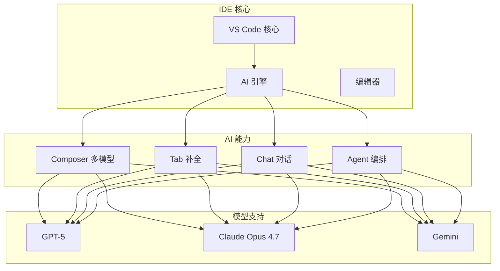
```mermaid
flowchart TB
    subgraph IDE层["IDE 核心"]
        VS[VS Code 核心]
        AI[AI 引擎]
        ED[编辑器]
    end

    subgraph AI层["AI 能力"]
        CM[Composer 多模型]
        CT[Tab 补全]
        CC[Chat 对话]
        AG[Agent 编排]
    end

    subgraph 模型层["模型支持"]
        GPT[GPT-5]
        OPUS[Claude Opus 4.7]
        GEM[Gemini]
    end

    VS --> AI --> CM & CT & CC & AG
    CM & CT & CC & AG --> GPT & OPUS & GEM
```

**竞品对比**:

| 维度 | Cursor | Windsurf | Claude Code | Codex |
|------|--------|----------|------------|-------|
| 产品形态 | AI 原生 IDE | AI 原生 IDE | CLI Agent | CLI Agent |
| 架构 | VS Code fork | VS Code fork | 终端优先 | Web + Desktop |
| 并行能力 | 支持 | 支持 | 支持 | 支持 |
| Agent UI | 基础 (演进中) | 优秀 | 终端模式 | Web 界面 |
| 核心模型 | Composer 2/GPT-5/Opus 4.7 | Gemini 为主 | Anthropic 模型 | GPT-5 系列 |
| 定价 | ~$20/月 | ~$20/月 | API 包含 | API 包含 |
| ARR | $2B+ | 被 Google $2.4B 收购 | $2.5B | - |

**适用场景**:

- 复杂多文件重构
- 跨仓库代码理解
- AI 原生开发环境
- 需要深度 VS Code 生态支持

**快速开始**:

```bash
# 安装 Cursor
# 下载: https://cursor.sh

# 或使用 CLI 快速上手
npx cursor@latest init my-project

# 常用快捷键
# Ctrl+K: 行内编辑
# Ctrl+L: 对话模式
# Ctrl+Shift+L: 多行编辑
```

**Cursor 3 Agent 管理示例**:

```bash
# 在 Cursor 中启动 Agent
# 1. 打开 Agent 面板 (Ctrl+Shift+A)
# 2. 输入任务描述
# 3. Agent 自动分析、编写、验证代码
```

**参考链接**:
- [Cursor 官网](https://cursor.sh)
- [Cursor 3 发布说明](https://cursor.sh/blog/cursor-3)
- [Composer API](https://cursor.sh/context/composer)

---

### 1.3 Claude Code

**核心创新点**:

Claude Code 是 Anthropic 推出的 CLI 工具，强调 Git worktree 支持：

1. **Worktree 隔离**: 每个 AI 修改在独立分支，不污染主代码库
2. **多工具集成**: 内置 Read/Grep/Edit/Bash 工具
3. **安全优先**: 企业级安全，合规性支持
4. **深度 Anthropic 集成**: 原生 Claude API 支持

**技术架构图**:

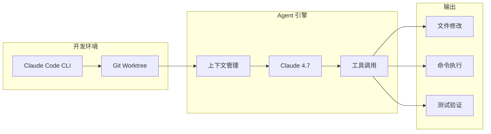
```mermaid
flowchart LR
    subgraph 开发["开发环境"]
        CLI[Claude Code CLI]
        GIT[Git Worktree]
    end

    subgraph Agent["Agent 引擎"]
        LLM[Claude 4.7]
        TOOL[工具调用]
        CTX[上下文管理]
    end

    subgraph 输出["输出"]
        FILE[文件修改]
        CMD[命令执行]
        TEST[测试验证]
    end

    CLI --> GIT --> CTX
    CTX --> LLM --> TOOL
    TOOL --> FILE & CMD & TEST
```

**适用场景**:

- 严格变更追踪的团队
- 需要多任务并行的场景
- Anthropic API 重度用户
- 企业级安全要求

**快速开始**:

```bash
# 安装 Claude Code
npm install -g @anthropic-ai/claude-code

# 启动会话
claude

# 常用命令
claude --print "解释这段代码" src/utils.ts
claude --tool "编写测试" src/components/
```

**Worktree 工作流**:

```bash
# 创建 worktree 分支
git worktree add -b feature/claude-fix ../fix-branch

# 在新分支中启动 Claude Code
cd ../fix-branch
claude

# 完成后合并回主分支
git checkout main
git merge fix-branch
git worktree remove ../fix-branch
```

**参考链接**:
- [Claude Code 官网](https://claude.ai/code)
- [Claude Code 文档](https://docs.anthropic.com/)
- [Anthropic API](https://docs.anthropic.com/claude/reference)

---

### 1.4 Windsurf (Anti-Gravity)

**核心创新点**:

Windsurf 现已被 Google 收购并更名为 Anti-Gravity，主打多 Agent 管理：

1. **Agent Manager**: 最佳多 Agent 管理界面
2. **Google 深度集成**: Chrome 浏览器控制，Gemini 模型
3. **隔离工作空间**: 多任务隔离执行
4. **慷慨使用配额**: Gemini 模型调用限制宽松

**Agent 管理示例**:

```bash
# 启动多 Agent 任务
windsurf --agents 3

# Agent 1: 修复登录问题
"Fix the login authentication bug in src/auth/"

# Agent 2: 优化性能
"Profile and optimize the API response times"

# Agent 3: 编写文档
"Document the new API endpoints in OpenAPI format"
```

**参考链接**:
- [Anti-Gravity](https://www.antigravity.dev)

---

## 2. AI 原生应用构建

### 2.1 Vercel v0

**核心创新点**:

v0 从自然语言生成完整的 React/Next.js 应用：

1. **对话式生成**: 描述需求 → 生成代码 → 部署
2. **Vercel 生态集成**: 自动优化、边缘函数、图像处理
3. **单页应用**: 着陆页、Dashboard、原型

**快速开始**:

```bash
# v0 CLI
npx v0@latest init

# Web 界面
# https://v0.dev
```

### 2.2 Bolt.new

**核心创新点**:

Bolt.new 在浏览器中运行完整开发环境：

1. **WebContainer**: 浏览器原生 Node.js 运行时
2. **交互式调试**: 浏览器内调试生成代码
3. **React/Node.js 优化**: 即时运行时反馈

### 2.3 Lovable

**核心创新点**:

Lovable 生成高质量、易于定制的代码：

1. **代码质量优先**: 生成的代码结构清晰
2. **可维护性**: 比模板驱动方案更易定制
3. **团队协作**: 支持团队成员共同编辑

**平台对比**:

| 平台 | 适用场景 | 代码质量 | 部署集成 | 学习曲线 |
|------|----------|----------|----------|----------|
| v0 | 单页应用、Dashboard | 高 | Vercel | 低 |
| Bolt.new | React/Node.js 交互调试 | 中 | StackBlitz | 中 |
| Lovable | 生产级应用 | 高 | Vercel/Netlify | 低 |

---

## 3. AI SDK 与流式 UI

### 3.1 Vercel AI SDK

**核心创新点**:

Vercel AI SDK (ai) 是流式 React 应用的标准实现：

1. **useChat hook**: 对话界面状态管理
2. **useCompletion hook**: 单次补全
3. **多模型适配**: OpenAI/Anthropic/Google/自定义端点
4. **Edge Runtime 支持**: 边缘函数部署

**技术架构图**:

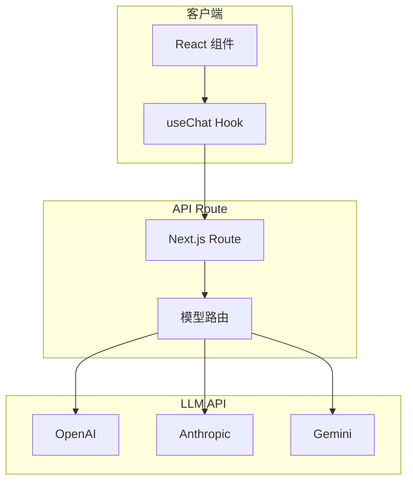
```mermaid
flowchart TB
    subgraph 客户端["客户端"]
        UI[React 组件]
        CH[useChat Hook]
    end

    subgraph API层["API Route"]
        ROUTE[Next.js Route]
        MODEL[模型路由]
    end

    subgraph 模型层["LLM API"]
        OAI[OpenAI]
        ANT[Anthropic]
        GEM[Gemini]
    end

    UI --> CH --> ROUTE --> MODEL
    MODEL --> OAI & ANT & GEM
```

**完整示例**:

```typescript
// app/api/chat/route.ts (Next.js App Router)
import { OpenAIStream, StreamingTextResponse } from 'ai'
import OpenAI from 'openai'

const openai = new OpenAI()

export async function POST(req: Request) {
  const { messages } = await req.json()

  const response = await openai.chat.completions.create({
    model: 'gpt-5-turbo',
    stream: true,
    messages: [
      { role: 'system', content: '你是一个有帮助的助手。' },
      ...messages
    ]
  })

  const stream = OpenAIStream(response)
  return new StreamingTextResponse(stream)
}
```

```tsx
// components/chat.tsx
'use client'

import { useChat } from 'ai/react'

export function Chat() {
  const { messages, isLoading, input, handleInputChange, handleSubmit } = useChat({
    api: '/api/chat'
  })

  return (
    <div className="flex flex-col h-[600px] border rounded-lg overflow-hidden">
      <div className="flex-1 overflow-y-auto p-4 space-y-4">
        {messages.map(m => (
          <div key={m.id} className={`flex ${m.role === 'user' ? 'justify-end' : 'justify-start'}`}>
            <div className={`max-w-[70%] p-3 rounded-lg ${
              m.role === 'user' ? 'bg-blue-500 text-white' : 'bg-gray-100'
            }`}>
              {m.content}
            </div>
          </div>
        ))}
        {isLoading && <div class="text-gray-500">Thinking...</div>}
      </div>
      <form onSubmit={handleSubmit} className="border-t p-4">
        <input
          value={input}
          onChange={handleInputChange}
          placeholder="输入你的问题..."
          className="w-full p-2 border rounded"
        />
      </form>
    </div>
  )
}
```

**useCompletion 示例**:

```typescript
import { useCompletion } from 'ai/react'

export function TextGenerator() {
  const { completion, isLoading, handleSubmit } = useCompletion({
    api: '/api/complete'
  })

  return (
    <form onSubmit={handleSubmit}>
      <textarea
        value={completion}
        placeholder="生成的内容..."
        className="w-full h-40 p-2 border"
      />
      <button type="submit" disabled={isLoading}>
        {isLoading ? '生成中...' : '生成'}
      </button>
    </form>
  )
}
```

**参考链接**:
- [Vercel AI SDK](https://sdk.vercel.ai)
- [GitHub](https://github.com/vercel/ai)

---

### 3.2 Anthropic SDK

**核心创新点**:

Anthropic SDK 提供 Claude 原生支持：

1. **Tool Use**: 函数调用能力
2. **流式响应**: 增量内容处理
3. **多消息管理**: 对话历史维护

```typescript
import { Anthropic } from '@anthropic-ai/sdk'

const client = new Anthropic()

const response = await client.messages.stream({
  model: 'claude-opus-4-7',
  max_tokens: 1024,
  messages: [
    { role: 'user', content: '解释 React 的 useEffect hook' }
  ],
  tools: [
    {
      name: 'search_docs',
      description: '搜索文档',
      input_schema: {
        type: 'object',
        properties: {
          query: { type: 'string' }
        }
      }
    }
  ]
})
```

---

## 4. MCP 协议与 Agent 框架

### 4.1 Model Context Protocol (MCP)

**核心创新点**:

MCP 是连接 AI 模型与外部工具的标准协议：

1. **统一接口**: 文件系统、Shell、搜索、API 调用
2. **工具生态**: 任何 MCP 兼容客户端可使用工具
3. **安全隔离**: 协议层安全控制

**技术架构图**:

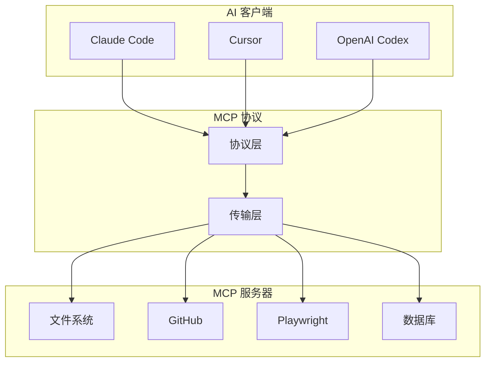
```mermaid
flowchart TB
    subgraph AI["AI 客户端"]
        CC[Claude Code]
        CUR[Cursor]
        OAI[OpenAI Codex]
    end

    subgraph MCP["MCP 协议"]
        PROTO[协议层]
        TRANSPORT[传输层]
    end

    subgraph 服务器["MCP 服务器"]
        FS[文件系统]
        GH[GitHub]
        PG[Playwright]
        DB[数据库]
    end

    CC & CUR & OAI --> PROTO
    PROTO --> TRANSPORT
    TRANSPORT --> FS & GH & PG & DB
```

**MCP 服务器配置**:

```json
// .cursor/mcp.json
{
  "mcpServers": {
    "filesystem": {
      "command": "npx",
      "args": ["-y", "@modelcontextprotocol/server-filesystem", "/path/to/project"],
      "env": {}
    },
    "github": {
      "command": "npx",
      "args": ["-y", "@modelcontextprotocol/server-github"],
      "env": { "GITHUB_TOKEN": "${GITHUB_TOKEN}" }
    },
    "playwright": {
      "command": "npx",
      "args": ["-y", "@modelcontextprotocol/server-playwright"],
      "env": {}
    }
  }
}
```

**常用 MCP 服务器**:

| 服务器 | 功能 | 安装量 |
|--------|------|--------|
| @modelcontextprotocol/server-filesystem | 文件读写 | 高 |
| @modelcontextprotocol/server-github | GitHub API | 高 |
| @modelcontextprotocol/server-playwright | 浏览器自动化 | 高 |
| @modelcontextprotocol/server-brave-search | 搜索 | 中 |
| @modelcontextprotocol/server-slack | Slack 消息 | 中 |

**参考链接**:
- [MCP 官方文档](https://modelcontextprotocol.io)
- [MCP GitHub](https://github.com/modelcontextprotocol)

---

### 4.2 Playwright for AI Agents

**核心创新点**:

Playwright 已演变为 AI Agent 平台：

1. **浏览器控制**: AI Agent 可导航页面、交互元素
2. **多浏览器**: Chromium/Firefox/WebKit 统一 API
3. **Playwright CLI**: AI 驱动的浏览器自动化

**AI Agent 集成示例**:

```typescript
import { chromium } from 'playwright'

async function aiBrowserAgent() {
  const browser = await chromium.launch()
  const context = await browser.newContext()
  const page = await context.newPage()

  // AI Agent 任务：测试登录流程
  const tasks = [
    { action: 'goto', url: 'https://example.com/login' },
    { action: 'fill', selector: '#email', value: 'test@example.com' },
    { action: 'fill', selector: '#password', value: 'password123' },
    { action: 'click', selector: 'button[type="submit"]' },
    { action: 'waitFor', selector: '.dashboard' },
    { action: 'screenshot' }
  ]

  for (const task of tasks) {
    await executeTask(page, task)
  }

  await browser.close()
}

async function executeTask(page, task) {
  switch (task.action) {
    case 'goto':
      await page.goto(task.url)
      break
    case 'fill':
      await page.fill(task.selector, task.value)
      break
    case 'click':
      await page.click(task.selector)
      break
    case 'waitFor':
      await page.waitForSelector(task.selector)
      break
    case 'screenshot':
      await page.screenshot()
      break
  }
}
```

**Playwright MCP 服务器**:

```json
// MCP 配置
{
  "mcpServers": {
    "playwright": {
      "command": "npx",
      "args": ["-y", "@modelcontextprotocol/server-playwright"]
    }
  }
}
```

**参考链接**:
- [Playwright 官网](https://playwright.dev)
- [Playwright GitHub](https://github.com/microsoft/playwright)

---

## 5. React 全栈框架

### 5.1 Next.js 15/16

**核心创新点**:

Next.js 已成为 React 全栈的标准答案：

1. **App Router**: 文件系统路由 + 服务端组件 (RSC)
2. **React Server Components**: 服务端数据获取，零客户端 JS
3. **Server Actions**: 表单处理和 mutations 的新方式
4. **Streaming SSR**: 流式 HTML，边加载边显示
5. **Turbopack 集成**: 开发环境 10x 提速

**技术架构图**:

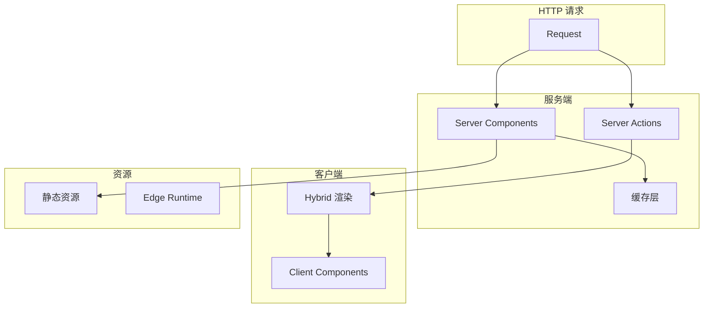
```mermaid
flowchart TB
    subgraph 请求["HTTP 请求"]
        R[Request]
    end

    subgraph 服务端["服务端"]
        SSR[Server Components]
        ACT[Server Actions]
        CACHE[缓存层]
    end

    subgraph 客户端["客户端"]
        CSR[Client Components]
        HY[Hybrid 渲染]
    end

    subgraph 资源["资源"]
        STATIC[静态资源]
        EDGE[Edge Runtime]
    end

    R --> SSR & ACT
    SSR --> CACHE & STATIC
    ACT --> HY
    HY --> CSR
```

**竞品对比**:

| 维度 | Next.js | Remix | Astro | Nuxt |
|------|---------|-------|-------|------|
| GitHub Stars | 125K+ | 32K+ | 44K+ | 55K+ |
| 周下载量 | 35M+ | 2M+ | 3M+ | 5M+ |
| 渲染模式 | SSR/SSG/ISR | SSR | MPA/Islands | SSR/SSG |
| 服务端 | Node.js/Edge | 任意 | 任意 | Node.js |
| 数据获取 | RSC/Actions | loader | 静态/SSR | useAsyncData |
| 学习曲线 | 中等 | 低 | 低 | 中等 |
| 适用场景 | 企业应用 | 内容站 | 内容站 | 通用 |

**快速开始**:

```bash
npx create-next-app@latest my-app --typescript --tailwind --eslint
cd my-app
npm run dev
```

**App Router 示例**:

```typescript
// app/users/[id]/page.tsx
// 这个组件在服务端渲染
import { notFound } from 'next/navigation'

interface Props {
  params: { id: string }
}

// 服务端组件 - 直接访问数据库
async function getUser(id: string) {
  const res = await fetch(`https://api.example.com/users/${id}`, {
    next: { revalidate: 3600 } // 1小时缓存
  })
  if (!res.ok) return null
  return res.json()
}

export default async function UserPage({ params }: Props) {
  const user = await getUser(params.id)

  if (!user) {
    notFound()
  }

  return (
    <div>
      <h1>{user.name}</h1>
      <p>{user.email}</p>
    </div>
  )
}
```

**Server Actions 示例**:

```typescript
// app/actions.ts
'use server'

import { revalidatePath } from 'next/cache'

export async function createPost(formData: FormData) {
  const title = formData.get('title') as string
  const content = formData.get('content') as string

  await db.post.create({ data: { title, content } })

  revalidatePath('/posts')
}
```

```tsx
// app/new-post/page.tsx
import { createPost } from '../actions'

export default function NewPost() {
  return (
    <form action={createPost}>
      <input name="title" placeholder="标题" />
      <textarea name="content" placeholder="内容" />
      <button type="submit">发布</button>
    </form>
  )
}
```

**性能对比**:

| 指标 | Pages Router | App Router |
|------|--------------|------------|
| 首屏加载 | 基准 | 30%+ 提升 |
| JS Bundle | 较大 | 更小 (RSC) |
| 数据获取 | getServerSideProps | 直接 async/await |
| 缓存策略 | 灵活 | 更细粒度 |

**生态统计**:
- 125K+ GitHub stars
- 35M+ 周下载量
- 最大的 React 生态框架
- Vercel 官方维护

**参考链接**:
- [Next.js 官网](https://nextjs.org)
- [Next.js GitHub](https://github.com/vercel/next.js)

---

### 5.2 Astro

**核心创新点**:

Astro 专注于内容密集型网站，"只发送必要的 JavaScript"：

1. **Island Architecture**: 页面大部分静态，只有交互部分hydrate
2. **多框架支持**: React/Vue/Svelte/Solid 可以共存
3. **Content Collections**: Markdown/MDX 内容管理
4. **零 JS 默认**: 静态页面不发送任何 JS

**快速开始**:

```bash
npm create astro@latest my-site
cd my-site
npm run dev
```

**Island 示例**:

```astro
---
// src/pages/index.astro
import ReactCounter from '../components/Counter.jsx'
import VueCounter from '../components/Counter.vue'
---

<!-- 静态 HTML，无 JS -->
<h1>欢迎来到我的网站</h1>

<!-- 只这个组件会执行 React -->
<ReactCounter client:visible />

<!-- 只这个组件会执行 Vue -->
<VueCounter client:visible />
```

**内容集合示例**:

```typescript
// src/content/config.ts
import { defineCollection, z } from 'astro:content'

const blog = defineCollection({
  type: 'content',
  schema: z.object({
    title: z.string(),
    pubDate: z.date(),
    description: z.string()
  })
})

export const collections = { blog }
```

```astro
---
// src/pages/blog/[...slug].astro
import { getCollection } from 'astro:content'

export async function getStaticPaths() {
  const posts = await getCollection('blog')
  return posts.map(post => ({
    params: { slug: post.slug },
    props: { post }
  }))
}

const { post } = Astro.props
const { Content } = await post.render()
---

<article>
  <h1>{post.data.title}</h1>
  <Content />
</article>
```

**参考链接**:
- [Astro 官网](https://astro.build)
- [Astro GitHub](https://github.com/withastro/astro)

---

### 5.3 Remix

**核心创新点**:

Remix 回归 Web 标准，强调 loader/action 模式：

1. **嵌套路由**: 声明式数据加载
2. **错误边界**: 按路由的错误处理
3. **Web 标准**: Fetch/Request/Response 而非框架抽象
4. **渐进增强**: 即使 JS 失败也能工作

**Loader/Action 模式**:

```typescript
// app/routes/posts.$id.tsx
import { json, redirect } from '@remix-run/node'
import { useLoaderData } from '@remix-run/react'

// 服务端数据加载
export async function loader({ params }: LoaderFunctionArgs) {
  const post = await db.post.findUnique({
    where: { id: params.id }
  })

  if (!post) {
    throw new Response('Not Found', { status: 404 })
  }

  return json({ post })
}

// 表单提交处理
export async function action({ request, params }: ActionFunctionArgs) {
  const formData = await request.formData()
  const intent = formData.get('intent')

  if (intent === 'delete') {
    await db.post.delete({ where: { id: params.id } })
    return redirect('/posts')
  }

  return json({ error: 'Invalid intent' })
}

export default function PostPage() {
  const { post } = useLoaderData<typeof loader>()

  return (
    <article>
      <h1>{post.title}</h1>
      <p>{post.content}</p>

      <form method="post">
        <button type="submit" name="intent" value="delete">
          删除
        </button>
      </form>
    </article>
  )
}
```

**参考链接**:
- [Remix 官网](https://remix.run)
- [Remix GitHub](https://github.com/remix-run/remix)

---

### 5.4 React Router v7

**核心创新点**:

React Router v7 合并了 Remix 的 SSR 功能：

1. **SPA + SSR 双模式**: 一个框架，两种体验
2. **Loaders/Actions**: 来自 Remix 的数据模式
3. **TypeScript-first**: 完整类型推导
4. **File-based Routing**: 可选的约定式路由

**v7 架构示例**:

```typescript
// 路由配置
const routes = [
  {
    path: '/users/:id',
    loader: async ({ params }) => {
      return fetchUser(params.id)
    },
    Component: UserPage
  }
]

// UserPage 组件
function UserPage() {
  const user = useLoaderData<typeof loader>()

  return (
    <div>
      <h1>{user.name}</h1>
      <Link to="/users">返回</Link>
    </div>
  )
}
```

**参考链接**:
- [React Router 官网](https://reactrouter.com)
- [React Router v7 发布说明](https://remix.run/blog/react-router-v7)

---

### 5.5 tRPC

**核心创新点**:

tRPC 实现端到端类型安全，无需代码生成：

1. **零Schema**: TypeScript 类型自动推导
2. **无需代码生成**: 直接在函数上定义类型
3. **自动补全**: 客户端获得完整的类型提示
4. **任意传输**: REST, WebSocket, 任意协议

**架构示例**:

```typescript
// server/trpc.ts
import { initTRPC } from '@trpc/server'

const t = initTRPC.create()

export const router = t.router
export const publicProcedure = t.procedure
```

```typescript
// server/routers/user.ts
import { router, publicProcedure } from '../trpc'
import { z } from 'zod'

export const userRouter = router({
  getById: publicProcedure
    .input(z.object({ id: z.string() }))
    .query(async ({ input }) => {
      return db.user.findUnique({
        where: { id: input.id }
      })
    }),

  create: publicProcedure
    .input(z.object({
      name: z.string(),
      email: z.string().email()
    }))
    .mutation(async ({ input }) => {
      return db.user.create({ data: input })
    })
})
```

```typescript
// client/hooks/useUser.ts
import { createTRPCReact } from '@trpc/react-query'
import type { AppRouter } from '../server'

export const trpc = createTRPCReact<AppRouter>()

// 完整类型安全，自动补全
const user = await trpc.user.getById.query({ id: '123' })
//                         ^ 自动推导: { id: string }
```

**竞品对比**:

| 维度 | tRPC | GraphQL | REST+OpenAPI |
|------|------|---------|--------------|
| 类型安全 | 完整 | 需要 codegen | 有限 |
| 学习曲线 | 低 | 中 | 低 |
| 灵活性 | 中 | 高 | 高 |
| 生态系统 | 增长中 | 成熟 | 成熟 |
| 适用场景 | TS 全栈 | 多客户端 | 通用 |

**参考链接**:
- [tRPC 官网](https://trpc.io)
- [tRPC GitHub](https://github.com/trpc/trpc)

---

## 6. Node.js 后端框架

### 6.1 NestJS

**核心创新点**:

NestJS 是渐进式 Node.js 框架，借鉴 Angular 的依赖注入：

1. **模块化架构**: 功能模块化，易于组织
2. **依赖注入**: 自动化依赖管理
3. **Decorator 模式**: 类+装饰器定义路由/服务
4. **TypeScript-first**: 完整类型安全
5. **微服务支持**: 内置 gRPC, RabbitMQ, Redis 等适配器

**技术架构图**:

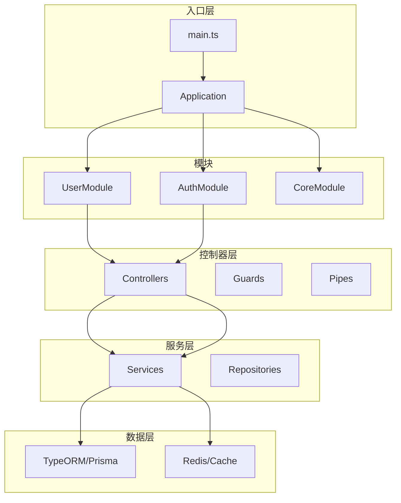
```mermaid
flowchart TB
    subgraph 入口["入口层"]
        MAIN[main.ts]
        APP[Application]
    end

    subgraph 模块["模块"]
        USER[UserModule]
        AUTH[AuthModule]
        CORE[CoreModule]
    end

    subgraph 控制器["控制器层"]
        CTRL[Controllers]
        GUARD[Guards]
        PIPES[Pipes]
    end

    subgraph 服务["服务层"]
        SVC[Services]
        REPO[Repositories]
    end

    subgraph 数据库["数据层"]
        ORM[TypeORM/Prisma]
        CACHE[Redis/Cache]
    end

    MAIN --> APP --> USER & AUTH & CORE
    USER --> CTRL --> SVC --> ORM
    AUTH --> CTRL --> SVC --> CACHE
```

**快速开始**:

```bash
npm i -g @nestjs/cli
nest new project-name
cd project-name
npm run start:dev
```

**完整示例**:

```typescript
// user.entity.ts
import { Entity, Column, PrimaryGeneratedColumn } from 'typeorm'

@Entity()
export class User {
  @PrimaryGeneratedColumn('uuid')
  id: string

  @Column({ unique: true })
  email: string

  @Column()
  name: string

  @Column({ default: false })
  isActive: boolean
}
```

```typescript
// users.service.ts
import { Injectable, NotFoundException } from '@nestjs/common'
import { InjectRepository } from '@nestjs/typeorm'
import { Repository } from 'typeorm'
import { User } from './user.entity'

@Injectable()
export class UsersService {
  constructor(
    @InjectRepository(User)
    private usersRepo: Repository<User>
  ) {}

  async findAll(): Promise<User[]> {
    return this.usersRepo.find()
  }

  async findOne(id: string): Promise<User> {
    const user = await this.usersRepo.findOne({ where: { id } })
    if (!user) {
      throw new NotFoundException(`User ${id} not found`)
    }
    return user
  }

  async create(data: Partial<User>): Promise<User> {
    const user = this.usersRepo.create(data)
    return this.usersRepo.save(user)
  }

  async update(id: string, data: Partial<User>): Promise<User> {
    const user = await this.findOne(id)
    Object.assign(user, data)
    return this.usersRepo.save(user)
  }
}
```

```typescript
// users.controller.ts
import {
  Controller, Get, Post, Put, Delete,
  Param, Body, UseGuards
} from '@nestjs/common'
import { UsersService } from './users.service'
import { JwtAuthGuard } from '../auth/jwt-auth.guard'
import { CreateUserDto, UpdateUserDto } from './dto'

@Controller('users')
@UseGuards(JwtAuthGuard)
export class UsersController {
  constructor(private readonly usersService: UsersService) {}

  @Get()
  findAll() {
    return this.usersService.findAll()
  }

  @Get(':id')
  findOne(@Param('id') id: string) {
    return this.usersService.findOne(id)
  }

  @Post()
  create(@Body() dto: CreateUserDto) {
    return this.usersService.create(dto)
  }

  @Put(':id')
  update(@Param('id') id: string, @Body() dto: UpdateUserDto) {
    return this.usersService.update(id, dto)
  }

  @Delete(':id')
  delete(@Param('id') id: string) {
    return this.usersService.remove(id)
  }
}
```

```typescript
// users.module.ts
import { Module } from '@nestjs/common'
import { TypeOrmModule } from '@nestjs/typeorm'
import { User } from './user.entity'
import { UsersService } from './users.service'
import { UsersController } from './users.controller'

@Module({
  imports: [TypeOrmModule.forFeature([User])],
  controllers: [UsersController],
  providers: [UsersService],
  exports: [UsersService]
})
export class UsersModule {}
```

**NestJS vs Express vs Fastify**:

| 维度 | NestJS | Express | Fastify |
|------|--------|---------|---------|
| 架构 | 模块化 | 极简 | 插件化 |
| 类型安全 | TypeScript-first | 可选 TS | 可选 TS |
| 性能 | 中等 | 高 | 最高 |
| 学习曲线 | 中等 | 低 | 低 |
| 依赖注入 | 原生支持 | 手动 | 手动 |
| 适用场景 | 企业级 | 轻量 API | 高性能 API |

**生态统计**:
- 60K+ GitHub stars
- 3M+ 周下载量
- 企业级应用首选

**参考链接**:
- [NestJS 官网](https://nestjs.com)
- [NestJS GitHub](https://github.com/nestjs/nest)

---

### 6.2 TypeORM

**核心创新点**:

TypeORM 是 Node.js 生态最成熟的 ORM：

1. **Active Record + Data Mapper**: 两种模式可选
2. **TypeScript 支持**: 实体类自动类型推导
3. **迁移系统**: 数据库版本控制
4. **关联管理**: 一对多、多对多自动处理

**快速开始**:

```bash
npm install typeorm reflect-metadata
npm install pg # PostgreSQL 驱动
```

**实体定义**:

```typescript
import {
  Entity, PrimaryGeneratedColumn, Column,
  CreateDateColumn, UpdateDateColumn,
  OneToMany, ManyToOne, JoinColumn
} from 'typeorm'

@Entity('posts')
export class Post {
  @PrimaryGeneratedColumn('uuid')
  id: string

  @Column()
  title: string

  @Column('text')
  content: string

  @CreateDateColumn()
  createdAt: Date

  @UpdateDateColumn()
  updatedAt: Date

  @Column({ default: true })
  published: boolean

  @ManyToOne(() => User, (user) => user.posts)
  @JoinColumn({ name: 'authorId' })
  author: User

  @Column()
  authorId: string

  @OneToMany(() => Comment, (comment) => comment.post)
  comments: Comment[]
}
```

**查询示例**:

```typescript
// Repository 模式
const postRepo = dataSource.getRepository(Post)

// 基础查询
const posts = await postRepo.find({
  where: { published: true },
  order: { createdAt: 'DESC' },
  take: 10
})

// 复杂查询
const userWithPosts = await postRepo.findOne({
  where: { id: postId },
  relations: ['author', 'comments', 'comments.author']
})

// QueryBuilder
const result = await postRepo
  .createQueryBuilder('post')
  .leftJoinAndSelect('post.author', 'author')
  .where('post.published = :published', { published: true })
  .andWhere('post.createdAt > :date', { date: lastWeek })
  .orderBy('post.createdAt', 'DESC')
  .getMany()
```

**参考链接**:
- [TypeORM 官网](https://typeorm.io)
- [TypeORM GitHub](https://github.com/typeorm/typeorm)

---

### 6.3 Prisma

**核心创新点**:

Prisma 提供类型安全的数据库访问：

1. **Schema-first**: 定义 schema 自动生成客户端
2. **Prisma Client**: 强类型的查询 API
3. **迁移系统**: 可视化 + CLI 迁移
4. **Prisma Studio**: 图形化数据库管理

**架构图**:

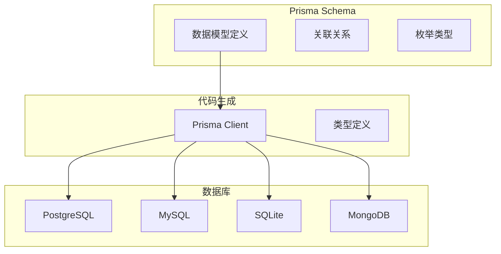
```mermaid
flowchart TB
    subgraph Schema["Prisma Schema"]
        DEF[数据模型定义]
        REL[关联关系]
        ENUM[枚举类型]
    end

    subgraph 生成["代码生成"]
        CLIENT[Prisma Client]
        TYPES[类型定义]
    end

    subgraph 数据库["数据库"]
        PG[PostgreSQL]
        MY[MySQL]
        SL[SQLite]
        MN[MongoDB]
    end

    DEF --> CLIENT
    CLIENT --> PG & MY & SL & MN
```

**Schema 定义**:

```prisma
// prisma/schema.prisma
generator client {
  provider = "prisma-client-js"
}

datasource db {
  provider = "postgresql"
  url      = env("DATABASE_URL")
}

model User {
  id        String   @id @default(cuid())
  email     String   @unique
  name      String?
  posts     Post[]
  createdAt DateTime @default(now())
  updatedAt DateTime @updatedAt
}

model Post {
  id        String   @id @default(cuid())
  title     String
  content   String?
  published Boolean  @default(false)
  author    User     @relation(fields: [authorId], references: [id])
  authorId  String
  createdAt DateTime @default(now())
  updatedAt DateTime @updatedAt

  @@index([authorId])
}
```

**查询示例**:

```typescript
import { PrismaClient } from '@prisma/client'
const prisma = new PrismaClient()

// 创建
const user = await prisma.user.create({
  data: {
    email: 'alice@example.com',
    name: 'Alice',
    posts: {
      create: {
        title: 'Hello World',
        content: 'My first post'
      }
    }
  },
  include: { posts: true }
})

// 查询
const posts = await prisma.post.findMany({
  where: { published: true },
  include: { author: true },
  orderBy: { createdAt: 'desc' }
})

// 关联更新
await prisma.user.update({
  where: { id: userId },
  data: {
    posts: {
      update: {
        where: { id: postId },
        data: { published: true }
      }
    }
  }
})
```

**Prisma vs TypeORM**:

| 维度 | Prisma | TypeORM |
|------|--------|---------|
| 配置方式 | Schema 文件 | TypeScript 装饰器 |
| 类型安全 | 完整自动推导 | 需要手动维护 |
| 迁移体验 | 优秀 | 中等 |
| 查询构建 | 链式 API | QueryBuilder + Repository |
| 性能 | 中等 | 略好 |
| 适用场景 | 新项目 | 已有项目 |

**生态统计**:
- 34K+ GitHub stars
- 15M+ 周下载量
- 持续活跃开发

**参考链接**:
- [Prisma 官网](https://prisma.io)
- [Prisma GitHub](https://github.com/prisma/prisma)

---

### 6.4 Drizzle ORM

**核心创新点**:

Drizzle 是轻量级、SQL-first 的 TypeScript ORM：

1. **极小体积**: ~7KB gzip
2. **SQL-like 语法**: 学习成本低
3. **Serverless 友好**: 支持 Edge、Cloudflare Workers
4. **多数据库**: PostgreSQL, MySQL, SQLite, PlanetScale

**Schema 定义**:

```typescript
import { pgTable, serial, text, timestamp, boolean, uuid } from 'drizzle-orm/pg-core'

export const users = pgTable('users', {
  id: uuid('id').primaryKey().defaultRandom(),
  email: text('email').notNull().unique(),
  name: text('name'),
  createdAt: timestamp('created_at').defaultNow().notNull()
})

export const posts = pgTable('posts', {
  id: serial('id').primaryKey(),
  title: text('title').notNull(),
  content: text('content'),
  published: boolean('published').default(false).notNull(),
  authorId: uuid('author_id').references(() => users.id),
  createdAt: timestamp('created_at').defaultNow().notNull()
})
```

**查询示例**:

```typescript
import { eq, desc, and, like } from 'drizzle-orm'

// 基础查询
const allUsers = await db.select().from(users)

// 条件查询
const activeUsers = await db
  .select()
  .from(users)
  .where(and(
    eq(users.active, true),
    like(users.email, '%@example.com')
  ))
  .orderBy(desc(users.createdAt))

// 关联查询
const userWithPosts = await db
  .select()
  .from(users)
  .leftJoin(posts, eq(users.id, posts.authorId))
  .where(eq(users.id, userId))
```

**Drizzle vs Prisma**:

| 维度 | Drizzle | Prisma |
|------|---------|--------|
| 体积 | ~7KB | 较大 |
| 语法 | SQL-like | Chainable |
| 迁移 | CLI | CLI + Studio |
| 性能 | 更优 | 中等 |
| 学习曲线 | 低 (懂 SQL) | 低 |
| Edge 支持 | 优秀 | 良好 |
| 适用场景 | 性能敏感 | 快速开发 |

**生态统计**:
- 17K+ GitHub stars
- 2M+ 周下载量
- 快速增长

**参考链接**:
- [Drizzle 官网](https://orm.drizzle.team)
- [Drizzle GitHub](https://github.com/drizzle-team/drizzle-orm)

---

### 6.5 Fastify

**核心创新点**:

Fastify 是高性能 Node.js Web 框架：

1. **极致性能**: 比 Express 快 2x
2. **Plugin 系统**: 生态模块化
3. **Schema 验证**: 内置 JSON Schema 支持
4. **TypeScript 支持**: 完整类型推导

**快速开始**:

```bash
npm install fastify
```

**示例**:

```typescript
import Fastify from 'fastify'
import cors from '@fastify/cors'

const fastify = Fastify({ logger: true })

// 注册插件
await fastify.register(cors, { origin: true })

// 路由
fastify.get('/users/:id', async (request, reply) => {
  const { id } = request.params
  const user = await getUser(id)

  if (!user) {
    reply.code(404)
    return { error: 'User not found' }
  }

  return user
})

// JSON Schema 验证
const userSchema = {
  body: {
    type: 'object',
    required: ['email', 'password'],
    properties: {
      email: { type: 'string', format: 'email' },
      password: { type: 'string', minLength: 8 }
    }
  }
}

fastify.post('/users', { schema: userSchema }, async (request, reply) => {
  const { email, password } = request.body
  const user = await createUser({ email, password })
  reply.code(201)
  return user
})

// 启动
const start = async () => {
  try {
    await fastify.listen({ port: 3000 })
    console.log('Server running at http://localhost:3000')
  } catch (err) {
    fastify.log.error(err)
    process.exit(1)
  }
}

start()
```

**性能对比**:

| 框架 | 请求/秒 | 延迟 (p99) |
|------|---------|-----------|
| Fastify | 75,000+ | 2ms |
| Express | 30,000+ | 8ms |
| Koa | 40,000+ | 5ms |

**参考链接**:
- [Fastify 官网](https://fastify.io)
- [Fastify GitHub](https://github.com/fastify/fastify)

---

## 7. Signal 响应式框架

### 5.1 Solid.js

**核心创新点**:

Solid.js 使用细粒度响应式，绕过 Virtual DOM：

1. **编译时优化**: JSX 编译成真实 DOM 操作
2. **组件运行一次**: 组件函数只执行一次
3. **自动依赖追踪**: 访问响应式状态自动订阅
4. **无 Virtual DOM**: 性能接近原生 JavaScript

**技术架构图**:

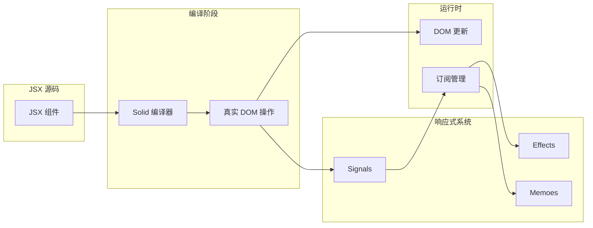
```mermaid
flowchart LR
    subgraph 源码["JSX 源码"]
        JSX[JSX 组件]
    end

    subgraph 编译["编译阶段"]
        COMP[Solid 编译器]
        DOM[真实 DOM 操作]
    end

    subgraph 响应式["响应式系统"]
        SIG[Signals]
        EFF[Effects]
        MEM[Memoes]
    end

    subgraph 输出["运行时"]
        RENDER[DOM 更新]
        SUBS[订阅管理]
    end

    JSX --> COMP --> DOM --> RENDER
    SIG --> SUBS --> EFF & MEM
    DOM --> SIG
```

**React vs Solid 对比**:

```typescript
// React
function Counter() {
  const [count, setCount] = useState(0)

  useEffect(() => {
    console.log(count) // 每次渲染都运行
  }, [count])

  return <button onClick={() => setCount(c => c + 1)}>{count}</button>
}

// Solid
function Counter() {
  const [count, setCount] = createSignal(0)

  createEffect(() => {
    console.log(count()) // 只在 count 变化时运行
  })

  return <button onClick={() => setCount(c => c + 1)}>{count()}</button>
}
```

**快速开始**:

```bash
npm create solid@latest my-app
cd my-app
npm run dev
```

**核心 API**:

```typescript
import { createSignal, createEffect, createMemo, createStore } from 'solid-js'

// 基础信号
const [count, setCount] = createSignal(0)
count() // 读取
setCount(1) // 写入

// 计算值
const doubled = createMemo(() => count() * 2)

// 副作用
createEffect(() => {
  console.log('Count changed:', count())
})

// 响应式对象
const [state, setState] = createStore({ name: 'Solid', version: 1.0 })
setState('name', 'SolidJS') // 嵌套更新
```

**参考链接**:
- [Solid.js 官网](https://solidjs.com)
- [Solid.js GitHub](https://github.com/solidjs/solid)
- [SolidStart](https://start.solidjs.com)

---

### 5.2 Qwik

**核心创新点**:

Qwik 的 Resumability 彻底颠覆 SSR 水合模式：

1. **Resumability**: 服务端序列化状态，客户端从停止处恢复
2. **零初始 JS**: 初始页面无 JavaScript 执行
3. **精度懒加载**: 事件处理器按需加载到函数级别
4. **Core Web Vitals 优化**: 亚秒级页面加载

**技术架构图**:

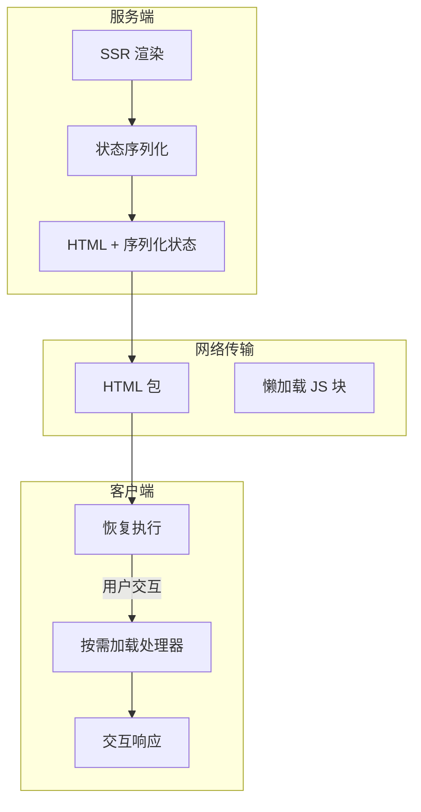
```mermaid
flowchart TB
    subgraph 服务端["服务端"]
        SSR[SSR 渲染]
        SER[状态序列化]
        HTML[HTML + 序列化状态]
    end

    subgraph 网络["网络传输"]
        PACK[HTML 包]
        JS[懒加载 JS 块]
    end

    subgraph 客户端["客户端"]
        RES[恢复执行]
        LAZY[按需加载处理器]
        INTERACT[交互响应]
    end

    SSR --> SER --> HTML
    HTML --> PACK
    PACK --> RES
    RES -->|用户交互| LAZY --> INTERACT
```

**Resumability vs Hydration**:

| 维度 | 传统 SSR | Qwik Resumability |
|------|----------|-------------------|
| 水合方式 | 客户端重执行全部 JS | 从序列化状态恢复 |
| 初始 JS | 按组件大小加载 | ~0kb 初始 JS |
| 水合成本 | 与应用大小成正比 | 恒定 (最小开销) |
| 事件绑定 | DOM 事件监听器 | 序列化后懒加载 |

**快速开始**:

```bash
npm create qwik@latest my-app
cd my-app
npm run dev
```

**核心示例**:

```typescript
import { component$, useSignal, $ } from '@builder.io/qwik'

export const Counter = component$(() => {
  const count = useSignal(0)

  return (
    <div>
      <p>Count: {count.value}</p>
      <button
        onClick$={$(() => {
          count.value++
        })}
      >
        Increment
      </button>
    </div>
  )
})
```

**参考链接**:
- [Qwik 官网](https://qwik.dev)
- [Qwik GitHub](https://github.com/QwikDev/qwik)

---

### 5.3 Svelte 5

**核心创新点**:

Svelte 5 的 Runes 模式带来显式响应式：

1. **$state()**: 响应式状态
2. **$derived()**: 计算值
3. **$effect()**: 副作用
4. **编译器驱动**: 编译时优化

**Svelte 4 vs Svelte 5**:

```svelte
<!-- Svelte 4 -->
<script>
  import { writable } from 'svelte/store'
  let count = writable(0)
  $: doubled = $count * 2

  $: if (count > 10) {
    alert('Count too high!')
  }
</script>

<!-- Svelte 5 (Runes) -->
<script>
  let count = $state(0)
  let doubled = $derived(count * 2)

  $effect(() => {
    if (count > 10) {
      alert('Count too high!')
    }
  })
</script>
```

**快速开始**:

```bash
npm create svelte@latest my-app
# 选择 Svelte 5 + TypeScript
cd my-app
npm run dev
```

**Runes API**:

```typescript
// $state - 响应式状态
let count = $state(0)
let user = $state({ name: 'Svelte', age: 5 })

// $derived - 计算值
let doubled = $derived(count * 2)
let fullName = $derived(`${user.name} ${user.lastName}`)

// $effect - 副作用
$effect(() => {
  document.title = `Count: ${count}`
  return () => {
    // cleanup
  }
})

// $props - 组件 props
export const MyComponent = (props) => {
  const { name, value = 0 } = $props()
}
```

**参考链接**:
- [Svelte 官网](https://svelte.dev)
- [Svelte 5 发布说明](https://svelte.dev/blog/svelte-5)
- [SvelteKit](https://kit.svelte.dev)

---

### 5.4 TanStack Query

**核心创新点**:

TanStack Query (原 React Query) 是服务器状态管理的事实标准：

1. **声明式数据获取**: 自动缓存管理
2. **后台刷新**: 窗口聚焦时自动更新
3. **乐观更新**: 突变操作即时反馈
4. **多框架支持**: React/Vue/Solid/Svelte/Angular

**技术架构图**:

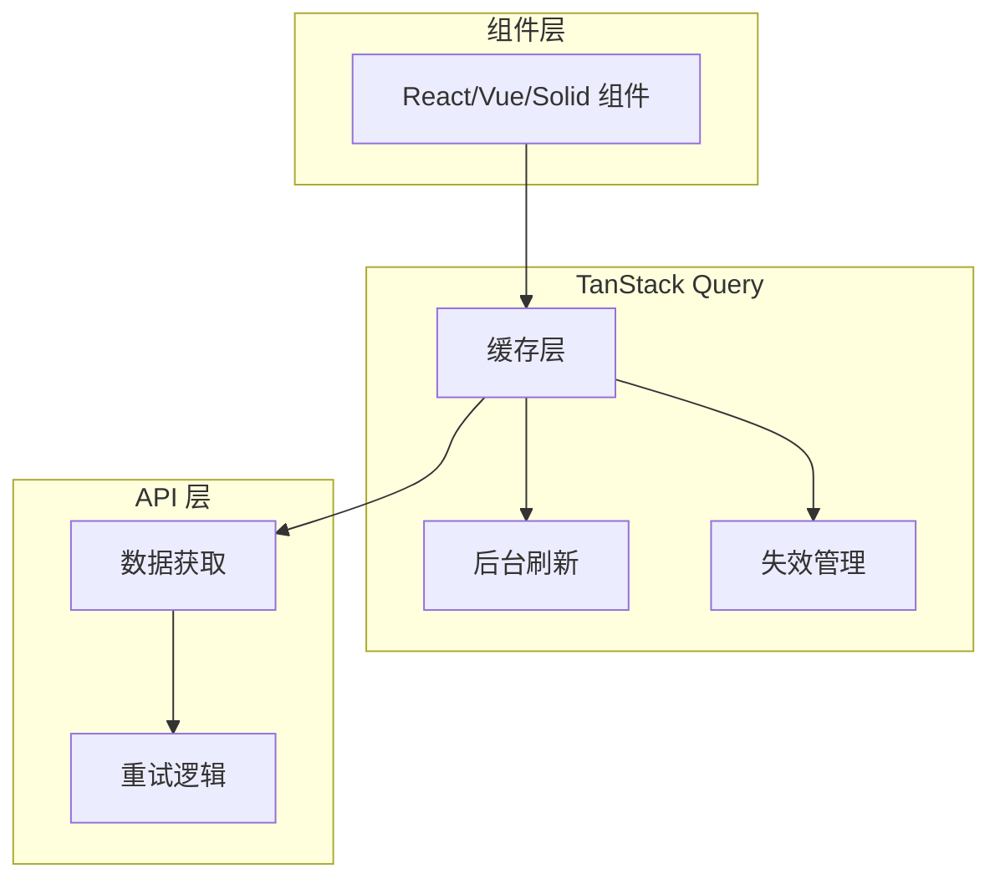
```mermaid
flowchart TB
    subgraph 组件["组件层"]
        COMP[React/Vue/Solid 组件]
    end

    subgraph Query["TanStack Query"]
        CACHE[缓存层]
        BG[后台刷新]
        INV[失效管理]
    end

    subgraph API["API 层"]
        FETCH[数据获取]
        RETRY[重试逻辑]
    end

    COMP --> CACHE --> FETCH
    CACHE --> BG & INV
    FETCH --> RETRY
```

**多框架示例**:

```typescript
// React
import { createQuery } from '@tanstack/react-query'

function Todos() {
  const todos = createQuery({
    queryKey: ['todos'],
    queryFn: () => fetch('/api/todos').then(r => r.json()),
    staleTime: 5 * 60 * 1000 // 5 分钟
  })

  return <ul>{todos.data?.map(t => <li key={t.id}>{t.title}</li>)}</ul>
}

// Solid
import { createQuery } from '@tanstack/solid-query'

function Todos() {
  const todos = createQuery(() => ({
    queryKey: ['todos'],
    queryFn: () => fetch('/api/todos').then(r => r.json())
  }))

  return <ul>{todos.data?.map(t => <li key={t.id}>{t.title}</li>)}</ul>
}
```

**高级特性**:

```typescript
// 乐观更新
const mutation = useMutation({
  mutationFn: updateTodo,
  onMutate: async (newTodo) => {
    await queryClient.cancelQueries(['todos'])
    const previousTodos = queryClient.getQueryData(['todos'])

    queryClient.setQueryData(['todos'], (old) => [...old, newTodo])

    return { previousTodos }
  },
  onError: (err, newTodo, context) => {
    queryClient.setQueryData(['todos'], context.previousTodos)
  },
  onSettled: () => {
    queryClient.invalidateQueries(['todos'])
  }
})

// 无限滚动
const infiniteTodos = useInfiniteQuery({
  queryKey: ['todos'],
  queryFn: ({ pageParam = 0 }) => fetchTodos(pageParam),
  getNextPageParam: (lastPage) => lastPage.nextCursor
})
```

**统计**:
- 20亿+ npm 下载
- 50,000+ GitHub stars
- 500+ 贡献者

**参考链接**:
- [TanStack Query](https://tanstack.com/query)
- [GitHub](https://github.com/TanStack/query)

---

## 7. 构建工具革新

### 6.1 Bun

**核心创新点**:

Bun 是 all-in-one JavaScript 工具链：

1. **统一工具链**: 运行时 + 包管理器 + 构建工具 + 测试运行器
2. **极致性能**: HTTP 服务、包安装、TypeScript 执行全面超越
3. **Node.js 兼容**: 大量 npm 包可直接使用

**技术架构图**:

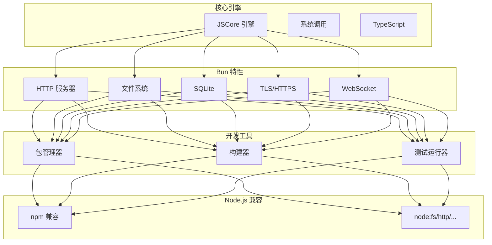
```mermaid
flowchart TB
    subgraph 核心层["核心引擎"]
        JS[JSCore 引擎]
        SY[系统调用]
        TS[TypeScript]
    end

    subgraph 功能层["Bun 特性"]
        HTTP[HTTP 服务器]
        FS[文件系统]
        SQL[SQLite]
        TLS[TLS/HTTPS]
        WS[WebSocket]
    end

    subgraph 工具链["开发工具"]
        PKG[包管理器]
        BND[构建器]
        TST[测试运行器]
    end

    subgraph 兼容层["Node.js 兼容"]
        NPM[npm 兼容]
        NODE[node:fs/http/...]
    end

    JS --> HTTP & FS & SQL & TLS & WS
    HTTP & FS & SQL & TLS & WS --> PKG & BND & TST
    PKG & BND & TST --> NPM & NODE
```

**性能对比**:

| 操作 | Bun | Node.js | 提升 |
|------|-----|---------|------|
| HTTP Requests/sec | 90,000+ | 45,000+ | 2x |
| npm install | 15s | 45s | 3x |
| TypeScript 执行 | 120ms | 800ms | 6.7x |
| SQLite 查询 | 50,000/s | 15,000/s | 3.3x |

**快速开始**:

```bash
# 安装
curl -fsSL https://bun.sh/install | bash

# 创建项目
bun init my-app
cd my-app

# 运行
bun run index.ts

# 启动开发服务器
bun --bun vite

# 测试
bun test
```

**内置功能示例**:

```typescript
// HTTP 服务器
Bun.serve({
  port: 3000,
  async fetch(req) {
    return new Response('Hello from Bun!')
  }
})

// SQLite
import { Database } from 'bun:sqlite'
const db = new Database(':memory:')
db.run('CREATE TABLE users (id INTEGER PRIMARY KEY, name TEXT)')

// WebSocket
const server = Bun.serve({
  port: 8080,
  fetch(req, server) {
    if (req.headers.get('upgrade') === 'websocket') {
      const success = server.upgrade(req)
      if (success) return undefined
    }
    return new Response('WebSocket server')
  },
  websocket: {
    open(ws) { ws.send('Welcome!') },
    message(ws, msg) { ws.send(`Echo: ${msg}`) }
  }
})
```

**参考链接**:
- [Bun 官网](https://bun.sh)
- [Bun GitHub](https://github.com/oven-sh/bun)

---

### 6.2 Vite 6

**核心创新点**:

Vite 6 集成 Rolldown 实现构建性能飞跃：

1. **Rolldown**: Rust 编写的 Rollup 替代品
2. **改进 SSR**: 更强的服务端渲染支持
3. **更好的 Monorepo**: 增强的多包支持
4. **生态系统**: 默认选择 Vue/Solid/Svelte 项目

**快速开始**:

```bash
npm create vite@latest my-app -- --template react-ts
npm install
npm run dev
```

**Vite 配置示例**:

```typescript
// vite.config.ts
import { defineConfig } from 'vite'
import vue from '@vitejs/plugin-vue'
import react from '@vitejs/plugin-react'

export default defineConfig({
  plugins: [vue(), react()],
  resolve: {
    alias: { '@': '/src' }
  },
  build: {
    target: 'esnext',
    minify: 'esbuild'
  }
})
```

---

### 6.3 Turbopack

**核心创新点**:

Turbopack 是 Rust 编写的 Webpack 继任者：

1. **极速冷启动**: 比 Webpack 快 700 倍
2. **增量构建**: 只构建变化的模块
3. **Next.js 16 集成**: 默认构建工具

**性能数据**:

| 场景 | Webpack | Turbopack | 提升 |
|------|---------|-----------|------|
| 冷启动 (10k 模块) | 60s | 0.08s | 750x |
| HMR 更新 | 500ms | 50ms | 10x |
| 生产构建 | 120s | 30s | 4x |

**注意**: Turbopack 仍在 alpha 阶段，插件 API 尚未公开。

---

## 8. CSS 新特性

### 7.1 Container Queries

**核心创新点**:

Container Queries 实现真正的组件级响应式设计：

1. **容器感知**: 组件响应自身容器而非视口
2. **组件复用**: 同一组件在不同容器中自动适配
3. **浏览器支持**: 92%+ 全球覆盖率

**技术架构图**:

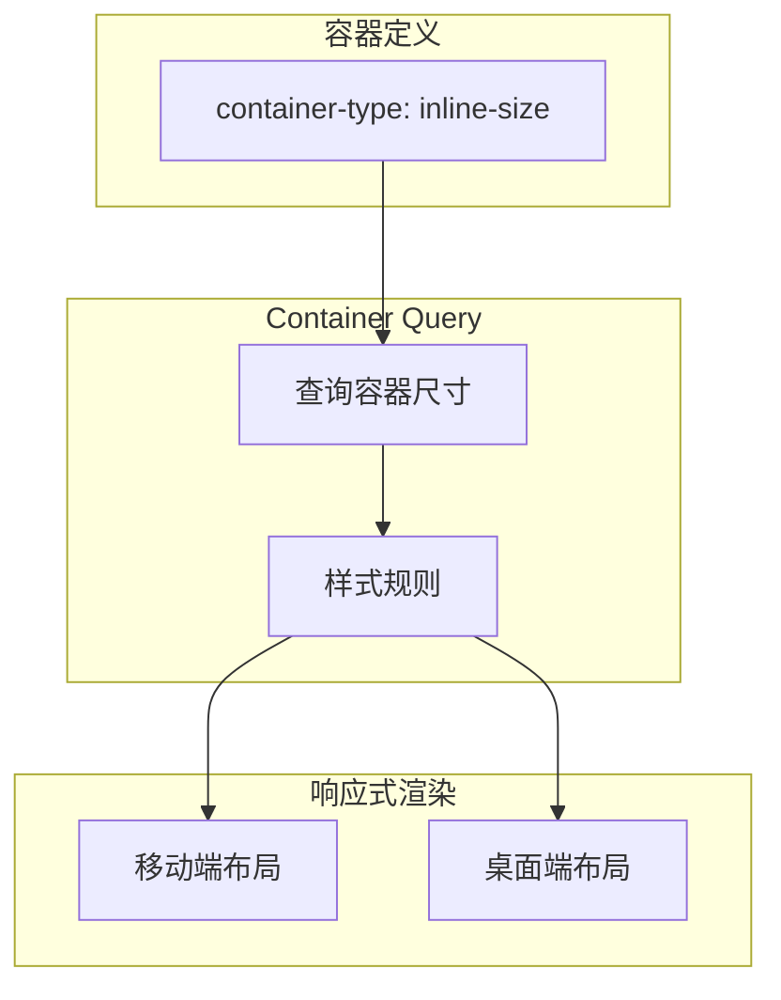
```mermaid
flowchart TB
    subgraph 容器["容器定义"]
        CT[container-type: inline-size]
    end

    subgraph 查询["Container Query"]
        CQ[查询容器尺寸]
        STYLE[样式规则]
    end

    subgraph 渲染["响应式渲染"]
        MOBILE[移动端布局]
        DESKTOP[桌面端布局]
    end

    CT --> CQ --> STYLE
    STYLE --> MOBILE & DESKTOP
```

**示例**:

```css
/* 定义容器 */
.card-container {
  container-type: inline-size;
  container-name: card;
}

/* 容器查询 */
@container card (min-width: 400px) {
  .card {
    display: flex;
    flex-direction: row;
  }
}

@container card (max-width: 399px) {
  .card {
    display: flex;
    flex-direction: column;
  }
}
```

**实战应用**:

```css
.article-card {
  container-type: inline-size;
}

.article-card h2 {
  font-size: 1rem;
}

.article-card p {
  font-size: 0.875rem;
  -webkit-line-clamp: 3;
  overflow: hidden;
}

@container (min-width: 500px) {
  .article-card {
    display: grid;
    grid-template-columns: 200px 1fr;
  }

  .article-card p {
    -webkit-line-clamp: unset;
  }
}
```

---

### 7.2 Cascade Layers (@layer)

**核心创新点**:

@layer 实现明确的层叠顺序控制：

1. **优先级控制**: 显式声明 CSS 层顺序
2. **第三方隔离**: 包含外部样式影响
3. **特异性管理**: 更可预测的样式覆盖

**示例**:

```css
/* 声明层顺序 */
@layer reset, base, theme, components, utilities;

/* 各层定义 */
@layer reset {
  * { margin: 0; padding: 0; box-sizing: border-box; }
}

@layer base {
  body {
    font-family: system-ui;
    line-height: 1.5;
  }
}

@layer components {
  .button {
    padding: 0.75rem 1.5rem;
    border-radius: 0.375rem;
    font-weight: 500;
  }

  .card {
    background: white;
    border-radius: 0.5rem;
    box-shadow: 0 1px 3px rgba(0,0,0,0.1);
  }
}

@layer utilities {
  .hidden { display: none; }
  .mt-4 { margin-top: 1rem; }
}
```

**第三方样式隔离**:

```css
/* 导入外部库到特定层 */
@import url('normalize.css') layer(base);
@import url('some-library.css') layer(vendor);
```

---

### 7.3 :has() 选择器

**核心创新点**:

:has() 是第一个实用的"父选择器"：

1. **父选择**: 根据子元素选择父元素
2. **状态选择**: 表单验证等场景
3. **条件样式**: 无需 JavaScript 实现条件渲染

**浏览器支持**: Chrome 105+, Firefox 121+, Safari 15.4+ (95%+ 覆盖率)

**示例**:

```css
/* 表单验证样式 */
form:has(input:invalid) {
  border-color: red;
}

form:has(input:focus) {
  border-color: blue;
}

/* 父选择 */
article:has(h2) {
  margin-bottom: 2rem;
}

/* 交互卡片 */
.card:has(.expanded) {
  height: auto;
}

.card:not(:has(.expanded)) {
  height: 300px;
  overflow: hidden;
}

/* 响应式网格 */
.container:has(.sidebar.visible) {
  grid-template-columns: 250px 1fr;
}

/* 菜单状态 */
nav:has(.active) .logo {
  font-weight: bold;
}
```

**JavaScript 替代方案**:

```typescript
// 传统 JavaScript
document.querySelectorAll('.card').forEach(card => {
  if (card.querySelector('.expanded')) {
    card.classList.add('is-expanded')
  }
})

// :has() CSS
.card:has(.expanded) {
  /* 自动应用样式 */
}
```

---

### 7.4 CSS 特性浏览器支持 (2026)

| 特性 | Chrome | Firefox | Safari | 全球支持 |
|------|--------|---------|--------|----------|
| Container Queries | 80+ | 110+ | 16+ | 92%+ |
| Cascade Layers | 99+ | 97+ | 15.4+ | 95%+ |
| :has() 选择器 | 105+ | 121+ | 15.4+ | 95%+ |
| @layer | 99+ | 97+ | 15.4+ | 95%+ |

---

## 9. 格式化工具

### 8.1 Prettier

**核心创新点**:

Prettier 是代码格式化的行业标准：

1. **零配置**: 开箱即用的opinionated格式
2. **生态系统主导**: ESLint、TypeScript、React官方推荐
3. **多语言支持**: JS/TS/CSS/HTML/JSON/Markdown/100+语言
4. **极速解析**: 自研AST解析器，高效打印

**技术架构图**:

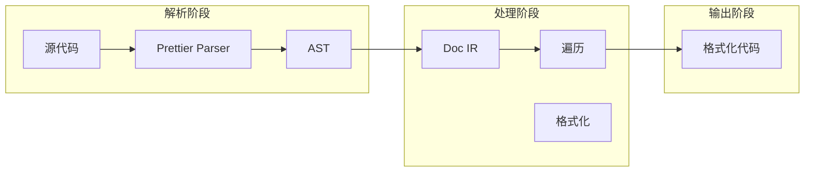
```mermaid
flowchart LR
    subgraph 解析["解析阶段"]
        CODE[源代码]
        PAR[Prettier Parser]
        AST[AST]
    end

    subgraph 处理["处理阶段"]
        DOC[Doc IR]
        TRAV[遍历]
        FM[格式化]
    end

    subgraph 输出["输出阶段"]
        FMT[格式化代码]
    end

    CODE --> PAR --> AST --> DOC --> TRAV --> FMT
```

**竞品对比**:

| 维度 | Prettier | Biome | ESLint --fix | dprint |
|------|----------|-------|--------------|--------|
| 语言 | Rust | Rust | Node.js | Rust |
| 速度 | 良好 | 极速 | 中等 | 极速 |
| 可配置性 | 低 (opinionated) | 中等 | 高 | 高 |
| Linter | 无 | 502+规则 | 2000+ | 无 |
| 生态 | 巨大 | 增长中 | 巨大 | 小 |

**快速开始**:

```bash
npm install --save-dev prettier
npx prettier --write src/**/*.js
```

**配置示例**:

```javascript
// .prettierrc
{
  "semi": true,
  "singleQuote": true,
  "tabWidth": 2,
  "trailingComma": "es5",
  "printWidth": 100,
  "arrowParens": "avoid"
}
```

```javascript
// .prettierignore
node_modules
dist
build
*.min.js
```

**2026年更新**:

- Prettier 3.x 持续稳定更新
- 增强对 TypeScript 5.4+ 特性支持
- 更好的 Rome/ESLint 配置兼容性
- 改进的错误提示

**npm 下载统计**:
- 54K+ GitHub stars
- 30M+ 周下载量
- 行业标准

**参考链接**:
- [Prettier 官网](https://prettier.io)
- [Prettier GitHub](https://github.com/prettier/prettier)

---

### 8.2 Biome

**核心创新点**:

Biome 是 Rust 编写的格式化 + Lint 工具：

1. **All-in-one**: 格式化 + Linter (502+ 规则)
2. **极速**: 比 Prettier 快 35 倍
3. **零配置**: 开箱即用
4. **97% Prettier 兼容**: 可作为直接替代

**技术架构图**:

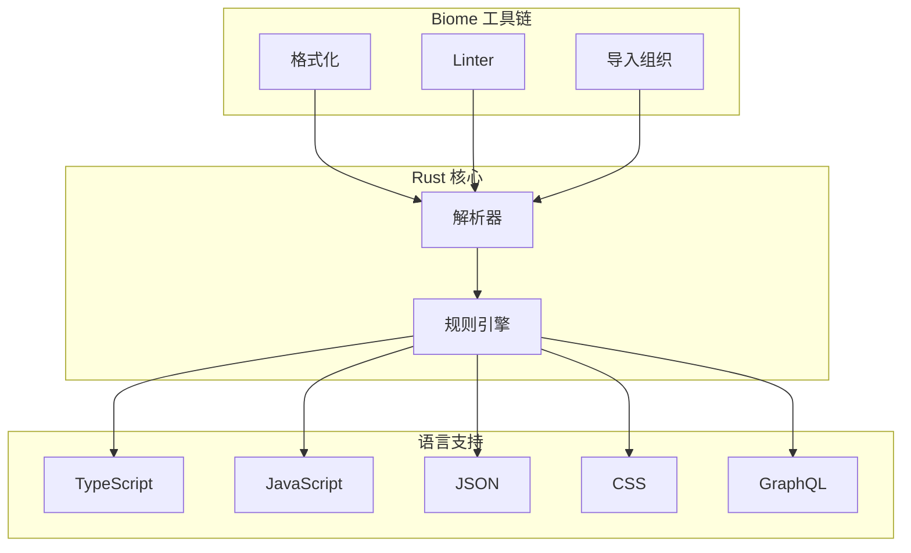
```mermaid
flowchart TB
    subgraph 工具链["Biome 工具链"]
        FMT[格式化]
        LINT[Linter]
        IMP[导入组织]
    end

    subgraph 核心["Rust 核心"]
        PARSER[解析器]
        RULES[规则引擎]
    end

    subgraph 适配["语言支持"]
        TS[TypeScript]
        JS[JavaScript]
        JSON[JSON]
        CSS[CSS]
        GRAPHQL[GraphQL]
    end

    FMT & LINT & IMP --> PARSER
    PARSER --> RULES
    RULES --> TS & JS & JSON & CSS & GRAPHQL
```

**竞品对比**:

| 维度 | Biome | Prettier | ESLint | dprint |
|------|-------|----------|--------|--------|
| 语言 | Rust | Node.js | Node.js | Rust |
| 速度 | 极速 | 良好 | 中等 | 极速 |
| 可配置性 | 中等 | 低 | 高 | 高 |
| Linter | 502+ 规则 | 无 | 2000+ 规则 | 无 |
| 生态 | 增长中 | 巨大 | 巨大 | 小 |
| 使用者 | Astro, AWS, Cloudflare, Google, Vercel | 通用 | 通用 | Deno |

**快速开始**:

```bash
npm install --save-dev --save-exact @biomejs/biome
npx @biomejs/biome format --write ./src
npx @biomejs/biome lint --write ./src
npx @biomejs/biome check --write ./src  # 格式化 + Lint
```

**配置 (biome.json)**:

```json
{
  "$schema": "https://biomejs.dev/schemas/1.9.0/schema.json",
  "organizeImports": { "enabled": true },
  "linter": {
    "enabled": true,
    "rules": {
      "recommended": true,
      "suspicious": {
        "noExplicitAny": "warn"
      }
    }
  },
  "formatter": {
    "indentStyle": "space",
    "indentWidth": 2,
    "lineWidth": 100
  },
  "javascript": {
    "formatter": {
      "quoteStyle": "single"
    }
  }
}
```

**npm 下载统计**:
- 12K+ GitHub stars
- 500K+ 周下载量
- 快速增长中

**参考链接**:
- [Biome 官网](https://biomejs.dev)
- [Biome GitHub](https://github.com/biomejs/biome)

---

### 8.3 dprint

**核心创新点**:

dprint 是高度可配置的 Rust 格式化工具：

1. **WASM 插件**: 沙箱隔离的插件系统
2. **高度可配置**: 不像 Prettier 的"少选项"哲学
3. **多语言支持**: TS/JS/JSON/Markdown/TOML/CSS/Go

**性能**:

- Deno 切换到 dprint 后报告 10x+ 性能提升
- 比 Prettier 快约 5 倍

**配置示例**:

```json
{
  "typescript": {
    "indentWidth": 2,
    "useTabs": false,
    "quoteStyle": "alwaysSingle"
  },
  "json": {},
  "markdown": {
    "textWrap": "word"
  },
  "includes": ["**/*.{ts,js,json,md}"]
}
```

---

### 8.4 ESLint 9.x Flat Config

**核心创新点**:

ESLint 9.x 引入 Flat Config 简化配置：

1. **ESM-first**: `eslint.config.js` 替代 `.eslintrc`
2. **数组配置**: 扁平化配置结构
3. **内置 TypeScript**: 无需额外解析器配置

**配置示例**:

```javascript
// eslint.config.js
import { defineConfig } from 'eslint/config'
import js from '@eslint/js'
import ts from '@typescript-eslint/eslint-plugin'
import tsParser from '@typescript-eslint/parser'

export default defineConfig([
  {
    files: ['**/*.js'],
    plugins: { js },
    rules: { ...js.configs.recommended.rules }
  },
  {
    files: ['**/*.ts'],
    languageOptions: {
      parser: tsParser
    },
    plugins: { ts },
    rules: {
      '@typescript-eslint/no-unused-vars': 'error',
      '@typescript-eslint/no-explicit-any': 'warn'
    }
  }
])
```

**迁移指南**:

```bash
# 迁移现有配置
npx @eslint/migrate-to-flat-config .eslintrc.json

# 或手动迁移
mv .eslintrc.js eslint.config.js
# 重写为数组格式
```

---

## 10. React 状态管理

### 9.1 Zustand

**核心创新点**:

Zustand 是极简的 React 状态管理库：

1. **零 Provider**: 无需包裹组件树
2. **极小体积**: 1KB gzip
3. **TypeScript-first**: 完整类型推导
4. **无依赖**: 零外部依赖

**技术架构图**:

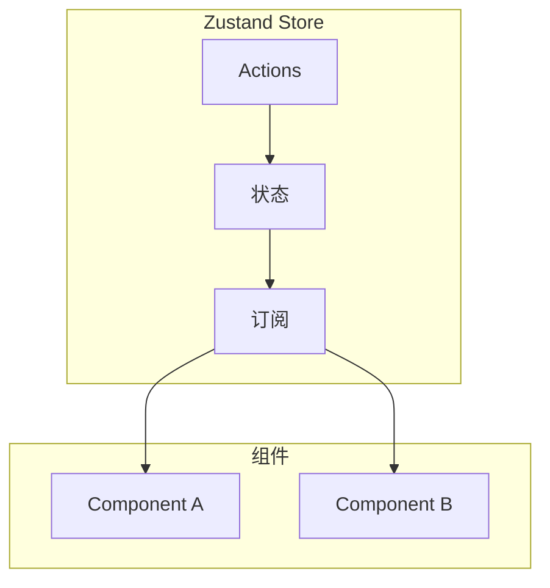
```mermaid
flowchart TB
    subgraph Store["Zustand Store"]
        STATE[状态]
        ACTIONS[Actions]
        SUBS[订阅]
    end

    subgraph 组件["组件"]
        COMP1[Component A]
        COMP2[Component B]
    end

    STATE --> SUBS --> COMP1 & COMP2
    ACTIONS --> STATE
```

**竞品对比**:

| 维度 | Zustand | Redux | Jotai | Recoil |
|------|---------|-------|-------|--------|
| 体积 | ~1KB | ~7KB | ~3KB | ~3KB |
| Provider | 无需 | 必须 | 必须 | 必须 |
| Boilerplate | 极少 | 大量 | 中等 | 中等 |
| 学习曲线 | 低 | 高 | 低 | 中 |
| DevTools | 基础 | 优秀 | 有限 | 有限 |

**快速开始**:

```typescript
import { create } from 'zustand'

interface BearState {
  bears: number
  increase: () => void
  reset: () => void
}

const useStore = create<BearState>((set) => ({
  bears: 0,
  increase: () => set((state) => ({ bears: state.bears + 1 })),
  reset: () => set({ bears: 0 })
}))

// 使用 - 无需 Provider
function BearCounter() {
  const bears = useStore((state) => state.bears)
  const increase = useStore((state) => state.increase)
  return (
    <div>
      <h1>{bears} bears</h1>
      <button onClick={increase}>增加</button>
    </div>
  )
}
```

**中间件示例**:

```typescript
import { create } from 'zustand'
import { persist } from 'zustand/middleware'

const useStore = create(
  persist(
    (set, get) => ({
      bears: 0,
      increase: () => set((state) => ({ bears: state.bears + 1 })),
      // 持久化到 localStorage
    }),
    {
      name: 'bear-storage',
      partialize: (state) => ({ bears: state.bears })
    }
  )
)
```

**npm 下载统计**:
- 22K+ GitHub stars
- 15M+ 周下载量

**参考链接**:
- [Zustand 官网](https://zustand-demo.pmnd.rs)
- [Zustand GitHub](https://github.com/pmndrs/zustand)

---

### 9.2 SWR

**核心创新点**:

SWR 是 Vercel 推出的数据请求库：

1. **Stale-While-Revalidate**: 先返回缓存，后台更新
2. **自动重新验证**: 窗口聚焦/网络恢复时自动刷新
3. **去重请求**: 相同请求只发一次
4. **极小体积**: 3KB gzip

**竞品对比**:

| 维度 | SWR | TanStack Query | Apollo Client |
|------|-----|----------------|---------------|
| 体积 | 3KB | 12KB | 40KB+ |
| API 复杂度 | 简单 | 丰富 | 复杂 |
| 缓存 | 基础 | 高级 | 高级 |
| GraphQL | 否 | 否 | 原生 |
| 适用场景 | 简单请求 | 复杂状态 | GraphQL |

**快速开始**:

```typescript
import useSWR from 'swr'

const fetcher = (url: string) => fetch(url).then(r => r.json())

function Profile() {
  const { data, error, isLoading } = useSWR('/api/user', fetcher)

  if (isLoading) return <div>加载中...</div>
  if (error) return <div>加载失败</div>

  return (
    <div>
      <h1>{data.name}</h1>
      <p>{data.email}</p>
    </div>
  )
}
```

**高级用法**:

```typescript
// 乐观更新
const { data, mutate } = useSWR('/api/todos', fetcher)

async function addTodo(todo) {
  // 乐观更新
  mutate([...data, todo], false)

  try {
    await fetch('/api/todos', {
      method: 'POST',
      body: JSON.stringify(todo)
    })
    // 重新验证
    mutate()
  } catch {
    // 回滚
    mutate(data, false)
  }
}

// 条件请求
const { data } = useSWR(userId ? `/api/user/${userId}` : null, fetcher)
```

**npm 下载统计**:
- 25K+ GitHub stars
- 10M+ 周下载量

**参考链接**:
- [SWR 官网](https://swr.vercel.app)
- [SWR GitHub](https://github.com/vercel/swr)

---

## 11. React 表单与动画

### 10.1 React Hook Form

**核心创新点**:

React Hook Form 是高性能的表单管理库：

1. **非受控模式**: 输入不触发重渲染
2. **极小体积**: ~3KB gzip
3. **Zod 集成**: 原生支持 schema 验证
4. **性能优先**: 表单越大优势越明显

**快速开始**:

```typescript
import { useForm } from 'react-hook-form'
import { z } from 'zod'
import { zodResolver } from '@hookform/resolvers/zod'

const schema = z.object({
  name: z.string().min(2),
  email: z.string().email(),
  age: z.number().min(18)
})

type FormData = z.infer<typeof schema>

function App() {
  const {
    register,
    handleSubmit,
    formState: { errors, isSubmitting }
  } = useForm<FormData>({
    resolver: zodResolver(schema)
  })

  const onSubmit = async (data: FormData) => {
    console.log(data)
  }

  return (
    <form onSubmit={handleSubmit(onSubmit)}>
      <input {...register('name')} />
      {errors.name && <span>{errors.name.message}</span>}

      <input {...register('email')} />
      {errors.email && <span>{errors.email.message}</span>}

      <input type="number" {...register('age', { valueAsNumber: true })} />
      {errors.age && <span>{errors.age.message}</span>}

      <button type="submit" disabled={isSubmitting}>
        提交
      </button>
    </form>
  )
}
```

**竞品对比**:

| 维度 | React Hook Form | Formik | React Form | RHF + Zod |
|------|-----------------|--------|------------|-----------|
| 体积 | ~3KB | ~10KB | ~5KB | ~8KB |
| 重渲染 | 最小 | 每次变化 | 中等 | 最小 |
| 验证 | Zod/Yup | Yup | 原生 | Zod (最佳) |
| API | 优秀 | 良好 | 良好 | 优秀 |

**npm 下载统计**:
- 39K+ GitHub stars
- 20M+ 周下载量

**参考链接**:
- [React Hook Form 官网](https://react-hook-form.com)
- [React Hook Form GitHub](https://github.com/react-hook-form/react-hook-form)

---

### 10.2 Framer Motion

**核心创新点**:

Framer Motion 是 React 动画库的行业标准：

1. **声明式 API**: 简单直观的动画语法
2. **布局动画**: AnimatePresence + layout
3. **手势支持**: Drag, Hover, Pan 内置
4. **服务端渲染**: 完整的 SSR 支持

**技术架构图**:

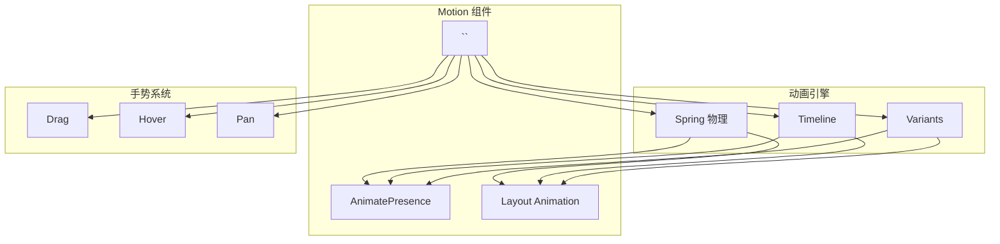
```mermaid
flowchart TB
    subgraph 组件["Motion 组件"]
        MOT[`<motion.div>`]
        PRES[AnimatePresence]
        LAY[Layout Animation]
    end

    subgraph 动画["动画引擎"]
        VAR[Variants]
        TIMELINE[Timeline]
        SPRING[Spring 物理]
    end

    subgraph 手势["手势系统"]
        DRAG[Drag]
        HOVER[Hover]
        PAN[Pan]
    end

    MOT --> VAR & TIMELINE & SPRING
    VAR & TIMELINE & SPRING --> PRES & LAY
    MOT --> DRAG & HOVER & PAN
```

**快速开始**:

```typescript
import { motion, AnimatePresence } from 'framer-motion'

function App() {
  const [isVisible, setIsVisible] = useState(true)

  return (
    <>
      {/* 基础动画 */}
      <motion.div
        initial={{ opacity: 0, scale: 0.8 }}
        animate={{ opacity: 1, scale: 1 }}
        transition={{ duration: 0.5, ease: 'easeOut' }}
      >
        内容
      </motion.div>

      {/* 悬停效果 */}
      <motion.button
        whileHover={{ scale: 1.05 }}
        whileTap={{ scale: 0.95 }}
      >
        点击
      </motion.button>

      {/* 退出动画 */}
      <AnimatePresence>
        {isVisible && (
          <motion.div
            initial={{ opacity: 0 }}
            animate={{ opacity: 1 }}
            exit={{ opacity: 0 }}
          >
            条件渲染
          </motion.div>
        )}
      </AnimatePresence>
    </>
  )
}
```

**布局动画示例**:

```typescript
// 列表重新排序时自动动画
function TodoList() {
  const [todos, setTodos] = useState(initialTodos)

  return (
    <AnimatePresence>
      {todos.map(todo => (
        <motion.div
          key={todo.id}
          layout
          initial={{ opacity: 0, y: 20 }}
          animate={{ opacity: 1, y: 0 }}
          exit={{ opacity: 0, x: -100 }}
        >
          {todo.text}
        </motion.div>
      ))}
    </AnimatePresence>
  )
}
```

**npm 下载统计**:
- 22K+ GitHub stars
- 15M+ 周下载量

**参考链接**:
- [Framer Motion 官网](https://www.framer.com/motion/)
- [Framer Motion GitHub](https://github.com/framer/motion)

---

## 12. HTTP 客户端

### 11.1 Axios

**核心创新点**:

Axios 是最流行的 HTTP 客户端库：

1. **Promise API**: 基于 Promise，易于使用
2. **请求/响应拦截器**: 全局处理逻辑
3. **自动 JSON 转换**: 请求自动序列化
4. **取消请求**: CancelToken/AbortController
5. **浏览器 + Node**: 统一 API

**快速开始**:

```typescript
import axios from 'axios'

// GET 请求
const { data } = await axios.get('/api/users')

// POST 请求
const { data } = await axios.post('/api/users', {
  name: 'Alice',
  email: 'alice@example.com'
})

// 配置
axios({
  method: 'post',
  url: '/api/users',
  data: { name: 'Alice' },
  headers: { 'Authorization': 'Bearer token' },
  timeout: 5000
})
```

**拦截器示例**:

```typescript
// 请求拦截器
axios.interceptors.request.use(
  (config) => {
    // 添加 token
    config.headers.Authorization = `Bearer ${getToken()}`
    return config
  },
  (error) => Promise.reject(error)
)

// 响应拦截器
axios.interceptors.response.use(
  (response) => response.data,
  (error) => {
    if (error.response?.status === 401) {
      // 处理未授权
      logout()
    }
    return Promise.reject(error)
  }
)
```

**npm 下载统计**:
- 104K+ GitHub stars
- 60M+ 周下载量

**参考链接**:
- [Axios 官网](https://axios-http.com)
- [Axios GitHub](https://github.com/axios/axios)

---

### 11.2 Ky

**核心创新点**:

Ky 是基于原生 fetch 的轻量 HTTP 客户端：

1. **极小体积**: 3.8KB gzip
2. **原生 fetch**: 无 XMLHttpRequest
3. **简单 API**: 直观的链式调用
4. **内置重试**: 自动重试失败请求

**快速开始**:

```typescript
import ky from 'ky'

// GET
const data = await ky.get('/api/users').json()

// POST
const user = await ky.post('/api/users', {
  json: { name: 'Alice', email: 'alice@example.com' }
}).json()

// 配置
const api = ky.create({
  prefixUrl: '/api',
  timeout: 10000,
  hooks: {
    beforeRequest: [
      (request) => {
        request.headers.set('Authorization', `Bearer ${getToken()}`)
      }
    ]
  }
})

// 使用
const data = await api.get('users').json()
```

**竞品对比**:

| 维度 | Axios | Ky | ofetch | fetch |
|------|-------|-----|--------|-------|
| 体积 | ~14KB | 3.8KB | 1KB | 0KB |
| 浏览器支持 | 全部 | 现代 | 现代 | 全部 |
| Node.js | 支持 | 支持 | 支持 | 原生 |
| 拦截器 | 原生 | Ky 扩展 | - | - |
| 取消请求 | CancelToken | AbortSignal | AbortSignal | AbortSignal |

**npm 下载统计**:
- 10K+ GitHub stars
- 2M+ 周下载量

**参考链接**:
- [Ky GitHub](https://github.com/sindresorhus/ky)

---

### 11.3 ofetch

**核心创新点**:

ofetch 是 Nuxt 团队的 HTTP 客户端：

1. **统一 API**: 浏览器 + Node.js 同构
2. **极小体积**: ~1KB gzip
3. **自动 JSON**: 自动解析响应
4. **SSR 友好**: Nuxt 生态首选

**快速开始**:

```typescript
import { $fetch } from 'ofetch'

// GET
const users = await $fetch('/api/users')

// POST
const user = await $fetch('/api/users', {
  method: 'POST',
  body: { name: 'Alice' }
})

// 自动错误处理
try {
  const data = await $fetch('/api/data')
} catch (error) {
  console.error(error.data) // 服务器返回的 JSON
}
```

**npm 下载统计**:
- Nuxt 生态核心依赖
- 百万级使用

**参考链接**:
- [ofetch GitHub](https://github.com/unjs/ofetch)

---

## 13. 微前端架构

### 13.1 Module Federation 2.0

**核心创新点**:

Module Federation 2.0 (2026年5月) 增强跨应用代码共享：

1. **构建时共享**: Webpack 5 原生支持
2. **依赖复用**: 避免重复打包公共依赖
3. **动态模块**: 运行时动态加载远程模块
4. **Rspack 支持**: 扩展到 Rspack 生态

**技术架构图**:

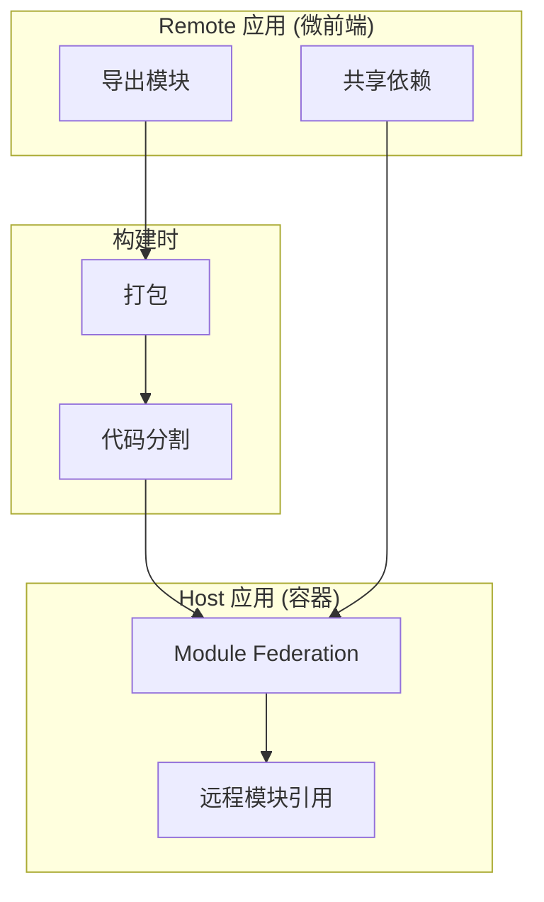
```mermaid
flowchart TB
    subgraph Host["Host 应用 (容器)"]
        MF[Module Federation]
        REMOTE[远程模块引用]
    end

    subgraph Remote["Remote 应用 (微前端)"]
        EXP[导出模块]
        DEPS[共享依赖]
    end

    subgraph 构建["构建时"]
        BUILD[打包]
        CHUNK[代码分割]
    end

    EXP --> BUILD --> CHUNK --> MF
    DEPS --> MF
    MF --> REMOTE
```

**Host 应用配置**:

```javascript
// webpack.config.js (Host)
const { ModuleFederationPlugin } = require('webpack').container
const { dependencies } = require('./package.json')

module.exports = {
  plugins: [
    new ModuleFederationPlugin({
      name: 'host',
      remotes: {
        remoteApp: 'remoteApp@http://localhost:3001/remoteEntry.js'
      },
      shared: {
        ...dependencies,
        react: { singleton: true, requiredVersion: dependencies.react },
        'react-dom': { singleton: true, requiredVersion: dependencies['react-dom'] }
      }
    })
  ]
}
```

**Remote 应用配置**:

```javascript
// webpack.config.js (Remote)
const { ModuleFederationPlugin } = require('webpack').container
const { dependencies } = require('./package.json')

module.exports = {
  plugins: [
    new ModuleFederationPlugin({
      name: 'remoteApp',
      filename: 'remoteEntry.js',
      exposes: {
        './Button': './src/components/Button',
        './Card': './src/components/Card'
      },
      shared: {
        react: { singleton: true, requiredVersion: dependencies.react },
        'react-dom': { singleton: true }
      }
    })
  ]
}
```

**运行时使用**:

```tsx
import React, { Suspense } from 'react'

function App() {
  return (
    <div>
      <h1>Host Application</h1>
      <Suspense fallback={<div>Loading remote module...</div>}>
        <RemoteButton />
      </Suspense>
    </div>
  )
}

// 动态导入远程模块
const RemoteButton = React.lazy(() => import('remoteApp/Button'))
```

**参考链接**:
- [Module Federation 官网](https://module-federation.io)
- [Webpack MF 文档](https://webpack.js.org/concepts/module-federation/)

---

### 9.2 Qiankun

**核心创新点**:

Qiankun 基于 Single-SPA 实现运行时微前端：

1. **运行时加载**: JS/CSS 沙箱隔离
2. **任意框架**: Vue/React/Angular/原生应用
3. **UMD 兼容**: 支持任何导出 UMD 模块的应用

**快速开始**:

```bash
npm install qiankun
```

**主应用**:

```typescript
import { registerMicroApps, start } from 'qiankun'

registerMicroApps([
  {
    name: 'react-app',
    entry: '//localhost:7100',
    container: '#container',
    activeRule: '/react'
  },
  {
    name: 'vue-app',
    entry: '//localhost:7200',
    container: '#container',
    activeRule: '/vue'
  }
], {
  beforeLoad: [
    app => {
      console.log('[主应用] before load', app.name)
      return Promise.resolve()
    }
  ],
  beforeMount: [
    app => {
      console.log('[主应用] before mount', app.name)
      return Promise.resolve()
    }
  ],
  afterUnmount: [
    app => {
      console.log('[主应用] after unmount', app.name)
      return Promise.resolve()
    }
  ]
})

start()
```

**子应用入口**:

```javascript
// react 子应用 src/index.js
import React from 'react'
import ReactDOM from 'react-dom/client'
import App from './App'

function render(props) {
  const { container } = props || {}
  const root = container
    ? container.querySelector('#root')
    : document.getElementById('root')

  ReactDOM.createRoot(root).render(<App />)
}

if (!window.__POWERED_BY_QIANKUN__) {
  render({})
}

export async function bootstrap() {
  console.log('[react] bootstrap')
}

export async function mount(props) {
  console.log('[react] mount', props)
  render(props)
}

export async function unmount() {
  console.log('[react] unmount')
  ReactDOM.unmountComponentAtRoot(
    container ? container.querySelector('#root') : document.getElementById('root')
  )
}
```

**微前端对比**:

| 维度 | Module Federation | Qiankun |
|------|-------------------|---------|
| 加载方式 | 构建时 | 运行时 |
| 共享依赖 | 原生 | 需要配置 |
| 沙箱隔离 | Webpack 管理 | JS/CSS 沙箱 |
| 框架支持 | 主要 Webpack | 任意框架 |
| 状态共享 | 共享模块 | props 传递 |

---

## 14. Monorepo 工具链

### 10.1 pnpm + Turborepo

**核心创新点**:

pnpm + Turborepo 是 2026 年 Monorepo 的黄金组合：

1. **pnpm**: 内容寻址存储，安装速度 3x npm
2. **Turborepo**: 任务图 + 增量构建 + 远程缓存
3. **Changesets**: 版本管理和发布

**技术架构图**:

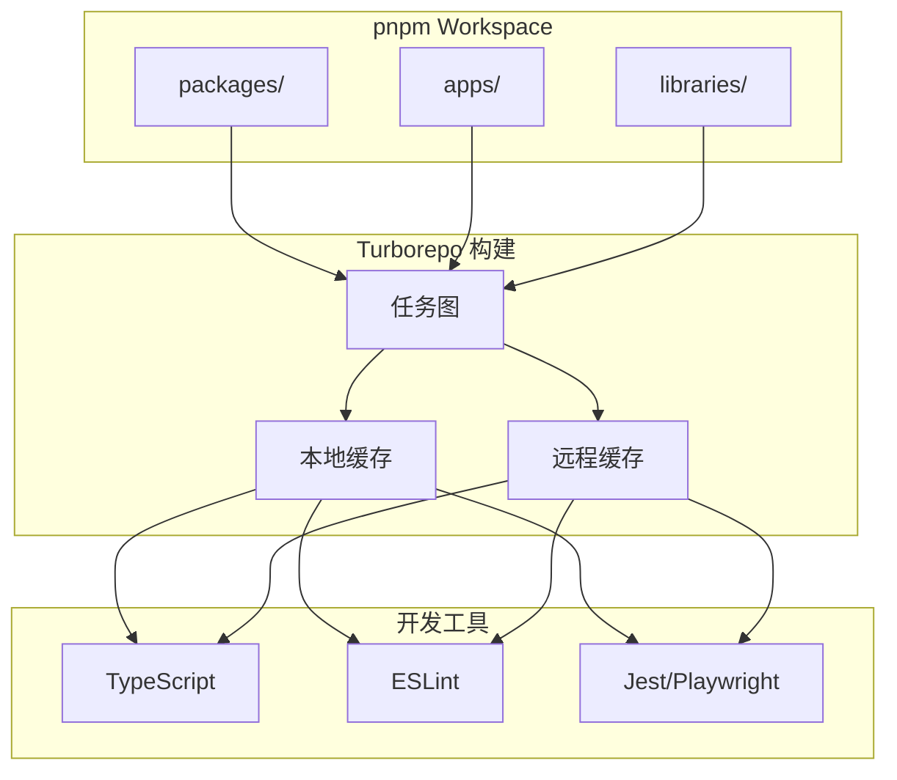
```mermaid
flowchart TB
    subgraph Workspace["pnpm Workspace"]
        PKGS[packages/]
        APPS[apps/]
        LIBS[libraries/]
    end

    subgraph 构建["Turborepo 构建"]
        GRAPH[任务图]
        CACHE[本地缓存]
        REMOTE[远程缓存]
    end

    subgraph 工具["开发工具"]
        TSC[TypeScript]
        ESL[ESLint]
        TEST[Jest/Playwright]
    end

    PKGS & APPS & LIBS --> GRAPH
    GRAPH --> CACHE & REMOTE
    CACHE & REMOTE --> TSC & ESL & TEST
```

**pnpm workspace 配置**:

```yaml
# pnpm-workspace.yaml
packages:
  - 'apps/*'
  - 'packages/*'
```

**Turborepo 配置**:

```json
// turbo.json
{
  "$schema": "https://turbo.build/schema.json",
  "globalDependencies": ["**/.env.*local"],
  "pipeline": {
    "build": {
      "dependsOn": ["^build"],
      "outputs": ["dist/**", ".next/**"]
    },
    "lint": {
      "dependsOn": ["^build"]
    },
    "test": {
      "dependsOn": ["^build"],
      "outputs": ["coverage/**"]
    },
    "dev": {
      "cache": false,
      "persistent": true
    }
  }
}
```

**快速开始**:

```bash
# 安装 pnpm
npm install -g pnpm

# 初始化 workspace
pnpm init

# 创建应用
pnpm --filter @myapp/web dev

# 构建全部
pnpm -r build

# Turborepo 远程缓存 (Vercel)
npx turbo login
npx turbo link
```

**参考链接**:
- [pnpm 官网](https://pnpm.io)
- [Turborepo 官网](https://turbo.build/repo)

---

### 10.2 Nx

**核心创新点**:

Nx 是企业级 Monorepo 解决方案：

1. **高级任务编排**: 智能任务依赖分析
2. **增量构建**: 只构建受影响的模块
3. **可视化**: 项目图和任务图
4. **强大插件**: 支持所有主流框架

**快速开始**:

```bash
npx create-nx-workspace@latest my-org --preset=monorepo
cd my-org
npx nx serve myapp
```

---

## 15. 测试框架

### 11.1 Playwright

**核心创新点**:

Playwright 已超越 Cypress 成为测试首选：

1. **Auto-waiting**: 智能等待断言
2. **多浏览器**: Chromium/Firefox/WebKit
3. **Tracing**: 完整执行追踪
4. **AI CLI**: AI 驱动的浏览器自动化
5. **MCP 支持**: Claude Code 集成

**技术架构图**:

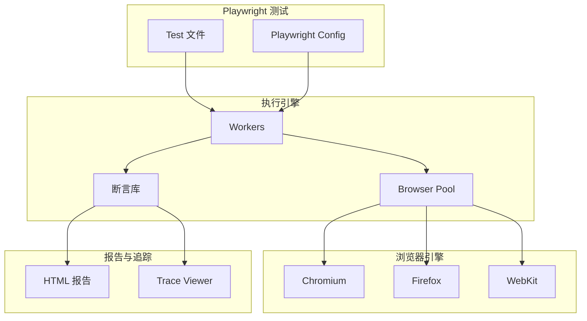
```mermaid
flowchart TB
    subgraph 测试["Playwright 测试"]
        TEST[Test 文件]
        CONFIG[Playwright Config]
    end

    subgraph 执行["执行引擎"]
        WORKER[Workers]
        BROWSER[Browser Pool]
        ASSERT[断言库]
    end

    subgraph 浏览器["浏览器引擎"]
        CR[Chromium]
        FF[Firefox]
        WK[WebKit]
    end

    subgraph 报告["报告与追踪"]
        REPORT[HTML 报告]
        TRACE[Trace Viewer]
    end

    TEST & CONFIG --> WORKER
    WORKER --> BROWSER --> CR & FF & WK
    WORKER --> ASSERT
    ASSERT --> REPORT & TRACE
```

**竞品对比**:

| 维度 | Playwright | Cypress |
|------|------------|---------|
| GitHub Stars | 88k+ | 48k+ |
| 浏览器支持 | Chromium/Firefox/WebKit | Chromium/Electron |
| Auto-waiting | 原生支持 | 需要手动等待 |
| 调试体验 | 优秀 | 优秀 |
| AI 集成 | MCP Server | 有限 |
| 移动端 | WebView | 仅 iOS |

**快速开始**:

```bash
npm init playwright@latest
npx playwright test
```

**测试示例**:

```typescript
// tests/example.spec.ts
import { test, expect } from '@playwright/test'

test.describe('登录流程', () => {
  test.beforeEach(async ({ page }) => {
    await page.goto('/login')
  })

  test('成功登录', async ({ page }) => {
    await page.fill('#email', 'test@example.com')
    await page.fill('#password', 'password123')
    await page.click('button[type="submit"]')

    await expect(page).toHaveURL('/dashboard')
    await expect(page.locator('.welcome')).toBeVisible()
  })

  test('无效凭据显示错误', async ({ page }) => {
    await page.fill('#email', 'wrong@example.com')
    await page.fill('#password', 'wrongpass')
    await page.click('button[type="submit"]')

    await expect(page.locator('.error')).toContainText('Invalid credentials')
  })

  test('密码可见性切换', async ({ page }) => {
    const passwordInput = page.locator('#password')
    await expect(passwordInput).toHaveAttribute('type', 'password')

    await page.click('[data-testid="toggle-password"]')
    await expect(passwordInput).toHaveAttribute('type', 'text')
  })
})
```

**配置**:

```typescript
// playwright.config.ts
import { defineConfig, devices } from '@playwright/test'

export default defineConfig({
  testDir: './tests',
  fullyParallel: true,
  forbidOnly: !!process.env.CI,
  retries: process.env.CI ? 2 : 0,
  workers: process.env.CI ? 1 : undefined,
  reporter: 'html',
  use: {
    baseURL: 'http://localhost:3000',
    trace: 'on-first-retry'
  },
  projects: [
    {
      name: 'chromium',
      use: { ...devices['Desktop Chrome'] }
    },
    {
      name: 'firefox',
      use: { ...devices['Desktop Firefox'] }
    },
    {
      name: 'webkit',
      use: { ...devices['Desktop Safari'] }
    }
  ]
})
```

**参考链接**:
- [Playwright 官网](https://playwright.dev)
- [Playwright GitHub](https://github.com/microsoft/playwright)

---

### 11.2 Testing Library

**核心创新点**:

Testing Library 是组件测试的事实标准：

1. **以用户为中心**: 测试用户如何与界面交互
2. **无实现细节**: 不依赖组件内部结构
3. **框架无关**: React/Vue/Svelte/Angular 全支持
4. **Playwright 集成**: playwright-testing-library

**查询优先级**:

```typescript
// 按优先级排序 (从高到低)
import { render, screen } from '@testing-library/react'

// 1. 可访问性查询 (首选)
await screen.findByRole('button', { name: /submit/i })

// 2. 文本内容查询
await screen.findByText(/welcome/i)

// 3. 标签关联查询
await screen.findByLabelText(/email/i)

// 4. 测试 ID (最后选择)
await screen.findByTestId('submit-button')
```

**Playwright + Testing Library**:

```typescript
import { test, expect } from '@playwright/test'
import { screen } from '@playwright/testing-library'

test('登录表单', async ({ page }) => {
  await page.goto('/login')

  // Testing Library 查询
  const emailInput = page.getByLabel(/email/i)
  const passwordInput = page.getByLabel(/password/i)
  const submitButton = page.getByRole('button', { name: /sign in/i })

  await emailInput.fill('test@example.com')
  await passwordInput.fill('password123')
  await submitButton.click()

  await expect(page).toHaveURL('/dashboard')
})
```

---

## 16. 前端工具链

### 12.1 Hono

**核心创新点**:

Hono 是极速轻量的跨平台 Web 框架：

1. **Web Standards**: 基于标准 Request/Response
2. **全平台**: Cloudflare Workers + Node.js + Deno + Bun
3. **极速**: ~14KB，比 Express 快 6 倍
4. **TypeScript-first**: 完整类型推导

**技术架构图**:

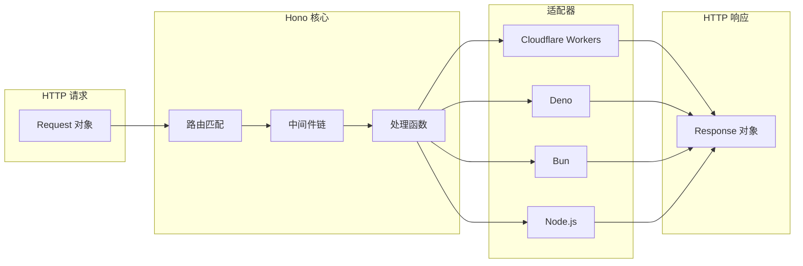
```mermaid
flowchart LR
    subgraph 请求["HTTP 请求"]
        R1[Request 对象]
    end

    subgraph 核心["Hono 核心"]
        RT[路由匹配]
        MW[中间件链]
        HT[处理函数]
    end

    subgraph 适配["适配器"]
        CF[Cloudflare Workers]
        DN[Deno]
        BN[Bun]
        ND[Node.js]
    end

    subgraph 响应["HTTP 响应"]
        R2[Response 对象]
    end

    R1 --> RT --> MW --> HT --> CF & DN & BN & ND --> R2
```

**竞品对比**:

| 特性 | Hono | Express | Fastify |
|------|------|---------|---------|
| 体积 (压缩) | ~14KB | ~700KB | ~200KB |
| 路由性能 | 极高 | 中等 | 高 |
| TypeScript | 原生完整 | 需要 @types | 良好 |
| 中间件模型 | 洋葱模型 | 线性 | 线性 |
| 适配器生态 | 全平台 | 主要 Node.js | 主要 Node.js |

**快速开始**:

```typescript
import { Hono } from 'hono'
import { cors } from 'hono/cors'
import { logger } from 'hono/logger'

const app = new Hono()

// 中间件
app.use('/*', cors())
app.use('/*', logger())

// 路由
app.get('/', c => c.text('Hello Hono!'))
app.get('/api/users/:id', c => {
  const id = c.req.param('id')
  return c.json({ id, name: 'John Doe' })
})

// JSON Schema 验证
import { zValidator } from '@hono/zod-validator'
import { z } from 'zod'

const schema = z.object({
  name: z.string().min(1),
  age: z.number().int().positive()
})

app.post('/user', zValidator('json', schema), c => {
  const { name, age } = c.req.valid('json')
  return c.json({ created: { name, age } })
})

export default app
```

**参考链接**:
- [Hono 官网](https://hono.dev)
- [Hono GitHub](https://github.com/honojs/hono)

---

### 12.2 Vite (已在第6节介绍)

---

### 12.3 Bun (已在第6节介绍)

---

## 17. 组件库与 UI

### 13.1 shadcn/ui

**核心创新点**:

shadcn/ui 不是组件库，而是源代码复制模式：

1. **源代码复制**: 组件代码复制到项目中
2. **完全控制**: 零依赖，完全定制
3. **Radix UI + Tailwind**: 无样式可访问组件 + Utility CSS
4. **按需采用**: 按需添加，非全量安装

**快速开始**:

```bash
npx shadcn-ui@latest init
npx shadcn-ui@latest add button
npx shadcn-ui@latest add dialog
npx shadcn-ui@latest add form
```

**使用示例**:

```tsx
import { Button } from '@/components/ui/button'
import {
  Dialog,
  DialogContent,
  DialogHeader,
  DialogTitle,
  DialogTrigger
} from '@/components/ui/dialog'

function ExampleDialog() {
  return (
    <Dialog>
      <DialogTrigger asChild>
        <Button variant="outline">打开对话框</Button>
      </DialogTrigger>
      <DialogContent>
        <DialogHeader>
          <DialogTitle>确认操作</DialogTitle>
        </DialogHeader>
        <p>此操作无法撤销。</p>
        <div className="flex justify-end gap-2">
          <Button variant="outline">取消</Button>
          <Button variant="destructive">确认</Button>
        </div>
      </DialogContent>
    </Dialog>
  )
}
```

**参考链接**:
- [shadcn/ui 官网](https://ui.shadcn.com)
- [shadcn/ui GitHub](https://github.com/shadcn-ui/ui)

---

## 18. 类型与验证

### 14.1 Zod

**核心创新点**:

Zod 实现 TypeScript 类型系统缺失的运行时验证：

1. **Schema-first**: 定义 Schema 同时获得类型推导
2. **运行时验证**: 编译时 + 运行时双重保障
3. **广泛集成**: API/表单/环境变量/配置

**快速开始**:

```typescript
import { z } from 'zod'

const UserSchema = z.object({
  name: z.string().min(2).max(100),
  email: z.string().email(),
  age: z.number().int().positive().optional(),
  role: z.enum(['admin', 'user', 'guest']),
  createdAt: z.coerce.date()
})

type User = z.infer<typeof UserSchema>

// 验证数据
const result = UserSchema.safeParse({
  name: 'Alice',
  email: 'alice@example.com',
  role: 'admin'
})

if (result.success) {
  console.log(result.data) // 类型安全的 User
} else {
  console.log(result.error.issues)
}
```

**高级用法**:

```typescript
// 递归类型
const CommentSchema = z.object({
  id: z.string().uuid(),
  text: z.string().min(1),
  replies: z.array(z.lazy(() => CommentSchema)).optional()
})

// 条件验证
const StartEndSchema = z.object({
  startDate: z.date(),
  endDate: z.date().refine((date, ctx) => {
    if (date < ctx.parent.startDate) {
      ctx.addIssue({
        code: z.ZodIssueCode.custom,
        message: '结束日期必须晚于开始日期'
      })
    }
    return true
  })
})

// 工具函数
const partial = UserSchema.partial()
const required = partial.required()
const omit = UserSchema.omit({ metadata: true })
const pick = UserSchema.pick({ name: true, email: true })
```

**参考链接**:
- [Zod 官网](https://zod.dev)
- [Zod GitHub](https://github.com/colinhacks/zod)

---

### 14.2 Effect

**核心创新点**:

Effect 是 TypeScript 函数式编程库：

1. **类型安全**: 端到端类型推导
2. **错误处理**: 可组合的错误类型
3. **并发**: 结构化并发原语
4. **管道**: 函数组合

**快速开始**:

```typescript
import { Effect, Context, Layer } from 'effect'

// 定义服务
interface UserService {
  readonly getUser: (id: string) => Effect.Effect<User, UserNotFoundError>
  readonly createUser: (data: CreateUserInput) => Effect.Effect<User, ValidationError>
}

// Effect 程序
const program = Effect.gen(function* (_) {
  const userService = yield* _(UserService)

  const user = yield* _(userService.getUser('123'))
  yield* _(console.log(`Found: ${user.name}`))

  return user
})

// 运行
Effect.runPromise(program)
```

---

---

## 20. 后端即服务 (BaaS)

### 20.1 Supabase

**核心创新点**:

Supabase 是开源的 Firebase 替代品：

1. **PostgreSQL 核心**: 强大的关系数据库
2. **实时订阅**: WebSocket 实时数据同步
3. **Row Level Security**: 行级安全策略
4. **Edge Functions**: 无服务器函数
5. **文件存储**: 大文件存储服务

**技术架构图**:

```mermaid
flowchart TB
    subgraph Client["客户端"]
        WEB[Web App]
        MOBILE[Mobile App]
    end

    subgraph Edge["Edge Layer"]
        SF[Supabase Edge Functions]
        API[REST / GraphQL API]
    end

    subgraph Storage["存储层"]
        PG[(PostgreSQL)]
        S3[(S3 / Storage)]
        AUTH[Auth]
        RT[Realtime]
    end

    WEB & MOBILE --> API
    API --> PG & S3 & AUTH & RT
    SF --> PG & S3
```

**快速开始**:

```bash
# 安装 Supabase CLI
npm install -g supabase

# 初始化项目
supabase init

# 启动本地开发
supabase start

# 连接到远程
supabase link --project-ref your-project-id
```

**周下载量**: 1570 万 | **GitHub**: 72K stars

**参考链接**:
- [Supabase 官网](https://supabase.com)
- [Supabase 文档](https://supabase.com/docs)
- [GitHub](https://github.com/supabase/supabase-js)

---

### 20.2 Firebase

**核心创新点**:

Google 的 BaaS 平台：

1. **Firestore**: NoSQL 文档数据库
2. **Authentication**: 多认证方式
3. **Cloud Functions**: 无服务器函数
4. **Hosting**: 静态托管
5. **Cloud Messaging**: 推送通知

**快速开始**:

```bash
# 安装 Firebase CLI
npm install -g firebase-tools

# 登录
firebase login

# 初始化项目
firebase init

# 部署
firebase deploy
```

**周下载量**: 756 万

**参考链接**:
- [Firebase 文档](https://firebase.google.com/docs)
- [GitHub](https://github.com/firebase/firebase-js-sdk)

---

### 20.3 PocketBase

**核心创新点**:

Go 语言开发的轻量级 BaaS：

1. **单文件运行**: 零依赖
2. **SQLite 内嵌**: 嵌入式数据库
3. **内置 UI**: 管理面板
4. **实时订阅**: 内置 WebSocket

**快速开始**:

```bash
# 下载 PocketBase
curl -L https://github.com/pocketbase/pocketbase/releases/latest/download/pocketbase_linux_amd64.zip -o pb.zip
unzip pb.zip

# 启动
./pocketbase serve
```

**GitHub**: 34K stars

**参考链接**:
- [PocketBase 官网](https://pocketbase.io)
- [GitHub](https://github.com/pocketbase/pocketbase)

---

## 总结

### NPM Top 100 库分类汇总 (2026年5月)

| 分类 | 代表库 | 周下载量 | 趋势 |
|------|-------|---------|------|
| **React 生态** | react, react-dom, react-router | 2.5 亿+ | 稳定增长 |
| **全栈框架** | next, @next/* | 8000 万+ | 高速增长 |
| **状态管理** | zustand, @tanstack/react-query | 6000 万+ | 新秀崛起 |
| **构建工具** | vite, webpack, esbuild | 1.5 亿+ | Vite 主导 |
| **TypeScript** | typescript, @types/* | 2 亿+ | 必备工具 |
| **测试框架** | vitest, jest, @testing-library/* | 1.5 亿+ | Vitest 崛起 |
| **Node.js 后端** | express, koa, fastify, nestjs | 1.5 亿+ | 多元化 |
| **ORM/数据库** | prisma, mongoose, mysql2 | 5000 万+ | Prisma 领跑 |
| **HTTP 客户端** | axios, undici, node-fetch | 5000 万+ | Axios 霸主 |
| **AI/LLM SDK** | openai, @anthropic-ai/sdk, ai | 5000 万+ | 爆发增长 |
| **BaaS** | @supabase/supabase-js, firebase | 2300 万+ | Firebase 仍强 |
| **认证** | jsonwebtoken, passport, bcrypt | 6000 万+ | 必备组件 |
| **工具库** | lodash, date-fns, uuid | 1.5 亿+ | 稳定 |
| **CLI 工具** | chalk, commander, ora | 1 亿+ | 必备 |
| **CSS 框架** | tailwindcss | 1200 万+ | 增长迅猛 |
| **UI 组件** | @mui/material, antd | 1500 万+ | 企业必备 |

### 技术趋势速览 (2026)

| 领域 | 趋势 | 代表项目 |
|------|------|---------|
| AI 编码 | Agent 编排成为主流 | Cursor 3, Claude Code, Windsurf |
| AI 应用构建 | 自然语言生成 | v0, Bolt.new, Lovable |
| AI SDK | 流式 UI 标准化 | Vercel AI SDK |
| MCP 协议 | AI 工具标准化 | MCP (Anthropic) |
| 响应式 | Signal/细粒度响应式 | Solid.js, Qwik, Svelte 5 |
| 构建工具 | Rust 时代 | Turbopack, Rolldown, Bun |
| CSS | 组件级响应式 | Container Queries, :has(), @layer |
| 格式化 | All-in-one | Biome |
| 微前端 | Module Federation 2.0 | MF, Qiankun |
| Monorepo | pnpm + Turborepo | pnpm, Turborepo |
| 测试 | Playwright 主导 | Playwright, Testing Library |
| 类型系统 | Schema-first | Zod, Effect |
| AI SDK | OpenAI/Anthropic 爆发 | openai (1970万/周) |
| BaaS | Supabase 快速增长 | Supabase (1570万/周) |

### 选型建议

| 场景 | 推荐 |
|------|------|
| AI 原生开发 | Cursor + Claude Code |
| 性能优先 UI | Solid.js / Qwik |
| 内容型网站 | Astro / SvelteKit |
| 边缘 API | Hono + Cloudflare Workers |
| 企业应用 | Next.js + shadcn/ui |
| 大型 Monorepo | pnpm + Turborepo + Nx |
| E2E 测试 | Playwright |
| 代码质量 | Biome |
| AI 应用开发 | Vercel AI SDK + OpenAI/Anthropic |
| BaaS 快速开发 | Supabase / Firebase |

### State of JS 2025 关键数据

- **TypeScript 采用率**: 40% (2024: 34%)
- **纯 JavaScript 使用率**: 6%
- **最受欢迎的框架**: Svelte (连续多年)
- **最快增长的测试库**: Playwright
- **AI SDK 下载增长**: openai SDK 同比增长 300%+

---

*文档生成时间: 2026年5月*
*数据来源: npm Registry (api.npmjs.org), GitHub Trending, State of JS Survey, 官方文档, 行业分析*
*调研完成度: 6 个并行 agent 覆盖 React 生态、前端工具链、Node.js 后端、状态管理/UI、打包工具、BaaS/AI*
