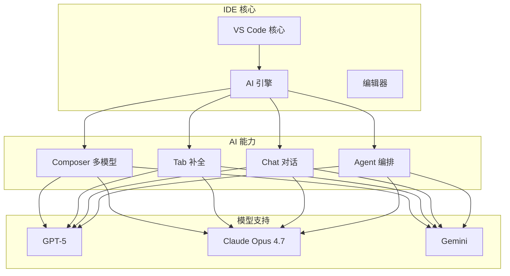
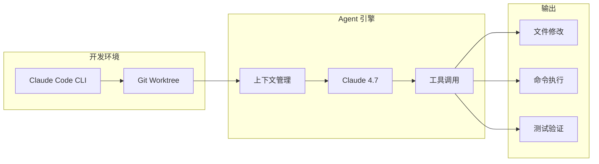
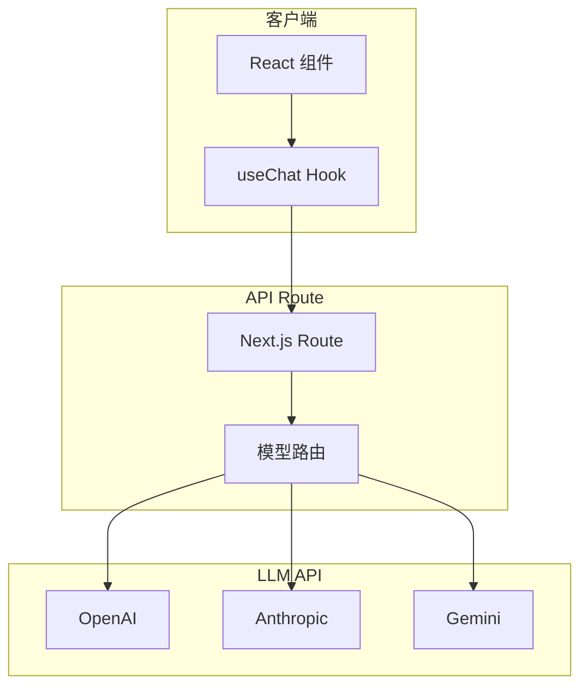
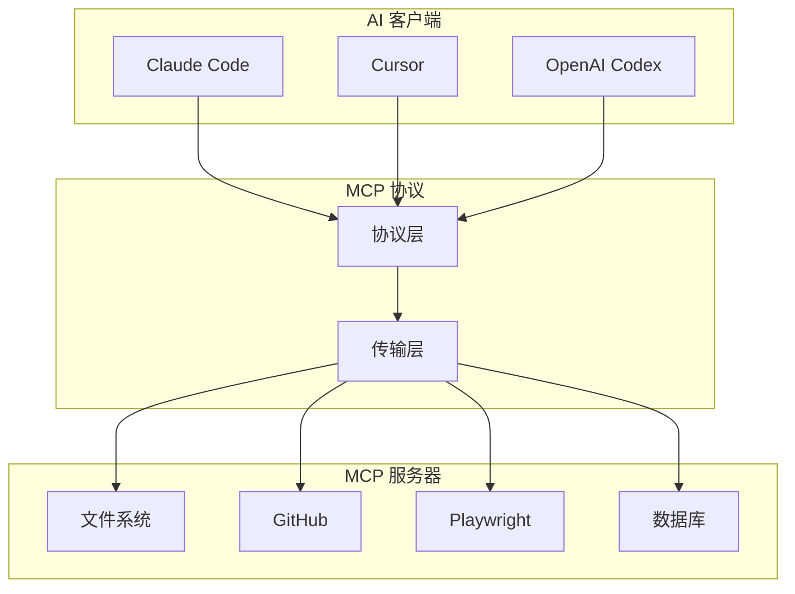

# AI 开发工具与协议

> 本文是「新兴趋势」系列第 1 篇（共 4 篇）。下一篇：[全栈、后端与响应式框架](fullstack-backend.md)

> 本文档调研 2025-2026 年值得关注的新兴/趋势类开源项目，涵盖 AI 开发工具、React 全栈框架、Node.js 后端框架、响应式框架、构建工具、测试平台、CSS 新特性等领域。

**数据来源**: GitHub Trending, State of JS Survey, npm Registry, 官方文档
**调研时间**: 2026年5月
**项目总数**: 100+ 个（覆盖 NPM 周下载量 Top 100 核心库）

## 1. NPM 周下载量 Top 100 速览 (2026年5月9日-15日)

> 数据来源: [npmjs.com](https://www.npmjs.com) | [npm Registry API](https://api.npmjs.org)

### 1.1 第一梯队: 亿级周下载量

| 排名 | 包名 | 周下载量 | 说明 |
|------|------|---------|------|
| 1 | chalk | 4.39 亿 | 终端字符串样式 |
| 2 | commander | 4.14 亿 | CLI 参数解析 |
| 3 | @babel/core | 1.41 亿 | JavaScript 编译器 |
| 4 | dotenv | 1.36 亿 | 环境变量管理 |
| 5 | yargs | 1.60 亿 | CLI 参数解析 |
| 6 | react | 1.33 亿 | React 核心库 |
| 7 | @types/react | 1.18 亿 | React TypeScript 类型 |
| 8 | react-dom | 1.25 亿 | React DOM 渲染 |
| 9 | express | ~1.0 亿 | Node.js Web 框架 |
| 10 | lodash | ~1.0 亿 | JavaScript 工具库 |

### 1.2 第二梯队: 千万级周下载量

| 排名 | 包名 | 周下载量 | 说明 |
|------|------|---------|------|
| 11 | @types/react-dom | 9574 万 | React DOM 类型 |
| 12 | @testing-library/dom | 5092 万 | DOM 测试库 |
| 13 | @types/node | ~5000 万 | Node.js 类型 |
| 14 | react-router | 5142 万 | React 路由 |
| 15 | vitest | 4514 万 | Vite 测试框架 |
| 16 | jest | 4458 万 | JavaScript 测试框架 |
| 17 | webpack | 4835 万 | 模块打包器 |
| 18 | inquirer | 4450 万 | 交互式 CLI |
| 19 | zustand | ~4000 万 | 状态管理 |
| 20 | tailwindcss | ~1200 万 | CSS 框架 |
| 21 | @tanstack/react-query | ~2000 万 | 数据获取/缓存 |
| 22 | swr | ~300 万 | 数据获取 Hooks |
| 23 | axios | ~3000 万 | HTTP 客户端 |
| 24 | next | 3596 万 | React 全栈框架 |
| 25 | typescript | ~2000 万 | TypeScript 语言 |

### 1.3 第三梯队: AI/认证/数据库

| 排名 | 包名 | 周下载量 | 说明 |
|------|------|---------|------|
| 26 | openai | 1969 万 | OpenAI API SDK |
| 27 | @anthropic-ai/sdk | 1787 万 | Claude API SDK |
| 28 | jsonwebtoken | 4489 万 | JWT 认证 |
| 29 | ai (Vercel) | 1313 万 | AI 应用 SDK |
| 30 | mongodb | 1138 万 | MongoDB 驱动 |
| 31 | @mui/material | ~1000 万 | MUI 组件库 |
| 32 | prisma | ~500 万 | TypeScript ORM |
| 33 | @supabase/supabase-js | 1570 万 | Supabase SDK |
| 34 | firebase | 756 万 | Google BaaS |
| 35 | bcryptjs | 984 万 | 密码哈希 |

## 2. AI 编码助手

### 2.1 市场格局 (2026)

2026 年 AI 编码助手市场已形成两大阵营：**AI 原生 IDE** 和 **CLI Agent**。

### 2.2 Cursor

**核心创新点**:

Cursor 是基于 VS Code fork 的 AI 原生 IDE，市场领导者：

1. **Cursor 3 (Glass)** (2026年4月发布): 将 Agent 管理控制台提升到核心位置，文件树被提示词输入框取代
2. **Composer 2**: 多文件并行编辑，跨仓库上下文理解
3. **深度生态集成**: 成为第三方 AI 集成的"第一公民"

**技术架构图**:



**竞品对比**:

| 维度 | Cursor | Windsurf | Claude Code | Codex |
|------|--------|----------|------------|-------|
| 产品形态 | AI 原生 IDE | AI 原生 IDE | CLI Agent | CLI Agent |
| 架构 | VS Code fork | VS Code fork | 终端优先 | Web + Desktop |
| 并行能力 | 支持 | 支持 | 支持 | 支持 |
| Agent UI | 基础 (演进中) | 优秀 | 终端模式 | Web 界面 |
| 核心模型 | Composer 2/GPT-5/Opus 4.7 | Gemini 为主 | Anthropic 模型 | GPT-5 系列 |
| 定价 | ~$20/月 | ~$20/月 | API 包含 | API 包含 |
| ARR | $2B+ | 被 Google $2.4B 收购 | $2.5B | - |

**适用场景**:

- 复杂多文件重构
- 跨仓库代码理解
- AI 原生开发环境
- 需要深度 VS Code 生态支持

**快速开始**:

```bash
# 安装 Cursor
# 下载: https://cursor.sh

# 或使用 CLI 快速上手
npx cursor@latest init my-project

# 常用快捷键
# Ctrl+K: 行内编辑
# Ctrl+L: 对话模式
# Ctrl+Shift+L: 多行编辑
```

**Cursor 3 Agent 管理示例**:

```bash
# 在 Cursor 中启动 Agent
# 1. 打开 Agent 面板 (Ctrl+Shift+A)
# 2. 输入任务描述
# 3. Agent 自动分析、编写、验证代码
```

**参考链接**:

- [Cursor 官网](https://cursor.sh)
- [Cursor 3 发布说明](https://cursor.sh/blog/cursor-3)
- [Composer API](https://cursor.sh/context/composer)

---

### 2.3 Claude Code

**核心创新点**:

Claude Code 是 Anthropic 推出的 CLI 工具，强调 Git worktree 支持：

1. **Worktree 隔离**: 每个 AI 修改在独立分支，不污染主代码库
2. **多工具集成**: 内置 Read/Grep/Edit/Bash 工具
3. **安全优先**: 企业级安全，合规性支持
4. **深度 Anthropic 集成**: 原生 Claude API 支持

**技术架构图**:



**适用场景**:

- 严格变更追踪的团队
- 需要多任务并行的场景
- Anthropic API 重度用户
- 企业级安全要求

**快速开始**:

```bash
# 安装 Claude Code
npm install -g @anthropic-ai/claude-code

# 启动会话
claude

# 常用命令
claude --print "解释这段代码" src/utils.ts
claude --tool "编写测试" src/components/
```

**Worktree 工作流**:

```bash
# 创建 worktree 分支
git worktree add -b feature/claude-fix ../fix-branch

# 在新分支中启动 Claude Code
cd ../fix-branch
claude

# 完成后合并回主分支
git checkout main
git merge fix-branch
git worktree remove ../fix-branch
```

**参考链接**:

- [Claude Code 官网](https://claude.ai/code)
- [Claude Code 文档](https://docs.anthropic.com/)
- [Anthropic API](https://docs.anthropic.com/claude/reference)

---

### 2.4 Windsurf (Anti-Gravity)

**核心创新点**:

Windsurf 现已被 Google 收购并更名为 Anti-Gravity，主打多 Agent 管理：

1. **Agent Manager**: 最佳多 Agent 管理界面
2. **Google 深度集成**: Chrome 浏览器控制，Gemini 模型
3. **隔离工作空间**: 多任务隔离执行
4. **慷慨使用配额**: Gemini 模型调用限制宽松

**Agent 管理示例**:

```bash
# 启动多 Agent 任务
windsurf --agents 3

# Agent 1: 修复登录问题
"Fix the login authentication bug in src/auth/"

# Agent 2: 优化性能
"Profile and optimize the API response times"

# Agent 3: 编写文档
"Document the new API endpoints in OpenAPI format"
```

**参考链接**:

- [Anti-Gravity](https://www.antigravity.dev)

## 3. AI 原生应用构建

### 3.1 Vercel v0

**核心创新点**:

v0 从自然语言生成完整的 React/Next.js 应用：

1. **对话式生成**: 描述需求 → 生成代码 → 部署
2. **Vercel 生态集成**: 自动优化、边缘函数、图像处理
3. **单页应用**: 着陆页、Dashboard、原型

**快速开始**:

```bash
# v0 CLI
npx v0@latest init

# Web 界面
# https://v0.dev
```

### 3.2 Bolt.new

**核心创新点**:

Bolt.new 在浏览器中运行完整开发环境：

1. **WebContainer**: 浏览器原生 Node.js 运行时
2. **交互式调试**: 浏览器内调试生成代码
3. **React/Node.js 优化**: 即时运行时反馈

### 3.3 Lovable

**核心创新点**:

Lovable 生成高质量、易于定制的代码：

1. **代码质量优先**: 生成的代码结构清晰
2. **可维护性**: 比模板驱动方案更易定制
3. **团队协作**: 支持团队成员共同编辑

**平台对比**:

| 平台 | 适用场景 | 代码质量 | 部署集成 | 学习曲线 |
|------|----------|----------|----------|----------|
| v0 | 单页应用、Dashboard | 高 | Vercel | 低 |
| Bolt.new | React/Node.js 交互调试 | 中 | StackBlitz | 中 |
| Lovable | 生产级应用 | 高 | Vercel/Netlify | 低 |

## 4. AI SDK 与流式 UI

### 4.1 Vercel AI SDK

**核心创新点**:

Vercel AI SDK (ai) 是流式 React 应用的标准实现：

1. **useChat hook**: 对话界面状态管理
2. **useCompletion hook**: 单次补全
3. **多模型适配**: OpenAI/Anthropic/Google/自定义端点
4. **Edge Runtime 支持**: 边缘函数部署

**技术架构图**:



**完整示例**:

```typescript
// app/api/chat/route.ts (Next.js App Router)
// 第 1 段：依赖导入 —— 区分两层职责
// `ai` 提供的是"运行时胶水"（OpenAIStream 负责把 OpenAI 的原始 SSE 分片重新编码成前端可消费的文本流，
// StreamingTextResponse 负责包成标准 Response 并把 content-type/缓存头设好）；`openai` 才是真正的 SDK 客户端。
// 易错点：这两个包的默认导出形态不同，OpenAIStream/StreamingTextResponse 是具名导出，OpenAI 是默认导出。
import { OpenAIStream, StreamingTextResponse } from 'ai'
import OpenAI from 'openai'

// 第 2 段：客户端单例 —— 在模块作用域初始化
// 放在模块顶层而不是 POST 内部，是因为 Next.js 会复用同一模块实例，
// 这样连接池/配置对象只建一次；若写进 POST，每次请求都会 new 一遍，白白增加开销。
// 注意：new OpenAI() 会自动读取环境变量 OPENAI_API_KEY，缺失时通常到真正发请求才报错，属于"延迟失败"。
const openai = new OpenAI()

// 第 3 段：POST 处理函数入口 —— 解析请求体
// 只解构出 messages，是因为这里的契约是"前端直接透传对话历史"，服务端不信任、也不加工其它字段。
// 边界条件：req.json() 在 body 为空或非法 JSON 时会 reject，当前代码没有 try/catch，
// 会把异常抛成 500，生产环境建议显式捕获并返回 400。
export async function POST(req: Request) {
  const { messages } = await req.json()

  // 第 4 段：发起上游补全请求 —— 开启流式
  // stream: true 是整条链路的关键开关：它让上游以 SSE 分片返回增量 token，
  // 而不是等整段文本生成完再一次性返回，首字延迟从"全文耗时"降到"首 token 耗时"。
  // 消息数组用 system 打头、再展开 messages，顺序不可颠倒：
  // 系统提示词必须位于最前，且展开操作是浅拷贝，不会修改调用方传入的数组。
  // 易错点：这里没有做长度/轮数裁剪，messages 过长会直接撞上模型上下文上限并抛错。
  const response = await openai.chat.completions.create({
    model: 'gpt-5-turbo',
    stream: true,
    messages: [
      { role: 'system', content: '你是一个有帮助的助手。' },
      ...messages
    ]
  })

  // 第 5 段：协议适配与返回 —— 把上游流转换为 Web 流响应
  // OpenAIStream 会逐块解析上游 SSE、抽取 delta.content，并把结束/错误事件映射为流的关闭或错误，
  // 相当于在"OpenAI 协议"和"前端消费的纯文本流"之间做了一次翻译，前端拿到的是连续文本而非 JSON 帧。
  // StreamingTextResponse 再把该 ReadableStream 包成 Response 返回给浏览器。
  // 关键点：从 create() 返回那一刻起请求头就已发出，函数体内的后续异常无法再改成 4xx/5xx 状态码。
  const stream = OpenAIStream(response)
  return new StreamingTextResponse(stream)
}
```
```tsx
// components/chat.tsx
'use client'

import { useChat } from 'ai/react'

export function Chat() {
  const { messages, isLoading, input, handleInputChange, handleSubmit } = useChat({
    api: '/api/chat'
  })

  return (
    <div className="flex flex-col h-[600px] border rounded-lg overflow-hidden">
      <div className="flex-1 overflow-y-auto p-4 space-y-4">
        {messages.map(m => (
          <div key={m.id} className={`flex ${m.role === 'user' ? 'justify-end' : 'justify-start'}`}>
            <div className={`max-w-[70%] p-3 rounded-lg ${
              m.role === 'user' ? 'bg-blue-500 text-white' : 'bg-gray-100'
            }`}>
              {m.content}
            </div>
          </div>
        ))}
        {isLoading && <div class="text-gray-500">Thinking...</div>}
      </div>
      <form onSubmit={handleSubmit} className="border-t p-4">
        <input
          value={input}
          onChange={handleInputChange}
          placeholder="输入你的问题..."
          className="w-full p-2 border rounded"
        />
      </form>
    </div>
  )
}
```

**useCompletion 示例**:

```typescript
import { useCompletion } from 'ai/react'

export function TextGenerator() {
  const { completion, isLoading, handleSubmit } = useCompletion({
    api: '/api/complete'
  })

  return (
    <form onSubmit={handleSubmit}>
      <textarea
        value={completion}
        placeholder="生成的内容..."
        className="w-full h-40 p-2 border"
      />
      <button type="submit" disabled={isLoading}>
        {isLoading ? '生成中...' : '生成'}
      </button>
    </form>
  )
}
```

**参考链接**:

- [Vercel AI SDK](https://sdk.vercel.ai)
- [GitHub](https://github.com/vercel/ai)

---

### 4.2 Anthropic SDK

**核心创新点**:

Anthropic SDK 提供 Claude 原生支持：

1. **Tool Use**: 函数调用能力
2. **流式响应**: 增量内容处理
3. **多消息管理**: 对话历史维护

```typescript
import { Anthropic } from '@anthropic-ai/sdk'

// 第 1 段：初始化 SDK 客户端
// Anthropic 构造函数会自动读取环境变量 ANTHROPIC_API_KEY，因此这里刻意不硬编码密钥，
// 避免把凭据写进源码/版本库；若在受限环境可用 new Anthropic({ apiKey }) 显式传入。
const client = new Anthropic()

// 第 2 段：发起一次流式（stream）对话请求
// 用 .stream() 而不是 .create()，意味着服务端会以 SSE 分块推送增量内容，适合边生成边渲染的 UI；
// 代价是返回的是事件流对象而非完整结果，调用方需要遍历事件（如 finalMessage() 或 for await）
// 才算真正消费完成，否则可能拿不到结果也丢不掉连接。
const response = await client.messages.stream({
  // 模型 id：注意这是会随版本演进的标识，生产环境应集中配置而非散落在调用点。
  model: 'claude-opus-4-7',
  // 单次回复的 token 上限：限制成本与延迟，超出会被截断（stop_reason = 'max_tokens'）。
  max_tokens: 1024,
  // 对话历史按时间顺序给出，role 为 user 时 content 既可以是字符串也可以是内容块数组。
  // 这里只有一条 user 消息，等同于一次无状态的单轮提问（多轮需自行把 assistant 回复追加进来）。
  messages: [
    { role: 'user', content: '解释 React 的 useEffect hook' }
  ],
  // 第 3 段：声明可用的工具（tool use）
  // tools 只是把"能力与参数契约"告诉模型，模型决定调用时返回的是 tool_use 块而非直接答案；
  // 真正的函数执行、结果回传由调用方负责，这是典型的"模型规划 + 应用执行"分工。
  tools: [
    {
      // 工具名会出现在模型的 tool_use 输出里，是后续分发到本地实现的关键字，需全局唯一。
      name: 'search_docs',
      // description 是模型判断"何时该用这个工具"的主要依据，写得越具体越能减少误调用。
      description: '搜索文档',
      // input_schema 是 JSON Schema，用于校验/约束模型生成的参数结构；
      // 这里只声明了 query，且未指定 required，意味着模型理论上可以省略该字段，
      // 实际解析时应对缺字段做兜底，否则下游 search_docs(query) 会拿到 undefined。
      input_schema: {
        type: 'object',
        properties: {
          query: { type: 'string' }
        }
      }
    }
  ]
})
```

## 5. MCP 协议与 Agent 框架

### 5.1 Model Context Protocol (MCP)

**核心创新点**:

MCP 是连接 AI 模型与外部工具的标准协议：

1. **统一接口**: 文件系统、Shell、搜索、API 调用
2. **工具生态**: 任何 MCP 兼容客户端可使用工具
3. **安全隔离**: 协议层安全控制

**技术架构图**:



**MCP 服务器配置**:

```json
// .cursor/mcp.json
{
  "mcpServers": {
    "filesystem": {
      "command": "npx",
      "args": ["-y", "@modelcontextprotocol/server-filesystem", "/path/to/project"],
      "env": {}
    },
    "github": {
      "command": "npx",
      "args": ["-y", "@modelcontextprotocol/server-github"],
      "env": { "GITHUB_TOKEN": "${GITHUB_TOKEN}" }
    },
    "playwright": {
      "command": "npx",
      "args": ["-y", "@modelcontextprotocol/server-playwright"],
      "env": {}
    }
  }
}
```

**常用 MCP 服务器**:

| 服务器 | 功能 | 安装量 |
|--------|------|--------|
| @modelcontextprotocol/server-filesystem | 文件读写 | 高 |
| @modelcontextprotocol/server-github | GitHub API | 高 |
| @modelcontextprotocol/server-playwright | 浏览器自动化 | 高 |
| @modelcontextprotocol/server-brave-search | 搜索 | 中 |
| @modelcontextprotocol/server-slack | Slack 消息 | 中 |

**参考链接**:

- [MCP 官方文档](https://modelcontextprotocol.io)
- [MCP GitHub](https://github.com/modelcontextprotocol)

---

### 5.2 Playwright for AI Agents

**核心创新点**:

Playwright 已演变为 AI Agent 平台：

1. **浏览器控制**: AI Agent 可导航页面、交互元素
2. **多浏览器**: Chromium/Firefox/WebKit 统一 API
3. **Playwright CLI**: AI 驱动的浏览器自动化

**AI Agent 集成示例**:

```typescript
import { chromium } from 'playwright'

async function aiBrowserAgent() {
  const browser = await chromium.launch()
  const context = await browser.newContext()
  const page = await context.newPage()

  // AI Agent 任务：测试登录流程
  const tasks = [
    { action: 'goto', url: 'https://example.com/login' },
    { action: 'fill', selector: '#email', value: 'test@example.com' },
    { action: 'fill', selector: '#password', value: 'password123' },
    { action: 'click', selector: 'button[type="submit"]' },
    { action: 'waitFor', selector: '.dashboard' },
    { action: 'screenshot' }
  ]

  for (const task of tasks) {
    await executeTask(page, task)
  }

  await browser.close()
}

async function executeTask(page, task) {
  switch (task.action) {
    case 'goto':
      await page.goto(task.url)
      break
    case 'fill':
      await page.fill(task.selector, task.value)
      break
    case 'click':
      await page.click(task.selector)
      break
    case 'waitFor':
      await page.waitForSelector(task.selector)
      break
    case 'screenshot':
      await page.screenshot()
      break
  }
}
```

**Playwright MCP 服务器**:

```json
// MCP 配置
{
  "mcpServers": {
    "playwright": {
      "command": "npx",
      "args": ["-y", "@modelcontextprotocol/server-playwright"]
    }
  }
}
```

**参考链接**:

- [Playwright 官网](https://playwright.dev)
- [Playwright GitHub](https://github.com/microsoft/playwright)

## 6. 总结

### 6.1 NPM Top 100 库分类汇总 (2026年5月)

| 分类 | 代表库 | 周下载量 | 趋势 |
|------|-------|---------|------|
| **React 生态** | react, react-dom, react-router | 2.5 亿+ | 稳定增长 |
| **全栈框架** | next, @next/* | 8000 万+ | 高速增长 |
| **状态管理** | zustand, @tanstack/react-query | 6000 万+ | 新秀崛起 |
| **构建工具** | vite, webpack, esbuild | 1.5 亿+ | Vite 主导 |
| **TypeScript** | typescript, @types/* | 2 亿+ | 必备工具 |
| **测试框架** | vitest, jest, @testing-library/* | 1.5 亿+ | Vitest 崛起 |
| **Node.js 后端** | express, koa, fastify, nestjs | 1.5 亿+ | 多元化 |
| **ORM/数据库** | prisma, mongoose, mysql2 | 5000 万+ | Prisma 领跑 |
| **HTTP 客户端** | axios, undici, node-fetch | 5000 万+ | Axios 霸主 |
| **AI/LLM SDK** | openai, @anthropic-ai/sdk, ai | 5000 万+ | 爆发增长 |
| **BaaS** | @supabase/supabase-js, firebase | 2300 万+ | Firebase 仍强 |
| **认证** | jsonwebtoken, passport, bcrypt | 6000 万+ | 必备组件 |
| **工具库** | lodash, date-fns, uuid | 1.5 亿+ | 稳定 |
| **CLI 工具** | chalk, commander, ora | 1 亿+ | 必备 |
| **CSS 框架** | tailwindcss | 1200 万+ | 增长迅猛 |
| **UI 组件** | @mui/material, antd | 1500 万+ | 企业必备 |

### 6.2 技术趋势速览 (2026)

| 领域 | 趋势 | 代表项目 |
|------|------|---------|
| AI 编码 | Agent 编排成为主流 | Cursor 3, Claude Code, Windsurf |
| AI 应用构建 | 自然语言生成 | v0, Bolt.new, Lovable |
| AI SDK | 流式 UI 标准化 | Vercel AI SDK |
| MCP 协议 | AI 工具标准化 | MCP (Anthropic) |
| 响应式 | Signal/细粒度响应式 | Solid.js, Qwik, Svelte 5 |
| 构建工具 | Rust 时代 | Turbopack, Rolldown, Bun |
| CSS | 组件级响应式 | Container Queries, :has(), @layer |
| 格式化 | All-in-one | Biome |
| 微前端 | Module Federation 2.0 | MF, Qiankun |
| Monorepo | pnpm + Turborepo | pnpm, Turborepo |
| 测试 | Playwright 主导 | Playwright, Testing Library |
| 类型系统 | Schema-first | Zod, Effect |
| AI SDK | OpenAI/Anthropic 爆发 | openai (1970万/周) |
| BaaS | Supabase 快速增长 | Supabase (1570万/周) |

### 6.3 选型建议

| 场景 | 推荐 |
|------|------|
| AI 原生开发 | Cursor + Claude Code |
| 性能优先 UI | Solid.js / Qwik |
| 内容型网站 | Astro / SvelteKit |
| 边缘 API | Hono + Cloudflare Workers |
| 企业应用 | Next.js + shadcn/ui |
| 大型 Monorepo | pnpm + Turborepo + Nx |
| E2E 测试 | Playwright |
| 代码质量 | Biome |
| AI 应用开发 | Vercel AI SDK + OpenAI/Anthropic |
| BaaS 快速开发 | Supabase / Firebase |

### 6.4 State of JS 2025 关键数据

- **TypeScript 采用率**: 40% (2024: 34%)
- **纯 JavaScript 使用率**: 6%
- **最受欢迎的框架**: Svelte (连续多年)
- **最快增长的测试库**: Playwright
- **AI SDK 下载增长**: openai SDK 同比增长 300%+

---

*文档生成时间: 2026年5月*
*数据来源: npm Registry (api.npmjs.org), GitHub Trending, State of JS Survey, 官方文档, 行业分析*
*调研完成度: 6 个并行 agent 覆盖 React 生态、前端工具链、Node.js 后端、状态管理/UI、打包工具、BaaS/AI*

## 深入阅读与参考

!!! tip "怎么用这些资料"
    先读「官方文档与规范」建立准确的概念，再读「源码与示例」核对细节，最后用「教程、书籍与视频」换一种讲法加深理解。每条都写明了读哪一节、带着什么问题读。

### 官方文档与规范

| 资源 | 为什么读 | 怎么读 |
|---|---|---|
| [MCP 规范（最新版本）](https://modelcontextprotocol.io/specification/latest) | MCP 唯一权威规范，版本变更与实现要求都以此为准。 | 读生命周期与工具章节，对照 SDK 确认协议版本，再回看自己服务器的握手流程。 |
| [Vercel AI SDK 文档](https://ai-sdk.dev/docs) | 流式 UI 与工具调用的官方指南，示例可直接跑通。 | 先跑 chat 示例，再加一个工具调用与流式输出，观察 UI 增量渲染过程。 |
| [Claude 子 Agent 文档](https://docs.claude.com/en/docs/claude-code/sub-agents) | 子 Agent 与工具权限的官方说明，编码助手落地必读。 | 照文档创建只读审查 subagent，限制工具后跑一次，看权限如何生效。 |

### 源码与示例

| 资源 | 为什么读 | 怎么读 |
|---|---|---|
| [MCP TypeScript SDK](https://github.com/modelcontextprotocol/typescript-sdk) | TypeScript 端 MCP 服务器最小可用示例，代码短易读。 | 按 README 搭 stdio 服务器，接入本地客户端验证工具列表与调用返回。 |
| [MCP Python SDK](https://github.com/modelcontextprotocol/python-sdk) | Python 侧 MCP 实现，FastMCP 几行即可暴露工具。 | 照示例写一个数据库查询工具，再看装饰器如何生成 JSON Schema。 |
| [MCP Inspector](https://github.com/modelcontextprotocol/inspector) | 调试 MCP 服务器的可视化利器，能查看原始消息。 | 连上自建服务器逐个调用工具，对照请求响应定位 schema 错误。 |
| [Claude Agent SDK（TypeScript）](https://github.com/anthropics/claude-agent-sdk-typescript) | 编码 Agent 的完整 TS 实现，能看清工具调用循环。 | 运行 README 示例后，把自定义函数注册为工具，观察调用日志顺序。 |
| [OpenAI Agents SDK（Python）](https://openai.github.io/openai-agents-python/) | 轻量 Agent 框架源码，handoff 与工具编排清晰。 | 复现 Quickstart，加一个 handoff 让两 Agent 协作，再读主循环实现。 |
| [pi 编码 Agent 工具集](https://github.com/earendil-works/pi) | 真实编码 Agent 的工具集与主循环实现，含统一 LLM API。 | 重点读 agent loop 与工具定义，对照自己代码补上缺失的终止条件。 |
| [Google ADK（Python）仓库](https://github.com/google/adk-python) | ADK 官方示例仓库，做框架抽象横向对比的好材料。 | 读 samples 下的多工具 Agent，比较其抽象与你熟悉框架的差异。 |

### 教程、书籍与视频

| 资源 | 为什么读 | 怎么读 |
|---|---|---|
| [Anthropic 论 SWE-bench 的 Agent 设计](https://www.anthropic.com/engineering/swe-bench-sonnet) | 一线团队讲编码 Agent 的最小工具集设计，经验密度高。 | 读工具集精简部分，回头删掉自己 Agent 里冗余的工具再复测。 |
| [A practical guide to building agents（OpenAI）](https://cdn.openai.com/business-guides-and-resources/a-practical-guide-to-building-agents.pdf) | OpenAI 的 Agent 构建指南，模型/工具/指令三要素实用。 | 读完用三要素逐条检查自己的 Agent 设计，列出待补的指令与护栏。 |
| [LLM Powered Autonomous Agents（Lilian Weng）](https://lilianweng.github.io/posts/2023-06-23-agent/) | 规划、记忆、工具三大件的经典综述，概念地图清晰。 | 精读三部分各写一段理解，标注自己项目对应实现或缺失点。 |
| [Hugging Face MCP 课程](https://huggingface.co/learn/mcp-course/unit0/introduction) | 体系化 MCP 课程，从概念到手写服务器一条线。 | 完成第一单元后按作业搭一个 MCP 服务器，再与 SDK 示例对照。 |

## 应用与行业实践

### 应用场景地图

| 场景 | 用到本页哪个知识点 | 典型技术选型 | 注意事项 |
|---|---|---|---|
| 后台管理的万行表格，用一句话改筛选条件并导出 | AI 原生应用构建、AI 编码助手 | 虚拟滚动 + 后端把自然语言转成结构化条件 | 只把用户输入送后端；模型失败要退回本地筛选 |
| 低端安卓的首屏加载 | AI SDK 与流式 UI | 流式 SSR、骨架屏、逐段填充 | 首屏不等模型返回；看 INP 不只看总时长 |
| 多人协作白板里的 Agent 落笔 | MCP 协议与 Agent 框架 | 工具白名单 + 写操作人工确认 + 操作 ID | 写操作要幂等；并发落笔靠版本号或操作 ID 排序 |
| 客服工单自动分类与回复草稿 | AI 原生应用构建、AI 编码助手 | 结构化输出 + 人工审核队列 | 低置信度走人工；分类结果要留可追溯字段 |
| 仓库里自动修 lint 报错 | AI 编码助手 | 编码助手 + 测试与类型检查作为闸门 | 每笔改动单独分支；不许直接改主干 |
| 商品详情页文案批量生成 | AI SDK 与流式 UI | 批量任务 + 流式预览 + 占位符模板 | 生成内容过敏感词与合规校验再入库 |
| 内部知识库问答 | AI 原生应用构建 | 检索片段回填 + 引用展示 | 必须回传引用来源；无引用时拒答 |
| CI 失败日志归因 | MCP 协议与 Agent 框架 | Agent 读日志与仓库文件，输出归因草稿 | 只读工具优先；写出建议前先给人看 |

### 三个场景拆解

#### 场景 1：后台管理的万行表格，用一句话改筛选条件

**业务背景**：运营改一次筛选要点五六次下拉框，改完还要等整表重渲染，手一抖就得重来。规模用可复现方法描述：本地起服务放上万行模拟数据，用 DevTools Performance 面板录一次「改筛选 + 滚到底」，看脚本耗时和掉帧。

**怎么用本页知识解决**：思路是把自然语言转成结构化筛选条件交给后端，表格本身只做虚拟滚动，模型慢也不阻塞交互。

```ts
// 把一句话转成筛选条件，前端只发请求和渲染
async function toFilter(text: string, signal: AbortSignal) {
  const res = await fetch('/api/filter', {        // 走自己的后端，密钥不落浏览器
    method: 'POST',
    headers: { 'Content-Type': 'application/json' },
    body: JSON.stringify({ text }),               // 只传用户输入，不传整张表
    signal,                                       // 用户改词时中断上一次请求
  });
  if (!res.ok) return null;                       // 失败就让调用方退回本地筛选
  return res.json() as Promise<{ field: string; op: string; value: string }>;
}
```

- 筛选条件限定成三个字段，后端返回的 op 只允许等于、包含、区间三种，避免把任意表达式交给数据库。
- `AbortController` 是关键：运营连打三次字，只有最后一次请求的结果会被采用。
- 表格侧只接收结构化的 `{field, op, value}`，虚拟滚动的渲染逻辑不受模型影响。
- 接口失败返回 `null`，前端自动用上一次的下拉筛选结果，页面不出现空表。
- 模型输出先过一遍字段白名单，字段名不在白名单里直接判定为无效。

**怎么度量收益**：看「改条件到结果可见」的 p95，用 `performance.mark` 与 `performance.measure` 打点，再在 DevTools Performance 面板核对主线程任务。滚动掉帧看 DevTools 的 Frames 轨道和 Long Animation Frames。采纳率用前端埋点统计点击「应用筛选」的比例。

**什么时候不该用**：

- 筛选维度固定且只有两三个枚举值，下拉框点两下就完成，加输入框会让路径变长。
- 面向合规审计的报表，条件改写带来的误差无法接受。
- 内网环境不能调外部模型，本地又没有可用模型时。

#### 场景 2：低端安卓的首屏加载，先出骨架再补内容

**业务背景**：首屏要等接口和模型都返回才渲染，用户盯着白屏，退出一半。规模用相对说法描述：在 DevTools 里把 CPU 降速 4 倍、网络设成 Slow 4G，同一页面重复三次取中位数。

**怎么用本页知识解决**：思路是先渲染骨架和静态部分，模型结果用流式读取逐段填入，长列表用 `content-visibility: auto` 让视口外的行不参与布局。

```ts
// 先画骨架，再把流式片段逐段填进列表
async function fill(box: HTMLElement, url: string, signal: AbortSignal) {
  const res = await fetch(url, { signal });            // 可中断的模型接口
  const reader = res.body!.getReader();                // 逐块读，不等整段返回
  const decoder = new TextDecoder();
  let buf = '';
  for (;;) {
    const { value, done } = await reader.read();
    if (done) break;
    buf += decoder.decode(value, { stream: true });     // stream 模式处理跨块断字
    const parts = buf.split('\n\n');                    // 按 SSE 事件边界切
    buf = parts.pop() ?? '';                            // 最后一段可能不完整，留到下一轮
    for (const p of parts) appendToDOM(box, p);         // 每段一次 DOM 写入
  }
  box.dataset.loaded = '1';                            // 供埋点判断首段已渲染
}
```

- 必须保留 `buf`：一次 `read()` 可能把一个大括号切成两半，丢掉残片会解析失败。
- `decode(..., { stream: true })` 让解码器自己处理跨块的多字节字符。
- 每段一次 DOM 写入而不是每字节一次，减少布局次数。
- 骨架先出，`box.dataset.loaded` 用于埋点区分「骨架时间」和「首段内容时间」。
- 列表容器加 `content-visibility: auto`，视口外的行跳过布局与绘制。

**怎么度量收益**：Lighthouse 跑一遍移动端预设，记录 LCP 与 TBT；线上用 `web-vitals` 库上报 LCP、INP、CLS。这两个工具都给出 p75 分位数，按 p75 而不是平均值判断。再配合 DevTools Performance 录制降速后的首屏，确认骨架到首段内容的间隔。

**什么时候不该用**：

- 内容必须整体一致才能展示，比如带合计的金额表，分段填入会让用户读到不完整的金额。
- 输出本来就是一行固定状态提示，流式只增加代码分支。
- 需要搜索引擎抓取的静态内容页，交给服务端一次渲染完成即可。

#### 场景 3：多人协作白板里的 Agent 落笔

**业务背景**：白板上多人同时画，Agent 要读看板再落笔，一旦误删别人的图形很难追溯。规模用相对说法描述：本地开五个浏览器窗口连同一房间，观察冲突次数和是否出现无来源的写操作。

**怎么用本页知识解决**：思路是把白板能力注册成工具，读工具默认放行，写工具必须人工确认，每次写带唯一操作 ID 便于回滚。

```ts
// 白板 Agent 的工具闸门：读放行、写确认、未知拒绝
type Call = { id: string; name: string; args: Record<string, unknown> };
const READ = new Set(['board.list_shapes', 'board.get_selection']);

async function dispatch(call: Call, ask: (c: Call) => Promise<boolean>) {
  if (!call.name.startsWith('board.')) return deny(call, 'unknown_tool'); // 非白板工具拒绝
  if (READ.has(call.name)) return run(call);                              // 只读工具直接执行
  const ok = await ask(call);                                             // 写工具弹窗等确认
  if (!ok) return deny(call, 'user_rejected');                            // 拒绝也回给模型
  return run({ ...call, id: call.id });                                   // 带操作 ID 便于回滚
}
```

- 前缀判断加白名单两层，避免模型拼出一个没注册过的工具名被执行。
- 读工具直接跑，写工具走 `ask` 回调，确认弹窗里展示参数原文而不是摘要。
- 拒绝也要返回结构化的原因，模型才知道下一步该问用户还是换方案。
- 操作 ID 写进白板的操作日志，回滚时按 ID 撤销，不按时间戳猜。
- 并发落笔用操作 ID 排序合并，避免两个人的撤销互相覆盖。

**怎么度量收益**：误操作次数按 undo 日志统计，分母是 Agent 写操作总数。确认弹窗的通过率由前端埋点统计。从用户发出指令到图形落笔的 p50 与 p95 用 `performance.mark` 打点。SSE 断流率看后端日志里的连接关闭原因字段。

**什么时候不该用**：

- 纯只读问答，比如「这块看板上谁在画」，加确认弹窗只增加点击。
- 延迟敏感的实时手势，工具调用往返会打断手感。
- 团队还没有操作日志和回滚能力时，不要让 Agent 拿到删除类工具。

### 行业先进实践

流式 SSR 搭配 Suspense 边界（出处：React 官方文档的 Suspense 与流式服务端渲染章节）。做法是把页面拆成可独立等待的边界，静态部分先发送，慢的部分就绪后补发。这样白屏时间取决于静态部分，而不是最慢的接口。借鉴方式：把首屏里依赖模型的区块单独包一层边界，其余区块先发。

聊天组件与数据流协议（出处：Vercel AI SDK 官方文档）。官方文档给出 `useChat` 这类钩子，把消息状态、流式增量、错误处理收敛到一个抽象里。手写解析容易漏掉跨块断字和中断清理。借鉴方式：先照官方示例跑通一条最小链路，再决定哪些逻辑要自己接管。

工具调用前取得用户同意（出处：Model Context Protocol 官方文档的安全注意事项）。规范把工具、资源、提示分成三类，工具会改变外部状态，文档要求宿主在调用前做用户确认与权限检查。借鉴方式：把「读放行、写确认、未知拒绝」写进调度函数的第几行，而不是散在业务代码里。

用 Core Web Vitals 阈值当验收线（出处：web.dev 的 Core Web Vitals 文档）。文档给出公开阈值：LCP 2.5 秒、INP 200 毫秒、CLS 0.1，按 p75 判定。有了统一阈值，前端改动是否回退就有可对照的判据。借鉴方式：把这三个指标按 p75 接进发布检查。

提示缓存复用系统提示前缀（出处：需核对官方文档：核对 Anthropic 与 OpenAI 各自缓存的最小长度、写入与读取的计费方式、缓存有效期）。思路是把不变化的系统提示和工具定义放在前缀，把变化的用户输入放在后面，命中缓存后重复前缀的计费与延迟都会下降。借鉴方式：先把提示拆成「固定前缀 + 变化后缀」两段，再按官方文档核对哪些模型支持。

### 从学到用：落地路线

第 1 步，在内部工具里挑一个只读问答场景试点，只接一个只读工具。验收标准：试点用户能在页面上问到带引用来源的答案，日志里能查到每一次工具调用的入参与结果。

第 2 步，给试点加上计时与错误埋点，跑够两周形成基线。验收标准：首 token 时间、错误率、人工修改率三项有基线数值，且期间没有出现未授权的写操作。

第 3 步，把工具注册、确认弹窗、超时与重试抽成公共模块，其余业务只填配置接入。验收标准：新接入方不需要改公共模块代码，接入文档里有一段能跑通的样例。

第 4 步，把「未授权工具调用为零」和关键页面的 LCP、INP 阈值写进 CI 门禁。验收标准：CI 日志里能看到这两项检查，任一失败会阻断合并。

### 动手作业

**目标**：给一个本地表格页面加上「一句话筛选 + 流式结果」，并把一次写操作交给带确认的工具调用。

**步骤**：

1. 起一个本地页面，放 5000 行模拟数据，先只做下拉筛选。
2. 加虚拟滚动或 `content-visibility`，用 DevTools 录制一次滚动，把耗时写进 README 当基线。
3. 写后端接口 `/api/filter`，把一句话转成 `{field, op, value}`，返回结构化 JSON。
4. 前端接上接口，加 `AbortController`，用户改词时中断上一次请求。
5. 加一个只读工具 `board.list_shapes`，用本地函数模拟，回答里必须带来源。
6. 再加一个写工具 `board.add_sticky`，落笔前弹确认，写操作带唯一 ID。
7. 打点首 token 时间与筛选结果可见时间，连同测量步骤写进 README 的基线表。

**验收标准**：

- CPU 降速 4 倍、网络 Slow 4G 下，页面先出骨架再出内容，骨架到首段内容的间隔在 Performance 面板里可读到。
- 连续改三次输入，网络面板里只有最后一次请求返回 200，前两次状态为 canceled。
- 工具名不在白名单里时被拒绝，日志里有拒绝原因字段。
- 写工具每次落笔前有确认弹窗，点取消后白板状态与操作前一致。
- README 里有基线表，包含测量工具、测量步骤和至少两次测量的数值。

