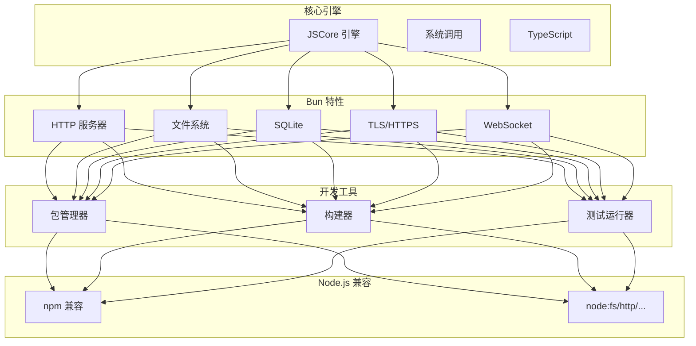
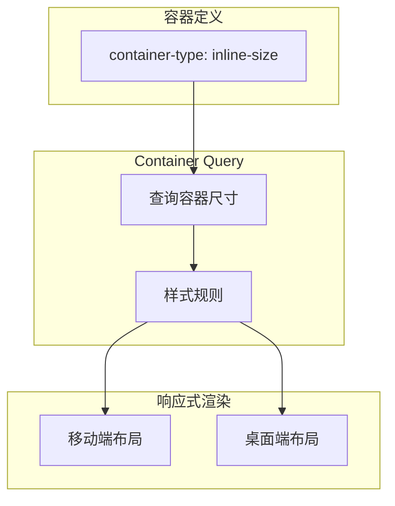
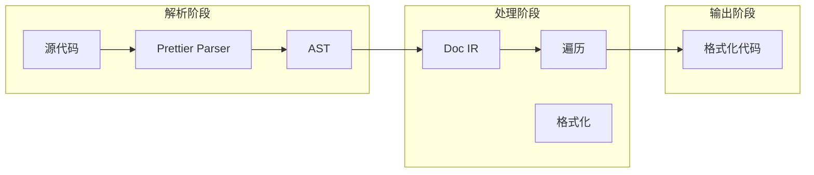
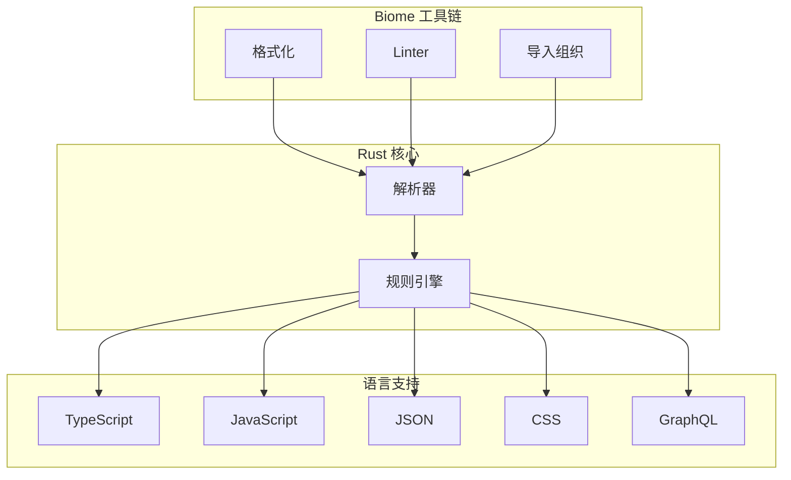
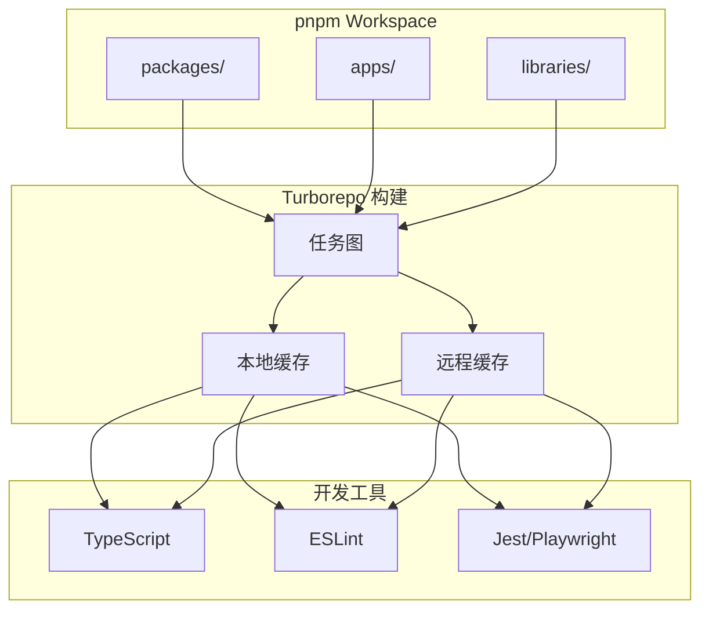
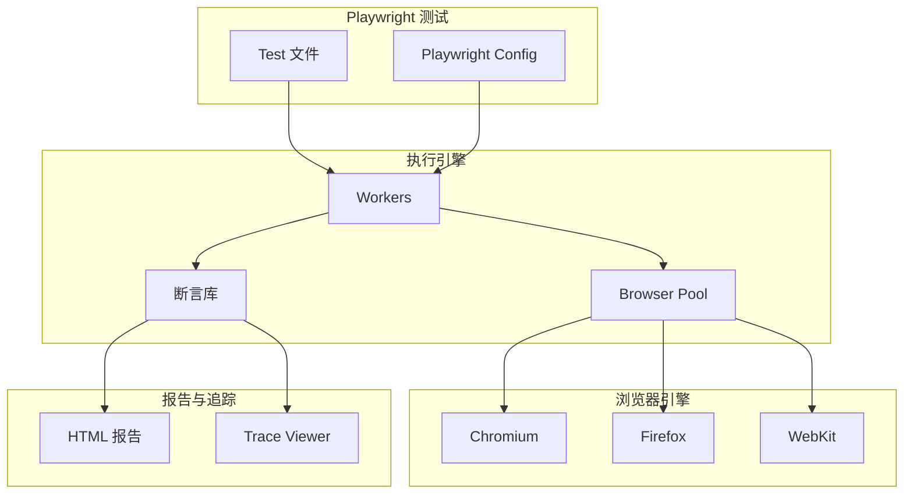
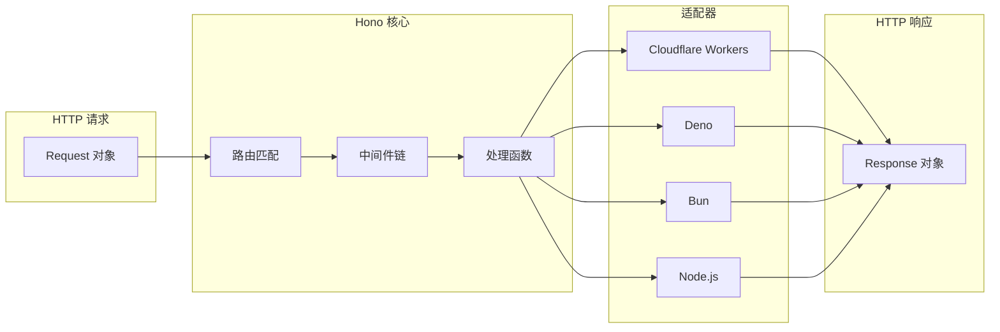

# 构建、样式与工具链

> 本文是「新兴趋势」系列第 3 篇（共 4 篇）。上一篇：[全栈、后端与响应式框架](fullstack-backend.md)　下一篇：[前端库与服务生态](frontend-libraries.md)

## 1. 构建工具革新

### 1.1 Bun

**核心创新点**:

Bun 是 all-in-one JavaScript 工具链：

1. **统一工具链**: 运行时 + 包管理器 + 构建工具 + 测试运行器
2. **极致性能**: HTTP 服务、包安装、TypeScript 执行全面超越
3. **Node.js 兼容**: 大量 npm 包可直接使用

**技术架构图**:



**性能对比**:

| 操作 | Bun | Node.js | 提升 |
|------|-----|---------|------|
| HTTP Requests/sec | 90,000+ | 45,000+ | 2x |
| npm install | 15s | 45s | 3x |
| TypeScript 执行 | 120ms | 800ms | 6.7x |
| SQLite 查询 | 50,000/s | 15,000/s | 3.3x |

**快速开始**:

```bash
# 安装
curl -fsSL https://bun.sh/install | bash

# 创建项目
bun init my-app
cd my-app

# 运行
bun run index.ts

# 启动开发服务器
bun --bun vite

# 测试
bun test
```

**内置功能示例**:

```typescript
// HTTP 服务器
Bun.serve({
  port: 3000,
  async fetch(req) {
    return new Response('Hello from Bun!')
  }
})

// SQLite
import { Database } from 'bun:sqlite'
const db = new Database(':memory:')
db.run('CREATE TABLE users (id INTEGER PRIMARY KEY, name TEXT)')

// WebSocket
const server = Bun.serve({
  port: 8080,
  fetch(req, server) {
    if (req.headers.get('upgrade') === 'websocket') {
      const success = server.upgrade(req)
      if (success) return undefined
    }
    return new Response('WebSocket server')
  },
  websocket: {
    open(ws) { ws.send('Welcome!') },
    message(ws, msg) { ws.send(`Echo: ${msg}`) }
  }
})
```

**参考链接**:

- [Bun 官网](https://bun.sh)
- [Bun GitHub](https://github.com/oven-sh/bun)

---

### 1.2 Vite 6

**核心创新点**:

Vite 6 集成 Rolldown 实现构建性能飞跃：

1. **Rolldown**: Rust 编写的 Rollup 替代品
2. **改进 SSR**: 更强的服务端渲染支持
3. **更好的 Monorepo**: 增强的多包支持
4. **生态系统**: 默认选择 Vue/Solid/Svelte 项目

**快速开始**:

```bash
npm create vite@latest my-app -- --template react-ts
npm install
npm run dev
```

**Vite 配置示例**:

```typescript
// vite.config.ts
// 第 1 段：引入依赖并注册框架插件（决定 Vite 能编译哪些模板/JSX）
// defineConfig 只是一个恒等函数，作用是为配置对象提供 TS 类型推导与编辑器补全，运行时不产生任何副作用。
// 同时注册 vue() 和 react() 是少见组合：@vitejs/plugin-vue 负责 .vue 单文件组件（编译 <template> 为渲染函数），
// @vitejs/plugin-react 负责 .jsx/.tsx（走 Babel/自动 JSX runtime 或 React Fast Refresh）。
// 易错点：两个插件都会接管 .jsx/.tsx 的转换，若同一文件被两边同时匹配，会出现 HMR 与转换结果互相覆盖的问题。
import { defineConfig } from 'vite'
import vue from '@vitejs/plugin-vue'
import react from '@vitejs/plugin-react'

export default defineConfig({
  plugins: [vue(), react()],
  // 第 2 段：路径别名（把深层相对路径 ../.. 收敛成稳定的绝对前缀）
  // 这里 '@' 指向 '/src'，即以项目 root 为基准的绝对 URL 路径。Vite 在 dev（基于原生 ESM 的 URL 解析）
  // 和 build（Rollup 解析管线）里都能识别这种以 '/' 开头的 root 相对路径，因此通常无需 path.resolve。
  // 易错点：'@' 只对 Vite 的解析生效，tsconfig 的 paths / IDE 跳转 / ESLint 的 import 解析需要另配，
  // 否则会出现"能跑但编辑器报红"；另外别名键做的是前缀匹配，'@' 也会命中 '@/x' 这类子路径。
  resolve: {
    alias: { '@': '/src' }
  },
  // 第 3 段：产物构建策略（决定语法降级程度与压缩器）
  // target: 'esnext' 表示不向低版本浏览器降级，保留可选链、顶层 await、私有字段等最新语法，
  // 换来更小的产物与更少的转译开销，代价是放弃旧浏览器兼容性（若需兼容应改成 'es2015'/'es2020' 或 browserslist）。
  // minify: 'esbuild' 使用 esbuild 做压缩，比 terser 快一到两个数量级但不会做高级死代码推断与部分激进优化；
  // esbuild 其实也是默认值，这里显式写出意在强调"压缩器可替换为 'terser' 以换取更小体积"。
  build: {
    target: 'esnext',
    minify: 'esbuild'
  }
})
```
---

### 1.3 Turbopack

**核心创新点**:

Turbopack 是 Rust 编写的 Webpack 继任者：

1. **极速冷启动**: 比 Webpack 快 700 倍
2. **增量构建**: 只构建变化的模块
3. **Next.js 16 集成**: 默认构建工具

**性能数据**:

| 场景 | Webpack | Turbopack | 提升 |
|------|---------|-----------|------|
| 冷启动 (10k 模块) | 60s | 0.08s | 750x |
| HMR 更新 | 500ms | 50ms | 10x |
| 生产构建 | 120s | 30s | 4x |

**注意**: Turbopack 仍在 alpha 阶段，插件 API 尚未公开。

## 2. CSS 新特性

### 2.1 Container Queries

**核心创新点**:

Container Queries 实现真正的组件级响应式设计：

1. **容器感知**: 组件响应自身容器而非视口
2. **组件复用**: 同一组件在不同容器中自动适配
3. **浏览器支持**: 92%+ 全球覆盖率

**技术架构图**:



**示例**:

```css
/* 定义容器 */
.card-container {
  container-type: inline-size;
  container-name: card;
}

/* 容器查询 */
@container card (min-width: 400px) {
  .card {
    display: flex;
    flex-direction: row;
  }
}

@container card (max-width: 399px) {
  .card {
    display: flex;
    flex-direction: column;
  }
}
```

**实战应用**:

```css
.article-card {
  container-type: inline-size;
}

.article-card h2 {
  font-size: 1rem;
}

.article-card p {
  font-size: 0.875rem;
  -webkit-line-clamp: 3;
  overflow: hidden;
}

@container (min-width: 500px) {
  .article-card {
    display: grid;
    grid-template-columns: 200px 1fr;
  }

  .article-card p {
    -webkit-line-clamp: unset;
  }
}
```

---

### 2.2 Cascade Layers (@layer)

**核心创新点**:

@layer 实现明确的层叠顺序控制：

1. **优先级控制**: 显式声明 CSS 层顺序
2. **第三方隔离**: 包含外部样式影响
3. **特异性管理**: 更可预测的样式覆盖

**示例**:

```css
/* 声明层顺序 */
@layer reset, base, theme, components, utilities;

/* 各层定义 */
@layer reset {
  * { margin: 0; padding: 0; box-sizing: border-box; }
}

@layer base {
  body {
    font-family: system-ui;
    line-height: 1.5;
  }
}

@layer components {
  .button {
    padding: 0.75rem 1.5rem;
    border-radius: 0.375rem;
    font-weight: 500;
  }

  .card {
    background: white;
    border-radius: 0.5rem;
    box-shadow: 0 1px 3px rgba(0,0,0,0.1);
  }
}

@layer utilities {
  .hidden { display: none; }
  .mt-4 { margin-top: 1rem; }
}
```

**第三方样式隔离**:

```css
/* 导入外部库到特定层 */
@import url('normalize.css') layer(base);
@import url('some-library.css') layer(vendor);
```

---

### 2.3 :has() 选择器

**核心创新点**:

:has() 是第一个实用的"父选择器"：

1. **父选择**: 根据子元素选择父元素
2. **状态选择**: 表单验证等场景
3. **条件样式**: 无需 JavaScript 实现条件渲染

**浏览器支持**: Chrome 105+, Firefox 121+, Safari 15.4+ (95%+ 覆盖率)

**示例**:

```css
/* 表单验证样式 */
form:has(input:invalid) {
  border-color: red;
}

form:has(input:focus) {
  border-color: blue;
}

/* 父选择 */
article:has(h2) {
  margin-bottom: 2rem;
}

/* 交互卡片 */
.card:has(.expanded) {
  height: auto;
}

.card:not(:has(.expanded)) {
  height: 300px;
  overflow: hidden;
}

/* 响应式网格 */
.container:has(.sidebar.visible) {
  grid-template-columns: 250px 1fr;
}

/* 菜单状态 */
nav:has(.active) .logo {
  font-weight: bold;
}
```

**JavaScript 替代方案**:

```typescript
// 传统 JavaScript
document.querySelectorAll('.card').forEach(card => {
  if (card.querySelector('.expanded')) {
    card.classList.add('is-expanded')
  }
})

// :has() CSS
.card:has(.expanded) {
  /* 自动应用样式 */
}
```

---

### 2.4 CSS 特性浏览器支持 (2026)

| 特性 | Chrome | Firefox | Safari | 全球支持 |
|------|--------|---------|--------|----------|
| Container Queries | 80+ | 110+ | 16+ | 92%+ |
| Cascade Layers | 99+ | 97+ | 15.4+ | 95%+ |
| :has() 选择器 | 105+ | 121+ | 15.4+ | 95%+ |
| @layer | 99+ | 97+ | 15.4+ | 95%+ |

## 3. 格式化工具

### 3.1 Prettier

**核心创新点**:

Prettier 是代码格式化的行业标准：

1. **零配置**: 开箱即用的opinionated格式
2. **生态系统主导**: ESLint、TypeScript、React官方推荐
3. **多语言支持**: JS/TS/CSS/HTML/JSON/Markdown/100+语言
4. **极速解析**: 自研AST解析器，高效打印

**技术架构图**:



**竞品对比**:

| 维度 | Prettier | Biome | ESLint --fix | dprint |
|------|----------|-------|--------------|--------|
| 语言 | Rust | Rust | Node.js | Rust |
| 速度 | 良好 | 极速 | 中等 | 极速 |
| 可配置性 | 低 (opinionated) | 中等 | 高 | 高 |
| Linter | 无 | 502+规则 | 2000+ | 无 |
| 生态 | 巨大 | 增长中 | 巨大 | 小 |

**快速开始**:

```bash
npm install --save-dev prettier
npx prettier --write src/**/*.js
```

**配置示例**:

```javascript
// .prettierrc
{
  "semi": true,
  "singleQuote": true,
  "tabWidth": 2,
  "trailingComma": "es5",
  "printWidth": 100,
  "arrowParens": "avoid"
}
```

```javascript
// .prettierignore
node_modules
dist
build
*.min.js
```

**2026年更新**:

- Prettier 3.x 持续稳定更新
- 增强对 TypeScript 5.4+ 特性支持
- 更好的 Rome/ESLint 配置兼容性
- 改进的错误提示

**npm 下载统计**:

- 54K+ GitHub stars
- 30M+ 周下载量
- 行业标准

**参考链接**:

- [Prettier 官网](https://prettier.io)
- [Prettier GitHub](https://github.com/prettier/prettier)

---

### 3.2 Biome

**核心创新点**:

Biome 是 Rust 编写的格式化 + Lint 工具：

1. **All-in-one**: 格式化 + Linter (502+ 规则)
2. **极速**: 比 Prettier 快 35 倍
3. **零配置**: 开箱即用
4. **97% Prettier 兼容**: 可作为直接替代

**技术架构图**:



**竞品对比**:

| 维度 | Biome | Prettier | ESLint | dprint |
|------|-------|----------|--------|--------|
| 语言 | Rust | Node.js | Node.js | Rust |
| 速度 | 极速 | 良好 | 中等 | 极速 |
| 可配置性 | 中等 | 低 | 高 | 高 |
| Linter | 502+ 规则 | 无 | 2000+ 规则 | 无 |
| 生态 | 增长中 | 巨大 | 巨大 | 小 |
| 使用者 | Astro, AWS, Cloudflare, Google, Vercel | 通用 | 通用 | Deno |

**快速开始**:

```bash
npm install --save-dev --save-exact @biomejs/biome
npx @biomejs/biome format --write ./src
npx @biomejs/biome lint --write ./src
npx @biomejs/biome check --write ./src  # 格式化 + Lint
```

**配置 (biome.json)**:

```json
{
  "$schema": "https://biomejs.dev/schemas/1.9.0/schema.json",
  "organizeImports": { "enabled": true },
  "linter": {
    "enabled": true,
    "rules": {
      "recommended": true,
      "suspicious": {
        "noExplicitAny": "warn"
      }
    }
  },
  "formatter": {
    "indentStyle": "space",
    "indentWidth": 2,
    "lineWidth": 100
  },
  "javascript": {
    "formatter": {
      "quoteStyle": "single"
    }
  }
}
```

**npm 下载统计**:

- 12K+ GitHub stars
- 500K+ 周下载量
- 快速增长中

**参考链接**:

- [Biome 官网](https://biomejs.dev)
- [Biome GitHub](https://github.com/biomejs/biome)

---

### 3.3 dprint

**核心创新点**:

dprint 是高度可配置的 Rust 格式化工具：

1. **WASM 插件**: 沙箱隔离的插件系统
2. **高度可配置**: 不像 Prettier 的"少选项"哲学
3. **多语言支持**: TS/JS/JSON/Markdown/TOML/CSS/Go

**性能**:

- Deno 切换到 dprint 后报告 10x+ 性能提升
- 比 Prettier 快约 5 倍

**配置示例**:

```json
{
  "typescript": {
    "indentWidth": 2,
    "useTabs": false,
    "quoteStyle": "alwaysSingle"
  },
  "json": {},
  "markdown": {
    "textWrap": "word"
  },
  "includes": ["**/*.{ts,js,json,md}"]
}
```

---

### 3.4 ESLint 9.x Flat Config

**核心创新点**:

ESLint 9.x 引入 Flat Config 简化配置：

1. **ESM-first**: `eslint.config.js` 替代 `.eslintrc`
2. **数组配置**: 扁平化配置结构
3. **内置 TypeScript**: 无需额外解析器配置

**配置示例**:

```javascript
// eslint.config.js
import { defineConfig } from 'eslint/config'
import js from '@eslint/js'
import ts from '@typescript-eslint/eslint-plugin'
import tsParser from '@typescript-eslint/parser'

export default defineConfig([
  {
    files: ['**/*.js'],
    plugins: { js },
    rules: { ...js.configs.recommended.rules }
  },
  {
    files: ['**/*.ts'],
    languageOptions: {
      parser: tsParser
    },
    plugins: { ts },
    rules: {
      '@typescript-eslint/no-unused-vars': 'error',
      '@typescript-eslint/no-explicit-any': 'warn'
    }
  }
])
```

**迁移指南**:

```bash
# 迁移现有配置
npx @eslint/migrate-to-flat-config .eslintrc.json

# 或手动迁移
mv .eslintrc.js eslint.config.js
# 重写为数组格式
```

## 4. Monorepo 工具链

### 4.1 pnpm + Turborepo

**核心创新点**:

pnpm + Turborepo 是 2026 年 Monorepo 的黄金组合：

1. **pnpm**: 内容寻址存储，安装速度 3x npm
2. **Turborepo**: 任务图 + 增量构建 + 远程缓存
3. **Changesets**: 版本管理和发布

**技术架构图**:



**pnpm workspace 配置**:

```yaml
# pnpm-workspace.yaml
packages:
  - 'apps/*'
  - 'packages/*'
```

**Turborepo 配置**:

```json
// turbo.json
{
  "$schema": "https://turbo.build/schema.json",
  "globalDependencies": ["**/.env.*local"],
  "pipeline": {
    "build": {
      "dependsOn": ["^build"],
      "outputs": ["dist/**", ".next/**"]
    },
    "lint": {
      "dependsOn": ["^build"]
    },
    "test": {
      "dependsOn": ["^build"],
      "outputs": ["coverage/**"]
    },
    "dev": {
      "cache": false,
      "persistent": true
    }
  }
}
```

**快速开始**:

```bash
# 安装 pnpm
npm install -g pnpm

# 初始化 workspace
pnpm init

# 创建应用
pnpm --filter @myapp/web dev

# 构建全部
pnpm -r build

# Turborepo 远程缓存 (Vercel)
npx turbo login
npx turbo link
```

**参考链接**:

- [pnpm 官网](https://pnpm.io)
- [Turborepo 官网](https://turbo.build/repo)

---

### 4.2 Nx

**核心创新点**:

Nx 是企业级 Monorepo 解决方案：

1. **高级任务编排**: 智能任务依赖分析
2. **增量构建**: 只构建受影响的模块
3. **可视化**: 项目图和任务图
4. **强大插件**: 支持所有主流框架

**快速开始**:

```bash
npx create-nx-workspace@latest my-org --preset=monorepo
cd my-org
npx nx serve myapp
```

## 5. 测试框架

### 5.1 Playwright

**核心创新点**:

Playwright 已超越 Cypress 成为测试首选：

1. **Auto-waiting**: 智能等待断言
2. **多浏览器**: Chromium/Firefox/WebKit
3. **Tracing**: 完整执行追踪
4. **AI CLI**: AI 驱动的浏览器自动化
5. **MCP 支持**: Claude Code 集成

**技术架构图**:



**竞品对比**:

| 维度 | Playwright | Cypress |
|------|------------|---------|
| GitHub Stars | 88k+ | 48k+ |
| 浏览器支持 | Chromium/Firefox/WebKit | Chromium/Electron |
| Auto-waiting | 原生支持 | 需要手动等待 |
| 调试体验 | 优秀 | 优秀 |
| AI 集成 | MCP Server | 有限 |
| 移动端 | WebView | 仅 iOS |

**快速开始**:

```bash
npm init playwright@latest
npx playwright test
```

**测试示例**:

```typescript
// tests/example.spec.ts
import { test, expect } from '@playwright/test'

test.describe('登录流程', () => {
  test.beforeEach(async ({ page }) => {
    await page.goto('/login')
  })

  test('成功登录', async ({ page }) => {
    await page.fill('#email', 'test@example.com')
    await page.fill('#password', 'password123')
    await page.click('button[type="submit"]')

    await expect(page).toHaveURL('/dashboard')
    await expect(page.locator('.welcome')).toBeVisible()
  })

  test('无效凭据显示错误', async ({ page }) => {
    await page.fill('#email', 'wrong@example.com')
    await page.fill('#password', 'wrongpass')
    await page.click('button[type="submit"]')

    await expect(page.locator('.error')).toContainText('Invalid credentials')
  })

  test('密码可见性切换', async ({ page }) => {
    const passwordInput = page.locator('#password')
    await expect(passwordInput).toHaveAttribute('type', 'password')

    await page.click('[data-testid="toggle-password"]')
    await expect(passwordInput).toHaveAttribute('type', 'text')
  })
})
```

**配置**:

```typescript
// playwright.config.ts
import { defineConfig, devices } from '@playwright/test'

export default defineConfig({
  testDir: './tests',
  fullyParallel: true,
  forbidOnly: !!process.env.CI,
  retries: process.env.CI ? 2 : 0,
  workers: process.env.CI ? 1 : undefined,
  reporter: 'html',
  use: {
    baseURL: 'http://localhost:3000',
    trace: 'on-first-retry'
  },
  projects: [
    {
      name: 'chromium',
      use: { ...devices['Desktop Chrome'] }
    },
    {
      name: 'firefox',
      use: { ...devices['Desktop Firefox'] }
    },
    {
      name: 'webkit',
      use: { ...devices['Desktop Safari'] }
    }
  ]
})
```

**参考链接**:

- [Playwright 官网](https://playwright.dev)
- [Playwright GitHub](https://github.com/microsoft/playwright)

---

### 5.2 Testing Library

**核心创新点**:

Testing Library 是组件测试的事实标准：

1. **以用户为中心**: 测试用户如何与界面交互
2. **无实现细节**: 不依赖组件内部结构
3. **框架无关**: React/Vue/Svelte/Angular 全支持
4. **Playwright 集成**: playwright-testing-library

**查询优先级**:

```typescript
// 按优先级排序 (从高到低)
import { render, screen } from '@testing-library/react'

// 1. 可访问性查询 (首选)
await screen.findByRole('button', { name: /submit/i })

// 2. 文本内容查询
await screen.findByText(/welcome/i)

// 3. 标签关联查询
await screen.findByLabelText(/email/i)

// 4. 测试 ID (最后选择)
await screen.findByTestId('submit-button')
```

**Playwright + Testing Library**:

```typescript
// 第 1 段：导入依赖——准备测试运行器与查询工具
// @playwright/test 提供 test/expect 这对运行时与断言 API；这里额外引入了 screen，
// 本文件并未用到它（Playwright 场景下查询都挂在 page 上），保留导入不影响执行，
// 但在教学示例中要意识到"引入了没用的符号"是常见的 lint 噪音来源。
import { test, expect } from '@playwright/test'
import { screen } from '@playwright/testing-library'

// 第 2 段：声明测试用例——用回调参数解构出 page 夹具
// `page` 由 Playwright 在用例开始前自动创建（每个 test 独享一个隔离的 BrowserContext），
// 用例结束后自动销毁，因此不同 test 之间的 cookie/localStorage 不会互相污染。
test('登录表单', async ({ page }) => {
  // 第 3 段：导航到登录页——先进入目标路由，再谈查询与交互
  // 用相对路径 '/login'，实际域名由配置里的 baseURL 补齐；
  // goto 默认等待 load 事件，所以后续查询到的元素已处于可交互状态。
  await page.goto('/login')

  // Testing Library 查询
  // 第 4 段：定位元素——优先用"用户可感知"的语义查询器
  // getByLabel 依据 <label> 与表单控件的关联（for/id 或包裹）匹配，比 CSS class 更抗重构；
  // getByRole('button', { name }) 走可访问性树，能顺带验证按钮的无障碍名称是否正确。
  // 两个 getByLabel 用 /email/i 这类正则做大小写不敏感匹配，避免因 "Email"/"E-mail" 字样变动而碎掉。
  const emailInput = page.getByLabel(/email/i)
  const passwordInput = page.getByLabel(/password/i)
  const submitButton = page.getByRole('button', { name: /sign in/i })

  // 第 5 段：填表并提交——模拟真实用户操作的时序
  // Playwright 的 fill 会先等待元素可编辑（actionability check）再清空后写入，
  // 因此不需要手写 waitFor；click 同样自带"可见、稳定、可接收事件"的等待。
  // 边界提醒：这些定位器是惰性的 locator，只有在此刻才真正去 DOM 里解析；
  // 若页面有重渲染，元素被替换后 locator 仍会在下一次操作时重新查询。
  await emailInput.fill('test@example.com')
  await passwordInput.fill('password123')
  await submitButton.click()

  // 第 6 段：断言跳转结果——用"最终状态"而非"中间动作"来判定成功
  // toHaveURL 会带自动重试（默认 5s 超时），能吸收登录请求返回后的异步路由切换，
  // 比在 click 之后立刻断言更稳；若登录失败停留在 /login，这里会超时并报出实际 URL。
  await expect(page).toHaveURL('/dashboard')
})
```
## 6. 前端工具链

### 6.1 Hono

**核心创新点**:

Hono 是极速轻量的跨平台 Web 框架：

1. **Web Standards**: 基于标准 Request/Response
2. **全平台**: Cloudflare Workers + Node.js + Deno + Bun
3. **极速**: ~14KB，比 Express 快 6 倍
4. **TypeScript-first**: 完整类型推导

**技术架构图**:



**竞品对比**:

| 特性 | Hono | Express | Fastify |
|------|------|---------|---------|
| 体积 (压缩) | ~14KB | ~700KB | ~200KB |
| 路由性能 | 极高 | 中等 | 高 |
| TypeScript | 原生完整 | 需要 @types | 良好 |
| 中间件模型 | 洋葱模型 | 线性 | 线性 |
| 适配器生态 | 全平台 | 主要 Node.js | 主要 Node.js |

**快速开始**:

```typescript
import { Hono } from 'hono'
import { cors } from 'hono/cors'
import { logger } from 'hono/logger'

const app = new Hono()

// 中间件
app.use('/*', cors())
app.use('/*', logger())

// 路由
app.get('/', c => c.text('Hello Hono!'))
app.get('/api/users/:id', c => {
  const id = c.req.param('id')
  return c.json({ id, name: 'John Doe' })
})

// JSON Schema 验证
import { zValidator } from '@hono/zod-validator'
import { z } from 'zod'

const schema = z.object({
  name: z.string().min(1),
  age: z.number().int().positive()
})

app.post('/user', zValidator('json', schema), c => {
  const { name, age } = c.req.valid('json')
  return c.json({ created: { name, age } })
})

export default app
```

**参考链接**:

- [Hono 官网](https://hono.dev)
- [Hono GitHub](https://github.com/honojs/hono)

---

### 6.2 Vite (已在「全栈、后端与响应式框架」一文介绍)

---

### 6.3 Bun (已在「全栈、后端与响应式框架」一文介绍)

## 深入阅读与参考

!!! tip "怎么用这些资料"
    先读「官方文档与规范」建立准确的概念，再读「源码与示例」核对细节，最后用「教程、书籍与视频」换一种讲法加深理解。每条都写明了读哪一节、带着什么问题读。

### 官方文档与规范

| 资源 | 为什么读 | 怎么读 |
|---|---|---|
| [Vite：功能（中文）](https://cn.vitejs.dev/guide/features.html) | Vite 中文官方文档，覆盖构建工具革新中的 CSS、静态资源与 glob 导入。 | 按目录逐项试用 CSS、静态资源、glob 导入三节，各写一个最小示例验证产物。 |
| [Lightning CSS](https://lightningcss.dev/) | Lightning CSS 官方说明，看清新一代 CSS 转换与压缩工具的能力边界。 | 读懂支持的特性列表，在 Vite 中替换 PostCSS 跑一遍，对比构建耗时与产物体积。 |
| [PostCSS 文档](https://postcss.org/docs/) | PostCSS 官方文档，讲清 CSS AST 与插件式工具链的运作方式。 | 照插件编写指南写一个最小插件，打印 AST 节点，理解转换在构建流程中的位置。 |
| [CSS Working Group 规范草案](https://drafts.csswg.org/) | CSS 工作组草案是 CSS 新特性的第一手来源，能看清设计取舍。 | 挑一个你关心的新特性，读摘要与示例，再看 Issues 讨论它为何这样设计。 |
| [MDN @layer](https://developer.mozilla.org/en-US/docs/Web/CSS/@layer) | MDN @layer 条目，用最短篇幅讲清级联层的语法与优先级规则。 | 读语法与示例两节，把重置、组件、工具类分成三层，验证层顺序胜过特异性。 |
| [MDN 层叠与继承](https://developer.mozilla.org/en-US/docs/Web/CSS/CSS_cascade) | 层叠、继承与初始值是理解样式冲突与工具链产出的基础规范。 | 读完层叠、继承、初始值三篇，选一个样式冲突案例，逐条说明哪条规则胜出。 |
| [Cargo 手册](https://doc.rust-lang.org/cargo/) | Cargo 手册的工作区与特性章节，是理解 monorepo 依赖组织的经典对照。 | 读工作区与特性两节，画出依赖图，与前端 workspace 方案的差异做一份笔记。 |
| [Chrome for Developers：CSS 与 UI](https://developer.chrome.com/docs/css-ui) | Chrome 团队逐月更新的 CSS 与 UI 文章，紧跟可落地的新特性。 | 每月浏览一次更新列表，挑一个特性写进 demo，用浏览器兼容性数据确认可用范围。 |

### 源码与示例

| 资源 | 为什么读 | 怎么读 |
|---|---|---|
| [JSFiddle](https://jsfiddle.net/) | JSFiddle 可即时运行 DOM 与 CSS 片段，是验证工具链产物的小型试验场。 | 把构建后的 CSS 片段粘进去，改一两个值观察渲染，确认自己的理解无误。 |

### 教程、书籍与视频

| 资源 | 为什么读 | 怎么读 |
|---|---|---|
| [CSS in Depth（Manning）](https://www.manning.com/books/css-in-depth-second-edition) | 《CSS in Depth》布局与层叠章节讲得透彻，适合系统性补课。 | 先读布局与层叠两章，每章结束写一个实验页面，再回看构建产物的样式顺序。 |
| [CSS for JavaScript Developers](https://css-for-js.dev/) | 为 JS 开发者补全 CSS 心智模型，与工具链章节互补。 | 按模块顺序读，带着“为什么样式没生效”的问题，完成每模块的配套项目。 |
| [Kevin Powell](https://www.youtube.com/@KevinPowell) | Kevin Powell 的 CSS 讲解清晰，适合把新特性落到手上。 | 选布局与新语法相关视频，看完立刻复刻示例，再改用构建工具输出一次。 |

## 应用与行业实践

本页前面的知识点只有落到具体场景，才能判断该不该用。下面按场景地图、场景拆解、行业实践、落地路线、动手作业五段展开。

### 应用场景地图

| 场景 | 用到本页哪个知识点 | 典型技术选型 | 注意事项 |
| --- | --- | --- | --- |
| 后台管理页展示万行订单表 | CSS 新特性、构建工具革新 | React + TanStack Virtual + Vite | 行高固定才能用下标换算偏移量 |
| 低端安卓机的活动页首屏 | 构建工具革新、CSS 新特性 | Vite + 动态 import + @vitejs/plugin-legacy | target 要先查目标机型的语法支持 |
| 多人协作白板拖拽图形 | CSS 新特性、测试框架 | Canvas 或 DOM + WebSocket + Vitest | 只给持续动画的元素开 will-change |
| 跨团队共用的设计系统 | CSS 新特性、格式化工具 | 设计 token + CSS 自定义属性 + Stylelint | 变量命名规范先定，再写组件 |
| 一个仓库放十个前端包 | Monorepo 工具链 | pnpm workspace + Turborepo + Changesets | 先跑通影响范围检测，再开缓存 |
| 多仓库提交格式不一致 | 格式化工具 | Prettier + husky + lint-staged | 全量格式化单独一次提交 |
| 表单密集页的交互延迟 | 测试框架、前端工具链 | React Hook Form + Vitest + Playwright | 看 INP，不只看首屏时间 |
| 营销活动页要兼容旧浏览器 | 构建工具革新、CSS 新特性 | Vite + @vitejs/plugin-legacy + PostCSS | 先查机型份额，再决定降级范围 |

### 三个场景拆解

#### 场景 1：后台管理的万行表格

**业务背景**：运营后台单页展示的订单行数从千级涨到万级，筛选后滚动时能录到超过 50 毫秒的长任务。用 Chrome DevTools Performance 面板录一次滚动，记录 Long Tasks 条数与最长任务时长。

**怎么用本页知识解决**：思路是先砍 DOM 节点数，再把重排重绘限制在单行内。虚拟滚动只渲染可视区，CSS 的 content-visibility 让屏外行跳过渲染。

```tsx
const ROW_H = 36; // 固定行高，虚拟滚动按它换算下标
const BUFFER = 6; // 视口上下各留 6 行，滚动时不出现空白
function VirtualRows({ rows, scrollTop, viewportH }) {
  const start = Math.max(0, Math.floor(scrollTop / ROW_H) - BUFFER); // 起点行下标
  const end = Math.min(rows.length, // 终点行下标不超过总行数
    Math.ceil((scrollTop + viewportH) / ROW_H) + BUFFER);
  return (
    <div style={{ height: rows.length * ROW_H, position: 'relative' }}> {/* 撑出总高度 */}
      {rows.slice(start, end).map((r, i) => (
        <Row key={r.id} data={r} style={{
          position: 'absolute', // 脱离文档流，逐行摆位
          top: (start + i) * ROW_H, // 按真实下标还原位置
          height: ROW_H,
        }} />
      ))}
    </div>
  );
}
```

- `start` 与 `end` 只依赖滚动位置与视口高度，行数变化不改变计算量。
- 外层容器高度写 `rows.length * ROW_H`，滚动条长度与总行数一致。
- 每行用绝对定位摆到真实位置，滚动时只换渲染的切片。
- 给行容器加 `content-visibility: auto` 与 `contain-intrinsic-size: 36px`，屏外行跳过布局与绘制。
- 行内只放展示字段，编辑控件改成点击后挂载。

**怎么度量收益**：Chrome DevTools Performance 面板录制同样的滚动动作，对比 Long Tasks 条数与最长任务时长。用 PerformanceObserver 观察 event 条目，读 INP。

**什么时候不该用**：

- 总行数在可视区两倍以内，虚拟滚动的滚动条换算与命中检测开销超过收益。
- 需要浏览器原生 Ctrl+F 搜全表内容，屏外行不在 DOM 里就搜不到。
- 行高随内容变化且无法预估，先做行高测量，再决定是否上虚拟滚动。

#### 场景 2：低端安卓的首屏加载

**业务背景**：活动页在低端安卓机上首屏长时间只有背景色，用户在内容出现前退出。用 WebPageTest 选一台中低端安卓设备跑一次，记录 LCP 与 TBT。

**怎么用本页知识解决**：先按路由拆包，首屏只加载首屏代码；再把构建 target 对齐目标机型；CSS 也按路由拆，首屏不解析屏外规则。

```ts
// vite.config.ts
import { defineConfig } from 'vite';
export default defineConfig({
  build: {
    target: 'es2018', // 产物语法对齐目标机型的解析能力
    cssCodeSplit: true, // CSS 按路由拆分，首屏不解析屏外规则
    rollupOptions: {
      output: {
        manualChunks: {
          react: ['react', 'react-dom'], // 框架单独成块，版本不变时长期命中缓存
        },
      },
    },
  },
});
```

- `target` 决定语法降级范围，写低了产物变大，写高了旧机型解析报错。
- `cssCodeSplit` 打开后，路由对应的 CSS 随该路由的 JS 一起加载。
- `manualChunks` 把框架代码与业务代码分开，业务改动不冲掉框架缓存。
- 路由组件用 `import()` 动态导入，首屏不引用未访问的路由模块。
- 用构建产物分析命令核对每个 chunk 的体积，找出被重复打入的依赖。

**怎么度量收益**：Lighthouse 的 LCP 与 TBT；Chrome DevTools Network 面板的 transferred 体积；WebPageTest 的 Filmstrip 首屏帧时间。三次取样取中位数。

**什么时候不该用**：

- 首屏只有一个页面且没有可拆分的路由，强行拆包只多出一次网络往返。
- 拿不到目标机型，target 与降级范围就没有验证依据，配置只能靠猜。
- 页面已由服务端输出完整 HTML，首屏瓶颈在首字节时间（TTFB），拆包不解决问题。

#### 场景 3：多人协作白板

**业务背景**：白板上的图形数量过百后，多人同时拖动时帧间隔超过 16.7 毫秒，光标跟随出现延迟。用 Chrome DevTools 的 Rendering 面板打开 Frame Rendering Stats，录一段拖拽。

**怎么用本页知识解决**：位移只写 transform，让浏览器走合成层；用 contain 限定重排重绘范围；协同消息只传增量坐标。

```css
.board-item {
  contain: layout paint;           /* 重排重绘限制在该元素内部 */
  transform: translate3d(0, 0, 0); /* 位移只写 transform，不写 left/top */
}
.board-item.is-dragging {
  will-change: transform;          /* 只在拖动期间提示合成层 */
}
```

- 拖动过程中只改 transform，浏览器跳过布局阶段，直接进合成。
- `contain: layout paint` 让该元素的尺寸变化不外溢到兄弟节点。
- `will-change` 在 pointerdown 时加上，pointerup 时移除，避免合成层长期占显存。
- 协同层只广播坐标增量，接收端按帧合并，减少重排次数。
- 用 Vitest 给增量合并与冲突覆盖写单元测试，避免并发场景靠手动复现。

**怎么度量收益**：Chrome DevTools Performance 面板的 Frames 轨道看掉帧位置；Rendering 面板的 Frame Rendering Stats 看每秒帧数；页面内用 `requestAnimationFrame` 计数输出每秒帧数到控制台。

**什么时候不该用**：

- 白板图形在几十个以内，直接用 DOM 就能满足帧率要求，改造成本收不回来。
- 命中检测与缩放已经用 Canvas 实现，再叠 DOM 合成层只多一次数据同步。
- 元素上挂了滤镜或阴影动画，单独提升合成层会抬高显存占用。

### 行业先进实践

层叠层隔离第三方样式（出处：MDN Web Docs 的 CSS 层叠层文档）：把 reset、UI 库、业务样式分别放进 `@layer`，优先级由声明顺序决定。样式冲突不再靠 `!important` 解决。借鉴时先给 reset 与 UI 库各建一层，业务层放最后。

容器查询驱动组件自适应（出处：MDN Web Docs 的 CSS 容器查询文档）：组件按自身容器宽度切换布局，不按视口宽度。同一个卡片放进侧栏和主区域都能正确排布。借鉴时给可复用卡片加 `container-type: inline-size`，把媒体查询换成容器查询。

Monorepo 任务缓存与影响范围执行（出处：Turborepo 官方文档、Nx 官方文档）：CI 只跑受改动影响的包，任务输入做哈希后命中缓存。包数量增长时 CI 耗时不再线性上升。借鉴时先开影响范围检测，确认输出正确后再开缓存。

提交前自动格式化（出处：Prettier 官方文档的 Pre-commit Hook 章节）：用 husky 加 lint-staged，提交时只格式化暂存文件。格式争议不再进入代码评审。借鉴时先跑一次全量格式化并单独提交，再启用钩子。

以 Core Web Vitals 作为上线门禁（出处：web.dev 的 Core Web Vitals 文档）：把 LCP、INP、CLS 纳入发布前检查，在固定设备与网络档上采样。性能回退在上线前被拦下。借鉴时先固定测量条件，再设阈值。

### 从学到用：落地路线

1. 试点：挑一个页面做构建 target 与按需拆包两处改动。验收标准：改动前后各跑三次构建，记录每次耗时与产物体积。
2. 验证：在同一设备与网络档下用 Lighthouse 与 Performance 面板各测三次。验收标准：有一张记录指标中位数的表，每处改动对应一行。
3. 推广：把配置抽成共享 preset 放进 Monorepo 公共包，新项目直接继承。验收标准：新项目不写本地配置即可通过格式化、lint 与构建。
4. 防回退：在 CI 加门禁，格式、体积、性能预算任一超阈值即失败。验收标准：故意提交一次超阈值改动，CI 拦住并在日志里打印指标名。

### 动手作业

目标：给一个万行订单表做渲染与构建优化，并留下可复现的测量记录。

步骤：

1. 写脚本生成 10000 行订单数据，字段含 id、金额、状态、创建时间。
2. 用 `performance.mark` 与 `performance.measure` 测首次渲染耗时与滚动时长任务。
3. 在同一浏览器与网络档下录三次基线，把 Long Tasks 条数写进表格。
4. 接入虚拟滚动，只渲染可视区加缓冲行。
5. 给行容器加 `content-visibility: auto` 与 `contain-intrinsic-size`。
6. 调整构建 target 并开启 CSS 按路由拆分，记录产物体积变化。
7. 按与基线相同的步骤复测三次，两张表并排对比。

验收标准：

- 有一份表同时记录三次基线测量与三次优化后测量的 Long Tasks 条数与最长任务时长。
- 滚动到表格底部，DOM 中的行元素数量不随总行数增长。
- 每一处改动都能指到对应指标，并说明哪一处收益为零或为负。
- 构建产物的 chunk 拆分结果有命令输出存档。
- 提交前 Prettier 与 ESLint 校验通过。

