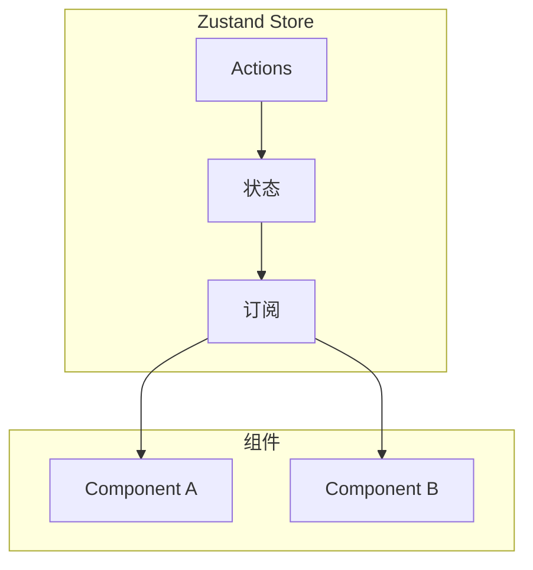
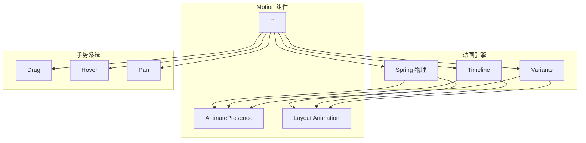
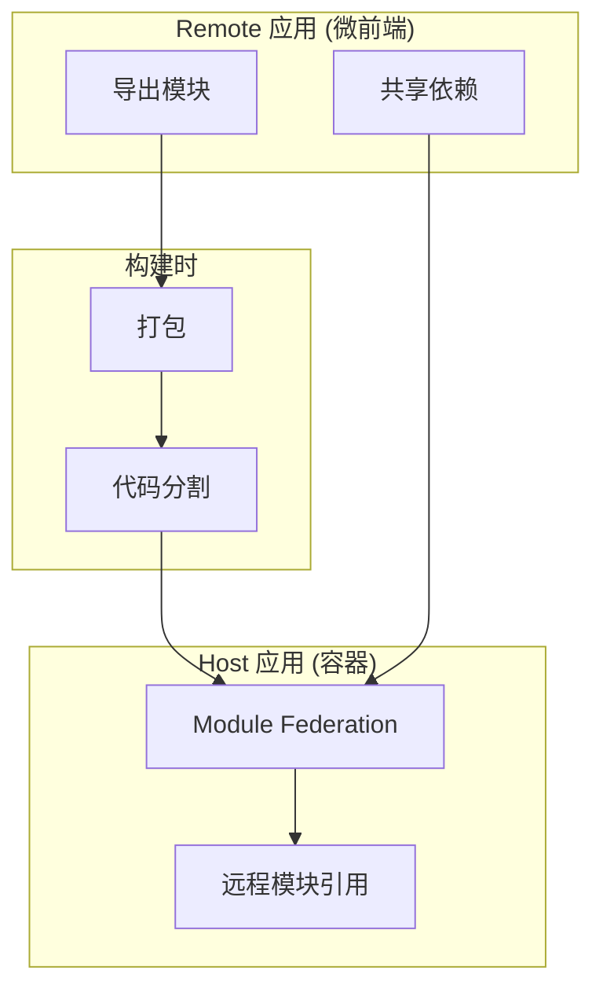
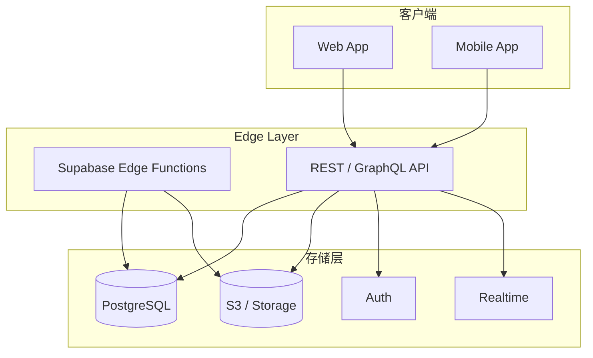

# 前端库与服务生态

> 本文是「新兴趋势」系列第 4 篇（共 4 篇）。上一篇：[构建、样式与工具链](build-and-toolchain.md)

## 1. React 状态管理

### 1.1 Zustand

**核心创新点**:

Zustand 是极简的 React 状态管理库：

1. **零 Provider**: 无需包裹组件树
2. **极小体积**: 1KB gzip
3. **TypeScript-first**: 完整类型推导
4. **无依赖**: 零外部依赖

**技术架构图**:



**竞品对比**:

| 维度 | Zustand | Redux | Jotai | Recoil |
|------|---------|-------|-------|--------|
| 体积 | ~1KB | ~7KB | ~3KB | ~3KB |
| Provider | 无需 | 必须 | 必须 | 必须 |
| Boilerplate | 极少 | 大量 | 中等 | 中等 |
| 学习曲线 | 低 | 高 | 低 | 中 |
| DevTools | 基础 | 优秀 | 有限 | 有限 |

**快速开始**:

```typescript
import { create } from 'zustand'

// 第 1 段：定义 Store 的类型契约
// 先把"状态形状 + 可执行动作"显式声明为一个接口，而不是让 TS 从实现里推断。
// 这样做的好处：组件里 useStore 的返回值、动作签名都有静态约束，重构时编译器能第一时间报错。
// 注意这里只声明了数据和动作的类型，不涉及任何 React 概念——zustand 的 store 本质是纯 JS 对象。
interface BearState {
  bears: number
  increase: () => void
  reset: () => void
}

// 第 2 段：创建 store（模块级单例）
// create<BearState>(...) 返回一个自定义 Hook；它在模块作用域执行一次，因此整个应用共享同一份状态，
// 这也是为什么下面组件不需要 Provider 包裹。
// set 是 zustand 注入的写入口，默认做"浅合并"：只覆盖传入的键，其余状态保持不变，
// 所以 reset 里可以只写 { bears: 0 } 而不必手动展开旧 state。
const useStore = create<BearState>((set) => ({
  bears: 0, // 初始值；每个组件首次订阅时读到的就是它
  increase: () => set((state) => ({ bears: state.bears + 1 })), // 函数式更新：基于最新 state 计算，避免闭包读到过期值
  reset: () => set({ bears: 0 }) // 传对象即合并式覆盖，不需要读到旧 state
}))

// 使用 - 无需 Provider（原注释保留：这是 zustand 相对 Context 方案最直观的差异）

// 第 3 段：在组件中按需订阅
// 两次 useStore 调用各传一个 selector，组件只订阅 bears 和 increase 两个切片。
// zustand 用 Object.is 比较 selector 结果，值没变就不触发重渲染——这是它性能优势的来源。
// 易错点：selector 若每次返回新对象/新数组（如 (s) => ({ a: s.a })），比较恒为 false，
// 会导致无限重渲染；此时应改用 useShallow 或拆成多个标量 selector。
function BearCounter() {
  const bears = useStore((state) => state.bears) // 订阅数据：bears 变化时组件重渲染
  const increase = useStore((state) => state.increase) // 订阅动作：函数引用恒定不变，实际上永远不会引发重渲染
  return (
    <div>
      <h1>{bears} bears</h1>
      <button onClick={increase}>增加</button>
    </div>
  )
}

// 第 4 段：数据流回顾（注释性小结，非代码）
// 点击按钮 → 调用 store 里的 increase → set 以最新的 state 计算新 bears → store 通知所有订阅者
// → 只有 selector 结果发生变化的组件才重渲染。整条链路无 Provider、无 reducer、无 action 常量，
// 代价是状态逻辑与组件同处一个模块，规模变大后建议按领域拆分成多个 store 文件。
```
**中间件示例**:

```typescript
// 第 1 段：引入依赖 —— create 用来生成 React 侧可订阅的 store hook；persist 是 zustand 的中间件，负责把状态写进/读回 storage（默认 localStorage）
// 注意 persist 必须从 'zustand/middleware' 引入，它不是 create 的选项，而是一个「高阶 state creator」
import { create } from 'zustand'
import { persist } from 'zustand/middleware'

// 第 2 段：组装 store —— 写法顺序是 create(persist(creator, options))
// 因为 zustand 的中间件机制是「接收 stateCreator 并返回新的 stateCreator」，persist 必须先包住 creator，再交给 create 去消费；
// 反过来 create(config, persist(...)) 是无效的，这是初学者最常见的写法错误。
const useStore = create(
  persist(
    // 第 3 段：状态与行为定义 —— set 用于更新 state，get 用于读取当前 state（这里未使用，但参数位置固定，不能省略 set 只写 get）
    // 关键意图：把数据字段和操作函数放在同一个对象里，函数通过闭包拿到 set，因此无需在外部导出 reducer 或 dispatch
    (set, get) => ({
      bears: 0,
      // 用「函数式更新」set((state) => ...) 而不是 set({ bears: get().bears + 1 })：
      // 前者由 zustand 传入最新快照，连续调用/同一 tick 内多次触发都不会读到过期值，避免丢失更新（stale closure）
      increase: () => set((state) => ({ bears: state.bears + 1 })),
      // 持久化到 localStorage：beats 每次变化都会触发中间件的写入订阅，序列化后落盘
      // 易错点：JSON 序列化会静默丢弃函数，所以必须配合下面第 4 段的 partialize 显式挑出要存的字段
    }),
    // 第 4 段：持久化配置 —— 决定「存到哪、存什么」
    {
      // name 是 storage 的键名（localStorage 中的 key），改动它等于换了一个存储槽，旧数据不会自动迁移，用户会看到状态"被重置"
      name: 'bear-storage',
      // partialize 是白名单投影：只序列化 bears 这类纯数据，避免把函数写进 storage，
      // 也顺带减小体积/避免把临时 UI 状态持久化。水合（rehydrate）时持久化结果是浅合并回初始 state，因此 initializer 里的 increase 不会被覆盖丢失
      partialize: (state) => ({ bears: state.bears })
      // 边界条件：这里没有 version/migrate，将来 bears 改名或改结构时，旧 storage 数据会原样合并进来，需要补 version + migrate 兜底
    }
  )
)
// 复杂度与时机提示：set 的合并是浅合并（O(1)），但每次状态变更都会写一次 storage，
// 高频更新场景应加节流或改用 onRehydrateStorage/skipHydration 控制水合时机——localStorage 读取是同步的，
// 但 persist 的水合发生在 store 创建之后，首屏可能先渲染初始值再被持久化值覆盖（React 中表现为一次额外渲染）。
```
**npm 下载统计**:

- 22K+ GitHub stars
- 15M+ 周下载量

**参考链接**:

- [Zustand 官网](https://zustand-demo.pmnd.rs)
- [Zustand GitHub](https://github.com/pmndrs/zustand)

---

### 1.2 SWR

**核心创新点**:

SWR 是 Vercel 推出的数据请求库：

1. **Stale-While-Revalidate**: 先返回缓存，后台更新
2. **自动重新验证**: 窗口聚焦/网络恢复时自动刷新
3. **去重请求**: 相同请求只发一次
4. **极小体积**: 3KB gzip

**竞品对比**:

| 维度 | SWR | TanStack Query | Apollo Client |
|------|-----|----------------|---------------|
| 体积 | 3KB | 12KB | 40KB+ |
| API 复杂度 | 简单 | 丰富 | 复杂 |
| 缓存 | 基础 | 高级 | 高级 |
| GraphQL | 否 | 否 | 原生 |
| 适用场景 | 简单请求 | 复杂状态 | GraphQL |

**快速开始**:

```typescript
// 第 1 段：准备数据获取层 —— 引入 SWR 并定义 fetcher
// SWR 的核心思路是"stale-while-revalidate"：先渲染缓存中的旧数据（stale），
// 同时在后台重新请求（revalidate），请求回来后再触发重渲染。这样用户能立刻看到内容，
// 而不是对着空白屏幕等网络往返（这正是手写 useEffect + useState 方案的主要痛点）。
import useSWR from 'swr'

// fetcher 是 SWR 约定注入的取数函数：接收 key（这里是 URL），返回解析后的 Promise。
// 必须返回 Promise，且建议在 res.ok 为 false 时抛错，否则 404/500 也会被当成"成功数据"。
// 这里用 r.json() 实现最小版本，真实项目中通常补上 response.ok 检查与超时/取消逻辑。
const fetcher = (url: string) => fetch(url).then(r => r.json())

function Profile() {
  // 第 2 段：订阅数据 —— 用 key 驱动请求状态机
  // useSWR 的第一个参数是缓存 key：只要 key 不变，多个组件调用同一个 key 会共享同一份缓存与去重请求；
  // key 变化（例如换成带用户 id 的 URL）就会自动重新拉取。fetcher 也可以不传，改为在 SWRConfig 里全局配置。
  // 返回的三元组里：data 初值为 undefined，error 表示抛出的异常，isLoading 表示"尚无任何数据且正在首次请求"。
  const { data, error, isLoading } = useSWR('/api/user', fetcher)

  // 第 3 段：分支渲染 —— 注意判断顺序决定边界行为
  // 先判 isLoading 再判 error：因为首屏两者可能同时为"未就绪"，先给出加载态更符合用户预期。
  // 关键的边界条件是——只有在"没有缓存数据"时才会走到加载分支；若命中缓存，data 会立即就绪，
  // 此时后台 revalidate 期间 isLoading 为 false，界面直接显示旧数据，不会闪回"加载中"。
  if (isLoading) return <div>加载中...</div>
  if (error) return <div>加载失败</div>

  // 第 4 段：正常渲染 —— 此时 data 必定存在
  // 走到这里说明请求成功且数据已就绪，因此下面访问 data.name / data.email 是安全的。
  // 易错点：TS 并不能自动从 isLoading/error 的分支收窄出 data 非空，所以类型上 data 仍可能是 undefined；
  // 实际项目里常用 `if (!data) return null` 或给 useSWR 加泛型 useSWR<User>(...) 来消除告警。
  return (
    <div>
      <h1>{data.name}</h1>
      <p>{data.email}</p>
    </div>
  )
}
```
**高级用法**:

```typescript
// 乐观更新
const { data, mutate } = useSWR('/api/todos', fetcher)

async function addTodo(todo) {
  // 乐观更新
  mutate([...data, todo], false)

  try {
    await fetch('/api/todos', {
      method: 'POST',
      body: JSON.stringify(todo)
    })
    // 重新验证
    mutate()
  } catch {
    // 回滚
    mutate(data, false)
  }
}

// 条件请求
const { data } = useSWR(userId ? `/api/user/${userId}` : null, fetcher)
```

**npm 下载统计**:

- 25K+ GitHub stars
- 10M+ 周下载量

**参考链接**:

- [SWR 官网](https://swr.vercel.app)
- [SWR GitHub](https://github.com/vercel/swr)

## 2. React 表单与动画

### 2.1 React Hook Form

**核心创新点**:

React Hook Form 是高性能的表单管理库：

1. **非受控模式**: 输入不触发重渲染
2. **极小体积**: ~3KB gzip
3. **Zod 集成**: 原生支持 schema 验证
4. **性能优先**: 表单越大优势越明显

**快速开始**:

```typescript
// 第 1 段：引入依赖（搭好"表单库 + 校验库 + 两者的适配器"这套组合）
// react-hook-form 负责表单状态与提交编排；zod 负责纯数据校验；zodResolver 把 zod 的校验结果
// 翻译成 react-hook-form 能识别的 errors 结构，三者缺一不可。
import { useForm } from 'react-hook-form'
import { z } from 'zod'
import { zodResolver } from '@hookform/resolvers/zod'

// 第 2 段：定义校验规则（单一事实来源 schema）
// 关键点：校验规则以纯数据描述，不依赖 React，因此可以在前端、后端、测试中复用同一份。
// 易错点：age 用 z.number()，而原生 input 的 value 永远是 string，故下文必须配 valueAsNumber: true，
// 否则校验一定失败（这是最常见的"明明填了却说类型不对"的根源）。
const schema = z.object({
  name: z.string().min(2),
  email: z.string().email(),
  age: z.number().min(18)
})

// 第 3 段：从 schema 反推 TS 类型（避免手写类型与校验规则漂移）
// z.infer 让"运行时校验规则"和"编译期类型"永远同步：schema 一改，类型自动跟着改，
// 无需再维护一份 interface，也就不会出现校验通过但类型对不上的情况。
type FormData = z.infer<typeof schema>

// 第 4 段：组件与表单实例化（把 schema 接到 useForm 上）
// resolver: zodResolver(schema) 是"校验入口"——提交时先跑 zod，失败则填充 formState.errors 并阻止 onSubmit。
// 注意：react-hook-form 默认 mode 为 onSubmit，所以错误只在提交时出现；想边输边校验需显式设 mode。
function App() {
  const {
    register,
    handleSubmit,
    formState: { errors, isSubmitting }
  } = useForm<FormData>({
    resolver: zodResolver(schema)
  })

  // 第 5 段：提交处理（此时 data 已被 zod 校验通过，可直接当成可信数据使用）
  // 关键数据流：submit 事件 → handleSubmit 拦截 → zod 校验 → 成功才调用 onSubmit(data)。
  // 这里的 async 会让 isSubmitting 在 Promise 完成前保持 true；本示例无真实请求，故瞬间回到 false。
  const onSubmit = async (data: FormData) => {
    console.log(data)
  }

  // 第 6 段：渲染表单（受控错误的展示 + 提交按钮的防重复点击）
  // handleSubmit(onSubmit) 不只是转发：它内部会 preventDefault 并先做校验，是把"事件"变成"已校验数据"的桥。
  return (
    <form onSubmit={handleSubmit(onSubmit)}>
      // 每个字段 = register 注册（绑定 name/onChange/ref）+ 条件渲染错误信息；
      // errors.xxx.message 由 zod 提供（未自定义 message 时是库的默认英文文案）。
      <input {...register('name')} />
      {errors.name && <span>{errors.name.message}</span>}

      <input {...register('email')} />
      {errors.email && <span>{errors.email.message}</span>}

      // valueAsNumber: true 在校验前把 input 的字符串转成 number，正好匹配 schema 里的 z.number()。
      <input type="number" {...register('age', { valueAsNumber: true })} />
      {errors.age && <span>{errors.age.message}</span>}

      // disabled={isSubmitting} 用于防止重复提交；由于 onSubmit 无真实异步操作（如接口请求、await），
      // 该状态几乎不可见——接入真实 API 时它的作用才体现出来。
      <button type="submit" disabled={isSubmitting}>
        提交
      </button>
    </form>
  )
}
```
**竞品对比**:

| 维度 | React Hook Form | Formik | React Form | RHF + Zod |
|------|-----------------|--------|------------|-----------|
| 体积 | ~3KB | ~10KB | ~5KB | ~8KB |
| 重渲染 | 最小 | 每次变化 | 中等 | 最小 |
| 验证 | Zod/Yup | Yup | 原生 | Zod (最佳) |
| API | 优秀 | 良好 | 良好 | 优秀 |

**npm 下载统计**:

- 39K+ GitHub stars
- 20M+ 周下载量

**参考链接**:

- [React Hook Form 官网](https://react-hook-form.com)
- [React Hook Form GitHub](https://github.com/react-hook-form/react-hook-form)

---

### 2.2 Framer Motion

**核心创新点**:

Framer Motion 是 React 动画库的行业标准：

1. **声明式 API**: 简单直观的动画语法
2. **布局动画**: AnimatePresence + layout
3. **手势支持**: Drag, Hover, Pan 内置
4. **服务端渲染**: 完整的 SSR 支持

**技术架构图**:



**快速开始**:

```typescript
import { motion, AnimatePresence } from 'framer-motion'

function App() {
  const [isVisible, setIsVisible] = useState(true)

  return (
    <>
      {/* 基础动画 */}
      <motion.div
        initial={{ opacity: 0, scale: 0.8 }}
        animate={{ opacity: 1, scale: 1 }}
        transition={{ duration: 0.5, ease: 'easeOut' }}
      >
        内容
      </motion.div>

      {/* 悬停效果 */}
      <motion.button
        whileHover={{ scale: 1.05 }}
        whileTap={{ scale: 0.95 }}
      >
        点击
      </motion.button>

      {/* 退出动画 */}
      <AnimatePresence>
        {isVisible && (
          <motion.div
            initial={{ opacity: 0 }}
            animate={{ opacity: 1 }}
            exit={{ opacity: 0 }}
          >
            条件渲染
          </motion.div>
        )}
      </AnimatePresence>
    </>
  )
}
```

**布局动画示例**:

```typescript
// 列表重新排序时自动动画
function TodoList() {
  const [todos, setTodos] = useState(initialTodos)

  return (
    <AnimatePresence>
      {todos.map(todo => (
        <motion.div
          key={todo.id}
          layout
          initial={{ opacity: 0, y: 20 }}
          animate={{ opacity: 1, y: 0 }}
          exit={{ opacity: 0, x: -100 }}
        >
          {todo.text}
        </motion.div>
      ))}
    </AnimatePresence>
  )
}
```

**npm 下载统计**:

- 22K+ GitHub stars
- 15M+ 周下载量

**参考链接**:

- [Framer Motion 官网](https://www.framer.com/motion/)
- [Framer Motion GitHub](https://github.com/framer/motion)

## 3. HTTP 客户端

### 3.1 Axios

**核心创新点**:

Axios 是最流行的 HTTP 客户端库：

1. **Promise API**: 基于 Promise，易于使用
2. **请求/响应拦截器**: 全局处理逻辑
3. **自动 JSON 转换**: 请求自动序列化
4. **取消请求**: CancelToken/AbortController
5. **浏览器 + Node**: 统一 API

**快速开始**:

```typescript
import axios from 'axios'

// GET 请求
const { data } = await axios.get('/api/users')

// POST 请求
const { data } = await axios.post('/api/users', {
  name: 'Alice',
  email: 'alice@example.com'
})

// 配置
axios({
  method: 'post',
  url: '/api/users',
  data: { name: 'Alice' },
  headers: { 'Authorization': 'Bearer token' },
  timeout: 5000
})
```

**拦截器示例**:

```typescript
// 请求拦截器
axios.interceptors.request.use(
  (config) => {
    // 添加 token
    config.headers.Authorization = `Bearer ${getToken()}`
    return config
  },
  (error) => Promise.reject(error)
)

// 响应拦截器
axios.interceptors.response.use(
  (response) => response.data,
  (error) => {
    if (error.response?.status === 401) {
      // 处理未授权
      logout()
    }
    return Promise.reject(error)
  }
)
```

**npm 下载统计**:

- 104K+ GitHub stars
- 60M+ 周下载量

**参考链接**:

- [Axios 官网](https://axios-http.com)
- [Axios GitHub](https://github.com/axios/axios)

---

### 3.2 Ky

**核心创新点**:

Ky 是基于原生 fetch 的轻量 HTTP 客户端：

1. **极小体积**: 3.8KB gzip
2. **原生 fetch**: 无 XMLHttpRequest
3. **简单 API**: 直观的链式调用
4. **内置重试**: 自动重试失败请求

**快速开始**:

```typescript
import ky from 'ky'

// GET
const data = await ky.get('/api/users').json()

// POST
const user = await ky.post('/api/users', {
  json: { name: 'Alice', email: 'alice@example.com' }
}).json()

// 配置
const api = ky.create({
  prefixUrl: '/api',
  timeout: 10000,
  hooks: {
    beforeRequest: [
      (request) => {
        request.headers.set('Authorization', `Bearer ${getToken()}`)
      }
    ]
  }
})

// 使用
const data = await api.get('users').json()
```

**竞品对比**:

| 维度 | Axios | Ky | ofetch | fetch |
|------|-------|-----|--------|-------|
| 体积 | ~14KB | 3.8KB | 1KB | 0KB |
| 浏览器支持 | 全部 | 现代 | 现代 | 全部 |
| Node.js | 支持 | 支持 | 支持 | 原生 |
| 拦截器 | 原生 | Ky 扩展 | - | - |
| 取消请求 | CancelToken | AbortSignal | AbortSignal | AbortSignal |

**npm 下载统计**:

- 10K+ GitHub stars
- 2M+ 周下载量

**参考链接**:

- [Ky GitHub](https://github.com/sindresorhus/ky)

---

### 3.3 ofetch

**核心创新点**:

ofetch 是 Nuxt 团队的 HTTP 客户端：

1. **统一 API**: 浏览器 + Node.js 同构
2. **极小体积**: ~1KB gzip
3. **自动 JSON**: 自动解析响应
4. **SSR 友好**: Nuxt 生态首选

**快速开始**:

```typescript
import { $fetch } from 'ofetch'

// GET
const users = await $fetch('/api/users')

// POST
const user = await $fetch('/api/users', {
  method: 'POST',
  body: { name: 'Alice' }
})

// 自动错误处理
try {
  const data = await $fetch('/api/data')
} catch (error) {
  console.error(error.data) // 服务器返回的 JSON
}
```

**npm 下载统计**:

- Nuxt 生态核心依赖
- 百万级使用

**参考链接**:

- [ofetch GitHub](https://github.com/unjs/ofetch)

## 4. 微前端架构

### 4.1 Module Federation 2.0

**核心创新点**:

Module Federation 2.0 (2026年5月) 增强跨应用代码共享：

1. **构建时共享**: Webpack 5 原生支持
2. **依赖复用**: 避免重复打包公共依赖
3. **动态模块**: 运行时动态加载远程模块
4. **Rspack 支持**: 扩展到 Rspack 生态

**技术架构图**:



**Host 应用配置**:

```javascript
// webpack.config.js (Host)
const { ModuleFederationPlugin } = require('webpack').container
const { dependencies } = require('./package.json')

module.exports = {
  plugins: [
    new ModuleFederationPlugin({
      name: 'host',
      remotes: {
        remoteApp: 'remoteApp@http://localhost:3001/remoteEntry.js'
      },
      shared: {
        ...dependencies,
        react: { singleton: true, requiredVersion: dependencies.react },
        'react-dom': { singleton: true, requiredVersion: dependencies['react-dom'] }
      }
    })
  ]
}
```

**Remote 应用配置**:

```javascript
// webpack.config.js (Remote)
// 第 1 段：引入 Module Federation 的运行期容器与本地依赖清单（配置的“输入数据”）
// 为什么用 require('webpack').container 而不是整个 webpack：只取 container 命名空间，避免读到无关导出，
// 也保证拿到的是与当前安装版本匹配的那个 Plugin 类。
// dependencies 直读 package.json（而非写死版本号），是为了让 shared 的版本约束与实际安装版本永不脱节。
const { ModuleFederationPlugin } = require('webpack').container
const { dependencies } = require('./package.json')

// 第 2 段：导出 webpack 配置对象，把联邦能力挂到 plugins 数组
// ModuleFederationPlugin 会同时注入构建期（生成 manifest）与运行期（共享作用域初始化）两套钩子，
// 所以它必须出现在 plugins 里，而不是 resolve/optimization 等字段中。
module.exports = {
  plugins: [
    new ModuleFederationPlugin({
      // 第 3 段：声明“我是谁”——联邦身份与产物入口
      // name 是这份 remote 暴露给外部的全局标识（运行时会挂到 window.remoteApp 上做容器查找），
      // 必须与 host 配置里 remotes 键所引用的名字保持一致，拼错只会在运行时报 "not found" 而不是构建报错。
      // filename 是远程入口产物的文件名，host 的 remote URL 尾段必须与此完全一致（含大小写）。
      name: 'remoteApp',
      filename: 'remoteEntry.js',
      // 第 4 段：exposes —— 对外“可被消费”的模块白名单
      // 左键（'./Button'）是 host 侧 import 的路径标识，必须以 './' 开头，否则 webpack 直接报错；
      // 右键是本包内的真实文件路径（省略后缀，按 resolve.extensions 补全）。
      // 只有列在这里的模块才进入联邦边界，未列出的内部实现仍会被打包但无法被 host 单独引入。
      exposes: {
        './Button': './src/components/Button',
        './Card': './src/components/Card'
      },
      // 第 5 段：shared —— 依赖共享与版本协商（多实例问题的核心防线）
      // singleton: true 让该依赖在共享作用域中最多保留一个实例：React 若被 host/remote 各装一份，
      // hooks 上下文与内部状态会分裂，典型症状是 "Invalid hook call" 或 context 读不到值。
      // requiredVersion 用于版本协商：不满足时 webpack 会回退到“再加载一份”，并可能打印版本警告；
      // 注意 'react-dom' 这里没给 requiredVersion，等于放弃一致性校验，任何可用版本都会被接受，
      // 需要严格约束时应补上 dependencies['react-dom']，否则线上容易出现双 React 的隐蔽 bug。
      shared: {
        react: { singleton: true, requiredVersion: dependencies.react },
        'react-dom': { singleton: true }
      }
    })
  ]
}
```
**运行时使用**:

```tsx
import React, { Suspense } from 'react'

function App() {
  return (
    <div>
      <h1>Host Application</h1>
      <Suspense fallback={<div>Loading remote module...</div>}>
        <RemoteButton />
      </Suspense>
    </div>
  )
}

// 动态导入远程模块
const RemoteButton = React.lazy(() => import('remoteApp/Button'))
```

**参考链接**:

- [Module Federation 官网](https://module-federation.io)
- [Webpack MF 文档](https://webpack.js.org/concepts/module-federation/)

---

### 4.2 Qiankun

**核心创新点**:

Qiankun 基于 Single-SPA 实现运行时微前端：

1. **运行时加载**: JS/CSS 沙箱隔离
2. **任意框架**: Vue/React/Angular/原生应用
3. **UMD 兼容**: 支持任何导出 UMD 模块的应用

**快速开始**:

```bash
npm install qiankun
```

**主应用**:

```typescript
import { registerMicroApps, start } from 'qiankun'

registerMicroApps([
  {
    name: 'react-app',
    entry: '//localhost:7100',
    container: '#container',
    activeRule: '/react'
  },
  {
    name: 'vue-app',
    entry: '//localhost:7200',
    container: '#container',
    activeRule: '/vue'
  }
], {
  beforeLoad: [
    app => {
      console.log('[主应用] before load', app.name)
      return Promise.resolve()
    }
  ],
  beforeMount: [
    app => {
      console.log('[主应用] before mount', app.name)
      return Promise.resolve()
    }
  ],
  afterUnmount: [
    app => {
      console.log('[主应用] after unmount', app.name)
      return Promise.resolve()
    }
  ]
})

start()
```

**子应用入口**:

```javascript
// react 子应用 src/index.js
import React from 'react'
import ReactDOM from 'react-dom/client'
import App from './App'

function render(props) {
  const { container } = props || {}
  const root = container
    ? container.querySelector('#root')
    : document.getElementById('root')

  ReactDOM.createRoot(root).render(<App />)
}

if (!window.__POWERED_BY_QIANKUN__) {
  render({})
}

export async function bootstrap() {
  console.log('[react] bootstrap')
}

export async function mount(props) {
  console.log('[react] mount', props)
  render(props)
}

export async function unmount() {
  console.log('[react] unmount')
  ReactDOM.unmountComponentAtRoot(
    container ? container.querySelector('#root') : document.getElementById('root')
  )
}
```

**微前端对比**:

| 维度 | Module Federation | Qiankun |
|------|-------------------|---------|
| 加载方式 | 构建时 | 运行时 |
| 共享依赖 | 原生 | 需要配置 |
| 沙箱隔离 | Webpack 管理 | JS/CSS 沙箱 |
| 框架支持 | 主要 Webpack | 任意框架 |
| 状态共享 | 共享模块 | props 传递 |

## 5. 组件库与 UI

### 5.1 shadcn/ui

**核心创新点**:

shadcn/ui 不是组件库，而是源代码复制模式：

1. **源代码复制**: 组件代码复制到项目中
2. **完全控制**: 零依赖，完全定制
3. **Radix UI + Tailwind**: 无样式可访问组件 + Utility CSS
4. **按需采用**: 按需添加，非全量安装

**快速开始**:

```bash
npx shadcn-ui@latest init
npx shadcn-ui@latest add button
npx shadcn-ui@latest add dialog
npx shadcn-ui@latest add form
```

**使用示例**:

```tsx
import { Button } from '@/components/ui/button'
// 第 1 段：按需导入 Dialog 的原子组件（Trigger / Content / Header / Title）
// 采用"命名导出 + 组合式"设计：每个子组件只负责一层结构，样式与行为被封装在 ui 层，
// 业务侧靠组合拼装。这样后续替换底层实现（如换成 Radix 的 Dialog.Root）而不影响调用方。
// 注意：DialogDescription 在这里被省略了，若觉得可访问性告警（a11y）重要，应补上。
import {
  Dialog,
  DialogContent,
  DialogHeader,
  DialogTitle,
  DialogTrigger
} from '@/components/ui/dialog'

// 第 2 段：组件声明——不接收任何 props，这是一个纯展示型、非受控（uncontrolled）示例
// "非受控"是指开关状态由 Dialog 内部自己维护，父组件拿不到 open/onOpenChange。
// 因此这里无法做"提交前校验""打开时预加载数据"之类的事；需要那些能力时，
// 就得把 Dialog 改为受控写法（open + onOpenChange 提升到父级 state）。
function ExampleDialog() {
  return (
    // 第 3 段：Dialog 作为上下文根（Root），向下通过 Context 广播开合状态
    // 它本身不渲染任何 DOM，只提供状态与 ARIA 关联（aria-labelledby、焦点陷阱等）。
    <Dialog>
      // 第 4 段：触发器——asChild 是这里最关键的细节
      // asChild 让 Trigger 不额外包一层 <button>，而是把 onClick / aria-* / ref 等
      // 通过 Slot 合并到子元素 <Button> 上。若不写 asChild，会渲染出 button 套 button
      // 的非法结构与重复点击目标；反过来，子元素必须是能接收 ref 与事件的自定义组件。
      <DialogTrigger asChild>
        <Button variant="outline">打开对话框</Button>
      </DialogTrigger>
      // 第 5 段：内容层——Portal + 遮罩 + 焦点管理都发生在这里
      // 打开时焦点被移入内容区，关闭后归还给触发元素；Esc 与点击遮罩关闭是默认行为。
      // 易错点：内容只挂载在 Portal 中，脱离父级 DOM 树，祖先的 CSS（如 overflow、z-index）
      // 与普通后代选择器都影响不到它。
      <DialogContent>
        // 第 6 段：标题区——DialogTitle 不是可选项，而是无障碍契约
        // 它渲染为语义化标题并与 DialogContent 的 aria-labelledby 关联，
        // 让读屏软件在弹出时能播报"这是什么对话框"；删掉它会破坏对话框的语义。
        <DialogHeader>
          <DialogTitle>确认操作</DialogTitle>
        </DialogHeader>
        // 第 7 段：正文说明（风险提示）
        // 放在标题与操作区之间，属于"先告知后果、再让用户决策"的交互顺序，
        // 对破坏性操作尤其重要。
        <p>此操作无法撤销。</p>
        // 第 8 段：操作区布局——flex + justify-end 让主操作靠右，符合阅读与操作习惯；
        // gap-2 提供稳定间距，避免依赖空文本节点或 margin 塌陷。
        <div className="flex justify-end gap-2">
          // 第 9 段：取消与确认——破坏性操作的双按钮模式
          // 取消用 outline（低视觉权重，作为默认安全路径），确认用 destructive
          // 以颜色预警不可逆后果。
          // 重要边界：这两个 Button 都只是普通按钮，没有用 DialogClose 包裹，
          // 所以点击后不会自动关闭对话框——真实业务里必须在这里补上关闭逻辑
          // （包 DialogClose，或在 onClick 里 setOpen(false) 并触发实际提交）。
          <Button variant="outline">取消</Button>
          <Button variant="destructive">确认</Button>
        </div>
      </DialogContent>
    </Dialog>
  )
}
```
**参考链接**:

- [shadcn/ui 官网](https://ui.shadcn.com)
- [shadcn/ui GitHub](https://github.com/shadcn-ui/ui)

## 6. 类型与验证

### 6.1 Zod

**核心创新点**:

Zod 实现 TypeScript 类型系统缺失的运行时验证：

1. **Schema-first**: 定义 Schema 同时获得类型推导
2. **运行时验证**: 编译时 + 运行时双重保障
3. **广泛集成**: API/表单/环境变量/配置

**快速开始**:

```typescript
import { z } from 'zod'

const UserSchema = z.object({
  name: z.string().min(2).max(100),
  email: z.string().email(),
  age: z.number().int().positive().optional(),
  role: z.enum(['admin', 'user', 'guest']),
  createdAt: z.coerce.date()
})

type User = z.infer<typeof UserSchema>

// 验证数据
const result = UserSchema.safeParse({
  name: 'Alice',
  email: 'alice@example.com',
  role: 'admin'
})

if (result.success) {
  console.log(result.data) // 类型安全的 User
} else {
  console.log(result.error.issues)
}
```

**高级用法**:

```typescript
// 递归类型
const CommentSchema = z.object({
  id: z.string().uuid(),
  text: z.string().min(1),
  replies: z.array(z.lazy(() => CommentSchema)).optional()
})

// 条件验证
const StartEndSchema = z.object({
  startDate: z.date(),
  endDate: z.date().refine((date, ctx) => {
    if (date < ctx.parent.startDate) {
      ctx.addIssue({
        code: z.ZodIssueCode.custom,
        message: '结束日期必须晚于开始日期'
      })
    }
    return true
  })
})

// 工具函数
const partial = UserSchema.partial()
const required = partial.required()
const omit = UserSchema.omit({ metadata: true })
const pick = UserSchema.pick({ name: true, email: true })
```

**参考链接**:

- [Zod 官网](https://zod.dev)
- [Zod GitHub](https://github.com/colinhacks/zod)

---

### 6.2 Effect

**核心创新点**:

Effect 是 TypeScript 函数式编程库：

1. **类型安全**: 端到端类型推导
2. **错误处理**: 可组合的错误类型
3. **并发**: 结构化并发原语
4. **管道**: 函数组合

**快速开始**:

```typescript
import { Effect, Context, Layer } from 'effect'

// 定义服务
interface UserService {
  readonly getUser: (id: string) => Effect.Effect<User, UserNotFoundError>
  readonly createUser: (data: CreateUserInput) => Effect.Effect<User, ValidationError>
}

// Effect 程序
const program = Effect.gen(function* (_) {
  const userService = yield* _(UserService)

  const user = yield* _(userService.getUser('123'))
  yield* _(console.log(`Found: ${user.name}`))

  return user
})

// 运行
Effect.runPromise(program)
```

## 7. 后端即服务 (BaaS)

### 7.1 Supabase

**核心创新点**:

Supabase 是开源的 Firebase 替代品：

1. **PostgreSQL 核心**: 强大的关系数据库
2. **实时订阅**: WebSocket 实时数据同步
3. **Row Level Security**: 行级安全策略
4. **Edge Functions**: 无服务器函数
5. **文件存储**: 大文件存储服务

**技术架构图**:



**快速开始**:

```bash
# 安装 Supabase CLI
npm install -g supabase

# 初始化项目
supabase init

# 启动本地开发
supabase start

# 连接到远程
supabase link --project-ref your-project-id
```

**周下载量**: 1570 万 | **GitHub**: 72K stars

**参考链接**:

- [Supabase 官网](https://supabase.com)
- [Supabase 文档](https://supabase.com/docs)
- [GitHub](https://github.com/supabase/supabase-js)

---

### 7.2 Firebase

**核心创新点**:

Google 的 BaaS 平台：

1. **Firestore**: NoSQL 文档数据库
2. **Authentication**: 多认证方式
3. **Cloud Functions**: 无服务器函数
4. **Hosting**: 静态托管
5. **Cloud Messaging**: 推送通知

**快速开始**:

```bash
# 安装 Firebase CLI
npm install -g firebase-tools

# 登录
firebase login

# 初始化项目
firebase init

# 部署
firebase deploy
```

**周下载量**: 756 万

**参考链接**:

- [Firebase 文档](https://firebase.google.com/docs)
- [GitHub](https://github.com/firebase/firebase-js-sdk)

---

### 7.3 PocketBase

**核心创新点**:

Go 语言开发的轻量级 BaaS：

1. **单文件运行**: 零依赖
2. **SQLite 内嵌**: 嵌入式数据库
3. **内置 UI**: 管理面板
4. **实时订阅**: 内置 WebSocket

**快速开始**:

```bash
# 下载 PocketBase
curl -L https://github.com/pocketbase/pocketbase/releases/latest/download/pocketbase_linux_amd64.zip -o pb.zip
unzip pb.zip

# 启动
./pocketbase serve
```

**GitHub**: 34K stars

**参考链接**:

- [PocketBase 官网](https://pocketbase.io)
- [GitHub](https://github.com/pocketbase/pocketbase)

## 8. 参考文献

本文档调研引用的官方文档和 GitHub 仓库：

| 类别 | 项目 | 官方文档 | GitHub |
|------|------|---------|--------|
| **React 生态** | | | |
| | React | [react.dev](https://react.dev) | [github.com/facebook/react](https://github.com/facebook/react) |
| | React Router | [reactrouter.com](https://reactrouter.com) | [github.com/remix-run/react-router](https://github.com/remix-run/react-router) |
| | Next.js | [nextjs.org](https://nextjs.org) | [github.com/vercel/next.js](https://github.com/vercel/next.js) |
| **构建工具** | | | |
| | Vite | [vite.dev](https://vite.dev) | [github.com/vitejs/vite](https://github.com/vitejs/vite) |
| | Webpack | [webpack.js.org](https://webpack.js.org) | [github.com/webpack/webpack](https://github.com/webpack/webpack) |
| | esbuild | [esbuild.github.io](https://esbuild.github.io) | [github.com/evanw/esbuild](https://github.com/evanw/esbuild) |
| | Rollup | [rollupjs.org](https://rollupjs.org) | [github.com/rollup/rollup](https://github.com/rollup/rollup) |
| **Node.js 后端** | | | |
| | Express | [expressjs.com](https://expressjs.com) | [github.com/expressjs/express](https://github.com/expressjs/express) |
| | NestJS | [nestjs.com](https://nestjs.com) | [github.com/nestjs/nest](https://github.com/nestjs/nest) |
| | Fastify | [fastify.dev](https://fastify.dev) | [github.com/fastify/fastify](https://github.com/fastify/fastify) |
| | Hono | [hono.dev](https://hono.dev) | [github.com/honojs/hono](https://github.com/honojs/hono) |
| **ORM/数据库** | | | |
| | Prisma | [prisma.io](https://www.prisma.io) | [github.com/prisma/prisma](https://github.com/prisma/prisma) |
| | TypeORM | [typeorm.io](https://typeorm.io) | [github.com/typeorm/typeorm](https://github.com/typeorm/typeorm) |
| | Drizzle ORM | [orm.drizzle.team](https://orm.drizzle.team) | [github.com/drizzle-team/drizzle-orm](https://github.com/drizzle-team/drizzle-orm) |
| | Mongoose | [mongoosejs.com](https://mongoosejs.com) | [github.com/Automattic/mongoose](https://github.com/Automattic/mongoose) |
| **状态管理** | | | |
| | Zustand | [zustand.docs.pmnd.rs](https://zustand.docs.pmnd.rs) | [github.com/pmndrs/zustand](https://github.com/pmndrs/zustand) |
| | TanStack Query | [tanstack.com/query](https://tanstack.com/query/latest) | [github.com/TanStack/query](https://github.com/TanStack/query) |
| | SWR | [swr.vercel.app](https://swr.vercel.app) | [github.com/vercel/swr](https://github.com/vercel/swr) |
| | Redux Toolkit | [redux-toolkit.js.org](https://redux-toolkit.js.org) | [github.com/reduxjs/redux](https://github.com/reduxjs/redux) |
| **UI 组件** | | | |
| | MUI | [mui.com](https://mui.com) | [github.com/mui/material-ui](https://github.com/mui/material-ui) |
| | Ant Design | [ant.design](https://ant.design) | [github.com/ant-design/ant-design](https://github.com/ant-design/ant-design) |
| | Chakra UI | [chakra-ui.com](https://chakra-ui.com) | [github.com/chakra-ui/chakra-ui](https://github.com/chakra-ui/chakra-ui) |
| **AI/LLM** | | | |
| | OpenAI SDK | [platform.openai.com](https://platform.openai.com/docs) | [github.com/openai/openai-node](https://github.com/openai/openai-node) |
| | Anthropic SDK | [platform.claude.com](https://platform.claude.com/docs) | [github.com/anthropics/anthropic-sdk-typescript](https://github.com/anthropics/anthropic-sdk-typescript) |
| | Vercel AI SDK | [ai-sdk.dev](https://ai-sdk.dev) | [github.com/vercel/ai](https://github.com/vercel/ai) |
| | LangChain | [langchain.com](https://langchain.com/docs) | [github.com/langchain-ai/langchainjs](https://github.com/langchain-ai/langchainjs) |
| **工具库** | | | |
| | ESLint | [eslint.org](https://eslint.org) | [github.com/eslint/eslint](https://github.com/eslint/eslint) |
| | Prettier | [prettier.io](https://prettier.io) | [github.com/prettier/prettier](https://github.com/prettier/prettier) |
| | Jest | [jestjs.io](https://jestjs.io) | [github.com/jestjs/jest](https://github.com/jestjs/jest) |
| | Vitest | [vitest.dev](https://vitest.dev) | [github.com/vitest-dev/vitest](https://github.com/vitest-dev/vitest) |
| | Playwright | [playwright.dev](https://playwright.dev) | [github.com/microsoft/playwright](https://github.com/microsoft/playwright) |
| **BaaS** | | | |
| | Supabase | [supabase.com](https://supabase.com) | [github.com/supabase/supabase-js](https://github.com/supabase/supabase-js) |
| | Firebase | [firebase.google.com](https://firebase.google.com/docs) | [github.com/firebase/firebase-js-sdk](https://github.com/firebase/firebase-js-sdk) |
| | PocketBase | [pocketbase.io](https://pocketbase.io) | [github.com/pocketbase/pocketbase](https://github.com/pocketbase/pocketbase) |

## 深入阅读与参考

!!! tip "怎么用这些资料"
    先读「官方文档与规范」建立准确的概念，再读「源码与示例」核对细节，最后用「教程、书籍与视频」换一种讲法加深理解。每条都写明了读哪一节、带着什么问题读。

### 官方文档与规范

| 资源 | 为什么读 | 怎么读 |
|---|---|---|
| [React 官方文档](https://react.dev/) | React 官方总入口，状态与表单基础都从这里起步。 | 按 Quick Start 边读边改页内沙盒代码，再挑状态相关章节精读。 |
| [React API 参考](https://react.dev/reference/react) | Hook 的 Caveats 与排错清单能避开状态管理常见坑。 | 遇到不熟的 Hook 先查此页，只读 Caveats 与 Troubleshooting 两节。 |
| [useState](https://react.dev/reference/react/useState) | 最核心的状态 Hook，讲清状态快照与更新批处理语义。 | 重点读 Caveats 与函数式更新示例，改写一个计数器验证理解。 |
| [useContext](https://react.dev/reference/react/useContext) | 跨层共享状态的标准方案，是全局状态管理的地基。 | 读用法与注意事项，用 Context 重构一个多层透传 props 的场景。 |
| [useActionState](https://react.dev/reference/react/useActionState) | 把表单提交与异步状态串起来，是表单章节的现代写法。 | 读示例后用它实现表单的 pending、错误提示与校验反馈。 |
| [React Labs: View Transitions, Activity, and more](https://react.dev/blog/2025/04/23/react-labs-view-transitions-activity-and-more) | 官方前沿动画方案，View Transitions 与 Activity 一节讲得清楚。 | 读 View Transitions 小节，给列表切换加过渡并观察行为差异。 |
| [Ant Design 中文文档](https://ant.design/docs/react/introduce-cn) | 组件库与表单校验的实战入口，中文文档可读性高。 | 做一个含 Form 校验与 Table 的后台页，重点读 Form 校验一节。 |
| [MDN HTTP 文档](https://developer.mozilla.org/zh-CN/docs/Web/HTTP) | HTTP 客户端章节的权威总览，覆盖缓存、CORS 与状态码。 | 先读概述，再读缓存、CORS、Cookie、状态码，每篇用 DevTools 验证。 |
| [RFC 9110 HTTP Semantics](https://www.rfc-editor.org/rfc/rfc9110) | HTTP 语义正式规范，方法幂等与安全性定义的唯一权威。 | 先读方法与状态码章节，用 curl 验证幂等性与安全性定义。 |
| [MDN HTTP 状态码](https://developer.mozilla.org/en-US/docs/Web/HTTP/Status) | 常见状态码速查，配合动手验证能真正记住语义。 | 用 curl 触发 301、304、401、429 等并记录响应头，对照文档解释。 |

### 源码与示例

| 资源 | 为什么读 | 怎么读 |
|---|---|---|
| [React Testing Library 简介](https://testing-library.com/docs/react-testing-library/intro/) | 给出可读测试示例，示范组件渲染与交互断言怎么写。 | 给一个组件写渲染、交互、断言三步测试，对照文中示例调整。 |

### 教程、书籍与视频

| 资源 | 为什么读 | 怎么读 |
|---|---|---|
| [Thinking in React](https://react.dev/learn/thinking-in-react) | 用五步法讲清组件拆分与 state 归属，状态设计入门佳作。 | 照文中五步，用一个待办清单需求从零拆组件并划分 state。 |
| [Intro to Storybook（React）](https://storybook.js.org/tutorials/intro-to-storybook/react/en/get-started/) | 手把手搭建 UI 组件开发与测试工作流，组件库章节实用。 | 跟着教程建一个 Storybook，把一个现有按钮组件抽成 story。 |
| [React TypeScript Cheatsheet](https://react-typescript-cheatsheet.netlify.app/) | React 加 TypeScript 写法速查，类型与验证章节常翻。 | 在项目中按组件、Hooks、事件的写法逐项套用，遇到报错回查。 |

## 应用与行业实践

### 应用场景地图

| 场景 | 用到本页哪个知识点 | 典型技术选型 | 注意事项 |
| --- | --- | --- | --- |
| 后台管理的万行表格，按状态、时间、门店筛选 | React 状态管理（服务端状态与 URL 状态分开） | 查询缓存库 + 表格库 + 虚拟滚动 | 行选中、列宽这类界面状态不要塞进全局 store；筛选条件写进 URL，便于分享与回放 |
| 低端安卓机在地铁网速下打开运营落地页 | 组件库与 UI（按需引入、首屏只加载关键组件） | 按需引入的组件库 + 路由级代码分割 | 图标与字体走本地资源；骨架屏尺寸与真实内容对齐，避免布局跳动 |
| 多人协作白板，两人同时拖拽同一个图形 | React 状态管理（乐观更新与操作去重） | useReducer 或 Redux Toolkit + WebSocket | 本地先落操作再广播；冲突归属判断只写一份，放在 reducer 里 |
| 新用户注册的多步表单，字段随所选身份变化 | React 表单与动画 + 类型与验证 | react-hook-form + Zod + 步骤切换过渡 | 校验 schema 与后端共享同一份；切换步骤时不要清空已填字段 |
| 运营同学自助搭建的活动报名页 | 组件库与 UI + BaaS | 组件库表单控件 + Supabase 或 Firebase 直接写库 | 权限写在数据库策略里，不能只靠前端隐藏按钮 |
| 中台门户把订单、库存、报表三套系统拼成一个入口 | 微前端架构 | Module Federation + 路由分发 + 共享依赖单例 | 主应用只做壳与登录态；子应用要能独立部署、独立起服务调试 |
| 弱网环境下采集埋点，联网恢复后补传 | HTTP 客户端（超时、重试、离线队列） | fetch 或 axios + AbortController + IndexedDB 队列 | 重试要带退避与去重 id；页面卸载时用 sendBeacon |
| 客服工作台同一套表单要跑在浏览器与桌面壳里 | 类型与验证 + 组件库主题变量 | TypeScript 类型共享包 + 设计令牌 | 平台差异封装在适配层；类型包在 CI 里单独发版 |

### 三个场景拆解

#### 场景 1：后台管理的万行表格

**业务背景**：订单列表要支持按状态、时间、门店筛选，单店数据在十万行级别，运营每天在页面上翻几十页。痛点是筛选条件一刷新就丢，翻页时表格闪白，接口变慢时旧结果会覆盖新结果。

**怎么用本页知识解决**：思路是把筛选与分页当 URL 状态，把列表数据交给查询缓存，把行选中留在组件里。

```tsx
const [params, setParams] = useSearchParams();
// 分页、筛选都从 URL 读，刷新或分享链接后视图一致
const page = Number(params.get('page') ?? 1);
const status = params.get('status') ?? 'all';

const { data, isFetching } = useQuery({
  // 缓存键带上全部查询条件，条件不同就是不同缓存
  queryKey: ['orders', page, status],
  queryFn: ({ signal }) => fetchOrders({ page, status, signal }),
});

// 行选中是界面状态，放在组件里，不进全局 store
const [selected, setSelected] = useState<string[]>([]);
```

- 缓存键里放全部查询条件，条件变化就换缓存，翻回上一页能直接命中，不发请求。
- 请求函数接收取消信号，组件卸载或条件变化时取消在途请求，旧结果覆盖新结果的问题消失。
- 选中行留在组件内，避免全局 store 随选中变化触发整页重渲染。
- 筛选写入 URL 后，同事打开同一条链接看到同一批数据，工单沟通不用截图。
- 接口慢时用 `isFetching` 在表格顶部显示进度条，不整表换骨架屏，减少闪烁。

**怎么度量收益**：

- 交互耗时：在 Chrome DevTools Performance 面板录制同一段筛选操作，量 `domInteractive` 到首行数据渲染完成的间隔，跑 5 次取中位数。
- 请求条数：在浏览器 Network 面板统计来回翻 10 页发出的列表请求数。
- 渲染成本：用 React DevTools Profiler 记录选中一行时的提交次数与提交耗时。

**什么时候不该用**：

- 列表只有几十行、也不需要把视图发给别人，条件放在组件内的 `useState` 就够，引入 URL 状态只增加代码量。
- 库存扣减、审批结论这类必须看到服务端最终结果的数据，不能靠缓存展示，要每次拉实时值或改走推送。

#### 场景 2：多人协作白板

**业务背景**：白板支持多人同时画图形和拖拽，一次评审会通常 5 到 20 人同时在线，网络往返在 50 到 300 毫秒之间波动。痛点是自己拖的图形要等服务器回包才动，手感发涩；两人同时改一个图形时位置来回跳。

**怎么用本页知识解决**：思路是先本地落操作再广播，回放的操作按 id 去重后进同一个 reducer，渲染层只订阅文档数据。

```ts
function useBoard(socket: WebSocket) {
  const [doc, dispatch] = useReducer(reduceDoc, emptyDoc);
  // 本地操作立即派发，界面不等服务端回包
  function localMove(id: string, x: number, y: number) {
    const op = { opId: newId(), target: id, x, y };
    dispatch({ type: 'apply', op });
    socket.send(JSON.stringify(op));
  }
  useEffect(() => {
    // 服务端广播的操作按 opId 去重后再进 reducer
    socket.onmessage = (e) => {
      dispatch({ type: 'apply-remote', op: JSON.parse(e.data) });
    };
    return () => { socket.onmessage = null; };
  }, [socket]);
  return { doc, localMove };
}
```

- reducer 里按操作 id 去重，同一条操作被本地与服务端各派发一次也只生效一次。
- 本地派发不等待回包，拖动延迟只由渲染耗时决定，不由网络往返决定。
- 远端操作只改文档数据，图形坐标在渲染时从文档派生，不直接操作 DOM 节点。
- 冲突归属判断只写在 reducer 里，服务端负责排序与广播，前后端不维护两份规则。
- 断线重连时重发未确认的操作，去重逻辑保证重发不会画出重复图形。

**怎么度量收益**：

- 长任务：用 PerformanceObserver 观察 `longtask`，统计连续拖拽 10 秒内的长任务总时长。
- 拖动延迟：在 pointermove 与下一帧绘制之间用 `performance.now()` 打点，取 100 次拖动的 P95。
- 提交成本：用 React DevTools Profiler 看每次远端操作引发的提交次数与耗时。

**什么时候不该用**：

- 单人使用的画图工具不需要乐观更新与去重，维护一份操作日志只增加状态量。
- 表单提交要求看到服务端最终结果的流程，先本地提交再回滚会让用户看到自己填的内容消失，直接等回包并显示提交中状态。

#### 场景 3：中台门户的微前端拼接

**业务背景**：门户要把订单、库存、报表三套系统放进同一个入口，三套由不同小组维护，发版节奏不同。痛点是改一次主导航要三套一起发，任意一套升级依赖都可能把另外两套带崩。

**怎么用本页知识解决**：思路是主应用只做壳、路由和登录态，子应用独立部署，React 作为共享单例依赖在运行时加载。

```js
// 主应用：只声明共享依赖，业务代码运行时从子应用加载
new ModuleFederationPlugin({
  name: 'shell',
  remotes: {
    orders: 'orders@/orders/remoteEntry.js', // 路径按实际部署环境填
  },
  shared: {
    // 版本从 package.json 读取，避免手写版本与实际依赖不一致
    react: { singleton: true, requiredVersion: deps.react },
    'react-dom': { singleton: true, requiredVersion: deps['react-dom'] },
  },
});
```

- React 声明为 singleton，主应用与子应用共用同一份运行时，hooks 与 context 不会因为两份 React 失效。
- `remotes` 只声明地址，子应用可以单独发版，主应用不用重新构建。
- 登录态与用户信息由主应用下发给子应用，子应用不各自实现一套权限判断。
- 子应用保留独立的开发入口，本地能单独起服务调试，不必先启动主应用。
- 路由按路径前缀分发，子应用卸载时清理全局事件监听与定时器，避免切换后残留。

**怎么度量收益**：

- 发布耦合度：数一次主导航改版需要同时发布的仓库数量，从构建记录里统计。
- 切换耗时：用 Playwright 记录点击菜单到子应用首屏渲染完成的耗时，同时看 Network 面板中 React 的传输体积是否只有一份。
- 首屏指标：用 PerformanceObserver 观察 `largest-contentful-paint`，对比拼接前后的取值分布。

**什么时候不该用**：

- 只有一套系统、一个小组维护，拆微前端会让构建与联调链路变长。
- 两个页面要共享同一份内存对象，例如同一个富文本编辑器实例，跨应用传递比重写成单应用花费更多。

### 行业先进实践

服务端状态与客户端状态分开管理（出处：TanStack Query 官方文档）。文档区分了远端缓存数据与本地界面状态，并说明该库不替代全局状态管理库。远端数据带有过期与失效语义，写进全局 store 需要手写这套规则。借鉴方式：列表与详情交给查询缓存，弹窗开关、选中项留在组件或 URL。

把筛选与分页放进 URL（出处：React Router 官方文档 useSearchParams）。文档把 search params 作为状态源，读与写都经过它。这样做让刷新、分享链接、浏览器前进后退都能还原同一视图。借鉴方式：先给一个列表页加 URL 状态，跑通后再推给其他检索页。

Effect 只用来同步外部系统（出处：React 官方文档《You Might Not Need an Effect》）。文档列出可以删掉的 effect，其中包括由 props 与 state 算出的派生值。删掉这类 effect 后少一层渲染后同步，也少一类竞态与闪烁。借鉴方式：把表单的过滤结果、列表的合计值改成渲染时计算。

共享依赖声明单例（出处：webpack 官方文档 Module Federation）。文档说明 `shared` 选项让多个构建共用同一份依赖，并支持 singleton 与 requiredVersion 约束。React 被加载两份时 hooks 与 context 会失效，单例声明能挡住这类故障。借鉴方式：先在壳应用对 react 与 react-dom 打开 singleton，再检查各子应用产物的重复依赖体积。

采集真实用户指标而不是只看实验室数据（出处：GoogleChrome/web-vitals 开源项目）。该库按 Web Vitals 的指标名上报 LCP、INP、CLS，并说明上报时机与页面隐藏时的处理。实验室环境测不到低端设备与弱网下的真实分布。借鉴方式：在入口引入该库，按指标名打点上报，再用分位数看改动前后的曲线。

### 从学到用：落地路线

第 1 步：选一个列表页或表单页作为试点，只改这一页的状态分层，不动其他代码。验收标准：试点页的筛选条件在刷新后仍保留，且新增文件不超过两个。

第 2 步：给试点页加观测手段，用 Profiler、Network 面板与真实用户指标各测一轮改动前后的数值。验收标准：产出一张改动前后同一操作的耗时与请求条数对比表，换人重跑能得到接近的数值。

第 3 步：把试点实现写成仓库内的约定文档与代码模板，交给其他小组按模板改造。验收标准：至少两个其他页面按模板落地，代码评审清单里包含状态分层检查项。

第 4 步：把关键约束写进 lint 规则或 CI 检查，例如禁止在组件里手工拼查询字符串。验收标准：违反约束的提交在 CI 阶段失败，规则文档写明约束的理由。

### 动手作业

目标：做一个订单查询页，筛选与分页写进 URL，列表数据走查询缓存，行选中留在组件内；页面既能单独启动，也能挂到中台壳里。

步骤：

1. 起一个 React + TypeScript 应用，接入组件库，先做出静态表格与筛选栏。
2. 用 react-hook-form 加 Zod 定义筛选表单，schema 放在独立的类型包里，导出类型给查询函数复用。
3. 把筛选与分页写入 URL search params，刷新页面后视图与刷新前一致。
4. 把列表请求接到查询缓存，缓存键包含全部分页与筛选条件，请求函数接收取消信号。
5. 行选中与行展开用组件内的 state 管理，用 Profiler 记录选中一行时的提交次数。
6. 用 Module Federation 把页面暴露出去，在壳应用里按路由挂载，react 与 react-dom 声明为 singleton。
7. 在 CI 里加一条 Playwright 用例，覆盖筛选、翻页、选中三件事。

验收标准：

- 把页面 URL 复制到新标签打开，筛选条件、页码、选中行与复制前一致。
- 在 Network 面板里来回翻 10 页，相同条件的列表请求只发一次。
- 选中一行时，Profiler 显示只有表格行相关组件提交，筛选栏没有重新渲染。
- 单独启动子应用能完成同样操作；挂到壳里后 Network 面板中 React 只下载一份。
- CI 里的 Playwright 用例在筛选、翻页、选中三步上全部通过。

