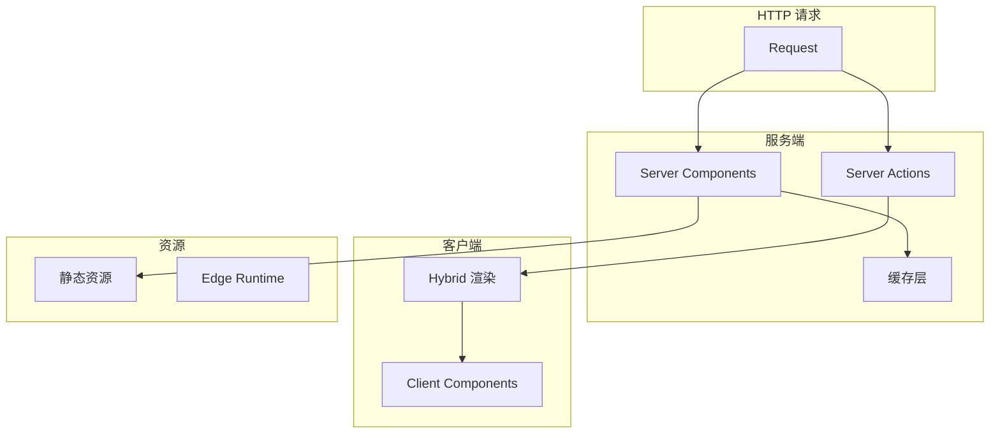
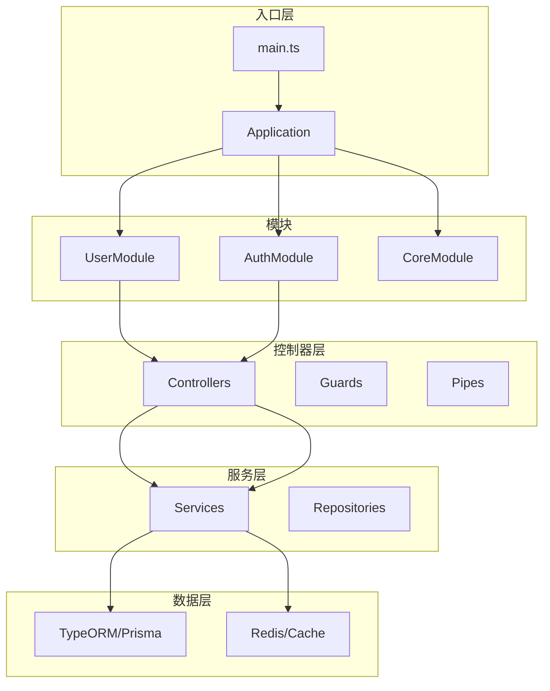
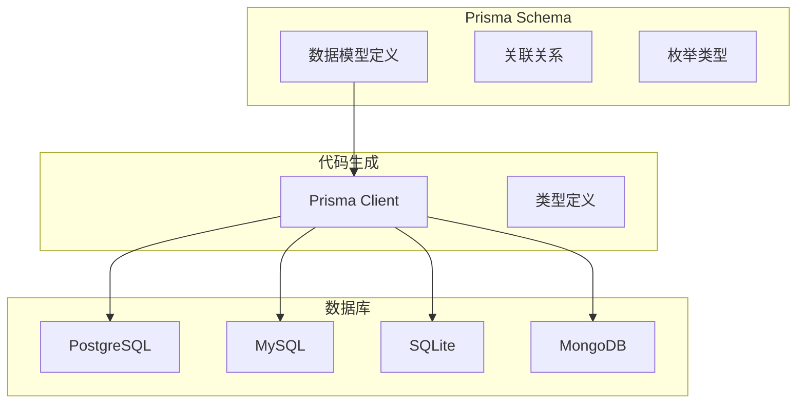
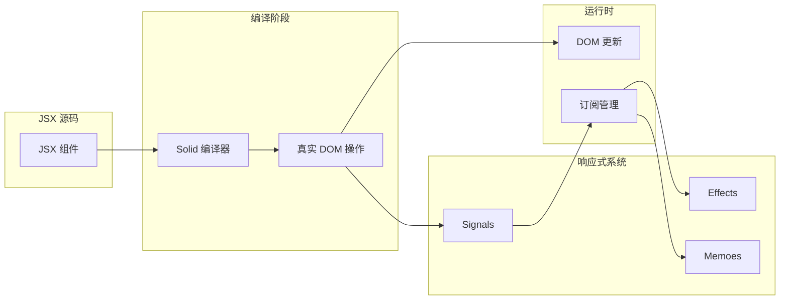
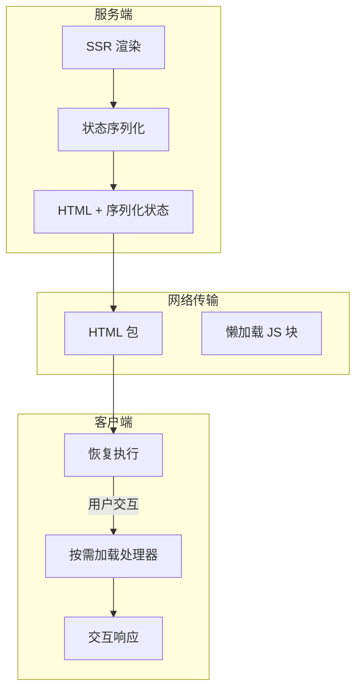
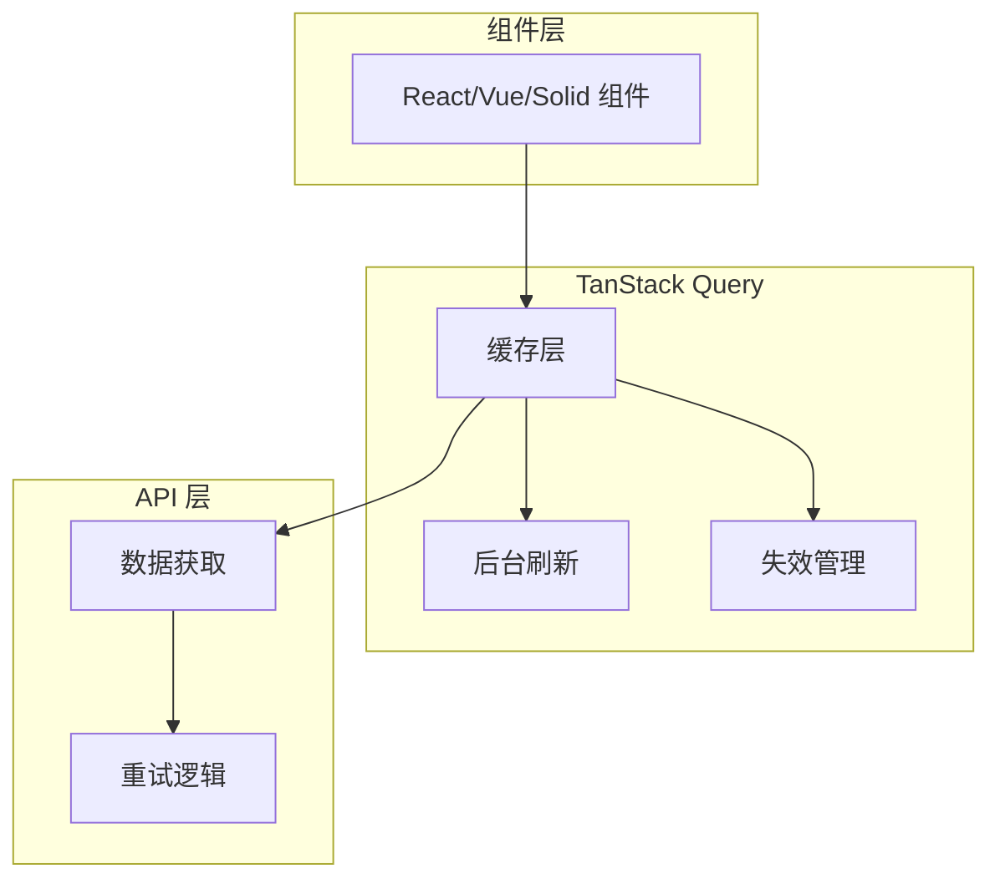

# 全栈、后端与响应式框架

> 本文是「新兴趋势」系列第 2 篇（共 4 篇）。上一篇：[AI 开发工具与协议](ai-dev-tools.md)　下一篇：[构建、样式与工具链](build-and-toolchain.md)

## 1. React 全栈框架

### 1.1 Next.js 15/16

**核心创新点**:

Next.js 已成为 React 全栈的标准答案：

1. **App Router**: 文件系统路由 + 服务端组件 (RSC)
2. **React Server Components**: 服务端数据获取，零客户端 JS
3. **Server Actions**: 表单处理和 mutations 的新方式
4. **Streaming SSR**: 流式 HTML，边加载边显示
5. **Turbopack 集成**: 开发环境 10x 提速

**技术架构图**:



**竞品对比**:

| 维度 | Next.js | Remix | Astro | Nuxt |
|------|---------|-------|-------|------|
| GitHub Stars | 125K+ | 32K+ | 44K+ | 55K+ |
| 周下载量 | 35M+ | 2M+ | 3M+ | 5M+ |
| 渲染模式 | SSR/SSG/ISR | SSR | MPA/Islands | SSR/SSG |
| 服务端 | Node.js/Edge | 任意 | 任意 | Node.js |
| 数据获取 | RSC/Actions | loader | 静态/SSR | useAsyncData |
| 学习曲线 | 中等 | 低 | 低 | 中等 |
| 适用场景 | 企业应用 | 内容站 | 内容站 | 通用 |

**快速开始**:

```bash
npx create-next-app@latest my-app --typescript --tailwind --eslint
cd my-app
npm run dev
```

**App Router 示例**:

```typescript
// app/users/[id]/page.tsx
// 这个组件在服务端渲染
import { notFound } from 'next/navigation'

interface Props {
  params: { id: string }
}

// 服务端组件 - 直接访问数据库
async function getUser(id: string) {
  const res = await fetch(`https://api.example.com/users/${id}`, {
    next: { revalidate: 3600 } // 1小时缓存
  })
  if (!res.ok) return null
  return res.json()
}

export default async function UserPage({ params }: Props) {
  const user = await getUser(params.id)

  if (!user) {
    notFound()
  }

  return (
    <div>
      <h1>{user.name}</h1>
      <p>{user.email}</p>
    </div>
  )
}
```

**Server Actions 示例**:

```typescript
// app/actions.ts
'use server'

import { revalidatePath } from 'next/cache'

export async function createPost(formData: FormData) {
  const title = formData.get('title') as string
  const content = formData.get('content') as string

  await db.post.create({ data: { title, content } })

  revalidatePath('/posts')
}
```

```tsx
// app/new-post/page.tsx
import { createPost } from '../actions'

export default function NewPost() {
  return (
    <form action={createPost}>
      <input name="title" placeholder="标题" />
      <textarea name="content" placeholder="内容" />
      <button type="submit">发布</button>
    </form>
  )
}
```

**性能对比**:

| 指标 | Pages Router | App Router |
|------|--------------|------------|
| 首屏加载 | 基准 | 30%+ 提升 |
| JS Bundle | 较大 | 更小 (RSC) |
| 数据获取 | getServerSideProps | 直接 async/await |
| 缓存策略 | 灵活 | 更细粒度 |

**生态统计**:

- 125K+ GitHub stars
- 35M+ 周下载量
- 最大的 React 生态框架
- Vercel 官方维护

**参考链接**:

- [Next.js 官网](https://nextjs.org)
- [Next.js GitHub](https://github.com/vercel/next.js)

---

### 1.2 Astro

**核心创新点**:

Astro 专注于内容密集型网站，"只发送必要的 JavaScript"：

1. **Island Architecture**: 页面大部分静态，只有交互部分hydrate
2. **多框架支持**: React/Vue/Svelte/Solid 可以共存
3. **Content Collections**: Markdown/MDX 内容管理
4. **零 JS 默认**: 静态页面不发送任何 JS

**快速开始**:

```bash
npm create astro@latest my-site
cd my-site
npm run dev
```

**Island 示例**:

```astro
---
// src/pages/index.astro
import ReactCounter from '../components/Counter.jsx'
import VueCounter from '../components/Counter.vue'
---

<!-- 静态 HTML，无 JS -->
<h1>欢迎来到我的网站</h1>

<!-- 只这个组件会执行 React -->
<ReactCounter client:visible />

<!-- 只这个组件会执行 Vue -->
<VueCounter client:visible />
```

**内容集合示例**:

```typescript
// src/content/config.ts
import { defineCollection, z } from 'astro:content'

const blog = defineCollection({
  type: 'content',
  schema: z.object({
    title: z.string(),
    pubDate: z.date(),
    description: z.string()
  })
})

export const collections = { blog }
```

```astro
---
// src/pages/blog/[...slug].astro
import { getCollection } from 'astro:content'

export async function getStaticPaths() {
  const posts = await getCollection('blog')
  return posts.map(post => ({
    params: { slug: post.slug },
    props: { post }
  }))
}

const { post } = Astro.props
const { Content } = await post.render()
---

<article>
  <h1>{post.data.title}</h1>
  <Content />
</article>
```

**参考链接**:

- [Astro 官网](https://astro.build)
- [Astro GitHub](https://github.com/withastro/astro)

---

### 1.3 Remix

**核心创新点**:

Remix 回归 Web 标准，强调 loader/action 模式：

1. **嵌套路由**: 声明式数据加载
2. **错误边界**: 按路由的错误处理
3. **Web 标准**: Fetch/Request/Response 而非框架抽象
4. **渐进增强**: 即使 JS 失败也能工作

**Loader/Action 模式**:

```typescript
// app/routes/posts.$id.tsx
// 第 1 段：依赖导入与文件角色（确定这段路由“由谁读、由谁写、由谁渲染”）
// `$id` 是 Remix 扁平路由的动态段，会被解析成 params.id 供下面三个导出共享，所以无需手写 URL 解析；
// 同一文件同时导出 loader（读）、action（写）和默认组件（渲染），框架按约定把它们串成一次请求的完整生命周期。
// 易错点：Remix v2 起 LoaderFunctionArgs / ActionFunctionArgs 不再是全局类型，严格模式需从 @remix-run/node 一并导入。
import { json, redirect } from '@remix-run/node'
import { useLoaderData } from '@remix-run/react'

// 第 2 段：服务端数据加载（loader）——在渲染前于 Node 侧执行，可直接访问 db，不会把数据库代码打进浏览器包
// 数据流：params.id（来自 URL）→ findUnique 主键查询 → json() 序列化 → 组件端 useLoaderData 反序列化
// 易错点：查不到必须显式抛 404，否则返回 200 + undefined，前端读 post.title 时崩溃且 HTTP 语义错误
export async function loader({ params }: LoaderFunctionArgs) {
  const post = await db.post.findUnique({
    where: { id: params.id } // 命中唯一索引，单条查询复杂度 O(log n)，不存在 N+1 问题
  })

  // 抛 Response 而非 return，是 Remix 的约定：最近的路由 ErrorBoundary 会接住它并渲染错误页
  if (!post) {
    throw new Response('Not Found', { status: 404 })
  }

  // 只返回页面真正需要的字段，避免把敏感列（作者邮箱、草稿标记等）顺手序列化给客户端
  return json({ post })
}

// 第 3 段：表单提交处理（action）——与 loader 同文件，天然共享 params；action 只负责“写”，
// 执行完毕框架会自动重跑 loader，所以删除后无需手动刷新列表，redirect 之后拿到的就是最新数据。
// intent 是“单表单多动作”的分发键：按钮的 name/value 会随 formData 提交上来，日后扩展发布/归档只需加分支，不必新增路由。
export async function action({ request, params }: ActionFunctionArgs) {
  const formData = await request.formData() // request 是标准 Web Request，body 只能消费一次
  const intent = formData.get('intent') // 未提交该字段时返回 null，故下面用 === 严格比较，不能靠真值判断

  if (intent === 'delete') {
    // 易错点（安全）：真实项目这里必须先校验登录态与作者归属，否则任何访客都能删帖
    await db.post.delete({ where: { id: params.id } })
    // PRG 模式：把 POST 转成 GET 重定向，避免用户刷新页面时重放删除请求
    return redirect('/posts')
  }

  // 兜底分支：不静默吞掉未知 intent，把错误显式回传前端；此处状态码为 200，若要语义精确可改为 400
  return json({ error: 'Invalid intent' })
}

// 第 4 段：UI 渲染（服务端先渲染一次，再在客户端 hydrate，因此两端都会执行，必须保持纯函数式渲染）
// useLoaderData<typeof loader>() 用 typeof 把 loader 的返回值类型推算到组件，形成端到端类型安全：改 loader 结构此处立刻报错。
// 表单不带 onSubmit / fetch，靠 Remix 的渐进增强自动拦截提交并调用上面的 action，JS 未加载时也能正常提交；
// 注意 name="intent" 与 value="delete" 必须和 action 里的字符串完全一致，改名会静默落入 Invalid intent 分支。
export default function PostPage() {
  const { post } = useLoaderData<typeof loader>()

  return (
    <article>
      <h1>{post.title}</h1>
      <p>{post.content}</p>

      <form method="post">
        <button type="submit" name="intent" value="delete">
          删除
        </button>
      </form>
    </article>
  )
}
```
**参考链接**:

- [Remix 官网](https://remix.run)
- [Remix GitHub](https://github.com/remix-run/remix)

---

### 1.4 React Router v7

**核心创新点**:

React Router v7 合并了 Remix 的 SSR 功能：

1. **SPA + SSR 双模式**: 一个框架，两种体验
2. **Loaders/Actions**: 来自 Remix 的数据模式
3. **TypeScript-first**: 完整类型推导
4. **File-based Routing**: 可选的约定式路由

**v7 架构示例**:

```typescript
// 路由配置
const routes = [
  {
    path: '/users/:id',
    loader: async ({ params }) => {
      return fetchUser(params.id)
    },
    Component: UserPage
  }
]

// UserPage 组件
function UserPage() {
  const user = useLoaderData<typeof loader>()

  return (
    <div>
      <h1>{user.name}</h1>
      <Link to="/users">返回</Link>
    </div>
  )
}
```

**参考链接**:

- [React Router 官网](https://reactrouter.com)
- [React Router v7 发布说明](https://remix.run/blog/react-router-v7)

---

### 1.5 tRPC

**核心创新点**:

tRPC 实现端到端类型安全，无需代码生成：

1. **零Schema**: TypeScript 类型自动推导
2. **无需代码生成**: 直接在函数上定义类型
3. **自动补全**: 客户端获得完整的类型提示
4. **任意传输**: REST, WebSocket, 任意协议

**架构示例**:

```typescript
// server/trpc.ts
import { initTRPC } from '@trpc/server'

const t = initTRPC.create()

export const router = t.router
export const publicProcedure = t.procedure
```

```typescript
// server/routers/user.ts
// 第 1 段：导入依赖 —— 确立本模块的"契约来源"
// router / publicProcedure 来自项目对 tRPC 的二次封装（而非 trpc 官方包），
// 因此鉴权中间件、错误格式、日志等横切逻辑都收敛在 '../trpc' 一处，改一处即全局生效。
// 易错点：本文件直接使用 db 却未在此导入，说明它由全局注入或上层约定提供；
// 若编译报 "Cannot find name 'db'"，要查全局声明而不是在这里补 import。
import { router, publicProcedure } from '../trpc'
import { z } from 'zod'

// 第 2 段：组装并导出 userRouter —— 路由表的唯一出口
// 以对象字面量一次性声明全部过程（procedure），键名即客户端调用路径 `user.getById` / `user.create`。
// 这种"声明式聚合"让路由清单可静态扫描（tRPC 靠它推导前端类型），所以不要用循环动态拼 key，
// 否则类型推断会退化成 any，前端拿不到自动补全。
export const userRouter = router({
  // 第 3 段：getById —— 读操作（query）
  // 用 query 而非 mutation，是为了让 tRPC/React Query 走缓存与去重：同 id 的重复请求只发一次。
  // 数据流：客户端参数 → input 校验 → input 透传给 db → 返回记录或 null，全程无副作用。
  // 边界：findUnique 只按唯一键查，走主键索引，复杂度 O(log n)；查不到时返回 null 而非抛错，
  // 所以调用方必须自行判空，不能假设一定有值。
  getById: publicProcedure
    .input(z.object({ id: z.string() })) // 运行时校验；只约束"是字符串"，非空/格式（如 cuid）由 DB 兜底
    .query(async ({ input }) => {
      return db.user.findUnique({
        where: { id: input.id }
      })
    }),

  // 第 4 段：create —— 写操作（mutation）
  // 用 mutation 是因为它有意副作用（落库），tRPC 会据此在客户端串行化并触发缓存失效。
  // 关键点：校验规则与"字段名"必须和下面 db.user.create 的入参完全对齐，
  // 才能把 input 整体当作 data 直接透传——少写一次字段搬运，也就少一处漂移风险。
  // 易错点：name 只做了类型校验，空字符串 "" 仍能通过；真实业务通常需要 .min(1).trim()。
  // email 的 .email() 只是格式启发式校验，唯一性冲突要交给 DB 约束并在调用层捕获错误。
  create: publicProcedure
    .input(z.object({
      name: z.string(),
      email: z.string().email() // 校验通过后的 input 类型会被自动收窄并同步到前端，无需手写类型
    }))
    .mutation(async ({ input }) => {
      return db.user.create({ data: input }) // data 直接复用 input：zod 已保证形状匹配，且杜绝了多余字段注入
    })
})
```
```typescript
// client/hooks/useUser.ts
import { createTRPCReact } from '@trpc/react-query'
import type { AppRouter } from '../server'

export const trpc = createTRPCReact<AppRouter>()

// 完整类型安全，自动补全
const user = await trpc.user.getById.query({ id: '123' })
//                         ^ 自动推导: { id: string }
```

**竞品对比**:

| 维度 | tRPC | GraphQL | REST+OpenAPI |
|------|------|---------|--------------|
| 类型安全 | 完整 | 需要 codegen | 有限 |
| 学习曲线 | 低 | 中 | 低 |
| 灵活性 | 中 | 高 | 高 |
| 生态系统 | 增长中 | 成熟 | 成熟 |
| 适用场景 | TS 全栈 | 多客户端 | 通用 |

**参考链接**:

- [tRPC 官网](https://trpc.io)
- [tRPC GitHub](https://github.com/trpc/trpc)

## 2. Node.js 后端框架

### 2.1 NestJS

**核心创新点**:

NestJS 是渐进式 Node.js 框架，借鉴 Angular 的依赖注入：

1. **模块化架构**: 功能模块化，易于组织
2. **依赖注入**: 自动化依赖管理
3. **Decorator 模式**: 类+装饰器定义路由/服务
4. **TypeScript-first**: 完整类型安全
5. **微服务支持**: 内置 gRPC, RabbitMQ, Redis 等适配器

**技术架构图**:



**快速开始**:

```bash
npm i -g @nestjs/cli
nest new project-name
cd project-name
npm run start:dev
```

**完整示例**:

```typescript
// user.entity.ts
// 第 1 段：导入 TypeORM 装饰器（引入元数据工具）
import { Entity, Column, PrimaryGeneratedColumn } from 'typeorm'
// Entity 让类与表建立映射，Column 声明普通字段，PrimaryGeneratedColumn 声明自增/自动生成的主键列。
// 注意：这里只导入装饰器本身，TypeORM 的运行时扫描依赖 reflect-metadata，因此 tsconfig 必须开启
// emitDecoratorMetadata 与 experimentalDecorators，否则装饰器写入的元数据会在运行时丢失。

// 第 2 段：把类注册成数据库实体（建立"类 <-> 表"的映射入口）
@Entity()
export class User {
  // @Entity() 不带参数时，TypeORM 默认用类名（或其蛇形/复数转换策略）作为表名；
  // export 是必要的，因为实体扫描与依赖注入通常从模块外部引用这个类。
  // 该类是纯元数据载体，运行时只承载"形状"，真正的读写要靠 Repository/DataSource 完成。

  // 第 3 段：主键（行唯一身份）
  @PrimaryGeneratedColumn('uuid')
  id: string
  // 用 'uuid' 而非自增整数，是为了在分布式/多库场景下不依赖数据库自增序列，
  // 也让主键在写入前（或客户端侧）即可生成，避免"插入后才拿到 id"的往返。
  // 易错点：TS 类型写作 string 且不加 `!`，在 strict 模式下赋值前访问会被判为未初始化；
  // 这里的 id 由数据库/TypeORM 生成，业务代码不应手动赋值或作为可写字段暴露。

  // 第 4 段：业务唯一键（email）
  @Column({ unique: true })
  email: string
  // unique: true 会生成唯一约束（或唯一索引，取决于 TypeORM 版本与同步策略），
  // 把"同一邮箱只能有一个用户"这条业务规则下沉到数据库层，防止并发注册时应用层查重失败。
  // 注意：唯一约束被违反时抛的是数据库驱动错误（如 Postgres 23505），需要在上层捕获并转成友好提示。

  // 第 5 段：普通展示字段（name）
  @Column()
  name: string
  // 不加任何选项即使用默认推断：非空、类型由反射元数据（string -> varchar）决定。
  // 边界条件：TypeORM 默认长度依数据库而异（如 varchar(255)），若姓名可能超长需显式指定 length 或 text。

  // 第 6 段：带默认值的状态字段（isActive）
  @Column({ default: false })
  isActive: boolean
  // 默认值走数据库层面（列 DEFAULT），因此用 SQL 直接插入的行也会得到 false，行为一致。
  // 易错点：若代码里把 isActive 设为 undefined 再 save，TypeORM 可能忽略该列而非写入 false；
  // 同时布尔列在不同数据库的底层表示不同（Postgres 用 boolean，MySQL 用 tinyint(1)）。
}
```
```typescript
// users.service.ts

// 第 1 段：依赖导入（把 Nest 的装饰器、TypeORM 的注入器与仓库类型，以及本模块实体引入当前文件）
// 为什么这样写：Service 只依赖「仓库抽象」Repository<User>，不直接碰数据库连接，
// 这样单元测试时可以用 mock repo 替换，业务逻辑与持久化实现解耦。
// 易错点：@nestjs/typeorm 提供的是 InjectRepository/InjectEntityManager 装饰器，别和 typeorm 包里的同名导出搞混。
import { Injectable, NotFoundException } from '@nestjs/common'
import { InjectRepository } from '@nestjs/typeorm'
import { Repository } from 'typeorm'
import { User } from './user.entity'

// 第 2 段：声明可被 DI 容器管理的服务类
// @Injectable() 让 Nest 在启动时把该类注册进 IoC 容器，从而支持构造器注入；
// 缺少它时依赖解析会在运行时报 "Nest can't resolve dependencies" 之类的错误。
@Injectable()
export class UsersService {
  // 第 3 段：构造器注入实体仓库（本类的唯一数据入口）
  // @InjectRepository(User) 用元数据告诉 Nest「这里要注入的是 User 实体的 Repository」，
  // 因为仅凭 TS 类型 Repository<User> 在运行时已被擦除，容器无法自行推断泛型参数。
  // 数据流：TypeORM DataSource 按实体创建/复用 Repository → 注入到 usersRepo → 后续方法全部经它访问 user 表。
  constructor(
    @InjectRepository(User)
    private usersRepo: Repository<User>
  ) {}

  // 第 4 段：查询全部用户（无参透传，最薄的一层包装）
  // 这里只是把调用转发给仓库，没有额外业务规则，所以复杂度就是一次全表查询 O(n)（n = 返回行数）。
  // 边界条件：数据量大时 find() 会一次性把整表加载进内存，生产环境通常需要加分页/过滤参数，切勿直接照搬到线上。
  async findAll(): Promise<User[]> {
    return this.usersRepo.find()
  }

  // 第 5 段：按主键查询单个用户，并把「查不到」翻译成 HTTP 语义
  // 关键意图：仓储层返回 null 表示「无此记录」，而 HTTP 层需要 404，所以在这里做 null → 异常的转换，
  // 让 Controller 保持无脑调用，错误处理集中在 Service。
  // 易错点：findOne 在 TypeORM 0.3 里必须写成 { where: { id } }，旧版写法 findOne(id) 已废弃；
  // 另外这里不复用 find() 再过滤，是为了让 SQL 走主键索引，把查找压到 O(1)（B 树查找），而不是 O(n) 内存扫描。
  async findOne(id: string): Promise<User> {
    const user = await this.usersRepo.findOne({ where: { id } })
    if (!user) {
      throw new NotFoundException(`User ${id} not found`)
    }
    return user
  }

  // 第 6 段：创建用户（先内存建实体、再落库）
  // 为什么分两步：create() 只做「对象 → 实体实例」的转换（补齐默认值、应用列转换器），不产生 SQL；
  // save() 才真正 INSERT 并回填数据库生成的字段（如自增 id、createdAt），
  // 所以返回的对象是带完整主键的，可直接给前端用。
  // 易错点：入参类型是 Partial<User>，客户端理论上能塞进 id 等敏感列（批量赋值风险），
  // 严谨做法是先经 DTO 白名单裁剪再交给 create。
  async create(data: Partial<User>): Promise<User> {
    const user = this.usersRepo.create(data)
    return this.usersRepo.save(user)
  }

  // 第 7 段：更新用户（读—改—写三步，而非直接 UPDATE）
  // 为什么先 findOne：一是借用它统一抛 404，避免对不存在的 id 静默写入；
  // 二是拿到完整实体后 merge，保证 save() 走「实体已有主键 ⇒ UPDATE」分支而不是又插一条。
  // 数据流：findOne 取出托管/游离实体 → Object.assign 把补丁字段覆盖上去 → save 触发 UPDATE（仅脏列）。
  // 易错点：Object.assign 是浅合并且不校验字段，未传的字段保持原值（符合 PATCH 语义），
  // 但同样存在批量赋值风险，且无法表达「把某字段显式置为 null」这类语义，需要时可改用 QueryBuilder。
  // 复杂度：findOne 一次主键查询 + save 一次更新，整体 O(1)（不含索引开销）。
  async update(id: string, data: Partial<User>): Promise<User> {
    const user = await this.findOne(id)
    Object.assign(user, data)
    return this.usersRepo.save(user)
  }
}
```
```typescript
// users.controller.ts
import {
  Controller, Get, Post, Put, Delete,
  Param, Body, UseGuards
} from '@nestjs/common'
import { UsersService } from './users.service'
import { JwtAuthGuard } from '../auth/jwt-auth.guard'
import { CreateUserDto, UpdateUserDto } from './dto'

@Controller('users')
@UseGuards(JwtAuthGuard)
export class UsersController {
  constructor(private readonly usersService: UsersService) {}

  @Get()
  findAll() {
    return this.usersService.findAll()
  }

  @Get(':id')
  findOne(@Param('id') id: string) {
    return this.usersService.findOne(id)
  }

  @Post()
  create(@Body() dto: CreateUserDto) {
    return this.usersService.create(dto)
  }

  @Put(':id')
  update(@Param('id') id: string, @Body() dto: UpdateUserDto) {
    return this.usersService.update(id, dto)
  }

  @Delete(':id')
  delete(@Param('id') id: string) {
    return this.usersService.remove(id)
  }
}
```

```typescript
// users.module.ts
import { Module } from '@nestjs/common'
import { TypeOrmModule } from '@nestjs/typeorm'
import { User } from './user.entity'
import { UsersService } from './users.service'
import { UsersController } from './users.controller'

@Module({
  imports: [TypeOrmModule.forFeature([User])],
  controllers: [UsersController],
  providers: [UsersService],
  exports: [UsersService]
})
export class UsersModule {}
```

**NestJS vs Express vs Fastify**:

| 维度 | NestJS | Express | Fastify |
|------|--------|---------|---------|
| 架构 | 模块化 | 极简 | 插件化 |
| 类型安全 | TypeScript-first | 可选 TS | 可选 TS |
| 性能 | 中等 | 高 | 最高 |
| 学习曲线 | 中等 | 低 | 低 |
| 依赖注入 | 原生支持 | 手动 | 手动 |
| 适用场景 | 企业级 | 轻量 API | 高性能 API |

**生态统计**:

- 60K+ GitHub stars
- 3M+ 周下载量
- 企业级应用首选

**参考链接**:

- [NestJS 官网](https://nestjs.com)
- [NestJS GitHub](https://github.com/nestjs/nest)

---

### 2.2 TypeORM

**核心创新点**:

TypeORM 是 Node.js 生态最成熟的 ORM：

1. **Active Record + Data Mapper**: 两种模式可选
2. **TypeScript 支持**: 实体类自动类型推导
3. **迁移系统**: 数据库版本控制
4. **关联管理**: 一对多、多对多自动处理

**快速开始**:

```bash
npm install typeorm reflect-metadata
npm install pg # PostgreSQL 驱动
```

**实体定义**:

```typescript
import {
  Entity, PrimaryGeneratedColumn, Column,
  CreateDateColumn, UpdateDateColumn,
  OneToMany, ManyToOne, JoinColumn
} from 'typeorm'

// 第 1 段：声明数据库实体并绑定表名
// @Entity('posts') 的参数是真实表名，不是类名；不传则 TypeORM 会按类名推导（Post -> post，注意不是 posts），
// 显式指定表名可以避免命名策略（namingStrategy）变化导致表名漂移，也让迁移脚本与代码对得上。
@Entity('posts')
export class Post {
  // 第 2 段：主键生成策略
  // 用 uuid 而非自增整数，好处是主键可在入库前于应用层生成，便于分库分表、批量插入和对外暴露 ID 时
  // 不泄露业务规模；代价是索引体积更大、失去天然的写入顺序（B+ 树页分裂更频繁）。
  @PrimaryGeneratedColumn('uuid')
  id: string

  // 第 3 段：核心业务列
  // 不传参数时 TypeORM 依据 TS 反射类型推断列类型（这里 string -> varchar，默认长度 255）；
  // 若标题可能超过 255 字符，应显式写成 @Column('varchar', { length: 500 })。
  @Column()
  title: string

  // 第 4 段：正文使用不定长文本
  // 显式声明 'text' 是为了拿到 TEXT/LONGTEXT 这类大字段类型：默认 varchar(255) 存正文必然被截断或报错；
  // 让数据库层而非应用层来承担长度校验，是更可靠的一道防线。
  @Column('text')
  content: string

  // 第 5 段：时间戳由数据库/TypeORM 自动维护
  // 这两个装饰器在 insert/update 时自动填值，业务代码无需手动 set，避免"忘记更新时间"。
  // 易错点：批量更新（update()/queryBuilder）多数情况下不会触发 @UpdateDateColumn，需要手动赋值。
  @CreateDateColumn()
  createdAt: Date

  @UpdateDateColumn()
  updatedAt: Date

  // 第 6 段：软状态字段与默认值
  // default: true 的约束落在数据库 DDL 上，因此直接走 SQL 插入也会得到 true；
  // 用布尔位而非物理删除，配合查询过滤可实现"下架但不丢数据"，代价是每条查询都必须记得带上 published 条件。
  @Column({ default: true })
  published: boolean

  // 第 7 段：多对一关系——Post 属于一个 User
  // 第一个参数是"目标实体工厂函数"(() => User)，写成箭头函数是为了延迟求值，打断两个实体文件之间的循环引用；
  // 第二个参数是反向侧：告诉 TypeORM User.posts 才是这条关系的另一端，双向关系必须两边都声明才能正确 join。
  @ManyToOne(() => User, (user) => user.posts)
  // @JoinColumn 只在"多"的一端生效，它决定外键列的真实名字；
  // 这里的 'authorId' 必须与下面显式声明的 @Column() authorId 完全一致，否则会生成两个列或关系错位。
  @JoinColumn({ name: 'authorId' })
  author: User

  // 第 8 段：显式暴露外键列
  // 单独声明 authorId 是刻意为之：只写关系属性时，要拿作者 ID 就必须先 load 出整个 User，
  // 有了这一列就能 `post.authorId` 零成本读取，也方便直接按 ID 建索引和过滤。
  // 注意该列不由 TypeORM 自动从 author 同步赋值，两者可能不一致，写入时应自行保证一致性。
  @Column()
  authorId: string

  // 第 9 段：一对多关系——一个 Post 有多条 Comment
  // OneToMany 是关系的"虚拟端"，不会在 posts 表产生任何列，外键由 Comment.post 那一侧的 ManyToOne 维护；
  // 这是 TypeORM 的硬性约束：只写 OneToMany 而不在对方写 ManyToOne，迁移时会直接报错。
  // 另外该属性默认不会被查询加载（未配置 eager/relations 时是 undefined），
  // 在 strictPropertyInitialization 下这类"引擎填充"的字段通常需要 ! 断言或初始化，此处保持原样由调用方保证。
  @OneToMany(() => Comment, (comment) => comment.post)
  comments: Comment[]
}
```
**查询示例**:

```typescript
// Repository 模式
const postRepo = dataSource.getRepository(Post)

// 基础查询
const posts = await postRepo.find({
  where: { published: true },
  order: { createdAt: 'DESC' },
  take: 10
})

// 复杂查询
const userWithPosts = await postRepo.findOne({
  where: { id: postId },
  relations: ['author', 'comments', 'comments.author']
})

// QueryBuilder
const result = await postRepo
  .createQueryBuilder('post')
  .leftJoinAndSelect('post.author', 'author')
  .where('post.published = :published', { published: true })
  .andWhere('post.createdAt > :date', { date: lastWeek })
  .orderBy('post.createdAt', 'DESC')
  .getMany()
```

**参考链接**:

- [TypeORM 官网](https://typeorm.io)
- [TypeORM GitHub](https://github.com/typeorm/typeorm)

---

### 2.3 Prisma

**核心创新点**:

Prisma 提供类型安全的数据库访问：

1. **Schema-first**: 定义 schema 自动生成客户端
2. **Prisma Client**: 强类型的查询 API
3. **迁移系统**: 可视化 + CLI 迁移
4. **Prisma Studio**: 图形化数据库管理

**架构图**:



**Schema 定义**:

```prisma
// prisma/schema.prisma
generator client {
  provider = "prisma-client-js"
}

datasource db {
  provider = "postgresql"
  url      = env("DATABASE_URL")
}

model User {
  id        String   @id @default(cuid())
  email     String   @unique
  name      String?
  posts     Post[]
  createdAt DateTime @default(now())
  updatedAt DateTime @updatedAt
}

model Post {
  id        String   @id @default(cuid())
  title     String
  content   String?
  published Boolean  @default(false)
  author    User     @relation(fields: [authorId], references: [id])
  authorId  String
  createdAt DateTime @default(now())
  updatedAt DateTime @updatedAt

  @@index([authorId])
}
```

**查询示例**:

```typescript
import { PrismaClient } from '@prisma/client'
const prisma = new PrismaClient()

// 创建
const user = await prisma.user.create({
  data: {
    email: 'alice@example.com',
    name: 'Alice',
    posts: {
      create: {
        title: 'Hello World',
        content: 'My first post'
      }
    }
  },
  include: { posts: true }
})

// 查询
const posts = await prisma.post.findMany({
  where: { published: true },
  include: { author: true },
  orderBy: { createdAt: 'desc' }
})

// 关联更新
await prisma.user.update({
  where: { id: userId },
  data: {
    posts: {
      update: {
        where: { id: postId },
        data: { published: true }
      }
    }
  }
})
```

**Prisma vs TypeORM**:

| 维度 | Prisma | TypeORM |
|------|--------|---------|
| 配置方式 | Schema 文件 | TypeScript 装饰器 |
| 类型安全 | 完整自动推导 | 需要手动维护 |
| 迁移体验 | 优秀 | 中等 |
| 查询构建 | 链式 API | QueryBuilder + Repository |
| 性能 | 中等 | 略好 |
| 适用场景 | 新项目 | 已有项目 |

**生态统计**:

- 34K+ GitHub stars
- 15M+ 周下载量
- 持续活跃开发

**参考链接**:

- [Prisma 官网](https://prisma.io)
- [Prisma GitHub](https://github.com/prisma/prisma)

---

### 2.4 Drizzle ORM

**核心创新点**:

Drizzle 是轻量级、SQL-first 的 TypeScript ORM：

1. **极小体积**: ~7KB gzip
2. **SQL-like 语法**: 学习成本低
3. **Serverless 友好**: 支持 Edge、Cloudflare Workers
4. **多数据库**: PostgreSQL, MySQL, SQLite, PlanetScale

**Schema 定义**:

```typescript
import { pgTable, serial, text, timestamp, boolean, uuid } from 'drizzle-orm/pg-core'

// 第 1 段：定义数据表（从 schema 到 SQL 的唯一入口）
// pgTable 是 Drizzle 的「表定义工厂」：它只描述结构，本身不连数据库，
// 真正的建表 SQL 由 drizzle-kit 依据这些元数据生成，因此这里也是类型的唯一来源。
// 注意导入项全部来自 pg-core（PostgreSQL 方言），换成 MySQL/SQLite 需要换成对应的 core 包，
// 但表定义写法几乎一致——这是 Drizzle 把「方言差异」和「schema 描述」解耦的设计。

export const users = pgTable('users', {
  // 第 2 段：用户表 —— 用 uuid 做主键
  // 选 uuid 而不是自增整数，是为了让 ID 在分布式写入、外部暴露（URL/API）时不泄露规模与顺序；
  // defaultRandom() 会落到数据库的 gen_random_uuid()，因此插入时无需应用层生成，避免多实例时钟/随机源不一致。
  id: uuid('id').primaryKey().defaultRandom(),
  // email 双重约束：notNull 保证必填，unique 会额外创建唯一索引，既做数据校验也能加速按邮箱查询；
  // 代价是每次插入都要走一次索引检查（O(log n)），且重复注册会抛数据库层错误而非返回布尔值。
  email: text('email').notNull().unique(),
  // name 允许为 NULL：这里刻意不写 notNull，代表「可选」而不是「空字符串」，
  // 后续查询要用 IS NULL / IS NOT NULL 判断，注意它无法参与 notNull 约束相关的类型收窄。
  name: text('name'),
  // createdAt 用「数据库侧默认值」而非应用层传参：即便有人绕过 ORM 直接写 SQL，时间也不会缺失；
  // timestamp 默认是 without time zone，若要做跨时区业务建议改成 { withTimezone: true }，否则时区信息会丢。
  createdAt: timestamp('created_at').defaultNow().notNull()
})

export const posts = pgTable('posts', {
  // 第 3 段：文章表 —— 用 serial 做主键
  // serial 等价于 integer + 自增序列，自增整数索引更紧凑、顺序写入对 B-tree 更友好；
  // 这里与 users 的 uuid 主键不一致是有意为之：内部表追求存储/连接效率，对外暴露的表才需要不可猜测。
  id: serial('id').primaryKey(),
  title: text('title').notNull(),
  // content 可为 NULL：区分「还没写内容」和「写了空串」，业务上影响渲染分支。
  content: text('content'),
  // published 用 boolean + 数据库默认 false 实现「默认草稿」：默认值放在 DB 层，
  // 保证任何插入路径（迁移脚本、后台任务）都得到一致语义；同时它在 Java/JS 侧是真正的 boolean，不需 0/1 转换。
  published: boolean('published').default(false).notNull(),
  // 第 4 段：外键关联 —— 通过闭包引用 users.id
  // 必须写成 () => users.id 这种惰性回调，而不是直接写 users.id：
  // 一是两个表定义若互相引用会形成循环依赖，二是确保 users 已初始化后再取值，避免 TDZ/提升问题。
  // 该声明会生成 REFERENCES users(id) 约束，插入不存在的 authorId 会被数据库拒绝。
  // 两个易错点：① 未写 onDelete，默认是 NO ACTION，删用户会因仍有文章而失败，按业务可能需要 cascade/set null；
  // ② 可为空（未加 notNull）= 允许匿名/已删除作者，若业务要求每篇文章必有作者，需补 notNull。
  authorId: uuid('author_id').references(() => users.id),
  createdAt: timestamp('created_at').defaultNow().notNull()
})

// 补充说明（不产生任何 SQL）：Postgres 不会自动为外键列建索引，
// 若存在「按作者查文章」这类高频查询，需要额外声明 index('posts_author_id_idx').on(posts.authorId)，
// 否则删除用户时的外键校验会退化为全表扫描（O(n)）。
```
**查询示例**:

```typescript
import { eq, desc, and, like } from 'drizzle-orm'

// 基础查询
const allUsers = await db.select().from(users)

// 条件查询
const activeUsers = await db
  .select()
  .from(users)
  .where(and(
    eq(users.active, true),
    like(users.email, '%@example.com')
  ))
  .orderBy(desc(users.createdAt))

// 关联查询
const userWithPosts = await db
  .select()
  .from(users)
  .leftJoin(posts, eq(users.id, posts.authorId))
  .where(eq(users.id, userId))
```

**Drizzle vs Prisma**:

| 维度 | Drizzle | Prisma |
|------|---------|--------|
| 体积 | ~7KB | 较大 |
| 语法 | SQL-like | Chainable |
| 迁移 | CLI | CLI + Studio |
| 性能 | 更优 | 中等 |
| 学习曲线 | 低 (懂 SQL) | 低 |
| Edge 支持 | 优秀 | 良好 |
| 适用场景 | 性能敏感 | 快速开发 |

**生态统计**:

- 17K+ GitHub stars
- 2M+ 周下载量
- 快速增长

**参考链接**:

- [Drizzle 官网](https://orm.drizzle.team)
- [Drizzle GitHub](https://github.com/drizzle-team/drizzle-orm)

---

### 2.5 Fastify

**核心创新点**:

Fastify 是高性能 Node.js Web 框架：

1. **极致性能**: 比 Express 快 2x
2. **Plugin 系统**: 生态模块化
3. **Schema 验证**: 内置 JSON Schema 支持
4. **TypeScript 支持**: 完整类型推导

**快速开始**:

```bash
npm install fastify
```

**示例**:

```typescript
import Fastify from 'fastify'
import cors from '@fastify/cors'

const fastify = Fastify({ logger: true })

// 注册插件
await fastify.register(cors, { origin: true })

// 路由
fastify.get('/users/:id', async (request, reply) => {
  const { id } = request.params
  const user = await getUser(id)

  if (!user) {
    reply.code(404)
    return { error: 'User not found' }
  }

  return user
})

// JSON Schema 验证
const userSchema = {
  body: {
    type: 'object',
    required: ['email', 'password'],
    properties: {
      email: { type: 'string', format: 'email' },
      password: { type: 'string', minLength: 8 }
    }
  }
}

fastify.post('/users', { schema: userSchema }, async (request, reply) => {
  const { email, password } = request.body
  const user = await createUser({ email, password })
  reply.code(201)
  return user
})

// 启动
const start = async () => {
  try {
    await fastify.listen({ port: 3000 })
    console.log('Server running at http://localhost:3000')
  } catch (err) {
    fastify.log.error(err)
    process.exit(1)
  }
}

start()
```

**性能对比**:

| 框架 | 请求/秒 | 延迟 (p99) |
|------|---------|-----------|
| Fastify | 75,000+ | 2ms |
| Express | 30,000+ | 8ms |
| Koa | 40,000+ | 5ms |

**参考链接**:

- [Fastify 官网](https://fastify.io)
- [Fastify GitHub](https://github.com/fastify/fastify)

## 3. Signal 响应式框架

### 3.1 Solid.js

**核心创新点**:

Solid.js 使用细粒度响应式，绕过 Virtual DOM：

1. **编译时优化**: JSX 编译成真实 DOM 操作
2. **组件运行一次**: 组件函数只执行一次
3. **自动依赖追踪**: 访问响应式状态自动订阅
4. **无 Virtual DOM**: 性能接近原生 JavaScript

**技术架构图**:



**React vs Solid 对比**:

```typescript
// React
function Counter() {
  const [count, setCount] = useState(0)

  useEffect(() => {
    console.log(count) // 每次渲染都运行
  }, [count])

  return <button onClick={() => setCount(c => c + 1)}>{count}</button>
}

// Solid
function Counter() {
  const [count, setCount] = createSignal(0)

  createEffect(() => {
    console.log(count()) // 只在 count 变化时运行
  })

  return <button onClick={() => setCount(c => c + 1)}>{count()}</button>
}
```

**快速开始**:

```bash
npm create solid@latest my-app
cd my-app
npm run dev
```

**核心 API**:

```typescript
import { createSignal, createEffect, createMemo, createStore } from 'solid-js'

// 基础信号
const [count, setCount] = createSignal(0)
count() // 读取
setCount(1) // 写入

// 计算值
const doubled = createMemo(() => count() * 2)

// 副作用
createEffect(() => {
  console.log('Count changed:', count())
})

// 响应式对象
const [state, setState] = createStore({ name: 'Solid', version: 1.0 })
setState('name', 'SolidJS') // 嵌套更新
```

**参考链接**:

- [Solid.js 官网](https://solidjs.com)
- [Solid.js GitHub](https://github.com/solidjs/solid)
- [SolidStart](https://start.solidjs.com)

---

### 3.2 Qwik

**核心创新点**:

Qwik 的 Resumability 彻底颠覆 SSR 水合模式：

1. **Resumability**: 服务端序列化状态，客户端从停止处恢复
2. **零初始 JS**: 初始页面无 JavaScript 执行
3. **精度懒加载**: 事件处理器按需加载到函数级别
4. **Core Web Vitals 优化**: 亚秒级页面加载

**技术架构图**:



**Resumability vs Hydration**:

| 维度 | 传统 SSR | Qwik Resumability |
|------|----------|-------------------|
| 水合方式 | 客户端重执行全部 JS | 从序列化状态恢复 |
| 初始 JS | 按组件大小加载 | ~0kb 初始 JS |
| 水合成本 | 与应用大小成正比 | 恒定 (最小开销) |
| 事件绑定 | DOM 事件监听器 | 序列化后懒加载 |

**快速开始**:

```bash
npm create qwik@latest my-app
cd my-app
npm run dev
```

**核心示例**:

```typescript
import { component$, useSignal, $ } from '@builder.io/qwik'

export const Counter = component$(() => {
  const count = useSignal(0)

  return (
    <div>
      <p>Count: {count.value}</p>
      <button
        onClick$={$(() => {
          count.value++
        })}
      >
        Increment
      </button>
    </div>
  )
})
```

**参考链接**:

- [Qwik 官网](https://qwik.dev)
- [Qwik GitHub](https://github.com/QwikDev/qwik)

---

### 3.3 Svelte 5

**核心创新点**:

Svelte 5 的 Runes 模式带来显式响应式：

1. **$state()**: 响应式状态
2. **$derived()**: 计算值
3. **$effect()**: 副作用
4. **编译器驱动**: 编译时优化

**Svelte 4 vs Svelte 5**:

```svelte
<!-- Svelte 4 -->
<script>
  import { writable } from 'svelte/store'
  let count = writable(0)
  $: doubled = $count * 2

  $: if (count > 10) {
    alert('Count too high!')
  }
</script>

<!-- Svelte 5 (Runes) -->
<script>
  let count = $state(0)
  let doubled = $derived(count * 2)

  $effect(() => {
    if (count > 10) {
      alert('Count too high!')
    }
  })
</script>
```

**快速开始**:

```bash
npm create svelte@latest my-app
# 选择 Svelte 5 + TypeScript
cd my-app
npm run dev
```

**Runes API**:

```typescript
// $state - 响应式状态
let count = $state(0)
let user = $state({ name: 'Svelte', age: 5 })

// $derived - 计算值
let doubled = $derived(count * 2)
let fullName = $derived(`${user.name} ${user.lastName}`)

// $effect - 副作用
$effect(() => {
  document.title = `Count: ${count}`
  return () => {
    // cleanup
  }
})

// $props - 组件 props
export const MyComponent = (props) => {
  const { name, value = 0 } = $props()
}
```

**参考链接**:

- [Svelte 官网](https://svelte.dev)
- [Svelte 5 发布说明](https://svelte.dev/blog/svelte-5)
- [SvelteKit](https://kit.svelte.dev)

---

### 3.4 TanStack Query

**核心创新点**:

TanStack Query (原 React Query) 是服务器状态管理的事实标准：

1. **声明式数据获取**: 自动缓存管理
2. **后台刷新**: 窗口聚焦时自动更新
3. **乐观更新**: 突变操作即时反馈
4. **多框架支持**: React/Vue/Solid/Svelte/Angular

**技术架构图**:



**多框架示例**:

```typescript
// React
import { createQuery } from '@tanstack/react-query'

function Todos() {
  const todos = createQuery({
    queryKey: ['todos'],
    queryFn: () => fetch('/api/todos').then(r => r.json()),
    staleTime: 5 * 60 * 1000 // 5 分钟
  })

  return <ul>{todos.data?.map(t => <li key={t.id}>{t.title}</li>)}</ul>
}

// Solid
import { createQuery } from '@tanstack/solid-query'

function Todos() {
  const todos = createQuery(() => ({
    queryKey: ['todos'],
    queryFn: () => fetch('/api/todos').then(r => r.json())
  }))

  return <ul>{todos.data?.map(t => <li key={t.id}>{t.title}</li>)}</ul>
}
```

**高级特性**:

```typescript
// 乐观更新
const mutation = useMutation({
  mutationFn: updateTodo,
  onMutate: async (newTodo) => {
    await queryClient.cancelQueries(['todos'])
    const previousTodos = queryClient.getQueryData(['todos'])

    queryClient.setQueryData(['todos'], (old) => [...old, newTodo])

    return { previousTodos }
  },
  onError: (err, newTodo, context) => {
    queryClient.setQueryData(['todos'], context.previousTodos)
  },
  onSettled: () => {
    queryClient.invalidateQueries(['todos'])
  }
})

// 无限滚动
const infiniteTodos = useInfiniteQuery({
  queryKey: ['todos'],
  queryFn: ({ pageParam = 0 }) => fetchTodos(pageParam),
  getNextPageParam: (lastPage) => lastPage.nextCursor
})
```

**统计**:

- 20亿+ npm 下载
- 50,000+ GitHub stars
- 500+ 贡献者

**参考链接**:

- [TanStack Query](https://tanstack.com/query)
- [GitHub](https://github.com/TanStack/query)

## 深入阅读与参考

!!! tip "怎么用这些资料"
    先读「官方文档与规范」建立准确的概念，再读「源码与示例」核对细节，最后用「教程、书籍与视频」换一种讲法加深理解。每条都写明了读哪一节、带着什么问题读。

### 官方文档与规范

| 资源 | 为什么读 | 怎么读 |
|---|---|---|
| [React Server Components 参考](https://react.dev/reference/rsc/server-components) | React 官方对服务端组件的权威定义与限制说明。 | 先读 Server Components 与 Server Functions 两节，再在 App Router 里写一个服务端组件验证边界。 |
| [Server React DOM APIs](https://react.dev/reference/react-dom/server) | SSR 流式渲染 API 的官方参考，全栈后端渲染必查。 | 查 renderToPipeableStream 与 renderToReadableStream 两节，用它手写一个最小 SSR 服务器。 |
| [Client React DOM APIs](https://react.dev/reference/react-dom/client) | 客户端注水入口 hydrateRoot 的官方说明，SSR 的另一半。 | 读 hydrateRoot 的 Caveats，对照自己的 SSR 项目确认注水边界与错误处理。 |
| [React Router 文档](https://reactrouter.com/home) | 全栈路由的 loader/action 范式，让数据与路由一体。 | 读 data loading 与 actions 两节，给一个小项目加 loader 与表单 action。 |
| [TanStack Router 文档](https://tanstack.com/router/latest/docs/framework/react/overview) | 类型安全路由的新选择，可与 React Router 对照阅读。 | 读类型推断与数据加载部分，把文档示例路由表抄一遍并跑通。 |
| [TanStack Query 概览](https://tanstack.com/query/latest/docs/framework/react/overview) | 服务端数据缓存的心智模型，默认值最容易踩坑。 | 先读 Important Defaults，再读 staleTime 与 gcTime，改项目默认配置观察行为变化。 |
| [SolidJS 文档](https://docs.solidjs.com/) | Signal 响应式模型最清晰的官方入门文档。 | 读 Concepts 里 signals、effects、memos 三节，写一个计数器体会细粒度更新。 |
| [Lit 文档](https://lit.dev/docs/) | Web Component 路线，理解响应式属性与原生组件边界。 | 读 reactive properties 一节，写一个组件再嵌进 React 页面验证复用。 |

### 源码与示例

| 资源 | 为什么读 | 怎么读 |
|---|---|---|
| [React 源码仓库](https://github.com/facebook/react) | 真实源码，理解并发渲染与调度的一手材料。 | 从 packages/react-reconciler 的 beginWork、completeWork 读起，配合断点跟一次更新。 |

### 教程、书籍与视频

| 资源 | 为什么读 | 怎么读 |
|---|---|---|
| [Josh Comeau：Server Components](https://www.joshwcomeau.com/react/server-components/) | 把服务端与客户端组件边界讲得最透的图解文章。 | 读完画一张边界图，标出哪些组件能传什么 props、哪些不能。 |
| [Josh Comeau：The Perils of Rehydration](https://www.joshwcomeau.com/react/the-perils-of-rehydration/) | hydration mismatch 的成因与修复讲得极其清楚。 | 在自己的 SSR 项目复现一次 mismatch，再按文中方案逐条修复。 |
| [TkDodo：Practical React Query](https://tkdodo.eu/blog/practical-react-query) | TanStack Query 维护者所写实战系列，覆盖缓存与失效。 | 按系列顺序读，每篇在项目里做一个最小实验并记录结果。 |
| [Solid 交互式教程](https://www.solidjs.com/tutorial/introduction_basics) | 交互式上手 Signal，可与 React 状态更新直接对照。 | 做完 Reactivity 小节，每步都问：同样更新在 React 里会重渲染什么？ |

## 应用与行业实践

### 应用场景地图

| 场景 | 用到本页哪个知识点 | 典型技术选型 | 注意事项 |
| --- | --- | --- | --- |
| 后台管理的万行表格：输入框筛选、行内勾选 | Signal 的细粒度派生 | SolidJS 信号、Preact Signals、Angular Signals | 派生值要缓存，渲染函数里不要重新过滤 |
| 低端安卓机的商品详情首屏 | React 全栈框架的服务端组件与流式 SSR | Next.js App Router 加 Suspense | 慢区块要包在边界内，否则挡住首字节 |
| 多人协作白板的笔画广播 | Node.js 后端框架的 WebSocket 插件 | Fastify 加 @fastify/websocket | 单房间连接数上限要提前压测 |
| 内部审批流表单的校验与提交 | Node.js 后端框架的 Schema 校验 | NestJS DTO 加 class-validator、Fastify JSON Schema | 前端校验不能替代服务端校验 |
| IoT 设备看板的曲线刷新 | Signal 的批量写入 | batch 写入 API | 高频写入要合并，否则每帧重算派生 |
| 弱网下的评论列表分页 | React 全栈框架的数据加载与预取 | Remix loader、Next.js 服务端动作 | 失败要有重试，缓存键要带分页参数 |
| 多租户 SaaS 的权限后台 | Node.js 后端框架的模块与守卫 | NestJS Module 加 Guard | 租户 id 从令牌取，不从请求体取 |
| 定时报表导出的大文件下载 | Node.js 后端框架的流式响应 | Fastify `reply.send(stream)` | 在内存里拼字符串会撑爆进程 |

### 三个场景拆解

#### 场景 1：后台管理的万行表格筛选

**业务背景**：运营后台一次拉回上万行订单，输入筛选词时输入框卡顿，勾选某一行会让整张表重新计算。复现方法是打开 DevTools 的 Performance 面板，录一段连续输入，数一数主线程上的长任务条数。

**怎么用本页知识解决**：把「原始数据」和「派生视图」分开存。原始行只在接口返回时整体替换，筛选结果、计数、分页头各自是一个派生值，谁依赖谁由运行时自动记录。

```js
import { createSignal, createMemo, batch } from "solid-js";

const [rows, setRows] = createSignal([]);        // 原始行，只在请求返回时替换
const [keyword, setKeyword] = createSignal("");  // 输入框的当前值

const visible = createMemo(() =>                 // 派生视图，自动记录依赖
  rows().filter((r) => r.name.includes(keyword()))
);

const total = createMemo(() => visible().length); // 另一个派生，供分页头使用

function load(next) {
  batch(() => setRows(next));                    // 合并写入，减少重复重算
}
```

- 输入框只写 `keyword`，行数据未被触碰，表格行不会因为一次按键全部重建。
- `visible` 的执行次数由依赖决定，勾选状态变化不落在这条依赖链上。
- `batch` 用在一次写入多个信号的场合，例如同时更新行数据与总数。
- 派生值不要写回信号，否则形成环，调试时难以定位来源。

**怎么度量收益**：用 Performance 面板录制同一段输入，统计 Scripting 段总时长与超过 50ms 的长任务条数。用 `PerformanceObserver` 订阅 `longtask` 做线上采集，用 `performance.measure()` 记录「按键到下一帧绘制」的耗时。对比时必须固定数据量、输入字符数与设备档位。

**什么时候不该用**：

- 表格行数在两百以内且不做实时刷新，受控组件配 `useMemo` 已经够用，此时引入第二套响应式模型会多出一个状态来源。
- 组件库（例如 Ant Design 的 Table）已经接管行选中与排序状态，再挂一层信号会让选中态出现两份真相。

#### 场景 2：低端安卓机的商品详情首屏

**业务背景**：详情页要展示标题、价格、库存、评价、推荐五个区块。低端机上 JS 的解析与执行占比高，标题出现的时间被评价接口拖长。用 Chrome DevTools 的 CPU 6x 节流加 Slow 4G 网络节流就能复现。

**怎么用本页知识解决**：能静态渲染的内容留在服务端，需要交互的区块做成客户端组件的边界。慢区块用 Suspense 包起来，先发出的 HTML 逐段刷到浏览器。

```jsx
import { Suspense } from "react";

export default async function Page({ params }) {
  const detail = await getDetail(params.id);   // 先取标题与价格，决定首屏时间
  return (
    <main>
      <h1>{detail.title}</h1>
      <p>{detail.price}</p>
      <Suspense fallback={<Skeleton />}>       {/* 慢区块先出骨架 */}
        <Reviews id={params.id} />             {/* 该组件内部再发一次请求 */}
      </Suspense>
    </main>
  );
}
async function Reviews({ id }) {
  const list = await getReviews(id);           // 这里的 await 不阻塞已刷出的 HTML
  return <ul>{list.map((r) => <li key={r.id}>{r.text}</li>)}</ul>;
}
```

- 服务端组件默认不进客户端包，客户端 JS 体积随交互区块数量变化，而不是随页面区块数量变化。
- `Suspense` 边界决定刷出顺序，边界划得越细，慢接口的影响范围越小。
- 按钮、加入购物车这类需要事件处理的部件单独写成客户端组件。
- 骨架的宽高要和真实内容接近，否则布局在数据到达时跳动。
- 用缓存或重新验证周期控制重复请求，避免每次访问都打同一接口。

**怎么度量收益**：用 Lighthouse 的移动端预设读 LCP 与 TBT，用 `web-vitals` 上报 LCP、INP。用 Network 面板看首份 HTML 到达时间与传输的 JS 体积。对比时固定节流档位与采样次数。

**什么时候不该用**：

- 页面内容随登录用户强变化且命中不了缓存，服务端渲染把首字节推后，直接读数据库先出标题再补数据反而合适。
- 营销落地页只含静态内容，用静态导出分发到 CDN 即可，不需要常驻的服务端运行时。

#### 场景 3：多人协作白板的笔画广播

**业务背景**：一间会议室里十几个人在同一块白板上画线，笔画不能丢也不能乱序。规模按单房间并发连接数与每秒消息数衡量，本地开脚本压测即可复现。

**怎么用本页知识解决**：广播层放在 Node 进程里，用插件接 WebSocket，房间用 Map 维护。消息进主线程只做两件事：判断类型、转发。冲突合并与快照写盘交给 worker 线程。

```js
import Fastify from "fastify";
import websocket from "@fastify/websocket";

const app = Fastify({ logger: true });
app.register(websocket);

const rooms = new Map();                         // 房间号 -> 连接集合

app.get("/board/:id", { websocket: true }, (socket, req) => {
  const room = req.params.id;                    // 房间号就是白板 id
  if (!rooms.has(room)) rooms.set(room, new Set());
  const peers = rooms.get(room);
  peers.add(socket);
  socket.on("message", (raw, isBinary) => {
    for (const peer of peers) {                  // 只发给同房间的其他连接
      if (peer !== socket && peer.readyState === 1) peer.send(raw, { binary: isBinary });
    }
  });
  socket.on("close", () => peers.delete(socket)); // 断开时移出集合
});
```

- 二进制帧直接转发，不在主线程反序列化，避免大包阻塞事件循环。
- 房间用 `Map` 加 `Set` 维护，进程重启后房间为空，客户端要能重新加入。
- 每条连接的 `bufferedAmount` 要监控，超过阈值时丢弃中间帧，不要让它累积。
- 冲突合并与历史快照放到 `worker_threads`，广播循环不等待合并结果。
- 限制单条消息的字节上限，超限直接断开，防住构造超长笔画撑内存。

**怎么度量收益**：客户端用 `performance.now()` 在发送与收到回显处打点，统计往返延迟的 p50 与 p95。服务端用 `process.hrtime.bigint()` 统计一次广播的耗时。用 `--cpu-prof` 或 clinic.js 看主线程占用，观察 `bufferedAmount` 的分布。

**什么时候不该用**：

- 同一白板同时在线只有两三人，短轮询就能满足，维护长连接与心跳的复杂度划不来。
- 需要离线编辑与逐版本回放，先把 CRDT 库与持久化存储接上，再谈广播层。
- 部署在只支持请求-响应计费的函数平台上，长连接会被平台超时掐断。

### 行业先进实践

服务端组件与流式渲染（出处：React 官方文档「Server Components」；Next.js 官方文档「Loading UI and Streaming」）。做法是把不依赖客户端状态的渲染放在服务端，再把慢区块交给 Suspense 分片下发。有效的原因在于客户端要下载和执行的 JS 只覆盖交互区块。借鉴方式是从详情页这类读多写少的页面开始试点。

细粒度信号（出处：Angular 官方文档 Signals 指南；SolidJS 官方文档「Fine-Grained Reactivity」）。做法是用 signal 存状态、computed 存派生、effect 存副作用，依赖在运行期自动收集。有效的原因在于重算是按依赖边传播的，不落在依赖链上的更新不触发计算。借鉴方式是先把筛选、排序、计数这类纯派生逻辑迁过去。

以 JSON Schema 做校验与序列化（出处：Fastify 官方文档「Validation and Serialization」）。做法是把响应的 schema 声明在路由上，序列化按 schema 走。有效的原因在于序列化时能跳过未声明的字段，也能提前拦住脏数据。借鉴方式是给对外接口逐条补 schema，并在测试里断言非法输入被拒。

用适配器隔离 HTTP 框架（出处：NestJS 官方文档「Performance (Fastify)」）。做法是业务代码只依赖框架的抽象层，把底层 HTTP 实现换成 Fastify 只改启动文件。有效的原因在于迁移成本被压在一个适配层里，业务模块不需要改。借鉴方式是让控制器只碰请求对象与返回值，不直接引用底层框架的专有 API。

用 worker_threads 卸载 CPU 任务（出处：Node.js 官方文档「worker_threads」）。做法是把哈希、压缩、大 JSON 解析这类占用 CPU 的活放进工作线程，主线程只做调度。有效的原因在于事件循环不被长计算占住，请求响应延迟稳定。借鉴方式是先量一次主线程的阻塞时长，再决定哪些函数搬走。

### 从学到用：落地路线

第 1 步：试点。选一个内部后台的表格页，把筛选、排序、计数改写成信号派生，其余逻辑不动。验收标准是留有一份改造前后的 Performance 录制文件，字段包含数据行数、输入字符数与设备档位。

第 2 步：验证。在预发环境用固定的 CPU 与网络节流档位跑 Lighthouse 与 `web-vitals`，覆盖表格页、详情页、看板页三类。验收标准是每类页面各有一份记录，写明工具、节流档位、样本数与 p50/p95 数值。

第 3 步：推广。把通过的写法整理成组件模板与代码审查清单，接进新项目脚手架。验收标准是新页面的 PR 能指出用了清单里的哪几条，清单条目在 CI 里有对应的 lint 规则或测试。

第 4 步：防回退。把 LCP、INP、长任务条数、服务端广播 p95 接进持续监控并设阈值告警。验收标准是指标越线时告警能触达负责人，构建产物体积超出预算时 CI 直接失败。

### 动手作业

**目标**：做一个团队看板，左侧是五千行订单的筛选列表，右侧是流式渲染的订单详情，底部是一条 WebSocket 实时消息条。

**步骤**：

1. 用 Fastify 起服务，`/orders` 返回五千行假数据，并给该路由声明响应 JSON Schema。
2. 前端用信号库保存 `rows` 与 `keyword`，用 `createMemo` 派生可见行与总数，不要每次输入都请求接口。
3. 加一个详情路由，把评价区块包进 `Suspense`，fallback 用宽高接近真实内容的骨架。
4. 加 `/board/:id` 的 WebSocket 路由，用 `Map` 维护房间，收到消息转发给同房间的其他连接。
5. 用 Chrome DevTools 的 CPU 6x 与 Slow 4G 节流录制一次首屏，导出 Performance 录制文件。
6. 写一个 Node 脚本开 20 条 WebSocket 连接，每条每秒发 10 条消息，记录往返延迟的 p50 与 p95。
7. 把两次测量结果写进 README，注明数据量、节流档位与样本数。

**验收标准**：

- 连续输入 20 个字符的录制里，超过 50ms 的长任务条数有记录，且 `PerformanceObserver` 的 `longtask` 采集结果与录制一致。
- 在 CPU 6x 加 Slow 4G 下，详情的标题出现在评价数据返回之前。
- 20 条连接的压测中，p95 往返延迟有数值，且没有连接被服务端主动断开。
- 发送一条超过字节上限的消息时，服务端拒绝该连接，进程继续运行。
- README 里的记录能让另一个人按同样步骤复现同一组指标口径。

