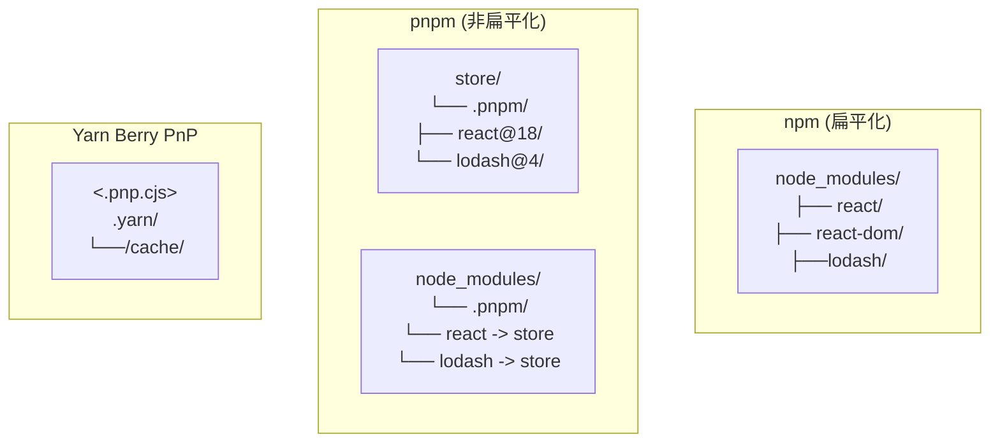

# 包管理器全景图

> npm / pnpm / Yarn 三足鼎立，面试必考核心差异

---

## 一、三大包管理器概览

| 特性 | npm | pnpm | Yarn |
|------|-----|------|------|
| **版本** | 10.x | 9.x | Berry (4.x) |
| **诞生时间** | 2010 | 2016 | 2016 |
| **存储方式** | 扁平化 node_modules | Hard Link + Symlink | Plug'n'Play / Zip |
| **磁盘占用** | 较高（冗余复制） | 极低（内容寻址） | 中等 |
| **安装速度** | 中等 | 最快 | 快 |
| **monorepo 支持** | 弱（workspaces） | 优秀 | 优秀 |
| **Lock 文件** | package-lock.json | pnpm-lock.yaml | yarn.lock |

---

## 二、核心机制对比

### 2.1 node_modules 结构



### 2.2 关键差异点

| 差异点 | npm | pnpm | Yarn |
|--------|-----|------|------|
| **幽灵依赖** | 存在（可访问未声明依赖） | 不存在（严格隔离） | 不存在 |
| **依赖提升** | 所有包提升到顶层 | 使用 .pnpm 目录 | PnP 模式无 node_modules |
| **安装后修改** | 可能污染 lockfile | 原子化修改 | 需要 PnP 兼容 |
| **CI 缓存** | 需 .npmrc 配置 | 自动去重 | Zero-install 可选 |

---

## 三、各工具核心优势

### 3.1 npm 的优势

- **生态最大**：包数量最多，兼容性最好
- **无需额外依赖**：Node.js 自带
- **企业级支持**：Long Term Support 版本

```bash
# 常用命令
npm install          # 安装所有依赖
npm install react    # 安装单个包
npm run build        # 运行脚本
npm outdated         # 检查更新
```

### 3.2 pnpm 的优势

- **极速安装**：Hard Link 避免重复下载
- **节省磁盘**：全局 Store 共享内容
- **严格依赖**：消除幽灵依赖问题

```bash
# 常用命令
pnpm install         # 安装依赖
pnpm add react      # 添加包
pnpm remove react   # 移除包
pnpm store prune     # 清理未引用包
```

### 3.3 Yarn Berry 的优势

- **Zero-install**：Git 仓库存储缓存，无需网络
- **PnP 模式**：无 node_modules，解析速度极快
- **层插件架构**：高度可定制

```bash
# 常用命令
yarn install         # 安装
yarn add react       # 添加包
yarn set version berry  # 切换到 Berry
yarn dlx <package>   # 临时运行包
```

---

## 四、面试常考点索引

### 4.1 pnpm 相关

| 题目 | 答案位置 |
|------|----------|
| pnpm 如何实现节省磁盘？ | [pnpm-deep-dive.md - Content-addressable Store](pnpm-deep-dive.md#content-addressable-store) |
| Hard Link vs Symlink 区别？ | [pnpm-deep-dive.md - 链接机制](pnpm-deep-dive.md#hard-link--symlink) |
| 什么是幽灵依赖？pnpm 如何解决？ | [pnpm-deep-dive.md - 幽灵依赖](pnpm-deep-dive.md#幽灵依赖问题) |
| pnpm workspace 如何配置？ | [pnpm-deep-dive.md - workspace](pnpm-deep-dive.md#workspace-配置) |

### 4.2 Yarn Berry 相关

| 题目 | 答案位置 |
|------|----------|
| Yarn PnP 原理是什么？ | [yarn-berry.md - PnP 机制](yarn-berry.md#pnp-机制) |
| Zero-install 如何实现？ | [yarn-berry.md - Zero-install](yarn-berry.md#zero-install-原理) |
| Yarn Berry 与 1.x 核心区别？ | [yarn-berry.md - 版本对比](yarn-berry.md#yarn-1x-vs-berry) |
| PnP 模式下 TypeScript 如何配置？ | [yarn-berry.md - TS 配置](yarn-berry.md#typescript-配置) |

### 4.3 通用场景

| 题目 | 答案位置 |
|------|----------|
| monorepo 选型建议？ | [pnpm-deep-dive.md - monorepo 最佳实践](pnpm-deep-dive.md#monorepo-最佳实践) |
| 依赖管理最佳实践？ | [pnpm-deep-dive.md - 最佳实践](pnpm-deep-dive.md#最佳实践) |

---

## 五、选型建议

### 5.1 按场景选择

```mermaid
flowchart LR
    A[项目类型] --> B{micro-apps?}
    B -->|单仓库| C{npm / pnpm|
    B -->|monorepo| D{pnpm / Yarn Berry|
    D -->|追求速度| E[pnpm]
    D -->|追求缓存| F[Yarn Berry]
    C -->|企业内网| G[npm]
    C -->|追求速度| H[pnpm]
```

### 5.2 性能对比参考

| 操作 | npm | pnpm | Yarn (Berry) |
|------|-----|------|--------------|
| 首次安装 | 1x (基准) | 2-3x 更快 | 1.5x 更快 |
| 增量安装 | 1x | 5-10x 更快 | 2-3x 更快 |
| CI 缓存 | 依赖 npmrc | 自动去重 | Zero-install 可选 |

---

## 六、延伸阅读

- [pnpm 深度解析](./pnpm-deep-dive.md)
- [Yarn Berry 解析](./yarn-berry.md)
- [pnpm 官方文档](https://pnpm.io/)
- [Yarn Berry 官方文档](https://yarnpkg.com/)
- [npm 官方文档](https://docs.npmjs.com/)

---

*最后更新：2024-12*