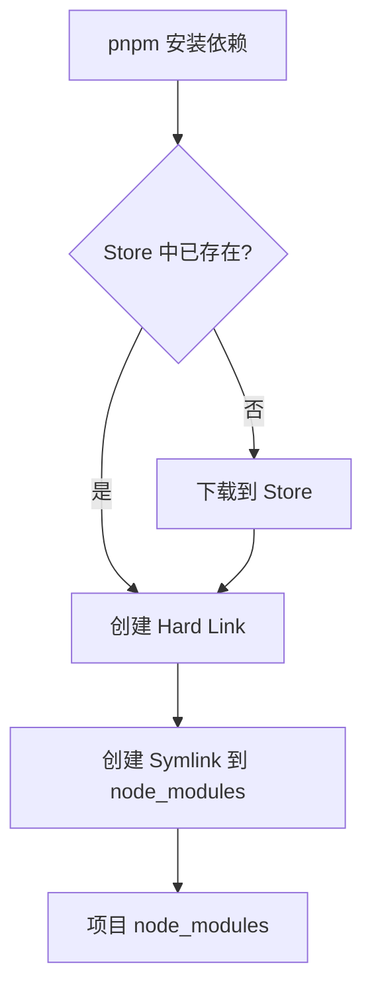
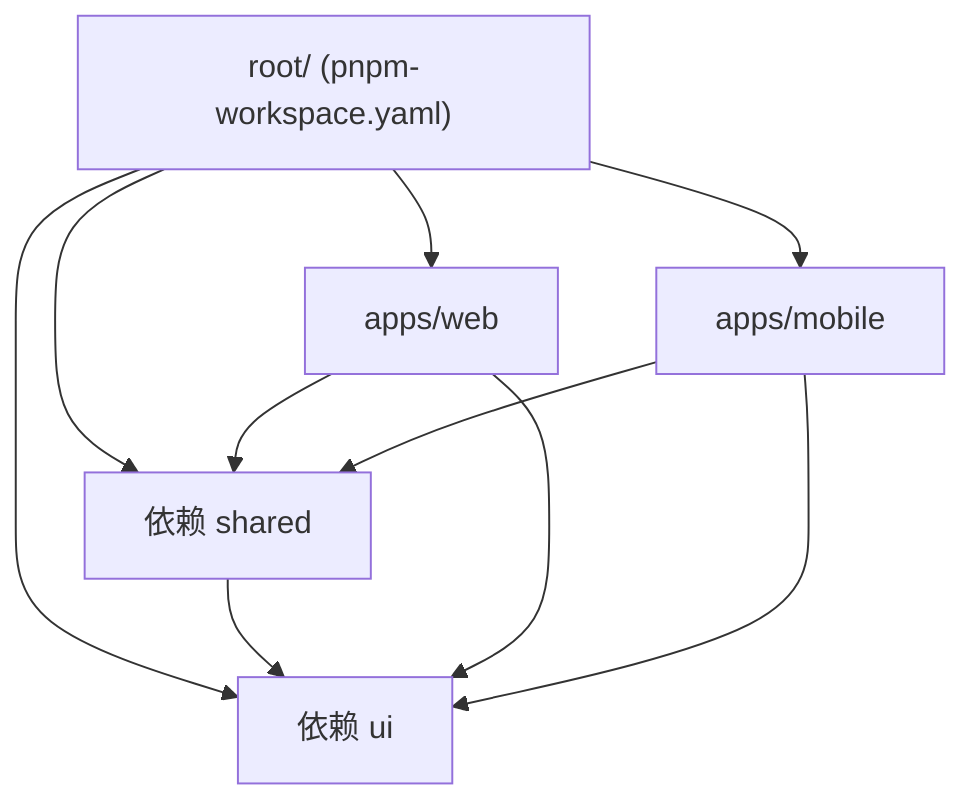

# pnpm 深度解析

> Performance, Disk Space, and Monorepos — pnpm 的核心承诺

---

## 一、核心设计理念

pnpm（performant npm）由 Node.js 核心贡献者 Zoltan Kochan 创建，主要解决：

1. **磁盘空间浪费**：npm/Yarn 重复安装相同版本依赖
2. **依赖提升问题**：幽灵依赖、版本冲突
3. **安装速度慢**：每次都重新下载



---

## 二、Hard Link vs Symlink 原理

### 2.1 基础概念

```typescript
// Hard Link（硬链接）
// 同一个 inode 的多个目录项，共享磁盘数据
// 文件系统级别：多个路径指向同一块数据

// Symlink（符号链接）
// 包含目标路径的特殊文件，类似快捷方式
// 可以跨文件系统，可链接目录

// pnpm 结合两者：
// 1. Store 存数据（Hard Link 到磁盘实际位置）
// 2. node_modules 使用 Symlink 引用 Store
```

### 2.2 pnpm 的链接策略

```typescript
// 假设安装 react@18.2.0

// Step 1: Store 中存储（基于内容寻址）
// ~/.pnpm-store/store/v1/filehash... -> 实际的 react 文件

// Step 2: 项目中创建硬链接
// .pnpm/node_modules/react -> Store 中的实际文件

// Step 3: 项目根目录的 react 是符号链接
// node_modules/react -> ../.pnpm/node_modules/react

// 同一依赖的多版本共存
// node_modules/react -> ../../../.pnpm-store/store/v2/anotherhash
// node_modules/react-dom -> 指向同一 react 版本
```

### 2.3 图示

```
项目目录结构：
project/
├── node_modules/
│   ├── .pnpm/           # 虚拟存储目录
│   │   ├── react@18.2.0/
│   │   │   └── node_modules/
│   │   │       └── react/
│   │   │           ├── index.js      # Hard Link
│   │   │           └── package.json
│   │   └── lodash@4.17.21/
│   │       └── node_modules/
│   │           └── lodash/
│   ├── react -> .pnpm/react@18.2.0/node_modules/react     # Symlink
│   └── lodash -> .pnpm/lodash@4.17.21/node_modules/lodash # Symlink
```

---

## 三、Content-addressable Store

### 3.1 什么是内容寻址

```typescript
// 内容寻址存储（CAS）
// 相同内容的文件只存储一次，通过内容哈希作为键

// 示例：
// react@18.2.0 的 index.js 内容哈希：sha256-abc123...
// react@18.2.0 的 package.json 内容哈希：sha256-def456...

// Store 路径结构：
// ~/.pnpm-store/store/v3/
// ├── content-addressable-v3/
// │   ├── sha256-abc123.../
// │   │   └── node_modules/react/index.js
// │   └── sha256-def456.../
// │       └── node_modules/react/package.json
```

### 3.2 Store 位置与配置

```bash
# 默认 Store 位置
# 类 Unix: ~/.pnpm-store
# Windows: %LOCALAPPDATA%/pnpm/store

# 自定义 Store 路径
pnpm config set store-dir /path/to/custom-store

# 查看当前 Store 信息
pnpm store status

# 清理未引用文件
pnpm store prune

# 查看 Store 大小
pnpm store used
```

### 3.3 跨项目共享

```typescript
// Project A 安装 react@18.2.0
// -> 下载到 Store
// -> 创建 Hard Link

// Project B 也安装 react@18.2.0
// -> 发现 Store 已有，直接 Hard Link
// -> 不需要重新下载！

// 节省磁盘：相同版本的包只存储一次
// 节省带宽：不需要重复下载
```

---

## 四、幽灵依赖问题

### 4.1 什么是幽灵依赖

```javascript
// npm 的幽灵依赖问题
// 项目结构：
// node_modules/
//   ├── react/           // package.json 声明
//   └── lodash/          // react 依赖，但未在 package.json 声明

// 在代码中可以直接访问：
import _ from 'lodash';  // 能正常工作，但未声明

// 问题：
// 1. 依赖 react 的某个版本包含 lodash
// 2. 升级 react 后 lodash 可能消失
// 3. 生产环境部署会失败
```

### 4.2 pnpm 如何解决

```typescript
// pnpm 的严格隔离
// node_modules/ 只包含显式声明的依赖

// .pnpm/ 目录结构：
// node_modules/.pnpm/
//   ├── react@18.2.0/
//   │   └── node_modules/    # react 的依赖在这里
//   │       └── lodash/      # react 依赖的 lodash
//   └── lodash@4.17.21/      # 顶层依赖

// 访问规则：
// import react from 'react';           // OK - 顶层依赖
// import lodash from 'lodash';          // OK - 顶层依赖
// import _ from 'react/node_modules/lodash'; // OK - 显式路径
// import _ from 'lodash';               // OK - 显式声明

// 但如果 lodash 未声明且非子依赖，访问会报错！
```

### 4.3 配置strict peer dependencies

```yaml
# .npmrc
# pnpm 默认严格模式，可配置宽松模式
strict-peer-dependencies=false  # 允许未声明的 peer 依赖
```

---

## 五、Workspace 配置

### 5.1 基本配置

```yaml
# pnpm-workspace.yaml
packages:
  - 'packages/*'      # 所有子包
  - 'apps/*'           # 应用目录
  - 'tools/*'          # 工具目录
  - '!packages/**/node_modules'  # 排除
```

### 5.2 项目结构示例



### 5.3 package.json 配置

```json
// apps/web/package.json
{
  "name": "@myorg/web",
  "version": "1.0.0",
  "dependencies": {
    "@myorg/shared": "workspace:*",   // 指向 workspace 内的包
    "@myorg/ui": "workspace:*",
    "react": "^18.2.0"
  }
}
```

### 5.4 常用 workspace 命令

```bash
# workspace 级别命令
pnpm -r install           # 安装所有 workspace
pnpm -r build             # 构建所有包
pnpm -r test              # 测试所有包

# 在特定 workspace 中运行
pnpm --filter @myorg/web build

# 过滤依赖链
pnpm --filter @myorg/web...   # 包含所有依赖
pnpm --filter ^@myorg/web     # 仅上游依赖
```

---

## 六、Monorepo 最佳实践

### 6.1 包管理策略

```typescript
// TypeScript 类型定义共享

// packages/shared/package.json
{
  "name": "@myorg/shared",
  "version": "1.0.0",
  "main": "./dist/index.js",
  "types": "./dist/index.d.ts",
  "exports": {
    ".": {
      "import": "./dist/index.mjs",
      "types": "./dist/index.d.ts"
    }
  }
}

// packages/ui/package.json - 依赖 shared
{
  "name": "@myorg/ui",
  "dependencies": {
    "@myorg/shared": "workspace:*",
    "react": "^18.2.0"
  }
}
```

### 6.2 依赖 hoist

```yaml
# .npmrc
# hoist 管理策略

# 全部提升（不推荐，可能引入幽灵依赖）
# shamefully-hoist=true

# 推荐：按需提升
public-hoist-pattern[]=*@types/*
public-hoist-pattern[]=*eslint*
public-hoist-pattern[]=*babel*
```

### 6.3 构建顺序

```typescript
// 构建脚本示例（packages/ui/build.ts）
import { execSync } from 'child_process';

async function build() {
  // 1. 构建共享依赖
  execSync('pnpm --filter @myorg/shared build', { stdio: 'inherit' });

  // 2. 构建 UI 组件（依赖 shared）
  execSync('pnpm --filter @myorg/ui build', { stdio: 'inherit' });

  // 3. 构建应用
  execSync('pnpm --filter @myorg/web build', { stdio: 'inherit' });
}

build();
```

---

## 七、最佳实践

### 7.1 .npmrc 配置

```ini
# .npmrc
# pnpm 配置示例

# store 位置
store-dir=~/.pnpm-store

# 自动安装 peer 依赖
auto-install-peers=true

# 严格依赖检查
strict-peer-dependencies=true

# 提升 ESLint 等工具
public-hoist-pattern[]=*eslint*
public-hoist-pattern[]=*@typescript-eslint*

# 忽略 scripts（安全）
ignore-scripts=true
```

### 7.2 pnpm-lock.yaml 管理

```bash
# 锁文件最佳实践

# 1. 始终提交 pnpm-lock.yaml
git add pnpm-lock.yaml

# 2. CI 使用相同版本 pnpm
# .github/workflows/ci.yml
# - uses: pnpm/action-setup@v2
#   with:
#     version: 9

# 3. 升级依赖
pnpm update              # 更新所有
pnpm update react@18.3   # 更新特定包
pnpm update --interactive # 交互式更新
```

### 7.3 常见问题排查

```typescript
// 问题：模块找不到
// 解决：检查是否正确声明依赖

// 问题：版本冲突
// 解决：使用 overrides 强制版本
{
  "pnpm": {
    "overrides": {
      "lodash": "^4.17.21"
    }
  }
}

// 问题：peer 依赖警告
// 解决：pnpm add -D <peer-dep> 或配置 optionalDependencies
```

---

## 参考链接

- [pnpm 官方文档](https://pnpm.io/)
- [pnpm GitHub](https://github.com/pnpm/pnpm)
- [Content-addressable Storage](https://pnpm.io/zh/blog/2020/05/27/close-to-optimal-package-managers)
- [幽灵依赖详解](https://pnpm.io/zh/symlinks)

---

*最后更新：2024-12*