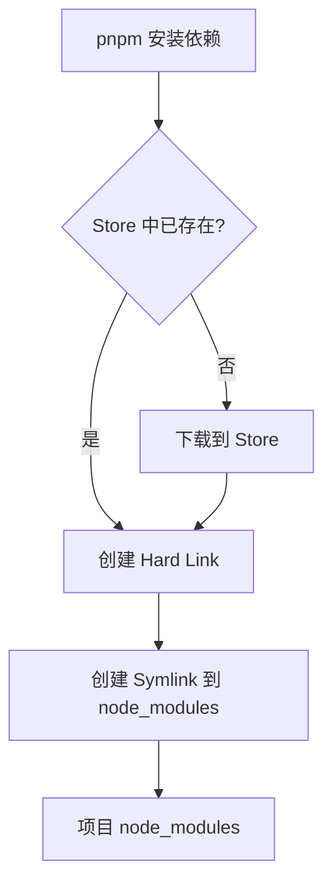
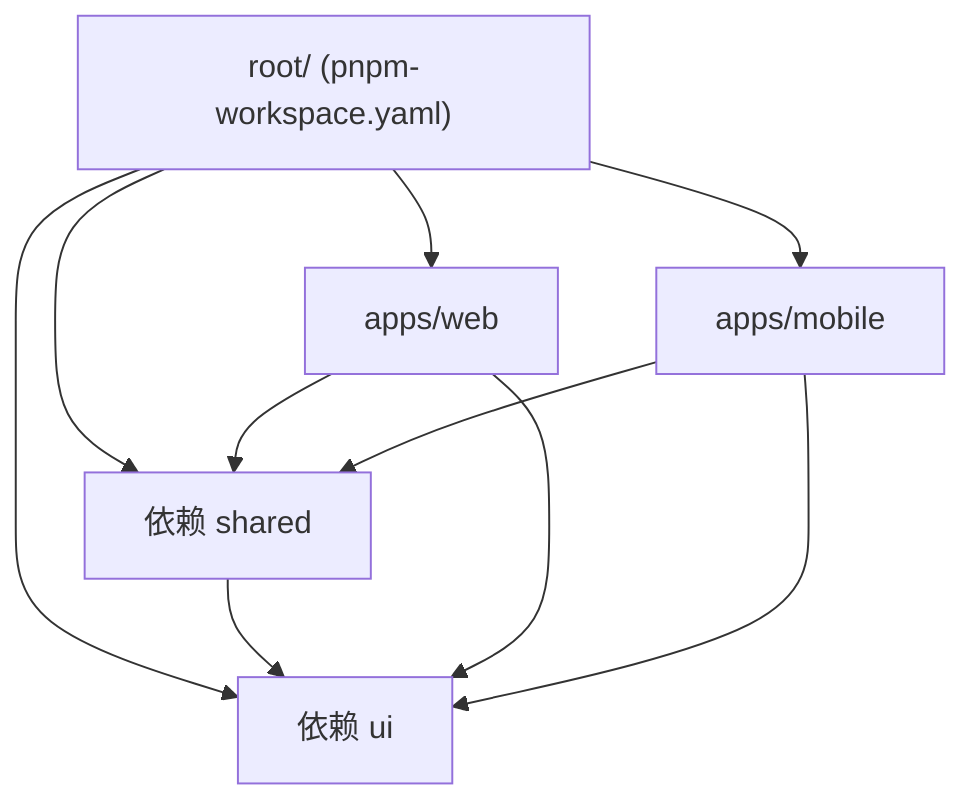

# pnpm 深度解析

> Performance, Disk Space, and Monorepos — pnpm 的核心承诺

---

## 1. 核心设计理念

pnpm（performant npm）由 Node.js 核心贡献者 Zoltan Kochan 创建，主要解决：

1. **磁盘空间浪费**：npm/Yarn 重复安装相同版本依赖
2. **依赖提升问题**：幽灵依赖、版本冲突
3. **安装速度慢**：每次都重新下载


```mermaid
graph TD
    A[pnpm 安装依赖] --> B{Store 中已存在?}
    B -->|是| C[创建 Hard Link]
    B -->|否| D[下载到 Store]
    D --> C
    C --> E[创建 Symlink 到 node_modules]
    E --> F[项目 node_modules]
```

---

## 2. Hard Link vs Symlink 原理

### 2.1 基础概念

```typescript
// Hard Link（硬链接）
// 同一个 inode 的多个目录项，共享磁盘数据
// 文件系统级别：多个路径指向同一块数据

// Symlink（符号链接）
// 包含目标路径的特殊文件，类似快捷方式
// 可以跨文件系统，可链接目录

// pnpm 结合两者：
// 1. Store 存数据（Hard Link 到磁盘实际位置）
// 2. node_modules 使用 Symlink 引用 Store
```

### 2.2 pnpm 的链接策略

```typescript
// 假设安装 react@18.2.0

// Step 1: Store 中存储（基于内容寻址）
// ~/.pnpm-store/store/v1/filehash... -> 实际的 react 文件

// Step 2: 项目中创建硬链接
// .pnpm/node_modules/react -> Store 中的实际文件

// Step 3: 项目根目录的 react 是符号链接
// node_modules/react -> ../.pnpm/node_modules/react

// 同一依赖的多版本共存
// node_modules/react -> ../../../.pnpm-store/store/v2/anotherhash
// node_modules/react-dom -> 指向同一 react 版本
```

### 2.3 图示

```
项目目录结构：
project/
├── node_modules/
│   ├── .pnpm/           # 虚拟存储目录
│   │   ├── react@18.2.0/
│   │   │   └── node_modules/
│   │   │       └── react/
│   │   │           ├── index.js      # Hard Link
│   │   │           └── package.json
│   │   └── lodash@4.17.21/
│   │       └── node_modules/
│   │           └── lodash/
│   ├── react -> .pnpm/react@18.2.0/node_modules/react     # Symlink
│   └── lodash -> .pnpm/lodash@4.17.21/node_modules/lodash # Symlink
```

---

## 3. Content-addressable Store

### 3.1 什么是内容寻址

```typescript
// 内容寻址存储（CAS）
// 相同内容的文件只存储一次，通过内容哈希作为键

// 示例：
// react@18.2.0 的 index.js 内容哈希：sha256-abc123...
// react@18.2.0 的 package.json 内容哈希：sha256-def456...

// Store 路径结构：
// ~/.pnpm-store/store/v3/
// ├── content-addressable-v3/
// │   ├── sha256-abc123.../
// │   │   └── node_modules/react/index.js
// │   └── sha256-def456.../
// │       └── node_modules/react/package.json
```

### 3.2 Store 位置与配置

```bash
# 默认 Store 位置
# 类 Unix: ~/.pnpm-store
# Windows: %LOCALAPPDATA%/pnpm/store

# 自定义 Store 路径
pnpm config set store-dir /path/to/custom-store

# 查看当前 Store 信息
pnpm store status

# 清理未引用文件
pnpm store prune

# 查看 Store 大小
pnpm store used
```

### 3.3 跨项目共享

```typescript
// Project A 安装 react@18.2.0
// -> 下载到 Store
// -> 创建 Hard Link

// Project B 也安装 react@18.2.0
// -> 发现 Store 已有，直接 Hard Link
// -> 不需要重新下载！

// 节省磁盘：相同版本的包只存储一次
// 节省带宽：不需要重复下载
```

---

## 4. 幽灵依赖问题

### 4.1 什么是幽灵依赖

```javascript
// npm 的幽灵依赖问题
// 项目结构：
// node_modules/
//   ├── react/           // package.json 声明
//   └── lodash/          // react 依赖，但未在 package.json 声明

// 在代码中可以直接访问：
import _ from 'lodash';  // 能正常工作，但未声明

// 问题：
// 1. 依赖 react 的某个版本包含 lodash
// 2. 升级 react 后 lodash 可能消失
// 3. 生产环境部署会失败
```

### 4.2 pnpm 如何解决

```typescript
// pnpm 的严格隔离
// node_modules/ 只包含显式声明的依赖

// .pnpm/ 目录结构：
// node_modules/.pnpm/
//   ├── react@18.2.0/
//   │   └── node_modules/    # react 的依赖在这里
//   │       └── lodash/      # react 依赖的 lodash
//   └── lodash@4.17.21/      # 顶层依赖

// 访问规则：
// import react from 'react';           // OK - 顶层依赖
// import lodash from 'lodash';          // OK - 顶层依赖
// import _ from 'react/node_modules/lodash'; // OK - 显式路径
// import _ from 'lodash';               // OK - 显式声明

// 但如果 lodash 未声明且非子依赖，访问会报错！
```

### 4.3 配置strict peer dependencies

```yaml
# .npmrc
# pnpm 默认严格模式，可配置宽松模式
strict-peer-dependencies=false  # 允许未声明的 peer 依赖
```

---

## 5. Workspace 配置

### 5.1 基本配置

```yaml
# pnpm-workspace.yaml
packages:
  - 'packages/*'      # 所有子包
  - 'apps/*'           # 应用目录
  - 'tools/*'          # 工具目录
  - '!packages/**/node_modules'  # 排除
```

### 5.2 项目结构示例


```mermaid
graph TD
    root["root/ (pnpm-workspace.yaml)"]
    root --> pkg1["packages/shared"]
    root --> pkg2["packages/ui"]
    root --> app1["apps/web"]
    root --> app2["apps/mobile"]

    pkg1 --> pkg2["依赖 shared"]
    app1 --> pkg1["依赖 shared"]
    app1 --> pkg2["依赖 ui"]
    app2 --> pkg1["依赖 shared"]
    app2 --> pkg2["依赖 ui"]
```

### 5.3 package.json 配置

```json
// apps/web/package.json
{
  "name": "@myorg/web",
  "version": "1.0.0",
  "dependencies": {
    "@myorg/shared": "workspace:*",   // 指向 workspace 内的包
    "@myorg/ui": "workspace:*",
    "react": "^18.2.0"
  }
}
```

### 5.4 常用 workspace 命令

```bash
# workspace 级别命令
pnpm -r install           # 安装所有 workspace
pnpm -r build             # 构建所有包
pnpm -r test              # 测试所有包

# 在特定 workspace 中运行
pnpm --filter @myorg/web build

# 过滤依赖链
pnpm --filter @myorg/web...   # 包含所有依赖
pnpm --filter ^@myorg/web     # 仅上游依赖
```

---

## 6. Monorepo 最佳实践

### 6.1 包管理策略

```typescript
// TypeScript 类型定义共享

// packages/shared/package.json
{
  "name": "@myorg/shared",
  "version": "1.0.0",
  "main": "./dist/index.js",
  "types": "./dist/index.d.ts",
  "exports": {
    ".": {
      "import": "./dist/index.mjs",
      "types": "./dist/index.d.ts"
    }
  }
}

// packages/ui/package.json - 依赖 shared
{
  "name": "@myorg/ui",
  "dependencies": {
    "@myorg/shared": "workspace:*",
    "react": "^18.2.0"
  }
}
```

### 6.2 依赖 hoist

```yaml
# .npmrc
# hoist 管理策略

# 全部提升（不推荐，可能引入幽灵依赖）
# shamefully-hoist=true

# 推荐：按需提升
public-hoist-pattern[]=*@types/*
public-hoist-pattern[]=*eslint*
public-hoist-pattern[]=*babel*
```

### 6.3 构建顺序

```typescript
// 构建脚本示例（packages/ui/build.ts）
import { execSync } from 'child_process';

async function build() {
  // 1. 构建共享依赖
  execSync('pnpm --filter @myorg/shared build', { stdio: 'inherit' });

  // 2. 构建 UI 组件（依赖 shared）
  execSync('pnpm --filter @myorg/ui build', { stdio: 'inherit' });

  // 3. 构建应用
  execSync('pnpm --filter @myorg/web build', { stdio: 'inherit' });
}

build();
```

---

## 7. 最佳实践

### 7.1 .npmrc 配置

```ini
# .npmrc
# pnpm 配置示例

# store 位置
store-dir=~/.pnpm-store

# 自动安装 peer 依赖
auto-install-peers=true

# 严格依赖检查
strict-peer-dependencies=true

# 提升 ESLint 等工具
public-hoist-pattern[]=*eslint*
public-hoist-pattern[]=*@typescript-eslint*

# 忽略 scripts（安全）
ignore-scripts=true
```

### 7.2 pnpm-lock.yaml 管理

```bash
# 锁文件最佳实践

# 1. 始终提交 pnpm-lock.yaml
git add pnpm-lock.yaml

# 2. CI 使用相同版本 pnpm
# .github/workflows/ci.yml
# - uses: pnpm/action-setup@v2
#   with:
#     version: 9

# 3. 升级依赖
pnpm update              # 更新所有
pnpm update react@18.3   # 更新特定包
pnpm update --interactive # 交互式更新
```

### 7.3 常见问题排查

```typescript
// 问题：模块找不到
// 解决：检查是否正确声明依赖

// 问题：版本冲突
// 解决：使用 overrides 强制版本
{
  "pnpm": {
    "overrides": {
      "lodash": "^4.17.21"
    }
  }
}

// 问题：peer 依赖警告
// 解决：pnpm add -D <peer-dep> 或配置 optionalDependencies
```

---

## 8. 参考链接

- [pnpm 官方文档](https://pnpm.io/)
- [pnpm GitHub](https://github.com/pnpm/pnpm)
- [Content-addressable Storage](https://pnpm.io/zh/blog/2020/05/27/close-to-optimal-package-managers)
- [幽灵依赖详解](https://pnpm.io/zh/symlinks)

---

*最后更新：2024-12*

## 深入阅读与参考

!!! tip "怎么用这些资料"
    先读「官方文档与规范」建立准确的概念，再读「源码与示例」核对细节，最后用「教程、书籍与视频」换一种讲法加深理解。每条都写明了读哪一节、带着什么问题读。

### 官方文档与规范

| 资源 | 为什么读 | 怎么读 |
|---|---|---|
| [pnpm 文档](https://pnpm.io/zh/motivation) | 官方讲清内容寻址存储与硬链接，原理章节的权威依据。 | 读 store 与 symlink 相关小节，带着「node_modules 里到底是什么」去读，读完画一张链接图。 |
| [pnpm 目录 catalogs](https://pnpm.io/catalogs) | 用 catalog 统一多包依赖版本，直接解决版本漂移。 | 读 catalogs 配置小节，把仓库里重复的依赖版本抽到一处，再装一次验证生效。 |
| [Turborepo 文档](https://turbo.build/repo/docs) | 官方讲任务编排与缓存，是 monorepo 提速的核心机制。 | 读 caching 与 pipeline 两节，为自己的 workspace 配 pipeline 并试跑一次缓存命中。 |
| [Cargo 手册](https://doc.rust-lang.org/cargo/) | Rust 工作区与特性机制，可迁移映射到前端 monorepo 概念。 | 读 Workspaces 与 Features 两节，对照 pnpm-workspace.yaml 做一次概念映射表。 |
| [Migrate from pnpm](https://docs.deno.com/runtime/migrate/migrate_from_pnpm/) | 从 pnpm 迁出的官方说明，反向看清 pnpm 的目录与锁文件。 | 读迁移步骤与包管理差异一节，列出 pnpm 在你现有项目里留下的痕迹。 |

### 源码与示例

| 资源 | 为什么读 | 怎么读 |
|---|---|---|
| [pnpm 工作区（中文）](https://pnpm.io/zh/workspaces) | 动手建两个包互相引用，直观理解 workspace 协议如何连接。 | 照文档建 packages/a、packages/b，用 workspace:* 互引，安装后查看 node_modules 软链结构。 |
| [Turborepo：仓库组织](https://turborepo.com/docs/crafting-your-repository) | 示例仓库展示任务依赖与缓存配置，结构可直接借鉴。 | 读 turbo.json 的 pipeline 示例，为你的仓库补一条 build→test→lint 依赖链。 |

### 教程、书籍与视频

| 资源 | 为什么读 | 怎么读 |
|---|---|---|
| [Changesets](https://github.com/changesets/changesets) | monorepo 发版标准流程，走一遍才懂变更集与版本联动。 | 在示例仓库依次跑 add、version、publish，观察 changelog 与各包版本号的变化。 |
| [Yarn 入门](https://yarnpkg.com/getting-started) | 对比 PnP 与 pnpm 的链接策略，理解取舍而非背结论。 | 读 Plug'n'Play 一节，带着「谁来解决幽灵依赖」读，读完写下三条与 pnpm 的差异。 |

## 应用与行业实践

### 应用场景地图

| 场景 | 用到本页哪个知识点 | 典型技术选型 | 注意事项 |
| --- | --- | --- | --- |
| 后台管理的万行表格 | Workspace 配置、幽灵依赖问题 | pnpm workspace + Vite + 独立表格组件包 | 组件包要用到的库必须自己声明，宿主应用装上才不报模块找不到 |
| 低端安卓的首屏加载 | Content-addressable Store、版本收敛 | pnpm workspace + overrides 锁版本 + 打包分析 | 版本重复会进产物，装包阶段看不出来，要去产物里核对 |
| 多人协作白板 | peer 依赖影响依赖路径、Symlink 结构 | pnpm + Yjs 这类同步引擎 | 同步引擎必须单实例，装出两份会出现状态不同步 |
| Electron 桌面端打包 | Hard Link vs Symlink、node-linker | pnpm + node-linker=hoisted | 打包器按扁平目录找模块，软链结构会让它漏收文件 |
| 内网离线构建 | Content-addressable Store、store prune | pnpm fetch + 离线 store 镜像 | store 要随镜像一起分发，prune 会删掉旧版本 |
| 单仓库多个 BFF 服务 | Workspace 配置、Monorepo 最佳实践 | pnpm --filter + 共享 SDK 包 | 每个服务要能独立部署，不能把整个仓库打进镜像 |
| 组件库对外发布 | workspace 协议、版本收敛 | pnpm workspace + Changesets | workspace:* 在发布时会被替换成真实版本号，要核对替换结果 |
| 弱网 CI 的重复安装 | Hard Link vs Symlink、Store | pnpm install --frozen-lockfile + store 缓存 | 缓存 key 要绑 lockfile 哈希，否则会命中旧版本 |

### 三个场景拆解

#### 场景 1：后台管理的万行表格

**业务背景**：后台管理里有多张万行表格，行内还要做筛选、排序、单元格编辑，表格逻辑被三个应用各抄了一份。改动一个单元格交互要改三处，漏改的地方只在上线后被发现。

**怎么用本页知识解决**：把表格逻辑提成独立包放进 workspace，应用通过 workspace 协议引用它。pnpm 的 node_modules 只铺开应用自己声明的包，漏声明依赖时 import 会解析失败，问题停在构建阶段。

```yaml
# pnpm-workspace.yaml：声明仓库里哪些目录算包
packages:
  - "apps/*"        # 各个后台管理应用
  - "packages/*"    # 共享的表格组件包
```

```jsonc
// apps/admin-web/package.json：只写这个应用真正 import 的包
{
  "dependencies": {
    "@acme/ui-table": "workspace:*",   // 指向本地目录，不发请求到 registry
    "react": "^18.0.0"
  }
}
```

```bash
pnpm install --frozen-lockfile        # 锁文件与 package.json 不一致就失败
pnpm --filter @acme/ui-table build    # 只构建被改动的组件包
pnpm --filter admin-web build         # 再构建应用，验证依赖能否解析
```

- `workspace:*` 让应用直接指向本地目录，组件包改完立刻生效，不用再复制目录。
- 幽灵依赖被符号链接结构挡住：应用没声明的包，import 时就解析不到。
- `--frozen-lockfile` 把清单与锁文件的差异当成错误，避免 CI 上静默改动依赖树。
- `--filter` 只跑受影响的包，仓库里包数量增加时 CI 时间不会按包数量线性增长。
- 共享构建工具在根目录声明一次；若要用 catalog 收敛版本，字段名与最低版本需核对官方文档。

**怎么度量收益**：
- 安装与构建耗时：在 CI 日志里给 `pnpm install --frozen-lockfile` 与 `pnpm -r build` 分别打时间戳，对比改造前后同一条流水线的同一阶段。
- 漏声明依赖：跑构建，统计模块解析失败的次数；也可用 knip，或 eslint-plugin-import 的 no-extraneous-dependencies 规则扫描。
- node_modules 体积：`du -sh node_modules`；软链结构下 `du` 默认不跟随链接，需要 `du -shL`，或直接量 `pnpm store path` 指向的目录。

**什么时候不该用**：
- 只有一个应用、没有可复用的包：拆 workspace 只是多一层目录和一套构建配置。
- 打包工具链依赖扁平 node_modules（按目录层级找模块的老打包器）：要么配 node-linker=hoisted，要么这段收益抵不过改造成本。
- 团队还没有统一的锁文件提交规范：先解决锁文件冲突，再拆包。

#### 场景 2：多人协作白板

**业务背景**：白板用实时同步引擎维护多人光标和图形，同一页面出现两份引擎实例时，本地状态会和远端对不上。仓库里白板应用、评论插件、导出服务都引用了这个引擎，引用方数量上涨时冲突概率跟着上涨。

**怎么用本页知识解决**：把引擎声明成 peerDependency，由宿主应用提供唯一实例；再打开严格 peer 检查，让版本冲突在安装阶段失败，而不是留到线上。

```jsonc
// packages/collab-core/package.json：只声明 peer，不自己装一份
{
  "name": "@acme/collab-core",
  "peerDependencies": {
    "yjs": "^13.0.0"        // 交给宿主应用提供，保证全局唯一实例
  },
  "devDependencies": {
    "yjs": "^13.0.0"        // 本地开发和单测需要，不会被下游应用继承
  }
}
```

```ini
# .npmrc：peer 版本对不上时直接报错，不要静默装出两份
strict-peer-dependencies=true
```

```bash
pnpm why yjs                    # 打印依赖树，确认只有一条解析路径
pnpm install --frozen-lockfile  # 复现安装，确认 peer 冲突会直接失败
```

- peerDependencies 里的名字不进入下游应用的依赖树，应用装一次，所有插件共用同一份。
- devDependencies 只服务本地开发与单测，不会跟着包被下游继承。
- 严格 peer 检查把版本不匹配变成安装失败，问题留在 CI 而不是用户浏览器。
- `pnpm why` 的输出条目从多条变成一条，就是这次改造的直接证据。

**怎么度量收益**：
- 实例数量：`pnpm why yjs` 打印的条目数；或构建产物 sourcemap 里同一模块文件路径出现的次数。
- 拦截能力：故意把宿主应用的 yjs 版本改到 peer 范围外，跑 `pnpm install --frozen-lockfile`，确认安装失败并打印冲突的包名与版本范围。
- 运行时校验：在应用启动脚本里从两个包分别 import 引擎的构造入口，做严格相等比较，值不同说明存在两份实例。

**什么时候不该用**：
- 只有一个包用这个引擎：加 peer 只是多一层声明，直接写 dependencies 就够。
- 架构上每个副本必须彼此隔离（例如服务端按请求隔离实例）：单例约束会变成功能限制。
- 上游库本身不承诺跨实例协作：先看它的文档，再决定是否收敛到一份。

#### 场景 3：Serverless 部署依赖裁剪

**业务背景**：函数计算和容器镜像把整个仓库的 node_modules 都打进去，上传慢，冷启动也慢。仓库里包的数量增加后，镜像里会混进只被其他应用使用的依赖。

**怎么用本页知识解决**：先用 `pnpm fetch` 把锁文件里的包预取进 store，做成可缓存的镜像层；再用 `pnpm deploy` 把目标应用的运行时依赖连同被引用的本地包复制成独立目录，只把该目录放进最终镜像。

```dockerfile
# 只复制依赖清单，让这一层能被 Docker 缓存复用
COPY package.json pnpm-lock.yaml pnpm-workspace.yaml ./
RUN pnpm fetch                 # 按锁文件把包预取进本地 store

COPY . .
RUN pnpm install --offline --frozen-lockfile   # 直接用本地 store，不走网络

# 只导出 api 这个应用的生产依赖，形成独立可部署目录
RUN pnpm --filter @acme/api deploy --prod ./deploy
```

- `pnpm fetch` 只读锁文件，包内容进 store；源码改动不会让这一层失效。
- `pnpm install --offline` 复用上一步的 store，构建过程不再访问 registry。
- `pnpm deploy` 按 workspace 的依赖关系收集被引用的本地包，产出的目录自带 node_modules。
- 部署目录只含目标应用的生产依赖，别的应用加包不会影响这个镜像。
- `pnpm deploy` 的参数在较新版本里有过调整，落地前需核对官方文档 deploy 页面：是否需要 --legacy，以及适用的 workspace 配置。

**怎么度量收益**：
- 部署目录体积：`du -sh deploy`，与直接打包整个仓库 node_modules 的结果对比。
- 依赖条目数：`ls deploy/node_modules | wc -l`。
- 冷启动耗时：云平台控制台里该函数的 Duration 指标，取 P50 与 P95 做改造前后对比。
- 构建缓存：Docker 构建日志里依赖层是否显示 CACHED。

**什么时候不该用**：
- 单体应用只有一个部署目标：多加一层 deploy 只增加流水线步骤。
- 依赖带原生模块或安装时下载二进制（例如浏览器内核）：离线安装会失败，需要提前把产物放进镜像。
- 运行时要求依赖平铺在仓库根目录：先确认 deploy 产物能否满足，再决定是否采用。

### 行业先进实践

`pnpm fetch` 加分层镜像构建（出处：pnpm 官方文档 Continuous Integration 页面）
做法是先复制 package.json 与 pnpm-lock.yaml，跑 `pnpm fetch`，再复制源码跑 `pnpm install --offline`。依赖层只随锁文件变化，源码改动不会让它重建，镜像构建能命中缓存。借鉴方式：把这一段写进团队的 Dockerfile 模板，并在流水线里检查依赖层是否命中缓存。

`pnpm deploy` 产出裁剪后的部署目录（出处：pnpm 官方文档 pnpm deploy 页面）
做法是在 workspace 根目录执行 `pnpm --filter <应用> deploy --prod <目录>`，得到只含该应用运行时依赖与被引用本地包的目录。它把 monorepo 拆成多个独立部署单元时省去手写打包脚本。借鉴方式：先在一个改动频率低的函数上试点，核对产物里的依赖条目与线上运行结果。

`node-linker=hoisted` 兼容只认扁平目录的工具（出处：pnpm 官方文档 Settings 页面 node-linker 项）
做法是把 node-linker 设为 hoisted，node_modules 按 npm 的扁平结构铺设，代价是失去符号链接结构对幽灵依赖的约束。React Native 的 Metro 这类按目录层级解析模块的工具常用这一项。借鉴方式：先在一个仓库验证打包工具能否正常工作，再决定是否推广。

`public-hoist-pattern` 给单个工具放行（出处：pnpm 官方文档 Settings 页面 public-hoist-pattern 项）
做法是把指定包名的依赖提升到 node_modules 根目录，让只从根目录查找自己插件的工具能跑起来，例如 eslint 插件。相比 shamefully-hoist，它把影响范围限定在少量包名上。借鉴方式：先跑 `pnpm install` 看报错里缺哪个包，再按包名逐条加进配置。

`packageExtensions` 补全上游缺失的 peer 依赖（出处：pnpm 官方文档 packageExtensions）
做法是在配置里为第三方包补上它漏声明的依赖或 peerDependencies，pnpm 按补充后的声明解析依赖树，从而不必全量放开结构。借鉴方式：先定位报错的包名与缺失的依赖名，只补这一条。字段位置与写法需核对官方文档：该配置写在 .npmrc 还是 pnpm-workspace.yaml，以及当前版本支持的字段。

### 从学到用：落地路线

1. 试点：在一个已有多处复制代码、但还没拆 workspace 的仓库里，把其中一个可复用模块提成 workspace 包。验收标准：`pnpm install --frozen-lockfile` 通过，且至少一个应用用 `workspace:*` 引用它并构建成功。
2. 验证：在本地和 CI 各跑一次安装与构建，记录耗时、node_modules 体积、报错条数。验收标准：连续三次执行结果一致，且漏声明依赖会在安装或构建阶段失败，不在运行阶段报错。
3. 推广：把根目录的 .npmrc、pnpm-workspace.yaml 与 CI 模板整理成一份可复制的配置，其余应用按同一份配置接入。验收标准：接入的应用不需要单独改安装脚本，CI 全部使用 `--frozen-lockfile`。
4. 防回退：把依赖声明检查加进 CI，并禁止提交与清单不一致的锁文件。验收标准：故意删掉一条依赖声明时流水线失败，失败信息里出现缺失的包名。

### 动手作业

目标：把一个"应用和组件混在同一个 package"的小仓库改造成 pnpm workspace，并亲眼看到幽灵依赖被拦住。

步骤：
1. 新建仓库，包含 `apps/web` 与 `packages/table` 两个目录，根目录写 `pnpm-workspace.yaml`，packages 字段填 `apps/*` 与 `packages/*`。
2. 在 `apps/web/package.json` 里用 `workspace:*` 引用本地表格包，暂时不声明这个包内部用到的第三方库。
3. 在根目录跑 `pnpm install --frozen-lockfile`，记录安装是否通过。
4. 在应用里 import 表格组件并执行构建，记录报错信息里出现的包名。
5. 把这个包名补进应用的 dependencies，重复第 3、4 步，确认安装与构建都通过。
6. 把两个包共用的某个库改成 peerDependency，打开 strict-peer-dependencies，把版本写到范围外，确认安装失败并打印冲突信息。
7. 记录 `du -sh node_modules`、`ls node_modules | wc -l`、`pnpm store path` 指向目录的体积，与改造前对比。

验收标准：
- 第 4 步必须失败，且报错信息里出现未声明包的名字。
- 第 5 步之后 `pnpm install --frozen-lockfile` 与构建都通过。
- 第 6 步必须失败在安装阶段，输出里能看到冲突的包名与版本范围。
- `pnpm why <包名>` 的输出里，共用库只有一条解析路径。
- 报告里给出改造前后 node_modules 体积与 store 体积两组数字，并写明使用的测量命令。

