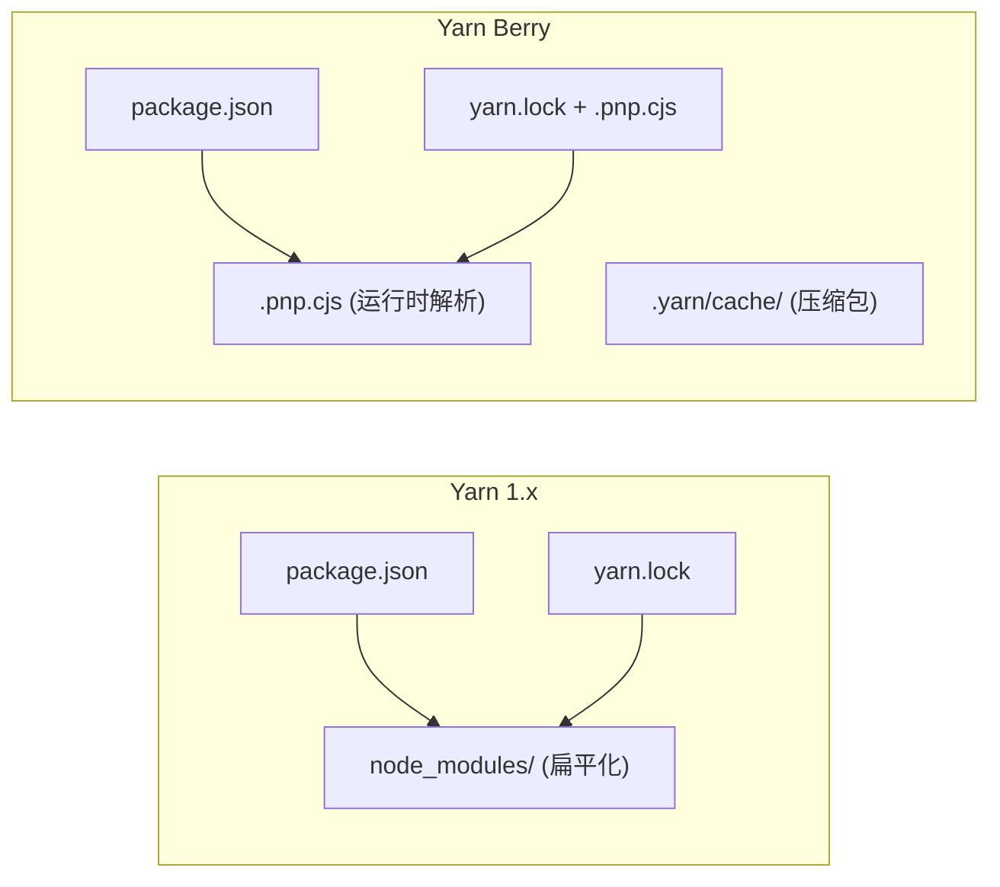

# Yarn Berry 解析

> Yarn 4.x: 重新定义 JavaScript 包管理

---

## 一、版本演进

| 版本 | 代号 | 关键特性 |
|------|------|----------|
| Yarn 1.x | Classic | npm 替代品，扁平化 node_modules |
| Yarn 2.x | Berry | Plug'n'Play (PnP) 引入 |
| Yarn 3.x | Berry | Zero-install 增强，ESM 优化 |
| Yarn 4.x | Berry | 插件系统稳定，性能优化 |

---

## 二、Yarn 1.x vs Berry

### 2.1 核心差异



### 2.2 架构对比

```javascript
// Yarn 1.x: 传统 node_modules
// - 每个包一个目录
// - 嵌套依赖结构
// - 依赖提升（幽灵依赖风险）

// Yarn Berry: Plug'n'Play
// - 无 node_modules 目录
// - .pnp.cjs 管理所有包路径
// - 包从 .yarn/cache 运行时解压

// 实际目录对比
// Yarn 1.x:
// node_modules/
// ├── react/
// │   └── node_modules/
// │       └── loose-envify/

// Yarn Berry:
// .yarn/
// ├── cache/
// │   ├── react-18.2.0.cjs
// │   └── loose-envify-1.4.1.cjs
// .pnp.cjs  # 包解析器
```

---

## 三、Yarn PnP 机制

### 3.1 PnP 工作原理

```javascript
// .pnp.cjs 核心原理

// 1. 安装时生成 .pnp.cjs
// 包含所有包的元数据和路径映射

// 2. Node.js 通过 PnP API 解析模块
// require('react') -> 查找 .pnp.cjs -> 返回实际路径

// 3. 运行时加载
// 实际读取 .yarn/cache/react-18.2.0.cjs (压缩包)
```

### 3.2 .pnp.cjs 结构

```javascript
// .pnp.cjs 示例（简化）
module.exports = {
  // 包映射表
  dependencyTreeRoots: [
    { name: "my-app", reference: "./apps/web" },
    { name: "@myorg/shared", reference: "./packages/shared" }
  ],

  // 解析函数
  findPackageLocator: (name, { columns }) => {
    // 查找包的实际位置
    return {
      name,
      location: `.yarn/cache/${name}.cjs`
    };
  },

  // 兼容层
  enableGlobalMode: () => { /* ... */ }
};
```

### 3.3 PnP 优势

```javascript
// PnP 相比 node_modules 的优势

// 1. 解析速度更快
// - 扁平化映射表，O(1) 查找
// - 无需遍历目录结构

// 2. 磁盘占用更小
// - 包以压缩格式存储
// - 按需解压

// 3. 依赖关系清晰
// - 无依赖提升，无幽灵依赖
// - 每个包只能访问声明的依赖

// 4. 构建工具集成
// - 许多工具支持 PnP
// - ESLint, TypeScript, Jest
```

---

## 四、Zero-install 原理

### 4.1 什么是 Zero-install

```bash
# 传统 CI 流程
git clone -> npm install -> 运行测试
# 问题：每次都要下载安装，网络慢

# Zero-install 流程
git clone -> 直接运行
# 缓存已在仓库中，无需网络

# 实现：
# - .yarn/cache/ 存储压缩包
# - .yarn/plugins/ 存储 Yarn 插件
# - 全部提交到 Git
```

### 4.2 启用 Zero-install

```bash
# 1. 初始化 Berry
yarn set version berry

# 2. 启用 Zero-install
yarn config set enableGlobalCache true
yarn config set enableImmutableInstalls false

# 3. 配置 .gitignore（排除缓存）
# .gitignore
.yarn/*
!.yarn/plugins/
!.yarn/cache/
```

### 4.3 缓存管理

```javascript
// Yarn Berry 缓存策略

// 全局缓存（推荐 CI 使用）
# .yarnrc.yml
enableGlobalCache: true

// 本地缓存（适合开发）
enableGlobalCache: false

// 清理缓存
yarn cache clean        # 清理全局缓存
yarn cache clean --pattern "react"  # 清理特定包

// 查看缓存
yarn cache dir          # 缓存目录路径
yarn npm info           # 包信息
```

---

## 五、插件系统

### 5.1 插件架构

```javascript
// Yarn Berry 插件类型

// 1. 协议插件 - 处理自定义协议
// eslint: -> @yarnpkg/eslint-plugin

// 2. 构建插件 - 执行构建步骤
// @yarnpkg/plugin-build-debug

// 3. CLI 插件 - 添加新命令
// @yarnpkg/plugin-git-versioning

// 4. 生命周期插件 - hook 构建过程
```

### 5.2 常用插件

```bash
# 安装插件
yarn plugin import interactive-tools  # 交互式搜索
yarn plugin import workspace-tools   # workspace 增强

# 内置插件（无需安装）
# - plugin-dlx: yarn dlx
# - plugin-init: yarn create
# - plugin-npm: npm 兼容
```

### 5.3 插件配置

```yaml
# .yarnrc.yml

# 插件列表
plugins:
  - path: .yarn/plugins/@yarnpkg/plugin-workspace-tools.cjs
    spec: "@yarnpkg/plugin-workspace-tools"
  - path: .yarn/plugins/@yarnpkg/plugin-interactive-tools.cjs
    spec: "@yarnpkg/plugin-interactive-tools"
```

---

## 六、TypeScript 配置

### 6.1 基本配置

```json
// tsconfig.json (PnP 模式)
{
  "compilerOptions": {
    "module": "nodenext",       // 启用 ESM
    "moduleResolution": "nodenext",
    // PnP 下模块解析
    "baseUrl": ".",
    "paths": {
      "@myorg/shared": ["./packages/shared/src"]
    }
  },
  // 使用 Yarn 的 TypeLink 插件加速
  "typescriptPlugins": [
    { "name": "@yarnpkg/typescript" }
  ]
}
```

### 6.2 VS Code 配置

```json
// .vscode/settings.json
{
  // 使用 Yarn PnP
  "javascript.preferences.packageManager": "yarn",
  // 启用 TypeScript 语言服务
  "typescript.tsdk": ".yarn/sdks/typescript/lib",
  // 修复导入
  "typescript.preferences.importModuleSpecifier": "non-relative"
}
```

### 6.3 PnP 兼容性问题

```javascript
// 常见问题及解决

// 问题：模块找不到
// 解决：确保 .pnp.cjs 在项目根目录

// 问题：ESLint 不工作
// 解决：使用 @yarnpkg/sdks
yarn dlx @yarnpkg/sdks vscode

// 问题：Jest 无法运行
// 解决：配置 Jest
// jest.config.js
module.exports = {
  preset: 'jest-pnp-resolver'
};

// 或使用 yarn workspaces foreach
yarn workspaces foreach run test
```

---

## 七、工作流命令

### 7.1 基础命令

```bash
# 安装
yarn install              # 安装依赖
yarn add react            # 添加依赖
yarn add -D typescript    # 添加开发依赖

# 运行
yarn dev                  # 开发
yarn build                # 构建
yarn test                 # 测试

# 依赖管理
yarn up react             # 更新包
yarn up react@latest      # 更新到最新
yarn remove react         # 移除包
```

### 7.2 Workspace 命令

```bash
# workspace 相关
yarn workspaces info              # 显示 workspace 树
yarn workspaces foreach run build # 所有 workspace 运行 build

# 过滤运行
yarn workspace @myorg/web build   # 特定 workspace
yarn workspaces foreach -A build   # 包括依赖

# 添加依赖到 workspace
yarn workspace @myorg/web add @myorg/shared
```

### 7.3 工具命令

```bash
# 临时运行包
yarn dlx create-react-app my-app

# 版本管理
yarn version major        # 大版本更新
yarn version minor
yarn version patch

# 发布
yarn npm publish          # 发布到 npm
yarn npm tag add @myorg/shared@1.0.0 next
```

---

## 八、与 pnpm 对比

### 8.1 核心差异

| 特性 | pnpm | Yarn Berry |
|------|------|------------|
| **模块格式** | Hard Link + Symlink | 压缩包 + .pnp.cjs |
| **Zero-install** | 不支持 | 支持 |
| **插件系统** | 有限 | 丰富 |
| **兼容性** | 最佳（node_modules 兼容） | 需配置（PnP） |
| **CI 缓存** | Store 共享 | 仓库内缓存 |

### 8.2 选型建议

```javascript
// 选择 pnpm 如果：
// - 需要最大兼容性（所有工具直接工作）
// - monorepo 项目
// - 团队习惯传统 node_modules 结构
// - 追求极致安装速度

// 选择 Yarn Berry 如果：
// - 使用 Zero-install（无网络 CI）
// - 需要丰富插件生态
// - 追求最新特性
// - 团队熟悉 Berry 工作流
```

---

## 参考链接

- [Yarn Berry 官方文档](https://yarnpkg.com/)
- [Yarn PnP 详解](https://yarnpkg.com/features/pnp)
- [Zero-install 指南](https://yarnpkg.com/features/zero-install)
- [Yarn Berry GitHub](https://github.com/yarnpkg/berry)

---

*最后更新：2024-12*