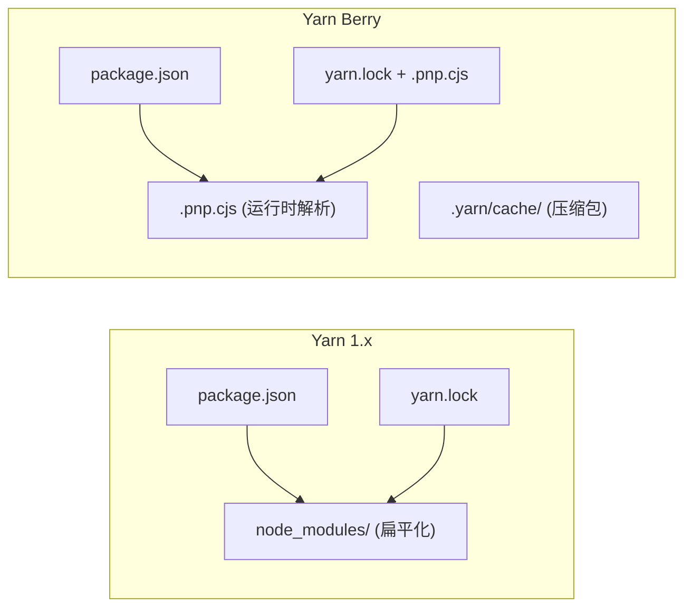

# Yarn Berry 解析

> Yarn 4.x: 重新定义 JavaScript 包管理

---

## 1. 版本演进

| 版本 | 代号 | 关键特性 |
|------|------|----------|
| Yarn 1.x | Classic | npm 替代品，扁平化 node_modules |
| Yarn 2.x | Berry | Plug'n'Play (PnP) 引入 |
| Yarn 3.x | Berry | Zero-install 增强，ESM 优化 |
| Yarn 4.x | Berry | 插件系统稳定，性能优化 |

---

## 2. Yarn 1.x vs Berry

### 2.1 核心差异


```mermaid
flowchart LR
    subgraph "Yarn 1.x"
        A1["package.json"]
        A2["yarn.lock"]
        A3["node_modules/ (扁平化)"]
    end

    subgraph "Yarn Berry"
        B1["package.json"]
        B2["yarn.lock + .pnp.cjs"]
        B3[".yarn/cache/ (压缩包)"]
        B4[".pnp.cjs (运行时解析)"]
    end

    A1 --> A3
    A2 --> A3
    B1 --> B4
    B2 --> B4
```

### 2.2 架构对比

```javascript
// Yarn 1.x: 传统 node_modules
// - 每个包一个目录
// - 嵌套依赖结构
// - 依赖提升（幽灵依赖风险）

// Yarn Berry: Plug'n'Play
// - 无 node_modules 目录
// - .pnp.cjs 管理所有包路径
// - 包从 .yarn/cache 运行时解压

// 实际目录对比
// Yarn 1.x:
// node_modules/
// ├── react/
// │   └── node_modules/
// │       └── loose-envify/

// Yarn Berry:
// .yarn/
// ├── cache/
// │   ├── react-18.2.0.cjs
// │   └── loose-envify-1.4.1.cjs
// .pnp.cjs  # 包解析器
```

---

## 3. Yarn PnP 机制

### 3.1 PnP 工作原理

```javascript
// .pnp.cjs 核心原理

// 1. 安装时生成 .pnp.cjs
// 包含所有包的元数据和路径映射

// 2. Node.js 通过 PnP API 解析模块
// require('react') -> 查找 .pnp.cjs -> 返回实际路径

// 3. 运行时加载
// 实际读取 .yarn/cache/react-18.2.0.cjs (压缩包)
```

### 3.2 .pnp.cjs 结构

```javascript
// .pnp.cjs 示例（简化）
module.exports = {
  // 包映射表
  dependencyTreeRoots: [
    { name: "my-app", reference: "./apps/web" },
    { name: "@myorg/shared", reference: "./packages/shared" }
  ],

  // 解析函数
  findPackageLocator: (name, { columns }) => {
    // 查找包的实际位置
    return {
      name,
      location: `.yarn/cache/${name}.cjs`
    };
  },

  // 兼容层
  enableGlobalMode: () => { /* ... */ }
};
```

### 3.3 PnP 优势

```javascript
// PnP 相比 node_modules 的优势

// 1. 解析速度更快
// - 扁平化映射表，O(1) 查找
// - 无需遍历目录结构

// 2. 磁盘占用更小
// - 包以压缩格式存储
// - 按需解压

// 3. 依赖关系清晰
// - 无依赖提升，无幽灵依赖
// - 每个包只能访问声明的依赖

// 4. 构建工具集成
// - 许多工具支持 PnP
// - ESLint, TypeScript, Jest
```

---

## 4. Zero-install 原理

### 4.1 什么是 Zero-install

```bash
# 传统 CI 流程
git clone -> npm install -> 运行测试
# 问题：每次都要下载安装，网络慢

# Zero-install 流程
git clone -> 直接运行
# 缓存已在仓库中，无需网络

# 实现：
# - .yarn/cache/ 存储压缩包
# - .yarn/plugins/ 存储 Yarn 插件
# - 全部提交到 Git
```

### 4.2 启用 Zero-install

```bash
# 1. 初始化 Berry
yarn set version berry

# 2. 启用 Zero-install
yarn config set enableGlobalCache true
yarn config set enableImmutableInstalls false

# 3. 配置 .gitignore（排除缓存）
# .gitignore
.yarn/*
!.yarn/plugins/
!.yarn/cache/
```

### 4.3 缓存管理

```javascript
// Yarn Berry 缓存策略

// 全局缓存（推荐 CI 使用）
# .yarnrc.yml
enableGlobalCache: true

// 本地缓存（适合开发）
enableGlobalCache: false

// 清理缓存
yarn cache clean        # 清理全局缓存
yarn cache clean --pattern "react"  # 清理特定包

// 查看缓存
yarn cache dir          # 缓存目录路径
yarn npm info           # 包信息
```

---

## 5. 插件系统

### 5.1 插件架构

```javascript
// Yarn Berry 插件类型

// 1. 协议插件 - 处理自定义协议
// eslint: -> @yarnpkg/eslint-plugin

// 2. 构建插件 - 执行构建步骤
// @yarnpkg/plugin-build-debug

// 3. CLI 插件 - 添加新命令
// @yarnpkg/plugin-git-versioning

// 4. 生命周期插件 - hook 构建过程
```

### 5.2 常用插件

```bash
# 安装插件
yarn plugin import interactive-tools  # 交互式搜索
yarn plugin import workspace-tools   # workspace 增强

# 内置插件（无需安装）
# - plugin-dlx: yarn dlx
# - plugin-init: yarn create
# - plugin-npm: npm 兼容
```

### 5.3 插件配置

```yaml
# .yarnrc.yml

# 插件列表
plugins:
  - path: .yarn/plugins/@yarnpkg/plugin-workspace-tools.cjs
    spec: "@yarnpkg/plugin-workspace-tools"
  - path: .yarn/plugins/@yarnpkg/plugin-interactive-tools.cjs
    spec: "@yarnpkg/plugin-interactive-tools"
```

---

## 6. TypeScript 配置

### 6.1 基本配置

```json
// tsconfig.json (PnP 模式)
{
  "compilerOptions": {
    "module": "nodenext",       // 启用 ESM
    "moduleResolution": "nodenext",
    // PnP 下模块解析
    "baseUrl": ".",
    "paths": {
      "@myorg/shared": ["./packages/shared/src"]
    }
  },
  // 使用 Yarn 的 TypeLink 插件加速
  "typescriptPlugins": [
    { "name": "@yarnpkg/typescript" }
  ]
}
```

### 6.2 VS Code 配置

```json
// .vscode/settings.json
{
  // 使用 Yarn PnP
  "javascript.preferences.packageManager": "yarn",
  // 启用 TypeScript 语言服务
  "typescript.tsdk": ".yarn/sdks/typescript/lib",
  // 修复导入
  "typescript.preferences.importModuleSpecifier": "non-relative"
}
```

### 6.3 PnP 兼容性问题

```javascript
// 常见问题及解决

// 问题：模块找不到
// 解决：确保 .pnp.cjs 在项目根目录

// 问题：ESLint 不工作
// 解决：使用 @yarnpkg/sdks
yarn dlx @yarnpkg/sdks vscode

// 问题：Jest 无法运行
// 解决：配置 Jest
// jest.config.js
module.exports = {
  preset: 'jest-pnp-resolver'
};

// 或使用 yarn workspaces foreach
yarn workspaces foreach run test
```

---

## 7. 工作流命令

### 7.1 基础命令

```bash
# 安装
yarn install              # 安装依赖
yarn add react            # 添加依赖
yarn add -D typescript    # 添加开发依赖

# 运行
yarn dev                  # 开发
yarn build                # 构建
yarn test                 # 测试

# 依赖管理
yarn up react             # 更新包
yarn up react@latest      # 更新到最新
yarn remove react         # 移除包
```

### 7.2 Workspace 命令

```bash
# workspace 相关
yarn workspaces info              # 显示 workspace 树
yarn workspaces foreach run build # 所有 workspace 运行 build

# 过滤运行
yarn workspace @myorg/web build   # 特定 workspace
yarn workspaces foreach -A build   # 包括依赖

# 添加依赖到 workspace
yarn workspace @myorg/web add @myorg/shared
```

### 7.3 工具命令

```bash
# 临时运行包
yarn dlx create-react-app my-app

# 版本管理
yarn version major        # 大版本更新
yarn version minor
yarn version patch

# 发布
yarn npm publish          # 发布到 npm
yarn npm tag add @myorg/shared@1.0.0 next
```

---

## 8. 与 pnpm 对比

### 8.1 核心差异

| 特性 | pnpm | Yarn Berry |
|------|------|------------|
| **模块格式** | Hard Link + Symlink | 压缩包 + .pnp.cjs |
| **Zero-install** | 不支持 | 支持 |
| **插件系统** | 有限 | 丰富 |
| **兼容性** | 最佳（node_modules 兼容） | 需配置（PnP） |
| **CI 缓存** | Store 共享 | 仓库内缓存 |

### 8.2 选型建议

```javascript
// 选择 pnpm 如果：
// - 需要最大兼容性（所有工具直接工作）
// - monorepo 项目
// - 团队习惯传统 node_modules 结构
// - 追求极致安装速度

// 选择 Yarn Berry 如果：
// - 使用 Zero-install（无网络 CI）
// - 需要丰富插件生态
// - 追求最新特性
// - 团队熟悉 Berry 工作流
```

---

## 9. 参考链接

- [Yarn Berry 官方文档](https://yarnpkg.com/)
- [Yarn PnP 详解](https://yarnpkg.com/features/pnp)
- [Zero-install 指南](https://yarnpkg.com/features/zero-install)
- [Yarn Berry GitHub](https://github.com/yarnpkg/berry)

---

*最后更新：2024-12*

## 深入阅读与参考

!!! tip "怎么用这些资料"
    先读「官方文档与规范」建立准确的概念，再读「源码与示例」核对细节，最后用「教程、书籍与视频」换一种讲法加深理解。每条都写明了读哪一节、带着什么问题读。

### 官方文档与规范

| 资源 | 为什么读 | 怎么读 |
|---|---|---|
| [pnpm 文档](https://pnpm.io/zh/motivation) | 讲清内容寻址存储与硬链接，是理解 Zero-install 与 PnP 取舍的基准。 | 读存储与 node_modules 结构章节，弄清硬链接与缓存复用原理，再与 Yarn 缓存机制比较。 |
| [TypeScript 模块解析](https://www.typescriptlang.org/docs/handbook/modules/introduction.html) | 官方解析规则说明，PnP 下模块解析差异必须回到这里核对。 | 读 moduleResolution 各取值一节，带着 PnP 无 node_modules 的前提读，再改配置验证。 |
| [TypeScript support](https://docs.deno.com/runtime/fundamentals/typescript/) | 官方 TypeScript 支持说明，帮助理解运行时侧对 TS 与依赖解析的要求。 | 读配置与类型检查相关小节，带着 PnP 下依赖解析的问题读，记下需要开启的选项。 |
| [Migrate from pnpm](https://docs.deno.com/runtime/migrate/migrate_from_pnpm/) | 官方 pnpm 迁移文档，可反向看清 Yarn 与 pnpm 在锁文件与依赖布局上的差异。 | 对照锁文件与 node_modules 章节，带着哪些机制 Yarn Berry 也做的问题读，整理差异表。 |
| [Migrate from Yarn](https://docs.deno.com/runtime/migrate/migrate_from_yarn/) | 官方迁移指南，说明从 Yarn 1 迁移时依赖与脚本的变更点。 | 读迁移步骤与环境要求，列出与 Yarn Berry 相关的差异清单，对照本页版本演进章节。 |
| [Configuring TypeScript](https://docs.deno.com/runtime/reference/ts_config_migration/) | 官方 TS 配置说明，对应本页 TypeScript 配置章节的落点。 | 读 compilerOptions 与路径映射部分，逐个对照自己项目的 tsconfig，勾出需调整项。 |

### 源码与示例

| 资源 | 为什么读 | 怎么读 |
|---|---|---|
| [Claude Agent SDK（TypeScript）](https://github.com/anthropics/claude-agent-sdk-typescript) | 可克隆运行的 TS 示例仓库，用来在 PnP 项目里验证依赖与构建链路。 | 克隆后按 README 跑通示例，观察 PnP 下依赖解析报错，再改成 workspace 引用自己模块。 |

### 教程、书籍与视频

| 资源 | 为什么读 | 怎么读 |
|---|---|---|
| [Yarn 入门](https://yarnpkg.com/getting-started) | 对比 Plug'n'Play 与 pnpm 的取舍，直接对应版本演进与对比章节。 | 读 PnP 与 pnpm 对比小节，记录各自适用场景；回来梳理 Yarn Berry 的定位与迁移收益。 |
| [pnpm 工作区（中文）](https://pnpm.io/zh/workspaces) | 中文工作区教程，对应本页工作流命令与 workspace 协议部分。 | 跟着建两个包并用 workspace 协议互引，跑通后再对比 Yarn workspaces 的命令差异。 |
| [pnpm 目录 catalogs](https://pnpm.io/catalogs) | 演示统一多包依赖版本，可与 Yarn constraints 做能力对照。 | 用 catalog 统一两个包的依赖版本，记下做法，回到 Yarn 用 constraints 实现同样效果。 |
| [tsdown](https://tsdown.dev/) | 打包 TS 库并输出声明，用来验证 Berry 项目里的构建工作流。 | 按文档打包一个库并检查产物与 d.ts，再在 Berry 工作区中接入该流程。 |

## 应用与行业实践

本页的知识点分两类：一类影响安装与解析阶段（PnP、Zero-install），另一类影响协作与配置阶段（workspaces、constraints、插件、TypeScript SDK）。下面把这两类放到具体场景里对照。

### 应用场景地图

| 场景 | 用到本页哪个知识点 | 典型技术选型 | 注意事项 |
| --- | --- | --- | --- |
| 后台管理系统的万行表格页面 | PnP 机制、TypeScript 配置 | Yarn 4 + Vite + 虚拟滚动表格 | PnP 下未在 package.json 声明的依赖会直接报错，需先补齐声明 |
| 低端安卓机上的首屏加载 | PnP 机制、与 pnpm 对比 | Yarn 4 + Rollup 或 Webpack 打包 | Yarn 管的是安装与解析；首屏体积由打包产物决定 |
| 多人协作白板的离线部署 | Zero-install 原理、插件系统 | Yarn 4 + 缓存提交 + 自研插件 | 缓存进版本库会放大仓库体积，需先评估 Git 仓库上限 |
| 多包共用组件库的 monorepo | 工作流命令、与 pnpm 对比 | yarn workspaces + constraints 插件 | 跨包版本漂移要靠 constraints 检查，不能只靠评审 |
| 内网交付的 Electron 桌面端 | Zero-install 原理、PnP 机制 | Yarn 4 + nodeLinker: node-modules + electron-builder | 打包工具读 node_modules 时需切换 linker 或标记 unplugged |
| CI 流水线每日多次构建 | Zero-install 原理、工作流命令 | Yarn 4 + `yarn install --immutable` | 提交缓存后 CI 不访问 registry，但要定期校验缓存完整 |
| 从 Yarn 1.x 迁移的老项目 | 版本演进、Yarn 1.x vs Berry | Yarn 4 + nodeLinker: node-modules 过渡 | 先切 linker 跑通构建，再逐个包打开 PnP |
| 构建工具链的定制需求 | 插件系统 | 自写 Yarn 插件注册新命令 | 插件要与 Yarn 主版本同步升级，升级前先跑回归 |

### 三个场景拆解

#### 场景 1：后台管理系统的万行表格

**业务背景**：表格页要在一个页面里渲染万级行，业务逻辑拆在 monorepo 的多个前端包里。排查线上问题时发现同一个库在同一份产物里出现多个版本，`yarn why` 能复现这个现象。

**怎么用本页知识解决**：思路是先让「用了没声明的依赖」在安装期失败，再用 `packageExtensions` 修补第三方包漏写的 peer 声明。

```yaml
# .yarnrc.yml
nodeLinker: pnp            # 启用 PnP 解析，依赖不再落盘到 node_modules
enableGlobalCache: false   # 缓存写进项目目录，便于提交与离线复用
packageExtensions:         # 上游包漏声明 peer 时在这里补齐
  "ui-table@*":
    peerDependencies:
      react: "*"
```

- `nodeLinker: pnp` 让包只能引用自己 package.json 里声明过的依赖，幽灵依赖会在安装期报错。
- 报错信息会直接给出缺失的包名和请求方，按提示补声明即可，不用去翻 lockfile。
- `packageExtensions` 只用于上游包漏声明的情况；自家包漏声明应该直接改 package.json。
- `enableGlobalCache: false` 是把缓存放进项目的 `.yarn/cache`，这一步同时为后续 Zero-install 做准备。

**怎么度量收益**：用 `yarn why <包名>` 记录同一依赖被解析出的版本条目数；用 `webpack-bundle-analyzer` 或 `rollup-plugin-visualizer` 统计产物中重复模块的数量；用 CI 步骤耗时（`time yarn install`）记录安装阶段变化。

**什么时候不该用**：团队还在依赖只读 node_modules 的构建或测试工具，短期内不能替换，开 PnP 会卡住流水线。项目只有一个包、依赖数量很少，维护 constraints 与 PnP 报错的成本收不回来。

#### 场景 2：低端安卓机上的首屏加载

**业务背景**：H5 页面要投放到低端安卓机，卡顿集中在首屏 JS 体积上。可复现的测量方式是在开发者工具里开启 CPU 降速与网络节流，再看产物体积与重复模块。

**怎么用本页知识解决**：思路是用 PnP 的严格解析把重复版本的依赖暴露出来，再用 `resolutions` 强制整棵树只保留一个版本。

```jsonc
// package.json（节选）
{
  "dependencies": {
    "react": "^18.0.0",      // 业务包自己声明，不靠上层传递
    "react-dom": "^18.0.0"
  },
  "resolutions": {
    "react": "^18.0.0"       // 强制整个依赖树只保留一个 react 版本
  }
}
```

- `resolutions` 是收口重复版本的入口，写完后要重新 `yarn install` 并确认 lockfile 里只剩一条解析结果。
- 声明在业务包自己的 `dependencies` 里，包被单独复用时不会因为上层没传下来而失败。
- 版本收口会改变依赖树，改完必须跑一遍单元测试与端到端测试，避免某个库依赖旧版本 API。
- 收口只影响打包时的模块数量，首屏还受代码分割与资源加载策略影响，要分开测量。

**怎么度量收益**：指标选产物 gzip 体积、打包分析工具里的重复模块数、首屏 LCP。测量方式：`rollup-plugin-visualizer` 看体积构成，`gzip -c dist/app.js | wc -c` 复现压缩后体积，开发者工具里开启 CPU 降速复现低端机表现。

**什么时候不该用**：项目依赖很少且已经锁定单版本，重复模块本来就不存在，加 `resolutions` 只会给升级带来摩擦。共享全局缓存且不需要离线安装时，把 `.yarn/cache` 提交进仓库拿不到收益。

#### 场景 3：内网离线交付的多人协作白板

**业务背景**：交付环境的机器不能访问公网 npm 源，白板前端在 monorepo 里拆成多个包。每次发布都要把依赖装进离线包，安装失败会直接挡住发版。

**怎么用本页知识解决**：思路是把解析结果与依赖缓存一起提交进仓库，让 checkout 之后不需要网络就能完成安装。

```yaml
# .yarnrc.yml
nodeLinker: node-modules      # 交付链路里仍有工具读取 node_modules 时保留
enableGlobalCache: false      # 缓存放进项目 .yarn/cache，随仓库一起交付
enableImmutableInstalls: true # 交付环境禁止改写 lockfile
npmRegistryServer: "<内网源地址>"  # 指向内网源或离线镜像
```

- `enableGlobalCache: false` 是前提：缓存留在项目内，才能跟仓库一起被拷进内网。
- 缓存目录不能被 `.gitignore` 排除，`.pnp.cjs`（或 `.pnp.loader.mjs`）同样要提交。
- `enableImmutableInstalls: true` 让包与 lockfile 不一致时直接失败，避免内网环境悄悄生成一份新 lockfile。
- 内网源地址写在 `.yarnrc.yml` 而不是个人配置里，换机器后行为一致。
- 依赖里如果有本地编译的 native 模块，提交前先确认缓存里的压缩包能在目标平台解出可运行的文件。

**怎么度量收益**：指标选断网环境下 `yarn install --immutable` 的成功率与耗时，以及克隆仓库的体积。测量方式：`time yarn install --immutable` 记录耗时，`du -sh .yarn/cache` 记录缓存体积，把两组数字写进发布检查单。

**什么时候不该用**：Git 仓库有硬性体积上限，或团队不愿意承担缓存二进制带来的克隆成本。依赖里包含体积偏大的预编译产物，提交缓存后克隆时间超过安装节省的时间。

### 行业先进实践

Zero-Installs（出处：Yarn 官方文档 Zero-Installs）。做法是把 `.yarn/cache` 与 `.pnp.cjs` 提交进仓库，让检出代码后无需联网即可安装。生效的原因是安装步骤变成解压与校验本地压缩包，CI 与离线环境不再请求 registry。借鉴方式：先在 CI 加一步 `yarn install --immutable` 并记录耗时，再决定是否提交缓存。

Editor SDKs（出处：Yarn 官方文档 Editor SDKs）。做法是用 `yarn dlx @yarnpkg/sdks vscode` 生成编辑器配置，让 TS 服务读取 PnP 的解析结果。生效的原因是编辑器与命令行用同一套解析规则，跳转与类型提示不会指向另一份依赖。借鉴方式：把这条命令写进仓库 README 的新环境初始化步骤。

packageExtensions（出处：Yarn 官方文档 packageExtensions）。做法是在 `.yarnrc.yml` 里为漏声明 peerDependencies 的上游包补声明。生效的原因是 PnP 把上游包的错误暴露在安装期，而不是留到运行期。借鉴方式：每次因 PnP 报错时先判断是自家包还是上游包漏声明，只把后者写进 `packageExtensions`。

Constraints（出处：Yarn 官方文档 Constraints）。做法是用声明式规则约束 monorepo 内各包的依赖范围与字段一致性，用 `yarn constraints` 检查、用 `yarn constraints --fix` 修复。生效的原因是把版本对齐从人工评审变成可执行的检查。借鉴方式：先写一条规则，要求同一依赖在所有包里使用同一 range，跑通后再加规则。

打包器与测试框架对 PnP 的支持现状（需核对官方文档：核对该项目官方文档是否给出 PnP 兼容说明，是否要求把特定依赖标记为 `dependenciesMeta.unplugged`）。核对后再决定这个包用 PnP 还是切回 node-modules。

### 从学到用：落地路线

第 1 步：在一个依赖数量少、CI 已稳定的前端单包上试点，把 `nodeLinker` 设为 `pnp`。验收标准：本地 `yarn install` 与 CI 构建都通过，`yarn why <生产依赖>` 输出唯一版本。

第 2 步：用可复现实验验证收益，记录开关 PnP 前后的安装耗时与打包重复模块数。验收标准：两组数字都有记录命令，且没有把新出现的未声明依赖报错改成忽略。

第 3 步：推广到 monorepo 全部包，并加上 constraints 检查与 `--immutable` 安装。验收标准：CI 里 `yarn constraints` 与 `yarn install --immutable` 都是必过步骤。

第 4 步：把检查固化到 CI 与提交前钩子，并在 `.yarnrc.yml` 里固定 `yarnPath` 与插件版本。验收标准：手动删掉一条依赖声明后，CI 必须失败。

### 动手作业

**目标**：在一个含两个包的小 monorepo 上跑通 PnP 加 Zero-install，并量化安装阶段的变化。

**步骤**：

1. 新建空仓库，用 `yarn init -2` 初始化，确认仓库里出现 `.yarnrc.yml` 与 `.yarn/releases`。
2. 建 `packages/app` 与 `packages/lib` 两个 workspace，在根 `package.json` 的 `workspaces` 字段声明它们。
3. 在 `.yarnrc.yml` 写入 `nodeLinker: pnp` 与 `enableGlobalCache: false`，执行 `yarn install`。
4. 在 `packages/app` 里引用一个只写在 `packages/lib` 的依赖，记录报错信息中的包名。
5. 把 `.yarn/cache` 与 `.pnp.cjs` 提交，并在 `.gitignore` 里确认没有被排除。
6. 用 `yarn dlx @yarnpkg/sdks vscode` 生成编辑器 SDK，确认编辑器能跳转到依赖源码。
7. 在仓库脚本里加入 `yarn workspaces foreach -A run build`，并用 `du -sh .yarn/cache` 记录缓存体积。

**验收标准**：

- 清空全局缓存并断网后，`yarn install --immutable` 仍然成功退出。
- 未在包内声明的依赖会让构建或 `yarn node` 报错，错误信息里指出缺失的包名。
- 仓库中存在 `.pnp.cjs` 与 `.yarn/cache`，且两者都没有被忽略规则排除。
- `yarn workspaces foreach -A run build` 一次跑完两个包，退出码为 0。
- README 里记录了安装耗时与缓存体积的测量命令，并贴出两组实测数字。

