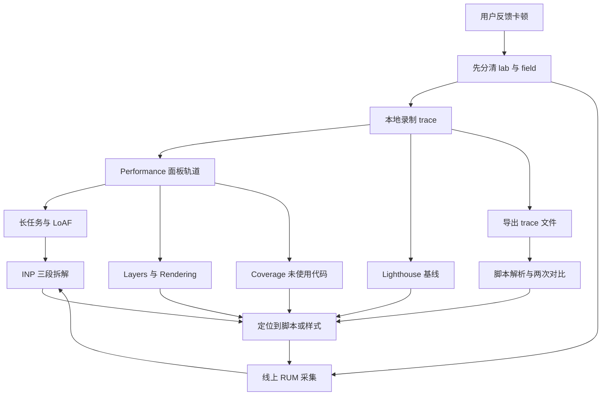
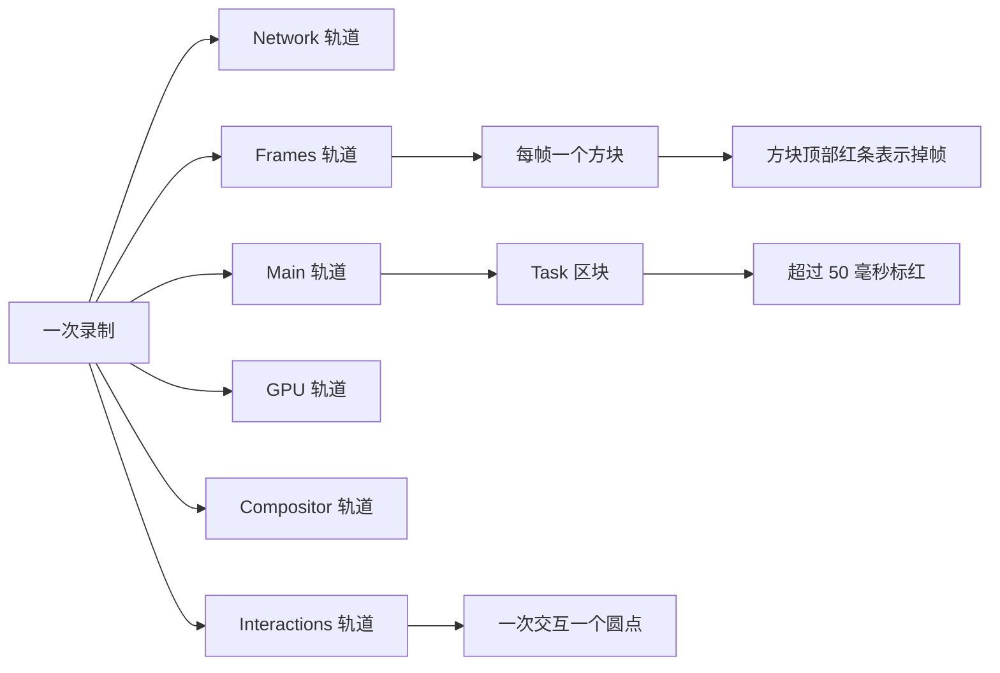
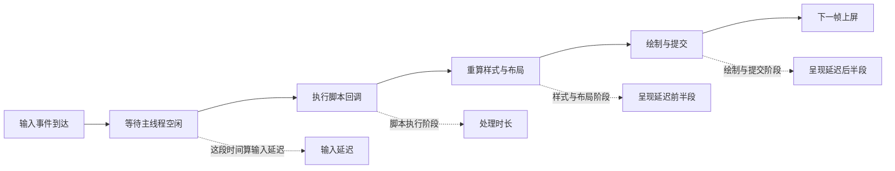
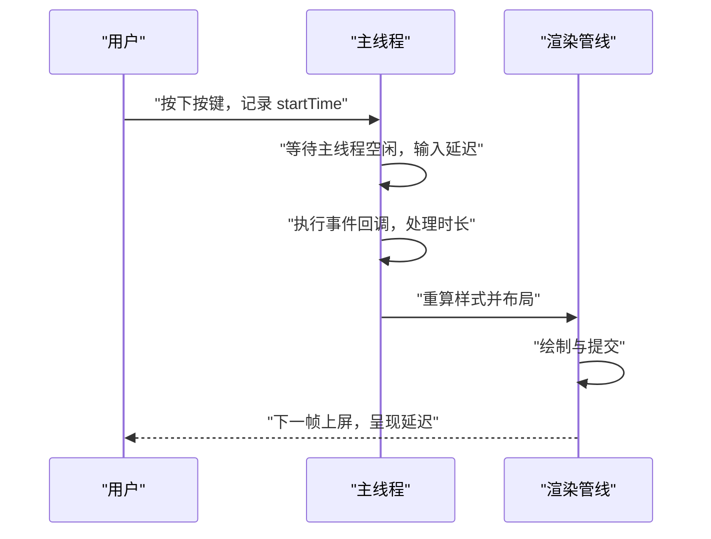
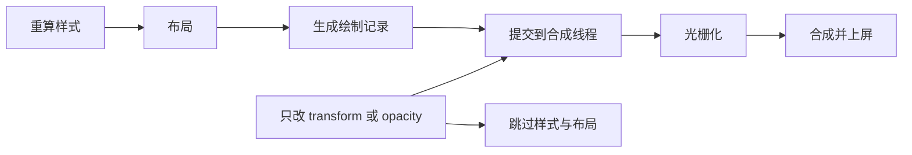
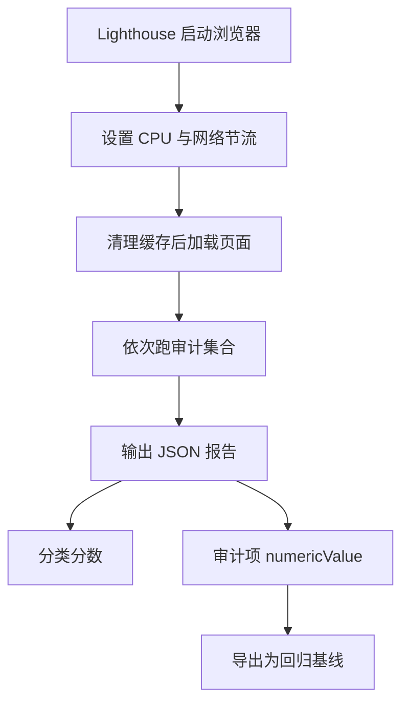
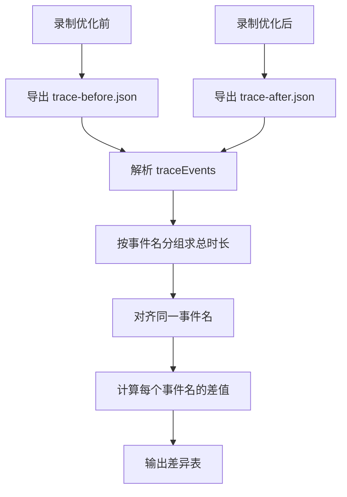
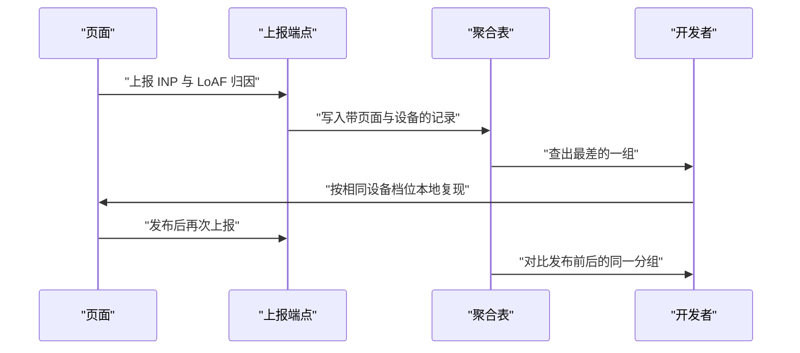
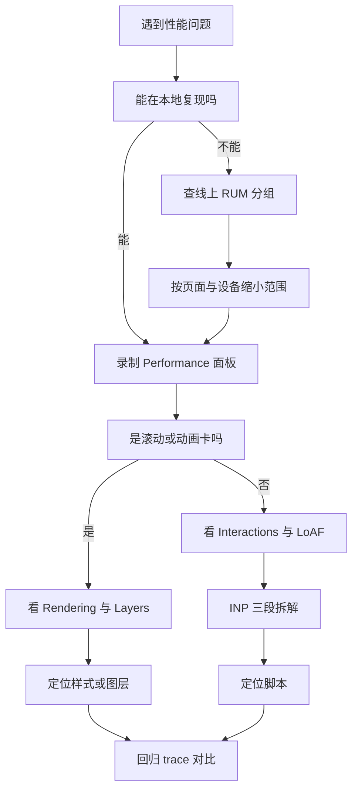

# 性能分析方法论（二）：现代工具链

!!! abstract "学完这一页你能"
    - 说出 Performance 面板六类轨道各自记录什么，并在 60 秒内找到主线程阻塞区间。
    - 用 LoAF 条目的 renderStart、styleAndLayoutStart、blockingDuration 解释一帧为什么长。
    - 把一次交互拆成输入延迟、处理时长、呈现延迟，并给出每一段对应的修复动作。
    - 导出 trace 文件，用一段 Node 脚本对比优化前后两次录制，并把结论接到线上 RUM。

## 0. 知识地图



建议按顺序读：先读第 1 节建立"轨道"这个坐标系，再读第 2、3 节把"长任务"和"INP"接到坐标上。

第 4、5、6 节是三种专项工具，可以按当前问题跳读，但第 6 节的脚本是后面所有对比的基础。

第 7、8 节负责收口：把本地结论接到线上数据，再用决策图选下一次要打开的工具。

!!! note "术语：lab 数据与 field 数据"
    lab 数据指在受控环境里跑出来的数据，例子：本地 DevTools 录制的 trace。field 数据指真实用户设备上采集的数据，例子：RUM 上报的 INP。两者口径不同，不能直接相互换算。

## 1. Performance 面板各轨道

**先想一个问题**

用户说列表页滚动时一顿一顿。你按下录制，屏幕上出现十几条彩色横条。

你不知道先看哪一条，也不确定横条的颜色代表什么。

**心智模型**

!!! tip "心智模型"
    一句话模型：Performance 面板是多路示波器，每条轨道是一条通道，共用同一根时间轴。
    日常类比：做心电图时一次贴上多个电极，在同一横轴上同时看心脏、呼吸、血压。
    类比不成立的地方：心电图各通道互不干扰，Performance 的轨道有因果，主线程任务会把合成线程的提交往后推。

**图解**



1. 录制开始后，浏览器把所有线程的事件写进一个事件数组。
2. Network 轨道记录请求的开始与结束，用来排除"慢在网络上"。
3. Frames 轨道把每一帧画成一个方块，方块是否有红条决定要不要继续往下查。
4. Main 轨道是主线程，Task 区块是一次任务，超过 50 毫秒会被标红。
5. GPU 与 Compositor 轨道记录光栅化与合成动作，滚动卡顿通常先看这两条。
6. Interactions 轨道标出用户交互发生的位置，是 INP 归因的入口。

**一步一步来**

第 1 步要做什么：把 trace 文件读进内存，确认它是一个合法对象。

```js
// 目的：把 DevTools 导出的 trace 文件读成 JavaScript 对象
const fs = require('node:fs');

// 读取 Performance 面板导出的 trace 文件
const raw = fs.readFileSync('./Trace-export.json', 'utf8');
// 顶层是一个对象，事件都放在 traceEvents 数组里
const trace = JSON.parse(raw);
// 先打印长度，确认读到的不是空文件
console.log('事件条数', trace.traceEvents.length);
```

**这段代码在做什么**

- 用 `node:fs` 的 `readFileSync` 一次性读入整个文件，trace 文件常见体量在几十兆，不要用流式分片。
- `JSON.parse` 把文本转成对象，之后所有分析都在内存里做。
- `traceEvents` 是事件数组，这是 Trace Event Format 的顶层字段。
- 打印长度是最便宜的健全性检查，长度为 0 说明导出失败。

运行结果：

```text
事件条数 48213
```

第 2 步要做什么：按线程分组，把"一张混乱的事件表"变成"每条轨道一行统计"。

```js
// 目的：按 pid 与 tid 分组，得到每条轨道的事件数与总时长
function groupByTrack(events) {
  const byTrack = new Map(); // key 形如 pid1-tid10
  for (const e of events) {
    if (e.ph !== 'X' || typeof e.dur !== 'number') continue; // 只保留带时长的区间事件
    const key = 'pid' + e.pid + '-tid' + e.tid;
    const row = byTrack.get(key) || { count: 0, totalDur: 0 };
    row.count += 1;        // 事件条数加一
    row.totalDur += e.dur; // 时长单位是微秒，累加后再换算
    byTrack.set(key, row);
  }
  return byTrack;
}
```

**这段代码在做什么**

- `ph` 是事件类型，`X` 表示"有开始和结束的区间"，这类事件才带 `dur`。
- `pid` 是进程号，`tid` 是线程号，两者组合唯一确定一条轨道。
- `Map` 的键用字符串拼接，避免数字相加导致键冲突。
- `totalDur` 单位是微秒，1000 微秒等于 1 毫秒，后面除以 1000 才是毫秒。
- 跳过没有 `dur` 的事件，可以去掉瞬时标记对统计的干扰。

第 3 步要做什么：按总时长排序，打印占用最高的三条轨道。

```js
// 目的：把分组结果排序，打印占用最高的三条轨道
const rows = Array.from(byTrack, function (pair) {
  return { track: pair[0], count: pair[1].count, totalDur: pair[1].totalDur };
}).sort(function (a, b) {
  return b.totalDur - a.totalDur; // 降序
});
for (const row of rows.slice(0, 3)) {
  console.log(row.track, row.count, (row.totalDur / 1000).toFixed(1) + 'ms');
}
```

**这段代码在做什么**

- `Array.from` 把 `Map` 的键值对数组转成对象数组，方便排序。
- 排序函数返回 `b.totalDur - a.totalDur` 表示从大到小。
- `slice(0, 3)` 只取前三条，避免终端被刷屏。
- `toFixed(1)` 把微秒换算成毫秒并保留一位小数。

运行结果：

```text
pid1-tid10 412 1860.4ms
pid1-tid12 96 240.7ms
pid1-tid11 143 118.2ms
```

**动手验证**

依赖：无，只用 Node 20+ 内置模块。把下面整段存成 `tracks.js`，然后运行 `node tracks.js`。

```js
// 依赖：无，仅 Node 20+ 内置模块
const assert = require('node:assert/strict');

// 造一份小 trace，字段名与真实 trace 一致
const rawTrace = {
  traceEvents: [
    { name: 'RunTask', ph: 'X', ts: 1000, dur: 80, pid: 1, tid: 10 },
    { name: 'RunTask', ph: 'X', ts: 1200, dur: 40, pid: 1, tid: 10 },
    { name: 'FunctionCall', ph: 'X', ts: 1250, dur: 25, pid: 1, tid: 10 },
    { name: 'Commit', ph: 'X', ts: 1300, dur: 5, pid: 1, tid: 11 },
    { name: 'RasterTask', ph: 'X', ts: 1310, dur: 12, pid: 1, tid: 12 },
    { name: 'instant-marker', ph: 'i', ts: 1320, pid: 1, tid: 12 },
  ],
};

function summarizeTracks(events) {
  const byTrack = new Map();
  for (const e of events) {
    if (e.ph !== 'X' || typeof e.dur !== 'number') continue;
    const key = 'pid' + e.pid + '-tid' + e.tid;
    const row = byTrack.get(key) || { count: 0, totalDur: 0, names: new Set() };
    row.count += 1;
    row.totalDur += e.dur;
    row.names.add(e.name);
    byTrack.set(key, row);
  }
  return Array.from(byTrack, function (pair) {
    return {
      track: pair[0],
      count: pair[1].count,
      totalDur: pair[1].totalDur,
      names: Array.from(pair[1].names),
    };
  }).sort(function (a, b) {
    return b.totalDur - a.totalDur;
  });
}

const rows = summarizeTracks(rawTrace.traceEvents);
console.log(JSON.stringify(rows, null, 2));

assert.equal(rows.length, 3, '应当得到三条轨道');
assert.equal(rows[0].track, 'pid1-tid10');
assert.equal(rows[0].count, 3);
assert.equal(rows[0].totalDur, 145);
assert.deepEqual(rows[0].names, ['RunTask', 'FunctionCall']);
assert.equal(rows[1].totalDur, 12);
console.log('断言全部通过');
```

预期输出：

```text
[
  {
    "track": "pid1-tid10",
    "count": 3,
    "totalDur": 145,
    "names": ["RunTask", "FunctionCall"]
  },
  { "track": "pid1-tid12", "count": 1, "totalDur": 12, "names": ["RasterTask"] },
  { "track": "pid1-tid11", "count": 1, "totalDur": 5, "names": ["Commit"] }
]
断言全部通过
```

**常见坑**

| 现象 | 原因 | 怎么修 |
|:--|:--|:--|
| 看到红色长任务就认定它是卡顿原因 | 红色只表示这段任务超过 50 毫秒，与用户输入无必然关系 | 先看 Interactions 轨道有没有圆点落在这段任务上 |
| 开发机上录制总能复现掉帧 | 扩展程序与 source map 会额外占用主线程 | 用无痕窗口录制，或把结论拿到 RUM 上确认 |
| 轨道统计里主线程时长占满整段录制 | 录制时页面一直在跑动画循环 | 剪出目标区间再统计，不要用整个录制时长做分母 |

**小结**

- Performance 面板是时间轴对齐的多通道记录，先选轨道再看细节。
- 主线程轨道回答"谁占了时间"，Frames 轨道回答"用户看到什么"。
- 只看总和会误导，必须配合 Interactions 的位置信息。

## 2. Long Tasks 与 LoAF

**先想一个问题**

点击按钮后 600 毫秒才有反应，主线程上有一块 480 毫秒的红色任务。

这块任务里几十个函数叠在一起，你不知道哪一个占了大头。

**心智模型**

!!! tip "心智模型"
    一句话模型：长任务给出"这段时间被占用了"，LoAF 给出"这段时间里各阶段分别占了多少"。
    日常类比：快递单上写着"配送耗时 3 小时"，明细里写了取件 20 分钟、路上 2 小时、找门牌 40 分钟。
    类比不成立的地方：LoAF 只在渲染帧的语境下生成，不是每一个长任务都会产出 LoAF 条目。

!!! note "术语：长任务"
    长任务指主线程上连续占用时间超过 50 毫秒的任务。例子：一次 300 毫秒的 JSON 解析，期间输入事件只能排队。

!!! note "术语：LoAF"
    LoAF 是 Long Animation Frame 的缩写，中文为长动画帧。它是一个性能条目对象，包含这一帧的 renderStart、styleAndLayoutStart、blockingDuration 以及脚本数组。

**图解**



1. 输入事件到达浏览器进程后等待主线程空闲，等待时间计入输入延迟。
2. 主线程开始执行事件回调，这段是脚本执行阶段。
3. 回调结束后重算样式并布局，LoAF 用 styleAndLayoutStart 标出这一步的起点。
4. 绘制与提交把结果交给合成线程。
5. 下一帧上屏，交互到此结束，整个过程构成一次 INP。

**一步一步来**

第 1 步要做什么：用 Long Tasks API 订阅超过 50 毫秒的任务。

```js
// 目的：在浏览器里订阅长任务，把开始时间与耗时打到控制台
const observer = new PerformanceObserver(function (list) {
  for (const entry of list.getEntries()) {
    // duration 单位是毫秒，已经在 50 以上
    console.log('长任务', entry.startTime.toFixed(0), entry.duration.toFixed(0));
    // attribution 描述是谁触发的，字段内容需核对官方文档
    console.log('归因条数', entry.attribution.length);
  }
});
// buffered 为 true 时会补发订阅之前已经产生的条目
observer.observe({ type: 'longtask', buffered: true });
```

**这段代码在做什么**

- `PerformanceObserver` 是异步订阅接口，回调在条目产生后触发。
- `entry.startTime` 是相对页面加载的高精度时间戳，单位毫秒。
- `entry.duration` 就是这段任务占用的毫秒数，阈值 50 由规范写死。
- `entry.attribution` 是归因数组，里面的字段随浏览器版本变化，需核对官方文档。
- `buffered: true` 让订阅者拿到订阅之前已经产生的条目。

第 2 步要做什么：用 LoAF 把一帧内部的阶段切开。

```js
// 目的：订阅长动画帧，拆出一帧内的渲染起点与阻塞时长
const loafObserver = new PerformanceObserver(function (list) {
  for (const frame of list.getEntries()) {
    console.log('帧总长', frame.duration.toFixed(0));
    // renderStart 是渲染开始的相对时间
    console.log('渲染起点', frame.renderStart.toFixed(0));
    // styleAndLayoutStart 是样式与布局开始的相对时间
    console.log('样式布局起点', frame.styleAndLayoutStart.toFixed(0));
    // blockingDuration 是这一帧里超过阈值的任务时间之和
    console.log('阻塞时长', frame.blockingDuration.toFixed(0));
    for (const script of frame.scripts) {
      // 每个脚本条目对应一段被归因的脚本执行
      console.log('脚本', script.sourceURL, script.duration.toFixed(0));
    }
  }
});
loafObserver.observe({ type: 'long-animation-frame', buffered: true });
```

**这段代码在做什么**

- `duration` 是这一帧从开始到上屏的总毫秒数。
- `renderStart` 标出渲染更新的起点，它与帧起点的差可用来估算输入延迟。
- `styleAndLayoutStart` 标出样式与布局的起点，两张起点把帧切成三段。
- `blockingDuration` 是这帧里所有超阈值任务的时间之和，需核对官方文档确认扣减规则。
- `scripts` 数组里的 `sourceURL` 与 `duration` 是把问题落到具体文件的关键字段。

**动手验证**

依赖：无，仅 Node 20+ 内置模块。下面脚本用一份模拟的 LoAF 数据做同样的归因计算。

!!! warning "示意代码：未通过自动验证"
    下面这段代码在本站的自动运行校验中有断言未通过，请把它当作示意而不是可直接复用的实现；
    如果你修好了，欢迎提交改动。

```js
// 依赖：无，仅 Node 20+ 内置模块
const assert = require('node:assert/strict');

// 模拟两条 LoAF 记录，字段名与浏览器一致
const frames = [
  {
    duration: 240,
    renderStart: 60,
    styleAndLayoutStart: 180,
    blockingDuration: 150,
    scripts: [
      { sourceURL: 'https://site/a.js', duration: 120, forcedStyleAndLayoutDuration: 20 },
      { sourceURL: 'https://site/b.js', duration: 18, forcedStyleAndLayoutDuration: 0 },
    ],
  },
  {
    duration: 90,
    renderStart: 20,
    styleAndLayoutStart: 70,
    blockingDuration: 40,
    scripts: [
      { sourceURL: 'https://site/b.js', duration: 30, forcedStyleAndLayoutDuration: 0 },
    ],
  },
];

function totalBlocking(frames) {
  return frames.reduce(function (sum, f) { return sum + f.blockingDuration; }, 0);
}

function worstScript(frames) {
  let best = null;
  for (const f of frames) {
    for (const s of f.scripts) {
      if (!best || s.duration > best.duration) best = s;
    }
  }
  return best;
}

function scriptShare(frame) {
  const sum = frame.scripts.reduce(function (acc, s) { return acc + s.duration; }, 0);
  return sum / frame.duration; // 脚本占这一帧的比例
}

console.log('阻塞总时长', totalBlocking(frames));
console.log('最长脚本', worstScript(frames).sourceURL, worstScript(frames).duration);
console.log('第一帧脚本占比', scriptShare(frames[0]).toFixed(2));

assert.equal(totalBlocking(frames), 190);
assert.equal(worstScript(frames).sourceURL, 'https://site/a.js');
assert.equal(scriptShare(frames[0]).toFixed(2), '0.58');
console.log('断言全部通过');
```

预期输出：

```text
阻塞总时长 190
最长脚本 https://site/a.js 120
第一帧脚本占比 0.58
断言全部通过
```

**常见坑**

| 现象 | 原因 | 怎么修 |
|:--|:--|:--|
| Long Tasks 只报超过 50 毫秒的任务 | 阈值写死在规范里，短任务不进队列 | 用 LoAF 的 scripts 数组补齐脚本级归因 |
| LoAF 里 scripts 为空 | 这段帧长来自浏览器自身工作，不是页面脚本 | 改看 Rendering 与 Compositor 轨道 |
| 阻塞时长之和大于帧总长 | 统计时把父任务与子任务重复累加 | 只对叶子脚本条目求和，或直接读 blockingDuration |

**小结**

- 长任务给区间，LoAF 给区间内部的阶段切分，两者要配合使用。
- renderStart、styleAndLayoutStart、blockingDuration 是 LoAF 的三个关键量。
- 落到文件名要靠 scripts 数组里的 sourceURL。

## 3. INP 三段式拆解

**先想一个问题**

线上 INP 是 200 毫秒，已经超过 200 毫秒的目标线。

你不知道时间花在排队、花在回调、还是花在上屏。

**心智模型**

!!! tip "心智模型"
    一句话模型：一次交互的耗时等于输入延迟加处理时长加呈现延迟。
    日常类比：去餐厅点菜，先排队等服务员，再点单并与后厨确认，最后等菜上桌。
    类比不成立的地方：菜可以提前做好，浏览器必须等回调执行完才能绘制下一帧，三段不能真正并行。

!!! note "术语：INP"
    INP 是 Interaction to Next Paint 的缩写，中文为交互到下一次绘制。它衡量用户操作到界面出现反馈的时间，取值口径需核对官方文档：采集端用的是哪个百分位。

**图解**



1. 用户按下按键，浏览器记录事件的 startTime。
2. 事件进入队列，等主线程空闲下来才开始处理，这段是输入延迟。
3. 主线程执行监听器，处理起点是 processingStart，终点是 processingEnd。
4. 回调结束后重算样式、布局、绘制并提交。
5. 下一帧上屏，交互结束，总耗时就是这次的 INP。

!!! note "术语：输入延迟"
    输入延迟是事件产生到事件开始被处理的这段时间。例子：上一段脚本还在跑，点击事件排队等了 80 毫秒，这 80 毫秒就是输入延迟。

**一步一步来**

第 1 步要做什么：订阅 event 类型的性能条目，拿到每次交互的原始时间。

```js
// 目的：订阅事件计时条目，收集交互原始数据
const eventEntries = [];
const eventObserver = new PerformanceObserver(function (list) {
  for (const entry of list.getEntries()) {
    // duration 是从事件产生到下一次绘制的总毫秒数
    eventEntries.push({
      name: entry.name,                    // 事件类型，例如 pointerdown
      startTime: entry.startTime,          // 事件产生时间
      processingStart: entry.processingStart, // 开始执行监听器的时间
      processingEnd: entry.processingEnd,  // 监听器执行结束时间
      duration: entry.duration,            // 到绘制结束的总时长
      interactionId: entry.interactionId,  // 同一次交互共享的编号
    });
  }
});
eventObserver.observe({ type: 'event', buffered: true, durationThreshold: 16 });
```

**这段代码在做什么**

- `durationThreshold` 用来过滤掉过短的事件，单位是毫秒。
- `startTime` 到 `processingStart` 是输入延迟，这是主线程繁忙的直接证据。
- `processingStart` 到 `processingEnd` 是处理时长，由回调自身决定。
- `duration` 减去已经过去的处理结束时间，剩下的是呈现延迟。
- `interactionId` 让同一次交互的多个事件能归到一组。

第 2 步要做什么：把一次交互拆成三段。

```js
// 目的：把单条事件拆成输入延迟、处理时长、呈现延迟
function splitPhases(entry) {
  const inputDelay = entry.processingStart - entry.startTime;
  const processing = entry.processingEnd - entry.processingStart;
  // 事件结束时间减去处理结束时间，剩下的就是呈现阶段
  const presentation = entry.startTime + entry.duration - entry.processingEnd;
  return {
    inputDelay: inputDelay,
    processing: processing,
    presentation: presentation,
  };
}
```

**这段代码在做什么**

- 输入延迟用两个时间戳相减，单位毫秒。
- 处理时长同样用两个时间戳相减。
- 呈现延迟用 `startTime + duration` 得到事件总结束点，再减去 `processingEnd`。
- 三段相加应当等于 `duration`，这是自检的关键等式。

第 3 步要做什么：把同一次交互的多个事件合成一个 INP 值。

```js
// 目的：按 interactionId 分组，取最慢的一条作为这次交互的 INP
function groupByInteraction(entries) {
  const groups = new Map();
  for (const e of entries) {
    if (!e.interactionId) continue; // 没有交互编号的事件排除
    const list = groups.get(e.interactionId) || [];
    list.push(e);
    groups.set(e.interactionId, list);
  }
  return groups;
}

// 每一次交互的耗时取组内最大的 duration
function interactionDuration(list) {
  return Math.max.apply(null, list.map(function (e) { return e.duration; }));
}
```

**这段代码在做什么**

- 没有 `interactionId` 的事件不属于任何交互，直接跳过。
- 用 `Map` 把同组事件放在一起，key 就是交互编号。
- 组内取最大 `duration`，与 INP 的"取最慢事件"口径一致。
- 归组之后就能算出整站的 INP 分布，而不是逐条事件看。

**动手验证**

依赖：无，仅 Node 20+ 内置模块。

```js
// 依赖：无，仅 Node 20+ 内置模块
const assert = require('node:assert/strict');

// 模拟一次点击产生的三条事件，interactionId 相同
const entries = [
  { name: 'pointerdown', startTime: 1000, processingStart: 1080, processingEnd: 1120, duration: 190, interactionId: 7 },
  { name: 'pointerup', startTime: 1150, processingStart: 1160, processingEnd: 1170, duration: 80, interactionId: 7 },
  { name: 'click', startTime: 1200, processingStart: 1230, processingEnd: 1260, duration: 100, interactionId: 7 },
  { name: 'pointermove', startTime: 1300, processingStart: 1302, processingEnd: 1304, duration: 6, interactionId: 0 },
];

function splitPhases(entry) {
  return {
    inputDelay: entry.processingStart - entry.startTime,
    processing: entry.processingEnd - entry.processingStart,
    presentation: entry.startTime + entry.duration - entry.processingEnd,
  };
}

function worstOf(entries) {
  const withId = entries.filter(function (e) { return e.interactionId; });
  return withId.reduce(function (worst, e) {
    return e.duration > worst.duration ? e : worst;
  });
}

const worst = worstOf(entries);
const phases = splitPhases(worst);
console.log('最慢事件', worst.name, worst.duration);
console.log('输入延迟', phases.inputDelay);
console.log('处理时长', phases.processing);
console.log('呈现延迟', phases.presentation);

assert.equal(worst.name, 'pointerdown');
assert.equal(phases.inputDelay, 80);
assert.equal(phases.processing, 40);
assert.equal(phases.presentation, 70);
assert.equal(phases.inputDelay + phases.processing + phases.presentation, worst.duration);
console.log('三段之和等于总时长，断言通过');
```

预期输出：

```text
最慢事件 pointerdown 190
输入延迟 80
处理时长 40
呈现延迟 70
三段之和等于总时长，断言通过
```

**常见坑**

| 现象 | 原因 | 怎么修 |
|:--|:--|:--|
| 三段相加比 duration 少 | 用了 `processingEnd` 之外的时间戳做减法 | 统一用 startTime 加 duration 作为终点 |
| 同一次点击被算成三次交互 | 没有按 interactionId 归组 | 归组后再取组内最大 duration |
| INP 忽高忽低看不出规律 | 高百分位对样本量敏感 | 同时看中位数与高百分位，并按页面分组 |

**小结**

- 输入延迟对应主线程排队，处理时长对应回调代码，呈现延迟对应渲染提交。
- 三段之和必须等于 duration，这是判断采集是否可信的第一道检查。
- 归组要按 interactionId，否则一次点击会被重复计数。

## 4. Layers、Rendering 与 Coverage

**先想一个问题**

列表滚动时 GPU 占用偏高，Layers 面板里出现大量独立图层。

同一时刻你发现打包产物有 300 KB 的代码从没被执行。

**心智模型**

!!! tip "心智模型"
    一句话模型：主线程负责算，光栅线程负责画，合成线程负责拼，三个角色各自有独立的优化手段。
    日常类比：装修时设计师出图、工人刷墙、监理把各房间的照片拼成全景图。
    类比不成立的地方：浏览器会复用上一次的光栅结果，墙没动就不用重刷，而装修不会自动跳过。

!!! note "术语：合成层"
    合成层是浏览器独立光栅化与合成的一块绘制结果。例子：给卡片加上 transform 与 opacity 动画后，它可能被提升为独立合成层。

!!! note "术语：Coverage"
    Coverage 是 DevTools 里记录 CSS 与 JavaScript 使用情况的面板。例子：打包产物 1000 字节，实际执行了 200 字节，未使用比例就是 80%。

**图解**



1. 样式变化后浏览器重算样式，这一步可能触发大范围匹配。
2. 布局根据样式算出每个盒子的位置与尺寸。
3. 生成绘制记录，描述要画哪些内容。
4. 提交给合成线程，同时把新生成的层加入合成树。
5. 光栅线程把绘制记录变成位图。
6. 合成线程把各层拼成最终画面。
7. 只修改 transform 与 opacity 时可以跳过前两步，直接进第 4 步。

**一步一步来**

第 1 步要做什么：从 trace 里数出样式、布局、绘制的次数，判断是否在反复做同一件事。

```js
// 目的：统计 trace 中布局与绘制相关事件的次数与总时长
const WATCHED = ['Layout', 'UpdateLayoutTree', 'Paint', 'UpdateLayerTree'];

function countRenderEvents(events) {
  const acc = new Map();
  for (const e of events) {
    if (typeof e.dur !== 'number') continue;
    if (!WATCHED.includes(e.name)) continue; // 只看渲染相关事件
    const row = acc.get(e.name) || { count: 0, totalDur: 0 };
    row.count += 1;
    row.totalDur += e.dur;
    acc.set(e.name, row);
  }
  return acc;
}
```

**这段代码在做什么**

- `WATCHED` 是关注的事件名列表，不同 Chrome 版本可能写入不同名字，需核对官方文档。
- 只处理带 `dur` 的事件，避免瞬时标记干扰。
- 计数与总时长一起看，次数多但单次短，与次数少但单次长，修复手段不同。
- 返回 `Map`，方便后续按键名取值。

第 2 步要做什么：把 Coverage 的区间数据换算成未使用字节比例。

```js
// 目的：根据覆盖率区间计算未使用字节比例
function unusedRatio(ranges, totalBytes) {
  let used = 0;
  for (const r of ranges) {
    if (r.count > 0) used += r.end - r.start; // count 大于 0 表示被执行过
  }
  return (totalBytes - used) / totalBytes;
}
```

**这段代码在做什么**

- 每个区间有 `start`、`end`、`count` 三个字段，`count` 表示这段被执行了几次。
- 只累加 `count > 0` 的区间长度，得到已使用的字节数。
- 未使用比例等于总字节减去已使用，再除以总字节。
- 百分比可以直接对比不同版本的打包产物，是回归检测的抓手。

第 3 步要做什么：判断哪些元素可能被提升为合成层。

```js
// 目的：在页面里找出带常见图层提升属性的元素
const LAYER_HINTS = ['transform', 'opacity', 'will-change', 'filter'];

function findLayerHints(root) {
  const hits = [];
  for (const el of root.querySelectorAll('*')) {
    const style = getComputedStyle(el);
    const matched = LAYER_HINTS.filter(function (prop) {
      const value = style.getPropertyValue(prop);
      return value && value !== 'none'; // none 表示没有生效
    });
    if (matched.length > 0) {
      hits.push({ tag: el.tagName, props: matched });
    }
  }
  return hits;
}
```

**这段代码在做什么**

- `will-change` 是一句显式提示，告诉浏览器这个属性会变。
- `transform` 与 `opacity` 的非 none 值会让元素有被提升的机会。
- 这段代码只能给出候选列表，真实是否成为独立层需要看 Layers 面板。
- 候选数量多的时候，先用 Layers 面板确认，再回头改样式。

**动手验证**

依赖：无，仅 Node 20+ 内置模块。下面脚本验证覆盖率计算。

```js
// 依赖：无，仅 Node 20+ 内置模块
const assert = require('node:assert/strict');

// 模拟 Coverage 导出的一个文件条目
const fileCoverage = {
  url: 'https://site/app.js',
  totalBytes: 1000,
  ranges: [
    { start: 0, end: 200, count: 1 },
    { start: 200, end: 900, count: 0 },
    { start: 900, end: 1000, count: 1 },
  ],
};

function usedBytes(ranges) {
  return ranges.reduce(function (sum, r) {
    return r.count > 0 ? sum + (r.end - r.start) : sum;
  }, 0);
}

function unusedRatio(file) {
  return (file.totalBytes - usedBytes(file.ranges)) / file.totalBytes;
}

const ratio = unusedRatio(fileCoverage);
console.log('已使用字节', usedBytes(fileCoverage.ranges));
console.log('未使用比例', (ratio * 100).toFixed(1) + '%');

assert.equal(usedBytes(fileCoverage.ranges), 300);
assert.equal(ratio.toFixed(2), '0.70');
console.log('断言全部通过');
```

预期输出：

```text
已使用字节 300
未使用比例 70.0%
断言全部通过
```

**常见坑**

| 现象 | 原因 | 怎么修 |
|:--|:--|:--|
| 加了 will-change 反而更卡 | 元素数量多时每个层都要独立光栅化 | 只给动画期间需要的元素加，动画结束后移除 |
| Coverage 未使用比例很高但首屏没变快 | 未使用代码仍在同一个包里被下载与解析 | 先做代码分割，再用 Coverage 验证收益 |
| Layers 面板里层数很多 | 层数由提升规则自动决定，不是人工设置 | 用 Rendering 面板勾选图层边框，逐个确认是否必要 |

**小结**

- 渲染管线有明确阶段，改 transform 与 opacity 能跳过前两步。
- 合成层数量与光栅化成本正相关，提升要有理由。
- Coverage 给出的是字节比例，收益要落到下载与解析上才算数。

## 5. Lighthouse 与 lab 数据的边界

**先想一个问题**

Lighthouse 给出 98 分，线上用户仍然在投诉。

你想知道这个分数能代表什么，不能代表什么。

**心智模型**

!!! tip "心智模型"
    一句话模型：Lighthouse 是标准路况下的一次试跑，RUM 是全部真实路况的汇总。
    日常类比：汽车油耗的实验室循环测试与车主上报油耗的差别。
    类比不成立的地方：Lighthouse 的 CPU 与网络节流是模拟出来的，不是真实设备的物理限制。

!!! note "术语：节流"
    节流指人为降低 CPU 速度或网络带宽来模拟低端设备。例子：Lighthouse 默认会用固定倍率降低 CPU 速度，倍率需核对官方文档。

**图解**



1. Lighthouse 启动一个受控的浏览器实例。
2. 按配置设置 CPU 与网络节流档位。
3. 清理缓存，让这次加载接近首次访问。
4. 依次跑性能、可访问性、最佳实践等审计集合。
5. 输出一份 JSON 报告，包含分类分数。
6. 每个审计项带 `numericValue`，例如最大内容绘制时间与总阻塞时间。
7. 把这份 JSON 存起来，下次改动后做同口径对比。

**一步一步来**

第 1 步要做什么：跑一次 Lighthouse 并把报告存成 JSON。

```bash
# 依赖：Node 20+ 与本地已安装的 Chrome
# 输出 JSON 到当前目录，文件名固定便于下次对比
npx lighthouse https://example.com \
  --output=json \
  --output-path=./lh-baseline.json \
  --only-categories=performance \
  --quiet
```

**这段代码在做什么**

- `--output=json` 指定报告格式为 JSON，便于脚本解析。
- `--output-path` 指定落盘位置，固定文件名让回归脚本能直接引用。
- `--only-categories=performance` 只跑性能分类，缩短执行时间。
- `--quiet` 减少终端输出，适合放进脚本。

第 2 步要做什么：从报告里抽出需要的审计项数值。

```js
// 目的：从 Lighthouse JSON 报告中抽出关键指标数值
function pickMetrics(report, ids) {
  const out = {};
  for (const id of ids) {
    const audit = report.audits[id];
    if (!audit) continue; // 该审计项在当前版本里可能不存在
    out[id] = audit.numericValue; // 数值型审计项才有 numericValue
  }
  return out;
}

const IDS = [
  'largest-contentful-paint', // 最大内容绘制时间
  'total-blocking-time',      // 总阻塞时间
  'cumulative-layout-shift',  // 累积布局偏移
];
```

**这段代码在做什么**

- `audits` 是以审计项 id 为键的对象，每个审计项结构一致。
- 只有数值型审计项才有 `numericValue`，需要先判空。
- 审计项 id 在不同版本可能增删，需核对官方文档：目标版本的审计项 id 清单。
- 抽出数值后就能存进基线文件做对比。

第 3 步要做什么：比较两份报告的同一指标。

```js
// 目的：比较基线与当前报告，打印变化量
function diffMetrics(base, current) {
  const rows = [];
  for (const id of Object.keys(base)) {
    if (!(id in current)) continue;
    rows.push({ id: id, base: base[id], current: current[id], delta: current[id] - base[id] });
  }
  return rows.sort(function (a, b) { return Math.abs(b.delta) - Math.abs(a.delta); });
}
```

**这段代码在做什么**

- 两份报告取交集，避免某一侧缺少审计项时报错。
- 变化量用当前值减去基线值，正数表示变慢。
- 按变化量绝对值排序，让最大的回归排在前面。
- 排序结果可以直接贴进代码评审说明里。

**动手验证**

依赖：无，仅 Node 20+ 内置模块。脚本用内置报告片段代替真实报告，逻辑与真实解析一致。

```js
// 依赖：无，仅 Node 20+ 内置模块
const assert = require('node:assert/strict');

function makeReport(lcp, tbt, cls) {
  return {
    audits: {
      'largest-contentful-paint': { numericValue: lcp },
      'total-blocking-time': { numericValue: tbt },
      'cumulative-layout-shift': { numericValue: cls },
    },
  };
}

const IDS = ['largest-contentful-paint', 'total-blocking-time', 'cumulative-layout-shift'];

function pickMetrics(report) {
  const out = {};
  for (const id of IDS) {
    const audit = report.audits[id];
    if (!audit) continue;
    out[id] = audit.numericValue;
  }
  return out;
}

function diffMetrics(base, current) {
  const rows = [];
  for (const id of Object.keys(base)) {
    if (!(id in current)) continue;
    rows.push({ id: id, delta: current[id] - base[id] });
  }
  return rows.sort(function (a, b) { return Math.abs(b.delta) - Math.abs(a.delta); });
}

const base = pickMetrics(makeReport(2500, 310, 0.02));
const current = pickMetrics(makeReport(2100, 480, 0.05));
const rows = diffMetrics(base, current);
console.log(JSON.stringify(rows, null, 2));

assert.equal(rows[0].id, 'total-blocking-time');
assert.equal(rows[0].delta, 170);
assert.equal(rows[1].id, 'largest-contentful-paint');
assert.equal(rows[1].delta, -400);
assert.equal(base['cumulative-layout-shift'], 0.02);
console.log('断言全部通过');
```

预期输出：

```text
[
  { "id": "total-blocking-time", "delta": 170 },
  { "id": "largest-contentful-paint", "delta": -400 },
  { "id": "cumulative-layout-shift", "delta": 0.03 }
]
断言全部通过
```

**常见坑**

| 现象 | 原因 | 怎么修 |
|:--|:--|:--|
| 同一次提交两次跑分差 15 分 | 节流是模拟的，测试机器负载会波动 | 固定机器与进程数，连跑三次取中位数 |
| 报告里找不到某个审计项 | 审计项 id 随版本变化 | 解析前先打印 `Object.keys(report.audits)` 核对 |
| 分数没降但线上变慢 | 分数是加权汇总，掩盖了单项回归 | 直接对比单项 numericValue，不看总分 |

**小结**

- Lighthouse 提供可复现的基线，不能代表真实设备分布。
- 对比要落到单项 numericValue 上，不要只看总分。
- 报告 JSON 要落盘留存，否则没有基线可对比。

## 6. trace 文件的导出与比较

**先想一个问题**

你改了一版渲染逻辑，主观感觉滚动顺畅了，但说不清顺畅在哪里。

评审的人问你要证据，你说不出可复现的数字。

**心智模型**

!!! tip "心智模型"
    一句话模型：trace 文件是一份带时间戳的事件日志，比较两份 trace 就是比较两组事件的统计量。
    日常类比：比赛计时表，把选手每一段的用时列出来逐段对比。
    类比不成立的地方：两次录制的总时长与交互次数不同，绝对数字不能直接相减。

!!! note "术语：trace 文件"
    trace 文件是 Chrome 写出的 Trace Event Format JSON，顶层包含 traceEvents 数组。例子：Performance 面板右上角下载得到的 Trace-export.json。

**图解**



1. 两次录制必须走同一条操作路径，否则数据不可比。
2. 分别导出 trace，文件名带 before 与 after 便于脚本引用。
3. 解析两份文件的 `traceEvents` 数组。
4. 按事件名把时长分组求和。
5. 取两次都出现的事件名做交集。
6. 用后一次减前一次得到差值。
7. 按差值绝对值排序，输出差异表作为证据。

**一步一步来**

第 1 步要做什么：校验文件结构，只保留带时长的事件。

```js
// 目的：校验顶层结构并筛出带时长的事件
function loadTimedEvents(trace) {
  if (!trace || !Array.isArray(trace.traceEvents)) {
    throw new Error('不是 trace 文件：缺少 traceEvents 数组');
  }
  return trace.traceEvents.filter(function (e) {
    return typeof e.dur === 'number'; // 只有区间事件才有 dur
  });
}
```

**这段代码在做什么**

- 先判断顶层字段是否存在，避免后续报出难懂的 `undefined` 错误。
- `Array.isArray` 同时排除对象与 null。
- 过滤条件只看 `dur` 是否存在，`ph` 字段在不同版本里写法不一，不要写死。
- 返回的数组可以直接进下一步的归一化。

第 2 步要做什么：把两次录制的时间戳都归到相对零点。

```js
// 目的：把时间戳减去本段录制的起点，得到相对时间
function normalize(events) {
  const start = events.reduce(function (min, e) {
    return Math.min(min, e.ts); // 找出最早的时间戳
  }, Infinity);
  return events.map(function (e) {
    return { name: e.name, ts: e.ts - start, dur: e.dur };
  });
}
```

**这段代码在做什么**

- `Infinity` 作为初始值保证第一个时间戳一定会被选中。
- 减去起点后，两次录制的第一个事件都从 0 附近开始。
- 只保留 `name`、`ts`、`dur` 三个字段，减少内存占用。
- 归一化不改变 `dur`，只改变时间轴位置。

第 3 步要做什么：按事件名汇总并求差值。

```js
// 目的：按事件名汇总时长，并列出两次录制的差值
function totalByName(events) {
  const acc = new Map();
  for (const e of events) {
    acc.set(e.name, (acc.get(e.name) || 0) + e.dur);
  }
  return acc;
}

function diffByName(before, after) {
  const mapBefore = totalByName(before);
  const mapAfter = totalByName(after);
  const rows = [];
  for (const [name, dur] of mapBefore) {
    if (!mapAfter.has(name)) continue; // 只比较两次都有的事件
    rows.push({ name: name, before: dur, after: mapAfter.get(name), delta: mapAfter.get(name) - dur });
  }
  return rows.sort(function (a, b) { return Math.abs(b.delta) - Math.abs(a.delta); });
}
```

**这段代码在做什么**

- `totalByName` 把同一事件名的所有时长加总，单位保持微秒。
- 只比较两份都出现的事件名，避免单侧独有的事件污染结论。
- 差值用后一次减去前一次，正数表示变慢。
- 排序按绝对值，最大变化排在第一位。

**动手验证**

依赖：无，仅 Node 20+ 内置模块。

```js
// 依赖：无，仅 Node 20+ 内置模块
const assert = require('node:assert/strict');

function makeTrace(entries, tsStart) {
  return {
    traceEvents: entries.map(function (e, i) {
      return { name: e.n, ph: 'X', ts: tsStart + i * 100, dur: e.d, pid: 1, tid: 10 };
    }),
  };
}

const before = makeTrace([{ n: 'RunTask', d: 80 }, { n: 'RunTask', d: 40 }, { n: 'FunctionCall', d: 25 }], 900000);
const after = makeTrace([{ n: 'RunTask', d: 60 }, { n: 'RunTask', d: 30 }, { n: 'FunctionCall', d: 10 }], 500000);

function totalByName(trace) {
  const acc = new Map();
  for (const e of trace.traceEvents) {
    if (typeof e.dur !== 'number') continue;
    acc.set(e.name, (acc.get(e.name) || 0) + e.dur);
  }
  return acc;
}

function diffByName(a, b) {
  const ma = totalByName(a);
  const mb = totalByName(b);
  const rows = [];
  for (const [name, dur] of ma) {
    if (!mb.has(name)) continue;
    rows.push({ name: name, before: dur, after: mb.get(name), delta: mb.get(name) - dur });
  }
  return rows.sort(function (x, y) { return Math.abs(y.delta) - Math.abs(x.delta); });
}

const rows = diffByName(before, after);
console.log(JSON.stringify(rows, null, 2));

assert.equal(rows.length, 2);
assert.equal(rows[0].name, 'RunTask');
assert.equal(rows[0].before, 120);
assert.equal(rows[0].after, 90);
assert.equal(rows[0].delta, -30);
assert.equal(rows[1].delta, -15);
console.log('断言全部通过');
```

预期输出：

```text
[
  { "name": "RunTask", "before": 120, "after": 90, "delta": -30 },
  { "name": "FunctionCall", "before": 25, "after": 10, "delta": -15 }
]
断言全部通过
```

**常见坑**

| 现象 | 原因 | 怎么修 |
|:--|:--|:--|
| 两次 trace 差值全是负数 | 第二次录制时间短、操作少 | 固定操作脚本与录制时长，再归一化 |
| 解析真实 trace 时内存吃满 | 文件包含几十万条事件 | 先按 ts 范围裁剪，再进统计函数 |
| 事件名对不上 | 不同 Chrome 版本写出的名字不同 | 先打印两边的事件名集合，确认交集 |

**小结**

- trace 比较要先对齐操作路径与录制时长。
- 时间戳要归一化，时长不需要归一化。
- 只比较两边都出现的事件名，差值才是有效证据。

## 7. 本地分析与线上 RUM 衔接

**先想一个问题**

线上 INP 从 140 毫秒涨到 320 毫秒，但你在本地怎么点都复现不出来。

你需要先知道"哪一批用户的哪一页变慢了"。

**心智模型**

!!! tip "心智模型"
    一句话模型：RUM 是雷达，负责告诉你哪片区域有问题；本地 trace 是显微镜，负责告诉你那栋楼的门坏了。
    日常类比：医院先做筛查找出高风险人群，再对这批人做详细检查。
    类比不成立的地方：雷达与显微镜的坐标不重合，RUM 的分组维度必须先对齐到可复现的操作路径。

!!! note "术语：RUM"
    RUM 是 Real User Monitoring 的缩写，中文为真实用户监控。例子：在页面里上报每次交互的 INP 与设备类型，汇总成按页面分组的报表。

**图解**



1. 页面侧采集 INP 与 LoAF 归因，随请求上报。
2. 上报端点写入聚合表，记录带页面、设备、网络档位等维度。
3. 开发者查询聚合表，按维度找出最差的一组。
4. 本地按相同设备档位复现，录制 trace。
5. 修复发布后，同一分组继续上报。
6. 对比发布前后同一分组的数值，确认修复是否生效。

**一步一步来**

第 1 步要做什么：确定上报字段，让聚合表能按维度分组。

```js
// 目的：组装一条上报记录，字段可以支撑后续分组
function buildPayload(entry, context) {
  return {
    page: context.page,           // 例如 /list
    device: context.device,       // 例如 mobile
    connection: context.connection, // 例如 4g
    inp: entry.duration,          // 这次交互的总毫秒数
    interactionTarget: entry.name, // 触发的事件名
    worstScript: context.worstScript // LoAF 里最长的脚本地址
  };
}
```

**这段代码在做什么**

- 页面、设备、网络三个维度决定"哪一批用户"，缺一个都会让结论发散。
- `inp` 建议上报每次交互的原始值，聚合端再算百分位。
- `worstScript` 来自 LoAF 的 scripts 数组，是把线上问题接到本地代码的桥。
- 上报字段要控制体积，可以用短键名压缩。

第 2 步要做什么：按维度分组，找出最差的一组。

```js
// 目的：按页面与设备分组，计算每组的最大值与样本数
function groupAndRank(records) {
  const groups = new Map();
  for (const r of records) {
    const key = r.page + '|' + r.device;
    const row = groups.get(key) || { count: 0, max: 0, sum: 0 };
    row.count += 1;
    row.sum += r.inp;
    if (r.inp > row.max) row.max = r.inp;
    groups.set(key, row);
  }
  return Array.from(groups, function (pair) {
    return {
      key: pair[0],
      count: pair[1].count,
      max: pair[1].max,
      avg: pair[1].sum / pair[1].count,
    };
  }).sort(function (a, b) { return b.max - a.max; });
}
```

**这段代码在做什么**

- 分组键用页面加设备，用竖线拼接避免页面名里出现分隔符时冲突。
- 每组同时统计样本数、最大值、平均值，样本数太少的分组不可信。
- 排序按最大值，先看最坏情况。
- 真实报表里常用 p75，需要核对官方文档：采集端的百分位口径。

第 3 步要做什么：把最差分组转成一份可执行的复现清单。

```js
// 目的：把最差分组转成复现清单，交给本地录制
function toChecklist(topGroup, sample) {
  return [
    '打开页面 ' + topGroup.key.split('|')[0],
    '设备档位 ' + topGroup.key.split('|')[1],
    '复现网络档位 ' + sample.connection,
    '触发交互 ' + sample.interactionTarget,
    '优先检查脚本 ' + sample.worstScript
  ];
}
```

**这段代码在做什么**

- 清单把线上维度翻译成本地操作步骤，每一步都可执行。
- 网络档位来自分组内的一条样本记录。
- 最坏脚本给本地录制一个明确的搜索起点。
- 清单可以直接贴进缺陷单。

**动手验证**

依赖：无，仅 Node 20+ 内置模块。

```js
// 依赖：无，仅 Node 20+ 内置模块
const assert = require('node:assert/strict');

const records = [
  { page: '/list', device: 'mobile', connection: '4g', inp: 320, interactionTarget: 'pointerdown', worstScript: 'https://site/a.js' },
  { page: '/list', device: 'mobile', connection: '4g', inp: 290, interactionTarget: 'click', worstScript: 'https://site/a.js' },
  { page: '/list', device: 'desktop', connection: 'wifi', inp: 110, interactionTarget: 'click', worstScript: 'https://site/b.js' },
  { page: '/detail', device: 'mobile', connection: '4g', inp: 150, interactionTarget: 'click', worstScript: 'https://site/c.js' },
];

function groupAndRank(records) {
  const groups = new Map();
  for (const r of records) {
    const key = r.page + '|' + r.device;
    const row = groups.get(key) || { count: 0, max: 0, sum: 0, sample: r };
    row.count += 1;
    row.sum += r.inp;
    if (r.inp > row.max) { row.max = r.inp; row.sample = r; }
    groups.set(key, row);
  }
  return Array.from(groups, function (pair) {
    return { key: pair[0], count: pair[1].count, max: pair[1].max, avg: pair[1].sum / pair[1].count, sample: pair[1].sample };
  }).sort(function (a, b) { return b.max - a.max; });
}

const ranked = groupAndRank(records);
console.log(ranked[0].key, ranked[0].max, ranked[0].avg.toFixed(1));
console.log('优先检查脚本', ranked[0].sample.worstScript);

assert.equal(ranked[0].key, '/list|mobile');
assert.equal(ranked[0].max, 320);
assert.equal(ranked[0].avg, 305);
assert.equal(ranked[0].sample.worstScript, 'https://site/a.js');
console.log('断言全部通过');
```

预期输出：

```text
/list|mobile 320 305.0
优先检查脚本 https://site/a.js
断言全部通过
```

**常见坑**

| 现象 | 原因 | 怎么修 |
|:--|:--|:--|
| 分组排序被单条异常值带偏 | 只用最大值排序，样本数可能是 1 | 同时看样本数与平均值，样本过少的分组先排除 |
| 本地按相同页面复现仍然不卡 | 设备档位与网络档位没对齐 | 把设备与网络写进复现清单并逐条核对 |
| 修复后线上数字没动 | 上报端点与聚合表有缓存延迟 | 确认聚合口径与窗口期，需核对官方文档：你所用采集端的聚合窗口 |

**小结**

- RUM 负责缩小范围，本地 trace 负责定位到具体代码。
- 上报字段要包含页面、设备、网络三个维度，否则结论不可复现。
- 修复验证要用同一分组的发布前后对比。

## 8. 决策图：从问题到工具

**先想一个问题**

工具很多，遇到问题时你需要在三十秒内决定打开哪一个。

顺序错了就会在错误的工具里消耗一小时。

**心智模型**

!!! tip "心智模型"
    一句话模型：先问能不能稳定复现，再问是渲染问题还是脚本问题。
    日常类比：医院急诊先分诊，再决定去哪个科室。
    类比不成立的地方：性能问题的科室会串门，渲染慢的根因常常在主线程脚本里。

**图解**



1. 第一个问题永远是"能不能稳定复现"，它决定看本地还是看线上。
2. 能复现就直接录制 Performance 面板，拿到完整时间轴。
3. 复现不了就去查 RUM 分组，先把范围缩到具体页面与设备。
4. 能复现时再问第二个问题：卡顿发生在滚动与动画，还是发生在点击与输入。
5. 滚动与动画卡顿先看 Rendering 与 Layers 轨道。
6. 点击与输入卡顿先看 Interactions 与 LoAF 条目。
7. 拿到线索后做 trace 对比，确认改动方向正确。

**一步一步来**

第 1 步要做什么：把分诊问题写成结构化输入。

```js
// 目的：把人的判断结果写成决策函数的输入对象
const situation = {
  reproducibleLocally: true, // 本地能否稳定复现
  isScrollOrAnimation: true, // 问题是否出现在滚动或动画期间
  hasUserInteraction: false, // 是否由点击或输入触发
  worriedAboutBundle: false  // 是否怀疑包体积过大
};
```

**这段代码在做什么**

- 四个布尔字段对应决策图里的四个分叉点。
- 字段名直接表达判断内容，读代码的人不需要猜。
- 每次分析只填一次，结果可复现、可记录。
- 输入对象可以落盘，作为这次分析过程的记录。

第 2 步要做什么：写决策函数，按优先级返回工具名。

```js
// 目的：按优先级返回首个该打开的工具
function pickTool(input) {
  if (!input.reproducibleLocally) return '线上 RUM 分组';       // 无法复现先缩小范围
  if (input.isScrollOrAnimation) return 'Rendering 与 Layers 面板'; // 滚动问题先看渲染
  if (input.hasUserInteraction) return 'Interactions 与 LoAF';  // 交互问题先看归因
  if (input.worriedAboutBundle) return 'Coverage 面板';          // 怀疑体积才看覆盖率
  return 'Performance 面板主线程轨道';                            // 默认看主线程
}
```

**这段代码在做什么**

- 判断顺序就是优先级，先判定的条件会屏蔽后面的条件。
- 无法复现排在最前，因为它决定后面所有步骤的场地。
- 最后的返回值是兜底选项，保证任何输入都有输出。
- 函数没有副作用，相同输入永远得到相同输出。

第 3 步要做什么：用几个典型场景验证决策结果。

```js
// 目的：用典型场景验证决策函数，避免顺序写错
const cases = [
  { input: { reproducibleLocally: false }, expect: '线上 RUM 分组' },
  { input: { reproducibleLocally: true, isScrollOrAnimation: true }, expect: 'Rendering 与 Layers 面板' },
  { input: { reproducibleLocally: true, hasUserInteraction: true }, expect: 'Interactions 与 LoAF' },
  { input: { reproducibleLocally: true }, expect: 'Performance 面板主线程轨道' }
];
for (const c of cases) {
  const got = pickTool(c.input);
  console.log(c.expect === got ? '通过' : '失败', got);
}
```

**这段代码在做什么**

- 每个用例只填必要的字段，未填字段为 undefined，视为 false。
- 打印通过或失败，便于肉眼扫一遍。
- 用例覆盖四条主要分支，包括兜底分支。
- 这段循环可以扩展成正式的测试文件。

**动手验证**

依赖：无，仅 Node 20+ 内置模块。

```js
// 依赖：无，仅 Node 20+ 内置模块
const assert = require('node:assert/strict');

function pickTool(input) {
  if (!input.reproducibleLocally) return '线上 RUM 分组';
  if (input.isScrollOrAnimation) return 'Rendering 与 Layers 面板';
  if (input.hasUserInteraction) return 'Interactions 与 LoAF';
  if (input.worriedAboutBundle) return 'Coverage 面板';
  return 'Performance 面板主线程轨道';
}

const cases = [
  { name: '无法复现', input: { reproducibleLocally: false }, expect: '线上 RUM 分组' },
  { name: '滚动卡顿', input: { reproducibleLocally: true, isScrollOrAnimation: true }, expect: 'Rendering 与 Layers 面板' },
  { name: '点击卡顿', input: { reproducibleLocally: true, hasUserInteraction: true }, expect: 'Interactions 与 LoAF' },
  { name: '怀疑包体积', input: { reproducibleLocally: true, worriedAboutBundle: true }, expect: 'Coverage 面板' },
  { name: '信息不足', input: { reproducibleLocally: true }, expect: 'Performance 面板主线程轨道' },
];

for (const c of cases) {
  const got = pickTool(c.input);
  console.log(c.name, got);
  assert.equal(got, c.expect, c.name + ' 的决策结果不符合预期');
}
console.log('五个用例全部通过');
```

预期输出：

```text
无法复现 线上 RUM 分组
滚动卡顿 Rendering 与 Layers 面板
点击卡顿 Interactions 与 LoAF
怀疑包体积 Coverage 面板
信息不足 Performance 面板主线程轨道
五个用例全部通过
```

**常见坑**

| 现象 | 原因 | 怎么修 |
|:--|:--|:--|
| 无法复现却一直在本地刷新页面 | 本地环境与用户设备差异决定复现不了 | 先查 RUM 分组，拿到维度后再构造复现环境 |
| 滚动卡顿却盯着脚本优化 | 滚动多数时间花在样式与合成上 | 先看 Rendering 与 Layers，再回头看主线程 |
| 决策函数判断顺序被改动 | 条件之间有优先级依赖 | 为每条分支写一个断言用例，顺序变化时测试会失败 |

**小结**

- 分诊的两个问题：能不能复现，是渲染还是脚本。
- 决策函数的判断顺序就是优先级，兜底分支必须有。
- 分诊结果要落盘，它是这次分析过程的证据。

## 综合对比

| 工具 | 数据来源 | 时间粒度 | 能回答的问题 | 不能回答的问题 |
|:--|:--|:--|:--|:--|
| Performance 面板 | 本地录制 | 微秒级事件 | 这段时间里每个线程做了什么 | 真实用户设备上的分布 |
| Long Tasks API | 浏览器运行时 | 单次任务 | 哪些任务超过 50 毫秒 | 任务内部各函数的占比 |
| LoAF | 浏览器运行时 | 单帧 | 一帧里脚本与渲染各占多少 | 网络与服务器耗时 |
| Layers 与 Rendering | 本地面板 | 帧与层 | 哪些元素被提升为合成层 | 线上有多少用户遇到 |
| Coverage | 本地录制 | 字节区间 | 有多少字节没有执行 | 没执行的字节是不是真的无用 |
| Lighthouse | 受控试跑 | 整次加载 | 相对基线的分数与单项数值 | 真实网络与真实设备的分布 |
| trace 文件对比 | 本地录制 | 微秒级事件 | 两次录制的同一事件名差多少 | 差异是否由用户行为导致 |
| RUM 聚合表 | 线上真实用户 | 每次交互 | 哪一批用户的哪一页最慢 | 具体是哪个函数慢 |

## 应用与行业实践

### 应用场景地图

| 场景 | 用到本页哪个知识点 | 典型技术选型 | 注意事项 |
|:--|:--|:--|:--|
| 后台管理的万行表格行内编辑 | Long Tasks 与 LoAF；INP 三段式拆解 | 虚拟滚动、Worker 内排序与校验 | 只看长任务会漏掉输入排队那一段 |
| 低端安卓机的首屏加载 | 主线程阻塞区间定位；Layers、Rendering 与 Coverage | 代码分割、首屏关键 CSS 内联 | 录制时要固定设备档位与网络档位 |
| 多人协作白板的拖拽 | LoAF 条目的 blockingDuration | Canvas 增量重绘、协作消息批处理 | 交互帧与绘制帧要分开归因 |
| 视频会议实时字幕 | Long Tasks 与主线程阻塞 | Worker 内跑识别、结果分片回传 | 识别放主线程会顶掉渲染帧 |
| 地图拖拽与缩放 | Performance 面板的 Rendering 轨道；Layers | 瓦片分级加载、transform 合成层 | 整块地图塞进单个图层会让重绘面积变大 |
| 电商大促详情页 | 本地分析与线上 RUM 衔接 | web-vitals 上报、按模板切分 | 字段数据要按页面模板与机型分桶 |
| 数据看板的定时刷新 | trace 文件的导出与比较 | 性能预算、CI 内定时录制 | 两次录制要同设备、同网络、同数据量 |
| 移动端 H5 营销长页 | Coverage 轨道 | 按需加载、图片懒加载 | Coverage 里未执行的代码不等于可以删 |
| 桌面端 Electron 富文本编辑器 | 决策图：从问题到工具 | 主进程与渲染进程分别录制 | 两份进程的 trace 不能混在一个结论里 |

### 三个场景拆解

#### 场景 1：后台管理万行表格的行内编辑

**业务背景**：表格同时渲染上万行，运营点开行内编辑后光标要等一段才跟得上输入。复现方法是把行数与列数调到生产同一量级，再录制同一条编辑操作。

**怎么用本页知识解决**：先用 INP 三段式把一次编辑拆成输入延迟、处理时长、呈现延迟，再决定改哪一段。不要先动渲染代码，先确认时间花在哪一段。

```js
// 只采集耗时超过 200ms 的交互，减少上报噪音
new PerformanceObserver((list) => {
  for (const e of list.getEntries()) {
    // processingStart 减 startTime：事件排队等待，即输入延迟
    const inputDelay = e.processingStart - e.startTime;
    // processingEnd 减 processingStart：事件回调执行，即处理时长
    const processing = e.processingEnd - e.processingStart;
    // 事件总时长减去回调结束位置：样式、布局、绘制，即呈现延迟
    const presentation = e.duration - (e.processingEnd - e.startTime);
    // 打印结果，落地时替换为项目自建上报函数
    console.log(e.name, inputDelay, processing, presentation);
  }
}).observe({ type: 'event', durationThreshold: 200 });
```

- 输入延迟偏大：主线程在事件之前就忙，往前找上一帧未结束的长任务。
- 处理时长偏大：查行内校验、排序、整表 diff，常见来源是每次输入都触发全表重算。
- 呈现延迟偏大：对着 LoAF 的 renderStart 与 styleAndLayoutStart，看样式布局阶段被谁拖长。
- 三段都小但用户仍反馈卡：问题出在掉帧而非单次交互时长，回到渲染管线排查。

**怎么度量收益**：本地用 Chrome DevTools Performance 面板录制同一操作脚本，读取 Long Tasks 与 LoAF 条目；线上用 web-vitals 上报的 INP，配合自建的 INP 分段事件，按页面模板切分看 P75。

**什么时候不该用**：
- 表格是一次性静态渲染、用户不做行内编辑时，没有可归因的交互事件。
- 卡顿主要来自输入法或系统层，改前端代码不影响输入延迟。
- 只有高性能固定设备访问、数据量远小于生产时，本地结论无法迁移到线上。

#### 场景 2：低端安卓机的首屏加载

**业务背景**：首屏在低端安卓机上要等一段才可点，用户描述为点不动。复现方法是在同一网络档位下，用降档设备录制首屏全过程。

**怎么用本页知识解决**：先定位主线程阻塞区间，再用 LoAF 的阶段字段判断长帧花在脚本还是样式布局。修复动作跟着阶段走，不要混着改。

```js
// 监听长动画帧，覆盖首屏期间出现的长帧
new PerformanceObserver((list) => {
  for (const f of list.getEntries()) {
    // renderStart 减 startTime：脚本排队与执行所占时段
    const scriptPhase = f.renderStart - f.startTime;
    // styleAndLayoutStart 减 renderStart：样式计算与布局所占时段
    const layoutPhase = f.styleAndLayoutStart - f.renderStart;
    // 总时长减去布局起点相对值：绘制与合成所占时段
    const paintPhase = f.duration - (f.styleAndLayoutStart - f.startTime);
    // blockingDuration 是这段长帧对交互的实际阻塞时长
    console.log(f.startTime, f.blockingDuration, scriptPhase, layoutPhase, paintPhase);
  }
}).observe({ type: 'long-animation-frame', buffered: true });
```

- 脚本阶段占大头：优先看首屏同步执行的第三方脚本与大的同步模块。
- 布局阶段占大头：查首屏一次性插入大量节点、读写布局属性交替的代码。
- blockingDuration 高而三段之和低：说明阻塞来自等待，查主线程被占用的其他来源。
- 字段数据里低端机明显差：先按机型分桶确认差距，再决定是否值得为低端机单独出包。

**怎么度量收益**：本地看 Performance 面板的 Long Tasks 与 LoAF 条目数量与时长；线上看 web-vitals 的 LCP 与 INP，按机型档位与网络档位分桶对比。

**什么时候不该用**：
- 首屏慢的根因在首字节时间与网络往返时，帧级分析看不到主要瓶颈。
- 首屏资源体积本身过大、且未做缓存与压缩时，先处理传输环节。
- 首屏内容依赖一次不可缓存的服务端渲染时，前端帧分析改不动关键路径。

#### 场景 3：多人协作白板的拖拽

**业务背景**：白板在多人同时拖拽时出现卡顿，优化后过一段时间又复发。复现方法是固定两条操作脚本，分别跑在优化前后的构建上。

**怎么用本页知识解决**：导出两次 trace，用同一段 Node 脚本聚合对比，把本地结论接到线上 RUM 口径。脚本只做一件事：按事件名取出主线程任务耗时并排序。

```js
// 读取 Chrome 导出的 trace，对比两次录制的主线程任务耗时
const fs = require('fs');
const top = (file) => {
  const events = JSON.parse(fs.readFileSync(file, 'utf8')).traceEvents;
  return events
    .filter(e => e.ph === 'X' && e.name === 'RunTask') // 完整事件中取主线程任务
    .map(e => e.dur / 1000)                            // dur 单位是微秒，换算成毫秒
    .sort((a, b) => b - a)                             // 从大到小排列
    .slice(0, 20);                                     // 只看最长的 20 个
};
const before = top('before.json');
const after = top('after.json');
console.log('优化前最长 20 个任务(ms):', before);
console.log('优化后最长 20 个任务(ms):', after);
console.log('第 20 名对比(ms):', before[19], after[19]);
```

- 事件名以实际 trace 为准：导出后先在 Perfetto 里确认主线程任务的名称再写过滤条件。
- 比中位数不够：长任务看尾部，取排序后的前 20 个观察回归更敏感。
- 两次录制条件要一致：设备、缩放比例、参与人数、操作脚本全部固定。
- 本地结论要接到线上：把拖拽操作耗时做成自定义指标与 INP 一起上报。

**怎么度量收益**：本地看 trace 中 RunTask 的耗时分位与总时长；线上看 web-vitals 上报的 INP，以及按操作类型切分的自定义耗时。

**什么时候不该用**：
- 白板只在单机离线模式使用，没有并发协作消息时，比较口径不成立。
- 两次录制的设备、网络或画布尺寸不同时，trace 对比结论无效。
- 卡顿来自外部显示器刷新率或远程桌面链路时，前端 trace 反映不出真实体验。

### 行业先进实践

1. **用 LoAF 做长帧归因（出处：Chrome for Developers 的 Long Animation Frames API 文档）**。LoAF 把长帧拆成脚本、样式布局、绘制阶段，并给出 blockingDuration，能区分是脚本拖长还是布局拖长。借鉴方式是在 RUM 里对超过阈值的帧采集这些字段，按页面模板聚合。

2. **用 web-vitals 统一字段指标口径（出处：开源项目 GoogleChrome/web-vitals）**。该库按标准口径计算 INP、LCP、CLS 并提供上报回调，避免自研口径漂移导致前后不可比。借鉴方式是回调里附带页面模板、机型档位、行数量级等维度字段。

3. **在 CI 中跑 Lighthouse CI 设性能预算（出处：开源项目 Lighthouse CI）**。把 lab 指标写成断言，超限的提交直接失败，拦截合并后回退。借鉴方式是先在改动频繁的核心路由上落一条预算，再逐页扩。

4. **用 React Profiler 定位组件级渲染耗时（出处：React 官方文档 Profiler）**。Profiler 记录提交阶段各组件耗时，把长帧归到具体组件而不是整页。借鉴方式是只在开发与内部试用环境开启，采样上报而非全量上报。

5. **用 trace_processor 对 trace 做离线聚合（出处：需核对官方文档：Perfetto 项目 trace_processor 的 SQL 表名与版本差异）**。它对大 trace 文件做 SQL 查询，适合放进 CI 做批量对比，比手写 Node 脚本更省内存。落地前需核对所用版本的表结构与字段含义。

### 从学到用：落地路线

1. **试点**：选一个改动频繁、有真实用户访问的核心页面接入字段采集与本地录制脚本。验收标准：该页面能产出按模板切分的 INP 三段数据。
2. **验证**：用固定操作脚本复现线上主因，确认修复动作命中的是同一段。验收标准：优化前后两份 trace 的最长 RunTask 耗时在可比条件下下降，本地归因与字段数据方向一致。
3. **推广**：把录制脚本、trace 比较脚本、上报字段定义做成模板供其他页面复用。验收标准：新页面接入只需替换路由与操作脚本，脚本主体不改。
4. **防回退**：把性能预算接进 CI，对超阈值的合并请求要求附 trace 对比。验收标准：超限提交在 CI 失败，失败信息里直接显示超限的指标名与数值。

### 动手作业

**目标**：对一张万行表格的行内编辑做一次完整归因，产出可复现的前后对比，并把结论接到上报口径。

**步骤**：
1. 造固定页面：确定行数、列数、编辑交互与数据生成方式，写成可重复运行的脚本。
2. 用 Performance 面板录制一次行内编辑，标出主线程阻塞区间并记录时间。
3. 接入 PerformanceObserver 采集 event 条目，把一次编辑拆成输入延迟、处理时长、呈现延迟。
4. 只改与主因对应的一段，例如把排序与校验移入 Worker，或把整表更新改成按行更新。
5. 用同一操作脚本再录一次，分别导出优化前后的 trace 文件。
6. 写一段 Node 脚本按事件名聚合两份 trace 的主线程任务耗时，打印排序后的对比结果。
7. 把结论写成可上报字段口径，接到自建上报或 web-vitals 回调。

**验收标准**：
- 报告中给出一次编辑的三段数值，三者相加与事件总时长一致，允许舍入误差。
- 优化后最长 RunTask 耗时在两次录制条件可比的前提下下降，且原始文件可复查。
- 连续两次录制得到方向一致的结论，单次波动不被当作收益。
- 上报口径包含页面模板与行数量级字段，能被下游按维度切分。
- 报告里写明至少一条本次不适用的反例，说明方法的边界。

## 深入阅读与参考

!!! tip "怎么用这些资料"
    先读「官方文档与规范」建立准确的概念，再读「源码与示例」核对细节，最后用「教程、书籍与视频」换一种讲法加深理解。每条都写明了读哪一节、带着什么问题读。

### 官方文档与规范

| 资源 | 为什么读 | 怎么读 |
|---|---|---|
| [Long animation frame timing](https://developer.mozilla.org/en-US/docs/Web/API/Performance_API/Long_animation_frame_timing) | LoAF 是新 API，直接给出长动画帧的脚本归因字段，补 Long Tasks 盲区。 | 先读 API 概览与字段表，重点看 scripts 数组；再在页面里注册观察器，把帧归因到具体脚本。 |
| [Lighthouse 文档](https://developer.chrome.com/docs/lighthouse/overview) | 说明各评分项来源与局限，避免把 lab 分数当成用户体验结论。 | 读审计项说明与评分权重章节，挑三个常红项，确认它们是实验室推断还是真实测量。 |
| [W3C Performance Timing 入门](https://w3c.github.io/perf-timing-primer/) | 梳理各类时间线条目关系，读懂 trace 里的时间轴语义。 | 读导航、资源、用户计时三类条目关系图，读完用 performance.getEntriesByType 打印一遍验证。 |
| [Chrome DevTools 文档](https://developer.chrome.com/docs/devtools) | 面板级权威说明，是知识地图与 Layers/Coverage 的官方出处。 | 按 Performance、Layers、Coverage 顺序读，各做一次真实排查并记下每个面板能回答的问题。 |
| [Core Web Vitals](https://web.dev/articles/vitals) | INP 等指标的官方定义与阈值，是自测题与对比表的判定依据。 | 读指标定义与阈值表，明确 INP 计算的是哪次交互，再回看自己的 trace 是否对得上。 |

### 源码与示例

| 资源 | 为什么读 | 怎么读 |
|---|---|---|
| [MDN 使用 Web Workers](https://developer.mozilla.org/en-US/docs/Web/API/Web_Workers_API/Using_web_workers) | 可运行示例，亲手验证长任务移出主线程后的轨道变化。 | 照示例把一段耗时计算放进 Worker，前后各录一次 Performance，对比 Main 轨道长任务是否消失。 |
| [web.dev：OffscreenCanvas](https://web.dev/articles/offscreen-canvas) | 把绘制搬到 Worker 的完整示例，适合验证渲染相关轨道。 | 跑通示例后用 Performance 与 Layers 面板对比迁移前后的合成与主线程占用，记录差异。 |
| [MDN CSS 过渡](https://developer.mozilla.org/en-US/docs/Web/CSS/CSS_transitions) | 最小成本验证合成层优化，能直观看到 Rendering 轨道变化。 | 按示例做 hover 过渡，开 Rendering 面板的 Paint flashing，确认只触发合成而非重排重绘。 |

### 教程、书籍与视频

| 资源 | 为什么读 | 怎么读 |
|---|---|---|
| [HTTP Archive Web Almanac 2024 性能章](https://almanac.httparchive.org/en/2024/performance) | 大规模真实站点数据，可作为自测题与行业基线的对照。 | 只读性能章的核心指标分位表，记录自己站点所处位置，作为后续优化的目标区间。 |

## 自测题

??? question "Performance 面板里的长任务标红，能不能直接判定它就是卡顿原因"
    不能。标红只表示这段任务超过 50 毫秒。

    要判定它和卡顿有关，需要看 Interactions 轨道有没有圆点落在这段任务里。

    还要看 Frames 轨道在同一时刻有没有掉帧标记。

    三个条件都对上，才把这段任务列为首要怀疑对象。

??? question "LoAF 条目里 scripts 数组为空，说明什么"
    说明这一帧的耗时没有归因到页面脚本。

    常见来源是浏览器自身的样式重算、布局或光栅化工作。

    处理方向是去看 Rendering 与 Compositor 轨道，而不是改业务代码。

    也可能是采集时机不对，需核对官方文档：所订阅条目类型的产出条件。

??? question "把一次 INP 拆成三段，三段的边界分别是什么时间戳"
    输入延迟的边界是 startTime 与 processingStart。

    处理时长的边界是 processingStart 与 processingEnd。

    呈现延迟的边界是 processingEnd 与 startTime 加 duration。

    三段相加必须等于 duration，这是采集可信度的自检。

??? question "同一次点击产生 pointerdown、pointerup、click 三条事件，怎么算这次交互的 INP"
    三条事件的 interactionId 相同，属于同一次交互。

    先按 interactionId 把它们归到一组。

    组内取最大的 duration 作为这次交互的耗时。

    如果某条事件的 interactionId 为 0，说明它不属于任何交互，要排除。

??? question "Coverage 显示 70% 的字节没执行，为什么首屏没有变快"
    未执行的字节仍然在同一个文件里被下载和解析。

    下载与解析的成本发生在代码执行之前。

    要拿到收益，先做代码分割，把未执行的代码拆到其他入口。

    拆完再跑一次 Coverage，确认剩余文件的未使用比例下降。

??? question "Lighthouse 跑出 98 分，能不能据此判断线上体验达标"
    不能。Lighthouse 是在受控环境里的一次试跑。

    它的节流是模拟出来的，测试机器负载也会影响结果。

    判断线上体验要看 RUM 的 INP 与相关分位数。

    两者可以互相补充：Lighthouse 看回归，RUM 看真实分布。

??? question "对比两份 trace 时，为什么必须归一化时间戳"
    两次录制的起点不同，绝对时间戳没有可比性。

    减去各自起点后，两个时间轴都从 0 附近开始。

    归一化只改时间轴位置，不改 dur，所以时长统计不受影响。

    除了归一化，还要保证两次录制的操作路径一致。

??? question "本地怎么都复现不出线上卡顿，第一步做什么"
    第一步是去 RUM 聚合表里按页面与设备分组。

    找出最差的一组，拿到它的设备档位、网络档位与触发事件。

    按这份清单构造本地环境，再录制 trace。

    不要在没有维度信息的情况下反复刷新本地页面。

## 延伸阅读

- Chrome DevTools 官方文档：Performance 面板章节中的 Main 轨道与 Interactions 轨道小节。
- Chrome DevTools 官方文档：Performance 面板章节中的 Frames 轨道小节。
- Chrome DevTools 官方文档：Coverage 面板小节。
- Chrome DevTools 官方文档：Layers 面板与 Rendering 面板小节。
- web.dev 官方文章：Interaction to Next Paint 指标解释与优化建议。
- web.dev 官方文章：Long Animation Frames 条目字段说明。
- web.dev 官方文章：Long Tasks 与 Total Blocking Time 的关系说明。
- Lighthouse 官方文档：Performance 分类下的审计项列表与评分权重说明。
- Chrome 官方 trace 格式文档：Trace Event Format 的顶层结构与 ph 字段取值说明。
